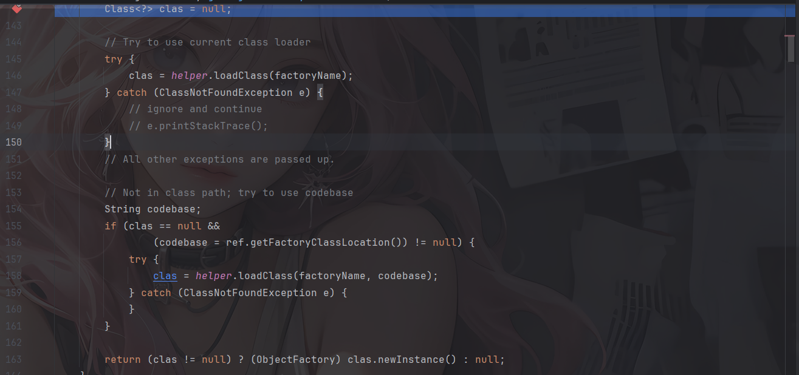
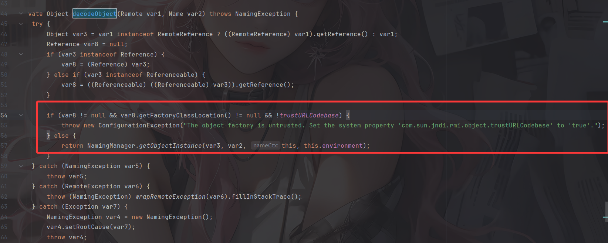
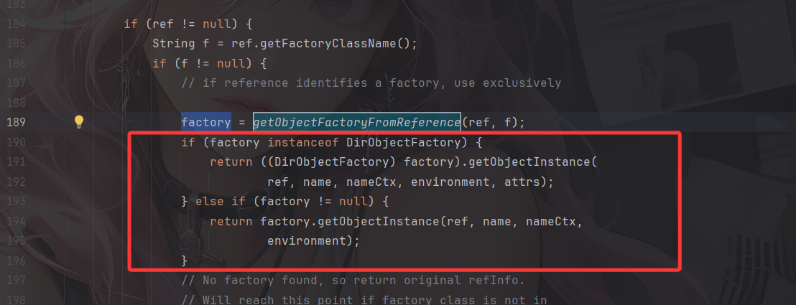
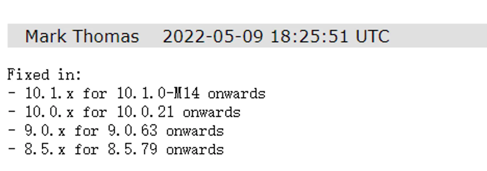

高版本JDK在RMI和LDAP的`trustURLCodebase`都做了限制，从默认允许远程加载ObjectFactory变成了不允许。所以修复后的JDK版本无法在不修改`trustURLCodebase`的情况下通过远程加载ObjectFactory类的方式去执行Java代码。不过绕过的方式也随之出现

# 之前的不行了？

## LDAP修复代码分析

我们看一下 jdk8u191之后的版本对于这个LDAP的JNDI注入漏洞是通过什么手段来修复的。

看到DirectoryManager的getObjectInstance方法

```java
    public static Object
        getObjectInstance(Object refInfo, Name name, Context nameCtx,
                          Hashtable<?,?> environment, Attributes attrs)
        throws Exception {

            ObjectFactory factory;

            ObjectFactoryBuilder builder = getObjectFactoryBuilder();
            if (builder != null) {
                // builder must return non-null factory
                factory = builder.createObjectFactory(refInfo, environment);
                if (factory instanceof DirObjectFactory) {
                    return ((DirObjectFactory)factory).getObjectInstance(
                        refInfo, name, nameCtx, environment, attrs);
                } else {
                    return factory.getObjectInstance(refInfo, name, nameCtx,
                        environment);
                }
            }

            // use reference if possible
            Reference ref = null;
            if (refInfo instanceof Reference) {
                ref = (Reference) refInfo;
            } else if (refInfo instanceof Referenceable) {
                ref = ((Referenceable)(refInfo)).getReference();
            }

            Object answer;

            if (ref != null) {
                String f = ref.getFactoryClassName();
                if (f != null) {
                    // if reference identifies a factory, use exclusively

                    factory = getObjectFactoryFromReference(ref, f);
                    if (factory instanceof DirObjectFactory) {
                        return ((DirObjectFactory)factory).getObjectInstance(
                            ref, name, nameCtx, environment, attrs);
                    } else if (factory != null) {
                        return factory.getObjectInstance(ref, name, nameCtx,
                                                         environment);
                    }
                    // No factory found, so return original refInfo.
                    // Will reach this point if factory class is not in
                    // class path and reference does not contain a URL for it
                    return refInfo;

                } else {
                    // if reference has no factory, check for addresses
                    // containing URLs
                    // ignore name & attrs params; not used in URL factory

                    answer = processURLAddrs(ref, name, nameCtx, environment);
                    if (answer != null) {
                        return answer;
                    }
                }
            }

            // try using any specified factories
            answer = createObjectFromFactories(refInfo, name, nameCtx,
                                               environment, attrs);
            return (answer != null) ? answer : refInfo;
    }
```

首先先从缓存寻找之前是否有加载过的工厂构造类，如果没有的话就直接往下去寻找Reference中的ObjectFactory类，getFactoryClassName用于获取工厂类名，getObjectFactoryFromReference是获取类实例的方法，跟进看看



先是尝试从本地classpath加载，否则获取类的远程地址进行loadClass远程类加载，跟进第二个loadClass看看

```java
    public Class<?> loadClass(String className, String codebase)
            throws ClassNotFoundException, MalformedURLException {
        if ("true".equalsIgnoreCase(trustURLCodebase)) {
            ClassLoader parent = getContextClassLoader();
            ClassLoader cl =
                    URLClassLoader.newInstance(getUrlArray(codebase), parent);

            return loadClass(className, cl);
        } else {
            return null;
        }
    }
```

 对比8u191之前的呢

```java
    public Class<?> loadClass(String className, String codebase)
            throws ClassNotFoundException, MalformedURLException {

        ClassLoader parent = getContextClassLoader();
        ClassLoader cl =
                 URLClassLoader.newInstance(getUrlArray(codebase), parent);

        return loadClass(className, cl);
    }
```

在使用 `URLClassLoader` 加载器加载远程类之前加了个if语句检测，判断trustURLCodebase的值是否为true，这也是高版本之后的对于远程codebase加载factory类的限制，默认是为false的，无法进行远程类加载。

在`com/sun/jndi/cosnaming/CNCtx.class`中可以找到这段代码

```java
static {
        PrivilegedAction var0 = () -> System.getProperty("com.sun.jndi.cosnaming.object.trustURLCodebase", "false");
        String var1 = (String)AccessController.doPrivileged(var0);
        trustURLCodebase = "true".equalsIgnoreCase(var1);
    }

```

默认将 trustURLCodebase 这个属性设置为 false，除非系统在执行代码的时候传入参数设置为 true

## RMI修复代码分析

换成高版本后运行出现报错

```java
Exception in thread "main" javax.naming.ConfigurationException: The object factory is untrusted. Set the system property 'com.sun.jndi.rmi.object.trustURLCodebase' to 'true'.
	at com.sun.jndi.rmi.registry.RegistryContext.decodeObject(RegistryContext.java:495)
	at com.sun.jndi.rmi.registry.RegistryContext.lookup(RegistryContext.java:138)
	at com.sun.jndi.toolkit.url.GenericURLContext.lookup(GenericURLContext.java:205)
	at javax.naming.InitialContext.lookup(InitialContext.java:417)
	at RMITest.JNDIRMIClient.main(JNDIRMIClient.java:8)
```

重点改动还是在decodeObject里面



新增了一段trustURLCodebase的判断，不过这里倒不是最影响的，因为它的判断逻辑是!trustURLCode，而trustURLCodebase默认为flase，所以当这条判断逻辑前面两个，也就是Reference对象不为空，且远程codebase的构造factory的地址也不为空的话，该if判断必过，也就会抛出异常`The object factory is untrusted. Set the system property 'com.sun.jndi.rmi.object.trustURLCodebase' to 'true'.`。这也是RMI在高版本JDK中JNDI注入限制点。

总结一下，RMI和LDAP高版本的限制主要在于

- Ldap的高版本限制在于最后SPI接口功能实现DirectoryManager中的getObjectInstance，嗯准确来说其实还是在NamingManager的getObjectFactoryFromReference方法中的第二个远程类加载loadClass中出现了一个`if ("true".equalsIgnoreCase(trustURLCodebase)) `的判断，由于trustURLCodebase默认是false，所以这里无法通过if
- RMI的高版本限制在于decodeObject方法调用`NamingManager.getObjectInstance`之前做的一个`if (var8 != null && var8.getFactoryClassLocation() != null && !trustURLCodebase) `判断，尽管这里trustURLCodebase能通过判断，但前面会检查是否有指定的远程类加载地址，从而限制了远程类加载

# 如何绕过呢？

## 绕过手法一：本地加载恶意类

其实绕过手段主要有两种，一种是利用第一个loadClass，它会从本地加载类，调用newInstance进行实例化并**强制转化成ObjectFactory类型的对象**后返回



并且在之后会调用到该加载实例化对象的getObjectInstance方法

所以我们是否能找到这么一个恶意 Factory 类，该恶意 Factory 类必须实现 `javax.naming.spi.ObjectFactory` 接口，实现该接口的 getObjectInstance() 方法，并且其中的getObjectInstance()方法能进行一些骚操作呢？

常见的思路是利用 `org.apache.naming.factory.BeanFactory` 这个类来实现

### BeanFactory为什么可以

这个类位于Tomcat8 依赖包中，我们尝试导入依赖

```xml
    <dependency>
      <groupId>org.apache.tomcat.embed</groupId>
      <artifactId>tomcat-embed-core</artifactId>
      <version>8.5.78</version>
    </dependency>
    
    <dependency>
      <groupId>org.apache.tomcat.embed</groupId>
      <artifactId>tomcat-embed-jasper</artifactId>
      <version>8.5.78</version>
    </dependency>
    
    <dependency>
      <groupId>org.apache.tomcat.embed</groupId>
      <artifactId>tomcat-embed-el</artifactId>
      <version>8.5.78</version>
    </dependency>
```

然后我们看看BeanFactory这个类

```java
public class BeanFactory
    implements ObjectFactory {
    @Override
    public Object getObjectInstance(Object obj, Name name, Context nameCtx,
                                    Hashtable<?,?> environment)
        throws NamingException {

        if (obj instanceof ResourceRef) {

            try {

                Reference ref = (Reference) obj;
                String beanClassName = ref.getClassName();
                Class<?> beanClass = null;
                ClassLoader tcl =
                    Thread.currentThread().getContextClassLoader();
                if (tcl != null) {
                    try {
                        beanClass = tcl.loadClass(beanClassName);
                    } catch(ClassNotFoundException e) {
                    }
                } else {
                    try {
                        beanClass = Class.forName(beanClassName);
                    } catch(ClassNotFoundException e) {
                        e.printStackTrace();
                    }
                }
                if (beanClass == null) {
                    throw new NamingException
                        ("Class not found: " + beanClassName);
                }

                BeanInfo bi = Introspector.getBeanInfo(beanClass);
                PropertyDescriptor[] pda = bi.getPropertyDescriptors();

                Object bean = beanClass.getConstructor().newInstance();

                /* Look for properties with explicitly configured setter */
                RefAddr ra = ref.get("forceString");
                Map<String, Method> forced = new HashMap<>();
                String value;

                if (ra != null) {
                    value = (String)ra.getContent();
                    Class<?> paramTypes[] = new Class[1];
                    paramTypes[0] = String.class;
                    String setterName;
                    int index;

                    /* Items are given as comma separated list */
                    for (String param: value.split(",")) {
                        param = param.trim();
                        /* A single item can either be of the form name=method
                         * or just a property name (and we will use a standard
                         * setter) */
                        index = param.indexOf('=');
                        if (index >= 0) {
                            setterName = param.substring(index + 1).trim();
                            param = param.substring(0, index).trim();
                        } else {
                            setterName = "set" +
                                         param.substring(0, 1).toUpperCase(Locale.ENGLISH) +
                                         param.substring(1);
                        }
                        try {
                            forced.put(param,
                                       beanClass.getMethod(setterName, paramTypes));
                        } catch (NoSuchMethodException|SecurityException ex) {
                            throw new NamingException
                                ("Forced String setter " + setterName +
                                 " not found for property " + param);
                        }
                    }
                }

                Enumeration<RefAddr> e = ref.getAll();

                while (e.hasMoreElements()) {

                    ra = e.nextElement();
                    String propName = ra.getType();

                    if (propName.equals(Constants.FACTORY) ||
                        propName.equals("scope") || propName.equals("auth") ||
                        propName.equals("forceString") ||
                        propName.equals("singleton")) {
                        continue;
                    }

                    value = (String)ra.getContent();

                    Object[] valueArray = new Object[1];

                    /* Shortcut for properties with explicitly configured setter */
                    Method method = forced.get(propName);
                    if (method != null) {
                        valueArray[0] = value;
                        try {
                            method.invoke(bean, valueArray);
                        } catch (IllegalAccessException|
                                 IllegalArgumentException|
                                 InvocationTargetException ex) {
                            throw new NamingException
                                ("Forced String setter " + method.getName() +
                                 " threw exception for property " + propName);
                        }
                        continue;
                    }

                    int i = 0;
                    for (i = 0; i<pda.length; i++) {

                        if (pda[i].getName().equals(propName)) {

                            Class<?> propType = pda[i].getPropertyType();

                            if (propType.equals(String.class)) {
                                valueArray[0] = value;
                            } else if (propType.equals(Character.class)
                                       || propType.equals(char.class)) {
                                valueArray[0] =
                                    Character.valueOf(value.charAt(0));
                            } else if (propType.equals(Byte.class)
                                       || propType.equals(byte.class)) {
                                valueArray[0] = Byte.valueOf(value);
                            } else if (propType.equals(Short.class)
                                       || propType.equals(short.class)) {
                                valueArray[0] = Short.valueOf(value);
                            } else if (propType.equals(Integer.class)
                                       || propType.equals(int.class)) {
                                valueArray[0] = Integer.valueOf(value);
                            } else if (propType.equals(Long.class)
                                       || propType.equals(long.class)) {
                                valueArray[0] = Long.valueOf(value);
                            } else if (propType.equals(Float.class)
                                       || propType.equals(float.class)) {
                                valueArray[0] = Float.valueOf(value);
                            } else if (propType.equals(Double.class)
                                       || propType.equals(double.class)) {
                                valueArray[0] = Double.valueOf(value);
                            } else if (propType.equals(Boolean.class)
                                       || propType.equals(boolean.class)) {
                                valueArray[0] = Boolean.valueOf(value);
                            } else {
                                throw new NamingException
                                    ("String conversion for property " + propName +
                                     " of type '" + propType.getName() +
                                     "' not available");
                            }

                            Method setProp = pda[i].getWriteMethod();
                            if (setProp != null) {
                                setProp.invoke(bean, valueArray);
                            } else {
                                throw new NamingException
                                    ("Write not allowed for property: "
                                     + propName);
                            }

                            break;

                        }

                    }

                    if (i == pda.length) {
                        throw new NamingException
                            ("No set method found for property: " + propName);
                    }

                }

                return bean;

            } catch (java.beans.IntrospectionException ie) {
                NamingException ne = new NamingException(ie.getMessage());
                ne.setRootCause(ie);
                throw ne;
            } catch (java.lang.ReflectiveOperationException e) {
                Throwable cause = e.getCause();
                if (cause instanceof ThreadDeath) {
                    throw (ThreadDeath) cause;
                }
                if (cause instanceof VirtualMachineError) {
                    throw (VirtualMachineError) cause;
                }
                NamingException ne = new NamingException(e.getMessage());
                ne.setRootCause(e);
                throw ne;
            }

        } else {
            return null;
        }

    }
}

```

引入了ObjectFactory接口，是ObjectFactory类型的对象

getObjectInstance方法接收一个 `ResourceRef` 对象，通过反射创建对应的 Java Bean，并且会调用 setter 方法为所有的属性赋值，而它有一个 forceString 参数，可以将任意一个方法指定成一个 setter，最后返回配置好的 Bean 实例

详细看一下这里的getObjectInstance方法

### getObjectInstance分析

既然参数都可控的情况下就有了很多方法，比如去调用 `javax.el.ELProcessor#eval`方法或`groovy.lang.GroovyShell#evaluate`方法，从而执行RCE

### 版本限制

一方面是ELProcessor和groovy 依赖的版本限制，比如Tomcat7是没有ELProcessor的

一方面是Tomcat对forceString的修复



这也就是说最常见的 codebase bypass 方法已经无法利用，从而出现了版本的限制
