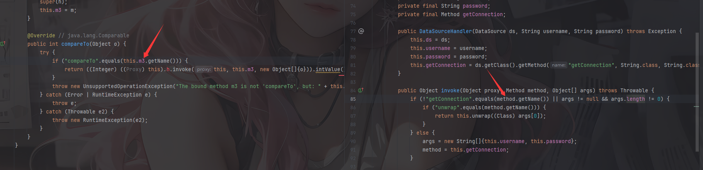

---
title: "HKCERTCTF2025 Labyrinth"
date: 2025-12-24T14:01:55+08:00
summary: "HKCERTCTF2025 Labyrinth"
url: "/posts/Java题目之HKCERTCTF2025-Labyrinth/"
categories:
  - "javasec"
tags:
  - "javasec"
draft: true
---

比赛的时候看了一下这个题，是用的Dubbo hessian，他和之前我分析的Hessian反序列化有点不一样，多了一点原生黑名单

```xml
        <dependency>
            <groupId>org.apache.dubbo</groupId>
            <artifactId>hessian-lite</artifactId>
            <version>4.0.5</version>
        </dependency>
```

原生黑名单在DENY_CLASS

```java
#
#
#   Licensed to the Apache Software Foundation (ASF) under one or more
#   contributor license agreements.  See the NOTICE file distributed with
#   this work for additional information regarding copyright ownership.
#   The ASF licenses this file to You under the Apache License, Version 2.0
#   (the "License"); you may not use this file except in compliance with
#   the License.  You may obtain a copy of the License at
#
#       http://www.apache.org/licenses/LICENSE-2.0
#
#   Unless required by applicable law or agreed to in writing, software
#   distributed under the License is distributed on an "AS IS" BASIS,
#   WITHOUT WARRANTIES OR CONDITIONS OF ANY KIND, either express or implied.
#   See the License for the specific language governing permissions and
#   limitations under the License.
#
#
bsh.
ch.qos.logback.core.db.
clojure.
com.alibaba.citrus.springext.support.parser.
com.alibaba.citrus.springext.util.SpringExtUtil.
com.alibaba.druid.pool.
com.alibaba.hotcode.internal.org.apache.commons.collections.functors.
com.alipay.custrelation.service.model.redress.
com.alipay.oceanbase.obproxy.druid.pool.
com.caucho.config.types.
com.caucho.hessian.test.
com.caucho.naming.
com.ibm.jtc.jax.xml.bind.v2.runtime.unmarshaller.
com.ibm.xltxe.rnm1.xtq.bcel.util.
com.mchange.v2.c3p0.
com.mysql.jdbc.util.
com.rometools.rome.feed.
com.sun.corba.se.impl.
com.sun.corba.se.spi.orbutil.
com.sun.jndi.rmi.
com.sun.jndi.toolkit.
com.sun.org.apache.bcel.internal.
com.sun.org.apache.xalan.internal.
com.sun.rowset.
com.sun.xml.internal.bind.v2.
com.taobao.vipserver.commons.collections.functors.
groovy.lang.
java.awt.
java.beans.
java.lang.ProcessBuilder
java.lang.Runtime
java.rmi.server.
java.security.
java.util.ServiceLoader
java.util.StringTokenizer
javassist.bytecode.annotation.
javassist.tools.web.Viewer
javassist.util.proxy.
javax.imageio.
javax.imageio.spi.
javax.management.
javax.media.jai.remote.
javax.naming.
javax.script.
javax.sound.sampled.
javax.swing.
javax.xml.transform.
net.bytebuddy.dynamic.loading.
oracle.jdbc.connector.
oracle.jdbc.pool.
org.apache.aries.transaction.jms.
org.apache.bcel.util.
org.apache.carbondata.core.scan.expression.
org.apache.commons.beanutils.
org.apache.commons.codec.binary.
org.apache.commons.collections.functors.
org.apache.commons.collections4.functors.
org.apache.commons.codec.
org.apache.commons.configuration.
org.apache.commons.configuration2.
org.apache.commons.dbcp.datasources.
org.apache.commons.dbcp2.datasources.
org.apache.commons.fileupload.disk.
org.apache.ibatis.executor.loader.
org.apache.ibatis.javassist.bytecode.
org.apache.ibatis.javassist.tools.
org.apache.ibatis.javassist.util.
org.apache.ignite.cache.
org.apache.log.output.db.
org.apache.log4j.receivers.db.
org.apache.myfaces.view.facelets.el.
org.apache.openjpa.ee.
org.apache.openjpa.ee.
org.apache.shiro.
org.apache.tomcat.dbcp.
org.apache.velocity.runtime.
org.apache.velocity.
org.apache.wicket.util.
org.apache.xalan.xsltc.trax.
org.apache.xbean.naming.context.
org.apache.xpath.
org.apache.zookeeper.
org.aspectj.
org.codehaus.groovy.runtime.
org.datanucleus.store.rdbms.datasource.dbcp.datasources.
org.dom4j.
org.eclipse.jetty.util.log.
org.geotools.filter.
org.h2.value.
org.hibernate.tuple.component.
org.hibernate.type.
org.jboss.ejb3.
org.jboss.proxy.ejb.
org.jboss.resteasy.plugins.server.resourcefactory.
org.jboss.weld.interceptor.builder.
org.junit.
org.mockito.internal.creation.cglib.
org.mortbay.log.
org.mockito.
org.thymeleaf.
org.quartz.
org.springframework.aop.aspectj.
org.springframework.beans.BeanWrapperImpl$BeanPropertyHandler
org.springframework.beans.factory.
org.springframework.expression.spel.
org.springframework.jndi.
org.springframework.orm.
org.springframework.transaction.
org.yaml.snakeyaml.tokens.
ognl.
pstore.shaded.org.apache.commons.collections.
sun.print.
sun.rmi.server.
sun.rmi.transport.
weblogic.ejb20.internal.
weblogic.jms.common.
```

乍一看过滤的也太多了，后面也是没找到合适的链子去打

最终的链子是这样的

```java
PriorityQueue.readObject()
    └─> heapify() / siftDown()
        └─> Comparable.compareTo()
            └─> CustomProxy.compareTo(o)
                └─> InvocationHandler.invoke(this, m3, {o})
                    └─> DataSourceHandler.invoke()
                        └─> method.invoke(ds, args)
                            └─> ELProcessor.eval(expression)
                                └─> Arbitrary code execution
```

摸索了好一阵也没找到一个比较好的InvocationHandler去打后续的链子，可能还是自己太懒了懒得翻哈哈哈

# 源码分析

先看控制器org.example.labyrinth.controller.ChallengeController

```java
package org.example.labyrinth.controller;

import com.alibaba.com.caucho.hessian.io.Hessian2Input;
import java.io.InputStream;
import javax.servlet.http.HttpServletRequest;
import org.springframework.web.bind.annotation.PostMapping;
import org.springframework.web.bind.annotation.RestController;

@RestController
/* loaded from: Labyrinth-0.0.1-SNAPSHOT.jar:BOOT-INF/classes/org/example/labyrinth/controller/ChallengeController.class */
public class ChallengeController {
    @PostMapping({"/deserialize"})
    public String hessianDeserialize(HttpServletRequest request) {
        try {
            InputStream is = request.getInputStream();
            Hessian2Input input = new Hessian2Input(is);
            input.getSerializerFactory().setAllowNonSerializable(true);
            input.readObject();
            return "success";
        } catch (Exception e) {
            e.printStackTrace();
            return "Error: " + e.getMessage();
        }
    }
}

```

这里有一个多的配置，允许Hessian2反序列化不实现Serializable接口的类

然后看到有一个自定义的proxy代理类org.example.labyrinth.model.CustomProxy

```java
package org.example.labyrinth.model;

import java.lang.reflect.InvocationHandler;
import java.lang.reflect.Method;
import java.lang.reflect.Proxy;

/* loaded from: Labyrinth-0.0.1-SNAPSHOT.jar:BOOT-INF/classes/org/example/labyrinth/model/CustomProxy.class */
public class CustomProxy extends Proxy implements Comparable<Object> {
    private Method m3;

    public CustomProxy(InvocationHandler h) {
        super(h);
    }

    public CustomProxy(InvocationHandler h, Method m) {
        super(h);
        this.m3 = m;
    }

    @Override // java.lang.Comparable
    public int compareTo(Object o) {
        try {
            if ("compareTo".equals(this.m3.getName())) {
                return ((Integer) ((Proxy) this).h.invoke(this, this.m3, new Object[]{o})).intValue();
            }
            throw new UnsupportedOperationException("The bound method m3 is not 'compareTo', but: " + this.m3.getName());
        } catch (Error | RuntimeException e) {
            throw e;
        } catch (Throwable e2) {
            throw new RuntimeException(e2);
        }
    }
}
```

会检查m3是否是compareTo方法，如果是就调用InvocationHandler类型对象的invoke方法，那么这里就需要找到一个合适的InvocationHandler

先看一下如何调用到这个compareTo类吧

# 链子分析

## PriorityQueue.siftDownComparable()

在java.util.PriorityQueue#siftDownComparable方法中

```java
    private void siftDownComparable(int k, E x) {
        Comparable<? super E> key = (Comparable<? super E>)x;
        int half = size >>> 1;        // loop while a non-leaf
        while (k < half) {
            int child = (k << 1) + 1; // assume left child is least
            Object c = queue[child];
            int right = child + 1;
            if (right < size &&
                ((Comparable<? super E>) c).compareTo((E) queue[right]) > 0)
                c = queue[child = right];
            if (key.compareTo((E) c) <= 0)
                break;
            queue[k] = c;
            k = child;
        }
        queue[k] = key;
    }
```

这里有两个地方会调用到compareTo方法，但是其实和CC4之前触发compare方法是一样的

继续回溯就可以拿到这样一条链子

```java
PriorityQueue.readObject()
    └─> heapify() / siftDown(int k, E x)
    	└─> siftDownComparable(int k, E x)
            └─> Comparable.compareTo(T o)
                └─> CustomProxy.compareTo(Object o)
```

然后就看看如何找到一个合适的InvocationHandler去进行后续的getshell

# 一个合适的InvocationHandler

DataSourceHandler是tomcat中org.apache.naming.factory.DataSourceLinkFactory的一个内部类，看一下里面的invoke方法

## DataSourceHandler#invoke

```java
        public Object invoke(Object proxy, Method method, Object[] args) throws Throwable {
            if (!"getConnection".equals(method.getName()) || args != null && args.length != 0) {
                if ("unwrap".equals(method.getName())) {
                    return this.unwrap((Class)args[0]);
                }
            } else {
                args = new String[]{this.username, this.password};
                method = this.getConnection;
            }

            try {
                return method.invoke(this.ds, args);
            } catch (Throwable var5) {
                if (var5 instanceof InvocationTargetException && var5.getCause() != null) {
                    throw var5.getCause();
                } else {
                    throw var5;
                }
            }
        }
```

这里的话有一个难点就是在于method如何让他可控



在org.example.labyrinth.model.CustomProxy#compareTo是要求m3也就是传入的method方法名是compareTo，而org.apache.naming.factory.DataSourceLinkFactory.DataSourceHandler#invoke要想进入else分支去控制method的话就需要让method为getConnection方法

貌似走到一个死胡同里面了？
