---
title: "PHP反序列化"
date: 2025-08-12T12:28:19+08:00
summary: "PHP反序列化"
url: "/posts/PHP反序列化/"
categories:
  - "PHP"
tags:
  - "PHP反序列化"
draft: false
---

## PHP反序列化是什么

知识点:

### 序列化（Serialization）

是将数据结构或对象转换成一种可存储或可传输格式的过程。在序列化后，数据可以被写入文件、发送到网络或存储在数据库中，以便在需要时可以再次还原成原始的数据结构或对象。序列化的过程通常涉及将数据转换成字节流或类似的格式，使其能够在不同平台和编程语言之间进行传输和交换。

### 反序列化（Deserialization）

是序列化的逆过程，即将序列化后的数据重新还原成原始的数据结构或对象。反序列化是从文件、网络数据或数据库中读取序列化的数据，并将其转换回原始形式，以便在程序中进行使用和操作。

反序列化的过程中，unserialize()接收的值(字符串)可控
通过更改这个值，得到所需要的代码
通过调用方法，触发代码执行
魔术方法在特定条件下自动调用相关方法，最终导致触发代码。

### 序列化存储格式

`php`序列化的存储格式是`json`,我们来理解一下这个字符串的格式

首先利用`serialize`生成一个字符串

```php
<?php
class me{
	public $name="meng";
	public $age="19";
    public $languages="CN";
}
echo serialize(new me());
?>
/*
O:2:"Me":3:{s:4:"name";s:4:"meng";s:3:"age";s:2:"19";s:9:"languages";s:2:"CN";}
*/
```

- `O:2:"me"`表示这个是一个对象且类名为`me`,
- `3`表示该类有三个属性
- `s:4:"name";s:3:"meng";`表示第一个属性为字符串，且属性名为`name`,属性值为字符串,属性内容为`meng

一般的序列化字符串的格式是

```
变量类型:类名长度:类名:属性数量:{属性类型:属性名长度:属性名;属性值类型:属性值长度:属性值内容}
```

### 常见的类型标志

| 符号 | 类型描述                                       |
| ---- | ---------------------------------------------- |
| a    | array 数组型                                   |
| b    | boolean 布尔型                                 |
| d    | double 浮点型                                  |
| i    | integer 整数型                                 |
| o    | common object 共同对象                         |
| r    | object reference 对象引用                      |
| s    | non-escaped binary string 非转义的二进制字符串 |
| S    | escaped binary string 转义的二进制字符串       |
| C    | custom object 自定义对象                       |
| O    | class 对象                                     |
| N    | null 空                                        |
| R    | pointer reference 指针引用                     |
| U    | unicode string Unicode 编码的字符串            |

那么我们如果得到一个序列化字符串如何快速的得到原来的内容呢，这就是反序列化了！

```php
<?php
$data='O:2:"Me":3:{s:4:"name";s:4:"meng";s:3:"age";s:2:"19";s:9:"languages";s:2:"CN";}';
var_dump(unserialize($data));
/*
class __PHP_Incomplete_Class#1 (4) {
  public $__PHP_Incomplete_Class_Name =>
  string(2) "me"
  public $name =>
  string(4) "meng"
  public $age =>
  string(2) "18"
  public $languages =>
  string(2) "CN"
}
```

那么我们就得到了这个字符串是如何序列化而来，并且也确实像前面说的一样起到了存储数据的功能

## 成员类型

分为成员属性和成员方法

### 成员属性

- 属性是类中的变量，用于存储类的状态或数据。
- 它们可以是基本数据类型（如整数、浮点数、字符串等），也可以是其他对象或类的实例。
- 属性通常通过访问控制修饰符（如`public`、`protected`、`private`）来定义其访问权限。

### 成员方法

- 方法是类中的函数，用于执行特定的操作或计算。
- 它们可以访问和修改类的属性，也可以执行其他逻辑操作。
- 方法同样可以通过访问控制修饰符来定义其访问权限。

### 访问控制修饰符

> public(公有属性)
>
> protected(受保护的)
>
> private(私有的)

接下来我们分开去解释一下这三种修饰符

public(公有属性)

- 成员可以在类的内部、外部以及任何继承的子类中被访问。
- 默认情况下，如果没有指定访问控制修饰符，成员会被视为`public`

protected(受保护的)

- 成员只能被类的内部、子类以及同一个命名空间内的其他类访问，但不能被类的外部访问。
- 适用于需要在子类中重写的成员。

private(私有的)

- 成员只能被类的内部访问，不能被子类或类的外部访问。
- 适用于不希望被子类继承或外部访问的成员。

为了更好的区分这三种修饰符，我们来举个例子

```php
<?php
class my{
    public $name="meng";
    private $age="19";
    protected $language="CN";
}

$obj = new my();
$data = serialize($obj);
echo $data;
file_put_contents("data.txt", $data);
?>
```

分别设置三种不同的属性，然后将生成的文件放到010中看一下16进制解析

```php
O:2:"my":3:{s:4:"name";s:4:"meng";s:6:"*age";s:2:"19";s:12:"mylanguage";s:2:"CN";}
```

这是得到的序列化后的字符串

但因为三种修饰符不一样，得出来的属性长度和属性名都发生了变化

```
public:
s:3:"age";s:2:"18";
protected:
s:6:"%00*%00age";s:2:"18";
private:
s:13:"%00Me%00languages";s:2:"CN";
```

总结来说就是

```php
public(公有) 
protected(受保护)     // %00*%00属性名
private(私有的)       // %00类名%00属性名
```

介绍完修饰符，我们接下来看看php反序列化中最重要的魔术方法

## 魔术方法

| __construct()  | 构造函数，当一个对象创建时被调用。具有构造函数的类会在每次创建新对象时先调用此方法，所以非常适合在使用对象之前做一些初始化工作 |
| -------------- | ------------------------------------------------------------ |
| __destruct()   | 析构函数，**当一个对象销毁时被调用**。会在到某个对象的所有引用都被删除或者当对象被显式销毁时执行 |
| __toString     | 当一个对象被当作一个字符串被调用，把类当作字符串使用时触发，返回值需要为字符串 |
| __wakeup()     | **调用unserialize()时触发**，反序列化恢复对象之前调用该方法，例如重新建立数据库连接，或执行其它初始化操作。unserialize()会检查是否存在一个__wakeup()方法。如果存在，则会先调用__wakeup()，预先准备对象需要的资源。 |
| __sleep()      | 调用serialize()时触发 ，在对象被序列化前自动调用，常用于提交未提交的数据，或类似的清理操作。同时，如果有一些很大的对象，但不需要全部保存，这个功能就很好用。serialize()函数会检查类中是否存在一个魔术方法__sleep()。如果存在，该方法会先被调用，然后才执行序列化操作。此功能可以用于清理对象，并返回一个包含对象中所有应被序列化的变量名称的数组。如果该方法未返回任何内容，则 NULL 被序列化，并产生一个E_NOTICE级别的错误 |
| __call()       | 在对象上下文中调用不可访问的方法时触发，即当调用对象中不存在的方法会自动调用该方法 |
| __callStatic() | 在静态上下文中调用不可访问的方法时触发                       |
| __get()        | 用于从不可访问的属性读取数据，即在调用私有属性的时候会自动执行 |
| __set()        | 用于将数据写入不可访问的属性                                 |
| __isset()      | 在不可访问的属性上调用isset()或empty()触发                   |
| __unset()      | 在不可访问的属性上使用unset()时触发                          |
| __invoke()     | 当脚本尝试将对象调用为函数时触发                             |

那我们来逐个介绍一下

### __serialize()魔术方法

serialize() 函数会检查类中是否存在一个魔术方法 __serialize() 。如果存在，该方法将在任何序列化之前优先执行。它必须以一个代表对象序列化形式的 键/值 成对的关联数组形式来返回，如果没有返回数组，将会抛出一个 TypeError 错误。

```
如果类中同时定义了 __serialize() 和 __sleep() 两个魔术方法，则只有 __serialize() 方法会被调用。 __sleep() 方法会被忽略掉。
```

### __unserialize魔术方法

unserialize() 检查是否存在具有名为 `__unserialize()`的魔术方法。此函数将会传递从 __serialize() 返回的恢复数组。然后它可以根据需要从该数组中恢复对象的属性。

```
如果类中同时定义了 __unserialize() 和 __wakeup() 两个魔术方法，则只有 __unserialize() 方法会生效，__wakeup() 方法会被忽略。
```

影响版本：此特性自 PHP 7.4.0 起可用。

### __construct()构造方法

构造函数，当一个对象创建时被调用。具有构造函数的类会在每次创建新对象时先调用此方法，所以非常适合在使用对象之前做一些初始化工作

声明格式:

```php
function __construct([参数列表]){
    方法体//通常用来对成员属性进行初始化赋值
}
```

使用构造方法时的注意事项：

1、在同一个类中只能声明一个构造方法，原因是，PHP不支持构造函数重载。

2、构造方法名称是以两个下画线开始的__construct()

举个例子

```php
<?php
class me{
    public $name="men";
    public $age="18";
    public $languages="EN";
    function __construct($name="meng",$age="19",$languages="CN"){
        $this->name=$name;
        $this->age=$age;
        $this->languages=$languages;
        echo "__construct被调用\n";
    }
}
$obj=new me();
echo serialize($obj);
?>
运行结果:
__construct被调用
O:2:"me":3:{s:4:"name";s:4:"meng";s:3:"age";s:2:"19";s:9:"languages";s:2:"CN";}
```

创建对象时被调用并且其中的初始化赋值会直接覆盖最初的赋值

### __destruct()析构方法

析构函数，**当一个对象销毁时被调用**。会在到某个对象的所有引用都被删除或者当对象被显式销毁时执行

- **显式销毁对象**（如使用 `unset()` 函数）时，`__destruct()` 会被立即调用。

- **脚本执行结束时**，PHP 会自动销毁所有对象，触发 `__destruct()` 方法。

  析构方法的声明格式

  ```php
  function __destruct()
  {
   //方法体
  }
  ```

  举个例子

  ```php
  <?php
  class me{
      public $name="men";
      public $age="18";
      public $languages="EN";
      function __construct($name="meng",$age="19",$languages="CN"){
          $this->name=$name;
          $this->age=$age;
          $this->languages=$languages;
          echo "__construct被调用\n";
      }
      function __destruct(){
          echo "__destruct被调用";
      }
  }
  $obj=new me();
  echo serialize($obj);
  echo "\n";
  ?>
  /*
  __construct被调用
  O:2:"me":3:{s:4:"name";s:4:"meng";s:3:"age";s:2:"19";s:9:"languages";s:2:"CN";}
  __destruct被调用
  */
  ```

  析构方法的作用

  ```php
  一般来说，析构方法在PHP中并不是很常用，它属类中可选择的一部分，通常用来完成一些在对象销毁前的清理任务。
  ```

### __toString()方法

当一个对象被当作一个字符串被调用，把类当作字符串使用时触发，返回值需要为字符串

注意：

```
此方法必须返回一个字符串，否则将发出一条 `E_RECOVERABLE_ERROR` 级别的致命错误。
```

警告：

```php
不能在 __toString() 方法中抛出异常。这么做会导致致命错误。
```

举个例子:

```php
<?php
class me{
    public $name="men";
    public $age="18";
    public $languages="EN";
    function __construct(){
        $this->name="meng";
        $this->age="19";
        $this->languages="CN";
        echo "__construct被调用\n";
    }
    public function __toString(){
        return "__toString被调用\n";
    }
}
$obj=new me();
echo $obj;
echo serialize($obj);
echo "\n";
/*
__construct被调用
__toString被调用
O:2:"me":3:{s:4:"name";s:4:"meng";s:3:"age";s:2:"19";s:9:"languages";s:2:"CN";}
```

可以看到，在类实例化成字符串后可以输出"__tostring被调用",但我们将$obj序列化后就会报错显示这个函数必须返回一个字符串

### __sleep()方法

**调用serialize()时触发** ，在对象被序列化前自动调用，常用于提交未提交的数据，或类似的清理操作。同时，如果有一些很大的对象，但不需要全部保存，这个功能就很好用。**serialize()函数会检查类中是否存在一个魔术方法__sleep()。如果存在，该方法会先被调用，然后才执行序列化操作**。此功能可以**用于清理对象**，并返回一个包含对象中所有应被序列化的变量名称的数组。如果该方法未返回任何内容，则 NULL 被序列化，并产生一个E_NOTICE级别的错误

此功能可以用于清理对象，并返回一个包含对象中所有应被序列化的变量名称的数组。

如果该方法未返回任何内容，则 NULL 被序列化，并产生一个 E_NOTICE 级别的错误。

注意：

```php
__sleep() 不能返回父类的私有成员的名字。这样做会产生一个 E_NOTICE 级别的错误。可以用 Serializable 接口来替代。
```

作用：

```php
__sleep() 方法常用于提交未提交的数据，或类似的清理操作。同时，如果有一些很大的对象，但不需要全部保存，这个功能就很好用。
```

```php
<?php
class me{
    public $name="men";
    public $age="18";
    public $languages="EN";
    function __construct(){
        $this->name="meng";
        $this->age="19";
        $this->languages="CN";
        echo "__construct被调用\n";
    }
    function __sleep(){
        echo "__sleep被调用\n";
        return ["name","age"];
    }
}
$obj=new me();
echo serialize($obj);
echo "\n";
?>
/*
__construct被调用
__sleep被调用
O:2:"me":2:{s:4:"name";s:4:"meng";s:3:"age";s:2:"19";}
*/
```

这个魔术方法就是用来控制那些属性可以被序列化,并且是先序列化一步执行

### __call()方法

在对象上下文中调用不可访问的方法时触发，即当调用对象中不存在的方法会自动调用该方法

该方法有两个参数，第一个参数 `$function_name` 会自动接收不存在的方法名，第二个 `$arguments` 则以数组的方式接收不存在方法的多个参数。

__call() 方法的格式：

```php
function __call(string $function_name, array $arguments)
{
    // 方法体
}
```

__call() 方法的作用：

1. 为了避免当调用的方法不存在时产生错误，而意外的导致程序中止，可以使用 __call() 方法来避免。
2. 该方法在调用的方法不存在时会自动调用，程序仍会继续执行下去。

举个例子

```php
<?php
class Person
{                             
    function say()
    {                       
           echo "Hello, world!\n"; 
    }              
    function __call($funName, $arguments)
    { 
          echo "你所调用的函数：" . $funName . "(参数：" ;  // 输出调用不存在的方法名
          print_r($arguments); // 输出调用不存在的方法时的参数列表
          echo ")不存在！<br>\n"; // 结束换行                      
    }                                          
}
$Person = new Person();            
$Person->run("teacher"); // 调用对象中不存在的方法，则自动调用了对象中的__call()方法
$Person->eat("小明", "苹果");             
$Person->say();
/*
你所调用的函数：run(参数：Array
(
    [0] => teacher
)
)不存在！
你所调用的函数：eat(参数：Array
(
    [0] => 小明
    [1] => 苹果
)
)不存在！
Hello, world!
*/
```

### __callStatic()方法

当调用一个不存在的**静态**方法或者是不可访问的**静态**方法时，会触发

静态方法和动态方法的区别

静态方法和动态方法的区别就是，调用方式不同，我们上面所调用的方法都是动态方法，而静态方法是直接利用类名来调用的而不是对象

举个例子

```php
<?php
class me{
    public static function add($a,$b){#静态方法是使用static去定义的
        return $a + $b;
    }
}
echo me::add(2,3);#静态方法直接通过类名去调用
/*
5
*/
#静态方法只能访问类的静态变量和静态方法，不能直接访问类的实例变量或实例方法
```

种就是静态方法的调用，而我们如何去触发这个魔术方法也很简单

```php
<?php
class Demo{
    public static function __callStatic($method, $args){
        echo "callStatic被调用\n";
    }
}
Demo::what(5,10);
//callStatic被调用
```

### __get()方法

读取不可访问或者是不存在的属性时触发，用于从不可访问的属性读取数据，即在调用私有属性的时候会自动执行

举个例子：

```php
<?php
class Person
{
    private $name;
    private $age;
 
    function __construct()
    {
        $this->name = "meng";
        $this->age = "19";
    }
    public function __get($propertyName)
    {  
        echo"__get方法被调用\n";
        return $this->$propertyName;
    }
}
$Person = new Person();   // 通过Person类实例化的对象
echo serialize($Person);
echo "\n";
echo $Person->name;  // 调用私有属性的时候，__get方法被调用
echo "\n"; 
echo $Person->langages;   // 调用不存在的属性时候，__get方法被调用
/*
O:6:"Person":2:{s:12:"Personname";s:4:"meng";s:11:"Personage";s:2:"19";}
__get方法被调用
meng
__get方法被调用
*/
```

### __set()方法

将数据写入不可访问或者不存在的属性，即设置一个类的成员变量，也就是说赋值时触发

举个例子:

```php
<?php
class Person
{
    private $name;
    private $age;
 
    function __construct()
    {
        $this->name = "meng";
        $this->age = "19";
    }
    public function __set($property, $value) {
        $this->$property = $value;
    }
}

$Person=new Person(); 
echo serialize($Person); //输出序列化后的字符串
echo "\n";   
$Person->language = "CN";//设置不存在的属性language的值为CN
$Person->age = 16; //设置不可访问属性age的值为16
echo serialize($Person);; //输出序列化后的字符串
/*
O:6:"Person":2:{s:12:"Personname";s:4:"meng";s:11:"Personage";s:2:"19";}
O:6:"Person":3:{s:12:"Personname";s:4:"meng";s:11:"Personage";i:16;s:8:"language";s:2:"CN";}
*/
```

### __isset()方法

在不可访问的属性上调用isset()或empty()时触发

#### isset()函数

`isset()`是测定变量是否设定用的函数，传入一个变量作为参数，如果传入的变量存在则传回true，否则传回false。

分两种情况，如果对象里面成员是公有的，我们就可以使用这个函数来测定成员属性，如果是私有的成员属性，这个函数就不起作用了，原因就是因为私有的被封装了，在外部不可见。但你只要在类里面加上一个`__isset()`方法就可以在对象的外部使用这个函数了，当在类外部使用`isset()`函数来测定对象里面的私有成员是否被设定时，就会自动调用类里面的`__isset()`方法了帮我们完成这样的操作。

举个例子

```php
<?php
class Person
{
    private $name;
    public $age;
 
    function __construct()
    {
        $this->name = "meng";
        $this->age = "19";
    }
    public function __isset($name) {
        echo "isset被调用了\n";
        echo  isset($this->$name);
    }
}

$a=new Person();
echo isset($a->name);
echo "\n";
echo isset($a->age);
/*
isset被调用了
1
1
*/
```

### __unset()方法

使用 `unset()` 删除一个不存在或不可访问的属性时，`__unset()` 方法会被调用。

这里自然也是分两种情况：

1、 如果一个对象里面的成员属性是公有的，就可以使用这个函数在对象外面删除对象的公有属性。

2、 如果对象的成员属性是私有的，我使用这个函数就没有权限去删除。

同样如果你在一个对象里面加上`__unset()`这个方法，就可以在对象的外部去删除对象的私有成员属性了。在对象里面加上了`__unset()`这个方法之后，在对象外部使用“unset()”函数删除对象内部的私有成员属性时，对象会自动调用`__unset()`函数来帮我们删除对象内部的私有成员属性。

举个例子

```php
<?php
class Person
{
    private $name;
    public $age;
 
    function __construct()
    {
        $this->name = "meng";
        $this->age = "19";
    }
    public function __unset($name) {
        echo "unset被调用了\n";
        unset($this->$name);
    }
}

$a=new Person();
echo serialize($a);
echo "\n";
unset($a->name);
echo serialize($a);
echo "\n";
unset($a->age);
echo serialize($a);

/*
O:6:"Person":2:{s:12:"Personname";s:4:"meng";s:3:"age";s:2:"19";}
unset被调用了
O:6:"Person":1:{s:3:"age";s:2:"19";}
O:6:"Person":0:{}
*/
```

### __invoke()方法

当你尝试将一个对象像函数一样调用时，`__invoke()` 会被触发。

注意：

```php
本特性只在 PHP 5.3.0 及以上版本有效。
```

```php
<?php
class Person
{
    private $name;
    public $age;
 
    function __construct()
    {
        $this->name = "meng";
        $this->age = "19";
    }
    public function __invoke() {
        echo "invoke被调用\n";
    }
}

$a=new Person();
$a(); 
echo serialize($a);
/*
invoke被调用
O:6:"Person":2:{s:12:"Personname";s:4:"meng";s:3:"age";s:2:"19";}
*/
```

接下来我们讲一下一个特别的魔术方法

### __wakeup()方法

**调用unserialize()时触发**，反序列化恢复对象之前调用该方法，例如重新建立数据库连接，或执行其它初始化操作。unserialize()会检查是否存在一个__wakeup()方法。如果存在，则会先调用__wakeup()，预先准备对象需要的资源。

正常来说`wakeup`魔术方法会先被触发，然后再进行反序列化

```php
<?php
class Person
{
    public $sex;
    public $name;
    public $age;
 
    public function __construct()
    {
        $this->name = "meng";
        $this->age  = "19";
        $this->sex  = "男";
    }
    public function __sleep() {
        echo "__sleep()方法被调用\n";
        $this->name ;
        return array('name', 'age'); // 这里必须返回一个数值，里边的元素表示返回的属性名称
    }
 
    /**
     * __wakeup
     */
    public function __wakeup() {
        echo "__wakeup()方法被调用\n";
        $this->age = '18';
        $this->sex = '女';
        // 这里不需要返回数组
    }
}
 
$person = new Person(); // 实例化Person类
echo serialize($person);
$a=unserialize(serialize($person));
var_dump($a);
/*
__sleep()方法被调用
O:6:"Person":2:{s:4:"name";s:4:"meng";s:3:"age";s:2:"19";}__sleep()方法被调用
__wakeup()方法被调用
object(Person)#2 (3) {
  ["sex"]=>
  string(3) "女"
  ["name"]=>
  string(4) "meng"
  ["age"]=>
  string(2) "18"
}
*/
```

由此可见__wakeup方法可以修改属性的值

## 反序列化攻击原理

原理：未对用户输入的序列化字符串进行检测，导致攻击者可以控制反序列化过程，从而导致代码执行，SQL注入，目录遍历等不可控后果。

触发条件：

1. unserialize函数的参数、变量可控
2. php文件中有可利用的类魔术方法，并且能构成一条完整的pop链

**1)我们在反序列化的时候一定要保证在当前的作用域环境下有该类存在**

这里不得不扯出反序列化的问题，这里先简单说一下，反序列化就是将我们压缩格式化的对象还原成初始状态的过程（可以认为是解压缩的过程），因为我们没有序列化方法，因此在反序列化以后我们如果想正常使用这个对象的话我们必须要依托于这个类要在当前作用域存在的条件。

**(2)我们在反序列化攻击的时候也就是依托类属性进行攻击**

因为没有序列化方法，我们只有类的属性可以达到可控，因此类属性就是我们唯一的攻击入口，在我们的攻击流程中，我们就是要寻找合适的能被我们控制的属性，然后利用它本身的存在的方法，在基于属性被控制的情况下发动我们的发序列化攻击

## 姿势一：字符串逃逸

这个可谓是常用的姿势了，那么原理是什么呢，为什么要逃逸字符串呢

引子

在php中，反序列化的过程必须严格按照序列化规则才能实现反序列化

举个例子

```php
<?php
$str = 'a:2:{i:0;s:5:"admin";i:1;s:8:"password";}';
var_dump(unserialize($str));
//输出结果
array(2) {
  [0]=>
  string(5) "admin"
  [1]=>
  string(8) "password"
}
```

一般情况下，按照我们的正常理解，上面例子中变量`$str`是一个标准的序列化后的字符串，按理来说改变其中任何一个字符都会导致反序列化失败。但事实并非如此。如果在`$str`结尾的花括号后加一些字符，输出结果是一样的。

```php
<?php
$str = 'a:2:{i:0;s:5:"admin";i:1;s:8:"password";}123';
var_dump(unserialize($str));
#输出结果依然和上面的相同
```

这就说明了在花括号外面的字符是不会影响字符串本身的反序列化操作的

#### php反序列化的几大特性

1.php在反序列化时，底层代码是以`;`作为字段的分隔，以`}`作为结尾，并且是**根据长度判断内容** ，同时反序列化的过程中必须严格按照序列化规则才能成功实现反序列化 。

- 注意，字符串序列化是以`;}`结尾的，但对象序列化是直接`}`结尾
- php反序列化字符逃逸，就是通过这个结尾符实现的，结尾符后面的内容不会影响php反序列化的结果

2.当长度不对应的时候会出现报错

#### 反序列化字符逃逸

反序列化之所以存在字符串逃逸，最主要的原因是代码中存在针对序列化后的字符串进行了过滤操作（变多或者变少）

反序列化字符逃逸问题根据过滤函数一般分为两种，字符数增多和字符数减少

#### 字符增多

```php
<?php
class name{
    public $username;
    public $password;

    public function __construct($username,$password){
        $this->username=$username;
        $this->password=$password;
    }
}
$str1 = new name("a","b");
echo serialize($str1);
//输出结果:
O:4:"name":2:{s:8:"username";s:1:"a";s:8:"password";s:1:"b";}
```

问：如果我能控制进行反序列化的字符串，该如何使var_dump打印出来的password对应的值是`123456`，而不是`b`？

如果我们之间修改password的值的话，必然会因为字符串的个数不一样而导致报错

- 正常情况下反序列化字符串**$str1**的值为`O:4:"name":2:{s:8:"username";s:1:"a";s:8:"password";s:1:"b";}`

此时我们加上替换函数

```php
<?php
class name{
    public $username;
    public $password;

    public function __construct($username,$password){
        $this->username=$username;
        $this->password=$password;
    }
}
function filter($s){
    return str_replace("x","yy",$s);
}
$str1 = new name("a","b");
```

那么把username的值变为`x`，当完成序列化，filter函数处理后的结果为

```php
O:4:"name":2:{s:8:"username";s:1:"x";s:8:"password";s:1:"b";}//替换前
O:4:"name":2:{s:8:"username";s:1:"yy";s:8:"password";s:1:"b";}//替换后
```

替换成功了，然后我们进行反序列化会发现反序列化失败了，这是因为替换后的字符串的长度不对应导致的

- 所以，我们是否可以利用多出来的字符串做一些坏事？

想要password是`123456`，反序列化化前的字符串要是 `O:4:"name":2:{s:8:"username";s:1:"a";s:8:"password";s:6:"123456";}`

如果说我们输入的是

`O:4:"name":2:{s:8:"username";s:1:"a";s:8:"password";s:6:"123456";}";s:8:"password";s:1:"b";}`

那么此时我们就需要把`";s:8:"password";s:6:"123456";}`给挤出来，让`";s:8:"password";s:1:"b";}`失效，我们该如何构造字符逃逸呢？

已知admin会换成hacker，多出一个字符，我们对比替换前后的字符再加上我们需要构造的序列化字符串

```
O:4:"name":2:{s:8:"username";s:2:"ax";s:8:"password";s:1:"b";}//替换前
O:4:"name":2:{s:8:"username";s:2:"ayy";s:8:"password";s:1:"b";}//替换后
O:4:"name":2:{s:8:"username";s:1:"a";s:8:"password";s:6:"123456";}";s:8:"password";s:1:"b";}//需要构造的序列化字符串
```

那么我们需要逃逸的字符串就是

```
";s:8:"password";s:6:"123456";}//个数为31
```

需要逃逸31个字符，一个x可以换成2个y，多出一个字符，那我们构造31个x，这样替换后多出来的31个y就可以把我们需要逃逸的字符串挤出来

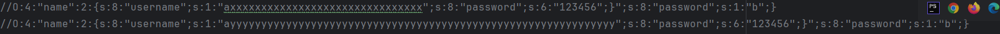

上下进行对比，可以看到username的内容的长度是一致的，此时`s:8:"password";s:6:"123456";}`就替换掉了`s:8:"password";s:1:"b";}`的内容，因为两个变量的长度都是和内容对应一致的，那么此时反序列化操作是不会受影响的，多余的子串会被抛弃

#### 字符减少

```php
<?php
class name{
    public $username;
    public $password;

    public function __construct($username,$password){
        $this->username=$username;
        $this->password=$password;
    }
}
function filter($s){
    return str_replace("xx","y",$s);
}
$str1 = new name("a","b");
```

问：如果我能控制进行反序列化的字符串，该如何使var_dump打印出来的password对应的值是`123456`，而不是`biubiu`？

正常情况下反序列化字符串**$str1**的值为 `O:4:"name":2:{s:8:"username";s:1:"a";s:8:"password";s:1:"b";}`

如果我们的username的值是xx呢？

```
O:4:"name":2:{s:8:"username";s:2:"y";s:8:"password";s:1:"b";}
```

成功替换并且少了一个字符，那么我们该如何利用字符减少的方法去进行字符串逃逸呢？

假如我们需要让password的值为123456，那么我们最终要实现的序列化字符串就是

```
O:4:"name":2:{s:8:"username";s:2:"y";s:8:"password";s:6:"123456";}
```

那么此时我们就需要让`";s:8:"password";s:1:"b";}`失效，我们该如何构造字符逃逸呢？

```
O:4:"name":2:{s:8:"username";s:2:"y";s:8:"password";s:1:"b";}“;s:8:"password";s:6:"123456";}
```

和字符增多不同的是，需要逃逸的字符是不变的，但是我们需要计算的长度是要使之失效的字符的长度

```
";s:8:"password";s:1:"b";}//26个
```

需要替换掉26个字符，已知传入xx会替换成y，减少一个字符，那我们需要让最后的y是26个，那么就需要传入52个x

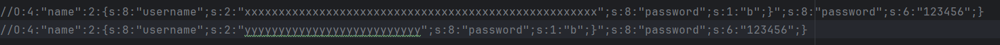

从图中可以看到，username的上下的长度是一样的，所以反序列化不会受影响

#### 总结

- 当字符增多：在输入的时候再加上精心构造的字符。经过过滤函数，字符变多之后，就把我们构造的给挤出来。从而实现字符逃逸
- 当字符减少：在输入的时候再加上精心构造的字符。经过过滤函数，字符减少后，会把原有的吞掉，使构造的字符实现代替

## 姿势二：session反序列化

参考文章：[session反序列化 ](https://www.cnblogs.com/GTL-JU/p/16859098.html)

讲到session反序列化，我们需要先了解什么是session

#### 什么是session

`Session`一般称为“会话控制“，简单来说就是是一种客户与网站/服务器更为安全的对话方式。一旦开启了 `session` 会话，便可以在网站的任何页面使用或保持这个会话，从而让访问者与网站之间建立了一种“对话”机制。不同语言的会话机制可能有所不同，这里我们讲一下PHP session机制

#### PHP session机制

`PHP session`可以看做是一个特殊的变量，且该变量是用于存储关于用户会话的信息，或者更改用户会话的设置，需要注意的是，`PHP Session` 变量存储单一用户的信息，并且对于应用程序中的所有页面都是可用的，且其对应的具体 `session` 值会存储于服务器端，这也是与 `cookie`的主要区别，所以`seesion` 的安全性相对较高。

那我们为什么要用session呢?

我们访问网站的时候使用的协议是http或者https，但是http是一种无状态协议，是没有记忆的，也就是说，每次请求都是独立的，服务器不会记得上一次请求的信息，例如我们在一个web应用程序中的login页面进行了登录，但是这个登录仅仅只是在当前页面上进行的，如果我们访问同一应用上的其他页面，还是会需要我们登录，这就导致了我们重复的进行操作带来的不便性。所以session能用来弥补这个缺点，帮助服务器跟踪用户状态

那session是通过什么来跟踪的呢？这里就用到了sessionID 生成与存储了

当我们首次访问一个网站的时候，此时会话就开始了，就会产生一个独一无二的ID，然后产生了cookie，`cookie`是一个缓存用于一定时间的身份验证，在同一域名下面是全局的，所以说在同一域名下的页面都可以访问到`cookie`,但是大家都知道`cookie`我们是可以进行修改的,这样的话会很不安全，所以就产生了session，但是session是保存在服务器端的，所以`cookie`和`session`有本质的不同

当开始一个会话时，PHP会尝试从请求中查找会话ID，（通常通过会话 `cookie`），如果发现请求的`Cookies`、`Get`、`Pos`t中不存在`session id`，PHP 就会自动调用`php_session_create_id`函数创建一个新的会话，并且在`http response`中通过`set-cookie`头部发送给客户端保存

- **Session**：数据存储在服务器端，客户端仅保存一个唯一的会话 ID，用于与服务器通信。
- **Cookie**：数据存储在客户端浏览器中，服务器不存储这些数据。

#### session的产生和存储

session_start()会创建新会话或者重用现会话。如果会话ID是通过GET,POST或者使用cookie提交，则会重用现有会话

当会话自动开始或者通过session_start()手动开始的时候，PHP内部会调用open和read回调函数，会话处理程序可能是PHP默认的，也可能是扩展提供的，也可能是通过session_set_save_handler()设定的用户自定义会话处理程序。通过read回调函数返回的现有会话数据(使用特殊的序列化格式存储)，PHP会自动反序列化数据并且填充$_SESSION超级全局变量

那我们先来看看存储的路径在哪里:

```PHP
<?php 
highlight_file(__FILE__);
session_start();
echo session_id();
echo "<br>";
echo $_COOKIE["PHPSESSID"];
?>
```

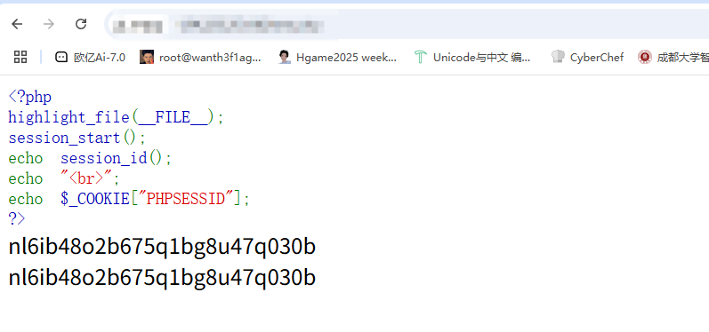

可以看到这里随机生成了一个session_id的，而且生成的session_id会存入到cookie中

然后我们看一下session会保存在哪里，之前我们就讲过，session 是会保存在服务器下的临时目录的，一般都在tmp目录下，或者我们可以在php.ini文件中进行修改

```
Linux下常见的保存位置
/var/lib/php5/sess_PHPSESSID
/var/lib/php7/sess_PHPSESSID
/var/lib/php/sess_PHPSESSID
/tmp/sess_PHPSESSID
/tmp/sessions/sess_PHPSESSED
```

这些是常见的保存位置，那我们接下来看一下php.ini中对session的配置

#### session在php.ini的配置

先看看php.ini中对session的配置

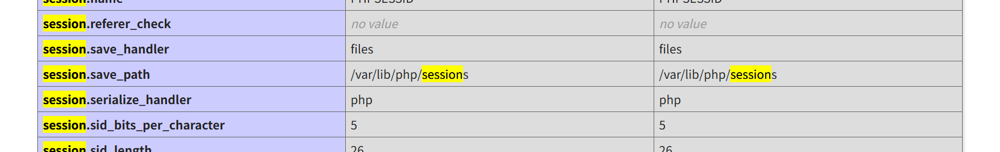

```php
session.save_path = /var/lib/php/sessions#session保存到/var/lib/php/sessions目录
session.save_handler = files#session的存储方式。这里是存储为files类型的文件
session.serialize_handler = php#session默认的序列化引擎是php
session.auto_start = Off#session是否默认打开。即是否默认开启session_start()，如果为On则不需要人为使用session_start()
session.name=PHPSESSID#session默认是以sess_PHPSESSID命名
```

PHP session`的存储机制是由`session.serialize_handler`来定义引擎的，默认是以文件的方式存储，且存储的文件是由`sess_sessionid`来决定文件名的，当然这个文件名也不是不变的，如`Codeigniter`框架的 `session`存储的文件名为`ci_sessionSESSIONID

那这里的PHPSESSID是否是可控的呢？我们在页面下尝试更改一下cookie

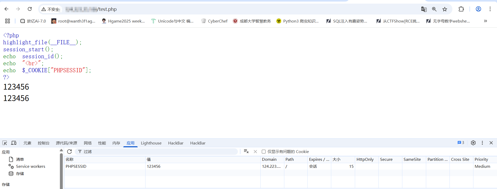

然后我们在本地也可以看到我们的session的文件名发生了改变

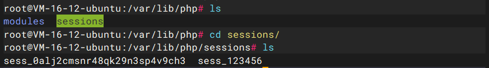

当然文件的内容始终是session的值序列化后的内容

上面也提到了session的序列化引擎，下面介绍了三种引擎

```
php	键名 ＋ 竖线 ＋ 经过 serialize() 函数反序列处理的值
php_binary	键名的长度对应的 ASCII 字符 ＋ 键名 ＋ 经过 serialize() 函数反序列处理的值
php_serialize (php>=5.5.4)	经过 serialize() 函数反序列处理的数组
```

在PHP中默认使用的是PHP引擎，如果要修改为其他的引擎，只需要添加代码ini_set('session.serialize_handler', '需要设置的引擎');。我们尝试一下

PHP引擎

```PHP
<?php 
highlight_file(__FILE__);
ini_set('session.serialize_handler','php');
session_start();
$_SESSION['test']=$_GET['a'];
echo $_SESSION['test'];
echo "<br>";
echo session_id();
echo "<br>";
echo $_COOKIE["PHPSESSID"];
?>
test
123456
123456
```

得到

```php
php:  test|s:4:"test";

php_binary:       tests:4:"test";

php_serialize(php>5.5.4):        a:1:{s:4:"test";s:4:"test";}
```

php_binary中的键名前面的就是键名长度对应的ascii字符，可能显示不出来

#### 反序列化

上面我们具体了解了session的一些配置和基础，然后现在来讲一下session反序列的内容

首先来看一下session的一些相关函数

#### session_start()函数

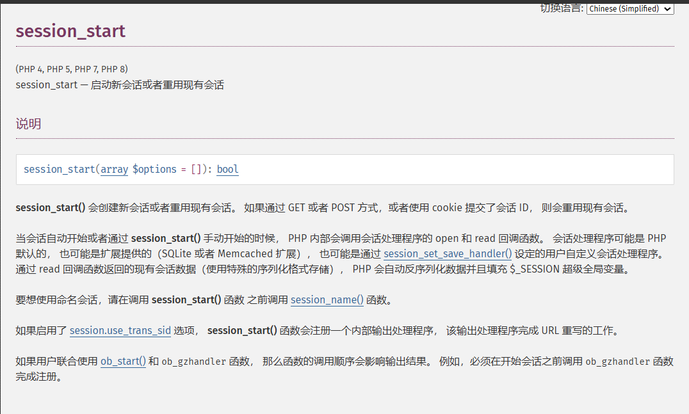

这里关注到一句话：

```
通过 read 回调函数返回的现有会话数据（使用特殊的序列化格式存储）， PHP 会自动反序列化数据并且填充 $_SESSION 超级全局变量。
```

并且这个read回调函数的触发

```
当会话自动开始或者通过 session_start() 手动开始的时候， PHP 内部会调用会话处理程序的 open 和 read 回调函数。
```

也就是说，当会话开始时，session就会通过指定的序列化引擎将`$_SESSION`序列化。然后放入文件进行存储。那么当我们再次开启对话的时候他也会调用read()回调函数进行自动反序列化并填充`$_SESSION`，具体步骤就是

```php
session_start()#session_start()->读取session文件内容->反序列化
$_SESSION['test']='test';#序列化serialize($_SESSION)->存入文件
```

所以session反序列化攻击的方法就是：

#### 攻击原理

我们把恶意数据进行序列化后传入到session_id指定的session 文件中，然后在开启会话的时候就会触发read回调函数，并返回会话数据，php会把我们传入的数据进行反序列化操作，这样就会触发反序列化漏洞。

但是这里的话需要**根据session的序列化引擎去处理我们需要写入session文件的内容**

通过存入文件和反序列化的操作我们可以知道，反序列化的操作往往都是根据页面中指定的序列化引擎也就是local value去进行反序列化操作的，而存入服务器的文件往往都是根据php配置文件中指定的默认引擎的格式去进行存入的，所以我们可以知道，**Session反序列化其实就是序列化引擎不一致导致存在反序列化攻击**

总结来说，PHP`session`反序列化漏洞，是当序列化存储`Session`数据与反序列化读取`Session`数据的方式不同时产生的。

我们本地测试一下

漏洞页面代码

```php
<?php
highlight_file(__FILE__);
ini_set('session.seralize_handler','php');
session_start();
class Test{
    public $test;
    function __wakeup(){
        eval($this->test);
    }
}
?>
```

这里使用的是php反序列化引擎

session传参页面

```php
<?php
highlight_file(__FILE__);
ini_set('session.serialize_handler','php_serialize');
session_start();
if(isset($_GET['test'])){
    $_SESSION['test']=$_GET['test'];
}else {
    echo "请传入参数test";
}
?>
请传入参数test
```

此时我们随便传入1，并看一下session文件的内容

```
a:1:{s:4:"test";s:1:"1";}
```

然后我们尝试对class Test进行序列化操作，反序列化会触发`__wakeup`

```php
<?php
class Test{
    public $test = "phpinfo();";
    function __wakeup(){
        eval($this->test);
    }
}
$a = new Test();
echo serialize($a);
//O:4:"Test":1:{s:4:"test";s:10:"phpinfo();";}
```

但是需要注意的是，在漏洞利用页面使用的是php引擎，如果我们直接传入序列化字符串的话，是并不会触发反序列化漏洞的，因为我们存储session使用的session序列化引擎是session_serialize，跟漏洞利用的引擎不同

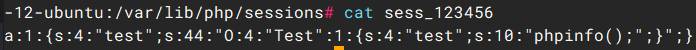

然后我们可以注意到，当引擎是php的时候，php引擎的格式如下

```
php	键名 ＋ | ＋ 经过 serialize() 函数反序列处理的值
```

反序列化处理的是在竖线后面的键值，那么如果我们手动构造一个竖线的话，是否可以让我们竖线后面的序列化字符串实现反序列化操作呢？

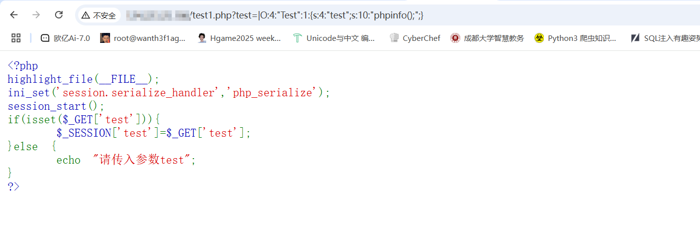

确认内容存入session文件后，我们在漏洞利用页面触发反序列化，刷新一下就行

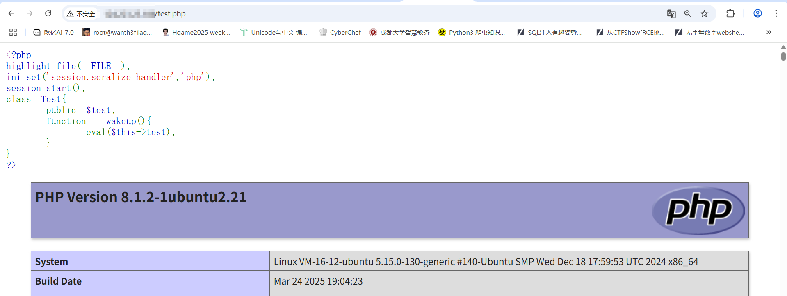

成功反序列化并执行phpinfo函数

然后讲完了session反序列化，这里再讲一个关于文件上传的session反序列化

php中的session.upload_progress

参考师傅文章：https://chenlvtang.top/2021/04/13/PHP%E4%B8%ADsession-upload-progress%E7%9A%84%E5%88%A9%E7%94%A8/

首先我们先关注几个php.ini配置

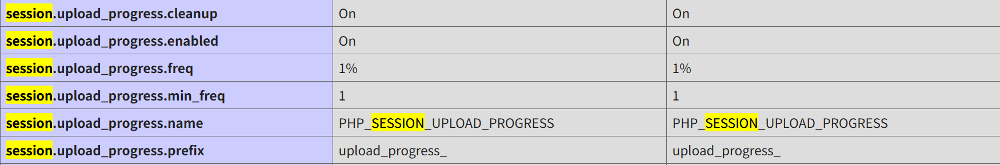

我们逐步解析一下

- `session.upload_progress.enabled = on`

`enabled=on`表示`upload_progress`功能开始，也意味着当浏览器向服务器上传一个文件时，php将会把此次文件上传的详细信息(如上传时间、上传进度等)存储在session当中 ；

- `session.upload_progress.cleanup = on`

`cleanup=on`表示当文件上传结束后，php将会立即清空对应session文件中的内容；有时候开启on如果要打session反序列化的话我们就需要进行条件竞争

- `session.upload_progress.name = "PHP_SESSION_UPLOAD_PROGRESS"`

这个配置定义了在文件上传过程中用于跟踪上传进度的表单字段名。"PHP_SESSION_UPLOAD_PROGRESS"是这个配置项的默认值。它允许服务器端跟踪文件上传的进度。最大的利用点就是它的值是可控的

- `session.upload_progress.prefix = "upload_progress_"`

这个配置定义了用于存储上传进度信息的会话变量的前缀。结合name的话将表示为session中的键名

我们根据官方的测试来试一下

```html
<form action="http://124.223.25.186/test.php" method="POST" enctype="multipart/form-data">
    <input type="hidden" name='PHP_SESSION_UPLOAD_PROGRESS' value="123" />
    <input type="file" name="file" />
    <input type="submit" />
</form>
```

然后session中存储的上传进度内容如下

```php
<?php
$_SESSION["upload_progress_123"] = array(
 "start_time" => 1234567890,   // The request time
 "content_length" => 57343257, // POST content length
 "bytes_processed" => 453489,  // Amount of bytes received and processed
 "done" => false,              // true when the POST handler has finished, successfully or not
 "files" => array(
  0 => array(
   "field_name" => "file1",       // Name of the <input/> field
   // The following 3 elements equals those in $_FILES
   "name" => "foo.avi",
   "tmp_name" => "/tmp/phpxxxxxx",
   "error" => 0,
   "done" => true,                // True when the POST handler has finished handling this file
   "start_time" => 1234567890,    // When this file has started to be processed
   "bytes_processed" => 57343250, // Amount of bytes received and processed for this file
  ),
  // An other file, not finished uploading, in the same request
  1 => array(
   "field_name" => "file2",
   "name" => "bar.avi",
   "tmp_name" => NULL,
   "error" => 0,
   "done" => false,
   "start_time" => 1234567899,
   "bytes_processed" => 54554,
  ),
 )
);
```

这里可以看到session中的field_name和name都是我们可控的

例如我们试一下

漏洞页面代码

```php
<?php
//A webshell is wait for you
ini_set('session.serialize_handler', 'php');
session_start();
class Test
{
    public $name;
    function __destruct()
    {
        eval($this->name);
    }
}
if(isset($_GET['phpinfo']))
{
    $m = new Test();
}
```

这里可以看到，如果我们传入一个phpinfo的话，**当一个对象销毁时被调用会调用__destruct析构方法**，所以会触发phpinfo函数

所以我们只需要改变Test类中的name变量就能触发反序列化进行恶意RCE

因为我们在代码中对引擎进行了处理，这里序列化引擎的局部变量(local value)是`php`，而全局变量`master value`是`php_serialize`，所以才会造成反序列化攻击，然后我们看到`session.upload_progress.enabled`也为开启状态，所以我们就可以利用`upload_progess`来构造一个可控的session。这里还有一个细节就是，`session.uoload_progress.cleanup`要设置为off(默认为on)，这样seesion才不会被自动清除。（如果为on可以利用条件竞争，用burp不断发包）

我这里把cleanup设置为off，这样也方便测试

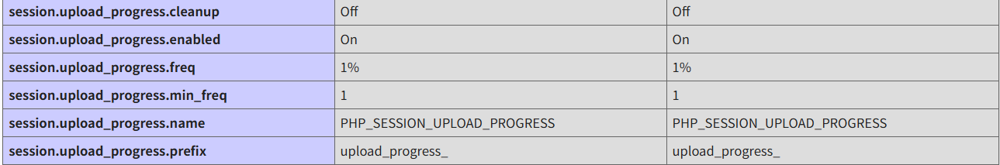

然后我们构造请求包

```html
<form action="测试地址" method="POST" enctype="multipart/form-data">
    <input type="hidden" name='PHP_SESSION_UPLOAD_PROGRESS' value="123" />
    <input type="file" name="file" />
    <input type="submit" />
</form>
```

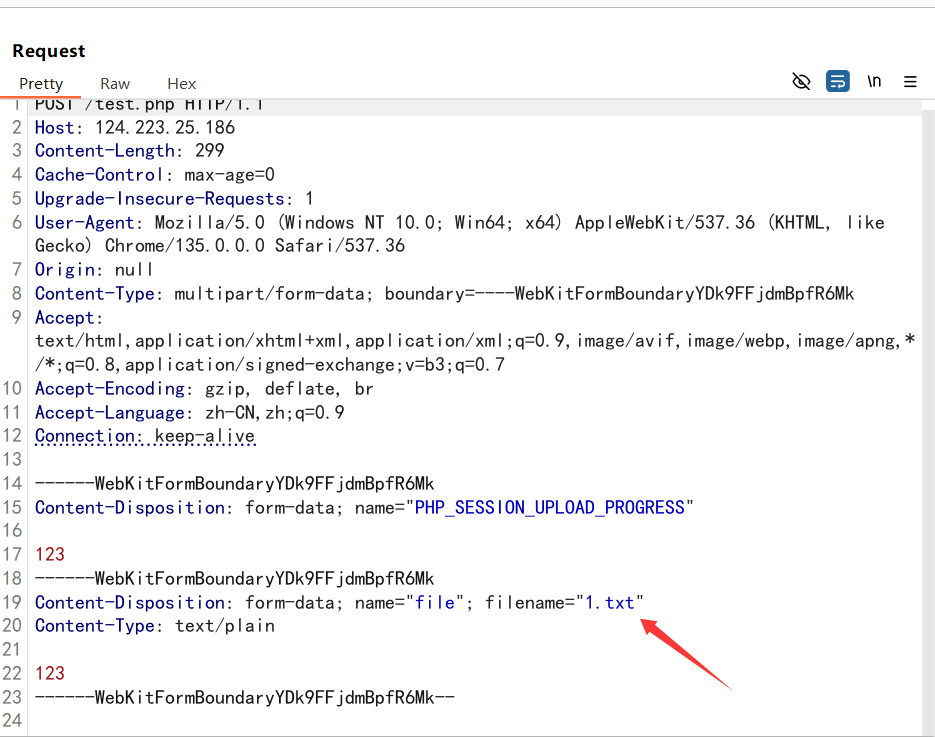

filename就改为我们需要传入的序列化字符串，因为页面中的序列化引擎是php，那么我们传入

```
O:4:"Test":1:{s:4:"name";s:13:"echo `whoami`";}
```

注意转义序列化数据中的双引号，或者filename=使用单引号包裹字符串，然后还需要设置cookie，由于没有 `PHPSESSID`，PHP **不会** 创建或读取 Session 文件。如果我们设置PHPSESSID，由于携带了 `PHPSESSID`，PHP 会尝试读取或创建对应的 Session 文件

另外，如果我们在name中传入序列化字符串也是可以的

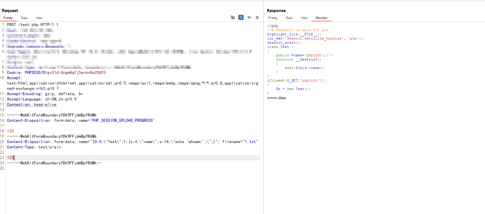

## 关于PHP原生类的利用

### 读取文件

原生类SplFileObject读取文件

这里用php原生类SplFileObject读/flag


SplFileObject 类中的fgets和fread方法都可以读文件，尽管这些方法没有参数，但是filename文件名是在类中确定的，所以直接传文件名就行

### 遍历文件目录

可以遍历文件目录的原生类

```
DirectoryIterator 
FilesystemIterator 
GlobIterator 
```

这三个类可以遍历文件目录，也可以搭配伪协议使用

```php
<?php
highlight_file(__FILE__);
$dir = new DirectoryIterator('.');

foreach($dir as $a ){
    echo $a."<br>";
}
```

这样的话会遍历根目录下的文件
