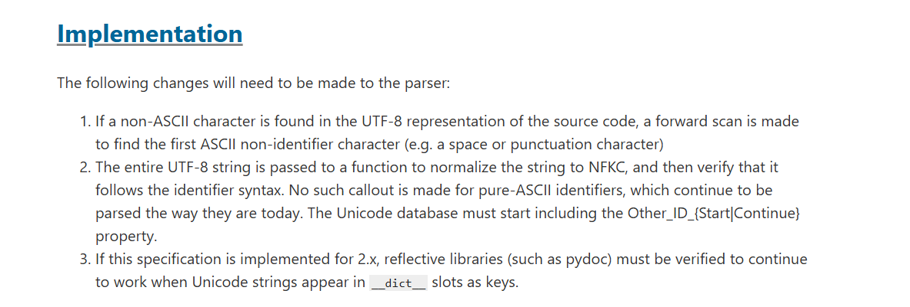
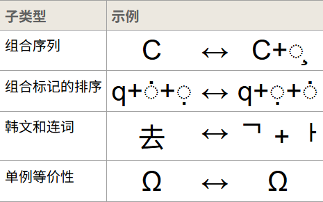
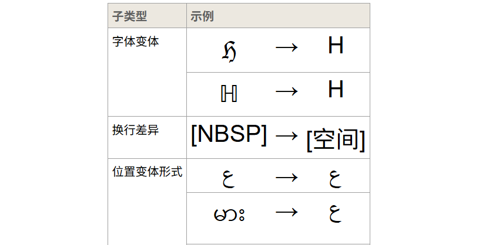

---
title: "Python Unicode字符解析及其利用"
date: 2026-04-24T09:29:59+08:00
lastmod: 2026-04-24T09:29:59+08:00
summary: "Python Unicode字符解析及其利用"
url: "/posts/Python Unicode字符解析及其利用/"
categories:
  - "python"
tags:
  - "Python"
draft: false
---

# 前言

为什么突然想写这么一篇文章呢？其实很简单，一方面是为了复习，另一方面是这两天蹬Agent把博客做了一个迁移，所以刚好水篇文章来测试一下效果。没错，就是这么朴实无华的理由！！！

# Unicode字符解析

先看到infer师傅半年前写的一篇文章：https://infernity.top/2025/09/16/Python-Unicode%E5%AD%97%E7%AC%A6%E6%9C%BA%E5%88%B6%E8%A7%A3%E6%9E%90/

在问题引出中的例子手动跑一下

```python
>>> print("ᵖrint" == "print")
False
>>> ᵖrint(1)
1
>>> print(ᵖrint is print)
True
>>> print(type(ᵖrint))
<class 'builtin_function_or_method'>
```

很明显，除了在字符串比较中`ᵖrint`和`print`是不同的之外，其他的情况都会将`ᵖrint` 解释为print

然后我们参考到官方文档中的解释：https://peps.python.org/pep-3131/

世界上有很多不熟悉英语，甚至不熟悉拉丁字母的人编写 Python 代码。这些开发者通常希望用他们的母语来定义类和函数，而不是费力地为他们想要命名的概念寻找（往往不准确的）英文翻译。使用母语标识符可以提高代码的清晰度和可维护性，尤其对于使用该语言的人来说更是如此。

有些语言存在通用的音译系统（特别是基于拉丁字母的书写系统）。而另一些语言的用户则很难用拉丁字母来书写他们的母语词汇。

其实出发点很简单：很多开发者并不熟悉英文，甚至不习惯拉丁字母。强迫大家把本来很自然的概念硬翻成英文，反而会让代码对本地使用者更难懂。所以 PEP 认为，语言层面应该允许开发者用自己的母语命名。

为了兼容这个问题，PEP提出了解决方案：



解释一下

第一步是词法扫描：

当解析器在源代码的 UTF-8 编码中遇到一个**非 ASCII 字符**时，会向前扫描，直到找到第一个**ASCII 非标识符字符**（比如空格、标点符号等）。这样就能把整个 Unicode 标识符的边界确定下来。

第二步是NFKC 规范化与合法性验证：

整个 UTF-8 字符串会被传递给一个函数，以将其规范化为 NFKC 编码，然后验证其是否符合标识符语法。纯 ASCII 标识符则不会进行此类处理，它们仍按现有方式解析。Unicode 数据库需要引入 `Other_ID_Start` 和 `Other_ID_Continue` 这两个属性，用来扩展哪些字符可以作为标识符的开头或续接部分。

最后是兼容问题：如果这套规范要**向后移植到 Python 2.x**，那么像 `pydoc` 这样依赖反射机制的库必须经过验证，确保当 `__dict__` 的键（key）是 Unicode 字符串时，这些库仍然能正常工作。

在第二步中的`一个函数`其实是Python 解释器在词法分析阶段内部调用的规范化处理机制。不过unicodedata 库的 normalize 方法也能实现类似的功能：

```python
>>> import unicodedata
>>> str0 = "ᵖrint(1)"
>>> str1 = unicodedata.normalize('NFKC', str0)
>>> print(f"原字符串: {str0}")
原字符串: ᵖrint(1)
>>> print(f"规范化后字符串: {str1}")
规范化后字符串: print(1)
>>> exec(str1)
1
>>>
```

当然，也不是所有的特殊字符都能被规范，具体就得看看unicode规范形式了

## Unicode规范

先参考官方文档的内容：https://www.unicode.org/reports/tr15/

这个文档在解决什么问题呢？官方回答是这样的：**本附件描述了 Unicode 文本的规范化形式。当实现方案将字符串保持规范化形式时，可以确保等效字符串具有唯一的二进制表示。**

由于Unicode 里同一个“字符”经常不止一种编码方式。比如一个带重音的字母，既可以是“预组字符”，也可以是“基本字母 + 组合附加符号”。如果系统直接按二进制比较字符串，就会把它们当成不同内容。UAX-15 的作用，就是定义一套“规范化”规则，把等价文本变成可稳定比较的形式。

随后这个附件描述了规范等价性和兼容性等价性以及四种规范化形式，接下来我们逐个阅读

### 字符等价性

Unicode 标准定义了字符之间两种形式上的等价关系： *规范等价性* 以及*兼容性等价性* 。规范等价性是指代表同一抽象字符的字符或字符序列之间的基本等价性，当正确显示时，它们应始终具有相同的视觉外观和行为。而兼容性等效性是一种较弱的等效性，它指的是代表同一抽象字符（或抽象字符序列）但视觉外观或行为可能不同的字符或字符序列之间的等效性。

从官方给出的例子就能明显看出来：






### 规范化形式

Unicode 规范化形式是对 Unicode 字符串的正式定义规范，它使得确定任意两个 Unicode 字符串是否等价成为可能。

有四种规范化形式

| 形式 | 全称                                      | 直觉                               |
| :--- | :---------------------------------------- | :--------------------------------- |
| NFD  | Canonical Decomposition                   | 只做规范分解                       |
| NFC  | Canonical Decomposition + Composition     | 先规范分解，再规范合成             |
| NFKD | Compatibility Decomposition               | 不仅进行规范分解，还进行兼容性分解 |
| NFKC | Compatibility Decomposition + Composition | 规范&兼容分解，然后规范合成        |

四种的解释其实之前BR在先知上也发了一篇精品文章：https://xz.aliyun.com/news/91607

其实区别很简单：

从语义上

- D = Decomposed，分解
- C = Composed，分解后再尽量重组
- K = Compatibility，把“兼容等价”也一起折叠进去

从过程上

- NFD：将所有可分解的字符按规范等价分解为基本字符 + 组合标记，这里只处理“规范等价”。
- NFC：比NFD多了一个规范等价合成的步骤。同样的，它只处理“规范等价”，不动兼容字符。
- NFKD：不仅进行规范分解，还进行兼容性分解
- NFKC：比NFKD多了一个规范等价合成的步骤

让ai写了个例子

```python
import unicodedata

s = "e\u0301 | \u00e9 | \ufb01 | \u2460 | \uff21"

def show(label, text):
    escaped = text.encode("unicode_escape").decode("ascii")
    print(f"{label:<8} {text}")
    print(f"{'':8} {escaped}")

print("原始字符串：")
show("original", s)
print()

for form in ("NFD", "NFC", "NFKD", "NFKC"):
    normalized = unicodedata.normalize(form, s)
    show(form, normalized)
    print()

```

运行结果是：

```python
原始字符串：
original é | é | fi | ① | Ａ
         e\u0301 | \xe9 | \ufb01 | \u2460 | \uff21

NFD      é | é | fi | ① | Ａ
         e\u0301 | e\u0301 | \ufb01 | \u2460 | \uff21

NFC      é | é | fi | ① | Ａ
         \xe9 | \xe9 | \ufb01 | \u2460 | \uff21

NFKD     é | é | fi | 1 | A
         e\u0301 | e\u0301 | fi | 1 | A

NFKC     é | é | fi | 1 | A
         \xe9 | \xe9 | fi | 1 | A
```

- NFD：把规范字符拆开，所以 `é 变成 e + ◌́`
- NFC：把可规范等价的内容合起来，所以两个 `é` 都变成单个字符
- NFKD：除了规范分解，还会进行兼容性分解，所以 `fi -> fi，① -> 1，Ａ -> A`
- NFKC：兼容分解后再重组，所以 `é` 保持合成形式，同时 `fi/①/Ａ `也被折叠

至于哪些字符可以被规范处理后等价于普通字符，可以用这个网站来查询：https://www.compart.com/en/unicode/

# 注意一点

上面也说到了python解释器在词法分析阶段会根据NFKC规范去处理 `UTF-8 字符串标识符`，注意这里是标识符，也就是函数名、变量名、类名、方法名等，所以对于纯字符串来说，python解释器不会自动帮你处理规范问题，这个其实从问题出发点就可以get到为什么了

理解完这个，我们就需要回到最终学习的目的，就是如何利用

# 如何利用

首先需要关注的还是在哪种情况下会做NFKC规范

- compile()
- exec()
- eval() 里的代码部分
- ast.parse()
- 普通变量名、函数名、类名
- 源码里的属性访问 obj.名字
- import 模块名 这种语法级导入

以上这些形式都是会先做NFKC规范再进行利用的，而一些例如getattr、`__import__("名字")`这种搜索字符串的则不会做NFKC规范

## exec()函数中的利用

在`exec()`默认执行环境下，BR师傅做了一些可用的字符替换测试：

| 原始字符 | 变体字符                                                 |
| -------- | -------------------------------------------------------- |
| 0        | ０，𝟎，𝟘，𝟢，𝟬，𝟶，🯰                                     |
| 1        | １，𝟏，𝟙，𝟣，𝟭，𝟷，🯱                                     |
| 2        | ２，𝟐，𝟚，𝟤，𝟮，𝟸，🯲                                     |
| 3        | ３，𝟑，𝟛，𝟥，𝟯，𝟹，🯳                                     |
| 4        | ４，𝟒，𝟜，𝟦，𝟰，𝟺，🯴                                     |
| 5        | ５，𝟓，𝟝，𝟧，𝟱，𝟻，🯵                                     |
| 6        | ６，𝟔，𝟞，𝟨，𝟲，𝟼，🯶                                     |
| 7        | ７，𝟕，𝟟，𝟩，𝟳，𝟽，🯷                                     |
| 8        | ８，𝟖，𝟠，𝟪，𝟴，𝟾，🯸                                     |
| 9        | ９，𝟗，𝟡，𝟫，𝟵，𝟿，🯹                                     |
| A        | ᴬ，Ａ，𝐀，𝐴，𝑨，𝒜，𝓐，𝔄，𝔸，𝕬，𝖠，𝗔，𝘈，𝘼，𝙰             |
| B        | ᴮ，ℬ，Ｂ，𝐁，𝐵，𝑩，𝓑，𝔅，𝔹，𝕭，𝖡，𝗕，𝘉，𝘽，𝙱             |
| C        | ℂ，ℭ，Ⅽ，Ｃ，𝐂，𝐶，𝑪，𝒞，𝓒，𝕮，𝖢，𝗖，𝘊，𝘾，𝙲             |
| D        | ᴰ，ⅅ，Ⅾ，Ｄ，𝐃，𝐷，𝑫，𝒟，𝓓，𝔇，𝔻，𝕯，𝖣，𝗗，𝘋，𝘿，𝙳       |
| E        | ᴱ，ℰ，Ｅ，𝐄，𝐸，𝑬，𝓔，𝔈，𝔼，𝕰，𝖤，𝗘，𝘌，𝙀，𝙴             |
| F        | ℱ，Ｆ，𝐅，𝐹，𝑭，𝓕，𝔉，𝔽，𝕱，𝖥，𝗙，𝘍，𝙁，𝙵                |
| G        | ᴳ，Ｇ，𝐆，𝐺，𝑮，𝒢，𝓖，𝔊，𝔾，𝕲，𝖦，𝗚，𝘎，𝙂，𝙶             |
| H        | ᴴ，ℋ，ℌ，ℍ，Ｈ，𝐇，𝐻，𝑯，𝓗，𝕳，𝖧，𝗛，𝘏，𝙃，𝙷             |
| I        | ᴵ，ℐ，ℑ，Ⅰ，Ｉ，𝐈，𝐼，𝑰，𝓘，𝕀，𝕴，𝖨，𝗜，𝘐，𝙄，𝙸          |
| J        | ᴶ，Ｊ，𝐉，𝐽，𝑱，𝒥，𝓙，𝔍，𝕁，𝕵，𝖩，𝗝，𝘑，𝙅，𝙹             |
| K        | ᴷ，K，Ｋ，𝐊，𝐾，𝑲，𝒦，𝓚，𝔎，𝕂，𝕶，𝖪，𝗞，𝘒，𝙆，𝙺          |
| L        | ᴸ，ℒ，Ⅼ，Ｌ，𝐋，𝐿，𝑳，𝓛，𝔏，𝕃，𝕷，𝖫，𝗟，𝘓，𝙇，𝙻          |
| M        | ᴹ，ℳ，Ⅿ，Ｍ，𝐌，𝑀，𝑴，𝓜，𝔐，𝕄，𝕸，𝖬，𝗠，𝘔，𝙈，𝙼          |
| N        | ᴺ，ℕ，Ｎ，𝐍，𝑁，𝑵，𝒩，𝓝，𝔑，𝕹，𝖭，𝗡，𝘕，𝙉，𝙽             |
| O        | ᴼ，Ｏ，𝐎，𝑂，𝑶，𝒪，𝓞，𝔒，𝕆，𝕺，𝖮，𝗢，𝘖，𝙊，𝙾             |
| P        | ᴾ，ℙ，Ｐ，𝐏，𝑃，𝑷，𝒫，𝓟，𝔓，𝕻，𝖯，𝗣，𝘗，𝙋，𝙿             |
| Q        | ℚ，Ｑ，𝐐，𝑄，𝑸，𝒬，𝓠，𝔔，𝕼，𝖰，𝗤，𝘘，𝙌，𝚀                |
| R        | ᴿ，ℛ，ℜ，ℝ，Ｒ，𝐑，𝑅，𝑹，𝓡，𝕽，𝖱，𝗥，𝘙，𝙍，𝚁             |
| S        | Ｓ，𝐒，𝑆，𝑺，𝒮，𝓢，𝔖，𝕊，𝕾，𝖲，𝗦，𝘚，𝙎，𝚂                |
| T        | ᵀ，Ｔ，𝐓，𝑇，𝑻，𝒯，𝓣，𝔗，𝕋，𝕿，𝖳，𝗧，𝘛，𝙏，𝚃             |
| U        | ᵁ，Ｕ，𝐔，𝑈，𝑼，𝒰，𝓤，𝔘，𝕌，𝖀，𝖴，𝗨，𝘜，𝙐，𝚄             |
| V        | Ⅴ，ⱽ，Ｖ，𝐕，𝑉，𝑽，𝒱，𝓥，𝔙，𝕍，𝖁，𝖵，𝗩，𝘝，𝙑，𝚅          |
| W        | ᵂ，Ｗ，𝐖，𝑊，𝑾，𝒲，𝓦，𝔚，𝕎，𝖂，𝖶，𝗪，𝘞，𝙒，𝚆             |
| X        | Ⅹ，Ｘ，𝐗，𝑋，𝑿，𝒳，𝓧，𝔛，𝕏，𝖃，𝖷，𝗫，𝘟，𝙓，𝚇             |
| Y        | Ｙ，𝐘，𝑌，𝒀，𝒴，𝓨，𝔜，𝕐，𝖄，𝖸，𝗬，𝘠，𝙔，𝚈                |
| Z        | ℤ，ℨ，Ｚ，𝐙，𝑍，𝒁，𝒵，𝓩，𝖅，𝖹，𝗭，𝘡，𝙕，𝚉                |
| _        | ︳，︴，﹍，﹎，﹏，＿                                   |
| a        | ª，ᵃ，ₐ，ａ，𝐚，𝑎，𝒂，𝒶，𝓪，𝔞，𝕒，𝖆，𝖺，𝗮，𝘢，𝙖，𝚊       |
| b        | ᵇ，ｂ，𝐛，𝑏，𝒃，𝒷，𝓫，𝔟，𝕓，𝖇，𝖻，𝗯，𝘣，𝙗，𝚋             |
| c        | ᶜ，ⅽ，ｃ，𝐜，𝑐，𝒄，𝒸，𝓬，𝔠，𝕔，𝖈，𝖼，𝗰，𝘤，𝙘，𝚌          |
| d        | ᵈ，ⅆ，ⅾ，ｄ，𝐝，𝑑，𝒅，𝒹，𝓭，𝔡，𝕕，𝖉，𝖽，𝗱，𝘥，𝙙，𝚍       |
| e        | ᵉ，ₑ，ℯ，ⅇ，ｅ，𝐞，𝑒，𝒆，𝓮，𝔢，𝕖，𝖊，𝖾，𝗲，𝘦，𝙚，𝚎       |
| f        | ᶠ，ｆ，𝐟，𝑓，𝒇，𝒻，𝓯，𝔣，𝕗，𝖋，𝖿，𝗳，𝘧，𝙛，𝚏             |
| g        | ᵍ，ℊ，ｇ，𝐠，𝑔，𝒈，𝓰，𝔤，𝕘，𝖌，𝗀，𝗴，𝘨，𝙜，𝚐             |
| h        | ʰ，ₕ，ℎ，ｈ，𝐡，𝒉，𝒽，𝓱，𝔥，𝕙，𝖍，𝗁，𝗵，𝘩，𝙝，𝚑          |
| i        | ᵢ，ⁱ，ℹ，ⅈ，ⅰ，ｉ，𝐢，𝑖，𝒊，𝒾，𝓲，𝔦，𝕚，𝖎，𝗂，𝗶，𝘪，𝙞，𝚒 |
| j        | ʲ，ⅉ，ⱼ，ｊ，𝐣，𝑗，𝒋，𝒿，𝓳，𝔧，𝕛，𝖏，𝗃，𝗷，𝘫，𝙟，𝚓       |
| k        | ᵏ，ₖ，ｋ，𝐤，𝑘，𝒌，𝓀，𝓴，𝔨，𝕜，𝖐，𝗄，𝗸，𝘬，𝙠，𝚔          |
| l        | ˡ，ₗ，ℓ，ⅼ，ｌ，𝐥，𝑙，𝒍，𝓁，𝓵，𝔩，𝕝，𝖑，𝗅，𝗹，𝘭，𝙡，𝚕    |
| m        | ᵐ，ₘ，ⅿ，ｍ，𝐦，𝑚，𝒎，𝓂，𝓶，𝔪，𝕞，𝖒，𝗆，𝗺，𝘮，𝙢，𝚖       |
| n        | ⁿ，ₙ，ｎ，𝐧，𝑛，𝒏，𝓃，𝓷，𝔫，𝕟，𝖓，𝗇，𝗻，𝘯，𝙣，𝚗          |
| o        | º，ᵒ，ₒ，ℴ，ｏ，𝐨，𝑜，𝒐，𝓸，𝔬，𝕠，𝖔，𝗈，𝗼，𝘰，𝙤，𝚘       |
| p        | ᵖ，ₚ，ｐ，𝐩，𝑝，𝒑，𝓅，𝓹，𝔭，𝕡，𝖕，𝗉，𝗽，𝘱，𝙥，𝚙          |
| q        | ｑ，𝐪，𝑞，𝒒，𝓆，𝓺，𝔮，𝕢，𝖖，𝗊，𝗾，𝘲，𝙦，𝚚                |
| r        | ʳ，ᵣ，ｒ，𝐫，𝑟，𝒓，𝓇，𝓻，𝔯，𝕣，𝖗，𝗋，𝗿，𝘳，𝙧，𝚛          |
| s        | ſ，ˢ，ₛ，ｓ，𝐬，𝑠，𝒔，𝓈，𝓼，𝔰，𝕤，𝖘，𝗌，𝘀，𝘴，𝙨，𝚜       |
| t        | ᵗ，ₜ，ｔ，𝐭，𝑡，𝒕，𝓉，𝓽，𝔱，𝕥，𝖙，𝗍，𝘁，𝘵，𝙩，𝚝          |
| u        | ᵘ，ᵤ，ｕ，𝐮，𝑢，𝒖，𝓊，𝓾，𝔲，𝕦，𝖚，𝗎，𝘂，𝘶，𝙪，𝚞          |
| v        | ᵛ，ᵥ，ⅴ，ｖ，𝐯，𝑣，𝒗，𝓋，𝓿，𝔳，𝕧，𝖛，𝗏，𝘃，𝘷，𝙫，𝚟       |
| w        | ʷ，ｗ，𝐰，𝑤，𝒘，𝓌，𝔀，𝔴，𝕨，𝖜，𝗐，𝘄，𝘸，𝙬，𝚠             |
| x        | ˣ，ₓ，ⅹ，ｘ，𝐱，𝑥，𝒙，𝓍，𝔁，𝔵，𝕩，𝖝，𝗑，𝘅，𝘹，𝙭，𝚡       |
| y        | ʸ，ｙ，𝐲，𝑦，𝒚，𝓎，𝔂，𝔶，𝕪，𝖞，𝗒，𝘆，𝘺，𝙮，𝚢             |
| z        | ᶻ，ｚ，𝐳，𝑧，𝒛，𝓏，𝔃，𝔷，𝕫，𝖟，𝗓，𝘇，𝘻，𝙯，𝚣             |

## bottle框架下SSTI的利用

可以看LamentXu的《聊聊bottle框架中由斜体字引发的模板注入（SSTI）waf bypass》：https://www.cnblogs.com/LAMENTXU/articles/18805019

bottle框架模板解析的函数调用链是这样的：

```python
bottle.template()->SimpleTemplate.render()->self.execute(stdout, env)->exec(self.co, env)
```

重点来看**self.co**的源码

```python
    @cached_property
    def co(self):
        return compile(self.code, self.filename or '<string>', 'exec')
```

继续跟进self.code

```python
    @cached_property
    def code(self):
        source = self.source
        if not source:
            with open(self.filename, 'rb') as f:
                source = f.read()
        try:
            source, encoding = touni(source), 'utf8'
        except UnicodeError:
            raise depr(0, 11, 'Unsupported template encodings.', 'Use utf-8 for templates.')
        parser = StplParser(source, encoding=encoding, syntax=self.syntax)
        code = parser.translate()
        self.encoding = parser.encoding
        return code
```

跟进`touni(source)`

```python
def touni(s, enc='utf8', err='strict'):
    if isinstance(s, bytes):
        return s.decode(enc, err)
    return unicode("" if s is None else s)

```

unicode就是全体str，相当于`str("" if s is None else s)`，所以对于我们的斜体字来说不影响。

后面的流程也就没什么了

总结一下：

**Bottle 自己在模板渲染路径里没有做 Unicode 规范化，也不会主动调用 NFKC；会触发 NFKC 的地方，主要是它把模板生成的 Python 代码交给 Python compile() 时，Python 对“标识符”做的处理。**

其实本质上规范化跟bottle框架是无关的，但是这里单独领出来说是因为在bottle框架下有一些限制

### bottle下的限制性

由于特殊字符经过URL编码之后一个字符都必须以两个编码值表示。但是bottle在解析编码值的时候是按照一个编码值对应一个字符进行解析的。所以往往一个这些字符都会被识别成两个字符。

最终只有两种字符可以做

| 原始字符 | 变体字符 |
| -------- | -------- |
| a        | %aa      |
| o        | %ba      |

但是其实如果可以不使用URL编码的方式将可控输入传入template（上传文件，再渲染文件中的内容形成的SSTI），那就有很多可以替换的了w

## json.loads函数中的利用

json.loads函数在执行过程中会解析unicode格式的数据，也会触发规范化问题，所以也可以用来绕过

```python
import json

def waf(check_str):
    if "os" in check_str:
        return True
    return False

a = '{"payload": "__import__(\'\\u006F\\u0073\').system(\'whoami\')"}'
print(a)

print(waf(a))

b = json.loads(a)
print(b)

/*
{"payload": "__import__('\u006F\u0073').system('whoami')"}
False
{'payload': "__import__('os').system('whoami')"}
*/
```

参考文章：

https://infernity.top/2025/09/16/Python-Unicode%E5%AD%97%E7%AC%A6%E6%9C%BA%E5%88%B6%E8%A7%A3%E6%9E%90/

https://peps.python.org/pep-3131/

https://www.unicode.org/reports/tr31/#Combining_Mark_Mods

https://www.unicode.org/reports/tr15/#Norm_Forms

https://xz.aliyun.com/news/91607

https://www.cnblogs.com/LAMENTXU/articles/18805019

