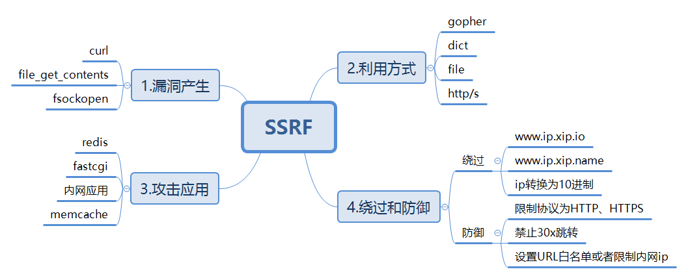
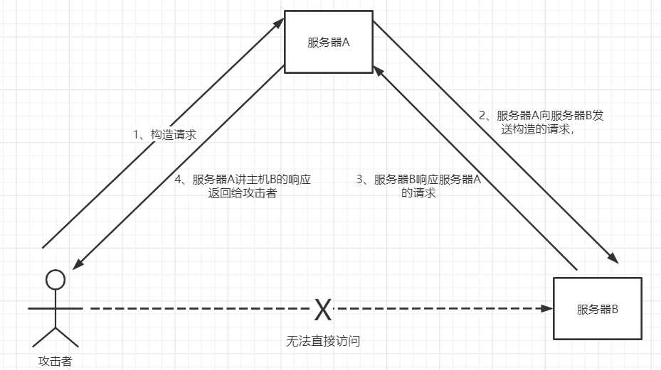
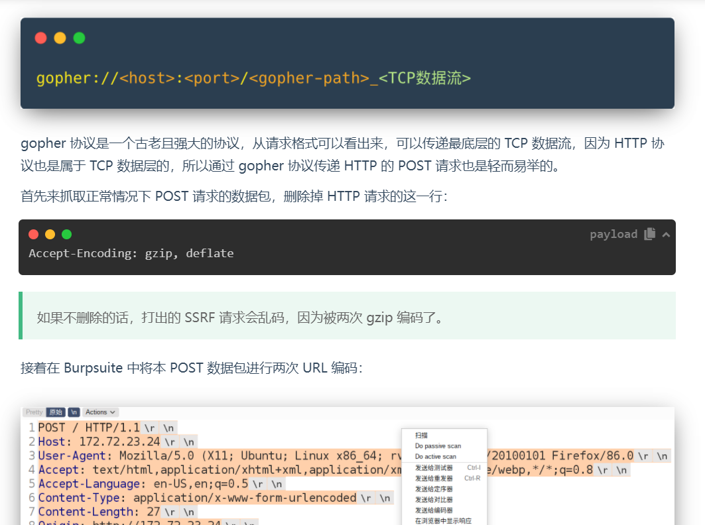
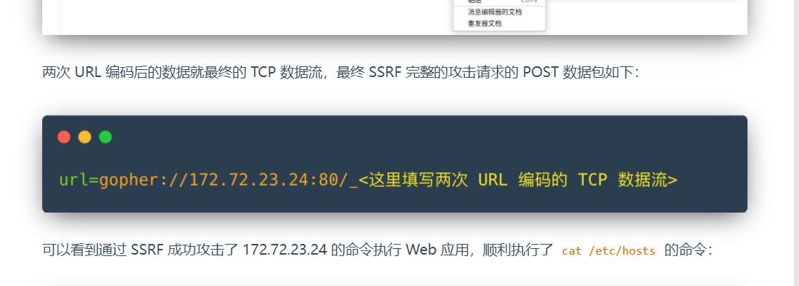
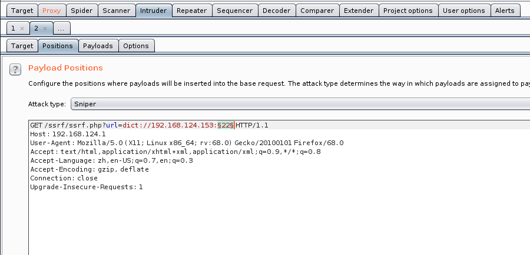

---
title: "SSRF的一些学习"
date: 2025-02-07T13:00:18+08:00
summary: "SSRF的一些学习"
url: "/posts/SSRF的一些学习/"
categories:
  - "CSRF&SSRF"
tags:
  - "SSRF服务器请求伪造"
draft: false
---

# 0x01前言

一腔热血，心血来潮想把之前没学的ssrf的一些知识点学了，也算是搁置了好久才拿起来学的了

# 0x02基础知识



图片来源:[SSRF|Atmujie](https://atmujie.github.io/2021/09/22/SSRF/)

参考文章:

[SSRF-CTF Wiki](https://ctf-wiki.org/web/ssrf/)

[狼组安全团队公知识库](https://wiki.wgpsec.org/knowledge/web/csrf-ssrf.html)

虽然说是介绍一些协议和payload的打法，但基础知识我还是搬过来了，免得看文章的时候反复翻来翻去的看

## 1.SSRF漏洞简介：

SSRF全称：Server-Side Request Forgery，即，服务器端请求伪造。是一个**由攻击者构造请求**，**在目标服务端执行**的一个安全漏洞。攻击者可以利用该漏洞使服务器端向攻击者构造的任意域发出请求，目标通常是从外网无法访问的内部系统。简单来说就是**利用服务器漏洞以服务器的身份发送一条构造好的请求给服务器所能访问到的内网进行攻击**。也正因为请求是由服务端发起的，所以服务端能请求到与自身相连而与外网隔绝的内部系统。也就是说可以利用一个网络请求的服务，**当作跳板**进行攻击。

## 2.主要的攻击方式

当攻击者想要访问服务器B上的服务，但是由于存在防火墙或者服务器B是属于内网主机等原因导致攻击者无法直接访问。如果服务器A存在SSRF漏洞，这时攻击者可以借助服务器A来发起SSRF攻击，通过服务器A向主机B发起请求，达到攻击内网的目的。**此时A被作为中间人（跳板）进行利用。**



## 3.漏洞形成成因

SSRF漏洞形成的原因大都是由于**服务端提供了从其他服务器获取数据的功能但没有对目标地址做过滤与限制**。例如，黑客操作服务端从指定URL地址获取网页文本内容，加载指定地址的图片，下载等，利用的就是服务端请求伪造，SSRF利用存在缺陷的WEB应用作为代理 攻击远程 和 本地的服务器。

## 4.存在漏洞的地方

- 能够对外发起网络请求的地方，就可能存在 SSRF 漏洞
- 从远程服务器请求资源（Upload from URL，Import & Export RSS Feed）
- 数据库内置功能（Oracle、MongoDB、MSSQL、Postgres、CouchDB）
- Webmail 收取其他邮箱邮件（POP3、IMAP、SMTP）
- 文件处理、编码处理、属性信息处理（ffmpeg、ImageMagic、DOCX、PDF、XML）

## 5.SSRF漏洞的检测方法

- 抓包分析发送的请求是否是由服务器发送的
- 从页面源码中查找访问的资源地址

## 6.相关的类和方法

- `file_get_contents`

```php
<?php
    if(isset($_POST['url'])){
        $content = file_get_contents($_POST['url']);
        $filename = './images/'.rand().';img1.jpg';
        echo $_POST['url'];
        $img = "";
    }
	echo $img;
?>
```

这段 PHP 代码的目的是接收用户通过 POST 请求发送的 URL，并尝试从该 URL 获取内容，最后生成一个 HTML `` 标签来显示一张图片。

- `fsockopen()`

`fsockopen()` 是 PHP 中的一个函数，用于打开一个网络连接（套接字）到指定的主机和端口。

```php
<?php 
function GetFile($host,$port,$link) { 
    $fp = fsockopen($host, intval($port), $errno, $errstr, 30); 
    if (!$fp) { 
        echo "$errstr (error number $errno) \n"; 
    } else { 
        $out = "GET $link HTTP/1.1\r\n"; 
        $out .= "Host: $host\r\n"; 
        $out .= "Connection: Close\r\n\r\n"; 
        $out .= "\r\n"; 
        fwrite($fp, $out); 
        $contents=''; 
        while (!feof($fp)) { 
            $contents.= fgets($fp, 1024); 
        } 
        fclose($fp); 
        return $contents; 
    } 
}
?>
```

这段代码使用 `fsockopen` 函数实现获取用户指定 URL 的数据（文件或者 HTML）。这个函数会使用 socket 跟服务器建立 TCP 连接，传输原始数据。


## 8.相关的伪协议

- file 协议结合目录遍历读取文件。
- gopher 协议打开端口。
- dict 协议主要用于结合 curl 攻击。
- http 协议进行内网探测。

讲到了伪协议，我们接下来就是对这些伪协议的讲解了

# 0x03协议

首先最常用的就是我们的file协议了

## file协议

FIle协议也叫**本地文件传输协议** ，主要用于访问本地计算机中的文件，与 HTTP、HTTPS、FTP 等协议不同，`file:///` 主要用于指向计算机上的本地文件，而不是远程服务器上的资源。

### file协议的基本格式

```
file:///文件路径
```

例如我们如果需要读取D盘下txt目录的index.txt文件，那我们就可以通过`file:///D:/index.txt`去进行文件读取

假设我们的站点测出来存在ssrf的话，我们可以先通过例如我们最常见的`file:///etc/passwd`去获取本地的文件信息，它是用于读取Linux系统上的passwd文件，**passwd文件是Linux系统中用于存储用户账户信息的文件**，其中包含了所有用户的用户名、密码和相关配置信息。然后`file:///etc/hosts`去获取本机内网ip信息

权限高的情况下还可以尝试读取 `/proc/net/arp` 或者 `/etc/network/interfaces` 来判断当前机器的网络情况

所以SSRF通常情况下都会造成任意文件读取的危害

这里我之前一直有疑问就是为什么file:///是三个斜杠

首先我们先说什么是URI

## URI是什么

URI（统一资源标识符，Uniform Resource Identifier）是一种用于标识资源的字符串，它可以是一个 URL（统一资源定位符，Uniform Resource Locator），也可以是一个 URN（统一资源名称，Uniform Resource Name）。

URI的结构

```
scheme:[//[user:password@]host[:port]][/]path[?query][#fragment]
```

- 第一个就是协议部分(scheme)，通常常见的就是我们的http,https协议
- 第二个就是authority部分(可选)，通常包括host主机名(或者IP地址)和port可选端口，或者有时候会跟上用户名和密码，例如`username:password@`。
- 第三个就是path部分，通常以/斜杠开头，指向一个资源路径，如/path/to/resource。
- 第四个就是query部分，即查询字符串，也就是我们的传参的参数部分，通常以?问号开头后面跟着参数对，参数之间用&分开。例如?username=admin&password=123456
- 第五个就是fragment部分，用于指向资源的某一部分

所以通常我们的URI都是会以三个斜杠来指向一个特定的资源或者地址的，例如我们自己本地web应用中的index.php文件那么写法就是`http://127.0.0.1/index.php`

- 浏览器通过file://访问文件和http://访问文件的区别

file协议用于访问本地计算机中的文件，好比通过资源管理器中打开文件一样，需要主要的是它是针对本地的，即file协议是**访问你本机的文件资源。**

http访问本地的html文件，相当于**将本机作为了一台http服务器，然后通过localhost访问的是你自己电脑上的本地服务器，再通过http服务器去访问你本机的文件资源。**

再简单点就是file只是简单请求了本地文件，将其作为一个服务器未解析的静态文件打开。而http是在本地搭建了一个服务器再通过服务器去动态解析拿到文件。

## Gopher协议

**`Gopher`**协议是一种通信协议，**用于在Internet 协议网络中分发、搜索和检索文档**。

他可以实现多个数据包整合发送。通过gopher协议可以攻击内网的 FTP、Telnet、Redis、Memcache，也可以进行 GET、POST 请求。

### Gopher协议格式

```
gopher://<host>:<port>/<gopher-path>_<TCP数据流>
```

很多时候在SSRF下，我们无法通过HTTP协议来传递POST数据，这时候就需要用到gopher协议来发起POST请求了

在利用协议进行传参请求以及传递多个参数时需要注意

- 发起POST请求时，多个请求每个请求需要用回车换行需要使用`%0d%0a`代替，结尾也要加上`%0d%0a`
- 参数之间的`&`需要进行URL编码
- 参数以`_`开头 ，否则第一个字符会被吞掉

### 支持Gopher协议的环境

- `PHP —write-curlwrappers且PHP版本至少为5.3`
- `Java 小于JDK1.7`
- `Curl 低版本不支持`
- `Perl 支持`
- `ASP.NET 小于版本3`

注意在使用gopher发送请求的时候需要将构造好的的请求包的内容全部url编码后再进行发送

如果这里使用的是`curl`命令（比如在命令行curl + gopher）url编码一次即可。如果是web端的参数有ssrf，需要url编码两次才可以打进去





### 为什么我们的SSRF中常配合Gopher协议？

以redis产生的SSRF为例，由于Gopher传输的数据是没有任何额外数据的，这样的好处非常的明显，**在我们请求6379端口时，除了我们构造的redis格式的数据外，将不会产生任何Redis无法识别的额外数据，从而可以保证Redis顺利执行我们构造的语句，很显然HTTP做不到这一点。**关于打redis的内容我在讲完dict协议后会进行详细讲解

所以这也提醒了我们，`Gopher`协议除了应用于攻击内网的`Redis`服务器，还有FTP等等服务器也可以尝试，而且拓展来看`Gopher`协议甚至可以用来写入一句话。

## dict协议

DICT 协议（Dictionary Protocol）是一种用于在线字典和词典服务的网络协议。它允许用户通过客户端访问和查询远程字典服务器。Dict服务器和客户机使用TCP端口2628。

**dict协议功能：**

**利用dict协议可以探测端口的开放情况和指纹信息**，但不是所有的端口都可以被探测，一般只能探测出一些带 TCP 回显的端口

dict协议格式

```
dict://serverip:port/命令:参数
```

具体怎么实现探测端口呢?

我们可以用bp进行抓包，抓包后利用dict协议进行访问端口，同样的我们可以利用intruder爆破模块去对端口进行爆破

抓包将端口那设为要爆破的参数



然后用纯数字爆破或者利用端口字典进行爆破，爆破结束后查看回显内容就可以了

dict协议除了可以探测端口以外，还可以进行命令执行，dict协议后跟的命令可以直接被某些服务执行，比如redis
